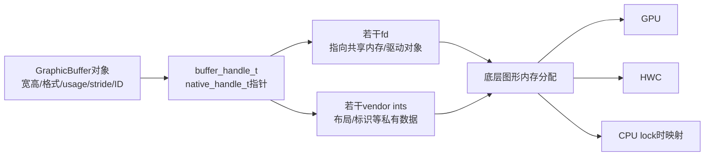
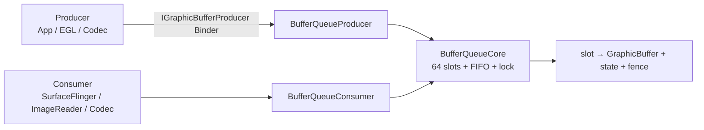
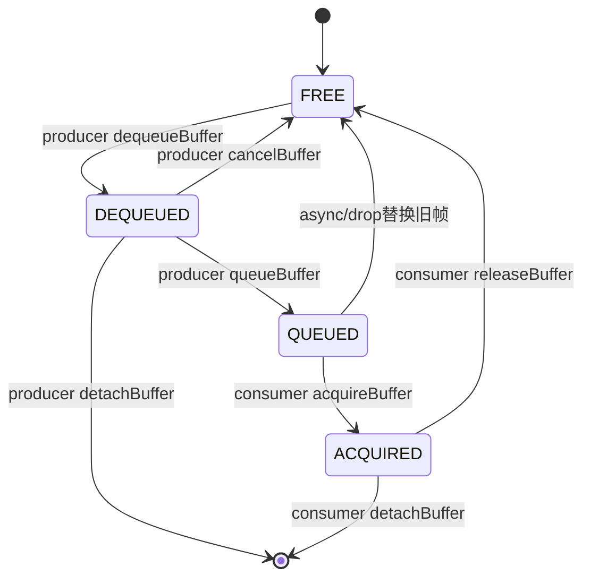
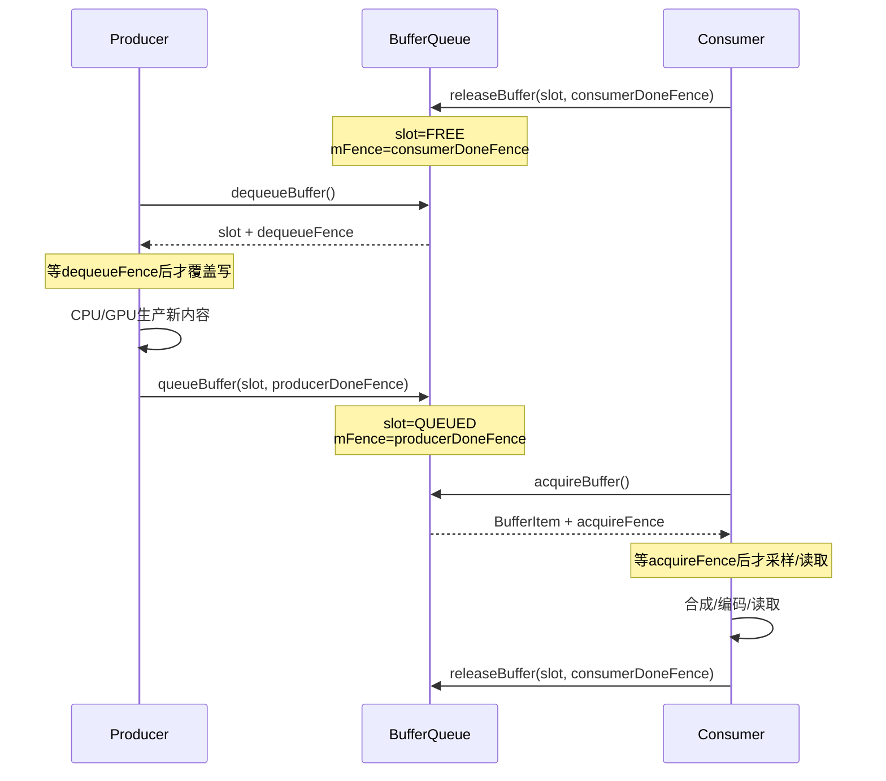

# 162 Android GraphicBuffer、BufferQueue、Gralloc 与 Sync Fence

> 源码版本：Android 11 / API 30 / `android-11.0.0_r48`  
> 学习方式：macOS 只读源码，不要求编译、不要求连接设备  
> 前置章节：第 11、12、21、29、30、66、161 章

---

## 1. 本章要解决什么

第 161 章已经能回答“谁画 Layer、谁 present”，但 `GraphicBuffer` 仍像一个黑盒。继续向下读，会遇到四组经常被混用的概念：

```text
GraphicBuffer：C++对象和buffer元数据
native_handle：可传输的fd/int集合
Gralloc：分配、导入、映射底层图形内存
BufferQueue：在producer与consumer之间循环buffer所有权
Fence：不阻塞传递所有权时附带的完成条件
```

本章解决：

1. `GraphicBuffer` 是像素内存，还是内存的描述对象？
2. `native_handle_t` 里的 fd 与 int 是什么关系？
3. allocator 与 mapper 为什么分成两类 HAL？
4. GraphicBuffer 跨 Binder 后为什么必须 `importBuffer()`？
5. BufferQueue 的 64 个 slot 是否等于始终分配 64 张 buffer？
6. `FREE → DEQUEUED → QUEUED → ACQUIRED → FREE` 每一步谁拥有 slot？
7. 为什么首次 dequeue 后还要 `requestBuffer()`？
8. queue/acquire/release/dequeue 四次操作分别传什么 fence？
9. BufferQueue 为什么通常不替使用者同步等待 fence？
10. async mode 如何丢帧，为什么还要合并 surface damage？
11. generation number、frame number、buffer ID、slot 分别防什么问题？
12. `NO_FENCE` 是错误，还是“无需等待”？

一句话总览：

> GraphicBuffer 封装一份可共享图形分配；BufferQueue 不搬运像素，而是循环 slot 所代表的 buffer 所有权，并用 fence 把“现在交给你，但要等某项工作完成后才能访问”的条件一起交给下一任。

---

## 2. 源码地图

```text
frameworks/native/libs/ui/
├── GraphicBuffer.cpp
├── GraphicBufferAllocator.cpp
├── GraphicBufferMapper.cpp
├── Gralloc2.cpp / Gralloc3.cpp / Gralloc4.cpp
├── Fence.cpp
└── include/ui/
    ├── GraphicBuffer.h
    ├── GraphicBufferAllocator.h
    ├── GraphicBufferMapper.h
    └── Fence.h

frameworks/native/libs/gui/
├── BufferQueue.cpp
├── BufferQueueCore.cpp
├── BufferQueueProducer.cpp
├── BufferQueueConsumer.cpp
├── BufferSlot.cpp
├── Surface.cpp
├── IGraphicBufferProducer.cpp
└── include/gui/
    ├── BufferQueueCore.h
    ├── BufferSlot.h
    └── BufferItem.h

hardware/interfaces/graphics/
├── allocator/4.0/IAllocator.hal
├── mapper/4.0/IMapper.hal
└── common/1.2/types.hal

system/core/libcutils/
├── native_handle.cpp
└── include/cutils/native_handle.h
```

阅读时把对象分成三层：

| 层 | 对象 | 作用 |
|---|---|---|
| 描述层 | `GraphicBuffer` | 尺寸、格式、usage、stride、ID、handle |
| 内存层 | gralloc allocation + imported handle | 真正可被 GPU/HWC/CPU 访问的共享分配 |
| 流转层 | `BufferQueueCore` + slot + `BufferItem` | 所有权、排队、时间戳、裁剪、fence |

---

## 3. GraphicBuffer 不是 `std::vector<Pixel>`

### 3.1 继承关系

`GraphicBuffer` 同时是：

```cpp
class GraphicBuffer :
    public ANativeObjectBase<
        ANativeWindowBuffer,
        GraphicBuffer,
        RefBase>,
    public Flattenable<GraphicBuffer>
```

因此它具备：

- `ANativeWindowBuffer` 所需字段；
- `sp<>` 引用计数；
- Flattenable 跨 Binder 序列化能力。

### 3.2 它保存什么

核心字段可分为公开元数据和私有管理信息：

```text
width / height
stride
format
layerCount
usage
handle

mId
mGenerationNumber
mOwner
mTransportNumFds / mTransportNumInts
```

`handle` 指向 `native_handle_t`；像素内容通常不直接放在 GraphicBuffer C++ 对象内部。

更准确的关系：



vendor handle 的具体 fd/int 布局不是 Framework 通用协议，不能把某一家 gralloc 私有 handle 结构当成所有设备标准。

### 3.3 `GraphicBuffer::mId`

r48 用：

```cpp
uint64_t id =
    static_cast<uint64_t>(getpid()) << 32;
id |= localCounter++;
```

它用于进程内创建时生成较稳定的逻辑标识；flatten 时会传输 ID，所以接收端重建的 GraphicBuffer 保留同一逻辑 ID。

但要区分：

```text
mId                GraphicBuffer逻辑身份
handle指针值        当前进程地址，跨进程无意义
handle里的fd号      当前进程fd表编号，跨进程后数字可变
底层内核对象         fd引用的共享分配
```

不能拿两个进程里的 handle 指针或 fd 数字直接比较 buffer 身份。

### 3.4 `stride` 不一定等于 width

allocator 可为对齐、压缩块或硬件要求增加行间 padding：

```text
width：有效像素列数
stride：相邻行同列之间的像素步长（有定义时）
```

HAL 文档还明确说明某些格式下 stride 没有通用含义。估算内存也不能永远简单写成：

```text
width × height × 4
```

YUV、多平面、压缩格式和 modifier 都可能使公式失效。

---

## 4. `native_handle_t`：可传输资源的容器

### 4.1 数据布局

```cpp
typedef struct native_handle {
    int version;
    int numFds;
    int numInts;
    int data[0];
} native_handle_t;
```

逻辑布局：

```text
data[0 ... numFds-1]              文件描述符
data[numFds ... numFds+numInts-1] 普通整数
```

`buffer_handle_t` 只是：

```cpp
typedef const native_handle_t* buffer_handle_t;
```

它不是一个神秘的像素地址。

### 4.2 clone 为什么不能只 `memcpy`

`native_handle_clone()`：

```cpp
for each fd:
    clone->data[i] = dup(original->data[i]);
copy ordinary ints with memcpy
```

fd 是进程资源引用，必须 `dup()` 才建立独立所有权；普通整数才可直接复制。

### 4.3 close 与 delete 是两件事

```text
native_handle_close() 关闭handle包含的fd
native_handle_delete() 只释放native_handle结构内存
```

仅 delete 会泄漏 fd；仅 close 不释放结构内存。

不过 imported handle 最终通常应交给 mapper 的 `freeBuffer()`，不能无视 HAL 的进程内导入状态而自行套用 close/delete。

---

## 5. allocator 与 mapper 为什么分开

### 5.1 allocator：创建新分配

Gralloc 4 `IAllocator::allocate()` 输入 descriptor 和数量，输出：

```text
Error
stride
raw handles[]
```

descriptor 包含：

```text
name
width / height
layerCount
format
usage
reservedSize
```

它回答：

> 请按这些用途创建新的底层共享图形分配。

### 5.2 mapper：让本进程使用已有分配

`IMapper` 负责：

```text
createDescriptor
importBuffer / freeBuffer
validateBufferSize
getTransportSize
CPU lock / unlock
读取buffer metadata
```

它回答：

> 这个 raw handle 进入当前进程后，怎样变成可安全使用、可验证、可映射的 imported handle？

### 5.3 r48 版本回退

`GraphicBufferAllocator` 和 `GraphicBufferMapper` 都优先尝试：

```text
Gralloc 4 → Gralloc 3 → Gralloc 2
```

若一个支持版本都没有，进程 fatal。

Gralloc 4 mapper 要求 passthrough：

```cpp
if (mMapper->isRemote()) {
    LOG_ALWAYS_FATAL(
        "gralloc-mapper must be in passthrough mode");
}
```

原因是 mapper 返回的 imported handle 和 CPU 映射要在调用进程直接使用。allocator 则可通过 HAL 服务完成实际分配。

### 5.4 分配路径

```text
GraphicBuffer(width,height,...)
→ GraphicBuffer::initWithSize
→ GraphicBufferAllocator::allocate
→ GrallocXAllocator::allocate
→ IMapper::createDescriptor
→ IAllocator::allocate
→ IMapper::importBuffer
→ GraphicBuffer保存imported handle
```

Gralloc 4 的 allocator 返回 raw handle 后，Framework 默认再 import 成当前进程可用 handle。

### 5.5 usage 不是权限注解

usage 同时描述预期访问者和用途，例如：

```text
CPU read/write
GPU texture
GPU render target
HWC
video encoder
protected content
```

allocator 可据此选择内存堆、布局、缓存策略、压缩方式。申请时漏掉 consumer usage，可能得到下游不能访问的布局。

所以 `BufferQueueProducer::dequeueBuffer()` 会：

```cpp
usage |= mCore->mConsumerUsageBits;
```

把 producer 与 consumer 需求合并后再决定是否分配。

---

## 6. GraphicBuffer 的所有权模式

`HandleWrapMethod` 有四类：

| 模式 | 是否复制/导入 | GraphicBuffer 是否负责释放 |
|---|---|---|
| `WRAP_HANDLE` | 直接包已注册 handle | 不负责 |
| `TAKE_HANDLE` | 直接接管已注册 handle | 负责 mapper free |
| `TAKE_UNREGISTERED_HANDLE` | import 后接管 raw handle | 负责 |
| `CLONE_HANDLE` | clone，再 import | 负责 imported handle |

内部 `mOwner` 又区分：

```text
ownNone   不拥有
ownHandle mapper imported handle
ownData   本对象通过allocator创建的分配
```

析构时：

```cpp
if (mOwner == ownHandle)
    mapper.freeBuffer(handle);
else if (mOwner == ownData)
    allocator.free(handle);
```

在 r48 中 allocator free 最终也调用 mapper free，因为分配返回值已经被 import；额外的分配记录表用于 dump 估算。

---

## 7. GraphicBuffer 如何跨 Binder

### 7.1 flatten 传哪些数据

新格式 magic 为 `GB01`，固定 13 个 int word：

```text
magic
width / height / stride / format / layerCount
usage低32位
mId高32位 / 低32位
generation
transport numFds / numInts
usage高32位
后续vendor ints
另一路fd数组
```

重要点：

> flatten 只传 mapper 声明的 transport fd/int 数，不把 imported handle 尾部的进程本地 runtime 数据硬搬到另一进程。

### 7.2 Binder 如何处理 fd

`flatten()` 把 fd 放入 Parcel 的 fd 区域；Binder 传输后，接收进程得到指向同一内核对象的新 fd 引用，fd 数字本身不要求相同。

所以跨进程共享的是底层分配，不是发送进程虚拟地址。

### 7.3 unflatten 后必须 import

接收端先建立 raw native handle，再：

```cpp
mBufferMapper.importBuffer(
    handle, width, height, layerCount,
    format, usage, stride,
    &importedHandle);
```

成功后关闭并删除临时 raw handle，保存 imported handle。

HAL 文档明确规定：

> 从其他进程或 HAL 收到的 raw handle 不能直接访问底层图形 buffer，必须先 import。

### 7.4 安全检查

r48 对传输的 fd/int 数设置小于 4096 的上限，并验证大小，避免恶意数量造成整数溢出或异常分配。

`GraphicBufferMapper::importBuffer()` 还调用 `validateBufferSize()`，至少要保证分配足以支持调用方声称的宽高、格式、usage 与 stride。

### 7.5 兼容旧格式

unflatten 同时接受：

```text
GB01：64-bit usage
GBFR：旧32-bit usage
```

这解释了为何序列化代码不能只按当前 struct 内存布局 `memcpy`。

---

## 8. CPU lock/unlock 与 fence

### 8.1 `lockAsync`

CPU 访问不是直接解引用 handle，而是：

```text
GraphicBuffer::lockAsync
→ GraphicBufferMapper::lockAsync
→ IMapper::lock
→ 返回当前进程CPU虚拟地址
```

调用者传入 acquire fence，表示 CPU 映射访问前必须等待此前设备工作完成。

Gralloc 4 wrapper 把 fence 包成 handle 交给 mapper，并声明即使出错也由该调用消费/关闭传入 fd。

### 8.2 `unlockAsync`

CPU 写完后：

```text
IMapper::unlock
→ 可返回release fence fd
```

若写入实际是异步 cache flush 等工作，下一任必须等待它。

同步 `unlock()` 会在得到有效 fence 后直接 `sync_wait()` 并关闭，于是返回时 CPU 侧完成；异步接口把 fence 交给调用者继续流水线。

### 8.3 protected buffer

`USAGE_PROTECTED` 往往意味着不可普通 CPU 映射。是否支持以及返回什么错误由 allocator/mapper 和设备实现决定，不能假设“有 handle 就能 lock”。

---

## 9. BufferQueue 的三个对象

`BufferQueue::createBufferQueue()` 创建：

```cpp
sp<BufferQueueCore> core;
sp<IGraphicBufferProducer> producer =
    new BufferQueueProducer(core, ...);
sp<IGraphicBufferConsumer> consumer =
    new BufferQueueConsumer(core);
```

它们共享同一个 Core：



对普通 App 窗口：

```text
producer Surface对象在App进程
IGraphicBufferProducer Proxy在App进程
BufferQueueProducer/Core/Consumer通常在SurfaceFlinger进程
```

其他 BufferQueue 的承载进程取决于谁创建 consumer，不能把所有队列都写成位于 SurfaceFlinger。

---

## 10. 64 个 slot 不等于 64 张已分配 buffer

`NUM_BUFFER_SLOTS = 64` 只是映射表容量。

Core 将 slot 分为：

```text
mFreeSlots    FREE且没有GraphicBuffer
mFreeBuffers  FREE且仍挂有GraphicBuffer
mActiveBuffers 非FREE且有buffer
mUnusedSlots  当前最大buffer count之外
mQueue        已queue、待consumer acquire的FIFO
```

构造时只把允许范围内的 slot 放入 free slots，并未给每个 slot 分配像素内存。

实际最大活跃 buffer 数大致受：

```text
maxAcquired + maxDequeued
+ (async或cannotBlock ? 1 : 0)
```

以及 consumer 设置的 `mMaxBufferCount` 上限共同限制。

默认常见概念是“双缓冲/三缓冲”，但不能仅凭 slot 总数或公式断言具体 Surface 始终有几张 buffer；连接模式、consumer 限额和异步设置都会改变它。

## 11. slot 状态机：所有权比队列位置更重要

### 11.1 五种状态

`BufferState` 用计数表达：

| 状态 | shared | dequeueCount | queueCount | acquireCount |
|---|---:|---:|---:|---:|
| FREE | false | 0 | 0 | 0 |
| DEQUEUED | false | 1 | 0 | 0 |
| QUEUED | false | 0 | 1 | 0 |
| ACQUIRED | false | 0 | 0 | 1 |
| SHARED | true | 可组合 | 可组合 | 可组合 |

普通模式主环：



### 11.2 每个状态谁拥有

| 状态 | 逻辑所有者 | 谁能访问内容 |
|---|---|---|
| FREE | BufferQueue | 无一方可随意访问 |
| DEQUEUED | producer | 等 dequeue 返回 fence 后可写 |
| QUEUED | BufferQueue | 只是等待交接，consumer尚未正式拥有 |
| ACQUIRED | consumer | 等 acquire fence 后可读 |
| SHARED | 特殊共享模式 | 可同时具备多种计数，需按特殊约定 |

“在 mQueue FIFO 里”和“slot 处于某状态”相关但不完全等价，shared mode、stale item 和 drop 路径会打破简单的一一想象。

### 11.3 `mFence` 的含义随状态变化

`BufferSlot` 注释非常关键：

```text
FREE:
  consumer读完或producer cancel后的工作何时完成
QUEUED:
  producer填充buffer何时完成
DEQUEUED / ACQUIRED:
  fence已随所有权交给下一任，slot内部重置NO_FENCE
```

所以 `mFence` 不是固定叫“release fence”或“acquire fence”的槽位。

更好的理解：

> 它保存当前 slot 下一次所有权交接需要携带的“上一任完成条件”。

---

## 12. 第一次 dequeue 为什么有两步

### 12.1 `dequeueBuffer()` 先返回 slot

Producer 请求宽高、格式、usage。Core：

1. 合并 consumer usage；
2. 选已有 free buffer，优先复用；
3. 没有则选 empty free slot；
4. 检查是否需要 reallocate；
5. 把状态改为 DEQUEUED；
6. 返回 slot、fence、buffer age 和 flags。

若需新分配：

```cpp
returnFlags |= BUFFER_NEEDS_REALLOCATION;
```

分配本身会暂时退出 Core 主锁，以免昂贵 HAL 调用长期阻塞所有队列操作；`mIsAllocating` 保证 producer 不并行改 free slots。

### 12.2 Surface 再 `requestBuffer(slot)`

App 进程的 `Surface` 有自己的：

```text
slot → sp<GraphicBuffer>
```

缓存。若：

```text
BUFFER_NEEDS_REALLOCATION
或本地slot缓存为空
```

它才调用 Binder `requestBuffer(slot)` 取得完整 GraphicBuffer。

之后同一个 slot 继续复用时，dequeue 常规只需传：

```text
slot + fence + age + flags
```

无需每帧重复 flatten native handle。

### 12.3 为什么 `requestBufferCalled` 要记账

Core 要求 producer queue 前已经 request 过该 slot 的 buffer。`mRequestBufferCalled` 能发现错误 producer：

```text
dequeue得到slot
却没有取得对应GraphicBuffer
仍试图queue
```

这不是所有权本身必需，却是重要的协议一致性检查。

### 12.4 reallocation 的触发

典型条件：

```text
width变化
height变化
format变化
layerCount变化
usage新增了原buffer不具备的bit
protected bit变化
```

`needsReallocation()` 对 usage 采用：

```cpp
(allocatedUsage & requestedUsage) != requestedUsage
```

原分配 usage 是新请求的超集时可以复用；但 protected bit 要精确匹配，不能把普通和受保护分配混用。

---

## 13. Producer 路径：dequeue、写、queue

### 13.1 dequeue 选择顺序

普通 dequeue 优先：

```text
mFreeBuffers中已有分配
→ mFreeSlots中空slot并允许allocation
→ 没有则等待/超时/WOULD_BLOCK
```

这减少重新分配。

producer 不能超过 `mMaxDequeuedBufferCount`。不过该检查只在队列已经成功 queue 过至少一帧后启用，允许初始化阶段建立所需 buffer。

### 13.2 dequeue fence

FREE slot 里的 `mFence` 通常来自 consumer 上次 release。dequeue 时：

```cpp
*outFence = mSlots[found].mFence;
mSlots[found].mFence = Fence::NO_FENCE;
```

producer 获得所有权，但要等该 fence 后才能覆盖写 buffer。

注意：

> `dequeueBuffer()` 返回并不等于旧 consumer 已经完成；返回 fence 正是为了把等待推迟到真正写入前，让 CPU/GPU 流水线继续。

### 13.3 queue 输入

producer 写完后构造 `QueueBufferInput`，包括：

```text
requested present timestamp
auto timestamp标记
dataspace
crop
scaling mode
transform / sticky transform
写完成fence
surface damage
HDR metadata
是否请求frame timestamps
```

这里变量叫 `acquireFence`，因为它是下一任 consumer 的 acquire 条件。

### 13.4 queue 状态变化

```cpp
mSlots[slot].mFence = acquireFence;
mSlots[slot].mBufferState.queue();
++mFrameCounter;
mSlots[slot].mFrameNumber = currentFrameNumber;
```

然后建立 `BufferItem` 放入 FIFO，通知 consumer `onFrameAvailable()` 或 `onFrameReplaced()`。

callback 在 Core 主锁外执行，以免 consumer 回调反向进入队列造成锁问题；另用 callback ticket 保证多 producer 调用产生的回调顺序。

### 13.5 EGL producer 的节流

若连接 API 是 EGL，queue 返回前可能等待上一张 queued fence：

```cpp
lastQueuedFence->waitForever(
    "Throttling EGL Production");
```

源码说明这是让最多两张完整 buffer 在排队，而不让第三张无界领先，在吞吐与延迟间偏向延迟。

这不是 BufferQueue 每次 queue 都等待“本帧 fence”；只针对 EGL 路径的上一 queue fence 节流。

---

## 14. Consumer 路径：acquire、读、release

### 14.1 acquire 上限允许暂时多 1

consumer 通常最多持有 `mMaxAcquiredBufferCount`，但 `acquireBuffer()` 允许达到 `max + 1` 之前再获取一张。

用途是支持原子式：

```text
先acquire新buffer完成设置
再release旧buffer
```

例如纹理消费者更新时，可避免先释放旧内容后新内容设置失败造成空窗。

这不是允许长期多持有一张。

### 14.2 acquire 的结果

从 FIFO 取 front 后：

```cpp
mBufferState.acquire();
mSlots[slot].mFence = Fence::NO_FENCE;
```

`BufferItem` 携带 producer queue 的写完成 fence，consumer 必须等它再读。

BufferQueue 本身通常不在 Core 锁内替 consumer 等待；否则一个慢 GPU fence 会堵住所有 queue/dequeue 状态操作。

### 14.3 为什么后续 acquire 可不给 GraphicBuffer

`mAcquireCalled` 表示 consumer 已见过该 slot 的 buffer。

第一次：

```text
BufferItem含GraphicBuffer
consumer建立本地slot映射
```

后续同 slot：

```cpp
if (outBuffer->mAcquireCalled) {
    outBuffer->mGraphicBuffer = nullptr;
}
```

只传 slot、metadata 与 fence，减少 Binder flatten/import 流量。consumer 必须维护可靠的 slot cache。

### 14.4 release

consumer 使用完后：

```cpp
mSlots[slot].mFence = releaseFence;
mSlots[slot].mBufferState.release();
mFreeBuffers.push_back(slot);
notify producer;
```

release fence 表示 consumer 的读/设备工作何时结束。slot 已变 FREE，但下一次 producer dequeue 得到它时仍需等待该 fence。

因此：

```text
FREE是逻辑所有权空闲
≠ 底层硬件工作必然已经signal
```

这正是 fence 能让状态流转与硬件完成解耦的价值。

### 14.5 stale frame number

`releaseBuffer(slot, frameNumber, ...)` 会检查当前 slot frame number。

若 slot 已被重分配或代表另一代 frame，旧 release 返回：

```text
STALE_BUFFER_SLOT
```

shared buffer 例外，因为它可在 queue/acquire 同时发生，frame number 容易按设计不同步。

---

## 15. 一轮完整 fence 接力



同一个 fence 在不同接口处的称呼取决于角色：

| 来源 | 在下一接口中的名字 |
|---|---|
| consumer 完成 fence | producer dequeue fence |
| producer 完成 fence | consumer acquire fence |
| GPU client target ready fence | HWC client target acquire fence |

名字不是对象固有类型，而是当前所有权交接中的方向语义。

---

## 16. async/drop：为什么可以丢帧

### 16.1 droppable 条件

`BufferItem.mIsDroppable` 在这些情况可为 true：

```text
async mode
consumer是SurfaceFlinger且双方允许drop
legacy buffer drop条件
shared buffer slot
```

若队列尾项可丢，新 queue 的 item 可覆盖尾项，而不是继续增长 FIFO。

被替换旧 slot 从 QUEUED 回 FREE，producer 可收到 buffer released 通知。

### 16.2 为什么要合并 surface damage

旧帧没显示，但它声明的局部变化可能仍需要反映到新帧。

所以 drop 时：

```cpp
newDamage |= droppedDamage;
```

若任一 damage 是 `INVALID_REGION`（表示全区域/未知），合并结果也变为 invalid/full。

否则 consumer 若只重绘新帧声明的小区域，可能把被丢帧独有的更新永久漏掉。

### 16.3 acquire 也可能按时间戳丢旧帧

consumer 提供 `expectedPresent` 时，如果 queue 至少两项，后一个 buffer 的 desired present 合理且已到期，acquire 可循环丢掉更旧的 front。

但源码留有 TODO：

```text
可能还应检查后一个buffer的fence是否已signal
```

r48 当前判定主要基于时间戳和 frame 上限，不先要求候选下一帧 fence signal。因此应表述为“允许选择更新、更合时的帧”，不能写成“只丢已经完全准备好的帧”。

### 16.4 `PRESENT_LATER`

若 front 的 desired timestamp 尚未来到，或超过 `maxFrameNumber`，acquire 返回 `PRESENT_LATER`，没有改变所有权。

它和 `NO_BUFFER_AVAILABLE` 不同：

```text
NO_BUFFER_AVAILABLE：没有可取帧
PRESENT_LATER：有帧，但现在不该取
```

---

## 17. 四种标识不要混

| 标识 | 作用域 | 主要用途 |
|---|---|---|
| slot index | 单个 BufferQueue 映射表 | 避免每帧重传完整 GraphicBuffer |
| `GraphicBuffer::mId` | 逻辑 buffer 身份，序列化保留 | cache、trace、死亡通知 |
| frame number | 单队列成功 queue 的递增代际 | 时间线、stale release、buffer age |
| generation number | 队列连接/attach 兼容代际 | 阻止旧队列 buffer attach 到新代际 |

### 17.1 generation number

新分配后，Core 设置：

```cpp
graphicBuffer->setGenerationNumber(
    mCore->mGenerationNumber);
```

producer 或 consumer `attachBuffer()` 时必须和队列 generation 相同，否则 `BAD_VALUE`。

它主要保护 detach/attach 或队列重建后的跨代误挂，不是每帧递增号。

### 17.2 frame number

每次成功 queue：

```cpp
++mFrameCounter;
slot.mFrameNumber = mFrameCounter;
```

同一 GraphicBuffer 多次循环会有不同 frame number。

### 17.3 buffer age

dequeue 复用旧 buffer 时：

```cpp
age = currentFrameCounter + 1
    - slot.lastFrameNumber;
```

例如下一帧号为 11，该 buffer 上次作为 frame 9 queue：

```text
age = 11 - 9 = 2
```

含义是其内容距上次呈现请求经历的帧代数，可帮助 producer 计算需要重绘的历史 damage。

新分配或重分配时 age 为 0，通常表示内容不可依赖。

---

## 18. shared buffer mode 是状态机例外

shared mode 让同一 slot 可同时存在 dequeue、queue、acquire 计数，且可多次；auto refresh 时，即使 FIFO 为空，consumer 也可用缓存元数据重建 `BufferItem` 再次 acquire。

特殊行为包括：

```text
第一次dequeue后记录shared slot
后续dequeue通常不返回fence
不能cancel shared buffer
不能detach/attach
auto refresh可无新queue重复消费
```

因此初学阶段先掌握普通五态环，再单独看 shared mode。不能用 shared 例外否定普通模式所有权规则，也不能把普通单计数假设套到 shared 模式。

典型用途偏向前后端约定反复使用同一 buffer 的场景，而不是普通动画窗口的默认工作方式。

---

## 19. connect、abandon 与死亡边界

### 19.1 producer API

BufferQueue 记录连接的 producer API：

```text
CPU
EGL
Media
Camera
```

同一时刻只允许协议规定的 producer 连接，queue 的 `BufferItem.mApi` 也保存来源。

### 19.2 consumer disconnect

consumer disconnect 后 `mIsAbandoned=true`。此后多数 producer 操作返回 `NO_INIT`。

abandoned 不是暂时没帧，而是该队列消费端生命周期结束；producer 应停止使用并重建链路。

### 19.3 Binder death

Core 可保存 producer listener 并 link death，处理跨进程 producer 异常退出。

但 GraphicBuffer 底层 fd 的引用计数由内核管理；一个进程退出会关闭它持有的 fd，不代表其他进程对同一分配的 fd 立即失效。

---

## 20. `Fence` 的实现语义

### 20.1 Fence 包装一个 sync_file fd

```cpp
class Fence {
    base::unique_fd mFenceFd;
};
```

析构自动 close。

`NO_FENCE` 是一个 fd 为 -1 的共享对象。大多数方法把它当成已无需等待：

```cpp
if (mFenceFd == -1)
    return NO_ERROR;
```

所以：

```text
NO_FENCE通常表示没有异步前置条件
不等于nullptr
也不等于一次等待错误
```

queue/cancel/release 接口会拒绝 `nullptr` fence，但可接受 `Fence::NO_FENCE`。

### 20.2 `wait` 与 `waitForever`

`wait(timeout)` 调 `sync_wait()`。

`waitForever()` 先等 3 秒，超时会打印 sync_file 与其内部 sync point 信息，然后继续无限等待。

名字里的 Forever 不表示前三秒无日志，也不表示发生三秒超时后放弃。

### 20.3 `merge`

```text
Fence::merge(A,B)
```

返回一个只有 A、B 都 signal 才 signal 的新 sync_file。

若一边是 NO_FENCE，代码会把有效 fence 与自身 merge 以生成指定名字的新 fence；两边都无效则返回 NO_FENCE。

### 20.4 `getSignalTime`

返回：

```text
有效已signal：所有内部sync point中最晚timestamp
有效未signal：INT64_MAX
无效/错误：-1
```

所以不能用简单 `time < 0` 来同时表示 pending 和 invalid；二者常量不同。

### 20.5 Fence 跨 Binder

Fence flatten 固定写一个 `numFds`，有效时附 1 个 fd；接收端 unflatten 接管 Parcel 提供的 fd。

同 GraphicBuffer handle 一样，跨进程后 fd 数字可不同，但引用同一 sync_file/内核时间线条件。

## 21. 一张表串起全部接口

| 操作 | 前状态 | 后状态 | 返回/传入的 fence | 内容意义 |
|---|---|---|---|---|
| producer `dequeueBuffer` | FREE | DEQUEUED | 返回 consumer done fence | 等后可写 |
| producer `queueBuffer` | DEQUEUED | QUEUED | 传入 producer done fence | consumer 等后可读 |
| consumer `acquireBuffer` | QUEUED | ACQUIRED | 返回 producer done fence | 等后可读 |
| consumer `releaseBuffer` | ACQUIRED | FREE | 传入 consumer done fence | producer 下次等后可写 |
| producer `cancelBuffer` | DEQUEUED | FREE | 传入 producer/cancel done fence | 下次 dequeue 等待 |
| async drop | QUEUED | FREE | 保留该 slot 已有完成条件 | 被丢帧不进入 consumer |

要特别注意：

> 状态变化表达逻辑所有权；fence 表达异步硬件工作完成。两者共同构成“何时真的可访问”。

---

## 22. 常见误解纠正

### 误解 1：GraphicBuffer 对象跨进程后是同一个 C++ 对象

错误。两端是不同 C++ 对象和 imported handle；底层分配通过 fd 引用共享。

### 误解 2：handle 指针就是像素地址

错误。它指向 native handle 描述；CPU 像素地址由 mapper lock 返回。

### 误解 3：有 64 个 slot 就分配 64 张图

错误。slot 是映射容量，实际分配受 buffer count 公式和按需 allocation 限制。

### 误解 4：FREE 说明所有硬件都已用完

错误。FREE 只说明 slot 逻辑上归 BufferQueue；其 `mFence` 可能尚未 signal，下一 producer 要等待。

### 误解 5：dequeue 返回就能立即写

错误。还要等待随 dequeue 返回的 fence；EGL/CPU API 可能替上层安排等待，但协议不能省略。

### 误解 6：queue 时传的是 release fence

从 producer 的角度可说“我的完成 fence”，但在 BufferQueue API 字段和下一任 consumer 视角，它是 acquire fence。名称要带角色。

### 误解 7：BufferQueue 总是先等 fence 再转状态

错误。常见路径先转移逻辑所有权并把 fence 一起交给下一任，由下一任在访问前等待。

### 误解 8：同一 slot 永远对应同一个 buffer

错误。重分配、detach/attach、freeAllBuffers 都会改变映射；flags、generation、frame number 和本地 slot cache共同防 stale。

### 误解 9：releaseBuffer 后 producer 必须马上收到同一 slot

错误。slot 进入 free buffers，只是成为候选；dequeue 采用 free-buffer列表顺序和容量策略选择。

### 误解 10：丢帧只要删除 FIFO 项即可

错误。还要释放 slot、通知 producer，并把被丢帧 damage 合并进替代帧。

### 误解 11：`NO_FENCE` 与 `nullptr` 一样

错误。`NO_FENCE` 是合法对象，表示无需等待；多个接口将 `nullptr` 当协议错误。

### 误解 12：importBuffer 会复制全部像素

错误。import 建立当前进程对同一底层分配的可用 handle 与本地 bookkeeping，不是逐像素复制。

---

## 23. 三个手算例子

### 23.1 三缓冲流水线

某时刻：

```text
slot 0：ACQUIRED，consumer正在显示frame 20
slot 1：QUEUED，frame 21等待consumer
slot 2：DEQUEUED，producer正在画frame 22
```

三张 buffer 同时处于流水线不同阶段。producer 能否再 dequeue 第四张，取决于 maxDequeued、maxAcquired、async/cannotBlock 和 maxBufferCount，而不是只看是否还有 64-slot 空位。

### 23.2 release 已调用但 fence 未 signal

```text
consumer release slot 0，附fence F
slot 0逻辑变FREE
producer dequeue到slot 0，得到F
```

producer 可以立即获得 slot 和 handle，但 GPU 写命令必须等待 F。这样 CPU/Binder 不必同步阻塞，GPU 依赖由 fence 表达。

### 23.3 slot 5 重分配

```text
旧slot 5：1080×1920 RGBA
新请求：1440×2560 RGBA
```

Core 判断 `needsReallocation=true`：

1. 清 slot 中旧 GraphicBuffer；
2. 返回 `BUFFER_NEEDS_REALLOCATION`；
3. 锁外调用 allocator 分配新 buffer；
4. 设置 queue generation；
5. Surface 看到 flag 后 `requestBuffer(5)`；
6. App 更新本地 slot 5 映射。

slot 数字相同，不代表新旧 GraphicBuffer ID、handle 或内容相同。

---

## 24. r48 源码审计边界

### 24.1 allocator 的内存大小 dump 是估算

`GraphicBufferAllocator` 用：

```text
stride × height × bytesPerPixel
```

估算大小；对 stride 无意义或异常时退回 width。

源码自身的 dump 文案写 `estimate`。压缩、多平面、vendor metadata 和实际 heap 对齐都可能使其不等于真实物理内存占用。

### 24.2 0×N / N×0 被改成 1×1

allocator helper 注释说 API 层允许零维，因此底层分配时：

```cpp
if (!width || !height)
    width = height = 1;
```

注意这会把 `(0, 1080)` 也改成 `(1,1)`，不是只把为零的单独维度替换为 1。

这属于底层防御行为，不能反推调用方的逻辑 Surface 尺寸已经变成 1×1。

### 24.3 分配失败统一映射为 `NO_MEMORY`

allocator wrapper 内部 HAL 失败后，`GraphicBufferAllocator::allocateHelper()` 记录原 error，但向上返回 `NO_MEMORY`。

因此上层看到 NO_MEMORY 不一定只表示物理内存彻底耗尽，也可能掩盖 HAL 的 unsupported/no-resources 等更细原因；需结合前面的日志。

### 24.4 旧 EGL fence 等待失败后仍返回 buffer

`dequeueBuffer()` 对已弃用 EGLSyncKHR 最多等待 1 秒；若失败或超时，只记日志，仍返回 buffer，因为 slot 所有权已转移、此时太晚回滚。

现代主路径优先 `mFence` sync fd 并把它返回 producer，不应把旧 EGL 行为推广成所有 fence 都只等 1 秒。

### 24.5 acquire 丢帧 TODO

如前所述，consumer 按 expectedPresent 选择丢 front 时，r48 没有先检查下一项 fence 是否 signal。文档只记录为代码策略与 TODO，不能直接断言必然造成卡顿或画面错误；consumer 后续仍会等待取得帧的 acquire fence。

### 24.6 Surface 的 `dup()` 失败继续前进

Surface 把 `Fence` 转为 native window fence fd 时若 `dup()` 失败，会记录“最坏可能短暂可见损坏”，但仍继续。

这是错误恢复策略，不是正常情况下可以忽略 fence 的许可。

### 24.7 GraphicBuffer `mId` 的唯一性边界

`mId = pid高32位 + 进程局部32位计数`，对正常进程生命周期足够用于跟踪；理论上计数回绕或 PID 重用会限制全局永久唯一性。

所以准确叫“逻辑唯一标识/实践上的 buffer ID”，不要扩大为跨无限时间绝不碰撞的密码学 ID。

---

## 25. 线程、进程和锁

| 路径 | 执行位置 | 锁/阻塞特点 |
|---|---|---|
| `Surface::dequeueBuffer` | producer进程调用线程 | 调 Binder 前放开 Surface mutex，允许阻塞时其他操作继续 |
| `BufferQueueProducer` | Core 所在进程的 Binder线程或本地调用线程 | 用 Core mutex；分配时锁外调HAL |
| allocator HAL | allocator服务/实现 | 可能跨HIDL并进入vendor驱动 |
| mapper HAL | 当前进程passthrough | 直接导入、lock、unlock |
| consumer acquire/release | consumer线程 | Core mutex内只改状态，通常不等GPU fence |
| listener callback | Core锁外 | callback ticket保持producer回调顺序 |

BufferQueue 的设计重点不是“完全不阻塞”，而是：

- 不在 Core 主锁中等待昂贵分配、外部 callback 或 GPU fence；
- 需要等待 free slot 时用 condition variable；
- 非阻塞/async 模式按协议返回 `WOULD_BLOCK`；
- dequeue timeout 非负时可返回 `TIMED_OUT`。

---

## 26. macOS 只读练习

### 练习 1：画 GraphicBuffer 传输格式

```bash
rg -n "getFlattenedSize|flatten\\(|unflatten\\(" \
  frameworks/native/libs/ui/GraphicBuffer.cpp
```

目标：列出 13 个固定 word、vendor ints 与 fd 分别放在哪里。

### 练习 2：比较 allocator 与 mapper

```bash
rg -n "allocate\\(|importBuffer|freeBuffer|lock\\(|unlock\\(" \
  frameworks/native/libs/ui/GraphicBufferAllocator.cpp \
  frameworks/native/libs/ui/GraphicBufferMapper.cpp \
  frameworks/native/libs/ui/Gralloc4.cpp
```

目标：每个函数标注“创建新分配”还是“让本进程使用已有分配”。

### 练习 3：复述普通状态环

```bash
sed -n '20,170p' \
  frameworks/native/libs/gui/include/gui/BufferSlot.h
```

目标：不看图写出五态、所有者和每个 transition API。

### 练习 4：追首次 requestBuffer

```bash
rg -n "BUFFER_NEEDS_REALLOCATION|requestBuffer" \
  frameworks/native/libs/gui/Surface.cpp \
  frameworks/native/libs/gui/BufferQueueProducer.cpp
```

目标：解释为什么 GraphicBuffer 不必每帧跨 Binder。

### 练习 5：对照 fence 接力

```bash
rg -n "mSlots\\[.*\\]\\.mFence|outFence|acquireFence|releaseFence" \
  frameworks/native/libs/gui/BufferQueueProducer.cpp \
  frameworks/native/libs/gui/BufferQueueConsumer.cpp
```

目标：每个赋值旁写出“上一任是谁、下一任是谁”。

### 练习 6：验证 drop damage

```bash
rg -n -A25 -B15 "mIsDroppable|mSurfaceDamage \\|=" \
  frameworks/native/libs/gui/BufferQueueProducer.cpp
```

目标：解释不合并 damage 会漏掉什么变化。

### 练习 7：理解 Fence 状态

```bash
sed -n '1,260p' frameworks/native/libs/ui/Fence.cpp
```

目标：区分 invalid fd、pending、signaled、merge 和 wait timeout。

---

## 27. 复读后补强的易错边界

### 27.1 “共享 buffer”不等于共享 C++ 指针

跨进程共享的是 fd 所引用的底层分配；两端 GraphicBuffer、native_handle结构、handle指针和 CPU 映射地址都可以不同。

### 27.2 slot cache 是性能协议，也带来 stale 风险

正因为两端缓存 `slot → GraphicBuffer`，常规帧才能只传 slot。重分配 flag、release-all、acquire-called、generation 和 frame number 都是在修复映射代际问题。

### 27.3 FREE 与 fence signal 是两个维度

FREE 只允许 Core 把 slot 交给 producer；producer 是否能立即写，要看随 dequeue 返回的 fence。状态机与硬件时间线不能画成一条同步直线。

### 27.4 `requestBuffer()` 不是分配入口

分配已在 `dequeueBuffer()` 的需要重分配分支完成；`requestBuffer()` 只是把该 slot 已分配的 GraphicBuffer 交给 producer，并设置协议记账。

### 27.5 acquire 后 GraphicBuffer 为 null 不表示没图

若 consumer 已缓存 slot 映射，BufferItem 故意清空 GraphicBuffer 以减少 Binder 流量；consumer 应按 slot 找缓存，不能把 null 直接解释为无 buffer。

### 27.6 fd 数字不是全局身份

Binder、`dup()` 和 import 后的 fd 可变化；比较 fd 整数来判断两端是否同一 allocation 是错误方法。

### 27.7 `releaseBuffer()` 的 release fence 可能尚未 signal

release 是交还逻辑所有权，并附上完成条件，不是 CPU 同步等待完成后才交还。

### 27.8 async drop 不保证下一帧已经signal

它优化时效性，取得的新 BufferItem仍带 acquire fence，consumer在真正读取前负责等待。

### 27.9 allocator dump 不等于真实显存工具

Framework 记录表只覆盖经该进程 allocator wrapper 创建且仍持有的 imported handle，并且大小是估算；不能当作全系统 DMA-BUF/显存真值。

### 27.10 mapper import 不是像素复制

它创建本进程 imported handle、校验和可能的本地 bookkeeping；底层 fd仍引用共享 allocation。

---

## 28. 本章核心结论

1. GraphicBuffer 是共享图形分配的元数据与 handle 封装，不是 C++ 堆上的像素数组。
2. native handle 由 fd 和 vendor ints 组成；跨进程共享依靠 fd 引用底层内核对象。
3. allocator 创建新分配，mapper 导入、验证、映射和释放当前进程 handle。
4. raw handle 跨进程后必须 import，不能直接访问。
5. BufferQueue 有 64 个 slot 容量，但只按实际 max-buffer策略分配少量 buffer。
6. 普通所有权环是 FREE→DEQUEUED→QUEUED→ACQUIRED→FREE。
7. 状态表示逻辑所有权，fence表示异步工作完成，两者必须一起读。
8. 首次或重分配才传完整 GraphicBuffer；稳定复用主要传 slot、metadata 与 fence。
9. producer queue fence就是consumer acquire fence，consumer release fence就是下次producer dequeue fence。
10. async/drop 释放旧 slot 时必须把旧 damage并入新帧，避免局部更新丢失。
11. slot、buffer ID、frame number、generation number分别服务于映射、身份、帧代际和队列代际。
12. `NO_FENCE` 是合法的“无需等待”，不是 null，也不是等待失败。

---

## 29. 自测题

1. 为什么 GraphicBuffer 跨进程后不能比较 handle 指针？
2. allocator 与 mapper 分别负责什么？
3. raw handle 为什么必须 import？
4. `stride > width` 是否一定错误？
5. 64 个 slot 为什么不代表 64 张已分配 buffer？
6. FREE slot 的 fence 可能表达什么？
7. producer dequeue 后为什么不能无条件立即写？
8. `requestBuffer()` 为什么不必每帧调用？
9. consumer acquire 时 GraphicBuffer 为 null 为什么可能完全正常？
10. queue 的 producer done fence 到 consumer 侧叫什么？
11. release 已调用但 fence 未 signal，slot 为什么仍可变 FREE？
12. async drop 为什么合并 surface damage？
13. generation number 与 frame number有什么不同？
14. `NO_FENCE`、`nullptr`、pending fence 有何区别？
15. CPU `unlockAsync()` 返回 fence 后，下一任该怎样处理？

能独立讲清这 15 题，就已经能阅读绝大多数 Surface、ImageReader、MediaCodec 和 SurfaceFlinger 中的 buffer 生命周期代码。

---

## 30. 下一章预告

第 163 章将把 BufferQueue 放回 App 渲染链：

> Android ViewRootImpl、ThreadedRenderer、RenderThread、BLAST/Surface 与应用一帧如何生产。

重点追 Java UI draw、RenderNode、RenderThread、EGL dequeue/queue、frame timeline 和 SurfaceFlinger latch 之间的线程边界。

