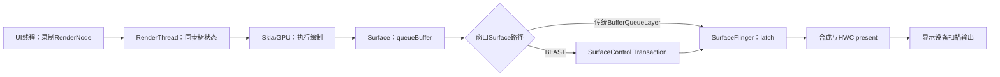
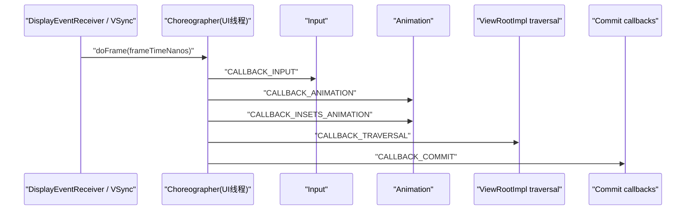
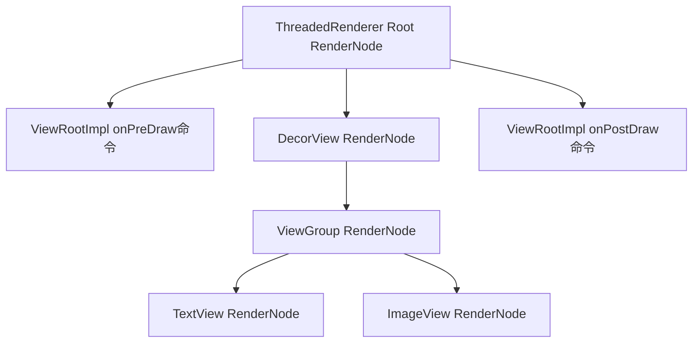
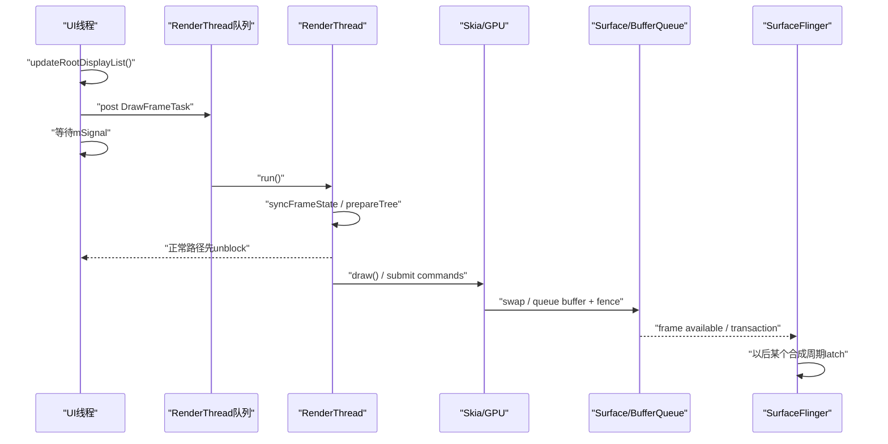
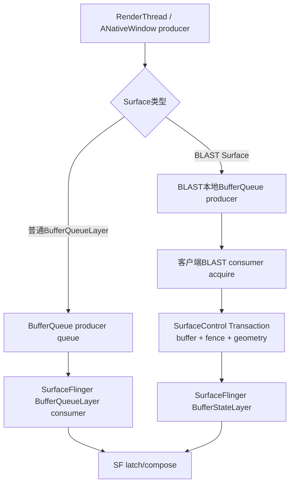
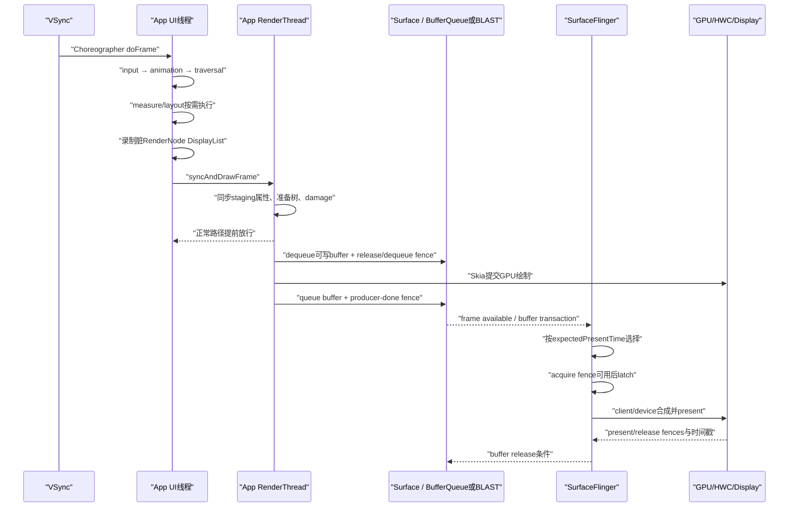

# 163 Android ViewRootImpl、ThreadedRenderer、RenderThread 与应用一帧生产

> 源码版本：Android 11 / API 30 / `android-11.0.0_r48`  
> 学习方式：macOS 只读源码，不要求编译、不要求连接设备  
> 前置章节：第 11、12、21、160、161、162 章

---

## 1. 本章要解决什么

第 162 章讲清了 `GraphicBuffer`、BufferQueue 和 fence，但还没有回答一个最贴近应用开发的问题：

> `View.invalidate()` 之后，应用的一帧究竟怎样变成一张进入 Surface 的 buffer？

这条链上有几个名字很容易造成误解：

```text
View.draw()              不一定是在GPU里画
DisplayList             不是屏幕截图，也不是像素buffer
syncAndDrawFrame()       并不保证等到屏幕显示
FrameCompleteCallback   通常不是“用户已经看到”回调
eglSwapBuffers()         不是SurfaceFlinger已经latch
BLAST                    不是另一个GPU渲染器
```

本章解决：

1. `invalidate()`、`requestLayout()` 如何合并到下一次 traversal？
2. Choreographer 为什么按 input、animation、insets、traversal、commit 排序？
3. 同步屏障挡住什么，为什么 traversal 仍能执行？
4. measure、layout、draw 是否每帧都完整执行？
5. `View.draw()` 在硬件加速路径上主要产出什么？
6. 哪些 View 会重录 DisplayList，哪些能直接复用 RenderNode？
7. UI 线程在哪里把帧交给 RenderThread？
8. `syncAndDrawFrame()` 到底同步到哪一步？
9. RenderThread 什么时候可以先放行 UI 线程？
10. SkiaGL 与 SkiaVulkan 在本章哪些部分相同，哪里分叉？
11. `swapBuffers()` 怎样落到 Surface/BufferQueue 的 queue？
12. BLAST 在 Android 11 中为什么把 buffer 包进 SurfaceControl Transaction？
13. SurfaceFlinger 的 `onFrameAvailable`、`latchBuffer` 与应用提交有何时间差？
14. “已录制、已提交、已入队、已 latch、已 present”如何严格区分？

一句话总览：

> UI 线程在 Choreographer traversal 中更新 View 树并录制需要变化的 RenderNode；`syncAndDrawFrame()` 把 staging 状态同步给 RenderThread，正常情况下很快放行 UI 线程；RenderThread 通过 SkiaGL 或 SkiaVulkan 执行绘制并把 buffer queue 到 Surface；BLAST 可把这个 buffer 转成携带 fence、crop、transform 的 SurfaceControl Transaction；SurfaceFlinger 之后才在自己的合成周期选择并 latch，最终 present 到显示设备。

---

## 2. 先建立五个完成点

读图形源码前，先禁止自己说模糊的“这一帧完成了”。至少要区分：

| 完成点 | 含义 | 还不能推出什么 |
|---|---|---|
| UI 录制完成 | View 的绘制命令已经写入 RenderNode DisplayList | GPU 已执行、buffer 已产生 |
| RenderThread 同步完成 | staging 属性/DisplayList 已同步到 RT 可用状态 | RT 已画完、UI 一定不阻塞 |
| producer queue 完成 | buffer 和 acquire fence 已提交到 BufferQueue/BLAST | fence 已 signal、SF 已采用 |
| SurfaceFlinger latch 完成 | SF 在一个合成周期选中并获取该 buffer | HWC 已 present、面板已扫描 |
| present 完成 | 合成结果提交到显示管线，并由相应 present fence/时间戳描述 | 用户眼睛在同一纳秒感知 |

最容易错的是把前三项都叫“绘制完成”。



箭头表示先后依赖，不表示所有步骤都在同一线程，也不表示前一步返回时后一步已完成。

---

## 3. 源码地图

```text
frameworks/base/core/java/android/view/
├── View.java
├── ViewGroup.java
├── ViewRootImpl.java
├── Choreographer.java
└── ThreadedRenderer.java

frameworks/base/graphics/java/android/graphics/
├── HardwareRenderer.java
├── RenderNode.java
├── RecordingCanvas.java
└── BLASTBufferQueue.java

frameworks/base/libs/hwui/
├── jni/android_graphics_HardwareRenderer.cpp
├── renderthread/
│   ├── RenderProxy.cpp
│   ├── DrawFrameTask.cpp
│   ├── CanvasContext.cpp
│   ├── RenderThread.cpp
│   ├── ReliableSurface.cpp
│   └── EglManager.cpp
└── pipeline/skia/
    ├── SkiaOpenGLPipeline.cpp
    └── SkiaVulkanPipeline.cpp

frameworks/native/libs/gui/
├── Surface.cpp
├── BufferQueueProducer.cpp
└── BLASTBufferQueue.cpp

frameworks/native/services/surfaceflinger/
├── SurfaceFlinger.cpp
├── BufferLayer.cpp
└── BufferQueueLayer.cpp
```

按进程和线程重新分组：

| 阶段 | 典型进程 | 典型线程 |
|---|---|---|
| Choreographer、traversal、View 录制 | 应用进程 | main/UI thread |
| RenderNode 同步、Skia 绘制、swap | 应用进程 | RenderThread |
| Surface/BLAST producer 操作 | 应用进程 | 多数由 RenderThread 触发；BLAST callback 另有 Binder/callback 上下文 |
| Transaction 接收、Layer latch、合成 | `surfaceflinger` | SF 主线程及其工作线程 |
| GPU/HWC 执行 | 驱动、GPU、composer HAL | 异步硬件时间线 |

---

## 4. 从 `invalidate()` 到 `scheduleTraversals()`

### 4.1 invalidate 与 requestLayout 不是一回事

粗略区分：

```text
invalidate()     内容或视觉属性脏了，通常请求draw
requestLayout()  尺寸/位置可能变化，请求measure/layout，并最终可能draw
```

两者最终都可能让 `ViewRootImpl` 安排 traversal，但不能据此认为每帧都会 measure、layout、draw 三件套全走。

`ViewRootImpl.scheduleTraversals()`：

```java
void scheduleTraversals() {
    if (!mTraversalScheduled) {
        mTraversalScheduled = true;
        mTraversalBarrier = mHandler.getLooper().getQueue().postSyncBarrier();
        mChoreographer.postCallback(
                Choreographer.CALLBACK_TRAVERSAL, mTraversalRunnable, null);
        notifyRendererOfFramePending();
        pokeDrawLockIfNeeded();
    }
}
```

这里有三个关键点。

第一，`mTraversalScheduled` 做帧内合并。十个 View 连续 invalidate，不等于马上执行十次 traversal。

第二，真正工作不是直接调用 `performTraversals()`，而是向 Choreographer 登记 `CALLBACK_TRAVERSAL`，等待一次 frame pulse。

第三，通知 ThreadedRenderer 有帧将到来，RenderThread 可调整离线动画任务的调度。

### 4.2 同步屏障不是“主线程冻结”

`postSyncBarrier()` 会让屏障之后的普通同步 Message 暂时不能越过，但异步 Message 可以通过。

Choreographer 安排帧的 Message 会标记：

```java
Message msg = mHandler.obtainMessage(MSG_DO_FRAME);
msg.setAsynchronous(true);
```

所以更准确的理解是：

```text
屏障前消息                正常处理
屏障后同步消息            暂时等
屏障后异步帧消息          可越过屏障
Choreographer traversal   借帧消息获得优先执行机会
```

它不是实时调度保证，也不代表所有输入、Binder 回调或 native 工作都停止。

### 4.3 traversal 开始时先移除屏障

```java
void doTraversal() {
    if (mTraversalScheduled) {
        mTraversalScheduled = false;
        mHandler.getLooper().getQueue().removeSyncBarrier(mTraversalBarrier);
        performTraversals();
    }
}
```

这也解释了为什么屏障必须成对维护。若错误遗留，同步消息会长时间得不到执行。

---

## 5. Choreographer：一帧内的回调顺序

Android 11 r48 的顺序是：

```java
doCallbacks(CALLBACK_INPUT, frameTimeNanos);
doCallbacks(CALLBACK_ANIMATION, frameTimeNanos);
doCallbacks(CALLBACK_INSETS_ANIMATION, frameTimeNanos);
doCallbacks(CALLBACK_TRAVERSAL, frameTimeNanos);
doCallbacks(CALLBACK_COMMIT, frameTimeNanos);
```



这个顺序的直觉是：先消费输入，再推进动画/Insets，随后用最新状态 measure、layout、draw，最后做提交后的帧内工作。

### 5.1 晚到一帧时 frame time 怎么处理

`doFrame()` 会计算：

```text
jitter = UI线程真正开始执行的时间 - VSync给出的frameTime
```

如果 jitter 超过一个刷新周期，它会估算跳过的帧数，并把本帧逻辑时间调整到最近一个有效周期，而不是简单把所有动画时间都设成当前墙钟。

因此：

- `frameTimeNanos` 是动画和帧逻辑的统一时间基准；
- `System.nanoTime()` 更接近当前实际执行时刻；
- 两者差值可体现主线程迟到；
- “Skipped N frames”是基于时间间隔的估算，不等于系统保存了 N 张待显示图片。

---

## 6. `performTraversals()` 不是每帧机械三连

`performTraversals()` 很大，因为它不仅负责 View 树，还要协调：

- 首次 attach；
- Window relayout；
- Surface 创建、替换、尺寸变化；
- Insets、可见性、焦点；
- measure/layout；
- `OnPreDrawListener`；
- draw 与首次绘制上报。

正确的简化不是“每帧 measure→layout→draw”，而是：

```text
若layout requested或窗口尺寸/参数变化：可能measure/layout
若内容脏、动画、可访问焦点变化等：可能draw
若pre-draw取消：本轮可以不draw，再约下一轮
若Surface无效/窗口不可画：draw可跳过
```

### 6.1 `OnPreDrawListener` 可以取消本轮绘制

如果 `dispatchOnPreDraw()` 返回取消，或者视图尚不可见，`ViewRootImpl` 可以重新 `scheduleTraversals()`，而不是强行提交当前帧。

所以在 pre-draw 中持续返回 false 可能造成反复 traversal；它不是“等某个条件时完全没有成本”。

---

## 7. `performDraw()`：先明确谁拥有 Surface

`performDraw()` 会决定是否需要完整重绘、是否设置 frame-complete 回调、是否参与 BLAST 同步事务，随后调用 `draw(fullRedrawNeeded)`。

### 7.1 `SurfaceHolder` 分支

`ViewRootImpl.draw()` 有明确判断：

```java
if (mSurfaceHolder != null) {
    // The app owns the surface, we won't draw.
    dirty.setEmpty();
    ...
    return false;
}
```

这个分支特指根 View 通过内部 `RootViewSurfaceTaker` 协议接管窗口 Surface 的情况，不应直接等同于普通布局里放了一个 `SurfaceView`。普通 `SurfaceView` 确实拥有独立子 Surface，其业务像素不在根 View DisplayList 中；但 ViewRootImpl 仍可绘制窗口其余 View 内容。两件事要分开。

### 7.2 硬件加速入口

当 dirty、动画或 accessibility focus 需要更新，且 ThreadedRenderer 可用：

```java
mThreadedRenderer.draw(mView, mAttachInfo, this);
```

软件回退路径则会锁 Surface 的 Canvas，在 UI 线程执行栅格化；本章重点讨论默认的硬件加速窗口路径。

---

## 8. UI 线程画的主要是“命令”，不是最终像素

### 8.1 `ThreadedRenderer.draw()` 的两段工作

```java
void draw(View view, AttachInfo attachInfo, DrawCallbacks callbacks) {
    choreographer.mFrameInfo.markDrawStart();
    updateRootDisplayList(view, callbacks);
    ...
    int syncResult = syncAndDrawFrame(choreographer.mFrameInfo);
    ...
}
```

两段边界：

```text
updateRootDisplayList()  UI线程：更新/录制RenderNode命令
syncAndDrawFrame()       UI线程发起，native RenderThread同步并绘制
```

### 8.2 DisplayList 是什么

它更像可回放的绘制指令：

```text
drawRect
drawText
drawBitmap
clipPath
concat matrix
draw child RenderNode
```

不是：

```text
一张已栅格化Bitmap
一块BufferQueue slot
一张已经进入Surface的GraphicBuffer
```

### 8.3 不是整棵 View 树每帧都重录

`View.updateDisplayListIfDirty()` 先判断：

```java
if (drawingCacheInvalid || !renderNode.hasDisplayList() || mRecreateDisplayList) {
    if (renderNode.hasDisplayList() && !mRecreateDisplayList) {
        dispatchGetDisplayList();
        return renderNode;
    }
    RecordingCanvas canvas = renderNode.beginRecording(width, height);
    ...
    draw(canvas);
    ...
    renderNode.endRecording();
} else {
    // 直接保留已有display list
}
```

这段包含三个层次：

1. 当前 View 真正需要重录：`beginRecording()` → `draw()` → `endRecording()`；
2. 父节点本身不用重录，但会让子节点恢复/更新自己的 DisplayList；
3. 节点和子树都可复用，直接返回现有 RenderNode。

### 8.4 属性动画为什么可能不重跑 `onDraw()`

平移、缩放、旋转、alpha 等很多属性存在于 RenderNode 属性中。内容命令没变时，可以复用原 DisplayList，仅同步属性。

例如：

```text
文字内容改变       往往需要重录相关View
自定义onDraw变化    需要invalidate并重录
translationX变化   常可只更新RenderNode属性
RT动画             甚至可由RenderThread继续推进
```

“硬件加速后 `onDraw()` 在 RenderThread 运行”是错误说法。普通 View 的 `draw()/onDraw()` 录制阶段仍在 UI 线程；RenderThread 回放命令、组织 Skia/GPU 工作。

---

## 9. Root RenderNode 如何引用 View 树

`updateRootDisplayList()` 先更新 View 树，再在需要时录制根节点：

```java
RecordingCanvas canvas = mRootNode.beginRecording(mSurfaceWidth, mSurfaceHeight);
canvas.translate(mInsetLeft, mInsetTop);
callbacks.onPreDraw(canvas);
canvas.enableZ();
canvas.drawRenderNode(view.updateDisplayListIfDirty());
canvas.disableZ();
callbacks.onPostDraw(canvas);
mRootNode.endRecording();
```

可以把它理解为一棵命令图：



父节点的 DisplayList 可以引用子 RenderNode。子内容变化时，不必必然重录所有祖先的完整内容。

---

## 10. Java 到 native：`HardwareRenderer` 与 `RenderProxy`

`HardwareRenderer.syncAndDrawFrame()` 进入 JNI，JNI 把 Java 的 FrameInfo 数组复制到 native 侧，再调用：

```cpp
return proxy->syncAndDrawFrame();
```

`RenderProxy` 本身不是另一个进程服务。它是应用进程中 UI 线程访问 RenderThread/CanvasContext 的代理。

```text
Java ThreadedRenderer
        ↓ JNI
native RenderProxy
        ↓ DrawFrameTask + RenderThread queue
CanvasContext
        ↓
SkiaGL / SkiaVulkan pipeline
```

这一步发生 Java/native 边界和线程边界，但还没有发生进程边界。

---

## 11. `syncAndDrawFrame()` 到底同步什么

### 11.1 UI 线程确实会等待一次条件变量

`DrawFrameTask::drawFrame()`：

```cpp
int DrawFrameTask::drawFrame() {
    mSyncResult = SyncResult::OK;
    mSyncQueued = systemTime(SYSTEM_TIME_MONOTONIC);
    postAndWait();
    return mSyncResult;
}

void DrawFrameTask::postAndWait() {
    AutoMutex _lock(mLock);
    mRenderThread->queue().post([this]() { run(); });
    mSignal.wait(mLock);
}
```

所以它不是完全异步的 fire-and-forget：UI 线程会把任务放进 RenderThread 队列并等待 RenderThread 发信号。

### 11.2 但正常路径可在真正 draw 前放行 UI

RenderThread 执行：

```cpp
canUnblockUiThread = syncFrameState(info);
canDrawThisFrame = info.out.canDrawThisFrame;

if (canUnblockUiThread) {
    unblockUiThread();
}

if (canDrawThisFrame) {
    context->draw();
} else {
    context->waitOnFences();
}

if (!canUnblockUiThread) {
    unblockUiThread();
}
```

因此准确结论是：

> UI 线程至少等 RenderThread 完成帧状态同步；当同步阶段确认可以安全放行时，UI 线程会在 RenderThread 真正绘制和 swap 之前返回。特殊情况下，放行会推迟到 draw/等待工作结束之后。

不能把方法名解释成：

```text
等待GPU完成
等待queueBuffer被SF消费
等待SurfaceFlinger合成
等待屏幕present
```

### 11.3 同步阶段做什么

`syncFrameState()` 主要包括：

- 把 UI 帧的 VSync 交给 RenderThread 时间基准；
- `makeCurrent()`；
- 应用待更新 layer；
- 设置内容边界；
- `CanvasContext.prepareTree()`；
- 同步 RenderNode staging 属性与 DisplayList；
- 运行/准备 RT 动画；
- 计算 damage；
- 判断 Surface 是否存在、是否 stopped、这一帧能不能画；
- 必要时向 UI 返回“Surface 丢失”或“请求重绘”。

---

## 12. UI 与 RenderThread 的真实流水线



图中 UI 被 unblock 后，它可以处理后续消息，甚至准备下一帧；但 BufferQueue 容量、fence、RenderThread 队列和调度仍会形成背压，不能无限超前。

### 12.1 `waitOnFences()` 这个名字也会误导

`CanvasContext::waitOnFences()` 在这里等待的是 `CommonPool::async()` 返回的 future：

```cpp
for (auto& fence : mFrameFences) {
    fence.get();
}
```

它不是第 162 章所讲的 `android::Fence` / sync fence fd。源码命名相同，不代表抽象相同。

---

## 13. RenderThread 可以独立驱动动画

`CanvasContext::doFrame()` 会以 `MODE_RT_ONLY` 准备树并绘制：

```cpp
TreeInfo info(TreeInfo::MODE_RT_ONLY, *this);
prepareTree(info, frameInfo, ..., node);
if (info.out.canDrawThisFrame) {
    draw();
}
```

这使某些 RenderNodeAnimator 能在 UI 线程一时忙碌时继续推进。

但不要扩张成“所有动画都不怕主线程卡”：

- 需要业务计算、layout、重新录制内容的动画仍依赖 UI；
- RT 动画若发现需要 UI 重绘，会设置相应结果；
- Surface、GPU、BufferQueue 或 SF 拥堵仍可卡住后段；
- 输入响应和应用逻辑仍运行在主线程。

---

## 14. `CanvasContext::prepareTree()`：画之前先决定能否画

这里会遍历 RenderNode 树、同步属性、更新动画、累计 damage，并判断 Surface 状态。

几个常见跳帧条件：

```text
没有Surface或context stopped
同一VSync附近RT动画已经画过，UI请求可能被判定为过近
特定多RenderNode/backdrop条件不能安全绘制
buffer/Synchronize条件不满足
```

不能看到 `syncAndDrawFrame()` 被调用就断定一定产生了新 buffer。

### 14.1 r48 的 `reserveNext()` 是一个版本陷阱

`prepareTree()` 会调用 `mNativeSurface->reserveNext()`，从名字和注释看像是提前 dequeue buffer。

但 Android 11 r48 的 `ReliableSurface.cpp` 写着：

```cpp
constexpr bool DISABLE_BUFFER_PREFETCH = true;

int ReliableSurface::reserveNext() {
    if constexpr (DISABLE_BUFFER_PREFETCH) {
        return OK;
    }
    ...
}
```

因此在本版本，这个调用直接返回 OK，不真正预取 buffer。真正 dequeue 通常仍由 EGL/Vulkan 的取帧路径经 ANativeWindow 触发。

这是典型的源码阅读规则：

> 不要只读调用点和函数名，必须进入本版本实现，看编译期常量和 feature gate。

---

## 15. `CanvasContext::draw()`：从 damage 到 swap

主要结构：

```cpp
Frame frame = mRenderPipeline->getFrame();
setPresentTime();
SkRect windowDirty = computeDirtyRect(frame, &dirty);

bool drew = mRenderPipeline->draw(...);
int64_t frameCompleteNr = getFrameNumber();
waitOnFences();
bool didSwap = mRenderPipeline->swapBuffers(...);
```

### 15.1 damage 与 buffer age

窗口通常不是每次都必须完整重画。pipeline 会结合：

- 本帧 View/RenderNode damage；
- Surface 是否新建或尺寸变化；
- buffer age；
- swap history；
- preserve/buffer-age 策略；

计算真正需要恢复的区域。

如果取到的旧 buffer 已很久没用，本帧就必须把它缺失的历史 damage 合并进来；这与第 162 章 async drop 合并 damage 的目标相同：局部更新不能漏内容。

### 15.2 空 damage 可以完全不 swap

当：

```text
dirty为空
skipEmptyFrames开启
Surface不要求重画
```

`CanvasContext::draw()` 会标记 SkippedFrame，调用等待中的 frame-complete callbacks，然后直接返回。

所以 frame-complete callback 被调用，也不严格证明新 buffer 已提交。源码是为了避免调用方无限等待而主动完成回调。

---

## 16. SkiaGL 与 SkiaVulkan：公共骨架、不同后端

Android 11 r48 根据 renderer 属性选择：

```cpp
if (rendererProperty == "skiavk") {
    return RenderPipelineType::SkiaVulkan;
}
return RenderPipelineType::SkiaGL;
```

共同骨架是：

```text
RenderNode树
  → Skia组织绘制
  → 获得ANativeWindow-backed frame
  → 绘制/提交
  → swap/present到Surface producer
```

分叉点：

| 后端 | 典型对象/动作 |
|---|---|
| SkiaGL | EGLSurface、FBO 0、`eglSwapBuffersWithDamageKHR()` |
| SkiaVulkan | Vulkan swapchain、Skia Vulkan backend、相应 present |

本章用 SkiaGL 代码说明 `swap`，但结论不能写成“Android 硬件加速永远由 OpenGL 渲染”。

### 16.1 SkiaGL 的 getFrame/draw/swap

```cpp
Frame SkiaOpenGLPipeline::getFrame() {
    return mEglManager.beginFrame(mEglSurface);
}

bool SkiaOpenGLPipeline::swapBuffers(...) {
    *requireSwap = drew || mEglManager.damageRequiresSwap();
    if (*requireSwap && !mEglManager.swapBuffers(frame, screenDirty)) {
        return false;
    }
    return *requireSwap;
}
```

`EglManager::swapBuffers()` 最终调用：

```cpp
eglSwapBuffersWithDamageKHR(...);
```

EGL native window bridge 会走到 `Surface`/ANativeWindow 的 dequeue、queue 协议。驱动内部细节可能是 vendor 实现，不应把 AOSP Framework 调用栈虚构成固定实现。

---

## 17. `ReliableSurface`：让 buffer 失败可恢复

HWUI 用 `ReliableSurface` 包装 ANativeWindow，并安装 dequeue/queue/cancel interceptor。

若真实 dequeue 失败：

```cpp
*buffer = rs->acquireFallbackBuffer(result);
*fenceFd = -1;
return *buffer ? OK : INVALID_OPERATION;
```

fallback 是一张 1×1 scratch AHardwareBuffer。目的不是把错误画面显示给用户，而是让渲染栈能在一个本地兜底目标上收尾，再由 `CanvasContext` 读取保存的错误并重试或放弃 Surface。

流程：

```text
真实dequeue失败
  → 保存BufferQueue错误
  → 给pipeline一张1×1 scratch buffer
  → scratch queue/cancel在wrapper内吞掉
  → CanvasContext swap后读取真实错误
  → TIMED_OUT则请求后续帧重试
  → 其他错误则setSurface(nullptr)，等待上层relayout恢复
```

这说明“EGL 调用返回成功”也可能只是 wrapper 成功兜底，必须继续看上层错误状态。

---

## 18. `swapBuffers()` 只到 producer 提交边界

对于普通 BufferQueue，稳定概念链是：

```text
RenderThread获得可写buffer
  → 等待dequeue fence后写入/提交GPU命令
  → queueBuffer(buffer, producer done fence)
  → BufferQueue将其变为QUEUED
  → consumer以后acquire并等待acquire fence
```

`eglSwapBuffers()` 返回不能直接推出：

- GPU 所有指令已经物理完成；
- acquire fence 已 signal；
- SurfaceFlinger 已 latch；
- HWC 已 present；
- 屏幕扫描到了该 buffer。

它主要表示 producer 侧 swap/提交动作已完成到 API 所定义的边界。

---

## 19. BLAST：buffer 与 Layer 状态一起交给 SurfaceFlinger

### 19.1 Java 入口

`ViewRootImpl.getOrCreateBLASTSurface()`：

```java
if (mBlastBufferQueue == null) {
    mBlastBufferQueue = new BLASTBufferQueue(
            mBlastSurfaceControl, width, height, mEnableTripleBuffering);
    ret = mBlastBufferQueue.getSurface();
} else {
    mBlastBufferQueue.update(mBlastSurfaceControl, width, height);
}
```

renderer 得到的仍是 `Surface`，所以 View/ThreadedRenderer 不需要直接理解 SurfaceControl 的所有事务细节。

### 19.2 BLAST 的 BufferQueue consumer 在客户端进程

native `BLASTBufferQueue` 自己创建一对 producer/consumer：

```cpp
BufferQueue::createBufferQueue(&mProducer, &mConsumer);
mBufferItemConsumer = new BLASTBufferItemConsumer(...);
mBufferItemConsumer->setFrameAvailableListener(this);
```

renderer 经 Surface 向 producer queue；BLAST 收到 `onFrameAvailable()` 后 acquire buffer，再构建 SurfaceControl Transaction：

```cpp
t->setBuffer(mSurfaceControl, buffer);
t->setAcquireFence(mSurfaceControl, ...);
t->setFrame(mSurfaceControl, {0, 0, mWidth, mHeight});
t->setCrop(mSurfaceControl, computeCrop(bufferItem));
t->setTransform(mSurfaceControl, bufferItem.mTransform);
t->setDesiredPresentTime(bufferItem.mTimestamp);
t->apply();
```

它把：

```text
buffer
acquire fence
frame/crop
transform
desired present time
```

作为同一 Transaction 的 Layer 状态交给 SurfaceFlinger。

### 19.3 `setNextTransaction()` 的意义

窗口几何变化、首次绘制等场景需要“buffer 与一组 SurfaceControl 状态原子同行”。`ViewRootImpl` 可先：

```java
mBlastBufferQueue.setNextTransaction(mRtBLASTSyncTransaction);
```

下一张 buffer 到达时，BLAST 把 buffer 操作写进这份指定 Transaction，而不是立刻应用自己的局部 Transaction。

这减少了：

```text
Layer尺寸/位置先变
buffer下一拍才到
两者短暂不一致
```

但 BLAST 不是跳过 BufferQueue，也不是让应用直接调用 HWC。

### 19.4 为什么 BLAST 要等 Transaction callback 才 release

BLAST 保存已提交的 BufferItem，并注册 transaction-completed callback。回调带回 previous release fence 后，才把上一项 release 给其本地 BufferItemConsumer。

这仍是第 162 章的所有权与 fence 接力，只是 consumer 先把 buffer 作为 SurfaceControl Transaction 交给 SF。

---

## 20. 普通 BufferQueue 与 BLAST 路径不要混画



Android 11 正处在 BLAST 引入期，具体窗口走哪条路径还受窗口类型、feature gate 和版本实现影响。读某个问题时先确认实际 Layer/Surface 类型，不要把两条 consumer 模型硬拼成一条。

---

## 21. SurfaceFlinger：frame available 只是唤醒，不是 latch

以传统 `BufferQueueLayer` 为例，`onFrameAvailable()`：

```cpp
mQueueItems.push_back(item);
mQueuedFrames++;
...
mFlinger->signalLayerUpdate();
mConsumer->onBufferAvailable(item);
```

这表示 SF 知道有新 buffer，并请求一次 Layer update。

它没有在 producer queue 回调里直接完成最终合成，这样可以让多个 Layer 在统一的显示节奏上被选择、latch 和合成。

### 21.1 `handlePageFlip()` 才选择本周期可 latch 的 Layer

SF 遍历 drawing state：

```cpp
if (layer->hasReadyFrame()) {
    if (layer->shouldPresentNow(expectedPresentTime)) {
        mLayersWithQueuedFrames.push_back(layer);
    }
}
```

随后才调用：

```cpp
layer->latchBuffer(visibleRegions, latchTime, expectedPresentTime);
```

### 21.2 latch 前还要过 fence 和 transaction 条件

`BufferLayer::latchBuffer()` 会检查：

```text
是否真有ready frame
上一轮refresh是否仍pending
head buffer acquire fence是否signal
相关transaction/sync point是否满足
desired present time是否适合当前周期
```

如果 acquire fence 未 signal：

```cpp
if (!fenceHasSignaled()) {
    mFlinger->signalLayerUpdate();
    return false;
}
```

也就是 buffer 已 queue 到 SF 侧，但本周期仍可能不 latch。

---

## 22. 一帧完整时序：把线程、队列和 fence 放在一起



注意 RT 的 dequeue 与 GPU submit 的具体内部交错由 GL/Vulkan 驱动决定；图表达所有权和依赖关系，不声称 vendor 驱动只有这一种固定函数栈。

---

## 23. 三种“fence”别再混淆

### 23.1 Graphic buffer sync fence

第 162 章的 fence fd：

```text
dequeue/release fence  producer写前等待consumer上次读完
queue/acquire fence    consumer读前等待producer本次写完
present/release fence  显示/合成完成后帮助归还buffer
```

### 23.2 `CanvasContext::waitOnFences()`

这里是等待 CommonPool future 完成，保证本帧异步 CPU 工作不跨到下一帧；不是 sync fence fd。

### 23.3 `HardwareRenderer.fence()`

Android 11 r48 最终是：

```cpp
void RenderProxy::fence() {
    mRenderThread.queue().runSync([]() {});
}
```

它等待 RenderThread 队列跑到这个空任务，相当于一个队列排空边界；不会直接等待 SurfaceFlinger present。

不要因为同名就套用 `EglManager::fence()`。后者创建 EGL sync 并等 GPU；`RenderProxy::fence()` 没有调用它。

---

## 24. FrameCompleteCallback 也不是 present callback

`ViewRootImpl.performDraw()` 会在首次绘制上报、BLAST sync 或用户注册 frame commit callback 时设置 frame-complete callback。

RenderThread 在 `didSwap` 后调用它；但有两个重要边界：

1. `didSwap` 表示 producer/pipeline swap 边界，不等于 SF present；
2. 空 damage 跳帧路径也会主动调用 callback，避免上层永远等待。

源码中 `CanvasContext` 在记录 FrameCompleted 前还有：

```cpp
// TODO: Use a fence for real completion?
mCurrentFrameInfo->markFrameCompleted();
```

这条 TODO 直接提醒读者：这里不是“GPU/显示真实完成”的绝对时刻。

`ViewTreeObserver.registerFrameCommitCallback()` 的 Java 文档把它描述为内容已渲染并提交给 swap chain，也不能扩张为用户已看到。

---

## 25. `reportDrawFinished()` 是窗口协议完成，不是视觉证明

首次显示或 WMS 要求 redraw 时，`ViewRootImpl` 最终调用：

```java
mWindowSession.finishDrawing(mWindow, mSurfaceChangedTransaction);
```

这告诉 WindowManager“客户端已完成所要求的绘制/提交阶段”，用于窗口显示、转场和 Surface 状态协调。

它不是：

```text
面板光子已经变化的硬件回执
应用所有子Surface都已显示的通用证明
用户可感知完成时间
```

协议完成点必须按调用方需求理解，不能按方法名的日常语言理解。

---

## 26. 卡顿应该按哪一段定位

| 症状/trace | 更可能先查 |
|---|---|
| UI thread 的 traversal 很长 | measure/layout、`onDraw()`录制、业务回调、锁、GC |
| UI 等 `DrawFrameTask` 很久 | RenderThread 队列拥堵、prepareTree、纹理准备、特殊不提前放行路径 |
| RenderThread draw 很长 | Skia复杂度、shader、纹理上传、过度绘制、GPU压力 |
| dequeue 很长 | BufferQueue无空闲buffer、consumer慢、release fence未就绪 |
| queue/swap 很长 | producer背压、驱动、queue限制、Surface异常 |
| 已queue但SF晚latch | acquire fence、desired present time、SF调度/事务依赖 |
| SF合成长 | Layer数量、client composition、HWC validate/present、GPU合成 |
| present延迟 | HWC/display pipeline、刷新周期、fence时间线 |

### 26.1 一条常见误诊

看到主线程 `syncAndDrawFrame` 时间长，就直接说“GPU 渲染慢”并不可靠。

可能性包括：

- RenderThread 前面已有任务；
- 本帧 prepareTree 慢；
- 纹理/资源准备使 UI 不能提前放行；
- Surface 丢失或状态切换；
- 前一帧的 frame work/future 未完成；
- 真正 draw/swap 只是在特殊路径上被包含进等待区间。

必须结合 UI、RenderThread、GPU、SurfaceFlinger 多轨 trace。

---

## 27. 一个具体例子：TextView 平移并改文字

假设同一帧执行：

```java
textView.setTranslationX(20f);
textView.setText("new");
```

不要简单说“View 重画一次”。更细的推演：

1. `translationX` 更新 RenderNode 的变换属性；
2. `setText` 会使 TextView 内容/布局状态变化，可能触发 requestLayout 和 invalidate；
3. 多次请求由 `mTraversalScheduled` 合并；
4. 下一次 Choreographer traversal 中，按需 measure/layout；
5. TextView 的内容 DisplayList 需要重录；
6. 不相关子树可复用已有 RenderNode；
7. Root RenderNode 仍引用整棵子节点图；
8. RenderThread 同步新的属性和 DisplayList；
9. Skia 只重建必要命令/资源，最终 damage 仍需结合 buffer age；
10. buffer queue 后由 SF 决定哪次刷新 latch。

这比“invalidate 后 GPU 重新画整屏”准确得多。

---

## 28. 源码阅读中的十二个高频误区

### 28.1 “draw 在 RenderThread”

要拆成：View `draw/onDraw` 录制通常在 UI；RenderNode 回放与 Skia/GPU 提交通常在 RenderThread。

### 28.2 “DisplayList 是 bitmap cache”

DisplayList 是命令记录，可引用其他 RenderNode；硬件 layer 或纹理 cache 是另一层机制。

### 28.3 “每个 View 每帧都会 onDraw”

有效 RenderNode 可复用；只更新变换属性时常无需重录内容。

### 28.4 “每帧必定 measure/layout/draw”

performTraversals 按状态选择工作，甚至 draw 也可跳过。

### 28.5 “同步屏障阻塞所有主线程消息”

它阻塞屏障后的同步 Message；异步 Message 能通过。

### 28.6 “syncAndDrawFrame 等 GPU”

正常路径只等到 RenderThread 完成同步并允许 UI 放行。

### 28.7 “waitOnFences 等 sync fence”

CanvasContext 这里等的是 CommonPool future。

### 28.8 “HardwareRenderer.fence 等 present”

r48 的 RenderProxy fence 只是 RenderThread 队列 runSync 空任务。

### 28.9 “frame complete 一定产生新 buffer”

空 damage skip path 也会调用回调。

### 28.10 “eglSwapBuffers 后屏幕已显示”

后面还有 BufferQueue、fence、SF latch、composition、HWC present。

### 28.11 “BLAST 删除了 BufferQueue”

BLAST 本身创建本地 BufferQueue，再把 acquire 到的 buffer 放入 SurfaceControl Transaction。

### 28.12 “SurfaceFlinger 收到 onFrameAvailable 就立即使用”

它只登记并 signal update；合成周期还要判断 present time、fence 和 transaction 条件。

---

## 29. macOS 只读练习

### 练习 1：验证 traversal 合并和屏障

```bash
sed -n '1910,1955p' \
  frameworks/base/core/java/android/view/ViewRootImpl.java
```

目标：解释 `mTraversalScheduled`、sync barrier、Choreographer callback 各自解决什么问题。

### 练习 2：验证回调顺序

```bash
sed -n '650,750p' \
  frameworks/base/core/java/android/view/Choreographer.java
```

目标：写出五类 callback 顺序，并解释 frameTime 与实际开始时间为何不同。

### 练习 3：找到 DisplayList 复用分支

```bash
sed -n '21155,21255p' \
  frameworks/base/core/java/android/view/View.java
```

目标：标出“重录当前节点”“只恢复子节点”“完全复用”三个分支。

### 练习 4：区分 UI record 与 native draw

```bash
sed -n '550,680p' \
  frameworks/base/core/java/android/view/ThreadedRenderer.java
```

目标：在 `updateRootDisplayList` 与 `syncAndDrawFrame` 中间画出线程边界。

### 练习 5：证明 UI 可提前放行

```bash
sed -n '45,135p' \
  frameworks/base/libs/hwui/renderthread/DrawFrameTask.cpp
```

目标：指出 `unblockUiThread()` 在 `context->draw()` 前后的两个位置及条件。

### 练习 6：查空帧与 FrameCompleted

```bash
sed -n '450,565p' \
  frameworks/base/libs/hwui/renderthread/CanvasContext.cpp
```

目标：解释为何 callback 被调用不保证新 buffer swap。

### 练习 7：验证 r48 没有真正预取

```bash
sed -n '25,115p' \
  frameworks/base/libs/hwui/renderthread/ReliableSurface.cpp
```

目标：找到 `DISABLE_BUFFER_PREFETCH`，说明调用点意图和本版本行为的差异。

### 练习 8：比较 GL/Vulkan 选择

```bash
sed -n '170,200p' frameworks/base/libs/hwui/Properties.cpp
sed -n '55,90p' frameworks/base/libs/hwui/renderthread/CanvasContext.cpp
```

目标：不要再把 SkiaGL 当成唯一后端。

### 练习 9：追 BLAST buffer transaction

```bash
sed -n '190,290p' \
  frameworks/native/libs/gui/BLASTBufferQueue.cpp
```

目标：找出 buffer、acquire fence、crop、transform、timestamp 如何写入同一 Transaction。

### 练习 10：验证 SF 不会在 callback 中直接 latch

```bash
sed -n '390,445p' \
  frameworks/native/services/surfaceflinger/BufferQueueLayer.cpp
sed -n '3090,3145p' \
  frameworks/native/services/surfaceflinger/SurfaceFlinger.cpp
```

目标：区分 `signalLayerUpdate()` 与 `latchBuffer()`。

---

## 30. 复读后补强的易懂版本

### 30.1 为什么 UI 线程“画了”又说没画像素

日常 API 把 `Canvas.drawRect()` 叫画图；但 RecordingCanvas 只记录命令。就像 UI 线程写了一份施工单，RenderThread 才拿施工单组织实际 GPU 工作。

软件 Canvas 路径例外：它可能在调用线程直接对锁住的 Surface buffer 做 CPU 栅格化。所以一定先确认 Canvas 类型和硬件加速状态。

### 30.2 为什么 `syncAndDrawFrame()` 必须等待一小段

UI 线程下一轮可能继续修改 RenderNode staging 状态。RenderThread 必须先把本帧需要的状态同步到自己可安全使用的版本，才能让 UI 继续。同步完成后，RT 可持有本帧所需数据独立画图。

### 30.3 为什么 buffer queue 了还不能 latch

queue 同时交付一张“完成凭证”——acquire fence。SF 得到 buffer 不代表 GPU 已写完；fence 未 signal 时不能读。除此之外，desired present time 和相关事务也可能要求等后续周期。

### 30.4 为什么 swap 与 present 必须分开

swap 是 producer 把作品交到队列；present 是显示系统把选中的多层作品合成并送到显示管线。中间还有消费者选择、同步和合成。

### 30.5 为什么 BLAST 不直接把 buffer 给 HWC

HWC 面对的是 SF 组织好的 Layer 合成计划。BLAST 只是把客户端 buffer 和 Layer 几何状态以 Transaction 形式原子交给 SF，合成裁决仍在 SF/HWC 链路。

### 30.6 为什么“应用掉帧”不能只看主线程

一帧可能在 UI、RenderThread、GPU、BufferQueue、SF 或 HWC 任一段错过目标刷新。主线程很快只证明前半段快，不证明 buffer 按时 present。

---

## 31. 本章核心结论

1. `scheduleTraversals()` 用标志合并请求，以 Choreographer traversal 对齐下一帧。
2. sync barrier 只拦屏障后的同步 Message；异步帧 Message 可以通过。
3. Choreographer 顺序是 input→animation→insets animation→traversal→commit。
4. `performTraversals()` 按状态选择 measure/layout/draw，不是每帧固定三连。
5. 硬件加速时，View `draw/onDraw` 主要在 UI 线程向 RecordingCanvas 录制命令。
6. DisplayList 属于 RenderNode 命令图，不是 bitmap，也不是 GraphicBuffer。
7. 脏节点按需重录，未变节点和很多属性动画可复用 RenderNode。
8. `syncAndDrawFrame()` 至少同步 UI 与 RT 状态；正常路径可在真正 draw/swap 前放行 UI。
9. `CanvasContext::waitOnFences()` 等 CommonPool future，不是图形 sync fence fd。
10. r48 的 `RenderProxy::fence()` 只等待 RenderThread 队列边界，不等待 SF present。
11. HWUI 可选 SkiaGL 或 SkiaVulkan；GL 的 swap 经 EGL/ANativeWindow 进入 Surface producer。
12. r48 `ReliableSurface::reserveNext()` 因常量开关实际不预取 buffer。
13. BLAST 用本地 BufferQueue 接收 renderer buffer，再把 buffer、fence 与几何写入 SurfaceControl Transaction。
14. SF 的 frame-available 只表示有新数据并请求调度；之后才按时间、fence 和事务条件 latch。
15. UI record、RT sync、queue、latch、present 是五个不同完成点。

---

## 32. 自测题

1. 为什么十次 invalidate 通常不会立刻执行十次 traversal？
2. 同步屏障为什么没有挡住 Choreographer 的帧 Message？
3. Choreographer 五类 callback 的顺序是什么？
4. `performTraversals()` 为什么不等于每帧完整 measure/layout/draw？
5. RecordingCanvas 与普通软件 Canvas 的核心差异是什么？
6. DisplayList 与 GraphicBuffer 有何区别？
7. 哪些变化可能只更新 RenderNode 属性而不重跑 `onDraw()`？
8. `syncAndDrawFrame()` 的 UI 线程等待在哪里发生？
9. RenderThread 为什么可以在 draw 前先放行 UI？
10. `CanvasContext::waitOnFences()` 等的是什么？
11. `HardwareRenderer.fence()` 在 r48 为什么不是 present fence？
12. 空 damage 为什么仍可能调用 frame-complete callback？
13. r48 的 `reserveNext()` 为什么名字和实际行为不同？
14. SkiaGL 与 SkiaVulkan 的公共骨架是什么？
15. `eglSwapBuffers()` 返回后还剩哪些阶段？
16. BLAST 的 consumer 位于哪里，它 acquire 后做什么？
17. `setNextTransaction()` 解决哪类 buffer/几何不同步？
18. SF 收到 `onFrameAvailable()` 后为什么不立即使用 buffer？
19. acquire fence 未 signal 时 `latchBuffer()` 怎样处理？
20. 如何区分 record、sync、queue、latch、present？

能独立讲清这 20 题，就能在 Perfetto 中更准确地把应用一帧拆到 UI、RT、GPU、BufferQueue 和 SF 五段。

---

## 33. 下一章预告

第 164 章继续站到 SurfaceFlinger 侧：

> Android SurfaceControl Transaction、Layer 状态提交、BufferStateLayer latch 与事务原子性。

重点追应用/WindowManager 的 Transaction 怎样进入 SF，current state 与 drawing state 怎样切换，buffer transaction、desired present time、sync point、callback 和 release fence 怎样共同决定某一帧何时可见。
