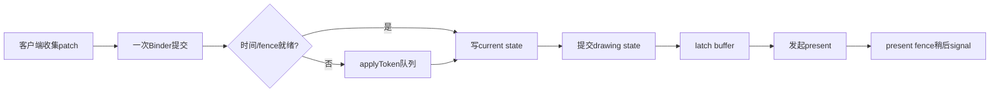
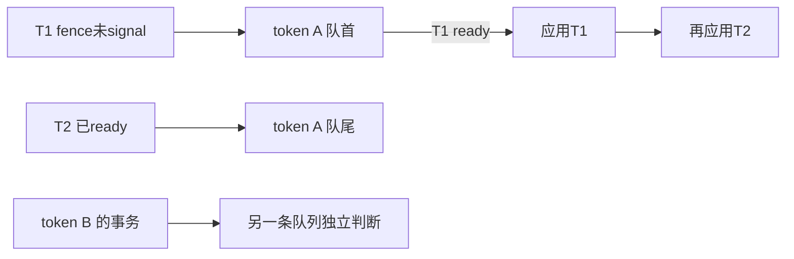

# 164 Android SurfaceControl Transaction、BufferStateLayer 与事务原子性

> 源码版本：Android 11 / API 30 / `android-11.0.0_r48`  
> 学习方式：macOS 静态阅读；不编译，不连接设备  
> 前置章节：第 160～163 章

---

## 1. 本章要回答的问题

第 163 章已经追到 BLAST 把应用 buffer 放进 `SurfaceControl::Transaction`。这一章继续回答：

> buffer、acquire fence、位置、裁剪、变换和回调，如何作为一个提交单元进入 SurfaceFlinger；所谓“原子”又具体保证到哪一层？

先给出主线：

```text
Java SurfaceControl.Transaction
  收集多次 setter
        ↓ apply
native SurfaceComposerClient::Transaction
  layer_state_t + what 位图
        ↓ Binder
SurfaceFlinger::setTransactionState
  就绪检查 / 按 applyToken 排队
        ↓
applyTransactionState
  写 Layer current state
        ↓ SF 主循环
Layer::doTransaction
  current → drawing
        ↓
BufferLayer::latchBuffer
  drawing buffer → active buffer
        ↓
composition / present / transaction callback
```

读完应能区分五个完成点：

1. setter 写进客户端收集器；
2. Binder 调用把数据交给 SF；
3. SF 把 patch 写进 current state；
4. 主循环把 current 推进到 drawing，并 latch buffer；
5. 显示管线最终令 present fence signal。

它们不是同一时刻。

---

## 2. “事务原子性”的准确边界

Java 注释把 `Transaction` 定义为一组针对多个 `SurfaceControl` 的原子变更。对 r48 源码，更稳妥的理解是：

> 同一 Transaction 中被 SF 接受的 Layer/Display patch，共享一次 Binder 提交和一次受 `mStateLock` 保护的 current-state 更新；主循环从稳定的 drawing state 工作，不会把 setter 逐字段暴露成显示中间态。

这不等于数据库事务：

| 容易误解成 | 实际含义 |
|---|---|
| 任一字段失败就整笔回滚 | 无效 Layer、无权限字段、无效 cache id 可局部跳过，其余字段仍可能生效 |
| `apply()` 返回就已经上屏 | 普通 apply 不等 commit、latch 或 present |
| 所有客户端全局串行 | r48 主要按 `applyToken` 维持各自的 pending FIFO |
| buffer 与几何已写 current 就一定本帧显示 | 还要经过 drawing、latch、composition 和 fence |
| callback 到达表示扫描完成 | callback 可以携带尚未 signal 的 present fence |
| 显式 defer 仍不破坏同时性 | legacy defer 本来就是调用者要求某个 Layer 延后提交 |

还有一个重要限定：buffer 是 Layer state 的字段，但真正替换 active buffer 发生在 latch 阶段。因此“状态原子提交”不能被扩写成“所有硬件动作同时完成”。



---

## 3. 源码地图与对象关系

主要文件：

```text
frameworks/base/core/java/android/view/
└── SurfaceControl.java

frameworks/base/core/jni/
└── android_view_SurfaceControl.cpp

frameworks/native/libs/gui/
├── SurfaceComposerClient.cpp
├── LayerState.cpp
├── ISurfaceComposer.cpp
└── include/gui/
    ├── SurfaceComposerClient.h
    └── LayerState.h

frameworks/native/services/surfaceflinger/
├── SurfaceFlinger.cpp
├── Layer.cpp
├── BufferLayer.cpp
├── BufferStateLayer.cpp
├── ClientCache.cpp
└── TransactionCompletedThread.cpp
```

对象关系：

```text
Java Transaction
  └─ long mNativeObject
       └─ native SurfaceComposerClient::Transaction
            ├─ map<surface handle, ComposerState>
            │    └─ layer_state_t { what, position, crop, buffer, fence, ... }
            ├─ DisplayState 列表
            ├─ InputWindowCommands
            ├─ listener callbacks
            └─ 事务级 flags / desiredPresentTime
```

`SurfaceControl` 的 Binder handle 是 map 的 key。一个 Transaction 可以同时修改多个 Layer；同一个 Layer 的多次 setter 则累积到同一份 `layer_state_t`。

---

## 4. Java Transaction 只是变更收集器

构造 Java 对象时，JNI 创建 native Transaction：

```java
public Transaction() {
    mNativeObject = nativeCreateTransaction();
    mFreeNativeResources =
            sRegistry.registerNativeAllocation(this, mNativeObject);
}
```

```cpp
return reinterpret_cast<jlong>(new SurfaceComposerClient::Transaction);
```

调用 `setPosition()`、`setAlpha()`、`setCrop()`、`setBuffer()` 等 API，通常只修改这个 native 收集器：

```text
t.setPosition(a, 10, 20)
t.setAlpha(a, 0.8)
t.setLayer(b, 100)

此时没有向 SurfaceFlinger 提交
t.apply() 才统一跨 Binder
```

Java 侧另有两个辅助映射：

```text
mResizedSurfaces      更新 Java SurfaceControl 的宽高缓存
mReparentedSurfaces   通知本地 reparent listener
```

`apply(boolean)` 先处理这两个 Java 映射，再调用 native apply：

```java
applyResizedSurfaces();
notifyReparentedSurfaces();
nativeApplyTransaction(mNativeObject, sync);
```

因此 Java 对象宽高已更新、reparent listener 已回调，也不能证明 SF 已 commit。

`close()` 只释放 native 收集器，未 apply 的变更被放弃；它不会自动提交。

---

## 5. `what` 位图才是增量协议

`layer_state_t` 看起来像完整 Layer 状态：

```cpp
uint64_t what;
float x;
float y;
int32_t z;
float alpha;
Rect crop;
Rect frame;
sp<GraphicBuffer> buffer;
sp<Fence> acquireFence;
ui::Dataspace dataspace;
```

但字段是否属于本次修改，由 `what` 决定：

```text
ePositionChanged
eLayerChanged / eRelativeLayerChanged
eAlphaChanged
eMatrixChanged
eCropChanged
eFrameChanged
eBufferChanged
eAcquireFenceChanged
eDataspaceChanged
eSurfaceDamageRegionChanged
eReparent
eInputInfoChanged
eHasListenerCallbacksChanged
...
```

例如：

```text
alpha == 0 且 eAlphaChanged 已置位    本次要把 alpha 设为 0
alpha == 0 但 eAlphaChanged 未置位    该字段不参与本次事务
```

所以它是 patch 协议，不是整对象替换协议。

### 5.1 flags 还要结合 mask

flags 只改 mask 指定的 bit：

```cpp
flags &= ~other.mask;
flags |= (other.flags & other.mask);
mask |= other.mask;
```

这让一笔事务可以只打开或关闭某些 Layer flag，而不覆盖其余位。

### 5.2 SF 也只按 `what` 消费

`setClientStateLocked()` 读取 `what` 后才调用相应 setter：

```text
ePositionChanged      → layer->setPosition(...)
eCropChanged          → layer->setCrop(...)
eFrameChanged         → layer->setFrame(...)
eAcquireFenceChanged  → layer->setAcquireFence(...)
eBufferChanged/cache  → 解析后 layer->setBuffer(...)
```

没有置位的成员即使随 Parcel 出现，也不应改变 Layer。

---

## 6. `merge()`：Layer 字段能合，并非所有事务语义都能合

Java：

```java
nativeMergeTransaction(mNativeObject, other.mNativeObject);
```

JNI 最终调用：

```cpp
transaction->merge(std::move(*otherTransaction));
```

对同一 Layer，`layer_state_t::merge(other)` 按 `other.what` 覆盖冲突字段：

```text
this:  alpha = 0.5
other: alpha = 0.8
this.merge(other) → 0.8
```

有些字段有专门规则：

- 绝对 Z 与相对 Z 互斥，后合入者清掉另一种 `what` 位；
- flags 按 mask 合并；
- metadata 按 key 合并；
- callback id 与关联 SurfaceControl 会迁移到接收者。

合并完成后 `other.clear()`，所以 `other` 对象仍存在，但已不再保存那批变更。

### 6.1 r48 的事务级缺口

r48 `Transaction::merge()` 明确迁移：

```text
ComposerState / DisplayState
listener callbacks
InputWindowCommands
mContainsBuffer
early-wakeup 三个布尔值
```

却没有把以下字段从 `other` 合到 `this`：

```text
mDesiredPresentTime
mForceSynchronous
mAnimation
mTransactionNestCount
mStatus
```

随后 `other.clear()` 会重置其中一部分。因此不能说 merge 会保留 `other` 的全部事务级语义；需要这些选项时，应在最终接收 Transaction 上重新设置。

---

## 7. `apply()` 的清空、复用与 Binder 边界

native `Transaction::apply()` 的关键步骤是：

1. 把 callback 注册信息挂到相应 Layer state；
2. 执行 GraphicBuffer cache 处理；
3. 将 map 转成 `Vector<ComposerState>`，复制 DisplayState；
4. 计算 synchronous、animation、early-wakeup flags；
5. 清掉已提交的 Layer、Display、listener 等本地集合；
6. 调用 `ISurfaceComposer::setTransactionState()`。

```cpp
sf->setTransactionState(composerStates, displayStates, flags,
        applyToken, mInputWindowCommands, mDesiredPresentTime,
        {}, hasListenerCallbacks, listenerCallbacks);
```

### 7.1 apply 后可以复用，但不是完整 `clear()`

Java 文档允许复用 Transaction。确实，已发送的 Layer/Display patch 不会再发；但 r48 的 `apply()` 并未调用 `clear()`：

| 成员 | `apply()` 后 |
|---|---|
| ComposerState / DisplayState | 清空 |
| listener callbacks / input commands | 清空 |
| sync / animation / early-wakeup flags | 复位 |
| `mDesiredPresentTime` | **保留旧值** |
| `mContainsBuffer` | **没有复位**，之后可能多做一次空扫描 |

只有 `clear()` 明确把 `mDesiredPresentTime` 设为 `-1`、把 `mContainsBuffer` 设为 false。

这带来一个实际阅读结论：

```text
复用同一 Transaction 时，旧 Layer 字段不会重发；
但旧 desiredPresentTime 可能继续影响下一次 apply。
```

### 7.2 Binder 同步不等于显示同步

`BpSurfaceComposer::setTransactionState()` 用普通 `transact`，所以调用线程会经历同步 Binder 往返；但普通事务在 SF 写 current state、设置调度 flag 后即可返回。

```text
Binder 返回       SF 已处理到 setTransactionState API 边界
transaction commit current 推进为 drawing
buffer latch       drawing buffer 成为 active buffer
present fence      描述显示管线的完成条件
```

不能把这四层压缩为一句“apply 已完成显示”。

---

## 8. Parcel 与三套 buffer cache 不要混淆

`BpSurfaceComposer` 写入：

```text
ComposerState 数组
DisplayState 数组
transaction flags
applyToken
InputWindowCommands
desiredPresentTime
uncacheBuffer
listener callback 信息
```

服务端 `BnSurfaceComposer::onTransact()` 按相同顺序恢复，再调用 SF。

每个 `layer_state_t` 的 Parcel 还包含完整协议布局：handle、`what`、几何、buffer、fence、dataspace、damage、metadata、listener 等。字段是否生效仍由 `what` 控制。

GraphicBuffer 与 fence 跨进程的关键点仍是第 162 章的结论：

- GraphicBuffer flatten 传元数据与 native handle 内容；
- Binder 复制 fd 引用，接收端导入；
- Fence 通过 fd 表达同一同步条件；
- 指针值和本地 fd 数字都不是跨进程身份。

### 8.1 transaction buffer cache

`cacheBuffers()` 为 GraphicBuffer 建立 `token + cache id`：

```text
cache miss  → 同时发送完整 buffer 与 cache id
cache hit   → 清 eBufferChanged，只发 eCachedBufferChanged + cache id
淘汰       → 另发 uncache transaction
```

SF `ClientCache` 命中后恢复 buffer；若 cache id 无法解析，`setClientStateLocked()` 不调用 `setBuffer()`，但同一 Layer 的其他合法字段仍可能被应用。这再次说明它不是“任一项失败就全回滚”。

不要混淆三套复用机制：

| cache | 边界 |
|---|---|
| BufferQueue slot cache | producer ↔ consumer 队列协议 |
| Surface transaction cache | SurfaceComposerClient ↔ SF |
| HWC buffer cache | SF ↔ Composer HAL |

它们可能描述同一底层分配，却没有共同的 slot/id 命名空间。

---

## 9. applyToken、就绪检查与 pending FIFO

标准 native 客户端取进程内 `TransactionCompletedListener` 的 Binder 作为 apply token：

```cpp
sp<IBinder> applyToken =
        IInterface::asBinder(TransactionCompletedListener::getIInstance());
```

SF 用它作为 `mTransactionQueues` 的 key。标准实现中，同一进程的事务通常共享这个 token。

若 token 对应的队列已经非空，新事务即使自己 ready，也必须追加到队尾：



`transactionIsReadyToBeApplied()` 检查两类条件。

### 9.1 desired present time

```cpp
if (desiredPresentTime >= 0 &&
    desiredPresentTime >= expectedPresentTime &&
    desiredPresentTime < expectedPresentTime + s2ns(1)) {
    return false;
}
```

因此：

- 时间已过：可以尽快应用；
- 在未来 1 秒内：暂缓；
- 比预期时间远 1 秒以上：为稳定性忽略这个过远时间，不长期阻塞。

它是期望时间，不是保证精确触发的闹钟。

### 9.2 acquire fence

只要任一 `ComposerState` 带 `eAcquireFenceChanged`，且 fence 状态仍为 `Unsignaled`，整个 Layer/Display transaction payload 暂不进入 setter 阶段。

```text
同一事务：buffer + crop + frame + position
其中 acquire fence 未完成
结果：这批 Layer/Display patch 一起等待
```

`flushTransactionQueues()` 在 SF 主循环中从各 token 队首重试。队首不 ready，就保留它并设置 `eTransactionFlushNeeded`；不会跳过队首去应用同 token 的后项。

---

## 10. SF 如何把 patch 写入 current state

直接应用或从队列 flush 后，都会进入 `applyTransactionState()`。调用期间持有 `mStateLock`：

```cpp
for (const DisplayState& display : displays) {
    transactionFlags |= setDisplayStateLocked(display);
}

for (const ComposerState& state : states) {
    clientStateFlags |= setClientStateLocked(state, ...);
}
```

`setClientStateLocked()` 按 `what` 更新各 Layer 的 `mCurrentState`，并汇总 SF transaction flags。

### 10.1 原子提交不代表统一校验回滚

几种局部失败都不会触发整笔事务回滚：

- handle 为 null 或 Layer 已消失：该 Layer 的状态跳过，callback 登记为 unpresented；
- 无 `ACCESS_SURFACE_FLINGER`：input info、frame-rate priority 或特定变换被拒绝；
- Layer 层级条件不满足：例如对子 Layer 设置 layer stack，只记录错误；
- buffer cache id 无法解析：buffer 不更新，其他字段仍可更新。

权限也是按字段判断，不是“持有 SurfaceControl 就能改一切”。

### 10.2 transaction flags 是工作请求

常见返回位：

| flag | 含义 |
|---|---|
| `eTransactionNeeded` | 有 current/pending 状态需要推进 |
| `eTraversalNeeded` | Layer 树几何、Z、可见区、输入等需要重新遍历 |
| `eDisplayTransactionNeeded` | Display state 需要处理 |

`mTransactionFlags.fetch_or()` 会合并多个请求，并在相应 flag 首次出现时唤醒主线程。它类似应用侧“合并下一次 traversal”的思想，但属于 SF 自己的调度循环。

---

## 11. 两层 current/drawing 与 commit 顺序

源码中有两套容易混淆的双状态。

### 11.1 SurfaceFlinger 全局 State

```text
mCurrentState   当前 Layer 树、Display 集合的编辑版本
mDrawingState   本轮 traversal/composition 使用的稳定版本
```

`commitTransactionLocked()` 中有：

```cpp
mDrawingState = mCurrentState;
```

并提交 child list、offscreen Layer 和 mirror 信息。

### 11.2 每个 Layer 的 State

```text
Layer::mCurrentState   setter 写入
Layer::mPendingStates  legacy defer 等待队列
Layer::mDrawingState   本轮可见性和合成读取
```

`handleTransactionLocked()` 遍历 Layer，调用 `Layer::doTransaction()`：

```text
pushPendingState()
applyPendingStates(&candidate)
doTransactionResize(...)
commitTransaction(candidate)
```

最后：

```cpp
mDrawingState = stateToCommit;
```

随后 SF 才提交自己的全局 drawing tree。

Binder 线程也可能在下一次主循环 commit 前连续应用多笔事务；后写值会留在 current 中，主线程只提交最终快照。于是 apply 顺序可以得到保持，却不代表每笔事务都生成一帧可见画面，中间 current 状态可能从未进入 drawing。

### 11.3 legacy defer 是显式例外

`deferTransactionUntil_legacy` 会把 Layer state 绑到 barrier Layer 的 frame number。未满足同步点时，这个 Layer 的 pending state 不会 commit，SF 继续请求 traversal。

```text
入口 TransactionQueue  在调用 Layer setter 前，等待整批 Layer/Display payload
Layer pending states    已写 current 后，按调用者显式设置的 legacy barrier 延迟单 Layer
```

因此谈原子性时必须把显式 defer 语义单列出来。BLAST 的方向是把 buffer 与几何直接 merge 到同一 Transaction，减少对此旧机制的依赖。

---

## 12. 普通、synchronous、animation 事务的真实等待点

### 12.1 普通 apply

SF 直接路径会在 Binder 线程中写 current state、设置 transaction flag，然后返回。它不等待主循环 commit，更不等待 present。

### 12.2 `apply(true)` 只有直接路径会等待 commit

若事务已经 ready 且可以直接进入 `applyTransactionState()`：

```text
设置 mTransactionPending = true
非 SF 主线程调用者等待 condition variable
commitTransaction() 清 false 并 broadcast
```

等待上限为 5 秒。因此直接路径的同步边界大致是“SF 执行一次 transaction commit”，仍不是 buffer release 或 present fence signal。

但 r48 有一个关键分支：

```cpp
if (pendingTransactions || !transactionIsReadyToBeApplied(...)) {
    mTransactionQueues[applyToken].emplace(...);
    setTransactionFlags(eTransactionFlushNeeded);
    return;
}
```

它发生在 `applyTransactionState()` 之前。所以：

```text
ready、直接应用的 apply(true)   等 commit 或 5 秒超时
先进入 pending queue 的 apply(true) 入队后就从 Binder 返回
```

队列未来由 SF 主线程 flush；主线程调用 `applyTransactionState(..., isMainThread=true)` 时也不会在内部阻塞自己。

### 12.3 animation transaction

同 token 已有 pending 事务时，animation transaction 会先等队列消失，最长 5 秒；直接应用阶段还用 `mAnimTransactionPending` 对前一动画事务做 back-pressure。early-wakeup flags 则影响 VSync phase，显式 start/end 只允许特权调用者使用。

### 12.4 r48 queued payload 的 InputWindowCommands 缺口

`setTransactionState()` 收到了 `InputWindowCommands`，但 r48 的 `TransactionState` 队列结构只保存：

```text
states / displays / flags / desiredPresentTime
uncacheBuffer / postTime / privileged / callbacks
```

它没有 `InputWindowCommands` 成员。flush 时传入的是 SF 的全局 `mPendingInputWindowCommands`，不是原事务携带的那份命令。

所以“未 ready 时整笔事务原样入队”只适合描述 Layer/Display 主载荷；不能据此承诺 input commands 在该分支也按相同对象保存。这是 r48 的具体实现边界。

---

## 13. BufferStateLayer：setBuffer、drawing 与 active buffer

BLAST 常提交：

```text
setBuffer(surfaceControl, buffer)
setAcquireFence(surfaceControl, fence)
setFrame(...)
setCrop(...)
setTransform(...)
setDesiredPresentTime(...)
```

SF 解析直接 buffer 或 cache id 后调用：

```cpp
layer->setBuffer(buffer, s.acquireFence,
                 postTime, desiredPresentTime, s.cachedBuffer);
```

`BufferStateLayer::setBuffer()` 只更新 current state：

```cpp
if (mCurrentState.buffer) {
    mReleasePreviousBuffer = true;
}
mCurrentState.frameNumber++;
mCurrentState.buffer = buffer;
mCurrentState.clientCacheId = clientCacheId;
mCurrentState.modified = true;
setTransactionFlags(eTransactionNeeded);
```

它还记录 post time、desired present time 和 frame event。此时真正参与合成的仍是 `mBufferInfo.mBuffer`。

Layer state commit 后，共同的 `BufferLayer::latchBuffer()` 依次检查：

```text
hasReadyFrame
mRefreshPending
fenceHasSignaled
legacy sync point
updateTexImage
updateActiveBuffer
updateFrameNumber
gatherBufferInfo
```

`BufferStateLayer::updateActiveBuffer()` 才执行：

```cpp
mPreviousBufferId = getCurrentBufferId();
mBufferInfo.mBuffer = mDrawingState.buffer;
mBufferInfo.mFence = mDrawingState.acquireFence;
```

因此必须区分：

```text
setBuffer 成功       buffer 进入 Layer current state
doTransaction 成功   buffer 进入 Layer drawing state
latchBuffer 成功     buffer 成为 active buffer
```

### 13.1 为什么 `setAcquireFence()` 说 fence 已 signal

它的注释写着 BufferStateLayer 的 acquire fence 在设置前已经 signal。原因不是 producer 交来的 fence 天生完成，而是 SF 入口的 `transactionIsReadyToBeApplied()` 已经拦住 unsignaled fence。

```text
客户端 Transaction 中的 acquire fence   可以未完成并导致排队
进入 BufferStateLayer setter 时          正常已完成
```

共同 latch 路径仍会调用 `fenceHasSignaled()` 做检查。传统 BufferQueueLayer 则不经 Transaction buffer 入口，而是在消费队首 BufferItem 时检查 fence。

### 13.2 几何与 buffer 配对的价值

把 `buffer + frame + crop + transform + fence` 放在同一 Transaction 中，可以避免 resize 时先把新几何套到旧 buffer 上。

但它只保证状态配对，不保证 GPU 一定赶上目标 VSync，也不保证 HWC 不会错过刷新周期。

---

## 14. callback、present fence 与 previous release fence

注册 transaction-completed callback 后，SF 为相关 SurfaceControl 建立 `CallbackHandle`，可携带：

```text
latchTime / frameNumber / acquireTime
previousReleaseFence / transformHint
gpuCompositionDoneFence / refreshStartTime
dequeueReadyTime / compositorTiming
```

### 14.1 pending 与 unpresented

`BufferStateLayer::setTransactionCompletedListeners()` 先判断本次状态是否会 present：

- 会重新 latch/present：登记 pending handle，并存进 Layer current state；
- 不需要 present 或 Layer 已无效：登记 unpresented handle。

同一 listener 的 callback 保持事务顺序：前一笔仍有 pending handle 时，后一笔不会越过。

### 14.2 callback 不等待 present fence signal

`postComposition()` 附近的顺序是：

```text
Layer::releasePendingBuffer
  → finalizePendingCallbackHandles
SF 取得本轮 present fence
  → TransactionCompletedThread::addPresentFence
  → sendCallbacks
```

回调线程把 fence 对象装入 stats 后直接 Binder 回调，没有先 `waitForever()`。

```text
callback 到达         SF 已凑齐该事务的相应统计和 fence 对象
present fence signal  显示管线到达该 fence 定义的完成点
```

如果调用者需要硬完成条件，必须检查或等待 fence，不能只看 callback 已执行。

### 14.3 同一显示帧内多次换 buffer

假设当前显示 A，本轮连续收到：

```text
T1：只改 alpha
T2：A → B
T3：B → C
```

最终显示 C。`BufferStateLayer::onLayerDisplayed()` 只把 A 的实际 release fence 交给第一个标记了 `releasePreviousBuffer` 的 callback handle，然后停止遍历：

- T1 没换 buffer，不应释放 A；
- T2 是本帧第一个替换旧 active buffer A 的事务，应拿 A 的 fence；
- B 被 C 在真正显示前覆盖，不需要再伪造一个“从屏幕移除 B”的硬件 fence；
- T3 也不能再次声称释放了 A。

### 14.4 BLAST 为什么能释放本地 BufferQueue

BLAST callback 的做法带一项延迟：

1. 若已有 `mPendingReleaseItem`，用本次 stats 的 `previousReleaseFence` release 它；
2. 再把 `mSubmitted.front()` 移成新的 pending release item；
3. 继续处理下一张 buffer。


逻辑 release 可以发生在 callback 中；底层分配何时真的安全复用，仍由 release fence 约束。

---

## 15. 故障定位与只读练习

### 15.1 先按完成点定位

| 现象 | 优先检查 |
|---|---|
| 普通 apply 偶尔慢 | Binder、`mStateLock` 竞争、Parcel/buffer 传输 |
| 直接路径 `apply(true)` 慢 | SF commit、主循环拥堵、5 秒超时 |
| `apply(true)` 很快但效果晚 | 是否先进入 pending queue |
| transaction 长期 pending | desired time、任一 acquire fence、同 token 队首 |
| 几何更新但 buffer 没换 | cache id 解析、Layer setBuffer、drawing/latch 条件 |
| callback 不来 | pending handle 是否 finalize、Layer 是否 detached/removed |
| callback 来了仍不能复用 | `previousReleaseFence` 是否 signal |
| 多 Layer 错拍 | 是否真在同一 Transaction；是否使用 legacy defer |

建议同时看三条 trace 轴：

```text
客户端：build / merge / apply / Binder wait
SF：queue / current / transaction commit / latch / composition
硬件：acquire / GPU done / present / release fence
```

### 15.2 练习：读客户端收集器

```bash
sed -n '2260,2385p' \
  frameworks/base/core/java/android/view/SurfaceControl.java
sed -n '500,725p' \
  frameworks/native/libs/gui/SurfaceComposerClient.cpp
```

回答：Java `close()` 是否 apply？native apply 哪些成员清空、哪些保留？

### 15.3 练习：手算 patch merge

```bash
sed -n '70,230p' \
  frameworks/native/libs/gui/include/gui/LayerState.h
sed -n '272,430p' \
  frameworks/native/libs/gui/LayerState.cpp
```

回答：为什么绝对 Z 与相对 Z 互斥？flags 为什么需要 mask？

### 15.4 练习：追 Binder 与 pending queue

```bash
sed -n '65,115p' \
  frameworks/native/libs/gui/ISurfaceComposer.cpp
sed -n '1230,1305p' \
  frameworks/native/libs/gui/ISurfaceComposer.cpp
sed -n '3260,3530p' \
  frameworks/native/services/surfaceflinger/SurfaceFlinger.cpp
```

回答：ready 检查有哪些条件？同 token 后项为何不能越过？queued `apply(true)` 为何不等未来 commit？

### 15.5 练习：追 current → drawing → active

```bash
sed -n '820,1025p' \
  frameworks/native/services/surfaceflinger/Layer.cpp
sed -n '150,430p' \
  frameworks/native/services/surfaceflinger/BufferStateLayer.cpp
sed -n '392,475p' \
  frameworks/native/services/surfaceflinger/BufferLayer.cpp
```

回答：`mCurrentState.buffer`、`mDrawingState.buffer`、`mBufferInfo.mBuffer` 分别代表什么？

### 15.6 练习：证明 callback 不等 fence signal

```bash
sed -n '70,125p' \
  frameworks/native/services/surfaceflinger/BufferStateLayer.cpp
sed -n '180,335p' \
  frameworks/native/services/surfaceflinger/TransactionCompletedThread.cpp
sed -n '140,185p' \
  frameworks/native/libs/gui/BLASTBufferQueue.cpp
```

回答：present fence 在哪里被装入 stats？BLAST 用哪一个 fence release 上一项？

---

## 16. 核心结论与自测

核心结论：

1. `Transaction` 是 patch 收集器；`what` 位而非字段默认值决定本次修改。
2. 一个 Transaction 可以容纳多 Layer/Display 状态，但局部无效或无权限字段不会触发数据库式全量回滚。
3. `merge()` 对 Layer 字段是后者覆盖冲突；r48 不迁移 `other` 的 desired time、sync、animation 等全部事务级语义。
4. r48 `apply()` 可复用对象，却保留 `mDesiredPresentTime`，也不复位 `mContainsBuffer`。
5. 普通 Binder 往返不等于 commit、latch 或 present。
6. SF 用 desired time、acquire fence 和 apply-token FIFO 决定整批 Layer/Display patch 何时应用。
7. queued `apply(true)` 会立即返回；只有 ready 的直接路径才等待 SF commit 或超时。
8. r48 queued `TransactionState` 不保存 `InputWindowCommands`，不能把主载荷的排队语义无条件扩展到它。
9. Layer 的 current、drawing 与 active buffer 是三个不同阶段。
10. transaction callback 可携带未 signal 的 present fence；BLAST 用 previous release fence 延后一项释放本地 BufferItem。

自测：

1. `what` 未设置时，为什么字段中的零值不能理解为“重置”？
2. `this.merge(other)` 后，冲突字段和 `other` 分别怎样变化？
3. 复用已 apply 的 r48 Transaction，哪个时间字段可能泄漏到下一笔？
4. 为什么一个 Layer 的 acquire fence 能让同 Transaction 的其他 Layer patch 一起等待？
5. 同 token 的 T2 已 ready，为什么仍不能越过未 ready 的 T1？
6. queued `apply(true)` 与直接路径的等待语义有何不同？
7. setBuffer、drawing commit、active buffer 替换各发生在哪里？
8. callback 已到但 present fence 未 signal，能否断言画面已经显示完成？

下一章将进入 Scheduler、VSyncModulator 与 EventThread，解释同一套硬件 VSync 样本如何派生 App/SF 两路软件节拍。
