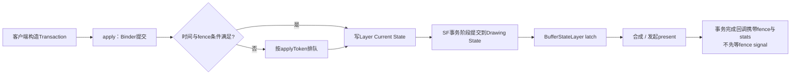
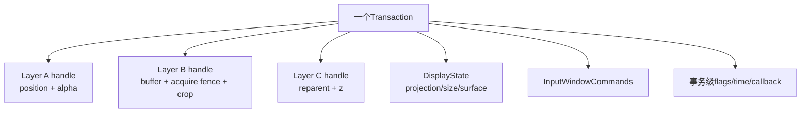
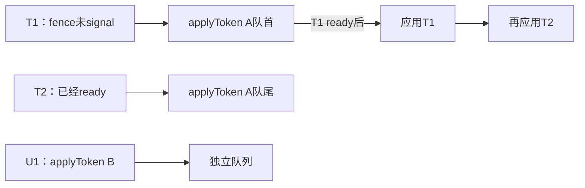
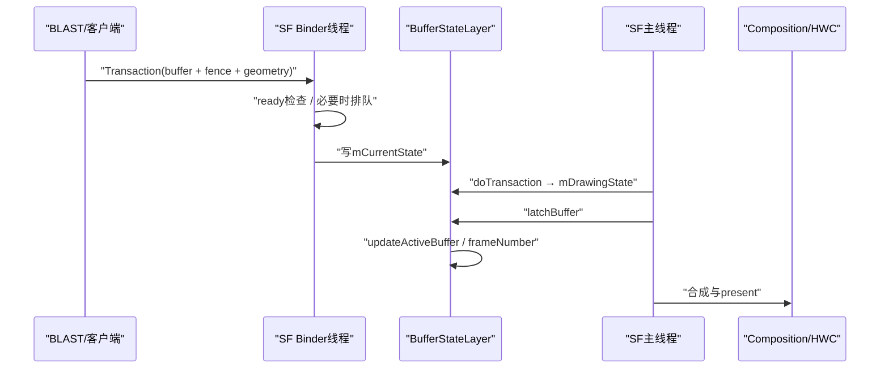
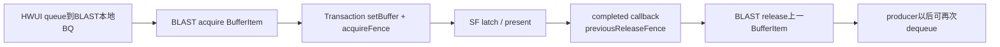

# 164 Android SurfaceControl Transaction、BufferStateLayer 与事务原子性

> 源码版本：Android 11 / API 30 / `android-11.0.0_r48`  
> 学习方式：macOS 只读源码，不要求编译、不要求连接设备  
> 前置章节：第 12、19、21、160、161、162、163 章

---

## 1. 本章要解决什么

第 163 章已经追到 BLAST 把一张应用 buffer 写入 `SurfaceControl::Transaction`。现在需要回答：

> 一个 Transaction 里的 buffer、位置、裁剪、变换和回调，怎样跨 Binder 进入 SurfaceFlinger，并在同一个显示状态提交边界生效？

“事务”这个词很容易让人联想到数据库，但 SurfaceControl Transaction 的保证不同：

```text
它能把多项Layer状态组织成一个提交单元
不提供数据库式持久化
不保证apply返回时屏幕已经显示
不保证不同applyToken的独立事务自动合并
不保证硬件失败后回滚到旧屏幕状态
```

本章解决：

1. Java `SurfaceControl.Transaction` 保存的是 Layer 对象，还是变更记录？
2. `layer_state_t.what` 为什么比字段值本身更重要？
3. 一个 Transaction 如何同时修改多个 Layer 和 Display？
4. `merge()` 冲突时谁覆盖谁，另一个 Transaction 还可否继续用？
5. `apply()` 经过哪些 Java/JNI/native/Binder 边界？
6. 普通 apply 为什么仍是异步语义？
7. `apply(true)` 同步到 commit、latch 还是 present？
8. desired present time 与 acquire fence 为什么会让整个事务排队？
9. apply token 如何保证同一来源事务不越过前序事务？
10. SF 的 global current/drawing state 与 Layer current/drawing state有何区别？
11. `eTransactionNeeded` 与 `eTraversalNeeded` 分别表达什么？
12. BufferStateLayer 什么时候把 buffer 写进 current，什么时候真正 latch？
13. 一帧内连续提交多个 buffer 时，哪个回调拿 previous release fence？
14. transaction completed callback 返回时，present fence 是否已经 signal？
15. BLAST 为什么能依靠 callback 安全 release 本地 consumer buffer？

一句话总览：

> Transaction 在客户端按 SurfaceControl handle 聚合 `layer_state_t` 增量，`what` 位决定哪些字段有效；apply 将多 Layer/Display 状态一次跨 Binder 交给 SF。SF 先按 apply token、desired time 和 acquire fence决定立即应用或排队，再把字段写入 Layer current state；主合成循环通过 `doTransaction()` 和 commit 把可用状态推进到 drawing state，随后 BufferStateLayer 才按 buffer/fence条件 latch。事务 callback 携带 latch/present/release 信息，但 callback 到达不等于其中的 present fence 已 signal。

---

## 2. 先限定“原子性”

本章所说原子性是：

> 同一个 Transaction 中通过权限和对象有效性检查、且满足应用条件的一组 Layer/Display 增量，在一次 SF 事务提交中形成一致的 drawing-state 快照，不暴露这些已接受变更逐字段推进的中间状态。

这不是“全有或全无校验”：无效 Layer、无权限字段可以被单独忽略或登记为 unpresented callback，同一事务中其他合法 Layer/字段仍可应用。这里的原子性强调合法变更共享提交边界，而不是任一字段失败就回滚整笔事务。

它不等于：

| 数据库直觉 | SurfaceControl 实际边界 |
|---|---|
| 写入磁盘后永久存在 | 全是运行期显示状态 |
| apply 成功就完成外部效果 | 普通 apply 只把状态交给 SF |
| 失败自动回滚硬件 | 后续合成/显示有独立错误处理 |
| 所有客户端事务全局串行 | 不同 apply token 有各自队列，仍受 SF 调度 |
| callback 到达表示画面已扫出 | callback 可携带尚未 signal 的 present fence |



---

## 3. 源码地图

```text
frameworks/base/core/java/android/view/
└── SurfaceControl.java

frameworks/base/core/jni/
└── android_view_SurfaceControl.cpp

frameworks/native/libs/gui/
├── SurfaceComposerClient.cpp
├── LayerState.cpp
├── ISurfaceComposer.cpp
└── include/gui/
    ├── SurfaceComposerClient.h
    ├── LayerState.h
    └── ISurfaceComposer.h

frameworks/native/services/surfaceflinger/
├── SurfaceFlinger.cpp
├── Layer.cpp
├── BufferLayer.cpp
├── BufferStateLayer.cpp
├── ClientCache.cpp
└── TransactionCompletedThread.cpp
```

对象关系：

```text
Java SurfaceControl.Transaction
  → native SurfaceComposerClient::Transaction
      → map<surface handle, ComposerState>
          → layer_state_t + what bitmask
      → DisplayState列表
      → InputWindowCommands
      → listener callbacks
      → transaction-level desiredPresentTime/flags
  → ISurfaceComposer.setTransactionState()
  → SurfaceFlinger
```

---

## 4. Java Transaction 是一个可复用的变更收集器

Java 构造函数创建 native 对象：

```java
public Transaction() {
    mNativeObject = nativeCreateTransaction();
    mFreeNativeResources =
            sRegistry.registerNativeAllocation(this, mNativeObject);
}
```

JNI 对应：

```cpp
return reinterpret_cast<jlong>(new SurfaceComposerClient::Transaction);
```

因此 Java 对象主要是 native Transaction 的拥有者，还保存两类只在 Java 侧维护的辅助映射：

```text
mResizedSurfaces     apply前更新Java SurfaceControl宽高缓存
mReparentedSurfaces  apply前通知reparent listener
```

### 4.1 setter 只是积累，不立刻跨进程

调用位置、alpha、crop、layer、reparent 等 setter 时，通常只是找到该 SurfaceControl handle 对应的 `layer_state_t`，写字段并设置 `what` 位。

```text
t.setPosition(a, 10, 20)
t.setAlpha(a, 0.8)
t.setLayer(b, 100)

此时：都还在客户端Transaction中
apply：才统一发送给SurfaceFlinger
```

### 4.2 `apply()` 后对象可复用，但 r48 不是每个成员都重置

Java 文档明确说明 apply 会清空已积累状态，并允许继续向同一个 Transaction 对象加入下一批命令。

更精确地看 native r48 实现，apply 会移走/清空 Layer、Display、listener、input commands，并复位 sync/animation/early-wakeup flags；但它没有在 `apply()` 末尾把 `mDesiredPresentTime` 重置为 `-1`。只有 `clear()` 会重置该字段。

因此复用对象时：

```text
上一批Layer字段       不会再次发送
上一批显示效果         不会因为收集器清空而撤销
desiredPresentTime     可能继续沿用，除非调用方重新设置或clear
```

这是 r48 源码行为，不应只按 Java 文档中的“clearing its state”推断所有 native 成员都回到默认值。

### 4.3 `close()` 不会偷偷 apply

`close()` 释放 native Transaction，对尚未 apply 的变更直接放弃。它不是 try-with-resources 结束时自动提交的事务。

---

## 5. `layer_state_t.what`：真正的增量协议

`layer_state_t` 内有很多字段，但只有 `what` 指定的字段才属于本次变更：

```cpp
uint64_t what;
float x;
float y;
int32_t z;
float alpha;
Rect crop;
Rect frame;
sp<GraphicBuffer> buffer;
sp<Fence> acquireFence;
ui::Dataspace dataspace;
...
```

对应位包括：

```text
ePositionChanged
eLayerChanged / eRelativeLayerChanged
eAlphaChanged
eMatrixChanged
eCropChanged
eFrameChanged
eBufferChanged
eAcquireFenceChanged
eDataspaceChanged
eSurfaceDamageRegionChanged
eReparent
eInputInfoChanged
eHasListenerCallbacksChanged
...
```

### 5.1 为什么不能只看字段值

未设置 `what` 位时，结构中的默认值或旧内存值不是“把属性重置为默认”，而是“这个字段不参与本次事务”。

```text
alpha = 0 且 eAlphaChanged存在     本次确实设置透明
alpha = 0 但 eAlphaChanged不存在  alpha字段应被忽略
```

这是一种典型的 patch/update 协议，而不是整对象替换协议。

### 5.2 flags 还有 mask

Layer flags 更新不是简单覆盖：

```cpp
flags &= ~other.mask;
flags |= (other.flags & other.mask);
mask |= other.mask;
```

只有 mask 指定的 bit 被本次更新，其余 flag 保留。

---

## 6. 一个 Transaction 如何容纳多个 Layer

native Transaction 保存：

```cpp
std::unordered_map<sp<IBinder>, ComposerState, IBinderHash> mComposerStates;
```

key 是 SurfaceControl 的 Binder handle，value 的核心是 `layer_state_t`。



同一个 Layer 多次 setter 不会产生多份 ComposerState，而是在相同 handle 对应的状态上累积。

---

## 7. `merge()`：按字段合并，后者覆盖冲突

Java：

```java
nativeMergeTransaction(mNativeObject, other.mNativeObject);
```

native：

```cpp
transaction->merge(std::move(*otherTransaction));
```

### 7.1 同一 Layer 的冲突

`layer_state_t::merge(other)` 按 `other.what` 覆盖对应字段：

```text
this先设置alpha=0.5
other设置alpha=0.8
this.merge(other)
结果alpha=0.8
```

绝对 z 与相对 z 是互斥语义：合并相对 layer 时会清掉 `eLayerChanged`；合并绝对 layer 时会清掉 `eRelativeLayerChanged`。

metadata 是 key 级 merge，flags 按 mask 合并，callback 集合也会迁移。

### 7.2 other 被清空

Java 文档说明另一个 Transaction 会像已经 apply 一样被清空。它的 native 对象还存在，但不再保留被移走的变更。

### 7.3 r48 的事务级字段有重要边界

本版本 `merge()` 明确合并了：

```text
ComposerState / DisplayState
listener callbacks
InputWindowCommands
mContainsBuffer
early-wakeup相关布尔值
```

但代码没有把 `other` 的：

```text
mDesiredPresentTime
mForceSynchronous
mAnimation
```

合并到接收者，然后 `other.clear()` 会重置它们。

所以不能笼统说“merge 会保留另一个事务的所有语义”。这是 Android 11 r48 的实现边界；使用者应在最终 Transaction 上设置所需的事务级选项。

---

## 8. `apply()`：先清本地快照，再跨 Binder

Java：

```java
public void apply(boolean sync) {
    applyResizedSurfaces();
    notifyReparentedSurfaces();
    nativeApplyTransaction(mNativeObject, sync);
}
```

JNI：

```cpp
transaction->apply(sync);
```

native `apply()`：

1. 整理 listener callback；
2. 对 GraphicBuffer 做跨事务 cache；
3. 把 map 转成 `Vector<ComposerState>`；
4. 复制 DisplayState；
5. 计算 synchronous/animation/early-wakeup flags；
6. 清空客户端已提交的 Layer/Display/callback 状态并复位若干 flags；
7. 调用 `ISurfaceComposer::setTransactionState()`。

```cpp
sf->setTransactionState(composerStates, displayStates, flags,
        applyToken, mInputWindowCommands, mDesiredPresentTime,
        ..., hasListenerCallbacks, listenerCallbacks);
```

注意上节的 r48 边界：发送后 `mDesiredPresentTime` 没有在 `apply()` 中重置，复用同一对象可能沿用旧值。

### 8.1 Binder 是同步调用，不等于显示语义同步

普通 Binder transact 会等待服务端 `setTransactionState()` 返回；但服务端通常只更新 current state、设置 transaction flags，然后返回。

因此：

```text
Binder调用返回       服务端已接收/处理到API边界
SF commit             current推进到drawing
Layer latch           buffer成为本帧活动内容
present               合成结果交给显示管线
```

四者不能合并成一个“apply完成”。

---

## 9. Parcel：完整字段传输，`what` 决定消费

`ComposerState::write()` 调用 `layer_state_t::write()`，顺序写入：

```text
surface handle
what
position/z/size/alpha/flags/matrix
crop/reparent/defer信息
transform/frame
GraphicBuffer
acquire Fence
dataspace/HDR/damage/API
color transform/input info/metadata
listeners/frame-rate/fixed transform hint
```

接收端严格按同一顺序 read。

即使很多字段本次未改变，结构仍按协议读写；SF 后续只按 `what` 分支调用 Layer setter。

### 9.1 GraphicBuffer 与 fence 怎样跨进程

第 162 章已经说明：

- GraphicBuffer flatten 会传元数据、handle fd/ints；
- Binder 复制 fd 引用，接收端导入；
- Fence 自身也通过 fd 传递同一硬件时间线条件；
- 指针值和 fd 数字不会作为跨进程身份。

---

## 10. Buffer cache：避免同一 GraphicBuffer 反复传输

客户端 `cacheBuffers()` 会为 buffer 分配 `token + cache id`：

```text
首次：发送buffer + cache id
命中：去掉完整buffer，只发送cache id
淘汰：单独发送uncache transaction
```

SF 的 `ClientCache` 以 client cache id 找回 GraphicBuffer，并通过 token 的 Binder death 清理进程缓存。

它类似第 162 章 BufferQueue slot cache 的目标——减少稳定复用时的 Binder 数据——但不是同一张表：

```text
BufferQueue slot cache    producer/consumer队列协议
Surface transaction cache SurfaceComposerClient与SF之间的buffer传输优化
HWC buffer cache          SF与composer HAL之间的slot缓存
```

三者不能用同一个 slot/id 概念代替。

---

## 11. SF Binder 入口：从 Parcel 恢复 Transaction

`ISurfaceComposer.cpp` 的 `SET_TRANSACTION_STATE` 分支依次读取：

```text
ComposerState数量和每项状态
DisplayState数量和每项状态
state flags
applyToken
InputWindowCommands
desiredPresentTime
uncacheBuffer
hasListenerCallbacks
listener callback列表
```

然后进入：

```cpp
SurfaceFlinger::setTransactionState(...)
```

此时发生第二个重要线程边界：调用通常进入 SF Binder 线程，而最终 traversal/commit/composition 由 SF 主线程推进。

---

## 12. apply token：为来源建立有序队列

客户端取：

```cpp
sp<IBinder> applyToken =
        IInterface::asBinder(TransactionCompletedListener::getIInstance());
```

SF 以它作为 `mTransactionQueues` 的 key。

如果同一 apply token 已有 pending transaction，那么后来事务也必须排到后面，即便后来事务自身已经满足时间/fence条件。



源码注释明确：同一进程的事务按 apply 顺序 present，desired present time 不改变这个顺序。

但不同 token 的事务没有“自动成为一个全局原子事务”的承诺。需要一起生效的变更，应在客户端先 merge 到同一个 Transaction。

---

## 13. 事务何时进入 pending queue

`transactionIsReadyToBeApplied()` 检查两类条件。

### 13.1 desired present time

```cpp
if (desiredPresentTime >= 0 &&
    desiredPresentTime >= expectedPresentTime &&
    desiredPresentTime < expectedPresentTime + 1s) {
    return false;
}
```

含义：

- 已经过期：尽快应用；
- 位于未来 1 秒以内：先排队等合适周期；
- 超过未来 1 秒：为稳定性忽略过远时间，不让事务长期卡住。

desired time 是期望，不是 exact alarm，也不保证正好在该纳秒 present。

### 13.2 acquire fence

若事务包含 `eAcquireFenceChanged` 且 fence 仍 unsignaled，整个 Transaction 暂不应用。

这很重要：

> 为保持事务原子性，不能先应用几何，再等 buffer fence；包含它们的整个提交单元一起等待。

`flushTransactionQueues()` 由 SF 主循环重新检查，队首未 ready 时保留队列并设置 flush-needed flag。

---

## 14. `applyTransactionState()`：把 patch 写进 current state

SF 持有 `mStateLock`，先应用 DisplayState，再遍历 ComposerState：

```cpp
for (const ComposerState& state : states) {
    clientStateFlags |= setClientStateLocked(state, ...);
}
```

`setClientStateLocked()` 根据 `what` 调用：

```text
setPosition / setLayer / setRelativeLayer
setSize / setAlpha / setMatrix / setCrop
reparent / detach / metadata / input info
setBuffer / setAcquireFence / setDataspace
setTransactionCompletedListeners
```

这些 setter 主要更新 Layer 的 `mCurrentState`，标记 `modified`，并设置 Layer 自己的 transaction flags。

### 14.1 权限不是 Transaction 一次性全有或全无

部分字段需要 `ACCESS_SURFACE_FLINGER` 等特权，例如 input info、某些 early wakeup 或 frame-rate priority。SF 会按字段检查，未授权字段可被拒绝/忽略并记录错误。

不要把“能拿到 SurfaceControl”扩大成“能改所有 privileged Layer 状态”。

---

## 15. 两组 current/drawing state

源码里至少有两层双缓冲状态。

### 15.1 SurfaceFlinger 全局 State

```text
mCurrentState   客户端事务不断写入的Layer树/Display集合
mDrawingState   当前主循环用于遍历、合成的稳定快照
```

`commitTransactionLocked()`：

```cpp
mDrawingState = mCurrentState;
```

并提交 child list、offscreen layer、mirror info 等。

### 15.2 每个 Layer 的 State

```text
Layer::mCurrentState   setter写入的请求状态
Layer::mPendingStates  defer/同步条件下等待的状态序列
Layer::mDrawingState   Layer本轮可供可见性/合成读取的状态
```

`Layer::doTransaction()`：

```text
pushPendingState()
applyPendingStates(&candidate)
doTransactionResize(...)
commitTransaction(candidate)
```

最终：

```cpp
mDrawingState = stateToCommit;
```

### 15.3 为什么需要双份

Binder 线程可以不断接收新状态；SF 主循环需要一个在本轮 traversal/composition 中保持一致的快照。current/drawing 分离避免遍历到一半结构被另一笔事务改写。

---

## 16. `eTransactionNeeded` 与 `eTraversalNeeded`

粗略区分：

| flag | 作用 |
|---|---|
| `eTransactionNeeded` | 需要把 current/pending 状态推进并提交 |
| `eTraversalNeeded` | Layer树几何、Z、可见区域、输入等需要重新遍历计算 |

某些变更只需要 transaction；位置、Z、reparent、buffer、input 等常会要求 traversal。

SF 用原子 `mTransactionFlags.fetch_or()` 合并请求，并在 flag 首次出现时唤醒主线程。它与 ViewRootImpl 的 `mTraversalScheduled` 类似，都是“把多次变更合并到一次循环”，但运行在完全不同的进程和调度器中。

---

## 17. normal、synchronous 与 animation transaction

### 17.1 普通 apply

普通事务在 SF 写 current state、设置调度 flag 后即可从 Binder 返回。它不等待 commit，更不等待 present。

### 17.2 `apply(true)`

Java 注释直接称它为更卡顿的版本。对已经满足 desired-time/acquire-fence条件、可立即进入 `applyTransactionState()` 的事务，SF 设置 `mTransactionPending`，非 SF 主线程调用者等待 condition variable；`commitTransaction()` 后清掉 pending 并 broadcast。

所以这条直接应用路径的同步边界是：

> 等 SF 执行事务 commit，使 current 状态推进到 drawing 状态的主循环边界。

但有一个容易漏读的例外：`setTransactionState()` 若发现同 apply token 已有 pending 事务，或本事务 desired time/fence 未 ready，会先放入 `mTransactionQueues` 然后直接 return。这个分支不会让原调用者继续等到未来 flush/commit，即使 flags 中带 `eSynchronous`。

因此 r48 的准确表述是：

```text
ready且直接应用的apply(true)       等本轮SF commit或5秒超时
先进入TransactionQueue的apply(true) 提交入队后即可返回，未来由SF主线程flush
```

它仍不等于：

```text
buffer acquire fence之后的最终latch
HWC present fence signal
面板扫描完成
```

并且有 5 秒超时防止永久卡死。

### 17.3 animation transaction

同一 apply token 已有 pending transaction 时，animation transaction 会等待前序应用，最长同样有超时；SF 还用 `mAnimTransactionPending` 做 back-pressure 和本轮动画合成标记。

early-wakeup flags 影响 VSync phase 调度，其中显式 start/end 仅允许 WindowManager 等特权调用者使用。

---

## 18. legacy defer transaction 与新队列条件

Layer 仍支持 legacy：让某个 Layer 状态等另一个 barrier Layer 到达指定 frame number。

`pushPendingState()` 会创建 SyncPoint，挂到 barrier Layer；`applyPendingStates()` 只有在 `frameIsAvailable()` 后才 pop 并 commit，否则保留 pending state 并继续请求 traversal。

这与事务入口的 desired-time/acquire-fence queue 是两层机制：

```text
SF TransactionQueue   整个setTransactionState在进入Layer setter前等待
Layer pending states  已写入Layer current后，按legacy frame barrier延迟drawing提交
```

Android 11 r48 正处在 BLAST 迁移中，代码注释也建议很多新场景直接把 buffer transaction 与几何 transaction merge，而不是继续依赖 legacy defer。

---

## 19. BufferStateLayer：buffer 是 Layer state 的一个字段

BLAST 构造的 native Transaction 包含：

```cpp
setBuffer(surfaceControl, buffer)
setAcquireFence(surfaceControl, fence)
setFrame(...)
setCrop(...)
setTransform(...)
setDesiredPresentTime(...)
```

SF 解析 cache 后调用：

```cpp
layer->setBuffer(buffer, s.acquireFence,
                 postTime, desiredPresentTime, s.cachedBuffer);
```

`BufferStateLayer::setBuffer()`：

```cpp
if (mCurrentState.buffer) {
    mReleasePreviousBuffer = true;
}
mCurrentState.frameNumber++;
mCurrentState.buffer = buffer;
mCurrentState.clientCacheId = clientCacheId;
mCurrentState.modified = true;
setTransactionFlags(eTransactionNeeded);
```

这里仍只是写 current state。`mBufferInfo.mBuffer` 代表当前实际 active buffer，要等后续 latch 的 `updateActiveBuffer()` 才替换。

---

## 20. 为什么 BufferStateLayer 的 acquire fence 看起来已 signal

`setAcquireFence()` 有注释：

```cpp
// The acquire fences of BufferStateLayers have already signaled before they are set
```

原因不是 producer 提交时 fence 天生已完成，而是 r48 的 SF TransactionQueue 在调用 `setClientStateLocked()` 前已经用 `transactionIsReadyToBeApplied()` 拦住 unsignaled acquire fence。

所以要按两段读：

```text
客户端Transaction中的acquire fence   可以pending
进入BufferStateLayer current state时  正常应已经signal
```

传统 BufferQueueLayer 不走这套 Transaction buffer入口，它在 `latchBuffer()` 前检查队首 BufferItem 的 acquire fence。

---

## 21. BufferStateLayer 从 current 到 active buffer

### 21.1 transaction 阶段

`Layer::doTransaction()` 将满足条件的状态复制到 Layer drawing state。BufferStateLayer 额外记住：本次 drawing 候选是否来自 modified current state。

### 21.2 latch 阶段

共同 `BufferLayer::latchBuffer()` 检查 ready、refresh pending、fence、同步点，然后调用：

```text
updateTexImage()
updateActiveBuffer()
updateFrameNumber()
gatherBufferInfo()
```

`BufferStateLayer::updateActiveBuffer()` 才执行：

```cpp
mPreviousBufferId = getCurrentBufferId();
mBufferInfo.mBuffer = mDrawingState.buffer;
mBufferInfo.mFence = mDrawingState.acquireFence;
```

因此“setBuffer 已执行”与“Layer 当前用于合成的 buffer 已替换”是两个完成点。



---

## 22. buffer 尺寸与几何为什么要一起 latch

legacy BufferQueueLayer 在 resize 时会避免把新几何立即套在旧 buffer 上，直到正确尺寸 buffer 到达；否则可能短暂拉伸、裁剪错误或露出背景。

BufferStateLayer/BLAST 的目标正是让：

```text
buffer
frame/crop
transform
position/relative state
acquire fence
```

以一个 Transaction 到达 SF，降低几何和内容错拍。

但“同事务”只解决状态配对；buffer仍需满足 fence、时间和 Layer latch 条件。

---

## 23. 一帧内连续提交多个 buffer

`BufferStateLayer::onLayerDisplayed()` 的长注释给出重要语义。

假设同一显示帧中有三笔事务：

```text
T1：只改alpha，不换buffer
T2：buffer A → buffer B
T3：buffer B → buffer C
```

最终显示的是 C：

- T1 不释放 A，因为该时刻 Layer 仍需要 A；
- 第一笔真正替换旧显示 buffer 的 T2 callback 需要得到 A 的 previous release fence；
- B 在本帧内又被 C 覆盖，B没有真正显示，可更早释放；
- T3 不应再次声称自己释放了同一个 A。

代码遍历 drawing callback handles，只给第一个 `releasePreviousBuffer` 的 handle 填 previous release fence，然后 break。

这说明 release fence 是“某次替换所释放的上一张实际显示 buffer”的完成条件，不是每笔 `setBuffer()` 都机械产生一个独立显示 release fence。

---

## 24. Transaction completed callback 状态机

客户端注册 callback 后，SF 为每个相关 SurfaceControl 创建 `CallbackHandle`。

Handle 可携带：

```text
latchTime
frameNumber
acquireTime
previousReleaseFence
transformHint
gpuCompositionDoneFence
refreshStartTime
dequeueReadyTime
compositorTiming
```

### 24.1 pending 与 unpresented

若 Layer 的当前 transaction 需要重新 latch/present：

```text
registerPendingCallbackHandle()
handle暂存在Layer current/drawing state
```

若变更不需要重新 present，或者 Layer 无效：

```text
registerUnpresentedCallbackHandle()
```

回调线程还会保持同一 listener 的 transaction callback 顺序；前一笔 pending 未完成时，后一笔不会越过。

### 24.2 何时 finalize

SF `postComposition()` 先让本轮 queued layers 执行 `releasePendingBuffer()`，把 callback handles 移入 TransactionCompletedThread；随后取得本轮 HWC present fence，调用：

```cpp
mTransactionCompletedThread.addPresentFence(...);
mTransactionCompletedThread.sendCallbacks();
```

### 24.3 callback 到达不等于 present fence 已 signal

回调携带 `presentFence` 对象。回调线程并没有先 `waitForever()` 等 fence signal 再调用客户端。

所以：

```text
callback到达        SF已完成本轮相应提交/统计组装
presentFence signal 合成结果到达该fence定义的显示完成点
```

需要硬完成时间的调用者应检查/等待 fence 或使用 frame timeline 数据，不能只看 callback 被调用。

---

## 25. BLAST 如何用 callback 释放本地 BufferQueue

第 163 章看到 BLAST：

1. 从客户端本地 BufferQueue acquire BufferItem；
2. 把 GraphicBuffer 与 acquire fence 写进 SF Transaction；
3. 注册 transaction-completed callback；
4. callback 获得 `previousReleaseFence`；
5. 用该 fence release 上一项本地 BufferItemConsumer buffer；
6. 继续处理下一张 buffer。



这条链保持了第 162 章的原则：逻辑 release 可以先发生，真正安全复用由 release fence 约束。

---

## 26. Transaction callback、frame commit callback 与 present listener

几个名字相似但层级不同：

| 回调/完成点 | 所在层 | 主要语义 |
|---|---|---|
| HWUI FrameCompleteCallback | 应用 RenderThread | draw/swap或空帧完成边界，不是SF present |
| SurfaceControl transaction completed callback | SF事务 | 可返回latch/present/release统计与fence |
| BLAST transaction callback | 客户端BLAST | 消费SF返回stats，释放本地BufferItem |
| present fence signal | HWC/display时间线 | 描述实际present完成条件 |

不要只看到单词 commit/completed 就认为它们等价。

---

## 27. 一个窗口 resize 的完整例子

假设窗口从 600×800 变为 800×600，并产生新 buffer。

### 27.1 容易出错的非原子顺序

```text
事务1：Layer frame先变800×600
屏幕刷新：旧600×800 buffer被套进新几何
事务2：新buffer到达
```

中间一帧可能错误缩放或裁剪。

### 27.2 BLAST 合并后的顺序

```text
WMS/ViewRoot准备一份同步Transaction
BLAST收到新800×600 buffer
把buffer/fence/frame/crop/transform写进该Transaction
apply给SF
SF等acquire fence与目标时间满足
current→drawing一起推进
Layer latch新buffer并使用匹配几何
```

### 27.3 仍不能保证什么

- GPU 一定按目标周期完成；
- HWC 不会因系统负载错过目标刷新；
- apply 返回时用户已看到横屏；
- 其他独立 Surface 的事务自动与它同步。

---

## 28. 事务丢失、覆盖与顺序思维

### 28.1 同一 Transaction 内重复 setter

后一次覆盖同一字段；不同字段共同保留。

### 28.2 merge

other 对冲突字段覆盖 this；other 随后清空。事务级选项在 r48 不一定被完整迁移。

### 28.3 同一 apply token 的多次 apply

若前一笔 pending，后一笔排队，不能越过。

### 28.4 不同 apply token

各自可独立进入 SF。若业务需要 A、B 两个 Layer 同时变化，最稳妥的表达是把它们放进同一个 Transaction，而不是依赖两个线程“差不多同时 apply”。

### 28.5 current 中间值会不会显示

Binder 线程可能连续把多个事务写入 current；只有主线程 commit/latch 的 drawing snapshot 才参与该轮显示。中间 current 状态可能被后续事务覆盖而从未成为可见帧。

这不是数据丢失 bug，而是显示系统允许合并中间状态以追赶最新画面的结果。

---

## 29. 卡顿与故障定位

| 现象 | 优先查看 |
|---|---|
| apply普通调用偶尔慢 | Binder线程、mStateLock竞争、Parcel/GraphicBuffer传输 |
| apply(true)很慢 | 直接应用路径等SF commit、mStateLock/主循环拥堵、5秒timeout；先入TransactionQueue则另查异步flush |
| 事务长期pending | desired time、acquire fence、applyToken队首 |
| 几何更新但buffer没换 | 是否同一Transaction、buffer cache解析、latch条件 |
| buffer到达但callback不来 | pending handle是否finalize、Layer是否removed/detached、present周期 |
| callback来了但buffer仍不可复用 | previousReleaseFence尚未signal |
| 不同Layer出现错拍 | 是否由不同Transaction/applyToken提交 |
| SF频繁重新算可见区 | Z/reparent/position/crop/input等持续触发traversal |

### 29.1 三条 trace 轴

```text
客户端：Transaction build / apply / Binder wait
SurfaceFlinger：transaction queue / commit / latch / composition
硬件：acquire / GPU done / present / release fence
```

只看某一条线程难以证明“原子状态何时真正可见”。

---

## 30. macOS 只读练习

### 练习 1：验证 Java apply/merge/close

```bash
sed -n '2270,2370p' \
  frameworks/base/core/java/android/view/SurfaceControl.java
sed -n '3025,3070p' \
  frameworks/base/core/java/android/view/SurfaceControl.java
```

目标：说明 apply 后可复用、merge 会清 other、close 不提交，并核对 desired present time 是否随 apply 重置。

### 练习 2：识别 `what` 位

```bash
sed -n '70,230p' \
  frameworks/native/libs/gui/include/gui/LayerState.h
```

目标：从 buffer、fence、crop、frame、reparent 各找一个 changed bit。

### 练习 3：手算 merge

```bash
sed -n '270,365p' \
  frameworks/native/libs/gui/LayerState.cpp
```

目标：解释绝对Z/相对Z互斥、flags mask以及后值覆盖。

### 练习 4：检查 r48 事务级 merge 边界

```bash
sed -n '510,575p' \
  frameworks/native/libs/gui/SurfaceComposerClient.cpp
```

目标：列出 merge 了与没有 merge 的成员。

### 练习 5：追 apply Binder 参数

```bash
sed -n '630,725p' \
  frameworks/native/libs/gui/SurfaceComposerClient.cpp
sed -n '65,115p' \
  frameworks/native/libs/gui/ISurfaceComposer.cpp
```

目标：画出 composer/display/input/time/callback 五组数据。

### 练习 6：验证 pending queue

```bash
sed -n '3250,3410p' \
  frameworks/native/services/surfaceflinger/SurfaceFlinger.cpp
```

目标：解释 desired time、acquire fence、applyToken FIFO。

### 练习 7：区分普通与同步事务

```bash
sed -n '3470,3535p' \
  frameworks/native/services/surfaceflinger/SurfaceFlinger.cpp
sed -n '3005,3025p' \
  frameworks/native/services/surfaceflinger/SurfaceFlinger.cpp
```

目标：找到 `mTransactionPending` 在哪里置位和清除，再找 pending queue 的提前 return，说明同步语义的两个分支且都不等 present。

### 练习 8：追 Layer current→drawing

```bash
sed -n '770,1020p' \
  frameworks/native/services/surfaceflinger/Layer.cpp
```

目标：标出 push、apply pending、commit 四步。

### 练习 9：追 BufferStateLayer set 与 latch

```bash
sed -n '250,325p' \
  frameworks/native/services/surfaceflinger/BufferStateLayer.cpp
sed -n '580,620p' \
  frameworks/native/services/surfaceflinger/BufferStateLayer.cpp
```

目标：区分 `mCurrentState.buffer` 与 `mBufferInfo.mBuffer`。

### 练习 10：追 previous release fence

```bash
sed -n '70,125p' \
  frameworks/native/services/surfaceflinger/BufferStateLayer.cpp
```

目标：用三事务例子解释为什么只有第一个替换者拿旧显示buffer的release fence。

### 练习 11：验证 callback 不等待 fence signal

```bash
sed -n '220,335p' \
  frameworks/native/services/surfaceflinger/TransactionCompletedThread.cpp
sed -n '2240,2275p' \
  frameworks/native/services/surfaceflinger/SurfaceFlinger.cpp
```

目标：找到 present fence 被装入 stats 后直接 Binder callback 的路径。

---

## 31. 复读后补强的易懂版本

### 31.1 Transaction 像一张“修改清单”

它不是 Layer 的完整副本。`what` 像每一行前的勾选框：只有勾选的属性才更新。没勾选的字段即使内存里有零值，也不应覆盖旧状态。

### 31.2 current 与 drawing 像编辑稿和发布稿

Binder 线程在 current 上继续编辑；SF 主循环只用 drawing 做本轮排版和合成。commit 是把满足条件的编辑稿发布成一致快照，不是把它显示到面板的最后一步。

### 31.3 acquire 与 release fence 像交接条件

acquire fence 说明“新作品何时写完可读”；previous release fence 说明“旧作品何时不再被显示系统使用可复用”。事务把作品与交接条件一起传递。

### 31.4 callback 为什么带 fence 而不是等完再通知

异步图形系统希望 CPU 不因硬件执行时间停住。回调先把 fence 交给客户端，客户端可继续管理队列；真正要复用 buffer 时再按 fence 等待。

### 31.5 原子不等于零延迟

原子保证一组状态不被拆开显示，不保证它立刻显示。它可以因为时间、fence、前序事务、VSync或合成负载等待。

### 31.6 merge 不等于万能拼接

Layer字段能按 what 合并，但 r48 的 desired present time、sync/animation等事务级语义不会全部从 other 迁移。最终发送者必须重新确认事务级配置。

### 31.7 apply 后可复用不等于所有配置都自动归零

r48 的 Layer patch 会被取走，sync/animation flags会复位，但 desired present time会保留。长生命周期复用 Transaction 时，必须把这个“粘性事务级字段”纳入审查。

---

## 32. 本章核心结论

1. SurfaceControl Transaction 是按 Layer handle 聚合的增量修改清单。
2. `layer_state_t.what` 决定字段是否有效；未置位字段不会覆盖旧状态。
3. 同一 Transaction 可包含多 Layer、Display、输入命令、时间与 callback。
4. 同一字段 merge 时 other 覆盖 this，other 随后清空。
5. r48 merge 不完整迁移 desired time、sync、animation等事务级语义。
6. apply 才跨 JNI/Binder；普通 apply 返回不代表 commit、latch或present；r48 apply后desired present time还可能保留。
7. GraphicBuffer可用client cache id减少重复Binder传输，它不同于BQ/HWC slot cache。
8. SF 按 apply token 保持 pending transaction 的FIFO顺序。
9. 未来1秒内desired time或unsignaled acquire fence会让整个事务等待。
10. SF和每个Layer都维护current/drawing状态，隔离异步写入与稳定合成快照。
11. `eTransactionNeeded`要求推进状态，`eTraversalNeeded`要求重算Layer树相关结果。
12. ready并直接应用的`apply(true)`最多等SF commit边界并有5秒兜底；先入TransactionQueue的同步事务会先返回、以后异步flush；两者都不等待显示present。
13. BufferStateLayer `setBuffer`只写current，latch时才更新active `mBufferInfo`。
14. 一帧多次换buffer时，只有第一笔真正替换旧显示buffer的handle需要旧buffer release fence。
15. transaction callback可携带present/release fence，但callback到达不表示fence已signal。
16. BLAST依靠previous release fence把SF的显示完成条件接回本地BufferQueue所有权环。

---

## 33. 自测题

1. 为什么不能只看 `layer_state_t.alpha` 判断本次是否改了透明度？
2. 一个 Transaction 怎样区分多个 SurfaceControl？
3. 同一 Layer 两次 setPosition 后保留哪个值？
4. merge 后 other 还能保留原变更吗？
5. r48 merge 会丢掉 other 的哪些事务级语义？
6. 普通 Binder transact 返回为什么仍是显示异步语义？复用Transaction时哪个时间字段可能保留？
7. GraphicBuffer transaction cache 与 BufferQueue slot cache有何区别？
8. apply token 解决什么顺序问题？
9. desired present time超过未来1秒为什么可能被忽略？
10. acquire fence未signal时，为什么等待整个事务而不是只等buffer？
11. SF global current/drawing与Layer current/drawing各自做什么？
12. `eTransactionNeeded` 与 `eTraversalNeeded` 有何不同？
13. `apply(true)` 的ready直达与pending queue两条路径分别等待到哪里，返回能否证明HWC present完成？
14. legacy defer与TransactionQueue pending有何区别？
15. BufferStateLayer的current buffer何时变成active buffer？
16. 为什么一帧连续换三张buffer不会得到三份同等含义的release fence？
17. callback到达与present fence signal有何区别？
18. BLAST为什么必须保存submitted BufferItem直到SF callback？
19. 两个线程分别apply两个Transaction能否自动成为一个原子提交？
20. current中的中间状态没有显示，是否必然是事务丢失？

能独立回答这 20 题，就能正确阅读 WMS、Shell transition、BLAST、SurfaceView 和 SurfaceFlinger 中的大部分 Transaction 代码。

---

## 34. 下一章预告

第 165 章继续深入 SurfaceFlinger 的时间轴：

> Android Scheduler、VSyncModulator、EventThread 与 App/SF 双 VSync 相位。

重点解释硬件 VSync 如何进入 DispSync/Scheduler，App 与 SF 为何使用不同 phase offset，事务 early-wakeup 怎样改变调度，以及一张已经 ready 的 buffer 为什么仍可能错过目标刷新周期。
