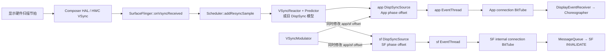
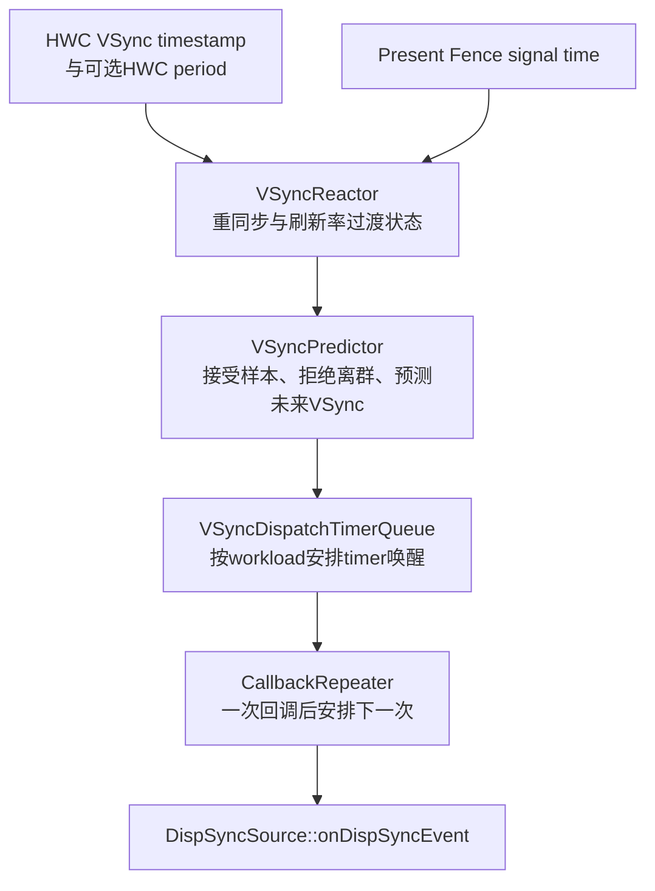
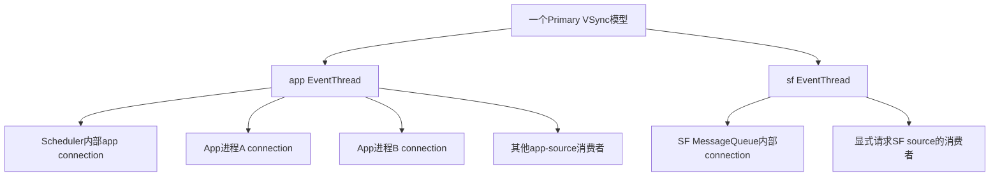
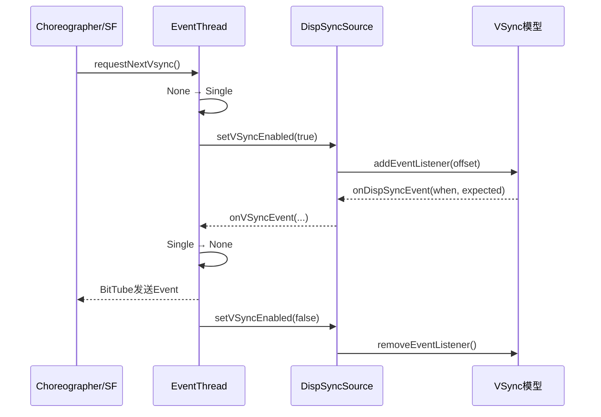
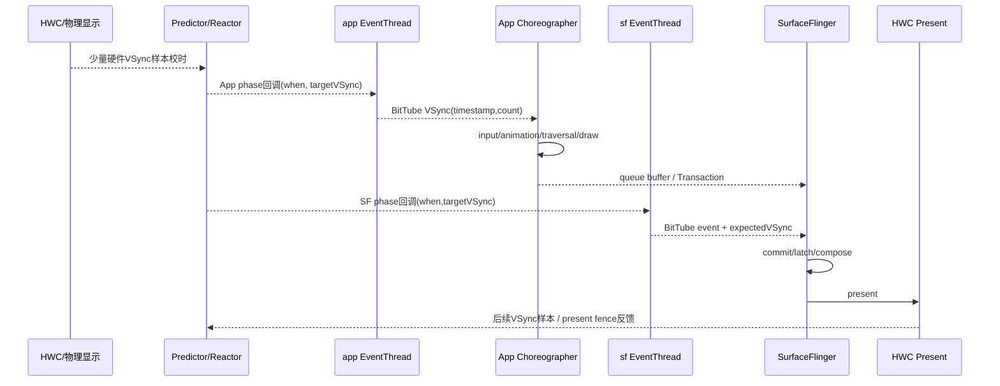

# 165 Android Scheduler、VSyncModulator、EventThread 与 App/SF 双 VSync 相位

> 源码版本：Android 11 / API 30 / `android-11.0.0_r48`  
> 学习方式：macOS 只读源码，不要求编译、不要求连接设备  
> 前置章节：第 21、155、161、163、164 章

---

## 1. 本章要解决什么

第 163 章讲过，应用通过 `Choreographer` 在 VSync 附近开始生产一帧；第 164 章又讲到，SurfaceFlinger（后文简称 SF）在自己的合成节拍中提交 Layer 状态。

但这里很容易产生三个误解：

```text
误解一：App VSync 和 SF VSync 来自两套显示硬件
误解二：VSync 回调时间戳就是回调真正执行的时刻
误解三：关掉 hardware VSync 就代表屏幕不刷新了
```

实际情况是：

> Android 11 通常从主显示器的一套硬件 VSync 样本建立软件预测模型，再由同一个模型按不同 phase offset 派生 App 和 SF 两路软件回调。App 路驱动 Choreographer，SF 路驱动 SurfaceFlinger 主循环。`VSyncModulator` 又会依据事务、刷新率切换和 GPU 合成状态，在 late、early、earlyGl 三组 App/SF offset 之间切换。

本章回答：

1. HWC 的硬件 VSync 怎样进入 SF？
2. `Scheduler` 为什么会主动开关硬件 VSync 事件？
3. Android 11 r48 到底使用旧 `DispSync`，还是新 `VSyncReactor`？
4. 软件预测 VSync 为什么不能理解成简单的固定周期定时器？
5. App 与 SF 两路 VSync 是在哪里创建的？
6. `phaseOffset` 的正负分别代表什么？
7. `when` 和 `expectedVSyncTimestamp` 为什么是两个时间？
8. `EventThread` 何时启用、停用自己的 VSyncSource？
9. one-shot、periodic 和每 N 个周期回调怎样实现？
10. BitTube 如何把事件送进应用进程？
11. SF 自己为何也通过 EventThread 和 BitTube 接收 VSync？
12. `VSyncModulator` 为什么要有 late、early、earlyGl 三套相位？
13. early transaction 结束后为什么还保留至少两帧？
14. RenderEngine 参与一次后，earlyGl 为什么也不会立即退出？
15. 刷新率切换时为什么必须暂时使用 early offsets？

---

## 2. 先建立一张全链路图



先记住四个角色：

| 角色 | 主要职责 | 不负责什么 |
|---|---|---|
| HWC hardware VSync | 提供真实显示节拍样本 | 不直接逐个唤醒所有 App |
| VSyncReactor/DispSync | 用样本维护周期与相位模型，预测未来节拍 | 不执行应用 View 绘制 |
| EventThread | 按连接请求过滤、封装和发送显示事件 | 不决定 View 回调顺序 |
| VSyncModulator | 根据 SF 状态选择 App/SF 的相位组合 | 不改变面板物理刷新率本身 |

---

## 3. 源码地图

```text
frameworks/native/services/surfaceflinger/
├── SurfaceFlinger.cpp
├── SurfaceFlingerDefaultFactory.cpp
└── Scheduler/
    ├── Scheduler.cpp / Scheduler.h
    ├── DispSync.cpp / DispSync.h
    ├── DispSyncSource.cpp / DispSyncSource.h
    ├── VSyncReactor.cpp / VSyncReactor.h
    ├── VSyncPredictor.cpp / VSyncPredictor.h
    ├── VSyncDispatchTimerQueue.cpp / .h
    ├── EventThread.cpp / EventThread.h
    ├── MessageQueue.cpp / MessageQueue.h
    ├── VSyncModulator.cpp / VSyncModulator.h
    └── PhaseOffsets.cpp / PhaseOffsets.h

frameworks/native/libs/gui/
├── DisplayEventReceiver.cpp
└── DisplayEventDispatcher.cpp

frameworks/base/core/jni/
└── android_view_DisplayEventReceiver.cpp

frameworks/base/core/java/android/view/
├── DisplayEventReceiver.java
└── Choreographer.java
```

建议阅读顺序不是按目录，而是按数据流：

```text
SurfaceFlinger::onVsyncReceived
  → Scheduler::addResyncSample
  → VSyncReactor/DispSync
  → DispSyncSource
  → EventThread
  → EventThreadConnection::postEvent
  → DisplayEventReceiver / DisplayEventDispatcher
  → Java DisplayEventReceiver
  → Choreographer
```

再单独阅读控制流：

```text
SurfaceFlinger状态变化
  → VSyncModulator
  → Scheduler::setPhaseOffset
  → EventThread::setPhaseOffset
  → DispSyncSource::setPhaseOffset
  → 预测回调时间改变
```

---

## 4. 第一层：硬件 VSync 怎样进入 SurfaceFlinger

HWC 把主显示器的 VSync 回调交给 SF 后，入口在：

```cpp
void SurfaceFlinger::onVsyncReceived(
        int32_t sequenceId,
        hal::HWDisplayId hwcDisplayId,
        int64_t timestamp,
        std::optional<hal::VsyncPeriodNanos> vsyncPeriod) {
    Mutex::Autolock lock(mStateLock);

    if (sequenceId != getBE().mComposerSequenceId) return;
    if (!getHwComposer().onVsync(hwcDisplayId, timestamp)) return;
    if (hwcDisplayId != getHwComposer().getInternalHwcDisplayId()) return;

    bool periodFlushed = false;
    mScheduler->addResyncSample(timestamp, vsyncPeriod, &periodFlushed);
    if (periodFlushed) {
        mVSyncModulator->onRefreshRateChangeCompleted();
    }
}
```

这里有三道过滤：

1. `sequenceId` 必须属于当前 HWC 连接代际，旧 Composer 的迟到回调被丢弃；
2. `HWComposer::onVsync()` 还会校验显示器和时间戳状态；
3. r48 这里只把 internal display 的 VSync 交给主预测模型，外接屏回调暂不用于这条链。

`timestamp` 是硬件事件对应的单调时钟时间，不是 SF C++ 函数真正开始执行的墙上时钟。线程被调度晚了，二者就会有差值。

---

## 5. 为什么不是让每个 App 直接监听 HWC

如果每个应用都直接依赖硬件中断通知，会出现：

- 硬件事件扇出给大量进程，功耗和调度抖动大；
- 需要提前唤醒 App 或 SF 时，硬件 VSync 本身已经太晚；
- 刷新率切换、漏中断或 driver stall 时难以统一修正；
- App 和 SF 需要不同工作预算，不能只用一个回调时刻；
- present fence 暴露的真实完成偏差无法反馈进统一模型。

因此 Android 用少量硬件样本校准模型，再预测未来 VSync，并在预测点之前或之后按 offset 发软件回调。

一句话：

> 硬件 VSync 是校时样本，软件 VSync 是可调度的工作起点。

---

## 6. r48 的默认实现：VSyncReactor，而不是只看见 DispSync 就认定旧实现

`Scheduler.cpp` 的工厂非常关键：

```cpp
std::unique_ptr<DispSync> createDispSync(bool supportKernelTimer) {
    if (property_get_bool("debug.sf.vsync_reactor", true)) {
        auto tracker = std::make_unique<VSyncPredictor>(...);
        auto dispatch = std::make_unique<VSyncDispatchTimerQueue>(...);
        return std::make_unique<VSyncReactor>(
                ..., std::move(dispatch), std::move(tracker), ...);
    } else {
        return std::make_unique<impl::DispSync>("SchedulerDispSync", ...);
    }
}
```

结论：

> 在这份 Android 11 r48 源码里，`debug.sf.vsync_reactor` 的默认值是 `true`，所以默认对象是 `VSyncReactor`；把属性设为 false 才走旧 `impl::DispSync`。

名称容易迷惑，因为：

- 抽象接口仍叫 `DispSync`；
- `DispSyncSource` 仍持有 `DispSync*`；
- 新 `VSyncReactor` 继承/实现同一接口；
- 新路径用 `CallbackRepeater` 把一次次调度适配成旧接口的“周期监听器”语义。

所以源码中同时看到两套文件并不冲突：

| 配置 | 模型 | 调度 |
|---|---|---|
| 默认 `debug.sf.vsync_reactor=true` | `VSyncPredictor` | `VSyncDispatchTimerQueue` |
| 属性为 false | 旧 `DispSync` 的周期/相位拟合 | `DispSyncThread` condition/timed wait |

本章会以默认 Reactor 为主，同时用旧 DispSync 的代码解释接口语义；不要把两套内部实现混成一条同时执行的路径。

---

## 7. VSyncReactor 内部的三层分工



### 7.1 Predictor

工厂给出的默认参数包括：

- 初始周期按 60 Hz 构造；
- 时间戳历史 20 个；
- 至少 6 个样本才进行预测；
- 丢弃 20% 的离群部分；
- 周期切换时重新确认模型。

这些是 r48 此处的实现参数，不是所有 Android 版本、所有厂商都永久固定的系统规范。

### 7.2 DispatchTimerQueue

它不只是“每隔 T 纳秒 sleep 一次”，而是向 tracker 查询目标 VSync，再根据 workload 推导唤醒时间；目标移动足够大时会重排 timer。

### 7.3 CallbackRepeater

旧 `DispSync` 接口认为 listener 登记后应不断收到回调；新 dispatch 接口更接近“单次 schedule”。`CallbackRepeater` 在一次 callback 结束后再次 schedule，从而把新机制适配成旧语义。

关键代码的含义是：

```cpp
void callback(nsecs_t vsynctime, nsecs_t wakeupTime) {
    mCallback->onDispSyncEvent(wakeupTime, vsynctime);
    mRegistration.schedule(calculateWorkload(), vsynctime);
}

nsecs_t calculateWorkload() {
    return mPeriod - mOffset;
}
```

这里第一次明确出现两个时间：

| 参数 | 含义 |
|---|---|
| `wakeupTime` | 这一路消费者应该被唤醒/收到事件的目标时间 |
| `vsynctime` | 该工作所瞄准的显示 VSync 时间 |

不要把 offset 后的唤醒时刻当成真正的物理 VSync。

---

## 8. 旧 DispSync 仍值得读：它把 phase 数学写得很直观

旧 `DispSyncThread` 保存：

```text
period         一个刷新周期
referenceTime 参考硬件VSync时间
model phase   模型整体相位
listener phase 每个监听者自己的offset
wakeupLatency 线程实际晚醒的滑动估计
```

监听者下一次回调时间可近似理解为：

```text
eventTime = referenceTime
          + 整数个 period
          + modelPhase
          + listenerPhase
          - wakeupLatency
```

实际实现还会：

- 保证从“最后一次逻辑事件”之后计算；
- 避免模型变动导致半周期内重复触发；
- 发现过近的回调时跳过一次；
- offset 动态变化时同步修正 last event/callback time，减少重复或漏帧；
- 用最多 1.5 ms 的平均晚醒补偿提前唤醒。

因此“软件 VSync = `sleep(period)`”是不准确的。

---

## 9. phase offset 的正负怎么理解

先设物理 VSync 周期 `T = 16.67 ms`，参考 VSync 为 `V0、V1、V2...`。

### 正 offset

例如 offset 为 `+2 ms`：

```text
V0             V0+2ms                         V1
|---------------A------------------------------|
                App/SF回调
```

表示相对某个 VSync 基准向后 2 ms 发事件。

### 负 offset

例如 offset 为 `-4 ms`：

```text
V0                          V1-4ms              V1
|-----------------------------A------------------|
                              回调瞄准V1
```

负值最有用的直觉是：

> 在目标 VSync 到来前提前若干时间唤醒，而不是“时间倒流”。

旧 DispSync 在组装 `expectedVSyncTime` 时有一个细节：listener phase 为负，会把 expected time 加一个周期。这使“V1 前 4 ms 的唤醒”携带的目标仍是 V1，而不是 V0。

`DispSyncSource::setPhaseOffset()` 会把 offset 规范到 `[-period, period)` 附近：

```cpp
const int numPeriods = phaseOffset / period;
phaseOffset -= numPeriods * period;
```

所以数值不同但相差完整周期的 offset，在几何相位上可以落到同一位置；不过“瞄准哪一帧”和 duration 转 offset 的策略仍要结合 `PhaseConfiguration` 看，不能只做模运算后丢失语义。

---

## 10. App 与 SF 两条软件 VSync 在哪里创建

`SurfaceFlinger::initScheduler()` 是核心现场：

```cpp
mPhaseConfiguration =
        getFactory().createPhaseConfiguration(*mRefreshRateConfigs);

mScheduler = getFactory().createScheduler(...);

mAppConnectionHandle = mScheduler->createConnection(
        "app", mPhaseConfiguration->getCurrentOffsets().late.app, {});

mSfConnectionHandle = mScheduler->createConnection(
        "sf", mPhaseConfiguration->getCurrentOffsets().late.sf,
        [this](nsecs_t timestamp) {
            mInterceptor->saveVSyncEvent(timestamp);
        });

mEventQueue->setEventConnection(
        mScheduler->getEventConnection(mSfConnectionHandle));

mVSyncModulator.emplace(*mScheduler,
        mAppConnectionHandle,
        mSfConnectionHandle,
        mPhaseConfiguration->getCurrentOffsets());
```

每次 `createConnection(name, phase)` 都会创建：

```text
一个 DispSyncSource
+ 一个 EventThread
+ 一个供内部使用的 EventThreadConnection
```

所以：

> App/SF 是两条独立的软件事件分发流，但它们共享 `mPrimaryDispSync` 这一套主显示预测模型。

不是两块硬件，也不是两个物理 VSync generator。

---

## 11. 两条 EventThread 上还可以再创建很多 connection

`Scheduler` 保存的是：

```text
ConnectionHandle
  → EventThread
  → internal EventThreadConnection
```

当客户端通过 Binder 调用：

```cpp
SurfaceFlinger::createDisplayEventConnection(vsyncSource, configChanged)
```

SF 只用 `vsyncSource` 决定加入哪条 EventThread：

```cpp
const auto& handle =
    vsyncSource == eVsyncSourceSurfaceFlinger
        ? mSfConnectionHandle
        : mAppConnectionHandle;
```

然后在既有 EventThread 上再创建一个 `EventThreadConnection`。

因此对象层级是：



`ConnectionHandle` 是 SF/Scheduler 进程内的路由句柄，不是直接跨进程发送事件的 fd。

---

## 12. EventThreadConnection 与 BitTube

连接构造时创建一条 `BitTube`：

```cpp
EventThreadConnection::EventThreadConnection(...)
      : ...,
        mChannel(gui::BitTube::DefaultSize) {}
```

客户端建立连接时调用：

```cpp
status_t EventThreadConnection::stealReceiveChannel(BitTube* outChannel) {
    outChannel->setReceiveFd(mChannel.moveReceiveFd());
    outChannel->setSendFd(unique_fd(dup(mChannel.getSendFd())));
    return NO_ERROR;
}
```

事件发送则是：

```cpp
status_t EventThreadConnection::postEvent(const Event& event) {
    ssize_t size = DisplayEventReceiver::sendEvents(&mChannel, &event, 1);
    return size < 0 ? status_t(size) : NO_ERROR;
}
```

可以把 BitTube 理解为适合 Looper 监听的小型 socket 通道：

- Binder 用于创建连接、请求下一次 VSync、设置 rate；
- fd 通道用于高频发送 VSync/hotplug/config changed 事件；
- 接收端把 fd 注册进自己的 Looper；
- fd 可读时批量 drain 事件。

这避免每一帧都用一次同步 Binder 回调。

---

## 13. EventThread 的三种请求语义

`VSyncRequest`：

```cpp
enum class VSyncRequest {
    None = -1,
    Single = 0,
    Periodic = 1,
    // 后续整数值代表周期倍数
};
```

含义：

| 值 | 行为 |
|---|---|
| `None` | 不接收 VSync |
| `Single` | 只接收下一次，发送后恢复 None |
| `Periodic` / 1 | 每次都接收 |
| 2、3…… | 按 `event.count % rate == 0` 每 N 次接收一次 |

注意一个看起来矛盾的编码：

- `Single` 的 underlying value 是 0；
- 公共 `setVsyncRate(0)` 却表示 `None`；
- one-shot 必须走独立的 `requestNextVsync()`，它直接写 `Single`。

不能看到枚举 0 就推断 `setVsyncRate(0)` 会请求单帧。

---

## 14. requestNextVsync 为什么会顺手触发 resync

```cpp
void EventThread::requestNextVsync(connection) {
    if (connection->resyncCallback) {
        connection->resyncCallback();
    }

    lock(mMutex);
    if (connection->vsyncRequest == None) {
        connection->vsyncRequest = Single;
        mCondition.notify_all();
    }
}
```

`Scheduler::createConnectionInternal()` 传入的 callback 是：

```cpp
[&] { resync(); }
```

`Scheduler::resync()` 设有 750 ms 节流：距离上次足够久，才重新要求对硬件 VSync 校时。

这里的目的不是“每次 Choreographer 请求都重建模型”，而是长期空闲后重新开始工作时，有机会用硬件样本纠正漂移。

---

## 15. EventThread 只在有人要 VSync 时启用 VSyncSource

EventThread 主循环扫描所有活连接：

```text
只要任一 connection.vsyncRequest != None
    → vsyncRequested = true
否则
    → false
```

再根据屏幕状态选择：

```text
有显示器 + 有请求 + 屏幕正常 → State::VSync
有显示器 + 有请求 + 屏幕released → State::SyntheticVSync
无请求或无显示器 → State::Idle
```

状态边界才真正调用：

```cpp
if (mState == State::VSync) {
    mVSyncSource->setVSyncEnabled(false);
} else if (nextState == State::VSync) {
    mVSyncSource->setVSyncEnabled(true);
}
```

`DispSyncSource::setVSyncEnabled(true)` 会向主模型登记 listener；false 会移除 listener。

所以 one-shot 链路是：



这就是按需唤醒，而不是所有应用永远每 16.67 ms 收一条消息。

---

## 16. EventThread 的事件封装与过滤

模型回调到来时：

```cpp
void EventThread::onVSyncEvent(
        nsecs_t timestamp,
        nsecs_t expectedVSyncTimestamp) {
    lock(mMutex);
    mPendingEvents.push_back(makeVSync(
            displayId,
            timestamp,
            ++count,
            expectedVSyncTimestamp));
    mCondition.notify_all();
}
```

事件有两个关键时间字段：

```text
event.header.timestamp
  = 这条软件VSync事件的时间语义/回调点

event.vsync.expectedVSyncTimestamp
  = 该轮工作瞄准的显示VSync时间
```

然后 `shouldConsumeEvent()` 按每条 connection 的请求模式过滤。

发送失败边界：

- `-EAGAIN`：管道满，r48 只打印警告，TODO 表示尚未重试；
- `EPIPE` 或其他错误：认为连接死亡，从列表移除；
- 因此事件通道不是无限可靠队列，消费者卡死时可能丢事件。

---

## 17. 屏幕关闭和 driver stall 的 synthetic VSync

EventThread 并不保证永远只从预测模型拿事件：

- `SyntheticVSync` 状态下，每 16 ms 超时生成假 VSync；
- 正常 `VSync` 状态 1000 ms 都无事件，会记录 driver stall，并生成一次假 VSync；
- synthetic event 的 `expectedVSyncTime` 由当前时间再加 timeout 构造。

这是一条防死锁/保持客户端推进的兜底路径，不能拿它证明屏幕真的每 16 ms 扫描了一帧。

尤其屏幕关闭时：

> 客户端仍可能收到 synthetic VSync，但这不等于面板处于 ON，也不等于画面被 present。

---

## 18. App 侧：从 Binder 建连接，到 fd 进入 Looper

Native `DisplayEventReceiver` 构造时：

```cpp
sp<ISurfaceComposer> sf = ComposerService::getComposerService();
mEventConnection = sf->createDisplayEventConnection(vsyncSource, configChanged);
mEventConnection->stealReceiveChannel(mDataChannel.get());
```

`DisplayEventDispatcher::initialize()` 再把 fd 注册给当前 Looper：

```cpp
mLooper->addFd(mReceiver.getFd(), 0,
               Looper::EVENT_INPUT, this, nullptr);
```

`scheduleVsync()`：

1. 先 drain 管道里残留事件；
2. 调用 Binder `requestNextVsync()`；
3. 把 `mWaitingForVsync` 置 true，阻止重复请求；
4. fd 可读后批量读取，多个 VSync 只保留最后一个；
5. 清 `mWaitingForVsync`，调用 `dispatchVsync()`。

这说明“应用请求下一帧”是一种 one-shot 背压：上一请求还没消费时不会无止境重复申请。

---

## 19. JNI 和 Java：为什么最终回调在应用主线程

`NativeDisplayEventReceiver` 使用 Java 创建它时传下来的 `MessageQueue`/Looper。

fd 事件由该 Looper 处理后，JNI 调用：

```cpp
env->CallVoidMethod(receiverObj,
        dispatchVsyncMethod,
        timestamp, displayId, count);
```

Java 私有入口再转给可重写方法：

```java
private void dispatchVsync(long timestampNanos,
        long physicalDisplayId, int frame) {
    onVsync(timestampNanos, physicalDisplayId, frame);
}
```

`Choreographer.FrameDisplayEventReceiver.onVsync()` 不直接在 native fd callback 栈里跑完整一帧，而是：

```java
mTimestampNanos = timestampNanos;
mFrame = frame;
Message msg = Message.obtain(mHandler, this);
msg.setAsynchronous(true);
mHandler.sendMessageAtTime(msg,
        timestampNanos / TimeUtils.NANOS_PER_MS);
```

`run()` 才调用 `doFrame()`。

异步消息可以跨过 ViewRootImpl 为 traversal 设置的同步屏障，这也是第 163 章中同步屏障能够工作的重要前提。

---

## 20. 一个非常容易混淆的细节：App Java 没收到 expectedVSyncTimestamp

EventThread 的 native `Event` 同时带：

- `header.timestamp`；
- `vsync.expectedVSyncTimestamp`。

但 r48 的 `DisplayEventDispatcher::processPendingEvents()` 对 App Java 回调只输出：

```text
timestamp、displayId、count
```

`NativeDisplayEventReceiver::dispatchVsync()` 的 Java 方法签名也是 `(JJI)V`，没有把 expected timestamp 继续传给 `DisplayEventReceiver.onVsync()`。

反过来，SF 自己的 `MessageQueue::eventReceiver()` 会读取：

```cpp
buffer[i].vsync.expectedVSyncTimestamp
```

并传给：

```cpp
mHandler->dispatchInvalidate(expectedVSyncTimestamp);
```

所以在这版源码里：

> 同一事件结构中的 expected VSync 对 SF 主循环是显式输入；普通 Java Choreographer 主要使用 header timestamp 作为 frame time。

不要把新 Android 版本的 timeline/deadline API 倒推到 r48 的 Java 回调签名。

---

## 21. SF 自己的 VSync 如何进入主线程

SF 初始化时，把 sf EventThread 的内部 connection 接到 `MessageQueue`：

```cpp
mEventQueue->setEventConnection(
        mScheduler->getEventConnection(mSfConnectionHandle));
```

`MessageQueue::setEventConnection()`：

- 接管 connection 的 receive channel；
- 将 fd 注册进 SF 主线程的 Looper；
- fd 可读时调用 `eventReceiver()`。

当 SF 有新事务或 Layer 更新：

```cpp
void MessageQueue::invalidate() {
    mEvents->requestNextVsync();
}
```

收到 VSync 后：

```text
BitTube event
  → dispatchInvalidate(expectedVSyncTimestamp)
  → Looper INVALIDATE message
  → SurfaceFlinger::onMessageReceived(INVALIDATE, expected)
```

`dispatchInvalidate()` 用 event mask 合并重复 INVALIDATE，避免同一阶段堆积相同主循环消息。

这意味着 SF 的合成不是 HWC 中断里直接执行：

> HWC 样本先校准预测模型；预测模型在 SF phase 触发 EventThread；事件再经 SF 自己的 BitTube/Looper，最终在 SF 主线程执行事务与合成工作。

---

## 22. 为什么要有 App phase 和 SF phase

一帧典型流水线是：

```text
App收到回调
  → input/animation/traversal
  → UI录制与RenderThread绘制
  → buffer queue / transaction
  → SF latch与合成
  → HWC present
  → 显示扫描
```

App 必须先获得生产时间，SF 必须在目标显示时刻前获得合成时间。

```mermaid
gantt
    title 一个目标显示周期中的逻辑预算（示意，不代表设备固定数值）
    dateFormat  X
    axisFormat %L
    section App
    UI与RenderThread生产buffer :a1, 0, 8
    section SF
    latch与合成准备            :s1, 8, 5
    section Display
    HWC提交并等待目标VSync      :d1, 13, 4
```



这里最重要的不是图中的数字，而是依赖方向：

```text
App工作预算 + SF工作预算 + 调度/安全余量 ≤ 可用显示周期
```

不同刷新率下周期不同，offset 必须按设备配置重新计算；不能把 60 Hz 的毫秒值硬套给 90/120 Hz。

---

## 23. PhaseOffsets 与 PhaseDurations：两种配置表达

`DefaultFactory::createPhaseConfiguration()`：

```cpp
if (property_get_bool(
        "debug.sf.use_phase_offsets_as_durations", false)) {
    return std::make_unique<PhaseDurations>(configs);
}
return std::make_unique<PhaseOffsets>(configs);
```

在 r48 此处，默认仍是旧 `PhaseOffsets` 表达；属性为 true 才使用新 `PhaseDurations`。

两者区别：

| 表达 | 配置者思考方式 |
|---|---|
| PhaseOffsets | 直接给“相对 VSync 的相位” |
| PhaseDurations | 给 SF 需要多久、App 需要多久，再换算相位 |

duration 方式更容易表达预算：

```text
SF offset  ≈ period - SF duration
App offset ≈ period - (App duration + SF duration)
```

源码还处理 duration 超过一个周期时的负 offset，表示工作需更早一帧启动。

默认 offset 读取 `ro.surface_flinger.*` 对应 sysprop，并允许若干 `debug.sf.*` 属性覆盖；高于 65 fps 时另有 high-fps 默认/覆盖项。

因此文档只能讲算法，不能声称所有设备的 App/SF 都固定在某两个毫秒点。

---

## 24. VSyncModulator 的三组 offset

配置结构：

```cpp
struct OffsetsConfig {
    Offsets early;
    Offsets earlyGl;
    Offsets late;
};

struct Offsets {
    nsecs_t sf;
    nsecs_t app;
};
```

含义：

| 模式 | 用途 |
|---|---|
| `late` | 默认稳定状态，偏向较低延迟 |
| `early` | 显式/普通 early 事务，或刷新率正在切换，给流水线更多时间 |
| `earlyGl` | 最近使用 RenderEngine client composition，给 GPU 合成路径更多时间 |

所谓 early 不是简单把某一个回调减去固定毫秒，而是一次选择一整组 `{app, sf}`。

`updateOffsetsLocked()` 会同时执行：

```cpp
setPhaseOffset(sfHandle, offsets.sf);
setPhaseOffset(appHandle, offsets.app);
```

这保证 App 与 SF 的预算关系一起切换。

---

## 25. 哪些条件选择 early、earlyGl、late

`getNextOffsets()` 的优先级非常清楚：

```cpp
if (mExplicitEarlyWakeup ||
    mTransactionStart == EarlyEnd ||
    mRemainingEarlyFrameCount > 0 ||
    mRefreshRateChangePending) {
    return early;
} else if (mRemainingRenderEngineUsageCount > 0) {
    return earlyGl;
} else {
    return late;
}
```

整理成决策表：

| 条件 | 选择 |
|---|---|
| 显式 early 区间仍打开 | early |
| 本次状态仍是 EarlyEnd | early |
| early 事务后的保留帧 > 0 | early |
| 刷新率切换尚未确认完成 | early |
| 上述皆否，但最近用过 RenderEngine | earlyGl |
| 都不是 | late |

优先级是 `early > earlyGl > late`。即使刚发生 GPU client composition，只要刷新率还在切换，仍选择 general early。

---

## 26. eEarlyWakeupStart / End 与普通 Early

SurfaceControl 事务 flags 最终会被 SF 映射成 `Scheduler::TransactionStart`：

```text
Normal
Early
EarlyStart
EarlyEnd
```

### EarlyStart

```cpp
mExplicitEarlyWakeup = true;
```

它打开一个显式区间，后续普通事务不会自动关闭它。

### EarlyEnd

```cpp
mExplicitEarlyWakeup = false;
```

但结束并不是立即跳回 late。代码还会设置至少两帧的 early 保留，并让 `mTransactionStart == EarlyEnd` 在事务被处理前继续命中 early 条件。

### 普通 Early

若不在显式 early 区间，会设置：

```cpp
mRemainingEarlyFrameCount = 2;
mEarlyTxnStartTime = now;
```

这是低通/防抖：客户端下一笔事务略迟，不会让相位在 early/late 间一帧一跳。

---

## 27. 为什么 onTransactionHandled 之后还可能继续 early

事务处理完成时：

```cpp
mTxnAppliedTime = now;
mTransactionStart = Normal;
updateOffsets();
```

看上去已恢复 Normal，但 `mRemainingEarlyFrameCount` 仍可能是 2，所以选择结果仍是 early。

真正递减发生在每次显示刷新后：

```cpp
if (earlyStartTime + 1ms < txnAppliedTime) {
    if (remainingEarlyFrameCount > 0) {
        remainingEarlyFrameCount--;
    }
}
```

1 ms margin 是为了应对并发时间观察：保守多留一帧比过早退出更安全。

因此准确表述是：

> transaction handled 结束“当前事务状态”，但 early offset 还受保留帧计数控制；它不是立即恢复 late 的完成点。

---

## 28. earlyGl 如何进入和退出

SF 每次完成 refresh 后调用：

```cpp
mVSyncModulator->onRefreshed(
        mHadClientComposition || mReusedClientComposition);
```

若本帧使用 RenderEngine：

```cpp
mRemainingRenderEngineUsageCount = 2;
```

若本帧未使用，但计数大于 0：

```cpp
mRemainingRenderEngineUsageCount--;
```

于是 GPU 合成发生后，系统至少短暂保留 earlyGl，避免 HWC/GL composition 选择抖动时相位也快速抖动。

两个边界：

1. `usedRenderEngine` 包括新 client composition，也包括复用 client composition；
2. 只要 general early 条件仍成立，earlyGl 计数虽存在也会被更高优先级的 early 覆盖。

---

## 29. 刷新率切换为什么进入 early

SF 向 HWC 发起刷新率变化时：

```cpp
mVSyncModulator->onRefreshRateChangeInitiated();
```

它把 `mRefreshRateChangePending` 置 true，立即选择 early。

随后 HWC VSync 样本进入 Reactor/DispSync，模型确认目标 period 后，通过 `periodFlushed` 通知：

```cpp
mVSyncModulator->onRefreshRateChangeCompleted();
```

才清 pending。

原因是切换期间旧周期、新周期和回调预测可能暂时不一致。提前给 App/SF 更多预算，比在尚未确认的新节拍上追求最低延迟更稳妥。

同时 SF 会：

- 更新 `PhaseConfiguration` 当前 fps；
- 取得该 fps 对应的 early/earlyGl/late 配置；
- 用 `setPhaseOffsets()` 更新 Modulator；
- EventThread 还会向允许 config changed 的连接发送显示配置事件。

“刷新率 mode 已请求”“模型已确认新 period”“App 已收到 config changed”是三个不同时间点。

---

## 30. hardware VSync 为什么能被关掉

`Scheduler::addResyncSample()`：

```cpp
needsHwVsync = mPrimaryDispSync->addResyncSample(...);

if (needsHwVsync) {
    enableHardwareVsync();
} else {
    disableHardwareVsync(false);
}
```

模型还需要样本时，打开 HWC→SF 的 VSync event；模型足够稳定时，停止这条事件上报以省功耗。

务必限定：

> `disableHardwareVsync()` 关闭的是 HWC 向 SF 报送硬件 VSync 事件，不是让物理面板停止扫描，也不是关闭 App/SF 的软件预测回调。

软件模型仍可继续安排回调。发现模型漂移、present fence 不吻合、刷新率切换或长期空闲后重新请求时，再打开硬件事件采样。

---

## 31. Present fence 如何反向校准模型

每帧 present 后，SF 可把 present fence 的 signal time 交给 Scheduler。

### 默认 VSyncReactor

`addPresentFence()` 会：

- 读取已 signal 的 fence 时间；
- 暂存仍 pending 的 fence，最多保留限定数量；
- 把有效时间戳交给 tracker；
- tracker 拒绝时间戳或认为样本不足时，请求更多 hardware VSync；
- 期间内部忽略 present fence，先用真实 VSync 完成重新锁定。

### 旧 DispSync

它计算 present time 与最近软件预测 VSync 的均方误差；超过阈值时重新打开硬件 VSync。阈值常量注释表达为约 400 μs 的误差平方尺度，并带一半阈值的 hysteresis，减少频繁开关。

共同思想是：

```text
预测 → 观察实际present → 判断漂移 → 必要时重新采硬件样本
```

present fence 是完成时序证据，不是 App 的下一帧触发源。

---

## 32. beginResync/endResync 在两套实现里并不完全对称

抽象接口相同，但实现细节不同：

| 方法 | 旧 DispSync | VSyncReactor |
|---|---|---|
| `beginResync()` | reset 样本、误差和模型锁 | reset tracker model |
| `endResync()` | 锁住模型 | 空实现 |
| `setPeriod()` | 记录 pending period，等待样本判断切换 | 进入 period transition/confirmation |
| `addResyncSample()` | 样本拟合周期相位并检查误差 | 确认 period，喂给 predictor |

因此读 `Scheduler` 的接口调用可以理解策略，但要判断具体状态变化，必须知道运行时选择了哪一个实现。

---

## 33. 线程与进程边界总表

| 阶段 | 进程 | 典型线程/上下文 | 边界 |
|---|---|---|---|
| HWC VSync callback | surfaceflinger | Composer callback/Binder上下文 | HAL→SF |
| `Scheduler::addResyncSample` | surfaceflinger | 同回调链，持有相关锁 | 进程内 |
| Predictor/Reactor | surfaceflinger | 调用线程 + timer调度线程 | 进程内 |
| EventThread | surfaceflinger | app EventThread / sf EventThread | 进程内线程切换 |
| `postEvent` | surfaceflinger | EventThread | BitTube fd写 |
| App DisplayEventDispatcher | 应用进程 | 创建receiver的Looper，通常主线程 | fd跨进程 |
| Java `onVsync`/`doFrame` | 应用进程 | 主线程 | JNI→Java |
| SF MessageQueue receiver | surfaceflinger | SF主线程Looper | fd回到主线程 |
| SF transaction/composition | surfaceflinger | SF主线程及RenderEngine/HWC协作 | 进程内/HAL |

HWC 的具体实现可能位于 vendor composer 服务或 passthrough 路径，因设备而异；上表重点是 Framework 侧可见边界。

---

## 34. 一帧完整时序：两个软件 VSync 如何接力

以下用抽象时刻说明，不使用设备固定 offset：



这里存在流水线重叠：App 正在生产 N+1 时，显示硬件可能仍在扫描 N，SF 可能在准备另一个目标帧。不能把图误读为所有步骤必须在一个线程完全串行结束。

---

## 35. 卡顿发生时，先判断是哪一种“迟”

### 35.1 硬件样本迟或模型不稳

现象：

- hardware VSync 频繁重新开启；
- predictor 需要更多样本；
- period transition 长时间未结束；
- present fence 时间戳被拒绝。

### 35.2 EventThread/BitTube 分发迟

现象：

- EventThread 调度晚；
- 管道 `EAGAIN`；
- App Looper 忙，fd 回调不能及时处理；
- 多个 pending VSync 被 drain 后只保留最后一个。

### 35.3 App 迟

现象：

- `Choreographer#doFrame` 晚开始；
- input/animation/traversal 某阶段耗时；
- UI等待 RenderThread sync 过久；
- buffer 错过 SF latch deadline。

### 35.4 SF 迟

现象：

- SF INVALIDATE 晚处理；
- transaction/fence 未 ready；
- latch、RenderEngine client composition 或 HWC validate/present 超时；
- 目标 VSync 到来时还没有新 client target。

### 35.5 phase 配置不合适

现象：

- late 模式预算不足而频繁错帧；
- early 长期打开增加输入到显示延迟；
- 高刷仍使用不合适的低刷毫秒配置；
- early/earlyGl 状态抖动或刷新率切换未完成。

相位调得更早通常能增加预算，但也可能增加整条 pipeline 的 latency。它不是“越早性能越好”的单调旋钮。

---

## 36. 常见误解逐条纠正

### 误解 1：App VSync 来自 HWC，SF VSync 来自另一个硬件源

错。两条 EventThread 默认共享 `mPrimaryDispSync`，只是 listener offset 不同。

### 误解 2：收到 Java onVsync 时，就是物理 VSync 正好发生

错。它是预测/offset 后的软件事件，并且还会受到 EventThread、fd 和 Looper 调度延迟影响。

### 误解 3：event timestamp 等于当前 `System.nanoTime()`

错。它表达事件时间；代码甚至检查 timestamp 是否意外位于 now 之后，并在异常时钳到 now。

### 误解 4：expectedVSyncTimestamp 会直接传给 Choreographer Java

错。r48 Java 回调只收到 timestamp/displayId/frame；expected time 被 SF MessageQueue显式使用。

### 误解 5：每个 App 永久订阅每一次 VSync

错。Choreographer 通常按需 one-shot 请求；无请求时 EventThread 可移除 listener。

### 误解 6：关闭 HWC VSync event 后软件 VSync 也停止

错。模型锁定后仍可预测；关闭的是继续采样的上报。

### 误解 7：early 只改变 SF，不改变 App

错。Modulator 每次选择一对 `{sf, app}` 并同时更新。

### 误解 8：事务 handled 后立刻回 late

错。至少还可能受两帧 early 保留、显式 early 区间或刷新率 pending 控制。

### 误解 9：发生一次 GPU 合成，下一帧没用 GPU 就立刻退出 earlyGl

错。earlyGl 也有两帧低通计数。

### 误解 10：synthetic VSync 能证明屏幕在刷新

错。它是屏幕关闭或 driver stall 的进度兜底。

---

## 37. macOS 只读练习

### 练习 1：确认默认新旧模型

```bash
rg -n "debug.sf.vsync_reactor|createDispSync" \
  frameworks/native/services/surfaceflinger/Scheduler/Scheduler.cpp
```

回答：属性默认值是什么？false 时创建什么类？

### 练习 2：找到 App/SF 两条连接

```bash
rg -n "mAppConnectionHandle|mSfConnectionHandle|createConnection" \
  frameworks/native/services/surfaceflinger/SurfaceFlinger.cpp
```

回答：初始使用 early、earlyGl 还是 late？SF MessageQueue 接哪条？

### 练习 3：追 one-shot

```bash
rg -n "VSyncRequest|requestNextVsync|shouldConsumeEvent" \
  frameworks/native/services/surfaceflinger/Scheduler/EventThread.*
```

回答：Single 在发送一次后怎样回到 None？

### 练习 4：追 BitTube

```bash
rg -n "stealReceiveChannel|postEvent|sendEvents|getEvents" \
  frameworks/native/services/surfaceflinger/Scheduler/EventThread.cpp \
  frameworks/native/libs/gui/DisplayEventReceiver.cpp
```

回答：哪些操作走 Binder，哪些数据走 fd？

### 练习 5：比较 App 与 SF 对 expected timestamp 的消费

```bash
rg -n "expectedVSyncTimestamp|dispatchVsync|dispatchInvalidate" \
  frameworks/native/libs/gui/DisplayEventDispatcher.cpp \
  frameworks/native/services/surfaceflinger/Scheduler/MessageQueue.cpp \
  frameworks/base/core/jni/android_view_DisplayEventReceiver.cpp
```

回答：expected timestamp 最终进入 Java `onVsync()` 了吗？

### 练习 6：手画 Modulator 决策树

```bash
sed -n '50,190p' \
  frameworks/native/services/surfaceflinger/Scheduler/VSyncModulator.cpp
```

不要只写三种模式，要标出 early 与 earlyGl 的优先级、两个 frame counter 和 refresh-rate pending。

---

## 38. 复读后补强：最容易绕晕的五层“VSync”

第一次阅读时，可以把同名概念拆成五层：

| 层 | 名称 | 真实含义 |
|---|---|---|
| 1 | 物理扫描节拍 | 面板/显示控制器真正按周期扫描 |
| 2 | HWC VSync event | HAL 向 SF 上报的硬件时间样本 |
| 3 | predicted VSync | Predictor 推算的未来显示节拍 |
| 4 | phase callback | App 或 SF 应开始工作的 offset 时刻 |
| 5 | consumer execution | EventThread、fd、Looper 调度后真正执行代码的时刻 |

只有把五层拆开，下面这句话才不会矛盾：

> App 的“VSync 回调”可以在目标物理 VSync 之前发生，也可能因为线程繁忙而在计划回调点之后才真正执行。

---

## 39. 复读后补强：`when`、target 和 now 的时间轴

假设：

```text
目标显示VSync       target = 100.000 ms
配置提前预算                     8.000 ms
计划软件唤醒       when   =  92.000 ms
线程真正得到CPU     now    =  92.700 ms
```

三者都合法：

- `target` 用于描述这一轮工作瞄准哪次显示；
- `when` 是调度模型计划的回调时间语义；
- `now` 是代码实际运行时刻，受调度延迟影响。

在默认 Reactor 的 `CallbackRepeater` 中，这一对通过：

```cpp
onDispSyncEvent(wakeupTime, vsynctime)
```

向下传；在旧 DispSync 中则由 listener phase 和 expected time 修正计算出来。

不要在性能日志中把三者混成一个时间，否则无法区分“相位配置太晚”和“线程晚醒”。

---

## 40. 复读后补强：为什么 App 和 SF 不一定一帧一一配对

直觉上常画成：

```text
App VSync N → App buffer N → SF VSync N → present N
```

真实系统却可能：

- App 此周期没有任何 invalidate，不请求 VSync；
- 一个 SF 周期复用旧 buffer；
- App buffer 因 desired present time 或 acquire fence 被延后；
- SF 这一轮只合成别的 Layer；
- App 漏过一次回调，下次 drain 只保留最新 VSync；
- 动态刷新率改变周期和计数关系；
- BufferQueue async 模式丢弃中间 buffer。

所以 App/SF 双 VSync 是两条协作节拍，不是用相同 frame number 强绑定的一对 RPC。

---

## 41. 复读后补强：锁和回调边界

源码阅读时要特别留意：

1. HWC 回调进入 `SurfaceFlinger::onVsyncReceived()` 时会拿 `mStateLock`；
2. Scheduler 有独立 `mHWVsyncLock`，控制模型与硬件采样开关；
3. EventThread 用自己的 mutex 保护 pending event、连接和状态；
4. `DispSyncSource` 分别用 mutex 保护 enabled/phase 和 callback 指针；
5. EventThread dispatch 到 BitTube 时，慢消费者不会同步执行 Java 代码；
6. App Java 回调是在接收端 Looper 上执行，不在 SF EventThread 栈中。

这正是 BitTube 的价值之一：SF 的 EventThread 不跨 Binder 同步等待应用 `doFrame()`。

---

## 42. 复读审计：本章必须保留的版本边界

### 42.1 默认值不是平台永恒承诺

`debug.sf.vsync_reactor=true` 和 `use_phase_offsets_as_durations=false` 是 r48 这份代码的默认取值；厂商属性或后续 Android 可改变路径。

### 42.2 “双 VSync”是教学简称

它指 app/sf 两条软件 event stream，不代表硬件产生两套垂直同步信号。

### 42.3 关闭 hardware VSync event 不关闭面板

代码控制的是 `setPrimaryVsyncEnabled()` 对事件采样的开关，不应扩大成电源状态或扫描状态。

### 42.4 phase 数字不可脱离目标周期解释

正负 offset、阈值转下一 VSync、高刷配置和 duration 换算共同决定实际预算；只比较数值大小容易得出相反结论。

### 42.5 callback 不证明一帧最终显示

收到 App VSync 只说明获得一次生产机会；收到 SF VSync 只说明主循环被触发。之后仍有 buffer、fence、latch、composition、present 和 scanout 多个完成边界。

---

## 43. 本章核心结论

1. Android 11 r48 的 App/SF VSync 默认共享主显示的一套预测模型，只使用不同 phase offset。
2. 默认 `debug.sf.vsync_reactor=true`，内部使用 `VSyncReactor + VSyncPredictor + VSyncDispatchTimerQueue`；旧 DispSync 是属性控制的备用路径。
3. HWC VSync 是模型校时样本，不是逐个直接回调应用的最终事件。
4. 模型稳定时 Scheduler 可以关闭 HWC→SF 的硬件 VSync 事件上报，物理屏幕与软件预测回调并未因此停止。
5. `DispSyncSource` 把模型适配成 `VSyncSource`，App 与 SF 各自拥有一个 EventThread。
6. 每个客户端 connection 有自己的 BitTube 和 `VSyncRequest`；Choreographer 通常按需请求 Single。
7. EventThread 只在至少一个连接请求 VSync 时登记模型 listener，无请求时可进入 Idle。
8. `when` 是软件回调点，`expectedVSyncTimestamp` 是目标显示 VSync；二者不能混为当前执行时间。
9. r48 App Java 回调未接收 expected timestamp，而 SF MessageQueue 会使用它驱动 INVALIDATE。
10. SF VSync 也不是中断中直接合成，而是 EventThread→BitTube→主 Looper。
11. VSyncModulator 同时切换 App/SF 的 late、early、earlyGl offset 组合。
12. 显式 early、事务保留帧和刷新率 pending 优先选择 early；最近 RenderEngine 使用选择 earlyGl；否则 late。
13. early 和 earlyGl 都有至少两帧的低通保留，避免状态快速抖动。
14. 刷新率请求、模型确认、配置事件通知不是同一个完成点。
15. VSync 回调只是工作机会，绝不等于 buffer 已 latch、HWC 已 present 或像素已扫到屏幕。

---

## 44. 自测题

1. 为什么 App VSync 和 SF VSync 不是两套硬件 VSync？
2. r48 默认创建 `VSyncReactor` 的源码证据是什么？
3. 新 Reactor 为什么还实现名为 `DispSync` 的接口？
4. `CallbackRepeater` 的 `wakeupTime` 与 `vsynctime` 分别是什么？
5. 负 phase offset 应怎样用“目标 VSync”来解释？
6. `requestNextVsync()` 为什么可能触发一次受节流的 resync？
7. `setVsyncRate(0)` 与 `VSyncRequest::Single` 的 underlying value 都是 0，为什么语义仍不同？
8. EventThread 何时调用 `setVSyncEnabled(false)`？
9. BitTube 满导致 `-EAGAIN` 时 r48 怎么处理？
10. 屏幕关闭时的 synthetic VSync 能证明什么，不能证明什么？
11. expected VSync timestamp 在 SF 和 App Java 两端的消费有何区别？
12. SF 为什么不在 HWC callback 线程里直接完成合成？
13. late、early、earlyGl 的选择优先级是什么？
14. `onTransactionHandled()` 后为何可能仍使用 early？
15. 发生一次 client composition 后为何不会立即退出 earlyGl？
16. 为什么刷新率切换完成要等模型从 VSync 样本确认？
17. `disableHardwareVsync(false)` 为什么不等于屏幕停止刷新？
18. present fence 对 VSync 模型起什么作用？
19. App VSync N 与 SF VSync N 为什么不能简单绑定成同一帧？
20. 若 trace 中回调比计划时间晚，应怎样区分 offset 问题与线程调度问题？

---

## 45. 下一章预告

第 166 章继续学习：

> `RefreshRateConfigs`、`LayerHistory` 与动态刷新率选择。

将回答：

- 显示配置、fps、vsync period 和 config id 如何对应；
- Layer 怎样形成刷新率 vote；
- touch、idle、DisplayPower、内容帧率如何共同影响选择；
- `LayerHistory` 怎样从 present time 推测内容帧率；
- 刷新率选择为何不是“看到 24 fps 就一定切 24 Hz”；
- mode 请求、HWC 生效和 VSync 模型确认为何是不同阶段。
