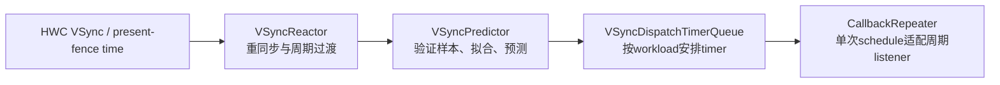
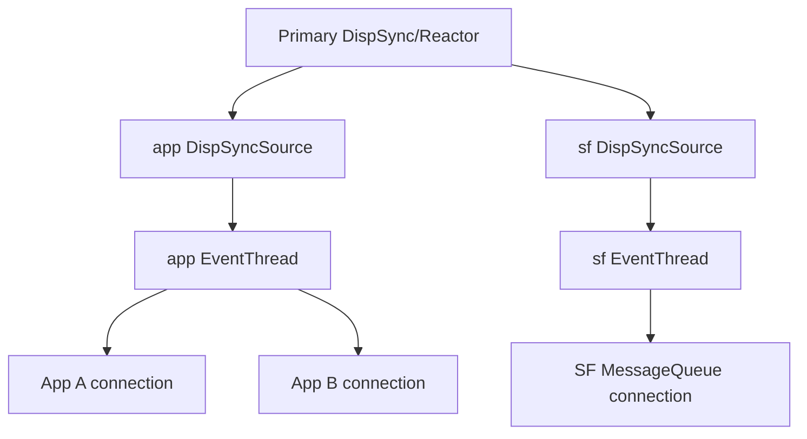

# 165 Android Scheduler、VSyncModulator、EventThread 与 App/SF 双 VSync 相位

> 源码版本：Android 11 / API 30 / `android-11.0.0_r48`  
> 学习方式：macOS 静态阅读；不编译，不连接设备  
> 前置章节：第 21、161、163、164 章

---

## 1. 本章要回答的问题

应用在 `Choreographer` 收到 VSync 后生产 buffer，SurfaceFlinger（下文简称 SF）也在 VSync 附近开始 transaction、latch 和 composition。这里最容易产生三个误解：

```text
App VSync 与 SF VSync 来自两套硬件
软件回调 timestamp 就是代码真正得到 CPU 的时刻
关闭 hardware VSync 就是让面板停止刷新
```

r48 的实际主线是：

> 主显示器的 HWC VSync 为一套预测模型提供样本；同一模型用不同 phase offset 派生 App、SF 两路软件事件。EventThread 按 connection 的请求分发事件，VSyncModulator 再依据事务、RenderEngine 使用和刷新率切换，在 late、early、earlyGl 三组 App/SF 相位之间切换。

```text
HWC VSync sample
      ↓
VSyncReactor + VSyncPredictor（r48 默认）
      ↓
  两个 DispSyncSource
      ├─ app phase → app EventThread → App BitTube → Choreographer
      └─ sf phase  → sf EventThread  → SF BitTube  → MessageQueue INVALIDATE
```

这套设计把“物理节拍”“预测目标”“计划唤醒”和“线程实际运行”分开，使 App 与 SF 能在目标显示时刻之前获得不同长度的工作预算。

---

## 2. 先拆开五层 VSync 与三个时间

“VSync”在代码中至少指五层东西：

| 层 | 含义 |
|---|---|
| 物理扫描节拍 | 面板/显示控制器真正扫描的周期 |
| HWC VSync event | Composer HAL 向 SF 上报的硬件时间样本 |
| predicted VSync | Predictor 推算的未来显示节拍 |
| phase callback | 某路消费者应该开始工作的计划软件时刻 |
| consumer execution | EventThread、fd、Looper 调度后代码真正运行的时刻 |

一次 Reactor callback 又同时带两个时间：

```cpp
mCallback->onDispSyncEvent(wakeupTime, vsynctime);
```

可配合当前时间理解：

```text
target   预测模型选择的目标 VSync，即 expectedVSyncTimestamp
when     按 phase/workload 计算出的计划软件回调点
now      callback 代码真正运行的时刻
```

例如：

```text
target = 100.000 ms
when   =  92.000 ms
now    =  92.700 ms
```

`when` 与 `target` 的差反映配置预算，`now - when` 才反映线程晚醒。把三者混成一个 timestamp，就无法区分“相位配置太晚”和“线程调度迟到”。

VSync callback 也只是一份工作机会，不证明 buffer 已产生、SF 已 latch、HWC 已 present，更不证明像素已经扫到屏幕。

---

## 3. 源码地图与总数据流

主要文件：

```text
frameworks/native/services/surfaceflinger/
├── SurfaceFlinger.cpp
├── SurfaceFlingerDefaultFactory.cpp
└── Scheduler/
    ├── Scheduler.cpp
    ├── VSyncReactor.cpp
    ├── VSyncPredictor.cpp
    ├── VSyncDispatchTimerQueue.cpp
    ├── DispSync.cpp
    ├── DispSyncSource.cpp
    ├── EventThread.cpp
    ├── EventControlThread.cpp
    ├── MessageQueue.cpp
    ├── VSyncModulator.cpp
    └── PhaseOffsets.cpp

frameworks/native/libs/gui/
├── IDisplayEventConnection.cpp
├── DisplayEventReceiver.cpp
└── DisplayEventDispatcher.cpp

frameworks/base/core/jni/
└── android_view_DisplayEventReceiver.cpp

frameworks/base/core/java/android/view/
├── DisplayEventReceiver.java
└── Choreographer.java
```

按数据流阅读：

```text
SurfaceFlinger::onVsyncReceived
  → Scheduler::addResyncSample
  → VSyncReactor / legacy DispSync
  → DispSyncSource
  → EventThread
  → EventThreadConnection::postEvent
  → DisplayEventReceiver / MessageQueue
```

相位控制是另一条链：

```text
SF 状态变化
  → VSyncModulator
  → Scheduler::setPhaseOffset
  → EventThread::setPhaseOffset
  → DispSyncSource::setPhaseOffset
  → 后续计划软件回调点改变
```

---

## 4. HWC 样本怎样进入 Scheduler

入口位于 `SurfaceFlinger::onVsyncReceived()`：

```cpp
Mutex::Autolock lock(mStateLock);

if (sequenceId != getBE().mComposerSequenceId) return;
if (!getHwComposer().onVsync(hwcDisplayId, timestamp)) return;
if (hwcDisplayId != getHwComposer().getInternalHwcDisplayId()) return;

bool periodFlushed = false;
mScheduler->addResyncSample(timestamp, vsyncPeriod, &periodFlushed);
if (periodFlushed) {
    mVSyncModulator->onRefreshRateChangeCompleted();
}
```

三道过滤分别排除：

1. 旧 Composer 连接代际的迟到 callback；
2. HWComposer 判定无效的显示或 timestamp；
3. 非 internal display 的 VSync——r48 这条主模型暂不消费外接屏样本。

`timestamp` 表示硬件事件的单调时钟时间，不是 C++ callback 真正取得 CPU 的当前时间。Composer callback 的具体线程和传输形式取决于 HAL/vendor 路径，不应一概写成 SF 主线程或 Binder 线程。

`Scheduler::addResyncSample()` 还有一道逻辑门：只有 `mPrimaryHWVsyncEnabled` 为 true 才把样本交给模型。停采请求生效前的竞态迟到事件可以到达入口，却不一定继续喂给 Predictor。

HWC 不直接逐个唤醒 App，原因是：

- App 与 SF 需要在物理 VSync 前预留不同工作时间；
- 高扇出硬件 callback 会增加功耗与调度抖动；
- 漏事件、刷新率过渡和模型漂移需要集中校正；
- 空闲时可以停采硬件事件，继续用稳定模型预测。

一句话：HWC VSync 是校时样本，软件 VSync 才是可安排的工作起点。

---

## 5. r48 默认是 Reactor，不是两套实现同时运行

`Scheduler.cpp` 的工厂决定主模型：

```cpp
if (property_get_bool("debug.sf.vsync_reactor", true)) {
    auto tracker = std::make_unique<VSyncPredictor>(...);
    auto dispatch = std::make_unique<VSyncDispatchTimerQueue>(...);
    return std::make_unique<VSyncReactor>(...);
}
return std::make_unique<impl::DispSync>(...);
```

所以在未被属性覆盖的 r48：

| 配置 | 实现 |
|---|---|
| `debug.sf.vsync_reactor=true`（默认） | `VSyncReactor + VSyncPredictor + VSyncDispatchTimerQueue` |
| `false` | legacy `impl::DispSync + DispSyncThread` |

抽象接口仍叫 `DispSync`，`DispSyncSource` 也仍持有 `DispSync*`。这只是兼容接口名，不表示 legacy 与 Reactor 同时驱动同一条回调。

### 5.1 Predictor 的真实参数

工厂传入：

```text
初始 ideal period   60 Hz
timestamp history   20
做回归所需最少样本 6
相位容差比例         20%
```

最后一项不是“删掉样本中的 20%”。`VSyncPredictor::validate()` 把新 timestamp 相对 ideal period 的余数与 20% 窗口比较，拒绝远离预测周期格点的样本。样本不足 6 个时仍可按 ideal period 预测，只是不进行完整线性回归。

### 5.2 Reactor 的三层分工



`VSyncDispatch` 本来是逐次 schedule；`CallbackRepeater` 每次 callback 后再 schedule，适配旧接口的周期 listener 语义。Reactor 对活动 callback 还设有最多 4 个的 r48 实现限制；很多 App connection 共享 EventThread，并不会各占一个 Reactor callback。

---

## 6. phase offset 的数学：负值会把 target 推后一周期

`DispSyncSource` 保存 listener phase，并把它规范到约 `[-period, period)`：

```cpp
const int numPeriods = phaseOffset / period;
phaseOffset -= numPeriods * period;
```

在 Reactor 适配层：

```cpp
workload = period - offset;
```

TimerQueue 选择一个足够晚的 predicted target，再按 `target - workload` 唤醒。

### 6.1 正 offset

若 period 为 16.67 ms、offset 为 `+2 ms`：

```text
V0      callback                         V1(target)
|---------+--------------------------------|
          V0 + 2 ms
```

`workload = 14.67 ms`，回调在上一节拍后 2 ms 左右发生，`expectedVSyncTimestamp` 指向 V1。

### 6.2 负 offset

若 offset 为 `-4 ms`：

```text
V0                 callback      V1                 V2(target)
|---------------------+-----------|-------------------|
                    V1 - 4 ms
```

此时 `workload = 20.67 ms`，已超过一个周期。回调虽然发生在 V1 前 4 ms，却为 V2 预留工作预算。

legacy DispSync 也明确执行：

```cpp
if (eventListener.mPhase < 0) {
    expectedVSyncTime += mPeriod;
}
```

SF 自己在需要临时重算 expected-present time 时也检查当前 SF offset：只有 `sf > 0` 才直接采用 Predictor 的下一时刻，`sf <= 0` 会再加一个 period。

因此“负 offset = 提前几毫秒但仍瞄准紧邻的下一次 VSync”在 r48 并不准确。负值代表跨周期的更早启动，expected target 会再推后一周期；SF 的辅助重算函数还把零纳入后一周期分支。

legacy `DispSyncThread` 还用 reference time、model phase、listener phase 和最多 1.5 ms 的平均 late-wakeup 补偿计算 callback；它不是简单 `sleep(period)`。

---

## 7. App 与 SF 两条软件流怎样创建

`SurfaceFlinger::initScheduler()` 先创建一套主 `Scheduler`，再创建两条 connection：

```cpp
mAppConnectionHandle = mScheduler->createConnection(
        "app", offsets.late.app, {});

mSfConnectionHandle = mScheduler->createConnection(
        "sf", offsets.late.sf, interceptCallback);

mEventQueue->setEventConnection(
        mScheduler->getEventConnection(mSfConnectionHandle));
```

每次 `Scheduler::createConnection(name, phase)` 创建：

```text
一个 DispSyncSource
+ 一个 EventThread
+ 一个 Scheduler 内部 EventThreadConnection
```

两条 `DispSyncSource` 共享 `mPrimaryDispSync`：



所以“双 VSync”只是两个软件 event stream 的教学简称，不是两套硬件信号。

客户端调用 `createDisplayEventConnection(vsyncSource, ...)` 时，SF 只根据 `vsyncSource` 选择现有的 app 或 sf EventThread，再为该客户端新建一个 `EventThreadConnection`。大量 connection 各有请求状态和 BitTube，却共享上层的 EventThread 与预测源。

---

## 8. EventThread：按连接请求启停预测源

请求状态编码为：

```cpp
enum class VSyncRequest {
    None = -1,
    Single = 0,
    Periodic = 1,
};
```

更大的整数值表示每 N 个 VSync 消费一次。

一个容易误读的边界是：枚举 `Single` 的底层值为 0，但公共 `setVsyncRate(0)` 会把状态设为 `None`；one-shot 必须调用独立的 `requestNextVsync()`。

`requestNextVsync()` 先调用 connection 的 resync callback，然后仅在当前为 None 时改成 Single：

```cpp
if (connection->resyncCallback) {
    connection->resyncCallback();
}

if (connection->vsyncRequest == VSyncRequest::None) {
    connection->vsyncRequest = VSyncRequest::Single;
    mCondition.notify_all();
}
```

resync 在 Scheduler 侧有 750 ms 节流。即使 connection 已有请求，callback 仍先发生；但绝大多数频繁调用会被时间门挡住。

EventThread 扫描所有活 connection：

```text
有显示器 + 至少一个请求 + screen acquired  → VSync
有显示器 + 至少一个请求 + screen released  → SyntheticVSync
没有请求或没有显示器                       → Idle
```

只有状态跨入/离开 `VSync` 时，才调用 `DispSyncSource::setVSyncEnabled(true/false)`。Single 成功消费一次后立即回到 None；若没有其他请求，EventThread 随后移除上层模型 listener。

### 8.1 synthetic 不是物理刷新证据

- screen released 的 SyntheticVSync 每 16 ms 超时生成一次；
- 正常 VSync 状态连续 1000 ms 没事件，会记录 driver stall 并生成一次假事件；
- event header timestamp 取当前 monotonic time；expected time 取 `now + timeout`。

这些事件只用于维持请求方进度。收到 synthetic VSync 不能证明面板为 ON，也不能证明画面被 present。

---

## 9. App 路：oneway 请求，BitTube 传事件，Looper 执行

每个 `EventThreadConnection` 构造一条 BitTube。创建连接时通过 Binder 取得 channel fd：

```cpp
outChannel->setReceiveFd(mChannel.moveReceiveFd());
outChannel->setSendFd(unique_fd(dup(mChannel.getSendFd())));
```

事件由 SF EventThread 写入：

```cpp
DisplayEventReceiver::sendEvents(&mChannel, &event, 1);
```

App 侧 `DisplayEventDispatcher::initialize()` 把接收 fd 注册到创建 receiver 时提供的 Looper。控制面与数据面由此分开：

| 操作 | 通道 |
|---|---|
| 创建 connection、取 channel、设置 rate | Binder |
| `requestNextVsync()` | **oneway Binder** |
| 高频 VSync/hotplug/config event | BitTube fd |

`scheduleVsync()` 用 `mWaitingForVsync` 避免同一 receiver 重复请求。fd 可读后，`processPendingEvents()` drain 所有事件；若有多条 VSync，只保留最后一条的 timestamp/display/count。

然后 JNI 只调用 Java 三参数签名：

```text
dispatchVsync(long timestamp, long displayId, int count)
```

Event 结构里的 `expectedVSyncTimestamp` 没有继续传给 r48 Java `DisplayEventReceiver.onVsync()`。

`Choreographer.FrameDisplayEventReceiver` 会：

1. 若 timestamp 位于 `System.nanoTime()` 之后，记录警告并钳到 now；
2. 保存 timestamp 与 frame count；
3. 向同一 Looper 投递 asynchronous Message；
4. `run()` 中才调用 `doFrame()`。

异步消息可以跨过 ViewRootImpl 为 traversal 设置的同步屏障。整个 Java 帧不会在 SF EventThread 或 Binder 线程上执行。

### 9.1 BitTube 不是无限可靠日志

EventThread 写 channel 时：

- `-EAGAIN` 表示管道满，r48 只警告，TODO 尚未重试；该事件可丢；
- `EPIPE` 等其他错误被当作连接死亡并移除。

它适合“下一次节拍”通知，不提供无界排队与逐条可靠送达。

---

## 10. SF 路：同样过 EventThread，但消费规则不同

SF 把 sf EventThread 的内部 connection 接到自己的 `MessageQueue`：

```text
sf DispSyncSource
  → sf EventThread
  → SF 内部 BitTube
  → SF main Looper
  → INVALIDATE
  → SurfaceFlinger::onMessageReceived
```

当事务或 Layer 更新需要下一轮工作时：

```cpp
void MessageQueue::invalidate() {
    mEvents->requestNextVsync();
}
```

这里 `mEvents` 是同进程具体 `EventThreadConnection`，调用不需要跨进程 Binder。

收到事件后，SF 显式读取：

```cpp
buffer[i].vsync.expectedVSyncTimestamp
```

再调用 `dispatchInvalidate(expected)`。这正好与 App Java 丢弃 expected timestamp 形成对比：r48 SF 主循环拿它计算 expected-present 相关决策，Java Choreographer 只得到 header timestamp。

### 10.1 pending INVALIDATE 保留第一份 expected time

`dispatchInvalidate()` 先用 bit mask 判断 INVALIDATE 是否已排队：

```cpp
if ((atomic_or(eventMaskInvalidate, &mEventMask) & eventMaskInvalidate) == 0) {
    mExpectedVSyncTime = expectedVSyncTimestamp;
    mLooper->sendMessage(...);
}
```

只在从“未排队”变为“已排队”时写 `mExpectedVSyncTime`。同一 INVALIDATE 尚未处理时，后来的 VSync 不会覆盖该值。

另外，SF `eventReceiver()` 在一批最多 8 个事件中找到第一条 VSync 后便 break；它不像 App `DisplayEventDispatcher` 那样明确保留 drain 中最后一条 VSync。诊断两端 timestamp 时不要套用同一种合并规则。

SF 合成也不在 HWC callback 中直接发生，而是在预测回调、BitTube 和主 Looper 之后执行。

---

## 11. PhaseOffsets 与 PhaseDurations 是两种配置语言

默认工厂：

```cpp
if (property_get_bool(
        "debug.sf.use_phase_offsets_as_durations", false)) {
    return std::make_unique<PhaseDurations>(configs);
}
return std::make_unique<PhaseOffsets>(configs);
```

所以 r48 默认使用 `PhaseOffsets`；属性为 true 才启用 `PhaseDurations`。两个类都实现在 `PhaseOffsets.cpp`，不要因为类名去寻找不存在的独立 `PhaseDurations.cpp`。

| 表达方式 | 配置者直接描述什么 |
|---|---|
| PhaseOffsets | 相对 VSync 周期格点的 callback phase |
| PhaseDurations | App、SF 各需要多少工作时长，再换算 phase |

duration 路径的核心换算近似为：

```text
sf offset  = period - (sf duration % period)
app offset = period - ((app duration + sf duration) % period)
```

若 SF duration 跨过一个周期，代码会再减一个 period，产生负 SF offset，表达面向 N+2 的更长预算。

`PhaseOffsets` 从 `ro.surface_flinger.*` 读取默认值，并接受多个 `debug.sf.*` 覆盖；fps 大于 65 时还走 high-fps 配置。offset 不是所有设备通用的固定毫秒数，必须连同刷新周期和运行时属性解释。

---

## 12. VSyncModulator：三组相位与两个保留计数

配置同时保存 App/SF offset：

```cpp
struct OffsetsConfig {
    Offsets early;
    Offsets earlyGl;
    Offsets late;
};
```

用途：

| 模式 | 主要目的 |
|---|---|
| `late` | 稳态下偏低延迟 |
| `early` | 事务 early 区间或刷新率切换中，增加通用预算 |
| `earlyGl` | 最近使用 RenderEngine client composition，增加 GPU 路径预算 |

选择优先级：

```cpp
if (mExplicitEarlyWakeup ||
    mTransactionStart == EarlyEnd ||
    mRemainingEarlyFrameCount > 0 ||
    mRefreshRateChangePending) {
    return early;
} else if (mRemainingRenderEngineUsageCount > 0) {
    return earlyGl;
} else {
    return late;
}
```

每次切换都会同时更新两条 source：

```cpp
setPhaseOffset(sfHandle, offsets.sf);
setPhaseOffset(appHandle, offsets.app);
```

所以 early 不是“只让 SF 早醒”，而是选择一整对 `{app, sf}`。

### 12.1 transaction early

事务 flags 映射成：

```text
Normal / Early / EarlyStart / EarlyEnd
```

- `EarlyStart` 打开 `mExplicitEarlyWakeup` 区间；
- `EarlyEnd` 关闭显式区间，并在非显式状态下设置 2 帧 early 保留；
- 普通 `Early` 在不处于显式区间时也设置 2 帧保留。

`onRefreshed()` 只有在 `earlyStart + 1 ms < txnAppliedTime` 时才递减 early 计数。1 ms margin 是对并发观察的保守处理。

### 12.2 `onTransactionHandled()` 不是 commit 完成点

名字和头文件注释很容易误导。r48 `SurfaceFlinger::handleTransaction()` 的顺序其实是：

```cpp
mVSyncModulator->onTransactionHandled();
transactionFlags = getTransactionFlags(...);
handleTransactionLocked(transactionFlags);
```

因此它在真正 `handleTransactionLocked()` **之前**执行，只把 Modulator 的当前 transaction-start 状态恢复为 Normal，并记录时间。它不能证明 Layer current→drawing 已提交，更不能证明 present。

### 12.3 earlyGl

refresh 结束后，SF 传入：

```cpp
mHadClientComposition || mReusedClientComposition
```

使用 RenderEngine 就把 earlyGl 计数设为 2；后续未使用的 refresh 每次减 1。通用 early 条件优先级更高，存在 earlyGl 计数也可能暂时看不到 earlyGl offset。

---

## 13. 刷新率切换与 hardware VSync 开关是多阶段协议

发起刷新率变化时，SF 会：

```text
记录 desired config
请求 repaint
Scheduler::resyncToHardwareVsync(target period)
VSyncModulator::onRefreshRateChangeInitiated()
更新该 fps 的 phase 配置
```

Modulator 先进入 early。HWC 的后续 VSync 样本确认新周期后，`addResyncSample()` 才把 `periodFlushed` 设为 true，SF 再调用 `onRefreshRateChangeCompleted()`。

所以至少要区分：

```text
mode/config 已请求
HWC/DisplayDevice 状态推进
预测模型确认 period
App connection 收到 config-changed event
```

它们不是一个完成点。

### 13.1 为什么能关闭 hardware VSync event

模型不再需要样本时：

```cpp
disableHardwareVsync(false);
```

关闭的是 HWC→SF 的 VSync **事件采样**，不是物理面板扫描，也不删除已经运行的软件预测模型。

开关还有两级异步边界：

1. Scheduler 更新 `mPrimaryHWVsyncEnabled`，让 `EventControlThread` 合并 enable/disable 请求；
2. callback 再让 SF `schedule()` 到主线程执行 `setPrimaryVsyncEnabledInternal()`，最终调用 HWComposer。

因此 Scheduler 的布尔值表示逻辑请求状态，不是 HAL 已完成的同步确认。发现模型漂移、present fence 不合、刷新率切换或长期空闲 resync 时，Scheduler 会重新请求硬件样本。

---

## 14. present fence 反馈、失败边界与非一一对应

`postComposition()` 只有在默认显示已连接、为 primary、power mode 为 ON 且 fence 有效时，才把 present fence 的 `FenceTime` 交给 Scheduler。

默认 Reactor 会：

- 消费已经 signal 的 fence timestamp；
- 暂存尚未 signal 的 fence，最多 20 项；
- 丢弃 invalid time；
- Predictor 拒绝 timestamp 时，要求更多 hardware VSync，并暂时忽略 present-fence 样本直到重新锁定。

legacy DispSync 则比较 present time 与最近预测 VSync 的均方误差；错误超过 `400 μs` 平方阈值会要求重同步，重新锁定时使用一半阈值作 hysteresis。

共同闭环是：

```text
预测 → 调度 → present → 观察 fence 时间 → 判断漂移 → 必要时重新采样
```

present fence 是校准证据，不是 App 下一帧 callback 的直接来源。

### 14.1 App VSync 与 SF VSync 不按 frame number 一一绑定

真实系统可能发生：

- App 没有 invalidate，因此不请求 one-shot；
- SF 本轮复用旧 buffer 或只更新其他 Layer；
- buffer 因 acquire fence 或 desired time 延后；
- App drain 多个事件后只使用最新一条；
- SF pending INVALIDATE 保留第一份 expected time；
- BufferQueue async 模式丢弃中间 buffer；
- 动态刷新率改变周期与事件 count。

所以两路 VSync 是协作节拍，不是同 frame number 的 RPC 配对。

---

## 15. 故障定位与 macOS 只读练习

### 15.1 先判断“迟”发生在哪层

| 现象 | 优先检查 |
|---|---|
| hardware VSync 频繁重开 | Predictor 样本、period transition、present-fence 拒绝 |
| EventThread 到达晚 | source callback、EventThread 调度、BitTube `EAGAIN` |
| App `doFrame` 晚 | header timestamp 与 now、主 Looper、input/animation/traversal |
| SF INVALIDATE 晚 | sf phase、BitTube、pending mask、SF 主线程 |
| buffer 错过 latch | App/RT 生产、acquire fence、desired time、Layer latch gate |
| early 长期不退出 | explicit early、两种计数、refresh-rate pending |

更早的 phase 通常增加预算，也可能增加 input-to-display latency；它不是越早越好的单调旋钮。

### 15.2 验证默认 Reactor 与参数

```bash
sed -n '45,105p' \
  frameworks/native/services/surfaceflinger/Scheduler/Scheduler.cpp
sed -n '40,135p' \
  frameworks/native/services/surfaceflinger/Scheduler/VSyncPredictor.cpp
```

回答：20、6、20% 分别限制什么？属性 false 时创建谁？

### 15.3 验证正负 phase 的 target

```bash
sed -n '55,150p' \
  frameworks/native/services/surfaceflinger/Scheduler/VSyncReactor.cpp
sed -n '330,405p' \
  frameworks/native/services/surfaceflinger/Scheduler/DispSync.cpp
```

回答：为何 `workload = period - offset`？legacy 为何在 phase<0 时给 expected time 加一周期？

### 15.4 追 EventThread one-shot 与 synthetic

```bash
sed -n '235,445p' \
  frameworks/native/services/surfaceflinger/Scheduler/EventThread.cpp
```

回答：`setVsyncRate(0)` 和 `Single=0` 为什么不同？Single 何时回 None？

### 15.5 比较 App 与 SF 的事件消费

```bash
sed -n '45,180p' \
  frameworks/native/libs/gui/DisplayEventDispatcher.cpp
sed -n '30,135p' \
  frameworks/native/services/surfaceflinger/Scheduler/MessageQueue.cpp
sed -n '920,970p' \
  frameworks/base/core/java/android/view/Choreographer.java
```

回答：App drain 多条 VSync 保留哪条？SF pending INVALIDATE 保留哪份 expected time？

### 15.6 画出 Modulator 决策树

```bash
sed -n '45,175p' \
  frameworks/native/services/surfaceflinger/Scheduler/VSyncModulator.cpp
sed -n '2400,2435p' \
  frameworks/native/services/surfaceflinger/SurfaceFlinger.cpp
```

回答：early、earlyGl、late 的优先级如何？`onTransactionHandled()` 在事务处理前还是后？

### 15.7 验证硬件采样开关的异步边界

```bash
sed -n '270,370p' \
  frameworks/native/services/surfaceflinger/Scheduler/Scheduler.cpp
sed -n '35,95p' \
  frameworks/native/services/surfaceflinger/Scheduler/EventControlThread.cpp
sed -n '1675,1705p' \
  frameworks/native/services/surfaceflinger/SurfaceFlinger.cpp
```

回答：谁先改逻辑状态？真正的 HWComposer 调用在哪个线程？

---

## 16. 核心结论与自测

核心结论：

1. App/SF 两路软件 VSync 共享主显示预测模型，只使用不同 phase 与 EventThread。
2. r48 默认使用 Reactor；legacy DispSync 是属性控制的替代实现，不与默认路径同时驱动。
3. Predictor 的 20% 参数是相对周期格点的 timestamp 容差，不是删去 20% 样本。
4. `when`、expected target 与真实 `now` 是三个时间；VSync callback 不是显示完成点。
5. 正 offset 通常在上一节拍之后回调、瞄准下一 target；负 offset 跨周期提供更长预算，expected target 再推后一周期。
6. EventThread 按 connection 的 None/Single/Periodic 状态启停上层 source；synthetic 只保进度，不证明物理刷新。
7. App 用 oneway Binder 请求 one-shot，用 BitTube 收事件，并在自己的 Looper 上执行 Choreographer。
8. r48 Java 回调不接收 expected timestamp；SF MessageQueue 会消费它。
9. App drain 保留最后一条 VSync；SF 已排队 INVALIDATE 时保留第一份 expected time。
10. VSyncModulator 同时切换 `{app, sf}`，且 `early > earlyGl > late`。
11. `onTransactionHandled()` 在 `handleTransactionLocked()` 前执行，不证明 transaction commit。
12. hardware VSync 的逻辑开关还要经过 EventControlThread 和 SF 主线程；关闭采样不关闭面板。
13. present fence 只反馈实际时序以校准模型，不直接触发 App 下一帧。
14. App 与 SF event count 不保证一一对应到同一显示帧。

自测：

1. 为什么双 VSync 不代表两套硬件发生器？
2. Reactor 为何仍实现名为 DispSync 的接口？
3. callback 在 92 ms 执行、expected 为 100 ms，各自说明什么？
4. phase=-4 ms 时，为什么不能简单说它只瞄准紧邻的下一 VSync？
5. `requestNextVsync()` 的 Binder 调用为何不会同步等待事件回来？
6. BitTube 满时 r48 会重试吗？
7. App 与 SF 对一批 VSync 的合并规则有何不同？
8. explicit early、early frame count、refresh pending 与 earlyGl count 谁优先？
9. 为什么 `onTransactionHandled()` 不能当作 Layer 已进入 drawing 的证据？
10. Scheduler 已把 `mPrimaryHWVsyncEnabled` 设为 false，是否证明 HAL 此刻已经关闭事件？
11. synthetic VSync 能证明什么、不能证明什么？
12. present fence 为何会让 Scheduler 重新打开硬件采样？

下一章将进入 `RefreshRateConfigs` 与 `LayerHistory`，解释内容帧率、touch/idle/power 信号怎样共同选择显示配置，以及“请求 mode”与“新周期被模型确认”为何不是同一完成点。
