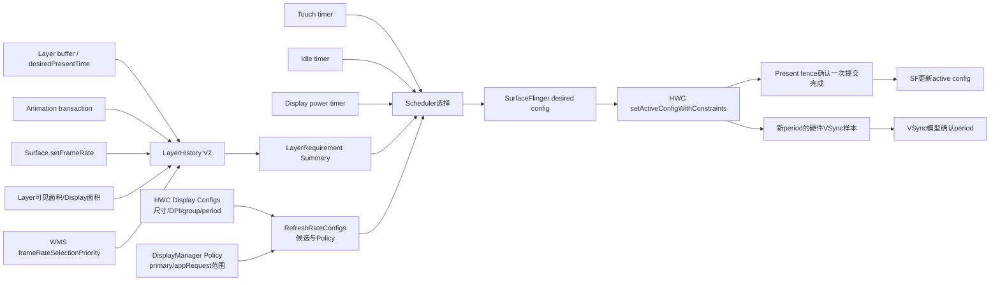
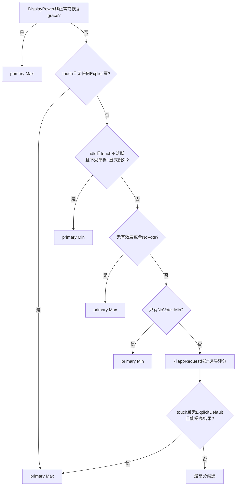
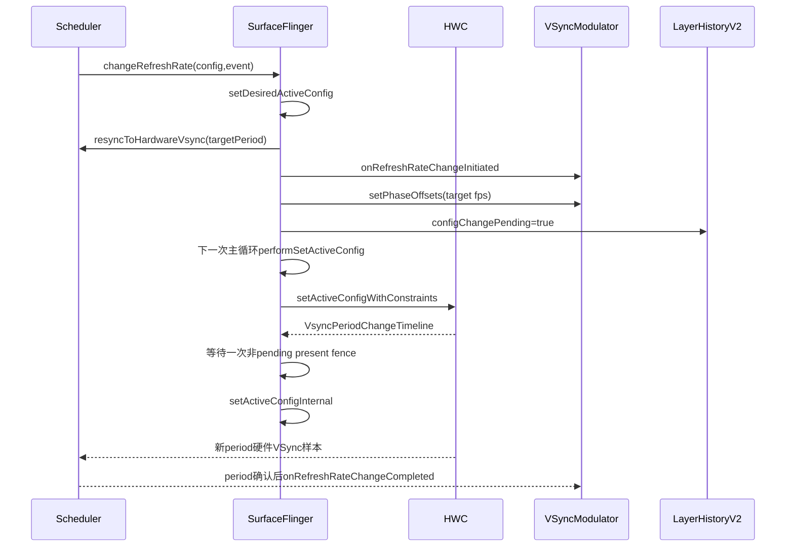
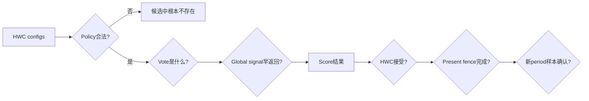

# 166 Android RefreshRateConfigs、LayerHistory 与动态刷新率选择

> 源码版本：Android 11 / API 30 / `android-11.0.0_r48`  
> 学习方式：macOS 只读源码，不要求编译、不要求连接设备  
> 前置章节：第 12、21、67、155、165 章

---

## 1. 本章要解决什么

第 165 章讲清楚了：刷新率一旦确定，Scheduler 如何依据新的 period 建立 App/SF 两路软件 VSync。现在把视线往前移一步：

> SurfaceFlinger 为什么选择某个刷新率？

常见回答是“看内容 fps”，但源码里的真实决策远不止这一项：

```text
硬件支持哪些display config
+ DisplayManager允许哪些范围
+ Layer是动画、低频、启发式，还是显式setFrameRate
+ Layer面积与焦点权重
+ 内容帧率能否整除显示刷新率
+ touch boost
+ idle降频
+ display power恢复保护
+ 刷新率切换是否尚在进行
= 最终候选config
```

本章回答：

1. HWC config、config id、config group、fps、vsync period 有何区别？
2. 为什么相同 fps 也可能对应多个 config？
3. `primaryRange` 与 `appRequestRange` 为什么是两层政策边界？
4. `LayerHistory` V1 与 V2 在 r48 如何选择？
5. 内容检测关闭时，为何仍保留 LayerHistory？
6. BufferStateLayer、BufferQueueLayer 和 animation transaction 在哪里写历史？
7. desired present time 与 queue time 如何共同参与 fps 推断？
8. 为什么刚出现的新 Layer 默认偏向 Max，而不是立刻猜低 fps？
9. 动画、低频内容和稳定视频分别投什么票？
10. `Surface.setFrameRate()` 的 Default 与 Fixed Source 如何映射到 vote？
11. Layer 面积和焦点如何影响评分？
12. 24 fps 为什么可能选择 60、72、120 Hz，而不是“必须 24 Hz”？
13. touch 与 idle 谁优先？显式 vote 能否阻止 touch boost？
14. DisplayPower 非正常状态为何强制性能档？
15. 从“选中 config”到“HWC 真正切换”经过哪些阶段？
16. config changed 事件为什么可能被 idle 切换抑制？

一句话总览：

> `LayerHistory` 把可见 Layer 的显式意图、更新节奏和空间权重整理成 vote；`RefreshRateConfigs` 先用 policy/config group 筛出合法候选，再按整倍频匹配、权重、焦点及全局 touch/idle/display-power 信号选出 config；SurfaceFlinger 随后异步请求 HWC 切换，并在 present fence 与 VSync period 样本分别证明不同阶段后，更新内部 active config 和 VSync 模型。

---

## 2. 全链路图



这张图有两个独立的“确认”：

- present fence 解除 `mSetActiveConfigPending`，SF 据此更新 active config 账；
- HWC VSync 样本让 Reactor/DispSync 确认新 period，VSyncModulator 才结束 refresh-rate-change early 状态。

它们不能合并成一个“刷新率切换完成”布尔值。

---

## 3. 源码地图

```text
frameworks/native/services/surfaceflinger/
├── SurfaceFlinger.cpp
├── Layer.cpp / Layer.h
├── BufferStateLayer.cpp
├── BufferQueueLayer.cpp
└── Scheduler/
    ├── Scheduler.cpp / Scheduler.h
    ├── RefreshRateConfigs.cpp / .h
    ├── LayerHistory.cpp / .h
    ├── LayerHistoryV2.cpp
    ├── LayerInfo.cpp / .h
    ├── LayerInfoV2.cpp / .h
    └── PhaseOffsets.cpp / .h

frameworks/base/core/java/android/view/
├── Surface.java
└── SurfaceControl.java

frameworks/native/libs/gui/
├── Surface.cpp
└── SurfaceComposerClient.cpp
```

建议按三条线阅读：

```text
候选线：HWC Config → RefreshRateConfigs → Policy过滤
证据线：Layer更新 → LayerInfoV2 → LayerRequirement
执行线：choose → setDesiredActiveConfig → HWC → active/model确认
```

---

## 4. 先分清 config id、fps、period 和 group

`RefreshRateConfigs::RefreshRate` 保存：

```cpp
HwcConfigIndexType configId;
shared_ptr<const HWC2::Display::Config> hwcConfig;
string name;
float fps;
```

### config id

是 HWC config 向量中的身份/位置。系统真正请求 HWC 切换时传的是 config id，不是直接传 float fps。

### vsync period

来自 HWC config：

```cpp
nsecs_t getVsyncPeriod() const;
```

fps 由：

```text
fps = 1,000,000,000 / periodNs
```

换算。float fps 是便于策略比较的人类表达，period 才是时序模型的基础量。

### config group

Android 11 的 HWC config 可带 group。group 通常用来表示可在某类约束下切换的一组 mode；平台代码默认只在 default config 的同一 group 内选择。

### 尺寸与 DPI

候选过滤还要求 width、height、dpiX、dpiY 与 default config 完全相同。

因此：

> “设备声明支持 120 Hz”不代表当前 policy 下 120 Hz config 一定是合法候选；分辨率、DPI、group 和范围任一不匹配都可能被过滤。

---

## 5. 为什么相同 fps 也不能只用 fps 当身份

可能存在：

```text
config 0：1080×2400，60 Hz，group 0
config 1：1080×2400，60 Hz，group 1
config 2：1440×3200，60 Hz，group 2
```

三者 fps 一样，但硬件 mode 不同。

`RefreshRate::operator==` 比较的是 config id 与 config 对象，不是只比 fps。`setCurrentConfigId()` 也保存指向具体 `RefreshRate` 的指针。

所以日志里“60fps”只是名字：

```cpp
StringPrintf("%.0ffps", fps)
```

不能代替 config id 做故障定位。

---

## 6. Policy：primaryRange 与 appRequestRange

```cpp
struct Policy {
    HwcConfigIndexType defaultConfig;
    Range primaryRange;
    Range appRequestRange;
    bool allowGroupSwitching = false;
};
```

### primaryRange

DisplayManager 的常规指导范围。没有明确 App 请求时，系统一般留在这个范围。

### appRequestRange

外层硬边界。显式 `setFrameRate()` 等条件可以让选择走出 primaryRange，但绝不能走出 appRequestRange。

合法 policy 必须满足：

```text
defaultConfig存在
defaultConfig fps落在primaryRange
appRequestRange.min ≤ primaryRange.min
appRequestRange.max ≥ primaryRange.max
```

两层范围可以理解为：

```text
appRequestRange = 绝对可用边界
primaryRange    = 日常自动选择边界
```

此外还有 display-manager policy 与 override policy 两份；override 主要供测试使用，存在时覆盖前者，清除后恢复 DisplayManager policy。

---

## 7. constructAvailableRefreshRates 如何筛候选

每次 policy 改变，代码重建两个有序列表：

```text
mPrimaryRefreshRates
mAppRequestRefreshRates
```

过滤条件是：

```cpp
same width
&& same height
&& same dpiX
&& same dpiY
&& (allowGroupSwitching || same configGroup)
&& fps in requested range
```

然后按 period 从大到小排序，也就是 fps 从低到高。period相同再按 config group 降序。

这使：

```text
front() = 该列表最低刷新率
back()  = 该列表最高刷新率
```

源码里的 `getMinRefreshRateByPolicyLocked()` 和 `getMaxRefreshRateByPolicyLocked()` 正是取 primary 列表的 front/back。

---

## 8. r48 默认选择 LayerHistory V2，但内容检测默认可关闭

Scheduler 工厂传入两个开关：

```cpp
useContentDetectionV2 =
    property_get_bool("debug.sf.use_content_detection_v2", true);

useContentDetection =
    ro.surface_flinger.use_content_detection_for_refresh_rate
    // helper调用的默认值为false
```

因此这份代码的缺省倾向是：

```text
LayerHistory实现：V2
内容启发式检测：若设备未配置属性，则关闭
```

这并不矛盾。即使内容检测关闭，LayerHistory V2 仍用于：

- 接收 `setFrameRate()` 显式 vote；
- 为普通 Layer 默认产生 Max vote；
- 计算面积、焦点等需求；
- 参与 touch/idle 与 policy 选择。

不能因为 `use_content_detection=false` 就说“动态刷新率代码完全不用 LayerHistory”。

---

## 9. Layer 注册时的默认 vote

`Scheduler::registerLayer()`：

| Layer/配置 | 默认 vote |
|---|---|
| Status Bar | NoVote |
| 内容检测关闭的普通 Layer | Max |
| V1 内容检测，普通 Layer | Heuristic |
| V1 Wallpaper | Heuristic，但 highFps 被限制到 min |
| V2 内容检测，Wallpaper | Min |
| V2 内容检测，普通 Layer | Heuristic |

状态栏不参与，是为了避免一个长期可见的系统装饰层无意主导内容刷新率。

V2 中 wallpaper 直接 Min；普通新内容在没有足够数据时会从 Heuristic 退化为 Max，优先保证动画启动流畅。

---

## 10. 哪些事件会写 LayerHistory

### BufferStateLayer

设置 buffer 时：

```cpp
mScheduler->recordLayerHistory(
        this, desiredPresentTime,
        LayerUpdateType::Buffer);
```

`desiredPresentTime <= 0` 会先规范成 0。

### BufferQueueLayer

`onFrameAvailable()`：

```cpp
const nsecs_t presentTime =
        item.mIsAutoTimestamp ? 0 : item.mTimestamp;
recordLayerHistory(this, presentTime, Buffer);
```

### animation transaction

带 `eAnimation` flag 的事务会对关联 Layer 记录：

```cpp
LayerUpdateType::AnimationTX
```

### setFrameRate

`Layer::setFrameRate()` 在修改 Layer current state 前先记录：

```cpp
recordLayerHistory(this, systemTime(), SetFrameRate);
```

它的作用之一是把 Layer 激活，让新 vote 能进入下一次 summarize；不是说 API 调用时间就是内容帧率样本。

---

## 11. LayerInfoV2 记录的不是一个“fps字段”

每条 frame data：

```cpp
struct FrameTimeData {
    nsecs_t presetTime; // 源码字段拼作preset，含义是desired present time
    nsecs_t queueTime;
    bool pendingConfigChange;
};
```

`setLastPresentTime()` 还记录：

```text
mLastUpdatedTime = max(presentTime, now)
mLastAnimationTime（仅AnimationTX）
最多90条frameTimes
```

为何取 max？

> 客户端可能提交未来 desired present time。即使 buffer 现在就 queue，它仍应在目标时间附近保持 active，不能过早被 1.2 秒 active 窗口淘汰。

但这也意味着异常遥远的未来时间会延长 Layer 活跃性；它不是“硬件已经 present”的证据。

---

## 12. active、frequent、animating 是三种不同判断

### active

普通 Layer 必须：

```text
可见
且 lastUpdatedTime >= now - 1.2s
```

显式 rate vote 的 Layer 在 V2 `isLayerActive()` 中始终保留 active，随后不可见时再把 vote 设成 NoVote。

### frequent

至少看最近 3 帧；在 active window 内不足 3 帧就是不 frequent。达到窗口后按平均 queue rate 判断是否至少 10 fps。

### animating

最近 1.2 秒内发生过 animation transaction。

三者作用：

```text
inactive       → 不进入当前active summary
active但不频繁 → Min
active且动画   → Max
active稳定频繁 → 尝试Heuristic fps
```

---

## 13. 为什么新 Layer 或数据不足时投 Max

`LayerInfoV2::getRefreshRate()`：

```cpp
if (isAnimating(now)) return Max;
if (!isFrequent(now)) return Min;

if (calculateRefreshRateIfPossible()) return Heuristic;
return Max;
```

注意“数据不足”和“不频繁”不是一回事：

- 少于 frequent window：`isFrequent()` 代码注释说未知内容可能正开始动画，因此直接认为 frequent；
- 但历史不足 90 帧且不足 1 秒，heuristic 又算不出来；
- 最终走 Max。

这是保守启动策略：

> 不知道新内容速度时先给性能，观察到确实低频后才投 Min；获得足够且稳定的数据后才投具体 fps。

---

## 14. heuristic 如何从时间序列算 fps

先要求：

```text
至少2帧
最旧帧不早于mFrameTimeValidSince
并且：已积满90帧，或队列时间跨度达到1秒
```

平均帧间隔优先使用 desired present time：

```text
average = sum(max(presentDelta, highRefreshPeriod)) / deltaCount
```

若某段缺 desired present time：

- 过去从未可靠算出 reported fps：本轮不能计算；
- 过去已有 reported fps：允许用 queue time delta 检查当前节奏是否仍匹配。

每个 delta 至少钳到设备最高刷新率周期，防止零/极小时间差推导出超过硬件上限的 fps。

然后：

```text
raw fps = 1e9 / averageFrameTime
→ 送入稳定性历史
→ 稳定后映射到closest known frame rate
```

---

## 15. known frame rates 与稳定性过滤

候选已知内容帧率初始包含：

```text
24、30、45、60、72
```

再加入硬件所有 config 的 fps，排序并以 0.01 fps 容差去重。

`findClosestKnownFrameRate()` 不是选择 display config；它只是把推测的内容 fps 归一到已知 rate。

此外 `RefreshRateHistory`：

- 最多保留约 90 个计算值；
- 时间窗口 2 秒；
- max-min 不超过 1 Hz 才算 consistent；
- 不稳定时继续返回上一次已报告值；
- raw 变化与上次 calculated 相差需超过 1 Hz，并且归一后的 reported 也不同，才更新。

这些防抖意味着内容从 24 切 60 不会靠单个 buffer 立刻改票。

---

## 16. config change 期间为何放弃一次启发式计算

SF 发起刷新率切换时：

```cpp
mScheduler->setConfigChangePending(true);
```

切换流程收尾时再 false。

LayerInfoV2 把该标记复制进每个 FrameTimeData。计算相邻 delta 时，只要任一端处在 config change：

```cpp
if (a.pendingConfigChange || b.pendingConfigChange) {
    return nullopt;
}
```

原因：切换期间 queue/present 节拍可能被旧、新 period 和 HWC transition 混合污染。与其把过渡抖动误判为内容 fps，不如本轮不更新 heuristic，暂用之前值或 Max。

---

## 17. 显式 setFrameRate 如何变成两类 vote

Java：

```java
surface.setFrameRate(frameRate, compatibility);
```

两种 compatibility：

| Java 常量 | Layer 内部 | RefreshRate vote |
|---|---|---|
| DEFAULT | `FrameRateCompatibility::Default` | ExplicitDefault |
| FIXED_SOURCE | `ExactOrMultiple` | ExplicitExactOrMultiple |

Default 适合 UI、游戏等可适应系统 rate 的内容；Fixed Source 适合视频等天然固定帧率内容。

`frameRate == 0` 用于清除具体 rate；Layer 会恢复 default vote，而不是永久保留上一显式 fps。

Layer tree 还会聚合父子中的 frame-rate vote；frame-rate-selection priority 若本 Layer 未设置，会沿 parent 向上查找。

---

## 18. 焦点怎样进入 native 评分

WMS/特权事务可写 `frameRateSelectionPriority`。SF 只把两种特殊 priority 判断为 focused：

```cpp
PRIORITY_FOCUSED_WITH_MODE
PRIORITY_FOCUSED_WITHOUT_MODE
```

LayerHistory summary 记录 boolean `focused`。

在 `getBestRefreshRate()` 中，primaryRange 外的候选通常不评分；唯一例外是：

```text
focused && ExplicitDefault
```

所以显式请求不等于都能越过 primaryRange：

- ExactOrMultiple 即使显式，也没有这条例外；
- 非焦点 ExplicitDefault 也没有；
- 所有候选仍必须位于 appRequestRange。

这是一条很容易被“显式请求优先”口号掩盖的精确边界。

---

## 19. V2 的面积权重

`LayerHistoryV2::summarize()`：

```cpp
Rect bounds = strong->getBounds();
Rect transformed = transform.transform(bounds, roundOutwards);

float layerArea = transformed.width * transformed.height;
float weight = mDisplayArea
        ? layerArea / mDisplayArea
        : 0.0f;
```

主显示区域由 SF 在显示建立/尺寸变化时传给 Scheduler。

直觉是：全屏视频应比一个小浮窗更能左右显示 mode。

但源码边界也要看清：

- 使用 transformed bounds 的面积，不是精确可见 region 面积；
- 没有在此处显式扣除遮挡；
- 源码注释说 weight 范围 `[0,1]`，但这里没有显式 clamp；异常 transform/bounds 是否超过要依赖上游状态；
- displayArea 为 0 时所有权重为 0；
- V1 的 summary 固定 weight=1，不做面积加权。

---

## 20. 六类 Layer vote

| Vote | 含义 | 是否带 desired fps |
|---|---|---|
| NoVote | 不关心 | 否 |
| Min | 希望最低 | 否 |
| Max | 希望最高/流畅优先 | 否 |
| Heuristic | 系统从历史推算 | 是 |
| ExplicitDefault | App给定，可适应非整倍频 | 是 |
| ExplicitExactOrMultiple | App固定源，希望精确或整数倍 | 是 |

聚合不是简单“票数最多者胜”，而是对每个合法 display rate 累计浮点 score。

---

## 21. getBestRefreshRate 的早返回优先级



DisplayPower boost 位于 `Scheduler::calculateRefreshRateConfigIndexType()` 外层，比 Layer score 更早；图中为完整调用链优先级，而不只是 `RefreshRateConfigs` 单函数。

---

## 22. Touch、idle 与显式 vote 的细节

### touch + 无任何 Explicit

直接 primary Max。

### touch + 有 ExplicitExactOrMultiple，但无 ExplicitDefault

先正常评分；若结果低于 primary Max，再执行 touch boost。

### touch + 有 ExplicitDefault

先正常评分，末尾不会用 touch 覆盖。这类内容被认为通常也是交互型，应尊重其明确请求。

### idle

只有 `touch=false` 才走 idle Min。

有一个例外：primaryRange 被锁成单一 rate，且存在显式 vote 时，idle 不抢先返回，允许显式请求在 appRequestRange 中被评分。

### `outSignalsConsidered`

它记录 touch/idle 是否真正决定了结果，而不是简单复制当前 timer 状态。SF 用它决定 config changed event 是否要抑制。

---

## 23. Max vote 的评分

候选按 fps 从低到高，最高候选为 `scores.back()`。

Max Layer 对候选的分数：

```text
(candidateFps / maxCandidateFps)² × weight
```

例如候选 60/90/120 Hz：

| 候选 | 原始分数 |
|---|---:|
| 60 | 0.25 |
| 90 | 0.5625 |
| 120 | 1.0 |

再乘 Layer 面积 weight 并累加。

只要存在至少一个 Max vote，最终相同最高分的 tie 会偏向更高刷新率；否则 tie 偏向更低刷新率省功耗。

---

## 24. ExplicitDefault 的评分不是严格整倍频

它把 Layer period 看成“生产一帧所需的最小时间”，计算显示 VSync 的整数个数，使累计显示时间至少覆盖 Layer period：

```cpp
actualLayerPeriod = displayPeriod * multiplier;
score = min(1, layerPeriod / actualLayerPeriod);
```

800 μs margin 用来容忍 period 计算误差。

这种 compatibility 表达的是：

> 内容可适应系统选出的 rate，即使不是完美整数倍，也可以获得接近程度分数。

所以 UI 请求 60 并不意味着显示器只能选 60；更高刷新率可能同样获得高分，并与其他 Layer、touch、policy 综合。

---

## 25. Heuristic 与 ExactOrMultiple 的 cadence 评分

先算：

```text
layerPeriod / displayPeriod
→ quotient + remainder
```

若 remainder 在 800 μs 容差内视为 0，表示精确整数倍，score=1。

例如：

```text
24 fps内容周期 ≈ 41.67ms
120Hz显示周期 ≈ 8.33ms
41.67 / 8.33 ≈ 5
```

120 Hz 可每 5 个显示周期呈现一帧，cadence 完整，分数高。

若不整除，算法继续模拟误差在多个帧中的回绕，最多检查 10 帧：

```text
越快在较少帧内重新对齐 → 分数越高
到第iter次才接近对齐       → score = 1/iter
```

因此动态刷新率目标不是简单“display fps 离 content fps 最近”，而是：

> 哪个显示周期能让内容以更规则的 cadence 呈现。

---

## 26. 为什么 24 fps 不一定切 24 Hz

可能原因：

1. 硬件根本没有 24 Hz config；
2. 24 Hz config 分辨率/DPI/group 不匹配；
3. policy primary/appRequest range 不允许；
4. 48、72、120 都是 24 的整数倍，cadence 同样规则；
5. 其他大面积/焦点 Layer 投 Max 或别的 rate；
6. touch 正处于 active；
7. DisplayPower grace 强制 Max；
8. 当前历史尚不稳定，Layer 暂时投 Max；
9. 选择相同分时，是否存在 Max vote 决定高/低 tie 方向。

因此“内容 fps = 显示 Hz”只是一种可能，不是算法的不变量。

---

## 27. 多 Layer 如何竞争：一个示意

假设 120 Hz 主显示：

```text
全屏24fps视频：ExactOrMultiple，weight 0.90，focused=true
小面积动画角标：Max，weight 0.05
状态栏：NoVote
```

视频给整倍频候选高分，小角标偏向最高档但权重很小。最终可能选一个适合 24 cadence 的中/高档。

若角标扩成全屏动画，weight 显著增大，Max 分数会更能影响结果。

但这只是按算法方向的示意；真实结果还取决于实际候选列表和 policy，不能脱离设备 config 手算结论。

---

## 28. V1 与 V2 的关键差异

| 项目 | V1 | V2 |
|---|---|---|
| 默认属性分支 | `use_content_detection_v2=false`时 | r48工厂默认true |
| 每层权重 | 固定1 | transformed bounds / displayArea |
| 更新历史 | 直接相邻present delta，30个fps平均 | 90帧/1秒数据、present优先、queue fallback |
| 稳定性 | 较简单 | 2秒/90次、1Hz一致性 |
| 动画 | record类型被忽略 | 最近animation直接Max |
| config change污染 | 不记录pending | 任一相邻样本pending则放弃本轮计算 |
| 新层/少数据 | recentlyActive门后计算 | unknown→Max，低频→Min |
| 默认vote | register type参数被V1忽略 | 保留default vote |

阅读 r48 默认行为应以 V2 为主，但调试设备属性时要确认没有切回 V1。

---

## 29. 内容检测关闭时的一个反直觉结果

内容检测关闭时普通 Layer 注册为 Max。因此：

```text
可见普通Layer活跃
→ Max vote
→ score偏向高刷新率
```

但显式 `setFrameRate()` 可以覆盖 Layer vote；idle 也可能提前选 Min；DisplayManager policy 还能把范围锁住。

所以“关闭内容检测”不是永远固定最高档，而是：

> 不再根据普通 Layer 的历史自动推测具体内容 fps，默认把它们当成性能优先；其他显式意图和全局政策仍生效。

---

## 30. Scheduler 何时重新选择

SF 主循环先处理 transaction 和 invalidate、更新 Layer 状态，然后在持有 `mStateLock` 时调用：

```cpp
mScheduler->chooseRefreshRateForContent();
```

顺序很重要：必须先把本轮 Layer 更新推进，summary 才能看到最新可见性、priority、frame-rate vote 与 buffer history。

`chooseRefreshRateForContent()`：

1. `summarize(systemTime())`；
2. 若 summary 与上次完全相同，直接返回；
3. 更新 content requirements；
4. 结合 timer/global signals 算 config id；
5. id 不变时可能只补发此前被抑制的 config event；
6. id 改变则 callback 给 SF `changeRefreshRate()`。

这意味着 timer 状态改变会走自己的 `handleTimerStateChanged()` 重算；不依赖 Layer summary 恰好变化。

---

## 31. Touch timer

`notifyPowerHint(INTERACTION)` 最终调用：

```cpp
mScheduler->notifyTouchEvent();
```

有配置 touch timer 时：

- reset timer；
- timer callback 把 touch state 设为 Active/Inactive；
- 状态变化立即重算 config；
- 若本次 touch 真正被算法 considered，会清 LayerHistory，之后重新学习内容 fps；
- 支持 kernel timer 且有 idle timer 时，touch 也会 reset idle timer。

“触摸事件来了”与“touch boost 真正改变选择”不是同义词；`consideredSignals.touch` 记录后者。

---

## 32. Idle timer

新事务、Layer update 会调用 `resetIdleTimer()`。超时后 Scheduler 标记 idle，再重算。

V2 算法中，满足条件时 idle 选择 primary Min，并把 `consideredSignals.idle=true`。

SF 随后请求切换时使用：

```cpp
ConfigEvent::None
```

而不是 Changed。原因是 idle 降频不希望把 config changed 事件频繁广播给 App，避免无内容变化时反而触发新的工作。

离开 idle 后，即使最终 config id 没变，Scheduler 也可能通过 `dispatchCachedReportedConfig()` 补发先前抑制的最新配置。

因此：

> 硬件 active config 变化与 App 是否收到 config changed event 是两条相关但可分离的状态。

---

## 33. DisplayPower timer

主显示 power mode 改变时，SF 调用：

```cpp
setDisplayPowerState(mode == PowerMode::ON)
```

只把严格 `ON` 视为 normal；OFF、DOZE、DOZE_SUSPEND 等都属于非正常。

若设备配置了 display-power timer：

```text
power非normal
或刚回normal但timer仍Reset/grace
→ 直接primary Max
```

每次 display power 状态变化都会清 LayerHistory，避免拿熄屏/Doze 前的旧节奏立即降频；这个清理不依赖 display-power timer 是否存在。

这条 boost 的优先级高于 touch、idle 和 Layer vote。

若设备没有配置该 timer，这条特殊分支不存在；不能把它写成所有 Android 11 设备必然行为。

---

## 34. Kernel idle timer 与 Scheduler idle timer 不是同一个对象

源码还有 `support_kernel_idle_timer` 相关逻辑：

- Scheduler idle timer 是用户空间 OneShotTimer，影响 refresh-rate choice；
- kernel idle timer 可让显示/DPU 在无帧时进入硬件低功耗行为；
- policy min 高于设备 min 时要关闭 kernel timer，避免内核越过 policy；
- policy 只有单档时也可能关闭或 NoChange；
- `kernelIdleTimerCallback()` 还会依据约 65 Hz 阈值决定是否重同步/停硬件 VSync event。

同名“idle”不要混成一个状态机。

---

## 35. 从选中 config 到发给 HWC



若已有 desired change pending，新的选择只覆盖缓存的目标 config，并把前后 `ConfigEvent` 做 OR，避免丢失需要通知的语义。

---

## 36. setActiveConfigWithConstraints 的 timeline

SF 构造：

```cpp
constraints.desiredTimeNanos = systemTime();
constraints.seamlessRequired = false;
```

r48 此处 TODO 明确还未充分使用 constraints；它请求尽快切换且不强求 seamless。

HWC 返回 timeline：

- 是否需要额外 refresh；
- refresh 应在何时发生；
- 新 VSync period 预计何时应用。

Scheduler 会缓存 timeline；若 `refreshRequired`，反复安排空刷新直到越过 refreshTime。过远的 new-vsync-applied time 还会被平台上限钳制。

r48 这里的平台上限是“当前时间 + 200 ms”；这是防止异常 timeline 把内部等待推得过远，并不是硬件必须在 200 ms 内完成切换的通用 HAL 保证。

所以“调用 HAL 返回成功”只表示切换请求被接受，不表示新 mode 此刻已经生效。

---

## 37. SF 怎样更新 active config 账

`performSetActiveConfig()` 成功调用 HWC 后：

```cpp
mSetActiveConfigPending = true;
```

后续 SF 帧开始时，如果上一 present fence 仍 pending：

```text
再request invalidate
然后return
```

直到 fence 不再 pending，SF 假定 HWC 已成功更新 config，调用：

```cpp
setActiveConfigInternal();
```

内部才更新：

- `RefreshRateConfigs::mCurrentRefreshRate`；
- RefreshRateStats mode；
- DisplayDevice active config；
- 切换统计；
- PhaseConfiguration/Modulator offsets；
- 必要时向 App EventThread发送 config changed。

这仍是 Framework 根据 present fence 作出的确认，不是面板寄存器的同步读回。

---

## 38. desiredActiveConfigChangeDone 的边界

若：

- display 无效；
- desired 已等于 active；
- desired config 在真正执行前已被新 policy 排除；

`performSetActiveConfig()` 会调用 `desiredActiveConfigChangeDone()` 清理 pending。

它还会：

- 以最后 desired rate 重新 resync；
- 更新 phase configuration；
- `setConfigChangePending(false)`。

但正常成功路径在本段源码中并不直接从 `setActiveConfigInternal()` 调这个 helper；成功后 `mSetActiveConfigPending` 和 active config 已更新，而 desired-change 标记的生命周期依赖后续路径/新请求继续处理。阅读时不要把 helper 名称自动当成所有成功切换都会执行的统一收尾点。

这是 r48 值得继续用 trace/dump 验证的状态边界。

---

## 39. 三个“当前刷新率”可能短暂不同

切换中可同时存在：

```text
Scheduler preferred/configId       算法刚选中的目标
SurfaceFlinger desired/upcoming    已缓存或已发给HWC的目标
DisplayDevice/RefreshRateConfigs current  SF已确认的active config
VSync predictor currentPeriod      模型已从样本确认的周期
```

严格说是四份状态。

诊断时若只看某一条日志，会误判：

- preferred 已是 120 Hz，但 HWC 还在 60 Hz；
- HWC 请求已发出，但 present fence 未确认；
- SF active config 已更新，但 predictor 尚在确认 period；
- idle 切换发生了，但 App config event 被抑制。

---

## 40. 常见误解逐条纠正

### 误解 1：动态刷新率只看前台 App 的 fps

错。它聚合多个 active Layer、面积、焦点、显式 vote、policy 和全局信号。

### 误解 2：硬件支持的所有 fps 都能随便选

错。尺寸、DPI、group、primaryRange 和 appRequestRange 都会过滤。

### 误解 3：内容检测关闭后 setFrameRate 也失效

错。LayerHistory 仍存在，显式 vote 仍能覆盖默认 Max。

### 误解 4：desiredPresentTime 就是实际present fence时间

错。它是客户端期望；实际完成由 present fence 等证据描述。

### 误解 5：数据不足应按最低刷新率省电

错。V2 对未知但可能开始动画的新内容倾向 Max；确认低频后才 Min。

### 误解 6：Fixed Source 请求24fps就必须切24Hz

错。整数倍 cadence、候选合法性和其他 Layer 都会影响结果。

### 误解 7：显式 vote 都能越过 primaryRange

错。评分代码只给 focused ExplicitDefault 这项例外，且仍不能越过 appRequestRange。

### 误解 8：touch 永远压过显式请求

错。ExplicitDefault 可以阻止末尾 touch boost；其他 explicit 类型走不同分支。

### 误解 9：idle 降频一定通知 App config changed

错。idle considered 时传 `ConfigEvent::None`，以后可能再补发缓存事件。

### 误解 10：HWC setActiveConfig返回成功就是切换完成

错。还有 timeline、refresh、present fence、SF active账和VSync period模型确认多个阶段。

---

## 41. macOS 只读练习

### 练习 1：画候选过滤器

```bash
sed -n '480,560p' \
  frameworks/native/services/surfaceflinger/Scheduler/RefreshRateConfigs.cpp
```

写出 width/height/DPI/group/range 六类条件，并解释 primary 与 app-request 两次过滤。

### 练习 2：确认默认功能分支

```bash
rg -n "use_content_detection_v2|use_content_detection_for_refresh_rate" \
  frameworks/native/services/surfaceflinger/SurfaceFlingerDefaultFactory.cpp \
  frameworks/native/services/surfaceflinger/Scheduler/Scheduler.cpp
```

回答：V2 默认值和内容检测默认值分别是什么？

### 练习 3：追三类 history 输入

```bash
rg -n "recordLayerHistory" \
  frameworks/native/services/surfaceflinger/BufferStateLayer.cpp \
  frameworks/native/services/surfaceflinger/BufferQueueLayer.cpp \
  frameworks/native/services/surfaceflinger/Layer.cpp \
  frameworks/native/services/surfaceflinger/SurfaceFlinger.cpp
```

区分 Buffer、AnimationTX、SetFrameRate。

### 练习 4：推导新 Layer 的 vote

```bash
sed -n '65,210p' \
  frameworks/native/services/surfaceflinger/Scheduler/LayerInfoV2.cpp
```

从“少于3帧”依次判断 isFrequent、hasEnoughData、最终 vote。

### 练习 5：手算 cadence

```bash
sed -n '210,310p' \
  frameworks/native/services/surfaceflinger/Scheduler/RefreshRateConfigs.cpp
```

尝试计算 24 fps 对 60/72/90/120 Hz 哪些是整数倍，注意 800 μs margin。

### 练习 6：追切换完成点

```bash
rg -n "setDesiredActiveConfig|performSetActiveConfig|setActiveConfigInternal|periodFlushed" \
  frameworks/native/services/surfaceflinger/SurfaceFlinger.cpp
```

分别标注：选择、HAL请求、present fence确认、active账更新、period模型确认。

---

## 42. 复读后补强：一个可执行的选择心智模型

遇到“为什么设备没有切到 X Hz”，不要直接钻进评分公式。按五层排查：

```text
第一层：硬件有没有这个config？
第二层：尺寸/DPI/group/policy允许吗？
第三层：LayerHistory当前到底输出什么vote和weight？
第四层：touch/idle/display-power有没有早返回？
第五层：目标选中了，但HWC/active/model走到哪一阶段？
```



这比只看 `ActiveConfigFPS` 一条 trace 更可靠。

---

## 43. 复读后补强：V2 history 的时间字段示例

假设连续三张 buffer：

| buffer | queue now | desired present |
|---|---:|---:|
| A | 100 ms | 120 ms |
| B | 116 ms | 136 ms |
| C | 132 ms | 152 ms |

则：

```text
queue delta   = 16ms, 16ms
present delta = 16ms, 16ms
lastUpdated   = max(queue,present)，分别120/136/152ms
```

若后续帧不再提供 desired time，V2 不会在从未获得可靠 reported fps 的情况下立刻用 queue time猜测；只有历史已有 reported 值，才允许 queue delta 验证节奏延续。

这条限制是为 render-ahead 场景设计的，避免 queue ahead 误导内容显示速度。

---

## 44. 复读后补强：评分代码里的未使用局部量

r48 `getBestRefreshRate()` 统计：

```cpp
explicitExactOrMultipleVoteLayers
maxExplicitWeight
```

其中前者用于形成 `hasExplicitVoteLayers`；`maxExplicitWeight` 在这份函数后续没有再参与任何分支或 score 调整。

这说明阅读源码时不能仅凭变量名推断“最大显式权重有特殊优先级”。在 r48 当前实现中，显式 Layer 的影响仍主要来自：

- 自己的 vote 类型；
- 每候选 cadence 分数；
- 自己的 area weight；
- focused ExplicitDefault 的越 primaryRange 例外；
- touch/idle 早返回规则。

未使用变量可能是演进遗留，不能写成已经生效的机制。

---

## 45. 复读审计：必须保留的精确边界

### 45.1 `mUseFrameRatePriority` 在本文件中只被构造

V1/V2 都读取 `debug.sf.use_frame_rate_priority` 到成员，但 r48 `LayerHistory*.cpp` 后续直接根据 Layer priority 计算 focused，并未用该成员包住判断。不要声称把属性设 false 就一定关闭焦点作用；至少这份实现中看不到这个门生效。

### 45.2 weight 注释与实现约束不完全相同

接口注释称 `[0,1]`，V2 只是面积相除，没有本地 clamp。文档只能说正常几何预期如此，不能宣称函数强制保证。

### 45.3 config change pending 只污染 heuristic 帧样本

它不会暂停所有显式 vote，也不会阻止 Scheduler 评分；只是 `calculateAverageFrameTime()` 遇到相关相邻样本返回 nullopt。

### 45.4 active config 与 period model 可短暂分离

SF 在 present fence 后更新 active config；VSyncReactor 仍可能等硬件样本确认新 period。第165章的 early offsets 会覆盖过渡阶段。

### 45.5 所有 timer 都是可选配置

属性为0就不创建；没有 touch/idle/display-power timer 时，相应 boost/降频分支不会凭空存在。

---

## 46. 本章核心结论

1. 系统真正切换的是 HWC config id；fps 只是由 vsync period 换算的策略值。
2. 合法候选不仅看 fps，还要求与 default config 的尺寸、DPI、group和policy范围匹配。
3. primaryRange 是自动选择常规范围，appRequestRange 是不可越过的外层边界。
4. r48 工厂默认 LayerHistory V2，但内容启发式检测若设备未设属性则默认关闭；显式FrameRate API仍工作。
5. V2 从 Buffer、AnimationTX 和 SetFrameRate 三类事件更新 Layer 状态。
6. desired present time 是客户端期望；queue time 是提交事实；二者均不是实际present fence。
7. 新/未知内容倾向 Max，确认低频后投 Min，数据足够且稳定后才投 Heuristic。
8. heuristic 至少需要2帧，并需90帧或1秒跨度；稳定历史还要求约2秒窗口内波动不超过1Hz。
9. config change期间的样本不用于平均fps，避免新旧period污染。
10. Default映射ExplicitDefault，Fixed Source映射ExactOrMultiple；frameRate=0清除具体请求。
11. V2用transformed bounds/displayArea作面积权重，但本地没有显式clamp或精确遮挡扣除。
12. focused ExplicitDefault可评分primaryRange外但appRequestRange内的候选；其他显式票没有同样例外。
13. Heuristic/Exact评分关注整数倍cadence，不是只找数值最近的Hz。
14. touch、idle、DisplayPower可在评分前后改变结果，且timer均为设备可选配置。
15. idle considered的切换可抑制App config changed event，离开idle后再补发。
16. 选择目标、HWC接受、present fence确认、SF active账更新和VSync period模型锁定是不同阶段。
17. HWC setActiveConfig成功返回不是视觉完成，也不是新period已经被Predictor确认。
18. `maxExplicitWeight` 等遗留局部量在r48函数中未实际参与选择，不能按变量名臆测策略。

---

## 47. 自测题

1. config id 与 fps 为什么不能互相替代作为身份？
2. `constructAvailableRefreshRates()` 有哪些过滤条件？
3. primaryRange 与 appRequestRange 分别约束什么？
4. r48 默认使用 LayerHistory V1 还是 V2？内容检测默认又是什么？
5. 内容检测关闭时普通 Layer 的默认 vote 是什么？
6. BufferStateLayer 和 BufferQueueLayer 分别从哪里取得 present time？
7. 为什么 `mLastUpdatedTime` 取 `max(presentTime, now)`？
8. active、frequent、animating 三个判断有什么区别？
9. 刚出现、只有一两帧的新 Layer 为什么最终投 Max？
10. 缺 desired present time 时，何时允许退回 queue time？
11. 90帧、1秒、2秒三个窗口分别做什么？
12. config-change sample 为什么让平均计算返回 nullopt？
13. Fixed Source 在 native 中对应什么 vote？
14. 哪一类显式 vote 可以在 focused 时评分 primaryRange 外候选？
15. Layer weight 依据什么几何计算？有哪些不精确边界？
16. 24 fps 在120 Hz上为何能有高 cadence score？
17. touch遇到 ExplicitDefault 与 ExactOrMultiple 的处理有何区别？
18. idle considered为何可能不发 config changed？
19. DisplayPower timer 为什么会清历史并暂时选Max？
20. 从 preferred config 到 predictor确认新period有哪些中间状态？

---

## 48. 下一章预告

第 167 章继续学习：

> `FrameTimeline`、Jank 分类与 TimeStats 帧性能统计。

将回答：

- App/SF 如何为一帧建立 token 与时间线；
- expected/actual timeline如何关联；
- present fence、acquire fence与deadline怎样参与jank判断；
- App deadline missed、SF scheduling、display HAL等类别如何区分；
- TimeStats 如何聚合 Layer、frame duration、present-to-present 与刷新率切换统计；
- dumpsys/trace 里的“missed frame”为什么不一定等同于用户肉眼卡顿一次。
