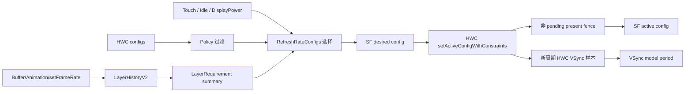
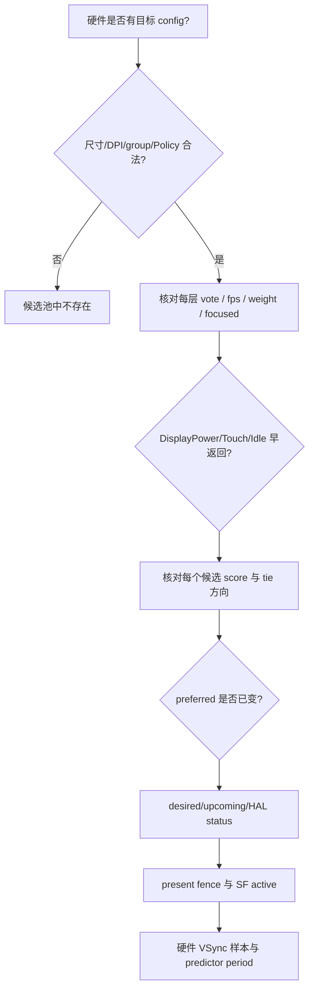

# 166 Android RefreshRateConfigs、LayerHistory 与动态刷新率选择

> 源码版本：Android 11 / API 30 / `android-11.0.0_r48`  
> 学习方式：macOS 静态阅读；不编译，不连接设备  
> 前置章节：第 12、21、67、155、165 章

---

## 1. 本章要回答的问题

第 165 章从硬件 VSync 样本出发，解释了 Scheduler 怎样派生 App 与 SurfaceFlinger（下文简称 SF）两路软件 VSync。本章向前追一层：

> SF 为什么选中某个刷新率，又凭什么认为这次切换已经走到下一阶段？

“根据内容 fps 选刷新率”只说中了中间一环。r48 的完整输入至少包括：

```text
HWC display configs
        ↓ 尺寸、DPI、config group、Policy
合法候选 config
        ↑
Layer 显式请求、更新节奏、动画、面积、焦点
        ↑
touch / idle / display-power
```

选出目标之后，还要依次经过 desired、upcoming、HAL 请求、present fence、SF active config 与 VSync period 模型。它们不是同一个状态，也没有一个返回值能一次证明全部完成。

本章重点回答：

1. config id、fps、VSync period 与 config group 分别是什么；
2. `primaryRange` 与 `appRequestRange` 怎样限制候选；
3. LayerHistory V2 怎样从 buffer、动画和 `setFrameRate()` 形成 vote；
4. unknown、infrequent、animating 与 stable content 为什么得到不同票；
5. 六类 vote 怎样给候选打分，面积和焦点怎样参与；
6. touch、idle、display-power 为什么可能绕过常规评分；
7. 从 Scheduler 选中 config 到新 period 被模型确认，究竟有几个完成点。

先记住本章结论：

> `LayerHistoryV2` 负责把 Layer 事实压缩成需求，`RefreshRateConfigs` 负责在 Policy 允许的候选中决策，SF 负责把目标异步交给 HWC；present fence 与硬件 VSync 样本分别支撑“SF 更新 active config”和“预测模型确认 period”，二者不能互相代替。

---

## 2. 先建立四层状态与四个完成点

动态刷新率最容易读错，是因为源码里同时存在四份“刷新率”：

| 状态 | 含义 | 典型字段 |
|---|---|---|
| preferred | Scheduler 当前算法选出的目标 | `mFeatures.configId` |
| desired/upcoming | SF 缓存的最新目标、已提交给 HWC 的这一代目标 | `mDesiredActiveConfig`、`mUpcomingActiveConfig` |
| active config | SF 认为显示当前采用的 config | `DisplayDevice::getActiveConfig()`、`mCurrentRefreshRate` |
| predictor period | 软件 VSync 模型当前使用的周期 | `VSyncReactor` / tracker period |

一次切换也至少有四个不同完成点：

```text
① RefreshRateConfigs 选出目标 config
② setActiveConfigWithConstraints() 返回：HWC 接受或拒绝请求
③ 上一帧 present fence 不再 pending：SF 假定 HWC 已更新并改 active 账
④ 新周期硬件 VSync 样本通过确认：VSync 模型改用新 period
```

其中：

- ② 不等于像素已经显示；
- ③ 是 SF 基于 present fence 的状态推进，不是面板寄存器同步读回；
- ④ 只证明 period confirmation 逻辑通过，也不是某个 App buffer 已经 present。

完整链路可以画成：



后文每读到“current”“changed”或“completed”，都要先问它属于哪一层。

---

## 3. 源码地图与建议阅读顺序

主要 native 文件：

```text
frameworks/native/services/surfaceflinger/
├── SurfaceFlinger.cpp / .h
├── SurfaceFlingerDefaultFactory.cpp
├── Layer.cpp / .h
├── BufferStateLayer.cpp
├── BufferQueueLayer.cpp
├── DisplayHardware/
│   └── HWC2.cpp
└── Scheduler/
    ├── Scheduler.cpp / .h
    ├── RefreshRateConfigs.cpp / .h
    ├── LayerHistory.cpp / .h
    ├── LayerHistoryV2.cpp
    ├── LayerInfoV2.cpp / .h
    ├── VSyncReactor.cpp
    └── VSyncModulator.cpp
```

Java/API 入口可辅助理解：

```text
frameworks/base/core/java/android/view/Surface.java
frameworks/base/core/java/android/view/SurfaceControl.java
frameworks/native/libs/gui/Surface.cpp
frameworks/native/libs/gui/SurfaceComposerClient.cpp
```

建议按三条线分别追，不要一开始就在所有回调之间跳转：

```text
候选线：HWC Config → RefreshRateConfigs → Policy → 两个候选表
证据线：Layer 更新 → LayerInfoV2 → LayerHistoryV2 → Summary
执行线：choose → desired → HWC → present fence / period sample
```

V1 仍在源码中，但 r48 工厂默认选择 V2。本文以 V2 为主，只在会影响判断时对照 V1。

---

## 4. RefreshRateConfigs：先筛出能选的 config

### 4.1 config id 不是 fps

`RefreshRateConfigs::RefreshRate` 同时保存：

```cpp
HwcConfigIndexType configId;
std::shared_ptr<const HWC2::Display::Config> hwcConfig;
std::string name;
float fps;
```

四者角色不同：

- `configId` 是交给 HWC 的具体 mode 身份；
- `hwcConfig` 还包含尺寸、DPI、group、period 等硬件属性；
- `fps` 由 `1e9 / vsyncPeriod` 换算，便于策略比较；
- `name` 只是日志友好的表现形式。

两个 config 完全可能同为 60 Hz，却属于不同分辨率或 config group。因此，排障不能只说“当前是 60”，必须同时核对 config id。

`RefreshRate::operator==` 也不是只比较 fps，而是比较 config id 与 config 对象。

### 4.2 Policy 有两层范围

```cpp
struct Policy {
    HwcConfigIndexType defaultConfig;
    Range primaryRange;
    Range appRequestRange;
    bool allowGroupSwitching = false;
};
```

可以把两层范围理解为：

```text
primaryRange    = 日常自动选择范围
appRequestRange = 任何选择都不能越过的外层范围
```

没有特殊的 App 明确信号时，评分通常只能影响 primary 范围；特定的 focused `ExplicitDefault` 可以给 primary 外的候选计分，但该候选仍必须位于 app-request 范围。

合法 Policy 还要求：

```text
defaultConfig 存在并落在 primaryRange
appRequestRange.min <= primaryRange.min
appRequestRange.max >= primaryRange.max
```

代码分别保存 DisplayManager policy 与 override policy。override 存在时覆盖前者，清除后重新使用 DisplayManager policy。

### 4.3 候选还受物理属性约束

`constructAvailableRefreshRates()` 分别构建：

```text
mPrimaryRefreshRates
mAppRequestRefreshRates
```

一个 config 要进入相应列表，必须满足：

```cpp
same width && same height
&& same dpiX && same dpiY
&& (allowGroupSwitching || same configGroup)
&& fps in requested range
```

这里的参照物是 Policy 的 `defaultConfig`。所以“面板支持 120 Hz”不等于“当前能选 120 Hz”：它可能被尺寸、DPI、group 或范围过滤掉。

列表按 VSync period 从大到小排序，也就是 fps 从低到高；period 相同再按 group 降序。因此：

```text
front() = 最低刷新率
back()  = 最高刷新率
```

评分只遍历 `mAppRequestRefreshRates`，但普通 Layer 对 primary 外候选通常不给分。这是“外层候选池”和“谁有资格影响外层候选”两道不同的门。

---

## 5. 功能开关、默认 vote 与三类历史输入

### 5.1 V2 默认打开，不等于内容检测默认打开

工厂创建 Scheduler 时传入：

```cpp
property_get_bool("debug.sf.use_content_detection_v2", true)
sysprop::use_content_detection_for_refresh_rate(false)
```

因此未被设备配置覆盖时：

```text
LayerHistory 实现：V2
普通内容 fps 启发式检测：关闭
```

这并不矛盾。即使内容检测关闭，LayerHistory 仍要承接显式 frame-rate API、默认 Max vote、面积和焦点等信息。

### 5.2 注册 Layer 时先给默认票

`Scheduler::registerLayer()` 的 r48 分支如下：

| 条件 | 默认 vote |
|---|---|
| Status Bar | `NoVote` |
| 内容检测关闭的普通 Layer | `Max` |
| V1 普通 Layer | `Heuristic` |
| V1 Wallpaper | `Heuristic`，但传入的 high fps 是设备最低档 |
| V2 Wallpaper | `Min` |
| V2 普通 Layer | `Heuristic` |

显式请求被清除后，Layer 会回到这里保存的 default vote，而不是继续沿用上一次显式 fps。

### 5.3 BufferStateLayer 提供 desired present time

`BufferStateLayer::setBuffer()` 把非正的 desired time 规范为 0，然后记录：

```cpp
mScheduler->recordLayerHistory(
        this, desiredPresentTime,
        LayerHistory::LayerUpdateType::Buffer);
```

### 5.4 BufferQueueLayer 区分自动时间戳

`BufferQueueLayer::onFrameAvailable()`：

```cpp
const nsecs_t presentTime =
        item.mIsAutoTimestamp ? 0 : item.mTimestamp;
```

自动 timestamp 不被当成客户端提供的 desired present time。

### 5.5 动画事务与 setFrameRate

带 `eAnimation` 的事务记录 `AnimationTX`。`Layer::setFrameRate()` 则在修改 current state 前记录 `SetFrameRate`，从而把 Layer 激活，让新请求有机会进入后续 summary。

这三个输入不要混为“实际显示时间”：

```text
Buffer         → desired time 或 0，并同时记录实际 queue 时刻
AnimationTX    → 最近是否发生动画事务
SetFrameRate   → 激活 Layer，具体 vote 来自随后提交到 drawing state 的 FrameRate
```

present fence 仍是另一条完成证据。

---

## 6. LayerInfoV2：从时间样本生成一张票

### 6.1 一条样本保存什么

源码字段名是 `presetTime`，注释明确它表示 desired present time：

```cpp
struct FrameTimeData {
    nsecs_t presetTime;
    nsecs_t queueTime;
    bool pendingConfigChange;
};
```

每次记录还会更新：

```text
mLastUpdatedTime = max(lastPresentTime, now)
mLastAnimationTime = max(lastPresentTime, now)  // 仅 AnimationTX
```

取最大值是因为客户端可能提前 queue 一个目标在未来显示的 buffer。未来 desired time 会延长 Layer 的 active 时间，但仍不能证明它届时真的 present。

`mFrameTimes` 最多保存 90 条。`onLayerInactive()` 不删除这些 frame time，而是推进 `mFrameTimeValidSince`、清 reported 状态和 rate 稳定历史；`clearHistory()` 才会进一步清空 frame times。

### 6.2 active、frequent、animating 是三道不同判断

普通 Layer active 需要：

```text
visible && lastUpdatedTime >= now - 1.2s
```

`getFrameRateForLayerTree().rate > 0` 的 Layer 会被一直保留为 active；但在 partition 时，如果它不可见，具体 vote 仍会被改成 `NoVote`。所以“保留 active”不等于隐藏 Layer 继续左右评分。

frequent 的判断先找 1.2 秒 active window 内的 frame：

- 总历史少于 3 条时，代码先把未知 Layer 当作 frequent；
- active window 内不足 3 条时，判为不频繁；
- 否则用 queue time 的平均速率判断是否至少 10 fps。

animating 则只看最近 1.2 秒是否记录过 `AnimationTX`。

### 6.3 `getRefreshRate()` 的优先级

```cpp
if (explicit/default vote is not Heuristic) return it;
if (isAnimating(now)) return Max;
if (!isFrequent(now)) return Min;
if (heuristic can report fps) return Heuristic(fps);
return Max;
```

这解释了新 Layer 为什么倾向 Max：少于 3 条历史时先被当作 frequent，但启发式计算又没有足够数据，最终落到 Max。系统先为可能刚启动的动画保留性能，观察到低频后才投 Min。

若 Layer 刚从 animating 或 infrequent 回到 frequent，代码会先 `clearHistory(now)`，避免旧行为污染新阶段；本轮因样本清空，通常仍先回到 Max。

### 6.4 何时有足够数据

启发式至少需要 2 帧，并同时满足：

```text
最旧样本不早于 mFrameTimeValidSince
并且：样本已达到 90 条，或 queue-time 跨度达到 1 秒
```

“2 帧”只够形成 delta；“90 条或 1 秒”才是允许报告 heuristic 的数据量门。

### 6.5 desired time 优先，queue time 只作有条件回退

平均周期逐段计算，每段至少钳到设备最高刷新率的 period，防止零或极小 delta 推出超硬件上限的 fps。

规则是：

1. 所有相邻帧都有 desired time 时，用 desired-time delta；
2. 任一段缺 desired time，且过去从未得到 reported fps，本轮返回 `nullopt`；
3. 过去已有 reported fps 时，允许整轮改用 queue-time delta，检查节奏是否仍延续。

这种回退主要照顾 render-ahead：生产者可能曾用 desired time 表达呈现节奏，后来不再携带它；此时 queue 节奏可以辅助验证，但不能在完全没有基线时直接代替呈现意图。

### 6.6 稳定性与 known frame rate

raw fps 为：

```text
1e9 / averageFrameTime
```

它不会直接成为 display config。代码先用 `RefreshRateHistory` 判断近段计算值的最大最小差是否不超过 1 Hz，再映射到 closest known frame rate。

known 集合起始包含：

```text
24, 30, 45, 60, 72
```

再加入硬件所有 config 的 fps，以 0.01 fps 容差去重。稳定历史按 2 秒和 `HISTORY_SIZE=90` 淘汰；由于 `add()` 在 size `>= 90` 时就弹出首项，实现中稳定队列实际不会保留满 90 项。

不稳定时继续使用上一次 reported 值。raw 变化不超过 1 Hz，或归一结果仍与上次 reported 相同，也不会更新输出。这些门共同抑制 mode 来回摆动。

### 6.7 config change 样本为何让本轮放弃计算

SF 发起切换时调用：

```cpp
mScheduler->setConfigChangePending(true);
```

该布尔值被复制进新 `FrameTimeData`。计算相邻 delta 时，只要两端任一个样本带 pending 标记，就直接返回 `nullopt`，避免把新旧 period 过渡误判为内容节奏。

它只影响 heuristic 帧间隔计算：不会冻结所有 vote，也不会阻止显式请求或全局信号参与选择。

---

## 7. 显式 frame-rate vote、Layer tree 与焦点

### 7.1 Java compatibility 到 native vote

两种主要 compatibility 的映射是：

| Java 语义 | Layer 内部类型 | LayerHistory vote |
|---|---|---|
| `DEFAULT` | `FrameRateCompatibility::Default` | `ExplicitDefault` |
| `FIXED_SOURCE` | `ExactOrMultiple` | `ExplicitExactOrMultiple` |

`frameRate == 0` 表示移除具体 rate。若 Layer tree 没有其他 vote，它会回到注册时的 default vote。

### 7.2 tree vote 不等于父子复制相同 fps

`updateTreeHasFrameRateVote()` 遍历父节点和整棵子树，统计 Default 或 NoVote 类型，并把“树中存在相关 vote”写到各节点。

`getFrameRateForLayerTree()` 的行为是：

```text
本 Layer 有 rate 或明确 NoVote → 返回自身 FrameRate
自身没 rate，但 treeHasFrameRateVote → 返回 rate=0 的 NoVote
否则 → 返回自身默认空 FrameRate
```

因此，树标记主要防止同一父子树里没有明确请求的邻接 Layer 再用 heuristic/default 票干扰；它不是把某个子 Layer 的具体 fps 广播给所有亲属。

源码注释还明确：`ExactOrMultiple` 不计入 `treeHasFrameRateVote` 的这组统计，与后续允许 touch boost 的策略相呼应。

### 7.3 焦点来自 priority 继承

如果本 Layer 的 drawing state 没设置 `frameRateSelectionPriority`，`getFrameRateSelectionPriority()` 会沿 parent 向上查找。只有：

```text
PRIORITY_FOCUSED_WITH_MODE
PRIORITY_FOCUSED_WITHOUT_MODE
```

被 `isLayerFocusedBasedOnPriority()` 视为 focused。

焦点不会直接把某一票变成最高分。它唯一关键的越界能力是：

> focused 的 `ExplicitDefault` 可以给 primaryRange 外、appRequestRange 内的候选计分。

非焦点 `ExplicitDefault`、`ExplicitExactOrMultiple` 和 Heuristic 都没有这条例外。

r48 的 `LayerHistoryV2` 构造函数读取 `debug.sf.use_frame_rate_priority` 到 `mUseFrameRatePriority`，但该成员在这份 `.cpp` 的后续逻辑中没有被使用。不能仅凭属性名声称把它设为 false 就会关闭焦点作用。

---

## 8. LayerHistoryV2：把活跃 Layer 压成 Summary

`LayerHistoryV2::summarize()` 先 partition active/inactive/expired Layer，再为 active Layer 生成：

```cpp
LayerRequirement {
    name,
    vote,
    desiredRefreshRate,
    weight,
    focused
}
```

`NoVote` 在这里直接跳过，不进入 summary。

### 8.1 可见性与显式 vote 的细边界

有正 rate 的显式 Layer 即便很久不更新，也留在 active 分区；但不可见时被转换为 `NoVote`。普通 Layer 则必须可见且最近 1.2 秒有更新。

因此排障时要分开看：

```text
是否仍在 active 容器
是否 visible
最终 summary 是否真的包含它
```

### 8.2 V2 权重来自 transformed bounds

```cpp
Rect bounds = Rect(layer->getBounds());
Rect transformed = transform.transform(bounds, true);
float weight = displayArea ? transformedArea / displayArea : 0;
```

它表达“大面积内容通常更应影响整块屏幕的 mode”，但不是精确可见面积：

- 没有扣除被其他 Layer 遮挡的 region；
- 使用外接矩形式 transformed bounds；
- `displayArea == 0` 时权重为 0；
- 接口注释称 weight 在 `[0,1]`，此处实现没有显式 clamp。

所以不能把 0.3 weight 解读为“屏幕上恰有 30% 像素可见”。V1 更简单，summary 中权重固定为 1。

### 8.3 Summary 相等会跳过内容重算

`Scheduler::chooseRefreshRateForContent()` 每轮先 summarize。若结果与缓存完全相同，就立即返回。

这只跳过“内容 summary 未变化”的路径。touch、idle 和 display-power timer 状态变化会经 `handleTimerStateChanged()` 独立重算；Policy 更新也会重新求 preferred config。不要误读成刷新率只能在 Layer 列表变化时改变。

---

## 9. 六类 vote 怎样给每个候选打分

六类 vote 的职责是：

| Vote | 含义 | desired fps |
|---|---|---|
| `NoVote` | 不关心 | 无 |
| `Min` | 倾向最低档 | 无 |
| `Max` | 倾向性能档 | 无 |
| `Heuristic` | 平台从历史推算 | 有 |
| `ExplicitDefault` | App 给定，但允许系统适配 | 有 |
| `ExplicitExactOrMultiple` | 固定源，希望精确或整数倍 cadence | 有 |

聚合不是“票数最多者胜”，而是对 app-request 候选逐层累计 `layerScore * weight`。

### 9.1 `NoVote` 与 `Min` 不进入普通计分

两者在 score 循环中直接跳过。但函数有早返回：

```text
summary 为空或全 NoVote → primary Max
全体只有 NoVote + Min，且至少有 Min → primary Min
```

这就是为何 `Min` 不需要给每个低档候选计算连续分数。

### 9.2 `Max` 使用相对最高档的平方分数

```text
score = (candidateFps / highestAppRequestFps)^2
```

再乘 Layer weight。例如候选为 60/90/120 Hz，原始分数约为：

| 候选 | Max score |
|---|---:|
| 60 | 0.25 |
| 90 | 0.5625 |
| 120 | 1.0 |

注意分母是 app-request 候选列表最高档；但该 Layer 是否能给 primary 外候选计分，还受前面的资格门限制。

### 9.3 `ExplicitDefault` 把请求周期当作最小生产时间

它寻找一个整数 multiplier，使：

```text
actualLayerPeriod = displayPeriod * multiplier
actualLayerPeriod + 800us >= layerPeriod
```

然后：

```text
score = min(1, layerPeriod / actualLayerPeriod)
```

这不是严格的“只有整数倍才得分”。Default 表达内容能够适应系统选择的 rate，因此相近但不完美的组合也能得分。

### 9.4 `Heuristic` 与 `ExactOrMultiple` 看 cadence

这两类共用 `getDisplayFrames()`：把 layer period 除以 display period，并用 800 μs margin 把接近边界的 remainder 当成 0。

- 精确整数倍：score = 1；
- 内容 rate 高于显示 rate：给一个较低的比例分；
- 内容 rate 低于显示 rate但不整除：模拟误差回绕，最多检查 10 帧，score 为 `1 / iter`。

例如 24 fps 内容周期约 41.67 ms，120 Hz 显示周期约 8.33 ms，每 5 个显示周期呈现一帧，cadence 可以完整对齐。因此 24 fps 内容并不要求硬件必须存在 24 Hz。

### 9.5 primary 外评分资格

对每个候选，代码先判断：

```cpp
if ((primaryRangeIsSingleRate || !inPrimaryRange) &&
    !(layer.focused && layer.vote == ExplicitDefault)) {
    continue;
}
```

尤其要看到 `primaryRangeIsSingleRate`：当 primary 被锁成单档时，普通 Layer 连这一个 primary 候选也不走常规 score；只有 focused `ExplicitDefault` 能给 app-request 候选打分。若最终所有 score 都是 0，函数明确回到 primary 的唯一档，而不是随手选 app-request 列表的一项。

### 9.6 tie 的方向由 Max vote 决定

存在至少一个 Max vote 时，从高到低遍历候选；否则从低到高。helper 只有在新 score 大于当前最大值的 `1.001` 倍时才替换，因此近似平局会保留先遇到的候选：

```text
有 Max → 近似平局偏高
无 Max → 近似平局偏低
```

r48 还计算了 `maxExplicitWeight`，但该局部量在后续函数中没有使用。变量名不能作为“最大显式权重有额外特权”的证据。

---

## 10. 全局信号：哪些情况会绕过或改写评分

### 10.1 DisplayPower 是最外层可选 boost

如果设备配置了 display-power timer，并且：

```text
显示电源状态不是 normal
或刚恢复 normal、grace timer 仍处于 Reset
```

`Scheduler::calculateRefreshRateConfigIndexType()` 直接返回 primary Max，不进入 V2 的 Layer 评分。

SF 只把 `PowerMode::ON` 视为 normal。每次 display power 状态变化都会清 LayerHistory；清理动作本身不依赖 timer 是否存在。若 timer 没被设备配置，则特殊 boost 分支不存在。

### 10.2 touch 有前后两次机会

`getBestRefreshRate()` 的规则不是“touch 永远最高”：

```text
touch + 没有任何 Explicit* → 立即 primary Max

touch + 有 Explicit* → 先正常评分
    若没有 ExplicitDefault，且 normal result 低于 primary Max
        → 末尾再 boost 到 primary Max
    只要存在 ExplicitDefault
        → 不做末尾 boost
```

因此 `ExplicitExactOrMultiple` 会阻止第一次早返回，却不会阻止末尾 boost；`ExplicitDefault` 才会阻止末尾 boost。这里统计的是是否存在该类 Layer，不要求它一定是面积最大者。

### 10.3 idle 只在 touch 不活跃时抢先降频

满足：

```text
!touch && idle
```

通常直接选 primary Min。例外是 primaryRange 只有单档且存在显式 vote，此时允许继续评分，让 focused `ExplicitDefault` 有机会使用 app-request 范围。

### 10.4 `consideredSignals` 不是 timer 状态副本

输出中的 touch/idle 只在该信号真正决定返回结果时置位。Scheduler 用它判断是否清历史，以及是否抑制 config changed event。

### 10.5 kernel idle timer 是另一套机制

Scheduler idle timer 是用户空间选择信号；kernel idle timer 面向显示/DPU 无活动时的硬件低功耗。r48 还用约 65 Hz 阈值决定 kernel timer callback 中是否重新采样或停硬件 VSync event。

两者可能共享“idle”一词，却不是同一个布尔值，也不能用一个 dump 字段替代另一个。

---

## 11. Scheduler 何时重算，以及 App 为何可能收不到 config 事件

### 11.1 主循环先更新 Layer，再选择

`onMessageInvalidate()` 的主线先处理 transaction/invalidate，让 drawing state、可见性与 buffer 历史推进，然后持有 `mStateLock` 调用：

```cpp
mScheduler->chooseRefreshRateForContent();
```

这样本轮 summary 才能看到最新 Layer 事实。

内容路径依次做：

1. `summarize(systemTime())`；
2. summary 未变则返回；
3. 缓存新的 content requirements；
4. 结合全局信号算新 config id；
5. id 相同则视情况补发缓存 config event；
6. id 改变则回调 SF `changeRefreshRate()`。

### 11.2 timer 状态变化独立重算

touch、idle 与 display-power timer callback 都通过 `handleTimerStateChanged()` 比较旧新状态并重新调用选择算法。它们不需要等待下一次 Layer summary 改变。

新 transaction 和 Layer update 会 reset idle timer。`notifyTouchEvent()` 只在 touch timer 存在时 reset 它；若同时支持 kernel timer 且存在 idle timer，也会 reset idle timer。

touch callback 只有在这次选择真正 `considered touch` 时才清 LayerHistory，而不是每个原始触摸通知都无条件清。

### 11.3 idle 切换可以抑制 App config changed

当 idle 真正决定选择时，Scheduler 回调 SF 使用：

```cpp
ConfigEvent::None
```

这样无内容活动时的降频不必立刻唤醒 App 处理配置事件。离开 idle 后，即使算出的 config id 与缓存目标相同，`dispatchCachedReportedConfig()` 仍可能补发此前抑制的最新 config。

所以：

```text
HWC/SF 的 active config 改变
≠ App 一定在同一时刻收到 config changed
```

### 11.4 Policy 更新是另一入口

Policy 改变后，RefreshRateConfigs 重建候选，SF 通知 Scheduler 当前 primary config 参数、调整 kernel idle timer，再通过 `getPreferredConfigId()` 重新计算目标。若 Scheduler 还没有目标，则退回 Policy 的 default config。

---

## 12. 从 preferred config 到 HWC 请求

### 12.1 `setDesiredActiveConfig()` 建立异步目标

Scheduler 的 callback 最终进入 SF `changeRefreshRateLocked()`，再次检查 config 是否仍被 Policy 允许，然后调用 `setDesiredActiveConfig()`。

第一次建立 pending change 时，SF 会：

```text
mDesiredActiveConfigChanged = true
保存 desired config/event
repaintEverythingForHWC()
按目标 period 开始 hardware-VSync resync
VSyncModulator::onRefreshRateChangeInitiated()
切到目标 fps 对应的 phase offsets
LayerHistory configChangePending = true
```

若旧切换尚未收尾，新请求不会并行创建第二条 HWC 状态机，而是覆盖 `mDesiredActiveConfig`；新旧 `ConfigEvent` 做按位 OR，以免丢掉需要通知的语义。

`getActiveConfig()` 对主显示还有一个容易误导诊断的细节：若存在 desired config，它返回 desired id，而非 DisplayDevice 当前 active id。因此这个 Binder/API 结果也不能独立证明 HWC 已切完。

### 12.2 真正调用 HAL 在后续主循环

SF 更新完 Layer 并完成选择后，主线程调用：

```cpp
performSetActiveConfig();
```

它重新检查：

- 当前是否仍有 desired change；
- display 是否存在；
- desired 是否已经等于 active；
- config 在执行时是否仍被 Policy 允许。

通过后复制为 `mUpcomingActiveConfig`，构造：

```cpp
constraints.desiredTimeNanos = systemTime();
constraints.seamlessRequired = false;
```

再调用 `setActiveConfigWithConstraints()`。r48 的 TODO 说明此处还没有充分利用 constraints；语义是请求尽快切换，不要求 seamless。

### 12.3 HAL 返回 timeline，不返回“像素已完成”

支持 HWC 2.4 period switch 时，Composer 返回：

```text
newVsyncAppliedTimeNanos
refreshRequired
refreshTimeNanos
```

legacy fallback 则调用旧 `setActiveConfig()`，在 framework 侧合成一份 timeline，并把 `refreshRequired` 设为 true。

HAL 调用失败时，r48 只记录 warning 并返回；它没有在这里清掉 desired-change 状态。后续主循环仍可能重试同一个 desired 目标。

HAL 调用成功后：

```cpp
mScheduler->onNewVsyncPeriodChangeTimeline(outTimeline);
mSetActiveConfigPending = true;
```

此刻 SF 还没有更新自己的 active config。

---

## 13. Timeline、present fence 与 period confirmation 各证明什么

### 13.1 timeline 的 `refreshRequired` 驱动空刷新

Scheduler 收到 timeline 后，若 `refreshRequired` 为 true，就请求 repaint。每次显示 present 前记录一个 `systemTime()`，present 调用返回后把这个时间传给 `onDisplayRefreshed()`：

```text
若 refreshTimeNanos < 本轮 present 调用前的时间
    → 清 refreshRequired
否则
    → 再请求一次 repaint
```

这个比较用的不是 present fence signal time，而是调用 composition engine 前取得的时刻。

### 13.2 r48 只缓存并钳制 `newVsyncAppliedTimeNanos`

Scheduler 把过远的 `newVsyncAppliedTimeNanos` 钳到 `now + 200ms`。但在这份 r48 SurfaceFlinger/Scheduler 源码中，该字段之后没有被读取来阻塞 active config 更新、等待 deadline 或确认 period；真正重复 repaint 的分支只看 `refreshRequired/refreshTimeNanos`。

所以 200 ms 不是“HWC 必须在 200 ms 内完成”的保证，甚至不能描述为这里真的等待了 200 ms。它只是被保存 timeline 字段的上界处理。

HWC 后续还可通过 `onVsyncPeriodTimingChangedReceived()` 提交更新后的 timeline，Scheduler 会覆盖缓存并重复同样处理。

### 13.3 present fence 推进 SF active config

下一次 invalidate 开始时，SF 检查上一帧 present fence：

```text
mSetActiveConfigPending && previous frame still pending
    → 再 invalidate，提前返回

mSetActiveConfigPending && previous frame no longer pending
    → 清 mSetActiveConfigPending
    → setActiveConfigInternal()
```

源码注释很谨慎：SF 是“assume” HWC 已成功更新 config。随后内部才更新：

- RefreshRateConfigs current config；
- RefreshRateStats mode；
- DisplayDevice active config；
- refresh-rate switch 计数；
- PhaseConfiguration 与 VSyncModulator offsets；
- 非 `None` event 对应的 App config changed。

present fence 支撑的是这次 Framework 状态推进，不等于屏幕像素扫描完成回执。

### 13.4 desired pending 在同轮后段正常收尾

`setActiveConfigInternal()` 自身没有调用 `desiredActiveConfigChangeDone()`。但这次 invalidate 并不会在更新 active 后立即结束；后面仍会走到 `performSetActiveConfig()`。

此时若没有更新目标覆盖 desired，函数看到：

```text
display->getActiveConfig() == desiredActiveConfig.configId
```

便调用 `desiredActiveConfigChangeDone()`，清：

```text
mDesiredActiveConfig.event
mDesiredActiveConfigChanged
LayerHistory configChangePending
```

并再次按最后 desired period resync、刷新 phase offsets。

若切换途中来了新目标，desired 已被覆盖；active 先更新为旧 upcoming，后段 `performSetActiveConfig()` 会发现新 desired 与 active 不同，继续向 HWC 发下一代请求，而不是错误地清掉新目标。

这比“成功路径没有收尾”更准确：收尾不在 `setActiveConfigInternal()` 内，而是依靠同轮后段再次进入 `performSetActiveConfig()`。

### 13.5 硬件 VSync 样本独立确认 period

`setDesiredActiveConfig()` 已让 Reactor 针对目标 period 开始 transition。后续 `onVsyncReceived()` 把硬件 timestamp 和可选 Composer period 交给 `addResyncSample()`。

`VSyncReactor::periodConfirmed()`：

- 若 Composer 直接给 period，要求与目标差值小于目标的 10%；
- 否则至少需要前一个硬件 VSync，再比较相邻 timestamp distance，容差同为 10%。

确认后 tracker 与 callbacks 才 `setPeriod(target)`，`periodFlushed=true`，SF 再调用：

```cpp
mVSyncModulator->onRefreshRateChangeCompleted();
```

因此 active config 与 predictor period 可短暂分离；第 165 章所讲的 refresh-rate-change early offsets 就覆盖这一过渡窗口。

---

## 14. 常见误解与一套可执行诊断顺序

### 14.1 十个常见误解

1. **“动态刷新率只看前台 App fps。”**  实际聚合多个 Layer、面积、焦点、显式请求与全局信号。
2. **“面板支持的 Hz 都是候选。”**  尺寸、DPI、group 与 Policy 会先过滤。
3. **“内容检测关闭，frame-rate API 也失效。”**  LayerHistory 仍存在，显式 vote 仍参与。
4. **“desired present time 是实际显示时间。”**  它是客户端意图；queue 与 present fence 是别的事实。
5. **“新 Layer 应先用最低档省电。”**  V2 对未知且可能开始动画的内容先倾向 Max。
6. **“24 fps 必须配 24 Hz。”**  48、72、120 等整数倍也可能有完整 cadence。
7. **“所有显式请求都能越 primaryRange。”**  只有 focused `ExplicitDefault` 有评分例外。
8. **“touch 一定覆盖显式请求。”**  `ExplicitDefault` 会阻止末尾 boost，ExactOrMultiple 不会。
9. **“idle 降频一定通知 App。”**  considered idle 使用 `ConfigEvent::None`，可延后补发。
10. **“HAL 返回成功就是切换完成。”**  active 账与 period model 仍有独立确认链。

### 14.2 为什么没有切到 X Hz：五层排查



按这个顺序比只盯 `ActiveConfigFPS` 更可靠。若第一层就被 Policy 排除，继续手算 cadence 没有意义；若 preferred 已正确，则要转入执行链而非继续怀疑评分。

### 14.3 r48 特有的审计边界

- `maxExplicitWeight` 被计算但未使用；
- `mUseFrameRatePriority` 被保存但在 V2 `.cpp` 中未控制焦点逻辑；
- area weight 没有本地 clamp，也不是 occlusion-aware region；
- config-change pending 只污染 heuristic sample，不暂停所有选择；
- timer 都是可选配置，属性为 0 就不会出现相应行为；
- `newVsyncAppliedTimeNanos` 在本版本仅被缓存/钳制，没有成为 active 或 period 的完成门；
- `getActiveConfig()` 对主显示可能返回 desired，而非已经由 present fence 推进的 active。

这些差异都说明：注释、字段名和新版本设计意图不能替代 r48 的实际调用点。

---

## 15. macOS 只读练习

以下练习都只读源码，可在 `/Users/ninebot/androidSource` 下执行。

### 练习 1：列出两套候选过滤器

```bash
sed -n '470,550p' \
  frameworks/native/services/surfaceflinger/Scheduler/RefreshRateConfigs.cpp
```

任务：写出尺寸、DPI、group、range 条件，并解释 primary 与 app-request 两次过滤为何都需要。

### 练习 2：确认默认功能分支

```bash
rg -n "use_content_detection_v2|use_content_detection_for_refresh_rate" \
  frameworks/native/services/surfaceflinger/SurfaceFlingerDefaultFactory.cpp \
  frameworks/native/services/surfaceflinger/Scheduler/Scheduler.cpp
```

任务：分别回答“V2 默认值”和“普通内容检测默认值”。

### 练习 3：追三类 history 输入

```bash
rg -n "recordLayerHistory" \
  frameworks/native/services/surfaceflinger/BufferStateLayer.cpp \
  frameworks/native/services/surfaceflinger/BufferQueueLayer.cpp \
  frameworks/native/services/surfaceflinger/Layer.cpp \
  frameworks/native/services/surfaceflinger/SurfaceFlinger.cpp
```

任务：标记 Buffer、AnimationTX、SetFrameRate，并说明各自携带的时间含义。

### 练习 4：推导 unknown → Max

```bash
sed -n '65,230p' \
  frameworks/native/services/surfaceflinger/Scheduler/LayerInfoV2.cpp
```

任务：从“少于 3 条 frame time”开始，依次经过 frequent、enough-data 和最终 vote。

### 练习 5：检查显式请求的 tree 传播

```bash
sed -n '1330,1450p' \
  frameworks/native/services/surfaceflinger/Layer.cpp
```

任务：说明 `treeHasFrameRateVote` 为什么返回的是 NoVote，而不是复制具体 fps。

### 练习 6：手算 cadence

```bash
sed -n '180,310p' \
  frameworks/native/services/surfaceflinger/Scheduler/RefreshRateConfigs.cpp
```

任务：对 24 fps 内容比较 60/72/90/120 Hz；先判断整数倍，再观察非整除路径的 `1 / iter`。

### 练习 7：拆开两个 completion

```bash
rg -n "mSetActiveConfigPending|setActiveConfigInternal|periodFlushed" \
  frameworks/native/services/surfaceflinger/SurfaceFlinger.cpp
```

任务：分别标出 present fence 推进 active config、硬件 VSync sample 推进 predictor period 的位置。

### 练习 8：证明 timeline 字段有没有消费者

```bash
rg -n "newVsyncAppliedTimeNanos|refreshTimeNanos" \
  frameworks/native/services/surfaceflinger
```

任务：对照两个字段的读写次数，说明 r48 哪一个实际控制重复 repaint。

---

## 16. 核心结论、自测与下一章

### 16.1 核心结论

1. SF 真正切换的是 HWC config id；fps 只是由 VSync period 换算的策略量。
2. 候选必须同时通过尺寸、DPI、group 和 Policy 范围过滤。
3. primaryRange 是常规自动选择范围，appRequestRange 是绝不越过的外层范围。
4. r48 默认构造 LayerHistory V2，但普通内容启发式检测的 helper 默认值为 false。
5. Buffer 记录 desired/queue 时间，AnimationTX 记录动画活跃，SetFrameRate 激活显式请求。
6. unknown、infrequent、animating 分别倾向 Max、Min、Max；稳定且数据足够才报告 Heuristic fps。
7. heuristic 需要至少 2 帧，并达到 90 条或 1 秒跨度；稳定性还用 2 秒、1 Hz 波动门防抖。
8. 切换期间样本只会令 heuristic 本轮放弃计算，不会暂停全部 vote。
9. Default 与 Fixed Source 分别映射 ExplicitDefault 与 ExplicitExactOrMultiple。
10. Layer tree 对无请求的亲属返回 NoVote，而不是复制具体 fps。
11. V2 weight 是 transformed bounds/display area，不是精确可见 region，且本地没有 clamp。
12. 只有 focused ExplicitDefault 可以给 primary 外、app-request 内候选计分。
13. Heuristic/Exact 更关心 cadence 是否规整，不是简单寻找数值最近的 Hz。
14. touch、idle、display-power 可早返回或后置 boost，且对应 timer 都可能不存在。
15. idle considered 可抑制 App config changed，离开 idle 后再补发缓存状态。
16. preferred、desired/upcoming、SF active 与 predictor period 是四份可短暂分离的状态。
17. HAL 接受、present fence 解除 pending、active 账更新、period sample 确认是不同完成点。
18. 正常成功路径通过同轮后段再次执行 `performSetActiveConfig()` 清 desired pending。
19. r48 的 `newVsyncAppliedTimeNanos` 只被缓存并钳制，不能当作实际等待或完成证明。

### 16.2 自测题

1. 两个同为 60 Hz 的 config 为什么可能不是同一 mode？
2. primaryRange 与 appRequestRange 分别约束谁？
3. 为什么评分遍历 app-request candidates，却仍常常留在 primaryRange？
4. 内容检测关闭时，普通 Layer 和显式 frame-rate API 各怎样工作？
5. desired present time、queue time 与 present fence 各表示什么？
6. 少于 3 帧的新 Layer 为什么不是立即判为低频？
7. 90 条、1 秒、2 秒三个门分别属于哪段算法？
8. 为什么缺 desired time 时不能总是直接改用 queue time？
9. `frameRate=0` 后 Layer 会回到什么 vote？
10. `treeHasFrameRateVote` 为什么让亲属返回 NoVote？
11. focused 给哪一类 vote 增加了什么资格？
12. 为什么 24 fps 可以在 120 Hz 上得到完整 cadence？
13. `Min` 不进入 score 循环，系统又怎样选择最低档？
14. touch 遇到 ExplicitDefault 与 ExactOrMultiple 有何不同？
15. idle 降频为何可能不向 App 发 config changed？
16. timeline 的三个字段中，r48 哪两个实际控制重复 repaint？
17. present fence 与 VSync period sample 分别推进哪份状态？
18. 切换过程中来了新 desired config，旧 upcoming 完成后会怎样继续？

### 16.3 下一章预告

第 167 章继续学习：

> `FrameTimeline`、Jank 分类与 `TimeStats` 帧性能统计。

下一章会把 expected/actual timeline、frame token、deadline、acquire/present fence 与多类 jank 原因放到同一张时间线上，并继续坚持本章的方法：每个统计值都先回答“它在哪一层产生，又能证明哪个完成点”。
