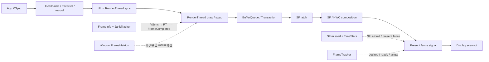
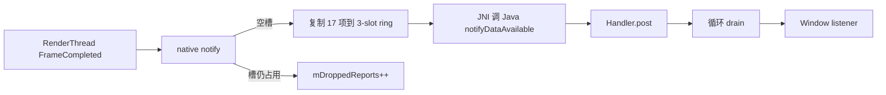
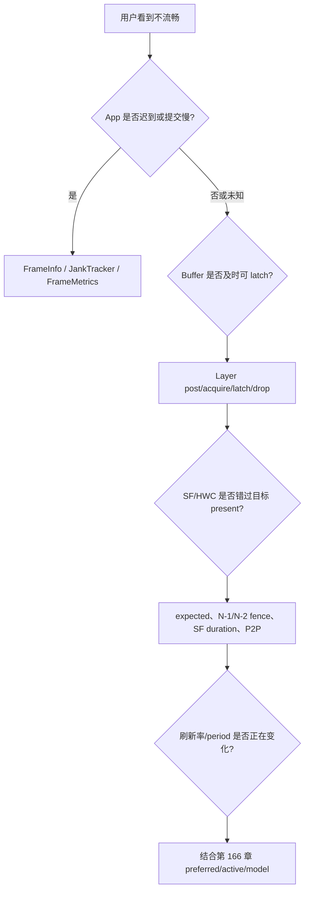

# 167 Android 11 帧性能统计：FrameInfo、JankTracker、TimeStats 与 FrameTracker

> 源码版本：Android 11 / API 30 / `android-11.0.0_r48`  
> 学习方式：macOS 静态阅读；不编译，不连接设备  
> 前置章节：第 18、21、161—166 章

---

## 1. 先纠正版本：r48 还没有统一 FrameTimeline

后续 Android 版本提供了更完整的 FrameTimeline、token、expected/actual timeline 与统一 jank 归因。把这些名字直接套回 Android 11，会得到一条源码中不存在的链路。

在 `android-11.0.0_r48` 中实际并存的是：

```text
App/HWUI
  ├─ FrameInfo：17 个流水线槽位
  ├─ JankTracker：应用渲染耗时与 6 类局部原因
  └─ FrameMetrics：把同一组 HWUI 数据异步交给 Window 监听者

SurfaceFlinger
  ├─ previous present fence：判定上一目标显示帧是否 missed
  ├─ TimeStats：全局 SF 帧与每 Layer 的时间差直方图
  └─ FrameTracker：desired / ready / actual 三时间环
```

源码搜索也支持这个边界：SF 树中没有后来那套 FrameTimeline 模块；此处的 `JankType` 只属于 HWUI `ProfileData`。

因此本章不尝试制造“一帧一个统一真相”，而是回答：

1. 每套统计器看的是哪一段；
2. 它以什么身份关联记录；
3. 它的结束点能证明什么；
4. 它怎样定义 slow、jank、miss 或 drop；
5. 为什么几套计数不能直接相加或逐帧对齐。

一句话总览：

> r48 的性能证据是多套局部账本：FrameInfo/JankTracker 观察 App 到 RenderThread 的提交，SF missed 观察上一 present fence 相对目标的状态，TimeStats 与 FrameTracker 再记录 SF 或 Layer 的 present 节拍；没有跨 App/SF 的统一 token，就不能仅凭相邻编号把它们强行拼成同一逻辑帧。

---

## 2. 四套账本的观察范围与完成点



| 账本 | 主要身份 | 主要结束点 | 不能证明什么 |
|---|---|---|---|
| HWUI FrameInfo/JankTracker | 当前 CanvasContext 的 FrameInfo | `FrameCompleted` | GPU 完成、SF present、scanout |
| Window FrameMetrics | 复制的一组 17 槽数据 | 同一 `FrameCompleted` 快照 | 监听回调时屏幕已显示 |
| SF missed/global TimeStats | SF 显示轮次与 present fence | 提交返回或 fence signal | 某个 App 是根因 |
| Layer TimeStats | `layerId + frameNumber` | Layer 对应 present fence/time | 所有用户可见掉帧 |
| FrameTracker | 本地环形位置 | actual present fence/time | 统一 App/SF token 与原因归因 |

“完成”至少要继续拆成：

```text
UI 命令录制完成
RenderThread 完成 draw/swap 调用
GPU/consumer 可使用 buffer
SF 向 HWC 提交 present
present fence signal
像素实际扫描
```

r48 的这些统计器最多覆盖到 present fence 抽象；没有一项逐像素确认 scanout。

---

## 3. 源码地图

App/HWUI：

```text
frameworks/base/graphics/java/android/graphics/
├── FrameInfo.java
└── HardwareRendererObserver.java

frameworks/base/core/java/android/view/
├── Choreographer.java
├── ThreadedRenderer.java
├── FrameMetrics.java
├── FrameMetricsObserver.java
└── Window.java

frameworks/base/libs/hwui/
├── FrameInfo.cpp / .h
├── JankTracker.cpp / .h
├── ProfileData.cpp / .h
├── FrameMetricsReporter.h
├── jni/android_graphics_HardwareRendererObserver.cpp / .h
└── renderthread/
    ├── DrawFrameTask.cpp
    ├── CanvasContext.cpp
    └── RenderThread.cpp
```

SurfaceFlinger：

```text
frameworks/native/services/surfaceflinger/
├── SurfaceFlinger.cpp
├── BufferLayer.cpp
├── BufferQueueLayer.cpp
├── BufferStateLayer.cpp
├── FrameTracker.cpp / .h
└── TimeStats/
    ├── TimeStats.cpp / .h
    └── timestatsproto/TimeStatsHelper.cpp
```

建议按“App 局部帧 → SF 显示帧 → Layer 记录 → 老 FrameStats”四段阅读。看到相同的 `present`、`ready` 或 `frame` 字样，不要自动认为它们共享身份。

---

## 4. FrameInfo：17 个槽位怎样形成 App 帧

### 4.1 槽位布局

`FrameInfoIndex` 固定为 17 项：

```cpp
Flags,
IntendedVsync,
Vsync,
OldestInputEvent,
NewestInputEvent,
HandleInputStart,
AnimationStart,
PerformTraversalsStart,
DrawStart,
SyncQueued,
SyncStart,
IssueDrawCommandsStart,
SwapBuffers,
FrameCompleted,
DequeueBufferDuration,
QueueBufferDuration,
GpuCompleted
```

`UI_THREAD_FRAME_INFO_SIZE` 是 9，所以 Flags 到 DrawStart 由 UI 数组传入；后 8 项主要由 DrawFrameTask/CanvasContext 填。

### 4.2 UI 线程依次写哪些边界

Choreographer 在 `doFrame()` 中设置 VSync 后，依次标记：

```java
markInputHandlingStart();
doCallbacks(INPUT);

markAnimationsStart();
doCallbacks(ANIMATION);
doCallbacks(INSETS_ANIMATION);

markPerformTraversalsStart();
doCallbacks(TRAVERSAL);
doCallbacks(COMMIT);
```

`ThreadedRenderer.draw()` 在绘制根 DisplayList 前调用 `markDrawStart()`，再由 `syncAndDrawFrame()` 把 9 项数组交给 native。

这些是阶段边界，不是 CPU-only profiler。区间中可以包含线程被抢占、锁等待、Binder、GC 或其他工作。

### 4.3 IntendedVsync 与 Vsync

Choreographer 保留：

```text
IntendedVsync = 原始硬件/软件 VSync 事件时间
Vsync         = 主线程迟到后，本轮动画与绘制实际使用的修正 frame time
```

若进入 `doFrame()` 时已迟到多个周期，它按 jitter 计算 skipped frame 数，并把 used frame time 对齐到最近周期：

```java
mFrameInfo.setVsync(intendedFrameTimeNanos, frameTimeNanos);
```

所以两者不同表示 UI 没及时响应原目标，不能直接解释成显示硬件漏发 VSync。

### 4.4 FrameInfo 是可复用槽位，不是不可变事件对象

CanvasContext 的 JankTracker 使用 120 项 ring；`startFrame()` 返回下一个可覆盖槽位。FrameMetrics observer 又会复制当时的 17 项到自己的三槽 ring。

因此要区分：

```text
FrameInfo 当前槽     → HWUI 内部可复用
observer native copy → 等待 Java drain 的快照
FrameMetrics 对象    → 每次 listener 调用复用同一个 long[]
```

需要跨回调保存时，应用必须构造 `new FrameMetrics(frameMetrics)`。

---

## 5. duration、FrameCompleted 与延迟补写的 GPU 时间

### 5.1 跨 SyncQueued 的区间会扣掉排队 stall

`FrameInfo::duration(start, end)` 先做 `end - start`。若区间从 `SyncQueued` 之前跨到其后，会扣除：

```text
SyncStart - SyncQueued
```

源码理由是这段 UI 等待 RenderThread 的 stall 会被前一流水线帧捕获，当前帧再算会重复。

所以 C++：

```cpp
frame.duration(IntendedVsync, FrameCompleted)
```

不一定等于两个槽位直接相减。

Java `FrameMetrics.getMetric(TOTAL_DURATION)` 则直接做：

```text
FrameCompleted - IntendedVsync
```

它不会调用 C++ `duration()`。这使 Java TOTAL 与 JankTracker 判定 total 在 sync stall 时可能不同。

FrameMetrics 文档还称 TOTAL 等于其他 duration metric 之和；但各分段从 DRAW 结束在 `SyncQueued`、SYNC 又从 `SyncStart` 开始，分段和排除了中间 stall，TOTAL 的直接相减却包含它。r48 实现并不保证该文字等式在 stall 存在时成立。

### 5.2 FrameCompleted 只是 RenderThread 提交点

CanvasContext 在 draw/swap 路径后写：

```cpp
// TODO: Use a fence for real completion?
mCurrentFrameInfo->markFrameCompleted();
mJankTracker.finishFrame(*mCurrentFrameInfo);
mFrameMetricsReporter->reportFrameMetrics(...);
```

这条 TODO 已经限定语义：

> `FrameCompleted` 是 RenderThread 完成本轮调用与记账的时间，不是用真实 completion fence 得到的 GPU 完成，也不是 SF present fence signal。

`DequeueBufferDuration` 与 `QueueBufferDuration` 来自 ANativeWindow 最近一次操作，同样属于 producer/queue 阶段。

### 5.3 GpuCompleted 实际借四帧后的 acquire time 近似

CanvasContext 保存最近四个 `FrameInfo + composedFrameId`。队列满后，它查询四帧前 buffer 的 frame timestamps，取 `acquireTime` 写入 `GpuCompleted`，再调用 `finishGpuDraw()`。

`gpuDrawTime()` 的起点也只是 `SwapBuffers` 前的近似值。因而这项统计表示一个延迟可得的近似 GPU/consumer 进展，不是本帧额外插入 GPU fence 得到的精确时间。

更重要的是：当前 FrameMetrics 在 `FrameCompleted` 后已经复制并上报；四帧后补写的 `GpuCompleted` 不会回填那次 Java 回调，Java 公共 metric 也没有 GPU_DURATION。

---

## 6. JankTracker：总 jank、dequeue 宽恕与豁免

### 6.1 total 先扣 stall，再可能扣 dequeue forgiveness

JankTracker 先使用 C++ `duration()` 计算 total。构造时它读取 App/SF offset：

```text
offsetDelta = sfOffset - appOffset
```

若 `0 <= offsetDelta <= 4ms`，设置：

```text
mDequeueTimeForgiveness = offsetDelta + 4ms
```

一帧 dequeue duration 超过 500 μs 时，再计算：

```text
expected = forgiveness + Vsync - IssueDrawCommandsStart
deduct   = min(expected, actualDequeueDuration)  // 仅 expected > 0
```

它只宽恕符合 App/SF pipeline 预期、且发生在相应时窗内的阻塞，不是把所有 dequeue 耗时都删掉。

### 6.2 总 jank 使用严格大于一个周期

```cpp
if (totalDuration > mFrameInterval) {
    reportJank();
}
```

等于一个周期不计。用于直方图和总帧数的 `reportFrame(totalDuration)` 在此之前执行。

`SurfaceCanvas` flag 随后触发早返回，因此这类帧：

- 会进入 total frame/histogram；
- 不增加 jank frame；
- 不进入 6 类原因、MissedDeadline 或 Davey。

FirstDraw/WindowLayoutChanged 并不在 `EXEMPT_FRAMES_FLAGS` 中。Java 文档建议分析时通常排除 first draw，不等于 JankTracker 自动排除它。

### 6.3 动态刷新率下的 r48 缓存边界

`mFrameInterval` 与 `mDequeueTimeForgiveness` 都在 JankTracker 构造时取得。RenderThread 的 refresh-rate callback 会更新 `DeviceInfo` 并重新配置 `TimeLord`，却没有调用既有 JankTracker 的私有 `setFrameInterval()`，也没有重算 forgiveness。

因此从本代码可推断：现存 CanvasContext 的 JankTracker 阈值可能继续使用构造时的 period/offset；不能假定第 166 章的动态刷新率变化会自动同步到这套 jank threshold。新建 tracker 会读取新值，但本版没有对既有对象的显式更新链。

---

## 7. 移动 swap deadline 与六类 JankType

### 7.1 deadline 的真实更新顺序

源码顺序是：

```cpp
if (mSwapDeadline < 0) {
    mSwapDeadline = intendedVsync + interval;
}

isTripleBuffered =
    mSwapDeadline - intendedVsync > interval * 0.1;

mSwapDeadline = max(mSwapDeadline + interval,
                    intendedVsync + interval);
```

然后才比较 `FrameCompleted`。

因此不能简化成“当前 deadline 永远是 intended + 1T”。首次进入时，旧 deadline 先设为 `intended + T`，会令 `isTripleBuffered` 为 true，随后又前移到约 `intended + 2T` 再做完成判断。

若：

```text
FrameCompleted < 更新后的 mSwapDeadline
或 totalDuration < interval
```

函数走早返回。在该分支只要 `isTripleBuffered` 为 true，就增加 `HighInputLatency`。

这产生两个重要边界：

- total 已超过 T、因而 jankFrames++，但仍赶上 moving deadline 时，原因可能只有 HighInputLatency；
- total 小于 T、jankFrames 没增加，也可能仍增加 HighInputLatency。

所以 JankType count 不是严格从属于 janky-frame count 的互斥子集。

### 7.2 错过 moving deadline 后才做四段原因比较

没有走早返回时，先记 `MissedDeadline`，重置下一 deadline，再检查：

| 类型 | C++ duration 区间 | 阈值 |
|---|---|---:|
| `MissedVsync` | IntendedVsync → Vsync | 1 ns |
| `SlowUI` | Vsync → SyncStart，跨 SyncQueued 时扣 stall | 0.5 × T |
| `SlowSync` | SyncStart → IssueDrawCommandsStart | 0.2 × T |
| `SlowRT` | IssueDrawCommandsStart → FrameCompleted | 0.75 × T |

comparison 要求：

```text
delta >= threshold && delta < 10s
```

10 秒及以上不参与这四段原因比较，但 `MissedDeadline` 已在此前记录。类型可以重叠，并非一帧只选一个根因。

### 7.3 名称保留了旧实现历史

ProfileData 导出映射是：

```text
kSlowSync → “Slow bitmap uploads” / slow_bitmap_upload_count
kSlowRT   → “Slow issue draw commands” / slow_draw_count
```

当前实际区间却是表中的 Sync 与 RT 大段。看到导出名称不能直接断言“某张 Bitmap 上传慢”或“GPU draw 已被证明慢”。

### 7.4 Davey 不是 ANR

total duration 至少 700 ms 时，JankTracker 输出 `Davey!`、完整槽位并写 stats atom。700 ms 只是极慢帧日志阈值；10 秒是四类 comparison 的排除上界，两者不是 ANR 判定本身。

---

## 8. FrameMetrics：公开分段与三槽异步交付

### 8.1 公共 metric 怎样从槽位相减

| Java metric | 起点 → 终点 |
|---|---|
| UNKNOWN_DELAY | IntendedVsync → HandleInputStart |
| INPUT_HANDLING | HandleInputStart → AnimationStart |
| ANIMATION | AnimationStart → PerformTraversalsStart |
| LAYOUT_MEASURE | PerformTraversalsStart → DrawStart |
| DRAW | DrawStart → SyncQueued |
| SYNC | SyncStart → IssueDrawCommandsStart |
| COMMAND_ISSUE | IssueDrawCommandsStart → SwapBuffers |
| SWAP_BUFFERS | SwapBuffers → FrameCompleted |
| TOTAL | IntendedVsync → FrameCompleted |

另有 FirstDraw flag、Intended VSync timestamp 与 used VSync timestamp。公共 API 不导出 acquire/present fence 或 SF composition。

### 8.2 RenderThread 不等 Java Handler

`FrameMetricsReporter` 在 RenderThread 上遍历 observer。`HardwareRendererObserver::notify()` 把 17 项复制到固定三槽 ring：

```cpp
static constexpr int kRingSize = 3;
```

有空槽时，它写数据与此前 drop count，然后 JNI 调用 `notifyDataAvailable()`。Java 再向用户指定的 Handler post Runnable，并循环 `nGetNextBuffer()` drain。



没有空槽时 RenderThread 不等待消费者，只递增 `mDroppedReports`。drop count 被附在下一次成功写入的记录上，含义是“上次成功交付后丢了多少份报告”，不是丢了多少显示帧。

listener 收到的是复用对象；慢 Handler、回调里做重活或错误保存引用都会让观察失真。

---

## 9. SurfaceFlinger 的 missed frame：检查哪一张 fence

### 9.1 SF 保存最近两张 present fence

`previousFrameFence()` 根据当前 SF phase 选择：

```cpp
return sfOffset > 0
        ? mPreviousPresentFences[0]   // 最新一张
        : mPreviousPresentFences[1];  // 倒数第二张
```

当 SF 在物理 VSync 前醒来并以下一 VSync 为目标时，最新 fence 还可能没到应 signal 的时刻，所以检查 N-2。第 165 章已经说明 r48 的 `sf <= 0` 代表这种跨周期目标。

phase offset 不只决定何时唤醒，也改变“哪张历史 fence 才是上一目标帧”的口径。

### 9.2 missed 有 pending 与 late 两条路径

下一次 INVALIDATE 开始时：

```cpp
framePending = previousFramePending(graceMs);

frameMissed = framePending ||
    (previousPresentTime >= 0 &&
     lastExpectedPresentTime <
         previousPresentTime - vsyncPeriod / 2);
```

也就是：

1. 目标 fence 仍未 signal；
2. 已 signal，但 signal time 比上一 expected present 晚超过半个周期。

启用 backpressure propagation 且满足相应 composition 条件时，`wait(graceMs)` 可给 1 ms grace；否则是 0 ms 查询。

这与 App 的 `totalDuration > interval` 完全不是同一判断。App 可慢而本轮 SF 没有对应新 buffer；也可 App RT 很快，但 SF/HWC present 仍 miss。

### 9.3 GPU/HWC miss 只是路径投影

```cpp
hwcFrameMissed = mHadDeviceComposition && frameMissed;
gpuFrameMissed = mHadClientComposition && frameMissed;
```

`mHad*` 只说明上一帧是否使用过 DEVICE/CLIENT composition。混合合成时两者都可为 true，present 晚也不证明某个引擎就是根因。

`PrevGpuFrameMissed` 应读成“有 client composition 的上一显示帧 miss”，而不是“GPU 根因已确认”。

---

## 10. SF 的短 jank event 与一个先清后用缺口

第一次 `frameMissed` 时，SF 保存开始时间；每次 miss 增加 `mMissedFrameJankCount`。只有非 user build、主显示处于 `PowerMode::ON` 才评估短 jank atom：

```text
duration > 100ms && duration < 1s → 保存待上报 duration
duration > 100ms                 → 清 count 与 start
```

若本轮确实需要 refresh，duration 被写入 `mLastJankDuration`，稍后 `postComposition()` 写 `DISPLAY_JANK_REPORTED`。

r48 有一个明确的先清后用问题：

```text
onMessageInvalidate:
    mMissedFrameJankCount = 0
    mLastJankDuration = duration

postComposition:
    stats_write(..., mLastJankDuration, mMissedFrameJankCount)
```

因此 duration 有效时，atom 的 count 很可能已经是 0。若没有形成 refresh，已清计数的 duration 也不会进入 postComposition。不能把该 atom 的第二个字段当作可靠连续 miss 数。

SF 的 `mFrameMissedCount`、TimeStats `missedFrames` 与这段短窗 atom 也是不同账：前两者在每次判定 miss 时递增，后者受 build、power、时间窗和是否真正合成影响。

---

## 11. TimeStats 全局账：启用、提交耗时与 present 节拍

### 11.1 默认不采集大多数项

`mEnabled` 初始为 false。可通过：

```text
dumpsys SurfaceFlinger --timestats -enable
statsd 首次拉取 global 或 layer atom
```

开启。

statsd callback 的顺序是先 populate，后 `enable()`。global 首拉在 `statsStart == 0` 时返回 PULL_SKIP；layer 首拉可以成功返回空列表。源码注释因此说第一次 full pull 通常为空或数据很少。

绝大多数 increment/set 方法在 disabled 时立即返回，但 `recordRefreshRate()` 没有 enabled 门，仍能改 `refreshRateStats`。这意味着“禁用时绝对什么都不写”不是 r48 的真实契约。

### 11.2 全局指标各自观察什么

| 指标 | r48 含义 |
|---|---|
| totalFrames | SF `postComposition()` 次数 |
| missedFrames | 下一次 INVALIDATE 对目标 present fence 的 missed 判断 |
| clientCompositionFrames | 本轮使用 client composition |
| clientCompositionReusedFrames | 本轮复用 client target |
| refreshRateSwitches | SF active config 的 period 改变 |
| compositionStrategyChanges | composition strategy 改变计数 |
| displayEventConnectionsCount | 窗口内见过的最大连接数 |
| displayOnTime | 只累计 `PowerMode::ON` |
| frameDuration | SF invalidate 起点到 `CompositionEngine::present()` 返回后 |
| renderEngineTiming | drawLayers 起点到立即结束时间或 ready fence signal |
| presentToPresent | 连续全局 present fence signal 的间隔 |

totalFrames 是 SF 帧，不是所有 App 新 buffer 之和。

### 11.3 frameDuration 与 presentToPresent 终点不同

`mFrameStartTime` 只在第一次触发这次 refresh 的 invalidate 中设置。合成时：

```cpp
mCompositionEngine->present(refreshArgs);
mTimeStats->recordFrameDuration(mFrameStartTime, systemTime());
```

所以 frameDuration 到“SF 完成 present 提交调用”为止，不等 present fence。

presentToPresent 则要求连续两个全局 present fence signal time。前者小而后者大，可能意味着提交后的显示侧等待；前者大则说明 SF/CompositionEngine 提交路径长，但都还需要更多证据定位根因。

global present fence 队列严格从头 flush；队首 pending 会阻挡后项。PowerMode 非 ON 时会尝试 flush 后清队列并切断 P2P 基线。

---

## 12. Layer TimeStats：六个时间、六种 delta 与三个 counter

### 12.1 一条记录怎样建立和覆盖

`TimeRecord` 的 FrameTime 保存：

```text
frameNumber
postTime
latchTime
acquireTime
desiredTime
presentTime
```

`setPostTime(layerId, frameNumber, layerName, postTime)` 建立记录时，先把 latch/acquire/desired 都默认成 postTime。后续调用按当前 `waitData` 指向的记录和 frameNumber 精确覆盖。

主要来源是：

```text
post       → BufferStateLayer setBuffer 或 BufferQueue 对应生产事件
latch      → BufferQueueLayer / BufferStateLayer 成功 latch
acquire    → acquire fence signal，或无有效 fence 时沿用 post
desired    → BufferLayer onPostComposition 的 active buffer 期望
present    → present fence signal；无 fence时可退回 HWC refresh timestamp
```

默认值让没有有效 acquire fence 的媒体 buffer 仍可形成统计，但也意味着“字段存在”不保证每项都来自独立事件。

### 12.2 flush 必须按队头顺序

`setPresentTime/Fence()` 把相应记录标记 ready，然后调用 flush。队首还需要：

- record 已 ready；
- acquire fence 不再 pending；
- present fence 不再 pending。

队首任一 fence pending，后面即便已经 signal 也不能越过。这保留 P2P 顺序，同时形成 head-of-line blocking。

invalid acquire/present fence 不会让整个 tracker 报错退出：代码记录日志并继续；相关字段可能保留默认值或 0，使部分负 delta 随后被 histogram 忽略。

### 12.3 第一条完成记录只建立基线

六种直方图是：

```text
post2acquire
post2present
acquire2present
latch2present
desired2present
present2present
```

只有 `prevTimeRecord.ready` 时才增加 Layer `totalFrames` 并插入全部 delta。第一条完成记录只保存为 prev；第二条起才拥有 `present2present` 基线。

所以 Layer totalFrames 更接近“拥有上一有效完成记录作间隔基线的已 flush 记录数”，不是 `setPostTime()` 次数。

### 12.4 三个 counter 也有特定入口

- `droppedFrames`：SF 显式 `removeTimeRecord()`，例如丢中间 BufferQueue 项或拒绝 BufferState buffer；
- `lateAcquireFrames`：ready buffer 的 acquire fence 未 signal，本轮跳过 latch；
- `badDesiredPresentFrames`：BufferQueue desired timestamp 被判不可信，SF 改为尽快处理。

它们先累积在 LayerRecord，直到下一条有 prev 基线的 record flush 才并入按名称统计。若 tracker 在此之前销毁或被清除，临时计数不会自动成为一条完整统计。

dropped 只表示 SF 明确移除 TimeRecord，不等于 Choreographer skipped、HWUI jank、SF global miss 或所有用户可见掉帧。

---

## 13. TimeStats 的容量、名称、直方图与 pull 边界

### 13.1 三种队列满时采取三种恢复

```text
单 Layer TimeRecord 达 64
    → 删除整个 layerId tracker

全局 present fence 达 64
    → 弹队首、prevPresentTime=0，切断一次 P2P 连续性

RenderEngine duration 达 64
    → 只弹最老一项，再加入新项
```

容量保护意味着过载后的统计主动损失数据，不是无界等待。

### 13.2 Layer 名称过滤比注释更宽

最多跟踪 200 个 layerId，也最多保留 200 个按 layerName 聚合的 stats。有效名称判断是：

```cpp
name.length() >= strlen("PopupWindow")
&& !name.starts_with("PopupWindow")
```

因此不仅随机 hash 的 PopupWindow 被过滤，任何短于该前缀长度的普通名称也被排除。最终按完整 `layerName` 聚合，不按 package/token 隔离；`packageName` 字段在这份实现中也没有赋值入口。

### 13.3 histogram 先截断毫秒，再向上取 bucket

纳秒差先 `duration_cast<milliseconds>`，再以 `lower_bound` 落入 85 个 bucket：

```text
0—34ms 近似 1ms 粒度
其后逐步变稀
150ms 后多为 50ms
最后标称 bucket 为 1000ms
```

例如 35 ms 会进入 36 ms bucket。转换后仍为负的 delta 被忽略。

超过 1000 ms 时：

```cpp
hist[1000] += delta / 1000;
```

尾桶 count 用千毫秒单位近似总时长，不再等于超长事件数。statsd 还只拉每个 histogram 中 count 最大的若干 bucket，默认 6 个，并非完整分布。

### 13.4 global 与 layer pull 不是同一快照

global pull 成功后只 `clearGlobalLocked()`；layer pull 成功后只 `clearLayersLocked()`。二者时点不同，不能当作原子快照。

文本/proto dump 只读取，`-clear` 才清。另一个 r48 缺口是：`clearGlobalLocked()` 清聚合的 RenderEngine histogram，却没有清 `mGlobalRecord.renderEngineDurations` pending 队列；旧 ready fence 之后 signal 时，可能进入新的统计窗口。

---

## 14. FrameTracker：三时间环不是 FrameTimeline

### 14.1 每个 BufferLayer 与 SF 动画各有本地 tracker

一条 `FrameTracker::FrameRecord` 保存：

```text
desiredPresentTime
frameReadyTime 或 frameReadyFence
actualPresentTime 或 actualPresentFence
```

BufferLayer 在 post composition 中写 desired；有效 acquire fence 作为 ready fence，否则以 desired time 代替 ready；有效 present fence 作为 actual，缺少 fence且显示连接时退回 HWC refresh timestamp。

SF 另有 `mAnimFrameTracker`，用于窗口动画显示帧。它们是彼此独立的本地环。

### 14.2 容量 128，但导出最多 127 条已推进记录

`advanceFrame()` 先尝试更新当前帧的间隔统计，再把 offset 向前移动并重置下一个槽。若覆盖的旧槽仍持有 fence，会丢掉该 fence并递减计数。

`getStats()` 与 dump 会调用 `processFencesLocked()`：倒序扫描非当前槽，把已经不再 pending 的 fence 替换为 signal time。随后从 offset 后一项开始遍历 127 个历史槽；当前正在写的槽不导出。

header 把 actual 描述为“visible to user”，但具体来源仍是 present fence 或 refresh timestamp，应延续前文边界：这是显示完成抽象，不是逐像素 scanout 回读。

### 14.3 间隔分桶只要求相邻 actual 有效

若当前与前一条 actual present 均有效，代码把：

```text
(actual[n] - actual[n-1] + T/2) / T
```

近似为显示周期数，再落入：

```text
[1,2), [2,4), [4,8), ...，最后一桶兜底
```

该统计没有检查 desired/ready 是否完整，也不做 HWUI 六类原因归因。

### 14.4 为什么不能把它叫统一 FrameTimeline

它缺少：

- 跨 App/SF 传递的唯一 token；
- expected timeline 候选与统一 deadline；
- App、SF、HWC jank 的同对象归因；
- 不同 Layer/动画记录之间的统一身份。

“desired → ready → actual”概念相似，不代表实现已经是后续版本的 FrameTimeline。

---

## 15. 实战诊断顺序与 macOS 只读练习

### 15.1 先选问题，再选账本



不要从“jank=多少”开始，而要先问：

```text
统计器是谁？
分母是什么？
开始/结束点是什么？
是否启用且有没有 drop/clear/overflow？
当前 display period 是多少？
有没有跨 App/SF 的可靠身份？
```

### 15.2 练习 1：确认版本边界

```bash
rg -n "FrameTimeline|JankType" \
  frameworks/native/services/surfaceflinger \
  frameworks/base/libs/hwui
```

任务：说明为什么这里只能找到 HWUI JankType，而不能建立后续统一 timeline。

### 15.3 练习 2：对照 Java/C++ FrameInfo

```bash
sed -n '25,165p' frameworks/base/libs/hwui/FrameInfo.h
sed -n '180,285p' frameworks/base/core/java/android/view/FrameMetrics.java
```

任务：解释 17 槽、9 项 UI prefix、C++ duration 与 Java 直接相减的差异。

### 15.4 练习 3：逐行模拟 deadline

```bash
sed -n '100,185p' frameworks/base/libs/hwui/JankTracker.cpp
```

任务：以首次帧为例，按源码顺序写出初始化、isTriple、deadline 前移、早返回和原因计数。

### 15.5 练习 4：确认 FrameCompleted 边界

```bash
sed -n '505,600p' \
  frameworks/base/libs/hwui/renderthread/CanvasContext.cpp
```

任务：找到 real completion fence 的 TODO，并说明四帧后补 `GpuCompleted` 为什么不回填当前 listener。

### 15.6 练习 5：追 SF missed

```bash
sed -n '1790,1970p' \
  frameworks/native/services/surfaceflinger/SurfaceFlinger.cpp
```

任务：解释 N-1/N-2、pending、half-period slop、1 ms grace 与短 jank window。

### 15.7 练习 6：追 Layer 六个 delta

```bash
sed -n '340,690p' \
  frameworks/native/services/surfaceflinger/TimeStats/TimeStats.cpp
```

任务：回答队头 fence 怎样阻塞后项，以及第一条 record 为何不增加 totalFrames。

### 15.8 练习 7：核对三种容量策略

```bash
rg -n "MAX_NUM_TIME_RECORDS|pop_front|erase\(layerId\)" \
  frameworks/native/services/surfaceflinger/TimeStats/TimeStats.cpp
```

任务：分别写出 Layer record、global fence 与 RenderEngine duration 满 64 的行为。

### 15.9 练习 8：证明 JankTracker interval 没有热更新入口

```bash
rg -n "setFrameInterval|refreshRateCallback|setupFrameInterval" \
  frameworks/base/libs/hwui/JankTracker.cpp \
  frameworks/base/libs/hwui/renderthread/RenderThread.cpp
```

任务：区分 RenderThread TimeLord 更新和既有 JankTracker threshold 更新。

---

## 16. 核心结论、自测与下一章

### 16.1 核心结论

1. Android 11 r48 没有后续版本完整的 FrameTimeline token 与统一归因管线。
2. FrameInfo 用 17 槽记录 App UI 到 RenderThread 的局部流水线，前 9 项由 UI 传入。
3. IntendedVsync 是原始目标，Vsync 是迟到修正后供本轮动画/绘制使用的时间。
4. C++ `duration()` 会扣 UI→RT stall，Java FrameMetrics TOTAL 直接相减，两者可不同。
5. FrameMetrics 文档所称 TOTAL 等于各 duration 之和，在 sync stall 存在时不符合 r48 实际分段。
6. FrameCompleted 不是 GPU fence、SF present fence 或 scanout 完成。
7. GpuCompleted 借四帧后的 consumer acquire time 近似，也不回填已交付的 FrameMetrics。
8. JankTracker total 还可有限扣除符合 phase pipeline 预期的 dequeue 阻塞。
9. 总 jank 使用 `total > interval`；SurfaceCanvas 仍计 total frame，却不计 jank/type/Davey。
10. moving deadline 会先前移再判断；HighInputLatency count 不一定对应一次 jankyFrames 增量。
11. MissedDeadline 后的四类 comparison 可以重叠，10 秒只是不再做这四段原因比较。
12. 既有 JankTracker 的 interval/forgiveness 在 r48 没有跟随刷新率 callback 热更新的调用链。
13. FrameMetrics 只有三槽 native ring，消费者慢会丢报告而不会阻塞 RenderThread。
14. SF missed 检查 N-1 或 N-2 present fence，并以 pending 或晚半周期为条件。
15. PrevGpu/PrevHwc miss 只是 composition-path 投影，不是根因证明。
16. SF 短 jank atom 存在 missed count 先清后用的 r48 缺口。
17. TimeStats frameDuration 到 HWC present 提交返回，P2P 才来自 fence signal 间隔。
18. Layer TimeStats 的第一条完成记录只建基线，队头 pending fence 会阻塞后项。
19. dropped、late acquire、bad desired 都是特定 SF 入口计数，不等于统一掉帧。
20. TimeStats 的容量、名称过滤、尾桶放大、独立 pull/clear 都可能造成统计损失或窗口偏差。
21. FrameTracker 是本地 128 槽三时间环，不是跨进程统一 FrameTimeline。

### 16.2 自测题

1. 为什么不能在 r48 中直接寻找统一 FrameTimeline token？
2. FrameInfo 的前 9 项和后 8 项大致由谁写？
3. IntendedVsync 与 Vsync 不同能证明什么，不能证明什么？
4. C++ total 与 Java TOTAL 在 sync stall 时为何不同？
5. FrameMetrics 的分段和为什么可能不等于 TOTAL？
6. FrameCompleted 能证明 RenderThread 走到哪里？
7. 四帧后写 GpuCompleted 使用的是什么时间？
8. dequeue forgiveness 的启用条件和扣除上限是什么？
9. SurfaceCanvas 帧进入哪些统计、跳过哪些统计？
10. 第一次调用 deadline 逻辑时，mSwapDeadline 依次怎样变化？
11. 为什么 HighInputLatency 不一定是 jankyFrames 的子集？
12. SlowSync 的导出名字为什么不能按字面解释？
13. 动态刷新率变化后，既有 JankTracker 哪些缓存可能不变？
14. FrameMetrics dropCount 表示渲染掉帧吗？
15. SF 为何根据 SF offset 选择 N-1 或 N-2 fence？
16. `PrevGpuFrameMissed` 为什么不是 GPU 根因证明？
17. SF 短 jank atom 的 count 为什么可能为 0？
18. TimeStats frameDuration 与 presentToPresent 的终点各是什么？
19. Layer TimeStats 第一条 record 为什么不计 totalFrames？
20. 三种 64 项队列满时各怎样降级？
21. 超 1000 ms 的 histogram 尾桶 count 为什么不是事件数？
22. FrameTracker 的 actual 为什么仍不能当逐像素 scanout 证明？

### 16.3 下一章预告

第 168 章继续学习：

> SurfaceFlinger tracing、Perfetto 图形数据源与 FrameTracer。

下一章会追 Surface tracing、ATRACE 与 FrameTracer 怎样记录 QUEUE、ACQUIRE_FENCE、LATCH、FALLBACK_COMPOSITION、PRESENT_FENCE 等事件，并把本章“多本局部账”的诊断方法落到实际 trace：先辨认事件身份和完成点，再讨论跨线程、跨 Layer 的因果关系。
