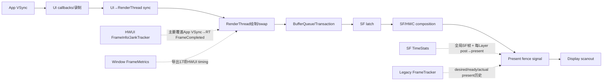
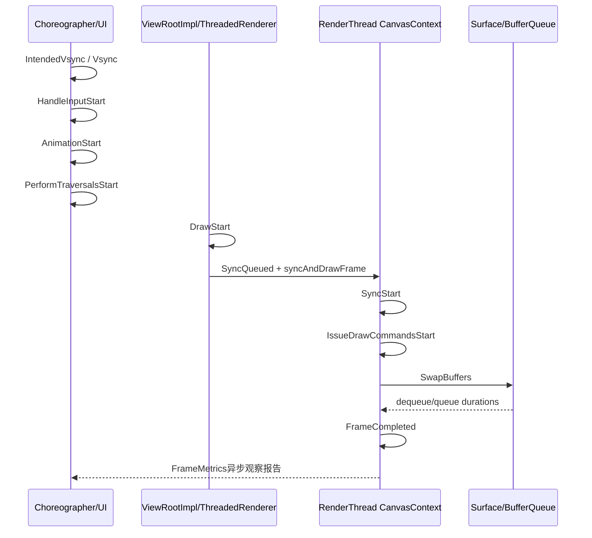
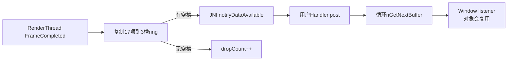
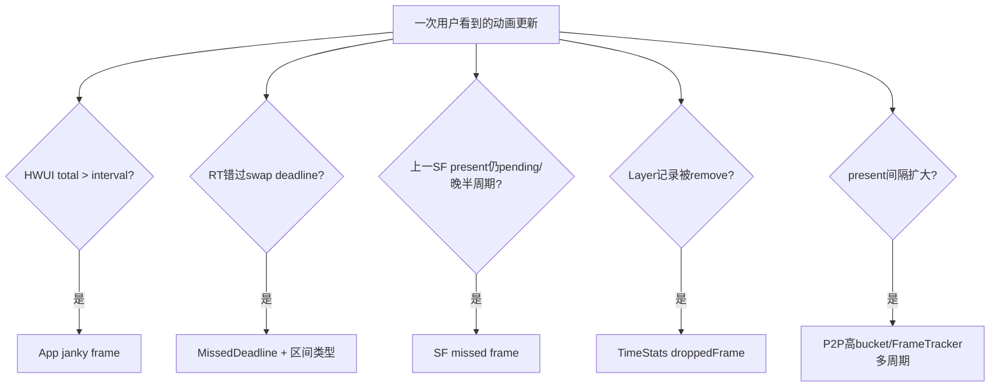

# 167 Android 11 帧性能统计：FrameInfo、JankTracker、TimeStats 与 FrameTracker

> 源码版本：Android 11 / API 30 / `android-11.0.0_r48`  
> 学习方式：macOS 只读源码，不要求编译、不要求连接设备  
> 前置章节：第 18、21、161、162、163、165、166 章

---

## 1. 先做版本纠偏：r48 还没有后续版本的完整 FrameTimeline

原计划把本章命名为“FrameTimeline、Jank 分类与 TimeStats”。真正搜索 Android 11 r48 后必须先修正：

```text
这份源码中没有后续Android版本那套完整的FrameTimeline token、
expected/actual timeline对象和统一JankType归因管线。
```

`rg "FrameTimeline|JankType"` 的结果表明：

- SF 中没有后来的 `FrameTimeline` 模块；
- App 与 SF 之间没有用 token 把同一逻辑帧贯穿起来；
- App 侧 HWUI 有自己的 `FrameInfo + JankTracker`；
- SF 有上一 present fence 驱动的 missed-frame 判定；
- SF `TimeStats` 按全局帧和 Layer frame number 聚合直方图；
- 另有较旧的 `FrameTracker` 保存 desired/ready/actual 三时间。

所以本章正确目标是：

> 把 Android 11 当时并行存在的几套帧统计拆开，说明它们分别观察哪一段、怎样判断“卡顿”，以及为什么不同工具的数字不能机械对齐。

后续若学习 Android 12+，再专门建立真正的 FrameTimeline 章节；不能把新版本类名和归因结论倒灌到 r48。

---

## 2. 本章要解决什么

1. App 一帧有哪些 `FrameInfo` 时间点？
2. `intendedVsync` 与 `vsync` 不同表示什么？
3. UI→RenderThread 等待为何在 JankTracker total duration 中被扣除？
4. `FrameCompleted` 是 GPU 完成、SF present 还是面板显示？
5. HWUI 如何判定 janky frame，又如何分成六类原因？
6. `Missed Vsync`、`Slow UI`、`Slow Sync`、`Slow RT` 的阈值是什么？
7. 三缓冲为什么可能被标成 high input latency？
8. `Window.OnFrameMetricsAvailableListener` 何时回调，为什么会丢报告？
9. SF 的 `PrevFrameMissed` 与 App jank 有何不同？
10. SF 为什么检查 N-1 或 N-2 present fence？
11. SF 的 `frameDuration`、`presentToPresent`、RenderEngine duration 各测哪段？
12. Layer TimeStats 如何关联 post/latch/acquire/desired/present？
13. `droppedFrames`、`lateAcquireFrames` 和 `badDesiredPresentFrames` 分别是什么？
14. TimeStats 何时启用，为什么第一次 statsd pull 通常没有数据？
15. `FrameTracker` 与 TimeStats、FrameMetrics 有何关系？
16. 为什么一个“jank”数字不能直接等于用户肉眼看到的一次卡顿？

---

## 3. 四套统计的观察范围



| 统计器 | 身份键 | 主要结束点 | 是否完整覆盖屏幕显示 |
|---|---|---|---|
| HWUI FrameInfo/JankTracker | RenderThread内部当前帧 | `FrameCompleted` | 否 |
| Window FrameMetrics | 复制17个FrameInfo字段 | `FrameCompleted` | 否 |
| SF missed frame | SF显示周期/上一present fence | 上一帧present状态 | 更接近显示，但不是逐像素scanout |
| SF TimeStats Layer | layerId + frameNumber | present fence/refresh timestamp | 接近Layer present |
| FrameTracker | 环形记录位置 | actual present fence/time | 接近Layer/动画present |

---

## 4. 源码地图

```text
frameworks/base/core/java/android/view/
├── Choreographer.java
├── ThreadedRenderer.java
├── FrameMetrics.java
├── FrameMetricsObserver.java
└── Window.java

frameworks/base/graphics/java/android/graphics/
└── HardwareRendererObserver.java

frameworks/base/libs/hwui/
├── FrameInfo.cpp / .h
├── JankTracker.cpp / .h
├── ProfileData.cpp / .h
├── FrameMetricsReporter.h
├── FrameMetricsObserver.h
├── renderthread/CanvasContext.cpp / .h
└── jni/android_graphics_HardwareRendererObserver.cpp / .h

frameworks/native/services/surfaceflinger/
├── SurfaceFlinger.cpp
├── BufferLayer.cpp
├── BufferQueueLayer.cpp
├── BufferStateLayer.cpp
├── FrameTracker.cpp / .h
└── TimeStats/
    ├── TimeStats.cpp / .h
    └── timestatsproto/
```

---

## 5. App 侧 FrameInfo 的 17 个槽位

```cpp
enum class FrameInfoIndex {
    Flags = 0,
    IntendedVsync,
    Vsync,
    OldestInputEvent,
    NewestInputEvent,
    HandleInputStart,
    AnimationStart,
    PerformTraversalsStart,
    DrawStart,
    SyncQueued,
    SyncStart,
    IssueDrawCommandsStart,
    SwapBuffers,
    FrameCompleted,
    DequeueBufferDuration,
    QueueBufferDuration,
    GpuCompleted,
    NumIndexes
};
```

前 9 个由 UI 线程填，后续主要由 RenderThread/CanvasContext 填。



它是一条应用渲染流水线记录，不包含 SF 对所有 Layer 的最终合成决策。

---

## 6. IntendedVsync 与 Vsync

Choreographer 收到回调后计算：

```text
intendedFrameTimeNanos = 原始VSync事件时间
frameTimeNanos         = 对迟到/跳帧修正后，本轮回调使用的帧时间
```

若主线程开始 `doFrame()` 时已经迟到超过一个周期：

```java
skippedFrames = jitter / frameInterval;
lastFrameOffset = jitter % frameInterval;
frameTimeNanos = startNanos - lastFrameOffset;
```

随后：

```java
mFrameInfo.setVsync(intendedFrameTimeNanos, frameTimeNanos);
```

因此：

> `IntendedVsync != Vsync` 表示应用没能按原始事件时间及时开始，本轮使用了修正后的 frame time；它不等于“显示硬件漏了一次 VSync”。

JankTracker 的 `kMissedVsync` 正是比较这两个字段。

---

## 7. UI 线程怎样写前半段

Choreographer 顺序写入：

```java
markInputHandlingStart();
doCallbacks(INPUT);

markAnimationsStart();
doCallbacks(ANIMATION);
doCallbacks(INSETS_ANIMATION);

markPerformTraversalsStart();
doCallbacks(TRAVERSAL);
doCallbacks(COMMIT);
```

`ThreadedRenderer.draw()` 在录制根 DisplayList 前：

```java
choreographer.mFrameInfo.markDrawStart();
```

然后 `syncAndDrawFrame()` 把 UI 线程数组传给 native DrawFrameTask/CanvasContext。

这些标记是阶段边界，不是 CPU profiler：阶段内可能包含锁等待、Binder 调用、GC、调度离开等各种耗时。

---

## 8. UI→RT stall 为什么被特殊处理

`FrameInfo::duration(start,end)`：

```cpp
gap = end - start;

if (end > SyncQueued && start < SyncQueued) {
    offset = SyncStart - SyncQueued;
    if (offset > 0) gap -= offset;
}
```

如果区间跨过 `SyncQueued`，会扣除 UI 请求同步后等待 RenderThread 真正开始的空档。

源码理由是：这段 stall 会被上一帧的流水线状态捕获，当前帧再算一次会重复归因。

所以 JankTracker 的 `totalDuration()` 不是简单：

```text
FrameCompleted - IntendedVsync
```

而是可能扣除 UI→RT 排队空档后的有效 duration。

Java `FrameMetrics.getMetric(TOTAL_DURATION)` 则直接对数组做结束减开始；它不会调用 C++ `FrameInfo::duration()`。这意味着 Java导出的 total 与 JankTracker内部用于判定的 duration 在存在 sync stall 时可能不完全一致。

---

## 9. FrameCompleted 到底完成了什么

CanvasContext 在 swap/queue 路径后：

```cpp
// TODO: Use a fence for real completion?
mCurrentFrameInfo->markFrameCompleted();

mJankTracker.finishFrame(*mCurrentFrameInfo);
mFrameMetricsReporter->reportFrameMetrics(...);
```

源码 TODO 已给出边界：

> `FrameCompleted` 是 RenderThread 完成本轮提交与记录的时间点，不是用 GPU fence 得到的真实 GPU 完成，更不是 SF present fence signal 或像素扫到屏幕。

`DequeueBufferDuration` 与 `QueueBufferDuration` 来自 ANativeWindow 最近一次操作时间，也只是 producer/queue 阶段信息。

GPU time 另行延迟处理：CanvasContext 看四帧前的 frame timestamp，读取该 buffer 的 `acquireTime`，把它写进名为 `GpuCompleted` 的槽位，再调用 `finishGpuDraw()`。这么做是利用“buffer 已被消费者 acquire”作为较晚可得的近似完成证据；`gpuDrawTime()` 的起点也只是 `SwapBuffers` 前的近似值。它既不是为本帧额外插入 GPU completion fence 得到的精确耗时，也不会进入当前这次 FrameMetrics 回调。

---

## 10. JankTracker 的总 jank 判定

先算经 stall 修正的 total duration；若 dequeue 阻塞符合 App/SF 流水线预期，还会给予有限 forgiveness。

然后：

```cpp
if (totalDuration > mFrameInterval) {
    reportJank();
}
```

注意是严格大于，不是大于等于。

下列帧不参与类型归因：

- `Surface.lockHardwareCanvas()` 的 SurfaceCanvas 帧；
- 被其他逻辑标成 exempt 的路径。

但“第一帧通常应忽略”只是 FrameMetrics 文档给分析者的建议，JankTracker 此处的 `EXEMPT_FRAMES_FLAGS` 并未包含 WindowLayoutChanged/FirstDraw。

---

## 11. swap deadline 与三缓冲

JankTracker 维护移动 `mSwapDeadline`：

```text
初次 = intendedVsync + frameInterval
以后 = max(旧deadline + interval,
           当前intendedVsync + interval)
```

若 deadline 比当前 intended VSync 多出超过 0.1 个周期，认为处于 triple buffered 状态。

若本帧：

```text
FrameCompleted < swapDeadline
或 totalDuration < frameInterval
```

则没有 missed-deadline 类型；但在 triple-buffered 状态会记录 HighInputLatency。

直觉：三缓冲可以让吞吐看起来仍连续，却让输入对应的画面排在更深的队列后，延迟升高。

---

## 12. 六种 App 侧 JankType

```cpp
enum JankType {
    kMissedVsync,
    kHighInputLatency,
    kSlowUI,
    kSlowSync,
    kSlowRT,
    kMissedDeadline,
};
```

只有错过 swap deadline 后，才进入四个区间 comparison：

| 类型 | 区间 | 阈值 |
|---|---|---:|
| MissedVsync | IntendedVsync → Vsync | 1 ns |
| SlowUI | Vsync → SyncStart，但会扣跨越的 SyncQueued→SyncStart stall | 0.5 × frame interval |
| SlowSync | SyncStart → IssueDrawCommandsStart | 0.2 × interval |
| SlowRT | IssueDrawCommandsStart → FrameCompleted | 0.75 × interval |

另有：

- MissedDeadline：`FrameCompleted` 未赶上移动 swap deadline；
- HighInputLatency：三缓冲状态下即使本轮满足提前返回条件也可记录。

comparison 区间必须：

```text
delta >= threshold
且 delta < 10秒
```

超过 10 秒被视为 ANR 范畴，不作为此处 jank cause。

一个帧可以同时命中多个类型；这些类别不是互斥枚举标签。

还要留意 `SlowUI` 的终点虽然写作 `SyncStart`，实现调用的却是 `FrameInfo::duration(Vsync, SyncStart)`。这个区间跨过 `SyncQueued` 时，同样会扣掉 `SyncQueued→SyncStart` 排队空档；不能只拿两个时间戳直接相减。

---

## 13. 名称有历史遗留，不要按字符串望文生义

ProfileData 文本/Proto映射中：

```text
kSlowSync → “Slow bitmap uploads” / slow_bitmap_upload_count
kSlowRT   → “Slow issue draw commands” / slow_draw_count
```

但 r48 当前 comparison 实际区间是：

```text
SlowSync = SyncStart → IssueDrawCommandsStart
SlowRT   = IssueDrawCommandsStart → FrameCompleted
```

名称来自历史实现演进，不能看到 `slow_bitmap_upload` 就断言一定有某张 Bitmap 上传慢；要回到实际时间区间和 trace 验证。

---

## 14. Davey 日志

若 total duration ≥ 700 ms，JankTracker 输出：

```text
Davey! duration=...; Flags=..., IntendedVsync=..., ...
```

并写 `DAVEY_OCCURRED` stats atom。

700 ms 是这里的“极慢帧日志”阈值，不是 ANR 阈值；10 秒以上反而不做 jank cause comparison，因为交给 ANR 体系。

---

## 15. FrameMetrics 如何从 17 个槽位生成公开指标

| Java metric | 计算区间 |
|---|---|
| UNKNOWN_DELAY | IntendedVsync → HandleInputStart |
| INPUT_HANDLING | HandleInputStart → AnimationStart |
| ANIMATION | AnimationStart → PerformTraversalsStart |
| LAYOUT_MEASURE | PerformTraversalsStart → DrawStart |
| DRAW | DrawStart → SyncQueued |
| SYNC | SyncStart → IssueDrawCommandsStart |
| COMMAND_ISSUE | IssueDrawCommandsStart → SwapBuffers |
| SWAP_BUFFERS | SwapBuffers → FrameCompleted |
| TOTAL | IntendedVsync → FrameCompleted |

另有：

- FIRST_DRAW_FRAME：Flags 的 WindowLayoutChanged bit；
- INTENDED_VSYNC_TIMESTAMP；
- VSYNC_TIMESTAMP。

API 仍然没有 present fence time、实际显示时间或 SF composition duration。

---

## 16. FrameMetrics 回调为什么会丢报告

CanvasContext 只在有 observer 时复制 frame data。native `HardwareRendererObserver` 使用固定三槽 ring buffer：

```cpp
static constexpr int kRingSize = 3;
```

若下一个 free slot 尚未被 Java 消费：

```cpp
mDroppedReports++;
```

不会阻塞 RenderThread。

Java收到 native通知后，把任务 post 到用户提供的 Handler，并循环 drain；每次回调带 `dropCountSinceLastInvocation`。



因此监听者应在回调内 `new FrameMetrics(frameMetrics)` 后把重活交给别的线程；否则自己的分析会制造丢报告，甚至干扰应用。

---

## 17. App jank 与 SF missed frame 不是同一判定

SF 在每次下一轮 INVALIDATE 开始时检查“上一帧”：

```cpp
framePending = previousFramePending(graceMs);

frameMissed = framePending ||
    (previousPresentTime >= 0 &&
     lastExpectedPresentTime <
         previousPresentTime - vsyncPeriod / 2);
```

两种 missed：

1. 上一目标 present fence 仍未 signal；
2. fence 已 signal，但实际时间比上一 expected present 晚超过半个周期的 slop。

这比 App `FrameCompleted > interval` 更靠后，观察的是 SF/HWC present 进度。

可能出现：

- App RT 很快，SF/HWC错过目标：SF missed、App不jank；
- App一帧很慢但没有新buffer参与当前SF帧：App jank、当前SF统计未必一一对应；
- App三缓冲吞吐稳定但延迟高：App标HighInputLatency，SF可能连续present；
- 其他Layer导致SF miss，与某个App的FrameMetrics无直接一一映射。

---

## 18. 为什么检查 N-1 或 N-2 present fence

SF 保存最近两个 present fence。`previousFrameFence()`：

```cpp
return sfOffset > 0
        ? mPreviousPresentFences[0]
        : mPreviousPresentFences[1];
```

注释解释：当 SF phase 在实际 VSync 前唤醒并瞄准下一 VSync 时，应检查 N-2，避免把尚未到目标时间的 fence 错判 pending。

这再次证明 phase offset 不只是“几点唤醒”，还影响“哪一笔历史 fence 才代表上一目标帧”。

backpressure 启用时，SF 可先等 1 ms grace，避免 fence 正要 signal 却被判 miss。

---

## 19. HWC miss 与 GPU miss

SF 根据上一帧 composition strategy 把同一个 `frameMissed` 投影成：

```cpp
hwcFrameMissed = mHadDeviceComposition && frameMissed;
gpuFrameMissed = mHadClientComposition && frameMissed;
```

这不是精准根因分类：

- 混合合成可同时 true；
- `mHad*Composition` 只说明上一帧使用过哪条路径；
- present晚不等于该引擎必然是根因；
- 仍需结合 RenderEngine fence、HWC validate/present 和 Layer acquire fence trace。

不要把 `PrevGpuFrameMissed` 当成“已证明GPU慢”。

---

## 20. SF 的 jank event 窗口

非 user build 中，第一次 miss 记录开始时间与计数。后续：

- 持续超过 100 ms才形成可上报 jank duration；
- 超过/等到 1 s 窗口则不按这条短 jank atom上报；
- 只在主显示 PowerMode::ON 时考虑；
- user build 不push这条 atom。

随后在 postComposition 写 `DISPLAY_JANK_REPORTED`。

复读代码可发现一个 r48 边界：计算到 duration >100 ms 时先把 `mMissedFrameJankCount` 清0，再把 duration延后到 postComposition；postComposition 传给 atom 的 count 因而可能已经是0。这个字段链存在先清后用的不一致，不能把 atom 中 count 当成完全可靠的连续miss数量。

---

## 21. TimeStats 的启用语义

TimeStats 初始 `mEnabled=false`。两种开启方式：

1. `dumpsys SurfaceFlinger --timestats -enable`；
2. statsd 第一次 pull global/layer atom 后调用 `enable()`。

statsd 回调顺序是：

```text
先尝试populate
若statsStart==0则PULL_SKIP
然后enable
```

所以一个 build 的第一次 full pull 预期为空或极少数据，源码注释明确说明这一点。

大多数 increment/set 方法在 disabled 时直接返回；但 `recordRefreshRate()` 没有 `mEnabled` 早返回，仍会写 refreshRateStats。这是 r48 实现不对称，不能概括成“禁用时绝对一项都不记录”。

---

## 22. TimeStats 全局指标

| 指标 | 来源/含义 |
|---|---|
| totalFrames | 每次 SF postComposition递增 |
| missedFrames | 下一次 INVALIDATE 对上一present判断miss |
| clientCompositionFrames | 本帧有新的GPU client composition |
| clientCompositionReusedFrames | 复用client target |
| refreshRateSwitches | active config period真正改变时递增 |
| compositionStrategyChanges | device composition有/无状态切换 |
| displayEventConnectionsCount | 统计期间观察到的最大连接数 |
| displayOnTime | 仅PowerMode::ON累计毫秒 |
| presentToPresent | 连续全局present fence signal时间差 |
| frameDuration | SF首个触发refresh的invalidate开始→CompositionEngine::present返回后 |
| renderEngineTiming | drawLayers开始→立即结束时间或ready fence signal |

`totalFrames` 是 SF 合成帧，不是“所有App新buffer总数”；复用旧内容、只有系统Layer更新等都可能产生SF帧。

---

## 23. frameDuration 不等于 presentToPresent

`recordFrameDuration()` 的 start：

```text
第一次导致该refresh的onMessageInvalidate frameStart
```

end：

```text
CompositionEngine::present(refreshArgs)返回之后
```

接口注释称 end 对应 SF 完成向 HWC 提交 present request。它没有等 present fence signal。

`presentToPresent` 则从连续全局 present fence 的实际 signal time求差。

```text
frameDuration    → SF CPU/提交路径多长
presentToPresent → 显示提交完成节拍间隔
```

前者小、后者大，可能是 HWC/显示侧等待；前者大则可能是 SF/CE/RenderEngine提交路径慢。仍不能单靠两张直方图完成根因证明。

---

## 24. Layer TimeRecord

```cpp
struct FrameTime {
    frameNumber;
    postTime;
    latchTime;
    acquireTime;
    desiredTime;
    presentTime;
};
```

建立记录时，以 postTime 初始化 latch/acquire/desired，随后真实信息到达再覆盖。这样无有效 acquire fence 的媒体帧仍有合理基线。

事件来源：

```text
post       BufferStateLayer::setBuffer / Layer frame event
latch      BufferQueueLayer或BufferStateLayer真正latch
acquire    acquire fence signal time
desired    BufferLayer onPostComposition读取active buffer期望
present    present fence signal，或HWC不支持fence时refresh timestamp
```

只有 matching `layerId + frameNumber` 且当前 `waitData` 指向该记录时，后续 setter 才更新。

---

## 25. 六种 Layer delta

```text
post2acquire
post2present
acquire2present
latch2present
desired2present
present2present
```

TimeStats 严格按 deque 头顺序 flush：头部 record 的 acquire/present fence pending，会阻挡后面已完成 record 被统计。

第一条完整 record 只成为 `prevTimeRecord`，不会增加 Layer totalFrames；从第二条起才可同时计算 present2present 并把当前帧计入统计。

因此 Layer totalFrames 更准确地说是“拥有前一条有效present作为间隔基线的已统计记录数”，不等于 setPostTime 调用数。

---

## 26. dropped、late acquire、bad desired present

### droppedFrames

当 SF 跳过/拒绝一个 buffer 并显式调用 `removeTimeRecord()` 时递增。例如 BufferQueue 丢弃中间项、BufferState尺寸/冻结模式不接受等。

它不是：

- App Choreographer skippedFrames总数；
- HWUI janky frames；
- SF global missedFrames；
- HWC重复显示旧帧的完整计数。

### lateAcquireFrames

Layer 有 ready frame，但 acquire fence 尚未 signal，SF因而本轮不latch时递增。droppable或允许latch-unsignaled的例外路径可能仍继续。

### badDesiredPresentFrames

BufferQueue timestamp 比 expected present 未来超过1秒，被判 implausible；SF为避免无限stall，忽略期望并尽快处理，同时记数。

这些 counter 暂存在 LayerRecord，直到下一条可统计记录 flush 时才合入按名称聚合的 Layer stats。

---

## 27. present fence 的顺序阻塞与容量保护

每 Layer 最多 64 个 pending TimeRecord；达到上限时，r48 直接从 tracker 删除整个 Layer 记录，而不是只丢最老一条。

全局 present fence 队列也最多64：若满，认为队首 fence卡在pending，弹出队首并把 `prevPresentTime=0`，切断一次P2P连续性。

RenderEngine duration队列满时则只 `pop_front()` 后加入新项。

所以容量溢出后的统计是降级恢复，不是完整保真。

---

## 28. Layer 名称与聚合边界

TimeStats 最多：

```text
200个正在跟踪的layerId
200个按layerName聚合的stats条目
```

`layerNameIsValid()` 还要求：

```cpp
name.length() >= strlen("PopupWindow")
&& name不以"PopupWindow"开头
```

因此不仅随机hash PopupWindow被排除，长度短于该前缀的普通名字也会被排除。这是实现条件，而不是注释只描述的“避免PopupWindow随机名”。

最终 stats 按 `layerName` 聚合，不按 package/token严格隔离；同名 Layer 的数据可汇总在一起。

---

## 29. TimeStats 直方图的精度

所有 delta 先由纳秒截断成整毫秒，再落入85个 bucket：

- 0–34 ms基本每1 ms；
- 中段步长逐渐放大；
- 150 ms后多为50 ms；
- 最大标称1000 ms。

负 delta 直接忽略。

超过1000 ms时不是简单“1000ms bucket加1”，而是：

```cpp
hist[1000] += delta / 1000;
```

也就是用多个1000ms单位近似总时长。这会让该bucket的“frame_count”不再严格等于超长事件条数；分析尾部必须知道这一实现。

---

## 30. statsd pull 与 clear 的边界

global atom pull成功后 `clearGlobalLocked()`；layer atom pull成功后 `clearLayersLocked()`。两者可在不同时间被拉取和清空，不构成共同事务快照。

文本/proto dump只读取，不自动clear；`-clear` 才清。

复读发现 `clearGlobalLocked()` 清 present fences，却没有清 `mGlobalRecord.renderEngineDurations`。因此 clear 后仍pending的旧 RenderEngine duration 有机会在后续 fence signal时进入新统计窗口。这是 r48 的窗口污染风险，不应把 clear 描述为所有全局暂存队列都彻底清空。

---

## 31. FrameTracker：更老但仍在用的三时间环

每个 BufferLayer 有 `FrameTracker`，另有 SF animation tracker。每条记录：

```text
desiredPresentTime
frameReadyTime/fence
actualPresentTime/fence
```

环形容量128。`advanceFrame()` 推进后，fence不一定已signal；`getStats()`/dump等路径会调用 `processFencesLocked()` 把已经signal的fence替换成时间。

FrameTracker 还按相邻 actual present 的间隔除以 display period，把帧间隔分到：

```text
[1,2)、[2,4)、[4,8)...个VSync周期
```

它提供 `FrameStats` 所需历史与EventLog分桶，但没有 App/SF token，也不做 HWUI 六类jank归因。

---

## 32. 三时间不是完整 FrameTimeline

FrameTracker 看起来已有：

```text
desired → ready → actual
```

但仍不能称为后续版本的 FrameTimeline：

- 没有跨App/SF传递唯一token；
- 没有一组expected timeline候选；
- 没有统一deadline与present type；
- 没有把App/SF/HWC jank原因归到同一帧对象；
- Layer与动画各自环形保存，关联靠本地顺序/frameNumber。

概念相似不等于实现相同。

---

## 33. 一帧可能产生哪些互不相同的“慢”结论



五个结论可能同时出现，也可能只出现一部分。没有 token 时尤其不能只靠相邻序号强行一一配对。

---

## 34. 性能定位的实用证据顺序

### 第一步：App是否已经慢

看：

- IntendedVsync→Vsync；
- UI、Sync、RT各段；
- FrameCompleted；
- dequeue/queue duration；
- JankTracker分类与FrameMetrics。

### 第二步：buffer是否及时可latch

看：

- post→acquire；
- lateAcquire；
- desired present是否合法；
- SF latch time；
- dropped record。

### 第三步：SF/HWC是否按目标present

看：

- expected present；
- previous fence pending；
- actual present与半周期slop；
- SF frameDuration；
- RenderEngine ready fence；
- global/layer P2P。

### 第四步：显示配置是否变化

结合第166章确认刷新率切换、period模型和统计窗口，否则用固定16.67ms解释高刷/切换期间数据会出错。

---

## 35. 常见误解逐条纠正

### 误解1：Android 11已有完整FrameTimeline

错。r48是多套局部统计并存，没有后续版本统一token管线。

### 误解2：FrameMetrics TOTAL到实际显示完成

错。终点是HWUI FrameCompleted，源码TODO明确没有用真实completion fence。

### 误解3：GpuCompleted已经在当前FrameMetrics回调里可靠可用

错。Java公开指标不导出GPU_DURATION，CanvasContext还要延后约四帧补GPU相关时间。

### 误解4：App janky frame等于SF missed frame

错。观察范围和阈值不同。

### 误解5：PrevGpuFrameMissed证明GPU是根因

错。它只是上一帧使用client composition且全局present miss。

### 误解6：TimeStats droppedFrames就是用户掉帧

错。它只统计SF显式remove的Layer time record。

### 误解7：TimeStats totalFrames是App提交的新buffer数

错。它是SF postComposition次数。

### 误解8：FrameMetrics监听不会影响统计

错。Handler消费慢会塞满3槽ring并产生dropCount。

### 误解9：`--timestats -clear`清掉所有pending全局数据

错。r48 clearGlobal没有清RenderEngine duration暂存队列。

### 误解10：first draw天然被JankTracker豁免

错。FrameMetrics文档建议分析者通常排除，但HWUI此处exempt flag只含SurfaceCanvas。

---

## 36. macOS 只读练习

### 练习1：确认版本边界

```bash
rg -n "FrameTimeline|JankType" \
  frameworks/native/services/surfaceflinger \
  frameworks/base/libs/hwui
```

分别列出“缺失的后续架构”和“r48实际存在的JankType”。

### 练习2：画17槽时间轴

```bash
sed -n '25,180p' frameworks/base/libs/hwui/FrameInfo.h
```

标出UI写入与RT写入边界，并解释sync stall扣除。

### 练习3：手算分类阈值

```bash
sed -n '25,190p' frameworks/base/libs/hwui/JankTracker.cpp
```

在60Hz和120Hz下分别算SlowUI/SlowSync/SlowRT阈值。

### 练习4：核对FrameCompleted边界

```bash
sed -n '530,600p' \
  frameworks/base/libs/hwui/renderthread/CanvasContext.cpp
```

找到“Use a fence for real completion?” TODO，并说明为什么TOTAL不是present latency。

### 练习5：追SF missed

```bash
sed -n '1775,1910p' \
  frameworks/native/services/surfaceflinger/SurfaceFlinger.cpp
```

解释N-1/N-2 fence、pending、half-period slop与1ms grace。

### 练习6：追Layer六个delta

```bash
sed -n '350,455p' \
  frameworks/native/services/surfaceflinger/TimeStats/TimeStats.cpp
```

回答为什么第一条record不计入Layer totalFrames。

---

## 37. 复读后补强：60Hz案例

假设周期约16.67ms：

```text
IntendedVsync     0ms
Vsync             3ms
SyncQueued       10ms
SyncStart        14ms
IssueDrawStart   17ms
FrameCompleted   24ms
```

JankTracker跨SyncQueued区间会扣除4ms stall：

```text
raw total = 24ms
修正 total ≈ 20ms > 16.67ms → janky
```

若又错过moving swap deadline：

- Intended→Vsync=3ms，命中MissedVsync；
- SlowUI原始跨度为Vsync→SyncStart=11ms，但`duration()`还会扣4ms stall，修正后为7ms，小于0.5T≈8.33ms，因此不命中SlowUI；
- SyncStart→Issue=3ms，小于0.2T≈3.33ms，不命中SlowSync；
- Issue→Complete=7ms，小于0.75T≈12.5ms，不命中SlowRT；
- 同时命中MissedDeadline。

Java FrameMetrics TOTAL仍会报告raw 24ms，因为它直接做数组时间差。

---

## 38. 复读后补强：为什么“流畅度百分比”没有唯一答案

假设统计窗口内：

```text
HWUI totalFrames = 1000, janky=50
SF totalFrames   = 1100, missed=20
Layer A records  = 600, dropped=5
FrameMetrics observer dropped reports=30
```

它们分母就不同：

- HWUI只数该RenderThread完成的应用帧；
- SF数系统合成帧；
- Layer A只数有相邻present基线且完成flush的记录；
- observer drop是统计报告没送到监听者，不是渲染帧一定没显示。

因此不能直接计算 `(50+20+5+30)/某个总数`。正确做法是先选问题：

```text
应用生产是否稳定？
SF显示目标是否miss？
某Layer端到端post→present是否异常？
统计采集本身是否丢样本？
```

---

## 39. 复读审计：r48中几个容易漏掉的实现缺口

1. `FrameCompleted` 在TODO处没有真实completion fence；名字比语义更“完成”。
2. Java TOTAL与C++ JankTracker total在sync stall时使用不同计算方式。
3. `kSlowSync`导出名仍是slow bitmap uploads，区间含义已更宽。
4. SF display-jank atom先清count后延迟写，count可能为0。
5. TimeStats first statsd pull才启用，第一次pull预期无数据。
6. `recordRefreshRate()`没有enabled门，与其他记录方法不一致。
7. Layer TimeStats按队头fence串行flush，头部pending可阻塞后项。
8. Layer记录满64会删除整个tracker条目。
9. `layerNameIsValid()`意外也过滤短名称。
10. 超1000ms histogram用`delta/1000`增加bucket count，尾桶count不是严格事件数。
11. global/layer statsd pull分别clear，不是同一快照事务。
12. clearGlobal不清RenderEngine durations，存在跨窗口污染风险。

---

## 40. 本章核心结论

1. Android 11 r48没有Android 12+完整FrameTimeline token/JankType管线。
2. HWUI FrameInfo以17个槽位描述UI到RenderThread的局部帧流水线。
3. IntendedVsync是原始目标，Vsync是迟到修正后本轮实际使用的frame time。
4. JankTracker total会扣除跨UI→RT的sync stall，并可有限宽恕预期dequeue阻塞。
5. HWUI total超过一个frame interval即计janky，但原因分类还受moving swap deadline控制。
6. 六类原因可重叠，命名存在历史遗留，必须看实际区间。
7. FrameCompleted只代表RT提交路径结束，不等GPU完成、SF present或scanout。
8. Window FrameMetrics导出同一组HWUI时间，并通过三槽ring异步送达；监听慢会丢报告。
9. SF missed frame根据上一目标present fence pending或比expected晚半周期判断，与App jank不同。
10. SF offset决定检查最新还是倒数第二个present fence。
11. PrevGpu/HwcFrameMissed只是composition-path投影，不是根因证明。
12. TimeStats global frameDuration测SF提交路径，presentToPresent测fence间隔，两者终点不同。
13. Layer TimeStats用layerId+frameNumber关联post/latch/acquire/desired/present，并形成六类delta。
14. droppedFrames只是SF显式删除记录，不能等同所有用户可见掉帧。
15. TimeStats大多默认禁用，第一次statsd pull后才开始采集。
16. TimeStats有容量、顺序阻塞、名称过滤、分开clear和尾桶近似等统计损失边界。
17. FrameTracker是desired/ready/actual三时间的旧环形统计，不是完整FrameTimeline。
18. 诊断必须先确认统计器、观察范围、分母和完成点，再比较数字。

---

## 41. 自测题

1. 为什么本章没有直接讲后续Android的FrameTimeline token？
2. FrameInfo哪9个槽位来自UI线程？
3. IntendedVsync和Vsync为何可能不同？
4. C++ FrameInfo duration为什么扣SyncQueued→SyncStart？
5. Java FrameMetrics TOTAL与JankTracker total有何差异？
6. FrameCompleted能证明哪些完成，不能证明哪些？
7. HWUI何时计一帧janky？
8. MissedDeadline与MissedVsync为何不是同一概念？
9. HighInputLatency和三缓冲有什么关系？
10. SlowUI/SlowSync/SlowRT在60Hz下阈值各是多少？
11. FrameMetrics为什么只有3槽ring？慢listener会怎样？
12. SF frameMissed的两个条件是什么？
13. SF为什么有时检查N-2 present fence？
14. PrevGpuFrameMissed为何不是GPU根因证明？
15. SF frameDuration与presentToPresent分别测什么？
16. Layer TimeRecord的六个时间字段从哪里来？
17. 第一条完整Layer record为什么不增加totalFrames？
18. dropped、lateAcquire、badDesiredPresent分别代表什么？
19. TimeStats什么时候开始enable？
20. FrameTracker为什么不能叫完整FrameTimeline？

---

## 42. 下一章预告

第 168 章继续学习：

> SurfaceFlinger tracing、Perfetto 图形数据源与 FrameTracer。

将回答：

- Surface tracing 如何记录 Layer/current/drawing/composition 状态；
- ATRACE 与 Perfetto data source 有什么区别；
- FrameTracer 如何用 bufferId、frameNumber和fence建立事件轨迹；
- QUEUE、ACQUIRE_FENCE、LATCH、FALLBACK_COMPOSITION、PRESENT_FENCE分别表示什么；
- trace 中怎样把 App、BufferQueue、SF、RenderEngine 与 HWC证据拼起来；
- tracing开关、缓冲区和采样本身有哪些性能与丢数据边界。
