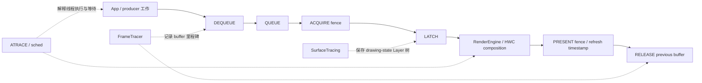
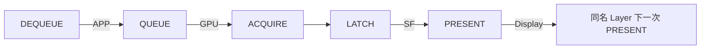

# 168 Android SurfaceFlinger Tracing、Perfetto FrameTracer 与图形证据链

> 源码版本：Android 11 / API 30 / `android-11.0.0_r48`  
> 学习方式：macOS 静态阅读；不编译，不连接设备  
> 前置章节：第 99、161—167 章

---

## 1. 看到“画面卡住”时，三个 trace 各能证明什么

一个窗口明明持续提交 buffer，屏幕内容却没有按预期变化。Perfetto 中可能同时出现：

```text
SurfaceFlinger 的 ATRACE slice
layers_trace.pb 的 Layer 树快照
android.surfaceflinger.frame 的 buffer 事件
```

它们都叫 trace，却观察三个不同问题：

| 机制 | 主要记录 | 最适合回答 | 单独不能证明 |
|---|---|---|---|
| ATRACE/ftrace | 线程上的函数区间、counter、调度事件 | SF 当时在运行、等待还是被抢占 | 哪块 buffer 已显示 |
| SurfaceTracing | 一次完整的 SF drawing-state 快照 | Layer 层级、几何、可见区、输入与合成状态 | 快照中的 active buffer 已 present |
| FrameTracer | 某块 GraphicBuffer 的离散生命周期事件 | dequeue、queue、acquire、latch、present 在何时发生 | 所有 Layer 路径都被覆盖 |

一句话核心结论：

> r48 没有一份 trace 能独自还原“App 开始画到像素扫描完”的全过程。FrameTracer 给里程碑，ATRACE 解释里程碑之间线程在做什么，SurfaceTracing 说明 SF 当时拿什么状态做合成；结论必须由多份证据交叉约束。

本章读完，应能回答：

```text
有 QUEUE 为什么仍不能说已经上屏？
Layer trace 为什么不是每个 VSync 一张截图？
缺 PRESENT 是硬件故障，还是采集机制漏证据？
一个漂亮的 APP/GPU/SF/Display phase 到底是谁重建的？
```

---

## 2. 先建立完成点：状态、事件和执行时间不能混读



最常混淆的完成点如下：

| 证据 | 到达了什么边界 | 还没保证什么 |
|---|---|---|
| QUEUE | SF 的 BufferQueue 回调观察到提交 | producer 已写完、SF 已接纳 |
| ACQUIRE_FENCE | consumer 可安全读取 buffer | buffer 已成为 active、已合成 |
| LATCH | SF 接纳该 buffer 进入本轮状态 | HWC 提交或 present fence 已完成 |
| Layer trace 的 active_buffer | 采样时 drawing state 指向该 buffer | 显示设备已经 present |
| PRESENT_FENCE | present fence signal；某些路径是 refresh timestamp 替代 | 逐像素 scanout 回读 |
| RELEASE_FENCE | 前一块 buffer 可安全复用 | 当前 buffer 恰在此刻上屏 |

ATRACE 又是另一种维度。一个 20 ms 的函数 slice 只表示 begin/end 相隔 20 ms；其中可能包含 CPU 执行、锁等待、fence 等待、Binder 阻塞或线程被调度出去。必须结合 thread state 才能解释。

---

## 3. 源码地图与 r48 版本边界

SurfaceTracing：

```text
frameworks/native/services/surfaceflinger/
├── SurfaceTracing.h
├── SurfaceTracing.cpp
├── SurfaceFlinger.cpp
├── Layer.cpp
├── LayerProtoHelper.cpp
└── layerproto/
    ├── layerstrace.proto
    └── layers.proto
```

FrameTracer 与事件生产者：

```text
frameworks/native/services/surfaceflinger/
├── FrameTracer/FrameTracer.h
├── FrameTracer/FrameTracer.cpp
├── BufferQueueLayer.cpp
├── BufferLayer.cpp
└── BufferStateLayer.cpp
```

Perfetto 协议与解析器：

```text
external/perfetto/
├── protos/perfetto/trace/android/graphics_frame_event.proto
└── src/trace_processor/importers/proto/
    ├── graphics_frame_event_parser.h
    └── graphics_frame_event_parser.cc
```

注意最后一个扩展名是 `.cc`。旧资料常写成 `.cpp`，在 r48 上会直接找不到文件。

本章讨论的是 Android 11 的原生 FrameTracer。它不是后续 Android 的统一 FrameTimeline，也没有 token 把 App、SF、HWC 的 expected/actual timeline 串成一个对象。这里的 parser 只是依据有限事件重建 phase。

---

## 4. SurfaceTracing 何时真的保存一份 Layer 树

### 4.1 enable 先清 ring，再启动专用线程

`SurfaceTracing::enable()` 在 `mTraceLock` 下执行：

```cpp
mBuffer.reset(mBufferSize);
mEnabled = true;
mThread = std::thread(&SurfaceTracing::mainLoop, this);
```

worker 首先在 `mTracingLock` 下生成：

```cpp
traceLayersLocked("tracing.enable");
```

因此每次成功 enable，worker 都会先尝试生成初始快照；若单条 Proto 已超过 ring 总容量，它仍可能无法保存。随后才进入等待通知的循环。

### 4.2 业务通知不是固定 VSync 采样

r48 中 SF 的常规 `mTracing.notify*()` 生产点都围绕 `mVisibleRegionsDirty`：

```cpp
if (mVisibleRegionsDirty && !mAddCompositionStateToTrace) {
    mTracing.notifyLocked("visibleRegionsDirty");
}
```

若开启 `TRACE_COMPOSITION`，通知移到本轮 `present()`、`postFrame()`、`postComposition()` 之后：

```cpp
if (mVisibleRegionsDirty && mTracingEnabled &&
    mAddCompositionStateToTrace) {
    mTracing.notify("visibleRegionsDirty");
}
```

所以它是“重要 Layer/可见区域状态变化驱动的快照”，不是 60 Hz 或 120 Hz 定时录像。连续显示同一状态，即使发生许多 refresh，也不要求每次都有 trace entry。

### 4.3 COMPOSITION 不只增加字段，也改变采样位置

不开 `TRACE_COMPOSITION` 时，通知发生在 transaction/invalidate 处理区间内；开启后，为了取得本轮合成结果，通知被推到 post-composition 一侧。

因此比较两次不同 flags 的 trace 时，要同时考虑：

```text
字段集合变了
采样在 SF 流水线中的位置也变了
```

此外，`mTracingEnabled` 是 SF 主循环根据 `mTracingEnabledChanged` 刷新的本地状态。控制事务返回与主循环真正开始采用 tracing 分支之间仍有一次异步收敛边界。

---

## 5. 快照是 drawing state，不是硬件显示回读

核心入口是：

```cpp
LayersProto layers(
    mFlinger.dumpDrawingStateProto(mTraceFlags));
```

`dumpDrawingStateProto()` 遍历：

```cpp
for (const sp<Layer>& layer :
     mDrawingState.layersSortedByZ) {
    layer->writeToProto(...);
}
```

这里的关键词是 `DrawingState`。它表示 SF 当前用于绘制/合成的稳定状态，不等于：

- 客户端刚写进 current state、尚未提交完成的请求；
- HWC 对真实硬件状态的回读；
- present fence 已 signal；
- 面板已经逐行扫描完成。

### 5.1 文件外层是一串完整快照

`layerstrace.proto` 定义：

```proto
message LayersTraceFileProto {
  optional fixed64 magic_number = 1;
  repeated LayersTraceProto entry = 2;
}
```

每条 entry 包含时间、`where`、整棵 `LayersProto`、可选 HWC blob、composition 排除标志与 `missed_entries`。文件 magic 组合为 `.LYRTRACE`。

一条 entry 不是一层，也不是一块 buffer 的事件，而是某一采样时刻的 Layer 集合。Layer 越多、flags 越重，单条体积越大，固定 ring 能覆盖的时间就越短。

### 5.2 五组 flags

```cpp
TRACE_CRITICAL    = 1 << 0;
TRACE_INPUT       = 1 << 1;
TRACE_COMPOSITION = 1 << 2;
TRACE_EXTRA       = 1 << 3;
TRACE_HWC         = 1 << 4;
```

默认只开：

```cpp
TRACE_CRITICAL | TRACE_INPUT
```

| flag | 主要增加的信息 |
|---|---|
| CRITICAL | id/name/type、parent、Z、buffer、frame、crop、transform、颜色、damage 等 |
| INPUT | InputWindowInfo、touchable region/crop 等 |
| COMPOSITION | visible region、默认显示的 HWC composition type 等 |
| EXTRA | metadata，并把 offscreen Layer 纳入 |
| HWC | 每条 entry 追加一次 HWC 文本 dump |

未开 COMPOSITION 时，entry 明确写 `excludes_composition_state=true`。

`TRACE_HWC` 尤其昂贵：`dumpHwc()` 的整段文本被塞进每条快照，而非紧凑的结构化 per-layer event。

### 5.3 offscreen root 只是序列化表示

开启 EXTRA 后，SF 额外创建：

```text
name   = Offscreen Root
id     = INT32_MAX - 2
parent = -1
```

再把 `mOffscreenLayers` 写成其 children。这个 root 不是真实 Layer、SurfaceControl 或可合成内容；它只是让脱离正常 drawing tree 的存活对象能出现在 Proto 中。

---

## 6. worker、通知合并与 tracing 自身的扰动

### 6.1 missed_entries 的精确含义

`notifyLocked()` 是：

```cpp
mWhere = where;
if (mTracingInProgress) {
    mMissedTraceEntries++;
}
mTracingInProgress = true;
mCanStartTrace.notify_one();
```

第一次通知把 `mTracingInProgress` 置 true。若 worker 尚未取得 `mTracingLock`，更多通知可先取得锁：

```text
更新为最后一个 where
增加 missed_entries
继续把多次 wake 合并为一个待处理状态
```

worker 一旦取得同一把锁，会在锁内完成整棵树序列化，然后把 `mTracingInProgress` 和 `mMissedTraceEntries` 清零。此时其他 notifier 只能等待锁；等 worker 解锁后，它们会建立下一次请求。

因此 `missed_entries` 更准确的含义是：

> 第一份通知已挂起、worker 尚未赢得锁期间，被合并掉的额外 notify 次数。

它不是所有“worker 忙碌期间”的调用数，更不是 BufferQueue drop 或 SF missed frame 数。

### 6.2 condition_variable 没有 predicate

worker 使用：

```cpp
mCanStartTrace.wait(lock);
```

而不是 `wait(lock, predicate)`。由 C++ 条件变量语义可知：

- spurious wakeup 可能额外产生一份快照；
- notify 不会持久排队；
- worker 在第一次 entry 后、真正进入 wait 前若收到唯一 wake，可能丢失唤醒。

最后一种情况若恰逢 disable，控制线程随后 `join()`，源码上存在长时间等待风险。这里描述的是实现的同步边界，不代表每次停止都会复现。

### 6.3 专用线程仍会阻塞 SF 主路径

worker 生成快照时持有 `mTracingLock`。tracing 开启后，SF 主线程也用同一把锁包住：

```cpp
handleMessageTransaction();
handleMessageInvalidate();
```

这防止 worker 读到更新一半的 Layer 树，代价是：

```text
worker 序列化 Layer / 做 HWC dump
              ⇅ mTracingLock
SF 主线程处理 transaction / invalidate
```

大 Layer 树、EXTRA、COMPOSITION 或 HWC dump 都会扩大观测开销。trace 中看到 SF 等锁时，必须排除 tracing 自身造成的扰动。

---

## 7. 5 MiB ring、落盘完成点与两个实现缺口

### 7.1 ring 按序列化字节淘汰

默认容量：

```cpp
kDefaultBufferCapInByte = 5_MB;
```

每次 emplace 前执行：

```cpp
while (used + protoSize > capacity) {
    if (storage.empty()) return;
    popOldest();
}
pushNewest();
```

它保留最近的一段 history，不保证固定 entry 数。

若单条 Proto 本身大于总容量，旧 entry 会先被清空，随后函数因 queue 为空直接返回；新 entry 也不会保存，`missed_entries` 不会为这个容量丢失单独计数。

### 7.2 动态缩容不会立即修剪

`setBufferSize()` 只更新目标容量和 ring 的 size：

```cpp
mBufferSize = bufferSizeInByte;
mBuffer.setSize(bufferSizeInByte);
```

当前 `used` 可以暂时大于新容量。下一次 emplace 才进入 while 并淘汰；若在此之前直接 flush，旧数据仍会进入文件。

backdoor 1029 的参数注释为 KB：

```cpp
if (n <= 0 || n > MAX_TRACING_MEMORY) ...
mTracing.setBufferSize(n * 1024);
```

但 `MAX_TRACING_MEMORY` 定义为 `100 * 1024 * 1024`，注释是 100 MB。也就是用 KB 参数直接和 byte 风格常量比较，再把通过的 `int n` 乘 1024。r48 的上限校验单位错误，大值还带来有符号乘法溢出风险；不能把校验值机械解释成安全可用的 100 GiB。

### 7.3 disable、join 和文件完成点

正常停止路径：

```text
disable:
  mEnabled=false
  mWriteToFile=true
  notify_all

writeToFile:
  move worker thread
  join
  return mLastErr
```

worker 被唤醒后会再取一份收尾快照，把 ring move 到 `LayersTraceFileProto`，序列化并写：

```text
/data/misc/wmtrace/layers_trace.pb
```

`join()` 返回说明这条 worker 文件操作已经结束；它不证明每次 notify 都有 entry，也不证明文件可解析。

bugreport 的 proto dump 还有 `writeToFileAsync()`：它设置写请求并唤醒 worker，但不禁用 tracing。ring flush/reset 后继续采集。

### 7.4 写失败最终仍返回 NO_ERROR

`writeProtoFileLocked()` 先在失败时设置：

```cpp
mLastErr = PERMISSION_DENIED;
```

但函数末尾无条件执行：

```cpp
mLastErr = NO_ERROR;
```

而且 ring 在写磁盘前已经 flush 并 reset。于是序列化或文件写入失败时：

- 内存中的本批 entry 已被消费；
- logcat 会记录错误；
- 1025 disable 的 reply 仍可能报告成功。

正确验收要同时看文件存在性、mtime、大小、magic、Proto 解析和 SurfaceFlinger 日志，不能只看返回码。

---

## 8. 控制入口、WMS WindowTracing 与 ATRACE 是三条独立链

### 8.1 Layer tracing 的 backdoor 与权限

SurfaceFlinger 保留：

```text
1025  enable / disable；disable 后 join 并写文件
1026  查询 enabled
1029  设置 buffer size，参数注释为 KB
1033  设置 trace flags
```

`CheckTransactCodeCredentials()` 先允许 1000—1036 继续进入 backdoor 分支；`onTransact()` 随后仍要求 calling UID 是 `AID_SYSTEM`，或具有 `android.permission.HARDWARE_TEST`。

WMS 的 `isLayerTracing()`、`setLayerTracing()`、`setLayerTracingFlags()` 又先要求 Recents 身份或 `DUMP` 权限，然后清除 Binder identity，以 system_server 身份调用 SF。这是两层权限与身份变化。

### 8.2 wm_trace.pb 不是 layers_trace.pb

`adb shell wm tracing` 控制的是：

```text
frameworks/base/services/core/java/com/android/server/wm/WindowTracing.java
/data/misc/wmtrace/wm_trace.pb
```

SurfaceTracing 写：

```text
/data/misc/wmtrace/layers_trace.pb
```

r48 的 `WindowTracing.startTrace()` 启动 WMS state trace 与 ProtoLog，没有调用 `setLayerTracing(true)`；Java 树中三个 Layer tracing 方法也没有生产调用者。

所以打开 WMS tracing 不能证明 SF Layer tracing 已启用。工具可以最终把两份文件放在同一时间轴展示，但生产与落盘仍是两条链。

### 8.3 ATRACE category 也不等于 FrameTracer data source

SF 广泛使用：

```cpp
#define ATRACE_TAG ATRACE_TAG_GRAPHICS
ATRACE_CALL();
ATRACE_NAME("...");
ATRACE_INT("...", value);
```

这些进入 atrace/ftrace 时间轴。FrameTracer 则是独立的 Perfetto SDK data source。开启 graphics atrace category 不会自动启用 `android.surfaceflinger.frame`；只启用 FrameTracer data source 也不保证采到 sched、Binder 或全部 ATRACE slice。

---

## 9. FrameTracer 怎样注册，以及两种身份为何都会丢信息

### 9.1 data source 只在活动 session 中执行 lambda

SF 初始化时调用：

```cpp
mFrameTracer->initialize();
```

它初始化 Perfetto system backend，并注册：

```text
android.surfaceflinger.frame
```

`OnSetup/OnStart/OnStop` 在 r48 都为空。真正的 gating 来自：

```cpp
FrameTracerDataSource::Trace(lambda)
```

没有 session 启用该 data source 时，lambda 不执行；不只是 packet 不落盘，`traceNewLayer()` 内的 tracker 登记也不会发生。

### 9.2 bufferId 与 frameNumber 解决不同问题

```text
bufferId    = 一块 GraphicBuffer 对象
frameNumber = 该 BufferQueue 的一次提交代际
```

同一 buffer 会循环复用：

```text
buffer 42 → frame 100
buffer 57 → frame 101
buffer 42 → frame 102
```

DEQUEUE 时 frameNumber 尚未知，所以只带 bufferId；QUEUE 到来后 parser 才能把 frameNumber 回填到前面的 APP slice。

### 9.3 64 位 ID 被协议截成 32 位

FrameTracer 接口接收 `uint64_t bufferID`，写 packet 时却做：

```cpp
event->set_buffer_id(
    static_cast<uint32_t>(bufferID));
```

Proto 字段本身也是 `uint32`。高 32 位永久丢失，因此 trace 中的 buffer_id 不是完整系统级唯一 ID；碰撞会影响后续所有按 buffer_id 建图的 parser map。

### 9.4 tracker 的建立也有边界

`traceNewLayer()` 只在 DEQUEUE/DETACH 回调被调用，并且只在 active data source 中真正执行。session 若从一个已经 queue 的 Layer 中途开始，QUEUE/LATCH 可能先到，却因为找不到 layerId tracker 被忽略。

`OnStop()` 不清 tracker。已登记且未销毁的 Layer 可跨 session 保留；停用期间新出现的 Layer 却不会被登记。

r48 还有一个并发缺口：

```cpp
if (mTraceTracker.find(layerId) == end) { // 锁外读
    lock_guard lock(mTraceMutex);
    mTraceTracker[layerId].layerName = layerName;
}
```

`onDestroy()` 会持锁 erase，同一 unordered_map 的锁外读与并发写构成 data race 风险。这是本版本实现问题，不应泛化到后来版本。

---

## 10. 一块传统 BufferQueue buffer 的事件从哪里产生

### 10.1 producer/consumer 回调

`BufferQueueLayer` 产生：

```text
onFrameDequeued  → traceNewLayer + DEQUEUE
onFrameDetached  → traceNewLayer + DETACH
onFrameCancelled → CANCEL
onFrameAvailable → QUEUE + ACQUIRE_FENCE
```

QUEUE 的 timestamp 是 SF consumer callback 执行时的 `systemTime()`，不是 producer 调用 `queueBuffer()` 指令的原地时间；中间可能包含 Binder、回调和调度延迟。

ACQUIRE_FENCE signal 表示 producer 对 buffer 的写入完成到 consumer 可以安全读，不等于 SF 已 latch。

### 10.2 LATCH 与合成路径

`BufferQueueLayer::latchBuffer()` 成功更新 active buffer 后写：

```cpp
traceTimestamp(..., latchTime,
               FrameEvent::LATCH);
```

`BufferLayer::onPostComposition()` 若 OutputLayer 要求 client composition，则写：

```cpp
FALLBACK_COMPOSITION
```

它表示该 Layer 使用 RenderEngine client composition，而非纯 DEVICE overlay。“fallback”是路径标签，不自动表示失败或性能回退。

Proto 虽定义 `HWC_COMPOSITION_QUEUED`，r48 的 SF 生产代码没有对应调用。`POST`、`MODIFY`、`ATTACH` 同样只存在于枚举或测试，而没有本章范围内的生产点。

### 10.3 PRESENT 与 RELEASE

有效 present fence 走：

```cpp
traceFence(..., presentFence,
           PRESENT_FENCE);
```

HWC 不提供有效 present fence、显示仍连接时，SF 改用：

```cpp
getRefreshTimestamp(displayId)
traceTimestamp(..., PRESENT_FENCE)
```

所以 `PRESENT_FENCE` 事件名不保证底层一定有真实 fence fd。

`BufferQueueLayer::onLayerDisplayed()` 的 RELEASE_FENCE 则关联：

```text
mPreviousBufferId
mPreviousFrameNumber
```

它保护旧 buffer 可安全回给 producer 复用，不是当前 buffer 的 present 通知。

### 10.4 r48 不完整覆盖 BufferStateLayer

对 SF 目录检索生产调用，DEQUEUE、QUEUE、ACQUIRE、LATCH 都只落在 `BufferQueueLayer.cpp`。`BufferStateLayer.cpp` 没有 `traceNewLayer()` 或这些生命周期事件。

BufferStateLayer 虽继承公共 `BufferLayer::onPostComposition()`，其中的 FALLBACK/PRESENT 调用仍会先过：

```cpp
if (mTraceTracker.find(layerId) == end) {
    return;
}
```

没有 tracker 时事件照样被过滤。因而 r48 对传统 BufferQueueLayer 可见性更完整，不能假设 SurfaceControl/BLAST 的 BufferStateLayer 路径也有同样轨迹。

---

## 11. pending fence 不是 waiter：它只在以后“路过”时收账

### 11.1 三种初始结果

`traceFence()` 读取 `FenceTime::getSignalTime()`：

```text
INVALID   → 忽略
已 signal → 立即按 signalTime 写 packet
PENDING   → 保存到 [layerId][bufferId] 的 vector
```

FrameTracer 没有专用 fence waiter、epoll loop 或 60 秒 timer。

下一次对相同 `layerId + bufferId` 调用 `traceTimestamp()` 或 `traceFence()` 时，才先扫描 pending vector。

### 11.2 “60 秒 deadline”检查的是 signalTime 新旧

pending 再次被检查时：

```cpp
if (signal valid &&
    systemTime() - signalTime < 60s) {
    emit();
}
erase();
```

于是：

- fence 仍 pending：继续保留；
- 变 INVALID：删除但不发事件；
- 已 signal 且 signalTime 距现在不足 60 秒：补写；
- 已 signal 但更老：删除且不补写。

这不是“注册 60 秒后自动超时”。没有同 buffer 后续调用时，已 signal fence 也可能一直留在 tracker；Layer 销毁才整体 erase。

### 11.3 session 结束不会 flush pending

DataSource `OnStop()` 为空。session 结束时 pending present/release fence 不会被主动查询或等待。

tracker 本身又跨 session 存活，所以后续 session 中若同 buffer 再出现：

- signalTime 仍在 60 秒内，旧事件可能被写进新 session；
- 已过 60 秒则被静默丢弃；
- 仍 pending 则继续等待下一次“路过”。

因此 trace 缺 PRESENT 至少可能表示：

```text
真的没产生或没 signal
session 结束太早
signal 后没有相同 buffer 的后续 trace 调用
Layer/path 没登记
pending 在后来 session 才补写或已被 deadline 丢弃
```

### 11.4 生产调用几乎都写 instant event

`traceSpanLocked()` 只有在：

```text
startTime > 0 && startTime < endTime
```

时才写 duration；否则 timestamp 直接取 fence signalTime，duration 为 0。

r48 的 SurfaceFlinger 生产调用没有给 `traceFence()` 传非零 startTime，所以 acquire、present、release 通常都是 instant event。UI 中的长 APP/GPU/SF phase 是 parser 根据多个 instant 事件另行拼出的。

---

## 12. Perfetto parser 怎样重建四段，以及哪里会串账

### 12.1 四个 phase 是解析器定义

`graphics_frame_event_parser.cc` 注释直接定义：

```text
APP     : DEQUEUE → QUEUE
GPU     : QUEUE → ACQUIRE_FENCE
SF      : LATCH → PRESENT_FENCE
Display : 本 Layer PRESENT → 同名 Layer 下一次 PRESENT
```



“GPU”是轨道名称，不证明 Queue→Acquire 全部由 GPU 持续执行。CPU producer、同步等待、驱动排队或调度都可能落在这段。

Display phase 也不是面板工作耗时。静态 Layer 很久没有下一次 present 时，它会一直覆盖这段保持时间；最后一帧在 trace 结束时还可能没有闭合边界。

### 12.2 DEQUEUE 的 frameNumber 在 QUEUE 时回填

DEQUEUE 无 frame number，parser 先按 buffer_id 保存 slice id。QUEUE 到来时结束 APP slice，再把 QUEUE 的 frameNumber 写回旧 slice。

LATCH 到来而 QUEUE 缺失时，parser 会在 LATCH 处强制关闭仍打开的 APP slice，并附加 `Missing queue event` 说明。这个终点是容错推断，不能把整个 Dequeue→Latch 当成 App 绘制。

### 12.3 内部关联键比界面看上去更弱

DEQUEUE、QUEUE、ACQUIRE、LATCH 的 phase map 主要只按 32 位 `buffer_id`；不是 `layerId + bufferId + frameNumber` 联合键。

Display map 按完整 `layer_name_id`，但显示 track 名只取 Layer 名的前 10 个字符：

```cpp
track_name.AppendString(
    layerName.substr(0, 10));
```

GpuTrack 又按 track name/scope/context intern。不同 Layer 若前 10 个字符相同，可能取得同一 Display track；完全同名 Layer 还共享 display_map key。改名则切断原来的 present 连续性。

所以以下情况都会让 phase 串轨、缺段或被重建得含糊：

- 64→32 位 buffer ID 截断碰撞；
- 同一 buffer 重复使用而部分事件缺失；
- trace 从生命周期中间开始；
- 同名 Layer 或相同 10 字符前缀；
- Queue/Latch/Present 任一事件未采到。

### 12.4 raw 统计也会沿用旧值

parser 另有一张 `buffer_id → event type → timestamp` map。遇到 PRESENT 时计算：

```text
queue_to_acquire = max(acquire - queue, 0)
acquire_to_latch = latch - acquire
latch_to_present = present - latch
```

缺失的 map 项通过 `operator[]` 变成 0；已复用 buffer 的旧类型时间又不会在 PRESENT 后整体清空。只有第一项钳到非负，后两项可出现负值或混入上一代时间。

漂亮的 duration 列也不是硬件原子提供的真相，仍要回看原始事件是否同代、齐全。

---

## 13. 怎样把三种 trace 与第 167 章统计组成证据链

### 13.1 先确认观测有没有资格下结论

每次分析先回答：

```text
FrameTracer data source 是否真的启用？
目标是 BufferQueueLayer 还是 BufferStateLayer？
Layer 是否已经 traceNewLayer 登记？
窗口是否从 DEQUEUE 之前开始？
Layer trace 是否有 missed_entries、ring 覆盖或超大 entry 丢失？
PRESENT 是 fence signal 还是 refresh timestamp 替代？
当前 refresh period 是否正在切换？
```

资格不满足时，“没看到”只能解释成缺证据。

### 13.2 再按最长的阶段选择下一份证据

| 表现 | 第一层含义 | 接下来核对 |
|---|---|---|
| DEQUEUE→QUEUE 长 | producer 持有 buffer 的观测区间长 | UI/RT、sched、Binder；DEQUEUE 不是 UI 帧起点 |
| QUEUE→ACQUIRE 长 | producer completion fence 迟 | GPU/driver、CPU producer、pending 补写顺序 |
| ACQUIRE 后很久才 LATCH | SF 尚未接纳 | desired time、可见性、队列替换、transaction barrier、VSync |
| LATCH→PRESENT 长 | 合成/present 边界晚 | RenderEngine、HWC、SF thread state、刷新率 |
| 有 FALLBACK | 使用 client composition | 是合法策略还是因 HWC 能力/资源改变 |
| 无 PRESENT | 当前 trace 没有完成证据 | session 终点、pending、tracker、Layer 类型、fence |
| 没有整条轨迹 | 可能未采到 | data source、traceNewLayer、BufferStateLayer 覆盖 |

### 13.3 用 Layer trace 区分“没到”和“到了但不可见”

FrameTracer 已有 LATCH，画面却不对时，检查 Layer 快照中的：

```text
parent / children / relative-Z
layer stack / z
position / bounds / crop / transform
alpha / color / opaque / protected
active buffer / current frame
visible region / damage
input window / touchable region
composition type
offscreen 状态
```

这样可以把“buffer 没进入 SF”与“进入了，但被裁剪、遮挡、透明或挂在错误树上”分开。

### 13.4 用 ATRACE 解释里程碑之间的等待

LATCH→PRESENT 很长时，应沿时间轴看：

```text
SurfaceFlinger:
  handleMessageInvalidate
  latchBuffer
  present / postComposition

RenderEngine:
  drawLayers / flush / completion fence

HWC:
  validateDisplay / presentDisplay

kernel:
  sched_switch、Runnable、Sleeping、Binder、fence
```

最后再与第 167 章交叉：

- HWUI FrameMetrics/JankTracker：App→RenderThread 是否先慢；
- SF missed：上一目标 present fence 是否 pending/late；
- TimeStats post2acquire、latch2present、present2present 是否同向；
- FrameTracker desired/ready/actual 间隔是否同向。

这些统计没有统一 token，适合验证趋势和阶段，不宜仅凭相邻序号逐帧硬配。

---

## 14. 读 trace 时必须保留的 r48 失败边界

### 14.1 SurfaceTracing

| 边界 | 可能造成的误读 |
|---|---|
| 只按 visibleRegionsDirty 常规通知 | 把没有 entry 误判成没有显示帧 |
| notify 合并 | 把两个快照间的状态变化当成一步 |
| condition_variable 无 predicate | 额外快照或 lost wake 风险 |
| worker 与 SF 共用 mTracingLock | 把观测开销当系统原始卡顿 |
| ring 按字节淘汰 | 以为文件包含完整 session |
| 单 entry 超容量静默丢弃 | 以为大型 Layer 树没有变化 |
| 缩容不立即修剪 | 错估当前 buffer 占用 |
| 1029 单位错误 | 把校验当成可靠 100 MiB 上限 |
| 写错误被 NO_ERROR 覆盖 | 只信控制返回，不验文件 |
| snapshot 是 drawing state | 把 active buffer 当 present |

### 14.2 FrameTracer 与 parser

| 边界 | 可能造成的误读 |
|---|---|
| data source 关闭时 lambda 不执行 | 把没采到当没发生 |
| Layer 要先登记 | session 开头缺早期事件 |
| tracker 跨 session 保留 | 后一 session 混入旧 pending |
| bufferId 截成 32 位 | 碰撞后串轨 |
| BufferStateLayer 未建账 | BLAST/transaction buffer 轨迹缺失 |
| pending 靠同 buffer 后续调用 | fence 已 signal 仍不出现 |
| OnStop 不 flush | trace 尾部常缺 present/release |
| PRESENT 可用 refresh timestamp | 把名字当真实 fence |
| RELEASE 关联 previous buffer | 把当前与前一代错位 |
| parser 主要按 bufferId/name | 把重建 phase 当统一身份 |
| raw map 缺项默认为 0、旧项不清 | duration 看似精确却跨代 |

这些限制不使 trace 失去价值。相反，知道“缺数据是怎样产生的”，才能把观察变成可证伪结论。

---

## 15. macOS 静态练习

以下命令都从 AOSP 根目录运行，不写源码。

### 练习 1：区分三种 trace

```bash
rg -n "ATRACE_CALL|SurfaceTracing|FrameTracer" \
  frameworks/native/services/surfaceflinger
```

任务：把命中点分为线程执行、Layer 状态快照与 buffer 事件。

### 练习 2：确认默认 flags、容量与同步字段

```bash
sed -n '35,125p' \
  frameworks/native/services/surfaceflinger/SurfaceTracing.h
```

任务：找出 5 MiB、默认 CRITICAL+INPUT、两把锁、`mTracingInProgress` 与 `mWriteToFile`。

### 练习 3：逐行模拟 notify 与 worker

```bash
sed -n '30,105p' \
  frameworks/native/services/surfaceflinger/SurfaceTracing.cpp
```

任务：说明哪些额外通知会增加 `missed_entries`，哪些会被同一 mutex 阻塞后形成下一次请求。

### 练习 4：核对 ring 与文件错误

```bash
sed -n '105,210p' \
  frameworks/native/services/surfaceflinger/SurfaceTracing.cpp
```

任务：手算容量 100、已有 30+40、新 entry 50 时保留什么；再找出 `mLastErr` 被覆盖的位置。

### 练习 5：找控制事务和单位错误

```bash
rg -n "MAX_TRACING_MEMORY|case 1025|case 1029|case 1033" \
  frameworks/native/services/surfaceflinger/SurfaceFlinger.*
```

任务：对照 KB 参数、常量定义与 `n * 1024`。

### 练习 6：列出实际 FrameTracer 生产事件

```bash
rg -n "mFrameTracer->trace" \
  frameworks/native/services/surfaceflinger \
  --glob '!tests/**'
```

任务：确认 BufferStateLayer 是否建立 tracker，并列出 proto 中有定义却未生产的类型。

### 练习 7：验证 pending fence 没有 timer

```bash
sed -n '50,180p' \
  frameworks/native/services/surfaceflinger/FrameTracer/FrameTracer.cpp
```

任务：说明 pending 在什么调用中被重查，以及 60 秒究竟比较哪两个时间。

### 练习 8：核对 64→32 位身份损失

```bash
sed -n '18,60p' \
  external/perfetto/protos/perfetto/trace/android/graphics_frame_event.proto

sed -n '120,155p' \
  frameworks/native/services/surfaceflinger/FrameTracer/FrameTracer.cpp
```

任务：对照接口的 `uint64_t`、Proto `uint32` 与显式 cast。

### 练习 9：读 parser 重建与缺项处理

```bash
sed -n '70,340p' \
  external/perfetto/src/trace_processor/importers/proto/graphics_frame_event_parser.cc
```

任务：找出四个 phase、Missing queue 容错、三项 duration，以及 buffer/name 两类 map key。

---

## 16. 核心结论、自测与下一章

### 16.1 核心结论

1. ATRACE、SurfaceTracing、FrameTracer 分别观察执行、状态和 buffer 事件。
2. Layer trace 保存 drawing-state Layer 树，不是 HWC/面板回读。
3. r48 常规快照由 visibleRegionsDirty 驱动，不是逐 VSync 采样。
4. COMPOSITION flag 同时增加字段并把通知位置推到 post-composition。
5. 默认 flags 是 CRITICAL+INPUT，ring 默认 5 MiB。
6. missed_entries 统计 worker 取得锁前被合并的额外 notify，不是掉帧数。
7. worker 与 SF 主路径争用 mTracingLock，采集本身可能扰动性能。
8. ring 会淘汰旧 entry，单条超容量时新 entry 也静默丢失。
9. 1029 存在 KB/byte 校验错误和大整数乘法风险。
10. 写文件错误会被末尾 NO_ERROR 覆盖，且本批内存 entry 已被消费。
11. WMS WindowTracing、SF SurfaceTracing 与 ATRACE/FrameTracer 的控制链彼此独立。
12. FrameTracer 只在 Perfetto data source 活动时登记 Layer 和写事件。
13. bufferId 标识对象、frameNumber 标识提交代际，但 64 位 bufferId 会截成 32 位。
14. QUEUE 是 SF 回调观察时刻，ACQUIRE 是 producer completion 同步点，LATCH 是 SF 接纳。
15. FALLBACK_COMPOSITION 只是 client composition 路径标签。
16. PRESENT 既可能来自 fence signal，也可能来自 HWC refresh timestamp。
17. RELEASE 关联 previous buffer 的安全复用。
18. pending fence 没有 waiter 或主动超时，只在相同 buffer 后续调用时重查。
19. OnStop 不 flush pending，tracker 又可跨 session 保留。
20. r48 FrameTracer 没有为 BufferStateLayer 建立完整生命周期账。
21. APP/GPU/SF/Display 是 parser 重建的 phase，不是统一 FrameTimeline。
22. parser 的 32 位 buffer/name 关联与不清 raw map 会造成串代或失真。

### 16.2 自测题

1. 为什么 Layer trace、FrameTracer 与 ATRACE 不能互相替代？
2. drawing state 中有 active buffer 能证明到哪一步？
3. 为什么 Layer trace 不是每个 VSync 一条？
4. COMPOSITION flag 为什么会改变 notify 位置？
5. missed_entries 精确统计哪一段窗口中的通知？
6. worker 为什么仍可能阻塞 SF 主线程？
7. 单条 entry 大于 ring 容量时怎样处理？
8. buffer size 的 KB/byte 缺口是什么？
9. 为什么 1025 返回成功仍要检查文件？
10. `wm_trace.pb` 与 `layers_trace.pb` 有什么关系？
11. FrameTracer data source 名称是什么？
12. session 中途开始时，为什么最早的 QUEUE 可能被忽略？
13. bufferId 与 frameNumber 为什么都需要？
14. 64→32 位转换会影响 parser 的哪些 map？
15. QUEUE timestamp 为什么不是 producer 原地时间？
16. ACQUIRE、LATCH、PRESENT 分别完成到哪里？
17. FALLBACK 为什么不等于失败？
18. PRESENT_FENCE 为什么未必来自真实 fence？
19. RELEASE 为什么属于 previous buffer？
20. 60 秒为什么不是主动超时器？
21. session 结束后 pending fence 可能怎样进入下一次 session？
22. BufferStateLayer 为什么常没有完整 FrameTracer 轨迹？
23. parser 的 Display phase 为什么要等同名 Layer 下一次 present？
24. 同前 10 字符 Layer 名为什么可能共享 Display track？
25. raw duration 为什么可能混入 0 或上一代时间？

### 16.3 下一章预告

第 169 章继续学习：

> FrameEventHistory、FrameTimestamps 与应用可见的 buffer 时间戳。

下一章会追 requested present、acquire、latch、first refresh start、GPU composition done、display present 与 dequeue ready 怎样在 producer、consumer、SF 之间建立并跨 Binder 回传；还会区分 PENDING、INVALID、缺失 fence 与客户端缓存合并的边界。
