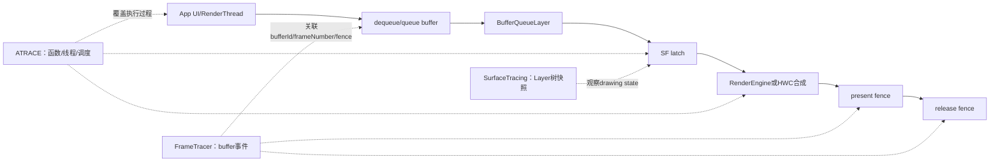
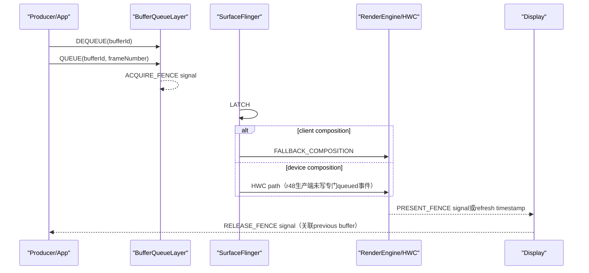
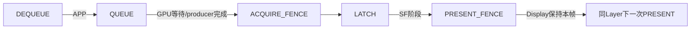
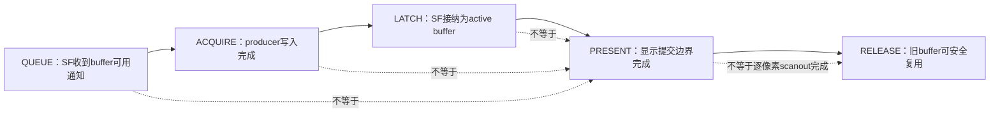

# 168 Android SurfaceFlinger Tracing、Perfetto FrameTracer 与图形证据链

> 源码版本：Android 11 / API 30 / `android-11.0.0_r48`  
> 学习方式：macOS 只读源码，不要求编译、不要求连接设备  
> 前置章节：第 99、161、162、163、164、165、167 章

---

## 1. 本章先把三个“trace”分开

Android 图形问题里常同时看到 `ATRACE`、Layer trace 和 FrameTracer。它们都叫 trace，却不是同一套数据：

| 机制 | 记录的核心对象 | 典型形态 | 最适合回答的问题 |
|---|---|---|---|
| ATRACE/ftrace | 线程上的函数区间、counter、调度事件 | Perfetto时间轴slice/counter | SF主线程究竟在执行还是被调度、锁或Binder卡住 |
| SurfaceTracing | 某时刻完整Layer drawing-state快照 | `layers_trace.pb`中的一串Layer树 | 某一时刻Layer的层级、Z序、裁剪、变换、输入和合成状态是什么 |
| Perfetto FrameTracer | 单个GraphicBuffer生命周期事件 | `GraphicsFrameEvent` | 某buffer何时dequeue、queue、fence ready、latch和present |

一句话类比：

```text
ATRACE       = 摄像机拍“线程在做什么”
SurfaceTracing = 定时保存“整个舞台怎么摆”
FrameTracer  = 给一块具体画布贴物流追踪标签
```

这三类证据可以放在同一条时间线上分析，但不能把其中一类的字段当成另一类的完成承诺。

---

## 2. 本章要解决什么

1. `SurfaceTracing` 何时保存一次Layer状态？
2. 它记录的是current state、drawing state还是已经显示的硬件状态？
3. 默认5 MiB环形缓冲区如何淘汰旧快照？
4. `TRACE_CRITICAL/INPUT/COMPOSITION/EXTRA/HWC`分别增加什么？
5. trace线程为什么可能阻塞SF显示事务？
6. `missed_entries`代表丢了帧，还是丢了trace通知？
7. `layers_trace.pb`何时落盘，停止命令返回能证明什么？
8. FrameTracer怎样向Perfetto注册`android.surfaceflinger.frame`数据源？
9. `bufferId`与`frameNumber`各解决什么身份问题？
10. DEQUEUE、QUEUE、ACQUIRE_FENCE、LATCH分别来自哪里？
11. FALLBACK_COMPOSITION、PRESENT_FENCE与RELEASE_FENCE代表什么？
12. fence尚未signal时，FrameTracer如何延迟补写事件？
13. 为什么fence已经signal，也可能没有出现在最终trace里？
14. r48的FrameTracer是否覆盖BufferStateLayer/BLAST路径？
15. Perfetto parser如何拼出APP、GPU、SF、Display四段？
16. 怎样把FrameTracer、ATRACE、Layer trace与第167章统计结果组成证据链？

---

## 3. 源码地图

### 3.1 SurfaceTracing

```text
frameworks/native/services/surfaceflinger/
├── SurfaceTracing.h
├── SurfaceTracing.cpp
├── SurfaceFlinger.cpp
├── Layer.cpp
├── LayerProtoHelper.cpp
└── layerproto/
    ├── layerstrace.proto
    ├── layers.proto
    └── LayerProtoParser.cpp
```

### 3.2 FrameTracer与事件生产者

```text
frameworks/native/services/surfaceflinger/
├── FrameTracer/FrameTracer.h
├── FrameTracer/FrameTracer.cpp
├── BufferQueueLayer.cpp
└── BufferLayer.cpp
```

### 3.3 Perfetto事件定义与消费

```text
external/perfetto/
├── protos/perfetto/trace/android/graphics_frame_event.proto
└── src/trace_processor/importers/proto/
    └── graphics_frame_event_parser.cpp
```

### 3.4 控制入口

```text
frameworks/native/services/surfaceflinger/SurfaceFlinger.cpp
frameworks/base/services/core/java/com/android/server/wm/WindowManagerService.java
frameworks/base/services/core/java/com/android/server/wm/WindowTracing.java
```

---

## 4. 三套机制位于同一显示链的不同侧面



Layer trace偏向“状态”，FrameTracer偏向“事件”，ATRACE偏向“执行”。图形故障定位通常需要三者交叉，而不是寻找一个万能字段。

---

## 5. SurfaceTracing的对象模型

`SurfaceTracing`由`SurfaceFlinger`持有：

```cpp
SurfaceTracing mTracing{*this};
```

它内部有两个主要同步域：

```text
mSfLock / SurfaceFlinger::mTracingLock
  └─ 保护Layer快照时需要稳定读取的SF状态、notify合并字段

mTraceLock
  └─ 保护enabled、buffer、bufferSize、writeToFile请求
```

另有一条专用`std::thread`负责在收到通知后序列化Layer树。这样避免每个SF通知点都直接在主线程构造大Proto，但不代表采集完全不会影响主线程；后文会看到它仍要拿`mTracingLock`。

---

## 6. enable不是“每个VSync抓一张”

`enable()`做三件事：

```cpp
mBuffer.reset(mBufferSize);
mEnabled = true;
mThread = std::thread(&SurfaceTracing::mainLoop, this);
```

trace线程首先记录一条：

```cpp
entry = traceLayersLocked("tracing.enable");
```

然后循环等待`notify()`。

r48中实际搜索到的SurfaceTracing通知点集中在`mVisibleRegionsDirty`处理：

```text
tracing.enable初始快照
visibleRegionsDirty状态变化通知
disable/write请求唤醒所带来的收尾快照
```

因此它是由重要Layer/可见区域状态变化触发的状态快照，不是固定60Hz或120Hz采样器。连续很多显示帧如果Layer状态未触发相应通知，不应期待每帧都有一条Layer trace entry。

---

## 7. 为什么COMPOSITION flag会改变通知时机

SF主循环中有两种路径：

```cpp
if (mVisibleRegionsDirty && !mAddCompositionStateToTrace) {
    mTracing.notifyLocked("visibleRegionsDirty");
}
```

若启用了`TRACE_COMPOSITION`，通知会推迟到refresh/post-composition之后：

```cpp
if (mVisibleRegionsDirty) {
    mVisibleRegionsDirty = false;
    if (mTracingEnabled && mAddCompositionStateToTrace) {
        mTracing.notify("visibleRegionsDirty");
    }
}
```

原因是composition字段要等本轮合成决策产生后才更有意义。

所以开启composition并非只让每条entry“多几个字段”，还会让快照落点相对合成流程后移。比较两次不同flags的trace时，不能默认采样时刻完全相同。

---

## 8. trace保存的是drawing state快照

入口为：

```cpp
LayersProto layers(mFlinger.dumpDrawingStateProto(mTraceFlags));
```

`dumpDrawingStateProto()`遍历：

```cpp
for (const sp<Layer>& layer : mDrawingState.layersSortedByZ) {
    layer->writeToProto(layersProto, traceFlags, display.get());
}
```

关键字是`DrawingState`：它是SF本轮用于绘制/合成的稳定状态，不是客户端刚写进current state但尚未commit的所有请求，也不是对HWC或面板进行硬件回读。

因此看到某个Layer在entry中：

- 说明它已进入这份SF drawing snapshot；
- 不说明对应buffer已经present；
- 更不说明像素已完成panel scanout。

是否present要继续查看present fence、FrameTracer或显示硬件证据。

---

## 9. LayersTraceFileProto的外层格式

`layerstrace.proto`定义：

```proto
message LayersTraceFileProto {
  optional fixed64 magic_number = 1;
  repeated LayersTraceProto entry = 2;
}

message LayersTraceProto {
  optional fixed64 elapsed_realtime_nanos = 1;
  optional string where = 2;
  optional LayersProto layers = 3;
  optional string hwc_blob = 4;
  optional bool excludes_composition_state = 5;
  optional int32 missed_entries = 6;
}
```

文件magic拼成`.LYRTRACE`，用来让解析工具识别格式。

每条entry不是“一个Layer”，而是某个采样时刻的整棵Layer集合；因此Layer数量多、开启字段多时，单条entry就会很大，环形缓冲可保留的时间范围会明显缩短。

---

## 10. 五组trace flags

```cpp
TRACE_CRITICAL    = 1 << 0;
TRACE_INPUT       = 1 << 1;
TRACE_COMPOSITION = 1 << 2;
TRACE_EXTRA       = 1 << 3;
TRACE_HWC         = 1 << 4;
```

默认值：

```cpp
TRACE_CRITICAL | TRACE_INPUT
```

可按下面理解：

| flag | 增加的主要信息 |
|---|---|
| CRITICAL | id/name/type、parent/children/relative-Z、buffer、frame、尺寸、crop、transform、颜色、damage等关键Layer状态 |
| INPUT | `InputWindowInfo`、touchable crop等输入窗口信息 |
| COMPOSITION | visible region、HWC composition type等本轮合成决策信息 |
| EXTRA | Layer metadata，并把offscreen layers挂到虚拟`Offscreen Root`下 |
| HWC | 额外调用HWC dump，作为一整段字符串blob塞入entry |

`TRACE_HWC`尤其重；它不是紧凑的结构化per-layer事件，而是每条entry带一份HWC文本dump。开启它会增加采集成本和缓冲消耗。

---

## 11. offscreen layer为何需要虚拟根

普通入口从drawing state的Z序根节点递归孩子。脱离正常可见树但仍存活的Layer不会自然出现。

开启`TRACE_EXTRA`后，SF额外创建：

```text
Offscreen Root
id = INT32_MAX - 2
parent = -1
```

再把所有offscreen Layer作为它的孩子写入Proto。

这个Root只是trace表示法，不是真实可合成Layer，也不对应客户端SurfaceControl。分析工具若把它当屏幕上的真实父层，会误判层级。

---

## 12. notify合并与missed_entries

`notifyLocked()`：

```cpp
mWhere = where;
if (mTracingInProgress) {
    mMissedTraceEntries++;
}
mTracingInProgress = true;
mCanStartTrace.notify_one();
```

如果trace线程还在处理上一条，新的通知不会排成无限长队列，而是：

1. `mWhere`保留后来的位置字符串；
2. `mMissedTraceEntries`递增；
3. 最终生成下一份最新状态快照；
4. 把合并期间少记录了多少次通知写入entry。

所以：

> `missed_entries`是SurfaceTracing来不及逐次保存的通知数，不是BufferQueue dropped frame数，也不是SF missed frame数。

它提示采集本身已发生降采样。此时不能用相邻两条Layer快照推断所有中间状态转换。

---

## 13. 条件变量模型中的易错边界

trace线程使用：

```cpp
mCanStartTrace.wait(lock);
```

而不是带predicate的：

```cpp
wait(lock, [&] { return hasWork; });
```

这带来两个源码级边界：

- 条件变量允许spurious wakeup，线程可能在没有新业务通知时也抓一份快照；
- 通知若恰好发生在首次entry完成与线程真正进入wait之间，wake signal本身不会排队，可能要等后续通知才唤醒；`mTracingInProgress/missed_entries`会反映部分合并状态，但不能把“一次notify”理解成“一定立即得到一条entry”。如果丢掉的恰好是disable唤醒且再无后续notify，随后`join()`还存在一直等待的风险。

这也是为何读trace时应把它视为有损状态采样，而非可靠事件日志。

---

## 14. trace线程为什么仍会影响SF主路径

SurfaceTracing工作线程在序列化前必须获得`mTracingLock`：

```cpp
std::unique_lock<std::mutex> lock(mSfLock);
entry = traceLayersLocked(mWhere);
```

SF主循环在tracing开启时，也用同一把锁包住事务与invalidate的关键部分：

```cpp
ConditionalLockGuard<std::mutex> lock(mTracingLock, mTracingEnabled);
handleMessageTransaction();
handleMessageInvalidate();
```

这保证worker不会在SF更新一半时读取撕裂的Layer树；代价是：

```text
trace worker序列化Layer树
          ⇅ 同一把mTracingLock
SF主线程处理display transaction/invalidate
```

Layer数量多、flags重、HWC dump慢时，trace本身可能延长主线程等待。性能分析必须把“被观察系统”和“观察开销”同时纳入判断。

---

## 15. 5 MiB环形缓冲如何工作

默认容量：

```cpp
kDefaultBufferCapInByte = 5_MB;
```

每次放入新entry前：

```cpp
while (used + protoSize > capacity) {
    pop oldest;
}
push newest;
```

因此它保留最近一段历史。不是entry数量固定，而是总序列化字节近似受限。

还有一个边界：若单条entry本身大于整个capacity，清空所有旧entry后仍放不下，函数直接返回，这条新entry也不会保存。它不会自动扩容，也没有为该情况单独增加`missed_entries`。

---

## 16. 动态改buffer size的两个细节

`setBufferSize()`只做：

```cpp
mBufferSize = newSize;
mBuffer.setSize(newSize);
```

它不会立刻遍历并淘汰当前已有entry。若把容量调小，现有`used`可能暂时大于新容量，要等下一次`emplace()`才逐步pop到满足条件。

另外，SurfaceFlinger backdoor 1029注释说参数单位是KB：

```cpp
n = data.readInt32();
if (n <= 0 || n > MAX_TRACING_MEMORY) ...
mTracing.setBufferSize(n * 1024);
```

但`MAX_TRACING_MEMORY`定义为：

```cpp
100 * 1024 * 1024 // 100MB
```

比较时却直接拿“KB参数n”与“byte风格常量”比较，随后又做`n * 1024`。如果只按单位换算，校验会错误地放宽到约100 GiB，而不是注释期望的100 MiB；但这里`n`还是有符号`int`，很大的值在乘1024时还可能先发生有符号溢出，不能把100 GiB理解成可安全使用的真实上限。准确结论是：r48的上限校验单位错误，而且大值还有整数运算风险。

---

## 17. disable、flush与文件完成点

`disable()`：

```cpp
mEnabled = false;
mWriteToFile = true;
mCanStartTrace.notify_all();
```

随后调用`writeToFile()`把trace线程move出来并`join()`。若worker原本在等待，它被唤醒后会再走一次`traceWhenNotified()`并把收尾快照加入buffer；若它已经在处理一条快照，则可能由那条在途entry观察到`mWriteToFile`并完成落盘。正常路径随后是：

```text
flush queue到LayersTraceFileProto
序列化整个文件
WriteStringToFile(/data/misc/wmtrace/layers_trace.pb)
清空并reset内存buffer
线程退出
join返回
```

因此正常停止并join返回，比单纯`disable()`更接近“文件写操作已结束”。但它仍不代表分析工具已经读取成功，也不证明每个业务通知都被保存；上一节的无predicate wait还意味着极端lost-wakeup时join可能无法返回。

---

## 18. writeProtoFileLocked的错误返回缺口

r48源码中：

```cpp
if (!SerializeToString(...)) {
    mLastErr = PERMISSION_DENIED;
}

if (!WriteStringToFile(...)) {
    mLastErr = PERMISSION_DENIED;
}

mLastErr = NO_ERROR;
```

无论前面序列化或写文件是否失败，末尾都会无条件覆盖成`NO_ERROR`。

于是控制调用的reply可能报告成功，但logcat已经打印错误、文件缺失或内容无效。诊断时应核对：

- SurfaceFlinger错误日志；
- 目标文件是否存在；
- magic与Proto是否可解析；
- 文件mtime和大小是否符合本轮采集。

不能只信1025停止调用的返回码。

---

## 19. Layer tracing控制入口与权限

SurfaceFlinger保留backdoor transaction：

```text
1025：enable/disable并在disable后写文件
1026：查询enabled
1029：设置buffer size，参数注释为KB
1033：设置trace flags
```

这些1000～1036代码虽然先被credentials分发表允许继续检查，但`onTransact()`随后仍要求：

```text
calling uid == AID_SYSTEM
或具有android.permission.HARDWARE_TEST
```

WMS的`isLayerTracing/setLayerTracing/setLayerTracingFlags`又要求调用者是Recents或具有`DUMP`，清除Binder identity后以system_server身份调用SF。

这是“WMS API入口权限”和“SF backdoor最终调用身份”两层，不应只看其中一层。

---

## 20. WMS WindowTracing不是SF SurfaceTracing

`adb shell wm tracing ...`对应的是：

```text
frameworks/base/services/core/java/com/android/server/wm/WindowTracing.java
```

它输出：

```text
/data/misc/wmtrace/wm_trace.pb
```

SurfaceTracing输出：

```text
/data/misc/wmtrace/layers_trace.pb
```

r48当前源码里，`WindowTracing.startTrace()`启动WMS state trace和ProtoLog，但没有调用`setLayerTracing(true)`；而WMS三个Layer tracing方法也没有在当前Java树中找到生产调用者。

因此不能根据“wm tracing已开启”推断`layers_trace.pb`也在采集。这两份文件通常由分析流程分别控制、最后在工具中对时展示。

---

## 21. ATRACE：低层执行时间轴

SF大量源码用：

```cpp
#define ATRACE_TAG ATRACE_TAG_GRAPHICS
ATRACE_CALL();
ATRACE_NAME("Jank detected");
ATRACE_INT("ActiveConfigFPS", fps);
```

它们分别生成：

- 函数/命名区间；
- 瞬时或嵌套slice；
- 数值counter。

ATRACE通常通过trace marker进入ftrace，再由Perfetto采集。它能与`sched_switch`、Binder、fence、CPU频率等内核事件同轴观察。

但`ATRACE_CALL`只说明该函数在某线程上的begin/end区间。区间很长可能是CPU执行、被抢占、锁等待或同步等待；仍需看线程状态和关联slice，不能直接把整段都算成CPU工作。

---

## 22. FrameTracer是原生Perfetto data source

SF初始化时：

```cpp
mFrameTracer->initialize();
```

内部只执行一次：

```cpp
args.backends = perfetto::kSystemBackend;
perfetto::Tracing::Initialize(args);
registerDataSource();
```

注册名：

```text
android.surfaceflinger.frame
```

`OnSetup/OnStart/OnStop`在r48为空；真正的enable gating由Perfetto SDK的：

```cpp
FrameTracerDataSource::Trace(lambda)
```

承担。没有Perfetto session启用此data source时，lambda中的事件构造与tracker更新不会执行。

这与ATRACE category开关不同：开启graphics ftrace事件不自动等于启用了`android.surfaceflinger.frame`原生数据源，反之亦然。

---

## 23. GraphicsFrameEvent的数据结构

Proto中的单条事件：

```proto
message BufferEvent {
  optional uint32 frame_number = 1;
  optional BufferEventType type = 2;
  optional string layer_name = 3;
  optional uint64 duration_ns = 4;
  optional uint32 buffer_id = 5;
}
```

FrameTracer写packet时明确标注：

```cpp
packet->set_timestamp_clock_id(Clock::MONOTONIC);
packet->set_timestamp(timestamp);
```

因此这些事件使用monotonic时间轴。与Layer trace的`elapsedRealtimeNano()`并列分析时，应由Perfetto/工具做clock domain对齐，手工抄数字时不要默认所有来源天然是同一时钟。

---

## 24. bufferId与frameNumber不是一回事

```text
bufferId    = 一块GraphicBuffer对象的身份
frameNumber = 这条BufferQueue提交记录的递增序号
```

同一块buffer可被循环复用：

```text
bufferId 42, frame 100
bufferId 57, frame 101
bufferId 42, frame 102
```

所以只按bufferId会把多次使用混在一起；只按frameNumber又无法把producer dequeue时尚未知frameNumber的阶段与后续queue关联。

FrameTracer的设计是：DEQUEUE先只带bufferId，QUEUE时再带frameNumber，Perfetto parser把先前DEQUEUE slice补上frame number。

---

## 25. r48中bufferId被截成32位

FrameTracer接口接收：

```cpp
uint64_t bufferID
```

但写Proto时：

```cpp
event->set_buffer_id(static_cast<uint32_t>(bufferID));
```

而Proto字段也确实是`uint32`。

因此GraphicBuffer的64位ID高32位在trace中丢失。通常短时间设备运行中低32位足以区分活跃buffer，但协议本身不能排除截断碰撞；长时间或跨对象严谨关联时，不能把trace中的32位buffer_id当完整系统级唯一ID。

---

## 26. DEQUEUE、DETACH、CANCEL从哪里来

`BufferQueueLayer`作为consumer监听producer侧操作：

```cpp
onFrameDequeued(bufferId)
  → traceNewLayer(layerId, name)
  → DEQUEUE(bufferId, no frameNumber)

onFrameDetached(bufferId)
  → DETACH

onFrameCancelled(bufferId)
  → CANCEL
```

DEQUEUE并不表示App开始执行整帧UI逻辑。它只表示producer从BufferQueue取得一块buffer；UI measure/layout、DisplayList录制可能已在此前发生。

CANCEL表示这次dequeued buffer没按正常queue路径交出，不等于整个窗口被销毁。

---

## 27. QUEUE与ACQUIRE_FENCE

`onFrameAvailable()`：

```cpp
traceTimestamp(..., systemTime(), QUEUE);
traceFence(..., item.mFence, ACQUIRE_FENCE);
```

这里的QUEUE时间是SF的BufferQueue回调执行时调用`systemTime()`，不是producer执行`queueBuffer()`那条指令的精确原地时间。两者之间还可能包含Binder/回调调度延迟。

ACQUIRE_FENCE signal表示producer对这块buffer的写入已完成到consumer可以安全读取的同步点。它不表示SF已经latch，更不表示已经present。

---

## 28. LATCH事件

`BufferQueueLayer::latchBuffer()`成功更新active buffer并清理队列后：

```cpp
setLatchTime(layerId, frameNumber, latchTime);
traceTimestamp(layerId, bufferID, frameNumber,
               latchTime, LATCH);
```

LATCH表示SF在本轮合成状态中接纳这次buffer提交。

它回答“SF什么时候把这帧纳入合成”，但不回答：

- 最终由HWC还是RenderEngine合成；
- present fence什么时候signal；
- 面板什么时候开始/完成扫描。

这些要看后续composition与present证据。

---

## 29. FALLBACK_COMPOSITION是什么

`BufferLayer::onPostComposition()`检查该Layer对应OutputLayer：

```cpp
if (outputLayer && outputLayer->requiresClientComposition()) {
    traceTimestamp(... clientCompositionTimestamp,
                   FALLBACK_COMPOSITION);
}
```

Proto注释写作：

```text
FALLBACK_COMPOSITION = renderEngine composition
```

它说明本帧该Layer落入client composition路径，由SF的RenderEngine参与合成，而不是纯HWC device overlay。

“fallback”在这里是合成路径标签，不自动代表错误或性能退化。透明、复杂变换、效果、受保护内容能力、HWC资源限制等都可能使Layer合理进入client composition。

---

## 30. PRESENT_FENCE与refresh timestamp替代

若present fence有效：

```cpp
traceFence(... presentFence, PRESENT_FENCE);
```

如果HWC不提供有效present fence、但显示仍连接，则使用：

```cpp
getRefreshTimestamp(displayId)
traceTimestamp(... actualPresentTime, PRESENT_FENCE);
```

所以同名`PRESENT_FENCE`事件有两种来源：

- 真正读取present fence signal time；
- 无fence时用HWC refresh timestamp代替的瞬时记录。

分析时不能仅凭事件枚举名就断言底层一定存在真实fence fd。

---

## 31. RELEASE_FENCE属于前一buffer

`BufferQueueLayer::onLayerDisplayed()`收到release fence后：

```cpp
traceFence(layerId,
           mPreviousBufferId,
           mPreviousFrameNumber,
           releaseFence,
           RELEASE_FENCE);
```

注意关联的是`previous` buffer/frame。release fence保护的是旧buffer何时可以安全还给producer复用，而不是宣告当前新buffer已显示。

代码还用`mPreviousReleasedFrameNumber`防止同一release重复trace。若把release事件错误关联到当前帧，会把buffer复用等待链整体错位一代。

---

## 32. 一块buffer的理想事件链



Proto枚举虽定义了`HWC_COMPOSITION_QUEUED`，但在当前r48 SurfaceFlinger生产代码中没有搜到对应`traceTimestamp/traceFence`调用。枚举存在不等于这一版本会实际产出该事件。

同样，POST、MODIFY、ATTACH也在Proto枚举中，但本章检索的r48 FrameTracer生产点没有使用它们。分析工具要容忍事件集合不完整。

---

## 33. fence未signal时如何延迟记录

`traceFence()`读取：

```cpp
signalTime = fence->getSignalTime();
```

三种情况：

```text
INVALID  → 忽略，不保存pending
已signal → 立即按signal time写事件
PENDING  → 保存到[layerId][bufferId]的pendingFences
```

下一次对同一个`layerId + bufferId`调用`traceTimestamp()`或`traceFence()`时，先执行：

```cpp
tracePendingFencesLocked(ctx, layerId, bufferId);
```

已signal的pending fence才会被补写到Perfetto packet中。

这是一种“以后路过这块buffer时顺便收账”的轮询策略，没有专用线程等待每个fence。

---

## 34. span的timestamp与duration

`traceFence()`可选`startTime`。若：

```text
startTime > 0 且 startTime < signalTime
```

则写：

```text
timestamp = startTime
duration  = signalTime - startTime
```

否则：

```text
timestamp = signalTime
duration  = 0
```

r48本章这些SurfaceFlinger调用大多没有传非零startTime，因此acquire/present/release fence通常表现为signal时刻的instant event，而不是自动展示从queue/latch到signal的完整span。Perfetto parser会根据相邻事件另外拼phase slice。

---

## 35. 60秒deadline并非主动超时器

常量：

```cpp
kFenceSignallingDeadline = 60s;
```

但实现不是“注册pending后60秒自动清掉”。它只在以后再次处理同一buffer时：

```cpp
if (signal valid && now - signalTime < 60s) {
    emit event;
}
erase pending record;
```

因此：

- 没有后续同buffer事件时，已signal fence也可能永远不被补写；
- unsignaled pending不会由定时器自动清理；
- Layer销毁时`onDestroy()`才会整体删除该Layer tracker；
- 跨trace session遗留的老fence若后来被访问，会用“signal time距当前是否小于60秒”过滤。

源码注释“fence有60秒signal期限”比实际机制更强；准确说法是“后续轮询时，不补写signal时刻已老于60秒的fence”。

---

## 36. trace停止时pending fence可能丢失

FrameTracer的DataSource `OnStop()`为空，没有flush所有pending fence，也没有等待它们signal。

若Perfetto session结束时：

```text
present fence仍PENDING
且之后DataSource已关闭
```

后续`Trace(lambda)`不会执行，就不会补写这条present事件。即使硬件稍后正常signal，最终trace也可能只到LATCH。

因此“trace里没有PRESENT_FENCE”至少有三种解释：

1. 真的没present/没signal；
2. trace过早停止；
3. signal后没有同buffer后续事件触发pending扫描。

不能只凭缺事件就直接判硬件挂死。

---

## 37. r48 FrameTracer没有覆盖所有Layer实现

对整个SurfaceFlinger目录检索FrameTracer生产调用，核心落在：

```text
BufferQueueLayer.cpp
BufferLayer.cpp（公共post-composition部分）
Layer/BufferLayer析构清理
```

`BufferStateLayer.cpp`中没有对应DEQUEUE/QUEUE/LATCH调用。第163、164章提到的BLAST/SurfaceControl buffer transaction主要走BufferStateLayer，因此：

> r48的`android.surfaceflinger.frame`对传统BufferQueueLayer的生命周期可见性更完整，不能假设它同样完整覆盖BLAST/BufferStateLayer路径。

当新架构窗口只有ATRACE/transaction或其他证据、却缺少FrameTracer buffer phase时，首先检查Layer类型与版本能力，不要先断言业务没有queue。

---

## 38. traceNewLayer只在DataSource开启时建账

`traceNewLayer()`本身也包在：

```cpp
FrameTracerDataSource::Trace(lambda)
```

所以没有活动session时，新Layer不会被持续登记。第一次打开DataSource以后，要等该Layer再次触发`onFrameDequeued/onFrameDetached`调用`traceNewLayer()`，后续事件才能通过：

```cpp
if (mTraceTracker.find(layerId) == end) return;
```

这一门。

若首次session刚启动时，某个Layer已有buffer正在队列中，且没有再次经过能注册Layer的事件，那么最早一段事件可能被跳过。这也是trace窗口开头常不完整的源码原因之一。

但`OnStop()`并不清空`mTraceTracker`：某个Layer若在先前session已经登记、期间也没销毁，下一次session可继续复用旧记录。准确说法不是“每次session都必须重新注册”，而是“tracker只会在启用期间新增，停用期间新建或改名的Layer状态不会自动同步”。

另外，`traceNewLayer()`与`traceFence()`传给`Trace()`的lambda分别对`layerName`和`fence`使用引用捕获。当前Perfetto `Trace()`调用语义是在这次调用期间执行lambda，因而引用在正常实现中仍有效；若把这种写法复制到真正异步排队执行的回调框架中，就会成为悬空引用，不能机械照搬。

---

## 39. traceNewLayer存在锁外查询边界

r48实现：

```cpp
if (mTraceTracker.find(layerId) == mTraceTracker.end()) {
    std::lock_guard<std::mutex> lock(mTraceMutex);
    mTraceTracker[layerId].layerName = layerName;
}
```

第一次`find()`发生在`mTraceMutex`之外，而`onDestroy()`会在持锁情况下erase，同一map的其他操作也普遍持锁。

严格按C++并发规则，这个锁外读与并发写存在data race风险。它通常窗口很小，但说明不能把FrameTracer内部tracker当绝对无竞态的权威账本；这是r48实现缺口，不应泛化为所有Android版本。

---

## 40. Perfetto parser怎样生成四段phase

parser注释直接定义：

```text
APP     : Dequeue → Queue
Wait GPU: Queue → AcquireFenceSignaled
SF      : Latch → PresentFenceSignaled
Display : Present → same Layer next Present
```



注意图中的“GPU等待”是parser轨道命名，不证明整个Queue→Acquire区间都在GPU执行；producer可能使用CPU、GPU或其他硬件，也可能存在同步/调度延迟。

---

## 41. parser如何补DEQUEUE的frameNumber

DEQUEUE时FrameTracer传：

```text
UNSPECIFIED_FRAME_NUMBER
```

Proto中不写frame_number字段。parser先按bufferId保存DEQUEUE slice id。

QUEUE到来时：

1. 找到同bufferId的DEQUEUE slice；
2. 结束APP slice；
3. 把QUEUE携带的frameNumber回填到旧slice；
4. 把slice名称改为frameNumber。

这依赖同一个32位bufferId正确对应。如果缺QUEUE、bufferId碰撞或trace从半途开始，补写就可能失败或产生不完整phase。

---

## 42. parser对缺QUEUE做了什么

若LATCH到来时仍有未关闭的DEQUEUE APP slice，parser会在LATCH处强制结束，并附加：

```text
Queue event was lost
```

这是分析器的容错推断，不是SF重新确认了queue时间。此时APP slice的终点被放在LATCH，只能说明QUEUE事件缺失，不能把整个Dequeue→Latch都当App绘制耗时。

---

## 43. parser的关联键也有边界

`graphics_frame_event_parser.cpp`中的多张map主要按：

```text
buffer_id
```

关联DEQUEUE、QUEUE、ACQUIRE与LATCH；Display phase则按`layer_name_id`从一次present连到同名Layer下一次present。

这意味着：

- 32位bufferId碰撞可能串轨；
- 同名Layer可能让Display phase聚合含糊；
- Layer改名会把连续display段切开；
- frameNumber主要写入结果表，不是所有内部map的联合主键。

Perfetto UI画出的漂亮phase是parser基于有限事件重建的结果，不是硬件天然提供的一条原子timeline。

---

## 44. Display phase不等于面板逐像素扫描耗时

parser把：

```text
本Layer某次Present → 同Layer下一次Present
```

命名为Display phase。

它更接近“这帧在两次present边界间占据的显示周期”，并没有per-scanline信息；如果同Layer长时间不提交下一帧，slice会持续很久，这可能只是静态画面保持，不是显示硬件执行了一段超长工作。

所以Display slice长不能直接等于显示卡顿；要结合目标刷新周期、其他Layer、VSync和实际交互变化。

---

## 45. 从一个异常现象建立证据链

假设Perfetto里看到：

```text
APP phase正常
Queue→Acquire很长
Latch较晚
SF→Present正常
```

可按顺序验证：

1. FrameTracer确认长段确实来自QUEUE与ACQUIRE signal之间；
2. 查看RenderThread/GPU/driver fence的ATRACE和调度，判断CPU提交慢还是GPU工作/等待慢；
3. Layer trace检查当时buffer/frame、transform、crop、可见性是否已进入drawing state；
4. 第167章TimeStats核对post2acquire、lateAcquire是否同向；
5. 检查trace是否有missed entries、pending fence缺失或窗口开头不完整。

只有多套证据方向一致，才逐步把怀疑收敛到producer/GPU完成侧。

---

## 46. 常见模式与初步方向

| FrameTracer表现 | 首要解释方向 | 还需排除 |
|---|---|---|
| DEQUEUE→QUEUE长 | producer持buffer时间长 | dequeue回调时间不是完整UI起点、线程被调度/锁住 |
| QUEUE→ACQUIRE长 | producer写入完成fence迟 | pending补写机制、CPU producer、trace窗口结束 |
| ACQUIRE后很久才LATCH | SF未及时选择/接纳 | desired present time、事务条件、VSync、Layer不可见/被替换 |
| LATCH→PRESENT长 | SF/HWC合成或present慢 | 刷新率切换、present事件替代来源、session结束 |
| 有FALLBACK_COMPOSITION | 使用RenderEngine client合成 | 这可能是合法策略而非故障 |
| 无PRESENT | 可能未显示 | pending未flush、无后续同buffer事件、无有效fence、路径未覆盖 |
| 无整条buffer轨迹 | 可能没采到 | DataSource未开启、Layer尚未注册、BufferStateLayer路径 |

---

## 47. ATRACE怎样补足“为什么慢”

FrameTracer能指出两个图形里程碑相距很远，却不总能说明中间线程在做什么。

例如LATCH→PRESENT长，可再看：

```text
SurfaceFlinger主线程
  handleMessageInvalidate
  handlePageFlip/latchBuffer
  presentAndGetFrameFences

RenderEngine线程/GPU fence
  drawLayers
  flush/submit

HWC Binder/HIDL调用
  validateDisplay
  presentDisplay

内核调度
  Running / Runnable / Sleeping / blocked
```

若SF slice内部大部分时间是Sleeping on fence，与持续Running执行的根因完全不同。ATRACE和scheduler state正是把“长区间”拆成执行、等待和调度的工具。

---

## 48. Layer trace怎样补足“当时画面是什么状态”

FrameTracer显示buffer已经LATCH，但画面仍不符合预期时，Layer trace可以核对：

- Layer是否在drawing tree中；
- parent/children与relative-Z是否正确；
- layer stack和Z值；
- crop、bounds、position、transform；
- alpha/color/opaque/protected；
- active buffer尺寸与current frame；
- visible region、damage region；
- input window与touchable region；
- client/device composition type；
- offscreen层是否被移出主树。

这能区分“帧没到”与“帧到了但几何/层级/透明度使它不可见”。

---

## 49. 四个最重要的完成点



尤其要避免：

```text
有QUEUE → 已上屏             错
acquire fence signal → 已上屏 错
Layer trace看到active buffer → 已上屏 错
release fence → 当前帧刚上屏   通常错，关联的是前一buffer复用
```

---

## 50. tracing本身的性能与数据损失清单

### SurfaceTracing

- 序列化完整Layer树；
- 与SF主线程竞争`mTracingLock`；
- notification会合并；
- ring buffer淘汰旧entry；
- 单entry超容量直接丢；
- HWC blob很重；
- 条件变量无predicate；
- 文件写失败返回码会被覆盖。

### FrameTracer

- 只有DataSource开启才执行lambda；
- Layer要先注册；
- pending fence靠同buffer后续事件轮询；
- OnStop不flush pending；
- layer destroy会丢pending；
- bufferId截成32位；
- r48不完整覆盖BufferStateLayer；
- parser按有限键重建phase。

### ATRACE/ftrace

- category未开就没有事件；
- buffer也会覆盖或截断；
- 高频counter/slice有开销；
- slice长不自动等于CPU执行长。

---

## 51. 常见误解逐条纠正

### 误解1：layers_trace每个VSync都有一帧

错。r48主要按visibleRegionsDirty通知保存状态快照。

### 误解2：Layer entry里有active_buffer就证明已显示

错。它是drawing state中的active buffer，还需present证据。

### 误解3：missed_entries就是系统掉帧数

错。它是SurfaceTracing合并掉的采集通知数。

### 误解4：停止返回NO_ERROR就一定写成功

错。r48 `mLastErr`在函数末尾被无条件重置。

### 误解5：wm tracing自动采集layers trace

错。当前r48两套启动链和输出文件分离。

### 误解6：graphics ATRACE开了就有FrameTracer事件

错。原生Perfetto data source要单独启用。

### 误解7：FrameTracer覆盖Android 11全部窗口buffer路径

错。当前生产点重点覆盖BufferQueueLayer，BufferStateLayer并不完整。

### 误解8：PRESENT_FENCE一定来自真实fence

错。无有效fence时可能用HWC refresh timestamp替代。

### 误解9：没有PRESENT事件就一定是HWC故障

错。还可能是pending未被再次轮询、trace提前停止或路径未覆盖。

### 误解10：FALLBACK_COMPOSITION表示渲染失败

错。它只是client/RenderEngine composition路径标签。

---

## 52. macOS只读练习

本章不要求设备、不运行trace，只用本地源码建立可验证结论。

### 练习1：找三套trace入口

```bash
rg -n "ATRACE_CALL|SurfaceTracing|FrameTracer" \
  frameworks/native/services/surfaceflinger
```

按“线程执行、状态快照、buffer事件”给结果分类。

### 练习2：核对默认flags与容量

```bash
sed -n '40,125p' \
  frameworks/native/services/surfaceflinger/SurfaceTracing.h
```

回答默认为何不包含composition/extra/HWC。

### 练习3：追notify合并

```bash
sed -n '35,115p' \
  frameworks/native/services/surfaceflinger/SurfaceTracing.cpp
```

解释`mTracingInProgress`与`mMissedTraceEntries`的关系。

### 练习4：审计环形buffer

```bash
sed -n '100,180p' \
  frameworks/native/services/surfaceflinger/SurfaceTracing.cpp
```

手算capacity=100、已有30+40、新entry=50时会保留哪些entry。

### 练习5：核对文件错误返回

```bash
sed -n '200,250p' \
  frameworks/native/services/surfaceflinger/SurfaceTracing.cpp
```

回答前面设`PERMISSION_DENIED`后为何最终仍返回成功。

### 练习6：找所有FrameTracer生产点

```bash
rg -n "mFrameTracer->trace" \
  frameworks/native/services/surfaceflinger
```

再确认`BufferStateLayer.cpp`是否出现。

### 练习7：追pending fence

```bash
sed -n '55,180p' \
  frameworks/native/services/surfaceflinger/FrameTracer/FrameTracer.cpp
```

解释它为何不是fence waiter thread。

### 练习8：对照Proto枚举与真实生产者

```bash
sed -n '18,60p' \
  external/perfetto/protos/perfetto/trace/android/graphics_frame_event.proto
```

列出枚举存在但r48 SF未实际生产的事件。

### 练习9：读parser四段

```bash
sed -n '160,335p' \
  external/perfetto/src/trace_processor/importers/proto/graphics_frame_event_parser.cpp
```

解释Display slice为何要等同Layer下一次present才闭合。

---

## 53. 复读案例：窗口有新buffer却画面没变

观测：

```text
DEQUEUE → QUEUE → ACQUIRE_FENCE都有
没有LATCH
```

合理排查树：

```text
是否传统BufferQueueLayer且DataSource覆盖？
  ├─ 否：缺LATCH可能只是r48路径覆盖不足
  └─ 是：继续
      ├─ desired present time尚未到？
      ├─ acquire fence在目标周期前才signal？
      ├─ Layer不可见/被移出树？
      ├─ 事务barrier/defer未满足？
      ├─ 队列中新帧被替换或丢弃？
      └─ SF主线程是否被锁/调度/长事务卡住？
```

Layer trace看状态，ATRACE看SF为何没执行，BufferQueue/事务源码看选择条件。缺一个LATCH事件本身不能唯一定位。

---

## 54. 复读案例：LATCH后很久才PRESENT

若真实事件完整：

```text
Latch = 100ms
FallbackComposition = 101ms
PresentFenceSignal = 145ms
```

先确认：

1. PRESENT是有效fence signal还是refresh timestamp替代；
2. refresh rate/目标周期是否正在切换；
3. RenderEngine draw/flush是否长；
4. HWC validate/present Binder调用是否长；
5. SF线程是否在等待上一帧fence；
6. present fence事件是否延迟补写，但timestamp仍取真实signal time。

FrameTracer即使稍后才把packet写入，事件timestamp仍是fence signalTime；所以UI上时间位置正确，不代表采集动作当时就发生。

---

## 55. 复读案例：Layer trace中间跳过很多状态

若两条entry之间：

```text
entry A missed_entries=0
entry B missed_entries=12
```

正确理解是：B生成前有12次notify没有一一形成独立snapshot。

可以断言：

- A与B是两个真实采集快照；
- 中间至少有多次触发被合并；
- B是采集时的较新状态。

不能断言：

- 中间正好掉了12个显示帧；
- A中的Layer直接一步变成B，中间没有其他parent/Z/buffer状态；
- 每次notify都对应一次present。

---

## 56. 复读审计：r48实现缺口汇总

1. SurfaceTracing条件变量wait无predicate，存在spurious/lost wake语义边界。
2. notify在采集忙时只累计missed并保留最新where，不保存完整事件队列。
3. 单条Proto大于capacity时静默不入buffer。
4. 1029把KB参数与byte风格100MB常量直接比较；校验被错误放宽，大值再乘1024还有有符号溢出风险。
5. 写文件错误最后被`mLastErr=NO_ERROR`覆盖。
6. `TRACE_HWC`把文本dump重复塞进每条entry，开销和空间消耗高。
7. Layer snapshot需要与SF主路径争用mTracingLock。
8. FrameTracer的64位bufferId被截为32位Proto字段。
9. pending fence只由同buffer后续trace调用轮询，OnStop不flush。
10. “60秒deadline”实际是补写时检查signal time新旧，不是主动超时器。
11. traceNewLayer首次map查询在锁外，和并发erase存在data race风险。
12. 新Layer只会在DataSource开启期间登记；首次session或停用期间出现的Layer可能缺少早期事件，而旧tracker又会跨session保留到Layer销毁。
13. r48 BufferStateLayer缺少完整FrameTracer生产点。
14. Proto定义的若干event type在r48生产代码中未使用。
15. Perfetto parser主要按32位bufferId和layer name重建phase，结果是有损关联。

这些边界不意味着trace不可用；它们告诉我们怎样避免把“未采到”误判成“未发生”。

---

## 57. 本章核心结论

1. ATRACE、SurfaceTracing和FrameTracer分别记录执行、状态与buffer事件。
2. SurfaceTracing保存SF drawing-state Layer树，不是硬件显示回读。
3. r48 Layer trace主要由visibleRegionsDirty触发，不是每VSync采样。
4. 开启composition会把相关通知推迟到合成后，并增加visible/composition字段。
5. 默认flags为critical+input，默认环形buffer为5MiB。
6. missed_entries是采集通知合并数，不是掉帧数。
7. trace线程仍与SF主路径竞争mTracingLock，采集有性能扰动。
8. 单entry过大可静默丢弃，旧entry会按字节容量淘汰。
9. r48的buffer size上限校验存在KB/byte单位缺口。
10. Layer trace文件写失败可能因mLastErr覆盖而仍返回NO_ERROR。
11. WMS WindowTracing与SF SurfaceTracing是独立文件和启动链。
12. FrameTracer是名为`android.surfaceflinger.frame`的原生Perfetto data source。
13. bufferId标识buffer对象，frameNumber标识一次queue代际；二者必须组合理解。
14. r48写入Proto时把64位bufferId截成32位。
15. QUEUE时间是SF回调观察时刻，ACQUIRE fence是producer写完同步点。
16. LATCH表示SF接纳buffer，PRESENT表示fence signal或refresh timestamp替代。
17. RELEASE fence关联previous buffer的安全复用，不等于当前帧刚显示。
18. pending fence没有专用等待线程，依赖同buffer后续事件补写。
19. DataSource停止不flush pending，因此缺PRESENT不唯一指向硬件故障。
20. r48 FrameTracer对BufferStateLayer/BLAST路径覆盖不完整。
21. Perfetto APP/GPU/SF/Display phase是parser根据有限事件重建的视图。
22. 最可靠的图形诊断要把FrameTracer、ATRACE、Layer状态与TimeStats交叉验证。

---

## 58. 自测题

1. ATRACE、SurfaceTracing、FrameTracer各自主要记录什么？
2. Layer trace为何不是逐VSync帧录像？
3. drawing state与presented state有什么不同？
4. COMPOSITION flag为什么会改变notify位置？
5. 默认trace flags与buffer容量是多少？
6. missed_entries能否当作掉帧数？为什么？
7. worker线程为何仍可能阻塞SF主线程？
8. 单条entry大于buffer capacity会怎样？
9. 1029的KB/byte校验缺口是什么？
10. 停止返回NO_ERROR为何还需检查文件和log？
11. wm_trace.pb与layers_trace.pb是什么关系？
12. FrameTracer data source的名字是什么？
13. bufferId和frameNumber为什么都需要？
14. 64位bufferId进入Proto后发生什么？
15. QUEUE时间为何不是producer queueBuffer原地时间？
16. ACQUIRE_FENCE、LATCH、PRESENT_FENCE分别完成到哪里？
17. FALLBACK_COMPOSITION是否一定是错误？
18. PRESENT_FENCE枚举是否保证底层存在真实present fence？
19. RELEASE_FENCE为什么关联previous frame？
20. pending fence靠什么时机补写？
21. 60秒deadline为何不是主动超时器？
22. trace停止时为何可能缺present事件？
23. r48 FrameTracer对BLAST路径有什么限制？
24. parser的四个phase各由哪些事件闭合？
25. Display phase很长为何不一定表示显示硬件忙？

---

## 59. 下一章预告

第169章继续学习：

> FrameEventHistory、FrameTimestamps与应用可见的buffer时间戳。

将回答：

- producer请求哪些时间戳，SF和consumer怎样回填；
- requestedPresent、acquire、latch、firstRefreshStart、GPU composition done、display present与dequeue ready分别是什么；
- `getFrameTimestamps()`为何可能返回PENDING/INVALID；
- Delta历史怎样跨Binder回传，客户端缓存如何按frameNumber合并；
- present fence不可靠或缺失时如何退化；
- App看到的时间戳与FrameTracer、TimeStats如何对齐，又为何不能完全相等。
