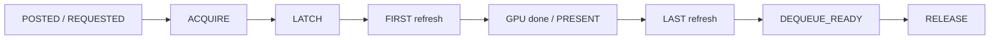
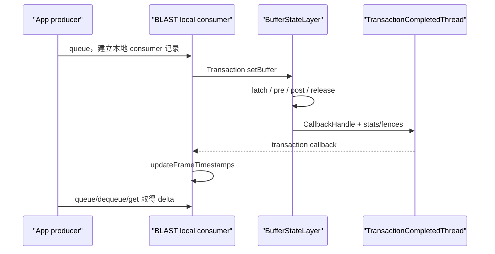

# 169 Android FrameEventHistory、FrameTimestamps 与应用可见 Buffer 时间戳

> 源码版本：Android 11 / API 30 / `android-11.0.0_r48`  
> 学习方式：macOS 静态阅读；不编译，不连接设备  
> 前置章节：第 162—168 章

---

## 1. queueBuffer 返回以后，应用怎样追回这帧的后半生

应用调用 `queueBuffer()` 时，只能确认提交请求走到了 producer 接口。后面才可能发生：

```text
producer 写入完成
→ SurfaceFlinger latch
→ 第一次开始合成准备
→ RenderEngine 工作完成
→ display present
→ buffer 可再次 dequeue
→ 所有显示/合成读取完成
```

这些事实产生在 consumer、SurfaceFlinger、RenderEngine 和 HWC 一侧，不可能在 queue 返回瞬间全部知道。

Android 11 用两份短历史解决：

```text
ConsumerFrameEventHistory
    继续填写 SF 侧新事实
              │ FrameEventHistoryDelta
              ▼
ProducerFrameEventHistory
    给 Surface / EGL / Vulkan 查询
```

双方以 frameNumber、ring index 和 connectId 对齐；consumer 只把增量经 queue/dequeue reply 或显式 Binder 查询带回。

一句话核心结论：

> FrameTimestamps 不是一次同步取得的“全帧真相”，而是一份逐渐补齐、会覆盖、会返回 PENDING/INVALID、并依赖 fence 本地轮询的 producer 缓存。每个时间只证明一个完成点。

它也不是第 168 章的 Perfetto FrameTracer：

| FrameEventHistory | FrameTracer |
|---|---|
| 面向 producer、EGL 与 Vulkan 查询 | 面向 Perfetto 离线诊断 |
| 默认 8 槽短历史 | 使用 trace session buffer |
| consumer 以 delta 同步 producer | SF 直接写 GraphicsFrameEvent |
| 明确定义 PENDING/INVALID | 缺事件需分析者解释 |

---

## 2. 双副本围绕十类事件逐步合账

### 2.1 十类 FrameEvent

```cpp
POSTED,
REQUESTED_PRESENT,
LATCH,
ACQUIRE,
FIRST_REFRESH_START,
LAST_REFRESH_START,
GPU_COMPOSITION_DONE,
DISPLAY_PRESENT,
DEQUEUE_READY,
RELEASE
```

与 EGL 名称对应：

| 内部事件 | EGL 查询项 | 值的形态 |
|---|---|---|
| REQUESTED_PRESENT | REQUESTED_PRESENT_TIME | 标量 |
| ACQUIRE | RENDERING_COMPLETE_TIME | fence signal |
| LATCH | COMPOSITION_LATCH_TIME | 标量 |
| FIRST_REFRESH_START | FIRST_COMPOSITION_START_TIME | 标量 |
| LAST_REFRESH_START | LAST_COMPOSITION_START_TIME | 标量 |
| GPU_COMPOSITION_DONE | FIRST_COMPOSITION_GPU_FINISHED_TIME | fence signal |
| DISPLAY_PRESENT | DISPLAY_PRESENT_TIME | fence signal |
| DEQUEUE_READY | DEQUEUE_READY_TIME | 标量 |
| RELEASE | READS_DONE_TIME | fence signal |

POSTED 存在于内部 history 与 dump，但 EGL 没有单独的 POSTED 查询项。

### 2.2 每项属于不同完成点



这张图表示常见语义顺序，不是所有字段都必然存在，也不是严格的全序：

- 纯 DEVICE composition 可以没有 GPU fence；
- present fence 不可靠时 API 不公开 DISPLAY_PRESENT；
- LAST 可以随着同一 buffer 的多次 refresh 更新；
- DEQUEUE_READY 是软件时刻，RELEASE 才是读取完成 fence；
- 当前最后一帧没有后继替换时，release 相关事实可能长期不产生。

---

## 3. 源码地图

双历史与 native window：

```text
frameworks/native/libs/gui/
├── include/gui/FrameTimestamps.h
├── FrameTimestamps.cpp
├── Surface.cpp
├── IGraphicBufferProducer.cpp
├── BufferQueueProducer.cpp
└── BLASTBufferQueue.cpp
```

SurfaceFlinger 写入点：

```text
frameworks/native/services/surfaceflinger/
├── Layer.cpp
├── BufferLayer.cpp
├── BufferQueueLayer.cpp
├── BufferStateLayer.cpp
├── SurfaceFlinger.cpp
└── TransactionCompletedThread.cpp
```

公开 API 消费者：

```text
frameworks/native/opengl/
├── libs/EGL/egl_platform_entries.cpp
└── specs/EGL_ANDROID_get_frame_timestamps.txt

frameworks/native/vulkan/libvulkan/swapchain.cpp
```

阅读顺序建议：

```text
BufferQueueProducer 建新记录
→ Layer/BufferLayer 补 consumer 事实
→ FrameEventHistoryDelta 编码
→ Surface applyDelta 与本地 fence
→ EGL/Vulkan 映射
```

---

## 4. queue 时已知的三件事：posted、requested 与 acquire

### 4.1 frameNumber 与 posted 在 BQP 建立

`BufferQueueProducer::queueBuffer()` 在主队列锁内：

```cpp
++mCore->mFrameCounter;
currentFrameNumber = mCore->mFrameCounter;
```

离开主锁后再取：

```cpp
postedTime =
    systemTime(SYSTEM_TIME_MONOTONIC);
```

并构造：

```cpp
NewFrameEventsEntry{
    frameNumber,
    postedTime,
    requestedPresentTimestamp,
    acquireFenceTime
}
```

所以 POSTED 是 BQP 已完成核心入队修改后的观察时刻，不是 App 开始 measure/layout/draw，也不完全等于 FrameTracer 在 SF `onFrameAvailable()` 回调里另取的 QUEUE 时间。

### 4.2 requested present 有自动与显式两种来源

`Surface::queueBuffer()` 先确定 timestamp：

```cpp
if (mTimestamp == NATIVE_WINDOW_TIMESTAMP_AUTO) {
    timestamp = systemTime(MONOTONIC);
    isAutoTimestamp = true;
} else {
    timestamp = mTimestamp;
}
```

- 显式调用 presentation-time API：它是业务请求；
- AUTO：Surface 在 queue 前取当前 monotonic 时间，规范称其对应 buffer queue time。

REQUESTED 只是期望，不是 present 承诺。buffer 可能更晚显示、被替换或从未显示。

### 4.3 rendering complete 来自 acquire fence

producer 把自己的完成 fence 作为 acquire fence 交给 consumer；signal 后 consumer 才能安全读取 buffer。EGL 因此把它命名为：

```text
EGL_RENDERING_COMPLETE_TIME_ANDROID
```

它是“这块 surface buffer 的生产写入完成点”，不是 UI 整帧、RenderThread 回调或 SurfaceFlinger 合成完成。

没有有效 acquire fence 时，producer history 用 POSTED 作为完成时间：

```cpp
frame->acquireFence =
    make_shared<FenceTime>(frame->postedTime);
```

### 4.4 acquire 不随 delta 原路返回

consumer 建新记录时只把 POSTED bit 标脏，不标 ACQUIRE。queue 返回后 Surface 直接保存自己原有的 fence：

```cpp
applyDelta(output.frameTimestamps);
updateAcquireFence(mNextFrameNumber,
                   FenceTime(fence));
```

这避免同一个 fence fd 从 producer 发给 consumer 后，再经 Binder 复制回来。GPU done、present 与 release 则只能由 consumer/SF 回传。

---

## 5. consumer 怎样补 latch、refresh、post 与 release

### 5.1 latch 是 SF 接纳 buffer

传统路径在 `BufferQueueLayer::updateFrameNumber()` 调用：

```cpp
mFrameEventHistory.addLatch(
    mCurrentFrameNumber, latchTime);
```

它说明 SF 已把这次提交选为 active buffer，仍不说明 composition 或 present 已结束。

### 5.2 first 固定，last 会继续覆盖

每次当前 buffer 进入 `onPreComposition()`：

```cpp
lastRefreshStartTime = refreshStartTime;
if (firstRefreshStartTime == PENDING) {
    firstRefreshStartTime = refreshStartTime;
}
```

因此：

```text
FIRST = 第一次以该 buffer 开始准备合成
LAST  = 在最终 release 前，最后一次被记录的准备合成
```

同一静态 buffer 可保持多轮，FIRST 与 LAST 因而不同。源码规范也提醒：compositor idle 时不一定为每个硬件 refresh 更新 LAST；它不是逐次 scanout 日志。

`hasLastRefreshStartInfo()` 甚至不看标量是否已写，而是以 `addReleaseCalled` 判断“最终 LAST 已知”。release 之前看到的 LAST 只能算当前最新值，不是终值。

### 5.3 post-composition 只保留第一次

`addPostComposition()`：

```cpp
if (!frame->addPostCompositeCalled) {
    frame->addPostCompositeCalled = true;
    frame->gpuCompositionDoneFence = gpuDone;
    frame->displayPresentFence = displayPresent;
}
```

同一 buffer 后续继续显示时，GPU done 与 display present 不更新；LAST 却仍可更新。把“最终 LAST - 第一次 PRESENT”当作某次 composition duration 会混合不同刷新轮次。

### 5.4 DEQUEUE_READY 与 RELEASE 一起登记

SF `postComposition()` 取当前 CPU 时间：

```cpp
dequeueReadyTime = systemTime();
layer->releasePendingBuffer(
    dequeueReadyTime);
```

BufferQueueLayer 再把它与 release fence 记给：

```cpp
mPreviousFrameNumber
```

语义区别：

| 字段 | 保证 |
|---|---|
| DEQUEUE_READY | producer 可以取得该 buffer 作为目标而不在 dequeue 调用中等待读完成 |
| RELEASE / READS_DONE | 用于显示/合成的读取已由 release fence 完成 |

dequeue 可以返回 buffer 和尚未 signal 的 fence，producer 要在写入前等待。因此 DEQUEUE_READY 可早于 RELEASE。

---

## 6. 为什么最新帧的 release 相关值长期不完整很正常

release 不是“当前 buffer 刚 present”的别名。新 buffer 替换旧 buffer 后，旧 buffer 的读取才逐步结束。

传统 BufferQueue 与 SF 内部 BufferStateLayer history 都显式调用：

```cpp
addRelease(mPreviousFrameNumber,
           dequeueReadyTime,
           previousReleaseFence);
```

因此 frame N 的最终三项：

```text
LAST_REFRESH_START
DEQUEUE_READY
RELEASE
```

通常要等 frame N+1 替换它后才闭合。若 N 是保持在屏幕上的最后一帧，没有后继 buffer，长期 PENDING 不等于泄漏。

`Surface::checkConsumerForUpdates()` 还会对 `mLastFrameNumber` 特判：即使调用者请求这三项，也不为当前最新帧发同步 consumer 查询。

这样避免一次注定得不到“最终 release”的 Binder 往返。但返回值未必总是 PENDING：producer cache 若已从 queue/dequeue delta 收到一个尚未最终确认的 LAST 标量，会直接返回该缓存；它不会由本次查询刷新成更晚的 LAST。

---

## 7. PENDING、INVALID 与 NOT_FOUND 是三种不同状态

### 7.1 标量与 fence 的判定方式不同

内部 pending：

```cpp
FrameEvents::TIMESTAMP_PENDING = -2;
```

Surface 映射为：

```text
NATIVE_WINDOW_TIMESTAMP_PENDING = -2
NATIVE_WINDOW_TIMESTAMP_INVALID = -1
```

| 结果 | 含义 |
|---|---|
| PENDING | 事件可能仍发生，或 consumer 事实尚未同步 |
| INVALID | 已知没有可用事件时间，例如无有效 fence |
| 非负 ns | 当前已知时间 |
| NAME_NOT_FOUND | 整个 frame 记录不在 producer 短历史 |

标量的 `isValidTimestamp()` 只排除 -2；fence 则读取 signal time，并把 PENDING/INVALID 分开。

### 7.2 addPostCompositeCalled 把“未知”变成“已知无值”

GPU done 与 display present 的 `has*Info()` 不以 fence validity 为准，而以 `addPostCompositeCalled` 为准：

```text
还没 post                 → PENDING
已 post、NO_FENCE         → INVALID
已 post、fence pending    → PENDING
已 post、fence signaled   → 真实时间
```

INVALID 是时间戳值，不是 API 调用错误。

### 7.3 r48 的 GPU-done 结果与 EGL 文字规范不同

EGL 扩展文字称：完全由 display composition、compositor 未渲染时，`FIRST_COMPOSITION_GPU_FINISHED` 应为 0。

r48 实现和测试实际得到 -1：

```text
addPostComposition 已调用
+ gpu fence = FenceTime::NO_FENCE
→ known = true
→ getSignalTime() = INVALID
→ EGL_TIMESTAMP_INVALID_ANDROID
```

应把“规范写 0”和“r48 代码/`Surface_test.cpp` 写 INVALID”并列记录，不能为追求一致而改写源码事实。

### 7.4 frame 不存在是函数失败

producer history 首次找不到 frameNumber 时直接返回 `NAME_NOT_FOUND`。EGL 把它映射成 `EGL_BAD_ACCESS`；这里通常不是权限拒绝，而是 frameId 错误、queue 未成功建账、重连代际不同或默认 8 槽历史已经覆盖。

---

## 8. 查询先读本地 cache，必要时才同步拉 delta

### 8.1 Surface 的两段查找

`Surface::getFrameTimestamps()` 先做：

```cpp
events = producerHistory.getFrame(frameNumber);
if (!events) return NAME_NOT_FOUND;
```

只有所请求的 consumer 字段还未知，才调用：

```cpp
mGraphicBufferProducer
    ->getFrameTimestamps(&delta);
applyDelta(delta);
```

requested present 与 acquire 始终由 producer 本地掌握，不会为了这两项单独跨 Binder。

应用 delta 后再次按 frameNumber 查找。若对应 ring slot 已变成另一帧，则返回 NOT_FOUND，绝不把复用槽内容当原帧返回。这是防御性代际校验；当前函数全程持有 `Surface::mMutex`，不能简单解释成同一 Surface 的 queue 线程趁中途解锁覆盖。

### 8.2 fence fd 回来后可以本地 poll

第一次 consumer 更新可能传回 GPU/present/release fence fd。后续查询即使 fence 仍 pending，也可直接对 producer 的 `FenceTime` 调 `getSignalTime()`。

所以：

```text
第一次查询 PENDING
稍后第二次查询真实 ns
```

不要求 consumer 再传一次 fd，也不表示每次查询都跨 Binder。

### 8.3 显式 Binder 查询错误无法上传

`IGraphicBufferProducer::getFrameTimestamps()` 返回 `void`。Bp 端写 token、transact 或 unflatten 失败都只写日志并 return。

Surface 随后仍可找到旧本地 frame，输出 PENDING/旧值并返回 NO_ERROR。因此 API 成功只表示“本地查询流程完成”，不证明本轮远端刷新成功。

从 disabled 切到 enabled 时的首次 fetch 也调用这个 void 接口；失败不会阻止 `mEnableFrameTimestamps=true`。

### 8.4 present 能力查询有一次性负缓存

SF 只有在 HWC 未声明：

```text
PRESENT_FENCE_IS_NOT_RELIABLE
```

时，才把 DISPLAY_PRESENT 放进支持集合。调用者请求不支持项时 Surface 返回 BAD_VALUE，EGL 映射 BAD_PARAMETER。

但 `querySupportedTimestampsLocked()` 的顺序是：

```cpp
if (mQueriedSupportedTimestamps) return;
mQueriedSupportedTimestamps = true;
err = composerService()
    ->getSupportedFrameTimestamps(...);
if (err != NO_ERROR) return;
```

也就是说，第一次 Binder 查询若瞬时失败，false 结果会在该 Surface 生命周期内被永久缓存，后续不重试。native-window 的“supports present”查询也会得到 false 和 NO_ERROR。

---

## 9. dirty delta 怎样减少传输，又怎样留下槽位边界

### 9.1 queue、dequeue 与显式查询都可带回 delta

timestamps 开启后：

```text
queueBuffer output.frameTimestamps
dequeueBuffer outTimestamps
显式 GET_FRAME_TIMESTAMPS reply
```

都能承载 `FrameEventHistoryDelta`。正常渲染循环可顺带带回旧帧事实，显式查询只补缺。

consumer 的 `getAndResetDelta()` 无论有没有 frame dirty，都会附带当前 `CompositorTiming`。

### 9.2 dirty bit 选择槽，不完全选择标量字段

每个 ring slot 有一份 `FrameEventDirtyFields`。只有 `anyDirty()` 的槽会成为一条 `FrameEventsDelta`。

但一旦构造该 delta，固定布局会写出全部标量：

```text
posted / requested / latch
first / last / dequeueReady
addPostCalled / addReleaseCalled
```

只有三种 consumer fence snapshot 真正按各自 dirty bit 决定是否携带：

```text
GPU composition done
display present
release
```

所以“dirty fields”不是逐标量的稀疏协议；它首先决定发送哪些 ring slot，并避免重复 fence fd。

### 9.3 fence snapshot 有三态

| Snapshot 状态 | producer 行为 |
|---|---|
| EMPTY | 保留原 fence，不更新 |
| FENCE | 从 fd 创建 FenceTime，并加入对应 timeline |
| SIGNAL_TIME | 更新已有 FenceTime，或直接构造已完成时间 |

producer 的四条 `FenceTimeline` 会批量缓存 signal time，从而关闭已经完成的 fd，并减少重复 syscall。

### 9.4 addQueue 覆盖槽时没有先清旧 dirty bits

`ConsumerFrameEventHistory::addQueue()` 用新的 `FrameEvents` 整体覆盖槽，却只再设置 POSTED：

```cpp
mFrames[mQueueOffset] = newTimestamps;
mFramesDirty[mQueueOffset]
    .setDirty<FrameEvent::POSTED>();
```

它没有先 reset 该槽旧 bit。producer 长期不取 delta、ring 绕回时，上一代 LATCH/GPU/RELEASE 等 bit 可能跟到新代际。

不过旧 `FrameEvents` 已被整体替换；delta 仍带新 frameNumber，producer 识别新代际后先把四个 fence 置回 NO_FENCE。结果通常是冗余或提前传新帧的 EMPTY/INVALID 状态，而不是直接传出上一帧时间。

身份必须看 frameNumber，不能只看 ring index。

### 9.5 applyDelta 不是全包原子回滚

producer 先替换 `mCompositorTiming`，再逐条应用 delta。若中途发现 index 越界，它记录错误并 return；此前 timing 与已经处理的条目不会回滚。

正常本地协议应保证 index 合法，但从失败语义看，一包 delta 不是数据库事务。

---

## 10. 8 槽 ring 依靠 frameNumber 与 connectId 防串代

### 10.1 默认 8 不是硬编码不变

容量来自只读属性：

```text
ro.lib_gui.frame_event_history_size
default = 8
```

producer/consumer 构造 vector 时读取同一个静态 `MAX_FRAME_HISTORY`。每次 queue 覆盖 `mQueueOffset`，随后按 vector size 取模。

历史只是给最近几帧的异步事实一个汇合窗口，不是持久性能数据库。查询太旧 frame 会得到 NOT_FOUND。

### 10.2 本地没有容量钳位

sysprop 声明只有 Integer 类型，没有最小值或上限。`FrameTimestamps.cpp` 直接把它转为 `size_t`：

- 0 会创建空 vector，queue 时索引/取模出错；
- 负数转换为 size_t 后可能尝试巨大分配；
- 大于 uint16 范围的 slot index 又会在 flatten 阶段被拒绝。

delta 还检查：

```text
delta count <= MAX_FRAME_HISTORY
index < MAX_FRAME_HISTORY
index <= uint16 max
buffer/fd 空间足够
```

这些保护跨进程序列化，不会修复本地错误配置。

### 10.3 index 定位槽，frameNumber 确认代际

`FrameEventsDelta` 同时带：

```text
ring index + frameNumber
```

producer 先按 index 找槽；frameNumber 改变时，重设 fence 并建立新代际。consumer 输出前又按 frameNumber 顺序遍历，让 FenceTimeline 按时间推进。

### 10.4 connectId 隔离 producer 会话

consumer disconnect：

```cpp
mCurrentConnectId++;
mProducerWantsEvents = false;
```

新 queue 带当前 connectId；生成 delta 时只发送与当前 connectId 相同的槽。新 producer 没有旧 producer 的本地 history，不能安全套用前一连接遗留增量。

disconnect 不清整条 ring，也不清所有 dirty bit；connectId 是过滤旧会话的关键门。

---

## 11. 默认关闭只省 producer 回传，不关闭普通 consumer 建账

`Surface` 初始：

```cpp
mEnableFrameTimestamps = false;
```

关闭时：

- queue/dequeue 不要求返回 delta；
- producer 不应用 consumer 新事实；
- frame timestamp 与 compositor timing 查询返回 INVALID_OPERATION；
- EGL 映射为 BAD_SURFACE。

但传统 BufferQueue 的 consumer 仍会：

```text
addQueue → addLatch → addPreComposition
→ addPostComposition → addRelease
```

`mProducerWantsEvents` 主要决定“找不到 frame 时是否打印错误日志”。它不是普通 Layer 的总采集开关。

因此“默认关闭是为了完全停止 history 成本”不准确。它主要避免 producer 每次 queue/dequeue 携带、flatten、apply delta，以及应用侧查询成本。

EGL 通过 `EGL_TIMESTAMPS_ANDROID` 开启；Vulkan display timing 路径按需调用 native-window enable。false→true 时 Surface 先尝试显式拉一次 delta，用来取得已有 dirty 记录与 compositor timing；前节已说明这次 void Binder 查询失败不会阻止 enabled 置真。

---

## 12. BLAST 用事务 callback 回灌本地 history，但 release 代际不完全对称

### 12.1 为什么不能沿用传统 Layer listener

BLAST 的 BufferQueue consumer 位于客户端进程，真正给 SF 的是 SurfaceControl buffer transaction。

因此链路变成：



`BLASTBufferItemConsumer::addAndGetFrameTimestamps()` 在 producer 第一次请求 delta 时，才把 `mCurrentlyConnected` 置 true。之前到达的 transaction callback 会在：

```cpp
if (!mCurrentlyConnected) return;
```

处跳过后续时间戳加工。它比普通 Layer 更积极地省掉无人消费的工作。

### 12.2 callback 到达不等于 fence 已 signal

Callback 带回：

```text
frameNumber / latchTime / refreshStartTime
gpuCompositionDoneFence / presentFence
previousReleaseFence / dequeueReadyTime
CompositorTiming
```

TransactionCompletedThread 把 fence 对象装进 `SurfaceStats`，不先等待 signal。BLAST 写入本地 consumer history 后，producer 查询仍可能得到 PENDING。

### 12.3 SF 内部 history 与 BLAST 本地 release 关联不同

BufferStateLayer 的 SF 内部 history 明确执行：

```cpp
addRelease(mPreviousFrameNumber, ...);
```

BLAST 客户端回灌却执行：

```cpp
addRelease(frameNumber,
           dequeueReadyTime,
           previousReleaseFence);
```

这里的 frameNumber 来自当前 callback stats，fence 字段又明确命名为 previousReleaseFence。也就是说，r48 本地适配器没有保留 SF 内部那种显式 `mPreviousFrameNumber` 关联。

由源码可以确定这是一次代际口径不对称；仅凭当前代码不能把 BLAST 的 READS_DONE 与传统 BufferQueue 的 previous-frame 语义假定为完全相同。设备分析时应结合 transaction callback、下一 buffer 与真实 fence 验证，不把单个字段名当最终证明。

### 12.4 r48 正处在迁移中

BufferStateLayer 同时具有：

- 自己的 `ConsumerFrameEventHistory`；
- CallbackHandle/FrameEventHistoryStats；
- BLAST 客户端的另一份 consumer history。

`updateFrameNumber()` 旁还留有 “support frame history events” TODO，虽然当前函数随后仍调用 `addLatch()`。不能只凭 TODO 断言完全不支持，也不能假定新旧路径每一字段都对称。

---

## 13. CompositorTiming 是合成预测，不是这帧的实测耗时

时间戳查询还会返回一组 `CompositorTiming`：

| 字段 | 含义 | 容易误读成 |
|---|---|---|
| `deadline` | 下一次合成应完成的目标时刻 | 当前帧真正完成合成的时刻 |
| `interval` | 当前显示节拍周期 | 本帧合成耗时 |
| `presentLatency` | 合成到显示的离散化延迟估计 | 当前帧的实际 present latency |

这三个值描述的是 SurfaceFlinger 对合成节奏的预测模型。它们和某个 `FrameEvents` 放在同一份 delta 里传输，但不属于该帧的十个事件。

### 13.1 SurfaceFlinger 把延迟吸附到刷新周期

`setCompositorTimingSnapped()` 先根据 VSync phase 判断理想的 composite-to-present latency。若结果不为正，就补一个刷新周期 `T`。随后把观测到的额外延迟按周期吸附：

```text
idealLatency
    = 从 SF phase 推出的理想延迟，必要时补一个 T

extraLatency
    = max(0, observedLatency - idealLatency)

snappedLatency
    = idealLatency + round(extraLatency / T) * T

deadline
    = vsyncTime - idealLatency

interval
    = T
```

实现用 `T / 2` 的偏置完成就近取整。因此 `presentLatency` 会阶梯式跳变，而不是连续跟随每次测量。这正是它作为调度预测值而非逐帧计时值的证据。

### 13.2 观测队列最多保留 16 个 present fence

`updateCompositorTiming()` 把每次 composite 对应的 present fence 和 composite 时间放入队列，队列上限为 16。它从队头开始读取：

- fence 已 signal：计算 composite-to-present latency，继续消费；
- 队头仍 pending：立即停止，后面的记录即使可读也暂不越过；
- 超过上限：丢掉最老记录，避免无限增长。

这是一条有序 fence 流。队头阻塞意味着预测可能暂时沿用旧样本，不表示 SurfaceFlinger 没有继续合成。

### 13.3 每份 delta 都带 timing，但更新仍依赖下一次交换

`ConsumerFrameEventHistory::getFrameDelta()` 即使没有 dirty frame，也会写入当前 `CompositorTiming`。producer 只有在：

- queue/dequeue 顺带收到 delta；
- 主动请求 `getFrameTimestamps()`；
- 或其他返回 `FrameEventHistoryDelta` 的交互

时，才得到新预测。

producer 侧的 `getNextCompositeDeadline(now)` 还会把缓存的 deadline 按 interval 推到 `now` 之后的下一个 tick。它回答“按现有节奏，下一目标点在哪里”，不是向 SurfaceFlinger 查询一个刚刚发生的事实。

---

## 14. EGL 与 Vulkan 怎样消费同一套 native 时间戳

native `Surface` 是共同的数据源，但 EGL 和 Vulkan 对“不支持、未完成、查询失败”的外部表达并不相同。

### 14.1 EGL_ANDROID_get_frame_timestamps

EGL 扩展先通过：

```cpp
eglGetCompositorTimingSupportedANDROID(...)
eglGetCompositorTimingANDROID(...)
eglGetNextFrameIdANDROID(...)
eglGetFrameTimestampSupportedANDROID(...)
eglGetFrameTimestampsANDROID(...)
```

把 EGL display/surface 转到 `ANativeWindow` 查询。首次成功查询某个 frame timestamp 时，`Surface` 会启用 producer 侧时间戳回传。

native status 到 EGL error 的关键映射是：

| native 返回 | EGL error |
|---|---|
| 成功 | 不报错 |
| `-ENOENT` / `NAME_NOT_FOUND` | `EGL_BAD_ACCESS` |
| `-ENOSYS` / `INVALID_OPERATION` | `EGL_BAD_SURFACE` |
| `-EINVAL` / `BAD_VALUE` | `EGL_BAD_PARAMETER` |
| 其他错误 | `EGL_NOT_INITIALIZED` |

因此 `EGL_BAD_ACCESS` 在这条 API 上常表示 frame id 已不在 ring 中，不等于权限系统拒绝访问。

### 14.2 支持矩阵不等于每帧都有有效值

扩展规范允许 display-only 路径把 GPU finished 表示为 0；r48 的实现和测试却沿用 native `INVALID = -1`。分析设备结果时，应以该构建实际实现为准，并把三层问题分开：

1. API/事件类型是否受支持；
2. frame 是否仍在 history 中；
3. 该帧的 fence 是否存在、是否已 signal。

“支持查询”只回答第一层。

### 14.3 VK_GOOGLE_display_timing 复用 native frame id

Vulkan swapchain 维护两种编号的对应：

```text
应用提交的 presentID
        ↕ TimingInfo
ANativeWindow 返回的 nativeFrameId
```

提交 present 时，它记录映射并启用 frame timestamps；随后用 nativeFrameId 请求：

- requested present；
- actual present；
- render complete；
- composition latch。

只有这些值都不再是 PENDING，记录才可以转成 `VkPastPresentationTimingGOOGLE`。

### 14.4 Vulkan 故意晚几帧再轮询

实现定义：

```cpp
enum { MIN_NUM_FRAMES_AGO = 5 };
```

队列至少积累 5 条后才检查最老记录，也就是让被查记录后面至少已有 4 次 present。目的不是提高精度，而是降低同步 IPC 拉取尚未完成 fence 的概率。

本地 `TimingInfo` 最多保留 10 条。超过容量时最老项会被淘汰，即使它尚未 ready。于是：

- 很快查询，可能还没有 past timing；
- 长时间不查询，高负载下也可能错过旧 presentID；
- native 查询出错时，当前实现会跳过记录继续处理，而不是把每个错误直接暴露给应用。

### 14.5 无效值被折成零，负 margin 还有无符号陷阱

当 actual present、render complete 或 latch 无效时，Vulkan 输出中的相关字段会写 0。`presentMargin` 则先以有符号纳秒计算：

```text
presentMargin = latchTime - renderCompleteTime
```

再转成 `uint64_t`，中间没有负值保护。若设备出现异常时序，负差值会变成巨大的无符号数。看到离谱的大 margin，先检查原始 latch/renderComplete 顺序，不要立即解释成真实等待了极长时间。

---

## 15. 用这条证据链诊断“应用看到的帧时间不对”

先确定问题属于哪一层，再决定读哪个系统：

| 想回答的问题 | 首选证据 | 不该只依赖 |
|---|---|---|
| 某次 queue 何时提交、何时 latch/present/release | FrameEventHistory / EGL / Vulkan timing | FrameTracker 的窗口汇总 |
| 某 UI 窗口是否 jank、慢在哪个阶段 | FrameTracker / JankTracker | 单独一个 present fence |
| SurfaceFlinger 全局帧耗时分布 | TimeStats | 应用本地 8 槽 history |
| 某 Layer 在 Perfetto 中跨模块关联 | FrameTracer + layer/buffer identifiers | producer frameNumber 单独使用 |

FrameEventHistory 的优势是“应用可见且逐 buffer”，代价则是：

- history 很短；
- 只有请求过的 producer 才持续接收 delta；
- 最新帧的 release 天生较晚；
- BLAST 与传统 BufferQueue 的回灌语义并非处处对称；
- 值经过 cache、fence signal 与 generation 过滤，不能只看一次返回码。

### 15.1 一个可靠的判读顺序

假设某帧返回：

```text
requested = 有效
posted    = 有效
acquire   = 有效
latch     = 有效
firstRefreshStart = 有效
lastRefreshStart  = PENDING
displayPresent    = PENDING
dequeueReady      = PENDING
readsDone         = PENDING
```

合理结论是：这帧已经进入 consumer 并至少被 latch/尝试合成，但 present 与 release 证据尚未完成或尚未同步回来。不能据此宣称“已经丢帧”，也不能把 PENDING 当成 0 纳秒参与差值。

若过一段时间再查变为 NOT_FOUND，应检查：

1. ring 是否已被更多帧覆盖；
2. 是否发生 reconnect，导致 connectId 不同；
3. Vulkan 本地十条队列是否先淘汰；
4. 应用此前是否真正启用了 timestamps；
5. BLAST callback 是否在 consumer 本地连接建立前到达。

### 15.2 静态源码练习

以下命令都只读取 `android-11.0.0_r48` 工作树。

1. 查看事件枚举、sentinel、history 大小与 producer/consumer 数据结构：

   ```bash
   sed -n '25,245p' frameworks/native/libs/gui/include/gui/FrameTimestamps.h
   ```

2. 观察 queueBuffer 中 frameNumber、postedTime、history 与 callback 的顺序：

   ```bash
   sed -n '800,1045p' frameworks/native/libs/gui/BufferQueueProducer.cpp
   ```

3. 对照 consumer 的 queue、pre-composition、post-composition 和 release 写入规则：

   ```bash
   sed -n '360,490p' frameworks/native/libs/gui/FrameTimestamps.cpp
   ```

4. 确认 Surface 的支持缓存、首次启用和本地查询分支：

   ```bash
   sed -n '180,345p' frameworks/native/libs/gui/Surface.cpp
   sed -n '945,975p' frameworks/native/libs/gui/Surface.cpp
   ```

5. 检查 deadline 推进、ring 查找、dirty delta 与 applyDelta：

   ```bash
   sed -n '235,355p' frameworks/native/libs/gui/FrameTimestamps.cpp
   sed -n '490,710p' frameworks/native/libs/gui/FrameTimestamps.cpp
   ```

6. 追踪 delta 的同步请求与 queue/dequeue piggyback：

   ```bash
   rg -n 'applyDelta|outTimestamps|getFrameTimestamps' \
     frameworks/native/libs/gui/Surface.cpp \
     frameworks/native/libs/gui/BufferQueueProducer.cpp
   ```

7. 对比 BLAST callback 回灌与 BufferStateLayer 的内部 history：

   ```bash
   sed -n '25,95p' frameworks/native/libs/gui/BLASTBufferQueue.cpp
   sed -n '145,175p' frameworks/native/libs/gui/BLASTBufferQueue.cpp
   sed -n '90,130p' frameworks/native/services/surfaceflinger/BufferStateLayer.cpp
   ```

8. 阅读 SurfaceFlinger 的 compositor timing 采样和周期吸附：

   ```bash
   sed -n '2158,2215p' frameworks/native/services/surfaceflinger/SurfaceFlinger.cpp
   ```

9. 验证 Vulkan 的延迟轮询、容量与结果换算：

   ```bash
   sed -n '200,230p' frameworks/native/vulkan/libvulkan/swapchain.cpp
   sed -n '340,405p' frameworks/native/vulkan/libvulkan/swapchain.cpp
   ```

练习时建议给每个结论同时标注“写入者、存放位置、返回条件、代际键”。这四项中缺一项，时间戳解释通常就还不够稳。

---

## 16. 结论：它是一份短窗口、渐进补全、按代际隔离的帧账本

FrameEventHistory 不是一张 queue 时就完整生成的报表。它的真实模型是：

1. producer 在 queue 时建立本地记录，先写 posted/requested/acquire；
2. consumer 在 latch、composition、present、release 各阶段补账；
3. dirty delta 经 queue/dequeue 或主动查询回到 producer；
4. producer 合并 snapshot，并在 fence signal 后把 PENDING 解析为时间；
5. frameNumber 选择帧，connectId 隔离连接代际；
6. EGL 与 Vulkan 再把 native 状态翻译成各自 API 语义。

最重要的判断原则有四条：

- PENDING 是“现在还不能给”，INVALID 是“这条证据不存在”，NOT_FOUND 是“这帧不在当前可见历史”；
- latest frame 不保证拥有 last refresh、dequeue ready 和 release；
- CompositorTiming 是吸附到刷新周期的预测，不是逐帧实测；
- BLAST、传统 BufferQueue、FrameTracer 与 TimeStats 解决的问题不同，编号也不能直接混用。

### 16.1 自测

1. 为什么 querySupportedTimestamps 的一次 Binder 失败可能在同一个 Surface 生命周期内被缓存成长期不支持？
2. 为什么 dirty bit 只选 slot，却不代表 delta 内每个标量字段都只在变化时发送？
3. latest frame 的 release 时间返回一个非 PENDING 值时，为什么仍不能简单认定它就是最终 release？
4. present fence 可靠性 capability 为什么会让 display-present 支持项整体消失？
5. connectId 怎样避免 reconnect 后相同 frameNumber 串账？
6. 为什么 Vulkan 要等至少 5 条记录再查询最老 present？
7. 巨大的 Vulkan presentMargin 可能来自哪种有符号到无符号转换？
8. BLAST 的 previousReleaseFence 为什么需要结合 callback 代际实测，而不能照搬传统 BufferQueue 解释？

能从“事件写入点—delta 交换—本地合并—API 翻译”四段分别回答这些问题，就掌握了应用可见 buffer 时间戳的边界。

---

下一篇将进入 **170-AndroidSurfaceFlingerdumpLayerProto与显示故障现场**，把逐帧时间证据扩展到 SurfaceFlinger 的整体现场快照。
