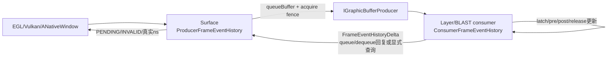
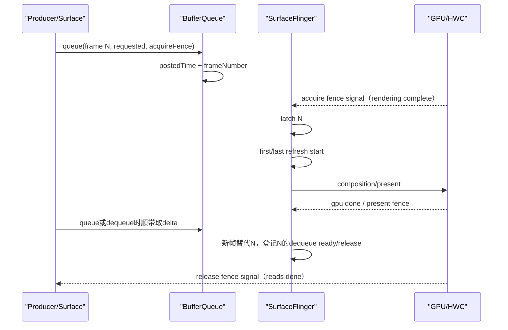
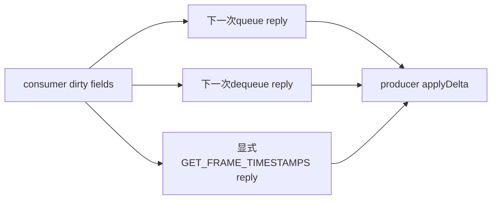
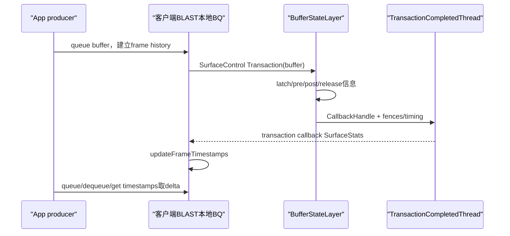

# 169 Android FrameEventHistory、FrameTimestamps 与应用可见 Buffer 时间戳

> 源码版本：Android 11 / API 30 / `android-11.0.0_r48`  
> 学习方式：macOS 只读源码，不要求编译、不要求连接设备  
> 前置章节：第 162、163、164、167、168 章

---

## 1. 本章先回答：应用怎样知道一帧后来发生了什么

应用执行`queueBuffer()`时，只知道自己把buffer交出去了。随后才可能发生：

```text
producer渲染完成
→ SF latch
→ 第一次开始合成
→ GPU client composition完成
→ display present
→ 旧buffer可无阻塞dequeue
→ 所有显示/合成读取完成，可安全重写
```

这些事实产生在consumer、SurfaceFlinger、RenderEngine和HWC一侧，应用不可能在queue返回瞬间全部知道。

Android 11用`ProducerFrameEventHistory + ConsumerFrameEventHistory`解决这个问题：双方各保存一小段同frameNumber历史，consumer把新增字段做成`FrameEventHistoryDelta`，再借queue/dequeue回复或显式Binder查询增量回传给producer。

它不是第168章的Perfetto FrameTracer：

| FrameEventHistory | FrameTracer |
|---|---|
| 给producer/EGL/Vulkan API查询 | 给系统trace与离线分析 |
| 短环形缓存，默认8帧 | Perfetto session buffer |
| producer/consumer用delta同步 | SF直接写GraphicsFrameEvent packet |
| 公开PENDING/INVALID语义 | 缺事件需要分析者判断 |

---

## 2. 本章要解决什么

1. 一帧可记录哪十类事件？
2. posted与requested present有什么区别？
3. rendering complete为何对应acquire fence signal？
4. latch、first refresh与last refresh分别是什么？
5. GPU composition done为何可能是INVALID而不是0？
6. display present何时受支持？
7. dequeue ready与release/reads done为何不是同一时刻？
8. 为什么最后一帧通常拿不到last refresh、dequeue ready和release？
9. PENDING、INVALID、NAME_NOT_FOUND分别表示什么？
10. producer怎样避免接收自己已有的acquire fence fd？
11. dirty fields与delta怎样减少Binder数据？
12. queue/dequeue如何顺带带回delta？
13. 显式`getFrameTimestamps()`何时才跨Binder？
14. 历史默认为什么只有8帧，覆盖后如何防止串帧？
15. disconnect怎样隔离新旧producer代际？
16. BLAST/BufferStateLayer怎样绕事务callback补齐时间戳？
17. compositor timing三个字段怎样推导？
18. EGL与Vulkan如何消费同一底层时间戳？

---

## 3. 源码地图

```text
frameworks/native/libs/gui/
├── include/gui/FrameTimestamps.h
├── FrameTimestamps.cpp
├── Surface.cpp
├── IGraphicBufferProducer.cpp
├── BufferQueueProducer.cpp
└── BLASTBufferQueue.cpp

frameworks/native/services/surfaceflinger/
├── Layer.cpp
├── BufferLayer.cpp
├── BufferQueueLayer.cpp
├── BufferStateLayer.cpp
├── TransactionCompletedThread.cpp
└── SurfaceFlinger.cpp

frameworks/native/opengl/
├── libs/EGL/egl_platform_entries.cpp
└── specs/EGL_ANDROID_get_frame_timestamps.txt

frameworks/native/vulkan/libvulkan/swapchain.cpp
```

---

## 4. producer与consumer的双副本模型



consumer副本是SF侧后续事实的生产者，producer副本是应用可查询缓存。两者不共享内存，靠frameNumber、ring index、connectId和delta协议保持大致同步。

---

## 5. 十类FrameEvent

源码枚举：

```cpp
enum class FrameEvent {
    POSTED,
    REQUESTED_PRESENT,
    LATCH,
    ACQUIRE,
    FIRST_REFRESH_START,
    LAST_REFRESH_START,
    GPU_COMPOSITION_DONE,
    DISPLAY_PRESENT,
    DEQUEUE_READY,
    RELEASE,
};
```

对应公开EGL名称：

| 内部事件 | EGL查询项 | 来源 |
|---|---|---|
| REQUESTED_PRESENT | REQUESTED_PRESENT_TIME | Surface/queue input |
| ACQUIRE | RENDERING_COMPLETE_TIME | producer提交的acquire fence |
| LATCH | COMPOSITION_LATCH_TIME | SF latch |
| FIRST_REFRESH_START | FIRST_COMPOSITION_START_TIME | 第一次onPreComposition |
| LAST_REFRESH_START | LAST_COMPOSITION_START_TIME | release前最后一次onPreComposition |
| GPU_COMPOSITION_DONE | FIRST_COMPOSITION_GPU_FINISHED_TIME | SF client composition fence |
| DISPLAY_PRESENT | DISPLAY_PRESENT_TIME | HWC present fence |
| DEQUEUE_READY | DEQUEUE_READY_TIME | SF提交旧buffer release处理的时刻 |
| RELEASE | READS_DONE_TIME | release fence signal |

`POSTED`保存在内部历史和dump中，但EGL公开数组没有单独的POSTED查询项。

---

## 6. queue时最先建立记录

`BufferQueueProducer::queueBuffer()`分配新的：

```cpp
++mFrameCounter;
currentFrameNumber = mFrameCounter;
```

离开BufferQueue主锁后构造：

```cpp
nsecs_t postedTime = systemTime(SYSTEM_TIME_MONOTONIC);
NewFrameEventsEntry entry = {
    currentFrameNumber,
    postedTime,
    requestedPresentTimestamp,
    acquireFenceTime
};
```

然后经consumer listener送到Layer：

```cpp
addAndGetFrameTimestamps(&entry, optionalOutDelta);
```

因此posted是BufferQueueProducer完成入队核心修改后观察到的monotonic时间，不是App开始绘制时间，也不完全等于第168章SF `onFrameAvailable()`回调中的QUEUE时间。

---

## 7. requested present的两种来源

`Surface::queueBuffer()`先决定timestamp：

```cpp
if (mTimestamp == NATIVE_WINDOW_TIMESTAMP_AUTO) {
    timestamp = systemTime(MONOTONIC);
    isAutoTimestamp = true;
} else {
    timestamp = mTimestamp;
}
```

- App通过`eglPresentationTimeANDROID()`或native API显式设置时，它是业务期望呈现时间；
- 未显式设置时，Surface在queue前生成当前monotonic时间，规范把它视为对应buffer queue time。

它是“请求”，不是“承诺”。实际present可更晚，也可能该buffer被替换、丢弃或从未显示。

---

## 8. acquire fence为何叫rendering complete

producer把渲染完成同步对象作为queue的acquire fence交给consumer。它signal后，consumer才能安全读取buffer。

EGL将其暴露成：

```text
EGL_RENDERING_COMPLETE_TIME_ANDROID
```

如果没有有效acquire fence，producer侧用：

```cpp
frame->acquireFence = FenceTime(frame->postedTime);
```

即假定buffer在posted时已经可读。

这不是“应用整个帧逻辑完成时间”，而是该surface buffer的生产写入同步完成点。

---

## 9. 为什么acquire fence不从consumer传回

consumer `addQueue()`保存了acquire fence，但只把`POSTED`标dirty：

```cpp
// producer already has original fence
// avoid sending a second fd back
mFramesDirty[offset].setDirty<POSTED>();
```

queue返回后，Surface本地直接：

```cpp
updateAcquireFence(mNextFrameNumber, FenceTime(fence));
```

这样同一fence fd不会从producer发出去后又经Binder复制回来。其余由SF产生的GPU/present/release fence才需要在delta中传回。

---

## 10. latch、first refresh、last refresh

consumer侧更新：

```cpp
addLatch(frameNumber, latchTime);
```

表示SF选择该buffer作为active buffer。

每次该buffer参与一次refresh准备：

```cpp
lastRefreshStartTime = refreshStartTime;
if (firstRefreshStartTime is pending) {
    firstRefreshStartTime = refreshStartTime;
}
```

所以：

```text
first refresh = 第一次以该buffer准备合成
last refresh  = 被下一buffer替代/release之前，最后一次准备合成
```

静态画面可能被显示多个刷新周期，first与last就不同。源码注释也提醒，SF进入idle后不一定每个硬件refresh都更新last，因此它不是逐次scanout日志。

---

## 11. post-composition只记录第一次

`addPostComposition()`：

```cpp
if (!frame->addPostCompositeCalled) {
    addPostCompositeCalled = true;
    gpuCompositionDoneFence = gpuDone;
    displayPresentFence = displayPresent;
}
```

同一buffer可能保持显示多轮，但GPU composition done与display present只保留第一次合成对应证据。这与`lastRefreshStartTime`会继续更新形成刻意差异。

因此不要用：

```text
lastRefreshStart - firstPresent
```

去代表某个单次合成流水线耗时；它们可能属于同buffer的不同刷新轮次。

---

## 12. GPU composition done为何可能INVALID

如果该显示帧使用client composition，SF传RenderEngine完成fence；若完全由HWC device composition处理，可能没有GPU composition fence。

但在`addPostComposition()`被调用之后，系统已经知道“以后也不会为第一次合成补这个GPU fence”。于是API语义是：

```text
post尚未发生 → PENDING
post已发生但无GPU fence → INVALID
有fence尚未signal → PENDING
有fence已signal → 真实时间
```

`INVALID`不是错误码本身，而是“该事件没有发生/无可用时间”的时间戳值。

### 12.1 这里有一个r48规范/实现差异

`EGL_ANDROID_get_frame_timestamps.txt`对
`EGL_FIRST_COMPOSITION_GPU_FINISHED_TIME_ANDROID`的文字说明是：若全部由display合成、compositor没有渲染，该值为`0`。

但Android 11 r48这条代码实际会返回`EGL_TIMESTAMP_INVALID_ANDROID(-1)`：

```text
addPostComposition已执行
+ gpuCompositionDoneFence = FenceTime::NO_FENCE
→ hasGpuCompositionDoneInfo() = true
→ NO_FENCE.getSignalTime() = SIGNAL_TIME_INVALID
→ Surface转为NATIVE_WINDOW_TIMESTAMP_INVALID
→ EGL层得到EGL_TIMESTAMP_INVALID_ANDROID
```

`Surface_test.cpp` 的`NoGpuNoSync`也明确断言`NATIVE_WINDOW_TIMESTAMP_INVALID`。所以阅读这个版本时，应把“规范文字的0”与“r48代码/测试的-1”并列记住，不要为了让二者看起来一致而改写源码事实。

---

## 13. display present的能力门

SF只在HWC没有声明：

```text
PRESENT_FENCE_IS_NOT_RELIABLE
```

时，把`DISPLAY_PRESENT`列入支持集合。

`Surface`第一次查询支持项后缓存结果。若调用者请求present而设备不支持：

```cpp
return BAD_VALUE;
```

EGL映射为`EGL_BAD_PARAMETER`。

这点与第168章FrameTracer不同：FrameTracer在无有效present fence时可用refresh timestamp记录同名事件；EGL frame timestamp API则通过能力查询拒绝不可靠的DISPLAY_PRESENT。两套数据不可机械等价。

---

## 14. dequeue ready与release的区别

规范定义：

```text
DEQUEUE_READY：buffer已能作为producer目标而不阻塞；
通常表示所有读取命令已经提交，但不保证读取完成。

RELEASE / READS_DONE：用于显示/合成的所有读取已经完成。
```

SF `postComposition()`先取一个CPU时间：

```cpp
dequeueReadyTime = systemTime();
layer->releasePendingBuffer(dequeueReadyTime);
```

同时为previous frame登记release fence。于是：

```text
dequeueReadyTime是SF软件路径时刻
releaseTime是release fence signal时刻
```

前者可早于后者，不能把“可发起dequeue而不阻塞”写成“硬件已经完全不再读”。

---

## 15. 为什么release属于前一帧

新buffer被latch并显示后，旧buffer才逐步释放。因此`BufferQueueLayer`与`BufferStateLayer`都调用：

```cpp
addRelease(mPreviousFrameNumber,
           dequeueReadyTime,
           previousReleaseFence);
```

这和第168章FrameTracer的RELEASE_FENCE同样错开一代。

最新queue的帧若尚无后继帧，系统还无法给它最终last refresh、dequeue ready和release；画面静止时，这种PENDING完全正常。

---

## 16. 一帧的时间戳关系图



箭头展示的是语义关系，不保证每个事件都存在，也不保证delta恰在事件发生时立即回到App。

---

## 17. PENDING与INVALID

常量：

```cpp
NATIVE_WINDOW_TIMESTAMP_PENDING = -2;
NATIVE_WINDOW_TIMESTAMP_INVALID = -1;
```

精确含义：

| 值 | 含义 |
|---|---|
| PENDING | 事件可能仍会发生，或consumer新事实尚未同步回来 |
| INVALID | 已知事件没有发生、fence无效，无法给真实时间 |
| 非负ns | 已知事件时间 |

缺少frame记录则不是填`INVALID`，而是返回`NAME_NOT_FOUND`，EGL映射`EGL_BAD_ACCESS`。

因此三者不能混用：

```text
PENDING = 以后再问
INVALID = 问到了，但这项没有有效发生时间
NOT_FOUND = 这帧已不在短历史/从未在本地建账
```

---

## 18. API为何先查本地cache

`Surface::getFrameTimestamps()`：

```cpp
events = producerHistory.getFrame(frameNumber);
if (!events) return NAME_NOT_FOUND;
```

只有调用者请求的consumer字段还不可用时才：

```cpp
IGraphicBufferProducer::getFrameTimestamps(&delta);
applyDelta(delta);
```

requested present和acquire始终由producer本地掌握，不会为它们单独发同步Binder查询。

这减少IPC，但意味着返回的是“本地cache + 本轮收到的delta”，不是去SF构造一份全局原子快照。

---

## 19. 最后一帧为什么不做无意义同步查询

`checkConsumerForUpdates()`特别处理：

```cpp
lastRefresh/dequeueReady/release
只有 frameNumber != mLastFrameNumber 才触发consumer查询
```

因为当前最新帧在下一帧到来前不可能形成最终release信息。若每次轮询都跨Binder，既增加开销又不会得到新答案。

所以对最新帧查询这些字段，Surface可直接返回PENDING而不访问consumer。这是有意优化，不是Binder链断了。

---

## 20. 显式查询可以反复poll

EGL规范允许应用从不同线程反复调用`eglGetFrameTimestampsANDROID()`，不要求两次之间执行其他EGL函数。

底层Surface用`mMutex`保护producer history，并在必要时同步调用IGBP获取最新delta。

不过“可反复poll”不代表应该高频忙等。Binder查询、fence状态读取与锁仍有成本；合理做法是隔一段时间或结合应用自己的帧完成节奏查询。

---

## 21. queue/dequeue怎样piggyback delta

开启timestamps后，Surface在dequeue时传非空：

```cpp
FrameEventHistoryDelta* outTimestamps
```

BufferQueueProducer把consumer积累的dirty delta塞进dequeue Binder reply。

queue input中也携带`getFrameTimestamps=true`，consumer在添加新frame记录的同时，把旧记录增量放进`QueueBufferOutput.frameTimestamps`。



这样正常渲染循环本身就能把大部分事实顺带带回，显式查询只补缺。

---

## 22. 默认关闭是为了避免开销

`Surface`默认`mEnableFrameTimestamps=false`。未开启时：

- consumer仍可建立记录，供SF dump等内部用途；
- producer不会在每次queue/dequeue请求并应用delta；
- `getFrameTimestamps()`与compositor timing返回`INVALID_OPERATION`；
- EGL映射成`EGL_BAD_SURFACE`。

EGL通过：

```text
eglSurfaceAttrib(..., EGL_TIMESTAMPS_ANDROID, EGL_TRUE)
```

开启；Vulkan `VK_GOOGLE_display_timing`路径也会按需开启native window timestamps。

从disabled切到enabled时会先显式拉一次delta，初始化compositor timing与已有dirty记录。

---

## 23. dirty fields与增量协议

consumer为每个ring slot维护一组bit：

```text
POSTED/LATCH/FIRST/LAST/GPU/PRESENT/RELEASE...
```

`getAndResetDelta()`只为dirty slot构造`FrameEventsDelta`，发送后reset bit。

标量字段在每条delta里按固定布局写出；三种fence snapshot只有对应dirty bit时才不是EMPTY：

```text
GPU composition done
display present
release
```

Fence snapshot可为：

```text
EMPTY       不更新producer旧值
FENCE       传fd，producer创建FenceTime并入timeline
SIGNAL_TIME 只传已缓存时间，不再传fd
```

这降低重复fd传输，并允许后续delta用可信signal time更新已有FenceTime。

### 23.1 槽位覆盖时dirty bit不会先清空

`ConsumerFrameEventHistory::addQueue()`会用全新`FrameEvents`覆盖槽位，但没有在这一刻reset该槽的`mFramesDirty`，只是再把`POSTED`置脏。

如果producer长时不拉delta，旧帧在ring绕回前积累的LATCH/GPU/RELEASE等dirty bit可能跟到新帧这一轮delta中。不过：

- 槽位中的`FrameEvents`已整体重置，不会直接携带旧帧时间戳；
- `frameNumber`会让producer识别新代际，并先把四个fence恢复为`NO_FENCE`；
- 多出来的fence dirty通常只会传递新帧的空/INVALID状态，而不是旧帧fence。

因此它更像“冗余增量与状态提前显露”的边界，而不是把旧时间戳直接串给新帧。诊断时仍应把`frameNumber`而不是ring index当成帧身份。

---

## 24. 为什么delta按frameNumber顺序发送

consumer环形槽的物理顺序会绕回。`getAndResetDelta()`先找最早有效frame，再从那里遍历到末尾、随后绕到开头。

源码理由是producer会把fence压入`FenceTimeline`，按frame顺序加入更容易正确批量更新signal times。

delta同时携带：

```text
ring index + frameNumber
```

producer按index定位槽，再用frameNumber判断是否是新代际。index解决双方相同环槽映射，frameNumber防止把旧槽内容套给新帧。

---

## 25. 历史容量与覆盖

容量：

```cpp
ro.lib_gui.frame_event_history_size
默认8
```

这是只读sysprop，构造producer/consumer history时决定vector长度。

每次queue覆盖`mQueueOffset`指向的整条`FrameEvents`，再循环到下一槽。应用查询太旧frame时本地找不到，返回NAME_NOT_FOUND。

这不是持久性能数据库，只是让最近几帧的异步事实有时间汇合。

---

## 26. 覆盖发生在同步查询期间怎么办

Surface查询流程中可能：

1. 本地先找到frame N；
2. 进入远端更新期间，某条合法的history更新路径使环形槽被覆盖；
3. delta应用后frame N已不存在。

源码因此再次：

```cpp
events = getFrame(frameNumber);
if (!events) return NAME_NOT_FOUND;
```

这避免把复用槽里的frame N+8数据误返回给N。

Android 11 r48的`Surface::getFrameTimestamps()`从查本地cache、Binder查consumer到应用delta都持有同一个`Surface::mMutex`，所以不应把步骤22简单解释成“该Surface的queue线程趁锁被释放继续入队”。源码的二次查找是一道防御性代际校验：即使当前实现中通常难以触发，也绝不返回复用槽中另一帧的数据。

---

## 27. connectId隔离连接代际

consumer disconnect时：

```cpp
mCurrentConnectId++;
mProducerWantsEvents = false;
```

每个新queue记录带当前connectId。生成delta时只发送：

```cpp
frame.connectId == mCurrentConnectId
```

因为新producer没有旧producer的本地history，不能安全应用上一连接遗留增量。

注意frameNumber与connectId是不同防线：frameNumber标识队列帧，connectId标识producer会话。

---

## 28. mProducerWantsEvents的真实作用

它主要控制consumer发现找不到frame时是否打印错误日志，并在disconnect后复位。普通BufferQueue路径即使producer没有开启timestamps，queue仍会往consumer history加记录。

因此：

```text
producer没请求delta ≠ consumer完全不记录
```

BLAST本地consumer更积极利用连接状态：如果producer尚未请求过delta，事务callback回来的后续事件可以直接跳过，避免为无人查询的历史持续加工。

---

## 29. 普通BufferQueue的SF写入点

```text
queue：Layer::addAndGetFrameTimestamps → addQueue
latch：BufferQueueLayer::updateFrameNumber → addLatch
pre composition：BufferLayer::onPreComposition → addPreComposition
post composition：BufferLayer::onPostComposition → addPostComposition
release：BufferQueueLayer::releasePendingBuffer → addRelease(previous)
```

这些写入和第167章TimeStats、第168章FrameTracer常在相邻源码处发生，但字段并非同一对象，也未保证完全同一调用时间。例如FrameTracer QUEUE取SF callback `systemTime()`，FrameEventHistory postedTime取BufferQueueProducer入队后的时间。

---

## 30. BLAST为何需要另一条回传链

BLAST在客户端进程有本地BufferQueue consumer，真正送给SF的是SurfaceControl buffer transaction。

因此SF侧`BufferStateLayer`不能直接通过原BufferQueue listener把所有后续事件写回producer。它把以下信息塞进事务完成callback：

```text
frameNumber
latchTime
refreshStartTime
GPU composition done fence
present fence
previous release fence
compositor timing
dequeueReadyTime
```

客户端`BLASTBufferQueue::transactionCallback()`再调用本地：

```cpp
BLASTBufferItemConsumer::updateFrameTimestamps(...)
```

补入本地ConsumerFrameEventHistory，之后producer仍通过同一delta协议查询。

---

## 31. BLAST时间戳链



callback到达不先等待present fence signal；它传回fence对象，producer查询时再得到PENDING或signal time。

---

## 32. BLAST与普通路径并非字段生成完全相同

`BufferStateLayer::updateFrameNumber()`甚至留有：

```cpp
// TODO: support frame history events
```

但它仍对自身history调用`addLatch()`，同时更完整的应用回传靠callback stats进入BLAST本地history。

这说明r48处于迁移阶段：

- SF Layer内部history；
- Transaction callback的FrameEventHistoryStats；
- 客户端BLAST本地history；

三处共同完成兼容链。不能只读`BufferStateLayer`的一处TODO就断言BLAST没有应用时间戳，也不能假设它与传统BufferQueue每个内部对象完全对称。

---

## 33. compositor timing的三个字段

```cpp
struct CompositorTiming {
    deadline;
    interval;
    presentLatency;
};
```

producer公开：

```text
COMPOSITE_DEADLINE
COMPOSITE_INTERVAL
COMPOSITE_TO_PRESENT_LATENCY
```

`deadline`不是过去某一帧的固定绝对时间；producer调用时把SF提供的phase通过`getNextCompositeDeadline(now)`吸附到下一tick。

`interval`来自显示VSync周期，`presentLatency`由SF历史composition→present fence估算后吸附到周期网格，目的是减少>1ms调度抖动，帮助应用预测未来呈现。

它是预测/调度参数，不是每帧实际duration统计。

---

## 34. compositor timing怎样在delta中传播

SF每轮更新全局`CompositorTiming`，Layer初始化或post-composition时写入consumer history。

每次`getAndResetDelta()`无论是否有frame dirty，都写：

```cpp
delta->mCompositorTiming = mCompositorTiming;
```

producer `applyDelta()`先整体替换本地timing。因此刚开启timestamps、尚未queue任何新帧，也可通过首次显式fetch得到compositor timing。

动态刷新率切换时它会随后续delta更新；应用不能把一次查询的interval永久缓存成设备固定常量。

---

## 35. EGL错误映射

底层Surface返回：

| native结果 | EGL错误 |
|---|---|
| 0 | EGL_TRUE |
| NAME_NOT_FOUND / `-ENOENT` | EGL_BAD_ACCESS |
| INVALID_OPERATION / `-ENOSYS` | EGL_BAD_SURFACE |
| BAD_VALUE / `-EINVAL` | EGL_BAD_PARAMETER |
| 其他意外值 | EGL_NOT_INITIALIZED |

其中EGL_BAD_ACCESS通常表示有限history已没有该frame，不是权限系统拒绝访问。

---

## 36. Vulkan怎样复用这套机制

`VK_GOOGLE_display_timing`在present时：

1. 按需开启native frame timestamps；
2. 在queue前获取next native frame id；
3. 保存App `presentID ↔ nativeFrameId`映射；
4. 后续轮询requested、render complete、latch与actual present；
5. 四项不再PENDING后计算`VkPastPresentationTimingGOOGLE`。

它还用：

```text
presentMargin = latch - renderComplete
```

并按refresh duration推算earliestPresentTime。

所以Vulkan呈现统计不是另一套硬件时间源，而是对ANativeWindow FrameTimestamps的二次整理。

---

## 37. 与FrameTracer/TimeStats为何不能完全相等

| 对比项 | 不相等的原因 |
|---|---|
| requested present vs TimeStats desired | 路径可做0规范化、不同层对象/调用点 |
| posted vs FrameTracer QUEUE | BQP入队后时间 vs SF callback观察时间 |
| acquire vs FrameTracer ACQUIRE | 同一fence signal理论接近，但缓存/补写与ID关联路径不同 |
| latch vs FrameTracer LATCH | 传统BQ相邻调用，BLAST FrameTracer覆盖不足 |
| display present vs TimeStats present | 同fence可接近，但支持门、历史聚合与fallback不同 |
| release vs transaction callback | previous buffer代际、回调到达不等待fencesignal |

时间相近是交叉验证证据；不应要求所有工具逐纳秒完全一致。

---

## 38. 一份查询结果怎样读

假设frame 120：

```text
requestedPresent = 100.000ms
renderComplete   = 101.200ms
latch            = 104.000ms
firstRefresh     = 104.100ms
gpuDone          = INVALID
displayPresent   = 116.667ms
lastRefresh      = PENDING
dequeueReady     = PENDING
release          = PENDING
```

可解释为：

- producer请求约100ms呈现，写buffer到101.2ms才完成；
- SF在104ms latch，104.1ms开始第一次合成准备；
- 没走GPU client composition，故gpuDone无有效事件；
- 116.667ms开始显示；
- 它仍可能是最新保持画面，尚未被后继帧替代，所以三项release相关字段pending。

不能解释为“release链故障”。

---

## 39. 显式GET_FRAME_TIMESTAMPS的错误被吞掉

`IGraphicBufferProducer::getFrameTimestamps()`接口返回`void`。Bp端若：

- 写interface token失败；
- Binder transact失败；
- reply unflatten失败；

只打印日志并返回，无法把status直接交给Surface。

Surface随后可能继续使用原本本地record，返回NO_ERROR但相关字段仍PENDING/旧值。

因此长时间PENDING时还要查Binder/BufferQueue日志，不能认为每次API返回成功就证明本轮远端刷新成功。

---

## 40. history size属性缺少本地钳位

源码直接：

```cpp
MAX_FRAME_HISTORY =
    frame_event_history_size().value_or(8);
```

随后用它构造vector，并在queue时：

```cpp
mQueueOffset = (mQueueOffset + 1) % mFrames.size();
```

本文件没有把OEM只读属性钳到至少1。若设备错误配置0，会形成空vector并在取模处出错；负Integer转成`size_t`还可能尝试异常巨大分配。

这是配置契约边界，不是普通App可在运行期修改的参数，但源码阅读时不能把默认8误写成无条件固定且永远安全。

---

## 41. 其他容量与序列化保护

delta flatten/unflatten检查：

```text
delta数量 <= MAX_FRAME_HISTORY
ring index < MAX_FRAME_HISTORY
ring index <= uint16 max
buffer/fd空间足够
```

`FrameEventsDelta`不可复制、可移动，避免无意重复持有fence fd语义。

不过这些检查保护跨Binder输入边界，不会修复本地sysprop导致的错误容量，也不把多帧delta做成事务数据库；它只是一次可flatten的增量包。

---

## 42. 常见误解逐条纠正

### 误解1：requested present就是实际present

错。一个是App请求，一个是HWC present证据。

### 误解2：posted就是App开始绘制

错。它是BQP入队后的时间。

### 误解3：rendering complete代表View绘制全过程结束

错。它是buffer acquire fence signal。

### 误解4：last refresh每个显示VSync都会更新

错。SF idle等情况可不更新。

### 误解5：GPU done为INVALID说明GPU故障

错。纯HWC composition时本来就可能没有GPU fence。

### 误解6：dequeue ready等于reads done

错。前者允许不阻塞地取得目标，后者由release fence证明读取完成。

### 误解7：最新帧release一直PENDING就是泄漏

错。没有下一帧替代时最终release信息尚不能产生。

### 误解8：EGL_BAD_ACCESS是权限拒绝

错。这里通常是有限history找不到frame。

### 误解9：API返回成功表示本轮Binder刷新成功

错。void IGBP查询会吞掉远端错误，Surface可能返回缓存结果。

### 误解10：FrameEventHistory就是Perfetto FrameTracer

错。前者是应用查询协议，后者是系统trace data source。

---

## 43. macOS只读练习

### 练习1：列十类事件

```bash
sed -n '25,105p' \
  frameworks/native/libs/gui/include/gui/FrameTimestamps.h
```

分别标出标量时间与fence时间。

### 练习2：读PENDING/INVALID转换

```bash
sed -n '230,335p' frameworks/native/libs/gui/Surface.cpp
```

解释为什么“事件尚未知”和“已知无事件”不同。

### 练习3：追queue建账

```bash
sed -n '800,1040p' \
  frameworks/native/libs/gui/BufferQueueProducer.cpp
```

找frameNumber、posted、requested和acquire fence。

### 练习4：追consumer五阶段

```bash
sed -n '360,490p' \
  frameworks/native/libs/gui/FrameTimestamps.cpp
```

说明为何post只记第一次、release属于前一帧。

### 练习5：读delta fence snapshot

```bash
sed -n '270,355p' \
  frameworks/native/libs/gui/FrameTimestamps.cpp
sed -n '495,630p' \
  frameworks/native/libs/gui/FrameTimestamps.cpp
```

区分EMPTY、FENCE、SIGNAL_TIME。

### 练习6：追queue/dequeue piggyback

```bash
rg -n "applyDelta\(.*frameTimestamps|outTimestamps" \
  frameworks/native/libs/gui/Surface.cpp \
  frameworks/native/libs/gui/BufferQueueProducer.cpp
```

### 练习7：追BLAST回调

```bash
sed -n '130,175p' \
  frameworks/native/libs/gui/BLASTBufferQueue.cpp
sed -n '230,255p' \
  frameworks/native/services/surfaceflinger/TransactionCompletedThread.cpp
```

### 练习8：核对present支持门

```bash
sed -n '800,830p' \
  frameworks/native/services/surfaceflinger/SurfaceFlinger.cpp
```

说明为何不可靠present fence设备不公开该timestamp。

---

## 44. 复读案例：为何同一帧第一次问PENDING，第二次有值

时间线：

```text
t0 queue，producer本地建frame 10
t1 query displayPresent，consumer尚未post → PENDING
t2 SF post，present fence仍未signal，delta传回fence → PENDING
t3 fence signal
t4 再query，producer FenceTime读取signal time → 真实ns
```

第二次有值不要求consumer重新传一次fence fd。producer持有的FenceTime可自己更新signal time，FenceTimeline还会批量缓存并关闭已完成fd。

---

## 45. 复读案例：为什么一帧完全找不到

可能原因：

1. timestamps未开启，返回INVALID_OPERATION而不是NOT_FOUND；
2. 查询的frameId不是queue前通过next-frame-id得到的那一代；
3. 已超过默认8帧history并被覆盖；
4. 重连后旧connect代际不会回给新producer；
5. queue失败，本地没有有效frame记录；
6. BLAST/transaction callback链尚未建立，但producer本地queue记录通常仍应存在；
7. 同步更新期间槽被覆盖，二次校验返回NOT_FOUND。

先看返回码，再看PENDING/INVALID值；不要把“函数失败”和“字段尚未就绪”混为一谈。

---

## 46. 复读案例：last refresh比first refresh晚很多

这可能表示同一buffer显示了多个周期，因为下一帧没有及时latch；也可能只是静态内容正常保持。

判断是否卡顿还要看：

- 应用当时是否本应提交新帧；
- 下一frameNumber的requested/posted/acquire；
- LayerHistory与FrameTracer是否有新queue；
- SF是否进入idle、不再逐refresh更新last；
- display present间隔与刷新率。

单个静态窗口的`last-first`大，不自动等于一次超长合成。

---

## 47. 复读审计：r48易漏边界

1. scalar `isValidTimestamp()`只排除-2；INVALID主要通过fence转换产生。
2. posted内部可见但EGL不公开单独查询。
3. auto requested time在Surface queue前生成，posted在BQP入队后生成。
4. acquire fence由producer本地保留，不随delta回传第二份fd。
5. post-composition只记录第一次，last refresh可持续更新。
6. present支持查询被Surface永久缓存，运行期HAL能力不会重新探测。
7. 最新帧的last/dequeue/release不触发远端查询。
8. 显式IGBP get timestamps为void，Binder错误只能留日志。
9. consumer dirty字段发送后reset，delta不是可重复读取的完整快照。
10. disconnect只增加connectId/关闭producerWants，不清空整个ring。
11. ring容量来自只读sysprop且本文件无最小值/上限钳制。
12. BLAST后续时间戳绕TransactionCompletedThread callback回本地consumer。
13. callback传fence对象不等fence已经signal。
14. FrameEventHistory、FrameTracer和TimeStats相邻更新但身份、fallback与调用时刻不同。
15. compositor timing是吸附后的预测参数，不是单帧实测总时长。
16. EGL规范文字说纯display合成的GPU finished为0，但r48源码与测试实际返回INVALID(-1)。
17. addQueue覆盖FrameEvents时不先清该槽dirty bit；旧bit可带来冗余delta，但整条记录重置和frameNumber代际校验防止直接串用旧时间戳。

---

## 48. 本章核心结论

1. FrameEventHistory用producer/consumer双短历史让应用查询异步显示事实。
2. 默认历史8帧，可由只读sysprop改变。
3. frameNumber标识帧，ring index定位同步槽，connectId隔离连接代际。
4. posted是BQP入队后时间，requested present是App请求或自动queue时间。
5. rendering complete来自acquire fence，不是整个UI帧完成。
6. latch表示SF选中buffer，first/last refresh描述首次和最终合成准备。
7. GPU composition done只保存第一次；纯HWC路径在r48代码中返回INVALID，与EGL扩展文字所说的0存在版本差异。
8. display present只在HWC present fence可靠时对EGL声明支持。
9. dequeue ready是可无阻塞复用时刻，release是所有读取完成fence。
10. release信息关联previous frame，最新帧保持显示时PENDING正常。
11. PENDING、INVALID与NAME_NOT_FOUND分别表示以后可得、不会有有效值、历史无记录。
12. producer已有acquire fence，consumer不把同一fd传回。
13. dirty delta可piggyback在queue/dequeue回复，也可显式Binder获取。
14. producer先查本地cache，只在缺consumer字段时同步刷新。
15. 最后一帧release相关字段不会触发无意义远端查询。
16. 普通BufferQueue在Layer直接维护history；BLAST通过事务callback回灌本地history。
17. compositor timing会随delta更新，是吸附到VSync网格的预测参数。
18. EGL与Vulkan最终复用同一ANativeWindow时间戳基础。
19. IGBP显式查询错误不会直接向Surface返回，成功结果也可能只是缓存仍PENDING。
20. 与FrameTracer/TimeStats交叉验证时应容许路径与采样点差异。
21. ring覆盖时可能带着槽位的旧dirty bit，但新`FrameEvents`内容与frameNumber代际检查会阻止直接串帧。

---

## 49. 自测题

1. FrameEventHistory与FrameTracer用途有什么不同？
2. 十类FrameEvent中哪一项EGL不直接公开？
3. posted和requested present各在哪里产生？
4. 为什么rendering complete用acquire fence？
5. 无acquire fence时怎样估算完成时间？
6. first refresh与last refresh为何可能不同？
7. GPU done为何可能INVALID？
8. 什么能力决定display present是否可查询？
9. dequeue ready与release time差在哪里？
10. 为什么release记给previous frame？
11. PENDING、INVALID、NOT_FOUND怎样区分？
12. 为什么不把acquire fence随delta传回？
13. queue/dequeue怎样顺带更新history？
14. 最新帧哪些字段不会触发远端查询？
15. dirty fields发送后发生什么？
16. ring index与frameNumber分别做什么？
17. connectId怎样避免旧连接串数据？
18. 默认history容量是多少，错误OEM值有什么风险？
19. BLAST通过什么回调回填后续时间戳？
20. transaction callback收到present fence是否表示已signal？
21. compositor deadline为何会吸附到next tick？
22. EGL_BAD_ACCESS在这里通常是什么含义？
23. Vulkan如何关联presentID与nativeFrameId？
24. void IGBP查询会造成什么诊断盲点？

---

## 50. 下一章预告

第170章继续学习：

> SurfaceFlinger dump、Layer Proto、显示故障现场与跨证据诊断。

将回答：

- 普通dumpsys、`--proto`、mini dump各能看到什么；
- current/drawing、on-screen/offscreen、display与HWC状态如何对应；
- Layer名称、sequence、parent、Z、buffer、frame、crop、damage和fence怎样组合阅读；
- dump持锁和主线程schedule会怎样影响现场；
- 如何从“黑屏、闪烁、旧帧、局部不刷新、触摸错位”反推证据路径；
- 如何把第167—169章的统计、trace与timestamp拼成完整诊断模板。
