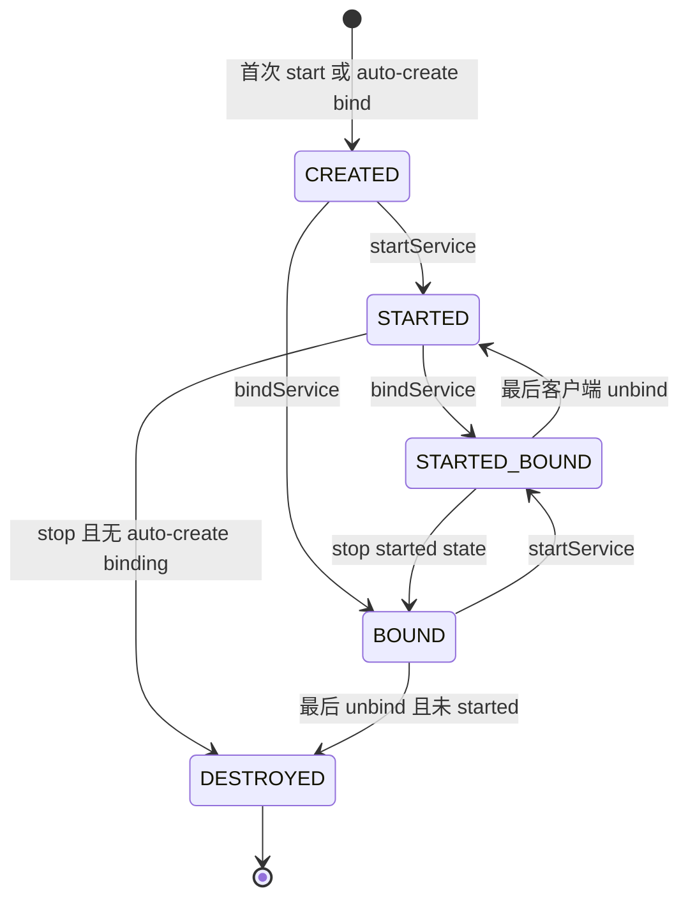
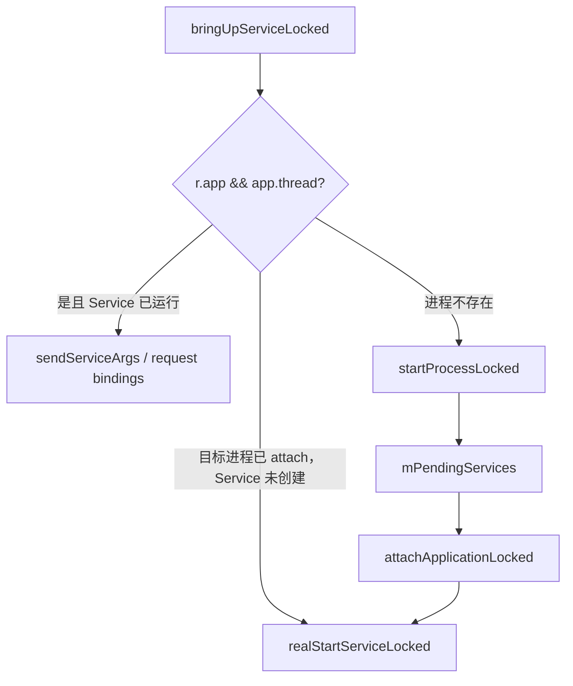
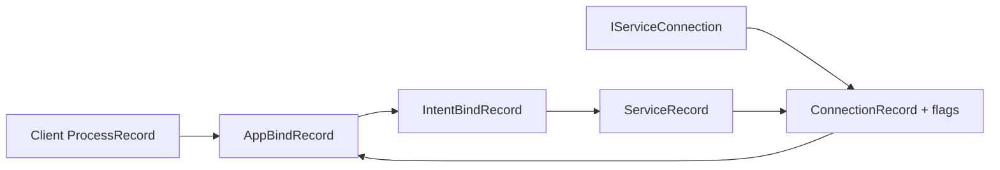
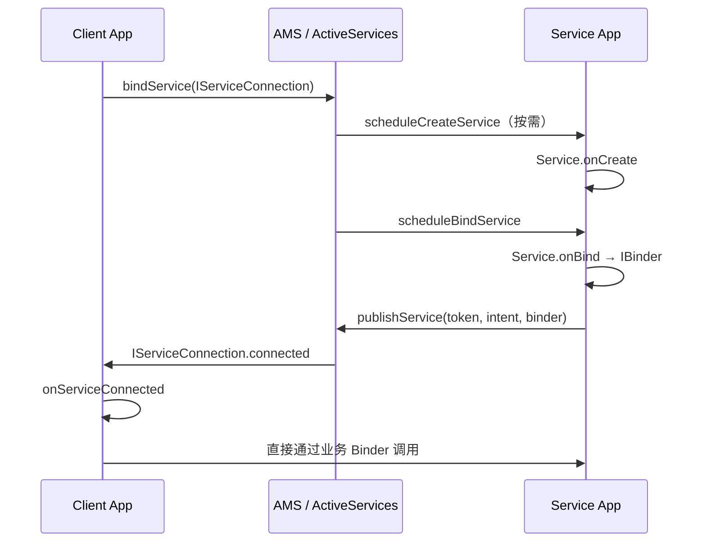
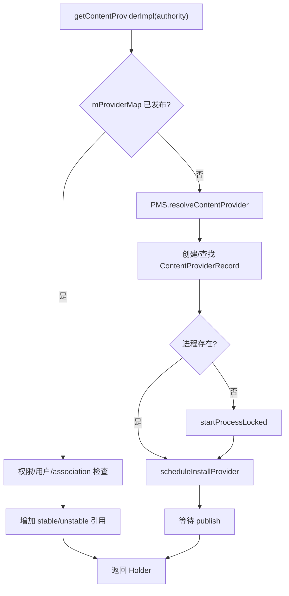
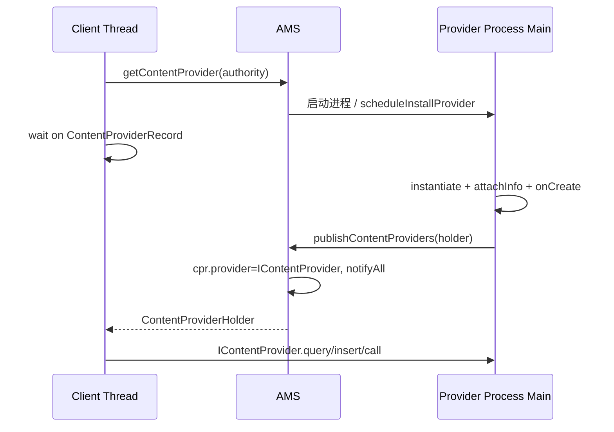

# 17 Service 与 ContentProvider：启动、绑定、发布与跨进程调用

## 本章边界

Service 和 ContentProvider 都可能让一个尚未运行的应用进程被系统拉起，也都能把 Binder 能力交给其他进程，但它们解决的问题不同：

```text
Service：有生命周期的后台组件，可 start、bind，也可二者并存
ContentProvider：以 authority/URI 为入口的数据与调用接口，由 ContentResolver 获取
```

本章以 Android 11 / `android-11.0.0_r48` 为准，追踪：

```text
Service：
Context.startService / bindService
 → AMS / ActiveServices
 → 必要时启动进程
 → ActivityThread 创建 Service
 → onStartCommand / onBind
 → publishService / ServiceConnection
 → stop / unbind / destroy

ContentProvider：
ContentResolver.query/insert/call...
 → ActivityThread.acquireProvider
 → AMS.getContentProvider
 → PMS 解析 authority
 → 必要时启动进程并 installProvider
 → publishContentProviders
 → IContentProvider 跨进程调用
 → stable/unstable 引用释放
```

仍按 macOS 只读源码学习设计，不修改或编译 AOSP。

## 本章目标

读完后，你应该能够：

1. 区分 started Service、bound Service 和 foreground Service。
2. 解释 ServiceRecord、ConnectionRecord、IntentBindRecord 的关系。
3. 从 `startService()` 追到 `onCreate()` 与 `onStartCommand()`。
4. 从 `bindService()` 追到 `onBind()`、`publishService()` 和 `onServiceConnected()`。
5. 解释 start 与 bind 生命周期为什么是两套独立状态。
6. 解释 Service ANR 与前台服务 10 秒规则。
7. 区分 ContentProvider、IContentProvider、ContentProviderRecord、ContentProviderHolder。
8. 从 authority 追到 Provider 进程启动与发布。
9. 解释 Provider 为什么通常早于 Application.onCreate() 初始化。
10. 区分 stable/unstable Provider 引用和进程死亡处理。
11. 解释 Service/Provider 依赖怎样影响 OOM adj。
12. 比较 Service Binder 与 Provider Binder 的来源和调用线程。

---

## 1. 先看两条完整路线

```mermaid
flowchart TD
    subgraph S["Service"]
        CS["Context.startService / bindService"] --> AS["AMS.ActiveServices"]
        AS --> SR["ServiceRecord"]
        SR --> SP{"目标进程存在?"}
        SP -->|"否"| SZ["ProcessList → Zygote"]
        SP -->|"是"| SC["scheduleCreateService"]
        SZ --> SC
        SC --> SO["Service.onCreate"]
        SO --> SS["onStartCommand"]
        SO --> SB["onBind → publishService"]
    end
    subgraph P["ContentProvider"]
        CR["ContentResolver API"] --> AP["ActivityThread.acquireProvider"]
        AP --> GP["AMS.getContentProviderImpl"]
        GP --> CP["ContentProviderRecord"]
        CP --> PP{"Provider 已发布?"}
        PP -->|"否"| PZ["启动/通知 Provider 进程"]
        PZ --> IP["ActivityThread.installProvider"]
        IP --> PO["ContentProvider.onCreate"]
        PO --> PUB["publishContentProviders"]
        PUB --> IPC["返回 IContentProvider"]
    end
```



---

## 2. Service 不是线程

Service 是 Android 组件对象，不自动创建工作线程。

默认情况下：

```text
Service.onCreate
Service.onStartCommand
Service.onBind
Service.onUnbind
Service.onRebind
Service.onDestroy
```

都在 Service 所属进程的主线程执行。

因此 Service 适合表达：

- 某项工作或能力的系统生命周期。
- 客户端与长期组件的绑定关系。
- 让 Framework 知道进程正在执行何种用户可感知工作。

但耗时任务仍应放到合适线程、协程、Executor 或 Job 中。

```text
Service 生命周期长
 ≠ onStartCommand 可以长时间阻塞主线程
```

---

## 3. Service 的三种维度

### Started Service

通过 `startService()` 或 `startForegroundService()` 进入 started 状态。

- 首次创建时调用 `onCreate()`。
- 每次 start 通常形成一个 startId，并调用 `onStartCommand()`。
- 直到 `stopService()`、`stopSelf()` 或系统策略结束 started 状态。

### Bound Service

通过 `bindService()` 建立客户端连接。

- 需要创建时调用 `onCreate()`。
- 首次对应绑定调用 `onBind()`，返回业务 Binder。
- Binder 通过 AMS 转交给客户端 `ServiceConnection`。
- 最后连接解除后调用 `onUnbind()`；满足条件时未来可 `onRebind()`。

### Foreground Service

它仍然是 started/bound Service，只是调用 `startForeground()` 后具有用户可见通知与更高进程重要性。

不要把三者当成三个互斥类：

```text
同一个 Service 可以既 started 又 bound
也可以同时处于 foreground 状态
```

---

## 4. start 与 bind 是两个独立“保活理由”



最常见误区：

- `unbindService()` 不会自动停止仍处于 started 状态的 Service。
- `stopService()` 不会自动拆除仍存在的 binding。
- 只有 started 理由和需要创建的 binding 理由都消失，系统才会 bring down Service。

---

## 5. Service 的 system_server 对象

| 对象 | 作用 |
|---|---|
| `ActiveServices` | AMS 内部的 Service 管理器，处理 start/bind/stop/restart/timeout |
| `ServiceRecord` | 一个具体 Service 组件的系统运行记录，也是发给 App 的 token |
| `ServiceMap` | 按 user 维护 Service 名称、Intent 等映射 |
| `StartItem` | 一次 start 请求的 Intent、startId、delivery 状态 |
| `IntentBindRecord` | 某个 Service 针对某种 Intent 的绑定状态和已发布 Binder |
| `AppBindRecord` | 某个客户端 ProcessRecord 对该 IntentBindRecord 的绑定 |
| `ConnectionRecord` | 一次具体 ServiceConnection 连接及 bind flags |

主要源码：

```text
frameworks/base/services/core/java/com/android/server/am/ActiveServices.java
frameworks/base/services/core/java/com/android/server/am/ServiceRecord.java
frameworks/base/services/core/java/com/android/server/am/IntentBindRecord.java
frameworks/base/services/core/java/com/android/server/am/AppBindRecord.java
frameworks/base/services/core/java/com/android/server/am/ConnectionRecord.java
```

---

## 6. startService 客户端入口

概念路径：

```text
ContextWrapper.startService
 → ContextImpl.startService
 → startServiceCommon
 → IActivityManager.startService
 → ActivityManagerService.startService
 → ActiveServices.startServiceLocked
```

发送参数包括：

- 调用者 `IApplicationThread`。
- Service Intent 和 resolvedType。
- calling package/feature。
- userId。
- 是否要求 foreground service。

Android 5 起 Service Intent 通常必须显式指定 component 或 package。隐式启动 Service 会带来劫持风险，Framework 会拒绝不安全的隐式 Service Intent。

---

## 7. startServiceLocked 先解析和检查

`ActiveServices.startServiceLocked()` 大致执行：

```text
retrieveServiceLocked
 → PMS resolveService
 → 创建或查找 ServiceRecord
 → 检查 exported/permission/AppOp/user
 → 检查调用者后台状态
 → 检查后台 Service 启动限制
 → 创建 StartItem、更新 startRequested
 → startServiceInnerLocked
 → bringUpServiceLocked
```

### ComponentName 返回值不只表示成功

历史 API 使用特殊 ComponentName 表达某些错误，例如包名为 `!`、`!!`、`?` 等内部约定，ContextImpl 再转换成异常或返回。阅读时不要只看“非 null 就成功”。

### 安全检查

显式 Intent 也必须满足：

- Service 是否 exported。
- 调用者是否持有 Service permission。
- 目标 user 是否运行。
- package 是否 enabled/stopped/可启动。
- AppOps 与后台限制。

---

## 8. StartItem、startId 与 stopSelfResult

每次 start 请求通常进入 `pendingStarts`，并分配递增 startId。

```text
start #1 → startId=1
start #2 → startId=2
start #3 → startId=3
```

Service 可以：

```java
stopSelf();
stopSelf(startId);
stopSelfResult(startId);
```

为什么需要 startId？异步处理可能乱序完成：

```text
旧请求 #1 完成时
新请求 #3 仍在处理
```

如果 #1 无条件 `stopSelf()`，会错误停止整个 started 状态。`stopSelfResult(1)` 只有在它对应最近/可停止的启动状态时才成功。

StartItem 还记录 deliveredStarts、deliveryCount、doneExecutingCount，支持进程死亡后的重投递策略。

---

## 9. bringUpServiceLocked：进程分叉点

核心判断：

```text
Service 已创建且 app.thread 存在
 → 直接发送 pending start/bind

目标进程已存在但 Service 未创建
 → realStartServiceLocked

目标进程不存在
 → AMS.startProcessLocked(hosting=service)
 → ServiceRecord 加入 pendingServices
 → 等待 attachApplication
 → attach 后 realStartServiceLocked
```



ServiceRecord 在 system_server；真正 Service Java 对象在目标 App 进程。二者通过 ServiceRecord 的 Binder token 对应。

---

## 10. realStartServiceLocked 创建 Service

关键调用：

```java
app.thread.scheduleCreateService(
        r,
        r.serviceInfo,
        compatibilityInfo,
        app.getReportedProcState());
```

并进行：

- 关联 `r.app`。
- 把 ServiceRecord 放进 ProcessRecord.services。
- 调整 LRU 与 OOM adj。
- 开始 executing service 计时。
- 请求已有 bind。
- 发送 pending start 参数。

`scheduleCreateService()` 是 system_server 到目标 App `IApplicationThread` 的 Binder 调用。

---

## 11. ActivityThread.handleCreateService

源码：

```text
frameworks/base/core/java/android/app/ActivityThread.java
```

核心代码结构：

```java
LoadedApk packageInfo = getPackageInfoNoCheck(...);
ContextImpl context =
        ContextImpl.createAppContext(this, packageInfo);
Application app = packageInfo.makeApplication(
        false, mInstrumentation);

Service service = packageInfo.getAppFactory()
        .instantiateService(
                classLoader,
                data.info.name,
                data.intent);

service.attach(
        context, this, data.info.name,
        data.token, app,
        ActivityManager.getService());

service.onCreate();
mServices.put(data.token, service);

ActivityManager.getService()
        .serviceDoneExecuting(...);
```

### 顺序很重要

```text
实例化
 → attach Context/Application/token
 → onCreate
 → 放入 ActivityThread.mServices
 → 通知 AMS create 执行完成
```

异常会交给 Instrumentation 处理；未被处理则通常导致应用进程 crash。

---

## 12. onStartCommand 怎样到达

AMS 将 `StartItem` 转成 `ServiceStartArgs`，调用：

```text
IApplicationThread.scheduleServiceArgs
 → ActivityThread.H.SERVICE_ARGS
 → handleServiceArgs
 → Service.onStartCommand(intent, flags, startId)
 → QueuedWork.waitToFinish
 → AMS.serviceDoneExecuting(type=START, startId, result)
```

`onStartCommand()` 返回值告诉 AMS 进程死亡后的重启/Intent 重投递策略。

---

## 13. START_* 返回值

| 返回值 | 进程被系统杀后大致语义 |
|---|---|
| `START_NOT_STICKY` | 没有新 start 请求时通常不重建 Service |
| `START_STICKY` | 保持 started 语义，重建后可能以 null Intent 调用 |
| `START_REDELIVER_INTENT` | 重建后重新投递尚未完成的最后 Intent |
| `START_STICKY_COMPATIBILITY` | 兼容旧行为，保证较弱 |

注意：

- 只讨论“系统因资源等原因杀进程后的 Service 重启策略”。
- 用户 force-stop、包更新、明确 stop、崩溃频率过高等可能阻止重启。
- sticky 不代表实时、永久、永不丢失。
- 任务应幂等，不能只靠 Intent 重投递保证 exactly-once。

---

## 14. bindService 客户端对象

调用：

```java
bindService(intent, connection, flags)
```

ContextImpl 会把本地 `ServiceConnection` 包装成 Binder 接口 `IServiceConnection`，类似上一章 ReceiverDispatcher 的思路。

主要路径：

```text
ContextImpl.bindServiceCommon
 → LoadedApk.getServiceDispatcher
 → ServiceDispatcher.InnerConnection
 → IActivityManager.bindIsolatedService / bindService
 → AMS.bindService
 → ActiveServices.bindServiceLocked
```

App 本地对象：

```text
ServiceConnection
 → LoadedApk.ServiceDispatcher
 → InnerConnection extends IServiceConnection.Stub
```

system_server 保存的是 `IServiceConnection` Binder 与 ConnectionRecord，不是客户端 Java ServiceConnection 本体。

---

## 15. bind flags 决定连接语义

最常见：

```text
BIND_AUTO_CREATE
```

表示建立 binding 时若 Service 尚未运行，应创建它。没有该 flag 时，绑定不一定拉起 Service。

因此，后文状态图里出现的 `BOUND`/`STARTED_BOUND`，描述的是“这条 binding 足以让 Service 实例继续存在”的情形，最典型就是带 `BIND_AUTO_CREATE`。如果只请求绑定却没有可创建语义，而 Service 又尚未运行，就不能据此推断一定会出现 `Service.onCreate()`。

其他 flags 会影响：

- OOM adj 传播。
- schedGroup/capability。
- 是否允许前台服务语义。
- 是否 above client/important/waive priority。
- 是否允许 activity start。
- isolated service 行为。

第 15 章的核心仍适用：

> ConnectionRecord 是带 flags 的进程依赖边，不是无条件把服务进程提升到客户端同级。

---

## 16. bindServiceLocked 建立多层记录

概念关系：



为什么需要这么多对象？

- 同一 Service 可被多个客户端绑定。
- 同一客户端可有多个 ServiceConnection。
- 不同 Intent 可能形成不同绑定语义/Binder。
- 同一连接有不同 flags。
- 客户端进程死亡时需要反向清理全部连接。

建立记录后，若 Service 已发布 Binder，可立即回调客户端；否则 `bringUpServiceLocked()` 创建 Service，并 `requestServiceBindingLocked()`。

---

## 17. onBind 与 publishService

system_server：

```java
r.app.thread.scheduleBindService(
        r, intent, rebind,
        app.getReportedProcState());
```

App 主线程：

```java
IBinder binder = service.onBind(intent);
ActivityManager.getService()
        .publishService(token, intent, binder);
```

AMS：

```text
publishServiceLocked
 → 把 binder 存入 IntentBindRecord.binder
 → 标记 received/requested
 → 遍历 ConnectionRecord
 → IServiceConnection.connected(component, binder, dead=false)
```

客户端：

```text
ServiceDispatcher.InnerConnection.connected
 → post 到客户端 Handler
 → ServiceConnection.onServiceConnected
```



最后一行通常不再经过 AMS；AMS 负责建立连接和生命周期，业务 Binder 调用直接在两个 App 进程之间往返。

---

## 18. onBind 为什么通常只调用一次

对于同一个 Service 的同一绑定 Intent 记录，Framework 会缓存 `onBind()` 返回的 Binder。

后续客户端绑定时：

```text
IntentBindRecord.received=true
 → 直接使用已发布 binder
 → 不必每个客户端都调用一次 onBind
```

因此不要在 `onBind()` 中把“某个特定客户端连接建立”当成一次一对一回调。客户端数量和死亡信息应通过 Binder 自己的调用、token、DeathRecipient 或 Service 管理的数据结构处理。

Intent 的比较使用 `Intent.FilterComparison`，通常不把 extras 作为 filter identity；只改变 extras 可能仍复用相同绑定记录。

---

## 19. onUnbind 与 onRebind

最后一个匹配 binding 解除时，App 调用：

```java
boolean doRebind = service.onUnbind(intent);
```

如果返回 `true`，以后新的客户端绑定同一 Intent 时：

```java
service.onRebind(intent);
```

这时不会重新调用 `onBind()` 来产生新 Binder，而是继续使用之前发布的 Binder。

如果 `onUnbind()` 返回 false，Framework 就不承诺下次调 `onRebind()`。只要这个 Service 实例仍因 started 状态等理由存活，r48 可继续使用 `IntentBindRecord` 中已发布的 Binder，也不会因为又来一个客户端就必然再调 `onBind()`。只有 Service 已被销毁并后来重新创建，或绑定记录因运行状态重建，才会重新走 `onBind()` 获取 Binder。

`onServiceDisconnected()` 也不是正常 `unbindService()` 的对称完成回调；它主要表示 Service 进程意外死亡/连接丢失。正常 unbind 后客户端不应等待它。

---

## 20. Service 何时 onDestroy

`bringDownServiceIfNeededLocked()` 检查：

```text
startRequested 是否仍为 true？
是否仍有 BIND_AUTO_CREATE 等需要创建的连接？
是否正处于 pending/restart/destroy 状态？
```

真正 bring down：

```text
清理 ServiceMap/连接/通知/前台状态
 → IApplicationThread.scheduleStopService
 → ActivityThread.handleStopService
 → Service.onDestroy
 → detachAndCleanUp
 → AMS.serviceDoneExecuting(type=STOP)
```

和 Activity 一样，进程被直接 kill/crash 时不保证调用 `onDestroy()`。不能把重要持久化只放在 Service.onDestroy。

---

## 21. Service 执行状态与 ANR

ActiveServices 在 schedule create/start/bind/unbind/destroy 前调用类似：

```text
bumpServiceExecutingLocked
 → ProcessRecord.executingServices 加入 ServiceRecord
 → 安排 SERVICE_TIMEOUT_MSG
```

App 完成后调用：

```text
serviceDoneExecuting
 → serviceDoneExecutingLocked
 → 清除 executing 状态
 → 无执行中 Service 时取消 timeout
```

Android 11 默认常量：

```text
前台执行相关 Service timeout：20 秒
后台执行相关 Service timeout：200 秒
```

这里的“前台执行相关”对应源码里的 `execServicesFg`：它表示当前这批 Service 执行工作采用前台超时窗口，并不等价于“该 Service 已经调用 `startForeground()` 并显示通知”。超时监控还以进程的 `executingServices` 集合为基础，所以同一主线程被卡住时，AMS 可能从该进程正在执行的 ServiceRecord 中选出一个作为 ANR 报告对象。

这不是“每个 onStartCommand 都可以放心运行 20/200 秒”。它是 system_server 对进程内执行中 Service 的 ANR 监控窗口；主线程卡顿会同时伤害 Activity、Receiver 等组件。

Service ANR 可能发生在：

- onCreate。
- onStartCommand。
- onBind/onUnbind/onRebind。
- onDestroy。
- 主线程在这些回调前已被其他消息阻塞。

---

## 22. startForegroundService 的 10 秒规则

Android O+ 后台 App 需要启动用户可感知长任务时，常用：

```java
startForegroundService(intent);
```

这只表示“我承诺很快把它提升为 foreground”。Service 创建后必须在限定时间内调用：

```java
startForeground(notificationId, notification);
```

Android 11 源码默认：

```text
SERVICE_START_FOREGROUND_TIMEOUT = 10 秒
```

超时会进入前台服务未及时启动的错误/ANR 处理，并停止相应服务状态。

需要区分：

```text
startForegroundService：客户端请求启动方式
startForeground：Service 自己发布通知并进入 foreground 状态
foreground service：最终状态
```

调用第一个不等于已经进入前台服务状态。

---

## 23. Service 与进程优先级

第 15 章 OomAdjuster 会查看：

- started Service 活跃时间。
- foreground service。
- executingServices。
- Service binding connections 和 flags。
- 客户端的 procState/adj。
- Service 是否最近使用、是否有 UI 关联。

典型方向：

```text
纯 cached process
 < 普通 started Service
 < foreground Service / 用户可感知工作
 < 被 top client 重要绑定提升的 Service（受 flags 和上限影响）
```

这不是严格完整排序。多个条件会合并，最终以当前版本 `computeOomAdjLocked()` 为准。

---

## 24. ContentProvider 的核心角色

| 对象 | 作用 |
|---|---|
| `ContentResolver` | 客户端统一 API，按 URI authority 获取 Provider 并调用 |
| `ContentProvider` | Provider 进程中的开发者组件对象 |
| `IContentProvider` | Provider 对外 Binder 接口 |
| `ContentProvider.Transport` | ContentProvider 内部 Binder Stub，执行权限/AppOps 检查后调用实现 |
| `ContentProviderRecord` | system_server 对 Provider 的运行记录 |
| `ContentProviderHolder` | AMS 返回客户端的 Provider binder、info、connection 等容器 |
| `ContentProviderConnection` | 客户端进程对远程 Provider 的 stable/unstable 引用记录 |
| `ProviderClientRecord` | ActivityThread 客户端缓存中的 Provider 记录 |

主要源码：

```text
frameworks/base/core/java/android/content/ContentProvider.java
frameworks/base/core/java/android/content/ContentResolver.java
frameworks/base/core/java/android/app/ActivityThread.java
frameworks/base/services/core/java/com/android/server/am/ContentProviderRecord.java
frameworks/base/services/core/java/com/android/server/am/ContentProviderConnection.java
frameworks/base/services/core/java/com/android/server/am/ProviderMap.java
frameworks/base/services/core/java/com/android/server/am/ActivityManagerService.java
```

---

## 25. URI 与 authority

例如：

```text
content://com.example.notes/notes/42
```

拆分：

```text
scheme    = content
authority = com.example.notes
path      = /notes/42
```

系统先用 authority 找 Provider，不是用 Java 类名直接查找。

Manifest：

```xml
<provider
    android:name=".NotesProvider"
    android:authorities="com.example.notes"
    android:exported="false" />
```

一个 Provider 可声明多个 authority；一个 authority 在对应 user/系统作用域内不能被不合法重复占用。

---

## 26. ContentResolver 调用的隐藏前半段

开发者看到：

```java
cursor = resolver.query(uri, ...);
```

实际先做：

```text
解析 authority
 → acquireUnstableProvider / acquireProvider
 → 查 ActivityThread 本地 Provider cache
 → cache 未命中则向 AMS getContentProvider
 → 必要时等待远程 Provider 发布
 → 得到 IContentProvider
 → 调用 provider.query(...)
 → release 引用
```

ContentResolver 的 query/insert/update/delete/call/openFile 等方法都会围绕 Provider acquire/release 和取消信号、异常处理建立相似框架。

---

## 27. 客户端 ActivityThread Provider 缓存

`ActivityThread.acquireProvider()` 先调用：

```java
acquireExistingProvider(context, auth, userId, stable)
```

本地缓存命中时：

- 取得已有 IContentProvider。
- 增加 stable 或 unstable 本地引用。
- 必要时通过 AMS `refContentProvider()` 调整远端引用。

缓存未命中才调用 AMS：

```text
ActivityManager.getService().getContentProvider(...)
```

这样避免每次数据库 query 都先经过 AMS。真正 Provider 业务调用也通常直接通过 IContentProvider Binder 到 Provider 进程。

---

## 28. AMS.getContentProviderImpl 的两条分支

### Provider 已发布

```text
mProviderMap.getProviderByName(authority, userId)
 → 检查 ProviderInfo、association、permission、cross-user
 → incProviderCountLocked
 → 更新 Provider 进程 LRU/OOM adj
 → 返回 ContentProviderHolder(provider binder + connection)
```

### Provider 未发布

```text
PMS.resolveContentProvider(authority, userId)
 → 检查 ProviderInfo/权限/user/direct boot
 → 创建或查找 ContentProviderRecord
 → 目标进程存在：scheduleInstallProvider
 → 目标进程不存在：startProcessLocked(hosting=content provider)
 → 加入 mLaunchingProviders
 → 创建 ContentProviderConnection(waiting=true)
 → 等待 publishContentProviders
```



---

## 29. Provider 冷启动为何是同步等待

ContentResolver.query() 通常是同步 API。调用者需要 IContentProvider 才能继续 query。

因此 AMS 在触发 Provider 进程启动后，会在 ContentProviderRecord 监视器上等待：

```text
while (cpr.provider == null)
 → 等待 publish 或 ready timeout
```

等待期间不能一直持有 AMS 全局锁，否则 Provider 进程 attach/publish 也拿不到锁，会死锁。源码先退出 `synchronized(this)`，再在 `synchronized(cpr)` 上等待。

这是一处很有价值的锁设计阅读点：

```text
全局状态用 AMS lock
单个 Provider 发布等待用 ContentProviderRecord monitor
```

Provider 冷启动会把调用者线程同步阻塞，因此 Provider.onCreate 太慢会直接放大客户端首个 ContentResolver 调用延迟。

---

## 30. Provider 进程怎样安装 Provider

两种时机：

### 应用进程 bindApplication 时批量安装

AMS 在 `bindApplication` 数据中附带该进程应发布的 Providers。ActivityThread：

```text
handleBindApplication
 → installContentProviders(app, data.providers)
 → installProvider(...)
 → publishContentProviders
```

### 已运行进程按需安装

如果 Provider 所属进程已运行但 Provider 尚未安装：

```text
IApplicationThread.scheduleInstallProvider
 → ActivityThread 安装单个 Provider
 → publishContentProviders
```

Provider 不是每次 query 都创建。一个进程中安装后由 ActivityThread 缓存和发布，可处理多个客户端调用。

---

## 31. Provider.onCreate 与 Application.onCreate 顺序

Android 11 `handleBindApplication()` 中可看到：

```text
创建 Application
 → installContentProviders
 → Instrumentation.onCreate（若有）
 → callApplicationOnCreate
```

因此同一 App 常见顺序是：

```text
Application 对象已创建/attachBaseContext
 → ContentProvider.onCreate
 → Application.onCreate
```

这意味着 Provider.onCreate 不应假设 Application.onCreate 已经初始化所有全局状态。

注意不要把它简化成“Provider 对象先于 Application 对象创建”。通常是 **Application 对象已经创建并执行了 `attachBaseContext()`，但 `Application.onCreate()` 还没有执行**；随后安装 Provider 并调用 `ContentProvider.onCreate()`，最后才调用 `Application.onCreate()`。

一些库利用 ContentProvider 早期初始化，但会增加每个进程启动时间。若 Provider 配置在特定 remote process，则顺序发生在那个进程自己的 Application/Provider 环境中。

---

## 32. ActivityThread.installProvider

本地 Provider 分支大致：

```text
创建 package/context
 → ClassLoader/AppComponentFactory.instantiateProvider
 → localProvider.attachInfo(context, providerInfo)
 → ContentProvider.onCreate
 → 取得 localProvider.getIContentProvider()
 → 建立 ProviderClientRecord
 → 放入 mLocalProviders / mProviderMap
```

`ContentProvider.attachInfo()` 设置：

- Context。
- ProviderInfo。
- authority。
- read/write permission。
- path permission。
- exported、singleUser 等状态。

并触发 `onCreate()`。

远程客户端安装 Holder 时不会再创建 Provider 实现对象，只把返回的 IContentProvider/connection 放进客户端缓存。

---

## 33. publishContentProviders

Provider 进程完成安装后：

```java
ActivityManager.getService()
        .publishContentProviders(
                getApplicationThread(), results);
```

AMS：

```text
找到调用进程 ProcessRecord
 → 对照 pubProviders 中 ContentProviderRecord
 → 设置 cpr.provider = holder.provider
 → 设置 cpr.proc
 → 加入 ProviderMap authority/class 映射
 → 从 mLaunchingProviders 移除
 → 取消 publish timeout
 → notifyAll 等待 cpr 的客户端
```



图中客户端等待发生在 AMS Binder 调用线程的同步请求上下文；真正细节以锁释放与 Binder 调度为准。

---

## 34. IContentProvider 从哪里来

ContentProvider 内部创建 `Transport`，它实现 IContentProvider Binder Stub。

调用路径：

```text
客户端 ContentResolver
 → IContentProvider.Proxy.query(...)
 → Binder driver
 → Provider 进程 Binder thread
 → ContentProvider.Transport.query(...)
 → 权限、AppOps、URI 授权检查
 → ContentProvider.query(...)
```

### Provider 方法运行在哪个线程

- Provider `onCreate()`：安装时在 Provider 进程主线程。
- `query/insert/update/delete/call/openFile`：远程调用通常在 Provider 进程 Binder 线程池。
- 同进程优化调用可能直接发生在调用者当前线程。

因此 ContentProvider 实现必须线程安全，不能假设所有 query 都在主线程串行执行。

---

## 35. Provider 的同进程优化

如果 Provider 能在调用者进程本地运行，或客户端与 Provider 本来就在同一进程，ActivityThread 可返回本地 Transport 接口。

这时：

- Binder 可能不发生真实跨进程切换。
- 方法可能直接在调用线程执行。
- 身份/权限检查仍需理解 Transport 的本地/远程逻辑。
- 不能通过“调用很快”推断一定同进程。

Framework 源码中的 `cpr.canRunHere(r)`、`installProvider` local/remote 分支是阅读入口。

同样的边界也适用于 Bound Service：远程客户端调用 AIDL Stub 时，服务端通常由 Binder 线程池接收；如果客户端拿到的是同进程本地 Binder 对象，普通 Java 方法调用会直接在调用者当前线程执行。不能只看到“这是 Binder 接口”就断言一定切换到了 Binder 线程。

---

## 36. stable 与 unstable Provider 引用

ActivityThread/AMS 为远程 Provider 维护两类引用。

### stable

调用者认为 Provider 在操作期间必须稳定存在。对于真正的远程 Provider，若其进程在 stable 依赖仍存在时意外死亡，AMS 会把它视为客户端无法安全继续的重要故障，客户端可能随之被终止，以避免继续使用不一致状态。它描述的是跨进程依赖和死亡策略，不应机械套到同进程本地 Provider，也不是业务层可捕获并恢复的普通“性能提示”。

### unstable

允许 Provider 在调用期间死亡。客户端可收到 `DeadObjectException`/unstableProviderDied 处理，并尝试重新 acquire Provider。

ContentResolver 常见策略：

```text
先 acquire unstable provider 执行 query
若遇到 DeadObjectException
 → 通知 unstableProviderDied
 → acquire stable provider 重试一次
```

具体 API 路径不同，不要把所有方法都概括为同样重试。

### 为什么需要引用计数

AMS 要知道：

- 哪些客户端依赖 Provider。
- 依赖是 stable 还是 unstable。
- Provider 进程的重要性应怎样提升。
- 客户端/Provider 死亡时如何清理。

---

## 37. ActivityThread 本地引用计数

`ProviderRefCount` 常维护：

```text
stableCount
unstableCount
removePending
```

本地多次 acquire 不需要每次都 Binder 通知 AMS；通常在 0→1、stable/unstable 转换或延迟移除等边界调整远端计数。

release 后不一定立刻从缓存移除，Framework 可能短暂延迟删除，避免高频 query 在 0/1 之间反复向 AMS acquire/release。

这是一种性能优化，也使源码里的引用变化比简单 `++/--` 更复杂。

---

## 38. ProviderConnection 与 OOM adj

客户端 ProcessRecord：

```text
conProviders：它正在使用哪些远程 Provider
```

Provider ProcessRecord：

```text
pubProviders：它发布哪些 Provider
```

OomAdjuster 沿 ContentProviderConnection 传播重要性：

```text
前台客户端正在依赖远程 Provider
 → Provider 进程不能作为普通 cached 进程被优先杀
 → adj/procState 可能提升
```

还有 external handle，可让 system 组件在没有普通客户端 ProcessRecord 时持有 Provider。

与 Service binding 类似，这形成进程依赖边；但 stable/unstable、客户端状态、external handle、最近保留时间都会影响结果。

---

## 39. Provider 权限不是只看 exported

检查可能包括：

- exported。
- readPermission。
- writePermission。
- pathPermissions。
- URI grant。
- calling UID 是否同 UID。
- cross-user permission。
- AppOps。
- association/package visibility。
- user 是否运行、directBootAware。

`ContentProvider.Transport` 在每次业务调用时还会根据实际 URI 和读写操作重新检查。

```text
成功取得 IContentProvider
 ≠ 之后可对任意 URI 执行任意操作
```

URI permission 可以通过 Intent flags/ClipData/`grantUriPermission()` 临时授予特定 URI，而不必暴露整个 Provider。

---

## 40. Provider 启动与发布超时

Android 11 有两个容易混淆的时间概念：

```text
CONTENT_PROVIDER_PUBLISH_TIMEOUT_MILLIS = 10 秒
CONTENT_PROVIDER_READY_TIMEOUT_MILLIS   = 20 秒
```

### publish timeout

它不是从最初的“请求 Zygote 启动进程”时刻起算。r48 在 Provider 进程已调用 `attachApplication` 且 AMS 准备通过 `bindApplication` 交付 Provider 列表时，才按 ProcessRecord 安排 10 秒 `CONTENT_PROVIDER_PUBLISH_TIMEOUT_MSG`。它监控的是“已 attach 的进程没有及时 publish”；进程连 attach 都没完成时，还另有 process-start timeout 路径。

### ready timeout

具体 `getContentProviderImpl()` 调用者等待 `cpr.provider` 可用的最长时间。达到期限后返回失败/超时处理，避免 Binder 调用无限挂起。

这里的 10 秒与 20 秒是本工程 Android 11 源码中的默认值；`READY_TIMEOUT` 在常量定义上确实是 `PUBLISH_TIMEOUT + 10s`，但两个倒计时的起点不同，不能画成同一起点的“10 秒后处理进程、20 秒后处理客户端”。ready 等待从该次 `getContentProviderImpl()` 进入等待前计时；publish timeout 则是进程 attach 后才安排。不要把这些值当作所有 Android 版本和厂商设备永远不变的契约；分析其他版本时，应重新查看 `ContentResolver` 常量和 AMS 消息安排。

Provider.onCreate 太慢、Application/Provider 初始化死锁、主线程阻塞或进程 attach 失败都可能表现为 Provider 获取超时。

---

## 41. Service 与 Provider Binder 的关键区别

| 维度 | Bound Service | ContentProvider |
|---|---|---|
| 查找入口 | Service Intent/ComponentName | content URI authority |
| 系统解析 | PMS resolveService + ActiveServices | PMS resolveContentProvider + ProviderMap |
| Binder 来源 | 业务 Service.onBind() 返回 | ContentProvider 自带 Transport/IContentProvider |
| 发布入口 | publishService | publishContentProviders |
| 客户端回调 | ServiceConnection.onServiceConnected | acquireProvider 同步返回 Holder |
| 业务接口 | 自定义 Binder/AIDL | 标准 query/insert/update/delete/call 等 |
| 生命周期依赖 | start 状态 + binding connections | stable/unstable/external 引用与组件发布 |
| 业务线程 | 远程 AIDL Stub 常在 Binder pool；同进程本地 Binder 可直接运行在调用线程 | 远程 Transport 通常在 Binder pool；同进程优化可直接运行在调用线程 |

### 共同点

- system_server 负责解析、权限、进程启动和连接生命周期。
- Binder 发布后，业务调用通常不再每次经过 AMS。
- 客户端依赖会影响服务端进程 OOM adj。
- 进程死亡都需要 Binder death/AMS 状态清理。

---

## 42. 为什么系统服务常不用普通 Service

AMS、PMS、WMS 等核心服务由 SystemServer 创建并注册到 ServiceManager，通常不是 Manifest `android.app.Service`。

```text
System Service：SystemServer 生命周期 + ServiceManager Binder 名称
App Service：AMS ActiveServices + Manifest ServiceInfo + ServiceRecord 生命周期
```

二者都可能提供 Binder，但启动、注册、权限和生命周期完全不同。

不要看到类名含 Service 就套用 `onCreate/onStartCommand/onBind`。

---

## 43. 只读源码路线 A：started Service

```text
ContextImpl.startServiceCommon
 → IActivityManager.startService
 → AMS.startService
 → ActiveServices.startServiceLocked
 → retrieveServiceLocked
 → startServiceInnerLocked
 → bringUpServiceLocked
 → startProcessLocked（按需）
 → realStartServiceLocked
 → scheduleCreateService
 → ActivityThread.handleCreateService
 → Service.onCreate
 → scheduleServiceArgs
 → handleServiceArgs
 → Service.onStartCommand
 → serviceDoneExecuting
```

搜索：

```bash
rg -n "startServiceCommon|startServiceLocked|bringUpServiceLocked|realStartServiceLocked|handleCreateService|handleServiceArgs" \
  frameworks/base/core/java/android/app \
  frameworks/base/services/core/java/com/android/server/am
```

---

## 44. 只读源码路线 B：bound Service

```text
ContextImpl.bindServiceCommon
 → LoadedApk.getServiceDispatcher
 → AMS.bindService
 → ActiveServices.bindServiceLocked
 → ConnectionRecord/AppBindRecord/IntentBindRecord
 → bringUpServiceLocked（BIND_AUTO_CREATE）
 → requestServiceBindingLocked
 → scheduleBindService
 → ActivityThread.handleBindService
 → Service.onBind
 → AMS.publishService
 → IServiceConnection.connected
 → ServiceDispatcher
 → ServiceConnection.onServiceConnected
```

再追：

```text
unbindService
 → unbindServiceLocked
 → scheduleUnbindService
 → Service.onUnbind
 → unbindFinished/serviceDoneExecuting
 → bringDownServiceIfNeededLocked
```

---

## 45. 只读源码路线 C：Provider 获取

```text
ContentResolver.query
 → ActivityThread.acquireUnstableProvider/acquireProvider
 → acquireExistingProvider
 → IActivityManager.getContentProvider
 → AMS.getContentProviderImpl
 → ProviderMap 或 PMS.resolveContentProvider
 → ContentProviderRecord
 → scheduleInstallProvider / startProcessLocked
 → ActivityThread.installProvider
 → ContentProvider.attachInfo/onCreate
 → publishContentProviders
 → ContentProviderHolder
 → IContentProvider.query
```

搜索：

```bash
rg -n "acquireProvider|getContentProviderImpl|installProvider|publishContentProviders" \
  frameworks/base/core/java \
  frameworks/base/services/core/java/com/android/server/am
```

---

## 46. 只读源码路线 D：Provider 引用

```text
ActivityThread.acquireProvider
 → ProviderRefCount stable/unstable
 → AMS.refContentProvider
 → ContentProviderConnection stableCount/unstableCount
 → OomAdjuster provider dependency

ActivityThread.releaseProvider
 → 延迟 remove 或远端 ref 调整
 → AMS.removeContentProvider / refContentProvider
 → decProviderCountLocked
```

阅读时制作状态表，记录每次 stable/unstable 增减前后的值，避免只凭方法名猜测。

---

## 47. dumpsys 与只读观察

### Service

```bash
adb shell dumpsys activity services
adb shell dumpsys activity services com.example.app
```

关注：

```text
ServiceRecord
app / processName
startRequested
lastStartId
pendingStarts / deliveredStarts
isForeground / foregroundId
bindings / connections
executeNesting / executingStart
restartTime / crashCount
```

### Provider

```bash
adb shell dumpsys activity providers
adb shell dumpsys package com.example.app
```

关注：

```text
authority
ContentProviderRecord
proc / launchingApp
provider binder
connections
stableCount / unstableCount
externalProcessToken
ProviderMap by class / by authority
```

商业设备可能隐藏细节；输出格式也会因版本变化。

---

## 48. 高频误区校正

### 误区 1：Service 会自动创建后台线程

错误。生命周期回调默认在所属进程主线程。

### 误区 2：startService 每次创建一个 Service 实例

错误。同一组件通常只有一个运行实例；每次 start 产生新的 StartItem/startId 并调用 onStartCommand。

### 误区 3：unbind 会停止 started Service

错误。start 与 binding 是独立保留理由。

### 误区 4：stopService 会断开所有绑定并立刻 onDestroy

错误。仍有 auto-create binding 时 Service 继续存在。

### 误区 5：每个 bind 客户端都会调用一次 onBind

错误。同一 IntentBindRecord 通常缓存并共享 Binder。

### 误区 6：正常 unbind 后一定收到 onServiceDisconnected

错误。它主要用于意外连接丢失，而不是正常解绑确认。

### 误区 7：foreground Service 永远不会被杀

错误。它只是用户可见且重要性更高，仍需可恢复设计。

### 误区 8：startForegroundService 调用后已经是前台 Service

错误。Service 必须在期限内主动调用 startForeground。

### 误区 9：ContentProvider 只在第一次 query 时初始化

错误。进程 bindApplication 时可能提前批量安装；也可能在已运行进程中按需安装。

### 误区 10：Provider.onCreate 在 Application.onCreate 之后

常见顺序相反：Application 对象创建后先安装 Provider，再调用 Application.onCreate。

### 误区 11：Provider.query 默认在主线程

错误。远程 Binder 调用通常在 Provider 进程 Binder 线程池，必须线程安全。

### 误区 12：每次 ContentResolver.query 都经过 AMS

错误。ActivityThread 缓存 IContentProvider；缓存命中后业务调用直接到 Provider。

### 误区 13：拿到 IContentProvider 就能访问所有 URI

错误。Transport 会按每次 URI/操作检查权限、AppOps 和 URI grant。

### 误区 14：stable 与 unstable 只是性能提示

错误。它们表达 Provider 死亡时客户端能否安全继续的依赖语义，并影响引用和死亡处理。

---

## 49. 一次 bind Service 的可背诵版

```text
1. 客户端 ContextImpl 把 ServiceConnection 包装成 IServiceConnection。
2. Binder 调用 AMS.bindService，进入 ActiveServices.bindServiceLocked。
3. PMS 解析 ServiceInfo，系统检查 user、exported、permission、后台规则。
4. 建立 ServiceRecord、IntentBindRecord、AppBindRecord、ConnectionRecord。
5. BIND_AUTO_CREATE 且进程不存在时，AMS 请求 Zygote 启动 Service 进程。
6. 进程 attach 后，realStartServiceLocked 调用 scheduleCreateService。
7. ActivityThread 主线程实例化 Service、attach、调用 onCreate，并报告 done。
8. requestServiceBindingLocked 调用 scheduleBindService。
9. ActivityThread 调用 Service.onBind，取得业务 IBinder。
10. App 调用 AMS.publishService，Binder 被缓存进 IntentBindRecord。
11. AMS 遍历连接，调用客户端 IServiceConnection.connected。
12. ServiceDispatcher 把回调切到客户端 Handler，执行 onServiceConnected。
13. 之后业务 Binder 调用通常由客户端直接到 Service 进程，不再经过 AMS。
14. unbind 时 AMS 清理 ConnectionRecord；最后连接触发 onUnbind。
15. 若 Service 未 started 且无 auto-create binding，scheduleStopService → onDestroy。
```

---

## 50. 一次远程 Provider query 的可背诵版

```text
1. 客户端 ContentResolver 从 URI 提取 authority。
2. ActivityThread.acquireExistingProvider 查本地缓存。
3. 未命中则 Binder 调用 AMS.getContentProvider。
4. AMS 先查 ProviderMap；未发布则让 PMS resolveContentProvider。
5. 系统检查 user、association、exported/read permission/direct boot。
6. 创建 ContentProviderRecord 和 ContentProviderConnection。
7. 目标进程不存在时 AMS 请求 Zygote 启动；存在时 scheduleInstallProvider。
8. ActivityThread 主线程 instantiateProvider、attachInfo 并执行 onCreate。
9. Provider 进程把 Transport/IContentProvider 包进 Holder，publishContentProviders 给 AMS。
10. AMS 设置 cpr.provider/cpr.proc、更新 ProviderMap、notifyAll 等待客户端。
11. 客户端取得 Holder，安装到 ActivityThread Provider cache 并记录 stable/unstable 引用。
12. ContentResolver 通过 IContentProvider.Proxy 调用 Provider 进程。
13. Transport 在 Binder 线程检查权限/AppOps/URI grant，再调用 ContentProvider.query。
14. 结果 Cursor 跨 Binder/共享窗口等机制返回，客户端最终 release Provider 引用。
```

---

## 51. 阅读练习

### 练习一：画 Service 双生命周期

用两个布尔维度表示：

```text
startRequested
hasAutoCreateConnections
```

列出四种组合，判断是否应创建/销毁 Service。

### 练习二：追三个 Service 回调

从 ActiveServices 分别追到：

```text
onCreate
onStartCommand
onBind
```

记录各自 system_server 调度方法、ActivityThread Handler 方法和完成回调。

### 练习三：画 binding 对象关系

为两个客户端、同一 Service、同一 binding Intent 画：

```text
1 ServiceRecord
1 IntentBindRecord
2 AppBindRecord
2+ ConnectionRecord
1 published Binder
```

再解释 onBind 调用次数。

### 练习四：分析 Service ANR

在 `bumpServiceExecutingLocked()` 和 `serviceTimeout()` 找到：

- timeout 从何时开始。
- 为什么按 ProcessRecord 汇总 executing services。
- 前台/后台默认时间差异。
- 超时后怎样进入 appNotResponding。

### 练习五：追 Provider 冷启动锁

在 `getContentProviderImpl()` 标出：

```text
synchronized(AMS)
退出 AMS 锁
synchronized(cpr)
wait
publish 端 notifyAll
```

解释如果等待时一直持有 AMS 锁会发生什么。

### 练习六：验证 Provider 初始化顺序

在 `ActivityThread.handleBindApplication()` 找到 `installContentProviders()` 与 `callApplicationOnCreate()`，写出完整顺序和对库初始化的影响。

### 练习七：追 stable/unstable

选择 ContentResolver.query 路径，记录：

```text
首次 acquire 类型
DeadObjectException 后处理
是否重新 acquire stable
finally 中 release 哪种引用
```

### 练习八：对比两个 Binder

填写：

```text
Service Binder 谁创建：
Provider Binder 谁创建：
谁发布给 AMS：
客户端怎样得到：
业务调用线程：
死亡后的 Framework 处理：
```

---

## 52. 自测题

1. Service 为什么不是后台线程？
2. started 与 bound 状态怎样共同决定 Service 是否销毁？
3. startId 解决什么竞态？
4. onBind 为什么通常不是每个客户端调用一次？
5. Service.onBind 返回的 Binder 怎样到达客户端？
6. 正常 unbind 为什么不应等待 onServiceDisconnected？
7. startForegroundService 与 startForeground 有什么区别？
8. ContentResolver 为什么需要先 acquire Provider？
9. authority、Provider 类名、IContentProvider 分别是什么？
10. Provider 冷启动为什么不能持有 AMS 全局锁等待 publish？
11. Provider.onCreate 与 Application.onCreate 常见顺序是什么？
12. Provider query 为什么必须线程安全？
13. stable/unstable 引用表达什么？
14. Service 与 Provider 的业务 Binder 调用是否每次经过 AMS？

### 参考答案

1. 它是主线程上的组件生命周期对象；耗时工作需要显式调度到工作线程。
2. 只有 started 理由和需要创建的 binding 理由都消失，系统才 bring down。
3. 防止旧异步 start 完成时误停仍有更新请求的 Service。
4. Binder 缓存在 IntentBindRecord，同一绑定 Intent 的多个客户端共享。
5. Service 进程 publishService 给 AMS，AMS 调用 IServiceConnection.connected，ServiceDispatcher 再回调本地对象。
6. 它主要表示意外进程死亡/连接丢失，正常 unbind 是主动结束关系。
7. 前者发起带限时承诺的启动；后者由 Service 发布通知并真正进入 foreground 状态。
8. 先把 URI authority 解析成可调用的本地/远程 IContentProvider，并建立引用和进程保护。
9. authority 是 URI 查找名，类名是实现组件，IContentProvider 是运行时 Binder 接口。
10. Provider attach/publish 也需要进入 AMS；持全局锁等待会阻止完成条件，导致死锁。
11. Application 对象/attachBaseContext 后，通常 Provider.onCreate 先于 Application.onCreate。
12. 远程方法通常在 Binder 线程池并发执行，同进程调用也可能来自任意线程。
13. 客户端能否容忍 Provider 死亡，以及 AMS 引用、OOM 与死亡处理语义。
14. 通常不经过；AMS 建立/维护连接，取得 Binder 后业务调用直接在进程间发生。

---

## 53. 本章总结

Service：

```text
startService
 → ActiveServices + ServiceRecord
 → bringUpServiceLocked
 → 进程启动（按需）
 → scheduleCreateService → onCreate
 → scheduleServiceArgs → onStartCommand

bindService
 → ConnectionRecord / IntentBindRecord
 → scheduleBindService → onBind
 → publishService
 → IServiceConnection.connected
 → 客户端直接调用业务 Binder

stop + unbind 理由都消失
 → scheduleStopService → onDestroy
```

ContentProvider：

```text
ContentResolver + authority
 → ActivityThread Provider cache
 → AMS.getContentProviderImpl
 → ProviderMap / PMS resolve
 → ContentProviderRecord + Connection
 → 启动/通知 Provider 进程
 → installProvider → onCreate
 → publishContentProviders
 → IContentProvider
 → 客户端直接调用 Transport
 → stable/unstable release
```

最重要的五个结论：

1. Service 的 start 与 bind 是独立生命周期理由，可以同时存在。
2. Service 生命周期默认在主线程；Service 本身不提供后台线程。
3. Bound Service Binder 来自 `onBind()`，Provider Binder 来自 Framework Transport。
4. Provider 可在 Application.onCreate 前初始化，业务调用通常发生在 Binder 线程池。
5. AMS 负责解析、启动和连接生命周期；Binder 发布后，业务调用通常直接跨进程。

下一章进入 ANR 与系统诊断：统一比较 Input、Broadcast 与 Service 的 ANR，再把 Provider 的“发布/就绪等待失败”和“已经拿到 Provider 后调用长期无响应”分开。二者都可能表现为“卡在 Provider”，但触发点、证据和处置路径并不相同。
