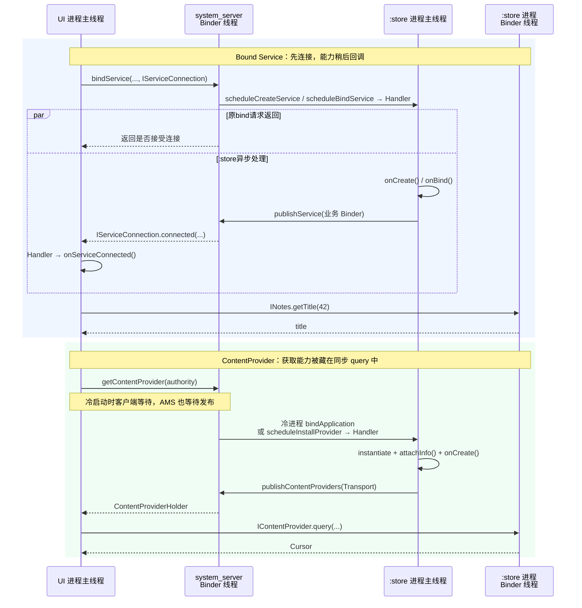

# 17 Service 与 ContentProvider：为什么都是组件，拿到远端能力的方式却不同

> 源码基线：Android 11 / API 30 / `android-11.0.0_r48`。本文在 macOS 上静态阅读源码，不要求编译或运行 AOSP。

假设一个 App 把笔记数据放在 `:store` 远程进程，默认进程中的页面要读取 42 号笔记。开发者既可以绑定一个 `NotesService`，也可以查询一个 `NotesProvider`。两条路最终都用 Binder，使用感受却完全不同：

- `bindService()` 返回 `true` 后，还要等 `onServiceConnected()` 才能调用业务接口；
- `ContentResolver.query()` 看起来只有一行，却可能在内部等待 Provider 进程启动和发布。

**一句话结论：Bound Service 的业务 Binder 由 `Service.onBind()` 交给 Framework，Framework 再通过异步连接回调把它送给客户端；ContentProvider 从创建时就带着 Framework 定义的 `Transport` Binder，`ContentResolver` 按 authority 同步取得并隐藏了发布等待。**

读完本章，你应该能够：

1. 解释两种组件为什么采用不同的“能力交付”方式；
2. 分清组件创建线程、业务调用线程和客户端等待线程；
3. 遇到“绑定成功却没有 Binder”或“第一次 query 卡住”时，知道该查哪一段源码；
4. 根据业务语义选择 Bound Service 或 ContentProvider，而不是因为“都能跨进程”就随便选。

本章只比较 **Bound Service** 与 **ContentProvider 的获取和首次业务调用**。`startService()`、前台 Service、Service 重启、Provider 引用计数和 OOM 调整都有独立价值，但不塞进这条主线。

## 1. 同一个读取需求，为什么写法完全不同

先固定唯一场景：UI 在 App 默认进程，数据组件在同一 App 的 `:store` 进程。两者 UID 相同，但 PID、虚拟机和堆内存不同，因此仍然是真正的跨进程调用。

Manifest 的关键配置可以简化为：

```xml
<service android:name=".NotesService"
    android:process=":store" android:exported="false" />
<provider android:name=".NotesProvider"
    android:authorities="com.example.notes"
    android:process=":store" android:exported="false" />
```

这里只展示决定进程和查找方式的字段。两种组件是设计方案的对照，不是建议在真实项目中把同一份能力重复实现两遍。

选择 Bound Service 时，客户端先建立连接：

```java
Intent intent = new Intent(this, NotesService.class);
bindService(intent, connection, Context.BIND_AUTO_CREATE);

public void onServiceConnected(ComponentName name, IBinder binder) {
    notes = INotes.Stub.asInterface(binder);
}
```

选择 ContentProvider 时，客户端直接按 URI 查询：

```java
Cursor c = getContentResolver().query(
        Uri.parse("content://com.example.notes/notes/42"),
        new String[] { "title" }, null, null, null);
```

两段代码只用来对比入口形状，省略了后续 AIDL 调用的 `RemoteException` 处理、工作线程调度和 Cursor 关闭。真正可能阻塞的跨进程读取不应直接堆在 UI 主线程。

这不是语法风格不同那么简单。它暴露了两种契约：

- Service 表达“我与一个组件建立连接，并取得它自定义的能力”；
- Provider 表达“我按统一的数据协议访问一个 authority 下的资源”。

`INotes` 由业务自己设计；`IContentProvider` 则由 Framework 预先定义。后面的获取方式正是由这个差别决定的。

## 2. 两条路共享同一副骨架，分歧发生在 Binder 怎样交付

客户端不能拿到远程进程中的 `NotesService` 或 `NotesProvider` Java 对象。它真正能拿到的是一个 Binder 引用；这个引用可以跨进程代表远端能力。

两条路的共同骨架是：

```text
客户端向 system_server 描述目标
→ system_server 解析组件、检查权限并按需启动 :store 进程
→ :store 主线程创建组件并发布 Binder
→ 客户端取得 Binder
→ 后续业务调用通常直接到 :store，不再每次绕 AMS
```

差别集中在中间两步：Service 要等开发者的 `onBind()` 返回自定义 Binder，再通过回调交付；Provider 的 Transport 由 Framework 随 Provider 对象创建，`ContentResolver` 可以把“取得 Transport”藏在一次同步数据调用里面。



图中省略了进程 attach、ServiceRecord、ContentProviderRecord 等管理对象，但没有省略决定理解的四个完成点：请求进入系统、组件创建、Binder 发布、业务调用返回。

Service 图中，`bindServiceLocked()` 先提交创建/绑定调度，再返回结果；调度发往不同 Binder 端点后，远端实际执行与原调用返回没有全局先后保证。不过本文由 UI 主线程调用三参数 `bindService()`，连接回调又投递到同一主线程，所以 `onServiceConnected()` 必须等这次同步 `bindService()` 解除主线程阻塞后才能真正执行。

## 3. Bound Service：`bindService()` 只登记连接，Binder 要等 `onBind()`

### 3.1 为什么使用异步连接回调

Service 的业务协议完全由开发者决定。Framework 在看到 Service 的 Manifest 信息时，并不知道它要提供 `INotes`、播放器控制还是设备通信接口。Service 可以提前把 Binder 存在字段里，但 **Framework 只有在 `Service.onBind()` 返回后才能取得这个 Binder**。

冷启动还可能包含进程创建、Application 创建和 Service 生命周期。`bindService()` 因而把“登记连接”与“能力可用”拆成两个完成点：方法返回布尔值，能力稍后通过 `ServiceConnection` 到达。

公开的三参数 `bindService()` 默认把主线程 Handler 交给 `bindServiceCommon()`：

```java
public boolean bindService(Intent service,
        ServiceConnection conn, int flags) {
    return bindServiceCommon(service, conn, flags, null,
            mMainThread.getHandler(), null, getUser());
}
```

源码：`frameworks/base/core/java/android/app/ContextImpl.java`

`bindServiceCommon()` 再把本地 `ServiceConnection` 包装成跨进程接口，并同步调用 AMS：

```java
IServiceConnection sd = mPackageInfo.getServiceDispatcher(
        conn, getOuterContext(), handler, flags);
int res = ActivityManager.getService().bindIsolatedService(
        mMainThread.getApplicationThread(), getActivityToken(),
        service, service.resolveTypeIfNeeded(getContentResolver()),
        sd, flags, instanceName,
        getOpPackageName(), user.getIdentifier());
return res != 0;
```

上面删去了参数检查和异常转换。关键事实是：AMS 收到的是 `IServiceConnection` Binder，不是客户端的普通 Java 回调对象；返回值只说明绑定请求是否被接受。

### 3.2 `BIND_AUTO_CREATE` 决定冷 Service 是否会被拉起

`ActiveServices.bindServiceLocked()` 建立连接记录后处理两种情况：

```java
if ((flags & Context.BIND_AUTO_CREATE) != 0) {
    bringUpServiceLocked(s, service.getFlags(), callerFg,
            false, permissionsReviewRequired);
}
if (s.app != null && b.intent.received) {
    c.conn.connected(s.name, b.intent.binder, false);
} else if (!b.intent.requested) {
    requestServiceBindingLocked(s, b.intent, callerFg, false);
}
```

源码：`frameworks/base/services/core/java/com/android/server/am/ActiveServices.java`

这几行说明：

- 带 `BIND_AUTO_CREATE` 时，目标未运行也会进入 `bringUpServiceLocked()`；
- Binder 已发布时可以直接通知新客户端；
- 尚未发布时，系统进入请求绑定的路径；如果进程还没 attach，这次请求暂时无法发送，等 `realStartServiceLocked()` 创建 Service 后才真正调用 `scheduleBindService()`。

因此，“调用了 bind”不等于“系统一定创建 Service”。本章示例明确带上 `BIND_AUTO_CREATE`，就是为了让冷启动路径成立。

### 3.3 Binder 在 `:store` 主线程产生，再经 AMS 转交

`IApplicationThread` 是 `oneway interface`。`scheduleBindService()` 到达目标进程后，不直接在 Binder 线程执行生命周期，而是发送 `H.BIND_SERVICE` 消息；`handleBindService()` 在主线程调用：

```java
if (!data.rebind) {
    IBinder binder = s.onBind(data.intent);
    ActivityManager.getService().publishService(
            data.token, data.intent, binder);
} else {
    s.onRebind(data.intent);
}
```

源码：`frameworks/base/core/java/android/app/ActivityThread.java`

AMS 收到 `publishService()` 后缓存 Binder，并把它发送给每条匹配连接：

```java
b.binder = service;
b.requested = true;
b.received = true;
// 省略遍历并筛选匹配 Intent 的 ConnectionRecord
c.conn.connected(r.name, service, false);
```

代码摘录保留了发布状态和最终通知，真实源码在两者之间使用按 Binder 分组的嵌套循环，位置是 `ActiveServices.publishServiceLocked()`。

`IServiceConnection` 本身也是 `oneway interface`。客户端的 `LoadedApk.ServiceDispatcher` 收到 `connected()` 后，再 `post` 到前面保存的 Handler，最终执行 `onServiceConnected()`。本章使用普通三参数 API，所以回调在客户端主线程；使用带 `Executor` 的重载时，则由该 Executor 决定回调线程。

本章还假设 `onBind()` 返回非空 Binder。若它返回 `null`，连接机制仍可能建立，但客户端收到的是 `onNullBinding()`，不是可以调用业务接口的 `onServiceConnected()`。

于是 Service 有四个不能混用的完成点：

| 完成点 | 此时能确认什么 | 还不能确认什么 |
|---|---|---|
| `bindService()` 返回 `true` | AMS 接受并记录了连接请求 | 客户端已经拿到业务 Binder |
| `Service.onBind()` 返回 | `:store` 主线程产生了 Binder | 客户端回调已经执行 |
| `onServiceConnected()` 执行 | 客户端已收到可用 Binder 引用 | 某次 `getTitle()` 已完成 |
| `INotes.getTitle()` 返回 | 这一次业务 Binder 事务完成 | Service 永远不会死亡 |

## 4. ContentProvider：Transport 由 Framework 准备，获取过程藏在 `query()` 里

### 4.1 为什么 Provider 不需要 `onBind()`

Provider 的公开协议不是每个组件自创，而是统一的 `query`、`insert`、`update`、`delete`、`call`、`openFile` 等操作。Framework 因而可以预先提供 Binder 入口 `ContentProvider.Transport`：

```java
private Transport mTransport = new Transport();

public IContentProvider getIContentProvider() {
    return mTransport;
}
```

源码：`frameworks/base/core/java/android/content/ContentProvider.java`

开发者实现的是 `ContentProvider.query()` 等方法，不需要像 Service 一样从 `onBind()` 返回一个 Binder。Transport 负责接收 `IContentProvider` 调用、处理调用身份和权限，再转给 Provider 实现。

客户端也不是用组件类名查它，而是由 `ContentResolver` 从 URI 中取出 authority。示例中的查找键是 `com.example.notes`，路径 `/notes/42` 留给 Provider 解释。

### 4.2 第一次 `query()` 先同步取得 Provider

Android 11 的 `ContentResolver.query()` 先取得一个 Provider 接口，再真正查询：

```java
IContentProvider unstableProvider = acquireUnstableProvider(uri);
if (unstableProvider == null) return null;
// 省略取消信号与 Provider 死亡后的重试分支
qCursor = unstableProvider.query(mPackageName, mAttributionTag,
        uri, projection, queryArgs, remoteCancellationSignal);
if (qCursor == null) return null;
qCursor.getCount();
final IContentProvider provider = (stableProvider != null)
        ? stableProvider : acquireProvider(uri);
final CursorWrapperInner wrapper =
        new CursorWrapperInner(qCursor, provider);
```

这是从真实控制流抽取的非连续关键行，不能直接复制编译；`finally` 中还会释放临时 unstable 引用。源码位于 `frameworks/base/core/java/android/content/ContentResolver.java`。

`ActivityThread.acquireProvider()` 会先查当前进程缓存；未命中才访问 AMS：

```java
IContentProvider provider = acquireExistingProvider(c, auth, userId, stable);
if (provider != null) return provider;

holder = ActivityManager.getService().getContentProvider(
        getApplicationThread(), c.getOpPackageName(), auth, userId, stable);
if (holder == null) return null;
holder = installProvider(c, holder, holder.info,
        true, holder.noReleaseNeeded, stable);
return holder.provider;
```

源码：`frameworks/base/core/java/android/app/ActivityThread.java`

这里的“同步”很直接：调用 `query()` 的线程要先拿到 `holder.provider`，否则无法执行下一行 `IContentProvider.query()`。如果 UI 主线程发起，等待也发生在 UI 主线程，Framework 不会自动把它变成后台任务。

### 4.3 冷启动时，AMS 会等待发布，而不是先返回空壳

缓存和 ProviderMap 都未命中时，`ActivityManagerService.getContentProviderImpl()` 会按 authority 解析 `ProviderInfo`，按需启动目标进程或调用 `scheduleInstallProvider()`，并建立 `ContentProviderRecord`。随后它退出 AMS 的全局监视器，改在单个记录上等待：

```java
synchronized (cpr) {
    while (cpr.provider == null) {
        if (cpr.launchingApp == null) return null;
        cpr.wait(wait);
        if (cpr.provider == null) {
            timedOut = true;
            break;
        }
    }
}
if (timedOut) return null;
return cpr.newHolder(conn);
```

源码：`frameworks/base/services/core/java/com/android/server/am/ActivityManagerService.java`

`wait()` 释放 `cpr` 监视器；更重要的是，这段等待已经离开外层 `synchronized (ActivityManagerService.this)`。否则 Provider 进程回来执行发布时也进不了 AMS，会形成“等发布的一方挡住发布者”的死锁。

这里要区分两个时钟：Android 11 r48 的 `CONTENT_PROVIDER_PUBLISH_TIMEOUT_MILLIS` 是 10 秒，用于进程 attach 后等待 Provider 发布的看门狗；`CONTENT_PROVIDER_READY_TIMEOUT_MILLIS` 是 20 秒，是 `getContentProviderImpl()` 这一侧等待发布的期限。20 秒不是整个 `query()` 的总耗时，也不是目标进程固定拥有的发布预算；Provider 提前发布或进程死亡，都可能让等待更早结束。这些值是本版防止无限等待的实现，不是 App 可依赖的跨版本合同，更不是允许主线程放心阻塞的预算。

### 4.4 `:store` 主线程安装并发布，等待者才继续

Provider 进程冷启动时，`ActivityThread.handleBindApplication()` 创建 Application 对象，然后在调用 `Application.onCreate()` 之前安装 Provider。进程已存在但 Provider 尚未安装时，`scheduleInstallProvider()` 同样发送 `H.INSTALL_PROVIDER`，由主线程处理。

安装的关键顺序是：

```java
localProvider = packageInfo.getAppFactory()
        .instantiateProvider(classLoader, info.name);
provider = localProvider.getIContentProvider();
localProvider.attachInfo(context, info);  // 内部调用 onCreate()
```

随后 `installContentProviders()` 调用 AMS 的 `publishContentProviders()`。发布端设置 Binder 并唤醒等待者：

```java
synchronized (dst) {
    dst.provider = src.provider;
    dst.setProcess(r);
    dst.notifyAll();
}
```

源码分别位于 `ActivityThread.java` 与 `ActivityManagerService.java`。

这说明 `ContentProvider.onCreate()` 在目标进程主线程执行，而远程 `query()` 到达 `Transport` 后通常在目标进程 Binder 线程池执行。还要注意：Provider 可能随进程启动被批量预装，并不保证“第一次 query 才触发 onCreate”；冷 query 只是可能触发安装的一种路径。

Provider 也有四个完成点：

| 完成点 | 此时能确认什么 | 还不能确认什么 |
|---|---|---|
| AMS 已请求启动/安装 | 系统正在准备 Provider | `onCreate()` 已结束 |
| `publishContentProviders()` 更新 `dst.provider` | Transport 已登记并唤醒等待者 | 客户端业务查询已返回 |
| ActivityThread 的 acquire 阶段返回 | 客户端已取得并缓存 IContentProvider | `query()` 已执行 |
| `ContentResolver.query()` 返回 | 初始远程查询和 Cursor 初始化已完成 | 调用方已遍历全部数据；后续 Cursor 访问也可能继续 IPC |

## 5. 把线程、同步方式和调用方向放在同一张表里

| 观察点 | Bound Service | ContentProvider |
|---|---|---|
| 客户端怎样定位 | 显式 Service Intent / ComponentName | URI 中的 authority |
| Binder 从哪里来 | 开发者的 `Service.onBind()` 返回 | Framework 创建的 `ContentProvider.Transport` |
| 客户端怎样拿到 | `ServiceConnection` 异步回调 | `ContentResolver` 内部同步 acquire |
| 组件初始化线程 | Service 所属进程主线程 | Provider 所属进程主线程 |
| 远程业务方法线程 | 自定义 Binder Stub 通常在 Binder 线程池 | Transport 的 query 等通常在 Binder 线程池 |
| system_server 的作用 | 解析、创建连接、拉起进程、转交业务 Binder | 解析 authority、拉起进程、等待发布、维护引用 |
| Binder 到手后的主路 | 客户端通常直达 Service 进程 | 客户端通常直达 Provider 进程 |

这里最容易犯的错误是把“组件运行进程”和“回调线程”绑定在一起：

- `Service.onBind()` 与 `ContentProvider.onCreate()` 在 `:store` 主线程；
- 远程 `INotes.getTitle()` 与 `Transport.query()` 通常在 `:store` Binder 线程；
- 普通三参数 `bindService()` 的 `onServiceConnected()` 默认回到客户端主线程；
- `ContentResolver.query()` 不切线程，谁调用谁等待。

所以 Service 和 Provider 都不是“自带后台线程”。它们的远程业务入口还可能被多条 Binder 线程并发调用，实现共享状态时必须自行保证线程安全。若代码主动投递到 Handler，那是实现者为串行化或线程亲和性做的选择，不是组件框架自动完成的。

还有一个必要边界：如果删除示例中的 `android:process=":store"`，服务端与客户端可能处于同一进程。此时 Binder 接口可能退化为本地对象调用，业务方法直接在调用线程执行；看到 AIDL 或 `IContentProvider` 名字，并不能单独证明发生了跨进程或切线程。

## 6. 真正的选型依据是业务语义，不是“谁也能传数据”

| 需求 | 更贴近的选择 | 原因 |
|---|---|---|
| 维持一段连接、暴露自定义命令、双向回调 | Bound Service | 连接生命周期和自定义 Binder 就是核心模型 |
| 以 URI 标识数据，提供查询/增删改、观察变化或 URI 授权 | ContentProvider | authority、标准数据协议和权限模型由 Framework 统一提供 |
| 只想把耗时工作扔到后台 | 两者都不是“线程方案” | 应先选择线程池、协程或任务调度机制，再决定是否需要组件生命周期 |

两者的代价也不同：

- Service 要自己设计 AIDL/协议版本、处理连接死亡，并接受“先 bind、后回调”的状态；
- Provider 要维护稳定的数据契约和并发安全，同步 Resolver API 还可能把冷启动延迟传给调用线程；
- 两者都不能靠频繁细粒度 IPC 获得本地方法一样的成本，接口设计应减少无意义的往返。

本章使用同一 App、同一 UID，是为了隔离“能力交付”这个问题。若改成两个 App，Manifest 的 `exported`、Service permission、Provider read/write/path permission 和 URI grant 都必须重新核对。Provider 的 Transport 会为标准数据操作执行 Framework 权限检查；自定义 Service Binder 若还要做方法级授权，必须根据真实 Binder 调用身份自行设计，不能只因为绑定入口通过就默认每个操作都安全。

## 7. 出现故障时，先判断卡在“找、建、发、调”哪一步

| 现象 | 先检查什么 | 不要急着下的结论 |
|---|---|---|
| `bindService()` 返回 `false` | Intent 是否解析到 Service、AMS 是否接受连接 | 不是 `onBind()` 返回 Binder 太慢 |
| 返回 `true`，一直没有 `onServiceConnected()` | 是否带 `BIND_AUTO_CREATE`；目标进程、`onCreate/onBind`、`publishService` 是否完成 | `true` 不代表 Binder 已到手 |
| 收到 `onNullBinding()` | `Service.onBind()` 是否返回了 null | 连接流程完成不等于一定存在业务 Binder |
| `onServiceConnected()` 已执行，业务调用卡住 | 自定义 Stub 的 Binder 线程、锁和主动线程切换 | 通常已越过 AMS 建连阶段 |
| `query()` 返回 `null` 或根本没进入 Provider | authority、user、Manifest 与获取 Provider 是否成功 | 零行 Cursor 是合法结果，不能当成“未进入 Provider” |
| 第一次 `query()` 长时间卡住 | `getContentProviderImpl`、进程 attach、Provider.onCreate、publish | 不要只盯数据库查询语句 |
| 已取得 Provider，仍卡在 `query()` | Transport 权限检查、Provider.query、数据库锁和 Binder 返回 | 不一定是 Provider 发布超时 |

可以把排查顺序压成四个动词：

```text
找：system_server 是否解析到目标？
建：目标进程和组件是否创建？
发：业务 Binder / Transport 是否发布给客户端？
调：拿到引用后的业务事务是否返回？
```

Bound Service 的“发”完成信号是 `onServiceConnected()`；Provider 的“发”被藏在 `acquireProvider()` 返回之中。先区分这个差异，日志才不会贴错位置。

## 8. 在 macOS 上完成一次只读源码验证

进入源码根目录：

```bash
cd /Users/ninebot/androidSource
```

第一步，验证 Service 的连接包装、创建条件与发布路线：

```bash
rg -n 'bindServiceCommon|getServiceDispatcher|bindServiceLocked' \
  frameworks/base/core/java/android/app/ContextImpl.java \
  frameworks/base/core/java/android/app/LoadedApk.java \
  frameworks/base/services/core/java/com/android/server/am/ActiveServices.java

rg -n 'scheduleBindService|handleBindService|publishServiceLocked' \
  frameworks/base/core/java/android/app/ActivityThread.java \
  frameworks/base/services/core/java/com/android/server/am/ActiveServices.java
```

预期串起：

```text
ContextImpl → IServiceConnection → AMS/ActiveServices
→ scheduleBindService → 主线程 onBind → publishService
→ IServiceConnection.connected → ServiceDispatcher → onServiceConnected
```

第二步，验证 Provider 的获取、安装与发布等待：

```bash
rg -n 'acquireUnstableProvider|acquireProvider\(' \
  frameworks/base/core/java/android/content/ContentResolver.java \
  frameworks/base/core/java/android/app/ActivityThread.java

rg -n 'getContentProviderImpl|publishContentProviders|notifyAll' \
  frameworks/base/services/core/java/com/android/server/am/ActivityManagerService.java

rg -n 'installContentProviders|installProvider|class Transport' \
  frameworks/base/core/java/android/app/ActivityThread.java \
  frameworks/base/core/java/android/content/ContentProvider.java
```

预期找到：缓存未命中后同步调用 AMS；AMS 在 `cpr` 上等待；Provider 主线程通过 `attachInfo()` 调用 `onCreate()`；发布端设置 `dst.provider` 并 `notifyAll()`。

第三步，验证哪些调度接口是 oneway：

```bash
sed -n '55,100p' \
  frameworks/base/core/java/android/app/IApplicationThread.aidl
sed -n '18,35p' \
  frameworks/base/core/java/android/app/IServiceConnection.aidl
sed -n '145,180p' \
  frameworks/base/core/java/android/app/IActivityManager.aidl
```

应该看到 `IApplicationThread` 和 `IServiceConnection` 是 `oneway interface`；而 `IActivityManager.getContentProvider()` 返回 Holder、`bindService()` 返回 `int`，属于同步 Binder 方法。oneway 只说明发送方不等这次事务的回复，不表示目标回调自动运行在主线程；切到组件主线程依靠 `ActivityThread.H`，切到客户端回调线程依靠 `ServiceDispatcher` 的 Handler/Executor。

建议把结果记成四列：

```text
事件 | 进程 | 线程 | 这个完成点能证明什么
```

只要能分别填出 `onBind`、`onServiceConnected`、`Provider.onCreate` 和 `Transport.query`，本章的线程模型就建立起来了。

## 9. 检查题、答案与可立即使用的结论

### 检查题

1. `bindService()` 返回 `true`，为什么还不能立即调用 `INotes`？
2. 为什么冷 Provider 可以让一次 `query()` 同步等待，而 Bound Service 用回调交付 Binder？
3. `Service.onBind()` 与远程 `INotes.getTitle()` 分别运行在哪类线程？
4. `ContentProvider.onCreate()` 与远程 `query()` 分别运行在哪类线程？
5. Binder 发布后，每次业务调用还会先经过 AMS 吗？
6. 为什么 `BIND_AUTO_CREATE` 是本章 Service 冷启动场景的必要条件？
7. 如果两个组件改回与 UI 同进程，哪些线程结论需要重新判断？

### 答案

1. `true` 只表示 AMS 接受并记录绑定；自定义 Binder 要等目标主线程执行 `onBind()`、发布给 AMS，再由 `onServiceConnected()` 送到客户端。
2. Provider 的接口和 Transport 由 Framework 预先定义，Resolver 可以把同步 acquire 当作数据操作的内部步骤；Service 的 Binder 类型和产生时机由 `onBind()` 决定，API 用连接回调表达这段生命周期。
3. `onBind()` 在 Service 进程主线程；远程 AIDL Stub 方法通常在该进程 Binder 线程池，除非实现再主动切线程。
4. `onCreate()` 在 Provider 进程主线程；远程调用进入 Transport 后通常在 Binder 线程池。
5. 通常不会。AMS 负责发现、启动、发布和引用关系；客户端取得 Binder 后，业务事务通常直接到目标进程。
6. 没有它的 binding 不负责把尚未运行的 Service 创建起来，因此不能据此期待随后一定出现 `onBind()` 和连接回调。
7. 业务 Binder 可能成为本地对象调用，直接运行在调用线程，不能再断言必经远端 Binder 线程池。Service 生命周期仍由主线程调度；普通随应用启动安装的 Provider 也在主线程创建，但特殊的本地安装路径仍应沿 `installProvider()` 的实际调用线程重新判断。

读完后最值得立刻使用的做法是：**先标出“找、建、发、调”四个完成点，再看日志停在哪一格。Service 等 `onServiceConnected()` 才算拿到能力；Provider 则要把 `query()` 中隐藏的 acquire 与真正的数据调用拆开观察。**
