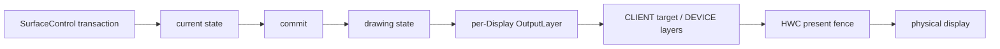
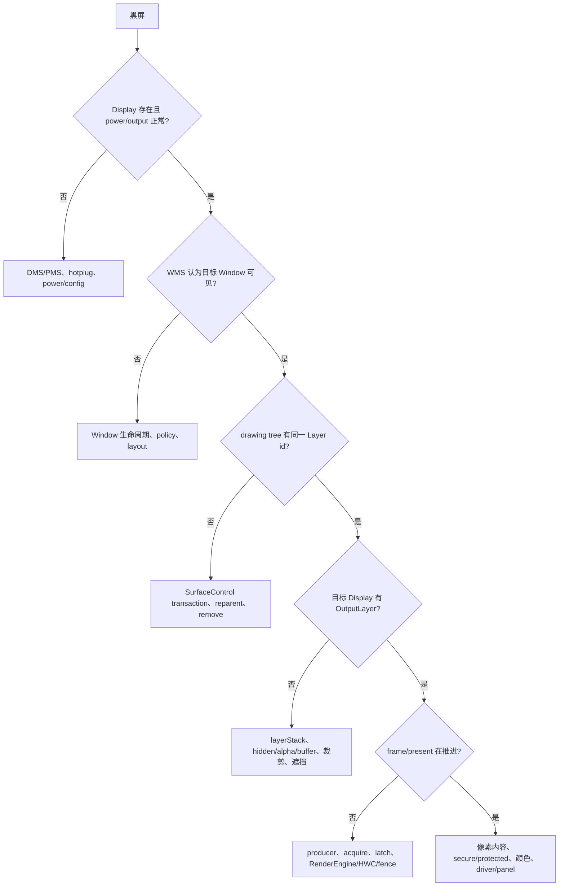

# 170 Android SurfaceFlinger dump、Layer Proto 与显示故障现场

> 源码版本：Android 11 / API 30 / `android-11.0.0_r48`  
> 学习方式：macOS 静态只读源码，不要求编译或连接设备  
> 前置章节：第 160—169 章

---

## 1. 一份 SurfaceFlinger dump 能证明什么

黑屏、旧帧、闪烁、局部不刷新或触摸错位时，常见入口是：

```bash
adb shell dumpsys SurfaceFlinger
```

它不是面板硬件在某个原子时刻的回读，而是 SurfaceFlinger 依次拼接的多组软件状态。正确用法不是搜索窗口名后立即定因，而是先问：

```text
现象发生在哪个边界？
→ WMS 是否仍认为窗口可见
→ SF current/drawing tree 是否存在 Layer
→ 目标 Display 是否生成 OutputLayer
→ buffer 是否 latch、合成是否推进
→ HWC/present 是否有动态证据
→ InputDispatcher 是否使用同一套几何
```

静态 dump 最擅长回答“采样时软件对象处于什么状态”；它不能单独证明：

- 某字段与另一段输出来自同一 VSync；
- 当前 active buffer 的像素内容正确；
- present fence 已 signal；
- 面板正在扫描这块 buffer；
- 瞬时闪烁由哪个状态切换造成。

本章的主线是：先识别每段数据的生产者和时间边界，再把 Layer 树、每显示输出、buffer 与时序证据拼成可证伪的诊断链。

---

## 2. 四层状态不能混成一张“当前画面”

SF dump 会同时暴露四个层次：

| 层次 | 代表什么 | 典型入口 |
|---|---|---|
| current | 客户端事务已进入 SF 的当前状态 | `--list`、`--frame-events`、部分 mini dump 遍历 |
| drawing | 已提交给 Layer 树计算与合成遍历的状态 | Layer Proto |
| composition/output | 某个 Display 上次构建出的 OutputLayer、遮挡、几何与合成分工 | CompositionEngine、HWC layer mini dump |
| physical completion | HWC present、fence signal、面板扫描的动态结果 | 时间戳、trace、vendor/driver 证据 |

大致关系是：



`commitTransactionLocked()` 会把 SF 全局的 `mCurrentState` 赋给 `mDrawingState`；各 Layer 也管理自己的 current、pending 与 drawing state。随后几何计算会生成 `mEffectiveTransform`、`mBounds`、`mScreenBounds` 等有效值，CompositionEngine 再按 Display 计算输出状态。

因此，同名字段也可能不在同一层次：

- requested transform 是 Layer drawing state 中的局部请求；
- Proto 的 transform 来自 `getTransform()`，是已计算并包含父变换的 effective transform；
- HWC displayFrame/sourceCrop 是目标 Display 的输出几何。

requested 与 effective 不同不必然代表“事务卡住”，也可能只是父层变换、裁剪或 buffer 缩放正常生效。

---

## 3. 源码地图

dump 入口与拼接：

```text
frameworks/native/services/
├── utils/
│   ├── PriorityDumper.cpp
│   └── include/serviceutils/PriorityDumper.h
└── surfaceflinger/
    ├── main_surfaceflinger.cpp
    ├── SurfaceFlinger.h
    └── SurfaceFlinger.cpp
```

Layer Proto 与文本转换：

```text
frameworks/native/services/surfaceflinger/
├── Layer.cpp
├── Layer.h
└── layerproto/
    ├── layers.proto
    ├── LayerProtoParser.cpp
    └── include/layerproto/LayerProtoParser.h
```

每显示输出：

```text
frameworks/native/services/surfaceflinger/
├── DisplayDevice.cpp
├── BufferLayer.cpp
├── BufferQueueLayer.cpp
├── BufferStateLayer.cpp
├── CompositionEngine/src/Output.cpp
├── CompositionEngine/src/OutputLayer.cpp
├── CompositionEngine/src/RenderSurface.cpp
└── DisplayHardware/HWComposer.cpp
```

交叉证据：

```text
frameworks/base/services/core/java/com/android/server/wm/WindowManagerService.java
frameworks/native/services/inputflinger/dispatcher/InputDispatcher.cpp
frameworks/native/services/surfaceflinger/FrameTracker.cpp
frameworks/native/libs/gui/FrameTimestamps.cpp
```

---

## 4. dump 入口有权限、参数、锁和输出四道边界

SurfaceFlinger 注册服务时声明：

```cpp
DUMP_FLAG_PRIORITY_CRITICAL | DUMP_FLAG_PROTO
```

Binder dump 先经过 `PriorityDumper`，它从参数中剥离 `--dump-priority` 与 `--proto`，再调用对应虚函数。SF 重写了 `dumpCritical()` 和 `dumpAll()`，没有重写 HIGH/NORMAL。

### 4.1 priority 行为有一个反直觉点

未指定 priority 时，SF 自己的 `dumpAll()` 直接进入 `doDump()`，原有子命令仍可分流。显式指定：

```text
--dump-priority CRITICAL
```

则进入 `dumpCritical()`。r48 的实现忽略传入的剩余参数，以空参数调用 `doDump()`；HIGH/NORMAL 则落到基类空实现。因此 priority 名字不能推导出“同一完整 dump 被稳定切成三个区块”。

若 critical proto dump 发生时 SurfaceTracing 已开启，`dumpCritical()` 还会先调用 `writeToFileAsync()`。这是异步写 trace 文件的副作用，不能把所有 dump 入口都视为严格无状态读取。

### 4.2 权限失败仍返回 NO_ERROR

`doDump()` 只允许 shell UID 或持有 `android.permission.DUMP` 的调用者。拒绝时，它把 Permission Denial 文本写入结果，最后仍走统一的：

```cpp
write(fd, result.c_str(), result.size());
return NO_ERROR;
```

所以命令退出成功不等于拿到了 Layer 现场；必须检查内容。

### 4.3 mStateLock 只等一秒，但超时不终止读取

核心结构是：

```cpp
TimedLock lock(mStateLock, s2ns(1), __FUNCTION__);
if (!lock.locked()) {
    // append warning
}
// 仍继续调用子 dumper 或 dumpAllLocked()
```

出现 `Dumping without lock after timeout` 后，后续容器可能被并发修改。这是为了卡死时尽量留下应急信息，不是一个“无锁也自洽”的保证。

### 4.4 最后一次 write 也不是可靠交付协议

结果最终只调用一次 `write()`，既不循环处理 partial write/EINTR，也不检查返回值，随后固定返回 `NO_ERROR`。极大输出被截断或 fd 写失败时，Binder status 不能可靠反映问题。

---

## 5. 普通文本 dump 是三个阶段的拼接

未命中特殊子命令时，普通文本路径大致为：

```cpp
{
    TimedLock lock(mStateLock, 1s);
    dumpAllLocked(args, result);
} // 这里释放 state lock

LayersProto p = dumpProtoFromMainThread();
result += LayerProtoParser::layerTreeToString(generateLayerTree(p));
result += dumpOffscreenLayersOnMainThread();
```

三个阶段分别是：

1. Binder 线程持有或尝试持有 `mStateLock`，输出全局、Display、CompositionEngine、HWC 等状态；
2. 通过 `schedule(...).get()` 等待 SF 主线程生成 drawing-state Layer Proto，再在调用线程转成文本；
3. 再次等待主线程遍历 offscreen layers。

两次主线程任务之间，树仍可能 reparent、移除或销毁。主线程若卡在事务、RenderEngine、HWC 或锁依赖上，`get()` 没有这里可见的超时，dumpsys 也可能迟迟不返回。

### 5.1 dumpAllLocked 的大区块

第一阶段依次包含：

```text
build/UI/GUI configuration
display identification / wide color
scheduler / VSync / refresh-rate policy
static-screen 与 missed-frame 累计
buffering stats
Composition layers
DisplayDevice 与 CompositionEngine
SurfaceFlinger / RenderEngine / tracing state
per-display HWC layer mini dump
vendor HWComposer dump
gralloc 与 TimeStats mini dump
```

随后才追加 Layer tree 和 offscreen 名单。读者应给每段加上“current、drawing、output、vendor”标签，不能把前后同名 Layer 行当成同一时刻的重复打印。

### 5.2 r48 的混合实例

| 输出 | 实际遍历/数据 |
|---|---|
| `--list` | `mCurrentState.traverseInZOrder()` |
| `--frame-events` | `mCurrentState.layersSortedByZ` |
| Composition layers | `mDrawingState` + Layer composition snapshot |
| Layer Proto | 主线程上的 `mDrawingState` |
| HWC mini dump | current tree 遍历 + 已有 per-Display OutputLayer |

最后一项尤其容易误读：刚进入 current tree、尚未产生 OutputLayer 的 Layer 会被 `miniDump()` 直接跳过；反过来，已不在 current 遍历中的对象也不会出现在该表，即使其他段仍能看到更早的 output 状态。

---

## 6. 子命令回答的是不同问题

`doDump()` 的 r48 分发表包括：

| 参数 | 主要用途 | 关键边界 |
|---|---|---|
| `--display-id` | physical/HWC id、port、EDID 名称 | 无/未知/无效 EDID 会打印对应状态 |
| `--edid <hwcId>` | 原始识别数据 | 输出可能是二进制 |
| `--dispsync` | primary DispSync | 不是 Layer 数据 |
| `--vsync` | Scheduler、phase、policy、refresh rate | 是调度状态快照 |
| `--frame-events` | current Layer 的 FrameEventHistory | 近帧时序，不是树几何 |
| `--latency [exactName]` | animation 或精确名称 Layer 的 FrameTracker | 名字可重复，只有 127 个历史槽输出 |
| `--latency-clear [exactName]` | 清 FrameTracker | 会破坏统计现场 |
| `--list` | current tree 的 debug name | 名称不是唯一身份 |
| `--static-screen` | 静态屏幕累计分桶 | 不是当前帧 |
| `--timestats ...` | TimeStats 参数解析/输出 | 可能有自身控制参数 |
| `--wide-color` | 色彩能力与当前 mode | 不证明像素已显示 |

只取证时尤其要避开 `--latency-clear`。它会清匹配 Layer 的 FrameTracker，并总是清 animation tracker；“先清、复现场景、再读”只适合受控实验。

---

## 7. Layer Proto 是 drawing tree 的结构化快照

默认 `dumpProtoFromMainThread()` 使用 `TRACE_ALL`。主线程取得默认 Display 后，`dumpDrawingStateProto()` 遍历 `mDrawingState.layersSortedByZ`，每个根 Layer 再递归 `mDrawingChildren`。

`Layer::writeToProto()` 按 flag 分组写入：

| flag | 主要字段 |
|---|---|
| `TRACE_CRITICAL` | id/name/type、树关系、buffer、frame、几何、颜色、damage、barrier |
| `TRACE_INPUT` | InputWindowInfo |
| `TRACE_COMPOSITION` | visible region、HWC composition type |
| `TRACE_EXTRA` | metadata |

### 7.1 三种 Layer 标识各有用途

- `id/sequence`：对象生命周期内的内部身份，parent、child、relative-Z、barrier 都用它关联；SF 重启或新建对象后不能假定跨现场稳定。
- `name`：适合人工搜索，但可以重复，也可能带 ViewRoot、SurfaceView 或 BLAST 包装名。
- `type`：说明 BufferQueueLayer、BufferStateLayer、ColorLayer、ContainerLayer 等行为预期，不能替代身份。

实际分析应“用 name 找候选、用 id 和树关系确认对象、用 type 判断字段是否应存在”。

### 7.2 parent 与 relative-Z 是两张关系网

`parent/children` 决定组织、生命周期和变换/隐藏继承；`z_order_relative_of/relatives` 让 z 相对另一 Layer 解释。只比较整数 z 无法重建全局顺序。

文本转换器会把 relative layers 与非 relative children 合并排序，先打印负 z，再打印本层，再打印非负 z。它输出的是重建后的树序，不是 Proto 数组的原始顺序。

### 7.3 Proto 的 composition type 只有默认 Display 视角

writer 在 `TRACE_COMPOSITION` 下调用：

```cpp
getCompositionType(*defaultDisplay)
```

找不到该 Display 的 OutputLayer 时返回 INVALID；存在 HWC state 时取对应 type，否则按 CLIENT。多显示场景不能拿这一个字段代表所有输出，应分别读取每个 Display 的 mini dump/OutputLayer。

---

## 8. Proto schema、writer 和文本 parser 是三个不同口径

不要看到 `layers.proto` 有字段就假定普通文本一定能看到。需要依次确认：

```text
schema 声明
→ r48 writer 是否写入
→ LayerProtoParser 是否读取
→ Layer::to_string() 是否打印
```

### 8.1 id 被 parser 保留，但没有打印

`generateLayer()` 确实读取 `layerProto.id()`，并用它修复 child、parent 与 relative 指针，也作为排序兜底。普通 Layer tree 文本不打印 id。

因此准确说法是“文本输出丢失可见 id”，不是“parser 完全丢弃 id”。

### 8.2 一批字段根本没有进入文本模型

writer 实际写入但 `generateLayer()` 不读取的关键字段包括：

```text
curr_frame
hwc_composition_type
source_bounds / bounds / screen_bounds
input_window_info
effective_scaling_mode
color_transform
barrier_layer
```

requested position/color/transform 则被 parser 保存，却没有在 `to_string()` 打印。另一方面，schema 中的 `hwc_frame`、`hwc_crop`、`hwc_transform`、`effective_transform` 在当前 Layer writer 没有对应写入点。

这解释了为什么“schema 有”“Proto 实际带有”“普通文本看得见”不能画等号。

### 8.3 Region 的 this 值是 r48 的未初始化残留

`RegionProto` 的旧 field 1 已 reserved，只剩 rect 列表；但文本 parser 的 `Region` 类仍有未默认初始化的 `uint64_t id`。`generateRegion()` 只填 rects，`to_string()` 却把 id 打成：

```text
Region VisibleRegion (this=... count=N)
```

这个 `this` 不是 Layer id、稳定 Region id 或可信指针。应忽略它，只使用 count 和后续矩形。

### 8.4 --proto 不含 offscreen tree

普通无子命令的 proto 路径只序列化 `dumpDrawingStateProto()`。虽然代码另有 `dumpOffscreenLayersProto()`，这里没有调用。文本模式会追加 offscreen Layer 的 name/type/pid/uid，但不是完整几何 Proto。

若目标是 Layer 泄漏或 reparent 竞态，应同时保留文本 offscreen 名单与时序 trace，不能只存一个 `--proto` 文件。

---

## 9. Layer 在树里，不代表它属于目标 Display

CompositionEngine 先调用 `belongsInOutput()`。r48 的条件是：

```cpp
layerStackId 有值
&& layerStackId == output.layerStackId
&& (!internalOnly || output.layerStackInternal)
```

所以多显示诊断的第一组等式是：

```text
Layer.layerStack
==
目标 Composition Output.layerStackId
```

不匹配时，该 Layer 不会在目标输出上形成 OutputLayer；继续讨论该 Display 的 CLIENT/DEVICE 已没有意义。

### 9.1 基本可见门和输出可见门

对 BufferLayer，`isVisible()` 的基本条件是：

```cpp
!isHiddenByPolicy()
&& getAlpha() > 0
&& (active buffer != nullptr || sideband stream != nullptr)
```

`isHiddenByPolicy()` 还会沿 drawing parent 递归；使用 relative-Z 时，也检查 relative target 是否 hidden。

通过基本门后，`Output::ensureOutputLayerIfVisible()` 还要：

1. 确认 output membership 与 composition snapshot；
2. 计算 effective transform 后的几何足迹；
3. 扣除上方 opaque region；
4. 处理 transparent hint 与 shadow；
5. 经 output transform 与 bounds 检查非透明绘制区是否为空。

任一步失败都可能没有 OutputLayer。因此：

```text
drawing tree 无 Layer
→ 事务、reparent、移除或生命周期

tree 有 Layer，但目标 Display 无 OutputLayer
→ layerStack、hidden/alpha/buffer、几何、裁剪或遮挡

OutputLayer 存在，画面仍异常
→ buffer 内容、CLIENT/DEVICE 合成、HWC、present 或显示设备
```

### 9.2 “Visible layers count”并不计可见层

完整 dump 的：

```text
Visible layers (count = N)
```

实际打印 `mNumLayers`。它在 `onLayerFirstRef()` 增加、`onLayerDestroyed()` 减少，计数的是活着的 Layer 对象。hidden、alpha=0、无 buffer、offscreen、错误 layerStack 或完全被遮挡的对象仍可能计入。

这个数字适合观察 Layer 数量异常增长，不适合回答屏幕最终合成了几层。

---

## 10. buffer 字段记录“SF 拿到了什么”，不是“面板显示了什么”

Proto 的 `active_buffer` 只包含：

```text
width / height / stride / format
```

它能证明 writer 采样时 Layer 的 `getBuffer()` 非空，以及 buffer 的基础几何/格式。它不能证明：

- 像素不是黑色、旧内容或错误内容；
- acquire fence 已 signal；
- 本轮 Output 使用了这块 buffer；
- HWC present 已完成；
- 面板正在扫描它。

这里还要区分原始 Proto 的 message presence 与普通文本：writer 只在 buffer 非空时创建 `active_buffer` 子消息；文本 parser 对缺失子消息也会生成一组默认零值并照常打印。因此只有原始 Proto 能可靠区分“消息不存在”和“字段全为 0”。

ColorLayer/ContainerLayer 等本来就不应按“必须有 active buffer”的标准判断，所以始终要先核对 `type`。

### 10.1 queued_frames 主要是传统 BufferQueueLayer 信号

Proto 调用虚函数 `getQueuedFrameCount()`。基类返回 0，r48 只有 `BufferQueueLayer` 覆盖它并返回 `mQueuedFrames`。因此：

- BufferQueueLayer 上大于 0：consumer 侧还有排队帧；
- 等于 0：只说明这个实现此刻没有暴露排队计数；
- BufferStateLayer/BLAST 上的 0：不能证明事务侧不存在等待中的 buffer。

即使传统队列大于 0，下一帧也可能因 desired present time、acquire fence 或同步条件而不能立即 latch。

### 10.2 refresh_pending 是 latch 到 pre-composition 之间的瞬态

writer 把 `isBufferLatched()` 写入 `refresh_pending`。BufferLayer 在成功 latch 后把 `mRefreshPending` 置 true，`onPreComposition()` 写入 first refresh 信息后又清 false。

它表示“有新 buffer 已 latch，尚待这一轮 pre-composition 处理”的窄窗口，不等于：

- 队列非空；
- present fence pending；
- 显示请求永远卡住。

静态 dump 恰好看到 false 很正常；必须靠连续快照或 trace 判断它是否长期不推进。

### 10.3 curr_frame 是旧帧问题的重要 Proto 字段

writer 把 `mCurrentFrameNumber` 写入 `curr_frame`，但文本 parser 不读取它。要判断：

```text
应用持续 queue
但 SF 是否一直持有旧 frame
```

应保留原始 Proto，或改用 FrameEventHistory/trace。单次 frame number 也只是一张快照；“卡住”至少需要两个时间点或一段时序证据。

---

## 11. 几何和 Region 要按坐标系与生成阶段阅读

一帧内容大致经过：

```text
buffer 像素
→ buffer transform / source crop
→ Layer 本地 bounds 与 crop
→ parent + Layer effective transform
→ screen bounds
→ Output viewport/transform
→ HWC sourceCrop + displayFrame
```

Proto 同时有 requested position/transform、effective position/transform、source/bounds/screen bounds；HWC mini dump又有 per-Display sourceCrop/displayFrame。诊断旋转、缩放、letterbox 或触摸偏移时，不能拿不同坐标系的四个整数直接相减。

### 11.1 requested 与 effective 不同不等于 pending

writer 的 requested transform 来自 drawing state 的本地 `active_legacy.transform`；实际 transform 来自 `mEffectiveTransform`，它由 parent transform 与本层 active transform 相乘。actual color 的 alpha 也会乘 parent alpha。

所以 requested/actual 差异首先提示“存在继承或有效化计算”，而不是自动证明 barrier、resize 或事务未提交。要判断不收敛，应再看：

- parent 链；
- bounds/screen bounds；
- pending barrier；
- 前后快照；
- transaction trace。

### 11.2 visible、covered 与 opaque 回答不同问题

CompositionEngine 从前向后维护覆盖：

| Region | 含义 |
|---|---|
| visible | 本层足迹扣掉上方 opaque 区；上方半透明层不会把它完全扣除 |
| covered | 本层足迹与所有上方可见区相交，半透明覆盖也计入 |
| opaque | 该层可安全视为完全不透明、可遮掉下层的部分 |

因此 `covered != invisible`。下层可同时仍在 visibleRegion 中，又有一部分 covered。

### 11.3 damage 是合成输入，不是面板局部刷新回读

Layer 的 surface damage 还要和以下因素合并：

- `contentDirty`；
- 新旧 visible/covered region；
- 新暴露区域；
- 上方 opaque 扣除；
- Output dirty region 与 viewport；
- CLIENT/DEVICE 分工；
- HWC/driver 的更新策略。

当 `contentDirty` 为 true，Output 把新旧 visible region 都并入 dirty；否则根据 exposed/covered 的几何变化计算。因此“应用没有画新像素，但窗口移动后需要重绘”是正常路径。

Proto 中的 `damage_region` 只是中间证据。它为空不能单独把局部不刷新归因给 App，它非空也不能证明面板收到等价的 partial-update 区域。

---

## 12. Display、OutputLayer 与 HWC 描述最后的软件合成输入

`DisplayDevice::dump()` 先给出 powerMode、activeConfig，再委托 Composition Output 输出 enabled/secure、layerStack、transform、bounds/viewport、颜色配置、RenderSurface 与 OutputLayer。

黑屏时先检查出口，再检查单层：

```text
Display 是否存在、是否目标 physical display
→ powerMode 是否符合 ON/DOZE 预期
→ Output 是否 enabled
→ layerStack/viewport/bounds 是否合理
→ 目标 Layer 是否有 OutputLayer
→ composition type、sourceCrop/displayFrame 是否合理
```

### 12.1 HWC mini dump 是 per-Display 几何摘要

`Layer::miniDump()` 在目标 Display 上找不到 OutputLayer 就不打印。成功时主要给出：

```text
name / z
window type
composition type
buffer transform
display frame
source crop
explicit frame rate / focused
```

`sourceCrop` 表示从 Layer/buffer 哪块取样，`displayFrame` 表示放到该显示的哪块。它们比 Layer 本地 position/size 更接近 HWC 输入，但仍不是面板回读。

### 12.2 CLIENT 与 DEVICE 是职责，不是成功/快慢标签

| type | 含义 |
|---|---|
| CLIENT | RenderEngine 先把该层画进 client target |
| DEVICE | HWC 用 overlay 等设备路径合成 |
| SOLID_COLOR | 设备颜色层 |
| CURSOR | 可异步定位的 cursor 类路径 |
| SIDEBAND | sideband stream |

多个 CLIENT Layer 通常合成到同一 client target，再与 DEVICE Layer 一起交给 HWC。不能把 DEVICE 等同“整屏不用 GPU”，也不能把 CLIENT 等同“每层有独立 GPU target”。

### 12.3 vendor HWC dump 没有稳定文本 schema

`HWComposer::dump()` 追加 Composer HAL 返回的 debug string。不同厂商、SoC 和 OTA 的字段与完整度都可能不同，脚本不应依赖固定行号。它适合作为 vendor-specific 旁证，不是 AOSP 统一协议。

### 12.4 flips 与 missed counters 都是提示，不是完成证明

RenderSurface 的 `mPageFlipCount` 在 SF 输出流程的 `flip()` 中增加，不是面板硬件 scanout 计数。Total/HWC/GPU missed frame count 又是进程生命周期内累计，缺少 Layer 身份和发生时间。

两次现场中 flips 不变可能提示输出未推进；missed 快速增长可能提示合成压力。但 flips 变化不能证明像素正确，missed 增长也不能单独给当前黑屏定因。

---

## 13. 静态树必须和近帧时间证据配合

Layer tree 回答“对象与几何是什么”，不能回答“刚才是否连续推进”。r48 还提供三类相邻证据。

### 13.1 --latency 是 legacy FrameTracker

输出第一行是当前 HWC VSync period，之后每行三列：

```text
desiredPresentTime
actualPresentTime
frameReadyTime
```

无 Layer 名时读取 animation tracker；带名字时在 current tree 做 `getName() == name` 精确匹配。名字并不唯一，多个同名 Layer 会依次追加数据，不能把参数形式误认为唯一选择器。

FrameTracker ring 有 128 槽，但 `dumpStats()` 从当前 offset 的下一项循环 127 次；值可能为 0 或 `INT64_MAX`。它们是空/未完成 sentinel，不应参与普通纳秒差值。

### 13.2 --frame-events 会先刷新 fence 状态

该子命令遍历 current Layer，对每层持 history mutex，调用：

```cpp
checkFencesForCompletion();
FrameEventHistory::dump();
```

它把第 169 章的 posted/requested、acquire、latch、refresh、GPU composite、display present、dequeue ready 与 release 放到近帧时间线上。它仍受短 ring、current tree 选择与 fence 完成时机约束。

结合方式是：

```text
Layer tree：对象、层级、几何和 active buffer
Frame events：buffer 经过哪些异步节点
FrameTracer/SurfaceTracing：状态如何随时间变化
TimeStats/missed：一段时间内的聚合倾向
```

### 13.3 闪烁优先使用 trace

闪烁通常是状态交替：

```text
Layer A/B 出现与消失
alpha 1/0
parent/z/crop 中间态
buffer 空/非空
CLIENT/DEVICE 切换
连续 present 中的新旧帧交替
```

一份 dump 只会随机命中某一态。两次人工快照能证明“有变化”，但难以确定变化顺序；SurfaceTracing、FrameTracer 和 Perfetto 才适合建立时序。

---

## 14. 四类故障怎样组合证据

### 14.1 黑屏：从显示出口向 Layer 逐层收缩



每个分叉都要写反证。例如“Display OFF”的支持证据是 powerMode；若 Output enabled 且 present timestamp 持续推进，就需要重新检查是否找错 Display 或证据时间不一致。

### 14.2 旧帧/画面卡住：比较推进点

依次比较两个时间点：

1. App/RenderThread 是否继续 queue；
2. Proto `curr_frame` 是否增加；
3. 对传统 BufferQueueLayer，`queued_frames` 是否堆积；
4. acquire 是否长期 PENDING；
5. latch/first refresh 是否增加；
6. display present 是否增加；
7. RenderSurface/HWC 是否继续推进。

`curr_frame` 增加但 present 不进，把范围缩到合成/HWC/fence；present 也进但肉眼仍旧，则要复核 Layer 身份、Display 路由、像素本身与驱动/面板。任何单点都不是完整因果。

### 14.3 局部不刷新：沿 damage 到 output

```text
View/RenderNode 是否产生目标区域更新
→ buffer surface damage 是否合理
→ SF 是否 latch 新 frame
→ contentDirty、visible/covered 变化如何形成 Output dirty
→ 该区域走 CLIENT 还是 DEVICE
→ client target/HWC/present/driver 是否推进
```

这条链能避免把 Layer 的一个空 damageRegion 直接判成 App 错误，也避免看到非空 damage 就假定面板一定执行了局部刷新。

### 14.4 触摸错位：比较视觉几何和实际输入窗口

| 系统 | 核对内容 |
|---|---|
| WMS | Window frame、insets、rotation、surfaceInsets、compat scale |
| Layer Proto | parent、requested/effective transform、screen bounds、crop |
| Composition Output | display transform、viewport、sourceCrop/displayFrame |
| InputWindowInfo | frame、touchable region、scale、crop layer |
| InputDispatcher | focused display/window、窗口顺序、当前 touch target |

普通 Layer tree 文本不打印 `input_window_info`；应保留 Proto，并读取 `dumpsys input` 中 InputDispatcher 真正使用的窗口列表。

r48 还有一个兼容语义：有 InputInfo 的 Layer 用 `canReceiveInput()` 设置 input visible，它只检查 policy hidden，不要求已经提交 buffer。于是“可接收输入”和“已有像素可见”本来就可能短暂分离。

### 14.5 WMS 与 SF 不是互相替代

WMS 主要回答 Window/Activity、token、focus、policy visibility、layout/insets；SF 主要回答 SurfaceControl Layer、active buffer、per-Display OutputLayer 与合成。典型边界是：

```text
WMS 已 visible，SF drawing tree 无 Layer
→ 优先查 SurfaceControl transaction / 生命周期交界

WMS 自己认为 hidden
→ 先查 Window policy/lifecycle，不先归因 HWC
```

---

## 15. 静态源码练习与现场记录模板

以下练习只读取 `android-11.0.0_r48` 工作树。

1. 验证 priority 参数怎样剥离，以及 SF 哪些方法真正 override：

   ```bash
   sed -n '20,95p' frameworks/native/services/utils/PriorityDumper.cpp
   sed -n '960,985p' frameworks/native/services/surfaceflinger/SurfaceFlinger.h
   ```

2. 追 `doDump()` 的权限、子命令、TimedLock、主线程等待和单次 write：

   ```bash
   sed -n '4290,4390p' frameworks/native/services/surfaceflinger/SurfaceFlinger.cpp
   ```

3. 对照完整 dump 与 on-screen/offscreen Proto 的拼接：

   ```bash
   sed -n '4580,4815p' frameworks/native/services/surfaceflinger/SurfaceFlinger.cpp
   ```

4. 查看 trace flag 怎样控制 Layer writer：

   ```bash
   sed -n '2200,2365p' frameworks/native/services/surfaceflinger/Layer.cpp
   ```

5. 比较 schema、parser model 与文本输出，确认 id 和 Region 边界：

   ```bash
   sed -n '1,160p' frameworks/native/services/surfaceflinger/layerproto/layers.proto
   sed -n '55,155p' frameworks/native/services/surfaceflinger/layerproto/LayerProtoParser.cpp
   sed -n '250,335p' frameworks/native/services/surfaceflinger/layerproto/LayerProtoParser.cpp
   ```

6. 手算 Layer 是否能为目标 Display 生成 OutputLayer：

   ```bash
   sed -n '255,285p' frameworks/native/services/surfaceflinger/CompositionEngine/src/Output.cpp
   sed -n '340,565p' frameworks/native/services/surfaceflinger/CompositionEngine/src/Output.cpp
   ```

   可用两个 100×100 Layer 验证：上层 opaque 覆盖左半时，下层 visible 只剩右半；上层半透明时，下层 visible 仍可为整块，但左半属于 covered。

7. 核对 buffer 可见门、refresh pending 与传统队列计数：

   ```bash
   sed -n '105,122p' frameworks/native/services/surfaceflinger/BufferLayer.cpp
   sed -n '305,325p' frameworks/native/services/surfaceflinger/BufferLayer.cpp
   sed -n '400,460p' frameworks/native/services/surfaceflinger/BufferLayer.cpp
   sed -n '90,105p' frameworks/native/services/surfaceflinger/BufferQueueLayer.cpp
   ```

8. 阅读 HWC mini dump 与 RenderSurface flip 的实际字段：

   ```bash
   sed -n '1560,1645p' frameworks/native/services/surfaceflinger/Layer.cpp
   sed -n '260,280p' frameworks/native/services/surfaceflinger/DisplayDevice.cpp
   sed -n '220,245p' frameworks/native/services/surfaceflinger/CompositionEngine/src/RenderSurface.cpp
   ```

9. 验证 FrameTracker 只输出 127 个历史槽及 sentinel：

   ```bash
   sed -n '35,50p' frameworks/native/services/surfaceflinger/FrameTracker.h
   sed -n '228,260p' frameworks/native/services/surfaceflinger/FrameTracker.cpp
   ```

### 15.1 现场最少记录五列

| 列 | 示例 |
|---|---|
| 采集时间/顺序 | T0 文本、T1 proto、T2 trace |
| 数据层次 | current / drawing / output / physical |
| 稳定身份 | display id、Layer id、type；name 只作标签 |
| 支持结论 | “目标 Display 没有此 Layer 的 OutputLayer” |
| 反证/缺口 | “采样非原子；下一次 trace 可能出现” |

还应原样保留 warning、命令参数与文件是否截断。若看到 lock timeout、尾部不完整或 vendor 文本突变，先降低证据等级。

---

## 16. 结论：dump 是分层现场，不是最终真相

Android 11 r48 的 SurfaceFlinger dump 可以稳定建立以下模型：

1. Binder 入口先处理 priority/proto，权限拒绝也可能返回 NO_ERROR；
2. state lock 最多等一秒，超时后仍继续读取；
3. 完整文本由锁内大段、主线程 drawing Proto、另一主线程 offscreen 名单拼成；
4. current、drawing、per-Display output 与 physical completion 是四层不同事实；
5. Layer tree 存在不等于目标 Display 有 OutputLayer；
6. active buffer、queued、refresh pending、curr frame 分别证明不同阶段；
7. visible、covered、opaque、damage 不能互换；
8. CLIENT/DEVICE 是合成职责，不代表成功、速度或面板完成；
9. schema、writer、parser 与最终文本具有四次信息筛选；
10. 黑屏、旧帧、闪烁、局部刷新和触摸错位都需要跨系统或跨时间证据。

### 16.1 最容易记错的 r48 边界

- `Visible layers count` 实为所有活 Layer 对象数；
- Proto parser 保留 id 用于连树和排序，但文本不打印；
- requested/effective 差异可能只是父变换或继承，不自动表示 pending；
- `queued_frames` 对 BufferStateLayer 走基类 0；
- `refresh_pending` 是 latch 到 pre-composition 之间的短状态；
- Proto HWC type 只取默认 Display；
- `Region this=` 来自未初始化 id；
- 普通 `--proto` 不含 offscreen tree；
- `--latency-clear` 会改变历史；
- 末尾单次 `write()` 的失败或 partial write 不会改变最终 NO_ERROR。

### 16.2 自测

1. 为什么同一份文本中 current Layer 与 OutputLayer 可能不对应？
2. lock timeout 后为什么仍可能拿到输出，又为什么必须降级使用？
3. Proto writer 要等主线程，会怎样暴露 SF 主线程卡死？
4. Layer id、name、type 分别适合什么关联？
5. requested transform 与 effective transform 为什么可正常不同？
6. drawing tree 有 Layer，却没有目标 Display OutputLayer，有哪些正常原因？
7. 为什么 BufferStateLayer 的 queued_frames=0 不能排除等待中的 BLAST buffer？
8. active buffer、curr frame 与 display present 各自能证明到哪里？
9. coveredRegion 为什么不等于 invisible？
10. 为什么闪烁优先 trace，而黑屏可先用分层静态现场？

能为每个字段写出“生产者、状态层、采样时刻、不能证明什么”，就能把 dump 从字段词典变成诊断证据。

---

下一篇将进入 **171-AndroidSurfaceFlingerScreenCapture与secureprotectedcontent**，继续拆解 captureDisplay/captureLayers、secure/protected 内容与截图完成边界。
