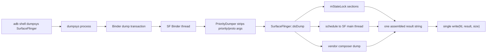
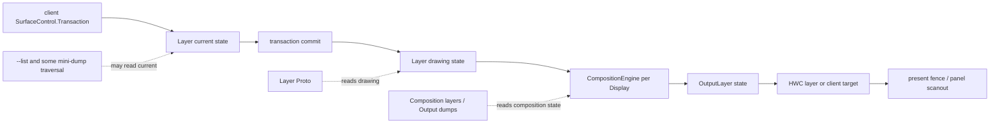
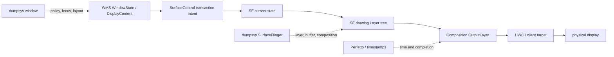
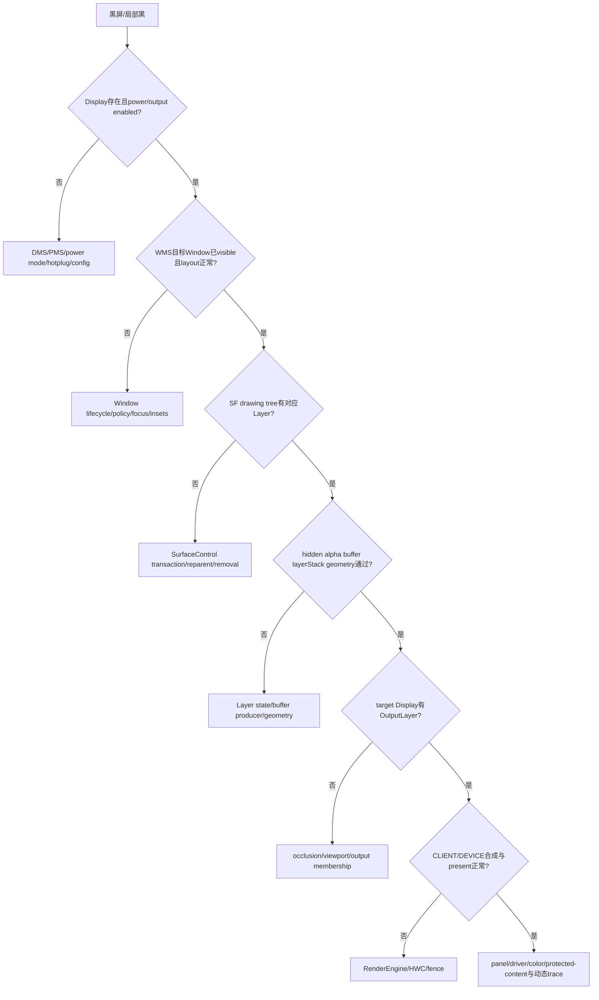

# 170 Android SurfaceFlinger dump、Layer Proto 与显示故障现场

> 源码版本：Android 11 / API 30 / `android-11.0.0_r48`  
> 学习方式：macOS 只读源码，不要求编译、不要求连接设备  
> 前置章节：第 160—169 章

---

## 1. 本章目标：把一份dump变成证据，不是字段词典

遇到黑屏、旧帧、闪烁、局部不刷新或触摸错位时，很多人的第一反应是：

```bash
adb shell dumpsys SurfaceFlinger
```

然后在数千行文本中搜窗口名。这只是定位起点，还不是诊断。

本章要建立的思维是：

```text
现象
→ 问题发生在哪个完成点之前/之后
→ 选对dump/trace/timestamp
→ 核对Layer身份、树、几何、buffer、合成和显示
→ 与WMS、Input、FrameEventHistory交叉验证
→ 得出有边界的结论
```

最重要的一句话：

> `dumpsys SurfaceFlinger`是采集过程中拼出的若干状态片段，不是面板在某个原子时刻的硬件回读。

---

## 2. 本章先回答的十个问题

1. `dumpsys SurfaceFlinger`如何经Binder进入SF？
2. 文本dump、`--proto`、`--list`、HWC mini dump分别是什么？
3. dump里的Layer是current state还是drawing state？
4. 为什么“Visible layers”不等于肉眼真正可见？
5. parent、relative-Z、layer stack和Z如何一起决定层级？
6. active buffer、queued frames、refresh pending能证明什么？
7. visible region、covered region、damage region有什么区别？
8. CLIENT/DEVICE composition与HWC状态怎样交叉阅读？
9. 静态dump为什么无法单独证明闪烁或掉帧因果？
10. 如何把黑屏、旧帧、局部不刷新、触摸错位转成稳定证据链？

---

## 3. 本章源码地图

### 3.1 SurfaceFlinger dump入口

```text
frameworks/native/services/surfaceflinger/
├── main_surfaceflinger.cpp
├── SurfaceFlinger.h
└── SurfaceFlinger.cpp
```

核心方法：

```cpp
SurfaceFlinger::doDump(...)
SurfaceFlinger::dumpCritical(...)
SurfaceFlinger::dumpAllLocked(...)
SurfaceFlinger::dumpDrawingStateProto(...)
SurfaceFlinger::dumpProtoFromMainThread(...)
SurfaceFlinger::dumpOffscreenLayers(...)
```

### 3.2 Layer与Proto

```text
frameworks/native/services/surfaceflinger/
├── Layer.cpp
├── Layer.h
└── layerproto/
    ├── layers.proto
    ├── LayerProtoParser.cpp
    └── include/layerproto/LayerProtoParser.h
```

### 3.3 每显示输出与HWC

```text
frameworks/native/services/surfaceflinger/
├── DisplayDevice.cpp
├── CompositionEngine/src/Output.cpp
├── CompositionEngine/src/OutputLayer.cpp
├── CompositionEngine/src/OutputCompositionState.cpp
├── CompositionEngine/src/OutputLayerCompositionState.cpp
├── CompositionEngine/src/RenderSurface.cpp
└── DisplayHardware/HWComposer.cpp
```

### 3.4 交叉证据

```text
frameworks/base/services/core/java/com/android/server/wm/WindowManagerService.java
frameworks/native/services/inputflinger/dispatcher/InputDispatcher.cpp
frameworks/native/services/surfaceflinger/FrameTracker.cpp
frameworks/native/libs/gui/FrameTimestamps.cpp
```

---

## 4. dump从shell到SurfaceFlinger的边界

SurfaceFlinger向ServiceManager注册时声明：

```cpp
sm->addService(String16("SurfaceFlinger"), flinger, false,
        DUMP_FLAG_PRIORITY_CRITICAL | DUMP_FLAG_PROTO);
```

shell执行`dumpsys SurfaceFlinger`后，dumpsys通过Binder dump调用进入SF的Binder线程。`PriorityDumper`会剥离：

```text
--dump-priority CRITICAL/HIGH/NORMAL
--proto
```

然后调用对应优先级方法。SF在r48实际只重写：

```text
dumpCritical()
dumpAll()
```

HIGH和NORMAL没有独立内容。

另一个容易忽略的副作用：若调用的是`dumpCritical(..., asProto=true)`且SurfaceTracing正在开启，SF会先调`writeToFileAsync()`请求把环形trace异步写入`layers_trace.pb`。所以bugreport的critical proto dump不是完全无副作用的观察。



这张图首先帮我们看清：dump不是全部在Binder线程就地读取，它会等SF主线程任务。

---

## 5. 权限门：shell或DUMP权限

`doDump()`先读calling pid/uid：

```cpp
if (uid != AID_SHELL &&
        !PermissionCache::checkPermission(sDump, pid, uid)) {
    result = "Permission Denial ...";
}
```

所以：

- adb shell通常可读；
- 普通App不能随意窃取全局Layer现场；
- 权限拒绝时仍会向fd写一段文本，方法最后仍返回`NO_ERROR`。

不要只看dumpsys命令退出码来判断是否真正拿到数据，还要看输出内容。

---

## 6. r48的子命令分流

`doDump()`建立了一张字符串到dumper的表：

| 参数 | 主要输出 |
|---|---|
| `--display-id` | display ID、HWC ID、port、EDID名称 |
| `--edid <hwcId>` | 原始识别数据，是二进制 |
| `--dispsync` | Primary DispSync状态 |
| `--vsync` | Scheduler、刷新率、phase、policy等 |
| `--frame-events` | 所有current Layer的FrameEventHistory |
| `--latency [name]` | 全局动画或精确Layer名的legacy FrameTracker |
| `--latency-clear [name]` | 清空legacy frame stats |
| `--list` | current state的Layer debug name |
| `--static-screen` | 静态屏幕分桶 |
| `--timestats ...` | TimeStats参数解析与输出 |
| `--wide-color` | wide color能力和当前mode |

没命中专用参数时，文本路径走完整dump；Proto路径则输出Layer Proto。

---

## 7. 完整文本dump实际由三段拼出

简化`doDump()`：

```cpp
TimedLock lock(mStateLock, 1s);
dumpAllLocked(args, result);

LayersProto p = dumpProtoFromMainThread();
result += LayerProtoParser::layerTreeToString(generateLayerTree(p));
result += schedule(dumpOffscreen).get();
```

所以一份普通文本dump至少混合：

1. Binder线程尝试持`mStateLock`读取的全局/current/组合状态；
2. SF主线程之后生成的drawing-state Layer Proto，再转文本；
3. 另一个SF主线程任务生成的offscreen Layer pid/uid列表。

三段之间系统可能继续提交与合成。不能默认任意两个字段是同一VSync的原子快照。

---

## 8. mStateLock最多等1秒，超时后仍继续dump

r48使用：

```cpp
TimedLock lock(mStateLock, s2ns(1), __FUNCTION__);
if (!lock.locked()) {
    result += "Dumping without lock after timeout ...";
}
```

关键不是“最多等1秒后放弃dump”，而是：

> 锁超时之后，代码仍然进入对应dumper或`dumpAllLocked()`。

这样在SF卡锁时至少有机会导出部分现场，但代价是：

- 输出可能内部不一致；
- 容器正在变化时存在竞态风险；
- 看到`Dumping without lock after timeout`必须将整份文本降为“应急现场”，不能当成自洽快照。

---

## 9. 主线程schedule会让dump暴露SF主线程卡死

Layer Proto通过：

```cpp
return schedule([=] { return dumpDrawingStateProto(traceFlags); }).get();
```

这意味着Binder dump线程要等SF主线程执行任务。

如果SF主线程卡在：

```text
HWC validate/present
RenderEngine
fence wait
长事务
锁依赖
```

dumpsys可能也长时间不返回。“拿不到SF dump”本身就是证据，但不能单凭它区分是哪一个等待点，还需要Perfetto、native stacks、binder/HWC日志。

---

## 10. 完整dump的大区块

`dumpAllLocked()`依次组装：

```text
Build / UI / GUI configuration
Display identification
Wide color
Sync configuration
Scheduler / VSync / refresh-rate policy
Static screen stats
missed-frame counters
buffering stats
Composition layers
DisplayDevice state
CompositionEngine / Output / OutputLayer / RenderSurface
SurfaceFlinger global state
RenderEngine / EGL image tracker
Tracing state
per-display HWC layer mini dump
vendor HWComposer dump
gralloc allocator dump
TimeStats mini dump
```

然后`doDump()`再追加Layer tree和offscreen列表。

阅读时应先判断当前行属于哪个观察对象，不要把同名Layer在“Layer tree”与“Output Layer”中的字段当成重复无用信息。

---

## 11. current state、drawing state和composition state三层

### current state

客户端事务已被SF接收、写入当前状态，但不一定已commit给合成遍历。

### drawing state

`commitTransactionLocked()`执行：

```cpp
mDrawingState = mCurrentState;
```

然后Layer也把可提交pending state推进到`mDrawingState`。这是合成流程主要遍历的稳定状态。

### composition/output state

CompositionEngine按某一个Display的layer stack、bounds、viewport、遮挡与合成结果，为Layer生成`OutputLayerCompositionState`。



---

## 12. 一份dump里确实会混用不同状态

r48中：

- `--list`：`mCurrentState.traverseInZOrder()`；
- `--frame-events`：`mCurrentState.layersSortedByZ`；
- 文本dump中Composition layers：`mDrawingState.traverseInZOrder()`；
- Layer Proto：`mDrawingState.layersSortedByZ`；
- per-display HWC mini dump：遍历`mCurrentState`，但查找Display已有OutputLayer state。

最后一项甚至是current Layer遍历与composition output状态的混合。

因此诊断口诀是：

> 先标注数据属于current、drawing还是output，再做相等性比较。

---

## 13. “Visible layers count”是一个误导性标题

dump打印：

```text
Visible layers (count = N)
```

但N实际来自`mNumLayers`：

```cpp
onLayerFirstRef()  { mNumLayers++; }
onLayerDestroyed() { mNumLayers--; }
```

它计数的是活着的Layer对象，不是“最终肉眼可见且正在合成”的Layer数。以下Layer也可能在计数里：

- hidden；
- alpha为0；
- 没有buffer；
- 不属于当前display layer stack；
- 被上方opaque Layer完全遮挡；
- offscreen但尚有强引用。

诊断Layer泄漏时N很有价值；诊断屏幕上有几层时，不能直接用N。

---

## 14. Layer Proto是整棵drawing-state树的结构化数据

`dumpDrawingStateProto()`遍历：

```cpp
for (const sp<Layer>& layer : mDrawingState.layersSortedByZ) {
    layer->writeToProto(layersProto, traceFlags, display);
}
```

`Layer::writeToProto()`会递归`mDrawingChildren`。`layers.proto`的主要字段包括：

```text
id / name / type
children / relatives / parent / z_order_relative_of
layer_stack / z
position / size / crop / transform
active_buffer / queued_frames / refresh_pending / curr_frame
visible_region / damage_region
dataspace / pixel_format / color / flags
hwc_composition_type
source_bounds / bounds / screen_bounds
input_window_info
metadata / corner / shadow / color transform
```

这些字段是理解Layer树和几何的主数据集，但后面会看到：普通文本dump不会把它们全部打印出来。

---

## 15. Layer id、name、type的作用不同

### id / sequence

SF内部Layer唯一身份，parent/child/relative-Z/barrier等关系都引用它。

### name

主要面向人类和trace，可能重复，也可能因ViewRoot、SurfaceView、BLAST包装出现前后缀。

### type

例如Buffer Layer、Color Layer、Container Layer等，提示这层是否应当有active buffer。

所以：

```text
人眼搜索用name
稳定关联用id
预期字段用type
```

不要用“名字相同”代替“是同一Layer对象”。

---

## 16. parent树与relative-Z树不是一回事

Layer可同时有：

```text
parent
zOrderRelativeOf
z
```

parent决定组织、继承变换/隐藏与生命周期关系。relative-Z则让它的Z相对另一Layer解释，不要只拿整数Z做全局排序。

`LayerProtoParser::layerToString()`会把relatives和non-relative children合并排序，先递归负Z，再打印本层，最后打印非负Z。

文本顺序是解析器重建后的结果，不是Proto原始数组顺序的原样照抄。

---

## 17. layerStack决定Layer属于哪个显示输出

CompositionEngine先判断：

```cpp
if (!belongsInOutput(layerFE)) return;
```

核心是Layer的`layerStack`必须与Output的`layerStackId`匹配，同时还要考虑internal-only等属性。

因此，找到Layer不代表它会去当前内屏。多显示诊断的第一步应是：

```text
Layer.layerStack
==
target Display Composition Output.layerStack
```

如果不等，后续再看该Display的HWC composition type没有意义，因为该Layer根本不属于该Output。

---

## 18. position、size、crop、transform要按坐标系阅读

Layer Proto同时有：

```text
requested position / requested transform
actual position / transform
size / crop
source bounds / bounds / screen bounds
buffer transform
```

一个简单理解是：

```text
buffer像素坐标
→ buffer transform
→ Layer自身crop/bounds
→ Layer/父节点几何transform
→ screen bounds
→ Display viewport/frame/transform
→ HWC sourceCrop/displayFrame
```

但每个字段并非都在文本Layer tree中保留。诊断旋转、缩放、letterbox或触摸错位时，应优先保留Proto原始数据，而不只保留转换后文本。

---

## 19. Layer为什么可能没有OutputLayer

`Output::ensureOutputLayerIfVisible()`会在以下情况直接返回：

```text
不属于该Output
LayerFE composition state不存在
isVisible=false
变换后几何区域为空
被上方opaque region完全扣除
经Output transform/viewport裁剪后为空
```

所以Layer tree里有一层，但Composition Output不存在对应Output Layer，并不一定是bug。

相反，这正是黑屏诊断的关键分叉：

```text
Layer不在drawing tree
→ 事务/生命周期问题

Layer在tree但没OutputLayer
→ 隐藏/透明/几何/遮挡/layerStack问题

OutputLayer存在但屏幕错
→ buffer/合成/HWC/present/面板方向
```

---

## 20. hidden、alpha、buffer和遮挡是四道不同的可见门

BufferLayer的基本`isVisible()`需要：

```cpp
!isHiddenByPolicy()
&& alpha > 0
&& (buffer != nullptr || sidebandStream != nullptr)
```

`isHiddenByPolicy()`还会递归检查parent，使用relative-Z时也会检查relative target是否隐藏。

通过这道门后，CompositionEngine还要：

- 按上方opaque layer扣除visible region；
- 与Output bounds/viewport求交；
- 处理transparent hint、shadow和rounded crop。

所以“flags没hidden”不等于“屏幕上可见”。

---

## 21. activeBuffer能证明SF当前拿着一块buffer

Layer Proto的`active_buffer`只保存：

```text
width
height
stride
format
```

它能回答：

- Buffer Layer是否有当前active buffer；
- buffer几何是否与预期大小一致；
- format是否可能带alpha/YUV/HDR特性。

它不能直接证明：

```text
这块buffer的像素是正确内容
它已在当前物理屏scanout
acquire/present fence已signal
这是App最近刚绘制的那一帧
```

画面全黑也可以是一块合法active buffer。

---

## 22. queuedFrames与refreshPending的语义

Proto写：

```cpp
queued_frames = getQueuedFrameCount();
refresh_pending = isBufferLatched();
```

`queuedFrames > 0`说明consumer侧还有可能待处理的新帧，但不保证下一帧一定能立即latch：

```text
desired present time在未来
acquire fence未就绪
队列时序导致drop/reject
事务条件未满足
```

`refreshPending`/文本`mRefreshPending`表示Layer当前有新buffer已latch、需要走后续refresh处理的状态，不是present fence已signal的同义词。

---

## 23. curr_frame对旧帧问题很重要，但文本dump丢了它

Proto明确写：

```cpp
layerInfo->set_curr_frame(mCurrentFrameNumber);
```

但r48 `LayerProtoParser::Layer`没有`currFrame`字段，`generateLayer()`也不读`curr_frame`，文本`to_string()`自然不会打印。

因此：

> 普通`dumpsys SurfaceFlinger`的Layer tree不能用来对比两次快照的current frame number；`--proto`原始数据才保留该字段。

这是诊断“App在更新，但SF是否一直显示旧帧”时最容易被文本转换掩盖的信息之一。

---

## 24. requested字段与actual字段可反映事务是否收敛

Proto包含一些成对值：

```text
requested_position vs position
requested_transform vs transform
requested_color vs color
requested size/crop语义 vs active几何
```

当requested与actual不同时，可能是：

- legacy resize要等buffer尺寸；
- 事务还在pending state；
- barrier/defer未满足；
- 父子transform与有效几何尚未同步到该快照。

但dump只是一次采样，必须结合pending barrier、事务trace与前后快照判断这是正常瞬态还是长时间不收敛。

---

## 25. visibleRegion、coveredRegion和opaqueRegion

CompositionEngine从上到下计算遮挡：

```text
visibleRegion
= Layer几何足迹
- 上方opaque layers完全不透明区
```

```text
coveredRegion
= 该Layer足迹中被所有上方visible layers覆盖的部分
```

注意：半透明层会让下层区域成为covered，但不会从下层visibleRegion中完全扣掉；只有opaque region会完全遮挡下层。

这是为什么：

```text
covered != invisible
```

不能看到“covered有值”就认定该Layer完全被挡住。

---

## 26. damageRegion不是“屏幕最终刷新区域”

BufferLayer在有待呈现数据时使用buffer携带的surface damage；没有ready frame或还不到present time时，可调`useEmptyDamage()`清空当轮Layer damage。

CompositionEngine还会结合：

```text
contentDirty
新旧visibleRegion
新旧coveredRegion
新暴露区域
上层opaque扣除
Display dirty region
HWC/client target策略
```

所以Layer Proto的`damage_region`是一个输入/中间证据，不是面板最终部分刷新命令的硬件回读。

局部不刷新时不应只说“damage是空，所以App错了”，必须继续检查SF的dirty region、client/device composition、HWC与前后帧trace。

---

## 27. contentDirty会把整个新旧可见区域标脏

`ensureOutputLayerIfVisible()`在`contentDirty`时：

```cpp
dirty = visibleRegion;
dirty.orSelf(oldVisibleRegion);
```

否则主要根据新旧exposed/covered变化计算。

这说明两类刷新原因要分开：

```text
内容变了
→ content/surface damage

内容没变，但遮挡/位置/尺寸变了
→ exposed/covered geometry damage
```

如果只看App提交的surface damage，会漏掉后一类。

---

## 28. HWC mini dump是每个Display的最终几何摘要

`Layer::miniDump()`先在目标Display中查对应OutputLayer；没有就不打印。每行主要包含：

```text
Layer name
Z / relative Z
window type
composition type
buffer transform
display frame
source crop
explicit frame rate + compatibility
focused marker
```

其中：

```text
sourceCrop = 从源buffer/Layer哪一块取样
displayFrame = 在目标Display上放到哪一块
```

对视频拉伸、旋转、多屏投射和半屏黑区，这一行往往比Layer自身position/size更接近最终合成输入。

---

## 29. CLIENT、DEVICE、SOLID_COLOR、CURSOR和SIDEBAND

HWC composition type的主要值：

| 类型 | 含义 |
|---|---|
| CLIENT | SF/RenderEngine把该层画进client target |
| DEVICE | HWC/display以overlay等硬件路径合成 |
| SOLID_COLOR | HWC使用颜色层 |
| CURSOR | 设备cursor plane类路径 |
| SIDEBAND | sideband stream |

不要做两个错误等式：

```text
DEVICE = 不用GPU的整个屏幕
CLIENT = 这个Layer单独占一块client target
```

实际上多个CLIENT Layer会先被RenderEngine合成一块client target，再把这块target与DEVICE Layer一起交给HWC。

---

## 30. Proto里的HWC composition type只按默认显示写

`dumpDrawingStateProto()`获取default display，`Layer::writeToProto()`在`TRACE_COMPOSITION`打开时写：

```cpp
getCompositionType(*display)
```

所以Proto中每层的`hwc_composition_type`是主/默认Display视角，不能用一个字段同时表示该Layer在多个Display上的结果。

多显示时应读每个Display的HWC mini dump/Output Layer状态，并带上Display ID。

---

## 31. vendor HWC dump是不稳定的厂商文本接口

SF的：

```cpp
void HWComposer::dump(std::string& result) const {
    result.append(mComposer->dumpDebugInfo());
}
```

只是把Composer HAL返回的debug string追加进结果。

这意味着：

- 不同SoC/厂商字段名可以完全不同；
- AOSP不保证其文末格式稳定；
- 有的实现很详细，有的只有少量状态；
- 脚本若依赖固定行号/字段容易跨OTA失效。

它很有价值，但应当作“vendor-specific证据”，不是AOSP统一schema。

---

## 32. DisplayDevice先看powerMode、activeConfig和Output投影

`DisplayDevice::dump()`先打印：

```text
physical/virtual
internal/external
primary
display name
powerMode
activeConfig
```

然后Composition Output打印：

```text
isEnabled / isSecure
usesClientComposition / usesDeviceComposition
layerStack
transform
bounds / frame / viewport / sourceClip / destinationClip
needsFiltering
colorMode / renderIntent / dataspace / target dataspace
```

黑屏时最先检查：

```text
Display是否存在
powerMode是否ON/DOZE预期
Output isEnabled是否true
layerStack是否与目标Layer一致
viewport/frame/bounds是否为空或异常
```

先确认显示出口，再钻进单个Layer。

---

## 33. RenderSurface的flip count也不是面板硬件帧计数器

RenderSurface dump包含：

```text
size
ANativeWindow pointer/format
flips
DisplaySurface dump
```

`flip()`在SF输出流程推进`mPageFlipCount`。它是SF RenderSurface路径的计数，不是从面板硬件回读的“已scanout帧数”。

连续两次dump看flips不变，可以提示SF输出未推进；但变化了也不能单独证明面板内容正确。

---

## 34. missed-frame counters是累计摘要，不是当前故障帧

完整dump打印：

```text
Total missed frame count
HWC missed frame count
GPU missed frame count
```

第167章已说明，r48主要根据previous present fence和expected present判断miss，HWC/GPU计数反映上一轮composition path。

这些值：

- 没有自动附Layer身份；
- 没有自动附发生时间；
- 是进程生命周期内累计；
- 不能证明用户刚看到的这次黑屏由某一计数造成。

它适合告诉你“系统合成近期是否有压力”，不适合独立定因。

---

## 35. `--latency`输出三列legacy FrameTracker时间

`FrameTracker::dumpStats()`按环形历史打印127条：

```text
desiredPresentTime
actualPresentTime
frameReadyTime
```

SF的`--latency`:

- 无Layer名：打印Window animation tracker；
- 带Layer名：在current tree中做`getName() == name`的精确匹配；
- 第一行先打印当前HWC VSync period。

三列里可能出现`INT64_MAX`或0类占位/无数据值，应结合`FrameTracker.cpp`读，不要直接当成真实时间戳计算。

---

## 36. `--latency-clear`会改变系统统计状态

```bash
adb shell dumpsys SurfaceFlinger --latency-clear
```

会清理Layer FrameTracker和animation tracker的环形记录/统计。它不是纯读命令。

正确的实验语义是：

```text
清理历史
→ 执行可重复场景
→ 再读latency
```

取证时如果还没保存原现场，不要先运行clear，否则会破坏历史证据。

---

## 37. `--frame-events`与Layer tree的目的不同

`--frame-events`遍历current Layer，每层：

```cpp
checkFencesForCompletion();
FrameEventHistory::dump();
```

它打印第169章的：

```text
posted / requested present
latch
first / last refresh
acquire
GPU composite done
display present
dequeue ready
release
```

Layer tree回答“这层现在是什么几何/结构状态”；Frame Events回答“近几帧经过哪些异步节点”。

两者结合才能区分：

```text
Layer状态没提交
vs
Layer存在但buffer没latch
vs
buffer已latch但present还没完成
```

---

## 38. Proto比文本Layer tree保留更多字段

`--proto`时SF直接：

```cpp
result.append(layersProto.SerializeAsString());
```

普通文本则先用`LayerProtoParser::generateLayerTree()`转成一个精简C++模型，再`to_string()`。

r48文本解析器不保留/不打印的Proto字段包括：

```text
id
curr_frame
hwc_composition_type
hwc_frame / hwc_crop / hwc_transform
source_bounds / bounds / screen_bounds
input_window_info
effective_transform
effective_scaling_mode
color_transform
barrier details
```

其中部分字段在r48 writer也未必实际填充，但核心结论不变：

> “Proto schema里有”、“writer实际写了”、“文本parser保留了”是三个不同问题。

---

## 39. r48文本Region的`this=`值不可信

`layers.proto`已将`RegionProto` field 1标记为reserved，只保留rect数组。

但`LayerProtoParser::Region`仍有：

```cpp
uint64_t id;
```

`generateRegion()`创建局部`Region region;`后只填rects，没有初始化id；`to_string()`却打印：

```text
Region VisibleRegion (this=... count=N)
```

所以r48这个`this=`不是Layer ID、Region ID或指针的稳定证据，它来自未初始化字段，应忽略。有意义的是`count`和后续rect。

---

## 40. `--proto`不包含offscreen Layer树

`doDump()`在asProto时只序列化`dumpDrawingStateProto()`的结果。`dumpOffscreenLayersProto()`是SurfaceTracing在打开EXTRA等路径中可用的方法，但普通`dumpsys SurfaceFlinger --proto`这里没有调它。

文本dump会在末尾追加：

```text
Offscreen Layers:
Layer <name> (<type>) pid:<pid> uid:<uid>
```

但也只有名称/类型/pid/uid，不是完整offscreen几何树。

所以排查Layer泄漏时，单独保存`--proto`可能漏offscreen对象。

---

## 41. on-screen与offscreen也不是一次原子采集

文本dump先在主线程导drawing tree Proto，再另起一个`schedule(...).get()`遍历`mOffscreenLayers`。

两次主线程任务之间，Layer可能：

```text
被reparent回屏幕树
从屏幕树移除
销毁
子节点归属变化
```

因此极端竞态下，一份文本可能出现短暂重复或缺口。需要精确重建层树迁移时，应使用第168章SurfaceTracing时序，而不是强迫一份静态dump回答动态问题。

---

## 42. WMS dump与SF dump是两个层级

### WMS主要回答

```text
Window/Activity/DisplayContent组织
Window token和lifecycle
focus / IME / policy visibility
layout frame / insets / rotation
WindowStateAnimator / SurfaceController意图
```

### SF主要回答

```text
SurfaceControl Layer drawing tree
active buffer与合成几何
per-display OutputLayer
CLIENT/DEVICE composition
HWC/RenderSurface/present附近状态
```



如果WMS里窗口已visible，但SF没有对应Layer，问题更像在SurfaceControl事务/生命周期交界；WMS自己就认为隐藏时，先不要怀疑HWC。

---

## 43. 触摸错位要加上InputDispatcher的真正路由现场

Layer Proto在`TRACE_INPUT`中可保存：

```text
input frame
touchable region
visible / canReceiveKeys / hasFocus
global scale / window scale
crop layer
replaceTouchableRegionWithCrop
```

但普通Layer文本parser丢弃`input_window_info`。`dumpsys input`的InputDispatcher状态会直接打印它实际使用的：

```text
FocusedDisplay / FocusedWindow
per-display windows order
frame
globalScale / windowScale
touchableRegion
flags / type
ownerPid / ownerUid
current TouchState targets
```

还有一个容易误解的r48语义：有InputInfo的Layer为了兼容，在尚未提交buffer时也可先`canReceiveInput()`；输入visible不总是与buffer真实可见绑死。

---

## 44. 黑屏的分层诊断树



这棵树的价值是让每一层都有“应当查什么”，避免一看黑屏就跳到“GPU驱动错”。

---

## 45. 旧帧/画面卡住的证据链

建议按顺序问：

1. App/RenderThread是否还在queue新buffer？
2. SF Layer Proto的`curr_frame`是否推进？
3. `queued_frames`是否持续大于0？
4. acquire fence是否长时间PENDING？
5. latch/first refresh是否推进？
6. display present fence/timestamp是否推进？
7. RenderSurface flip/HWC present是否推进？

对应分层：

```text
App不queue
→ UI/RT/producer侧

queue但curr_frame不进
→ ready/acquire/present-time/latch侧

curr_frame进但present不进
→ composition/HWC/fence侧

present证据进但肉眼旧
→ 核对Layer身份、Display路由、面板/driver与内容本身
```

静态dump只能提供当前点，“是否推进”必须用两次快照或trace/timestamp时序判断。

---

## 46. 闪烁问题为什么优先trace而不是dump

闪烁本质上是“状态在时间上交替”，例如：

```text
Layer A/B交替出现
alpha 1/0交替
Z/parent短暂变化
buffer空/非空交替
crop/transform中间态
CLIENT/DEVICE路径切换
新旧帧在连续present中交替
```

一份dump只随机命中其中一态，最好情况也只是“闪烁当时的一张照片”。

第168章SurfaceTracing能比较Layer树在多个时刻的变化；FrameTracer/Perfetto能追buffer event。它们才是回答“什么在交替”的工具。

---

## 47. 局部不刷新的读取模板

### 第一层：App是否画了那块

检查View invalidation、RenderNode damage与buffer surface damage。

### 第二层：SF是否latch了新buffer

核对frame number、acquire/latch与FrameEventHistory。

### 第三层：Layer damage怎样进入Output dirty

同时考虑contentDirty、新旧visible/covered、opaque遮挡和viewport clip。

### 第四层：该区域走CLIENT还是DEVICE

CLIENT查RenderEngine/client target；DEVICE查HWC layer与damage传递。

### 第五层：present与面板

核对present fence、HWC日志、driver/partial update能力。

这个模板避免把一个中间`damageRegion`错当成全链路最终结论。

---

## 48. 触摸错位的对照表

| 层级 | 核对内容 |
|---|---|
| WMS | Window frame、insets、rotation、surfaceInsets、globalScale |
| SF Layer Proto | screen bounds、effective/requested transform、crop、parent transform |
| SF Output | display transform、viewport、frame、sourceClip/destinationClip |
| InputWindowInfo | input frame、touchable region、window/global scale、crop layer |
| InputDispatcher | 实际窗口顺序、focused window、当前touch target |

典型错误是只比较视觉上的Layer position和WMS Window frame，却漏掉：

```text
父层transform
display rotation
surface inset
compatibility scale
touchableRegion crop
portal/multi-display route
```

最终要以InputDispatcher实际收到的InputWindowInfo为输入路由事实，再回查SF/WMS哪一步产生了不一致。

---

## 49. macOS只读练习、复读审计与核心结论

### 49.1 练习1：追dump线程与锁边界

```bash
cd /Users/ninebot/androidSource

sed -n '4304,4375p' \
  frameworks/native/services/surfaceflinger/SurfaceFlinger.cpp

sed -n '185,225p' \
  frameworks/native/services/surfaceflinger/SurfaceFlinger.cpp
```

回答：

1. dump从哪个线程进来？
2. `mStateLock`最多等多久？
3. 超时后为什么输出可能不一致？
4. 哪一段要等SF主线程？

### 49.2 练习2：列出Proto写了但文末parser丢弃的字段

```bash
sed -n '30,135p' \
  frameworks/native/services/surfaceflinger/layerproto/layers.proto

sed -n '77,120p' \
  frameworks/native/services/surfaceflinger/layerproto/LayerProtoParser.cpp

sed -n '277,335p' \
  frameworks/native/services/surfaceflinger/layerproto/LayerProtoParser.cpp
```

至少找到`curr_frame`、input、HWC composition、screen bounds的丢失。

### 49.3 练习3：手算visible与covered

设底层A是`[0,0,100,100]`，上方B是`[0,0,50,100]`：

- B opaque：A visible只剩右半；
- B translucent：A visible仍可是整块，但左半属于covered；
- B alpha=0或hidden：B不应进入有效OutputLayer覆盖。

然后对照`Output.cpp::ensureOutputLayerIfVisible()`的计算顺序。

### 49.4 练习4：建一张黑屏假设表

```text
假设：Display OFF
证据：DisplayDevice powerMode
反证：Output enabled且present持续

假设：Layer未提交
证据：WMS有Window、SF drawing tree无Layer
反证：Proto id稳定存在

假设：buffer没latch
证据：queue推进、curr_frame不进、acquire pending
反证：latch/present都持续推进
```

一个好的假设必须同时写出“支持证据”和“什么能推翻它”。

### 49.5 复读审计：r48最容易误解的边界

1. dump是Binder线程、SF主线程与vendor HWC结果的拼接，不是单时刻原子快照。
2. `mStateLock`超时1秒后仍继续读，这时整份dump只能当应急现场。
3. Layer Proto要schedule到SF主线程；主线程卡死会让dumpsys也挂住。
4. `dumpCritical()`忽略原子参数，以空参数再走完整`doDump()`；CRITICAL在r48并不是极小mini dump。
5. `Visible layers count`实际是活Layer对象计数，不是OutputLayer或肉眼可见数。
6. `--list`与`--frame-events`读current state，Layer Proto读drawing state，HWC mini dump还混用current traversal和Output state。
7. Layer在drawing tree不保证在目标Display上有OutputLayer。
8. active buffer不证明像素正确、fence已signal或面板正在scanout它。
9. damage region是中间输入，不是最终display partial-update命令回读。
10. Proto中HWC composition type只按default display视角填写。
11. r48文本Layer parser丢弃`curr_frame`、HWC type、input和screen bounds等重要字段。
12. Proto schema有字段不代表r48 writer一定填它；writer填了也不代表文本parser会保留。
13. 文本Region的`this=`来自未初始化id，不是稳定身份。
14. 普通`--proto`不包含offscreen layer tree；文本offscreen也只打印name/type/pid/uid。
15. on-screen Proto与offscreen列表是两次主线程任务，之间可能变化。
16. `--latency-clear`是破坏性统计重置，不是纯读查询。
17. vendor HWC dump没有跨厂商稳定文本schema。
18. InputInfo的visible为兼容可在buffer出现前为true，不等于像素已可见。
19. dump最后对大result只调一次`write()`，忽略返回值并总是返回`NO_ERROR`；极端大输出的截断/写失败不会通过status可靠反映。
20. 闪烁、交替、掉帧和短暂中间态必须用trace/多快照，不能由一份静态dump单独定因。

### 49.6 本章核心结论

1. 先区分current、drawing、composition/output和physical present四层。
2. 完整SF文本dump是多阶段拼接，不具有全局原子性。
3. Layer身份优先用id，name只适合搜索，type用来判断字段预期。
4. parent、relative-Z、layerStack和per-display OutputLayer要合在一起读。
5. hidden/alpha/buffer只是基本可见门，之后还有遮挡、viewport与output membership。
6. active buffer不是正确显示完成证明，queued/refresh pending也与present不等价。
7. visible/covered/damage分别描述可见、覆盖和更新中间区域，不能混用。
8. CLIENT/DEVICE是每Output的合成分工，不是快慢或成功失败标签。
9. `--proto`保留的Layer字段比普通文本更多，但不包含完整offscreen树。
10. WMS、SF、InputDispatcher、FrameEventHistory和Perfetto回答的是不同层级，只有交叉后才能稳定定位。
11. 黑屏用分层决策树，旧帧用frame/timestamp推进链，局部不刷新用damage-to-output链，触摸错位用多坐标系对照。
12. 证据的价值取决于它能回答什么，也取决于你明确记住它不能证明什么。

---

## 50. 自测题与下一章预告

### 50.1 自测题

1. SF dump为什么不是原子快照？
2. `mStateLock`超时后dump会怎样？
3. Layer Proto为什么要等SF主线程？
4. current、drawing、OutputLayer状态各代表什么？
5. “Visible layers count”为什么不是真正可见层数？
6. name和id在关联Layer时有什么差别？
7. parent与relative-Z有什么差别？
8. layerStack不匹配会发生什么？
9. Layer在drawing tree里为什么可能没有OutputLayer？
10. active buffer不能证明哪些事？
11. queuedFrames和refreshPending与present是什么关系？
12. visibleRegion和coveredRegion为什么不等价？
13. damageRegion为什么不是面板最终刷新区？
14. CLIENT composition如何与DEVICE layers共存？
15. Proto HWC type在多显示场景有什么边界？
16. `curr_frame`为什么在文本Layer tree中看不到？
17. Region文本的`this=`为什么不可信？
18. `--proto`是否包含offscreen Layer？
19. `--latency-clear`为什么要谨慎使用？
20. 闪烁为什么不能靠一份dump定因？
21. WMS有Window而SF无Layer时，优先查哪一层？
22. 触摸错位为什么还要查`dumpsys input`？
23. present fence推进能否证明buffer像素内容正确？
24. 如何为一个黑屏假设写出可推翻它的反证？

### 50.2 下一章预告

第171章继续学习：

> SurfaceFlinger ScreenCapture、captureDisplay/captureLayers、secure/protected content 与截屏完成边界。

将回答：

- Java `SurfaceControl.screenshot/captureLayers`如何进入SF；
- display capture与layer subtree capture的树、crop、scale和transform差别；
- secure Layer、protected buffer、uid权限和黑块策略；
- RenderEngine如何把多层画入GraphicBuffer；
- capture callback/fence返回与像素可读、屏幕present的差别；
- 为什么“截图正常但屏幕异常”能帮助将问题分界到SF之后。
