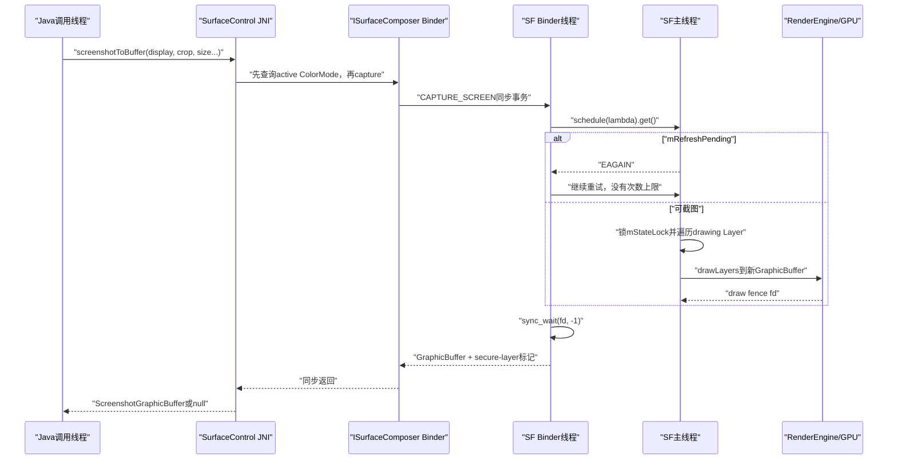
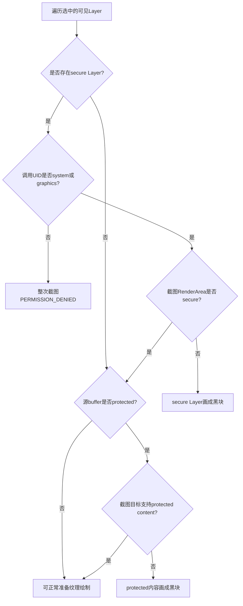
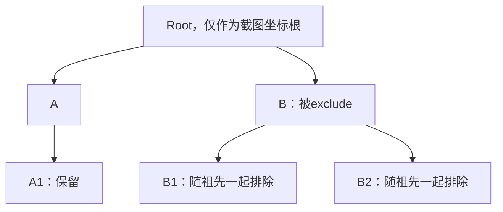
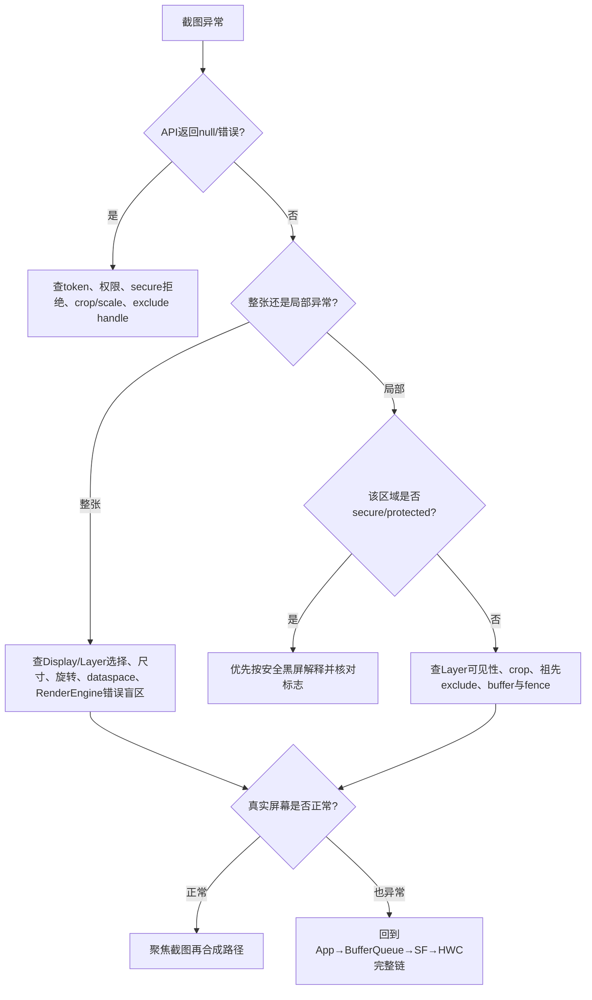

# 171 Android SurfaceFlinger ScreenCapture、secure/protected content 与截图完成边界

> 源码版本：Android 11 / API 30 / `android-11.0.0_r48`  
> 学习方式：macOS 只读源码，不要求编译、不要求连接设备  
> 前置章节：第 160—170 章

---

## 1. 本章目标：截图不是“复制屏幕内存”

很多人第一次读截图源码，会下意识建立这个模型：

```text
显示器上已经有一张完整图片
→ 系统把这张图片复制出来
→ 得到截图
```

Android 11 的 SurfaceFlinger 并不是这样做。更接近源码事实的模型是：

```text
选择某个Display或Layer子树
→ 遍历当前drawing-state中的可见Layer
→ 为每层重新构造RenderEngine LayerSettings
→ GPU在一块新GraphicBuffer里再合成一次
→ 等待这次离屏绘制的fence
→ 把GraphicBuffer经Binder返回调用方
```

因此，截图和屏幕显示虽然读取相近的 Layer 状态，却是两条不同输出链：

- 屏幕显示可能由 HWC 的 `DEVICE` 合成完成；
- 截图在本章这条链上固定走 RenderEngine 客户端合成；
- 截图完成 fence 不等于屏幕 present fence；
- 屏幕上的受保护内容也不一定允许进入截图 buffer；
- 截图得到黑色，不能直接推断真实屏幕也是黑色。

本章最终要建立的是“截图采样链”，而不是记住几个 API 名字。

---

## 2. 先做版本纠偏：本章读的是 Android 11 的同步旧接口

新版本 Android 已经有 `ScreenCapture`、`CaptureArgs`、异步 listener 等更现代的接口。当前 checkout 是 `android-11.0.0_r48`，主要对象仍是：

```text
Java SurfaceControl
→ JNI nativeScreenshot/nativeCaptureLayers
→ ScreenshotClient
→ ISurfaceComposer同步Binder调用
→ SurfaceFlinger::captureScreen/captureLayers
→ GraphicBuffer + ScreenshotGraphicBuffer
```

这一版的调用者会同步等待：

1. Binder 请求到达 SurfaceFlinger；
2. SF 主线程接受截图任务；
3. RenderEngine 提交离屏绘制；
4. 调用线程无限等待 draw fence；
5. 返回可读 GraphicBuffer。

不要把 Android 12+ 的异步 `ScreenCaptureListener` 语义直接套回本章。

---

## 3. 本章要回答的十二个问题

1. Java 截整屏和截 Layer 分别进入哪条链？
2. JNI 为什么先查询显示器 ColorMode？
3. Binder 的“事务成功”和“截图业务成功”如何区分？
4. Display 截图怎样确定尺寸、旋转、裁剪与 Layer 范围？
5. Layer 截图为什么实际排除了根 Layer？
6. `exclude` 为什么会排除一整棵子树？
7. 截图在哪个线程采样 drawing state？
8. `mRefreshPending` 为什么会让同步请求反复重试？
9. 截图完成 fence 究竟保证了什么？
10. `secure` 与 `protected` 有什么本质区别？
11. 为什么系统调用者也可能只得到黑块？
12. 如何用截图证据定位“显示正常、截图异常”或相反的问题？

---

## 4. 源码地图

### 4.1 Java与JNI入口

```text
frameworks/base/core/java/android/view/SurfaceControl.java
frameworks/base/core/jni/android_view_SurfaceControl.cpp
```

关注：

```text
SurfaceControl.screenshot(...)
SurfaceControl.screenshotToBuffer(...)
SurfaceControl.screenshotToBufferWithSecureLayersUnsafe(...)
SurfaceControl.captureLayers(...)
SurfaceControl.captureLayersExcluding(...)
nativeScreenshot(...)
nativeCaptureLayers(...)
```

### 4.2 Binder客户端与服务端协议

```text
frameworks/native/libs/gui/SurfaceComposerClient.cpp
frameworks/native/libs/gui/ISurfaceComposer.cpp
frameworks/native/libs/gui/include/gui/ISurfaceComposer.h
```

### 4.3 SurfaceFlinger执行

```text
frameworks/native/services/surfaceflinger/SurfaceFlinger.cpp
frameworks/native/services/surfaceflinger/RenderArea.cpp
frameworks/native/services/surfaceflinger/BufferLayer.cpp
frameworks/native/libs/renderengine/RenderEngine.cpp
frameworks/native/libs/renderengine/gl/GLESRenderEngine.cpp
```

---

## 5. 整屏截图的完整调用链



图中要特别看清三个线程边界：

- Java/JNI 所在线程发起同步调用；
- SF Binder 线程接收请求并等待主线程任务；
- SF 主线程在 `mStateLock` 下生成这次截图的绘制参数。

GPU 工作可异步执行，但 Binder 线程随后会等待 draw fence，因此 Java 返回时通常已经可以读取输出 buffer。

---

## 6. Java端有三种不同“出口”

### 6.1 返回Bitmap

Java 便利方法最终执行：

```java
Bitmap.wrapHardwareBuffer(
        buffer.getGraphicBuffer(),
        buffer.getColorSpace());
```

这不是把每个像素先拷贝到普通 Java 堆 Bitmap。它把硬件 GraphicBuffer 包装成硬件 Bitmap。

### 6.2 返回ScreenshotGraphicBuffer

`screenshotToBuffer()` 保留底层 GraphicBuffer、ColorSpace 和“是否遇到 secure Layer”的布尔值，适合系统组件继续走 GPU/Surface 链。

### 6.3 截图到Surface

另一些便利路径会把截图 buffer attach/queue 给目标 Surface。此时又多了一段目标 BufferQueue 生命周期；“截图 buffer 已画完”和“目标 Surface 已经把它显示出来”仍是两个完成点。

---

## 7. JNI先查ColorMode，再单独发起截图

`nativeScreenshot()` 先调用：

```cpp
const ui::ColorMode colorMode =
        SurfaceComposerClient::getActiveColorMode(displayToken);
const ui::Dataspace dataspace = pickDataspaceFromColorMode(colorMode);
```

然后才发起 `ScreenshotClient::capture(...)`。

`pickDataspaceFromColorMode()` 在这条 JNI 路径中做的是简化映射：P3、PQ、HLG、BT2020 等宽色/HDR 模式倾向选择 `DISPLAY_P3`，其他情况选择 sRGB。

这里有两个重要边界：

1. 这是截图输出 buffer 的目标 dataspace，不是说所有源 Layer 都变成同一种颜色；RenderEngine 仍会依据每层 dataspace 做变换。
2. “查询 ColorMode”和“capture”是两个独立 Binder 操作。两者之间如果显示模式改变，返回对象携带的颜色空间描述可能来自前一次查询，而真正绘制读取的是随后状态。这不是原子快照。

---

## 8. Java Bitmap便利方法还会调整旋转和crop

当 rotation 是 90° 或 270° 时，Java 便利方法会先互换方向，再调用 `rotateCropForSF()` 交换 crop 的横纵坐标。

这意味着出现“截图方向正确但裁剪区域错位”时，要同时确认：

- 调用者传入的 crop 属于哪个方向下的坐标；
- Java 便利层是否已经交换 90/270；
- SF `DisplayRenderArea` 又应用了什么 rotation；
- `useIdentityTransform` 是否忽略 Layer 自身变换。

不能只在 SF 的最后矩阵上找问题。

---

## 9. Binder权限：能调用截图接口不代表能取走secure像素

在 Android 11 r48 中，`CAPTURE_SCREEN` 和 `CAPTURE_LAYERS` 进入 SF 前有 Binder 权限检查，核心是 graphics UID 或 `READ_FRAME_BUFFER` 权限。按 display id/layer stack 的内部接口则只允许更窄的特权 UID 集合。

这里要分成两道门：

```text
第一道：有没有资格调用截图Binder接口
第二道：选中的可见Layer里若含secure Layer，当前UID是否允许继续
```

拥有 `READ_FRAME_BUFFER` 可以通过第一道门，却不自动成为源码中的 `forSystem`。`forSystem` 只在调用 UID 为 `AID_GRAPHICS` 或 `AID_SYSTEM` 时成立。

因此一个拥有截图权限但不是这两个 UID 的调用者，遇到 secure Layer 时仍可能得到整次 `PERMISSION_DENIED`。

---

## 10. Binder传输成功与截图结果必须分开读

服务端处理 `CAPTURE_SCREEN` 时大致是：

```cpp
status_t res = captureScreen(...);
reply->writeInt32(res);
if (res == NO_ERROR) {
    reply->write(*outBuffer);
    reply->writeBool(capturedSecureLayers);
}
return NO_ERROR;
```

最后的 `return NO_ERROR` 是 Binder onTransact 本身处理完成。真正截图结果写在 reply 的第一个整数 `res` 里。

所以必须区分：

```text
transact返回NO_ERROR
≠ 截图业务成功

reply中的res返回NO_ERROR
→ 客户端才继续读取GraphicBuffer
```

客户端 `BpSurfaceComposer` 先检查 `transact()`，再读 `reply.readInt32()`。JNI 最终把非 `NO_ERROR` 折叠成 Java `null`，上层通常看不到 `NAME_NOT_FOUND`、`BAD_VALUE`、`PERMISSION_DENIED` 的精确差异。

---

## 11. Display截图怎样确定目标Display

普通 `captureScreen(displayToken, ...)` 要求 token 非空，并在 `mStateLock` 下查找 `DisplayDevice`。找不到就返回 `NAME_NOT_FOUND`。

另一个内部接口接受 `displayOrLayerStack` 数字：

```text
先尝试把数字解释成physical display id
→ 找不到时再解释成layerStack
```

因此这个数字不是天然无歧义的“显示器编号”。诊断日志时要同时知道调用的是哪一个重载。

---

## 12. 请求尺寸：任意一个维度为0都会重置两者

Display 截图路径中，源码逻辑不是分别补默认值，而是：

```cpp
if (reqWidth == 0 || reqHeight == 0) {
    reqWidth = display->getViewport().width();
    reqHeight = display->getViewport().height();
}
```

因此：

```text
请求 width=500, height=0
```

并不会得到“宽 500、高度自动按比例”，而是宽高都回到 display viewport 尺寸。要做等比例缩放，调用者必须自己同时算出两个非零维度。

---

## 13. 非法rotation在SF里会回退ROT_0

SF 把传入值转换成 rotation flags。遇到无效方向时，源码记录日志并回退 `ROT_0`，而不是返回 `BAD_VALUE`。

这会制造一种很容易误判的现象：

```text
调用成功 + 返回了一张图片 + 图片方向不对
```

此时先查是否传入非法 rotation，而不是假设合成矩阵随机失效。

---

## 14. DisplayRenderArea定义“拍哪里、画多大、能否画secure”

`DisplayRenderArea` 把截图请求变成 RenderEngine 能理解的输出区域，核心职责包括：

- 输出宽高；
- source crop；
- display viewport；
- 屏幕方向变换；
- 输出 dataspace；
- 背景填充方式；
- 目标是否被视为 secure。

整屏截图的背景使用不透明填充；Layer 截图则用透明清空。这就是两种截图在“没有任何内容的区域”中一个倾向黑色/不透明、一个倾向透明的原因。

---

## 15. Display截图遍历的是drawing-state可见Layer

SF 的遍历入口是 `mDrawingState.layersSortedByZ`，随后按 Z 顺序遍历子层。Layer 必须同时满足：

```text
belongsToDisplay(display.layerStack)
AND layer->isVisible()
```

才交给截图绘制。

所以本章截图主要采的是 drawing state，不是调用瞬间尚未提交到 drawing state 的 current transaction，也不是面板实际扫描出的像素。

与第 170 章串起来：截图是另一次状态采样和再合成，不是 `dumpsys SurfaceFlinger` 的可视化版本。

---

## 16. captureScreenCommon为什么一定切到SF主线程

Binder 线程不会直接遍历 Layer 并调用 RenderEngine，而是执行：

```cpp
schedule([&] {
    ...
}).get();
```

这有两个效果：

1. 截图与 SF 主循环中的事务提交、latch、合成操作按主线程顺序排队；
2. Binder 线程同步等待任务完成。

主线程任务内部再持有 `mStateLock`，从遍历、生成 LayerSettings 一直到调用 `drawLayers()` 提交 GPU 工作，锁都没有提前释放。

因此截图太重不仅影响调用者，还可能增加 SF 状态锁占用和主线程工作量。

---

## 17. mRefreshPending会触发无上限EAGAIN重试

主线程 lambda 的第一道判断是：

```cpp
if (mRefreshPending) {
    return std::make_pair(EAGAIN, -1);
}
```

外层则是：

```cpp
do {
    ... schedule(...).get();
} while (result == EAGAIN);
```

源码没有显式的最大重试次数，也没有单独 sleep。每次重试仍要把任务排到 SF 主线程。

正确理解不是“截图永远失败”，而是：SF 不愿在还有 refresh 工作待处理时采样一个不合适的中间状态；但如果 `mRefreshPending` 长时间无法消失，调用者会长期同步阻塞。

---

## 18. 截图输出GraphicBuffer的usage说明了什么

普通截图 buffer 使用：

```text
SW_READ_OFTEN
SW_WRITE_OFTEN
HW_RENDER
HW_TEXTURE
```

并命名为 `screenshot`。

它既能作为 GPU 渲染目标，也能被纹理使用，并允许 CPU 较频繁读写。注意其中没有 protected usage，因此不能把它当成受保护输出通道。

若 GraphicBuffer 创建或后续绘制失败，当前实现缺少一条完整的“每一步都精确向上透传”的事务式错误链；读代码时不能把返回非空和像素正确简单画等号。

---

## 19. 截图始终走RenderEngine，不复用HWC最终画面

截图绘制会构造：

```text
renderengine::DisplaySettings
vector<LayerSettings>
```

再调用：

```cpp
getRenderEngine().drawLayers(..., buffer, ..., &drawFence);
```

它不会向 HWC 请求“把刚刚 present 的最终屏幕读回来”，也不会复制 framebuffer 的某个固定地址。

这解释了几个常见反例：

- HWC `DEVICE` 合成正常，但截图 RenderEngine 路径异常；
- 屏幕色彩正常，截图颜色转换有偏差；
- 屏幕可见 protected 视频，截图位置是黑色；
- 截图正常，但面板 present/scanout 链后段异常导致肉眼黑屏。

---

## 20. LayerSettings是怎样从每个Layer生成的

对于每个被遍历的 Layer，SF 会准备客户端合成参数，例如：

- 几何边界、clip、transform；
- alpha、混合方式、是否不透明；
- buffer 与 acquire fence；
- texture transform；
- dataspace、HDR metadata；
- 阴影、圆角、颜色或纯色；
- 是否需要安全黑屏；
- 模糊参数；
- frame number 与 buffer id。

因此截图不是简单 memcpy，而是在“另一块目标 buffer 上重放当前 Layer 合成描述”。

---

## 21. draw fence等待的是截图buffer可用，不是屏幕显示完成

RenderEngine 返回 `drawFence` 后，SF 主线程把 fd 交回 Binder 线程。Binder 线程执行：

```cpp
sync_wait(syncFd, -1);
close(syncFd);
```

`-1` timeout 表示无限等待。

这个 fence 证明的是：

> RenderEngine 对这块截图 GraphicBuffer 的绘制已经完成到可安全使用的程度。

它不证明：

- 原显示器完成了 HWC validate/present；
- present fence 已 signal；
- 面板开始或完成 scanout；
- 下一帧没有覆盖当前画面；
- 目标 Surface 已经显示了这块截图。

---

## 22. sync_wait返回值被忽略是一个诊断边界

当前源码等待后没有检查 `sync_wait()` 的返回值。随后无论等待是否因错误返回，都会 `close(syncFd)`，函数继续按先前的 `result` 返回。

还有一个配套边界：`renderScreenImplLocked()` 调用 `drawLayers()` 时也没有使用其返回 status 来改变外层截图结果。

于是存在这样的错误盲区：

```text
RenderEngine提交/完成发生错误
→ drawLayers错误没有成为capture结果
→ fence等待错误也被忽略
→ 上层仍可能看到NO_ERROR和一个buffer
```

这不等于每次都会返回坏图，而是提醒我们：截图 API 的成功状态不是逐像素正确性的强证明。

---

## 23. 为什么截图会延长源Layer buffer的release生命周期

若 draw fence 有效，SF 会复制这个 fence，并对本次实际渲染的每个 Layer 调用：

```cpp
layer->onLayerDisplayed(releaseFence);
```

原因是截图 GPU 仍可能读取这些源 buffer。生产者只有在相关 release fence 完成后，才能安全复用它们。

因此一次截图不仅“读状态”，还会参与 buffer 生命周期同步；高频截图可能增加源 buffer 的占用压力。

注意方法名 `onLayerDisplayed` 在此处很容易误导：它收到的是截图离屏渲染的释放约束，不代表这个 Layer 又在物理显示器上 present 了一次。

---

## 24. secure与protected必须分开

这是本章最重要的概念区分。

### secure Layer

`eLayerSecure` 是窗口/Layer 的安全策略属性，核心问题是：

> 这个内容是否允许进入普通截图、录屏或不安全输出？

### protected buffer/content

protected 更靠近图形内存和硬件保护能力，核心问题是：

> 这块内容是否只能在受保护的GPU上下文、buffer和显示链上读取/处理？

二者经常同时出现于 DRM 视频，但并不等价：

```text
secure = 截取与输出政策
protected = buffer/执行环境的硬件保护属性
```

把两者都简称“安全层”，会直接读错后面的黑屏判断。

---

## 25. BufferLayer真正的blackOutLayer公式

Android 11 r48 的关键判断是：

```cpp
bool blackOutLayer =
        (isProtected() && !targetSettings.supportsProtectedContent) ||
        (isSecure() && !targetSettings.isSecure);
```

翻译成中文：

```text
源buffer受保护，但目标合成环境不支持protected
OR
源Layer是secure，但目标输出不是secure
→ 不采样真实纹理，改成不透明黑色
```

这是两条独立条件，只要任意一条成立就会黑掉。

---

## 26. 截图中的secure/protected决策树



在本章普通截图实现中，RenderEngine 被明确切换到非 protected context，截图输出 buffer 也不是 protected，因此 protected 内容最终会命中黑块路径。

---

## 27. 普通调用者遇到secure Layer：整次拒绝，不是只遮一层

`captureScreenImplLocked()` 先遍历 Layer，并累积：

```cpp
outCapturedSecureLayers = outCapturedSecureLayers ||
        (layer->isVisible() && layer->isSecure());
```

如果存在 secure Layer 且调用者不是 system/graphics UID，立即返回 `PERMISSION_DENIED`。

因此此类调用者不是得到“其他层正常、secure 位置黑色”的图片，而是整次截图失败。JNI 常把这个失败表现为 `null`。

另外，已被 `exclude` 排除的子树不会进入最终遍历，所以其中 secure Layer 通常也不会参与这次拒绝判断。

---

## 28. system调用者通过权限门，也不保证拿到secure像素

`forSystem` 只表示允许截图流程继续，不等于自动把输出变成 secure。

普通 `screenshotToBuffer()` 传入：

```java
false /* captureSecureLayers */
```

即使调用者是 system UID，DisplayRenderArea 仍可能是非 secure，`BufferLayer` 会把 secure Layer 画黑。

这正符合 API 注释的意图：系统有些功能代替用户截图或为助手采集时，也不应拿走 secure 内容。

---

## 29. unsafe接口为什么仍有显示器secure条件

`screenshotToBufferWithSecureLayersUnsafe()` 传 `captureSecureLayers=true`，但 DisplayRenderArea 的 secure 判断还要结合目标 Display 自身是否 secure。

可以把条件理解成：

```text
调用者是system/graphics
AND 显式请求captureSecureLayers
AND 目标display是secure
→ secure Layer才可能不因secure条件被黑掉
```

“Unsafe” 不是“绕过所有图形安全机制”。它只是供系统内部非常受限的场景使用，例如旋转动画，而且注释明确要求不持久化、不离开 system_server 控制范围。

---

## 30. protected内容在本章截图路径仍会被黑掉

截图实现明确执行：

```cpp
getRenderEngine().useProtectedContext(false);
```

同时输出是普通 screenshot GraphicBuffer，每层准备时也按“不支持 protected content”处理。

所以即便：

- 调用者是 system UID；
- 调用了 secure unsafe 接口；
- Display 是 secure；

只要源内容本身是 protected，仍会因为截图目标不支持 protected 而被画黑。

这正是 `secure` 与 `protected` 不能混为一谈的最好例子。

---

## 31. 为什么屏幕能显示protected视频，截图却是黑块

物理显示输出可以在硬件能力允许时使用 protected RenderEngine context、protected render target，或者把内容交给 HWC 的安全 overlay 路径。

截图输出则是普通可交付给调用方的 GraphicBuffer。如果允许 protected 像素进入它，就破坏了受保护内容不能被普通 CPU/GPU 路径复制出去的目标。

因此：

```text
肉眼看到DRM视频
截图中该矩形为黑色
```

通常是安全机制正确工作，不能直接判为 SurfaceFlinger 合成故障。

---

## 32. capturedSecureLayers只报告“遇到过”，不报告“真实像素被捕获”

返回对象里的 `capturedSecureLayers` 来自遍历时的 secure 属性累计。它回答的是：

> 这次选中的可见 Layer 中是否存在 secure Layer？

它不回答：

- secure Layer 是否被画成真实内容；
- 是否被画成黑块；
- 是否同时是 protected；
- protected 像素是否被输出。

例如 system UID 使用普通非 secure 截图时，标记可以是 `true`，但 secure Layer 的实际像素仍被画黑。

Layer capture 的 Java 包装也没有把这个布尔值向上返回；其本地调用内部创建的标记最终被忽略。

---

## 33. Layer截图入口看起来与实际行为有一个版本陷阱

Java 文档把 `captureLayers(layer, ...)` 描述为“捕获该 Layer 及其 children”，但 Android 11 r48 JNI 实际调用：

```cpp
ScreenshotClient::captureChildLayers(...)
```

`captureChildLayers()` 向 SF 传入 `childrenOnly=true`。

SF 遍历时又明确执行：

```cpp
if (childrenOnly && layer == parent.get()) {
    return;
}
```

所以这个版本的 Java `captureLayers()` 实际行为是：

> 以传入 Layer 建立坐标和子树范围，但绘制其子孙 Layer，不绘制根 Layer 自身。

这是“API 名称/注释”和“当前实现”必须交叉核对的典型案例。

---

## 34. childrenOnly为何临时创建Screenshot Parent

Layer 截图的 `LayerRenderArea::render()` 在 `childrenOnly` 模式会创建一个没有实际内容的 `ContainerLayer`，名称是：

```text
Screenshot Parent
```

然后通过 `setChildrenDrawingParent()` 临时改变绘制父节点，让子层在一个干净的截图坐标空间中计算。RAII 对象析构时恢复原来的 drawing parent。

这不是一次真正发布给系统的 reparent transaction：

- 不进入客户端事务队列；
- 不把 Layer 树永久改掉；
- 只服务于这次主线程锁内绘制；
- 即使中途离开作用域，析构也会恢复。

---

## 35. Layer截图的root选择与Display选择

SF 先由 handle 找到 parent Layer，并确认它没有从 current state 移除。随后用 parent 当前的 `layerStack` 查找 Display，以获得 display viewport。

因此 Layer 截图并不是完全脱离显示环境：

- 子树范围来自 Layer；
- crop 的默认边界来自 parent 当前 buffer/crop；
- viewport 与 dataspace 仍与某个 Display 相关；
- 如果 parent 所在 layerStack 找不到 Display，返回 `NAME_NOT_FOUND`。

JNI 中取得 internal display token，主要是为了先查询 ColorMode 并选输出 dataspace，不代表 SF 最终无条件截 internal display 的整棵 Layer 树。

---

## 36. Layer截图混用了current准备与drawing绘制

在进入主线程通用截图前，`captureLayers()` 持 `mStateLock` 做准备时读取 parent 的 current state：

- 是否已移除；
- 根层 secure flag 的快速检查；
- cropped buffer size；
- layerStack。

真正绘制时则遍历 `StateSet::Drawing`，`LayerRenderArea` 的 bounds 也读取 drawing state。

这意味着 Layer 截图不是“所有字段来自同一 state set”的纯快照。多数时候 current/drawing 已收敛，但恰逢事务切换时，应知道这里存在状态边界。

---

## 37. crop为空时如何补默认边界

Layer 截图先读取：

```cpp
parent->getCroppedBufferSize(parent->getCurrentState());
```

若 `sourceCrop.width() <= 0`，就用 parent source bounds 补左右；高度同理。

这和 Display 截图“任一维度为零就重置宽高”不是同一规则。Layer 路径会分别补 crop 的宽和高。

若 parent 是没有自身 buffer/crop 的无边界 ContainerLayer，调用者又没显式给出非空 crop，最终 `crop.isEmpty()`，返回 `BAD_VALUE`。

所以截容器子树时，显式 crop 往往不是可选优化，而是必要输入。

---

## 38. frameScale如何得到输出尺寸

源码直接计算：

```cpp
reqWidth = crop.width() * frameScale;
reqHeight = crop.height() * frameScale;
```

先检查 `frameScale > 0`，浮点乘积再截断成整数。如果正数非常小，结果可能变成 0；锁外又把非正宽高钳到 1。

因此：

```text
极小但合法的frameScale
→ 不是BAD_VALUE
→ 可能得到1×N、N×1或1×1截图
```

不要把这个结果误判为 buffer 分配随机失败。

---

## 39. exclude会排除整个后代子树

遍历每个候选 Layer 时，源码从它向父链不断回溯：

```cpp
sp<Layer> p = layer;
while (p != nullptr) {
    if (excludeLayers.count(p) != 0) {
        return;
    }
    p = p->getParent();
}
```

因此若 exclude 集合包含某个父 Layer，它自己的所有后代都会被排除，而不是只跳过父 Layer 的像素。



这对隐藏密码键盘、提示浮层等一整组窗口很有用，但也会让“只想去掉父节点背景”的调用者意外丢掉全部子内容。

---

## 40. 无效exclude handle会让整次Layer截图失败

SF 会逐一把 exclude handle 转换成 Layer。任意一个找不到，就返回 `NAME_NOT_FOUND`，不是静默忽略。

所以排查偶发 `null` 时，要考虑 exclude 数组里是否混入：

- 已释放的 SurfaceControl；
- 已移除 Layer；
- 传错进程或代际的 native object；
- 生命周期已经结束的子窗口。

---

## 41. Java captureLayersExcluding忽略了format参数

该 Java 方法虽然接收 `int format`，实际调用 JNI 时却写死：

```java
nativeCaptureLayers(...,
        nativeExcludeObjects,
        PixelFormat.RGBA_8888);
```

所以调用者传入的 `format` 在 Android 11 r48 这条路径上没有生效。

这是明确的当前版本实现边界。阅读 API 签名得出的“可选格式”结论，在这里不成立。

---

## 42. JNI exclude数组的异常路径会漏ReleaseLongArrayElements

`nativeCaptureLayers()` 先执行：

```cpp
const jlong* objects =
        env->GetLongArrayElements(excludeObjectArray, nullptr);
```

循环中若发现某个指针为空，会抛 `NullPointerException` 并直接 return；正常路径末尾才调用 `ReleaseLongArrayElements(..., JNI_ABORT)`。

因此异常早退没有配对 release，可能造成 JNI 数组元素被额外 pin 住或复制内存未及时释放。这里不是说 Java 方法会传入真正的 null 数组元素——Java 已在构造 long 数组时访问对象字段——而是指出 native object 为 0 等异常状态下的资源清理缺口。

---

## 43. Binder对exclude数量只检查上界，没检查负数

服务端读取：

```cpp
int numExcludeHandles = data.readInt32();
if (numExcludeHandles >= static_cast<int>(MAX_LAYERS)) {
    return BAD_VALUE;
}
excludeHandles.reserve(numExcludeHandles);
```

负数能绕过 `>= MAX_LAYERS`，随后转换为无符号 `size_type` 传给 `reserve()`，可能尝试极大的容量并抛异常或失败。

正常客户端用集合 `size()` 写入，不会生成负数；Binder 接口又受特权权限保护。因此这是防御性解析缺口，不应夸大成任意普通 App 可直接利用的问题，但在审计服务端 Parcel 输入时必须记下。

---

## 44. Layer capture的RenderArea永远返回isSecure=false

`LayerRenderArea::isSecure()` 在这个版本直接返回 `false`。

结果是：

- 普通非系统调用者若选中 secure 根或遍历到 secure Layer，会被权限门拒绝；
- system/graphics 调用者可以让请求继续；
- 但进入绘制时，secure Layer 面对非 secure target，仍会被画黑。

Layer capture 没有对应 Display unsafe 截图那样的 secure target 开关。

---

## 45. 截图背景：Display不透明，Layer透明

通用 RenderArea 在构造时带 `CaptureFill`：

```text
DisplayRenderArea → OPAQUE
LayerRenderArea   → CLEAR
```

因此两种截图在 Layer 未覆盖区域的 alpha 语义不同。排查“截图周边黑色”时，要先分清：

- 原本透明但被保存到不支持 alpha 的格式后显示为黑；
- Display 截图本来就以不透明背景填充；
- protected/secure Layer 被安全黑屏；
- RenderEngine 绘制失败留下异常内容。

同样是黑色，根因完全不同。

---

## 46. 截图正常与显示正常是两条证据轴

| 观察 | 可以支持的推断 | 仍不能证明 |
|---|---|---|
| 截图正常、屏幕黑 | drawing-state与离屏RenderEngine路径大致能产出图 | HWC present、display power、面板scanout正常 |
| 截图黑、屏幕正常 | 截图选择/安全/RenderEngine路径与显示路径不同 | 屏幕合成本身错误 |
| 截图和屏幕都黑 | 问题可能在更早的Layer/buffer/可见性阶段 | 一定是App没画 |
| 截图旧、屏幕新 | 截图采样时刻或状态边界不同 | 屏幕一定掉帧 |
| secure区域黑 | 安全黑屏机制可能工作正常 | 源buffer没有内容 |

截图是一条强证据，但不是最终屏幕的“真值回读”。

---

## 47. 截图异常的分层诊断图



---

## 48. 五个完成点不要混用

| 完成点 | 对本章意味着什么 |
|---|---|
| Java/JNI调用返回 | Binder业务结果已返回；成功时有GraphicBuffer |
| SF主线程lambda返回 | 已提交截图绘制并取得draw fence，不一定GPU已完成 |
| 截图draw fence signal | 输出截图buffer可安全读取/使用 |
| Display present fence signal | 某个显示帧的present完成到fence语义边界 |
| 面板scanout | 物理显示实际扫描过程，通常不能由截图API直接证明 |

尤其不要写成：

```text
截图API返回
→ 当前屏幕这一帧已经显示
```

正确写法是：

```text
截图API成功返回
→ 这次离屏再合成的输出buffer通常已等待draw fence
```

---

## 49. macOS只读练习、复读审计与核心结论

### 49.1 练习1：只用rg追完整链

```bash
rg -n "screenshotToBuffer|nativeScreenshot|captureScreenCommon|drawLayers" \
  frameworks/base frameworks/native
```

把每个命中标注为 Java、JNI、Binder proxy、Binder stub、SF 主线程或 RenderEngine。

### 49.2 练习2：手推三个安全场景

分别判断结果：

1. 非 system 调用者，画面中有 secure Layer；
2. system 调用普通 screenshot，画面中有 secure Layer；
3. system 调 unsafe screenshot，secure Display 中有 protected buffer。

参考结果：

```text
1 → 整次PERMISSION_DENIED
2 → 请求继续，但secure Layer通常画黑
3 → secure条件可能放行，但protected条件仍使内容画黑
```

### 49.3 练习3：验证captureLayers是否包含根层

按这条链阅读：

```text
SurfaceControl.captureLayers
→ nativeCaptureLayers
→ ScreenshotClient.captureChildLayers
→ ISurfaceComposer.captureLayers(childrenOnly=true)
→ SF遍历跳过parent
```

然后把 Java 注释和实际实现并排记录，训练“注释不能代替核源”。

### 49.4 练习4：区分截图黑与屏幕黑

构造假设表：

| 假设 | 截图 | 屏幕 | 下一证据 |
|---|---|---|---|
| secure/protected安全黑屏 | 局部黑 | 可正常 | flags、usage、DRM场景 |
| HWC/display后段故障 | 正常 | 黑或异常 | HWC dump、present fence、power |
| Layer无buffer或不可见 | 黑/缺层 | 多半也异常 | SF dump、frame events |
| 截图crop/rotation错误 | 裁错 | 正常 | API参数、矩阵、viewport |

### 49.5 复读审计：最容易误解的十二处

1. 截图不是读取面板最终像素，而是 RenderEngine 离屏再合成。
2. Java 返回时等的是截图 draw fence，不是 display present fence。
3. `transact NO_ERROR` 不等于 reply 中截图结果 `NO_ERROR`。
4. `READ_FRAME_BUFFER` 不自动等于源码中的 `forSystem`。
5. 普通调用者遇到 secure Layer 是整次拒绝，不只是局部黑块。
6. system 身份只让流程继续，不自动令目标 secure。
7. unsafe secure 接口仍不能导出 protected 内容。
8. `capturedSecureLayers=true` 只说明遍历遇到 secure Layer，不说明真实像素已输出。
9. Java `captureLayers()` 在 r48 实际调用 `captureChildLayers()` 并跳过根层。
10. exclude 一个父 Layer 会排除完整后代子树。
11. `captureLayersExcluding()` 的 format 参数在 Java 实现中被忽略。
12. `drawLayers()` 与 `sync_wait()` 的错误没有完整上送，API成功不等于像素绝对正确。

### 49.6 本章核心结论

> Android 11 r48 的截图，是 SurfaceFlinger 在主线程和 drawing-state 边界上选择 Layer，使用普通非 protected GraphicBuffer 作为目标，由 RenderEngine 再合成并等待其 draw fence 的同步离屏渲染；它既不是面板回读，也不是 HWC 最终帧复制。

> `secure` 管截图/不安全输出政策，`protected` 管受保护内存与执行环境。前者有调用 UID、显式 unsafe 选项和 secure Display 多重门，后者在本章普通截图目标上仍会触发黑屏。

> 诊断时必须把 API 返回、截图 draw fence、display present fence 和面板 scanout 分成不同完成点，并把“截图黑”与“屏幕黑”放在两条证据轴上分析。

---

## 50. 自测题与下一章预告

### 50.1 自测题

1. 为什么说截图不是复制 SurfaceFlinger 的最终 framebuffer？
2. JNI 为什么在 capture 前单独查询 active ColorMode？这有什么非原子边界？
3. 当请求宽 500、高 0 时，Display 截图最终尺寸怎样确定？
4. SF 为什么在 `mRefreshPending` 时返回 EAGAIN？外层会重试多少次？
5. 截图 draw fence signal 能否证明面板已经显示这一帧？
6. `secure` 和 `protected` 分别保护什么？
7. 非 system 但有截图权限的调用者遇到 secure Layer 会怎样？
8. system 普通截图为什么仍可能把 secure Layer 画黑？
9. unsafe 截图为什么仍不能保证得到 protected 视频像素？
10. Android 11 r48 的 Java `captureLayers()` 是否绘制根 Layer？请给出调用链证据。
11. exclude 父 Layer 为什么会让子孙 Layer 一起消失？
12. 截图成功状态为什么不能单独证明像素正确？

### 50.2 下一章预告

第 172 章将继续进入窗口与显示诊断工具链：

> **Android WindowManager Trace、winscope 与窗口状态时间线**

重点回答：

- WMS trace 记录了哪些 WindowContainer、DisplayContent、WindowState 状态？
- trace 开启、写入、环形缓冲和落盘分别在哪个线程？
- WMS trace 与 SurfaceFlinger trace 怎样按时间和窗口/Layer身份对齐？
- 为什么静态 `dumpsys window` 无法解释转场中间态？
- 如何在不编译 AOSP 的 macOS 环境中只读源码，建立窗口错位、焦点错误和转场卡住的诊断模板？
