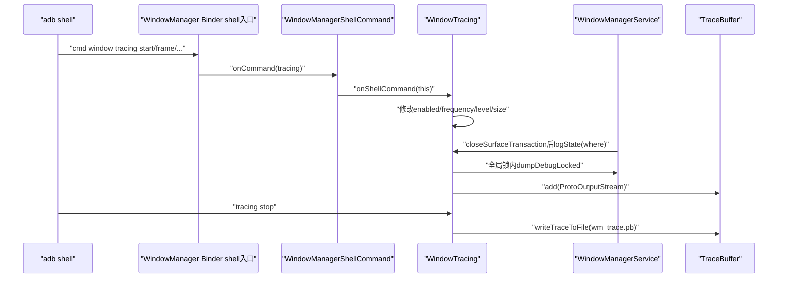
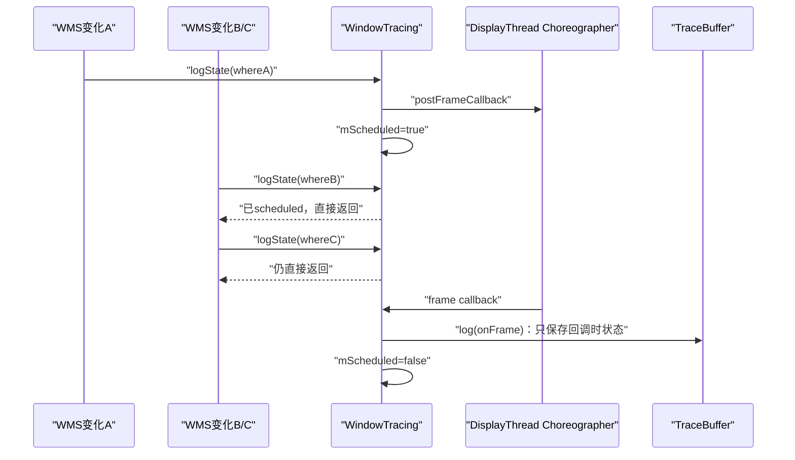
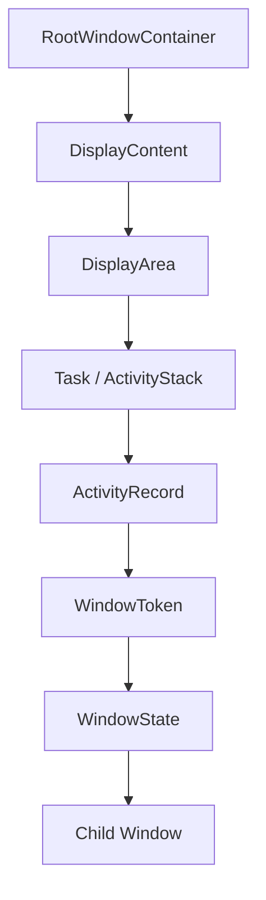
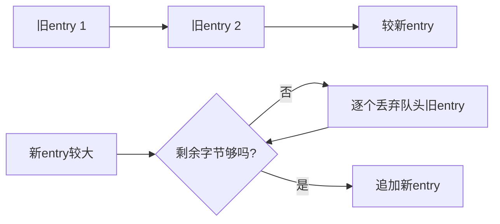
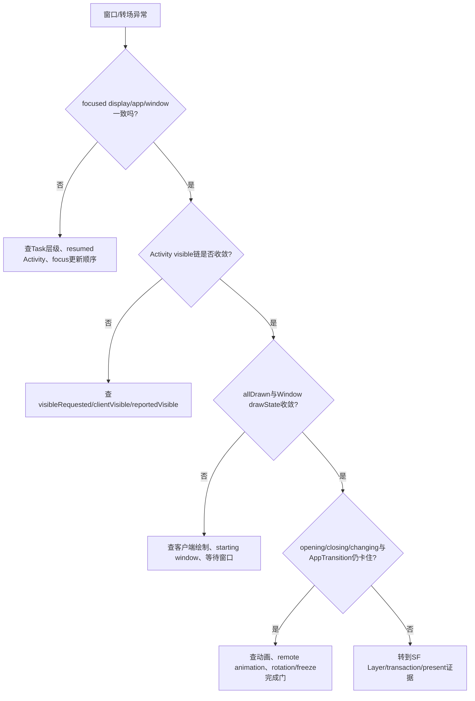

# 172 Android WindowManager Trace、Winscope 与窗口状态时间线

> 源码版本：Android 11 / API 30 / `android-11.0.0_r48`  
> 学习方式：macOS 只读源码，不要求编译、不要求连接设备  
> 前置章节：第 168—171 章

---

## 1. 本章目标：把“窗口曾经怎样变化”变成时间线

`dumpsys window` 很适合回答：

> 采集这一刻，WMS 认为有哪些 Display、Task、Activity 和 Window？

但转场卡住、窗口闪现、焦点短暂错误、旋转中间态、IME 一闪而过等问题，真正要问的是：

> 在故障发生前后，WMS 状态按什么顺序变化？

WindowManager Trace 会连续保存多份 WMS Proto 快照。Winscope 再把这些快照放到时间轴上，帮助我们逐步观察窗口树、可见性、焦点、几何和转场集合。

本章要建立的模型是：

```text
WMS发生一个可记录的Surface transaction关闭点
→ transaction模式立即采样，或frame模式合并到下一帧采样
→ 在WMS全局锁内把窗口树序列化为Proto
→ 写入按字节容量淘汰旧条目的内存环形缓冲
→ stop/bugreport时写成wm_trace.pb
→ Winscope按elapsedRealtimeNanos展示时间线
```

最重要的一句话：

> WindowManager Trace 是“采样到的一系列 WMS 状态”，不是每次字段赋值的完整事件日志，也不是 SurfaceFlinger 最终画面的录像。

---

## 2. 先做版本纠偏：以r48内置旧版Winscope为准

当前源码树内同时包含：

```text
frameworks/base/services/core/java/com/android/server/wm/WindowTracing.java
development/tools/winscope/
```

它们代表 Android 11 时期的 trace 生产和查看方案。后来版本的 Winscope UI、统一抓取工具、Perfetto 集成和 Proto 字段已经有明显变化。

本章不把新版文档反套到 r48，尤其不假设：

- trace 可以在 `user` build 上启用；
- WMS trace 是 Perfetto 数据源；
- `frame` 模式无条件记录每个 VSync；
- `transaction` 模式记录系统中每一笔 SurfaceControl Transaction；
- WMS 与 SF trace 的同索引条目属于同一原子帧；
- 新版 Winscope 页面显示的所有字段都存在于 r48 Proto。

---

## 3. 本章要回答的十二个问题

1. `cmd window tracing` 怎样进入 `WindowTracing`？
2. 为什么 user build 不能启用这套 trace？
3. start、stop、status、frame、transaction、level、size 分别做什么？
4. transaction 频率到底记录哪些 transaction？
5. frame 频率为什么会合并多次状态变化？
6. 一个 trace entry 的时间戳和 `where` 分别代表什么？
7. WMS 在什么锁、什么线程上序列化状态？
8. ALL、TRIM、CRITICAL 三种 level 怎样影响内容和容量？
9. `TraceBuffer` 如何淘汰旧快照、怎样落盘？
10. WMS trace 能看见哪些窗口状态，又看不见哪些像素事实？
11. Winscope 怎样对齐 WMS、SF、ProtoLog 和录像？
12. 如何诊断窗口错位、焦点错误、转场卡住与 IME 异常？

---

## 4. 源码地图

### 4.1 trace控制与采集

```text
frameworks/base/services/core/java/com/android/server/wm/
├── WindowTracing.java
├── WindowTraceLogLevel.java
├── WindowManagerShellCommand.java
└── WindowManagerService.java
```

### 4.2 通用内存缓冲

```text
frameworks/base/core/java/com/android/internal/util/TraceBuffer.java
```

### 4.3 Proto结构

```text
frameworks/base/core/proto/android/server/
├── windowmanagertrace.proto
├── windowmanagerservice.proto
├── windowcontainerthumbnail.proto
└── surfaceanimator.proto
```

### 4.4 r48内置Winscope

```text
development/tools/winscope/
├── src/decode.js
├── src/transform_wm.js
├── src/transform_sf.js
├── src/App.vue
├── adb_proxy/winscope_proxy.py
└── trace.sh
```

### 4.5 测试

```text
frameworks/base/services/tests/wmtests/src/com/android/server/wm/WindowTracingTest.java
frameworks/base/services/tests/servicestests/src/com/android/server/utils/TraceBufferTest.java
```

---

## 5. 从shell命令到WindowTracing

入口命令是：

```text
adb shell cmd window tracing <subcommand>
```

调用链如下：



`WindowManagerShellCommand` 对 `tracing` 分支直接访问内部 `mWindowTracing`。这是 system_server 内部对象调用，不是另起一个独立 trace daemon。

---

## 6. 默认文件和magic header

默认落盘位置是：

```text
/data/misc/wmtrace/wm_trace.pb
```

文件开头写入固定 magic number。按字节观察是：

```text
09 57 49 4e 54 52 41 43 45
   W  I  N  T  R  A  C  E
```

`development/tools/winscope/src/decode.js` 用这个头识别 `WindowManagerTraceFileProto`，避免仅靠文件扩展名猜类型。

文件主体是：

```proto
message WindowManagerTraceFileProto {
    optional fixed64 magic_number = 1;
    repeated WindowManagerTraceProto entry = 2;
}
```

每个 entry 都是一份完整或裁剪后的 WMS 状态快照，而不是相对前一条的字段 delta。

---

## 7. user build明确不支持启停

`startTrace()` 和 `stopTrace()` 开头都检查：

```java
if (IS_USER) {
    logAndPrintln(pw,
            "Error: Tracing is not supported on user builds.");
    return;
}
```

因此这套 r48 trace 主要面向 `userdebug`/`eng` 调试环境。命令能进入 shell handler，不代表 trace 真正启用；要看返回文本或 `status`。

本套笔记按用户要求在 macOS 上只读源码，不执行编译，也不假装已有 userdebug 设备数据。文中的 adb 命令只用于理解接口和未来可选验证。

---

## 8. start不只是把enabled设为true

`startTrace()` 在 `mEnabledLock` 下执行：

1. 启动 `ProtoLogImpl`；
2. 打印目标文件；
3. 清空旧 `TraceBuffer`；
4. 同时把锁内 `mEnabled` 和 volatile `mEnabledLockFree` 设为 true；
5. 离开锁后立即记录一条 `where="trace.enable"` 的初始快照。

所以 start 是新 session 边界：旧内存历史会被丢弃，不是继续追加。

初始 entry 很重要，它给时间线一个起点；也解释了测试中“start 后再主动 log 一次”会调用两次 `dumpDebugLocked()`。

---

## 9. stop先禁用，再把内存快照写入文件

正常 `stopTrace()` 会：

```text
enabled=false
→ writeTraceToFileLocked()
→ 停止ProtoLog并选择是否落盘
```

文件并不是每生成一个 entry 就持续 append。运行期主体保存在内存 `TraceBuffer`，stop 才写文件。

这带来两个结论：

- system_server 崩溃或设备重启前没有落盘，内存中的最新窗口历史可能丢失；
- stop 返回表示代码已尝试写文件，不等价于文件内容一定完整，后文会看到异常只记录日志。

---

## 10. status只报告采集器与缓冲状态

`getStatus()` 输出：

```text
Status: Enabled/Disabled
Log level: ...
Buffer size: ... bytes
Buffer usage: ... bytes
Elements in the buffer: ...
```

它可以回答：

- 当前是否允许新 entry；
- 当前 log level；
- 分配的字节容量；
- 已使用多少字节、保存多少个 entry。

它不能证明：

- 每个应该发生的采样都成功；
- 没有老 entry 被淘汰；
- 文件已经写盘；
- Proto 中每个窗口字段都齐全；
- SF trace 正同步运行。

---

## 11. transaction模式的真实触发点

WMS 封装了：

```java
void closeSurfaceTransaction(String where) {
    SurfaceControl.closeTransaction();
    mWindowTracing.logState(where);
}
```

默认 `mLogOnFrame=false`，所以 `logState(where)` 立即调用 `log(where)`。

常见 `where` 包括：

```text
performLayoutAndPlaceSurfaces
WindowAnimator
handleAppTransitionReady
setWallpaperOffset
setSecure
RemoteAnimationController#finished
```

因此这里的 transaction 更准确地说是：

> WMS 代码路径通过自己的 `closeSurfaceTransaction(where)` 关闭 legacy global Surface transaction 后，记录一份 WMS 状态。

---

## 12. transaction模式不记录全系统所有SurfaceControl Transaction

App 进程可以创建和 apply 自己的 `SurfaceControl.Transaction`，SurfaceFlinger 内部也会处理许多事务。它们不会自动调用 system_server 里的 `mWindowTracing.logState()`。

所以不能从：

```text
WMS trace中没有一条transaction entry
```

推出：

```text
这段时间没有任何SurfaceControl Transaction
```

若要研究 SF 接收到的事务本身，应结合 SurfaceFlinger transaction trace；若要看最终 Layer 状态，应结合 layers trace。WMS transaction 模式只代表 WMS 自己选定的采样点。

---

## 13. transaction模式在哪个线程做序列化

`logState()` 在非 frame 模式直接调用 `log()`，没有切到专用 worker。也就是说：

> 哪个线程执行了 WMS `closeSurfaceTransaction(where)`，哪个线程就继续构造 Proto、获取 WMS 全局锁并把 entry 加入缓冲。

许多主路径位于 WMS 的 DisplayThread 或动画相关线程，但不能把所有 entry 一概写成“固定后台 trace 线程”。

序列化整棵窗口树会增加当前路径耗时；`ALL` 级别和复杂窗口树尤其明显。这也是 level 和 frequency 需要取舍的原因。

---

## 14. frame模式不是无条件每VSync记录

执行：

```text
cmd window tracing frame
```

只是设置 `mLogOnFrame=true`。之后必须先有某个 WMS `closeSurfaceTransaction(where)` 调用 `logState()`，才会执行 `schedule()`：

```java
if (mScheduled) return;
mScheduled = true;
mChoreographer.postFrameCallback(mFrameCallback);
```

如果系统连续有 VSync、但没有 WMS 状态触发点，WindowTracing 不会凭空为每个 VSync 写重复快照。

---

## 15. frame模式怎样合并多次变化



这减少重复快照与性能开销，却会主动丢掉 A→B→C 的中间状态。如果错误只存在于同一帧内很短的一段，frame 模式可能看不见。

---

## 16. frame回调运行在DisplayThread的普通Choreographer

WMS 自身通过：

```java
DisplayThread.getHandler().runWithScissors(
        () -> new WindowManagerService(...));
```

在 DisplayThread 构造；构造器调用 `Choreographer.getInstance()`，再交给 `WindowTracing`。

所以本章 frame trace 回调绑定的是 DisplayThread 的普通 Choreographer。不要与 `WindowAnimator` 在 AnimationThread 中取得的 `Choreographer.getSfInstance()` 混为一谈。

名字都叫 Choreographer，但 looper、VSync source 和用途不同。

---

## 17. 切换frequency会立即清空缓冲

`frame` 和 `transaction` 子命令在修改模式后都会调用：

```java
mBuffer.resetBuffer();
```

因此切换模式不是保留前半段后继续采集，而是丢弃已收集的 entry。

正确使用顺序应是先选 frequency，再 start 并复现问题。若在故障后才切换 frame/transaction，先前现场会从内存中消失。

还有一个更隐蔽的边界：切换模式不会调用 `removeFrameCallback()`。如果 frame 模式已经预约了回调，随后切到 transaction，旧回调仍可能到达并写一条 `where="onFrame"`。所以模式切换后的第一条样本不一定完全属于新模式。

---

## 18. 每个entry的三个顶层字段

`WindowManagerTraceProto` 只有三个顶层字段：

```proto
optional fixed64 elapsed_realtime_nanos = 1;
optional string where = 2;
optional WindowManagerServiceDumpProto window_manager_service = 3;
```

可以理解为：

```text
when  = elapsedRealtimeNanos
why-ish = where
what  = window_manager_service快照
```

这里故意把 `where` 说成 “why-ish”：它只是采样调用点标签，并不是经过因果分析后的“状态为什么变化”。frame 模式中统一写 `onFrame`，原始的 whereA/whereB 都被合并丢失。

---

## 19. 时间戳写在获取WMS全局锁之前

`log()` 的顺序是：

```java
os.write(ELAPSED_REALTIME_NANOS,
        SystemClock.elapsedRealtimeNanos());
os.write(WHERE, where);

synchronized (mGlobalLock) {
    mService.dumpDebugLocked(os, mLogLevel);
}
```

若等待 `mGlobalLock` 很久，entry 时间戳更接近“开始尝试记录”的时间，而真正窗口状态是稍后拿到锁后才读取的。

因此时间戳不是状态树所有字段的硬件级原子采样时刻。正常负载下偏差通常小；锁竞争严重时，这个边界本身就可能影响时间线判断。

---

## 20. WMS全局锁提供了什么一致性

`dumpDebugLocked()` 在 `mGlobalLock` 内遍历 WMS 对象树，所以同一个 entry 中的 Root、Display、Task、Activity、Window、焦点和转场集合通常来自一个受 WMS 主锁保护的状态。

它提供的是：

> WMS Java 对象状态的锁内一致视图。

它不提供：

- 与 App UI 线程状态的跨进程原子性；
- 与 SurfaceFlinger drawing state 的跨进程原子性；
- 与 InputDispatcher 当前窗口快照的原子性；
- 与 HWC present 或面板 scanout 的原子性。

---

## 21. WMS顶层快照记录什么

`WindowManagerService.dumpDebugLocked()` 写入：

- `WindowManagerPolicyProto`；
- RootWindowContainer 窗口层级树；
- 当前 focused window；
- focused app；
- 当前 IME window；
- display 是否 frozen；
- 默认 display rotation；
- last orientation；
- top focused display id。

这些字段非常适合回答“WMS 想把输入/窗口/方向交给谁”，但不直接说明该窗口的 buffer 是否已经被 SF latch。

---

## 22. WindowContainer树是理解trace的骨架

Android 11 已通过统一 `WindowContainerProto.children` 表示混合类型层级：



每个 `WindowContainerChildProto` 一次只选择一种具体类型。Winscope 的 `transform_wm.js` 根据 `displayContent/displayArea/task/activity/windowToken/window` 恢复树。

这比只搜窗口名更有价值，因为同名窗口可能处于不同用户、Task、Display 或 starting-window 代际。

---

## 23. Proto中的children顺序与UI展示顺序

`WindowContainer.dumpDebug()` 按 `getChildAt(0)...getChildAt(n-1)` 写 children。r48 Winscope 转换代码常对 children 调用 `.reverse()` 后展示。

这说明工具 UI 为了按更直观的 top-to-bottom 方向展示，改变了原始数组阅读方向。

直接用 `protoc` 或脚本解析原始 Proto 时，不应假设第一项就是最上层窗口；先核对容器内部排序和查看器是否 reverse。

---

## 24. DisplayContent可诊断什么

每个 DisplayContent 可包含：

- display id、density 与 DisplayInfo；
- 当前 rotation 与 DisplayFrames；
- screen rotation animation；
- focused app；
- AppTransition 状态；
- opening/closing/changing apps；
- overlay windows；
- focused root task id 与 resumed activity；
- display ready；
- 完整子容器树。

转场卡住时，应把 `app_transition_state`、opening/closing/changing 集合、Activity 可见状态和 Window draw state 放在相邻 entry 中一起看。

---

## 25. ActivityRecord可见性不是一个布尔值

Activity Proto 同时保留：

```text
visible
visible_requested
client_visible
reported_visible
reported_drawn
all_drawn / last_all_drawn
num_interesting_windows / num_drawn_windows
app_stopped
state
is_animating
starting_window / starting_displayed / starting_moved
```

这些字段处于不同责任层：

- `visible_requested` 更接近系统希望 Activity 可见；
- `client_visible` 涉及通知客户端可见；
- `reported_*` 来自窗口绘制/可见性汇总；
- `all_drawn` 是一组相关窗口的完成条件；
- `visible` 是当前 WMS 综合状态。

“Activity 已 resumed”不等于“其所有窗口已画好”，更不等于“SF 已 present”。

---

## 26. WindowState能提供哪些直接证据

Window Proto 包括：

- identifier：identity hash、user id、窗口 title；
- display id 与 root task id；
- LayoutParams attributes；
- requested width/height；
- WindowFrames 和 surface insets/position；
- `has_surface`；
- `is_ready_for_display`；
- `is_on_screen`、`is_visible`；
- view/system UI visibility；
- animator draw state 与 surface shown/layer；
- animatingExit、removeOnExit、destroying、removed；
- seamless rotation pending/finished frame。

它能证明 WMS 的窗口对象和 Surface 生命周期判断，却不能直接证明对应 GraphicBuffer 内容正确。

---

## 27. 窗口几何要同时看frames与surface position

窗口错位不能只看一个 `frame`。至少要核对：

```text
parent/content/display/decor/visible frame
content/visible/stable/surface insets
surface position
requested width/height
DisplayInfo logical size与rotation
父WindowContainer bounds/configuration
```

WMS 负责计算策略布局和 Surface 位置；SF 还会叠加 Layer transform、crop、buffer transform、父层矩阵。WMS trace 中矩形正确，只能把疑点向 WMS 后段/SF 移动，不能证明最终像素位置正确。

---

## 28. draw state是连接WMS与App绘制的重要桥

`WindowStateAnimatorProto.DrawState` 包括：

```text
NO_SURFACE
DRAW_PENDING
COMMIT_DRAW_PENDING
READY_TO_SHOW
HAS_DRAWN
```

简化理解：

```text
无Surface
→ 已要求客户端绘制
→ 客户端报告完成，等待提交/布局处理
→ 满足显示准备
→ 已进入绘制完成状态
```

但 `HAS_DRAWN` 仍是 WMS 生命周期状态，不是当前 buffer 的 present fence。把它写成“用户已经看见”是不准确的。

---

## 29. 焦点要看window、app和display三层

多显示、多窗口和转场时，至少有：

- WMS 顶层 `focused_window`；
- WMS 顶层 `focused_app`；
- `focused_display_id`；
- 每个 DisplayContent 的 `focused_app`；
- resumed activity；
- InputDispatcher 自己的 focused window/application。

焦点错误诊断不能只看“Activity resumed”。正确问题是：

```text
哪个display被聚焦
→ WMS选择了哪个app token
→ 当前WindowState是谁
→ InputDispatcher何时收到对应窗口快照
```

---

## 30. ALL、TRIM、CRITICAL的语义

`WindowTraceLogLevel` 定义：

| level | 树范围 | 配置细节 | 默认容量 |
|---|---|---|---:|
| ALL | 所有元素 | 最大信息量，含完整/合并配置 | 4 MiB |
| TRIM | 所有元素 | 减少配置等冗长信息 | 2 MiB |
| CRITICAL | 主要保留可见元素 | 最低开销 | 512 KiB |

默认是 TRIM。

“TRIM”不是只记录可见窗口；它仍遍历所有元素，只省掉部分重信息。“CRITICAL”才会在 Root、Display、Task/Activity、Token、WindowContainer 等多层按 `isVisible()` 提前裁剪。

---

## 31. level不是过滤已有entry，而是改变后续序列化

执行：

```text
cmd window tracing level all|trim|critical
```

会同时：

1. 改变 `mLogLevel`；
2. 把 buffer 容量设成对应默认值；
3. 清空当前 buffer。

因此无法对已有 TRIM entry 事后“升级成 ALL”，也不能用切换 level 的方式保留同一现场的前后两种粒度。

若问题涉及不可见但错误残留的窗口，CRITICAL 可能正好把关键对象过滤掉，应在复现前选 TRIM 或 ALL。

---

## 32. size按KB设置，也会清空历史

`size` 子命令执行：

```java
setBufferCapacity(
        Integer.parseInt(arg) * 1024, pw);
mBuffer.resetBuffer();
```

这里按二进制 `1024` 换算，但没有对负数、零或乘法溢出做显式校验。异常或非正容量可能使后续任何非空 entry 被判为“对象大于 buffer”，进而记录失败。

正常使用时应给合理正整数，并在复现前设置；不要把 `size` 当成不破坏现场的在线扩容命令。

---

## 33. TraceBuffer按字节容量，不按固定条数

每次 `add(proto)` 先读取 entry 的 raw byte size。若剩余空间不足，就从队头不断 `poll()` 最老 entry，直到新 entry 放得下。



所以“2 MiB 大约能保存多少帧”没有固定答案。窗口树越复杂、level 越详细，单条越大，保留时长越短。

---

## 34. 单个entry超过总容量会怎样

`TraceBuffer.add()` 在加锁前检查：

```java
if (protoLength > mBufferCapacity) {
    throw new IllegalStateException(...);
}
```

`WindowTracing.log()` 用大范围 `catch (Exception)` 捕获并 `Log.wtf`，所以 system_server 通常不会因此直接崩溃，但这一条不会进入 buffer。

若复杂窗口树在 CRITICAL 或自定义小容量下仍大于总容量，trace 可能持续缺条；`status` 只显示 buffer 内现有元素，不会累计“丢了多少条”的计数。

---

## 35. frame模式发生异常后可能永久不再预约

frame 模式先把 `mScheduled=true`，只有 `log()` 正常执行到 `mBuffer.add(os)` 后才设置：

```java
mScheduled = false;
```

这个复位不在 `finally` 中。若序列化或 `add()` 抛异常，catch 只记日志，`mScheduled` 仍为 true。后续 `schedule()` 会一直认为已经预约，从而不再 post 新回调。

transaction 模式下下一触发点还能再次直接 `log()`；frame 模式则可能在一次异常后静默停止增长。这是复读源码才能发现的重要 r48 边界。

---

## 36. mScheduled本身没有同步保护

`mScheduled` 是普通 boolean，不是 volatile，也没有专用锁。`logState()` 可能由不同 WMS 代码线程触发，而 frame callback 又在 DisplayThread 复位它。

源码通常依赖 WMS 操作和 transaction 关闭点的线程/全局锁约束来减少竞争，但 `WindowTracing` 类自身没有完整声明这些并发前提。

因此不能把 frame 合并器描述成严格的线程安全状态机；极端并发下可能重复预约或可见性延迟。诊断工具自身也有工程边界。

---

## 37. stop并没有真正等待所有in-flight log完成

输出文字写着：

```text
Waiting for traces to flush.
```

但 `log()` 不持有 `mEnabledLock`。一种可能竞态是：

```text
线程A先看到mEnabledLockFree=true
→ 线程B执行stop、写文件
→ 线程A稍后才把entry加入内存buffer
```

这样晚到 entry 可能不在刚写出的文件中。stop 内部将 `mEnabled=false` 后立即检查 `if (mEnabled)`，在同一锁内该条件也无法检测另一个 start 介入。

frame callback 还有更直接的边界：

```java
private final Choreographer.FrameCallback mFrameCallback =
        frameTimeNanos -> log("onFrame");
```

它直接调用 `log()`，不会再次执行 `isEnabled()` 检查；stop 也没有取消已预约 callback。因此 stop 写盘之后，旧 callback 仍可能向内存 buffer 追加一条晚到的 `onFrame`，只是这条通常已经赶不上刚写出的文件。

如果紧接着快速 start，新 session 会 reset buffer 并直接 `log("trace.enable")`；该 `log()` 又会把 `mScheduled=false`，但旧 callback 仍在 Choreographer 队列中。此时新状态变化可以再 post 一个 callback，最终出现旧、新两个 `onFrame` 回调进入同一新 session 的可能。

所以“Waiting for traces to flush”是意图描述，不是由显式 in-flight 计数、callback取消或 condition 构成的严格 session 屏障。

---

## 38. writeTraceToFile的可靠性边界

`TraceBuffer.writeTraceToFile()` 在 buffer lock 下：

1. 删除旧文件；
2. 新建 FileOutputStream；
3. 把文件设为所有用户可读；
4. 写 magic proto 和所有 entry bytes；
5. flush 并关闭。

它不是 AtomicFile 流程。若写入中断，旧文件已经删除，可能只剩不完整新文件。

更重要的是 `WindowTracing.writeTraceToFileLocked()` 自己捕获 IOException，只写 log；调用它的 stop 随后仍打印 `Trace written to ...`。因此 shell 成功文案不能替代文件大小、magic 和可解析性检查。

---

## 39. 文件可读不等于普通App可以访问

代码调用：

```java
traceFile.setReadable(true, false /* ownerOnly */);
```

这尝试把 Unix 读权限开放给所有用户，但目录 `/data/misc/wmtrace`、SELinux 和 Android 权限边界仍会限制访问。

r48 自带 Winscope proxy 使用 `su root` 启停和读取 trace。不能因为文件 mode 可读，就推断任意第三方 App 能打开它。

同时 Proto 可能含窗口 title、组件名、用户 id 和布局状态，采集与分享时仍应按敏感诊断数据处理。

---

## 40. bugreport采集会短暂停止、异步写盘再重启

WMS 的 critical proto dump 路径发现 tracing 已启用时，会：

```text
stopTrace(writeToFile=false)
→ BackgroundThread异步writeTraceToFile()
→ startTrace()
```

这样避免 bugreport 的文本和 proto 阶段重复保存同一 trace，但它不是无缝切片：停止到重新 start 之间有空窗；重新 start 又会 reset buffer 并写新的 `trace.enable`。

所以 bugreport 本身可能改变 trace session 边界，分析时间线结尾时要留意这一点。

---

## 41. 静态window --proto与trace entry复用同一主体schema

`dumpsys window --proto` 也调用：

```java
dumpDebugLocked(proto, WindowTraceLogLevel.ALL);
```

它直接输出一份 `WindowManagerServiceDumpProto`，而 trace 每个 entry 在时间戳和 where 外层中嵌入同样的 WMS dump Proto。

区别是：

```text
window dump = 一次ALL快照
window trace = 多次可配置level快照 + 时间戳 + where + 环形缓冲
```

Winscope 的 `decode.js` 也分别把它们识别为 `window_dump` 和 `window_trace`。

---

## 42. Winscope不是采集器本身

r48 Winscope 大致分成三层：

```text
设备生产Proto文件
→ adb proxy负责启停、root读取和传输
→ 浏览器端decode/transform/UI负责解析和展示
```

浏览器页面不会神奇补回设备端未采样的中间状态。它把 Proto 字段转成树、矩形、chips 和时间线，仍受生产端 frequency、level、buffer 淘汰与错误路径限制。

分析时应先问“数据如何产生”，再问“UI 怎样显示”。

---

## 43. Winscope怎样对齐不同trace

WMS trace 和 SF layers trace 都记录 `elapsed_realtime_nanos`。r48 Winscope 选中一个文件的时间点 `t` 时，对其他时间线使用：

```text
找到 timestamp <= t 的最后一个样本
```

而不是要求两边 timestamp 完全相等。

这是一种“最近的历史状态”对齐：

- 非常适合跨 trace 大致观察因果顺序；
- 不表示两份状态在同一个锁或同一个 VSync 原子采集；
- 采样稀疏的一侧可能在 UI 上长时间沿用旧 entry。

---

## 44. WMS对象与SF Layer没有统一稳定ID

WMS `IdentifierProto.hash_code` 使用 Java `System.identityHashCode()`；SF Layer 有自己的 layer id/sequence。两者不是可直接 join 的同一 ID。

跨层匹配通常依赖：

```text
窗口/Layer名称
父子树关系
display与layerStack
窗口frame与Layer bounds/transform
创建/销毁时间顺序
starting window、thumbnail、leash等角色
```

名称可能重复，动画 leash 和 starting surface 还会改变树形。因此匹配结论应写成“由多项证据推断”，不要伪装成主键关联。

---

## 45. WMS trace与SF trace的责任分工

| 问题 | WMS trace更擅长 | SF trace更擅长 |
|---|---|---|
| 窗口为什么存在 | token/task/activity/策略状态 | 只看到对应Layer结果 |
| 谁应获得焦点 | focused app/window/display | 输入Layer信息有限，非WMS决策源 |
| 窗口目标几何 | frames、insets、configuration | 最终Layer bounds/crop/transform |
| 是否已请求可见 | Activity/Window visible状态 | drawing Layer是否可见、alpha/遮挡 |
| 是否有Surface | `has_surface`、draw state | 是否有active buffer及Layer类型 |
| 最终如何合成 | 无HWC最终类型 | visible region、CLIENT/DEVICE等 |
| 是否已经present | 不能直接证明 | 仍需present fence/frame timeline证据 |

两者不是替代关系，而是“窗口管理意图”与“合成执行状态”的上下游证据。

---

## 46. 窗口错位的诊断模板

按顺序检查：

1. WMS DisplayInfo 的 logical width/height、rotation 是否在预期时间变化；
2. 父 DisplayArea/Task/Activity configuration 与 bounds 是否一致；
3. WindowFrames、surfaceInsets、surfacePosition 是否正确；
4. pending seamless rotation 是否长期不消失；
5. 同时刻 SF Layer 的 parent、bounds、crop、transform 是否跟随；
6. Input 窗口 touchable region/transform 是否也收敛。

判断方式：

```text
WMS已错 → 优先查布局、Insets、rotation/config传播
WMS正确但SF错 → 优先查Surface transaction、leash、Layer transform
画面正确但触摸错 → 优先查Input窗口快照与坐标变换
```

---

## 47. 焦点错误与转场卡住的诊断图



trace 的价值不在某一个字段，而在于找出“哪个门从某一条 entry 起再也没有变化”。

---

## 48. IME一闪、遮挡或位置异常怎样读

建议同时追：

- WMS 顶层 `input_method_window` 身份；
- IME WindowState 是否创建、hasSurface、draw state、visible；
- IME 所在 DisplayArea/WindowToken 的层级；
- focused window/app/display 的切换时序；
- WindowFrames 与 Insets 变化；
- Activity 是否 `adjusted_for_ime` 及相关 Task 调整量；
- SF 中 IME Layer/leash 的 Z、crop、transform 和 buffer；
- InputMethodManagerService 的绑定/session证据。

如果 frame 模式只显示“出现前”和“消失后”，应考虑中间状态被同帧合并，而不是直接得出“IME Window 从未创建”。

---

## 49. macOS只读练习、复读审计与核心结论

### 49.1 练习1：追采样入口

```bash
rg -n "closeSurfaceTransaction|logState|mLogOnFrame|postFrameCallback" \
  frameworks/base/services/core/java/com/android/server/wm
```

列出每个 `where`，并标记它是 transaction 模式的直接标签，还是 frame 模式中会被合并成 `onFrame`。

### 49.2 练习2：比较三种level

阅读：

```text
WindowTraceLogLevel.java
ConfigurationContainer.dumpDebug()
WindowContainer.dumpDebug()
ActivityRecord.dumpDebug()
WindowState.dumpDebug()
```

回答：TRIM 少了哪些配置，CRITICAL 又在哪些层过滤不可见对象。

### 49.3 练习3：手推环形淘汰

假设容量 1000 字节，已有 entry 大小为 200、300、250，新 entry 为 500：

```text
当前使用750，剩250
→ 丢200，剩450，仍不足
→ 再丢300，剩750
→ 加500
→ 最终保留250与500，共750
```

这说明一次大 entry 可能同时淘汰多条小 entry。

### 49.4 练习4：建立跨trace匹配表

| WMS证据 | SF证据 | 结论边界 |
|---|---|---|
| Window visible + hasSurface | Layer不可见 | 可疑点在WMS→SF提交/Layer可见计算 |
| Window frame错误 | Layer也同样错 | 更像WMS布局上游问题 |
| WMS frame正确 | Layer transform错误 | 更像leash/transaction/SF状态问题 |
| focused window正确 | Input目标错误 | 查Input窗口快照更新与dispatch |

### 49.5 复读审计：r48最容易误解的十六处

1. WindowManager Trace 不是字段变更日志，而是多份状态快照。
2. user build 上 start/stop 明确拒绝。
3. start 会清空旧 buffer，并额外记录 `trace.enable`。
4. stop 才主要落盘，运行中 entry 只保存在内存。
5. transaction 模式只跟随 WMS 自己的 `closeSurfaceTransaction()`，不是全系统 transaction。
6. transaction 模式没有专用写线程，会在触发线程序列化。
7. frame 模式要先发生 `logState()` 才预约，不是每个 VSync 无条件采样。
8. 同一帧前的多次变化合并成一个 `onFrame`，中间态会丢。
9. entry 时间戳写在等待 WMS 全局锁之前，锁竞争时可能早于真实状态读取。
10. TRIM 保留所有元素但减少配置；CRITICAL 才过滤不可见树节点。
11. frequency、level、size 的切换都会清空已有历史。
12. buffer 按字节淘汰，不按帧数，保留时长随 entry 大小变化。
13. frame 模式异常后 `mScheduled` 未在 finally 复位，可能停止后续预约。
14. stop/切模式不取消已预约 frame callback，晚到 `onFrame` 可能越过模式或 session 边界。
15. stop 没有严格等待所有 in-flight log，打印写入成功也不能证明文件完整。
16. Winscope 用最近的 `timestamp <= t` 对齐其他 trace，不代表跨进程原子帧。

### 49.6 本章核心结论

> Android 11 r48 的 WindowManager Trace 在 WMS 关闭自己管理的 Surface transaction 后触发：transaction 模式直接在触发线程采样，frame 模式把一次或多次触发合并到 DisplayThread 下一帧回调；二者都在 WMS 全局锁内序列化窗口状态，但不能覆盖每次字段变化或全系统每笔 transaction。

> TraceBuffer 是按字节容量保存完整 entry 的先进先出缓冲，level/frequency/size 切换都会重置历史，stop 才尝试写出 `wm_trace.pb`。采集本身存在锁扰动、单条过大、frame 预约卡死、旧 callback 跨模式/session、stop 与 in-flight 竞态和非原子落盘等 r48 边界。

> Winscope 通过 elapsed realtime 把 WMS 的窗口管理意图与 SF 的 Layer 合成状态放在相邻时间轴上，但没有共同稳定对象 ID，也不是同一时刻的原子快照。可靠结论来自名称、树、几何、状态迁移和时间顺序的多证据交叉。

---

## 50. 自测题与下一章预告

### 50.1 自测题

1. 为什么静态 `dumpsys window` 很难解释窗口闪现？
2. user build 执行 `cmd window tracing start` 会怎样？
3. start 为什么会产生一条 `trace.enable` entry？
4. transaction 模式能否记录 App 进程所有 SurfaceControl Transaction？
5. frame 模式没有 WMS transaction 触发时，会否每个 VSync 采样？
6. 同一帧内 A→B→C 三次变化，frame 模式通常保留什么？
7. entry 时间戳为何可能早于真实窗口树读取？
8. TRIM 与 CRITICAL 的过滤范围有何区别？
9. 为什么 2 MiB buffer 不能换算成固定帧数？
10. frame 模式一次过大 entry 为什么可能让后续采样停住？
11. stop 为什么不能阻止已经预约的 frame callback 晚到？
12. stop 输出 `Trace written` 为什么不能证明文件完整？
13. Winscope 选中 WMS 时间点时，如何选择 SF 的对应 entry？
14. WMS Window identity hash 能否直接与 SF Layer id关联？
15. `HAS_DRAWN` 能否证明用户已经看到像素？
16. 诊断窗口错位时，WMS 与 SF 各应看什么？

### 50.2 下一章预告

第 173 章继续补齐 WMS 到输入系统的诊断链：

> **Android InputWindowHandle、InputDispatcher 窗口快照与触摸路由**

重点回答：

- WMS 怎样把 WindowState 转换成 InputWindowHandle？
- SurfaceFlinger Transaction 中的 InputWindowCommands 怎样进入 InputDispatcher？
- focus、touchable region、transform、display id 和 inputFeatures 如何共同选中目标？
- 为什么画面位置正确但触摸仍可能错位？
- WMS trace、SF Layer trace、InputDispatcher dump 应怎样按状态代际交叉验证？
