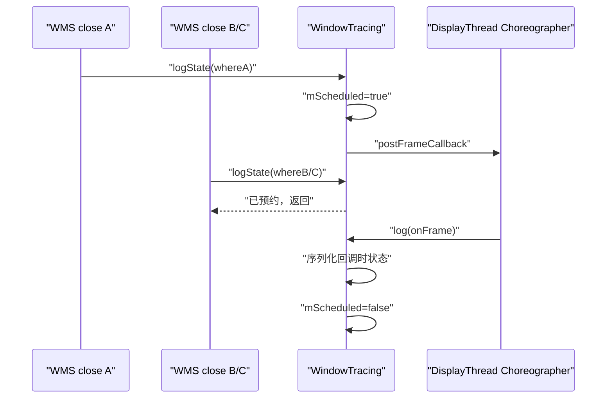

# 172 Android WindowManager Trace、Winscope 与窗口状态时间线

> 源码版本：Android 11 / API 30 / `android-11.0.0_r48`  
> 学习方式：macOS 静态只读源码，不要求编译或连接设备  
> 前置章节：第 168—171 章

---

## 1. WindowManager Trace 保存的是状态序列，不是字段变更日志

`dumpsys window` 适合回答“现在 WMS 认为有哪些 Display、Task、Activity 和 Window”。窗口闪现、旋转中间态、焦点短暂错误、IME 一闪或转场卡住则需要回答：

```text
故障前后
→ 窗口树怎样变化
→ visible/draw/focus 在哪一项停住
→ 几何何时偏离
→ WMS 意图与 SF Layer 何时分叉
```

Android 11 r48 的 WindowManager Trace 会反复序列化一份 WMS Proto 快照，按字节预算放入内存 FIFO；stop 或 bugreport 路径再尝试写成 `wm_trace.pb`。每个 entry 是一份完整或按 level 裁剪的状态，不是对上一条的 delta。

它能证明“某个采样点的 WMS Java 对象状态”，不能自动证明：

- 两个采样点之间每次字段赋值；
- App 进程的所有 SurfaceControl.Transaction；
- SurfaceFlinger 同时刻的 drawing tree；
- InputDispatcher 已消费同一窗口快照；
- HWC present 或面板 scanout。

Winscope 是解析和对齐这些文件的查看器，不会补回生产端没有采到的中间状态。

---

## 2. r48 有 transaction 与 frame 两种触发语义

基础链路是：

```text
WMS closeSurfaceTransaction(where)
→ WindowTracing.logState(where)
→ transaction：当前线程立即 log
   frame：只预约 DisplayThread 下一帧 callback
→ 写 timestamp + where
→ 获取 WMS global lock
→ dumpDebugLocked
→ TraceBuffer.add
```

两种模式的取舍：

| 模式 | 保存什么 | 主要损失 |
|---|---|---|
| transaction（默认） | 每个 WMS 自己选定的 close 点 | 不覆盖 WMS 外部 transaction；序列化阻塞触发线程 |
| frame | 一次或多次触发合并后的下一帧状态 | 同帧 A→B→C 中间态与原始 where 丢失 |

“frame”并非每个 VSync 无条件采样。必须先有 `logState()` 才预约一次 callback；系统只有 VSync、没有 WMS 触发点时不会重复写相同状态。

---

## 3. 源码地图

采集与控制：

```text
frameworks/base/services/core/java/com/android/server/wm/
├── WindowTracing.java
├── WindowTraceLogLevel.java
├── WindowManagerShellCommand.java
├── WindowManagerService.java
├── WindowContainer.java
├── DisplayContent.java
├── ActivityRecord.java
└── WindowState.java
```

通用缓冲与 Proto：

```text
frameworks/base/core/java/com/android/internal/util/TraceBuffer.java

frameworks/base/core/proto/android/server/
├── windowmanagertrace.proto
├── windowmanagerservice.proto
├── windowcontainer.proto
├── windowstate.proto
└── windowtoken.proto
```

r48 内置 Winscope：

```text
development/tools/winscope/
├── src/decode.js
├── src/transform_wm.js
├── src/transform_sf.js
├── src/App.vue
└── adb_proxy/winscope_proxy.py
```

测试：

```text
frameworks/base/services/tests/wmtests/src/com/android/server/wm/WindowTracingTest.java
frameworks/base/services/tests/servicestests/src/com/android/server/utils/TraceBufferTest.java
```

---

## 4. shell 命令定义 session，但 user build 只封锁启停

入口是：

```text
adb shell cmd window tracing <start|stop|status|frame|transaction|level|size>
```

`WindowManagerShellCommand` 在 system_server 内直接调用 `mWindowTracing.onShellCommand()`，没有独立 trace daemon。

### 4.1 start 是重置，不是续写

非 user build 上，`startTrace()`：

1. 在 `mEnabledLock` 内启动 ProtoLog；
2. 清空 TraceBuffer；
3. 同时设置锁内 boolean 与 volatile 快速开关；
4. 离锁后直接记录 `where="trace.enable"`。

重复 start 也没有“已经开启就拒绝”的门，会再次清空历史。初始 entry 若序列化失败，start 的命令文案也不会变成失败。

### 4.2 stop 先关开关，再同步尝试写盘

正常 stop 在 `mEnabledLock` 内设两个 enabled 值为 false，随后写文件；离锁后停止 ProtoLog。运行期不是每条 entry 持续 append 到文件，system_server 崩溃或重启前未落盘的内存历史可能丢失。

源码打印“Waiting for traces to flush”，但没有 in-flight 计数、条件变量或 callback 取消。设 false 后同一锁内立刻检查 `if (mEnabled)` 也必然为 false，不能证明其他 log 已结束。

### 4.3 user build 的边界不是“所有子命令禁用”

只有 start/stop 显式检查 `Build.IS_USER` 并返回错误。status 仍可读，frame/transaction/level/size 仍能改内存配置并重置 buffer，只是无法通过这两个入口开启采集。

### 4.4 status 只描述当前内存对象

它显示 enabled、log level、容量、已用字节和 element 数量，不证明丢失计数为零、文件已写盘、Proto 可解析或 SF trace 同步运行。

---

## 5. transaction 模式只跟随 WMS 自己的 close 点

WMS 封装：

```java
void closeSurfaceTransaction(String where) {
    SurfaceControl.closeTransaction();
    mWindowTracing.logState(where);
}
```

调用点包括 layout/place surfaces、WindowAnimator、app transition、wallpaper、secure/opaque 设置、remote animation finish 等。`where` 是采样调用点标签，不是经过因果分析得出的“变化原因”。

App 进程独立 apply 的 Transaction、SurfaceFlinger 内部事务都不会自动调用 system_server 的 `logState()`。所以：

```text
WMS trace 没有 entry
≠ 全系统没有 SurfaceControl transaction
```

要读 SF 收到的 transaction，应结合 transaction trace；要读最终 Layer 状态，应结合 layers trace。

### 5.1 触发线程承担完整序列化

非 frame 模式直接调用 `log(where)`，没有专用 worker。哪个线程执行 `closeSurfaceTransaction()`，哪个线程就创建 Proto、等待 WMS global lock、遍历窗口树并入队。

许多路径在 DisplayThread、AnimationThread 或其他 WMS 执行线程上；不能把所有样本说成固定后台线程。ALL level 和复杂窗口树会直接增加触发路径耗时，trace 本身也可能扰动被观察系统。

---

## 6. frame 模式把触发合并到 DisplayThread 的 Choreographer

`WindowManagerService.main()` 用 `DisplayThread.getHandler().runWithScissors()` 构造 WMS；构造器调用当前线程的 `Choreographer.getInstance()` 并交给 WindowTracing。因此 frame callback 属于 DisplayThread 的普通 Choreographer。

它不是 WindowAnimator 在 AnimationThread 获取的 `Choreographer.getSfInstance()`。名字相同不代表 Looper 或 VSync source 相同。

### 6.1 合并状态机



whereA/B/C 都不会保留，最终 entry 统一叫 `onFrame`。这能降低重复序列化，却可能漏掉只存在于同一帧内的错误中间态。

---

## 7. mScheduled 不是严格的线程安全 session 屏障

`mScheduled` 是普通 boolean，不是 volatile，也没有专用锁。`logState()` 可由不同 WMS 路径调用，callback 又在 DisplayThread 复位；WindowTracing 自身没有声明完整的 happens-before 前提。

### 7.1 异常可让当前 frame 采集停住

`log()` 只有在序列化和 `mBuffer.add()` 全部成功后才执行：

```java
mScheduled = false;
```

复位不在 finally。若单条过大或序列化抛异常，catch 只 Log.wtf，`mScheduled` 保持 true；后续 schedule 会一直返回。当前 run 可能不再产生 frame entry，直到一次成功的直接 log/start 等路径把它复位。

### 7.2 切模式不会取消旧 callback

frame/transaction 子命令会切 boolean 并清 buffer，却不 `removeFrameCallback()`，也不重置 scheduled。旧 onFrame 仍可能越过模式边界写进新空 buffer。

stop 同样不取消 callback；callback 直接调用 `log("onFrame")`，不重新检查 enabled。于是 stop 写盘后仍可能出现一条只留在内存的晚到 entry。

快速 stop→start 更复杂：start reset 并直接 log trace.enable，旧 callback 仍在 Choreographer 队列；新触发又可能预约另一 callback，旧新两次 onFrame 有机会进入同一新 session。

### 7.3 transaction 也有 enabled 检查竞态

线程 A 可先从 volatile 快速开关读到 true，线程 B 随后 stop 并写盘，A 再获得 global lock、完成序列化并 add。晚到 entry 是否进已写文件取决于它与 TraceBuffer 文件锁的先后，不存在严格 flush barrier。

---

## 8. 一个 entry 的时间戳早于真正的锁内状态读取

顶层 Proto 只有：

```proto
optional fixed64 elapsed_realtime_nanos = 1;
optional string where = 2;
optional WindowManagerServiceDumpProto window_manager_service = 3;
```

`log()` 先写 `elapsedRealtimeNanos()` 和 where，随后才：

```java
synchronized (mGlobalLock) {
    mService.dumpDebugLocked(os, mLogLevel);
}
```

WMS global lock 使同一 entry 中 Root、Display、Task、Activity、Window、焦点和转场集合形成一份 Java 对象锁内视图；它不提供与 App、SF、InputDispatcher、HWC 的跨进程原子性。

锁竞争严重时，entry timestamp 接近“开始记录”的时刻，窗口树却来自稍后拿到锁的时刻。跨 trace 对齐时要把这段等待看作采样误差，而不是认为时间戳精确标记整棵树同时存在的瞬间。

---

## 9. 快照的骨架是 WindowContainer 树，顶层另存焦点与全局状态

`WindowManagerService.dumpDebugLocked()` 写入的顶层内容很克制：

```text
WindowManagerServiceDumpProto
├── policy
├── root_window_container
│   └── Display / Task / ActivityRecord / WindowToken / WindowState ...
├── focused_window
├── focused_app
├── input_method_window
├── display_frozen
├── rotation
├── last_orientation
└── focused_display_id
```

真正的大头是 `mRoot.dumpDebug()` 递归得到的 WindowContainer 树。基类公共字段包括 configuration、orientation、visible、surface animator 和 children；子类再补自己的 Proto 字段。

阅读时应把信息分成四层：

1. **组织关系**：Display、Task、Activity、Token、Window 的父子层级；
2. **意图状态**：requested visibility、configuration、orientation、focus；
3. **窗口实现状态**：frame、insets、surface position、has surface、animator；
4. **派生判断**：ready for display、on screen、visible 等由 WMS 条件组合出的结果。

同名的 `visible` 也要看所属类型。WindowContainer 的可见性、ActivityRecord 的 `visible_requested/client_visible/reported_drawn`、WindowState 的 `is_on_screen/is_visible` 并不是一个状态机里的同一 bit。

### 9.1 children 的写入顺序与界面显示顺序可能相反

`WindowContainer.dumpDebug()` 按 `getChildAt(0)` 到 `getChildAt(n-1)` 写 children。r48 的 `transform_wm.js` 在多个入口对 children 调用 `.reverse()` 再构造查看树。

所以 UI 中的上到下顺序不能只凭 Proto 数组下标猜测；应同时核对：

- 生产端容器约定的 bottom-to-top / top-to-bottom；
- transform 是否对该数组反转；
- 当前看到的是专用字段（如 tasks/windows）还是通用 children。

还有一个容易忽略的编码细节：父容器先 `start(CHILDREN)`，再调用 child 的 `dumpDebug()`。CRITICAL 下不可见 child 会立刻 return，因此外层仍可能留下一个没有具体 child payload 的包装。不能笼统地说“CRITICAL Proto 里不可见节点连占位都绝不会有”。

### 9.2 焦点必须做三点核对

窗口 trace 顶层分别保存 focused window、focused app 与 focused display id。它们回答的是 WMS 视角，而且可以在切换过程中暂时不同步：

```text
focused_display_id
→ 该 Display 的 mCurrentFocus
→ topFocusedDisplayContent.mFocusedApp
```

如果问题是“按键或触摸为什么还去了旧窗口”，还要把 InputDispatcher 的 focused application / focused window 与 input window snapshot 加进来。WMS 顶层焦点本身不能证明 native input dispatcher 已消费更新。

### 9.3 drawn 是窗口生命周期证据，不等于已显示到屏幕

WindowState、WindowStateAnimator、ActivityRecord 中能看到 draw state、has surface、ready/on-screen/visible、all drawn 等线索。它们适合判断 WMS 是否仍在等待首帧、转场参与方或 relayout。

但 WMS 的 HAS_DRAWN 只说明窗口绘制生命周期推进到相应阶段，不证明：

- BufferQueue 当前确有可显示 buffer；
- SF latch 了该帧；
- Layer 未被父节点、crop、alpha 或 occlusion 隐藏；
- HWC 已 present 到物理屏幕。

这就是为什么“WMS 显示为 visible/drawn，用户仍看不到”必须继续对照 SF layers、frame timeline 或截图链路。

---

## 10. level、frequency、size 都会清空历史

r48 的三个预设为：

| level | 默认容量 | 主要语义 |
|---|---:|---|
| CRITICAL | 512 KiB | 主要保留可见容器，字段最少 |
| TRIM | 2 MiB | 保留全部容器，字段裁剪；构造默认值 |
| ALL | 4 MiB | 保留最完整字段，单条也最大 |

level 同时改变序列化详细度和容量。它不是只改变 Winscope 展示过滤器；旧 entry 也不会被“升级”为新 level。命令执行完会 reset buffer，因此：

```text
tracing level all
≠ 从此以后在旧历史后追加 ALL entry
= 先换 level/容量，再丢弃已有历史
```

`frame`、`transaction`、`level`、`size` 四类命令都会清空当前缓冲。若要保留故障前历史，应先 stop/复制结果，再改配置。

### 10.1 保存时长由 entry 大小决定，不是固定秒数

TraceBuffer 按 raw Proto 字节计费。窗口树规模、level、变化频率都影响单条大小，因此同样 2 MiB：

- 小窗口树可能保存较长时间；
- ALL + 多窗口可能很快淘汰旧 entry；
- frame 模式通常减少条目数，但不承诺固定采样率；
- transaction 模式在高频动画期可能极快滚动。

status 中的 element 数与 used bytes 只能描述当前保留量，不能反推出遗漏条数。实现没有累计 dropped/evicted counter。

### 10.2 size 参数没有稳健的边界验证

`size N` 直接做：

```java
Integer.parseInt(arg) * 1024
```

源码没有显式拒绝零、负数或乘法溢出。坏值可能得到非正容量；之后普通 entry 会触发“object too large”异常。静态分析时不要把 shell help 中的“maximum log size”误当成已经完成范围校验的契约。

未知 level 字符串也不会报错，而是静默落到 TRIM。自动化脚本应在设置后读 status，不能只看命令返回码。

---

## 11. TraceBuffer 是按字节淘汰的 FIFO，不是固定槽位环形数组

内部数据结构是 `ArrayDeque`：

```text
add(newEntry)
→ 计算 newEntry raw size
→ 若单条 > capacity，直接抛 IllegalStateException
→ 持 mBufferLock
→ 从队头 poll，直到空间足够
→ 从队尾 add
```

因此它具有“保留最新、淘汰最旧”的环形效果，但槽位数并不固定。文章或工具把它简称 ring buffer 时，应记住真正的上限单位是字节。

### 11.1 单条超限不是截断保存

如果一条 Proto 比整个 capacity 还大，TraceBuffer 不裁字段、不拆分，也不先丢光队列后保存；它在进入 buffer lock 前直接抛异常。WindowTracing 捕获异常并 Log.wtf，所以调用者通常看不到 shell 失败。

frame 模式下这还会触发第 7 节的 scheduled 卡住问题，因为 `mScheduled=false` 没有执行。

### 11.2 写盘与 add 由同一个 buffer lock 串行化

`writeTraceToFile()` 持有 `mBufferLock` 遍历整个队列。已经进入 add 临界区的 entry 会先完成；在写盘期间到来的 add 要等文件写完。

但这只是 TraceBuffer 层的互斥，不等于 session flush：某个 log 线程可能还在 buffer lock 之前计算/序列化，stop 也没有等待它。它随后仍可能入队。

### 11.3 配置与状态读取并非全部同步

`setCapacity()`、`getAvailableSpace()`、`size()` 本身没有统一持锁；add 的单条容量判断也在锁外。WindowTracing 常见 shell 路径会在 setCapacity 后 reset，但 TraceBuffer 类本身并未提供“改容量与所有 add 原子互斥”的保证。

这不是说每次一定损坏，而是说明不能从一个瞬时 status 或 setCapacity 返回推导出严格的并发线性化顺序。

---

## 12. 文件有 magic header，但写盘不是事务提交

默认目标为：

```text
/data/misc/wmtrace/wm_trace.pb
```

文件外层 `WindowManagerTraceFileProto` 先写 fixed64 magic，再顺序写各 entry。小端字节可识别为：

```text
09 57 49 4e 54 52 41 43 45
   W  I  N  T  R  A  C  E
```

开头的 `09` 是 fixed64 字段 tag，后八字节对应 WINTRACE。它能帮助 decoder 判断文件类型，却不是完整性校验或 commit marker。

### 12.1 写文件的失败窗口

TraceBuffer 的实现是：

1. 删除旧文件；
2. 直接创建 `FileOutputStream`；
3. 调用 `setReadable(true, false)`；
4. 写 header 与全部 entry；
5. flush 并 close。

这里没有 AtomicFile 临时文件替换，也没有显式 fsync；delete 和 setReadable 的 boolean 返回也被忽略。进程崩溃、存储错误或权限异常可能留下缺失/半写文件。

更隐蔽的是 `writeTraceToFileLocked()` 捕获 IOException 后只记 Log.e；stop 随后仍打印 `Trace written to ...`。所以这句 shell 文案不是落盘成功证明。应继续检查文件存在、大小、magic，并让 decoder 实际解析。

`setReadable(..., ownerOnly=false)` 只尝试修改文件 mode，不会自动绕过父目录执行权限、SELinux 或 adb 身份限制。r48 的 winscope proxy 使用 `su root` 获取文件，不能据此假定普通 `adb pull` 在所有 build 上都能读。

### 12.2 bugreport 会制造一次采集断点

WMS 的 bugreport critical section 在 trace 已开启时会：

```text
stop(false)
→ 把 writeTraceToFile 投递到 BackgroundThread
→ start()
```

重新 start 会 reset 内存并写 trace.enable。写盘任务何时得到调度没有严格上界，所以连续时间线可能出现空档；同时旧 session 的文件与重启后的新内存不是一个原子的滚动切换。

---

## 13. Winscope 负责解码与近邻对齐，不创造同步快照

加载 `wm_trace.pb` 后，r48 Winscope 大致执行：

```text
识别 magic / Proto 类型
→ decode entry
→ transform_wm 重建查看树和矩形
→ 以 elapsedRealtimeNanos 生成 timeline
→ 用户选中一条轨道的时刻 t
→ 其他轨道选择最后一个 timestamp <= t 的样本
```

WMS trace 与 SF layers trace 都用 elapsed realtime nanos，因而同一次开机里可以按单调时钟近似对齐。但“最后一条不晚于 t”只是查看策略，不代表两个生产者在同一锁、同一 VSync 或同一事务边界采样。

### 13.1 r48 的二分函数有一个开头边界行为

`findLastMatchingSorted()` 默认从 index 0 开始。如果另一条轨道连第一条都晚于 t，最终仍可能返回 index 0，而不是“无匹配”。界面于是可能显示一个未来样本。

因此分析 trace 开头时必须手工比较 timestamp：

```text
other[0].timestamp > selectedTimestamp
→ UI 中 other[0] 不是过去最近状态
→ 它是未来第一条，仅由边界实现选中
```

### 13.2 静态 dumpsys Proto 与 trace entry 不同

`dumpsys window --proto` 复用 `WindowManagerServiceDumpProto`，适合拿一次当前状态；trace entry 则在外层附带 elapsed realtime timestamp 和 where，并有多条历史。

静态 dump 没有这两个 trace entry 字段，不能伪装成时间线，也不能凭文件生成时刻推回内部快照的精确触发点。

### 13.3 transform 后的树不等于原始 wire layout

Winscope 会缩短 component 名称、生成展示节点、隐藏部分不可见矩形，并反转某些 children 数组。定位解析器问题时，应同时保存：

- 原始 pb；
- decoder 得到的原始对象；
- transform 后 UI 树；
- 对应版本的 `.proto` 与 `transform_wm.js`。

只截图 UI 会丢掉“字段未采集、decoder 默认值、transform 重排”之间的区别。

---

## 14. WMS 与 SF 要靠证据链关联，不能靠一个通用 id join

WMS WindowState identifier 常含 title 与进程内 hash；SF Layer trace 使用 layer id、name、parent、layer stack 等字段。r48 没有一个覆盖所有窗口、SurfaceControl 与 Layer 生命周期的稳定共享主键。

常用关联证据从强到弱可组织为：

| 证据 | 用途 | 陷阱 |
|---|---|---|
| 时间范围 | 缩小同一故障阶段 | 采样不原子、WMS timestamp 早于拿锁 |
| title / layer name | 找候选窗口与 Layer | 名称可重复、可截断、可含包装层 |
| 父子树 | 核对 Task/Window 与 Layer hierarchy | 两棵树职责不同，不是一一同构 |
| display / layerStack | 排除错误显示目标 | display 配置切换期也会变化 |
| frame、crop、transform | 证明几何是否一致 | 坐标空间和继承变换不同 |
| visible/alpha/hidden/buffer | 解释“有窗口但看不到” | WMS 与 SF 字段含义不同 |

不要把 Java `identityHashCode` 当作 SF layer id，也不要仅凭相似名称下唯一结论。

### 14.1 窗口闪现或消失

```text
1. 用 WMS entry 找 Activity/Window 何时进入树
2. 比较 requested-visible、visible、has-surface、draw-state
3. 用 SF layers 找对应 Layer 创建、parent、hidden、alpha、buffer
4. 检查两条轨道真实 timestamp，而非只看 UI 游标
5. 判断是 WMS 意图迟、Surface 迟，还是合成可见性迟
```

如果错误状态只存在于同帧多个 WMS close 点之间，frame 模式可能完全看不到，需用 transaction 模式或更专门的 transaction trace。

### 14.2 旋转、缩放或裁剪错误

先在 WMS 看 Display rotation、last orientation、configuration、WindowFrames、insets 和 surfacePosition；再在 SF 看 Layer transform、crop、buffer transform、parent transform 与 display/layer stack。

“矩形数值不同”本身不一定是 bug：WMS frame 常在窗口/显示逻辑坐标，SF 最终几何还会叠加父节点和 buffer 变换。应先明确两边比较的坐标空间。

### 14.3 焦点或输入错误

```text
WMS focused display/app/window
→ WindowState visibility/touchability 相关状态
→ InputDispatcher focused window/application
→ input window handles 的 frame、flags、region、displayId
→ 触摸目标与实际事件流
```

WMS trace 是这条链的起点，不是完整输入路由证明。下一章会把 InputWindowHandle 到 InputDispatcher 的窗口快照单独拆开。

### 14.4 IME 卡住或位置错误

同时观察 WMS 顶层 `input_method_window`、IME token/window 在树中的位置、target/focus 变化、frame/insets、draw/visibility；再用 SF 验证 IME Layer 的 parent、crop、transform 与 buffer。

若只看到 WMS IME window 已存在，仍不能断言键盘内容已被合成。

---

## 15. 九组静态源码练习

以下命令只读取 `android-11.0.0_r48` 工作树。

### 练习 1：还原采集状态机

```bash
sed -n '85,335p' frameworks/base/services/core/java/com/android/server/wm/WindowTracing.java
```

标出 enabled、frequency、scheduled、global lock、buffer add 和异常处理的顺序。

### 练习 2：确认 transaction 采样边界

```bash
sed -n '1035,1058p' frameworks/base/services/core/java/com/android/server/wm/WindowManagerService.java
rg -n 'closeSurfaceTransaction\\(' frameworks/base/services/core/java/com/android/server/wm
```

区分 WMS 封装的 close 点与全系统所有 SurfaceControl.Transaction。

### 练习 3：区分两个 Choreographer

```bash
sed -n '1095,1135p' frameworks/base/services/core/java/com/android/server/wm/WindowManagerService.java
sed -n '88,115p' frameworks/base/services/core/java/com/android/server/wm/WindowAnimator.java
```

确认 WindowTracing 来自 DisplayThread 当前 Looper，WindowAnimator 使用 AnimationThread 的 SF Choreographer。

### 练习 4：证明缓冲按字节 FIFO 淘汰

```bash
sed -n '1,230p' frameworks/base/core/java/com/android/internal/util/TraceBuffer.java
```

记录单条超限、队头淘汰、write 锁与容量更新各自的同步边界。

### 练习 5：核对文件外层与 WMS 顶层字段

```bash
sed -n '1,90p' frameworks/base/core/proto/android/server/windowmanagertrace.proto
sed -n '6035,6075p' frameworks/base/services/core/java/com/android/server/wm/WindowManagerService.java
```

回答 magic、entry timestamp/where 与 WMS dump 的字段分别在哪一层。

### 练习 6：追踪 CRITICAL 裁剪

```bash
sed -n '1920,1970p' frameworks/base/services/core/java/com/android/server/wm/WindowContainer.java
sed -n '555,600p' frameworks/base/services/core/java/com/android/server/wm/ConfigurationContainer.java
```

观察不可见容器 return 的位置，以及 configuration 在不同 level 下保留到什么粒度。

### 练习 7：区分 Activity 与 Window 的可见/绘制状态

```bash
rg -n 'dumpDebug.*ProtoOutputStream|VISIBLE_REQUESTED|CLIENT_VISIBLE|REPORTED_DRAWN' frameworks/base/services/core/java/com/android/server/wm/ActivityRecord.java
rg -n 'dumpDebug.*ProtoOutputStream|IS_ON_SCREEN|IS_VISIBLE|HAS_SURFACE' frameworks/base/services/core/java/com/android/server/wm/WindowState.java
```

不要把不同对象的 visible 字段合并成一个真值。

### 练习 8：验证 Winscope 的对齐与树反转

```bash
sed -n '45,115p' development/tools/winscope/src/App.vue
sed -n '20,245p' development/tools/winscope/src/transform_wm.js
```

手算“另一轨第一条晚于 t”时的返回下标，并列出 `.reverse()` 出现的位置。

### 练习 9：检查 bugreport 与代理取文件路径

```bash
sed -n '480,520p' frameworks/base/services/core/java/com/android/server/wm/WindowManagerService.java
sed -n '70,115p' development/tools/winscope/adb_proxy/winscope_proxy.py
```

说明 stop(false)、后台写盘、restart 之间为何不是连续无缝 session，并确认代理使用的权限路径。

---

## 16. 本章结论与自检

核心模型可以压缩为：

```text
WindowManager Trace
= WMS 选定触发点
+ 一份 global-lock 内的 Java 对象快照
+ timestamp/where 外层元数据
+ 按字节保留最新 entry 的内存 FIFO
+ stop/bugreport 时的非事务式文件写入

Winscope
= 对已存在样本做 decode、transform、展示和近邻对齐
≠ 跨 WMS/SF/Input/HWC 的原子真相
```

完成本章后，应能回答：

- transaction 与 frame 模式分别漏掉什么？
- 为什么 frame callback 能跨越 stop 或模式切换？
- entry timestamp 为什么可能早于窗口树真实读取时刻？
- CRITICAL、TRIM、ALL 如何同时影响字段、容量与历史长度？
- 为什么 TraceBuffer 是字节 FIFO，而不是固定条数数组？
- 为什么 stop 打印成功仍需检查文件和 decoder？
- Winscope 为什么可能在 trace 开头选中未来样本？
- WMS visible/drawn 为什么不能证明 Layer 已显示？
- WMS Window 与 SF Layer 为什么不能用一个通用 id 直接 join？

下一章进入 **InputWindowHandle、InputDispatcher 窗口快照与触摸路由**，把 WMS 窗口状态如何投递到 native 输入系统，以及触摸目标如何从窗口列表中选出串起来。
