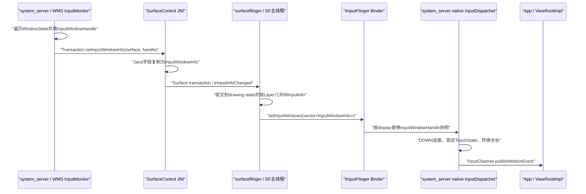
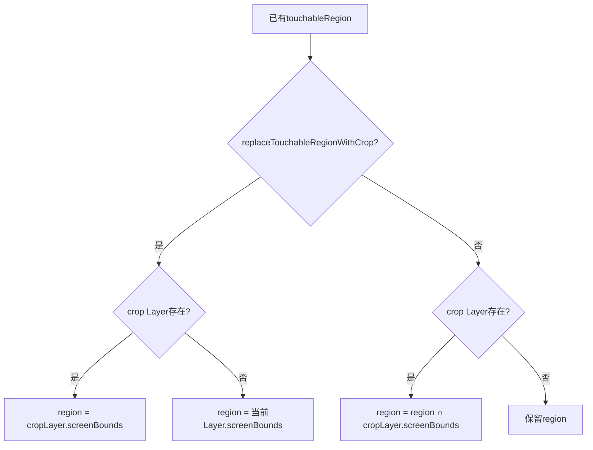
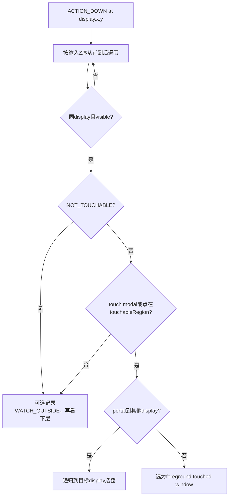
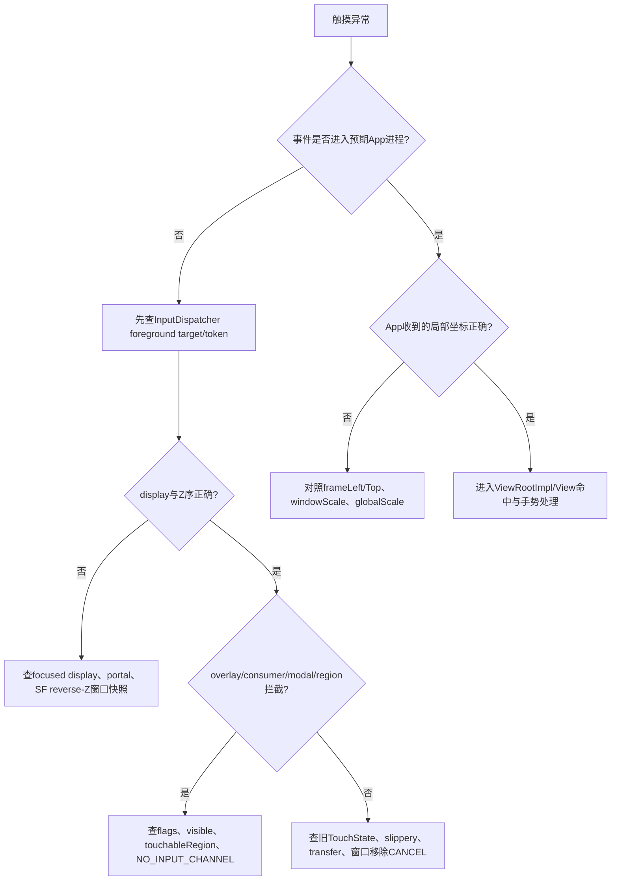

# 173 Android InputWindowHandle、InputDispatcher 窗口快照与触摸路由

> 源码版本：Android 11 / API 30 / `android-11.0.0_r48`  
> 学习方式：macOS 只读源码，不要求编译、不要求连接设备  
> 前置章节：第 19、20、163—172 章

---

## 1. 本章目标：画面在哪和触摸发给谁是两套状态

一个按钮肉眼显示在 `(500, 800)`，用户点击那里却触发旁边控件，常见直觉是“View 的坐标算错了”。但问题也可能发生在 View 之前：InputDispatcher 选择窗口及把屏幕坐标转换为窗口坐标时，使用的是一份独立的输入窗口快照。

Android 11 r48 的核心链路是：

```text
WMS根据WindowState生成Java InputWindowHandle
→ 把输入元数据写入对应SurfaceControl.Transaction
→ SurfaceFlinger把元数据提交到Layer drawing state
→ SF结合Layer最终transform/crop重新计算InputWindowInfo
→ 经IInputFlinger Binder发送到native InputManager/InputDispatcher
→ InputDispatcher按display、Z序、可见性、flags和touchable region选窗
→ 按frame与scale生成窗口局部坐标
→ 通过InputChannel投递给ViewRootImpl
```

所以本章最重要的结论是：

> 显示 Layer 树和输入窗口树都从窗口/Surface 状态出发，却在不同模块、不同时间点生成；画面正确不能自动证明输入快照已经同步，输入焦点也不决定一次新触摸的命中窗口。

---

## 2. 先做版本纠偏：r48由SF生成最终输入窗口列表

旧版本架构里，WMS 更接近直接向 InputDispatcher 发布窗口列表。Android 11 r48 已把 Layer 的最终几何纳入中间过程：

```text
WMS InputMonitor
→ Transaction.setInputWindowInfo(surface, handle)
→ SurfaceFlinger Layer::setInputInfo()
→ Layer::fillInputInfo()
→ IInputFlinger::setInputWindows()
```

这样 TaskOrganizer、动画 leash、父 Layer crop、Layer scale、clone、portal 等最终 Surface 层级变化可以反映到触摸区域。

另外，本地源码还保留 `/system/bin/inputflinger` host 工程和 rc 文件，但当前 SystemServer 主路径在 `InputManagerService.nativeInit()` 中创建 native `InputManager`，并把这个对象以 `inputflinger` 名字发布到 ServiceManager。SF 获取该 Binder 服务后，调用回 system_server 进程内的 native InputManager/InputDispatcher。

不能只看 `host/inputflinger.rc` 就断言当前主链固定经过独立 inputflinger 进程。

---

## 3. 本章要回答的十四个问题

1. WindowState 什么时候拥有 InputChannel 和 InputWindowHandle？
2. WMS 在哪些条件下把窗口纳入输入 transaction？
3. 为什么不能接收输入的 overlay 仍可能拥有 InputInfo？
4. Java handle 如何变成 native InputWindowInfo？
5. InputInfo 怎样随 Layer transaction 到达 SF？
6. SF 为什么要根据 drawing-state transform 再算一次 frame 和 region？
7. `visible` 为什么不完全等同于 Layer 真实可见？
8. InputDispatcher 如何保留窗口 Z 顺序并更新同一窗口代际？
9. Key、Touch 和 focus 分别怎样选目标？
10. touch modal 与 touchable region 是什么关系？
11. 一次手势开始后，MOVE 是否每次重新按坐标选窗？
12. display、portal、crop 与 scale 如何改变触摸路由？
13. `syncInputWindows()` 等到了什么，又没等什么？
14. 如何用 WMS trace、SF trace 与 input dump 诊断触摸错位？

---

## 4. 源码地图

### 4.1 WMS与Java描述对象

```text
frameworks/base/services/core/java/com/android/server/wm/
├── InputMonitor.java
├── WindowState.java
├── DisplayContent.java
├── InputConsumerImpl.java
└── RootWindowContainer.java

frameworks/base/core/java/android/view/
├── InputWindowHandle.java
├── InputApplicationHandle.java
└── SurfaceControl.java
```

### 4.2 JNI与Transaction

```text
frameworks/base/core/jni/
├── android_hardware_input_InputWindowHandle.cpp
└── android_view_SurfaceControl.cpp

frameworks/native/libs/gui/
├── SurfaceComposerClient.cpp
└── LayerState.cpp
```

### 4.3 SurfaceFlinger与输入服务

```text
frameworks/native/services/surfaceflinger/
├── SurfaceFlinger.cpp
├── Layer.cpp
└── BufferLayer.h

frameworks/native/services/inputflinger/
├── InputManager.cpp
└── dispatcher/InputDispatcher.cpp
```

### 4.4 数据协议

```text
frameworks/native/libs/input/InputWindow.cpp
frameworks/native/libs/input/IInputFlinger.cpp
frameworks/native/include/input/InputWindow.h
```

---

## 5. 全链路与进程边界



这里存在两次“填充”：

1. WMS 填业务属性、原始窗口 frame、flags、token 和 touchable region；
2. SF 结合最终 drawing Layer transform、buffer/crop/screen bounds 再计算屏幕空间结果。

触摸错位时只读 WMS 的 frame，会漏掉第二次计算。

---

## 6. WindowState创建handle不等于已经能收事件

WindowState 构造时创建：

```java
mInputWindowHandle = new InputWindowHandle(
        activityInputApplicationHandle,
        getDisplayId());
```

但真正接收事件还需要 InputChannel。`openInputChannel()` 创建一对 channel：

```text
server channel → 注册到native InputDispatcher
client channel → 交给应用进程/ViewRootImpl
```

两端共享的 connection token 写入：

```java
mInputWindowHandle.token = mInputChannel.getToken();
```

因此要区分：

```text
有InputWindowHandle = 有一份可描述窗口的对象
有已注册InputChannel = InputDispatcher有投递通道
进入最新window snapshot = 当前选窗算法能看见它
```

三者不是同一个完成点。

---

## 7. InputWindowHandle记录哪些信息

Java `InputWindowHandle` 是可变字段集合，主要包括：

- token、name、ownerPid/Uid；
- LayoutParams flags/type 和 inputFeatures；
- dispatching timeout；
- frame 与 surfaceInset；
- global `scaleFactor`；
- touchableRegion；
- visible、canReceiveKeys、hasFocus、paused；
- displayId、portalToDisplayId；
- touchable-region crop Surface；
- replaceTouchableRegionWithCrop；
- InputApplicationHandle。

它不是 Binder handle 的同义词，也不是 WindowState 的轻量引用。进入 transaction 时，JNI 会把当前字段复制成 native `InputWindowInfo` 快照。

---

## 8. InputMonitor为什么异步合并更新

`setUpdateInputWindowsNeededLw()` 只设置 dirty 标记；`updateInputWindowsLw()` 再通过 WMS AnimationHandler post 一个 `UpdateInputWindows` Runnable。

多个窗口/布局变化可以合并成一次更新：

```text
变化A → needed/pending
变化B → 已pending，不重复post
AnimationThread执行Runnable
→ 在WMS全局锁内遍历整个Display窗口
```

这降低开销，但意味着 WMS 某字段改变到 InputDispatcher 收到新快照之间存在异步窗口。短暂点击错位可能发生在这个传播间隙。

---

## 9. WMS按top-to-bottom遍历窗口

InputMonitor 执行：

```java
mDisplayContent.forAllWindows(this,
        true /* traverseTopToBottom */);
```

它不是立即构造一个独立 Java 列表，而是对每个 WindowState 把 InputInfo 写入相应 SurfaceControl 的 transaction。

最后 SF 会按自己的 drawing Layer 树再次 `traverseInReverseZOrder()`，生成前到后的 native window vector。InputDispatcher 的选窗算法默认把 vector 第一项当最上层候选。

所以 Z 顺序最终以 SF drawing Layer 层级为准，而不是简单按 WMS 创建时间排序。

---

## 10. 哪些Window会被跳过

常规 Window 满足以下任一情况时不会作为可投递窗口正常填写：

```text
没有InputChannel
OR 没有InputWindowHandle
OR WindowState已removed
OR cantReceiveTouchInput且没有Recents input consumer替代
```

若它仍有 Surface，WMS 可能给该 Surface 写一份 invalid/overlay InputInfo，而不是完全忽略。这份信息不提供正常输入 channel，却能告诉 InputDispatcher 该 Layer 是否应参与遮挡安全判断。

---

## 11. 非输入overlay为什么也要进入窗口快照

一个视觉 overlay 即使不可触摸，也可能遮挡下面应用。InputDispatcher 需要知道触摸点是否被另一个 UID 的不可信窗口覆盖，从而给事件设置 obscured 标志或执行防点击劫持策略。

WMS 因此为不可输入但有 Surface 的层填写：

```text
NO_INPUT_CHANNEL
NOT_TOUCH_MODAL | NOT_TOUCHABLE | NOT_FOCUSABLE
空touchableRegion
保留name、type与visible
```

可信系统 overlay 则使用特定 type，使 `isTrustedOverlay()` 返回 true，不被当成恶意遮挡。

“不接收事件”和“不影响输入安全判断”不是一回事。

---

## 12. WMS如何填常规窗口字段

`populateInputWindowHandle()` 的输入来自 WindowState：

```text
name                    ← WindowState.toString()
inputApplicationHandle  ← ActivityRecord
flags/touchableRegion   ← getSurfaceTouchableRegion()
type                    ← LayoutParams.type
timeout                 ← app/window dispatch timeout
visible                 ← isVisibleLw()
canReceiveKeys          ← canReceiveKeys()
hasFocus                ← isFocused()
paused                  ← ActivityRecord.paused
owner pid/uid           ← Session
inputFeatures           ← LayoutParams.inputFeatures
displayId               ← Window所在Display
frame                   ← getFrameLw()
surfaceInset            ← attrs.surfaceInsets.left
```

这些是 WMS 语义的输入元数据，还不是 InputDispatcher 最终使用的屏幕空间 frame。

---

## 13. WMS的global scale为什么取倒数

若 `child.mGlobalScale != 1`，WMS 写：

```java
inputWindowHandle.scaleFactor =
        1.0f / child.mGlobalScale;
```

因为画面被全局缩放后，送进窗口客户端的触摸坐标需要做反向换算，回到应用期望的逻辑坐标。不过，不能据此误以为 Dispatcher 会拿这个字段把 X/Y 再乘一次。

例子：应用逻辑宽 1000，画面以 `mGlobalScale=0.8` 显示成 800。屏幕移动 80 像素，应对应应用逻辑移动 100；输入侧 scaleFactor 是 `1/0.8=1.25`。

沿着 r48 的实际实现看，`mGlobalScale` 同时进入了 Surface 的视觉 transform；SF 从这个 transform 求倒数并累计进 `windowXScale/windowYScale`，所以 X/Y 的反向补偿已经在 window scale 中。`globalScaleFactor` 这个独立字段在 Dispatcher 侧主要额外缩放 `TOUCH_MAJOR/MINOR`、`TOOL_MAJOR/MINOR`，不会再把 X/Y 重复乘一遍。若 Layer 还有其他缩放，它们也会一起反映到最终 window scale。

---

## 14. organized Task为什么用Surface crop替换触摸区域

TaskOrganizer 可以通过 SurfaceControl 层级设置 crop，而 WMS 传统 Window frame 不一定完整反映这些组织器几何。

当窗口属于 organized Task 时，WMS 调用：

```java
inputWindowHandle.replaceTouchableRegionWithCrop(
        null /* use this surface crop */);
```

也就是让 SF 以当前窗口 Surface 的最终裁剪边界替换 touchable region。

否则可能出现：画面已经被 organizer 裁小，但输入仍按旧全屏区域命中，形成“空白处也能点到”的幽灵触摸区。

---

## 15. Input Consumer是独立的伪窗口

WMS 可创建导航、PIP、壁纸和 Recents 动画等 InputConsumer。它们有自己的 InputChannel、InputWindowHandle 和 Surface 层级位置。

用途例如：

- Recents 动画期间把目标 App 上的触摸先交给动画控制方；
- PIP consumer 把可触摸区裁到 Task bounds；
- wallpaper consumer 位于首个可见壁纸之上；
- navigation consumer 覆盖特定系统手势区域。

因此“顶层看得见的是 App 窗口”不等于“输入 Z 序顶层也是 App 窗口”。InputConsumer 可能抢先命中。

---

## 16. Java handle在setInputWindowInfo时被复制

JNI `nativeSetInputWindowInfo()` 先取得 native `NativeInputWindowHandle`，调用 `updateInfo()` 从 Java 对象逐字段读取，再执行：

```cpp
transaction->setInputWindowInfo(ctrl, *handle->getInfo());
```

这里是快照边界：之后 Java handle 再被修改，不会自动改变已经写入 transaction 的 native `InputWindowInfo`；必须重新执行一次更新 transaction。

JNI 内的 `NativeInputWindowHandle` 用 Java weak reference 保存来源对象，但写入 LayerState 的是值复制，不是让 SF 跨进程回调 Java 对象。

---

## 17. WeakReference crop Surface失效时会怎样

Java `touchableRegionSurfaceControl` 是 `WeakReference<SurfaceControl>`。JNI 尝试 promote：

```text
WeakReference.get()
→ SurfaceControl.mNativeObject
→ native SurfaceControl handle
```

若 Java 对象已被回收、native object 为 0 或没设置，`touchableRegionCropHandle` 被清空。

之后语义取决于 `replaceTouchableRegionWithCrop`：

- false + crop handle空：不做额外 crop；
- true + crop handle空：SF 使用当前窗口 Layer 自身的 screen bounds 替换 region。

所以“crop对象失效”不总是等于“触摸区完全不裁”。

---

## 18. InputInfo如何进入Surface transaction

Native `Transaction::setInputWindowInfo()` 取得该 Surface 的 `layer_state_t`，写入：

```cpp
s->inputInfo = info;
s->what |= layer_state_t::eInputInfoChanged;
```

InputInfo 与 position、crop、matrix、alpha、reparent 等 Layer 字段进入同一笔 Surface transaction，可在 SF 事务提交边界一起生效。

这提供了重要的一致性目标：视觉几何和输入元数据尽量随同一 Layer transaction 传播，而不是 WMS 先后调用两个完全独立服务。

---

## 19. WMS的input transaction如何真正apply

正常异步更新结束时：

```java
mDisplayContent.getPendingTransaction()
        .merge(mInputTransaction);
mDisplayContent.scheduleAnimation();
```

也就是说 InputInfo 先合并进 DisplayContent 的 pending Surface transaction，随后随布局/动画 Surface 提交。

特殊同步或调用者已有 transaction 时，`updateInputWindowsImmediately(t)` 会立即运行更新，并把 `mInputTransaction` merge 进传入 transaction；它仍是“合并等待后续 apply”，不是方法名中的 immediately 就等于 InputDispatcher 已更新。

---

## 20. SF收到eInputInfoChanged后先写current state

SF 应用 layer state 时还先检查调用者是否具有受信任的 SF 权限。只有 transaction 被判定为 `privileged`，`eInputInfoChanged` 才调用：

```cpp
layer->setInputInfo(s.inputInfo);
```

`Layer::setInputInfo()` 写 `mCurrentState.inputInfo`，解析 touchable-region crop handle 为 Layer 弱引用，并标记：

```text
currentState.modified = true
currentState.inputInfoChanged = true
eTransactionNeeded
```

之后 transaction commit 把 current 变化推进到 drawing state。InputDispatcher 最终收到的是 SF 从 drawing state 生成的结果，不是刚写入 current state 的瞬间值。

非特权调用者即使手工构造 `eInputInfoChanged`，SF 也只记录 `Attempt to update InputWindowInfo without permission ACCESS_SURFACE_FLINGER`，不会应用这份输入元数据。普通 App 不能借自己的 Surface transaction 任意伪造系统输入窗口身份。

---

## 21. SF为什么还要fillInputInfo

WMS 知道窗口策略 frame，但 SF 才知道最终 Layer drawing hierarchy：

- parent/reparent 与动画 leash；
- Layer position、matrix 和 scale；
- buffer size、crop 与 screen bounds；
- organizer/mirror/clone 的 Surface 边界；
- 最终 Layer Z 顺序。

所以 `Layer::fillInputInfo()` 复制 drawing-state inputInfo 后，按 SF 几何重新生成：

```text
id
displayId fallback
windowX/YScale
frameLeft/Top/Right/Bottom
touchableRegion屏幕位置
visible
crop后的touchableRegion
```

这一步是理解“画面正确、输入错误”的核心源码入口。

---

## 22. SF怎样从transform推导输入scale

SF 取 `getTransform()` 的 `sx/sy`。这里的 `sx()`、`sy()` 在 r48 中就是 3×3 矩阵的两个对角项，不是变换后基向量长度。若它们不为 1：

```cpp
info.windowXScale *= 1.0f / xScale;
info.windowYScale *= 1.0f / yScale;
info.touchableRegion.scaleSelf(xScale, yScale);
```

Layer 在屏幕上缩小到 0.5 时：

- 屏幕 touchable region 也缩小到 0.5；
- 发给应用的局部坐标用 `windowScale=2` 反向放大。

若 xScale 或 yScale 为 0，相应 window scale 被乘以 0，避免除零，但此时输入映射已经退化；不应期待得到正常可逆坐标。

---

## 23. frame最终由Layer bounds决定

SF 先取源边界：

```text
普通Layer → drawing buffer size
portal → 原touchableRegion bounds
buffer size非法 → drawing cropped buffer size
```

再用 Layer transform 变到屏幕空间，并按 surface inset 收缩。inset 会被钳到最大半宽/半高，同时用 overflow-safe 加减避免整数溢出。

最后覆盖 WMS 传来的 frame：

```cpp
info.frameLeft = layerBounds.left;
info.frameTop = layerBounds.top;
info.frameRight = layerBounds.right;
info.frameBottom = layerBounds.bottom;
```

所以 input dump 的最终 frame 和 WMS trace frame 不同，不一定是谁“打印错了”；它们可能正处在两层坐标计算结果。

---

## 24. touchableRegion从局部坐标移到屏幕坐标

WMS 生成的 touchable region 以窗口/Surface 局部坐标为基础。SF 先按 Layer scale 缩放，再执行：

```cpp
info.touchableRegion =
        info.touchableRegion.translate(
                info.frameLeft, info.frameTop);
```

得到 InputDispatcher 用于点击测试的屏幕空间 Region。

这里没有把任意旋转/倾斜矩阵逐点应用到 Region：Layer bounds 会经过完整 `t.transform()`，但 touchable Region 只按对角项 `sx/sy` 缩放，再按最终 frame 平移。因此不要把这段实现理解成“完整逆矩阵坐标映射”。对 90° 旋转，对角项甚至可能为 0；复杂非轴对齐 Layer input transform 在 Android 11 r48 的这条输入表达链上有明确版本边界。

---

## 25. crop是相交还是完全替换



区别非常重要：

- intersect 保留原 region 的形状，只砍掉超出 crop 的部分；
- replace 完全忽略原 region，把整个 crop bounds 作为新可触摸区。

误用 replace 会把本来局部可点的窗口扩大到整个 Task/Layer crop。

---

## 26. clone还会再裁一次触摸区域

若 Layer 是 clone，SF 会找到 cloned root，并将 touchable region 与 cloned root 的 screen bounds 相交。

这是为了防止镜像/克隆层的触摸区跑出被克隆子树的可见边界。

但 clone、portal 和普通 window 的输入用途不同；看到画面镜像并不能自动推断克隆 Layer 是一个可接收原应用 InputChannel 的第二交互副本，仍要检查 token、displayId、portal 与 inputFeatures。

---

## 27. SF中的visible为何故意忽略“还没有buffer”

对于真正带 WMS InputInfo 的 Layer，SF 使用：

```cpp
info.visible = canReceiveInput();
```

而不是 `isVisible()`。源码注释说明这是兼容行为：窗口即使尚未提交第一块 buffer，只要策略上可接收输入，也允许提前成为输入窗口。

对于没有真实 InputInfo、只用于遮挡检测的普通 buffered Layer，才使用实际 `isVisible()`，因为不可见 Layer 不应遮挡别人。

因此：

```text
InputDispatcher dump中visible=true
≠ SF已经有可见buffer
```

这也是启动期间“按键/触摸先等待或先到窗口，而画面稍后出现”的可能基础。

---

## 28. 哪些Layer需要InputInfo

基类 `Layer::needsInputInfo()` 默认等于 `hasInputInfo()`。但 `BufferLayer` 覆盖为：

```cpp
return !mPotentialCursor;
```

即大量非 cursor buffered Layer 即使没有 WMS 提供的 InputInfo，也会生成一份无 channel、not-touch-modal 的默认信息，用于遮挡检测。

这解释了 InputDispatcher 窗口列表中为什么可能出现不能接收事件的 Layer；窗口快照兼具“路由候选”和“安全遮挡模型”两种职责。

---

## 29. SF何时把窗口列表发送给InputFlinger

`updateInputFlinger()` 的主要门是：

```text
mVisibleRegionsDirty OR mInputInfoChanged
```

满足时，SF 对 `mDrawingState` 做 reverse-Z traversal，调用每个 Layer 的 `fillInputInfo()`，再发整份 vector。

即使 WMS InputInfo 没变，Layer 可见区域/几何层级改变也可能触发重新生成输入窗口；这正是让输入跟随 Surface 动画和 crop 的关键。

若两种 dirty 都没有，但 transaction 请求了 `syncInputWindows`，SF 直接回完成通知，因为没有新窗口列表需要发送。

---

## 30. IInputFlinger真正跨越哪个进程

Android 11 r48 的正常 SystemServer 初始化路径：

```cpp
mInputManager = new InputManager(this, this);
defaultServiceManager()->addService(
        String16("inputflinger"), mInputManager, false);
```

SurfaceFlinger 在 bootFinished 后从 ServiceManager 获取 `inputflinger`，保存 `IInputFlinger` proxy。

所以窗口列表的关键进程边界是：

```text
surfaceflinger进程
→ Binder IInputFlinger
→ system_server进程中的NativeInputManager/InputManager
→ 同进程native InputDispatcher对象
```

源码中的独立 host binary 是另一种/遗留宿主形态，不能替代对当前启动主链的核对。

---

## 31. InputManager按display分组时的细节

`InputManager::setInputWindows(vector)` 把每个 `InputWindowInfo` 包装成 `BinderWindowHandle`，再按 `displayId` 放进 map，交给 InputDispatcher。

每次循环先 `emplace(displayId, empty vector)`，若 key 已存在 emplace 不会清掉旧的本次循环内容，然后 push，因此同一 display 的 Z 序保持输入 vector 顺序。

但只出现在旧快照、这次 vector 完全没有任何条目的 display，不会出现在这个 map 中；InputDispatcher 的 `setInputWindows()` 只更新传入 map 里的 display。显示移除由另外的 `onDisplayRemoved/nativeDisplayRemoved` 显式传空列表清理。

---

## 32. InputDispatcher如何保留同一窗口对象代际

每次新快照包含新建的 BinderWindowHandle 对象。InputDispatcher 为了让正在进行的 TouchState 等仍能按指针识别同一窗口，会按：

```text
InputWindowInfo.id（SF Layer sequence）
AND token
```

匹配旧 handle。匹配成功就把新 info 更新进旧对象，再把旧对象放入新 Z 序 vector。

只匹配 id 不够，因为 Layer id 与 channel token 共同定义当前可投递身份；token 变了通常代表输入连接代际改变。

---

## 33. 无InputChannel的条目何时会被保留

若找不到注册 channel，且不是 portal，InputDispatcher 计算：

```cpp
canReceiveInput = !NOT_TOUCHABLE || !NOT_FOCUSABLE;
```

只有“看起来仍能接收某类输入”且没有 `NO_INPUT_CHANNEL` 标志时，才把它视为异常并跳过。

如果窗口同时不可触摸、不可聚焦，或明确声明 NO_INPUT_CHANNEL，它可以留在快照中参与遮挡等判断，却不会成为正常投递连接。

注意这里是 OR 逻辑：只要还可触摸或还可聚焦，就被视为可能接收输入，需要 channel 或明确 NO_INPUT_CHANNEL。

---

## 34. 更新窗口列表会处理focus与旧手势

InputDispatcher 接收新列表后会：

1. 选择最上方 `hasFocus && visible` 的窗口；
2. 与旧 focused token 比较；
3. 对旧窗口取消非 pointer 事件并发送 focus lost；
4. 对新窗口发送 focus gained；
5. 清理消失的 hover window；
6. 若正在触摸的窗口已不在快照，合成 pointer cancel；
7. 释放消失窗口的 channel 引用；
8. 唤醒 dispatch looper。

窗口快照更新不是只换一个 vector，它还驱动输入状态机收敛。

---

## 35. focused application、focused window、focused display

这是三张不同的状态：

```text
focused application
  = WMS认为哪个Activity/App应最终拥有焦点，可在窗口尚未出现时先设置

focused window per display
  = InputDispatcher从该display窗口快照中选出的hasFocus+visible窗口

focused display
  = displayId缺省的按键/非定向事件应路由到哪个display
```

RootWindowContainer 单独调用 `setFocusedDisplay()`；InputMonitor 单独调用 `setFocusedApplication()`；focused window 则随 `setInputWindows()` 的 handle flags 推导。

把三者合成一个“当前焦点”会看不懂无 focused window ANR。

---

## 36. 按键怎样选择窗口

Key 或非 touch 焦点事件先确定目标 display：事件自带有效 displayId 就用它，否则用 `mFocusedDisplayId`。

然后：

```text
既无focused window也无focused app → 丢弃
有focused app但尚无focused window → 等待窗口，超时可触发ANR
focused window paused → 继续pending
正常focused window → 作为foreground target
```

按键还会等待先前事件完成一小段时间，因为先前点击可能弹出新窗口并改变焦点。这样紧跟点击输入的键更有机会发给新弹窗，而不是旧窗口。

---

## 37. 触摸DOWN不按输入焦点选窗

新的 touch gesture 根据事件 displayId 和坐标，从该 display 的窗口 vector 前到后扫描。



因此一个没有键盘焦点的浮窗也可以接收触摸；反之，focused window 如果点击点落在可穿透区域，也可能不是 touch target。

---

## 38. touch modal为什么可以命中region之外

InputDispatcher 的判定是：

```cpp
isTouchModal = !(NOT_FOCUSABLE | NOT_TOUCH_MODAL);
if (isTouchModal || touchableRegionContainsPoint(x, y)) {
    return thisWindow;
}
```

也就是说，默认 modal 窗口即使坐标不在显式 touchable region 内，也会截住该 display 上它覆盖层级以下的新触摸。

只有设置 `FLAG_NOT_TOUCH_MODAL`（或者 NOT_FOCUSABLE 使这段公式非 modal）后，region 外触摸才继续寻找下层窗口。

所以“touchableRegion 空”不自动意味着窗口完全接不到触摸；还必须结合 flags。

---

## 39. WATCH_OUTSIDE_TOUCH不是第二个完整目标

扫描过程中，可见窗口设置 `FLAG_WATCH_OUTSIDE_TOUCH` 时，DOWN 落在它外部可加入 `DISPATCH_AS_OUTSIDE` target。

它收到的是用于感知外部点击的 OUTSIDE 语义，不是与前景窗口共享完整手势流。真正 foreground target 仍由 modal/region 规则选出。

不要在 dump 中看到 WATCH_OUTSIDE 就误判“一次手势完整投递给两个普通窗口”。

---

## 40. 一次手势通常在DOWN时锁定目标

新手势 DOWN 时建立 `TouchState`。后续 MOVE/UP 通常继续投递给已记录窗口，不会因为手指滑到另一个窗口坐标就自动重新做普通选窗。

例外包括：

- `FLAG_SLIPPERY` 单指 MOVE 可从旧窗生成 slippery exit，并给新窗 slippery enter；
- split touch 的新 pointer down 可以为不同 pointer 选择窗口；
- 显式 transferTouchFocus；
- 窗口从快照消失时给旧目标 CANCEL；
- portal/gesture monitor 的附加目标。

因此分析“拖动过程中窗口移动了但事件仍去旧窗”，首先要记得 gesture target 的粘性。

---

## 41. split touch按pointer分配目标

若首个触摸窗口支持 `FLAG_SPLIT_TOUCH`，非鼠标事件可以开启 split 状态。后续 `ACTION_POINTER_DOWN` 根据新 pointer 坐标再次找窗，并只把对应 pointerId 分给目标。

每个 InputTarget 保存 pointerIds 以及每个 pointer 的 offset/scale。若新窗口不支持 split，而手势已经 split，源码会忽略这个新候选。

鼠标不会按这条逻辑拆分多 pointer；hover/scroll 也有独立瞬时选窗语义。

---

## 42. portal把触摸递归路由到另一个display

若命中的窗口有有效 `portalToDisplayId` 且不同于当前 display，InputDispatcher 递归在目标 display 以同一 `(x,y)` 选窗，并记录经过的 portal windows。

相应 gesture monitors 也会加入，monitor 坐标 offset 使用 portal frame 的负 left/top。

这里没有在 `findTouchedWindowAtLocked()` 里应用任意跨 display 缩放矩阵；复杂虚拟显示映射需要生产端把 portal frame/region 设置为契约期待的坐标。配置错误会表现为“画面投到副屏正确，但触摸落点整体偏移”。

---

## 43. 最终窗口局部坐标怎样计算

选中 Window 后，InputDispatcher 建立 target：

```cpp
xOffset = -window.frameLeft;
yOffset = -window.frameTop;
windowXScale = info.windowXScale;
windowYScale = info.windowYScale;
globalScaleFactor = info.globalScaleFactor;
```

发布 MotionEvent 时，offset 会乘 window scale，window scale/offset 作为事件参数送到客户端。若 `globalScaleFactor != 1`，Dispatcher 会先复制 PointerCoords，再调用：

```cpp
scaledCoords[i].scale(globalScaleFactor,
                      1 /* windowXScale */,
                      1 /* windowYScale */);
```

`PointerCoords::scale(global, 1, 1)` 对 X/Y 乘的是 1，只把 `TOUCH_MAJOR/MINOR` 与 `TOOL_MAJOR/MINOR` 乘 global。客户端读取相对坐标时再按 `rawX * xScale + xOffset`、`rawY * yScale + yOffset` 得到窗口逻辑坐标。

简化心算：

```text
屏幕点(600,900)
窗口frame左上(500,700)
→ 先平移到约(100,200)
若Layer视觉缩放0.5，windowScale约2
→ 客户端逻辑坐标约(200,400)
globalScale不再重复乘X/Y；它主要补偿触摸接触面尺寸
```

诊断偏移必须同时核对 frameLeft/Top、windowX/YScale 和 globalScaleFactor。

---

## 44. syncInputWindows等到哪个完成点

`Transaction.syncInputWindows()` 只把：

```cpp
mInputWindowCommands.syncInputWindows = true;
```

写进 transaction。SF 收到后，在需要更新时向 `IInputFlinger::setInputWindows()` 附带 listener；InputManager 调用 InputDispatcher `setInputWindows()` 返回后，listener 回 SF，SF 清 `mPendingSyncInputWindows` 并唤醒等待 transaction 的条件变量。

在典型的非 SF 主线程 Binder 调用、且没有超时时，它建立的完成边界是：

> 这笔 transaction 引起的输入窗口变化已经被发送并同步安装到 InputDispatcher 窗口快照。

但源码不是无限等待。`applyTransactionState()` 每次用 `mTransactionCV.waitRelative(..., 5s)`；超时会记录日志，把 `mTransactionPending` 和 `mPendingSyncInputWindows` 都清为 false，然后让调用返回。若 `applyTransactionState()` 恰好运行在 SF 主线程，源码为了不阻塞合成主循环，根本不进入等待 while。

因此严格表述应是：

```text
syncInputWindows提出“等输入窗口更新”的同步请求
正常非主线程路径由InputDispatcher安装后的listener闭合
但5秒超时或SF主线程调用可在没有该ACK时结束等待/直接返回
```

它不保证：

- App 已经收到下一次 input event；
- 旧手势已经自然 UP，而不是被 CANCEL；
- Surface buffer 已 present；
- 面板已显示对应视觉几何；
- 应用已经处理完事件。

---

## 45. sync没有变化时为什么也能完成

若 `mVisibleRegionsDirty` 和 `mInputInfoChanged` 都为 false，但带有 `syncInputWindows`，SF 不需要发送重复 vector，会直接调用 `setInputWindowsFinished()`。

所以 sync 返回不能作为“确实调用过 InputDispatcher::setInputWindows”的证据；它只说明 SF 判断这笔同步要求已经满足。

反过来，如果 SF 尚未取得 `mInputFlinger` 服务，`updateInputFlinger()` 一开始直接 return；本路径不会清命令或完成 listener。非主线程调用最多等待约 5 秒后由超时分支清 pending 标志并返回，而不是无限等到服务出现；SF 主线程路径则本来就不等待。不能把这种返回误写成“输入快照已经同步”。

---

## 46. 为什么画面正确但触摸仍错

典型原因可以分层：

| 层级 | 画面可能正确 | 输入为何错误 |
|---|---|---|
| WMS | Surface几何后来被其他transaction修正 | InputMonitor仍基于旧frame/region |
| Java→JNI | 画面字段正常 | handle修改后未重新setInputWindowInfo |
| SF | 显示transform正确 | fillInputInfo对scale/crop/复杂旋转表达不同 |
| 快照时序 | 新画面已可见 | 新InputWindowInfo尚未安装或旧gesture已锁定 |
| InputDispatcher | 正确显示窗口在下方 | InputConsumer/modal overlay抢先命中 |
| 坐标转换 | 目标Window正确 | frameLeft/Top、windowScale/globalScale错误 |
| portal/多屏 | 目标画面在副屏 | displayId或portal坐标契约错误 |

“点错控件”首先分成“选错 Window”与“选对 Window 但局部坐标错”两类，排查速度会快很多。

---

## 47. 触摸路由故障诊断图



这张图强制先确定“路由错”还是“应用内部处理错”，避免一开始就在 View.onTouchEvent 里盲查。

---

## 48. 三类现场怎样交叉读取

### WMS trace

看 WindowState、WindowFrames、hasFocus、InputMonitor 上游窗口层级、Task/Display/rotation，以及 InputConsumer 何时出现。

限制：r48 WMS trace 的 WindowState Proto 没有完整序列化最终 native touchable region、windowX/YScale 和 InputDispatcher TouchState。

### SF layers trace/dump

打开 TRACE_INPUT 时可看到 Layer 的 InputWindowInfo、touchable region、crop Layer、transform、screen bounds 和 Layer Z 树。

限制：第 170 章已说明文本 parser 会丢部分 input 字段，优先保存原始 proto；trace 采样仍不是 InputDispatcher 安装瞬间的原子回读。

### dumpsys input

看 InputDispatcher 当前 `WindowHandles`、focused display/application/window、TouchStates、connections、ANR tracker 和 dispatch queues。

限制：静态 dump 只是一刻状态；手势已经结束后 TouchState 可能消失，必须与时间线或复现日志结合。

---

## 49. macOS只读练习、复读审计与核心结论

### 49.1 练习1：追完整元数据链

```bash
rg -n "populateInputWindowHandle|setInputWindowInfo|eInputInfoChanged|fillInputInfo|setInputWindows" \
  frameworks/base frameworks/native
```

给每个命中标注：Java对象、JNI值复制、Layer current、Layer drawing、Binder vector 或 Dispatcher snapshot。

### 49.2 练习2：手算scale与offset

给定：

```text
屏幕点=(420, 360)
input frame left/top=(300, 200)
Layer x/y scale=0.5，因此windowX/YScale=2
globalScaleFactor=1.25
```

先算去掉窗口原点后的约 `(120,160)`，再理解 window scale 把它映射到约 `(240,320)`。不要再把 global scale 乘到 X/Y；去 `publishMotionEvent()` 和 `PointerCoords::scale()` 核对：它在这一步主要改变 touch/tool major/minor，而 X/Y 由 window scale 与 offset 转换。

### 49.3 练习3：比较modal与non-modal

窗口 A 在 B 上方，A 的 touchable region 只覆盖左半边：

```text
A为touch modal → 右半边点击仍被A截住
A设置NOT_TOUCH_MODAL → 右半边可继续命中B
A还设置WATCH_OUTSIDE → A额外收到OUTSIDE，B收到前景手势
```

### 49.4 练习4：构造证据表

| 观察 | 更可能在哪层 | 下一源码/证据 |
|---|---|---|
| InputDispatcher target就是错窗 | Z/flags/region/consumer | findTouchedWindowAtLocked、input dump |
| target正确但坐标固定偏移 | frame/offset | fillInputInfo、addWindowTargetLocked |
| target正确但坐标按比例偏差 | scale | Layer transform、global/window scale |
| DOWN正确，MOVE仍去旧窗 | TouchState粘性 | findTouchedWindowTargetsLocked |
| 旋转后短暂错位 | 快照传播代际 | WMS/SF trace时间、syncInputWindows |

### 49.5 复读审计：r48最容易误解的十八处

1. InputWindowHandle、已注册 InputChannel、已安装 Dispatcher 快照是三个完成点。
2. WMS 不是直接发布最终窗口 vector，而是把 InputInfo 挂进 Layer transaction。
3. SF 用 drawing Layer 层级、transform 和 crop 再生成最终输入 frame/region。
4. Java handle 在 JNI 调用时值复制，后续字段修改不会自动同步。
5. 输入窗口 Z 序最终来自 SF drawing tree 的 reverse-Z traversal。
6. 没有 channel 的 overlay 仍可能为了遮挡检测进入快照。
7. BufferLayer 即使无真实 InputInfo，也可生成默认遮挡条目。
8. 对真实窗口，input visible 使用 canReceiveInput，可能在第一块 buffer 前为 true。
9. touch modal 窗口可在显式 touchable region 之外截住点击。
10. 新触摸按坐标选窗；键盘/非触摸事件主要按 focused display/window 路由。
11. focused application、per-display focused window、focused display不是一个变量。
12. 普通 MOVE 不会每次重选窗口，一次手势通常粘在 DOWN 目标。
13. crop replace 与 intersect 语义不同，WeakReference失效时 replace 可退回自身Layer bounds。
14. globalScaleFactor 不会在 Dispatcher 再乘一次 X/Y；X/Y 补偿已包含于 SF 派生的 windowX/YScale，它主要额外缩放触摸接触面轴。
15. `syncInputWindows` 只等快照安装边界，不等画面present或App处理事件。
16. `syncInputWindows`还有5秒超时和SF主线程不等待例外，返回并非无条件ACK。
17. 非privileged transaction不能更新Layer InputInfo，普通App无法伪造系统输入窗口。
18. `inputflinger` 服务名不证明走独立进程；当前主路径由SystemServer native InputManager发布。

### 49.6 本章核心结论

> Android 11 r48 把输入窗口元数据作为 SurfaceControl Transaction 的一部分交给 SurfaceFlinger，SF 再基于 drawing Layer 的最终 Z、transform、buffer bounds、crop 和 visibility 生成 InputWindowInfo，经 Binder 安装到 system_server native InputDispatcher。这个设计让输入追随 Surface 层级，也引入了跨线程、跨进程和 current→drawing 的传播边界。

> 新触摸由 display 上前到后的窗口列表、visible、NOT_TOUCHABLE、modal 和 touchable region 共同选中；按键依赖 focused display/window，focused application 还负责“App已聚焦但窗口尚未出现”的等待与 ANR。一次手势通常在 DOWN 后锁定目标，MOVE 不会普通地随坐标重选。

> 触摸错位必须先区分“选错 Window”和“Window 正确但坐标错误”。前者查 Z、display、portal、consumer、flags 与 region；后者查 SF 最终 frame、frame offset、window scale 和 global scale。WMS trace、SF input proto 与 dumpsys input 各覆盖一段，没有任何一份单独等于整条路由真相。

---

## 50. 自测题与下一章预告

### 50.1 自测题

1. 为什么创建 InputWindowHandle 后窗口仍不一定能接收事件？
2. Android 11 为什么让 InputInfo 先经过 SurfaceFlinger？
3. WMS 为何给不可触摸 overlay 写 NO_INPUT_CHANNEL 信息？
4. Java handle 修改后，已写入 transaction 的 InputWindowInfo 会自动更新吗？
5. SF 用 current state 还是 drawing state 生成 Dispatcher 窗口列表？
6. WMS frame 与 input dump frame 不同是否必然是 bug？
7. `replaceTouchableRegionWithCrop` 与普通 crop 有何区别？
8. 为什么 input visible=true 不能证明 Layer 已有可见 buffer？
9. `touchableRegion` 为空时，一个 modal 窗口能否拦截新触摸？
10. 按键和 ACTION_DOWN 的选窗依据有何不同？
11. focused application 存在但 focused window 为空时会怎样？
12. 手指移出窗口后 MOVE 为什么常继续发给原窗口？
13. InputDispatcher怎样识别新旧快照中的同一窗口？
14. `syncInputWindows()` 返回能否证明画面已显示？
15. 固定偏移与比例偏移分别优先检查哪些字段？
16. r48 的 `inputflinger` Binder 服务通常由哪个进程内对象发布？

### 50.2 下一章预告

第 174 章将继续沿输入完成协议深入：

> **Android InputChannel、InputPublisher/Consumer、事件回执与输入 ANR**

重点回答：

- InputChannel socketpair、token 与 Connection 怎样建立？
- InputDispatcher 如何把 EventEntry 变成 DispatchEntry 并写入通道？
- App 主线程怎样通过 NativeInputEventReceiver 和 ViewRootImpl 读取事件？
- `finishInputEvent()` 如何回传 handled 状态并推进 wait queue？
- 输入 ANR 的 timeout 从哪里来，为什么“事件已写入 channel”仍可能超时？
- broken channel、App死亡和窗口移除怎样清理在途事件？
