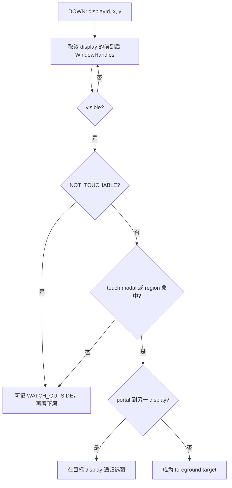

# 173 Android InputWindowHandle、InputDispatcher 窗口快照与触摸路由

> 源码版本：Android 11 / API 30 / `android-11.0.0_r48`  
> 学习方式：macOS 静态只读源码，不要求编译或连接设备  
> 前置章节：第 19、20、163—172 章

---

## 1. 先把“点错了”分成选窗错误与坐标错误

按钮显示在屏幕 `(500, 800)`，点击那里却触发旁边控件，不一定是 View 布局错误。事件进入 ViewRootImpl 之前，InputDispatcher 已经用一份独立的输入窗口快照完成两件事：

```text
命中测试：这个屏幕点应交给哪个 InputChannel？
坐标变换：屏幕坐标怎样成为目标窗口的局部坐标？
```

因此第一步应问：

| 现场 | 优先检查 |
|---|---|
| 事件进入了错误进程/窗口 | display、Z 序、visible、flags、touchable region、consumer、旧手势 |
| 事件进入正确窗口，但位置固定偏移 | frameLeft/Top、offset |
| 事件进入正确窗口，但误差随距离成比例 | windowX/YScale、Layer transform |
| App 收到正确局部点，控件仍选错 | ViewRootImpl 后的 View 树分发 |

画面 Layer 树与输入窗口树都来自窗口和 Surface 状态，但生成模块、快照时刻、可见性语义不同。“画面正确”不能证明新输入窗口快照已经安装。

---

## 2. r48 让最终输入窗口列表经过 SurfaceFlinger

Android 11 r48 的主链不是 WMS 直接把一张 Java Window 列表交给 InputDispatcher：

```text
WMS InputMonitor
→ 填 Java InputWindowHandle
→ SurfaceControl.Transaction.setInputWindowInfo()
→ JNI 值复制为 native InputWindowInfo
→ LayerState.eInputInfoChanged
→ SF current state
→ SF transaction commit 到 drawing state
→ Layer::fillInputInfo() 叠加最终 Layer 几何
→ reverse-Z 生成 vector<InputWindowInfo>
→ IInputFlinger::setInputWindows()
→ InputDispatcher 按 display 安装快照
→ 新 DOWN 选窗并建立 TouchState
→ InputChannel 投递给 App
```

这样 reparent、动画 leash、父 Layer transform、Surface crop、organized Task 和 clone 等最终 Surface 层级事实可以影响输入几何与 Z 序。

### 2.1 五个完成点不要混成一个

```text
有 InputWindowHandle
≠ 已注册 InputChannel
≠ InputInfo 已进入 SF current state
≠ drawing state 已生成并安装到 Dispatcher
≠ App 已收到或处理事件
```

`updateInputWindowsImmediately()` 也只是立即重建 WMS 的 input transaction，并 merge 给调用者的 transaction；若后者尚未 apply，Dispatcher 仍看不到它。

### 2.2 inputflinger 服务名不代表独立进程

r48 的正常 SystemServer 路径在 `InputManagerService.nativeInit()` 创建 native `InputManager`，并以 `inputflinger` 名字注册 Binder 服务。SurfaceFlinger 跨 Binder 调回的是 system_server 进程内的 native InputManager/InputDispatcher。

源码还保留独立 host binary 和 rc 文件，但不能只凭服务名或 host 工程断言当前主链固定经过独立 inputflinger 进程。

---

## 3. 源码地图

WMS 生产端：

```text
frameworks/base/services/core/java/com/android/server/wm/
├── InputMonitor.java
├── WindowState.java
├── DisplayContent.java
├── InputConsumerImpl.java
└── RootWindowContainer.java

frameworks/base/core/java/android/view/
├── InputWindowHandle.java
├── InputApplicationHandle.java
└── SurfaceControl.java
```

JNI、transaction 与协议：

```text
frameworks/base/core/jni/
├── android_hardware_input_InputWindowHandle.cpp
└── android_view_SurfaceControl.cpp

frameworks/native/libs/gui/
├── SurfaceComposerClient.cpp
└── LayerState.cpp

frameworks/native/libs/input/
├── InputWindow.cpp
└── IInputFlinger.cpp

frameworks/native/include/input/InputWindow.h
```

SF 与输入服务：

```text
frameworks/native/services/surfaceflinger/
├── SurfaceFlinger.cpp
├── Layer.cpp
└── BufferLayer.h

frameworks/native/services/inputflinger/
├── InputManager.cpp
└── dispatcher/InputDispatcher.cpp

frameworks/base/services/core/jni/
└── com_android_server_input_InputManagerService.cpp
```

---

## 4. Handle、Channel 与 WMS 更新调度是三本账

WindowState 构造时可以先有：

```java
mInputWindowHandle = new InputWindowHandle(
        activityInputApplicationHandle, getDisplayId());
```

它只是一份可变描述。真正投递还要由 `openInputChannel()` 建立一对 channel：服务端向 native Dispatcher 注册，客户端交给 App/ViewRootImpl；共享 connection token 再写进 handle。

### 4.1 WMS 通过 AnimationHandler 合并更新

`setUpdateInputWindowsNeededLw()` 只置 dirty。`updateInputWindowsLw()` 在需要时 post `UpdateInputWindows` 到 `mService.mAnimationHandler`；pending 为 true 时后续变化不会重复 post。

Runnable 最终在 WMS global lock 内：

```text
清 pending/needed
→ 准备 drag 与四类 InputConsumer
→ 按 top-to-bottom 遍历 DisplayContent 的 WindowState
→ 把各 InputInfo 写进 mInputTransaction
→ merge 到 DisplayContent pending transaction
→ scheduleAnimation()
```

多个窗口变化可合并，代价是 WMS 字段变化与 Dispatcher 快照更新之间存在传播窗口。

`updateInputWindowsImmediately(t)` 会 remove 已排队 callback 并同步执行 Runnable，但最后只是 `t.merge(mInputTransaction)`；方法名的 immediately 不等于 transaction 已 apply。

### 4.2 WMS 遍历顺序不是最终输入 Z 序

WMS 用：

```java
mDisplayContent.forAllWindows(this, true /* traverseTopToBottom */);
```

逐 Surface 写 InputInfo。SF 随后从 drawing Layer 树执行 `traverseInReverseZOrder()` 形成最终 vector，InputDispatcher 再把 vector 前项当作前景候选。

最终顺序受 Layer parent/reparent 与 Z 影响，不能只按 Window 创建时间或 WMS 某次数组下标推导。

---

## 5. 常规窗口、无通道 Layer 与 InputConsumer 都可能进快照

WMS 对常规 WindowState 填入：

```text
token / application handle / name / owner pid+uid
LayoutParams flags+type / inputFeatures / timeout
visible / canReceiveKeys / hasFocus / paused / hasWallpaper
displayId / frame / surfaceInset / global scale
touchableRegion / crop Surface / portal
```

其中 `scaleFactor = 1 / child.mGlobalScale`；organized Task 则调用 `replaceTouchableRegionWithCrop(null)`，要求 SF 用当前窗口 Layer 自身 crop 边界替换传统 region。

这些仍是 WMS 语义的输入元数据。JNI 和 SF 会在后面生成两个新快照。

### 5.1 被跳过的窗口也可能留下遮挡条目

没有 InputChannel/handle、已 removed，或不可收 touch 且没有 Recents 替代 consumer 的窗口，不会作为正常目标填充。但只要还有 Surface，WMS 会写一份 invalid overlay 信息：

```text
NO_INPUT_CHANNEL
NOT_TOUCH_MODAL | NOT_TOUCHABLE | NOT_FOCUSABLE
空 touchableRegion
填入 name、type、visible
```

这是 WMS 写入 transaction 时的值。SF 用 `token != null` 定义 `hasInputInfo()`；invalid handle 的 token 为空，所以 `fillInputInfo()` 又会进入无真实 InputInfo 分支，覆盖 name、owner、inputFeatures、flags 与 displayId，type 和空 region 等未被该分支改写的内容才继续保留，visible 最后按 Layer `isVisible()` 重算。

它最终不能普通命中，却可参与 InputDispatcher 的 obscured/点击劫持判断。“不是投递目标”不等于“对输入安全模型不可见”。

### 5.2 无 WMS InputInfo 的 BufferLayer 也可进入

`Layer::needsInputInfo()` 默认要求已有 token；`BufferLayer` 却覆盖为 `!mPotentialCursor`。普通非 cursor buffered Layer以及上面的 null-token invalid overlay，都可能由 `fillInputInfo()` 补 name、owner、NO_INPUT_CHANNEL、NOT_TOUCH_MODAL 等默认值，作为遮挡条目发送。

其 region 为空、无 channel，因此不会普通地成为触摸目标。可信系统 overlay 是否计入恶意遮挡，还取决于 type 等安全规则。

### 5.3 InputConsumer 是有通道的伪窗口

navigation、PIP、wallpaper、Recents animation consumer 拥有自己的 Surface、InputChannel 与 handle，并被安插到特定 Layer 位置。视觉上最上方是 App，不代表输入 Z 序最先可命中者也是 App。

例如 PIP consumer 会 reparent 到 root Task、放到高 Z，并用 Task Surface crop 替换可触摸区；Recents consumer 也可在动画期先接管目标 App 上方的输入。

---

## 6. Java handle 在 JNI 边界值复制，再随 Layer transaction 提交

`nativeSetInputWindowInfo()` 取得 `NativeInputWindowHandle` 后调用 `updateInfo()`，逐字段读取 Java 对象，再执行：

```cpp
transaction->setInputWindowInfo(ctrl, *handle->getInfo());
```

因此 Java handle 随后修改不会自动改变已经写入 transaction 的 native 值；必须重新走一次 setInputWindowInfo。

Java crop Surface 由 WeakReference 保存。JNI promote 失败、native object 为 0 或未设置时，会清空 `touchableRegionCropHandle`，不会保留上次成功的 handle。

### 6.1 LayerState 用 what bit 携带增量

native Transaction 写入：

```cpp
s->inputInfo = info;
s->what |= layer_state_t::eInputInfoChanged;
```

InputInfo 可以和 position、matrix、crop、reparent 等放在同一笔 Layer transaction 中。这给视觉与输入元数据提供共同提交边界，但不等于它们已同时 present 或被 App 消费。

### 6.2 普通 App 不能伪造这份系统输入元数据

SF 应用 `eInputInfoChanged` 时检查 transaction 是否 privileged。非特权调用只记录无 ACCESS_SURFACE_FLINGER 权限的错误，不调用 `Layer::setInputInfo()`。

通过检查后，`setInputInfo()` 先写 `mCurrentState.inputInfo`、解析 crop Layer 弱引用并标记 modified/inputInfoChanged；transaction commit 后才进入 drawing state。最终窗口 vector 来自 drawing state，而不是刚写 current state 的瞬间。

---

## 7. SF 的 fillInputInfo 用最终 Layer 几何覆盖 WMS frame

`Layer::fillInputInfo()` 先复制 `mDrawingState.inputInfo`，写入 Layer sequence 作为 id，再处理 transform、bounds、region、visibility 和 crop。

### 7.1 scale 只取 transform 的对角项

r48 读取 `getTransform().sx()/sy()`：

```cpp
info.windowXScale *= xScale != 0 ? 1 / xScale : 0;
info.windowYScale *= yScale != 0 ? 1 / yScale : 0;
info.touchableRegion.scaleSelf(xScale, yScale);
```

`sx/sy` 是 3×3 矩阵对角项，不是变换后基向量长度。普通轴对齐缩放 0.5 时，屏幕 region 缩至一半，window scale 变为约 2；零 scale 则把对应 window scale 置 0 以避开除零。

对 90° 旋转，对角项可为 0。Layer bounds 使用完整 `t.transform()`，region 却只做 sx/sy 缩放再平移。因此这条 r48 表达链不是“对任意旋转/倾斜都做完整逆矩阵”。

### 7.2 frame 来自 buffer/cropped bounds

源 bounds 通常取 drawing buffer size；portal 用原 touchable region bounds；非法时回退 cropped buffer size。完整 Layer transform 后再按缩放后的 surfaceInset 收缩，inset 会钳到最大半宽/半高，整数加减也防 overflow。

最终覆盖：

```cpp
info.frameLeft = layerBounds.left;
info.frameTop = layerBounds.top;
info.frameRight = layerBounds.right;
info.frameBottom = layerBounds.bottom;
```

所以 WMS trace frame 与 `dumpsys input` 最终 frame 不同，不必然是谁打印错；两者位于不同计算阶段。

### 7.3 touchable region 转成屏幕空间

region 先按 sx/sy scale，再平移 frameLeft/Top：

```cpp
info.touchableRegion =
        info.touchableRegion.translate(info.frameLeft, info.frameTop);
```

InputDispatcher 的命中测试使用这个屏幕空间 Region。不要再把它当 WMS WindowState 的局部坐标。

---

## 8. crop、clone、portal 与 visible 各有独立语义

crop 逻辑为：

```text
replace=true，crop Layer 存在 → region = cropLayer.screenBounds
replace=true，crop Layer 不存在 → region = 当前 Layer.screenBounds
replace=false，crop Layer 存在 → region = region ∩ cropLayer.screenBounds
replace=false，crop Layer 不存在 → 保留 region
```

因此 Java WeakReference 失效不一定等于“不裁”：replace=true 时会回退当前 Layer bounds。replace 与 intersect 也不能互换，前者会丢掉原 region 的局部形状。

clone 还会把 region 与 cloned root 的 screen bounds 再求交，防止输入越出克隆子树；这不自动赋予 clone 一个新的可投递 InputChannel。

### 8.1 portal 递归换 display，但沿用坐标

命中有效 `portalToDisplayId` 时，Dispatcher 在目标 display 用同一 `(x,y)` 递归选窗，并记录 portal window 以补充 gesture monitors。该函数没有应用任意跨 display 缩放矩阵；生产端必须让 portal frame/region 符合约定坐标。

### 8.2 input visible 不等于 Layer 已有 buffer

有真实 InputInfo 的 Layer 使用 `canReceiveInput()`，r48 实际只排除 policy hidden；为了兼容，它可在首块 buffer 提交前成为输入窗口。无真实 InputInfo、仅供遮挡检测的 Layer 才使用 `isVisible()`。

所以：

```text
Dispatcher visible=true
≠ Layer 已有可见 buffer
≠ HWC 已 present
```

而一个画面上可见但 NOT_TOUCHABLE 的窗口也不会成为正常 foreground touch target。

---

## 9. SF 发送整份 vector，Dispatcher 却按出现过的 display 更新

SF 的更新门是：

```text
mVisibleRegionsDirty OR mInputInfoChanged
```

满足时，它清 input-info dirty，遍历整棵 drawing tree，为 `needsInputInfo()` 的 Layer 生成前到后的 vector，再调用 `IInputFlinger::setInputWindows()`。所以即使 WMS InputInfo 未变，Layer 增删、可见区域或几何变化也可促使新快照生成。

InputManager 把 vector 中每条 info 包装成 `BinderWindowHandle`，按 displayId 分组。相同 display 的 push 顺序仍与 SF vector 一致，然后同步调用 Dispatcher。

### 9.1 本次 vector 没出现的 display 不会被顺手清空

InputManager 只为实际出现的 displayId 建 map entry；Dispatcher 也只循环更新传入 map 中的 display。于是：

```text
某 display 在本次 vector 中至少有一项 → 替换该 display 的列表
传入该 display 的显式空 vector → 清该 display 的列表
本次 map 根本没有该 display → 保留旧列表
```

显示移除另走 `InputMonitor.onDisplayRemoved()` → `InputManagerService.onDisplayRemoved()`，由 native 路径清理。不要把一次全局 `setInputWindows(vector)` 想成对所有可能 display 的自动空集覆盖。

### 9.2 id 与 token 共同识别窗口代际

每次 Binder 更新都会创建新的 handle 包装。Dispatcher 为保持正在进行的 TouchState 等仍能用同一对象指针，先按 Layer sequence id 找旧 handle，再要求 token 相等：

```text
same id && same token
→ 把新 info 更新进旧 handle，保留对象身份

id 或 token 不同
→ 采用新 handle
```

只用 name 或 id 判断连接代际都不够；token 变化通常意味着 InputChannel 身份也变了。

### 9.3 无 channel 不必然丢弃

若找不到注册 channel 且不是 portal，Dispatcher 计算：

```cpp
canReceiveInput = !NOT_TOUCHABLE || !NOT_FOCUSABLE;
```

这是 OR。看起来还能触摸或聚焦、又没声明 NO_INPUT_CHANNEL 的条目会被判为异常并跳过；同时不可触摸和不可聚焦，或显式 NO_INPUT_CHANNEL 的遮挡条目可以保留。

安装新列表还会重算最上层 `hasFocus && visible` 窗口、发送 focus lost/gained，清 hover，给从快照消失的触摸目标合成 pointer CANCEL，并释放不再使用的 channel 引用。它不只是替换一个数组。

---

## 10. focused application、focused window 与 focused display 分属三条更新链

```text
focused application per display
= WMS 认为哪个 Activity/App 最终应有焦点

focused window per display
= Dispatcher 从该 display 快照选出的首个 hasFocus && visible handle

focused display
= displayId 未指定的焦点型事件默认去哪个 display
```

WMS 的 InputMonitor 直接调用 InputManager 设置 focused application；窗口焦点随 SF 窗口 vector 推导；RootWindowContainer 又单独设置 focused display。三者不是同一个 boolean 的不同打印位置。

切 focused window 时，Dispatcher 对旧窗口取消未完成的 non-pointer 事件并发 focus lost，再向新窗口发 focus gained。切 focused display 只取消旧 focused display 上那些 displayId 未指定的未释放事件，显式指定 display 的事件不因此全部取消。

### 10.1 Key 主要走焦点链

Key 或其他非 touch 焦点事件先取事件自己的有效 displayId，否则使用 focused display。之后：

```text
有 focused window → 检查注入权限与 paused，再投递
无 focused window，但有 focused application
→ 等待该 App 建窗口，按 application timeout 进入 no-focused-window ANR 路径
两者都无 → 没有可用焦点目标，事件失败/丢弃
```

Key 还会短暂等待先前事件完成，因为前一个点击可能打开新窗口并改变焦点。这个串行门是为了避免紧跟点击的按键发给旧弹窗下方窗口。

### 10.2 Touch DOWN 不用 input focus 决定目标

一个没有键盘焦点的浮窗，只要在触摸 display 的前景扫描中命中，仍可接收新触摸。反过来，focused window 若 NOT_TOUCHABLE 或在可穿透 region 外，也可能不是 foreground touch target。

触屏 DOWN 命中非 focused window 时还可触发 policy 的 pointer-down-outside-focus 通知；这不等于把事件改投给 focused window。

---

## 11. 新 DOWN 按前到后、visible、flags 与 region 选窗

核心扫描是：



窗口必须属于当前 display 且 visible。NOT_TOUCHABLE 直接排除普通命中；否则满足 touch modal 或点在 touchable region 任一条件就停止扫描。

### 11.1 modal 窗口能在 region 外截住触摸

r48 的公式是：

```cpp
isTouchModal = !(NOT_FOCUSABLE | NOT_TOUCH_MODAL);
if (isTouchModal || touchableRegionContainsPoint(x, y)) {
    return window;
}
```

默认 modal 的前景窗口即使 region 为空，仍能截住它下面的新触摸。设置 NOT_TOUCH_MODAL，或 NOT_FOCUSABLE 使该公式变为非 modal 后，region 外的点才继续扫描下层。

因此诊断“空 region 还挡住点击”时，先查 flags，而不是先怀疑 Region parser。

### 11.2 WATCH_OUTSIDE 不是第二个完整手势接收者

DOWN 扫描经过可见且设置 WATCH_OUTSIDE_TOUCH 的窗口时，可将其加入 `DISPATCH_AS_OUTSIDE`；真正 foreground target 仍由 modal/region 规则决定。

OUTSIDE target 在本轮后会被从持续 TouchState 中过滤，不会与前景窗口共享后续完整 MOVE/UP。若 outside window 与 foreground window ownerUid 不同，Dispatcher 还加 ZERO_COORDS，避免向另一 UID 泄露真实点击位置。

### 11.3 遮挡是投递 flag，不是简单换目标

选中目标后，Dispatcher 查看它前面的不可信可见窗口，可能加 WINDOW_IS_OBSCURED 或 PARTIALLY_OBSCURED；投递时转成 MotionEvent flag。可信 overlay 等类型会被安全判断排除。

这解释了无 channel Layer 仍有价值：它不能获得事件，却可以改变送给下层窗口的安全上下文。

---

## 12. 一次手势通常粘在 DOWN 的 TouchState

新 DOWN 会为该 display 建临时 TouchState，记录 device/source、foreground window、pointerIds、portal windows 与 gesture monitors。成功后提交为持续状态。

普通 MOVE、UP、CANCEL 不会每次按当前坐标重新执行一般命中测试。因此窗口移动或手指滑出 region 后，事件继续去原窗口通常是设计结果，不是快照失效。

重新选目标的主要例外有：

- 单指 MOVE 遇到 `FLAG_SLIPPERY`：旧窗收到 slippery exit，新窗收到 enter；
- split gesture 的新 `POINTER_DOWN`：可按新 pointer 坐标另选窗口；
- 显式 transfer/pilfer 等状态操作；
- portal 与 gesture monitor 的附加链；
- 窗口从新快照消失：旧目标收到合成 CANCEL。

### 12.1 split touch 按 pointerId 分配

首个目标支持 SPLIT_TOUCH 且来源不是 mouse 时，可进入 split。后续 POINTER_DOWN 以 action pointer 的坐标重新找窗口，只把这个 pointerId 加到目标。

如果新候选不支持 split，而手势已经 split，源码会忽略该候选；同一 InputChannel 也可能由多个窗口条目共享，最终 InputTarget 按 token 合并并保存每个 pointer 的 offset/scale。

### 12.2 paused 或 unresponsive 窗口不会接新手势

命中新窗口后还要检查 paused、connection 是否存在和 responsive。失败时可退化为只有 responsive gesture monitor；若 foreground 与 monitor 都没有，DOWN 失败。

这与已有手势在窗口变更时被 CANCEL 是两条路径：前者拒绝建立新 TouchState，后者清理已建立的状态。

### 12.3 portal 不等于第二份 App 交互副本

portal 可把命中递归到另一 display，并把相关 monitor 纳入手势；clone/mirror 可约束 region。但是否真能把事件交给某 App，最终仍取决于目标 handle token 是否对应已注册 channel。

看到镜像画面或 clone Layer，不能仅凭视觉复制推导出独立的交互连接。

---

## 13. 局部坐标由 frame offset 与 window scale 共同生成

选中窗口时，Dispatcher 保存：

```cpp
xOffset = -frameLeft;
yOffset = -frameTop;
windowXScale = info.windowXScale;
windowYScale = info.windowYScale;
globalScaleFactor = info.globalScaleFactor;
```

发布 MotionEvent 前，offset 也乘 window scale，并把 x/y scale、offset 一起写入 InputTransport。客户端得到相对坐标的心算式是：

```text
localX ≈ (rawX - frameLeft) * windowXScale
localY ≈ (rawY - frameTop)  * windowYScale
```

例如屏幕点 `(600,900)`、frame 左上 `(500,700)`、Layer 视觉缩放 0.5：

```text
window scale ≈ 2
local ≈ ((600-500)*2, (900-700)*2)
      ≈ (200,400)
```

### 13.1 global scale 不会再把 X/Y 乘一次

WMS 的 `globalScaleFactor=1/mGlobalScale` 已包含在 SF 从 Layer transform 派生的 windowX/YScale 中。Dispatcher 若发现 global factor 非 1，会复制 PointerCoords 并调用：

```cpp
scaledCoords[i].scale(globalScaleFactor, 1, 1);
```

`PointerCoords::scale(global, windowX, windowY)` 用 windowX/Y 缩放 X/Y，用 global 缩放 TOUCH_MAJOR/MINOR 与 TOOL_MAJOR/MINOR。这里传 1、1，因此不会重复缩放坐标轴；真正 X/Y 变换通过随事件传送的 window scale/offset 在客户端读取相对坐标时体现。

### 13.2 complex transform 是 r48 的诊断边界

frame bounds 经过完整 Layer transform，region 和 window scale 主要依赖 sx/sy 对角项。旋转或倾斜时，不能只用上述轴对齐公式宣称完整可逆；需要把原矩阵、最终 input frame/region 与 App raw/local 坐标并排验证。

---

## 14. syncInputWindows 等快照安装，但有超时与主线程例外

`Transaction.syncInputWindows()` 只把一个 command bit 放入 transaction。SF 将它并入 pending input commands，并因该 bit 请求 traversal。

有窗口变化时，前向调用与完成回调都是 oneway Binder：

```text
SF updateInputWindowInfo
→ oneway IInputFlinger.setInputWindows(vector, listener)
→ system_server Binder线程接收后，同步调用 Dispatcher.setInputWindows
→ Dispatcher 持锁完成各 display 列表/焦点/手势收敛并返回
→ InputManager 发 oneway listener callback
→ SF Binder线程收到回调，清 mPendingSyncInputWindows 并 broadcast transaction CV
```

因此正常的非 SF 主线程路径能证明：这笔更新对应的 Dispatcher 快照安装调用已经返回，且回调已经到达 SF。它并不是靠前向 `setInputWindows()` 的 reply 闭合。

前向 proxy 的接口返回 void，oneway `transact()` 状态也没有上传给调用者。若请求未能排入 Binder，回调不会到达，等待侧只能靠后述超时退出。

### 14.1 没有 dirty 时会直接完成

若 visible/input info 都不 dirty，但 command 要求 sync，SF 直接调用 `setInputWindowsFinished()`，不发送重复 vector。sync 返回不能证明本次一定执行过 Dispatcher `setInputWindows()`。

### 14.2 最多等五秒，SF 主线程完全不等

`applyTransactionState()` 只有 `!isMainThread` 才进入等待循环，每次 `waitRelative(..., 5s)`。超时会同时清 transaction pending 与 input pending 后返回；运行在 SF 主线程则为了避免阻塞合成循环根本不 wait。

若 `mInputFlinger` 尚不可用，`updateInputFlinger()` 一开始 return，command 也没有在该调用中 clear/finish；非主线程仍可在约五秒后由超时返回，而不是获得 Dispatcher ACK。

### 14.3 它不等待这些完成点

```text
不等 App 收到下一事件
不等 App finishInputEvent
不等旧手势自然 UP
不等 Surface buffer latch/present
不等面板 scanout
```

把 `syncInputWindows().apply()` 当成显示 fence，会把输入快照同步与画面完成混成一件事。

---

## 15. 诊断矩阵与九组静态源码练习

先按证据职责分工：

| 证据 | 最适合回答 | 不能单独证明 |
|---|---|---|
| WMS trace | Window/Task/Display、focus 意图、frame 与更新上游 | 最终 native region/scale、Dispatcher TouchState |
| SF layers proto | drawing Layer Z、transform、crop、InputWindowInfo | Dispatcher 恰在何时安装、App 是否收到 |
| `dumpsys input` | 当前 WindowHandles、三类焦点、TouchState、connections/queues | 已结束手势的历史、跨进程原子时刻 |
| App input log | 实际 token/事件与 raw/local 坐标 | 上游为何产生该快照 |

排查顺序：

```text
事件是否进入预期 InputChannel？
├── 否：display → Z → visible → NOT_TOUCHABLE/modal/region
│      → consumer/portal → 旧 TouchState → channel/token
└── 是：raw 坐标是否合理？
       ├── 否：设备映射/上游输入
       └── 是：frameLeft/Top → windowX/YScale → App局部点 → View分发
```

以下命令只读 `android-11.0.0_r48` 工作树。

### 练习 1：找到 WMS 更新调度与遍历边界

```bash
sed -n '45,190p' frameworks/base/services/core/java/com/android/server/wm/InputMonitor.java
sed -n '320,375p' frameworks/base/services/core/java/com/android/server/wm/InputMonitor.java
sed -n '430,575p' frameworks/base/services/core/java/com/android/server/wm/InputMonitor.java
```

标出 AnimationHandler、global lock、pending 合并、top-to-bottom 遍历和 pending transaction merge。

### 练习 2：核对 handle 的业务字段

```bash
sed -n '255,325p' frameworks/base/services/core/java/com/android/server/wm/InputMonitor.java
sed -n '1,245p' frameworks/base/core/java/android/view/InputWindowHandle.java
```

区分 token、frame、region、global scale、crop、portal、focus 与 channel 的职责。

### 练习 3：证明 JNI 是值复制

```bash
sed -n '90,210p' frameworks/base/core/jni/android_hardware_input_InputWindowHandle.cpp
sed -n '505,525p' frameworks/base/core/jni/android_view_SurfaceControl.cpp
```

观察 Java WeakReference crop 何时被清空，以及 updateInfo 与 transaction 写值的先后。

### 练习 4：追 current→drawing 与权限门

```bash
sed -n '1345,1375p' frameworks/native/libs/gui/SurfaceComposerClient.cpp
sed -n '3805,3840p' frameworks/native/services/surfaceflinger/SurfaceFlinger.cpp
sed -n '985,1010p' frameworks/native/services/surfaceflinger/Layer.cpp
sed -n '2190,2210p' frameworks/native/services/surfaceflinger/Layer.cpp
```

不要把 setInputInfo current 写入误当成 drawing vector 已发送。

### 练习 5：逐行重建 SF 几何

```bash
sed -n '2365,2490p' frameworks/native/services/surfaceflinger/Layer.cpp
sed -n '145,165p' frameworks/native/services/surfaceflinger/BufferLayer.h
```

用一个 scale=0.5、非零 inset、replace crop 的例子手算 frame、region、visible。

### 练习 6：核对 SF→Dispatcher 快照安装

```bash
sed -n '2890,2940p' frameworks/native/services/surfaceflinger/SurfaceFlinger.cpp
sed -n '95,120p' frameworks/native/services/inputflinger/InputManager.cpp
sed -n '3600,3785p' frameworks/native/services/inputflinger/dispatcher/InputDispatcher.cpp
```

记录 display 分组、id+token 复用、无 channel 过滤、focus 与 CANCEL 副作用。

### 练习 7：推演 modal 与 portal 命中

```bash
sed -n '795,850p' frameworks/native/services/inputflinger/dispatcher/InputDispatcher.cpp
sed -n '1580,1815p' frameworks/native/services/inputflinger/dispatcher/InputDispatcher.cpp
```

为两个重叠窗口分别设置 modal/non-modal、空/半屏 region，写出 DOWN 的 foreground 与 OUTSIDE targets。

### 练习 8：验证坐标没有重复 global scale

```bash
sed -n '1988,2040p' frameworks/native/services/inputflinger/dispatcher/InputDispatcher.cpp
sed -n '220,250p' frameworks/native/libs/input/Input.cpp
sed -n '2495,2550p' frameworks/native/services/inputflinger/dispatcher/InputDispatcher.cpp
```

检查 offset 何时乘 window scale，以及 global factor 实际缩放哪些 axes。

### 练习 9：界定 syncInputWindows 完成点

```bash
sed -n '25,90p' frameworks/native/libs/input/IInputFlinger.cpp
sed -n '20,55p' frameworks/native/libs/input/ISetInputWindowsListener.cpp
sed -n '3475,3535p' frameworks/native/services/surfaceflinger/SurfaceFlinger.cpp
sed -n '2885,2940p' frameworks/native/services/surfaceflinger/SurfaceFlinger.cpp
sed -n '5915,5935p' frameworks/native/services/surfaceflinger/SurfaceFlinger.cpp
sed -n '6128,6145p' frameworks/native/services/surfaceflinger/SurfaceFlinger.cpp
```

分别回答：有 dirty、无 dirty、服务缺失、非主线程超时、SF 主线程调用会怎样结束。

---

## 16. 本章结论与自检

核心模型：

```text
WMS 决定输入业务属性
+ JNI 在调用时值复制
+ SF drawing tree 决定最终 Z、frame、region 与部分 visible
+ IInputFlinger 把 vector 安装进 Dispatcher
+ DOWN 用快照建 TouchState
+ 后续 gesture 通常沿既有目标
```

完成本章后，应能回答：

- InputWindowHandle、InputChannel 与已安装快照为什么是三个完成点？
- 为什么 r48 要让 InputInfo 经过 SF drawing state？
- 无 channel Layer 为什么仍可能留在窗口列表？
- organized Task 的 replace crop 与普通 intersect 有何区别？
- input visible=true 为什么不能证明已有 buffer？
- id 与 token 为什么要一起判断窗口代际？
- focused application/window/display 分别控制什么？
- 空 region 的 modal 窗口为什么仍能挡住点击？
- 普通 MOVE 为什么不会每次重新选窗？
- globalScaleFactor 为什么不再重复缩放 X/Y？
- syncInputWindows 的正常 ACK、五秒超时和主线程例外分别意味着什么？

下一章进入 **InputChannel、InputTransport、应用事件接收与 FINISHED 回执**，继续追“目标已选中”以后，事件怎样进入 socket、应用主线程怎样消费，以及 Dispatcher 何时才把一笔投递结账。
