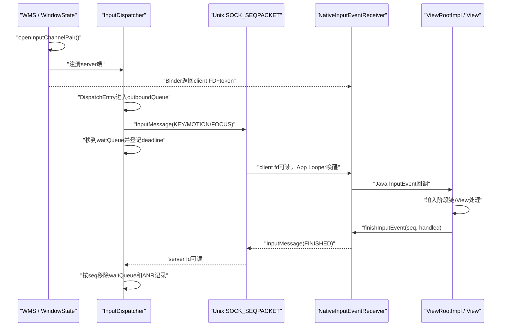
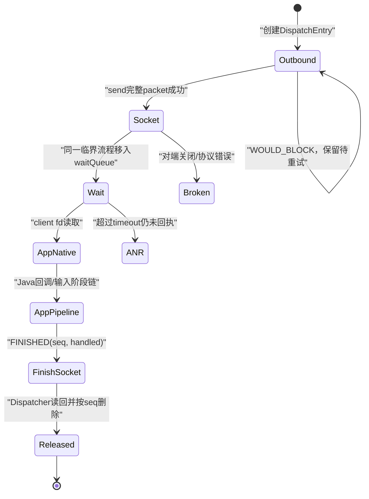
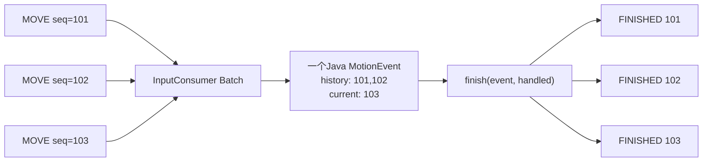
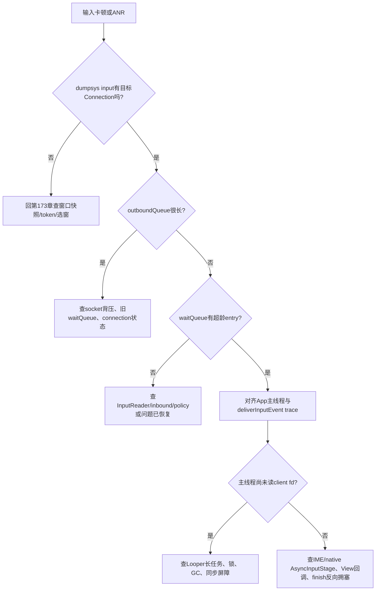

# 174 Android InputChannel、InputTransport 与应用事件接收

> 源码版本：Android 11 / API 30 / `android-11.0.0_r48`  
> 学习方式：macOS 只读源码，不要求编译、不要求连接设备  
> 前置章节：第 20、113、163、173 章

---

## 1. 本章目标：选中窗口以后，事件怎样真正到达应用

第 173 章结束在 InputDispatcher 已经选出目标 Window。此时仍有一个关键问题：一个 native `MotionEntry` 怎样跨进程变成应用主线程看到的 Java `MotionEvent`，应用处理完成后系统又怎样知道它没有卡住？

本章追踪下面这条闭环：

```text
Window建立InputChannel pair
→ server端注册给InputDispatcher
→ client端经Binder传给App
→ Dispatcher为每个目标创建DispatchEntry
→ InputPublisher把InputMessage写入Unix socket
→ App主Looper唤醒NativeInputEventReceiver
→ InputConsumer构造KeyEvent/MotionEvent
→ ViewRootImpl输入阶段链处理
→ finishInputEvent(seq, handled)
→ FINISHED消息沿同一socket反向返回
→ Dispatcher移除waitQueue条目、取消ANR deadline
```

读完后应能区分四个完成点：

1. 事件已经进入某连接的 `outboundQueue`；
2. 消息已经写入 socket，并进入 `waitQueue`；
3. App 已从 socket 读出并开始处理；
4. Dispatcher 已收到 `FINISHED` 回执。

前三个都不能替代第四个。

---

## 2. 先做版本纠偏：不是“一次Binder调用发送一次触摸”

InputChannel 的建立确实借助 Binder 把文件描述符交给应用，但稳定运行时，输入事件并不逐个走 WMS Binder：

```text
建立阶段：system_server --Binder/Parcel+FD--> App
运行阶段：InputDispatcher --Unix socket--> App
回执阶段：InputDispatcher <--同一Unix socket-- App
```

另一个容易受 Java 注释影响的误解是“必须完成一个事件才会收到下一个事件”。`InputEventReceiver.onInputEvent()` 的注释这样描述了使用契约，但 r48 实现不是严格的一发一回传输：

- Dispatcher 会连续发送，只要 socket 仍可写；
- 每次发送成功的 `DispatchEntry` 都进入 `waitQueue`；
- App native receiver 会循环读取，直到返回 `WOULD_BLOCK`；
- Java `mSeqMap` 可以同时保存多个在途事件；
- 异步 IME/native stage 还可能延迟某个事件的最终 finish。

因此正确模型是“允许多笔在途、按 `seq` 回执、每笔都有 deadline”，而不是 stop-and-wait 协议。

---

## 3. 本章要回答的十五个问题

1. InputChannel 为什么是一对，而不是一个 Binder 对象？
2. server/client 两端各由谁持有？
3. socket 类型为什么是 `SOCK_SEQPACKET`？
4. Binder 在哪一步传 FD，事件为什么不继续走 Binder？
5. connection token、event id、dispatch seq 有什么区别？
6. `outboundQueue` 和 `waitQueue` 分别表示什么？
7. `sendMessage()==OK` 到底证明了什么？
8. socket 满时为什么不丢掉当前事件？
9. App 主 Looper 怎样被 client fd 唤醒？
10. native InputMessage 怎样变成 Java InputEvent？
11. MOVE 为什么会被合成一个带 history 的 MotionEvent？
12. 合批后多个原始 seq 怎样全部收到回执？
13. `handled=false` 对 Motion 和 Key 的后果是否相同？
14. 输入 ANR 从哪个时间点开始计算？
15. App 死亡或窗口移除时，队列怎样清理？

---

## 4. 源码地图

### 4.1 通道与线协议

- `frameworks/native/include/input/InputTransport.h`
- `frameworks/native/libs/input/InputTransport.cpp`
- `frameworks/native/libs/input/tests/InputChannel_test.cpp`
- `frameworks/native/libs/input/tests/InputPublisherAndConsumer_test.cpp`
- `frameworks/native/libs/input/tests/StructLayout_test.cpp`

### 4.2 system_server 创建与注册

- `frameworks/base/services/core/java/com/android/server/wm/WindowState.java`
- `frameworks/base/services/core/java/com/android/server/wm/WindowManagerService.java`
- `frameworks/base/services/core/java/com/android/server/input/InputManagerService.java`
- `frameworks/base/services/core/jni/com_android_server_input_InputManagerService.cpp`
- `frameworks/native/services/inputflinger/dispatcher/Connection.h`
- `frameworks/native/services/inputflinger/dispatcher/InputDispatcher.cpp`

### 4.3 App 接收与 ViewRootImpl

- `frameworks/base/core/java/android/view/InputChannel.java`
- `frameworks/base/core/jni/android_view_InputChannel.cpp`
- `frameworks/base/core/java/android/view/InputEventReceiver.java`
- `frameworks/base/core/jni/android_view_InputEventReceiver.cpp`
- `frameworks/base/core/java/android/view/ViewRootImpl.java`

---

## 5. 全链路图：同一个socket既发事件也收回执



注意箭头中的 Binder 只出现在初始化交接。运行期 socket 是全双工的，同一个端点既能发送也能接收。

---

## 6. WindowState怎样创建一对InputChannel

普通窗口在 WMS `addWindow` 路径需要输入通道时进入：

```java
InputChannel[] inputChannels = InputChannel.openInputChannelPair(name);
mInputChannel = inputChannels[0];
mClientChannel = inputChannels[1];
mWmService.mInputManager.registerInputChannel(mInputChannel);
mInputWindowHandle.token = mInputChannel.getToken();
```

命名约定是：

```text
index 0 → "窗口名 (server)" → system_server / InputDispatcher
index 1 → "窗口名 (client)" → 应用进程 / InputEventReceiver
```

这里的 server/client 是用途标签，不表示 socket 能否双向通信；两端实际上是对等、全双工的本地 socket。

---

## 7. 底层不是pipe，而是Unix domain SOCK_SEQPACKET

真实创建代码：

```cpp
int sockets[2];
socketpair(AF_UNIX, SOCK_SEQPACKET, 0, sockets);
```

三个关键词分别意味着：

- `AF_UNIX`：仅本机内核中的 Unix domain 通信；
- `socketpair`：一次得到两个已连接端点，不需要 bind/listen/connect；
- `SOCK_SEQPACKET`：保留消息边界，并按序可靠传递完整 packet。

这与字节流 `SOCK_STREAM` 很不同。接收端一次 `recv()` 期望得到一个完整 `InputMessage`，不会自己设计长度前缀再拼流。

源码日志仍把“socket full”称作 pipe full，这只是历史措辞，不应据此画成匿名 pipe。

---

## 8. 为什么两端都设置成non-blocking

`InputChannel::create()` 调用：

```cpp
fcntl(fd, F_SETFL, O_NONBLOCK);
```

发送和接收又显式使用 `MSG_DONTWAIT`。目的不是让事件神奇地异步完成，而是保证 Dispatcher 线程和 App Looper 不会卡死在一次系统调用中：

```text
当前无数据 → receiveMessage返回WOULD_BLOCK
发送缓冲已满 → sendMessage返回WOULD_BLOCK
对端关闭 → 返回DEAD_OBJECT
其他errno → 返回对应负错误码
```

是否稍后重试由各自 Looper 的 fd readable/writable 事件和队列状态决定。

---

## 9. 32 KiB缓冲是背压空间，不是事件数据库

r48 将两个端点的发送与接收缓冲请求值都设为：

```cpp
static const size_t SOCKET_BUFFER_SIZE = 32 * 1024;
setsockopt(fd, SOL_SOCKET, SO_SNDBUF, ...);
setsockopt(fd, SOL_SOCKET, SO_RCVBUF, ...);
```

注释说这足以容纳数十个较大的多指 Motion 消息，以吸收应用暂时落后的抖动。这里应称“请求值”：Linux 可能对 `SO_SNDBUF` 做内部调整，不能只凭常量断言设备运行时 `getsockopt()` 读到的有效容量恰好是 32768 字节。

但它不提供持久化，也不是无限队列：

- 进程崩溃后数据不会保留；
- socket 满会形成背压；
- Dispatcher 的 `waitQueue` 才是“已经发送、仍等 App finish”的逻辑账本；
- socket 内核缓冲和 waitQueue 数量相关，却不是同一个对象。

---

## 10. token把两个端点认成同一条连接

创建 pair 时同时创建：

```cpp
sp<IBinder> token = new BBinder();
```

server 和 client 两个 `InputChannel` 保存同一个 token。它的用途是连接身份：

```text
InputWindowInfo.token
→ InputDispatcher按token找到Connection
→ client端也可用getToken()指代同一连接
```

源码特别警告：不要用 token 判断两个具体 `InputChannel` 对象是否相等，因为 pair 的两端本来就共享 token。

---

## 11. client端怎样通过Binder交给应用

`InputChannel` 实现 `Parcelable`。native 写 Parcel 时依次写：

```cpp
name
strong Binder token
unique file descriptor
```

Binder 驱动负责把 FD 安全复制到目标进程的 FD 表；数字本身可能改变，但仍引用同一个 socket endpoint。

WMS 随 `addToDisplay` 的 out 参数把 client 端交给 App。`transferTo(outInputChannel)` 转移 Java native wrapper 的所有权，原 `mClientChannel` 随后失效/释放，避免 system_server 意外长期持有 client 端副本。

所以“App 里的 fd 数字与 system_server 创建时不同”完全正常，判断连接应看 token 和通道名，不看 fd 数字相等。

---

## 12. registerInputChannel注册的到底是什么

`InputManagerService.registerInputChannel()` 经 JNI 进入 native Dispatcher：

```cpp
sp<Connection> connection =
        new Connection(inputChannel, false, mIdGenerator);

mConnectionsByFd[fd] = connection;
mInputChannelsByToken[token] = inputChannel;
mLooper->addFd(fd, 0, ALOOPER_EVENT_INPUT,
               handleReceiveCallback, this);
```

注册完成产生三种查找能力：

1. 用 token 从 InputWindowInfo 找到目标 connection；
2. 用 server fd 找到 connection；
3. server fd 变得可读时，Dispatcher 可接收 App 的 `FINISHED`。

注册通道不等于窗口已经可命中。还必须等第 173 章的 InputWindowInfo 快照含有这个 token，并满足 display/Z/flags/region 条件。

---

## 13. Connection保存的是每个目标独立的派发状态

`Connection` 的核心字段：

```cpp
Status status;                 // NORMAL/BROKEN/ZOMBIE
sp<InputChannel> inputChannel;
bool monitor;
InputPublisher inputPublisher;
InputState inputState;
bool responsive = true;
std::deque<DispatchEntry*> outboundQueue;
std::deque<DispatchEntry*> waitQueue;
```

同一个 MotionEntry 可以同时面向前景窗口、OUTSIDE watcher、gesture monitor 等多个目标。每个目标 connection 都拥有自己的 `DispatchEntry`、seq、坐标变换、发送状态和回执时间。

因此“一个硬件事件”并不等于“一个 socket message”或“一个 finish”。

---

## 14. 三类身份：eventId、dispatch seq、Java sequenceNumber

这三个数字最容易在日志里混为一谈：

| 身份 | 产生位置 | 主要用途 |
|---|---|---|
| `eventId` | InputReader/Dispatcher IdGenerator | 描述逻辑事件并贯穿native/Java trace；同一逻辑事件通常可投多个目标，转化出的派发模式也可能获得新id |
| `DispatchEntry.seq` | 每个目标的DispatchEntry | socket请求与FINISHED回执精确配对，0保留不用 |
| Java `InputEvent.getSequenceNumber()` | Java InputEvent对象 | App进程内对象代际，映射回native dispatch seq |

`InputEventReceiver.dispatchInputEvent()` 建立：

```java
mSeqMap.put(event.getSequenceNumber(), seq);
```

App 完成时先用 Java sequenceNumber 找回真正的 Dispatcher seq，再发 native finish。不要拿 eventId 直接去 waitQueue 找回执。

还要特别纠正一个安全细节：r48 的 HMAC 对 `VerifiedKeyEvent` / `VerifiedMotionEvent` 中允许验证的字段签名，但 verified 结构不含 eventId。Motion 又只对 DOWN/UP 生成有效签名，纯 MOVE 使用 `INVALID_HMAC`。所以 eventId 是事件身份，不是 HMAC 防篡改强度的一部分。

---

## 15. InputMessage是固定ABI的进程间线格式

`InputMessage` 的类型只有：

```cpp
KEY
MOTION
FINISHED
FOCUS
```

结构需要在 32 位和 64 位进程中布局一致，源码用显式 padding、8 字节对齐和 `StructLayout_test` 保护这个契约。

MOTION 携带：

```text
seq/eventId/eventTime/downTime
device/source/display/action/flags
HMAC/classification
x/y scale与offset、precision、cursor position
pointerCount
每根手指的PointerProperties与PointerCoords
```

它是原生结构体 packet，不是 Java Parcel，也不是 AIDL 对象。

---

## 16. 为什么发送前要做sanitized copy

C/C++ 结构体字段之间可能有未初始化 padding。若直接把整块内存送给另一个进程，会泄漏栈上的旧字节。

r48 的 `sendMessage()` 先：

```cpp
InputMessage cleanMsg;
msg->getSanitizedCopy(&cleanMsg);
send(fd, &cleanMsg, msgLength,
     MSG_DONTWAIT | MSG_NOSIGNAL);
```

`getSanitizedCopy()` 先清零整个对象，再逐字段复制有效数据。对于 PointerCoords，只复制 bitset 声明存在的 axis values。

这一步既是 ABI 稳定措施，也是跨进程数据最小化与信息泄漏防护。

---

## 17. Motion消息为什么只发送实际pointer数量

结构中预留 `MAX_POINTERS`，但 `Motion::size()` 计算：

```cpp
sizeof(Motion)
- sizeof(Pointer) * MAX_POINTERS
+ sizeof(Pointer) * pointerCount
```

所以单指事件不会传输整块最大数组。代价是 `pointers` 必须保持 Motion body 的最后一个字段；否则变长截断会把后续字段直接丢掉。

接收端验证实际 packet 长度正好等于计算长度，并检查：

```text
1 <= pointerCount <= MAX_POINTERS
```

长度或类型不合法返回 `BAD_VALUE`，而不是尝试容错解析未知字节流。

---

## 18. outboundQueue表示“计划发送但尚未成功写socket”

目标确定后，Dispatcher 为每种 dispatch mode 建立条目：

```text
HOVER_EXIT
OUTSIDE
HOVER_ENTER
AS_IS
SLIPPERY_EXIT
SLIPPERY_ENTER
```

适用的条目进入 connection 的 `outboundQueue`。这时：

- 事件还可能没有进入内核 socket 缓冲；
- `deliveryTime/timeoutTime` 尚未成为有效发送时间；
- App 不可能仅凭此队列状态已经看到事件；
- 若 connection 已 BROKEN/ZOMBIE，新的条目会被跳过。

`outboundQueue` 是用户态待发送队列。

---

## 19. startDispatchCycle怎样连续发送

只要 connection 为 NORMAL 且 outbound 非空，Dispatcher 循环：

```cpp
dispatchEntry->deliveryTime = currentTime;
dispatchEntry->timeoutTime = currentTime + timeout;

status = inputPublisher.publish...(...);
```

发送成功后，它不是等待 App 再返回循环，而是：

```cpp
outboundQueue移除当前entry
waitQueue.push_back(entry)
登记ANR timeout
继续尝试下一个outbound entry
```

这正是多笔在途的源码证据。socket 缓冲能够吸收短时 burst，而 seq 与 waitQueue 保存可靠的完成账。

---

## 20. waitQueue表示“已经publish但还没有FINISHED”

`Connection.h` 的注释非常直接：

```cpp
// events that have been published ... but have not
// yet received a "finished" response
std::deque<DispatchEntry*> waitQueue;
```

因此看到 waitQueue 条目可以断言：

- `send()` 曾经成功把完整 packet 交给内核；
- Dispatcher 已开始按该窗口 timeout 计时；

但不能断言：

- App Looper 已经读取；
- View 已经收到；
- 事件被 handled；
- 业务回调已经完成。

---

## 21. 两个队列和socket缓冲的状态机



图中的 Socket 与 Wait 不是严格互斥的物理阶段：消息写入后可能仍躺在内核缓冲，同时逻辑 entry 已在 waitQueue 中。状态机表达的是系统账本，而非内核 packet 的可观测生命周期。

---

## 22. sendMessage返回OK究竟证明什么

`SOCK_SEQPACKET` 下，r48 检查写入字节数必须恰好等于 `msgLength`。所以 `OK` 证明：

> 这一整个 sanitized InputMessage 已被本机内核接受到该 socket 的发送路径，没有发生部分 packet。

它不证明：

- 对端线程已经运行；
- App 已读出 packet；
- Java 对象已创建；
- View 回调已返回；
- 用户已经看到界面反馈。

这是输入延迟分析中第一个必须守住的完成边界。

---

## 23. socket满时为什么当前entry不会丢

若 `send()` 返回 `EAGAIN/EWOULDBLOCK`，InputChannel 转成 `WOULD_BLOCK`。

Dispatcher 分两种情况：

1. `waitQueue` 非空：说明已有事件占着通道，当前 entry 仍留在 outbound，等待 App finish 后重试；
2. `waitQueue` 为空：源码认为“管道满但没有任何在途账”是不符合预期的异常，直接中止 broken dispatch cycle。

正常背压链是：

```text
App处理较慢
→ waitQueue增长/socket发送缓冲变满
→ 当前outbound暂停
→ App发送FINISHED
→ server fd可读
→ Dispatcher移除wait条目
→ startDispatchCycle再次尝试outbound
```

---

## 24. App端怎样把client fd挂到主Looper

ViewRootImpl 获得 client InputChannel 后创建：

```java
mInputEventReceiver = new WindowInputEventReceiver(
        inputChannel, Looper.myLooper());
```

JNI 的 `NativeInputEventReceiver.initialize()` 调用：

```cpp
mMessageQueue->getLooper()->addFd(
        clientFd, 0, ALOOPER_EVENT_INPUT, this, nullptr);
```

这里使用构造 ViewRootImpl 的 Looper，通常就是应用主线程 Looper。事件抵达只是让这个 fd 变为 readable；必须等主 Looper 从其他消息、同步屏障或长任务中获得执行机会，回调才会运行。

所以“事件已经进入 App 进程内核缓冲”和“主线程开始处理”仍有一段可观测等待。

---

## 25. client fd可读后native receiver会循环消费

`handleEvent(ALOOPER_EVENT_INPUT)` 进入：

```cpp
consumeEvents(env,
        false /* consumeBatches */,
        -1 /* frameTime */,
        nullptr);
```

`consumeEvents()` 循环调用 `InputConsumer.consume()`，直到：

- socket 暂无消息，返回 `WOULD_BLOCK`；
- 出现错误/对端关闭；
- 内存不足；
- MOVE 被保留成待下一帧消费的 batch。

对 KEY/MOTION，它创建 native event，再转换成 Java `KeyEvent`/`MotionEvent`，同步调用 Java receiver。Focus 不创建给 View 树处理的普通 InputEvent，而是走专门回调并自动 finish。

---

## 26. Native到Java不是把InputMessage对象直接暴露出去

转换步骤是：

```text
recv InputMessage
→ InputConsumer initializeKeyEvent/initializeMotionEvent
→ NativeInputEventReceiver持有native InputEvent
→ JNI创建或复制Java KeyEvent/MotionEvent
→ dispatchInputEvent(dispatchSeq, javaEvent)
```

Java 对象有自己的生命周期和 sequenceNumber。native packet 中的 scale/offset 会进入 MotionEvent 内部，使 `getX()` 能按窗口坐标解释，而 raw 坐标仍保留不同语义。

因此抓到 App Java MotionEvent 时，不能假定它的内存布局等于 socket 的 InputMessage。

---

## 27. Java mSeqMap为什么必不可少

native 回调同时传入 Dispatcher seq 和 Java event：

```java
private void dispatchInputEvent(int seq, InputEvent event) {
    mSeqMap.put(event.getSequenceNumber(), seq);
    onInputEvent(event);
}
```

完成时：

```java
int index = mSeqMap.indexOfKey(event.getSequenceNumber());
int seq = mSeqMap.valueAt(index);
mSeqMap.removeAt(index);
nativeFinishInputEvent(mReceiverPtr, seq, handled);
```

好处是 App 只能 finish 仍被该 receiver 跟踪的具体 Java event。重复 finish、错误对象或 dispose 后 finish 只会打印警告，不能随意伪造另一个在途 seq。

---

## 28. WindowInputEventReceiver收到事件先做什么

ViewRootImpl 的 receiver 先运行兼容处理：

```text
processInputEventForCompatibility(event)
→ 可能原样返回null
→ 可能转换成0个、1个或多个事件
→ enqueueInputEvent(..., receiver, ..., processImmediately=true)
```

若转换结果为空，原事件直接 `finishInputEvent(event, true)`；否则把结果逐个加入队列。接口形状允许返回多个事件，但 r48 内置实现只针对 targetSdk&lt;23 的 stylus button 兼容：它原地修改同一个 MotionEvent，并返回单元素列表。不要仅凭通用 `List` 类型断言当前系统一定把一笔输入拆成多个 Java 事件。

普通路径把事件包装为 `QueuedInputEvent`，按接收顺序加入 ViewRootImpl pending queue，然后立即执行 `doProcessInputEvents()`。队列顺序按接收次序，不按不可信的 event timestamp 重新排序。

---

## 29. ViewRootImpl输入阶段链不是只有View.dispatchTouchEvent

r48 建立的主要阶段：

```text
NativePreImeInputStage
→ ViewPreImeInputStage
→ ImeInputStage
→ EarlyPostImeInputStage
→ NativePostImeInputStage
→ ViewPostImeInputStage
→ SyntheticInputStage
```

其中可能经过：

- native activity 的 InputQueue；
- View 的 pre-IME key；
- IME 异步分发；
- touch mode、坐标兼容与滚动 offset；
- View 层次的 key/touch/generic motion；
- 未处理按键的合成/fallback。

只有阶段链最终到达 `finishInputEvent(q)`，回执才开始反向发送。

---

## 30. AsyncInputStage为什么会延长waitQueue时间

IME 和 native input queue 可返回 `DEFER`：

```text
事件进入异步stage
→ 保存在该stage队列
→ 等IME/native callback
→ handled则finish
→ 未handled则继续下游
```

为了避免同一设备的后续事件越过被 defer 的前一事件，`AsyncInputStage.forward()` 会按 deviceId 串行阻塞相关 successor；其他 device 的事件仍可能前进。

所以 App 主线程没有在 Java 业务代码里死循环，也可能因 IME/native stage 回调迟迟不到而保持 Dispatcher waitQueue。

---

## 31. handled表示消费结果，不表示回执是否成功

`finishInputEvent(event, handled)` 同时包含两个独立事实：

```text
finish → 这个dispatch seq的处理生命周期结束
handled → App/阶段链是否认为自己消费了事件
```

即使 `handled=false`，FINISHED 仍是有效回执，Dispatcher 应移除 waitQueue、停止该条 ANR 计时。

反过来，即使 Java 传 `handled=true`，若 FINISHED packet 还在 App 的 finish queue 或通道已经断开，Dispatcher 尚未看到回执。

---

## 32. handled=false对Key与Motion的后续不同

r48 的 `afterMotionEventLockedInterruptible()` 直接返回 false，Motion 的 handled 值当前不触发类似按键 fallback 的 Dispatcher 动作。

Key 则不同：前景目标返回未处理时，Dispatcher 可询问 policy 的 `dispatchUnhandledKey()`，生成并跟踪 fallback key；若原 key 后来被处理，还要取消已经建立的 fallback 状态。

因此：

```text
Motion handled=false → 主要是完成账/统计语义
Key handled=false → 还可能进入系统policy fallback链
```

不要把 View 的事件冒泡规则与 InputDispatcher 的跨进程 fallback 规则混在一起。

---

## 33. FINISHED消息怎样沿原socket反向发送

App native 端构造：

```cpp
InputMessage msg;
msg.header.type = InputMessage::Type::FINISHED;
msg.body.finished.seq = seq;
msg.body.finished.handled = handled ? 1 : 0;
mChannel->sendMessage(&msg);
```

不需要另建回调 Binder，也不需要请求/响应共用同一线程。`socketpair` 的 client 端把 packet 发回后，system_server 的 server fd readable，Dispatcher Looper 的 `handleReceiveCallback()` 被调用。

这解释了为什么注册 server fd 时监听的是 `ALOOPER_EVENT_INPUT`：对 Dispatcher 而言，App 回执就是这个 fd 的入站数据。

---

## 34. finish发送也可能WOULD_BLOCK

双向通道意味着反向发送缓冲也会满。`NativeInputEventReceiver::finishInputEvent()` 遇到 `WOULD_BLOCK` 时不会立刻把错误抛给 Java，而是：

```text
把(seq, handled)加入mFinishQueue
→ Looper监听INPUT | OUTPUT
→ fd可写时按序重发
→ 全部发完后恢复只监听INPUT
```

因此 Java `finishInputEvent()` 返回，只能说明 native receiver 接受了完成请求；正常情况下它很快写出，但不等价于 Dispatcher 已经从 server fd 读到 FINISHED。

这个短暂边界通常不显眼，在严重拥塞或诊断极端卡顿时却非常重要。

---

## 35. Dispatcher收到FINISHED后怎样结账

server fd readable 后循环读取所有可用 FINISHED：

```cpp
receiveFinishedSignal(&seq, &handled);
finishDispatchCycleLocked(now, connection, seq, handled);
```

真正结账经 command 执行：

```text
按seq查找waitQueue entry
→ 计算finishTime-deliveryTime
→ 运行Key/Motion完成后策略
→ 再次按seq复核entry仍存在
→ 从waitQueue删除
→ 从AnrTracker删除timeout
→ release DispatchEntry
→ startDispatchCycle重试剩余outbound
```

中途策略调用可能解锁，所以源码必须再次查找，不能继续相信旧 iterator。

---

## 36. 回执可以不按waitQueue头严格到达吗

协议用 `findWaitQueueEntry(seq)` 搜索整个 deque，而不是只弹 front。这使实现能处理按 seq 定位的完成信号。

App 的常规主线程阶段链大多维持同设备顺序，但：

- 多个设备可独立前进；
- 异步 stage 支持延迟与有限的乱序完成；
- 一个 connection 可同时有多个在途事件；
- policy 回调期间 connection/queue 还可能变化。

所以不能用“收到一个 FINISHED 就机械删除最老 entry”的简化实现理解源码。

---

## 37. MOVE合批为什么存在

连续 MOVE/HOVER_MOVE 的频率可能高于显示刷新率。App 对每个 sample 都单独走 Java 回调，会增加 JNI、对象与主线程调度开销。

`InputConsumer` 因而按 deviceId + source 建立 batch：

```text
首个MOVE → 新建Batch
可兼容后续MOVE → append sample
普通fd回调consumeBatches=false → 暂缓吐给Java
Choreographer INPUT阶段 → consumeBatchedInputEvents(frameTime)
→ 生成一个带历史samples的MotionEvent
```

UP/CANCEL 或不兼容事件会促使已有 batch 先被消费，不能无限等待下一帧。

---

## 38. 一次Java MotionEvent怎样确认多个原始seq

假设三个 MOVE packet 的 Dispatcher seq 是：

```text
101 → 102 → 103
```

`consumeSamples()` 把它们合成一个 Java MotionEvent，out seq 使用最后的 103，同时记录链：

```text
103 → 102
102 → 101
```

App 对这个 MotionEvent finish 时，`InputConsumer.sendFinishedSignal(103, handled)` 先沿链发送 101、102 的 FINISHED，再发送 103，三笔使用同一个 handled。

所以 Dispatcher waitQueue 中三个 entry 都能结账，不会因为 Java 只看到一个对象而留下两个假 ANR。

---

## 39. batch、history与seq链示意



`MotionEvent.getHistorySize()` 描述采样历史，不是 ViewRootImpl pending queue 长度；seq chain 则是 native InputConsumer 私有的回执 bookkeeping，Java 无需逐条感知。

---

## 40. resampling不是伪造一次新的硬件事件

r48 默认由只读属性 `ro.input.resampling` 控制，默认启用。消费 batch 时以：

```text
sampleTime = frameTime - 5ms
```

在满足样本时间差条件时做插值或有限外推，目标是让坐标更接近当前渲染帧的时间，减少滚动抖动。源码还限制：

- 相邻样本至少相差 2ms 才考虑；
- 超过 20ms 不做跨得过远的推断；
- 最多向前预测 8ms，且还受最近间隔 50% 限制；
- 只对 finger/unknown tool 进行 resample。

resampled sample 不获得一个新的 Dispatcher seq；回执仍对应承载它的原始 message chain。

---

## 41. 为什么ViewRootImpl停止时反而立即消费batch

`WindowInputEventReceiver.onBatchedInputEventPending()` 通常把消费安排到 Choreographer INPUT callback，使 sample 与 frameTime 对齐。

但以下情况立即消费：

```text
mUnbufferedInputDispatch
指定source请求unbuffered
mStopped
```

尤其 `mStopped` 时不会再有正常 Choreographer callback；若仍把 batch 留到“下一帧”，它可能永远得不到消费并最终触发输入 ANR。

这说明批处理是一种延迟优化，不能破坏最终回执活性。

---

## 42. 输入ANR从deliveryTime开始，不从硬件时间开始

发送前 Dispatcher 设置：

```cpp
dispatchEntry->deliveryTime = currentTime;
dispatchEntry->timeoutTime = currentTime
        + getDispatchingTimeoutLocked(token);
```

普通窗口默认 timeout 为 5 秒，但窗口/应用 handle 可以提供具体值。`AnrTracker` 保存 responsive connection 的 deadline，dispatch loop 每轮取最早超时决定下次唤醒。

因此 ANR 等待时长覆盖：

```text
消息写入socket后等待App Looper
+ native/Java转换
+ ViewRoot pending/stage处理
+ IME/native异步阶段
+ FINISHED反向排队并抵达Dispatcher
```

它不包含事件在 InputReader/inbound queue 中尚未投递给该窗口的全部早期时间。

---

## 43. 2秒slow日志与5秒ANR不是同一个阈值

收到 FINISHED 后，Dispatcher 计算：

```text
eventDuration = finishTime - deliveryTime
```

超过 2 秒会打印该 connection 处理事件过慢的日志。这个 2 秒是警告阈值：

- 不等于默认 5 秒 dispatch timeout；
- 不直接弹 ANR 对话框；
- 只有收到 finish 后才能算出这条完成耗时；
- 真正超时由 AnrTracker/`processAnrsLocked()` 在 deadline 到达时触发。

“日志写 spent 2300ms”与“系统已经判 ANR”是两个不同结论。

---

## 44. 超时后responsive怎样变化

最早 deadline 到达时：

```cpp
connection->responsive = false;
mAnrTracker.eraseToken(token);
onAnrLocked(connection);
```

系统不再为这个 unresponsive connection 的旧 entry 反复设置相同唤醒；新的 gesture 选目标时也会避开不响应窗口/monitor。

policy 处理 ANR 后可以：

- 返回正 timeout extension：把 connection 恢复 responsive，并延长仍在 waitQueue 的期限；
- 不再等待：取消该 connection 的事件状态；
- 后续旧 FINISHED 抵达：若 waitQueue 已恢复健康，可重新判定 responsive。

ANR 是带 policy 决策和恢复路径的状态变化，不只是打印一行超时日志。

---

## 45. broken、zombie与unresponsive不要混用

| 状态 | 含义 | 通道是否物理可用 |
|---|---|---|
| `responsive=false` | 通道仍存在，但在途事件超时 | 可能仍可读写，App也可能恢复 |
| `STATUS_BROKEN` | 不可恢复通信错误 | 认为连接已坏，清空派发队列 |
| `STATUS_ZOMBIE` | 已显式注销 | 不再作为注册连接使用 |

`abortBrokenDispatchCycleLocked()` 会 drain outbound/wait queue，按需要通知 WMS；显式 unregister 则先移除 fd/token 表和 Looper 监听，再 abort，最后标 ZOMBIE。

响应慢不是 socket 断开，socket 断开也不需要再等待 5 秒才识别。

---

## 46. App关闭client端后系统怎样清理窗口

server fd 收到 HANGUP/ERROR，或 `receiveFinishedSignal()` 返回 `DEAD_OBJECT` 时，Dispatcher 注销 connection 并可通知 policy：

```text
InputDispatcher
→ NativeInputManager policy callback
→ InputManagerService.notifyInputChannelBroken(token)
→ InputManagerCallback.notifyInputChannelBroken(token)
→ WMS mInputToWindowMap找到WindowState
→ windowState.removeIfPossible()
```

但若窗口 handle 已经先被移除，Dispatcher 会避免重复警告。WMS 主动销毁窗口时也刻意“先 unregister server，再 dispose fd”，避免正常关闭被误报成 broken window。

---

## 47. 可见但客户端已死的窗口为什么有dummy receiver

WindowState 的特殊路径可能让死亡窗口暂时保持可见，以便点击后触发重启。若 `openInputChannel(null)` 没有把 client 端交给 App，WMS 创建：

```java
final class DeadWindowEventReceiver extends InputEventReceiver {
    public void onInputEvent(InputEvent event) {
        finishInputEvent(event, true);
    }
}
```

它运行在 system_server 的 WMS Handler Looper，立即确认事件。这样：

- socket 不会因无人读取而塞满；
- input monitor 仍能观察点击；
- 系统可借点击重新拉起窗口对应应用；
- 这个 dummy 并不会把触摸交给已经死亡的旧 View 树。

---

## 48. 注入事件的WAIT_FOR_FINISHED等的也是回执账

`injectInputEvent()` 的同步模式要分开：

```text
SYNC_NONE → 入队后不等结果
WAIT_FOR_RESULT → 等目标选择/注入结果
WAIT_FOR_FINISHED → 结果成功后还等foreground dispatch数归零
```

每创建一个 foreground DispatchEntry 就增加 `pendingForegroundDispatches`，release 时减少；只有归零才唤醒 `WAIT_FOR_FINISHED` 注入者。

这等待的是前景目标的 FINISHED/清理完成，不代表 View 一定 handled，也不等待由事件触发的绘制、SurfaceFlinger present 或业务异步网络任务。

---

## 49. 现场诊断、macOS练习与复读审计

### 49.1 一张诊断决策图



### 49.2 macOS只读练习1：追通道所有权

```bash
rg -n "openInputChannelPair|registerInputChannel|transferTo|disposeInputChannel" \
  frameworks/base/services/core/java/com/android/server/wm \
  frameworks/base/services/core/java/com/android/server/input \
  frameworks/base/core/java/android/view
```

给每个命中标注：server/client、所在进程、是否仍拥有 FD、何时转移或关闭。

### 49.3 macOS只读练习2：追事件与回执

```bash
rg -n "startDispatchCycleLocked|publishMotionEvent|waitQueue|receiveFinishedSignal|finishDispatchCycle" \
  frameworks/native/services/inputflinger/dispatcher \
  frameworks/native/libs/input
```

尝试回答：`deliveryTime` 在哪里设置，entry 在哪里从 outbound 移到 wait，seq 在哪里查回。

### 49.4 macOS只读练习3：追App接收线程

```bash
rg -n "NativeInputEventReceiver|addFd|consumeEvents|dispatchInputEvent|finishInputEvent" \
  frameworks/base/core/jni/android_view_InputEventReceiver.cpp \
  frameworks/base/core/java/android/view/InputEventReceiver.java \
  frameworks/base/core/java/android/view/ViewRootImpl.java
```

把 native callback、Java receiver、ViewRoot pending queue、InputStage 和 FINISHED 标成五段。

### 49.5 macOS只读练习4：手算合批回执

假设 waitQueue 有 seq 31、32、33 三个连续 MOVE，InputConsumer 合成一个 history size=2 的 MotionEvent，并以 33 作为 outSeq。回答：

1. Java 调用几次 `finishInputEvent`？
2. socket 反向发送几个 FINISHED packet？
3. 三个 packet 的 handled 是否相同？
4. 哪个组件保存 33→32→31 的 seq chain？

答案：一次、三个、相同、native `InputConsumer`。

### 49.6 复读审计：r48最容易误解的二十一处

1. InputChannel 初始化借 Binder 传 FD，但逐个事件运行期走 Unix socket。
2. 底层是 `SOCK_SEQPACKET`，不是字节流 socket，也不是匿名 pipe。
3. server/client 是用途名称，两端本身都可发送和接收。
4. 一对端点共享 connection token，但不是同一个具体 InputChannel 对象。
5. fd 数字是进程局部的，跨 Binder 后数字不同很正常。
6. 注册 server channel 不代表窗口已进入可命中的 InputWindowInfo 快照。
7. eventId、per-target dispatch seq、Java event sequenceNumber 是三类身份。
8. outbound 表示尚未成功 publish，wait 表示已 publish 但未收到 FINISHED。
9. waitQueue 与内核 socket 缓冲不是同一份队列。
10. send OK 只证明内核接受完整 packet，不证明 App 已读取或处理。
11. r48 可连续 publish 多个事件，不是严格“一发一回”。
12. `handled=false` 仍是有效完成；它和通信失败完全不同。
13. Motion 的 handled 在本版本不触发 Dispatcher fallback，Key 可能触发 policy fallback。
14. Java finish 返回时，FINISHED 仍可能在 native `mFinishQueue` 等 fd 可写。
15. App receiver 回调通常在 ViewRoot 所在线程，也就是主 Looper，而不是 Binder 线程。
16. MOVE batch 把多个 packet 合成一个带 history 的 Java MotionEvent。
17. 一个合批 Java finish 会沿 native seq chain 回执全部原始 message。
18. resampling生成坐标样本，不生成新的 Dispatcher seq 或硬件事件。
19. 输入ANR从成功 publish 的 deliveryTime计时，不从触摸硬件eventTime计时。
20. unresponsive、BROKEN、ZOMBIE是不同状态；显式注销会主动清队列和监听。
21. eventId不在r48 VerifiedInputEvent的HMAC签名字段中；Motion也只有DOWN/UP获得有效签名，不能把id当安全认证值。

### 49.7 本章核心结论

> InputChannel 是“一对共享token的非阻塞Unix seqpacket端点”。WMS把server端注册给system_server内的InputDispatcher，把client端FD经一次Binder交接给App；之后事件和完成回执都走这个全双工socket，不再为每个触摸发Binder事务。

> Dispatcher用outboundQueue记录待publish事件，用waitQueue记录已publish但未FINISHED事件；每个目标DispatchEntry拥有独立seq和deadline。publish成功只到内核缓冲，真正完成必须等App把同一seq的FINISHED送回并由Dispatcher移除wait entry。

> App主Looper上的NativeInputEventReceiver把InputMessage变成Java事件，ViewRootImpl可经过IME/native异步阶段再finish。连续MOVE还会按帧合批和resample，一个Java MotionEvent的finish由InputConsumer展开为多个原始seq回执。输入ANR因此覆盖socket后等待、主线程、阶段链和反向回执，而不只是View.dispatchTouchEvent本身。

---

## 50. 自测题与下一章预告

### 50.1 自测题

1. 为什么 socketpair 要用 `SOCK_SEQPACKET` 而不是 `SOCK_STREAM`？
2. WMS 把哪一端注册给 Dispatcher，哪一端传给 App？
3. connection token 为什么不能用于判断 server/client 对象相等？
4. `outboundQueue` 与 `waitQueue` 的边界是什么？
5. `publishMotionEvent()==OK` 为什么不代表 View 已收到？
6. 为什么 r48 不是严格 stop-and-wait 输入协议？
7. eventId、dispatch seq、Java sequenceNumber 各做什么？
8. App `handled=false` 为什么仍必须发送 FINISHED？
9. 三个 MOVE 合批为一个 Java MotionEvent 后，三个 wait entry 怎样清除？
10. 输入 ANR 的 timeout 从哪个时间点起算？
11. `responsive=false` 与 `STATUS_BROKEN` 有什么区别？
12. `WAIT_FOR_FINISHED` 注入完成为什么仍不等画面显示？

### 50.2 下一章

第 175 章继续研究：

> Android ViewRootImpl InputStage、IME 前后阶段与 View 事件分发

重点回答：

- Key、Touch、GenericMotion 怎样穿过 pre-IME/post-IME 阶段？
- ViewGroup 怎样拦截、拆分和取消触摸目标？
- `dispatchTouchEvent` 返回值怎样变成跨进程 `handled`？
- 异步 IME 与 native InputQueue 怎样保持同设备事件顺序？
- `ACTION_CANCEL` 在焦点丢失、窗口移除与手势转移时怎样生成和消费？
