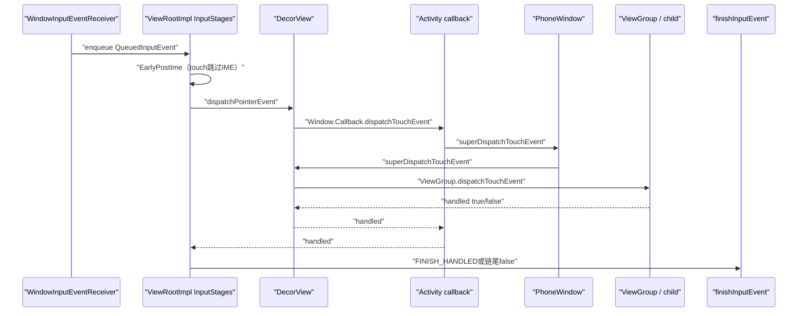
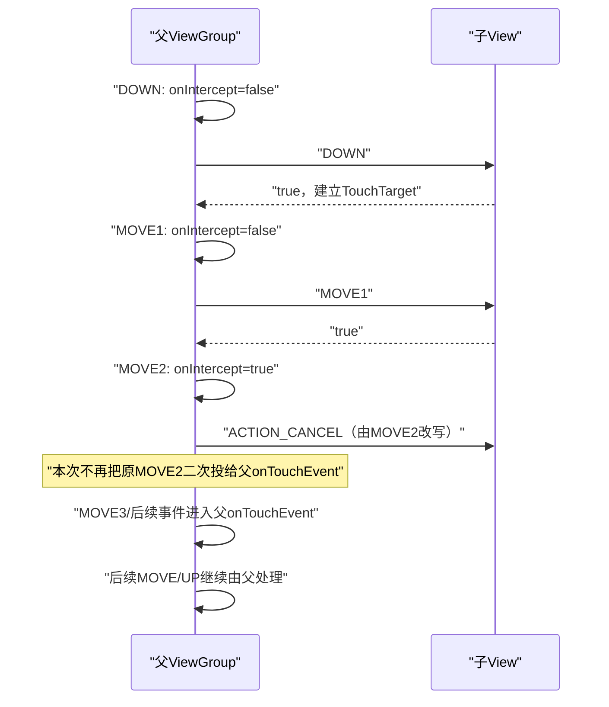
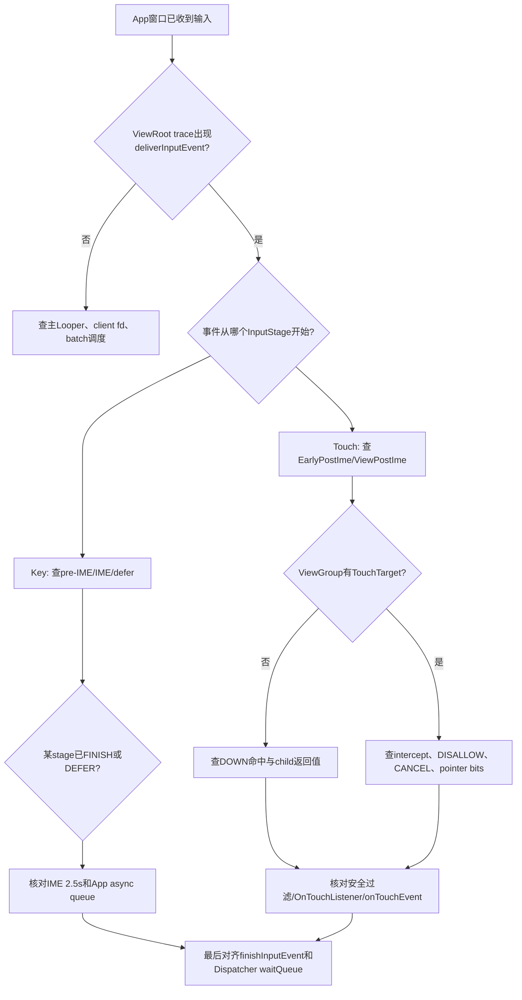

# 175 Android ViewRootImpl InputStage、IME 与 View 事件分发

> 源码版本：Android 11 / API 30 / `android-11.0.0_r48`  
> 学习方式：macOS 只读源码，不要求编译、不要求连接设备  
> 前置章节：第 19、20、52、163、173、174 章

---

## 1. 本章目标：App收到事件后，不是立刻调用某个Button

第 174 章把事件送到了 App 主 Looper。接下来常见的简化说法是：

```text
InputEventReceiver → ViewRootImpl → dispatchTouchEvent → onTouchEvent
```

方向没错，却省略了最容易制造误判的部分：

- ViewRootImpl 先把事件放入有状态的 InputStage 链；
- 键盘可能先过 native input queue、pre-IME View 和远端 IME；
- pointer touch 通常直接从 post-IME 阶段开始；
- DecorView 会调用 Activity 这个 Window.Callback，再绕回 PhoneWindow 的 View 树入口；
- ViewGroup 在 DOWN 选择 TouchTarget，后续 MOVE 不重新普通 hit-test；
- 父容器可在中途拦截，并把当前事件改成 CANCEL 发给旧子目标；
- View 返回 false 后，SyntheticInputStage 或系统按键 fallback 仍可能处理；
- 只有阶段链终止，结果才变成第 174 章的 `FINISHED(seq, handled)`。

本章目标是把这些状态合成一条可逐行推演的链。

---

## 2. 先建立三层handled模型

“返回 true”在不同层代表的事实不同：

| 层级 | 典型值 | 精确含义 |
|---|---|---|
| 单个View调用 | `dispatchTouchEvent()==true` | 这次调用被该View/子树消费 |
| ViewRoot InputStage | `FINISH_HANDLED` | 阶段链应以handled结束，不再普通向后传 |
| InputTransport | `FINISHED(seq, handled=1)` | App已对该Dispatcher派发回执为handled |

通常 View 的 true 会被 `ViewPostImeInputStage` 转成 `FINISH_HANDLED`，最后发送跨进程 handled=true；但中间还有安全过滤、IME、native stage、fallback、synthetic 和 drop 等路径。

因此不能看到某个 `onTouchEvent()` 返回 false，就立刻断言最终跨进程 handled 一定是 false。

---

## 3. 本章要回答的十六个问题

1. ViewRootImpl 为什么还需要 App 侧 pending input queue？
2. 七个 InputStage 的固定顺序是什么？
3. 哪些事件会跳过 pre-IME/IME？
4. IME 为什么可异步 defer 原始按键？
5. IME 超时后事件会丢掉还是继续给 App？
6. Activity、PhoneWindow、DecorView、ViewGroup 的触摸调用为什么像递归？
7. DOWN 时 ViewGroup 怎样选择一个 child？
8. child 只有 DOWN 返回 true 才会成为 TouchTarget 吗？
9. 后续 MOVE 为什么不重新按坐标寻找另一个 child？
10. `requestDisallowInterceptTouchEvent(true)` 能否禁止 DOWN 拦截？
11. 父容器中途拦截时，CANCEL 怎样生成？
12. 多指 split 怎样把不同 pointer 分给不同 child？
13. 父/子坐标与 child matrix 怎样转换？
14. OnTouchListener、TouchDelegate、onTouchEvent 的顺序是什么？
15. View 的 click 为什么可能在输入 FINISHED 后才执行？
16. ACTION_CANCEL 与 `cancelPendingInputEvents()` 是否一回事？

---

## 4. 源码地图

### 4.1 ViewRoot 输入阶段

- `frameworks/base/core/java/android/view/ViewRootImpl.java`
- `frameworks/base/core/java/android/view/InputEventReceiver.java`
- `frameworks/base/core/java/android/view/InputEventCompatProcessor.java`
- `frameworks/base/core/java/android/view/ImeFocusController.java`
- `frameworks/base/core/java/android/view/inputmethod/InputMethodManager.java`

### 4.2 Window回调链

- `frameworks/base/core/java/com/android/internal/policy/DecorView.java`
- `frameworks/base/core/java/com/android/internal/policy/PhoneWindow.java`
- `frameworks/base/core/java/android/view/Window.java`
- `frameworks/base/core/java/android/app/Activity.java`

### 4.3 View树分发

- `frameworks/base/core/java/android/view/View.java`
- `frameworks/base/core/java/android/view/ViewGroup.java`
- `frameworks/base/core/java/android/view/MotionEvent.java`
- `frameworks/base/core/java/android/view/TouchDelegate.java`

---

## 5. 一次触摸在App内的总链路



图中 DecorView 出现两次不是无限递归：

- 第一次是 DecorView 作为 Window 根，调用 Window.Callback（通常 Activity）；
- Activity 再调用 `Window.superDispatchTouchEvent()`；
- PhoneWindow 把它转给 `DecorView.superDispatchTouchEvent()`；
- 这里的 `super` 才进入 ViewGroup 的实现，不再回 Activity。

---

## 6. QueuedInputEvent保存事件、receiver和阶段状态

ViewRootImpl 将输入包装成：

```java
InputEvent mEvent;
InputEventReceiver mReceiver;
int mFlags;
QueuedInputEvent mNext;
```

关键 flags：

```text
DELIVER_POST_IME
DEFERRED
FINISHED
FINISHED_HANDLED
RESYNTHESIZED
UNHANDLED
MODIFIED_FOR_COMPATIBILITY
```

`mReceiver` 不为空，表示处理结束后需要回到对应 InputEventReceiver 发跨进程 finish。App/IME 合成并直接塞入 ViewRoot 的事件可以没有 receiver；这类事件完成时只回收本地对象，不会伪造一个 Dispatcher seq 回执。

---

## 7. 为什么App侧还要pending input queue

InputDispatcher 已经有 inbound/outbound/wait queue，App 为何再有一份？因为进入 App 后还可能出现：

- InputEventReceiver 一次循环读取多个事件；
- IME 或 App 自己合成、重新注入 key；
- native/IME stage 异步完成；
- 某些本地入口要求异步投递而非立即递归调用；
- 不同 eventTime 不一定可靠单调。

ViewRootImpl 明确按接收/入队顺序连接 `mPendingInputEventHead/Tail`，不按 eventTime 排序。`processImmediately=true` 只代表马上调用 drain，事件仍先经过同一队列 bookkeeping。

---

## 8. 七个InputStage的固定连接顺序

窗口加入成功后，ViewRootImpl 建链：

```text
NativePreImeInputStage
→ ViewPreImeInputStage
→ ImeInputStage
→ EarlyPostImeInputStage
→ NativePostImeInputStage
→ ViewPostImeInputStage
→ SyntheticInputStage
→ finishInputEvent
```

每个阶段只能返回：

```text
FORWARD              → 交给下一阶段
FINISH_HANDLED       → 标记完成且handled，再穿过后续阶段到链尾
FINISH_NOT_HANDLED   → 标记完成但未handled
DEFER                → AsyncInputStage保存，等回调后再forward/finish
```

已经 `FLAG_FINISHED` 的事件经过后续 stage 时不再调用其 `onProcess()`，只是一路 forward 到最终 finish。

---

## 9. 事件从哪个阶段开始由shouldSkipIme决定

`deliverInputEvent()` 选择：

```java
stage = q.shouldSkipIme()
        ? mFirstPostImeInputStage
        : mFirstInputStage;
```

`shouldSkipIme()` 在 r48 对以下事件返回 true：

```text
显式FLAG_DELIVER_POST_IME
MotionEvent且source属于SOURCE_CLASS_POINTER
MotionEvent且source属于SOURCE_ROTARY_ENCODER
```

因此普通触摸、鼠标 pointer、旋转编码器不会走 NativePreIme/ViewPreIme/Ime 三段，而是从 EarlyPostIme 开始。普通键盘 KeyEvent 才是理解 IME 阶段的典型对象。

---

## 10. NativePreIme与NativePostIme只在有InputQueue时生效

若根 View 实现 `RootViewSurfaceTaker` 并接管 InputQueue，ViewRootImpl 会有 `mInputQueue`，常见于 NativeActivity/特定嵌入场景。

```text
NativePreIme：只把KeyEvent在IME前交给native
NativePostIme：把尚未完成的各类事件在IME后交给native
```

两者都调用 `InputQueue.sendInputEvent()` 并返回 DEFER，等 native FinishedInputEventCallback：

```text
handled=true → finish整条App阶段链
handled=false → 继续下一个Java阶段
```

普通 Java Activity 没有 mInputQueue 时，这两个阶段只是 FORWARD。

---

## 11. ViewPreIme让焦点路径先于输入法观察按键

对 KeyEvent：

```java
if (mView.dispatchKeyEventPreIme(event)) {
    return FINISH_HANDLED;
}
```

ViewGroup 沿当前焦点路径把 pre-IME key 传到 focused child；View 默认进入 `onKeyPreIme()`。

典型用途是 App 在 IME 处理 BACK 前调整 UI。但“pre-IME”不代表它在系统 InputDispatcher 或 Window 选择之前；它已经是目标 App 主线程中的 ViewRoot 阶段。

---

## 12. ImeInputStage为什么是异步阶段

有 IME focus 且窗口不是 `FLAG_LOCAL_FOCUS_MODE` 时：

```text
ImeFocusController
→ InputMethodManager.dispatchInputEvent
→ ImeInputEventSender
→ IME input channel
```

结果可能是：

```text
DISPATCH_HANDLED      → App原始事件FINISH_HANDLED
DISPATCH_NOT_HANDLED  → 继续App post-IME阶段
DISPATCH_IN_PROGRESS  → DEFER，等待IME异步回调
```

注意这又是一套嵌套的输入通道：原始事件已经从系统 Dispatcher 到目标 App，App 的 IMM 再把它送给当前 IME，IME 回执后 App 才决定是否继续 View 树。

---

## 13. IME 2.5秒超时不等于系统输入ANR

InputMethodManager 对发给 IME 的 pending event 设置 2500ms 消息：

```java
INPUT_METHOD_NOT_RESPONDING_TIMEOUT = 2500;
```

IME 未及时回执时，IMM 从 pending map 移除它，打印 timeout，并以 `handled=false` 调用目标 App 的 stage callback。于是原始事件继续 post-IME/View 流程，而不是永久卡在 IME。

这与第 174 章目标窗口通常 5 秒的 InputDispatcher ANR 不同：

- 2.5秒是 App进程IMM等待IME子派发的保护；
- 5秒左右是system_server等待目标窗口最终FINISHED；
- 两个时钟可能嵌套，IME超时已经消耗掉目标窗口的一大段预算。

---

## 14. AsyncInputStage怎样避免同设备事件越过

DEFER 后，stage 把 QueuedInputEvent 放进自己的 queue。回调可能乱序完成，但 forward 时扫描更早条目：

```text
同deviceId前面还有事件 → 当前继续排队
不同deviceId → 可独立向下游前进
早事件完成 → 依次释放同deviceId已不再DEFER的后续项
```

这是一种“按设备维持相关顺序”的局部串行，不是全局禁止所有输入并发。也解释了为什么 dump 中某个 async stage queue 有值时，事件可能已经离开 ViewRoot pending queue，却仍未到 View。

---

## 15. EarlyPostIme先做模式与坐标兼容

pointer 事件在这里执行：

- 可选 `CompatibilityInfo.Translator` 屏幕到 App window 转换；
- DOWN/SCROLL 进入 touch mode；
- DOWN 隐藏 Autofill UI 和 tooltip；
- 按 `mCurScrollY` 修正事件位置；
- 保存最近 raw touch point/source，供拖拽等使用。

这说明 ViewGroup 看到的坐标已经不是第 173 章最初的屏幕坐标：Dispatcher 的 window scale/offset、MotionEvent 相对坐标，以及 ViewRoot 的兼容/scroll 修正已经先后发生。

---

## 16. ViewPostIme怎样选择Key、Touch和GenericMotion

它先按 Java 事件类型与 source 分类：

```text
KeyEvent → processKeyEvent
SOURCE_CLASS_POINTER → processPointerEvent
SOURCE_CLASS_TRACKBALL → processTrackballEvent
其他Motion → processGenericMotionEvent
```

`View.dispatchPointerEvent()` 再根据 `event.isTouchEvent()` 分流：

```text
touch类 → dispatchTouchEvent
hover/scroll等非touch pointer → dispatchGenericMotionEvent
```

所以“来自鼠标”不必然进入 touch 分发：鼠标按键拖拽可成为 touch-like pointer，hover/scroll 则走 generic motion。

---

## 17. Key在post-IME仍有多次消费机会

大致顺序是：

```text
UnhandledKeyManager已捕获的后续key
→ 根View.dispatchKeyEvent
→ 未处理key listener路径
→ key shortcut
→ FallbackEventHandler
→ DPAD/TAB自动焦点导航
→ SyntheticInputStage/最终未处理
```

其中 DecorView/Activity/PhoneWindow 自己也参与 key 回调，UnhandledKeyManager 还要保证新的 unhandled-key listener 对同一 DOWN 的 repeat/UP 保持接收者。

因此分析“按键没进目标 EditText”时不能只看 `EditText.onKeyDown()`；它可能在 pre-IME、IME、Activity、ActionBar、shortcut 或 fallback 层已经被消费。

---

## 18. Activity触摸链为什么看起来绕回DecorView

调用顺序：

```text
ViewRootImpl
→ DecorView.dispatchTouchEvent
→ Window.Callback（Activity）.dispatchTouchEvent
→ Activity.onUserInteraction（仅DOWN）
→ PhoneWindow.superDispatchTouchEvent
→ DecorView.superDispatchTouchEvent
→ ViewGroup.dispatchTouchEvent
```

若 View 树未处理，Activity 最后还有 `Activity.onTouchEvent(ev)` 机会。

这个结构让 Activity 作为 Window.Callback 可以在进入普通 View 树前统一观察/拦截事件，同时 `superDispatchTouchEvent` 又提供标准树分发入口。

---

## 19. ViewGroup每次新DOWN先清理上一手势残留

收到 `ACTION_DOWN` 时：

```java
cancelAndClearTouchTargets(ev);
resetTouchState();
```

这是防御性恢复：如果上一手势的 UP/CANCEL 因 App switch、ANR 或其他状态变化丢失，新 DOWN 不应继承旧 child target、disallow intercept 或 nested scroll 状态。

所以 TouchTarget 的逻辑生命周期以 DOWN 建立，以 UP/CANCEL/reset 结束；它不是永久的“这个坐标区域属于某 child”。

---

## 20. DOWN怎样从前到后查找child

若父容器未拦截，ViewGroup 获取按 touch dispatch 顺序排列的 children，再从最后向前扫描视觉前层：

```text
child可接收pointer（VISIBLE或仍有animation）
且触点经过child逆矩阵后位于child内
→ 调dispatchTransformedTouchEvent(DOWN, child)
→ child返回true则停止扫描并建立TouchTarget
→ 返回false则继续尝试下面的child
```

这意味着几何命中只是候选；child 是否在 DOWN 返回 true 才决定它是否成为本次 gesture target。

---

## 21. TouchTarget到底记录什么

它是 ViewGroup 的轻量链表节点：

```java
View child;
int pointerIdBits;
TouchTarget next;
```

记录的是：

- 当前手势由哪个直接 child 接收；
- split mode 下这个 child 拥有哪些 pointer id；
- 同一 ViewGroup 下可能有多个 child target。

它不记录屏幕 Window，也不替代 InputDispatcher TouchState。系统层决定“哪个窗口”，ViewGroup TouchTarget 再决定“该窗口 View 树里的哪个直接子节点”。

---

## 22. 为什么child的DOWN返回false后收不到MOVE

在 DOWN hit-test 中，只有 `dispatchTransformedTouchEvent()` 返回 true 才执行：

```java
newTouchTarget = addTouchTarget(child, idBitsToAssign);
```

若 child DOWN 返回 false：

- 不创建 TouchTarget；
- 父容器可继续尝试下层 sibling；
- 后续 MOVE 不会因为坐标仍在这个 child 内而自动补发；
- 最终可能由父 ViewGroup 自己的 `onTouchEvent()` 接管。

自定义 View 想持续收一个普通手势，通常必须从 DOWN 起就返回 true。

---

## 23. MOVE为什么通常继续给原TouchTarget

后续事件若已有 `mFirstTouchTarget`，ViewGroup 遍历保存的 target 链并发给它们，而不是重新按当前 `(x,y)` 找 child。

这保证：

- 手指移出按钮边界时按钮仍可清 pressed/判断取消点击；
- 滚动手势不会每跨一个 child 就更换接收者；
- 多指 split 可按 pointerIdBits 保持各自归属；
- 父容器中途拦截时能明确给旧 target 发 CANCEL。

它和第 173 章 InputDispatcher 在一次 gesture 内通常粘住 Window target 是上下两层相似但独立的状态机。

---

## 24. ViewGroup拦截决策何时执行

只有：

```text
当前是DOWN
或已经存在mFirstTouchTarget
```

才考虑 `onInterceptTouchEvent()`。若既不是 DOWN 又没有 child target，ViewGroup 直接认为 intercepted=true，因为没有必要重新寻找 child。

`onInterceptTouchEvent()` 默认只在鼠标主键按下滚动条 thumb 时返回 true，其余返回 false；常见 ScrollView/RecyclerView 等子类会按移动距离和方向重写这一决策。

---

## 25. requestDisallowInterceptTouchEvent的真实边界

child 调：

```java
parent.requestDisallowInterceptTouchEvent(true);
```

会在当前 ViewGroup 设置 `FLAG_DISALLOW_INTERCEPT`，并一路上传祖先。后续分发中，父容器跳过 `onInterceptTouchEvent()`。

但新 DOWN 一开始会 `resetTouchState()`，其中清除这个 flag；因此它不是跨手势永久配置，也不能阻止祖先检查新手势的 DOWN。它主要保护当前已开始的 gesture 后续事件不被普通中途拦截。

系统级取消、窗口移除等也不受这个 flag 阻止。

---

## 26. 父容器中途拦截怎样生成CANCEL

假设 child 已是 TouchTarget，MOVE 到来时父的 `onInterceptTouchEvent()` 返回 true：

```java
cancelChild = intercepted;
dispatchTransformedTouchEvent(ev,
        true /* cancel */, child, pointerIds);
```

`dispatchTransformedTouchEvent()` 暂时把当前事件 action 改成 `ACTION_CANCEL`，发送给 child，随后恢复原 action。然后 TouchTarget 从链表移除。

这里有一个常被流程图画错的细节：由于本次调用一开始存在 `mFirstTouchTarget`，代码进入“遍历旧 targets”的分支；它把当前 MOVE 以 CANCEL 发给 child 后，并不会在同一次调用中再把原 MOVE 发给父的 `onTouchEvent()`。到了下一笔事件，target 已为空且又不是新 DOWN，ViewGroup 才把该事件交给自身 `super.dispatchTouchEvent()` / `onTouchEvent()`。也就是“当前事件负责取消旧 child，后续事件由父处理”。

---

## 27. 中途拦截案例完整时间线



child 收到 CANCEL 后必须清 pressed、drag、long-press timer 等状态，不能等待一个永远不会再来的 UP。

---

## 28. CANCEL有多种来源，语义都是“流被终止”

常见来源：

- InputDispatcher 因窗口移除、焦点/触摸转移、ANR清理合成 CANCEL；
- ViewGroup 中途 intercept，把当前 Motion 改成 CANCEL 给 child；
- 新 DOWN 发现旧 TouchTarget 残留，合成 CANCEL 清理；
- child 被移除/隐藏/状态变化时 `cancelTouchTarget()` 合成 CANCEL；
- View 的 `PFLAG_CANCEL_NEXT_UP_EVENT` 让下一次分发按 CANCEL 处理。

来源不同，但 View 应采取相同核心动作：停止当前 gesture，不执行普通 UP click，撤销临时视觉/定时状态。

---

## 29. ACTION_CANCEL和cancelPendingInputEvents不是一回事

`ACTION_CANCEL` 是低层 MotionEvent 流的一条事件，通知 touch handler 当前 gesture 终止。

`View.cancelPendingInputEvents()` 则遍历 View 树，调用 `onCancelPendingInputEvents()`，默认移除已 post 的 click/long-press 等高层 Runnable。源码明确说明它不能阻止之后仍从低层输入队列到来的新事件，也不能单独作为防重复提交方案。

两者经常配合，却不是相互替代：收到 CANCEL 时 View.onTouchEvent 会主动清 pressed/tap/long-press；主动取消 pending callback 不会自动制造一个 MotionEvent CANCEL 给所有逻辑。

---

## 30. splitMotionEvents怎样把多指分给不同child

targetSdk >= Honeycomb 的 ViewGroup 默认开启 split（XML 可覆盖）。非鼠标触摸下：

```text
DOWN pointer0命中child A → A拥有bit0
POINTER_DOWN pointer1命中child B → B拥有bit1
后续事件按desiredPointerIdBits拆给A/B
POINTER_UP → 从对应TouchTarget移除该pointer bit
```

若没有新 child 接受新 pointer，代码把它加入最早建立的 target。

鼠标事件明确不走这个 split 分支；不要把多按钮鼠标等同多指触屏。

---

## 31. MotionEvent.split会修正action

拆出部分 pointer 后，原 `ACTION_POINTER_DOWN/UP` 可能不适用于目标 child：

- 变化的 pointer 不属于该 child → action 改为 MOVE；
- 拆后只剩一个且它刚加入 → POINTER_DOWN 改 DOWN；
- 拆后只剩一个且它刚离开 → POINTER_UP 改 UP；
- 多个 pointer 且变化者仍在 → 重算 pointer index。

所以两个 child 同时收到的 Java MotionEvent 可能 action 不同，但都源于同一个上游 packet。不能只按 eventTime 判断它们是完全相同的事件副本。

---

## 32. child坐标怎样变换

`dispatchTransformedTouchEvent()` 分两层处理：

```text
先按pointerIdBits选择/拆分pointer
再从父坐标移到child坐标：
offsetX = parent.scrollX - child.left
offsetY = parent.scrollY - child.top
```

若 child matrix 非 identity，再应用 child inverse matrix。无拆分且 identity 时可临时修改原 MotionEvent，调用后把 offset 恢复；否则复制新 event，使用后 recycle。

因此自定义 View 看到的 `event.getX/Y()` 已是自己的局部坐标，而 `getRawX/Y()` 保留 Window/屏幕语义，不应混着做 hit-test。

---

## 33. 触摸命中也会考虑child变换矩阵

ViewGroup 在选 child 前调用 `isTransformedTouchPointInView()`，把父坐标通过 child 的逆矩阵映射，再判断是否落入 child 局部 bounds。

所以旋转/缩放的普通 View 可以正确参与 View 树 hit-test，这和第 173 章 Android 11 Layer InputWindowInfo 对复杂 Surface transform 的版本边界不同：

```text
窗口级命中 → InputDispatcher/SF的Region与frame能力
窗口内View命中 → ViewGroup可用child inverse matrix
```

不要把两层 transform 支持能力混为一谈。

---

## 34. View.dispatchTouchEvent内部消费顺序

普通 View 的顺序：

```text
accessibility focus处理
→ InputEventConsistencyVerifier
→ onFilterTouchEventForSecurity
→ scrollbar dragging
→ enabled的OnTouchListener.onTouch
→ 若仍未handled，再View.onTouchEvent
→ terminal/未接收DOWN时清nested scroll
```

其中 OnTouchListener 只有 View enabled 时才被调用；若它返回 true，`onTouchEvent()` 不再运行。

TouchDelegate 不是位于 `dispatchTouchEvent()` 最前面，而是由 View 默认 `onTouchEvent()` 内部优先调用，用于把这个 View 收到的事件委托到扩大的触控目标。

---

## 35. 安全过滤返回false意味着什么

若 View 开启 `filterTouchesWhenObscured`，且 MotionEvent 带 `FLAG_WINDOW_IS_OBSCURED`：

```java
onFilterTouchEventForSecurity(event) == false
```

本次 View.dispatchTouchEvent 返回 false，不执行 listener/onTouchEvent。

r48 默认过滤只检查“触点处被遮挡”的 `FLAG_WINDOW_IS_OBSCURED`，不会因为 `FLAG_WINDOW_IS_PARTIALLY_OBSCURED` 自动拒绝整窗；App 若需要更严格政策，应重写过滤逻辑。

这又把第 173 章 Dispatcher 的遮挡标志与 App View 安全决策连接起来。

---

## 36. clickable View为何DOWN通常返回true

`View.onTouchEvent()` 计算 clickable：

```text
CLICKABLE || LONG_CLICKABLE || CONTEXT_CLICKABLE
```

若 clickable 或带 tooltip，它处理 DOWN/UP/MOVE/CANCEL 并最终返回 true。即使 View disabled，只要仍是 clickable，也会消费事件但不执行正常响应。

所以 Button 不需要每次 MOVE 都显式写 `return true`；其默认 clickable 状态使 DOWN 建立 TouchTarget，并在整个流中维护 pressed、long press 与 click。

普通不可点击 View 默认可能返回 false，于是不能成为 child touch target。

---

## 37. Click为什么常被post而不是在UP内直接调用

UP 时若满足点击条件，View 优先：

```java
post(mPerformClick)
```

这样 pressed 等视觉状态可先获得更新；只有 post 失败才同步 `performClickInternal()`。

结果是：

```text
UP的dispatchTouchEvent返回true
→ ViewRoot阶段链finish
→ FINISHED可能已发给Dispatcher
→ 主Looper随后运行PerformClick Runnable
→ OnClickListener执行
```

因此 InputDispatcher 收到 handled=true 不保证业务 `OnClickListener` 已执行完，更不保证点击触发的下一帧已经显示。

---

## 38. 手指移出View为何仍送MOVE但可能不点击

TouchTarget 粘住 child，因此 MOVE 超出 bounds 仍会送给原 child。默认 View.onTouchEvent 用 `pointInView(x,y,touchSlop)`：

- 超出容忍范围时移除 tap/long-press callback；
- 清 pressed；
- 清 finger-down 标记；
- 仍保持事件流能够收到终结状态。

这说明“收到 MOVE”与“最终触发 click”是两个判断。若每次 MOVE 重新 hit-test 换 child，旧 View 就无法正确取消自己的交互状态。

---

## 39. 一个完整的DOWN→拦截→FINISHED推演

条件：根容器 P，子按钮 C；P 在移动超过 slop 后拦截滚动。

```text
1. DOWN抵达ViewRoot，touch跳过IME
2. P.onIntercept(DOWN)=false
3. C.dispatchTouchEvent(DOWN)=true
4. P建立TouchTarget(C)
5. ViewPostIme返回FINISH_HANDLED
6. DOWN对应seq回FINISHED(true)

7. MOVE1抵达，P未拦截，直接给C
8. MOVE2超过slop，P.onIntercept=true
9. C实际收到ACTION_CANCEL并清pressed/click timer
10. P删除TouchTarget(C)；本次不把原MOVE2再投给父onTouchEvent
11. MOVE2这笔调用的handled取决于对child CANCEL分发的返回值，随后照常finish对应seq
12. 从下一笔MOVE3/UP起，由于已无child target，P进入自身onTouchEvent；C不会再收到UP
```

每个上游 Motion packet 都有自己的 seq/finish；“一次手势”不是最后 UP 才统一回一个 ACK。

---

## 40. View返回false后为什么还能走SyntheticInputStage

`ViewPostImeInputStage.processPointerEvent()`：

```java
return handled ? FINISH_HANDLED : FORWARD;
```

false 不是立即 `FINISH_NOT_HANDLED`，而是继续到 SyntheticInputStage。该阶段可把：

- trackball motion 合成方向/键；
- joystick motion 合成键；
- touch-navigation motion 合成导航；
- 带 UNHANDLED flag 的 key 交给 synthetic keyboard handler。

普通 touchscreen 若没有任何处理者，SyntheticInputStage 也会 FORWARD 到链尾，最终 finish(false)。

---

## 41. App内fallback和Dispatcher按键fallback是两层

App ViewRoot 内先有 `FallbackEventHandler`，通常由 PhoneFallbackEventHandler 处理媒体、音量、通话等键或上下文行为。

若整个 App 最终仍对前景 Key 返回 handled=false，第 174 章的 InputDispatcher `afterKeyEvent...` 还可询问 WindowManager policy `dispatchUnhandledKey()`，生成带 `FLAG_FALLBACK` 的替代 key。

```text
ViewRoot fallback → 目标App进程内阶段
Dispatcher fallback → system_server收到FINISHED(false)后的策略阶段
```

同名概念不能合并成一次调用。

---

## 42. shouldDropInputEvent何时终止App分发

ViewRoot 阶段会检查：

- root View 已移除；
- 非 pointer 事件到无窗口焦点且没有 Autofill UI 例外；
- ViewRoot stopped；
- ambient mode 中非 button；
- transition pause 中非 BACK。

普通非终结事件会 finish(false)；UP/CANCEL/HOVER_EXIT 等终结事件在某些无焦点/停止情形下不直接丢，而是先标 canceled，使下游有机会清理状态。

所以 trace 中“App已收到但View没回调”也可能是 ViewRoot 主动 drop，而不是 InputChannel 丢包。

---

## 43. unbuffered dispatch怎样从View反向影响接收节奏

正在处理 DOWN/MOVE 时，View 可调用 `requestUnbufferedDispatch(event)`。AttachInfo 记录请求，ViewPostIme 结束后 ViewRoot：

```text
mUnbufferedInputDispatch=true
若已有batch消费callback则改成立即消费
终结UP/CANCEL时关闭unbuffered并恢复按帧batch
```

这改变的是第 174 章 App InputConsumer 的 MOVE 合批节奏，不改变 InputDispatcher 的 Window 选择，也不让当前 View 绕过 ViewGroup 拦截。

源码注释还警告滥用会增加 jitter、功耗/调度开销并失去 resampling 好处。

---

## 44. Hover、GenericMotion和TouchTarget不是同一套状态

ViewGroup 为 hover 维护独立 HoverTarget 链，处理 HOVER_ENTER/MOVE/EXIT；generic pointer scroll 也走 `dispatchGenericMotionEvent()` 的命中/焦点规则。

TouchTarget 主要服务 touch gesture 的 DOWN→MOVE→UP/CANCEL 粘性。不要用下面的错误推理：

```text
鼠标hover在child A
所以鼠标按下/触摸的TouchTarget一定是A
```

两条分发会分别做安全过滤、命中与消费判断，pointer capture 还可能把 relative mouse/touchpad 事件送到捕获焦点路径。

---

## 45. 可访问性焦点为何可能优先尝试

MotionEvent 可带 target accessibility focus 标志。ViewGroup 先找到包含当前 accessibility focused host 的 child，优先尝试它；若它不处理，再清 flag 并进行普通 child 扫描。

这是“优先尝试”，不是无条件吞掉。无障碍焦点与键盘输入焦点、Window input focus、TouchTarget 都是不同状态。

排查 TalkBack 场景点击行为时，必须把 accessibility focus 特殊路径纳入，而不能只看普通 Z 顺序和 bounds。

---

## 46. 常见误判对照表

| 现象 | 容易误判 | 更准确的源码方向 |
|---|---|---|
| Button收DOWN不收UP | InputDispatcher换了窗口 | 先查父ViewGroup中途intercept/CANCEL |
| EditText收不到Key | View没焦点 | 也查pre-IME、IME、Activity、fallback |
| 子View明明在坐标下却不收MOVE | hit-test错 | 查DOWN是否返回true并建立TouchTarget |
| OnClick很晚但没有输入ANR | finish应等click | 默认click可post，输入回执可先完成 |
| stopped页面出现输入ANR | 没有绘制帧 | 查batch是否被立即消费、async stage是否卡住 |
| 被遮挡触摸没进listener | Window没收到 | 查View安全过滤是否主动返回false |
| 多指action在两个child不同 | 事件乱序 | 查split后POINTER action重写 |
| cancelPendingInputEvents后仍有新点击 | API失效 | 它只取消已post高层callback，不封锁后续低层事件 |

---

## 47. 诊断流程图



---

## 48. 三组最小实验怎样设计（当前只读推演）

### 实验A：DOWN返回值

设计一个父 ViewGroup 和两个重叠 child：上层 child 在 DOWN 返回 false，下层返回 true。预期上层收到一次 DOWN，但不成为 TouchTarget；同一次 DOWN 继续传给下层，后续 MOVE 只给下层。

### 实验B：中途拦截

父在 DOWN/MOVE1 返回 false，MOVE2 返回 true。预期 child 的序列是 DOWN、MOVE1、CANCEL；MOVE2 本次不再二次投给父，父从下一笔 MOVE3（或下一笔终结事件）开始走自身处理，child 不收到 UP。

### 实验C：IME defer

概念上让键盘事件经 IME input channel 延迟完成。预期 ViewRoot 的 `aq:ime:<title>` counter 增长，原 key 尚未到 View；IME handled=false/2.5秒 timeout 后才继续 post-IME。

macOS 当前不运行设备实验，但先写出预期状态，未来抓 trace 才有可证伪目标。

---

## 49. macOS只读练习、复读审计与核心结论

### 49.1 练习1：还原stage建链

```bash
rg -n "new .*InputStage|mFirstInputStage|mFirstPostImeInputStage|shouldSkipIme" \
  frameworks/base/core/java/android/view/ViewRootImpl.java
```

给 KeyEvent、touchscreen MOVE、rotary Motion 各画一条实际经过的 stage 路径。

### 49.2 练习2：追一次Activity触摸调用

```bash
rg -n "dispatchTouchEvent|superDispatchTouchEvent|dispatchPointerEvent" \
  frameworks/base/core/java/android/app/Activity.java \
  frameworks/base/core/java/com/android/internal/policy/DecorView.java \
  frameworks/base/core/java/com/android/internal/policy/PhoneWindow.java \
  frameworks/base/core/java/android/view/View.java
```

标出哪个 DecorView 调用是 override，哪个是 `super` 进入 ViewGroup。

### 49.3 练习3：手推TouchTarget

```bash
rg -n "mFirstTouchTarget|addTouchTarget|onInterceptTouchEvent|dispatchTransformedTouchEvent" \
  frameworks/base/core/java/android/view/ViewGroup.java
```

用纸写下 DOWN、MOVE、intercept、CANCEL、UP 后链表的 child/pointerIdBits。

### 49.4 练习4：查View默认消费

```bash
rg -n "dispatchTouchEvent|onFilterTouchEventForSecurity|OnTouchListener|onTouchEvent" \
  frameworks/base/core/java/android/view/View.java
```

回答 disabled clickable View、enabled OnTouchListener=true、普通不可点击 View 三种情况的返回值路径。

### 49.5 复读审计：r48最容易误解的二十二处

1. InputStage 是 App ViewRoot 内部状态机，不是 system_server InputDispatcher stage。
2. pointer/rotary Motion 通常从 post-IME 开始，普通 Key 才走完整 pre-IME/IME。
3. pre-IME 已发生在目标 App 主线程，不是系统选窗之前。
4. IME 子派发可异步 DEFER，并有自己2.5秒保护超时。
5. IME timeout通常以handled=false继续App链，不是立即等同目标窗口ANR。
6. NativePre/PostIme只有接管InputQueue的根场景才真正派发native。
7. Activity→PhoneWindow→DecorView.super不是无限递归，而是Window callback与View树入口分层。
8. DOWN几何命中不够，child返回true才建立TouchTarget。
9. 后续MOVE普通地沿TouchTarget，不重新按坐标挑sibling。
10. 父中途intercept时，当前原始Motion只以CANCEL送旧child，不会同次又以原action投给父；父从后续事件开始处理。
11. `requestDisallowInterceptTouchEvent`主要保护当前gesture，下一DOWN会重置flag。
12. 系统Window TouchState与App ViewGroup TouchTarget是两层独立粘性状态。
13. split mode可让同一ViewGroup的不同child持有不同pointer bits。
14. split后的POINTER_DOWN/UP可被改写为MOVE/DOWN/UP。
15. child坐标会减left/top、加parent scroll并应用child inverse matrix。
16. OnTouchListener在enabled时先于View.onTouchEvent，返回true会短路后者。
17. TouchDelegate是在默认onTouchEvent内部优先尝试，不是ViewGroup选child的替代。
18. 默认安全过滤只自动检查OBSCURED，不自动因PARTIALLY_OBSCURED拒绝。
19. View返回false还可能继续SyntheticInputStage；最终handled不是局部返回值的简单别名。
20. App内FallbackEventHandler与system_server Dispatcher fallback是两层。
21. UP的click常被post，Dispatcher收到handled FINISHED时OnClick可能尚未运行。
22. ACTION_CANCEL终止低层gesture，cancelPendingInputEvents只清已post高层callback。

### 49.6 本章核心结论

> ViewRootImpl先以InputStage决定事件从pre-IME还是post-IME开始，支持native/IME异步defer、App内fallback与synthetic；阶段链终止后才把FINISHED_HANDLED转换成InputTransport回执。pointer touch在r48通常跳过IME，而普通Key可能在到达View前已被pre-IME、IME或Window callback消费。

> ViewGroup在DOWN按前后层级、可接收性、逆矩阵命中和child返回值建立TouchTarget；后续事件按target粘住，不随坐标普通换child。父容器中途拦截时必须给旧child发送CANCEL，再由父接管原事件；split mode则用pointerIdBits允许多个child并行拥有同一多指流的不同部分。

> View的true、InputStage的FINISH_HANDLED和跨进程FINISHED handled通常逐层映射，但不是同一个瞬间。安全过滤、listener、default onTouch、synthetic、fallback与post click都会改变结果或完成时序；输入ACK不等待OnClick Runnable、绘制或屏幕present。

---

## 50. 自测题与下一章预告

### 50.1 自测题

1. 七个 InputStage 的顺序是什么？
2. 为什么 touchscreen Motion 通常不进入 ImeInputStage？
3. IME 返回 DISPATCH_IN_PROGRESS 后，原事件保存在哪里？
4. IME 2.5秒超时与 InputDispatcher 5秒窗口超时是什么关系？
5. DecorView 为什么既调用 Activity，又被 PhoneWindow 调用一次 super？
6. child DOWN 返回 false 后为什么通常收不到 MOVE？
7. 父在 MOVE 中途拦截时，child 收到什么 action？
8. disallow intercept 为什么不能永久阻止父处理新手势？
9. split 后为何某 child 看到 MOVE，而另一个看到 POINTER_DOWN？
10. child 局部坐标怎样从父 MotionEvent 得到？
11. OnTouchListener 与 onTouchEvent 的先后和短路关系是什么？
12. 为什么 Dispatcher 收到 handled=true 时 OnClickListener 可能还没执行？

### 50.2 下一章

第 176 章继续研究：

> Android InputDispatcher ANR、焦点等待与事件取消恢复

重点回答：

- no focused window timeout 与 waitQueue timeout 怎样分别触发？
- WMS/AMS 如何收集窗口和进程 ANR 现场？
- policy 返回 timeout extension 后哪些 deadline 被改写？
- unresponsive connection 为什么不再接收新 gesture？
- cancel、drop、channel broken 与应用恢复怎样重新收敛？
