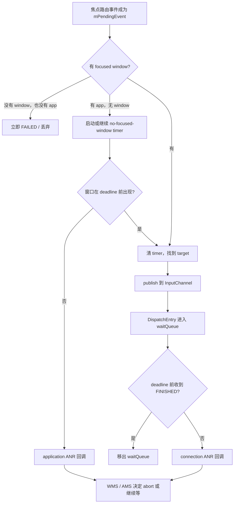
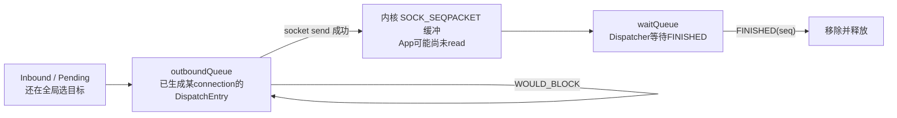
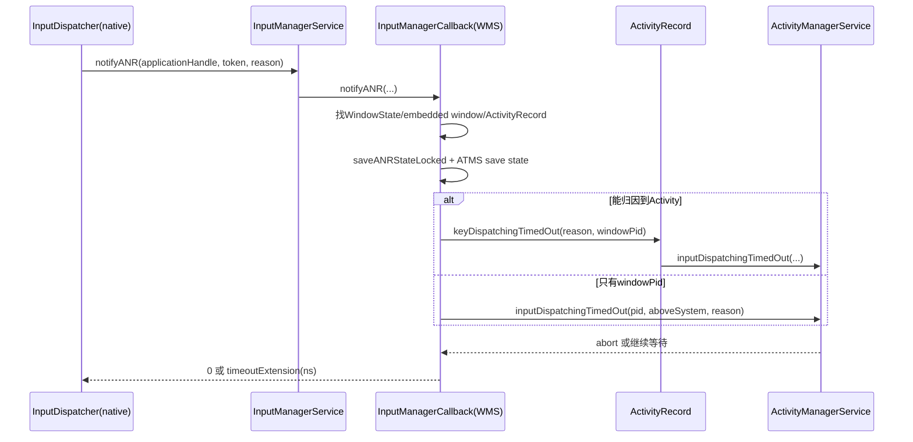
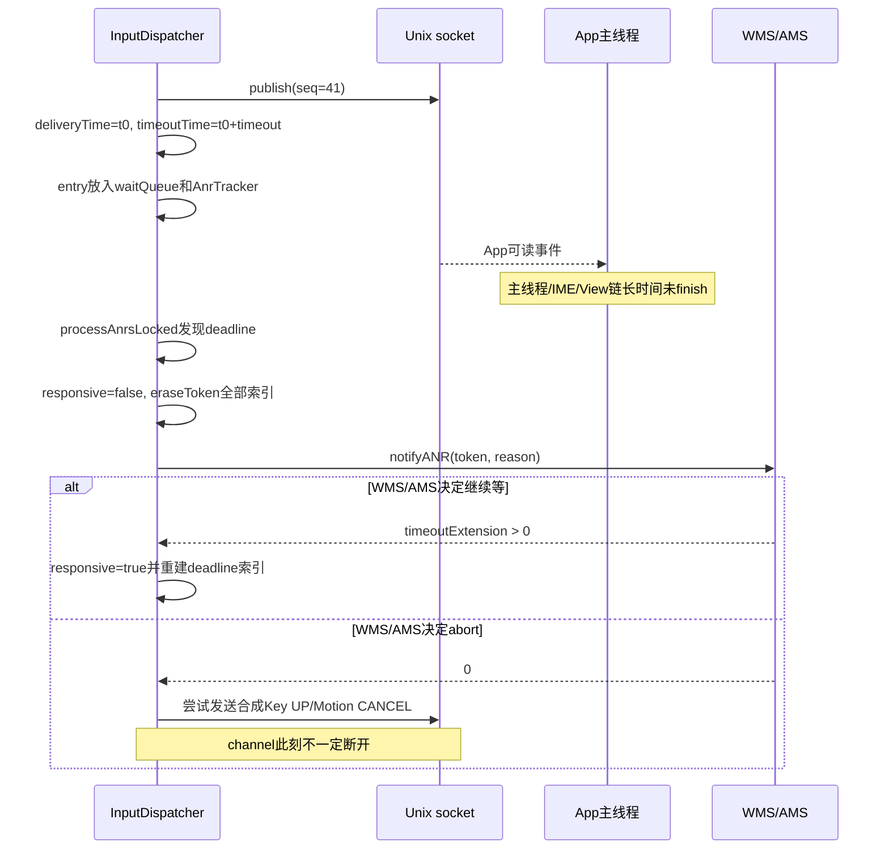

# 176 Android InputDispatcher ANR、焦点等待与事件取消恢复

> 源码版本：Android 11 / API 30 / `android-11.0.0_r48`  
> 学习方式：macOS 只读源码，不要求编译、不要求连接设备  
> 前置章节：第 18、20、113、173、174、175 章

---

## 1. 本章目标：不要把所有“输入 ANR”想成同一种超时

第 174 章看到事件 publish 到 App 后进入 `waitQueue`，第 175 章又看到 App 最终发送 `FINISHED`。如果 App 太久不确认，InputDispatcher 会发现超时。

但 Android 11 还有另一种输入 ANR：

```text
系统已经知道“哪个应用应当获得焦点”
                ↓
这个应用却迟迟没有可接收焦点事件的窗口
                ↓
事件根本还没有 publish 到某个 App InputChannel
```

所以本章先建立两个模型：

| 类型 | 事件卡在哪里 | 计时对象 | 典型理由 |
|---|---|---|---|
| 无焦点窗口 ANR | `mPendingEvent`，尚未找到窗口目标 | `mNoFocusedWindowTimeoutTime` + awaited application | `... does not have a focused window` |
| connection ANR | 已 publish，留在某连接 `waitQueue` | 每个 `DispatchEntry.timeoutTime` + `AnrTracker` | `... is not responding. Waited ... for ...` |

这两个超时最后都会经过 WMS/AMS，但起点、现场、可恢复方式和取消动作并不相同。

---

## 2. 先记住最重要的结论

1. InputDispatcher 的默认派发超时是 5 秒，但窗口或应用可携带自己的 timeout。
2. “无焦点窗口”不是从 Activity 启动那一刻计时，而是第一次有焦点路由事件需要投递时才启动计时。
3. connection timeout 从事件成功 publish 时计算，不是从硬件产生事件时计算。
4. `AnrTracker` 是 deadline 索引，不保存事件本体；事件本体仍在 connection 的 `waitQueue`。
5. native 发现超时后不会直接杀进程，而是回调策略层，让 WMS/AMS决定终止还是继续等待。
6. 策略要求继续等待时，native 会重设 deadline；要求中止时，connection 路径会合成取消事件。
7. “取消事件”不等于“立刻断开 InputChannel”，窗口/进程退出后才会走通道移除和连接清理。
8. 被标记 `responsive=false` 的窗口不会接收一条**新触摸手势**，但焦点事件仍可能继续积压。

---

## 3. 本章要回答的十八个问题

1. 5 秒常量究竟在哪里使用？
2. 为什么有 focused application 却没有 focused window？
3. 没有 application、也没有 window 时为何不等 5 秒？
4. 无焦点窗口的 pending event 是否已经进入 App？
5. 焦点应用变化怎样撤销旧计时？
6. 新窗口出现怎样恢复当前事件？
7. 触摸另一个 App 为什么能剪枝旧输入队列？
8. `outboundQueue`、socket 和 `waitQueue` 分别代表什么？
9. `timeoutTime` 在什么时刻写入？
10. 为什么 `AnrTracker` 使用 deadline + token 的 multiset？
11. 为什么报告理由选择 waitQueue 最老事件？
12. WMS 怎样从 InputChannel token 找到窗口和进程？
13. AMS 返回什么值表示“继续等待”？
14. 调试中的进程为何可能被延长？
15. ANR 后合成的 Key UP、Motion CANCEL 从哪里来？
16. 为什么合成 CANCEL 仍可能送不进已经卡住的 App？
17. App 晚到的 FINISHED 怎样使 connection 恢复 responsive？
18. `dumpsys input` 中应该怎样判断卡在哪一层？

---

## 4. 源码地图

建议按下面顺序阅读：

```text
frameworks/native/services/inputflinger/dispatcher/
├── InputDispatcher.cpp
├── InputDispatcher.h
├── AnrTracker.cpp
├── AnrTracker.h
├── InputState.cpp
├── InputState.h
└── CancelationOptions.h

frameworks/base/services/core/java/com/android/server/
├── input/InputManagerService.java
├── wm/InputManagerCallback.java
├── wm/ActivityRecord.java
└── am/ActivityManagerService.java
```

四个核心阅读入口：

- 目标尚未确定：`findFocusedWindowTargetsLocked()`；
- 周期检查：`processAnrsLocked()`；
- 回调策略：`doNotifyAnrLockedInterruptible()`；
- 已投递事件完成：`doDispatchCycleFinishedLockedInterruptible()`。

---

## 5. 两条 ANR 路径总图



这张图最关键的分界是 `publish`：上半条 ANR 尚无具体 connection；下半条已经能指向一个 InputChannel token。

---

## 6. 时间基准：这里使用单调时钟

`InputDispatcher::now()` 最终使用适合计算持续时间的单调时间，不依赖用户修改墙上时钟。以下时间均属于同一类持续时间模型：

- `deliveryTime`；
- `timeoutTime`；
- `mNoFocusedWindowTimeoutTime`；
- `eventDuration`；
- Looper 下一次唤醒时间。

因此把系统日期从 2026 年改到 2027 年，不应让输入 ANR 立刻触发。日志中的 ANR snapshot 另用 `time(nullptr)` 生成可读日期，那只是展示时间，不参与 deadline 比较。

---

## 7. 默认 5 秒不是所有输入等待的唯一时间

Android 11 r48 定义：

```cpp
constexpr std::chrono::nanoseconds
        DEFAULT_INPUT_DISPATCHING_TIMEOUT = 5s;
constexpr nsecs_t
        SLOW_EVENT_PROCESSING_WARNING_TIMEOUT = 2000 * 1000000LL;
constexpr std::chrono::nanoseconds
        KEY_WAITING_FOR_EVENTS_TIMEOUT = 500ms;
```

三者不要混淆：

| 时间 | 用途 | 到点结果 |
|---|---|---|
| 默认 5 秒 | 窗口/应用未提供其他派发 timeout 时的兜底 | 可能进入 ANR 策略 |
| 2 秒 | 单笔事件完成后的 slow processing 日志 | 只记录慢，不等于 ANR |
| 500ms | Key 等待更早 Motion 完成以避免错投焦点 | 超时后仍把 Key 发给当前焦点窗口 |

窗口 timeout 可覆盖默认值，所以“输入 ANR 永远恰好 5 秒”并不准确。

---

## 8. focused application 与 focused window 不是一个对象

回顾第 173 章：

- focused application 表示 WMS 认为哪个 Activity/application 正在成为交互主体；
- focused window 表示当前真正能接收焦点路由输入的窗口；
- 两者都按 display 保存；
- focused display 又决定 displayId 未明确的事件去哪个显示屏。

应用启动或窗口切换期间，可以短暂出现：

```text
focusedApplication = 新 Activity
focusedWindow      = null
```

这不一定是错误。应用可能正在创建窗口、relayout 或等待窗口快照同步。InputDispatcher 因而给它一个等待窗口，而不是立即丢掉第一笔 Key。

---

## 9. 没有窗口也没有应用：立即失败

`findFocusedWindowTargetsLocked()` 先取目标 display 的两份状态：

```cpp
sp<InputWindowHandle> focusedWindowHandle =
        getValueByKey(mFocusedWindowHandlesByDisplay, displayId);
sp<InputApplicationHandle> focusedApplicationHandle =
        getValueByKey(mFocusedApplicationHandlesByDisplay, displayId);

if (focusedWindowHandle == nullptr &&
        focusedApplicationHandle == nullptr) {
    return INPUT_EVENT_INJECTION_FAILED;
}
```

此时系统连“应该等谁”都不知道，所以不能建立 application ANR 归因，也不会凭空等待默认 5 秒。

这和“已有 focused application、只差窗口”是两种状态。

---

## 10. 无焦点窗口计时何时开始

核心代码是：

```cpp
if (focusedWindowHandle == nullptr &&
        focusedApplicationHandle != nullptr) {
    if (!mNoFocusedWindowTimeoutTime.has_value()) {
        const nsecs_t timeout =
                focusedApplicationHandle->getDispatchingTimeout(
                        DEFAULT_INPUT_DISPATCHING_TIMEOUT.count());
        mNoFocusedWindowTimeoutTime = currentTime + timeout;
        mAwaitedFocusedApplication = focusedApplicationHandle;
        *nextWakeupTime = *mNoFocusedWindowTimeoutTime;
        return INPUT_EVENT_INJECTION_PENDING;
    }
    // 仍在等待或已经超时……
}
```

注意计时不是由 `setFocusedApplication()` 主动启动。只有某个需要按焦点选目标的事件来到这里，Dispatcher 才“发现”缺窗口并开始计时。

所以更准确的说法是：

> 有 focused application 且出现了待派发的焦点事件，但始终没有 focused window。

---

## 11. 哪些事件进入这条焦点路由

`findFocusedWindowTargetsLocked()` 主要服务于按焦点选择目标的事件，例如 Key 和非 pointer Motion。普通触摸 DOWN 通常走 `findTouchedWindowTargetsLocked()`，按坐标命中窗口，而不是要求目标必须是 focused window。

因此“没有焦点窗口一定导致所有触摸都停住”是错误概括。触摸可能命中另一个可触摸窗口，甚至帮助用户离开正在启动但无窗口的应用。

---

## 12. 等待期间事件留在哪里

函数返回 `INPUT_EVENT_INJECTION_PENDING` 后，当前事件仍是 `mPendingEvent`，下一轮 dispatch loop 会再次尝试。

它尚未：

- 生成针对某个窗口的 `DispatchEntry`；
- 写入某个 InputChannel socket；
- 进入任何 connection 的 `waitQueue`；
- 到达 App 的 `NativeInputEventReceiver`。

这解释了为什么无焦点窗口 ANR 的回调携带 `InputApplicationHandle`，而没有 InputChannel token。

---

## 13. 窗口及时出现后的恢复

当下一轮目标选择发现有效 focused window 时：

```cpp
// we have a valid, non-null focused window
resetNoFocusedWindowTimeoutLocked();
```

该函数同时清掉：

```cpp
mNoFocusedWindowTimeoutTime = std::nullopt;
mAwaitedFocusedApplication.clear();
```

随后继续做注入权限、paused、Key 排序等待等检查，最终把当前 pending event 指向新窗口。

不是另造一笔事件，也不是等待的事件已经丢失后重放；通常就是同一个 pending event 再次选目标成功。

---

## 14. 焦点应用换人也会撤销旧计时

`setFocusedApplication()` 中有一条代际检查：

```cpp
if (oldFocusedApplicationHandle == mAwaitedFocusedApplication &&
        inputApplicationHandle != oldFocusedApplicationHandle) {
    resetNoFocusedWindowTimeoutLocked();
}
```

含义是：正在等待 A 创建窗口时，WMS 已把 focused application 改成 B，就不能继续拿 A 的 deadline 和名字归因。

下一轮若 B 也没有窗口，会在新的焦点事件选择中重新建立计时。

---

## 15. 超时时，先生成 native 现场

`processAnrsLocked()` 每轮 dispatch 后检查：

```cpp
if (mNoFocusedWindowTimeoutTime.has_value() &&
        mAwaitedFocusedApplication != nullptr) {
    if (currentTime >= *mNoFocusedWindowTimeoutTime) {
        onAnrLocked(mAwaitedFocusedApplication);
        mAwaitedFocusedApplication.clear();
        return LONG_LONG_MIN;
    }
}
```

`onAnrLocked(application)` 生成理由：

```text
<application name> does not have a focused window
```

并调用 `updateLastAnrStateLocked()`，把当时 Dispatcher 状态保存到 `mLastAnrState`，供后续 dump 查看。

这里先清 `mAwaitedFocusedApplication`，避免 dispatch loop 在策略回调完成前反复报告同一超时。

---

## 16. 为什么新触摸可剪掉旧队列

等待某 App 的焦点窗口时，如果用户按下另一个 App 的窗口，`shouldPruneInboundQueueLocked()` 可以返回 true：

```cpp
if (isPointerDownEvent && mAwaitedFocusedApplication != nullptr) {
    sp<InputWindowHandle> touched =
            findTouchedWindowAtLocked(displayId, x, y, nullptr);
    if (touched != nullptr &&
        touched->getApplicationToken() !=
                mAwaitedFocusedApplication->getApplicationToken()) {
        return true;
    }
}
```

新 DOWN 被记为 `mNextUnblockedEvent`。在它之前被旧等待阻塞的 Key/Motion 会以 `DropReason::BLOCKED` 丢弃，直到走到这笔新事件，标记被清除。

目的不是优化吞吐量，而是避免一个没有窗口的 App 把用户切换到其他 App 的输入也堵在后面。

---

## 17. gesture monitor 也能成为剪枝理由

即便坐标下没有另一个应用窗口，只要存在一个仍 responsive 的 gesture monitor，代码也允许剪枝：

```text
旧 focused application 没窗口
        +
新 pointer DOWN 到来
        +
至少一个 gesture monitor 仍能接收
        ↓
允许清掉新 DOWN 之前的阻塞事件
```

这保证系统级手势监控者仍有机会观察新手势。它不是说 monitor 自动成为普通目标，而是说它提供了“不应被旧队列永久拖住”的理由。

---

## 18. 第二条路径从成功 publish 开始

对于已经选定 connection 的事件，`startDispatchCycleLocked()` 先设置：

```cpp
dispatchEntry->deliveryTime = currentTime;
const nsecs_t timeout = getDispatchingTimeoutLocked(
        connection->inputChannel->getConnectionToken());
dispatchEntry->timeoutTime = currentTime + timeout;
```

只有 `publishKeyEvent()` / `publishMotionEvent()` / `publishFocusEvent()` 成功后，它才从 outbound 移入 wait：

```cpp
connection->waitQueue.push_back(dispatchEntry);
if (connection->responsive) {
    mAnrTracker.insert(dispatchEntry->timeoutTime,
                       connectionToken);
}
```

因此 connection ANR 计量的是“成功交给内核 socket 后，等待 App FINISHED 多久”。硬件采样到 publish 之前的排队时间不包含在这一笔 `timeoutTime` 中。

---

## 19. 三个队列和 socket 的准确关系



`waitQueue` 与 socket 缓冲不是先后互斥状态。send 成功后，App 可能还没有 read，但 Dispatcher 已经把同一 DispatchEntry 放进 waitQueue。

所以 dump 中 waitQueue 很长可能是：

- App 主线程没读；
- App 已读但 InputStage/IME/View 没 finish；
- App 已调用 finish，但反向 FINISHED packet 尚未被 Dispatcher 处理。

只看 waitQueue 无法区分这三段，需要结合 App 主线程堆栈、trace 和 socket/Looper 现场。

---

## 20. AnrTracker 只是“最早闹钟索引”

`AnrTracker` 内部是：

```cpp
std::multiset<std::pair<nsecs_t, sp<IBinder>>> mAnrTimeouts;
```

每一项只有：

- timeout deadline；
- connection token。

`multiset` 允许同一 connection 多笔事件、甚至相同 deadline。最前面的 pair 就是全系统下一次该检查的 connection deadline。

事件描述、delivery time、target flags 等仍在 `connection->waitQueue` 的 `DispatchEntry` 中。

---

## 21. processAnrsLocked 怎样安排 Looper 唤醒

每轮 `dispatchOnce()` 在处理 pending command 后调用：

```cpp
const nsecs_t nextAnrCheck = processAnrsLocked();
nextWakeupTime = std::min(nextWakeupTime, nextAnrCheck);
```

然后把绝对时间换算成 `pollOnce()` 的毫秒超时。

它先检查 no-focused-window deadline，再取 `mAnrTracker.firstTimeout()`。所以同一轮中前者已经到期时，会先发 application ANR，并立即再跑一轮；connection deadline 随后仍会被检查，并非永久遗漏。

---

## 22. connection 到期后为何删掉该 token 的所有 tracker 项

核心代码：

```cpp
connection->responsive = false;
mAnrTracker.eraseToken(connection->inputChannel->getConnectionToken());
onAnrLocked(connection);
```

一旦确认 connection 不响应，继续让它的第二、第三笔 deadline 每到一次就报同一个 ANR 没有价值。因此索引中删掉这个 token 的全部项。

注意：

- `waitQueue` 本体没有因此全部清空；
- 连接也没有因此改成 BROKEN；
- 它只是暂时不再参与下一次 ANR 闹钟索引。

---

## 23. 为什么理由使用 waitQueue 最老事件

`onAnrLocked(connection)` 从 waitQueue 取最先发送的 entry：

```cpp
DispatchEntry* oldestEntry = *connection->waitQueue.begin();
const nsecs_t currentWait = now() - oldestEntry->deliveryTime;
```

源码注释承认：触发最早 deadline 的不一定是 oldest entry。例如窗口 timeout 在两笔事件之间变化，新事件可能拥有更早 deadline。

但应用通常顺序处理输入，最老未完成事件更能解释“队头为什么堵住”，所以 reason 仍展示 oldest entry。

诊断时要区分：

```text
触发 tracker.firstTimeout 的 entry
        不保证等于
reason 中描述的 oldest waitQueue entry
```

---

## 24. waitQueue 已恢复时可取消一次过时 ANR

ANR 检查与策略 command 之间会释放锁并穿插完成回执。`onAnrLocked(connection)` 因而先检查：

```cpp
if (connection->waitQueue.empty()) {
    ALOGI("Not raising ANR because ... has recovered");
    return;
}
```

这是典型的“到期事实”和“执行处置”之间重新验证。不能因为 tracker 曾发现 timeout，就断言最终一定弹 ANR。

---

## 25. native 不在锁内直接进入 WMS

`onAnrLocked()` 只往 command queue 放 `doNotifyAnrLockedInterruptible`。真正回调时：

```cpp
mLock.unlock();
const nsecs_t timeoutExtension =
        mPolicy->notifyAnr(application, token, reason);
mLock.lock();
```

这是重要锁边界。WMS/AMS 可能取复杂锁、收集现场甚至触发异步 ANR 工作，不能持着 Dispatcher 全局锁调用。

“Interruptible” 在这里不是 Java 线程中断，而是表示回调期间主动释放 native 锁，回来后必须重新面对状态已变化的可能性。

---

## 26. Java 回调链



JNI/native policy 桥接细节不改变这里的语义：返回正数是再等多久，返回 0 是停止本次派发等待。

---

## 27. WMS 怎样找到责任窗口

`InputManagerCallback.notifyANRInner()` 首先用 InputChannel token 查询：

```java
windowState = mService.mInputToWindowMap.get(token);
```

找到后可取得：

- `WindowState.mActivityRecord`；
- 窗口所属 session PID；
- 窗口是否位于 system alert layer 之上。

若不是普通 WindowState，还会查询 `EmbeddedWindowController`，用 embedded window 的 owner PID 和 host window 推断层级。

若 token 为空而有 `InputApplicationHandle`，则从 application token 找 `ActivityRecord`。这正对应无焦点窗口 ANR。

---

## 28. 为什么先保存 WMS/ATMS 现场再通知 AMS

WMS 在全局锁内完成窗口归因和：

```java
mService.saveANRStateLocked(activity, windowState, reason);
```

释放 WMS 锁后再调用：

```java
mService.mAtmInternal.saveANRState(reason);
```

以及 AMS timeout 入口。

这既保留窗口层现场，又避免持 WMS 锁跨入 AMS。源码中仍有 TODO，说明 r48 这段 WMS 锁范围偏大；`preDumpIfLockTooSlow()` 也用来应对取得锁过慢时的预先 dump。

---

## 29. AMS 的 abort / wait 语义

对于 Activity 路径：

```java
final boolean abort = activity.keyDispatchingTimedOut(reason, windowPid);
if (!abort) {
    return activity.mInputDispatchingTimeoutNanos;
}
return 0;
```

对于只有 PID 的窗口：

```java
long timeout = mAmInternal.inputDispatchingTimedOut(...);
if (timeout >= 0) {
    return timeout * 1000000L;
}
return 0;
```

这里 Java 内部一个接口用 boolean，另一个用毫秒或负值；`InputManagerCallback` 最终统一成 native 所需的纳秒 extension 或 0。

---

## 30. 调试进程为何可能继续等待

AMS 的 `inputDispatchingTimedOut()` 检查 `proc.isDebugging()`：

```java
if (proc.isDebugging()) {
    return false;
}
```

这里 `false` 表示不要 abort，于是上层返回一个新的 timeout。调试器暂停主线程时，系统避免立刻按普通 ANR 终止应用。

而有 active instrumentation 的进程会结束 instrumentation 并返回 abort。不要把“调试/测试环境都无限延长”概括在一起。

---

## 31. 策略要求延长：无焦点窗口路径

native 收到正 extension 后调用 `extendAnrTimeoutsLocked()`。若找不到 connection、但 application 不为空：

```cpp
if (mNoFocusedWindowTimeoutTime.has_value() && application != nullptr) {
    mNoFocusedWindowTimeoutTime = now() + timeoutExtension;
    mAwaitedFocusedApplication = application;
}
```

所以无焦点窗口计时重新从 policy 回调返回后的 `now()` 起算，awaited application 也恢复。

如果窗口恰好已出现，后续目标选择会清掉这份计时。

---

## 32. 策略要求延长：connection 路径

若 token 仍能找到 connection：

```cpp
connection->responsive = true;
const nsecs_t newTimeout = now() + timeoutExtension;
for (DispatchEntry* entry : connection->waitQueue) {
    if (newTimeout >= entry->timeoutTime) {
        entry->timeoutTime = newTimeout;
        mAnrTracker.insert(newTimeout, connectionToken);
    }
}
```

先前 `eraseToken()` 已清掉旧 tracker 项，所以这里重新插入仍需等待的 entry。

条件是 `newTimeout >= entry->timeoutTime`。若某 entry 原 deadline 反而更晚，就保留其原值；但因为旧索引已被删除，这段代码没有为该“原 deadline 更晚”的 entry 重新 insert。通常 policy extension 足够长，不会碰到这个角落；阅读 r48 时仍应看到这个条件边界，而不要宣称所有 wait entry 必然被重新追踪。

---

## 33. 策略要求 abort：connection 合成取消事件

当 extension 不大于 0：

```cpp
sp<Connection> connection = getConnectionLocked(token);
if (connection == nullptr) {
    return;
}
cancelEventsForAnrLocked(connection);
```

无焦点窗口路径没有 token，也没有 connection，所以这里不会凭空合成 CANCEL。

connection 路径则构造：

```cpp
CancelationOptions options(
        CancelationOptions::CANCEL_ALL_EVENTS,
        "application not responding");
```

然后让该 connection 的 `InputState` 按自己已知的未释放输入状态生成对应终止事件。

---

## 34. InputState 为什么能“补”出取消事件

每个 connection 都用 `InputState` 记录已经发布给客户端的状态：

- 哪些 Key DOWN 尚未看到 UP；
- 哪组 pointer gesture 尚未结束；
- hover 是否已 enter；
- fallback key 对应关系。

这不是重放完整历史，而是保存足以让客户端状态归零的 memento。

例如：

```text
App 已收到 KEY_DOWN(A)，未收到 KEY_UP
        → 合成 KEY_UP(A) + FLAG_CANCELED

App 已收到 ACTION_DOWN/MOVE，手势未结束
        → 合成 ACTION_CANCEL

App 正在 hover
        → 合成 ACTION_HOVER_EXIT
```

---

## 35. 四种 CancelationOptions

| Mode | Key | pointer Motion | 非 pointer Motion | 典型用途 |
|---|---:|---:|---:|---|
| `CANCEL_ALL_EVENTS` | 取消 | 取消 | 取消 | ANR、device reset、整体 reset |
| `CANCEL_POINTER_EVENTS` | 不取消 | 取消 | 不取消 | 窗口移除、触摸焦点转移 |
| `CANCEL_NON_POINTER_EVENTS` | 取消 | 不取消 | 取消 | 焦点离开、某类事件被 drop |
| `CANCEL_FALLBACK_EVENTS` | 仅 fallback Key | 不取消 | 不取消 | fallback 清理 |

“non-pointer”不等于“只有按键”，它还包含来源不属于 pointer class 的 Motion。

---

## 36. 合成 CANCEL 不是本地直接清状态

`synthesizeCancelationEventsForConnectionLocked()` 会把合成事件再做成该 connection 的 DispatchEntry：

```cpp
enqueueDispatchEntryLocked(connection, cancelationEventEntry,
                           target,
                           InputTarget::FLAG_DISPATCH_AS_IS);
startDispatchCycleLocked(currentTime, connection);
```

因此它尝试通过同一个 InputChannel 告诉客户端“先前状态作废”。它不是只在服务端把 memento 擦掉。

这也带来现实边界：如果 App 主线程彻底卡住或 socket 持续满，合成的 CANCEL 可能继续排在 outbound，不能保证客户端立即执行它。

---

## 37. ANR 后为什么不立即断开 channel

源码注释明确说：

```text
这里不会主动 break connection。
如果策略决定关闭 App，之后 unregisterInputChannel
会负责真正清理 connection。
```

于是 ANR 之后可能看到：

- connection 状态仍是 `STATUS_NORMAL`；
- `responsive=false`；
- 原 waitQueue 仍存在；
- 合成的 cancel 进入 outbound/wait；
- 之后才因窗口删除、进程死亡或 channel error 进入清理。

这就是“响应性”和“通道存活状态”必须分开的原因。

---

## 38. 不响应窗口不会接收新的触摸手势

一条新 pointer gesture 开始选窗时：

```cpp
if (connection == nullptr) {
    newTouchedWindowHandle = nullptr;
} else if (!connection->responsive) {
    newTouchedWindowHandle = nullptr;
}
```

gesture monitor 也经过 `selectResponsiveMonitorsLocked()` 过滤。

若不响应窗口和 monitor 都被排除，当前 DOWN 会因没有 touchable target 而失败。

关键限定是“新手势”。已经建立 `TouchState` 的旧 gesture 有自己的持续路由和取消收尾，不应把这里解释成 `responsive=false` 后所有既有 pointer entry 都瞬间从所有队列消失。

---

## 39. 焦点事件仍可能继续积压

`cancelEventsForAnrLocked()` 的注释说得很直白：

```text
We are already not sending new pointers to the connection when it blocked,
but focused events will continue to pile up.
```

所以 responsive 标志主要参与新触摸目标和 monitor 过滤，并不是对所有派发入口统一短路。

这也是 abort 后合成 CANCEL、等待窗口/进程处置仍然必要的原因。

---

## 40. 晚到 FINISHED 怎样恢复 responsive

App 后来发送 `FINISHED(seq)`，Dispatcher 在 waitQueue 找到 entry 后：

```cpp
connection->waitQueue.erase(dispatchEntryIt);
mAnrTracker.erase(dispatchEntry->timeoutTime, connectionToken);
if (!connection->responsive) {
    connection->responsive = isConnectionResponsive(*connection);
}
```

`isConnectionResponsive()` 会扫描剩余 waitQueue；只要仍有 entry 的 timeout 已过，就保持 false。所有剩余 entry 都未过期，才恢复 true。

因此“一笔迟到 ACK 就立刻恢复”并不总成立，要看队列里是否还有过期 entry。

---

## 41. 2 秒 slow log 与 5 秒 ANR 再对照

处理 FINISHED 时会计算：

```cpp
eventDuration = finishTime - dispatchEntry->deliveryTime;
if (eventDuration > 2s) {
    ALOGI("... spent ... processing ...");
}
```

典型时间线：

```text
t0 publish
t0+2.2s FINISHED
    → 写 slow log
    → 不触发 5s ANR

t0 publish
t0+5s 还未 FINISHED
    → connection timeout
    → 回调 WMS/AMS
```

如果窗口自定义 timeout 小于 2 秒，理论上 ANR 可早于 slow log，因为 slow log 只在最终 finish 后判断。

---

## 42. drop 为什么也需要合成取消

输入因为 policy、dispatch disabled、app switch、blocked 或 stale 被丢弃时，若前序 DOWN 已经送到客户端，直接丢掉 UP/MOVE 会让 View 永远以为按键或手势仍在进行。

所以 `dropInboundEventLocked()` 按类型选择：

- Key → `CANCEL_NON_POINTER_EVENTS`；
- pointer Motion → `CANCEL_POINTER_EVENTS`；
- 非 pointer Motion → `CANCEL_NON_POINTER_EVENTS`。

这和 ANR 的 `CANCEL_ALL_EVENTS` 目标不同：drop 是修复某类流的一致性，ANR 是把该 connection 已跟踪的全部输入状态归零。

---

## 43. 全局 reset 又是什么

`resetAndDropEverythingLocked(reason)` 用于更彻底的状态切换：

1. 为所有 connection 合成 `CANCEL_ALL_EVENTS`；
2. 重置 key repeat；
3. 释放 pending event；
4. 清空 inbound queue；
5. 清无焦点窗口 timer；
6. 清 `AnrTracker`；
7. 清每 display 的 touch state、hover 和 replaced keys。

它比“某一个 connection ANR”影响范围大得多。不要看到 CANCEL_ALL 就认为两者等价。

---

## 44. 焦点变化也会合成取消，但类型不同

窗口失去焦点时，Dispatcher 给旧 focused input channel 合成：

```cpp
CANCEL_NON_POINTER_EVENTS, "focus left window"
```

focused display 改变时，也只取消旧 focused window 上 display 未指定的 non-pointer events。

触摸焦点由 `TouchState` 维护，不会仅因键盘焦点切换就无条件 CANCEL pointer gesture。这正体现 Android 把 pointer 路由和 focus 路由分开。

---

## 45. 一条 connection ANR 的完整时间线



---

## 46. dumpsys input 怎样读

`dumpDispatchStateLocked()` 会输出：

- `DispatchEnabled` / `DispatchFrozen`；
- `FocusedApplications` 与 `FocusedWindows`；
- `PendingEvent` 及 age；
- `InboundQueue`；
- 每个 connection 的 status、responsive；
- `OutboundQueue`；
- `WaitQueue` 中每笔 event 的 age 与 wait；
- 最近一次 ANR 时保存的 Input Dispatcher snapshot。

可用下面的判断顺序：

| 现场 | 优先解释 |
|---|---|
| 有 focused app、无 focused window、PendingEvent 很老 | 无焦点窗口路径 |
| connection responsive=false、WaitQueue 很老 | 已 publish 未 finish |
| OutboundQueue 增长且 WaitQueue 非空 | socket/backpressure，App 没及时消费 |
| WaitQueue 增长但 App 已在 View 逻辑 | App InputStage/View/主线程慢 |
| status=BROKEN/ZOMBIE | 通道死亡/注销，已不是单纯 responsive 问题 |

静态 dump 不是原子跨进程快照，必须结合 WMS/AMS ANR 日志和 App traces。

---

## 47. 常见误解逐条纠正

### 误解一：输入 ANR 就是 App 收到触摸后 5 秒没处理

不完整。无 focused window 路径中事件尚未送到任何 App connection。

### 误解二：Activity 一进入启动状态就开始 5 秒计时

错误。r48 只在有焦点路由事件需要派发、且发现 focused app 无 focused window 时启动。

### 误解三：ANR 到点 InputDispatcher 直接杀进程

错误。native 保存现场并回调 WMS/AMS，处置决定在 policy/AMS 层。

### 误解四：responsive=false 等于 InputChannel broken

错误。responsive 是等待健康度；NORMAL/BROKEN/ZOMBIE 是连接生命周期状态。

### 误解五：abort 后 waitQueue 立即清空

错误。r48 先尝试给同一 connection 合成取消事件，真正连接清理通常来自后续 unregister/channel broken。

### 误解六：一收到迟到 FINISHED 就恢复

不一定。剩余 waitQueue 中若还有超期 entry，connection 仍不 responsive。

---

## 48. macOS 只读练习

不编译也可以完成以下练习。

### 练习一：定位两个 timeout 起点

```bash
cd /Users/ninebot/androidSource
rg -n "mNoFocusedWindowTimeoutTime|deliveryTime =|timeoutTime =" \
  frameworks/native/services/inputflinger/dispatcher/InputDispatcher.cpp
```

回答：为什么前者在目标选择阶段，后两者在 publish cycle？

### 练习二：证明 tracker 不是事件队列

```bash
sed -n '1,110p' \
  frameworks/native/services/inputflinger/dispatcher/AnrTracker.h
sed -n '20,80p' \
  frameworks/native/services/inputflinger/dispatcher/AnrTracker.cpp
```

列出 tracker 保存的两个字段，再找事件描述实际位于哪里。

### 练习三：追 Java 策略返回值

```bash
sed -n '175,280p' \
  frameworks/base/services/core/java/com/android/server/wm/InputManagerCallback.java
rg -n "inputDispatchingTimedOut" \
  frameworks/base/services/core/java/com/android/server/am/ActivityManagerService.java
```

说明 boolean abort、毫秒 timeout 和 native 纳秒 extension 如何转换。

### 练习四：手算状态

假设同一 connection：

```text
E1 delivery=0s timeout=5s
E2 delivery=1s timeout=6s
当前时间=5.2s
```

回答：

1. tracker 首项是谁？
2. connection 何时变 false？
3. reason 通常描述谁？
4. 此时收到 E1 FINISHED，但 E2 未过期，responsive 能否恢复？

答案：E1；5 秒检查时；E1；能，因为剩余 E2 的 deadline 6 秒尚未到。

---

## 49. 复读审计：最容易不理解的五个边界

### 边界一：无焦点 timer 是 r48 的单份 Dispatcher 状态

focused app/window 映射按 display 保存，但 `mNoFocusedWindowTimeoutTime` 与 `mAwaitedFocusedApplication` 在该版本是单份成员，不是 per-display map。多显示场景不能想当然地为每块屏独立维护多只 no-focus timer。

### 边界二：超时比较存在 `>=` 与 `>` 差异

`processAnrsLocked()` 用 `currentTime >= deadline` 报告；目标选择中“已经报告后丢事件”用 `currentTime > deadline`。正常 loop 会先运行 ANR 检查，但读单个函数时不要忽略边界值差异。

### 边界三：policy 回调期间状态可变化

native 主动释放 `mLock`。回来时 connection 可能已经消失，代码因此重新 `getConnectionLocked(token)`；找不到就直接返回。

### 边界四：合成取消只是尽力发送

它能修复协议状态，却不能强迫卡死主线程运行。App 被杀或窗口移除时，通道清理可能先于客户端真正消费 CANCEL。

### 边界五：slow、ANR、AMS trace 不是同一个时间点

2 秒 slow 在 FINISHED 到达后记录；native ANR snapshot 在 InputDispatcher 判断超时时记录；AMS 的 Java/native traces 又在后续 ANR 工作中采集。分析时不能假设三份现场完全同时。

---

## 50. 本章检查题与最终模型

### 检查题

1. 两类输入 ANR 的 publish 分界是什么？
2. 为什么 no-focus timeout 不能只看 Activity 启动时长？
3. `AnrTracker.eraseToken()` 为什么不等于清空 waitQueue？
4. `responsive=false` 会阻止哪一种新输入选择？
5. WMS 如何在 application 路径和 connection 路径之间归因？
6. extension 为正和为 0 各让 native 做什么？
7. 为什么 CANCEL_ALL 仍不保证 App 立刻收到 CANCEL？
8. 晚到 ACK 后用什么条件恢复 responsive？

### 一句话模型

```text
焦点路由事件先可能因“有应用、无窗口”停在pending并按应用计时；
找到窗口并成功publish后，才转为按connection的waitQueue逐笔计时；
到期时InputDispatcher保存现场、把决定交给WMS/AMS，
策略可以延长deadline，也可以让native基于InputState合成取消，
而连接是否存活、客户端是否真正消费CANCEL、进程是否被处置仍是后续步骤。
```

### 下一章

第 177 章继续阅读 InputDispatcher 的输入注入、权限校验、同步等待与结果语义，把 shell/test 注入事件怎样安全进入同一派发链讲清楚。

