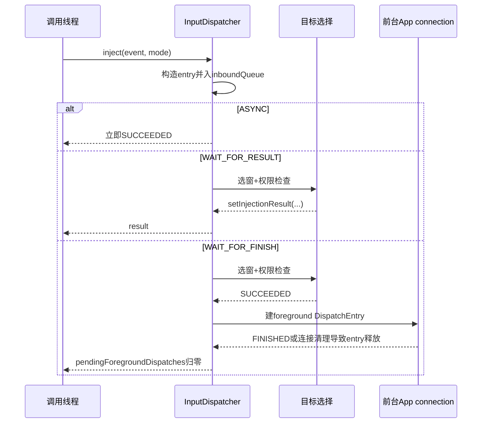
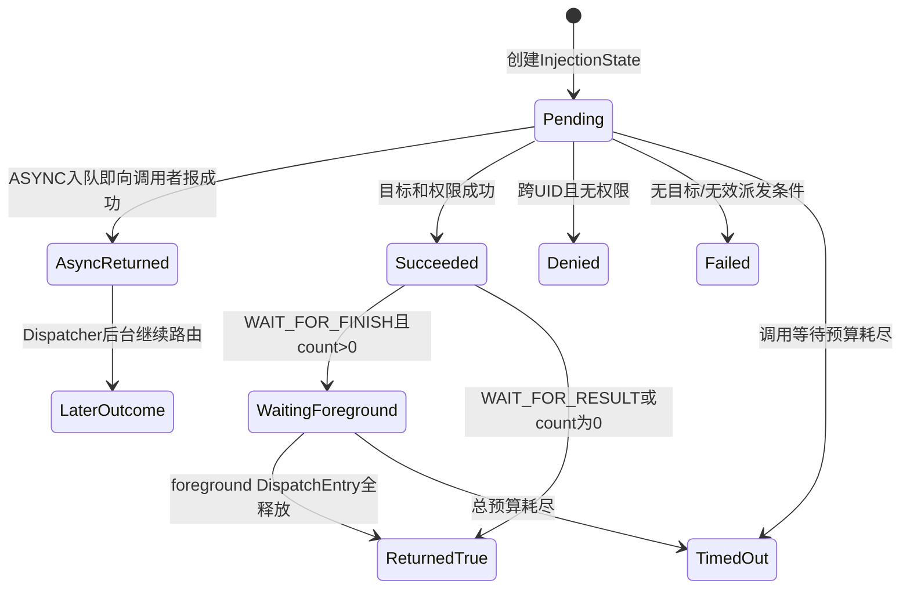
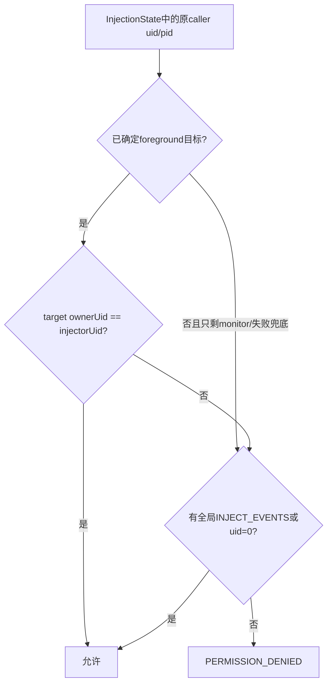

# 177 Android InputDispatcher 输入注入、权限与同步等待

> 源码版本：Android 11 / API 30 / `android-11.0.0_r48`  
> 学习方式：macOS 只读源码，不要求编译、不要求连接设备  
> 前置章节：第 20、51、174、175、176 章

---

## 1. 本章目标：inject 返回 true 到底证明了什么

测试工具、无障碍自动化、`adb shell input` 和部分系统组件都可能构造 KeyEvent 或 MotionEvent，再交给输入系统注入。

最常见的误解是：

```text
injectInputEvent(...) == true
        ↓
目标 View 已收到并消费事件
```

Android 11 中这个推论不成立。返回时机取决于同步模式：

| 模式 | 返回成功主要证明什么 |
|---|---|
| ASYNC | 参数可构造成 entry，并已加入 Dispatcher 队列；后续结果不等待 |
| WAIT_FOR_RESULT | 目标选择与目标相关的注入权限已经得到结果 |
| WAIT_FOR_FINISH | 上一步成功，且该注入关联的前台 DispatchEntry 已全部释放 |

即使是 WAIT_FOR_FINISH，也不要求 App 报告 `handled=true`。本章就围绕这些完成点展开。

---

## 2. 先记住八条结论

1. `InputManager.injectInputEvent()` 是隐藏 API，公开注释不能替代 native 真实语义。
2. `INJECT_EVENTS` 是 signature 权限，但无该权限的调用方仍可注入自己 UID 拥有的窗口。
3. IMS 先保存 Binder caller PID/UID，再 `clearCallingIdentity()`；权限判断仍使用原调用者身份。
4. 注入事件会带 `POLICY_FLAG_INJECTED`；拥有全局注入权限时还带 `POLICY_FLAG_TRUSTED`。
5. WAIT_FOR_RESULT 的成功条件在 dispatch target 已找到时确定，不以 socket publish 成功为条件。
6. WAIT_FOR_FINISH 只等待 foreground target，不等待 monitor，也不要求 `handled=true`。
7. 调用等待超时不会从 Dispatcher 队列撤销事件，所以“返回 false”与“事件以后绝不发生”不是一回事。
8. App 主线程根本不需要知道事件来自哪一个 Java 调用者；权限已经在 system_server 的目标选择阶段裁决。

---

## 3. 本章要回答的十八个问题

1. Java API 为什么先校验 mode？
2. Binder identity 为什么要先保存再清除？
3. signature 权限是否在 Binder 入口统一拒绝？
4. 同 UID 注入为什么可以不持有 `INJECT_EVENTS`？
5. root、shell 与普通 App 的权限来源有何不同？
6. Key/Motion 的 deviceId 是否原样保留？
7. 注入前为什么仍经过 policy intercept？
8. `POLICY_FLAG_FILTERED` 有什么特殊用途？
9. MotionEvent 的 history 怎样进入 Dispatcher？
10. `InjectionState` 为什么要引用计数？
11. ASYNC 为什么可能报告“假成功”？
12. WAIT_FOR_RESULT 在什么代码点被唤醒？
13. WAIT_FOR_FINISH 数的是什么？
14. monitor 为什么不计入 finish 等待？
15. App 返回 handled=false 是否导致注入失败？
16. 通道 broken 时等待会怎样结束？
17. 30 秒 timeout 与窗口 5 秒 ANR 是什么关系？
18. 调用超时后为什么事件仍可能晚到？

---

## 4. 源码地图

```text
frameworks/base/core/java/android/hardware/input/InputManager.java
frameworks/base/services/core/java/com/android/server/input/InputManagerService.java
frameworks/base/services/core/jni/com_android_server_input_InputManagerService.cpp

frameworks/native/services/inputflinger/dispatcher/
├── InputDispatcher.cpp
├── InputDispatcher.h
├── InjectionState.cpp
├── InjectionState.h
├── Entry.cpp
└── include/InputDispatcherInterface.h

frameworks/base/cmds/input/src/com/android/commands/input/Input.java
frameworks/base/packages/Shell/AndroidManifest.xml
frameworks/base/core/res/AndroidManifest.xml
```

阅读时把“调用线程在等待”与“Dispatcher 自己的 Looper 继续运行”分开。native 注入函数会在条件变量上释放 `mLock`，不会把 InputDispatcher 锁死。

---

## 5. 全链路总图

```mermaid
flowchart LR
    C["调用方<br/>shell/系统组件/测试"] --> IM["InputManager<br/>隐藏API"]
    IM --> B["IInputManager Binder"]
    B --> IMS["InputManagerService<br/>记录caller pid/uid"]
    IMS --> JNI["nativeInjectInputEvent"]
    JNI --> ID["InputDispatcher::injectInputEvent"]
    ID --> E["KeyEntry / MotionEntry<br/>+ InjectionState"]
    E --> IQ["inboundQueue"]
    IQ --> T["选目标 + 按目标检查权限"]
    T --> O["foreground/monitor DispatchEntry"]
    O --> CH["InputChannel"]
    CH --> APP["App InputStage / View"]
    APP --> FIN["FINISHED(seq, handled)"]
```



调用方等待的是这条链上的某个里程碑，不是所有模式都等到最右边。

---

## 6. Java 三种 mode

`InputManager` 定义：

```java
INJECT_INPUT_EVENT_MODE_ASYNC = 0;
INJECT_INPUT_EVENT_MODE_WAIT_FOR_RESULT = 1;
INJECT_INPUT_EVENT_MODE_WAIT_FOR_FINISH = 2;
```

Java 入口先拒绝 null event 和非法 mode，然后走 `IInputManager` Binder。

API 注释把 WAIT_FOR_RESULT 描述为：等 Dispatcher 能根据当前焦点判断是否允许注入，但不等 App 处理完；把 WAIT_FOR_FINISH 描述为等事件送达并处理。

后文会看到，“处理完”在 native 的可观测定义是前台 DispatchEntry 释放，而不是业务 View 必须消费。

---

## 7. IMS 为什么保存 caller 后清 Binder identity

服务端代码：

```java
final int pid = Binder.getCallingPid();
final int uid = Binder.getCallingUid();
final long ident = Binder.clearCallingIdentity();
try {
    result = nativeInjectInputEvent(mPtr, event, pid, uid, mode,
            INJECTION_TIMEOUT_MILLIS,
            WindowManagerPolicy.FLAG_DISABLE_KEY_REPEAT);
} finally {
    Binder.restoreCallingIdentity(ident);
}
```

两套身份各有用途：

- 保存的 pid/uid：传入 `InjectionState`，决定能注入哪个窗口；
- clear 后的 Binder identity：让 IMS 以 system_server 自身身份执行内部工作，避免后续系统调用意外继承远端调用者。

因此 `clearCallingIdentity()` 并没有把注入者伪装成 system UID，因为安全裁决使用的是清除前已保存的 pid/uid。

---

## 8. 30 秒是注入 API 等待预算

r48 IMS 固定：

```java
private static final int INJECTION_TIMEOUT_MILLIS = 30 * 1000;
```

这个时间是同步 `injectInputEvent()` 调用最多等待 injection result / foreground finish 的总预算，不是窗口派发 ANR 的默认 timeout。

第 176 章的窗口默认 5 秒可以在这 30 秒内先触发 WMS/AMS ANR；若 policy 选择继续等，注入调用仍可能继续等待，直到自己的总预算耗尽。

---

## 9. Java 如何映射 native 结果

native 结果有四种终态：

| native 值 | Java 行为 |
|---|---|
| `SUCCEEDED` | 返回 true |
| `PERMISSION_DENIED` | 抛 `SecurityException` |
| `TIMED_OUT` | 记录 warning，返回 false |
| `FAILED` | 记录 warning，返回 false |

内部还有 `PENDING=-1`，只用于 `InjectionState` 等待过程，不直接作为最终 Java 返回值。

ASYNC 模式很快返回 SUCCEEDED 后，后续即便真实目标检查失败，原 Java 调用也已经结束，不会穿越时间重新抛异常。

---

## 10. JNI 只接受 KeyEvent 与 MotionEvent

`nativeInjectInputEvent()` 做运行时类型检查：

- Java KeyEvent 转成 native `KeyEvent`；
- Java MotionEvent 取 native pointer；
- 其他 InputEvent 子类直接抛 RuntimeException 并失败。

JNI 不负责选择窗口，也不直接检查 owner UID；它只完成对象转换并调用 `InputDispatcher::injectInputEvent()`。

---

## 11. endTime 在很早的位置计算

native 函数一进入就计算：

```cpp
nsecs_t endTime = now() + timeout;
```

随后才做：

- event 合法性校验；
- policyFlags 处理；
- key/motion policy intercept；
- 构造 entry；
- 入 inbound queue；
- 等 target result；
- 必要时再等 foreground finish。

因此 30 秒是整个 native 注入过程的单一绝对预算，不是 result 阶段 30 秒再加 finish 阶段 30 秒。前面 intercept 花掉的时间也算在内。

---

## 12. INJECTED、TRUSTED 与 FILTERED

所有普通注入都会加：

```cpp
policyFlags |= POLICY_FLAG_INJECTED;
```

若调用者 UID 为 0，或者 policy 确认调用者有 `INJECT_EVENTS`：

```cpp
policyFlags |= POLICY_FLAG_TRUSTED;
```

三者要分开：

| flag | 含义 |
|---|---|
| INJECTED | 事件由注入 API 构造，不是 InputReader 的普通硬件上报 |
| TRUSTED | 注入者拥有跨 UID 注入资格/可信策略身份 |
| FILTERED | 事件已经过 InputFilter，重新注入时不要再次进入同一过滤回路 |

INJECTED 不自动等于 TRUSTED。

---

## 13. INJECT_EVENTS 是 signature 权限

平台 manifest 声明：

```xml
<permission android:name="android.permission.INJECT_EVENTS"
    android:protectionLevel="signature" />
```

普通三方 App 即使在自己的 manifest 写 uses-permission，通常也拿不到该 signature 权限。

Shell 包明确声明此权限，因此 `adb shell input` 能跨应用窗口注入。native 还把 UID 0 作为直接允许的特殊情况；shell 并不是靠“UID 0”，而是靠已授予权限。

---

## 14. 为什么没有权限仍可注入自己的窗口

安全检查不是在 IMS Binder 入口无条件 `enforceCallingPermission()`，而是在目标选择后比较窗口 owner UID：

```cpp
if (injectionState &&
    (windowHandle == nullptr ||
     windowHandle->getInfo()->ownerUid != injectionState->injectorUid) &&
    !hasInjectionPermission(injectorPid, injectorUid)) {
    return false;
}
```

所以：

```text
目标window.ownerUid == injectorUid
        → 不需要全局INJECT_EVENTS

目标属于其他UID
        → 必须是root或通过INJECT_EVENTS检查
```

这比“调用 injectInputEvent 必须有 INJECT_EVENTS”更精确。

---

## 15. Key 与 touch 的权限检查点不同

Key/非 pointer Motion 只有一个 focused foreground window，直接检查它。

pointer Motion 可能涉及 split touch 等多个 touched window。Dispatcher 会遍历临时 TouchState 中所有带 `FLAG_FOREGROUND` 的窗口，逐个检查权限；只要一个前台目标不允许，整笔注入返回 permission denied。

OUTSIDE、wallpaper 或 monitor 等非前台副本不单独决定“同 UID 注入”资格。若只有 gesture monitor 而没有 foreground window，最终会用 `windowHandle=nullptr` 做全局权限检查，此时必须具备跨窗口注入权限。

---

## 16. 为什么先临时算 TouchState 再提交

触摸选窗期间，代码先在 `tempTouchState` 中试算：

- 坐标命中；
- split pointer；
- slippery/hover；
- foreground target；
- 注入权限。

只有 permission granted 后，才把最终 touch state 提交给 Dispatcher。否则一个无权限注入者即使事件最终被拒绝，也可能污染系统手势归属。

这是“先算候选、通过安全门后提交状态”的常见安全写法。

---

## 17. 注入 Key 会被改成虚拟键盘设备

native 重建 KeyEvent 时使用：

```cpp
VIRTUAL_KEYBOARD_ID
```

而不是保留调用方对象中的原 deviceId。它仍保留 source、displayId、keyCode、scanCode、metaState、downTime 和 eventTime 等字段，并可能把 Meta+Backspace/Enter 转成 BACK/HOME。

MotionEntry 同样使用 `VIRTUAL_KEYBOARD_ID` 作为 deviceId，但保留 MotionEvent 的 source 和显示屏等信息。

所以应用不能依靠调用方伪造的物理 deviceId，把 injected event 当成某个真实硬件设备。

---

## 18. policy intercept 仍会运行

如果事件没有 `POLICY_FLAG_FILTERED`：

- Key 调 `interceptKeyBeforeQueueing()`；
- Motion 调 `interceptMotionBeforeQueueing()`。

policy 可以修改 `POLICY_FLAG_PASS_TO_USER` 等标志。若 policy 消费事件，dispatch 阶段会把 injection result 设为 SUCCEEDED，而不投给 App。

这里的“成功”表示事件被输入策略合法接纳和处理，不表示某个 View 必须收到它。

---

## 19. InputFilter 的重新注入是特殊入口

`InputFilterHost.sendInputEvent()` 调 native 时使用：

```java
pid = 0;
uid = 0;
mode = ASYNC;
timeout = 0;
flags |= FLAG_FILTERED;
```

root 身份使它可跨窗口，FILTERED 防止事件重新被同一个 InputFilter 过滤形成循环，ASYNC 则避免 filter 回调线程阻塞等待下游。

这条系统内部路径不能代表普通 App 调用的权限模型。

---

## 20. MotionEvent history 会展开成多个 MotionEntry

Java MotionEvent 可能带多个历史 sample。native 注入函数先为第一个 sample 建 entry，再遍历 history 指针，为后续 sample 逐个建 entry，全部依次进入 inbound queue。

可以把它理解成：

```text
一个Java MotionEvent
  history sample 0
  history sample 1
  current sample
        ↓
多个Dispatcher MotionEntry
```

这些 entry 共享事件 id、gesture 字段和时序语义，但各有自己的 eventTime/coords。

---

## 21. InjectionState 为什么只挂到最后一个展开 entry

r48 先建立一个队列，最后执行：

```cpp
injectionState->refCount += 1;
injectedEntries.back()->injectionState = injectionState;
```

也就是说，对带 history 的 MotionEvent，等待/结果状态挂在最后展开的 sample 上，而不是每个 sample 都挂一份。

前序 samples 已排在它之前进入 inbound queue，因此 result 通常要等到最后 sample 也完成选目标。但 connection 可容纳多笔在途且 FINISHED 可按 seq 分别到达，所以不能把 WAIT_FOR_FINISH 夸大成“所有历史 sample 的每笔 ACK 都被 InjectionState 独立计数”。

---

## 22. InjectionState 保存什么

```cpp
struct InjectionState {
    int32_t refCount;
    int32_t injectorPid;
    int32_t injectorUid;
    int32_t injectionResult;
    bool injectionIsAsync;
    int32_t pendingForegroundDispatches;
};
```

作用分三类：

- 安全身份：pid/uid；
- 第一阶段结果：PENDING/SUCCEEDED/DENIED/FAILED；
- 第二阶段等待数：还有多少 foreground DispatchEntry 未释放。

它不是事件内容，也不保存 View handled 结果。

---

## 23. 为什么需要手工引用计数

调用线程、EventEntry、分裂/组合后的 MotionEntry 可能同时引用同一 `InjectionState`。调用线程等待超时后会释放自己的引用，但 EventEntry 仍可能留在 pending/inbound/outbound/wait 路径。

只有最后一个引用释放时对象才删除。这正是“调用已经返回，事件仍能继续派发”在内存生命周期上的基础。

---

## 24. 三种模式的准确完成点



---

## 25. ASYNC 的成功不是最终结果

ASYNC 仍会同步完成基本类型/动作合法性校验；非法事件可立刻 FAILED。

但只要 entry 成功排入 inbound queue，函数就：

```cpp
injectionResult = INPUT_EVENT_INJECTION_SUCCEEDED;
```

后续可能因为：

- 没有目标；
- 跨 UID 权限不足；
- dispatch disabled；
- 事件 stale/blocked；

而真实失败。`setInjectionResult()` 只写 native 日志，已经返回的 Java 调用不会改变结果。

因此 API 注释中的“assumed always successful”应理解为调用者不等待最终路由结果。

---

## 26. WAIT_FOR_RESULT 在哪里变成成功

Key/Motion 完成目标选择后：

```cpp
setInjectionResult(entry, injectionResult);
if (injectionResult != INPUT_EVENT_INJECTION_SUCCEEDED) {
    return true;
}

addGlobalMonitoringTargetsLocked(...);
dispatchEventLocked(...);
```

顺序非常关键：result 在添加全局 monitor 和建立/启动所有 DispatchEntry 之前已经写入并通知条件变量。不过这些动作仍在同一段 Dispatcher 锁内继续执行，等待线程必须重新取得锁才能真正返回；正常 socket 可写时，publish 往往已经发生。这里应强调的是**契约不以 publish 成功为完成条件**：若 socket `WOULD_BLOCK`，entry 留在 outbound，WAIT_FOR_RESULT 仍可成功。

所以 WAIT_FOR_RESULT 成功证明：

- 当前事件没有继续 PENDING；
- 前台目标选择成功；
- 注入权限允许；

但不保证 socket publish 已发生，更不保证 App 已读。

---

## 27. policy 消费为何也算 result success

如果 drop reason 是 POLICY：

```cpp
setInjectionResult(entry, INPUT_EVENT_INJECTION_SUCCEEDED);
```

因为注入请求被系统输入策略正常处理，而不是由于无目标、权限或异常失败。

这再次说明 injection success 是“输入系统接纳结果”，不是“业务控件点击成功”。测试不能只依靠 boolean 判断页面发生了预期变化。

---

## 28. WAIT_FOR_FINISH 怎样开始计数

每个目标生成 DispatchEntry 时：

```cpp
if (dispatchEntry->hasForegroundTarget()) {
    incrementPendingForegroundDispatches(newEntry);
}
```

只有带 `FLAG_FOREGROUND` 的目标增加计数。典型 foreground 是真正承接 Key 或 touch gesture 的窗口。

全局 input monitor、gesture monitor、OUTSIDE observer 等副本没有 foreground flag，不纳入同步调用的完成等待。

---

## 29. 为什么 monitor 不纳入等待

如果每个系统监视通道都能阻塞注入调用，那么一个只做观察的 monitor 卡顿，就会让测试/系统动作看起来无法完成。

所以 WAIT_FOR_FINISH 聚焦“用户事件的前台接收者”。这是一种 API 语义选择，不代表 monitor 无 waitQueue 或不会产生自己的 ANR/连接问题。

特别地，只有 gesture monitor、没有 foreground window 的成功目标场景中，pendingForegroundDispatches 可能为 0，WAIT_FOR_FINISH 可很快返回；但这种注入需要全局权限。

---

## 30. handled=false 也算 finish

第 174、175 章说明 App 回传：

```text
FINISHED(seq, handled=true/false)
```

Dispatcher 找到并释放对应 DispatchEntry 时会减少 foreground 计数。`decrementPendingForegroundDispatches()` 不读取 handled。

所以：

```text
WAIT_FOR_FINISH 返回 true
        ≠ View消费了事件
        = 目标前台派发生命周期已经结账
```

若要验证点击生效，还应观察 UI 状态、业务回调或可访问性节点变化。

---

## 31. DispatchEntry 在哪些情况下释放

正常情况是收到 FINISHED 后从 waitQueue 移除并 delete。

异常情况下，channel broken、unregister 或 reset 会 drain outbound/wait queue，`releaseDispatchEntry()` 同样减少 foreground count。

因此 WAIT_FOR_FINISH 的“finish”更准确是：与本次注入关联的 foreground DispatchEntry 不再处于 Dispatcher 管理中。它可能因正常 App ACK，也可能因连接被清理而结束。

---

## 32. 两个条件变量

注入调用有两段等待：

```text
mInjectionResultAvailable
    等 injectionResult != PENDING

mInjectionSyncFinished
    等 pendingForegroundDispatches == 0
```

WAIT_FOR_RESULT 只走第一段；WAIT_FOR_FINISH 先走第一段，只有 result==SUCCEEDED 才走第二段。

两段都使用同一个 `endTime`，并在 wait_for 时释放 `mLock`，让 Dispatcher thread 能选目标、publish 和处理 FINISHED。

---

## 33. timeout 不会撤销已入队事件

等待循环到 `remainingTimeout <= 0` 时，只把当前调用的局部结果改成 TIMED_OUT 并返回。

它没有：

- 从 inbound queue 搜索并删除 entry；
- 取消已经创建的 DispatchEntry；
- 回滚 TouchState；
- 给目标发送 CANCEL。

所以可能出现：

```text
调用者30秒得到false
        ↓
稍后焦点/窗口恢复
        ↓
原注入事件继续到达App
```

这是编写自动化测试时极易造成“下一条用例被上一条迟到事件污染”的边界。

---

## 34. timeout 与 no-focused-window ANR 的组合

假设应用 timeout 是 5 秒，注入用 WAIT_FOR_RESULT：

```text
t0 注入Key，有focused app但无window
t0+5s InputDispatcher报告no-focus ANR
policy决定继续等5s
t0+10s 再报告
……
t0+30s 注入调用自身TIMED_OUT返回false
```

若之后窗口出现，事件仍可能派发。注入等待超时和系统是否继续保留 pending event 是两套状态机。

---

## 35. permission denied 的同步与异步差异

WAIT_FOR_RESULT/FINISH 会等到目标相关检查，收到 `PERMISSION_DENIED` 后 IMS 抛 SecurityException。

ASYNC 在检查发生前通常已返回 true。之后 native 会记录类似：

```text
Asynchronous input event injection permission denied.
```

但原调用者不会再收到异常。

所以安全并未放松——事件仍被丢弃；只是异步 API 不把最终拒绝同步反馈给调用方。

---

## 36. 注入到“自己的窗口”仍受动态焦点影响

无全局权限调用者不是指定一个 owner token 后直接投递。它构造事件，Dispatcher 按当时的 focused window 或触摸坐标选择真实目标。

如果目标在等待期间变成其他 UID：

- WAIT 模式会 permission denied；
- ASYNC 模式会在后台拒绝。

所以“发起时我自己的 Activity 在前台”不等于后续一定允许，安全判断绑定实际派发目标。

---

## 37. displayId 与 source 必须正确

Java API 注释提醒调用者设置 event time 和 source。pointer Motion 的 displayId 影响坐标在哪一组窗口中命中；Key 若 displayId 无效，则可能落到 focused display。

`adb shell input` 对 pointer source 且未指定 display 时，会把 displayId 修正为默认显示屏。

错误 source 还会改变：

- 是否属于 pointer class；
- 走触摸命中还是焦点路由；
- Motion 合法序列与 InputState 跟踪；
- 坐标/hover/scroll 解释。

---

## 38. `adb shell input` 为什么选择 WAIT_FOR_FINISH

命令实现对 Key 和 Motion 都调用：

```java
InputManager.getInstance().injectInputEvent(
        event, INJECT_INPUT_EVENT_MODE_WAIT_FOR_FINISH);
```

这让命令大体等到前台派发结账后再结束，适合顺序脚本：先 tap，再执行下一条动作。

但它仍不能证明按钮业务完成。例如 click listener 可能 post 异步网络请求或页面动画；Input FINISHED 只覆盖输入回调链本身。

---

## 39. “同步注入”不等于在 App 主线程执行调用

调用线程可以是 shell Binder 线程、测试进程线程或 system_server 内部线程。它在 native 条件变量上等待。

App 端事件仍通过自己的主 Looper、ViewRoot InputStage、IME/View 分发处理。WAIT_FOR_FINISH 只是跨线程/跨进程等待完成信号，不会把 App 回调挪到注入者线程。

---

## 40. InjectionState 与分裂目标

同一 EventEntry 可为多个目标创建 DispatchEntry：

- foreground window；
- split touch 的另一个 foreground window；
- wallpaper/outside；
- monitors。

每个 foreground DispatchEntry 都加一次计数，释放时各减一次。因此多前台目标必须都结账，计数才为 0。

非 foreground 副本不影响同步返回，但仍各有独立 seq 和 waitQueue 生命周期。

---

## 41. 注入成功与 HMAC 验证不要混为一谈

注入时重建 native KeyEvent 使用 `INVALID_HMAC`。第 174 章说明 Dispatcher publish 时为可验证字段生成自己的签名；签名基于系统内部 HMAC key，不由调用者提供。

所以：

- 调用者不能伪造一个有效 HMAC 来绕过注入权限；
- 注入权限决定是否能送到目标；
- `verifyInputEvent()` 验证收到事件的系统签名字段；
- 两者是不同安全环节。

---

## 42. 注入失败时 monitor 状态也需要收尾

Motion 目标选择失败且不是 permission denied 时，Dispatcher 会按 pointer/non-pointer 类型为 monitors 合成取消事件。

因为 monitor 可能已看到前序手势；若当前注入破坏序列或找不到目标，不能让 monitor 永久保留一个未结束状态。

权限拒绝则更谨慎地直接丢本次 motion，避免无权限输入对已有状态产生不必要影响。

---

## 43. 结果状态图



`AsyncReturned` 与 `LaterOutcome` 分开，正是 ASYNC 调用结果和真实路由结果不能等同的原因。

---

## 44. 故障判断表

| 现象 | 最可能所处阶段 | 建议证据 |
|---|---|---|
| 立即 IllegalArgumentException | Java event/mode 参数 | 调用堆栈 |
| RuntimeException invalid type | JNI 类型转换 | system_server exception |
| SecurityException | 已找到其他 UID 目标且无权限 | InputDispatcher permission log |
| WAIT_RESULT 30秒 false | 目标长期 PENDING，例如无窗口/Key在等前序Motion | PendingEvent、focused状态 |
| WAIT_FINISH 30秒 false | target成功但foreground entry未释放 | connection WaitQueue/App主线程 |
| ASYNC true但UI没反应 | 后台路由失败、policy消费或View未处理 | native日志、dumpsys input、UI状态 |
| WAIT_FINISH true但业务未完成 | handled=false或业务异步化 | App日志、页面/数据状态 |

---

## 45. 安全模型图



核心原则是：同 UID 是局部能力，signature `INJECT_EVENTS` 是跨任意目标的全局能力。

---

## 46. macOS 只读练习

### 练习一：找三个完成点

```bash
cd /Users/ninebot/androidSource
sed -n '3274,3475p' \
  frameworks/native/services/inputflinger/dispatcher/InputDispatcher.cpp
```

标出 ASYNC return、`injectionResult != PENDING` 和 `pendingForegroundDispatches == 0`。

### 练习二：证明不是统一权限门

```bash
sed -n '2048,2075p' \
  frameworks/native/services/inputflinger/dispatcher/InputDispatcher.cpp
sed -n '3190,3205p' \
  frameworks/base/core/res/AndroidManifest.xml
```

回答 ownerUid 相同与不同的两条分支。

### 练习三：追一次 shell tap

```bash
rg -n "injectMotionEvent|WAIT_FOR_FINISH" \
  frameworks/base/cmds/input/src/com/android/commands/input/Input.java
rg -n "INJECT_EVENTS" \
  frameworks/base/packages/Shell/AndroidManifest.xml
```

说明 shell 为什么可跨 UID，又为什么仍要等 foreground finish。

### 练习四：手算 timeout

假设总预算 30 秒：policy intercept 2 秒，找窗口 20 秒，publish 后 App 处理 12 秒。

- WAIT_FOR_RESULT：约 22 秒返回 true；
- WAIT_FOR_FINISH：第 30 秒超时返回 false；
- 事件本身：仍可能在第 34 秒收到 FINISHED。

---

## 47. 常见误解逐条纠正

### 误解一：调用 inject 都必须持有 INJECT_EVENTS

不准确。同 UID 前台窗口可不需要；跨 UID、无具体窗口的 monitor 场景才需要全局资格。

### 误解二：ASYNC true 就是目标允许

错误。它不等 target selection 和 permission result。

### 误解三：WAIT_FOR_RESULT 保证已经写入 App socket

错误。r48 在 `setInjectionResult(SUCCEEDED)` 后才添加全局 monitor 并调用 `dispatchEventLocked()`。同一锁临界区中通常会马上尝试 publish，但 `WOULD_BLOCK` 可让 entry 留在 outbound；该模式没有等待“publish 必定成功”这一条件。

### 误解四：WAIT_FOR_FINISH 要求 handled=true

错误。计数随 DispatchEntry 释放而减少，handled 不参与判断。

### 误解五：等待 timeout 会取消事件

错误。它只结束调用者等待，EventEntry/InjectionState 其他引用可继续存活。

### 误解六：clearCallingIdentity 后注入者成了 system UID

错误。原 pid/uid 已在 clear 前保存并传给 native。

---

## 48. 复读审计：七个容易漏掉的 r48 边界

### 边界一：ASYNC 不是任何输入都无条件 true

event 类型、Key action、Motion pointer/action 等同步校验仍可能先失败；“假定成功”发生在合法 entry 入队后。

### 边界二：WAIT_FOR_FINISH 是 foreground DispatchEntry 归零

正常 FINISHED、连接 broken 后 drain、unregister 清理都可触发 release。它不是纯粹的“App 正常处理完成”证明。

### 边界三：monitor 不在同步完成集合

foreground 已完成时调用可返回，即使某 monitor 的副本仍在自己的 waitQueue。

### 边界四：Motion history 只在最后展开 entry 挂 InjectionState

因此不要宣称每个历史 sample 都由 pendingForegroundDispatches 独立结账。该字段追踪的是挂 state 的最终 entry 所产生的前台副本。

### 边界五：超时后事件可迟到

调用线程释放引用不等于删除 entry。自动化框架遇到 timeout 后应先恢复/清理输入现场，再开始下一案例。

### 边界六：policy consume 也可返回成功

成功只说明输入系统按策略接受，不保证目标 App 或 View 收到。

### 边界七：目标成功后仍可能没有前台 DispatchEntry

`setInjectionResult(SUCCEEDED)` 早于逐 connection 的 `enqueueDispatchEntryLocked()`。若目标 connection 已消失，或 `InputState.trackKey/trackMotion()` 判定序列不一致而跳过 entry，就不会增加 foreground count；WAIT_FOR_FINISH 可能直接返回 true，但事件没有真正送达。它进一步证明 finish mode 是 Dispatcher 内部生命周期屏障，不是 UI 效果保证。

---

## 49. 检查题

1. IMS 为什么要同时使用保存的 caller 身份和 clear 后的系统身份？
2. 同 UID 注入与 `INJECT_EVENTS` 的关系是什么？
3. WAIT_FOR_RESULT 成功点为何早于 publish？
4. 哪些目标会增加 pendingForegroundDispatches？
5. handled=false 为什么仍可让 WAIT_FOR_FINISH 返回 true？
6. channel broken 为什么也能结束 finish 等待？
7. 30 秒 timeout 为什么不等同于 5 秒 ANR？
8. ASYNC 权限拒绝为什么不会同步抛给已经返回的调用者？
9. Motion history 的 InjectionState 挂在哪个 entry？
10. 为什么测试收到 timeout 后不能立即假设队列干净？

---

## 50. 最终模型与下一章

### 一句话模型

```text
注入调用先保留原Binder pid/uid并把Key/Motion重建成虚拟设备的Entry，
通过InjectionState把目标相关权限结果与foreground DispatchEntry计数关联起来；
ASYNC只等入队，WAIT_FOR_RESULT等选目标与权限，WAIT_FOR_FINISH再等前台Entry释放，
但三者都不等价于View handled=true，调用超时也不会自动撤销已入队事件。
```

### 下一章

第 178 章继续阅读 InputFilter、AccessibilityInputFilter 与事件变换/重新注入，解释过滤器为什么先截断原始流、怎样避免循环，以及服务启停时为什么必须重置 Dispatcher 状态。
