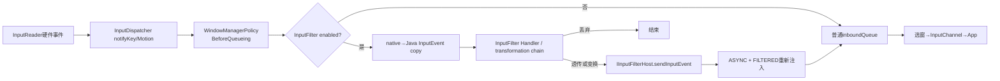
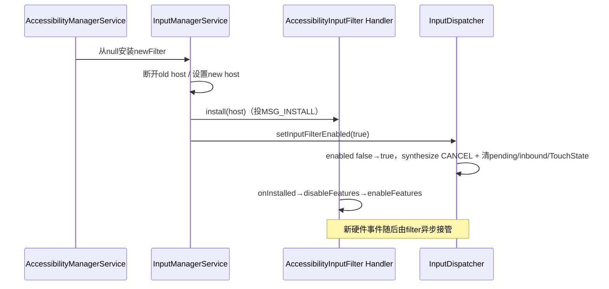
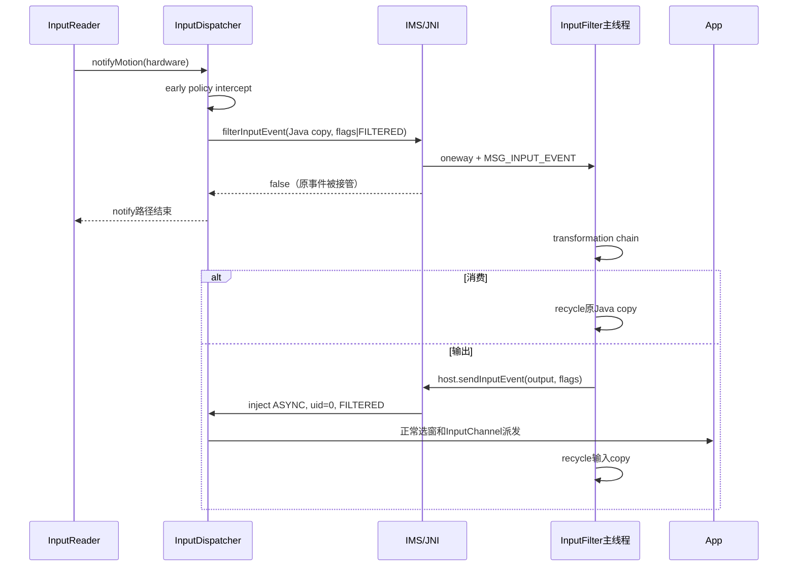

# 178 Android InputFilter、AccessibilityInputFilter 与事件变换

> 源码版本：Android 11 / API 30 / `android-11.0.0_r48`  
> 学习方式：macOS 只读源码，不要求编译、不要求连接设备  
> 前置章节：第 20、51、175、176、177 章

---

## 1. 本章目标：过滤不是同步函数里改完对象再返回

很多人第一次看到 InputFilter，会想象成：

```text
event = filter(event);
dispatch(event);
```

Android 11 的真实模型更像：

```text
硬件事件先被InputDispatcher截住
        ↓
复制成Java InputEvent，异步交给过滤器Looper
        ↓
原生这次notify路径不再入正常inboundQueue
        ↓
过滤器可丢弃、延迟、拆分、合并或生成新事件
        ↓
选中的输出再通过IInputFilterHost异步注入Dispatcher
```

所以 InputFilter 是一条“接管后重新生产事件流”的管线，不只是一个返回修改值的同步回调。

---

## 2. 先记住九条结论

1. 系统同一时刻最多安装一个顶层 `IInputFilter`。
2. 原始硬件事件仍先经过 `intercept*BeforeQueueing`，再进入 filter。
3. filter 接管时，原事件不会同时继续进入普通 App 派发链。
4. `InputFilter.filterInputEvent()` 再投 Handler，实际变换运行在构造时指定的 Looper。
5. 默认 `onInputEvent()` 只是把事件原样送回 host，仍经历一次 native 注入。
6. host 用 UID/PID 0、ASYNC、timeout 0 和 FILTERED 标志重新注入。
7. FILTERED 输出不会再跑同一轮早期 policy intercept，也不会重新进入顶层 filter。
8. 顶层 filter enable 布尔发生变化（无→有或有→无）会让 Dispatcher reset/cancel 当前输入状态，避免半条手势跨越配置边界。
9. AccessibilityInputFilter 内部又是一条按 display 组织的 transformation chain，并非每个无障碍服务直接拿到所有 MotionEvent。

---

## 3. 本章要回答的十八个问题

1. filter 在 InputReader 与 App 之间的哪个位置？
2. 为什么早期 WindowManagerPolicy 仍先执行？
3. native 怎样把 Key/Motion 转成 Java 对象？
4. Java 返回 true/false 分别代表什么？
5. oneway Binder 与 Handler 各承担哪段异步？
6. 原 Java InputEvent 由谁 recycle？
7. 默认透传为什么也要重新注入？
8. FILTERED 怎样避免重复处理？
9. filter 输出为什么有 root 级注入身份？
10. 卸载后旧 filter 为什么不能继续送事件？
11. enable/disable 为什么要重置 Dispatcher？
12. reset 是否清空所有 connection waitQueue？
13. AccessibilityInputFilter 怎样按 feature 建链？
14. 多显示器为什么各有 transformation head？
15. touch、mouse、keyboard 怎样判断序列起点？
16. PASS_TO_USER 消失时为何要清状态？
17. 无障碍 KeyEvent 最多等待服务多久？
18. performGesture 与物理触摸冲突时怎样取消？

---

## 4. 源码地图

```text
frameworks/base/core/java/android/view/
├── InputFilter.java
├── IInputFilter.aidl
└── IInputFilterHost.aidl

frameworks/base/services/core/java/com/android/server/input/InputManagerService.java
frameworks/base/services/core/jni/com_android_server_input_InputManagerService.cpp
frameworks/native/services/inputflinger/dispatcher/InputDispatcher.cpp

frameworks/base/services/accessibility/java/com/android/server/accessibility/
├── AccessibilityInputFilter.java
├── EventStreamTransformation.java
├── BaseEventStreamTransformation.java
├── TouchExplorer.java
├── FullScreenMagnificationGestureHandler.java
├── AutoclickController.java
├── KeyboardInterceptor.java
├── KeyEventDispatcher.java
└── MotionEventInjector.java
```

---

## 5. 总体数据流



最关键的事实：开启 filter 后，硬件原事件走 J 分支时不会同时走 Q；Q 中出现的是过滤器选择重新注入的输出。

---

## 6. 顶层 filter 的安装者

`AccessibilityManagerService.updateInputFilter()` 根据当前用户启用的功能计算 flags：

- 屏幕放大；
- touch exploration；
- key event filtering；
- autoclick；
- accessibility gesture injection；
- multi-finger / two-finger passthrough 等。

flags 从 0 变为非 0 时创建或复用 `AccessibilityInputFilter`，再调用：

```java
mWindowManagerService.setInputFilter(inputFilter);
```

WMS 的内部接口只是转给 IMS。真正维护 filter/host 和 native enable 状态的是 `InputManagerService`。

---

## 7. 同一时刻只保留一个 filter

`InputManagerService` 保存：

```java
IInputFilter mInputFilter;
InputFilterHost mInputFilterHost;
```

`setInputFilter(newFilter)` 会先卸载旧 filter，再安装新 filter，最后调用：

```java
nativeSetInputFilterEnabled(mPtr, filter != null);
```

“一个顶层 filter”不表示只有一个功能。AccessibilityInputFilter 在自己的 Java 对象内部串接多个 transformation，形成第二层组合管线。

---

## 8. 安装与事件都通过 Handler 串行化

`InputFilter` 的三个 Binder 方法并不直接执行业务：

```java
install(host)          -> MSG_INSTALL
uninstall()            -> MSG_UNINSTALL
filterInputEvent(...)  -> MSG_INPUT_EVENT
```

构造器接收 Looper，`AccessibilityInputFilter` 使用 system_server 主 Looper。因此 `onInstalled()`、`onInputEvent()`、`onUninstalled()` 都在主线程按消息顺序执行，API 声明的 non-reentrant 由这层串行队列实现。

IInputFilter AIDL 又是 `oneway`，调用方不等待远端业务执行完成。

---

## 9. 为什么早期 policy 先执行

硬件 Key/Motion 在进入 filter 前已经调用：

```text
interceptKeyBeforeQueueing
interceptMotionBeforeQueueing
```

这里处理唤醒、电源和系统按键等低层政策。即使无障碍 filter 最终吞掉或变换事件，系统也不能漏掉必要的 wake/user activity 等早期语义。

policy 会通过 `FLAG_PASS_TO_USER` 表达事件是否应该继续给用户态应用链。filter 必须保存并尊重这些 flags。

---

## 10. native 何时决定送 filter

Key 的判断当前只是：

```cpp
bool InputDispatcher::shouldSendKeyToInputFilterLocked(...) {
    return mInputFilterEnabled;
}
```

Motion 也在 enable 时进入相同分流。Dispatcher 先短暂持锁检查，再释放 `mLock` 执行 policy 的 `filterInputEvent()` 回调，避免锁内进入 Java/主线程路径。

回调返回后，只有返回 true 才重新加锁并构造普通 KeyEntry/MotionEntry。

---

## 11. native 怎样复制 Java 对象

JNI policy bridge 按事件类型转换：

- Key：`android_view_KeyEvent_fromNative()`；
- Motion：`android_view_MotionEvent_obtainAsCopy()`；
- 其他类型：直接返回 true，正常派发。

过滤器收到的是 Java 事件对象，不是借用一个可长期保存的 native 指针。Motion 明确复制，是因为过滤过程异步于原始 notify 调用。

---

## 12. Java callback 的 boolean 容易读反

IMS 的 `filterInputEvent()`：

```java
if (mInputFilter != null) {
    mInputFilter.filterInputEvent(event, policyFlags);
    return false;
}
event.recycle();
return true;
```

语义是：

| 返回 | native 接下来做什么 |
|---|---|
| false | 原事件已交给 filter 接管；当前 notify 路径直接 return |
| true | 没有可用 filter，原事件照常进入 inbound queue |

false 不是“过滤失败”，而是“原事件被 filter 消费”。

---

## 13. 异常时的 fail-open 与失联边界

JNI 调 Java 方法若抛未处理异常，会清异常并把 `pass=true`，让原事件正常派发，这是 fail-open。

但 IMS 自己调用 `mInputFilter.filterInputEvent()` 时会捕获 `RemoteException`、忽略后仍返回 false。如果成员还非空但远端 Binder 已失效，这笔原事件可能被吃掉，直到系统更新/卸载 filter。

AccessibilityInputFilter 通常在同一个 system_server 进程，常见故障更多是主线程积压而非远端进程死亡；源码仍保留了通用 Binder 接口的这个边界。

---

## 14. 谁负责 recycle

若 IMS 没有 filter，它在返回 true 前调用 `event.recycle()`。

若交给 filter，则 `InputFilter.H` 在处理 MSG_INPUT_EVENT 的 finally 中 recycle：

```java
try {
    onInputEvent(event, policyFlags);
} finally {
    event.recycle();
}
```

因此 transformation 若要跨回调保存事件，必须 `obtain()` 一份副本。保存原引用会在回调结束后使用已回收对象。

---

## 15. 默认透传仍是“重新注入”

基类默认实现：

```java
public void onInputEvent(InputEvent event, int policyFlags) {
    sendInputEvent(event, policyFlags);
}
```

`sendInputEvent()` 通过 `IInputFilterHost` 回到 IMS，并非让最初 native 栈继续执行。最初的 native filter 回调已经得到 false 并返回了。

所以哪怕完全不修改事件，filter 开启也增加了一次 Java Handler 和 host reinjection 的异步绕行。

---

## 16. host 重新注入的固定参数

`InputFilterHost.sendInputEvent()` 调：

```java
nativeInjectInputEvent(
    mPtr, event,
    0, 0,
    INJECT_INPUT_EVENT_MODE_ASYNC,
    0,
    policyFlags | FLAG_FILTERED);
```

含义：

- injectorPid/Uid 为 0，拥有全局目标能力；
- ASYNC，不阻塞 system_server 主线程；
- timeout=0，因为 ASYNC 不等结果；
- FILTERED，表示这已是 filter 输出。

这条特殊受信系统入口不能类比普通 App 的注入权限。

---

## 17. FILTERED 到底避免了什么

注入函数看到 FILTERED 后跳过：

```text
interceptKeyBeforeQueueing
interceptMotionBeforeQueueing
```

否则默认透传会再次触发 wake/system policy，变换事件还可能被重复改写。

另一方面，注入事件本来就从 `injectInputEvent()` 直接进入 inbound queue，不再走硬件 `notifyKey/notifyMotion()` 的 filter hook。因此避免 filter 自循环同时依赖两点：

1. filter 输出走“注入入口”而非“硬件通知入口”；
2. FILTERED 跳过重复的早期 policy intercept，并标记这是已处理输出。

不要只把 FILTERED 解释成一个递归开关。

---

## 18. host disconnect 如何阻止旧 filter

卸载旧 filter 时，IMS 先：

```java
mInputFilter = null;
mInputFilterHost.disconnectLocked();
mInputFilterHost = null;
```

旧 filter Handler 中可能还有排队事件，甚至尚未执行 MSG_UNINSTALL。它持有的 host Binder 仍可被调用，但 host 在 `mInputFilterLock` 下检查 `mDisconnected`，为 true 就静默丢弃。

这堵住了“旧配置晚到输出污染新配置”的路径。

---

## 19. 为什么启用/停用 filter 要 reset Dispatcher

若在一个触摸序列中间突然启用 filter：

```text
App已经收到DOWN
接下来的MOVE/UP却交给filter
```

App 会永远保留一条未结束手势。反向切换也可能让 filter 已看见 DOWN，却收不到后续。

所以 native enable 布尔状态变化时调用：

```cpp
resetAndDropEverythingLocked(
        "input filter is being enabled or disabled");
```

启停点被定义为旧输入流的边界，而不是让半条流跨过去。若直接用一个非 null filter 替换另一个非 null filter，传给 native 的 enabled 仍是 true，r48 会因值未变化而提前返回；这种 replacement 不会触发本函数的全局 reset，是后文复读要保留的实现边界。

---

## 20. reset 做了哪些事

第 176 章已读过完整函数：

1. 为所有 connection 合成 `CANCEL_ALL_EVENTS`；
2. 重置 key repeat；
3. 释放全局 pending event；
4. drain inbound queue；
5. 清 no-focused-window timer；
6. 清 AnrTracker；
7. 清 TouchState、hover 与 replaced keys。

这会让 App 侧已知的 Key/Pointer 状态尽量收到 cancelled UP/CANCEL，并让新 filter 从干净序列开始。

---

## 21. reset 不等于抹掉所有 connection 队列

容易误写成“安装 filter 会清空所有 outbound/waitQueue”。r48 的 `resetAndDropEverythingLocked()` 并没有调用 `drainDispatchQueue()` 遍历每个 connection。

它先依据 connection `InputState` 合成取消事件，再清全局 pending/inbound 和路由/ANR索引。已经 publish 的 wait entries 仍可能等 FINISHED，合成 cancel 也会走 connection outbound/wait。

所以“drops all events in progress”的 API 注释应按协议效果理解：旧输入流被取消和停止继续路由，不代表所有已发 entry 的内存节点同步消失。

---

## 22. 切换步骤时序



install 消息和输入消息在 filter Handler 上串行；Dispatcher reset 与 Java feature 建链属于不同执行域，不应想成一个原子跨线程事务。

---

## 23. AccessibilityInputFilter 的两层结构

顶层对象同时是：

- `InputFilter`：对接 IMS host 和 Handler；
- `EventStreamTransformation`：作为每条 transformation chain 的最终 sink。

`mEventHandler` 是 `SparseArray<displayId, chainHead>`。Motion 依据 event displayId 选择链；Key 在 r48 注释与实现中统一交给 default display 的 KeyboardInterceptor，因为 Key displayId 通常为 -1 并按 focused display 路由。

---

## 24. feature 怎样拼成链

`enableFeatures()` 使用 `addFirstEventHandler()`，每新增一个 handler 都插在链首：

```text
新handler → 原chainHead → ... → AccessibilityInputFilter sink
```

当相关 feature 全开时，一个 display 的 Motion 链大体为：

```text
MotionEventInjector
  → MagnificationGestureHandler
  → TouchExplorer
  → AutoclickController
  → AccessibilityInputFilter.sendInputEvent
```

实际链取决于 flags。后加入者在前，因此 transformation order 是源码循环和 addFirst 顺序共同决定的。

---

## 25. 多 display 的 handler 与共享对象

Magnification、TouchExplorer、MotionEventInjector 通常按 display 创建独立实例。

AutoclickController 只创建一个对象，再用 `addFirstEventHandlerForAllDisplays()` 放入每条链。它因此可能同时作为多个 chain 的节点，内部必须自己按事件/display语义管理状态。

Key 的 KeyboardInterceptor 只加到 default display 链首。

---

## 26. transformedEvent 与 rawEvent 为什么同时传

Motion transformation 接口是：

```java
onMotionEvent(MotionEvent event,
              MotionEvent rawEvent,
              int policyFlags)
```

- event：前序 transformation 已经修改过的版本；
- rawEvent：进入 AccessibilityInputFilter 时的原始版本。

手势识别可能需要真实轨迹，而放大/触摸探索又要继续变换输出坐标。双参数避免下游只有变换结果、丢失原始判断依据。

顶层先 `MotionEvent.obtain(event)` 作为 transformed copy，链结束后 recycle；原始输入对象则由 InputFilter Handler finally recycle。

---

## 27. PASS_TO_USER 为 0 时怎样处理

AccessibilityInputFilter 看到早期 policy 不允许传给用户：

```java
state.reset();
clearEventsForAllEventHandlers(eventSource);
super.onInputEvent(event, policyFlags);
```

它先清自己的序列状态，再把带原 flags 的事件送回 Dispatcher。因为没有 PASS_TO_USER，Dispatcher 最终按 policy drop，并可依据自己的 InputState 合成必要取消。

filter 不能简单吞掉且保留内部 gesture，否则下一笔 MOVE 可能被误接到已经由 policy 截断的旧 DOWN。

---

## 28. source 改变也要清 transformation 状态

`EventStreamState.updateInputSource()` 发现 source 变化时先 reset，并调用所有 display chain 的 `clearEvents(eventSource)`。

原因是同一 Java MotionEvent 类型可能来自 touchscreen、mouse 等不同 source，其序列规则不同。不能把 mouse hover 接在 touchscreen DOWN 的识别状态上。

注意 keyboard state 覆盖了自己的 `updateInputSource()`，因为它按 deviceId map 同时管理多个键盘设备，而不是只认一个当前 source。

---

## 29. TouchScreen 怎样拒绝半条序列

TouchScreenEventStreamState 只在：

- touch 的 ACTION_DOWN；
- hover 的 ACTION_HOVER_ENTER；

开始一条可处理序列。在还没见到起点时到来的 MOVE/UP/HOVER_MOVE 不交给 transformations。

这是 reset、设备切换或丢包后的自愈门：宁可忽略半条流，也不让复杂 TouchExplorer/Magnifier 状态机从无起点状态运行。

---

## 30. Mouse 与 Keyboard 的起点规则

Mouse 在 ACTION_DOWN 或 ACTION_HOVER_MOVE 时开始；scroll 可被单独允许。

Keyboard 用 `SparseBooleanArray` 按 deviceId 记录是否已看到 ACTION_DOWN。多个键盘设备事件可交错，不能只用一个全局 `keySequenceStarted`。

这体现 InputFilter 文档强调的原则：deviceId + source 共同区分独立流。

---

## 31. transformation 的责任不是只处理当前一笔

接口文档要求：

- 发送 Key DOWN 后最终要有 UP；
- pointer DOWN 最终要有 UP/CANCEL；
- 某 handler 中途决定截走旧流时，要向后续 handler 发送取消；
- 收到 CANCEL 的 handler 必须清状态并继续传播；
- reset 后必须等新的合法起点。

这是事件流变换，不是无状态 map 函数。一个错误 handler 能让后续无障碍功能和 App 同时卡在“按下未释放”。

---

## 32. TouchExplorer 并不是简单坐标修改

Touch exploration 会在触摸、hover、无障碍焦点与手势识别之间转换：

- 一指移动可变成 hover 探索；
- 双击可激活无障碍焦点；
- 多指手势可保留给服务或透传；
- 某些路径必须补 DOWN/CANCEL/UP 保持 App 事件一致。

因此它需要 raw + transformed event、内部 TouchState 和延迟决策。这里只建立管线位置，详细状态机已在第 51 章学习。

---

## 33. Magnification 为什么排在 TouchExplorer 前面

由于 `addFirst` 顺序，MagnificationGestureHandler 在 TouchExplorer 前。它先识别/处理屏幕放大手势，并把未消费或变换后的流交给触摸探索。

如果反过来，TouchExplorer 可能先把触摸转换成 hover，放大手势就看不到预期的原始触摸结构。链顺序是功能语义的一部分，不是容器实现细节。

---

## 34. Autoclick 怎样生成新事件

AutoclickController 观察鼠标停止一段时间，可构造 synthetic DOWN/UP，并通过 next chain 送到最终 sink。

它不是直接调用某个 View.performClick()。生成的事件仍经 host 注入、Dispatcher 选窗、InputChannel 和 View 分发，因此保留窗口路由与安全边界。

用户再次移动、按键或 feature disable 时，controller 必须取消 pending click 和清状态。

---

## 35. 无障碍 KeyEvent 过滤的 500ms 窗口

KeyboardInterceptor 最终调用 AMS `notifyKeyEvent()`，KeyEventDispatcher 把 clone 发给声明过滤能力的已绑定服务。

若至少一个服务接收，事件进入 pending，并安排：

```java
ON_KEY_EVENT_TIMEOUT_MILLIS = 500;
```

任一服务报告 handled=true，则最终消费；所有服务都返回 false，或 500ms 超时后无人处理，则重新把原 Key 发回 AccessibilityInputFilter，再由 host 注入 App。

这 500ms 是无障碍 Key 服务决策窗口，不是第 176 章的 InputDispatcher ANR。

---

## 36. 多服务 Key 结果怎样聚合

同一个 `PendingKeyEvent` 被多个服务列表引用，`referenceCount` 等于仍待答复的服务数。

- 任一 handled=true 会把聚合 handled 置 true；
- 每个服务答复/flush/timeout 都减引用；
- 归零时，handled=false 才重新注入；
- handled=true 则 recycle，不再给 App。

所以不是“第一个 false 就放行”，也不是“所有服务都必须 true”。

---

## 37. 音量键还可能在 KeyboardInterceptor 排队

音量键先询问 WindowManagerPolicy 的 `interceptKeyBeforeDispatching()`，可能获得正 delay、0 或负值：

- 正值：按 uptime 延迟后重查；
- 0：交给 AMS/无障碍服务；
- 负值：直接丢弃。

KeyboardInterceptor 自己维护双向事件队列，保证后到键不会越过仍在延迟的前一键。然后才进入 500ms 服务响应模型。

---

## 38. MotionEventInjector 与 performGesture

无障碍服务的 gesture steps 被交给按 display 的 MotionEventInjector，转换成定时 MotionEvent 并沿 transformation chain 下发。

它不是走普通 App `InputManager.injectInputEvent()` 的同步返回模式，而是在 system_server 主线程按 message 时间表生成一串事件，最终仍从 InputFilter host ASYNC reinject。

服务收到“gesture complete”回调，表示其计划序列已发完，不等价于目标 App 业务已完成。

---

## 39. 物理触摸为什么会取消注入手势

MotionEventInjector 收到真实链路 Motion 时通常调用 `cancelAnyPendingInjectedEvents()`，再把真实事件向后传。

目的：避免系统同时把人工触摸和自动注入手势混在同一 pointer stream 中。

r48 对 mouse HOVER_MOVE 有特殊豁免：当注入 gesture 正在进行时，轻微外接鼠标 hover 不立即取消，以免用户无法完成无障碍 gesture。

---

## 40. feature 变化与顶层 filter 变化不是同一 reset

flags 从 0↔非0 时，AMS 调 WMS/IMS 安装或卸载顶层 filter，native enable 状态变化会执行 Dispatcher reset。

若 filter 始终存在，只是从“magnification + touch exploration”改成另一组非零 flags，AMS 复用同一 `AccessibilityInputFilter`，调用 `setUserAndEnabledFeatures()`：

```text
disableFeatures → 更新user/flags → enableFeatures
```

这只销毁/重建 Java transformation 和 stream state，不调用 native `setInputFilterEnabled()`，因此没有同样的全局 Dispatcher reset。各 handler 的 `onDestroy()`/取消逻辑必须正确收尾。

---

## 41. onInstalled 为何先 disable 再 enable

`AccessibilityInputFilter` 对象会被复用。安装时可能残留上一次用户或 feature 的 handler 引用，所以：

```java
mInstalled = true;
disableFeatures();
enableFeatures();
```

卸载时同样 `mInstalled=false` 后 `disableFeatures()`。

`disableFeatures()` 销毁 injector、autoclick、TouchExplorer、magnification、KeyboardInterceptor，清 chain head，并 reset stream state。

---

## 42. 安装/卸载并非跨线程原子事务

IMS 在 `mInputFilterLock` 下替换 host/member，再调用 native enable；InputFilter 的 install/uninstall 本身只投主线程 Message。

依靠的是：

- host disconnect 拦截旧输出；
- Handler 消息顺序让 install 先于后续 filter events；
- native reset 划断旧 Dispatcher 流；
- Java `onInstalled/onUninstalled` 重建/销毁 transformation。

这些机制合起来实现可恢复切换，而不是一个跨 Java 主线程、native Dispatcher thread 的全局原子锁。

---

## 43. 完整事件时序



图中的 FILTERED 在送 filter 前已被 native 加上，host 再保留/OR 一次。

---

## 44. 性能与卡顿边界

filter 不阻塞 InputReader 等 Java 业务完成，但它把 App 可见输入依赖到了 system_server 主 Looper：

```text
native callback快速投递
        ↓
system_server主线程消息排队
        ↓
复杂TouchExplorer/Magnifier/服务Key决策
        ↓
host重新注入
```

主线程繁忙、transformation 做重活、Key 服务拖到 500ms，都可增加输入延迟。

这种延迟在 App connection waitQueue 之前发生，未必直接表现为 App 5 秒 input ANR；应结合 system_server main trace、InputFilter 消息与 Dispatcher pending/inbound 现场判断。

---

## 45. 故障判断表

| 现象 | 可能阶段 | 关键检查 |
|---|---|---|
| 开无障碍后所有触摸变慢 | filter主线程/transform chain | system_server main、feature链 |
| App 收到半条手势 | toggle/cancel或handler一致性错误 | CANCEL、stream state、host切换 |
| filter 开启但事件直达App | mInputFilter为空、native未enabled或JNI fail-open | IMS/native状态与异常日志 |
| 原事件消失且无输出 | filter主动消费、dead remote被吞、PASS_TO_USER清理 | filter日志、Binder状态、flags |
| Key 固定接近500ms后才到App | 无障碍服务未及时答复 | KeyEventDispatcher pending |
| performGesture 被取消 | 同时到来真实Motion或feature销毁 | MotionEventInjector回调 |
| 旧filter晚到事件不生效 | host已disconnect | mDisconnected分支，属预期 |

---

## 46. macOS 只读练习

### 练习一：证明原事件被接管

```bash
cd /Users/ninebot/androidSource
sed -n '3080,3230p' \
  frameworks/native/services/inputflinger/dispatcher/InputDispatcher.cpp
sed -n '1955,1980p' \
  frameworks/base/services/core/java/com/android/server/input/InputManagerService.java
```

找出 Java false 导致 native 直接 return 的位置。

### 练习二：追默认透传

```bash
sed -n '130,260p' \
  frameworks/base/core/java/android/view/InputFilter.java
sed -n '2305,2340p' \
  frameworks/base/services/core/java/com/android/server/input/InputManagerService.java
```

画出 Handler→onInputEvent→sendInputEvent→host→nativeInject。

### 练习三：手工重建 feature 顺序

```bash
sed -n '400,500p' \
  frameworks/base/services/accessibility/java/com/android/server/accessibility/AccessibilityInputFilter.java
```

假设 autoclick、touch exploration、magnification、motion injection 全开，写出最终 chain head 到 sink 的顺序。

### 练习四：比较三个 timeout

列出：

- KeyboardInterceptor policy delay：动态返回；
- AccessibilityService Key 结果：500ms；
- InputDispatcher window ANR：默认5秒/窗口配置。

说明三者分别在 App publish 前的哪个层次。

---

## 47. 常见误解逐条纠正

### 误解一：InputFilter 返回一个修改后的 event

错误。顶层 callback 用 boolean 决定原事件是否继续；实际输出经 host 另行注入。

### 误解二：filter 在 early policy 之前

错误。BeforeQueueing 已先处理电源/系统政策。

### 误解三：FILTERED 只是避免 filter 递归

不完整。输出走 inject 入口本来不经过硬件 filter hook；FILTERED 还跳过重复 policy intercept并标记已过滤。

### 误解四：切换 filter 会同步清空所有 waitQueue

错误。它合成取消、清 pending/inbound/路由与ANR索引；已有connection队列仍按后续ACK/清理演进。

### 误解五：每个 AccessibilityService 都直接收到原触摸

错误。TouchExplorer/Magnifier等运行在system_server transformation链，服务接收的是更高层无障碍事件/手势回调；Key过滤另有受控回调。

### 误解六：feature变化一定触发native全局reset

错误。只有顶层filter enable布尔发生变化才调用该reset；非零feature集合内部变化由Java handler自行收尾。

---

## 48. 复读审计：八个 r48 边界

### 边界一：输入对象有明确所有者

无filter时IMS recycle；有filter时Handler finally recycle。transformation 异步保留必须clone。

### 边界二：dead filter 分支不完全fail-open

JNI层Java异常会pass原事件，但IMS捕获IInputFilter RemoteException后仍返回false，存在成员尚未清理期间丢事件的窗口。

### 边界三：reset清AnrTracker但不drain每个waitQueue

旧已发entry可能仍返回FINISHED；不要从tracker为空推导connection waitQueue为空。reset 先合成cancel、随后把整个tracker清空，因此这些旧entry和刚排入的cancel也暂时没有原有deadline索引；只有后续responsive connection再成功publish新entry时才会插入新的tracker项。

### 边界四：FILTERED输出是ASYNC

host不等待target、permission或foreground finish，复杂变换后的最终路由失败通常只留native日志。

### 边界五：AccessibilityInputFilter运行在system_server主Looper

低层输入转换的延迟会受system_server主线程队列影响，不能只查目标App主线程。

### 边界六：按display建链不等于所有节点都per-display

Autoclick对象可复用到多条链，KeyboardInterceptor只位于default display链；需要逐feature看实例粒度。

### 边界七：安装消息与native enable不是原子提交

正确性来自消息排序、host disconnect、Dispatcher reset及流起点校验的组合，而不是某个单独布尔值保证。

### 边界八：非null→非null替换不会触发native reset

IMS最后只调用一次`setInputFilterEnabled(filter != null)`；若旧、新filter都非null，native看到enabled仍为true便返回。旧host断开和新Handler流起点门仍提供保护，但API注释所说的“installed or uninstalled automatically drops all events”在这个直接replacement角落并不完整。

---

## 49. 检查题

1. 为什么 filter callback 返回 false 反而代表“接管成功”？
2. 默认透传为何也多一次注入？
3. 原事件和 transformed copy 分别由谁 recycle？
4. FILTERED 与 INJECTED 的职责有何不同？
5. filter host 为什么使用 pid/uid 0？
6. host disconnect 防止了哪一种竞态？
7. native reset 实际清哪些状态、保留哪些connection entry？
8. TouchScreenEventStreamState 为什么只从DOWN/HOVER_ENTER开始？
9. 多个无障碍服务的Key handled怎样聚合？
10. feature非零集合变化为何不一定触发全局Dispatcher reset？

---

## 50. 最终模型与下一章

### 一句话模型

```text
硬件Key/Motion先完成early policy，再在filter启用时被复制到system_server Looper；
原notify路径由false终止，AccessibilityInputFilter可按display和feature链延迟、消费或变换，
最终输出经已连接host以root身份、ASYNC和FILTERED标志重新注入普通派发链；
顶层filter切换用Dispatcher取消/reset划断旧流，Java feature变化则依赖各transformation自行销毁和保持序列一致。
```

### 下一章

第 179 章继续阅读 InputReader 的 EventHub、InputDevice 与 mapper 配置重建，开始从 `/dev/input/event*` 反向追踪硬件原始事件怎样变成第 178 章入口处的 NotifyKey/NotifyMotion。
