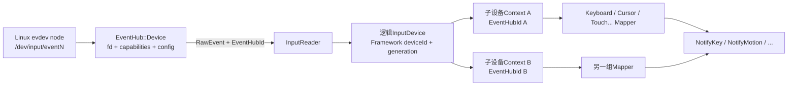
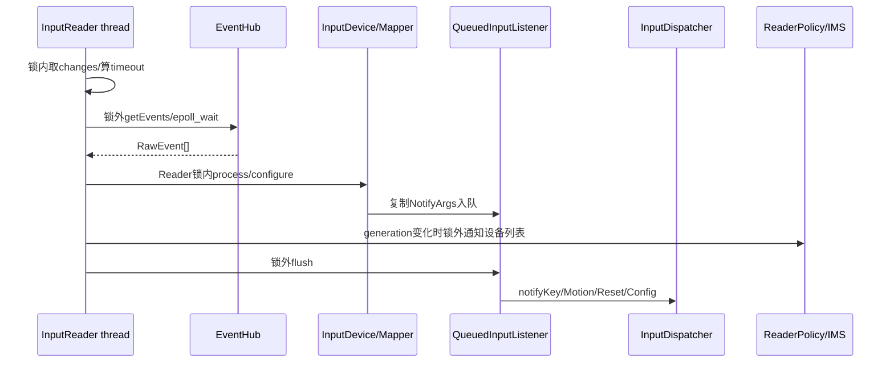
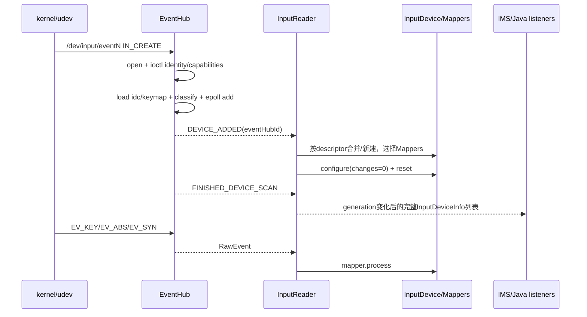

# 179 Android EventHub、InputDevice 与 Mapper 配置重建

> 源码版本：Android 11 / API 30 / `android-11.0.0_r48`  
> 学习方式：macOS 只读源码，不要求编译、不要求连接 Android 设备  
> 前置章节：第 02、20、173、178 章

---

## 1. 本章目标：从 `/dev/input/event*` 到 Mapper，不要跳过设备建模

第 178 章的入口已经是 `InputDispatcher::notifyKey/notifyMotion()`。再往下追，会遇到 Linux evdev 的 `struct input_event`：

```text
time + type + code + value
```

但一个 `EV_ABS / ABS_MT_POSITION_X / 1234` 并不是 Android MotionEvent。系统还需要知道：

- 这是哪台物理/逻辑设备；
- 设备有哪些 kernel capability bit；
- 应加载哪个 `.idc/.kl/.kcm`；
- 它是 keyboard、mouse、touch、joystick 还是复合设备；
- 哪些 InputMapper 应解释同一批 raw events；
- 设备热插拔、显示变化、布局变化时怎样重新配置。

本章把这层“设备发现与 Mapper 建模”完整搭起来。

---

## 2. 先记住十条结论

1. EventHub 使用 inotify 发现 `/dev/input` 节点变化，用 epoll 等待设备 fd、inotify fd 和 wake pipe。
2. EventHub 输出既有 kernel raw event，也有 `DEVICE_ADDED/REMOVED/FINISHED_DEVICE_SCAN` 合成事件。
3. EventHub id、Framework `InputDevice.getId()` 和稳定 descriptor 是三种不同身份。
4. 同 descriptor 的多个 evdev 节点可合并成一个逻辑 `InputDevice`。
5. 一个子设备可同时拥有多个 Mapper；同一 raw event 按顺序交给该子设备的每个 Mapper。
6. Mapper 类型由 EventHub 基于 capability bit 与配置分类，而不是只看设备名称。
7. `.idc`、`.kl`、`.kcm` 有不同职责和搜索/回退过程。
8. 普通 configuration change 复用现有 fd、InputDevice 与 Mapper，只按 changes bit 重配。
9. `CHANGE_MUST_REOPEN` 会按 removed 先于重新扫描/open/add 的顺序重建，不是原地 reload 文件；这些事件可能落在同一个后续 `getEvents()` 批次，也可能因输出缓冲区容量而跨批次。
10. InputReader 在锁内生产 NotifyArgs，却在锁外 flush 给 Dispatcher，避免反向调用死锁。

---

## 3. 本章要回答的二十个问题

1. 为什么 EventHub 需要 `CAP_BLOCK_SUSPEND`？
2. `EPOLLWAKEUP` 保证到哪个完成点？
3. inotify 与 epoll 分别解决什么问题？
4. wake pipe 为什么不是条件变量？
5. EventHub 怎样取得设备 name/vendor/product/location/uniqueId？
6. descriptor 为什么是 SHA-1，而不是直接用 eventN？
7. 没有 uniqueId 的同型号设备怎样避免冲突？
8. capability bit 怎样推断 keyboard/cursor/touch/joystick？
9. 为什么识别为 0 classes 的设备不注册？
10. `.idc/.kl/.kcm` 的搜索顺序是什么？
11. virtual keyboard 为什么没有真实 fd？
12. DEVICE_ADDED 与 FINISHED_DEVICE_SCAN 各有什么作用？
13. 为什么 EventHubId 可合并成一个逻辑 deviceId？
14. 每个 class 对应哪些 Mapper？
15. `configure(0)` 和增量 configure 有什么不同？
16. disable 时为何先 reset 再关 fd？
17. SYN_DROPPED 后为什么等下一个 SYN_REPORT？
18. generation 改变后通知谁？
19. changes bit 怎样合并和唤醒 Reader？
20. MUST_REOPEN 为什么先 break，再有序移除和重扫？

---

## 4. 源码地图

```text
frameworks/native/services/inputflinger/reader/
├── EventHub.cpp
├── InputReader.cpp
├── InputDevice.cpp
├── InputReaderFactory.cpp
├── include/EventHub.h
├── include/InputReader.h
├── include/InputDevice.h
└── mapper/
    ├── KeyboardInputMapper.cpp
    ├── CursorInputMapper.cpp
    ├── SingleTouchInputMapper.cpp
    ├── MultiTouchInputMapper.cpp
    ├── JoystickInputMapper.cpp
    ├── SwitchInputMapper.cpp
    ├── RotaryEncoderInputMapper.cpp
    ├── ExternalStylusInputMapper.cpp
    └── VibratorInputMapper.cpp

frameworks/native/libs/input/
├── InputDevice.cpp
└── Keyboard.cpp
```

---

## 5. 三层对象总图



Linux 节点、EventHub Device、逻辑 InputDevice、Mapper 不是同一对象的不同名字。

---

## 6. EventHub 构造时建立三类等待源

EventHub 创建：

1. `epoll_create1(EPOLL_CLOEXEC)`；
2. `inotify_init()` 并监视 `/dev/input` 的 CREATE/DELETE；
3. 非阻塞 wake pipe。

inotify fd 与 wake read fd 都注册进同一个 epoll。每个成功打开的设备 fd 之后也注册进去。

所以一个 `epoll_wait()` 同时可因：

- 新 raw input；
- 设备节点增删；
- Reader 配置刷新主动 wake；

而返回。

---

## 7. 为什么使用 EPOLLWAKEUP

设备 fd 注册事件为：

```cpp
EPOLLIN | EPOLLWAKEUP
```

源码注释解释：驱动在有未读事件时阻止 suspend；最后一笔被 read 后，epoll 的 wakeup 责任延续到下一次对同 fd 的 `epoll_wait()`。

EventHub 因而能在本轮把 RawEvent 交给 InputReader/Mapper/QueuedListener，再进入下一轮 poll 才释放这段唤醒保护。

这不是一个永久 WakeLock，也不保证 App 最终处理完。它覆盖的是底层事件从内核取出并交给上层输入管线的关键窗口。

---

## 8. CAP_BLOCK_SUSPEND 是启动硬条件

构造器调用 `ensureProcessCanBlockSuspend()`，确认进程 effective capabilities 包含 `CAP_BLOCK_SUSPEND`，否则 fatal。

因为没有该 capability，`EPOLLWAKEUP` 无法可靠承担阻止 suspend 的语义，输入可能在读取/处理窗口中被挂起。

这也是 EventHub 不是普通 App 可随便复制的一段代码：它依赖 system_server/native input 的特权运行环境。

---

## 9. 首次扫描与热插拔

初始 `mNeedToScanDevices=true`，第一次 `getEvents()` 调用 `scanDevicesLocked()`：

- 遍历 `/dev/input`；
- 尝试打开每个目录项；
- 可选扫描 `/dev/v4l-touch*`；
- 确保虚拟键盘存在。

后续 inotify CREATE 调 `openDeviceLocked(path)`，DELETE 调 `closeDeviceByPathLocked(path)`。

inotify 只告诉“名字变化”；设备真实能力仍要 open fd 后通过 ioctl 读取。

---

## 10. 为什么先处理设备 fd 再处理 inotify

`getEvents()` 收到一批 epoll items 时，只先把 inotify 标为 pending。等这一批其他 fd 都处理完，才 `readNotifyLocked()` 修改设备列表。

源码目的很明确：若同一轮既有设备残余事件又有 DELETE，先把 fd 中最后的事件读完，再关闭设备。

否则热拔插边界可能无故丢掉已经进入 kernel buffer 的尾部 UP/SYN_REPORT。

---

## 11. wake pipe 怎样刷新配置

其他线程调用 `InputReader::requestRefreshConfiguration(changes)`：

```cpp
mConfigurationChangesToRefresh |= changes;
if (之前没有待刷新bit) {
    mEventHub->wake();
}
```

EventHub `wake()` 向非阻塞 pipe 写一个字节，epoll 立即返回。Reader 下一轮在取 raw events 前读取并清 changes，执行配置刷新。

多次请求用 OR 合并；只有从 0 变成非 0 时需要写 wake byte，避免无意义唤醒风暴。

---

## 12. openDevice 先读取身份

打开参数：

```cpp
O_RDWR | O_CLOEXEC | O_NONBLOCK
```

随后 ioctl 读取：

- `EVIOCGNAME`：名称；
- `EVIOCGVERSION`：驱动版本；
- `EVIOCGID`：bus/vendor/product/version；
- `EVIOCGPHYS`：物理 location；
- `EVIOCGUNIQ`：unique id。

若名称在 excluded device list 中，立即 close 并忽略。excluded list 来自 Reader policy 配置，并不是 SELinux 拒绝后的状态。

---

## 13. descriptor 为什么不使用 `/dev/input/eventN`

eventN 是内核本次枚举顺序，重启或插拔后可变化，不适合作为稳定设备身份。

EventHub 根据 vendor/product、uniqueId；若 vendor/product 都为 0，还加入 name 或 location，生成 raw descriptor，再取 SHA-1 作为 opaque descriptor。

相同硬件跨重连尽量得到相同 descriptor，供：

- 键盘布局关联；
- 多 evdev 节点合并；
- Framework 设备变化识别。

SHA-1 在这里用于稳定压缩标识，不是密码认证。

---

## 14. nonce 解决“当前同时连接”的冲突

没有 uniqueId 时，若当前已有相同 descriptor 的设备，代码递增 nonce 并重新生成 descriptor，直到不冲突。

这能区分同时插入的两只同型号、无序列号设备，但 nonce 取决于当次连接集合和顺序，不能保证它们跨重启各自保持同一个 identity。

所以 Android 所谓 stable descriptor 是尽力而为，硬件提供可靠 uniqueId 才能真正稳定地区分个体。

---

## 15. `.idc` 的搜索和加载

配置文件类型 0 是 `.idc`。查找名依次尝试：

1. `Vendor_vvvv_Product_pppp_Version_xxxx`；
2. `Vendor_vvvv_Product_pppp`；
3. 规范化 device name。

根目录依次：

```text
/odm/usr/idc/
/vendor/usr/idc/
$ANDROID_ROOT/usr/idc/    通常/system/usr/idc/
$ANDROID_DATA/system/devices/idc/
```

找到后 `PropertyMap::load()`。解析失败记录错误并使用默认配置；路径不为空不等于配置一定成功加载。

---

## 16. `.kl` 与 `.kcm` 的职责

- `.kl` Key Layout：Linux scan code/HID usage → Android keyCode、flags，也可描述 joystick axis；
- `.kcm` Key Character Map：keyCode + meta state → 字符/行为、键盘类型。

KeyMap 使用类似设备 identifier 查找，并继续探测 Generic/Virtual 等 fallback。键盘 class 判断之后还会用 keymap 检查 Q、DPAD 四向+中心、gamepad keycode，以派生 ALPHAKEY/DPAD/GAMEPAD class。

所以“内核上报 KEY_Q 就自然等于 Android AKEYCODE_Q”不准确，中间有 `.kl` 映射。

---

## 17. capability bit 怎样分类

EventHub 用 `EVIOCGBIT`/`EVIOCGPROP` 读取：

- key bitmask；
- abs/rel axis bitmask；
- switch、LED、force feedback；
- input properties。

典型推断：

| 条件 | class |
|---|---|
| 键区/gamepad button | KEYBOARD |
| BTN_MOUSE + REL_X + REL_Y | CURSOR |
| ABS_MT_POSITION_X/Y | TOUCH + TOUCH_MT |
| BTN_TOUCH + ABS_X/Y | TOUCH（single touch） |
| 压力/触摸但无X/Y | EXTERNAL_STYLUS |
| gamepad button + 合适ABS axis | JOYSTICK |
| 任一 SW bit | SWITCH |
| FF_RUMBLE | VIBRATOR |

一个 device 可同时具备多个 class。

---

## 18. 识别中的纠偏规则

PS3 等手柄可能上报与 ABS_MT 范围冲突的轴，所以 multi-touch 判断还要求 BTN_TOUCH 或“不是 gamepad buttons”。

external stylus 被识别后会移除 KEYBOARD class，因为相关 button 要留给 stylus 与 touchscreen 融合，而不是再当普通键盘键。

这种规则说明 class 是 Framework 对 capability 组合的解释，不是 kernel 自带的单一设备类型字段。

---

## 19. 0 class 的节点不会进入 epoll

若所有分类后 `device->classes == 0`：

```cpp
delete device;
return -1;
```

系统不会监视它，也不会向 InputReader 报 DEVICE_ADDED。

一个出现在 `/dev/input` 的节点不保证被 Android Input Framework 采用。它可能是传感器式 evdev、能力不被识别或被 excluded list 忽略。

---

## 20. 注册 fd 前后的初始化

识别完成后：

1. 可与同名 v4l-touch video device 配对；
2. 注册 input/video fd 到 epoll；
3. `configureFd()`；
4. 加入 mDevices 和 opening list。

`configureFd()` 对 keyboard 关闭 kernel key repeat，因为 Android Dispatcher 自己生成重复；还尝试 `EVIOCSCLOCKID(CLOCK_MONOTONIC)`，让事件时间与 Android 其他 monotonic 时间一致。

ioctl 失败会记录但设备通常仍继续工作；日志 `usingClockIoctl=false` 是诊断时间基准的重要线索。

---

## 21. RawEvent 的时间来自哪里

读取 `struct input_event` 后：

```cpp
when = seconds_to_nanoseconds(tv_sec)
     + microseconds_to_nanoseconds(tv_usec);
```

它使用驱动写入 evdev client buffer 的事件时间，而不是 EventHub read 时重新调用 now。因此下游可估算从内核入队开始的输入延迟。

成功设置 EVIOCSCLOCKID 后是 CLOCK_MONOTONIC；旧驱动不支持时需谨慎检查实际时钟契约。

---

## 22. EventHub 的三类合成事件

EventHub 定义高位 type：

```text
DEVICE_ADDED          0x10000000
DEVICE_REMOVED        0x20000000
FINISHED_DEVICE_SCAN  0x30000000
```

它们与 EV_KEY/EV_ABS/EV_SYN 不属于同一 kernel event type 范围。

opening/closing list 让 add/remove 通知在 getEvents 中有序输出；FINISHED_DEVICE_SCAN 表示最近一批扫描的 add/remove 已报告完，并且启动时至少发送一次。

---

## 23. reopen 为什么先 break 返回

`mNeedToReopenDevices` 被看到时：

```cpp
closeAllDevicesLocked();
mNeedToScanDevices = true;
break;
```

发现 `mNeedToReopenDevices` 的这次 `getEvents()` 会先 `closeAllDevices()`，设置待扫描标志，然后直接 `break`；因此这一调用通常先以 0 个事件返回。后续调用先从 closing list 输出 `DEVICE_REMOVED`，之后才扫描和重新 open，并输出 `DEVICE_ADDED`、`FINISHED_DEVICE_SCAN`。

这里要特别避免把它记成“严格两个调用”：如果调用方提供的 RawEvent 缓冲区仍有容量，removed 与随后扫描产生的 added/scan-finished 可以出现在同一次后续 `getEvents()` 返回中；容量不足时也可能跨更多次调用。真正稳定的约束是逻辑顺序——旧设备先 removed，之后新定义才 added，使 InputReader 能先拆旧 Mapper 状态，再按重新读取的 capability/config 建新状态。

---

## 24. virtual keyboard 没有真实 fd

首次扫描若缺少保留的 virtual keyboard，EventHub 创建：

```text
fd = -1
classes = KEYBOARD | ALPHAKEY | DPAD | VIRTUAL
```

它加载 keymap 并作为 DEVICE_ADDED 报告，但不注册 evdev fd。第 177 章的 injected Key 使用 `VIRTUAL_KEYBOARD_ID`，正是复用这套逻辑设备语义，而不是假装来自某个 eventN。

---

## 25. EventHubId 与 Framework deviceId

EventHub 每打开节点分配 eventHubId。InputReader 收到 DEVICE_ADDED 后，依据 descriptor 查已有逻辑设备：

- 找到同 descriptor → 把新 eventHubId 加为同一 InputDevice 的子设备；
- 找不到 → 新建 Framework InputDevice，并分配逻辑 id/generation。

保留 id 范围内可能沿用 eventHubId；普通设备则用 `nextInputDeviceIdLocked()`。

因此日志排查时不要把 eventHubId 与 Java `InputDevice.getId()` 机械等同。

---

## 26. composite device 的含义

一块物理 USB/Bluetooth 设备可能暴露多个 evdev node：例如一个键盘节点、一个鼠标节点。若它们的 descriptor 相同，InputReader 用一个逻辑 InputDevice 聚合。

内部结构：

```text
InputDevice
  ├─ eventHubId A → InputDeviceContext + mappers A
  └─ eventHubId B → InputDeviceContext + mappers B
```

移除一个子节点后，只要还有其他 EventHub device，逻辑 InputDevice 仍存在并重新 configure；最后一个子节点移除后才完全消失。

---

## 27. class 到 Mapper 的映射

`InputDevice::addEventHubDevice()` 为每个子设备选择：

| class | Mapper |
|---|---|
| SWITCH | SwitchInputMapper |
| ROTARY_ENCODER | RotaryEncoderInputMapper |
| VIBRATOR | VibratorInputMapper |
| KEYBOARD/ALPHAKEY/DPAD/GAMEPAD | 一个合并 sources 的 KeyboardInputMapper |
| CURSOR | CursorInputMapper |
| TOUCH_MT | MultiTouchInputMapper |
| TOUCH（非MT） | SingleTouchInputMapper |
| JOYSTICK | JoystickInputMapper |
| EXTERNAL_STYLUS | ExternalStylusInputMapper |

同一子设备可同时建 Keyboard + Cursor 等多个 Mapper。

---

## 28. 同一 RawEvent 为何按 Mapper 顺序逐个处理

`InputDevice::process()` 对每一笔 rawEvent，再遍历该 eventHubId 对应的全部 Mapper：

```text
raw event 1 → mapper A → mapper B
raw event 2 → mapper A → mapper B
```

不能把整批先给 mapper A、再整批给 mapper B。joystick movement 与 gamepad button 可能由不同 Mapper 处理，但必须保持 kernel 原始先后顺序。

某 Mapper 对不关心的 type/code 自己忽略。

---

## 29. 首次添加的 configure + reset

InputReader 收到 DEVICE_ADDED：

```cpp
device = createDeviceLocked(...);
device->configure(when, &mConfig, 0);
device->reset(when);
```

`changes=0` 表示首次完整配置：

- 汇总子设备 classes/config；
- 读取 keyboard overlay、alias、enabled、display association；
- 调每个 Mapper 的完整 configure；
- 生成 sources/ranges；
- 最后 reset，从 kernel 当前状态建立干净起点并发 DeviceReset 通知。

---

## 30. 为什么首次配置最后才允许 disable

首次 configure 中，Mapper 需要通过仍打开的 fd 查询 absolute axis 范围和当前设备属性。

所以即便 policy 配置里设备 disabled，也先让 Mapper 完成首次配置，再调用 `setEnabled(false)` 关闭 fd。

若一开始就关，MultiTouch 等 Mapper 无法 ioctl 得到正确范围/状态。

---

## 31. enable 与 disable 的 reset 顺序

`InputDevice::setEnabled()`：

```text
enable:  先重新open/register fd → reset
disable: 先reset → unregister/close fd
```

某些 Mapper reset 会查询驱动当前状态，所以 reset 必须在 fd 可用时执行。

reset 还会向 Dispatcher 发 `NotifyDeviceResetArgs`，使已按下的 key/touch 状态得到取消收尾。

---

## 32. 增量配置不是重建 Mapper

Reader 收到 pointer speed、display、show touches、keyboard layout 等 changes 时：

```cpp
device->configure(now, &mConfig, changes);
```

同一个 InputDevice、InputDeviceContext 和 Mapper 对象保留。每个 Mapper 只在关心的 bit 出现时重算对应参数。

例如：

- Cursor 关心 pointer speed、display、pointer capture；
- Touch 关心 affine、display、show touches、gesture enablement、stylus presence；
- Keyboard 关心 display/keyboard layout。

---

## 33. 哪些状态来自 ReaderConfiguration

changes bit 包括：

```text
POINTER_SPEED
POINTER_GESTURE_ENABLEMENT
DISPLAY_INFO
SHOW_TOUCHES
KEYBOARD_LAYOUTS
DEVICE_ALIAS
TOUCH_AFFINE_TRANSFORMATION
EXTERNAL_STYLUS_PRESENCE
POINTER_CAPTURE
ENABLED_STATE
MUST_REOPEN
```

配置源由 native policy `getReaderConfiguration()` 从 system_server 当前状态拼出，例如 display viewports/port associations、disabled device set、pointer display 等。

这些是 Framework 运行配置，不等于 `.idc` 设备静态 PropertyMap。

---

## 34. MUST_REOPEN 什么时候需要

普通 configure 不重新执行 EventHub `openDeviceLocked()`，也不会重新：

- 加载 `.idc/.kl/.kcm` 基础文件；
- 读取 capability bitmask；
- 重新判定 classes；
- 重建 Mapper 类型集合。

若变化影响这些“设备定义”，必须请求 `CHANGE_MUST_REOPEN`，让 EventHub close + rescan + reload。

键盘 layout overlay 则有专门增量路径，不要求重新打开底层设备。

---

## 35. generation 是“设备描述改变”版本号

逻辑 InputDevice 有 id 和 generation。以下变化会 bump generation：

- 子设备增删；
- enabled 状态变化；
- alias 变化；
- keyboard layout overlay 变化；
- Mapper/config 导致 device info 改变。

Reader 每轮记住 oldGeneration；处理完发现全局 generation 变化，就构造完整 InputDeviceInfo 列表，在 Reader 锁外通知 policy/IMS。

id 回答“哪台逻辑设备”，generation 回答“这台设备的公开描述是哪一版”。

---

## 36. FINISHED_DEVICE_SCAN 为什么触发 configuration changed

InputReader 看到该合成事件后调用 `handleConfigurationChangedLocked()`：

1. 重算全局 meta state；
2. 排队 `NotifyConfigurationChangedArgs` 给下游。

它不等同于 Java `Configuration` 屏幕旋转对象，而是通知输入下游“设备扫描批次完成、输入配置可能变化”。

DEVICE_ADDED/REMOVED 本身修改 generation，随后 policy 还会收到新的 InputDeviceInfo 列表。

---

## 37. Reader 的两阶段锁边界



Mapper 不直接在持 Reader 锁时同步进入 Dispatcher；QueuedInputListener 先复制参数，最后锁外 flush。

---

## 38. 为什么 flush 必须锁外

源码注释给出可能的反向链：

```text
InputReader → InputDispatcher → WindowManager
                            ↘ 某路径又查询 InputReader
```

若 Reader 持 `mLock` 调 Dispatcher/Policy，而对方又反向查询 scanCode/device state，就可能死锁。

QueuedInputListener 的代价是多一次 NotifyArgs copy，换来清楚的锁边界和同轮事件顺序。

---

## 39. SYN_DROPPED 怎样恢复

evdev buffer overrun 时 kernel 可发送：

```text
EV_SYN / SYN_DROPPED
```

InputDevice 立即：

- `mDropUntilNextSync=true`；
- `reset(when)`，让 Mapper/Dispatcher取消已知状态。

之后丢弃所有 raw event，直到下一笔 `EV_SYN/SYN_REPORT` 才恢复正常处理。

原因是 overrun 后中间状态已不可信；从下一个完整 report 边界重新开始，比尝试解释残缺轴/按键更新安全。

---

## 40. 设备移除如何收尾

EventHub close：

- 从 epoll 移除 fd；
- close fd；
- 释放 controller number；
- 放入 closing list。

InputReader 收 DEVICE_REMOVED 后从 eventHubId map 移除子设备，bump generation；若逻辑复合设备仍有其他子节点则完整 configure(0)，最后 device reset。

reset 发 DeviceReset 到 Dispatcher，第 176 章看到 Dispatcher 会为这个 device 合成取消，避免拔键盘后 key 永远按下、拔触屏后 gesture 不结束。

---

## 41. disabled device 与 physically removed 不同

disabled：EventHub Device 对象与 path/identifier/config 保留，只注销 epoll 并 close fd；重新 enable 时按原 path open、configureFd、注册 epoll。

removed：节点已不存在，EventHub Device 离开 mDevices，并向 InputReader 发 DEVICE_REMOVED。

因此 disabled device 可继续出现在 Framework 设备列表中但 `isEnabled=false`；physical removal 则从列表中移除或让复合设备少一个子节点。

---

## 42. V4L touch video 是旁路伴随数据

r48 可扫描 `/dev/v4l-touch*`，按 device name 与 input device 配对。video fd 也进入 epoll，读取 frame 后排队，Touch mapper 构造 NotifyMotion 时可附带 `TouchVideoFrame`。

它不是用视频帧替代 evdev 坐标：evdev 仍提供手势时序和 axes，video 是与触摸关联的可选附加帧。

`ro.input.video_enabled=false` 可禁用扫描，因为 V4L 设备不支持多客户端，EventHub 打开会阻止其他工具直接读取。

---

## 43. 完整热插拔时间线



---

## 44. 普通重配与 reopen 对照

| 维度 | 增量 configure | MUST_REOPEN |
|---|---|---|
| EventHub fd | 保留，enable变化例外 | 全部close再open |
| `.idc/.kl/.kcm` 基础加载 | 不重新探测 | 重新探测 |
| capability bit | 保留 | 重新ioctl |
| Mapper对象 | 保留 | 随旧device拆除、新device重建 |
| Framework deviceId | 通常保留 | 可能变化；descriptor用于重新关联语义 |
| 事件通知 | generation按需变化 | removed→rescan/added→scan finished；可能同批或跨批 |
| 状态收尾 | Mapper configure/reset按bit | 完整remove/reset/add/reset |

---

## 45. 常见误解逐条纠正

### 误解一：每个 eventN 就是一个 Java InputDevice

错误。同 descriptor 节点可合并成复合逻辑设备。

### 误解二：设备类型来自名字或 `.idc` 的单一字段

错误。主要由 kernel capability 组合推断，配置可覆盖部分属性/类型。

### 误解三：配置变化都重新打开设备

错误。大多数 changes 只重配现有 Mapper；只有 MUST_REOPEN 走 close/rescan。

### 误解四：event timestamp 是 EventHub read 的时间

错误。它保留 kernel input_event timestamp，正常配置为 monotonic。

### 误解五：reset 只是清 InputReader 内存

错误。Mapper reset 还能发 NotifyDeviceReset，驱动 Dispatcher 合成取消。

### 误解六：InputReader 持锁直接调用 Dispatcher

错误。它通过 QueuedInputListener 复制并在锁外 flush。

---

## 46. macOS 只读练习

### 练习一：列出 fd 来源

```bash
cd /Users/ninebot/androidSource
sed -n '283,355p' \
  frameworks/native/services/inputflinger/reader/EventHub.cpp
sed -n '847,1060p' \
  frameworks/native/services/inputflinger/reader/EventHub.cpp
```

写出 device、inotify、wake pipe、可选video四类 fd 怎样进入 epoll。

### 练习二：手工判定 Mapper

假设节点能力：

```text
BTN_MOUSE, REL_X, REL_Y
KEY_A ... KEY_Z
FF_RUMBLE
```

推导 classes 与 Mappers。答案通常是 CURSOR + KEYBOARD + VIBRATOR，对应 Cursor、Keyboard、Vibrator 三个 Mapper；是否 ALPHAKEY 还取决于 keymap 能否映射 Q。

### 练习三：找配置文件优先级

```bash
sed -n '45,145p' frameworks/native/libs/input/InputDevice.cpp
sed -n '85,170p' frameworks/native/libs/input/Keyboard.cpp
```

分别写出名字优先级和分区根优先级。

### 练习四：推演 reopen

```bash
rg -n "CHANGE_MUST_REOPEN|mNeedToReopenDevices|mNeedToScanDevices" \
  frameworks/native/services/inputflinger/reader
```

说明为什么第一次 getEvents 主要返回 REMOVED，第二次才扫描并返回 ADDED。

---

## 47. dumpsys 与源码证据

`dumpsys input` 的 Event Hub / Input Reader 部分可观察：

- EventHub device id/path/name/classes；
- configuration、key layout、key character map；
- logical device id/generation/sources；
- associated display port；
- motion ranges；
- 各 Mapper 内部状态。

诊断顺序建议：

```text
EventHub看得到节点吗？
  → classes正确吗？
  → InputReader逻辑设备/子节点是否合并正确？
  → Mapper是否存在、sources/ranges正确？
  → Notify是否到Dispatcher？
```

在 macOS 源码机上没有 Android `/dev/input` 和 dumpsys 现场也没关系，本章练习只需读实现；真实设备验证留到未来 Linux/adb 环境。

---

## 48. 复读审计：八个 r48 边界

### 边界一：EventHub timeout 是 advisory

设备睡眠时不会只为软件 timeout 唤醒；它不是精确 alarm。

### 边界二：扫描尝试打开目录中的每个非点项

`scanDirLocked()` 不先按名字限定 event*，而是逐项 `openDeviceLocked()`；失败/0 class 自然被过滤，日志可能包含非目标节点的open失败。

### 边界三：配置文件“找到”不等于解析成功

PropertyMap load失败后路径仍可能打印在device日志，但 configuration对象不可按成功内容理解。

### 边界四：descriptor nonce 只保证当前集合唯一

无uniqueId的同型号设备，重插顺序变化可让个体descriptor互换。

### 边界五：复合设备按descriptor合并是启发式

错误或碰撞的descriptor可能误合并；不同descriptor则不会因为名字相同自动在InputReader合并。

### 边界六：disable保留EventHub Device但fd=-1

`hasValidFd()` 要同时满足非virtual与enabled；查询当前kernel state在disabled时通常不可用。

### 边界七：MUST_REOPEN 的 logical id 不承诺稳定

EventHub重新分配id，InputReader旧逻辑对象已removed；descriptor帮助上层识别设备性质，但不要把一次reopen前后的数字deviceId当永久身份。

### 边界八：InputDevice::reset 的顺序是 Mapper reset → global meta → notifyReset

r48先逐个调用Mapper `reset()`，再调用一次 `mContext->updateGlobalMetaState()`，最后 `notifyReset(when)`。这样全局meta已经反映清空后的Mapper状态，而下游再收到device reset并按已派发状态合成取消事件；不要误读为更新两次，也不要把notifyReset说成普通按键UP。

---

## 49. 检查题

1. inotify、epoll、wake pipe 各解决什么问题？
2. EPOLLWAKEUP 保护到 App FINISHED 吗？
3. descriptor 与 eventN 的稳定性差别是什么？
4. 同 descriptor 的两个节点如何组成一个 InputDevice？
5. TOUCH_MT 与 TOUCH 各建什么 Mapper？
6. `.idc/.kl/.kcm` 分别描述什么？
7. changes=0 为什么比增量 configure 做得更多？
8. disable 时为何 reset 必须发生在 close fd 之前？
9. SYN_DROPPED 后为何不继续解释中间 raw event？
10. MUST_REOPEN 为什么不是一个原地 reload 方法？

---

## 50. 最终模型与下一章

### 一句话模型

```text
EventHub以inotify发现evdev节点、以ioctl和配置文件建立身份/能力/class、以epoll读取带内核时间戳的RawEvent；
InputReader再按descriptor把一个或多个EventHub子设备组合成逻辑InputDevice，按class创建多个Mapper并严格交错处理raw顺序；
普通Framework配置用changes bit增量重配现有Mapper，影响设备定义的变化则close→removed→rescan→added完整重建，
所有NotifyArgs最后经QueuedInputListener在Reader锁外送往Dispatcher。
```

### 下一章

第 180 章深入 KeyboardInputMapper、`.kl/.kcm`、meta state、key repeat 与 fallback，逐笔推演 Linux scan code 怎样成为 Android KeyEvent。
