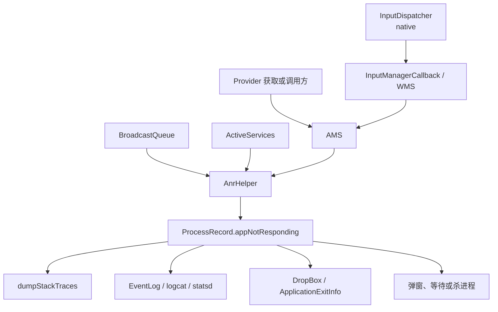
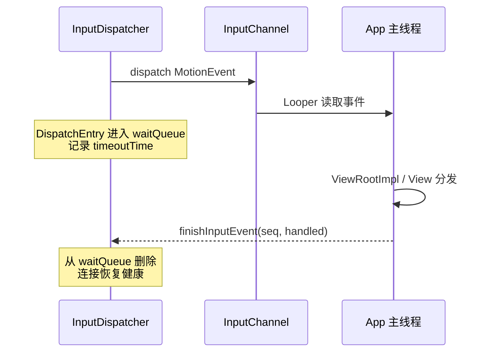
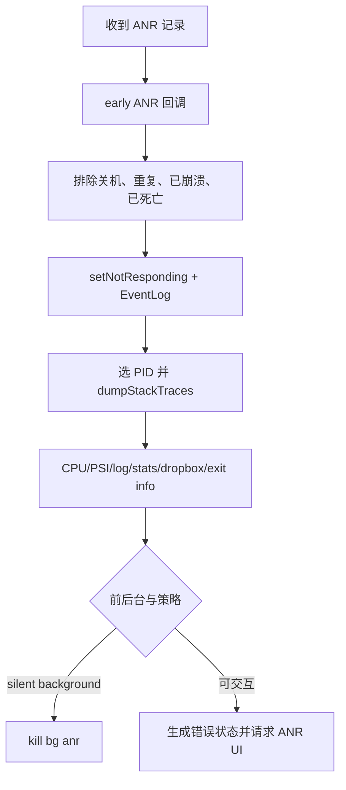

# 18 ANR 原理与系统诊断

> 源码版本：Android 11 / API 30 / `android-11.0.0_r48`  
> 学习方式：macOS 上只读源码，不要求编译 AOSP；命令均作为可选观察方法。  
> 前置章节：[15-AMS进程管理与LMKD](./15-AMS进程管理与LMKD.md)、[16-Broadcast广播注册与分发](./16-Broadcast广播注册与分发.md)、[17-Service与ContentProvider跨进程组件](./17-Service与ContentProvider跨进程组件.md)

---

## 1. 本章要解决什么问题

开发中看到 ANR，最常见的第一反应是：

> 主线程卡住超过 5 秒了。

这句话只覆盖一部分 Input ANR，而且仍不够准确。Android 中没有一个统一的“ANR 定时器”盯着所有应用，也不是所有超时都是 5 秒。

本章要建立下面这套模型：

```text
某个系统管理者发出一项有期限的工作
 → 记录“等待谁、等什么、截止到何时”
 → 截止时工作仍未完成
 → 确认责任进程和原因
 → 汇入 AMS 的 ANR 处理
 → 收集 Java/native 线程栈、CPU、内存压力、窗口状态
 → 写 log/event log/dropbox/退出历史
 → 前台可能弹窗，后台可能直接结束
```

学完后应能：

1. 区分 Input、Broadcast、Service、Provider 等 ANR 来源。
2. 解释“超时发现者”和“最终被报告进程”为什么可能不同。
3. 解释 InputDispatcher 的 `waitQueue` 与事件完成确认。
4. 从 Reason 判断应该先追哪条源码链。
5. 正确阅读 ANR traces，而不是只看主线程第一行。
6. 区分阻塞、死锁、CPU 饥饿、Binder 阻塞和系统整体压力。
7. 用时间线把“症状发生时刻”和“采栈时刻”分开。
8. 知道 `/data/anr`、DropBox、logcat、dumpsys 各自提供什么证据。

---

## 2. 一句话理解 ANR

ANR 是：

> 系统期待某个应用进程在限定时间内完成一项影响系统调度或用户交互的工作，但到期仍没有得到完成信号，于是把该进程标记为 Not Responding，并收集诊断现场。

三个关键词：

```text
期限：谁规定的 timeout？
完成：系统等待的完成信号是什么？
责任：最终把哪个 ProcessRecord 当作责任进程？
```

ANR 是系统观察到的结果，不直接等价于根因。根因可能是：

- 主线程执行慢代码。
- 主线程等锁，锁被工作线程持有。
- 主线程同步 Binder 调用，服务端卡住。
- Binder 线程池耗尽，调用无法被处理。
- 进程 CPU 被严重争抢。
- 大量 GC、内存抖动或 I/O。
- system_server 或底层服务整体变慢。
- 焦点窗口迟迟未建立。
- 回调已经完成，但完成通知链被阻塞。

因此诊断目标不是找到一个 `BLOCKED` 或 `nativePollOnce` 就结束，而是恢复等待关系。

---

## 3. 四类核心 ANR 对照表

| 类型 | 主要发现者 | Android 11 常见窗口 | 等待的“完成” | 常见 Reason 方向 |
|---|---|---:|---|---|
| Input | native InputDispatcher | 普通应用常见 5 秒 | 已投递输入被窗口消费并 finish；或焦点窗口出现 | input dispatching timed out / no focused window |
| Broadcast | BroadcastQueue | 前台队列 10 秒、后台队列 60 秒 | Receiver `finishReceiver`，包括 `goAsync()` 后完成 | Broadcast of Intent |
| Service | ActiveServices | 前台执行 20 秒、后台执行 200 秒 | create/start/bind/unbind/destroy 执行完成后 `serviceDoneExecuting` | executing service ... |
| Provider | AMS/客户端协作 | 获取/发布有独立期限；长业务调用也可主动上报 | Provider 发布，或客户端判定 Provider 调用卡死 | ContentProvider not responding |

这些是本工程 Android 11 默认值，不是跨版本 API 契约。还要注意：

- Input 的窗口可由 Activity/窗口配置决定，instrumentation 也可能使用更长值。
- Broadcast timeout 与“Receiver 一定可运行这么久”不是一回事。
- Service 的 `execServicesFg` 不等于已经显示通知的 foreground service。
- Provider publish/ready timeout 与 Provider 业务方法卡住是两类问题。

---

## 4. 总体架构：发现与处理分离



为什么要分离？

- 各组件最清楚“我在等什么”。
- AMS 最清楚进程、前后台、调试器、错误状态和全局进程列表。
- 采集线程栈可能很慢，不能长时间堵塞 InputDispatcher 或 AMS 主锁。

Android 11 使用 `AnrHelper` 排队消费 ANR 记录，由 `AnrConsumer` 线程执行较重的处理。

---

## 5. Input ANR 不是“点击后 5 秒没运行完”这么简单

输入大致经过：

```text
InputReader
 → InputDispatcher
 → Window 的 InputChannel
 → app 进程 NativeInputEventReceiver
 → ViewRootImpl / DecorView / View 分发
 → finishInputEvent
 → InputDispatcher 收到完成确认
```

InputDispatcher 关心的是某个 connection 上已投递事件是否长期留在等待队列，而不是直接读取 App 主线程的 Java 状态。



如果 App 主线程迟迟不读取，或读取后迟迟不 finish，事件会一直留在 `waitQueue`。

---

## 6. InputDispatcher 如何跟踪超时

核心文件：

```text
frameworks/native/services/inputflinger/dispatcher/InputDispatcher.cpp
frameworks/native/services/inputflinger/dispatcher/AnrTracker.cpp
frameworks/native/services/inputflinger/dispatcher/Entry.h
```

主要对象：

| 对象 | 作用 |
|---|---|
| Connection | 一个 InputChannel 连接及其状态 |
| DispatchEntry | 某次投递到目标连接的事件记录 |
| waitQueue | 已交给目标、尚未得到完成确认的事件 |
| timeoutTime | 该 DispatchEntry 的截止时间 |
| AnrTracker | 按最早到期时间跟踪 connection token |

可以把它想成快递回执：

```text
事件进入 waitQueue = 快递已送出，等待签收
finishInputEvent = 收到签收回执
超过 timeoutTime = 快递长期未签收，触发调查
```

这里的“未签收”不能直接推出是 `onTouchEvent()` 慢。主线程可能根本没机会取事件，也可能卡在之前的一条 Message。

---

## 7. 两种重要的 Input ANR

### 7.1 有窗口，但窗口不响应

`InputDispatcher::onAnrLocked(connection)` 会检查 `waitQueue`。若队列已经恢复为空，就不再上报；否则读取最老的未完成事件，形成类似原因：

```text
<input channel> is not responding.
Waited ...ms for <event description>
```

源码选择最老事件用于诊断，是因为应用通常线性处理输入；但注释也明确说，最老事件未必就是严格意义上“造成 timeout 的那一个”。

### 7.2 有 focused application，但没有 focused window

另一种情况不是某个窗口消费慢，而是系统已有聚焦应用，却迟迟没有可接收输入的聚焦窗口：

```text
<application> does not have a focused window
```

可能原因包括：

- Activity 启动/恢复链卡住。
- 窗口尚未 add 或 relayout 完成。
- 焦点切换期间目标窗口迟迟不可用。
- 应用主线程在建立窗口前被阻塞。

这时只盯着 `dispatchTouchEvent()` 会走错方向，应回看 Activity/Window 建立时间线。

---

## 8. Input ANR 从 native 到 Java Framework

简化链路：

```text
InputDispatcher::onAnrLocked
 → doNotifyAnrLockedInterruptible
 → InputDispatcherPolicyInterface::notifyAnr
 → InputManagerService.NativeImpl / callbacks
 → InputManagerCallback.notifyANR
 → ActivityRecord.keyDispatchingTimedOut（存在 Activity 时）
 → ActivityManagerInternal.inputDispatchingTimedOut
 → AnrHelper.appNotResponding
```

`doNotifyAnrLockedInterruptible()` 在调用 policy 前释放 InputDispatcher 自己的锁，避免重型上报链长期占住输入分发锁。

Policy 返回值还可以表示延长等待：

```text
timeoutExtension > 0
 → extendAnrTimeoutsLocked

timeoutExtension <= 0
 → cancelEventsForAnrLocked
```

所以“检测到一次到期”与“立即结束应用”之间仍有 Framework 策略层。

---

## 9. 为什么主线程没处理输入

### 情形 A：慢方法

```java
public void onClick(View v) {
    parseHugeJson();
    writeLargeDatabase();
}
```

主线程栈通常停在具体业务方法。

### 情形 B：等待 Java 锁

```text
main: BLOCKED waiting to lock <0x123>
worker: holds <0x123>, waiting for network/Binder/another lock
```

真正需要继续追持锁线程，而不是把责任停在 main 的 `synchronized` 行。

### 情形 C：同步 Binder 调用

```text
main
 → BinderProxy.transactNative
 → 等 system_server 或其他进程返回
```

客户端主线程只是等待者，根因可能在服务端 Binder 线程、服务端主线程或更下游进程。

### 情形 D：主线程消息排队

当前栈看似普通，但前面一条长 Message 占住 Looper，输入消息没有机会执行。

### 情形 E：CPU/系统压力

线程是 runnable，却很少得到调度；或系统处于高 PSI、频繁回收、严重 I/O wait。此时栈只是某个瞬间，必须结合 CPU 和时间线。

---

## 10. Broadcast ANR 回顾

有序/Manifest Receiver 投递时，BroadcastQueue 安排 timeout。完成信号是：

```text
同步 onReceive 返回
 → ActivityThread/ReceiverDispatcher 完成
 → finishReceiver

或者：
onReceive 调用 goAsync
 → 持有 PendingResult
 → 异步工作完成后 PendingResult.finish
 → finishReceiver
```

到期仍未完成时：

```text
BroadcastQueue.broadcastTimeoutLocked
 → 确认当前 BroadcastRecord/receiver
 → AnrHelper.appNotResponding
```

Android 11 默认：

```text
前台广播队列：10 秒
后台广播队列：60 秒
```

关键误区：`goAsync()` 只把完成责任交给 PendingResult，没有取消 timeout。

---

## 11. Broadcast 超时不一定等于 Receiver 方法正在栈顶

采栈发生在超时之后，可能看到：

- `onReceive()` 仍在主线程执行。
- 主线程已经返回，但异步任务忘记 `finish()`。
- 异步任务在工作线程等锁/Binder/I/O。
- 进程主线程被别的组件阻塞，Receiver 尚未开始。
- 完成 Binder 通知尚未被 system_server 处理。

所以要联合 Reason、BroadcastRecord、线程栈和时间戳，不能规定“主线程必须出现 onReceive 才算广播 ANR”。

---

## 12. Service ANR 回顾

ActiveServices 在安排以下回调前标记 Service 正在执行：

```text
onCreate
onStartCommand
onBind / onRebind / onUnbind
onDestroy
```

简化链路：

```text
bumpServiceExecutingLocked
 → ProcessRecord.executingServices 加入 ServiceRecord
 → scheduleServiceTimeoutLocked

App 回调完成
 → serviceDoneExecuting
 → serviceDoneExecutingLocked
 → 清除 executing 状态
```

超时：

```text
ActiveServices.serviceTimeout
 → 从 executingServices 查找超时 ServiceRecord
 → AnrHelper.appNotResponding
```

Android 11 默认：

```text
SERVICE_TIMEOUT = 20 秒
SERVICE_BACKGROUND_TIMEOUT = 200 秒
```

它是进程维度执行集合上的监控，不是为每个回调各开一个完全独立的秒表。

---

## 13. 前台服务 10 秒规则与 Service ANR 不要混为一谈

`startForegroundService()` 后，Service 必须尽快调用 `startForeground()`。Android 11 默认：

```text
SERVICE_START_FOREGROUND_TIMEOUT = 10 秒
```

这是“启动方式承诺未兑现”的超时；20/200 秒是 Service 生命周期执行未完成监控。

```text
10 秒：是否及时进入 foreground 状态并发布通知
20/200 秒：Service 生命周期执行是否及时完成
```

同一个故障可能同时接近多个期限，但 Reason 与源码入口不同。

---

## 14. ContentProvider 相关 ANR 要拆成两类

### 14.1 Provider 尚未发布

客户端通过 authority 获取 Provider，若目标进程不存在：

```text
AMS 启动 Provider 进程
 → 客户端等待 ContentProviderRecord.provider
 → 目标进程 installContentProviders
 → publishContentProviders
```

Android 11 本工程中：

```text
CONTENT_PROVIDER_PUBLISH_TIMEOUT_MILLIS = 10 秒
CONTENT_PROVIDER_READY_TIMEOUT_MILLIS = 20 秒
```

这类问题重点看进程 attach、Application/Provider 初始化和发布锁。

### 14.2 Provider 业务调用卡住

客户端已取得 `IContentProvider`，调用 query/insert/call 等时卡住。这里必须注意：**普通 ContentResolver 业务调用并不是一律到固定秒数就自动 ANR**。系统/特权调用方显式使用 `ContentProviderClient.setDetectNotResponding(timeoutMillis)` 时，客户端会安排检测 Runnable；到期后经 `ContentResolver.appNotRespondingViaProvider()`、`ActivityThread.appNotRespondingViaProvider()`，使用 Provider connection 告诉 AMS：宿主 Provider 进程长期无响应。这个 API 在 Android 11 是受 `REMOVE_TASKS` 权限约束的 System/Test API，不是普通第三方 App 可随意用于“杀 Provider”的公共接口。部分 Framework 自己的 Provider 调用也会安排专用检测，例如 AMS 获取 MIME type 时的保护逻辑。

简化链路：

```text
ContentProviderClient.setDetectNotResponding(timeout)
 → 业务 Binder 调用期间安排 NotRespondingRunnable
 → ContentResolver.appNotRespondingViaProvider
 → ContextImpl.ApplicationContentResolver
 → ActivityThread.appNotRespondingViaProvider
 → IActivityManager.appNotRespondingViaProvider
 → AMS 找到 ContentProviderConnection.host
 → AnrHelper.appNotResponding(host, "ContentProvider not responding")
```

这类问题重点看：

- 客户端调用线程是否同步等待 Binder。
- Provider 进程 Binder 线程在做什么。
- Provider 内部数据库锁、文件 I/O 或下游 Binder。
- stable/unstable connection 是否仍有效。
- 谁启用了超时检测，以及它配置的 `timeoutMillis`。

不要把“Provider 获取超时”和“query 太慢”当作同一条链。

---

## 15. AnrHelper 为什么单独使用消费线程

源码：

```text
frameworks/base/services/core/java/com/android/server/am/AnrHelper.java
```

调用者只需加入 `AnrRecord`：

```text
mAnrRecords.add(...)
 → startAnrConsumerIfNeeded
 → new AnrConsumerThread().start()
 → 逐条 ProcessRecord.appNotResponding
```

这样做有两个好处：

1. 触发者尽快返回，不被采栈拖住。
2. 多个 ANR 顺序处理，减少同时大规模 dump 对系统的冲击。

若一条 ANR 在队列中等待超过 1 分钟，Android 11 会认为全量现场可能已经过期，设置 `onlyDumpSelf`，只重点采集责任进程，避免系统雪上加霜。

这说明 traces 的时间不是绝对等于超时发生时间；系统极慢或多个 ANR 堆积时，两者可能相差明显。

---

## 16. ProcessRecord.appNotResponding 的完整阶段

核心路径可拆成七步：



源码文件：

```text
frameworks/base/services/core/java/com/android/server/am/ProcessRecord.java
```

### 16.1 先排除无意义的重复处理

会跳过：

- 系统正在关机。
- 同一进程已经处于 not responding。
- 进程正在 crash。
- 已被 AMS 杀死或已经死亡。

### 16.2 尽快记录身份和原因

写入：

```text
AM_ANR event log
processName / pid
activity component
Reason / annotation
```

### 16.3 再进行昂贵的现场采集

采集栈、CPU、PSI 等必须尽量在现场变化前进行，但它本身也会消耗时间和 CPU。

---

## 17. ANR 会采哪些进程

`ProcessRecord.appNotResponding()` 先构造 `firstPids`：

```text
责任进程 PID
可能的 parent process PID
system_server PID
persistent 进程
可能的 IME 等相关进程
```

其余候选放入 `lastPids`，可结合 CPU 排序后选择。还会准备部分 native 关键进程，例如系统 native 服务。

为什么不只采责任进程？

因为常见等待链是：

```text
app main
 → system_server Binder
 → native service
```

只看 App 会看到“我在等 Binder”，却看不到谁占住服务端。

但后台 silent ANR 或过期报告会缩小采集范围，以降低系统负担。

---

## 18. Java 栈如何生成

Android 11 的 `ActivityManagerService.dumpStackTraces()` 在 `/data/anr` 下创建 trace 文件，并协调 Java/native 进程 dump。

概念链：

```text
AMS 选择 PID
 → 请求目标 runtime dump Java threads
 → ART 响应 SIGQUIT/诊断请求
 → 数据通过 tombstoned intercept 管道
 → 写入 /data/anr/anr_时间戳
```

若 trace 文件创建或 dump 失败，源码有 fallback：向责任 PID 发送 `SIGNAL_QUIT`，至少尝试把线程信息输出到日志路径。

不要把现代版本简单描述成“所有东西永远追加到 `/data/anr/traces.txt`”。Android 11 使用 `/data/anr` 目录下按事件生成/管理的文件，并保留数量上限。

---

## 19. traces 文件的基本结构

一个 Java 进程段通常包含：

```text
----- pid 1234 at 2026-... -----
Cmd line: com.example.app
Build fingerprint: ...

"main" prio=5 tid=1 ...
  | group="main" ...
  | sysTid=1234 ...
  at ...

"Binder:1234_1" ...
"ReferenceQueueDaemon" ...
"FinalizerDaemon" ...
...
----- end 1234 -----
```

第一步先确认：

```text
PID 是否匹配 Reason 中的责任进程？
Cmd line 是否是目标进程，而不是同包另一个 :remote 进程？
采集时间离 ANR 时间有多远？
```

选错进程段，后面分析得再细也没有意义。

---

## 20. Java 线程状态怎么读

### RUNNABLE

在 Java traces 中表示线程可运行或正在 native 执行，不等于它一直占满 CPU。例：

```text
main RUNNABLE
  at android.os.BinderProxy.transactNative(Native method)
```

它可能正在同步 Binder 等待。

### BLOCKED

等待进入 Java monitor：

```text
main waiting to lock <0xabc>
worker locked <0xabc>
```

继续找持锁者。

### WAITING / TIMED_WAITING

可能在 `Object.wait()`、`Thread.join()`、条件变量或带期限等待。等待本身未必异常，关键看谁应该唤醒它，以及为什么关键线程在等待。

### nativePollOnce

主线程位于：

```text
MessageQueue.nativePollOnce
 → MessageQueue.next
 → Looper.loop
```

通常表示采栈瞬间 Looper 正在等消息，并不能单独证明“主线程完全正常”。可能超时工作此前刚结束，也可能责任在异步 PendingResult、无焦点窗口或其他线程。

---

## 21. 锁等待分析：沿所有权追到尽头

示例：

```text
"main"
  waiting to lock <0x111> held by thread 23

"worker-1" tid=23
  locked <0x111>
  waiting to lock <0x222> held by thread 31

"Binder:1234_4" tid=31
  locked <0x222>
  at BinderProxy.transactNative
```

正确分析：


错误分析是只写“主线程锁竞争”。正确结论应明确：锁链终点在哪里、哪个线程为什么迟迟不能释放。

---

## 22. Binder 等待分析

看到：

```text
BinderProxy.transactNative
```

至少回答四个问题：

1. 哪个线程发起同步调用？
2. 调用目标是哪个服务/进程？
3. 服务端 Binder 线程是否正在执行对应方法？
4. 服务端是否又同步调用回客户端，形成环形等待？

典型死锁：

```text
App main 持锁 A
 → 同步 Binder 调 system_server
system_server Binder 线程
 → 回调 App Binder
App Binder 线程
 → 等锁 A
```

主线程不返回，所以 A 不释放；回调拿不到 A，所以 system_server 不返回。解决思路不是“增加 timeout”，而是打断持锁跨 Binder 的环。

---

## 23. Binder 线程池耗尽

如果服务端所有 Binder 线程都被长调用占住，新事务只能排队。表现可能是：

- 多个客户端同时停在 `BinderProxy.transactNative`。
- 服务端多个 `Binder:<pid>_*` 栈高度相似。
- 服务端线程都在等同一个锁、I/O 或下游 Binder。
- App 主线程自身没有明显重计算。

此时责任表面出现在客户端，瓶颈却在服务端并发模型。

检查时不要只看 `main`，应把所有 Binder 线程按栈顶分类计数。

---

## 24. CPU、负载与 PSI 的作用

ANR 报告会附带 CPU load、进程 CPU 状态，并加入 `MemoryPressureUtil.currentPsiState()`。

### 高 CPU

若责任进程单核或多核占用很高，结合 RUNNABLE 栈找热点循环、序列化、布局、图片处理等。

### 责任进程 CPU 很低

可能在：

- 等锁。
- 等 Binder。
- 等 I/O。
- 长时间得不到调度。

### 全系统 CPU 很高

应用未必是唯一根因。需要看 system_server、surfaceflinger、媒体进程或其他 App。

### PSI 高

PSI 表达一段时间内任务因 CPU、内存或 I/O 资源不足而停滞的压力。它比单个瞬时 CPU 百分比更适合说明“整个系统是不是在喘不过气”。

---

## 25. GC 与内存压力怎样导致 ANR

GC 不应被简单等价为 ANR 根因。要判断：

- 是否频繁分配大对象。
- GC pause 是否真的覆盖关键时间窗口。
- 是否发生 heap thrashing，回收后很快再次分配。
- 是否伴随 LMKD、swap、compaction 或高 memory PSI。
- 栈中是否有大规模 Bitmap、JSON、Cursor materialize 等。

单次短 GC 通常不足以解释 5 秒以上超时；连续暂停、分配抖动和系统内存压力组合才更可疑。

---

## 26. traces 是采样，不是录像

这是本章最重要的诊断原则之一：

```text
T0：系统开始计时
T1：真正的阻塞发生
T2：timeout 到期
T3：ANR 记录进入 AnrHelper 队列
T4：开始采栈
T5：采到 main 栈
```

T4/T5 看到的状态未必等于 T1。可能：

- 慢操作刚好在采栈前结束。
- 锁的持有者已经换了。
- 多个 ANR 排队导致采集延迟。
- 责任线程已进入下一项工作。

因此要用 logcat 时间戳、trace header、Reason 和业务埋点拼接时间线。

---

## 27. Reason 是诊断入口，不是最终结论

常见格式：

```text
Reason: Input dispatching timed out (...)
Reason: Broadcast of Intent { act=... }
Reason: executing service ...
Reason: ContentProvider not responding
```

Reason 告诉你：

- 哪个监督者发现超时。
- 当时等待的组件或窗口。
- 初步责任进程。

Reason 不直接告诉你：

- 最底层阻塞线程。
- 是业务 bug 还是系统资源压力。
- 远端 Binder 服务为什么没返回。

正确顺序是先用 Reason 选链路，再用栈和系统证据追根因。

---

## 28. 前台 ANR 与 silent background ANR

`ProcessRecord.isSilentAnr()` 会结合后台展示设置和进程是否对用户重要进行判断。

默认情况下，纯后台且不值得展示的 ANR 可能：

- 缩小 traces 采集范围。
- 不展示用户对话框。
- 直接以 `bg anr` 原因结束进程。

前台或用户可感知进程则可能进入 ANR UI，让用户等待或关闭。

所以“没有看到 ANR 弹窗”不等于没有发生 ANR。生产环境更应看退出历史、平台上报、DropBox 和 event log。

---

## 29. DropBox、EventLog、Stats 与退出历史

一次 ANR 会散落到多个证据源：

| 证据 | 用途 |
|---|---|
| main/system logcat | `ANR in`、Reason、CPU、处理过程 |
| events buffer | `am_anr` 结构化事件 |
| `/data/anr/anr_*` | Java/native 线程栈主体 |
| DropBox `data_app_anr` 等 | 汇总错误报告和部分现场 |
| statsd | ANR_OCCURRED 统计维度 |
| ApplicationExitInfo | 进程退出原因、ANR trace 关联 |
| dumpsys activity/window/input | 最近 ANR 与组件、窗口、输入状态 |

它们不是重复副本：trace 擅长等待链，logcat 擅长时间线，dumpsys 擅长系统对象状态，退出历史擅长生产环境事后确认。

---

## 30. 可选 adb 观察命令

本课程不要求连接设备。若以后有 userdebug/可访问设备，可参考：

```bash
adb logcat -b main -b system -b events -v threadtime
adb shell dumpsys activity lastanr
adb shell dumpsys activity lastanr-traces
adb shell dumpsys window lastanr
adb shell dumpsys input
adb shell dumpsys activity processes
adb shell dumpsys activity broadcasts
adb shell dumpsys activity services
adb shell dumpsys dropbox --print data_app_anr
```

访问 `/data/anr` 通常需要 root、userdebug 或 bugreport 权限条件；普通量产设备不能假设可直接 `adb pull`。

Android 11 还可以从应用侧使用 `ActivityManager.getHistoricalProcessExitReasons()` 获取 `ApplicationExitInfo`，但可见范围和 trace 访问受权限与系统策略限制。

---

## 31. 一套可靠的 ANR 分析顺序

### 第一步：确认身份

```text
时间、包名、进程名、PID、前后台、Android 版本
```

### 第二步：读 Reason

先分类 Input/Broadcast/Service/Provider，不急着翻所有线程。

### 第三步：画超时时间线

标记触发、截止、采栈、进程结束时刻。

### 第四步：看责任进程 main

判断运行、等锁、等 Binder、Looper idle，但不在这里过早结案。

### 第五步：追依赖

```text
锁 → 找持有者
Binder → 找远端
Future/join → 找生产者
I/O → 找文件、数据库或设备
```

### 第六步：看 Binder 线程和工作线程

按相似栈聚类，检查线程池耗尽与环形依赖。

### 第七步：看系统背景

CPU、PSI、GC、LMKD、system_server、窗口和 InputDispatcher 状态。

### 第八步：形成可证伪结论

不要写“可能是主线程卡顿”。应写：

```text
InputDispatcher 等待窗口 X 的 MotionEvent 完成 5.x 秒；
App main 同步 Binder 调用服务 Y；
Y 的 Binder 线程等待数据库锁 L；
工作线程 Z 持有 L 并进行慢 I/O。
```

---

## 32. 五种典型案例

### 案例一：主线程做数据库迁移

证据：Input Reason；main 栈在 SQLite DDL；CPU/I/O 与迁移时间吻合。

结论：窗口事件不能被及时消费，根因是主线程同步数据库迁移。

### 案例二：goAsync 忘记 finish

证据：Broadcast Reason；main 已回到 Looper；后台任务已结束或异常退出；PendingResult 没有 finish。

结论：不是当前主线程慢，而是广播完成协议未闭环。

### 案例三：Service onCreate 等 Future

证据：Service Reason；main 在 `FutureTask.get`；工作线程等主线程 Handler 回调。

结论：主线程与工作线程互等，形成逻辑死锁。

### 案例四：Provider 数据库锁

证据：客户端线程在 BinderProxy；Provider 多个 Binder 线程等数据库锁；Provider worker 持锁做网络或大事务。

结论：Provider 并发设计导致 Binder 线程池阻塞。

### 案例五：无焦点窗口

证据：Reason 为 no focused window；main 卡在 Activity 初始化；窗口尚未 add/获得焦点。

结论：不是已存在窗口的 input callback 慢，而是窗口建立链没有及时完成。

---

## 33. 常见误区纠正

### 误区 1：所有 ANR 都是 5 秒

错误。不同监督者有不同期限，且版本/场景可调整。

### 误区 2：ANR 就是主线程死锁

错误。慢执行、Binder、锁、CPU 饥饿、系统压力、完成协议丢失都可能触发。

### 误区 3：main 在 nativePollOnce 说明应用无辜

错误。trace 是延迟采样，也可能是异步 Receiver 未 finish 或无焦点窗口问题。

### 误区 4：main 是 RUNNABLE 就一直在消耗 CPU

错误。Java 状态不能直接替代调度与 CPU 数据。

### 误区 5：看到 BinderProxy 就是 system_server 的 bug

错误。先识别 Binder 目标和完整下游等待链。

### 误区 6：goAsync 可以无限执行

错误。它延迟完成回报，不取消广播超时。

### 误区 7：没有弹窗就没有 ANR

错误。后台 silent ANR 可直接杀进程。

### 误区 8：只分析责任 App 的 traces 就够了

错误。远端 Binder、system_server 或 native 服务可能是阻塞终点。

### 误区 9：增加 timeout 能解决 ANR

通常只是延迟症状；必须修复慢操作、锁顺序、线程模型或依赖环。

### 误区 10：`/data/anr/traces.txt` 是所有版本固定路径

错误。Android 11 主要使用 `/data/anr/anr_*` 事件文件，设备实现和权限也有差异。

---

## 34. 源码阅读路线一：Input ANR

按顺序打开：

```text
frameworks/native/services/inputflinger/dispatcher/InputDispatcher.cpp
  processAnrsLocked
  onAnrLocked
  doNotifyAnrLockedInterruptible
  extendAnrTimeoutsLocked

frameworks/base/services/core/java/com/android/server/input/InputManagerService.java
  notifyANR

frameworks/base/services/core/java/com/android/server/wm/InputManagerCallback.java
  notifyANR / notifyANRInner

frameworks/base/services/core/java/com/android/server/wm/ActivityRecord.java
  keyDispatchingTimedOut
```

阅读时记录：

```text
connection token
waitQueue oldest entry
reason
window PID
policy 返回的 timeout extension
```

---

## 35. 源码阅读路线二：组件 ANR

### Broadcast

```text
BroadcastQueue.setBroadcastTimeoutLocked
BroadcastQueue.broadcastTimeoutLocked
BroadcastQueue.finishReceiverLocked
```

### Service

```text
ActiveServices.bumpServiceExecutingLocked
ActiveServices.scheduleServiceTimeoutLocked
ActiveServices.serviceTimeout
ActiveServices.serviceDoneExecutingLocked
```

### Provider

```text
ActivityManagerService.getContentProviderImpl
ActivityManagerService.publishContentProviders
ContentProviderClient.setDetectNotResponding
ContextImpl.ApplicationContentResolver.appNotRespondingViaProvider
ActivityThread.appNotRespondingViaProvider
ActivityManagerService.appNotRespondingViaProvider
```

每条链都回答：计时在哪里开始、完成在哪里取消、timeout 消息带什么对象、最终选哪个进程。

---

## 36. 源码阅读路线三：统一处理

```text
frameworks/base/services/core/java/com/android/server/am/AnrHelper.java
 → appNotResponding
 → AnrConsumerThread

frameworks/base/services/core/java/com/android/server/am/ProcessRecord.java
 → appNotResponding
 → isSilentAnr
 → makeAppNotRespondingLocked

frameworks/base/services/core/java/com/android/server/am/ActivityManagerService.java
 → dumpStackTraces
 → addErrorToDropBox
```

建议把 `ProcessRecord.appNotResponding()` 按“校验、选 PID、采集、记录、策略”五段标注，不要从头到尾逐行背。

---

## 37. 八组只读练习

### 练习一：画 Input 回执链

从 DispatchEntry 进入 waitQueue 开始，追到 finish 后移除，标注 native/app 边界。

### 练习二：比较两种 Input ANR

分别记录 connection ANR 和 no focused window ANR 的 Reason、责任对象和源码入口。

### 练习三：追 Broadcast timeout 生命周期

找出 timeout message 安排、替换、取消和触发位置，再解释 `goAsync()` 为什么仍受约束。

### 练习四：追 Service executingServices

记录 create/start/bind 前如何加入，完成后如何移除，20/200 秒怎样选择。

### 练习五：拆 Provider 两类超时

分别画“冷启动等待发布”和“已发布 Provider 业务调用卡住”。

### 练习六：标注 ANR 采集阶段

在 `ProcessRecord.appNotResponding()` 中标出 firstPids、lastPids、nativePids、CPU、DropBox 和 UI 决策。

### 练习七：手工分析锁链

任选一份公开或自造 traces，写出 `main → 持锁者 → 下游 Binder` 的有向图。

### 练习八：写诊断结论

使用模板：

```text
现象：
监督者与 Reason：
超时窗口：
责任进程/线程：
等待对象：
依赖链终点：
CPU/PSI/GC 旁证：
根因：
修复方向：
仍需验证：
```

---

## 38. 自测题

1. 为什么不能说所有 ANR 都是主线程卡 5 秒？
2. InputDispatcher 的 waitQueue 表达什么？
3. no focused window 与普通窗口不响应有什么不同？
4. Input ANR 为什么从 native InputDispatcher 上报？
5. `goAsync()` 后谁负责发送广播完成信号？
6. Service 的 20/200 秒依据什么语义选择？
7. foreground service 10 秒规则与 Service execution timeout 有何区别？
8. Provider 获取超时与 query 卡住有什么区别？
9. AnrHelper 为什么不直接在触发线程完成所有 dump？
10. 为什么采栈时 main 可能已经回到 Looper？
11. `BLOCKED` 状态下一步应该查什么？
12. 看到 BinderProxy.transactNative 后要继续回答哪些问题？
13. silent background ANR 为什么可能没有弹窗？
14. traces、logcat、dumpsys 各擅长提供什么证据？
15. 为什么 timeout 到期时间与 trace 时间必须分开？

### 参考答案

1. ANR 由多个监督者按不同协议和期限触发，5 秒只覆盖常见 Input 场景。
2. 已投递给连接但尚未收到 finish 确认的输入事件。
3. 前者是聚焦应用没有可接收输入的窗口，后者是已有连接中的事件长期未完成。
4. 输入分发和回执跟踪就在 native InputDispatcher，它最先知道 connection 到期。
5. 持有 PendingResult 的异步代码必须调用 `finish()`。
6. ActiveServices 对进程 executingServices 的执行上下文使用前台或后台窗口；不简单等于通知状态。
7. 10 秒检查是否及时 `startForeground()`；20/200 秒监控生命周期执行是否完成。
8. 前者等待进程安装并 publish，后者已取得 Binder 后业务调用无响应。
9. dump 很重；异步队列避免堵塞触发者并限制并发采集压力。
10. trace 是 timeout 后的采样，阻塞可能已结束或责任原本就在异步线程。
11. 找 monitor 的持有者，并继续追它正在等待谁。
12. 调用者、目标服务/进程、服务端处理线程、是否存在下游或回调环。
13. 系统默认可吞掉不面向用户的后台 ANR，记录后直接杀进程。
14. traces 看线程等待链，logcat 拼时间线，dumpsys 看系统管理对象和最近状态。
15. 否则会把采样瞬间误认为触发瞬间，导致错误归因。

---

## 39. 本章源码地图

```text
Input 发现：
frameworks/native/services/inputflinger/dispatcher/InputDispatcher.cpp
frameworks/native/services/inputflinger/dispatcher/AnrTracker.cpp
frameworks/native/services/inputflinger/dispatcher/Entry.h

Input policy：
frameworks/base/services/core/java/com/android/server/input/InputManagerService.java
frameworks/base/services/core/java/com/android/server/wm/InputManagerCallback.java
frameworks/base/services/core/java/com/android/server/wm/ActivityRecord.java

组件 timeout：
frameworks/base/services/core/java/com/android/server/am/BroadcastQueue.java
frameworks/base/services/core/java/com/android/server/am/ActiveServices.java
frameworks/base/services/core/java/com/android/server/am/ActivityManagerService.java
frameworks/base/core/java/android/app/ActivityThread.java

统一处理与现场：
frameworks/base/services/core/java/com/android/server/am/AnrHelper.java
frameworks/base/services/core/java/com/android/server/am/ProcessRecord.java
frameworks/base/services/core/java/com/android/server/am/AppErrors.java
frameworks/base/services/core/java/com/android/server/am/AppNotRespondingDialog.java
frameworks/base/core/java/android/app/ApplicationExitInfo.java
```

---

## 40. 最终记忆图


请记住：

1. ANR 是多种监督协议的共同结果，不是单一 5 秒定时器。
2. Reason 决定先读哪条链，traces 帮你沿等待关系追根因。
3. 主线程是重要入口，但锁持有者、Binder 服务端和系统压力同样重要。
4. trace 是 timeout 后的采样，必须结合时间线。
5. 好的诊断结论应说清“谁等谁、为什么没完成”，而不只是“主线程卡了”。
