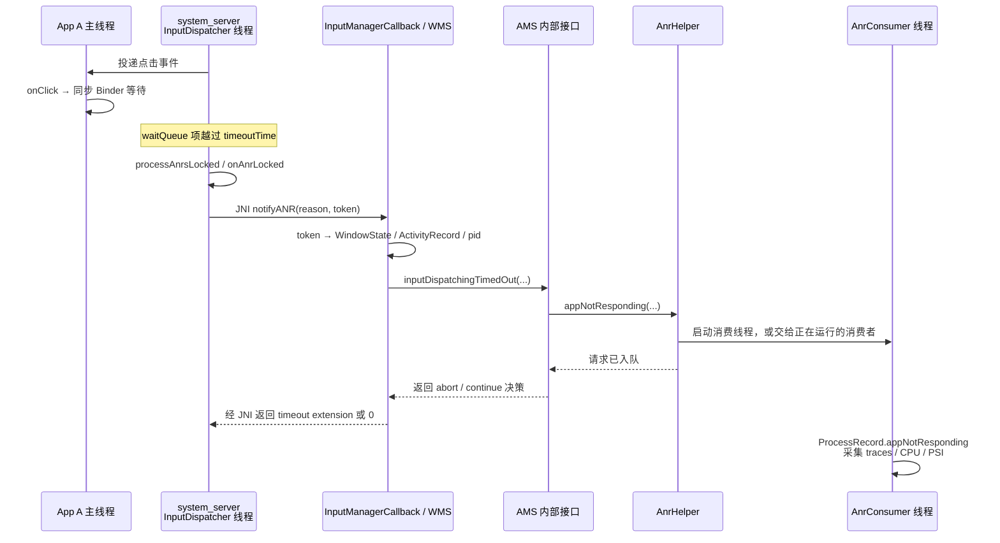

# 18 ANR 与系统诊断：从超时现场还原真正等待链

> 源码基线：Android 11 / API 30 / `android-11.0.0_r48`
> 学习方式：macOS 上静态阅读源码，不要求编译或运行 AOSP。

一次点击后，前台 App 的主线程进入同步 Binder 调用，远端服务迟迟没有回复。大约几秒后系统报告 `Input dispatching timed out`。你打开 ANR traces，主线程只停在 `BinderProxy.transactNative()`——到底该改客户端、服务端，还是持锁的第三条线程？

**一句话结论：ANR 表示某个系统管理者没有按时收到“完成信号”，并不直接等于主线程执行了慢代码；正确排查方式是从超时原因出发，把“谁在等谁”一直追到最后一个仍能向前推进的线程。**

本章解决三个实际问题：

- Input ANR 的 5 秒从哪里来，系统究竟在等待什么；
- 为什么 ANR 主线程栈经常只是等待者，不是根因；
- 如何区分超时触发时刻与 traces 采集时刻，并据此恢复等待链。

贯穿全文的唯一场景是：用户点击 `Activity A` 的按钮，`onClick()` 同步调用一个远端 Binder 服务；服务端 Binder 线程又在等待一把由工作线程持有的锁。点击事件迟迟没有完成回执，最终形成 Input ANR。Broadcast、Service 等其他 ANR 只在一张对比表中界定，不展开成百科。

## 1. ANR 真正要排查的不是“哪一行慢”，而是“哪条期限没完成”

先看这个场景的等待关系：

```text
InputDispatcher 等 Activity A 返回输入完成回执
└── A 的 main 等同步 Binder reply
    └── 远端服务 Binder 线程等 Java 锁 L
        └── 工作线程持有 L，正在执行慢 I/O
```

系统最先能确定的是：A 的窗口没有按时确认输入。因此被报告为 ANR 的通常是前台 UI 进程 A。系统此时并不知道最底层的慢 I/O 才是业务根因。

主线程栈若显示 `BinderProxy.transactNative()`，只能先证明“采栈那一刻，main 正在 Binder native 入口里”。同步与 oneway 都会经过这里；必须再看上方最近的 `Stub.Proxy.xxx()`，并核对 AIDL 或生成 Proxy 使用的 flags。确认不是 `FLAG_ONEWAY` 后，才能说 main 正在等待同步 reply。即使确认同步，它仍不能单独回答：

- 请求发给了哪个进程；
- 服务端 Binder 线程正在执行、排队，还是又切到了 Handler；
- 服务端是否在等锁、磁盘、网络或另一笔 Binder；
- 采栈前真正的慢操作是否已经结束。

所以每份 ANR 至少要先写出三个问题：

| 问题 | 本章场景的答案 |
|---|---|
| 谁规定期限 | native `InputDispatcher`，期限来自目标窗口/应用的 dispatch timeout |
| 等待什么完成 | 已投递输入事件的 finish/ack，使它离开 connection 的 `waitQueue` |
| 谁先被归责 | 超时 InputChannel 对应的窗口进程，也就是 Activity A 所在进程 |

这三个答案描述“系统为何报 ANR”；继续追 Binder 和锁，才是在解释“为什么没按时完成”。

## 2. 常说的 5 秒，是怎样变成一条输入截止线的

Android 11 r48 在 InputDispatcher 中定义了 5 秒兜底值：

`frameworks/native/services/inputflinger/dispatcher/InputDispatcher.cpp`

```cpp
// Default input dispatching timeout if there is no focused application or paused window
// from which to determine an appropriate dispatching timeout.
constexpr std::chrono::nanoseconds DEFAULT_INPUT_DISPATCHING_TIMEOUT = 5s;

nsecs_t InputDispatcher::getDispatchingTimeoutLocked(const sp<IBinder>& token) {
    sp<InputWindowHandle> window = getWindowHandleLocked(token);
    if (window != nullptr) {
        return window->getDispatchingTimeout(
                DEFAULT_INPUT_DISPATCHING_TIMEOUT).count();
    }
    return DEFAULT_INPUT_DISPATCHING_TIMEOUT.count();
}
```

这段代码证明“普通值常见为 5 秒”，也同时证明它不是所有场景都写死为 5 秒：有窗口时优先读取窗口携带的 timeout，没有合适窗口值时才使用 native 默认值。

Framework 一侧的普通值也是 5 秒；`WindowProcessController` 在按进程查询时，对正在 instrumentation 或使用 wrapper 的进程返回 60 秒：

`frameworks/base/services/core/java/com/android/server/wm/ActivityTaskManagerService.java` 与 `frameworks/base/services/core/java/com/android/server/wm/WindowProcessController.java`

```java
public static final int KEY_DISPATCHING_TIMEOUT_MS = 5 * 1000;
static final int INSTRUMENTATION_KEY_DISPATCHING_TIMEOUT_MS = 60 * 1000;

public long getInputDispatchingTimeout() {
    synchronized (mAtm.mGlobalLock) {
        return isInstrumenting() || isUsingWrapper()
                ? INSTRUMENTATION_KEY_DISPATCHING_TIMEOUT_MS
                : KEY_DISPATCHING_TIMEOUT_MS;
    }
}
```

但不能因此断言“所有 instrumentation 窗口一定是 60 秒”。`ActivityRecord` 首次挂到 Task 时才保存这个值；如果当时尚未关联进程，查询会回退到 5 秒，之后也没有一条通用逻辑保证重新赋值。`InputMonitor` 再把记录中的值写入 `InputWindowHandle.dispatchingTimeoutNanos`。所以真实计时应以对应窗口最终携带的 timeout 为准，5/60 秒只是本版重要配置分支。

### 截止线从事件成功投递时开始

事件发布给 App 时，InputDispatcher 记录投递时刻与截止时刻。下面把事件 publish 前后的关键行放在一起，中间明确省略了按键/触摸各自的 publish 分支：

```cpp
dispatchEntry->deliveryTime = currentTime;
const nsecs_t timeout = getDispatchingTimeoutLocked(
        connection->inputChannel->getConnectionToken());
dispatchEntry->timeoutTime = currentTime + timeout;

// 中间省略 publishKeyEvent / publishMotionEvent 等分支
connection->waitQueue.push_back(dispatchEntry);
if (connection->responsive) {
    mAnrTracker.insert(dispatchEntry->timeoutTime,
            connection->inputChannel->getConnectionToken());
}
```

正常情况下，App 处理完事件后发送完成回执，InputDispatcher 会从 `waitQueue` 删除对应记录，并从 `mAnrTracker` 删除它的 timeout。源码在这之后还会依据 `restartEvent` 决定重投或释放记录，这里只保留“取消超时跟踪”的证据：

```cpp
dispatchEntryIt = connection->findWaitQueueEntry(seq);
if (dispatchEntryIt != connection->waitQueue.end()) {
    dispatchEntry = *dispatchEntryIt;
    connection->waitQueue.erase(dispatchEntryIt);
    mAnrTracker.erase(dispatchEntry->timeoutTime,
            connection->inputChannel->getConnectionToken());
    // 后续省略：更新 responsive，并按 restartEvent 重投或 release
}
```

在本章场景中，触发 `onClick()` 的输入事件已经交给 A；`onClick()` 中的同步 Binder 不返回，输入分发流程就无法走到 finish，记录持续留在 `waitQueue`。

因此更准确的说法是：

```text
普通窗口通常允许一次已投递输入等待约 5 秒完成回执；
到期检查仍发现回执缺失，才进入 Input ANR 上报链。
```

5 秒是截止阈值，不是“第 5000 毫秒一定弹出 ANR 对话框”的承诺。线程调度、策略回调、ANR 排队和现场采集都会让用户看到的时间更晚；策略还可能要求 InputDispatcher 延长等待。

## 3. 超时怎样从 InputDispatcher 走到 AMS

InputDispatcher 自己不负责弹框，也不直接遍历 Java 进程。它只负责发现最早过期的 connection，并把原因交给 Framework 策略层。

`processAnrsLocked()` 的核心判断是：

```cpp
nextAnrCheck = std::min(nextAnrCheck, mAnrTracker.firstTimeout());
if (currentTime < nextAnrCheck) {
    return nextAnrCheck;
}

sp<Connection> connection =
        getConnectionLocked(mAnrTracker.firstToken());
connection->responsive = false;
mAnrTracker.eraseToken(connection->inputChannel->getConnectionToken());
onAnrLocked(connection);
```

`onAnrLocked(connection)` 会确认 `waitQueue` 仍不为空，用最老的未完成事件生成 reason，并保存当时的 InputDispatcher 状态。源码也提醒：若窗口 timeout 中途变化，最老事件未必严格等于最先越过新期限的事件；选择它是因为应用通常按顺序处理输入，它最有诊断价值。

完整上报主线如下：



这里有三处锁边界值得认识：

1. `doNotifyAnrLockedInterruptible()` 在调用 `mPolicy->notifyAnr()` 前释放 InputDispatcher 的 native `mLock`，回调结束后才重新加锁，避免重型 Framework 处理长期堵住输入分发锁。
2. `InputManagerCallback.preDumpIfLockTooSlow()` 在取得 WMS `mGlobalLock` 前运行；随后代码持锁把 InputChannel token 映射成 `WindowState`、`ActivityRecord` 和 pid，并执行 `saveANRStateLocked()` 保存 WM 现场。锁释放后才调用 ATMS/AMS。源码甚至留有缩小这段锁范围的 TODO，因此不能把它保证成“只短暂持锁”。
3. `AnrHelper` 只在小范围内锁住 `mAnrRecords` 完成入队，昂贵的栈采集交给独立的 `AnrConsumer` 线程。

释放 native `mLock` 不等于这条回调已经异步结束：InputDispatcher 的 policy 回调线程仍同步等待 `notifyANR()` 返回，直到 AnrHelper 完成入队并得到 abort/extend 决策；真正昂贵的 traces 采集才由消费者线程继续。

从进程和线程看，本章链路是：

| 阶段 | 进程 / 线程 |
|---|---|
| 输入计时与超时发现 | system_server / native InputDispatcher 线程 |
| JNI、WMS 归责、调用 AMS 内部接口 | 仍在 system_server，主要沿 InputDispatcher 回调线程同步前进 |
| 重型 ANR 处理与 traces 采集 | system_server / Java `AnrConsumer` 线程 |
| 被报告时的 A | App A / 主线程正等待 Binder reply |

这条路径在 system_server 内主要是 JNI 和内部对象调用，不是每一步都重新走一次跨进程 Binder。

### 为什么策略可能继续等

`InputManagerCallback.notifyANR()` 会返回一个新的纳秒级 timeout。返回值大于 0 时，InputDispatcher 调用 `extendAnrTimeoutsLocked()` 继续等待；返回 0 时取消该 connection 的事件。比如 AMS 检测到进程正在被调试时，可以拒绝立即中止输入分发。

因此“某个 `timeoutTime` 已到”是进入策略判断的触发条件，不必然等于此刻已经完成弹框或杀进程。

## 4. traces 为什么不是超时瞬间的录像

ANR 诊断至少包含三个不同时间点：

```text
T_deadline：InputDispatcher 发现完成回执超时，保存输入状态与 reason
T_enqueue ：AMS 调用 AnrHelper，创建带时间戳的 AnrRecord
T_dump    ：AnrConsumer 取出记录，ProcessRecord 开始采集线程栈
```

`AnrHelper` 的实现直接体现了“先入队，再慢处理”：

`frameworks/base/services/core/java/com/android/server/am/AnrHelper.java`

```java
void appNotResponding(ProcessRecord anrProcess,
        String activityShortComponentName, ApplicationInfo aInfo,
        String parentShortComponentName, WindowProcessController parentProcess,
        boolean aboveSystem, String annotation) {
    synchronized (mAnrRecords) {
        mAnrRecords.add(new AnrRecord(anrProcess,
                activityShortComponentName, aInfo, parentShortComponentName,
                parentProcess, aboveSystem, annotation));
    }
    startAnrConsumerIfNeeded();
}
```

入队后再按需创建消费线程：

```java
private void startAnrConsumerIfNeeded() {
    if (mRunning.compareAndSet(false, true)) {
        new AnrConsumerThread().start();
    }
}
```

`AnrRecord.mTimestamp` 记录入队时的 `SystemClock.uptimeMillis()`。消费线程真正开始时会计算 `reportLatency`；如果一条报告已经排队超过 1 分钟，Android 11 会认为其他进程现场可能过旧，只 dump 被报告进程自身，减轻系统负担。

`ProcessRecord.appNotResponding()` 才进入主要现场采集。下面是结构化摘录，中间省略了关机、重复 ANR、进程已死亡等提前返回分支：

`frameworks/base/services/core/java/com/android/server/am/ProcessRecord.java`

```java
long anrTime = SystemClock.uptimeMillis();
if (isMonitorCpuUsage()) {
    mService.updateCpuStatsNow();
}
synchronized (mService) {
    setNotResponding(true);
    EventLog.writeEvent(EventLogTags.AM_ANR, userId, pid,
            processName, info.flags, annotation);
    firstPids.add(pid);
    // 前台且非过期报告还会选择其他相关进程
}
```

随后它调用：

```java
File tracesFile = ActivityManagerService.dumpStackTraces(
        firstPids,
        isSilentAnr ? null : processCpuTracker,
        isSilentAnr ? null : lastPids,
        nativePids, tracesFileException, offsets);
```

Android 11 r48 把每次主 ANR dump 写入 `/data/anr/anr_<时间戳>`，不是永远写同一个 `/data/anr/traces.txt`。`dumpStackTraces()` 对整轮栈采集设置 20 秒总预算，并优先采集被报告 pid。

对于前台、非过期报告，系统还可能加入 parent、system_server、persistent/类似 Activity 的进程，并根据 CPU 情况从候选进程中挑一部分。但这不保证本章的远端业务服务一定出现在同一份 traces：如果它只是低 CPU 地等锁，它未必被选中。

于是出现两个重要结论：

- T_dump 时 main 还在 Binder 等待：栈能证明等待状态，但仍要去服务端找下一环。
- T_dump 前 Binder 已经返回：main 栈可能变成 `nativePollOnce()` 或处理下一条消息，真正的超时现场已经从 Java 栈中消失；此时要依靠 reason、InputDispatcher/WMS 保存状态、时间线和其他日志交叉验证。

在 debuggable 构建中，`InputManagerCallback.preDumpIfLockTooSlow()` 还可能因 WMS/AMS 锁迟迟拿不到而生成文件名带 `_pre` 的预采集。它和稍后的主 ANR dump 是不同时间点，不能混为一份连续录像。

## 5. 看到 `BinderProxy.transactNative()` 后，怎样追到真正阻塞者

下面是本章场景可能出现的示意栈，不是从本工程伪造出来的实测数据：

```text
"main" ...
  at android.os.BinderProxy.transactNative(Native method)
  at android.os.BinderProxy.transact(...)
  at IReportService$Stub$Proxy.buildReport(...)
  at MainActivity.onClick(...)
```

这份栈先帮我们定位到 `IReportService.Proxy.buildReport()`；接着必须核对该 AIDL 方法或生成 Proxy 的 transact flags。本文场景明确假定它不是 oneway，所以才能进一步判断 main 正在等待同步 reply。正确的后续步骤是：

1. **确定远端接口、方法和同步语义。** 看 `BinderProxy.transact` 上方最近的 `Stub.Proxy.xxx()`，这里是 `buildReport()`；再查 AIDL/Proxy flags 是否为 oneway，不要只凭 native 栈猜“正在等 reply”。
2. **确定服务进程。** 结合服务注册、进程配置、bugreport/Perfetto 或设备允许访问的 Binder 调试信息，确认这个 Binder handle 对应谁。仅凭 Java 客户端栈通常没有 server pid。
3. **检查服务端 Binder 线程。** 找正在处理 `buildReport()` 的线程；如果服务先把工作投给 Handler 再同步等待，继续转向那个 Handler 线程。
4. **遇到锁就找 owner。** 服务端线程若显示 `waiting to lock <0x...>`，在同一份或对应进程 traces 中搜索 `locked <0x...>`，沿锁所有者继续追。
5. **直到找到可运行的末端。** 末端可能在慢 I/O、CPU 密集循环、另一笔 Binder、条件变量或调度饥饿；再用 CPU、I/O、PSI、Perfetto 等证据验证。

等待链可以跨很多线程，但归因规则不变：

```text
等待者本身通常不能让链路恢复；
找到它在等谁，直到找到最后一个拥有推进能力却没有及时推进的节点。
```

### 三种证据强度不要混写

| 证据 | 可以得出的结论 |
|---|---|
| main 栈停在 `IReportService.Proxy.buildReport()`，且 AIDL/flags 已确认同步 | T_dump 时 main 正在等待该同步 RPC |
| 服务端对应 Binder 线程等待锁 L，另一线程持有 L | 建立了 RPC → 锁 owner 的直接等待关系 |
| 只从源码看到该方法“可能”访问磁盘 | 只能列为假设，不能宣布磁盘就是本次 ANR 根因 |

如果没有服务端 trace 或 Binder 映射，应写成“最可能等待某服务，尚缺服务端现场”，而不是把推断包装成事实。

修复也应该针对链尾，而不是简单把 Input timeout 改大。对本章场景，常见方向是让 UI 主线程使用异步接口，并为远端工作设置取消/超时；同时缩短服务端持锁范围、避免持锁做 I/O。把 AIDL 改成 `oneway` 也不是万能修复：如果业务需要返回值、错误或完成确认，就必须重新设计回调或结果查询，并明确丢失、顺序与生命周期边界。

## 6. 其他 ANR 只用这张表划清边界

| 类型 | Android 11 r48 的发现者 | 常见默认期限 | 系统等待的完成信号 |
|---|---|---:|---|
| Input | native `InputDispatcher` | 普通/兜底 5 秒；进程查询的 instrumentation/wrapper 分支为 60 秒；最终看窗口携带值 | 已投递事件完成回执，或应出现的 focused window |
| Broadcast | `BroadcastQueue` | 前台队列 10 秒、后台队列 60 秒，可由设置参数调整 | 当前 Receiver 完成；`goAsync()` 后仍要 `PendingResult.finish()` |
| Service 执行 | `ActiveServices` | 进程按 `execServicesFg` 取 20 秒或后台 200 秒 | 该进程 `executingServices` 中的 create/start/bind 等操作完成并报告 `serviceDoneExecuting()` |
| 前台 Service 晋升 | `ActiveServices` | 10 秒 | `startForegroundService()` 后调用 `Service.startForeground()` |
| Provider 业务调用检测 | 启用了检测的系统/特权客户端 | 由调用方设置，没有统一通用默认值 | 已发布 Provider 的 Binder 业务调用返回 |

这张表的作用不是让你背四个数字，而是防止把所有 ANR 都套进“主线程 5 秒”模型。每次先从 Reason 判断是谁在计时，再去对应管理者寻找开始计时和取消计时的位置。

还要避免两个数字陷阱：

- Service 的 `execServicesFg` 表示当前执行的服务操作按前台执行超时处理，不等同于“已经调用 `startForeground()` 并显示通知”。
- 20/200 秒也不是每个 Service 回调各有一只独立秒表；`ActiveServices` 针对一个 `ProcessRecord.executingServices` 集合调度 timeout，触发时再扫描该进程仍在执行的 Service。`startForegroundService()` 后 10 秒未晋升的 `serviceForegroundTimeout()` 是另一条 ANR 路径。
- Provider 发布/等待就绪的 timeout 不自动等于“Provider ANR”；显式业务调用检测是另一条路径。

## 7. 把一份 ANR 按“问题 → 机制 → 验证”分析

拿到真实报告后，按下面顺序阅读会比从几百条线程中随机搜索更稳定。

### 第一步：确认问题是谁报告的

记录包名、pid、发生时间与完整 Reason。若 Reason 是 `Input dispatching timed out`，再区分：

- 已有窗口/connection 不响应；
- 有 focused application，却迟迟没有 focused window。

本章场景属于第一种。第二种更应该追 Activity 启动与窗口建立，而不是直接搜 `dispatchTouchEvent()`。

### 第二步：画三点时间线

至少区分 `T_deadline`、`T_enqueue`、`T_dump`。如果能从 trace 文件头、EventLog、logcat、InputDispatcher 状态取得时间，就把它们并排写下。

这一步能解释“Reason 说输入超时，但 main 栈为何已经 idle”：栈是后来的快照，不是超时全过程录像。

### 第三步：先给 main 栈分类，不急着定罪

| main 状态 | 下一步 |
|---|---|
| 业务方法中持续计算或 I/O | 核对耗时方法及 CPU/I/O 证据 |
| `BLOCKED` / 等 monitor | 搜索同一锁 id 的 owner |
| `BinderProxy.transactNative` | 找具体 Proxy 方法，核对 transact flags；确认同步后再追服务端等待链 |
| `nativePoll` / 条件等待 | 找等待对象及唤醒者 |
| `nativePollOnce` | 结合时间线检查阻塞是否已在采栈前消失，或根因是否为无焦点窗口/系统压力 |

`RUNNABLE` 只是 Java/ART 线程状态，不等于它在整个超时窗口里持续占满 CPU；同样，`nativePollOnce` 也不自动证明应用无辜。

### 第四步：恢复等待链并找交叉证据

沿 Binder、锁、Future/Condition 等关系逐层追踪。然后用 CPU 采样、PSI、I/O 状态和相邻日志检查链尾是否真的足以解释超时长度。

一条合格结论应该把事实与限制同时写出：

```text
事实：T_dump 时 UI main 等待 <接口.方法> 的同步 Binder reply；
事实：服务端处理线程等待锁 <L>，线程 <W> 持有该锁；
推断：<W> 的工作阻止 RPC 在输入截止线前返回；
限制：traces 是离散快照，仍需复现 trace 或相邻 I/O 日志验证持续时间。
```

如果中间缺了一环，就把它明确标成待验证假设。诊断的目标不是写一个听起来完整的故事，而是写出一条可以被下一份证据推翻或确认的因果链。

## 8. 在 macOS 上核对整条源码证据链

下面命令只读取本地源码。先进入工程根目录：

```bash
cd /Users/ninebot/androidSource
```

### 验证 1：确认源码版本和 timeout 来源

```bash
rg -n 'android-11.0.0_r48' .repo/manifests/default.xml
rg -n 'DEFAULT_INPUT_DISPATCHING_TIMEOUT|KEY_DISPATCHING_TIMEOUT_MS' \
  frameworks/native/services/inputflinger/dispatcher/InputDispatcher.cpp \
  frameworks/base/services/core/java/com/android/server/wm/ActivityTaskManagerService.java
```

预期看到 native 兜底为 5 秒，Framework 普通值为 5 秒、按进程查询的 instrumentation/wrapper 分支为 60 秒。请同时记录“ActivityRecord 建立时的进程关联”和“最终窗口携带值”，不要只抄数字。

### 验证 2：确认“投递 → waitQueue → 完成删除”

```bash
sed -n '2462,2480p' \
  frameworks/native/services/inputflinger/dispatcher/InputDispatcher.cpp
sed -n '2598,2615p' \
  frameworks/native/services/inputflinger/dispatcher/InputDispatcher.cpp
sed -n '4750,4800p' \
  frameworks/native/services/inputflinger/dispatcher/InputDispatcher.cpp
```

预期找到 `deliveryTime`、`timeoutTime`、`waitQueue.push_back()`，以及完成后 `waitQueue.erase()`、`mAnrTracker.erase()`。

### 验证 3：确认超时发现和锁释放

```bash
sed -n '480,535p' \
  frameworks/native/services/inputflinger/dispatcher/InputDispatcher.cpp
sed -n '4545,4670p' \
  frameworks/native/services/inputflinger/dispatcher/InputDispatcher.cpp
```

预期看到 `processAnrsLocked()` 选择最早 timeout、`onAnrLocked()` 生成 reason，以及通知 policy 前 `mLock.unlock()`。

### 验证 4：确认归责后才进入异步重型处理

```bash
rg -n 'notifyANR|keyDispatchingTimedOut|inputDispatchingTimedOut|appNotResponding' \
  frameworks/base/services/core/java/com/android/server/wm/InputManagerCallback.java \
  frameworks/base/services/core/java/com/android/server/wm/ActivityRecord.java \
  frameworks/base/services/core/java/com/android/server/am/ActivityManagerService.java \
  frameworks/base/services/core/java/com/android/server/am/AnrHelper.java
```

把结果按下面顺序连起来：

```text
InputManagerCallback.notifyANR
→ ActivityRecord.keyDispatchingTimedOut
→ ActivityManagerService.inputDispatchingTimedOut
→ AnrHelper.appNotResponding
→ ProcessRecord.appNotResponding
```

### 验证 5：确认 traces 的时点与文件策略

```bash
sed -n '45,115p' \
  frameworks/base/services/core/java/com/android/server/am/AnrHelper.java
rg -n 'anrTime|firstPids.add|dumpStackTraces|ANR_TRACE_DIR|ANR_FILE_PREFIX' \
  frameworks/base/services/core/java/com/android/server/am/ProcessRecord.java \
  frameworks/base/services/core/java/com/android/server/am/ActivityManagerService.java
```

预期看到 AnrRecord 入队时间、AnrConsumer 的 report latency、责任 pid 优先采集，以及 `/data/anr/anr_<时间戳>` 的文件策略。

macOS 静态阅读能够证明代码结构、默认值和锁边界；它不能证明某台设备上真实 ANR 的服务端 pid、等待持续时间或厂商是否修改了配置。那些结论需要设备上的 bugreport、traces、Perfetto 或相邻日志。

## 9. 检查题、答案与可立即使用的记录卡

### 检查题

1. 为什么“Input ANR = `onTouchEvent()` 执行超过 5 秒”不够准确？
2. 为什么主线程停在 `BinderProxy.transactNative()` 时不能直接归咎于客户端？
3. InputDispatcher 的 5 秒为什么不能理解为所有设备、所有窗口都固定不变？
4. `T_deadline` 与 `T_dump` 有什么区别？
5. 为什么 ANR traces 里可能没有真正阻塞客户端的远端服务进程？
6. InputDispatcher、WMS 和 AnrHelper 为什么都要缩短各自持锁或回调线程上的重型工作？
7. Broadcast ANR 与 Input ANR 最关键的模型差异是什么？

### 参考答案

1. InputDispatcher 等的是已投递事件完成回执；主线程可能没取到事件、卡在之前的消息、同步 Binder、锁或系统调度压力中，不一定正在执行 `onTouchEvent()`。
2. 该栈先证明 main 位于 Binder native 入口；还要用最近的 Proxy 方法及 AIDL/flags 确认同步。确认后，main 也只是 RPC 等待者，根因仍可能在服务端 Binder 线程、Handler、锁 owner 或更下游进程。
3. 5 秒是 Android 11 的普通/兜底值；进程查询存在 instrumentation/wrapper 的 60 秒分支，但 ActivityRecord 何时关联进程会影响窗口最终保存的值，厂商实现也可能修改配置。
4. `T_deadline` 是 InputDispatcher 判断回执过期并保存输入现场的时刻；`T_dump` 是 AnrConsumer 稍后真正采 Java/native 栈的时刻，两者之间可能有排队和采集延迟。
5. 系统保证优先 dump 被报告进程，但其他进程会按前后台、报告是否过期、进程重要性和 CPU 候选等条件选择；低 CPU 地等待锁的远端进程不保证入选。
6. InputDispatcher、WM/AMS 状态都是全局共享资源；若上报和采栈长期占住关键锁或输入回调线程，会放大系统卡顿并制造更多失真现场。
7. 二者的计时者和完成信号不同：InputDispatcher 等输入 finish/ack；BroadcastQueue 等 Receiver 完成或 `PendingResult.finish()`。不能只把 timeout 数字换掉后沿用同一条源码链。

### 读完立刻可用的 ANR 记录卡

下一次拿到 ANR，不要先写“主线程卡死”。先填完下面十项：

```text
责任进程 / pid：
完整 Reason：
计时者与默认 timeout：
系统等待的完成信号：
T_deadline / T_enqueue / T_dump：
main 在等什么：
下一环线程或进程：
锁 owner / Binder server / 条件唤醒者：
CPU、PSI、I/O 等交叉证据：
已证实结论与仍待验证的假设：
```

这张卡的意义是把“被系统判定没有响应的进程”和“让整条链无法向前推进的根因”分开。只要等待链还停在 `BinderProxy`、`waiting to lock` 或 `Future.get()`，诊断就还没有走到终点。
