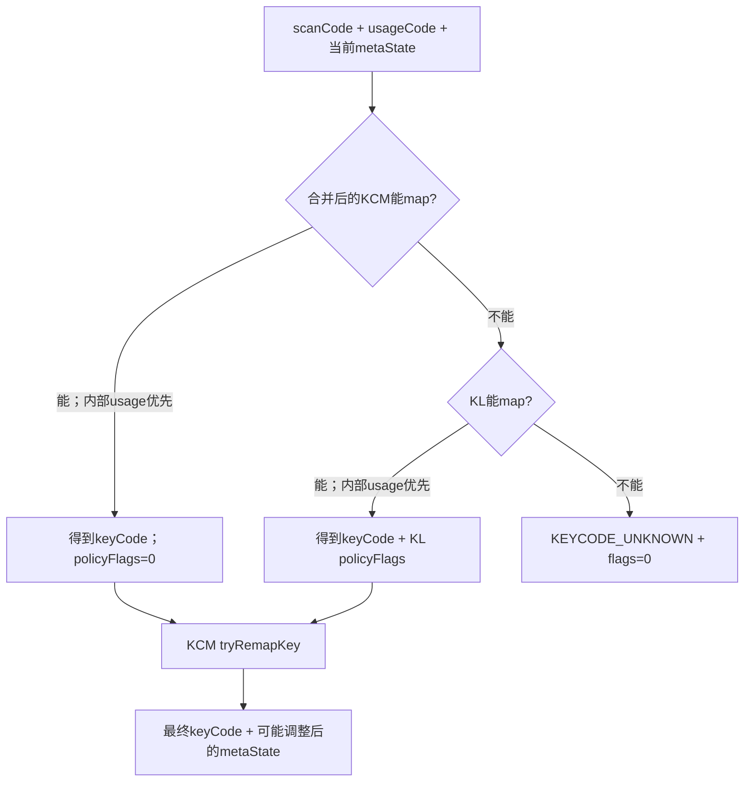
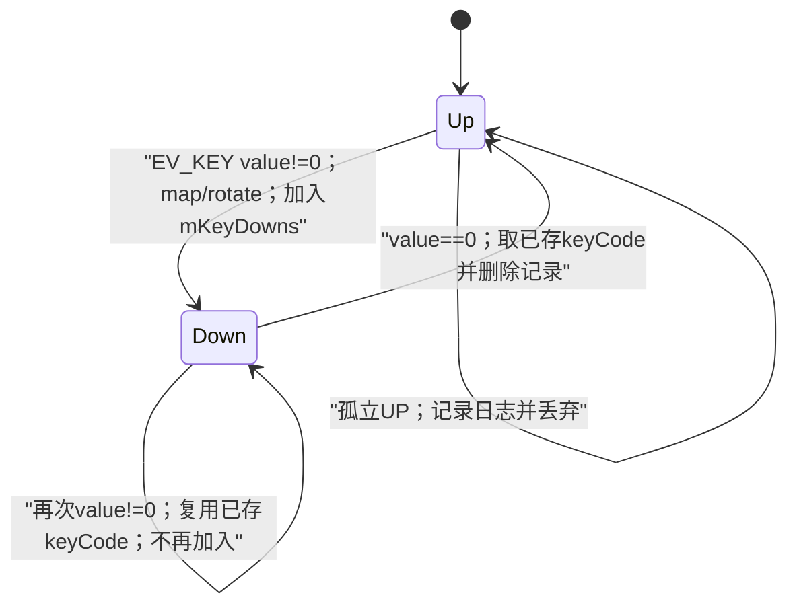
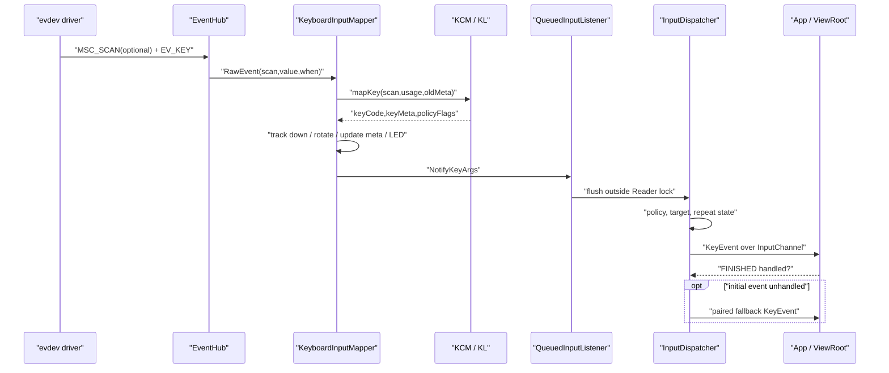

# 180 Android KeyboardInputMapper、Key Layout 与按键状态

> 源码版本：Android 11 / API 30 / `android-11.0.0_r48`  
> 学习方式：macOS 只读源码，不要求编译、不要求连接 Android 设备  
> 前置章节：第 20、174、176、179 章

---

## 1. 本章目标：把一个物理按键拆成四层含义

键盘上按下字母 A，看起来只是一个动作，源码里却至少经过四种编号或语义：

```text
Linux scanCode(KEY_A=30)
        + 可选 HID usage(0x00070004)
        ↓ .kcm map / .kl map
Android keyCode(AKEYCODE_A)
        + metaState / policyFlags / downTime
        ↓ InputDispatcher
KeyEvent(action, repeatCount, flags, displayId...)
        ↓ App按需查询KCM
字符 'a'、'A'，或一个fallback按键
```

本章不把“按键编号”“字符”“组合键状态”“重复次数”混成一个概念，而是逐层追踪它们在哪生成、由谁保存、何时失效。

---

## 2. 先记住十二条结论

1. `scanCode` 是 Linux evdev code，`keyCode` 是 Android 语义编号；二者不是同一套枚举。
2. `MSC_SCAN` 可携带 HID usage，Mapper 只把它临时关联给紧随其后的一个 `EV_KEY`。
3. 映射时先查当前合并后的 `.kcm`，再查 `.kl`；每张表内部都优先 usage、再查 scanCode。
4. `.kl` 主要给出 keyCode 和 WAKE/VIRTUAL/FUNCTION/GESTURE policy flag；`.kcm` 还描述字符、fallback、replacement 与键盘类型。
5. KCM 的 replacement 在 InputReader 映射阶段发生，fallback 则要等原事件未处理后才发生。
6. `EV_KEY.value==2` 没有独立 action；Mapper 将所有非 0 value 都视为 DOWN。
7. Mapper 用 `mKeyDowns` 保证 UP 沿用 DOWN 时确定的 keyCode，即使屏幕方向或布局后来变化。
8. `mMetaState` 是每个 KeyboardInputMapper 的状态，InputReader 再把所有设备的 meta state 按位 OR 成全局状态供触摸、鼠标等事件使用。
9. Shift 等瞬时 modifier 在 DOWN 打开、UP 关闭；Caps/Num/Scroll Lock 在 UP 时翻转锁定状态。
10. EventHub 尝试关闭内核重复；正常重复由 InputDispatcher 的 timeout/delay 定时器生成。
11. Mapper 的 `mDownTime` 在 r48 是一份共享字段，不是每个 scanCode 各保存一份；多键并按时不要套用“每键独立 downTime”的想象。
12. `.kcm` 不会让 InputReader直接输出字符；App拿到 KeyEvent 后才可按 keyCode+metaState 查询字符。

---

## 3. 本章要回答的二十五个问题

1. 哪些设备会创建 KeyboardInputMapper？
2. scanCode、usageCode、keyCode 各是谁定义的？
3. `MSC_SCAN` 为什么不是一笔 KeyEvent？
4. usage 与 scan 同时可映射时谁优先？
5. `.kcm` 和 `.kl` 谁先参与映射？
6. `.kl` 后面的 WAKE/VIRTUAL/FUNCTION/GESTURE 是什么？
7. KCM replacement 与 fallback 有什么本质差别？
8. 未知 scanCode 为什么仍可能生成 `KEYCODE_UNKNOWN`？
9. value=2 为什么仍被 Mapper 当成 DOWN？
10. 重复 DOWN 为什么不重复加入 `mKeyDowns`？
11. UP 找不到对应 DOWN 时为什么直接丢弃？
12. 旋转中按下、旋转后抬起为什么 keyCode 不变？
13. Shift 与 Caps Lock 的状态更新时间为何不同？
14. KCM replacement 为什么可能临时消费 meta bit？
15. 全局 meta state 怎样影响触摸或鼠标事件？
16. LED 何时通过 ioctl 写回键盘？
17. 外接键盘为什么默认能唤醒？
18. 媒体键为什么不自动添加 WAKE？
19. `handlesKeyRepeat=true` 为什么反而设置“禁用重复”flag？
20. Dispatcher 怎样识别驱动自己产生的重复 DOWN？
21. long-press flag 是谁加的？
22. key state 查询读 Mapper 缓存还是 kernel？
23. usage-only/KCM-only 映射为何可能无法被 supported-key 查询发现？
24. keyboard layout overlay 怎样替换 KCM，又为何不必重建 Mapper？
25. reset 后已按下的键怎样收尾？

---

## 4. 源码地图

```text
frameworks/native/services/inputflinger/reader/
├── EventHub.cpp
├── InputDevice.cpp
├── InputReader.cpp
└── mapper/
    ├── KeyboardInputMapper.cpp
    └── KeyboardInputMapper.h

frameworks/native/libs/input/
├── Keyboard.cpp
├── KeyLayoutMap.cpp
└── KeyCharacterMap.cpp

frameworks/native/include/input/
├── Input.h
├── Keyboard.h
├── KeyLayoutMap.h
└── KeyCharacterMap.h

frameworks/native/services/inputflinger/dispatcher/
└── InputDispatcher.cpp

frameworks/base/data/keyboards/
├── Generic.kl
├── Generic.kcm
├── Virtual.kl / Virtual.kcm
└── Vendor_xxxx_Product_xxxx*.kl/.kcm

frameworks/base/core/java/android/view/
├── KeyEvent.java
├── KeyCharacterMap.java
└── ViewRootImpl.java
```

---

## 5. KeyboardInputMapper 在什么进程、什么线程

Android 11 r48 中：

- Java `InputManagerService` 位于 `system_server`；
- native InputManager、InputReader、InputDispatcher 也由 system_server 承载；
- `KeyboardInputMapper::process()` 在 InputReader 线程上执行；
- Mapper 通过 `QueuedInputListener` 先排队 NotifyArgs；
- InputReader 解锁后 flush，进入 Dispatcher 的 notify 入口；
- 最终通过 InputChannel 把 KeyEvent 发给目标进程的 Looper 线程。

因此 Mapper 里不能直接调用 App，也不决定哪个窗口收到按键。

---

## 6. 哪些 class 会汇成一个 KeyboardInputMapper

`InputDevice::addEventHubDevice()` 先汇总键类 source：

```cpp
uint32_t keyboardSource = 0;
if (classes & INPUT_DEVICE_CLASS_KEYBOARD) {
    keyboardSource |= AINPUT_SOURCE_KEYBOARD;
}
if (classes & INPUT_DEVICE_CLASS_DPAD) {
    keyboardSource |= AINPUT_SOURCE_DPAD;
}
if (classes & INPUT_DEVICE_CLASS_GAMEPAD) {
    keyboardSource |= AINPUT_SOURCE_GAMEPAD;
}
if (keyboardSource != 0) {
    mappers.push_back(std::make_unique<KeyboardInputMapper>(...));
}
```

同一个 Mapper 的 `mSource` 可以同时含 KEYBOARD、DPAD、GAMEPAD。它不是“只处理全尺寸键盘”的类；遥控器方向键、手柄按键也可能走这里。

`INPUT_DEVICE_CLASS_ALPHAKEY` 让对外 `keyboardType` 成为 `ALPHABETIC`，否则是 `NON_ALPHABETIC`。这与某一笔事件是否能映射成字母不是同一个判断。

---

## 7. 四层编号对照表

| 名称 | 示例 | 来源 | 主要用途 |
|---|---:|---|---|
| evdev event type | `EV_KEY` | Linux input API | 表示这是一笔键状态变化 |
| scanCode | `KEY_A = 30` | Linux input-event-codes | 描述驱动报告的 code |
| HID usage | `0x00070004` | USB HID usage page/id | 更稳定地描述某个HID用途 |
| Android keyCode | `AKEYCODE_A = 29` | Android KeyEvent | 面向Framework/App的语义键 |
| Unicode character | `'a'` / `'A'` | KCM + meta state | 文本输入含义 |

不要因为示例里的 30 和 29 很接近，就认为能做加减换算。映射必须查配置表。

---

## 8. RawEvent 中 EV_KEY 的三个字段

一笔键事件的关键内容是：

```text
type  = EV_KEY
code  = Linux scanCode
value = 0 / 1 / 2
```

Linux 通常约定：

- `0`：释放；
- `1`：首次按下；
- `2`：自动重复。

但 `KeyboardInputMapper::process()` 只做：

```cpp
processKey(rawEvent->when, rawEvent->value != 0, scanCode, usageCode);
```

所以 1 与 2 在 Mapper 入口都是 `down=true`。重复次数不是在这里由 value 直接写进 KeyEvent。

---

## 9. MSC_SCAN 是“一次性前缀”

HID 设备可能先报告：

```text
EV_MSC / MSC_SCAN / usage
EV_KEY / scanCode / value
EV_SYN / SYN_REPORT
```

Mapper 把 usage 暂存在 `mCurrentHidUsage`：

```cpp
case EV_MSC:
    if (rawEvent->code == MSC_SCAN) {
        mCurrentHidUsage = rawEvent->value;
    }
    break;
```

下一笔 `EV_KEY` 取出后立即清 0；若一直没有 EV_KEY，到 `SYN_REPORT` 也清 0。这意味着 usage 不是长期设备状态，也不会单独生成 KeyEvent。

---

## 10. usage 优先不是“usage 替换 scanCode”

映射函数同时收到两者：

```text
mapKey(scanCode, usageCode, metaState, ...)
```

每张映射表的查找规则都是：

1. usageCode 非 0 且有对应项，使用 usage 项；
2. 否则再按 scanCode 查；
3. 都没有才失败。

但发给 App 的 `KeyEvent.scanCode` 仍是原 EV_KEY code。usage 只辅助选择 keyCode，不会覆盖 scanCode 字段。

---

## 11. Android 11 的真实映射优先级

`EventHub::mapKey()` 的顺序容易被概念教程简化错：



也就是：

```text
KCM usage → KCM scan → KL usage → KL scan → UNKNOWN
```

多数基础 KCM 没写 `map key`，日常看起来像总由 KL 完成；但源码契约不能因此写成“永远先 KL”。布局 overlay 可以向合并 KCM 加入 scan/usage 映射。

---

## 12. `.kl` 到底负责什么

`Generic.kl` 里有：

```text
key 30    A
key 42    SHIFT_LEFT
key 143   WAKEUP
key usage 0x0c006F BRIGHTNESS_UP
```

格式核心是：

```text
key [usage] <linux-code或hid-usage> <Android-keyCode-label> [flags...]
```

`.kl` 还可描述 axis 与 LED。对按键而言，它将硬件编号映射为 Android keyCode，并附带输入策略 flag。

---

## 13. `.kl` 的四种按键 flag

Android 11 r48 接受：

| KL flag | native policy flag | 含义 |
|---|---|---|
| `WAKE` | `POLICY_FLAG_WAKE` | 允许此键参与唤醒策略 |
| `VIRTUAL` | `POLICY_FLAG_VIRTUAL` | 虚拟/电容硬键，可触发抑制与触觉语义 |
| `FUNCTION` | `POLICY_FLAG_FUNCTION` | 特殊Fn语义，Dispatcher补 `AMETA_FUNCTION_ON` |
| `GESTURE` | `POLICY_FLAG_GESTURE` | 固件手势键，首次按下时取消同设备触摸 |

这些是 native policy flags，不等同于 App 最终看到的 `KeyEvent.flags`。Dispatcher会把其中一部分转换、消费或用于策略判断。

---

## 14. `.kcm` 不只是字符表

`Generic.kcm` 的常见内容是：

```text
type FULL

key A {
    label:           'A'
    base:            'a'
    shift, capslock: 'A'
}
```

KCM 能表达：

- 键盘类型；
- keyCode 在不同 meta state 下对应的字符；
- dead key / combining accent；
- fallback keyCode；
- replacement keyCode；
- `map key` 的 scan/usage→keyCode overlay。

因此“KL负责键位、KCM负责字符”适合作为入门近似，不足以完整解释 r48 的 `EventHub::mapKey()`。

---

## 15. base KCM 与 layout overlay 怎样合并

EventHub 设备初始持有 base KCM。用户为物理键盘选择布局后，IMS 读取布局资源，native 解析为 overlay KCM：

```cpp
device->overlayKeyMap = map;
device->combinedKeyMap =
        KeyCharacterMap::combine(device->keyMap.keyCharacterMap, map);
```

`CHANGE_KEYBOARD_LAYOUTS` 到来时：

1. InputDevice向policy获取当前 overlay；
2. 每个子设备更新合并 KCM；
3. 内容对象变化则 bump generation；
4. 现有 Mapper 不必销毁重建。

这是“配置对象热替换”，不是 EventHub fd reopen。

---

## 16. replacement 与 fallback 必须分开

两者都写在 KCM，却发生在完全不同阶段：

| 机制 | 触发时机 | 原事件是否先发给App | 主要执行位置 |
|---|---|---|---|
| replacement | InputReader映射原始键时 | 否，直接换成新keyCode | `KeyCharacterMap::tryRemapKey()` |
| fallback | 原按键未被应用/策略处理后 | 是，先尝试原事件 | PhoneWindowManager / Dispatcher 或 ViewRoot synthetic path |

replacement 适合“这个组合本来就应成为另一个逻辑键”；fallback 适合“原键没人处理时，尝试兼容导航键”。

---

## 17. replacement 为什么还会修改 metaState

KCM behavior 可以声明 replacement key，并消费触发该替换的 modifier。例如某组合被替换后，不能还把原 Ctrl/Alt 留给下游。

`tryRemapKey()` 会：

1. 输出 replacement keyCode；
2. 从 metaState 中清掉 behavior 使用的位；
3. 同步清理通用位与 left/right 依赖位；
4. 再调用 `normalizeMetaState()` 恢复仍然有效的通用位。

这正是 Mapper 后面为何保留 `keyMetaState`：非 meta 键若发生 replacement，事件可携带一个临时调整后的状态，而不是无条件使用设备完整 `mMetaState`。

---

## 18. fallback 有两条路径，配对强度不同

r48不能只画一条fallback链：

### 路径A：native Dispatcher → policy

前台App返回“未处理”后，Dispatcher的 `afterKeyEventLockedInterruptible()` 调用policy `dispatchUnhandledKey()`。首次DOWN若得到替代键：

- 生成带 `FLAG_FALLBACK` 的替代DOWN；
- connection `InputState`记录original→fallback；
- 后续repeat与UP必须复用首次选择；
- 原UP到来后释放映射；若原键后来被处理，还会取消已有fallback。

这条路径明确锁存生命周期，避免meta/layout中途变化导致DOWN、UP换键。

### 路径B：App侧 ViewRoot SyntheticInputStage

未处理KeyEvent也可能到达 `SyntheticKeyboardHandler`。它对当前这一笔调用 `kcm.getFallbackAction()`，生成带 `FLAG_FALLBACK` 的事件并重新排入App队列；该类本身没有original→fallback表，而是依赖每笔事件的keyCode/meta和KCM查询结果。

两条路径都会检查/设置 `FLAG_FALLBACK` 以阻止递归，但只有路径A能声称由connection状态显式保证配对。

---

## 19. 映射失败为什么仍发送 UNKNOWN

Mapper 调用 `mapKey()` 失败时不是直接 return：

```cpp
keyCode = AKEYCODE_UNKNOWN;
keyMetaState = mMetaState;
policyFlags = 0;
```

随后仍按 scanCode 建立 down 记录并发出 KeyEvent。好处是调试或低层接收者仍能看到原 scanCode。

但若这笔 code 被 `isKeyboardOrGamepadKey()` 判为鼠标按钮等其他 Mapper 的范围，则 KeyboardInputMapper根本不会进入 `processKey()`。

---

## 20. 为什么要过滤 mouse button 范围

复合设备的一笔 EV_KEY 会被同一子设备的多个 Mapper 依次看到。若 KeyboardInputMapper也把 BTN_LEFT 当普通键，CursorInputMapper又把它当鼠标按钮，就可能重复解释。

`isKeyboardOrGamepadKey()` 用 Linux BTN 范围做筛选：

- 普通键盘 code 保留；
- joystick/gamepad 按钮保留；
- 典型鼠标按钮留给 CursorInputMapper；
- 其他特定 BTN 区段按源码范围处理。

这再次说明 Mapper 是按能力分工，而不是每种 raw type 只可能被一个 Mapper看到。

---

## 21. mKeyDowns 保存的不是完整 KeyEvent

每个按下记录只有：

```cpp
struct KeyDown {
    int32_t keyCode;
    int32_t scanCode;
};
```

它解决两个问题：

1. 判断同 scanCode 的新 DOWN 是否是重复；
2. UP 必须沿用 DOWN 时实际发出的 keyCode。

它没有逐键保存 downTime、metaState、policyFlags、usageCode。因此这些字段不能被想象成从 DOWN 记录完整回放。

---

## 22. 首次 DOWN、重复 DOWN、UP 的状态机



方向旋转、KCM overlay变化或其他映射变化发生在按住期间时，UP 仍从 `mKeyDowns` 取旧 keyCode，以保持逻辑序列一致。

---

## 23. 初次 DOWN 上的虚拟键与手势处理

只有 `findKeyDown(scanCode)<0` 的首次 DOWN 执行：

```cpp
if ((policyFlags & POLICY_FLAG_VIRTUAL) &&
        shouldDropVirtualKey(...)) {
    return;
}
if (policyFlags & POLICY_FLAG_GESTURE) {
    cancelTouch(when);
}
```

含义是：

- 屏幕边缘触摸后，邻近电容键可被防误触窗口抑制；被抑制的 DOWN 不进 `mKeyDowns`，其后 UP 也会因“未按下”被丢弃；
- 固件把某个动作报告成 gesture key 时，先取消同设备正在进行的触摸流；
- 重复 DOWN 不会反复执行这两个首次动作。

---

## 24. 方向键旋转发生在何时

只有首次 DOWN 且 `keyboard.orientationAware=true` 时，Mapper按 viewport orientation 旋转 DPAD 与 SYSTEM_NAVIGATION 方向键。

r48测试体现的 DPAD 映射是：

| 显示方向 | 物理 UP 最终 keyCode |
|---|---|
| 0° | DPAD_UP |
| 90° | DPAD_LEFT |
| 180° | DPAD_DOWN |
| 270° | DPAD_RIGHT |

之后重复 DOWN 和 UP 都复用 `mKeyDowns` 中的结果。因此按住期间旋转屏幕不会把 UP 变成另一个方向。

---

## 25. viewport 与 displayId 的选择

`findViewport()` 先看设备是否通过 `.idc` 关联 display port：

1. 有 associated display port：直接取对应 viewport；
2. 没有关联，但 `orientationAware=true`：取内部显示 viewport；
3. 否则没有 viewport。

有 viewport 时 NotifyKey 携带其 displayId；没有则为 `ADISPLAY_ID_NONE`。

注意：是否携带 displayId 与是否旋转不是完全同一个条件。有明确 associated viewport 的设备即使不做方向旋转，也能拥有 displayId。

---

## 26. stem key 的 180° 特殊重映射

可穿戴等设备的 `STEM_PRIMARY/STEM_1/2/3` 在 180° 时可通过 IDC 属性换成指定 keyCode：

```text
keyboard.rotated.stem_primary = ...
keyboard.rotated.stem_1 = ...
```

这与 DPAD 四方向表不同：stem map 只处理 180°，并由 `configureParameters()` 首次读取。

源码里的 `stemKeyRotationMap` 是文件级可变静态数组，不是每个 Mapper 独立成员。这意味着一个设备写入的 rotated stem 配置可能影响同进程其他 orientation-aware Mapper；这是 r48 实现边界，不能按理想设计假定完全设备隔离。

---

## 27. metaState 的两类生命周期

Android 将 modifier 粗分为：

### 瞬时状态

- SHIFT_LEFT/RIGHT
- ALT_LEFT/RIGHT
- CTRL_LEFT/RIGHT
- META_LEFT/RIGHT
- SYM
- FUNCTION

按下设置，抬起清除。

### 锁定状态

- CAPS_LOCK
- NUM_LOCK
- SCROLL_LOCK

r48 的 `toggleLockedMetaState()` 在 `down==false` 时异或对应位，所以是“释放时翻转”。如果只看到 Caps DOWN 就断言灯已切换，会与源码相反。

---

## 28. normalizeMetaState 做什么

左右侧位与通用位同时存在。例如左 Shift 按下后应同时拥有：

```text
AMETA_SHIFT_LEFT_ON | AMETA_SHIFT_ON
```

`normalizeMetaState()` 根据 LEFT/RIGHT 位补通用 ALT/SHIFT/CTRL/META 位。

释放一侧 modifier 时，`setEphemeralMetaState()` 先清侧位和通用位，再 normalize；若另一侧仍按住，normalize 会把通用位重新补回。因此左右 Shift 同时按下、只释放一个时，SHIFT_ON 不会错误消失。

---

## 29. 当前按键的 metaState 怎样确定

顺序非常关键：

1. 先以“事件到来前”的 `mMetaState` 调用 KCM/KL 映射；
2. KCM replacement 可产生临时 `keyMetaState`；
3. 再用最终 keyCode 和当前 down/up 更新设备 `mMetaState`；
4. 若本键真的改变 meta state，事件携带更新后的 `mMetaState`；
5. 否则保留 KCM 给出的 `keyMetaState`。

所以 Shift DOWN 本身携带“Shift 已按下”；Shift UP 携带“Shift 已释放”。普通 A 在 Shift 按住时携带 Shift；若 A 被 replacement 且消费 Shift，则它可携带被清理后的临时状态。

---

## 30. 全局 metaState 为什么是 OR

InputReader重新计算：

```cpp
mGlobalMetaState = 0;
for (each InputDevice) {
    mGlobalMetaState |= device->getMetaState();
}
```

用途是让其他输入源知道系统当前 modifier。例如按住外接键盘 Ctrl 再滚动鼠标，CursorInputMapper生成的 MotionEvent 能带全局 Ctrl 状态。

OR 的代价是“不记录来自哪台键盘”。设备 A 按左 Shift、设备 B 抬自己的 Shift 时，各 Mapper仍维护各自状态，重新 OR 后只要 A 还按住，全局 Shift 就保持。

---

## 31. LED 状态怎样写回硬件

reset 时 Mapper查询 Caps/Num/Scroll LED 是否存在，并先认为关闭，然后强制同步一次。

meta state 变化后：

```text
CAPS_LOCK_ON   → ALED_CAPS_LOCK
NUM_LOCK_ON    → ALED_NUM_LOCK
SCROLL_LOCK_ON → ALED_SCROLL_LOCK
```

最终 EventHub通过 `EV_LED` 写入设备 fd。Mapper只在 LED 可用且期望状态变化（或reset强制）时写，减少无意义操作。

LED 是锁定 meta state 的外部显示，不是决定 meta state 的权威输入源。

---

## 32. downTime 的简单情况

单键 A 的时间线：

```text
t=100 A DOWN  → mDownTime=100，发 DOWN(downTime=100,eventTime=100)
t=180 A UP    → 发 UP  (downTime=100,eventTime=180)
```

这符合“同一按键序列共享首次按下时间”的直觉。

但这个直觉只在没有其他 DOWN/重复 DOWN 插入时可靠，因为 r48 Mapper只有一个 `mDownTime` 字段。

---

## 33. 多键并按的 downTime 反直觉边界

手算下面序列：

```text
t=100 A DOWN → mDownTime=100，A DOWN携带100
t=120 B DOWN → mDownTime=120，B DOWN携带120
t=150 A UP   → 当前共享mDownTime仍是120，A UP携带120
t=170 B UP   → B UP也携带120
```

`mKeyDowns` 没有逐键 downTime，所以 A UP 不能恢复 100。

这不是建议的应用语义模型，而是 Android 11 r48 这段 Mapper 实现的真实边界。排查组合键时应直接查看事件，而不要从某个 DOWN 推测所有后续 UP 的 downTime。

---

## 34. 重复 DOWN 也会覆盖 mDownTime

即使 scanCode 已在 `mKeyDowns`，代码仍在 DOWN 分支末尾执行：

```cpp
mDownTime = when;
```

因此驱动若仍发送 value=2 或连续相同 DOWN，Mapper 发出的那笔 DOWN 使用新的 downTime。随后 UP 也可能带这个最近时间。

相对地，Dispatcher自己合成 repeat 时复制保存的 `KeyEntry.downTime`，不会每次合成时改为当前时间。硬件重复路径与Dispatcher合成路径在这一细节上不能混写。

---

## 35. EventHub 为什么关闭内核重复

打开 keyboard class fd 后，EventHub尝试：

```cpp
unsigned int repeatRate[] = {0, 0};
ioctl(device->fd, EVIOCSREP, repeatRate);
```

目的是让 InputDispatcher统一控制初次等待时间和后续重复间隔，避免内核与Framework各自生成一套重复。

ioctl 可能失败，设备也可能自己发送重复 DOWN，所以 Dispatcher仍包含“识别连续同 keyCode DOWN”的兼容逻辑。

---

## 36. Mapper 为什么没有 repeatCount 参数

`NotifyKeyArgs` 不携带 repeatCount；进入 `InputDispatcher::notifyKey()` 时固定：

```cpp
constexpr int32_t repeatCount = 0;
```

Dispatcher接管重复状态后：

- 首次可信 DOWN：保存为 `lastKeyEntry`，设置 `nextRepeatTime`；
- 超过初始 timeout：合成 repeatCount=1；
- 之后每隔 delay 递增；
- UP、不同按键或其他不合条件事件会重置重复状态。

所以 App看到的 repeatCount 是 Dispatcher语义，不是 Linux value 原样透传。

---

## 37. 驱动重复怎样被 Dispatcher 识别

若两笔正常、可信、repeatCount仍为0的 DOWN 连续进入，且保存的上一笔 `keyCode` 相同，Dispatcher认为驱动在自动重复：

1. 当前 entry.repeatCount = 上一笔 + 1；
2. 取消Framework自己的repeat timer；
3. `nextRepeatTime=LONG_LONG_MAX`；
4. 以后继续依据驱动 DOWN 递增。

r48 此处分支只比较 keyCode，没有同时比较 deviceId/scanCode。两台设备连续按同一 keyCode 理论上也可能被归入重复序列，这是实现层的交叉设备边界。

---

## 38. handlesKeyRepeat 的名字为何容易误读

IDC 可配置：

```text
keyboard.handlesKeyRepeat = 1
```

含义是“设备/驱动自己处理重复”，于是 Mapper在 NotifyKey policyFlags 中加：

```cpp
POLICY_FLAG_DISABLE_KEY_REPEAT
```

这个 flag 的主语是 Dispatcher：禁止 Dispatcher再合成重复。它并不是让硬件停止重复。

默认 false 时，EventHub尝试关内核重复，Dispatcher负责合成；true 时，系统信任设备提供重复序列。

---

## 39. long press flag 从哪里来

Dispatcher在正式 dispatch key 时：

```cpp
if (entry->repeatCount == 1) {
    entry->flags |= AKEY_EVENT_FLAG_LONG_PRESS;
} else {
    entry->flags &= ~AKEY_EVENT_FLAG_LONG_PRESS;
}
```

也就是说第一笔重复 DOWN 带 LONG_PRESS，后续 repeatCount>1 反而不再带这个 flag。

长按不是 Mapper在首次 DOWN 时预先判断的；它依赖 Dispatcher重复计时或驱动重复序列。

---

## 40. 外接键盘的默认 WAKE 规则

Mapper对外接设备额外做：

```cpp
if (down && isExternal() && !doNotWakeByDefault && !isMediaKey(keyCode)) {
    policyFlags |= POLICY_FLAG_WAKE;
}
```

因此：

- 仅 DOWN 自动添加；
- 仅外接设备；
- `keyboard.doNotWakeByDefault` 可关闭；
- media/volume 一组键不自动添加；
- `.kl` 明确写的 WAKE 不受这段默认规则移除，UP 也可继续携带显式 WAKE。

媒体键排除是为了避免耳机/遥控播放控制随意唤醒，确需唤醒应在设备 KL 中逐键声明。

---

## 41. NotifyKeyArgs 在 Mapper 出口有哪些字段

最终构造：

```text
id          = InputReader生成的新event id
eventTime   = RawEvent.when
deviceId    = 逻辑InputDevice id
source      = KEYBOARD/DPAD/GAMEPAD组合
displayId   = viewport id或NONE
policyFlags = KL flags + 自动WAKE + DISABLE_KEY_REPEAT等
action      = DOWN或UP
flags       = FROM_SYSTEM
keyCode     = map/replacement/rotation后的Android keyCode
scanCode    = 原EV_KEY code
metaState   = 当前或KCM临时调整后的状态
downTime    = Mapper共享mDownTime
```

repeatCount 要到 Dispatcher 的 KeyEntry 阶段才出现。

---

## 42. 完整单键链路图



---

## 43. keyCodeState 查询读取谁的状态

`getScanCodeState()` 不查 `mKeyDowns`，而是 EventHub 对设备 fd 调：

```text
ioctl(EVIOCGKEY)
```

并用 device key capability 校验 scanCode。

`getKeyCodeState()` 则先用 `.kl` 反查所有可能 scanCode，再看 kernel key bitmap 中是否任一个按下。

所以查询反映“驱动此刻状态”，不是“Mapper最后发出了什么”。设备 disabled、fd无效、ioctl失败或映射不存在时返回 UNKNOWN。

---

## 44. supported-key 查询为什么可能漏项

`markSupportedKeyCodes()` 同样只通过 `KeyLayoutMap::findScanCodesForKey()` 反查 scanCode，并与设备 `keyBitmask` 相交。

因此它的能力边界是：

- 能确认 KL 中按 scanCode 定义、且驱动声明支持的键；
- 不直接遍历 KCM overlay 的 `map key`；
- 不用 HID usage capability 反查 usage-only 映射；
- 不代表当前按键是否按下。

“运行时 mapKey 能成功”与“markSupportedKeyCodes 报告支持”不是严格双向等价。

---

## 45. reset 清什么，谁负责取消下游状态

KeyboardInputMapper reset 会：

```text
mMetaState = NONE
mDownTime = 0
mKeyDowns.clear()
mCurrentHidUsage = 0
重置并同步LED
调用InputMapper::reset()
```

它不会逐个发普通 Key UP。设备整体 reset 通知进入 Dispatcher 后，Dispatcher依据每条 connection 的 InputState 合成 canceled UP/CANCEL，使窗口侧状态收尾。

这是两层职责：Mapper丢弃硬件解释缓存；Dispatcher按已实际派发给各窗口的状态做取消。

---

## 46. 常见误解与正确说法

### 误解一：scanCode 就是 KeyEvent.KEYCODE

错误。前者是Linux编号，后者是Android语义，必须经过映射。

### 误解二：`.kl` 永远先把scan转keyCode，`.kcm`只产字符

错误。r48先查合并KCM的scan/usage map，失败才查KL；KCM还可replacement/fallback。

### 误解三：EV_KEY value=2 会直接成为repeatCount=2

错误。Mapper只看是否非0；Dispatcher从0开始维护repeatCount。

### 误解四：每个按键都有自己的downTime缓存

错误。r48 KeyboardInputMapper只有共享 `mDownTime`。

### 误解五：Caps Lock在按下时翻转

错误。r48在UP时翻转locked meta bit。

### 误解六：fallback就是InputReader重映射

错误。replacement才是早期重映射；fallback发生在原键未处理之后。

---

## 47. macOS 只读源码练习

无需编译，可在源码根目录执行：

### 练习一：找 Mapper 主状态机

```bash
sed -n '210,365p' \
  frameworks/native/services/inputflinger/reader/mapper/KeyboardInputMapper.cpp
```

标出 usage 清零、首次/重复 DOWN、孤立 UP、meta、WAKE 和 NotifyKeyArgs。

### 练习二：验证 KCM→KL 优先级

```bash
sed -n '540,580p' \
  frameworks/native/services/inputflinger/reader/EventHub.cpp
```

不要只看配置文件名称，要按 `status != NO_ERROR` 分支写出精确顺序。

### 练习三：对比 Generic KL/KCM

```bash
sed -n '20,75p' frameworks/base/data/keyboards/Generic.kl
sed -n '20,75p' frameworks/base/data/keyboards/Generic.kcm
rg -n "fallback|map key|key usage" frameworks/base/data/keyboards
```

回答：哪个文件定义 scan 30，哪个文件定义 Shift+Caps 下的字符？

### 练习四：追重复生成者

```bash
rg -n "EVIOCSREP|synthesizeKeyRepeatLocked|DISABLE_KEY_REPEAT|repeatCount" \
  frameworks/native/services/inputflinger
```

画出 kernel repeat、driver repeat、Dispatcher synthetic repeat 三条可能路径。

### 练习五：观察源码测试里的边界

```bash
sed -n '2420,3030p' \
  frameworks/native/services/inputflinger/tests/InputReader_test.cpp
```

重点看 usage映射、unknown键、meta、方向变化中UP一致性和外接设备wake测试。

---

## 48. 手算题：Shift+A、Caps 与 fallback

### 场景一：Shift+A

```text
t1 Shift DOWN
t2 A DOWN
t3 A UP
t4 Shift UP
```

预期 meta：

| 时刻 | 事件 | metaState |
|---|---|---|
| t1 | Shift DOWN | SHIFT_LEFT_ON + SHIFT_ON |
| t2 | A DOWN | SHIFT_LEFT_ON + SHIFT_ON |
| t3 | A UP | SHIFT_LEFT_ON + SHIFT_ON |
| t4 | Shift UP | NONE |

字符 `'A'` 是 App按KCM查询的结果，不是 Mapper另发的字符事件。

### 场景二：Caps Lock

Caps DOWN 时锁定位不变；Caps UP 时 `CAPS_LOCK_ON` 翻转并更新LED。再次完整按下/抬起后关闭。

### 场景三：fallback

原键DOWN先投给应用。若走native Dispatcher/policy路径，只有initial DOWN能建立并锁存fallback，后续UP复用；若走ViewRoot SyntheticInputStage，则处理器按当前每笔事件查询KCM，本类自身没有锁存表。分析日志时要先确认是哪条路径。

---

## 49. 复读审计：最容易写错的十个边界

### 边界一：KCM先于KL，但KCM命中时policyFlags从0开始

若 combined KCM直接 map成功，EventHub把 `outFlags=0`，不会再把同scan在KL上的WAKE/VIRTUAL flag合进来。overlay映射设计不当可能改变策略flag来源。

### 边界二：usage只活到下一EV_KEY或SYN_REPORT

它不是“当前HID键”的持久缓存；两笔EV_KEY不会自动共享同一usage。

### 边界三：UP按scanCode配对，而不是usageCode

`mKeyDowns` 只存scanCode/keyCode。依赖usage但EV_KEY scanCode恒为0的设备同时按多个usage键时，所有键会竞争同一个scanCode 0记录；协议/驱动必须提供可配对序列，源码本身没有按usage建立第二把索引。

### 边界四：共享mDownTime不是逐键语义

任意新DOWN或重复DOWN都会覆盖它；多键UP读取最近值。

### 边界五：旋转只在首次DOWN决定

屏幕中途旋转不会改变已按键的repeat/UP keyCode，但新按键使用新方向。

### 边界六：stem配置表是进程级静态可变数据

不同设备配置存在相互影响可能，不应声称每个Mapper有独立stem表。

### 边界七：自动WAKE只加在外接非媒体键DOWN

KL显式WAKE可在DOWN/UP保留；两种来源必须分开。

### 边界八：key state与supported查询偏向KL scan映射

它们不完整覆盖KCM-only或usage-only映射。

### 边界九：Dispatcher识别driver repeat只比较keyCode

r48没有在该条件同时比较deviceId，存在跨设备同键连续DOWN的理论混淆窗口。

### 边界十：fallback并非只有一条锁存路径

native Dispatcher/Policy按connection保存original→fallback；ViewRoot SyntheticKeyboardHandler逐笔查询KCM。不能把前者的配对机制笼统归给所有fallback事件。

### 边界十一：reset清Mapper缓存，不逐键发送正常UP

下游取消依赖DeviceReset与Dispatcher按connection保存的真实已派发状态。

---

## 50. 最终模型、检查题与下一章

### 一句话模型

```text
KeyboardInputMapper把EV_KEY及一次性MSC_SCAN usage交给“合并KCM优先、KL兜底”的映射链，
在首次DOWN确定replacement/旋转/keyCode并以scanCode维护按下集合，再更新每设备meta与LED、补策略flag后生成NotifyKey；
InputDispatcher继续负责policy、窗口路由、repeatCount/long-press和未处理fallback，App最后才用KCM把keyCode+meta解释成字符。
```

### 检查题

1. `KEY_A=30` 与 `AKEYCODE_A=29` 为什么不能直接换算？
2. KCM、KL以及各自的usage/scan查找顺序是什么？
3. replacement 和 fallback 分别发生在哪个阶段？
4. value=2 到 repeatCount=1 中间经过哪些逻辑？
5. 为什么旋转后UP仍与原DOWN同keyCode？
6. Shift和Caps Lock分别在什么时机改变meta？
7. 多键并按时为什么A UP的downTime可能变成B DOWN时间？
8. 外接媒体键如何显式允许唤醒？
9. supported-key查询为何可能漏掉usage-only键？
10. Mapper reset为何不应直接对所有窗口广播普通UP？

### 下一章

第 181 章进入 CursorInputMapper：拆解相对位移、鼠标按钮、滚轮、pointer capture、加速度、显示关联与 MotionEvent 坐标生成。
