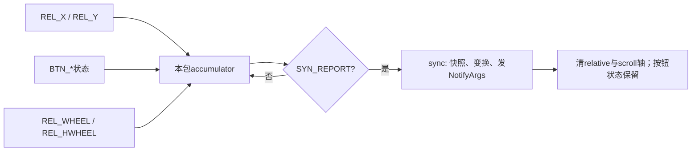
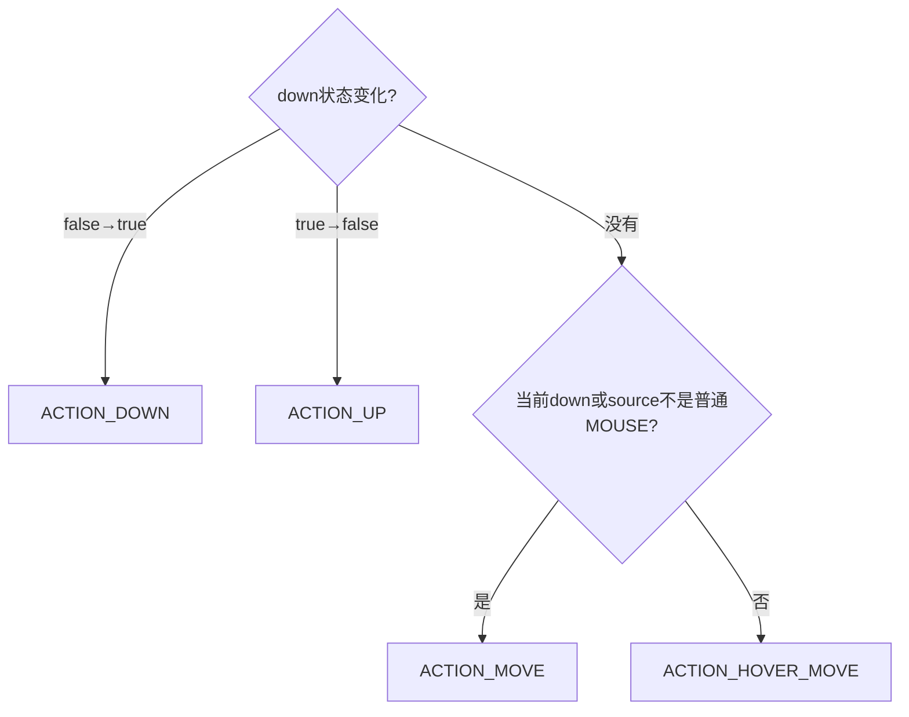

# 181 Android CursorInputMapper：鼠标位移、按钮、滚轮与 Pointer Capture

> 源码版本：Android 11 / API 30 / `android-11.0.0_r48`  
> 学习方式：macOS 只读源码，不要求编译、不要求连接 Android 设备  
> 前置章节：第 20、173、174、179、180 章

---

## 1. 本章目标：同一组 REL/BTN 为什么会成为三种坐标语义

Linux 鼠标通常只报告相对量：

```text
EV_REL / REL_X / +10
EV_REL / REL_Y / +20
EV_KEY / BTN_LEFT / 1
EV_SYN / SYN_REPORT / 0
```

但 Android 可以把它解释成：

- 普通鼠标：移动系统光标，向App报告屏幕绝对 X/Y；
- pointer capture：隐藏/冻结光标，向焦点窗口报告本批相对 X/Y；
- navigation/trackball：不使用系统光标，以归一化相对量按焦点路由。

本章从 accumulator、`sync()`、PointerController、VelocityControl 一直追到 Dispatcher 和 ViewRoot，解释这三种模式的坐标、按钮、事件顺序与目标窗口为何不同。

---

## 2. 先记住十四条结论

1. CursorInputMapper 等到 `SYN_REPORT` 才把本包位移、滚轮和按钮状态一起提交。
2. r48 的 motion/scroll accumulator 对同一轴是赋值，不是累加；同包重复 REL_X/REL_WHEEL 时后值覆盖前值。
3. pointer mode 使用共享 PointerController 移动并裁剪光标，MotionEvent X/Y 是移动后的屏幕位置。
4. pointer mode 同时填写 RELATIVE_X/Y；绝对位置与本包增量可同时存在。
5. pointer capture 切到 `SOURCE_MOUSE_RELATIVE`，不移动 PointerController；X/Y 本身就是相对增量。
6. navigation mode 使用 `SOURCE_TRACKBALL`，X/Y 是按阈值 6 缩放的相对量，也没有绝对光标。
7. 位移先按显示方向旋转，再进入速度缩放/加速；滚轮使用独立的 X、Y VelocityControl。
8. primary/secondary/tertiary 中任一按下就算 pointer down；BACK/FORWARD 不改变 down/pressure。
9. 一次按钮变化可产生主 DOWN/UP/MOVE/HOVER、BUTTON_PRESS/RELEASE，甚至额外 BACK/FORWARD KeyEvent。
10. r48 的顺序是：BACK/FORWARD Key DOWN → button release → 主motion → button press → UP后的hover → scroll → BACK/FORWARD Key UP。
11. 纯滚轮包也先产生主 HOVER_MOVE（mouse）或 MOVE（relative/navigation），再产生 SCROLL。
12. pointer capture 只允许焦点窗口请求；焦点丢失会释放，并用 device reset 隔开 source/坐标语义。
13. 普通 mouse 是 pointer-class，Dispatcher按触点命中窗口；relative mouse/trackball 是 navigation-class，按焦点窗口路由。
14. PointerController 在 InputReader 中由多个需要它的输入设备共享，不是每个物理鼠标一只独立系统光标。

---

## 3. 本章要回答的二十五个问题

1. 哪种 capability 会创建 CursorInputMapper？
2. pointer、pointer-relative、navigation 三种 mode 如何选择？
3. 为什么首次配置不能直接从 relative mode 启动？
4. accumulator 为什么等 SYN_REPORT 才提交？
5. 同一包两次 REL_X 是相加还是覆盖？
6. 原始 delta 在哪里旋转？
7. pointer speed 怎样改变 delta？
8. 500ms 停顿为何清速度历史？
9. 普通 mouse 的 X/Y 与 RELATIVE_X/Y 分别是什么？
10. capture 后为什么光标位置保持不变？
11. capture 事件为什么用 getX/getY 读相对量？
12. trackball 的阈值 6 表示什么？
13. 哪些按钮决定 ACTION_DOWN/UP？
14. BUTTON_PRESS/RELEASE 与 DOWN/UP 为什么同时存在？
15. 多按钮同包改变时事件顺序如何？
16. BACK/SIDE、FORWARD/EXTRA 为什么两两合并？
17. 鼠标侧键为什么还合成 KeyEvent？
18. BTN_TASK 最终去了哪里？
19. 纯滚轮为何不只发 ACTION_SCROLL？
20. scroll range 标为[-1,1]为何不等于运行值硬裁剪？
21. 外接鼠标哪些动作会带 WAKE？
22. 全局键盘meta如何进入鼠标MotionEvent？
23. pointer display 如何选择？
24. capture 开关为什么 bump generation并notify reset？
25. reset 后若硬件按钮仍按住会怎样重建状态？

---

## 4. 源码地图

```text
frameworks/native/services/inputflinger/reader/mapper/
├── CursorInputMapper.cpp
├── CursorInputMapper.h
├── TouchCursorInputMapperCommon.h
└── accumulator/
    ├── CursorButtonAccumulator.cpp
    └── CursorScrollAccumulator.cpp

frameworks/native/services/inputflinger/reader/
├── InputReader.cpp
└── InputDevice.cpp

frameworks/native/services/inputflinger/include/
├── PointerControllerInterface.h
└── InputReaderBase.h

frameworks/native/libs/input/
└── VelocityControl.cpp

frameworks/native/services/inputflinger/dispatcher/
├── InputDispatcher.cpp
└── InputState.cpp

frameworks/base/core/java/android/view/
├── View.java
└── ViewRootImpl.java

frameworks/base/services/core/java/com/android/server/
├── input/InputManagerService.java
└── wm/InputManagerCallback.java
```

---

## 5. 运行位置与边界

CursorInputMapper 在 system_server 的 InputReader 线程处理 raw event。它负责：

- 累积一个 evdev packet；
- 选择 source/mode；
- 计算坐标、按钮、滚轮和 meta；
- 操作 PointerController；
- 产生 NotifyMotion/NotifyKey。

它不负责：

- 决定目标窗口；
- 实现 App 的 click/context menu；
- 确认应用是否处理；
- 绘制应用自己的鼠标UI。

目标由 InputDispatcher根据 source class、焦点和窗口几何决定；App侧再由 ViewRoot/View 分发。

---

## 6. 为什么会创建 CursorInputMapper

第179章看到 EventHub 依据 capability 分类。子设备包含 `INPUT_DEVICE_CLASS_CURSOR` 时，`InputDevice::addEventHubDevice()` 创建：

```cpp
if (classes & INPUT_DEVICE_CLASS_CURSOR) {
    mappers.push_back(std::make_unique<CursorInputMapper>(*contextPtr));
}
```

一个复合鼠标也可能同时有 KeyboardInputMapper，例如额外媒体键由keyboard class处理，BTN_LEFT等由cursor class处理。同一 raw event 会按 Mapper 顺序交错解释。

---

## 7. 三种 mode 总表

| mode | source | X/Y语义 | PointerController | Dispatcher路由 |
|---|---|---|---|---|
| POINTER | `SOURCE_MOUSE` | 光标移动后的绝对屏幕坐标 | 移动、显示、保存按钮 | pointer-class按位置命中 |
| POINTER_RELATIVE | `SOURCE_MOUSE_RELATIVE` | 本包相对delta | 保留位置但不移动，立即隐藏 | navigation-class按焦点 |
| NAVIGATION | `SOURCE_TRACKBALL` | delta/6的相对导航量 | 不获取 | navigation-class按焦点 |

relative mode 不是 IDC 可直接指定的持久模式，而是 pointer capture 期间由 POINTER 动态切换。

---

## 8. IDC 怎样选择初始 mode

`configureParameters()` 读取：

```text
cursor.mode = pointer | navigation | default
cursor.orientationAware = 0 | 1
```

默认是 POINTER。`navigation` 才选择 trackball模式；非法值记录警告并保留默认。

首次 `configure()` 若意外已是 POINTER_RELATIVE，源码记录错误并强制回 POINTER，因为 relative 必须由已建立普通 PointerController 的 capture 状态过渡而来。

---

## 9. hasAssociatedDisplay 不是简单等于“鼠标”

源码设置：

```cpp
mParameters.hasAssociatedDisplay =
        mode == MODE_POINTER || orientationAware;
```

所以：

- pointer mouse 总关联系统pointer display；
- 普通navigation设备默认无关联显示；
- orientation-aware navigation会声明有关联显示语义，但其事件 displayId 返回 NONE，表示可按非特定显示的焦点语义处理。

这个字段用于输入设备信息与显示配置，不等于每笔事件一定携带具体 displayId。

---

## 10. 一个 packet 有三个 accumulator

每笔 RawEvent 依次交给：

```cpp
mCursorButtonAccumulator.process(rawEvent);
mCursorMotionAccumulator.process(rawEvent);
mCursorScrollAccumulator.process(rawEvent);
```

直到：

```text
EV_SYN / SYN_REPORT
```

才调用 `sync(when)` 统一计算输出。这样同一硬件报告里的X、Y、按钮、滚轮变化拥有相同提交时间和一致状态快照。

---

## 11. SYN_REPORT 是提交边界



按钮是跨包持久状态；相对位移和滚轮是本包瞬时量，`finishSync()` 后清零。

---

## 12. r48 accumulator 是覆盖，不是累加

`CursorMotionAccumulator::process()`：

```cpp
case REL_X:
    mRelX = rawEvent->value;
    break;
```

scroll 同样：

```cpp
case REL_WHEEL:
    mRelWheel = rawEvent->value;
    break;
```

因此一包若是：

```text
REL_X +3
REL_X +4
SYN_REPORT
```

r48最终取 +4，不是 +7。常见evdev设备每轴每包只报一次，所以日常不明显；但这不是 accumulator 这个名字所暗示的“自动求和”。

---

## 13. 按钮 accumulator 会查询 kernel 状态

reset 时 `CursorButtonAccumulator` 不只是清0，而是调用 `isKeyPressed()` 查询 BTN_LEFT/RIGHT/MIDDLE/BACK/SIDE/FORWARD/EXTRA/TASK 当前状态。

原因是 reset 可能发生在按钮仍物理按住时。保留驱动状态后，下一次 SYN_REPORT 可让 Mapper从新的逻辑 `mButtonState=0` 重新产生DOWN序列。

这也是 InputDevice disable 前为何要先reset：查询必须在fd仍可用时完成。不过整个 device reset 通知还会先让Dispatcher取消旧代际状态，避免新旧序列粘连。

---

## 14. Linux按钮到Android buttonState

| Linux code | Android Motion button |
|---|---|
| BTN_LEFT | PRIMARY |
| BTN_RIGHT | SECONDARY |
| BTN_MIDDLE | TERTIARY |
| BTN_BACK 或 BTN_SIDE | BACK |
| BTN_FORWARD 或 BTN_EXTRA | FORWARD |

BACK/SIDE、FORWARD/EXTRA 是“任一个为真就置同一bit”。若两者同时按下，释放其中一个不会让Android bit释放；必须两者都释放。

---

## 15. BTN_TASK 的 r48 实现缺口

`CursorButtonAccumulator`：

- 构造和reset都维护 `mBtnTask`；
- process也接收 `BTN_TASK`；
- 但 `getButtonState()` 没有把 `mBtnTask` 映射到任何 Android button bit。

所以仅 BTN_TASK 的变化不会造成 `currentButtonState` 改变，也不会由本 Mapper产生 Motion/Key输出。这是当前源码的真实缺口，不要看到“已accumulate”就断言App能收到。

---

## 16. 哪些button算pointer down

公共函数只检查：

```text
PRIMARY | SECONDARY | TERTIARY
```

BACK/FORWARD 不算 down。因此：

- 左/右/中任一从全未按→有按键：主 action DOWN；
- 只要三者仍有任一个按住：pressure=1，主 action通常MOVE；
- 最后一个释放：主 action UP；
- 侧键单独按下：仍处于hover，pressure=0。

右键也能开启pointer-down序列，不是只有左键才有DOWN/UP。

---

## 17. downTime 是整组主按钮共享的

只有 `wasDown=false && down=true` 时：

```cpp
mDownTime = when;
```

它表示 primary/secondary/tertiary 这组从“全未按”进入“至少一个按下”的时刻。按住左键后再按右键不会重置；释放左键但右键仍在也不结束；最后一个主按钮释放才UP。

BACK/FORWARD不参与这份downTime，但其合成 KeyEvent把各自变化时刻直接作为downTime，KEY UP也用UP时刻，因而不具备普通键盘DOWN/UP共享downTime的语义。

---

## 18. 位移的处理顺序

原始相对量依次经过：

```text
raw REL_X/Y
  → mode基础scale（mouse=1；navigation=1/6）
  → orientationAware旋转
  → VelocityControl缩放/加速
  → PointerController移动或直接写X/Y
```

旋转在加速之前；VelocityControl看到的是旋转后的向量，但二维速度大小在纯旋转下不变。

---

## 19. orientation rotation 的精确方向

`rotateDelta()`：

| orientation | 输出 |
|---|---|
| 0° | `(x,y)` |
| 90° | `(y,-x)` |
| 180° | `(-x,-y)` |
| 270° | `(-y,x)` |

只有 `cursor.orientationAware=true` 且 hasAssociatedDisplay 时执行。r48取的是 INTERNAL viewport orientation，而不是 PointerController当前default pointer display的orientation；多显示时这两者可能不是同一个显示，是需要注意的实现边界。

---

## 20. navigation mode 为什么除以6

常量：

```cpp
TRACKBALL_MOVEMENT_THRESHOLD = 6;
mXScale = mYScale = 1.0f / 6;
mXPrecision = mYPrecision = 6;
```

因此原始 REL_X=3 输出 X=0.5。它不是在 Mapper里凑满6后才离散发一个方向键，而是把相对MotionEvent归一化；后续 ViewRoot SyntheticTrackballHandler 才可能依据移动合成DPAD键。

---

## 21. VelocityControl 不是简单乘固定倍数

每条控制器维护累计 raw position 和 VelocityTracker：

1. 本次非零delta加入累计位置；
2. 根据事件时间估算速度；
3. 先应用基础 `scale`；
4. 低阈值以下不加速；
5. 低/高阈值间线性插值；
6. 高阈值以上使用完整 acceleration。

500ms没有移动后，下次输入先reset历史，避免长停顿后的第一笔被旧速度污染。

---

## 22. pointer speed 如何进入native参数

NativeInputManager读取整数pointer speed后设置：

```cpp
scale = exp2f(pointerSpeed * POINTER_SPEED_EXPONENT);
```

再发 `CHANGE_POINTER_SPEED`。CursorInputMapper给pointer与两个wheel VelocityControl更新参数；`setParameters()`同时reset速度历史。

因此改系统鼠标速度不会重建EventHub设备，也不需要销毁Mapper，但下一笔不会沿用旧速度估计。

---

## 23. 三条VelocityControl为什么分开

Mapper有：

- pointer X/Y 共用一个二维控制器；
- horizontal wheel 单独一个控制器；
- vertical wheel 单独一个控制器。

若横竖滚轮共用二维速度，快速竖滚可能抬高紧随其后的横滚加速。r48明确将它们解耦。

配置中pointer默认阈值/acceleration与wheel默认值也不同；不能用鼠标指针速度公式直接推断滚轮量。

---

## 24. 普通 pointer mode 的坐标

若本包 moved：

```cpp
mPointerController->move(deltaX, deltaY);
```

PointerController负责限制在显示bounds、保存位置与显示光标。随后 Mapper读取位置：

```text
AXIS_X / AXIS_Y             = 移动后的绝对光标坐标
AXIS_RELATIVE_X / RELATIVE_Y = 本批加速后的delta
xCursorPosition/yCursorPosition = 同一绝对光标位置
displayId                  = PointerController displayId
```

若在屏幕边缘，绝对X/Y可能不再变化，但RELATIVE_X仍可保留用户继续移动的意图。

---

## 25. PointerController 是共享系统光标状态

InputReader只保留一份弱引用：

```cpp
wp<PointerControllerInterface> mPointerController;
```

第一台需要它的设备通过policy创建，后续鼠标/触摸板指针模式复用。结果是：

- 两只鼠标移动同一系统光标；
- defaultPointerDisplayId统一决定光标当前显示；
- Mapper成员各持sp，但底层对象可相同；
- controller初次创建时传入某个deviceId，不表示以后只属于该设备。

---

## 26. pointer display 怎样更新

InputReader读取 `config.defaultPointerDisplayId`，查对应 viewport：

1. 找到则 `controller->setDisplayViewport(viewport)`；
2. 找不到则回退默认显示；
3. 默认显示也没有则记录错误并跳过更新。

普通 mouse每笔事件的displayId从PointerController取得。也就是说事件显示归属随系统pointer display配置走，不是依据每只鼠标的物理连接端口单独选择。

---

## 27. 活动时如何显示光标

当 moved/scrolled/buttonsChanged 任一为真，普通mouse：

1. presentation设为 POINTER；
2. moved时移动位置；
3. buttonsChanged时同步button state；
4. immediate unfade。

纯 SYN_REPORT没有变化不会反复唤出光标。滚轮即使位置不变，也会让系统光标立即显示。

---

## 28. pointer capture 请求链

```mermaid
sequenceDiagram
    participant V as "Focused View"
    participant R as "ViewRootImpl"
    participant I as "InputManagerService"
    participant W as "WMS InputManagerCallback"
    participant N as "NativeInputManager"
    participant C as "CursorInputMapper"

    V->>R: "requestPointerCapture()"
    R->>I: "windowToken, enabled=true"
    I->>W: "verify focused window"
    W-->>R: "dispatchPointerCaptureChanged(true)"
    W-->>I: "configuration refresh needed"
    I->>N: "nativeSetPointerCapture(true)"
    N->>C: "CHANGE_POINTER_CAPTURE"
    C->>C: "MOUSE→MOUSE_RELATIVE; hide pointer; bump generation"
    C-->>I: "NotifyDeviceReset"
```

请求不是调用返回就立刻等于已capture；ViewRoot以 `dispatchPointerCaptureChanged` 更新 `mPointerCapture` 并通知View。

---

## 29. 为什么只有焦点窗口能capture

WMS保存当前focused window token。请求时：

```text
focusedWindow == null 或 token不匹配 → 拒绝，不刷新native配置
```

焦点切走时，旧窗口capture状态被释放。这样 relative motion不会继续流向后台窗口。

Android 11的native reader配置是单个全局 `pointerCapture` bool，不是每display、每device一份；授权在窗口层做，mode切换则影响所有POINTER CursorInputMapper。

---

## 30. capture 时为什么保留PointerController

切入 capture：

```cpp
mParameters.mode = MODE_POINTER_RELATIVE;
mSource = AINPUT_SOURCE_MOUSE_RELATIVE;
mPointerController->fade(TRANSITION_IMMEDIATE);
```

Mapper没有清掉 controller，也不改其位置。capture期间 raw delta不调用 `move()`；退出后source恢复MOUSE，下一笔普通移动从进入capture前保存的位置继续。

这实现了“光标消失且不改变位置”，而不是把光标强制搬到屏幕中心。

---

## 31. relative mode 的坐标与cursor position

非普通mouse分支：

```cpp
AXIS_X = deltaX;
AXIS_Y = deltaY;
displayId = ADISPLAY_ID_NONE;
```

并保持：

```text
xCursorPosition = INVALID
yCursorPosition = INVALID
```

r48没有在relative分支填写 AXIS_RELATIVE_X/Y；公开API文档也明确要求从 `MotionEvent.getX()/getY()` 读取相对变化。不要照普通mouse习惯只读 `AXIS_RELATIVE_X`。

---

## 32. capture 为什么用navigation-class source

`SOURCE_MOUSE_RELATIVE = ... | SOURCE_CLASS_NAVIGATION`，不是pointer class。

InputDispatcher因此走 `findFocusedWindowTargetsLocked()`，而非按X/Y命中触摸窗口。这很合理：relative X/Y不是屏幕坐标，无法拿来判断落在哪个touchable region。

ViewRoot在trackball阶段识别SOURCE_MOUSE_RELATIVE，真实条件是：

```java
if (!hasPointerCapture() || mView.dispatchCapturedPointerEvent(event)) {
    return FINISH_HANDLED;
}
```

所以客户端还没确认capture时会直接结束这笔relative事件；已capture且View处理成功也结束；只有“已capture但captured回调返回false”才继续尝试 `dispatchTrackballEvent()`。这段保护可避免Reader mode已经切换、客户端capture回调尚未同步完成的短窗口把relative量误当普通trackball。

---

## 33. capture切换为什么要device reset

POINTER与POINTER_RELATIVE之间：

- source class改变；
- X/Y从绝对坐标变相对量；
- displayId从具体值变NONE；
- hover/路由方式改变。

若一个按钮在切换时正按住，让旧DOWN直接接新source的UP会破坏InputState。于是 Mapper bump generation，并在增量capture change时发送 NotifyDeviceReset，让Dispatcher先取消旧source/device在各connection上的在途状态。

---

## 34. 首次配置已capture的特殊路径

条件是：

```cpp
(!changes && config->pointerCapture) ||
(changes & CHANGE_POINTER_CAPTURE)
```

即Mapper首次建立时如果全局capture已开，也会立即切relative。代码无论 `changes` 是否为0都会 bump generation；只有 `changes!=0` 的动态切换才在该分支显式notify device reset。

不过整个InputDevice首次加入本来就有自己的add/config/reset生命周期，不需要把这条分支的显式reset机械套用到首次创建。

---

## 35. 主 Motion action 怎样选



所以：

- 普通mouse未按键移动/滚轮/侧键变化：HOVER_MOVE；
- 普通mouse按住主按钮移动：MOVE；
- relative/navigation即使未按也用MOVE；
- 最后一枚主按钮释放：UP。

---

## 36. BUTTON_PRESS/RELEASE 不等于主DOWN/UP

DOWN/UP描述 pointer接触式序列是否从“无主按钮”进入“有主按钮”。BUTTON_PRESS/RELEASE描述具体哪一个button bit变化，`actionButton` 指明该bit。

例如左键已按，再按右键：

```text
主action = MOVE（pointer本来就down）
随后 ACTION_BUTTON_PRESS(actionButton=SECONDARY)
```

若把BUTTON_PRESS当成DOWN的别名，就无法表达多按钮组合。

---

## 37. 同一 SYN_REPORT 的精确输出顺序

`sync()` 顺序为：

1. 对刚按下的BACK/FORWARD合成 Key DOWN；
2. 对每个released bit发 BUTTON_RELEASE；
3. 发一笔主 DOWN/UP/MOVE/HOVER_MOVE；
4. 对每个pressed bit发 BUTTON_PRESS；
5. 若主action是普通mouse UP，再发 HOVER_MOVE；
6. 若有滚轮，再发 SCROLL；
7. 对刚释放的BACK/FORWARD合成 Key UP；
8. 清本包relative/scroll accumulator。

这个顺序决定App观察buttonState的中间值，不应按直觉重新排序。

---

## 38. 多button同包时buttonState如何递进

假设上一包无按钮，本包同时按RIGHT与MIDDLE：

- 主DOWN携带最终完整状态 SECONDARY|TERTIARY；
- 进入pressed循环时局部 `buttonState` 从旧状态0开始；
- 先发哪个取决于 BitSet最低bit顺序；
- 第一笔BUTTON_PRESS携带加入第一bit后的中间状态；
- 第二笔携带最终状态。

这解释了源码测试中“主DOWN已经有两个bit，但第一笔BUTTON_PRESS只有其中一个”并非矛盾。

---

## 39. release 为什么发生在主action之前

`buttonsReleased` 循环先从lastButtonState逐bit清除，再发 BUTTON_RELEASE。随后主action携带完整currentButtonState。

若释放最后一个主按钮：

```text
BUTTON_RELEASE → ACTION_UP → ACTION_HOVER_MOVE
```

若还有另一主按钮按住：

```text
BUTTON_RELEASE → ACTION_MOVE
```

UP后的额外HOVER_MOVE告诉窗口：touch-like按压序列结束，但鼠标仍停在此位置进入hover状态。

---

## 40. BACK/FORWARD 为什么同时有Motion与Key

侧键变化先进入 Motion buttonState，因此App可看到：

```text
ACTION_HOVER_MOVE / MOVE
ACTION_BUTTON_PRESS / RELEASE
buttonState = BUTTON_BACK / BUTTON_FORWARD
```

公共 helper 又合成：

```text
BUTTON_BACK    → KEYCODE_BACK
BUTTON_FORWARD → KEYCODE_FORWARD
```

这是为键语义兼容。Key DOWN 在motion之前，Key UP 在motion之后。应用可能从KeyEvent或MotionEvent处理侧键，应避免自己把两条路径再次重复转换。

---

## 41. 侧键合成KeyEvent的downTime边界

helper构造NotifyKey时，DOWN和UP均传：

```text
eventTime = when
downTime  = when
```

因此合成BACK键UP的downTime不是对应DOWN的时间。这与第180章KeyboardInputMapper的常规单键序列不同。

同时 scanCode=0，flags=0；source沿用MOUSE/MOUSE_RELATIVE/TRACKBALL，policyFlags沿用本包WAKE等标志。

---

## 42. 纯滚轮为什么会有两笔 MotionEvent

scroll变化令 `scrolled=true`，因此先进入主motion分支：

- 普通mouse无主按钮：HOVER_MOVE；
- 主按钮按住：MOVE；
- relative/navigation：MOVE。

之后才把 VSCROLL/HSCROLL 写入coords并发 ACTION_SCROLL。

第一笔主motion中scroll轴还未写入；第二笔SCROLL才包含滚轮值。应用要以 action 区分，不能假定同一packet只对应一个Java MotionEvent。

---

## 43. wheel scale字段与真实处理

初次配置把：

```cpp
mVWheelScale = 1.0f;
mHWheelScale = 1.0f;
```

并在dump中打印，但 r48 `sync()` 读取wheel后没有乘这两个成员，只调用各自 VelocityControl。这两个字段在当前实现对输出没有实际作用。

这是典型的“成员存在不代表数据路径使用”。读源码应从赋值继续追到消费点。

---

## 44. MotionRange [-1,1] 不是硬裁剪

设备信息给VSCROLL/HSCROLL声明 nominal range `[-1,1]`。但 `sync()` 没有 clamp：

```text
raw wheel value → VelocityControl → axis value
```

高分辨率/快速滚动或加速后可能超出1。MotionRange在这里主要描述典型单位与能力，不能当成运行时保证。

同理navigation X/Y range也标[-1,1]，但较大raw delta除以6后仍可能超界。

---

## 45. metaState 与 WAKE

每次输出motion时读取：

```cpp
metaState = getContext()->getGlobalMetaState();
```

所以外接键盘按住Ctrl再滚轮，SCROLL可带Ctrl meta。

外接cursor设备在以下任一发生时添加 `POLICY_FLAG_WAKE`：

- buttonsPressed；
- moved；
- scrolled。

纯按钮释放不自动WAKE；内部设备不自动WAKE。注意buttonsPressed包含BACK/FORWARD，而BTN_TASK因最终buttonState不变也不会触发。

---

## 46. reset、SYN_DROPPED 与状态恢复

reset清：

- Mapper `mButtonState=0`、`mDownTime=0`；
- 三个VelocityControl历史；
- relative与scroll瞬时值；
- button accumulator则重新查询kernel当前状态。

InputDevice还发NotifyDeviceReset，使Dispatcher取消旧状态。EventHub/InputDevice在SYN_DROPPED后reset并丢弃到下一SYN_REPORT；恢复后的按钮快照可作为新代际重新建立，不把丢失区间猜成一串精确变化。

---

## 47. macOS 只读源码练习

### 练习一：标出sync输出顺序

```bash
sed -n '260,455p' \
  frameworks/native/services/inputflinger/reader/mapper/CursorInputMapper.cpp
```

在纸上写出侧键DOWN、release、主motion、press、hover、scroll、侧键UP的顺序。

### 练习二：验证覆盖而非累加

```bash
sed -n '20,75p' \
  frameworks/native/services/inputflinger/reader/mapper/accumulator/CursorScrollAccumulator.cpp
sed -n '25,65p' \
  frameworks/native/services/inputflinger/reader/mapper/CursorInputMapper.cpp
```

找出 `=`，并手算同包两次REL_X的结果。

### 练习三：追capture完整链

```bash
rg -n "requestPointerCapture|CHANGE_POINTER_CAPTURE|MODE_POINTER_RELATIVE" \
  frameworks/base/core/java/android/view \
  frameworks/base/services/core/java/com/android/server \
  frameworks/base/services/core/jni \
  frameworks/native/services/inputflinger
```

回答请求、授权、客户端回调、Reader切mode分别发生在哪里。

### 练习四：核对按钮映射缺口

```bash
sed -n '20,110p' \
  frameworks/native/services/inputflinger/reader/mapper/accumulator/CursorButtonAccumulator.cpp
```

比较 `process()` 接受的code与 `getButtonState()` 真正输出的bit。

### 练习五：读官方单元测试作为时序证据

```bash
sed -n '3200,3815p' \
  frameworks/native/services/inputflinger/tests/InputReader_test.cpp
```

重点看多按钮中间state、UP后hover、侧键KeyEvent、pointer capture位置保持和displayId。

---

## 48. 手算三个事件包

### 包一：普通mouse纯移动

初始光标(100,200)，raw(+10,+20)，无按钮：

```text
PointerController → (110,220)
主action          → HOVER_MOVE
X/Y               → 110/220
RELATIVE_X/Y      → +10/+20（忽略加速时）
```

### 包二：同时按右键与中键

从全未按进入两键按下：

```text
主DOWN(final state=SECONDARY|TERTIARY)
BUTTON_PRESS(第一个bit的中间state)
BUTTON_PRESS(final state)
```

### 包三：capture纯滚轮

```text
主MOVE(X=0,Y=0, source=MOUSE_RELATIVE, displayId=NONE)
SCROLL(VSCROLL=加速后值, cursorPosition=INVALID)
PointerController位置不变
```

---

## 49. 复读审计：十二个易错边界

### 边界一：同包relative轴不累计

motion与scroll accumulator最后值覆盖前值，设备协议通常避免重复上报，但源码未求和。

### 边界二：moved在加速前判断

`moved`由基础scale后的delta是否非0确定，之后才VelocityControl；正常正scale不会改变真假，但阅读顺序要准确。

### 边界三：orientation取internal viewport

orientation-aware cursor不一定按当前pointer display旋转，多显示配置可能出现来源差异。

### 边界四：PointerController跨设备共享

不能按Mapper成员表面形态推断每只鼠标各有独立cursor position。

### 边界五：relative X/Y不是绝对坐标

capture下getX/getY直接承载delta，cursorPosition无效，RELATIVE_X/Y反而未填写。

### 边界六：capture native状态是全局bool

窗口请求需焦点授权，但Reader mode切换不是per-window/per-device配置。

### 边界七：capture动态切换用device reset分隔语义

generation变化只表示InputDevice描述更新；reset用于取消旧source状态，两者职责不同。

### 边界八：BTN_TASK被读取但未输出

不能把“accumulator支持”写成“Framework支持”。

### 边界九：侧键Key UP downTime等于UP时刻

公共helper没有保存侧键DOWN时间，也没有普通KeyboardMapper的配对表。

### 边界十：wheel scale成员未消费

实际滚轮变换来自VelocityControl，不来自mV/HWheelScale。

### 边界十一：range不是clamp

声明[-1,1]不禁止实际axis超界。

### 边界十二：scroll是一包多事件

先主hover/move，再scroll；BUTTON和侧键还可让同包输出更多NotifyArgs。

---

## 50. 最终模型、检查题与下一章

### 一句话模型

```text
CursorInputMapper以SYN_REPORT为提交边界，把最后一组REL_X/Y、wheel值与持久按钮快照统一变换：
普通mouse经方向和速度控制移动共享PointerController并同时报告绝对/相对轴，capture与trackball则把X/Y当相对导航量按焦点路由；
随后严格按侧键Key DOWN、button release、主motion、button press、UP后hover、scroll、侧键Key UP的顺序输出，
capture切换再以generation和device reset隔开两套source/坐标语义。
```

### 检查题

1. pointer、relative、navigation三种mode的X/Y分别是什么？
2. 同一包REL_X=3再REL_X=4为何输出4？
3. 普通mouse为什么同时有X和RELATIVE_X？
4. capture为何不能按屏幕坐标命中窗口？
5. 右键能否单独产生ACTION_DOWN？
6. BACK按钮为何pressure仍为0，却可产生Motion和Key两条路径？
7. 最后一枚主按钮释放时三笔motion的顺序是什么？
8. 纯滚轮为何先有HOVER_MOVE？
9. BTN_TASK在r48为何不会到App？
10. capture退出后光标为何回到原位置继续移动？
11. pointer speed改变为何会清速度历史？
12. MotionRange[-1,1]为何不能作为clamp证据？

### 下一章

第 182 章进入 TouchInputMapper 的设备配置与 raw/cooked state：先建立单点、多点、触控板、direct/indirect模式及坐标校准框架，再为后续多点slot和手势状态机打基础。
