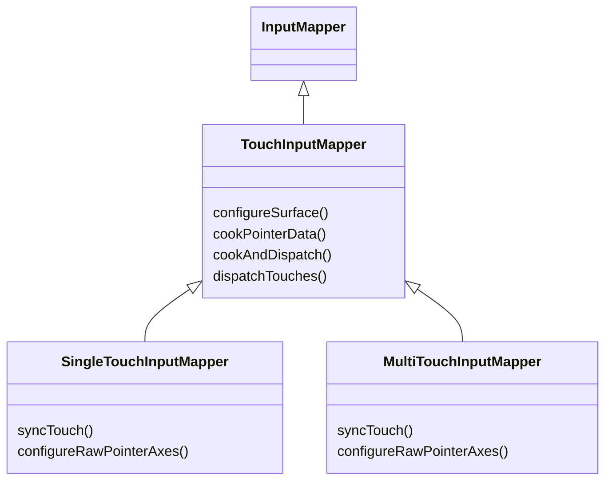
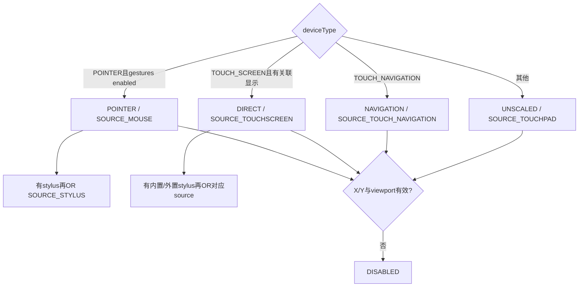
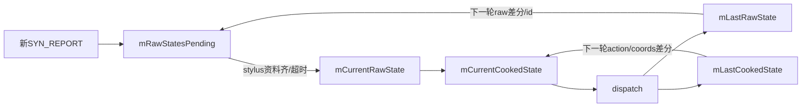

# 182 Android TouchInputMapper：设备配置与 Raw/Cooked State

> 源码版本：Android 11 / API 30 / `android-11.0.0_r48`  
> 学习方式：macOS只读源码，不要求编译或连接设备  
> 前置章节：第20、173、179、181章

---

## 1. 本章目标：先搭骨架，再读多点协议和手势

触摸链远比“ABS_X/Y乘缩放系数”复杂。`TouchInputMapper` 同时服务触摸屏、触控板、触摸导航、带触摸面的指针设备与手写笔，并维护：

```text
驱动axis能力 → device type/mode/source → viewport/surface
→ raw packet → pointer id → pending RawState
→ calibration/affine/rotation → CookedState
→ direct touch / hover / pointer gesture / stylus / mouse分发
```

本章先掌握配置、坐标面、Raw/Cooked状态与重配边界；第183章再深入多点slot/id，第184章再读触控板手势状态机。

---

## 2. 先记住十四条结论

1. `SingleTouchInputMapper`和`MultiTouchInputMapper`只负责收集各自协议，公共配置、cook和dispatch都在`TouchInputMapper`。
2. deviceType来自input property、REL能力和IDC覆盖；deviceMode还受显示可用性与pointer gesture开关影响。
3. touchScreen→DIRECT，pointer+gestures→POINTER，touchNavigation→NAVIGATION，其余→UNSCALED，缺X/Y或viewport→DISABLED。
4. source由最终mode决定，不等于EventHub class；stylus/Bluetooth stylus位可叠加到source。
5. viewport是显示描述，surface是Mapper在自然方向下用于缩放/裁剪的坐标面，raw axis又是驱动坐标，三者不能混用。
6. raw宽高使用`max-min+1`，MotionRange最大值则是inclusive maximum，因此输出range常写`surfaceSize-1`。
7.位置先过policy提供的affine transform，再执行raw-min、scale、translate和surface orientation。
8. RawPointerData保留整数驱动字段和id集合；CookedPointerData保存Android PointerProperties/Coords与浮点轴。
9. `mCurrentRawState`必须是已完整cook并dispatch的状态；外接stylus等待期间的新样本只在pending队列。
10.当前样本时间若早于last raw，会被抬到last时间，避免输出时间倒退。
11.没有pressure轴时，touch默认pressure=1、hover=0；不是所有设备都能提供真实力度。
12.状态差分按pointer id集合生成UP→必要MOVE→DOWN，首个pointer down最终改写为ACTION_DOWN，末个up改为ACTION_UP。
13.源码只在viewport或deviceMode变化时重算range、bump generation并请求device reset；它没有把source-only变化纳入比较。
14. r48在缺axis或viewport的DISABLED早退分支没有执行后面的generation/reset，这是一处需要明确记录的实现边界。

---

## 3. 本章要回答的二十五个问题

1. Single与Multi子类各做什么？
2. INPUT_PROP_DIRECT/POINTER/SEMI_MT如何影响参数？
3. IDC为何能覆盖deviceType和gestureMode？
4. deviceType与deviceMode为何不是一回事？
5. POINTER mode为何可能带MOUSE|STYLUS source？
6. 什么时候设备变成DISABLED？
7. findViewport的优先级是什么？
8. 无关联显示为何仍构造non-display viewport？
9. viewport旋转为何先还原natural尺寸？
10. logical、physical、device尺寸各做什么？
11. raw surface和显示logical surface如何联系？
12. affine、scale、rotation顺序是什么？
13. xPrecision为何等于scale倒数？
14. size/pressure/orientation/distance怎样选择默认校准？
15. tilt为何能同时推导orientation？
16. RawPointerData与CookedPointerData分别保存什么？
17. touching/hovering bits为何分开？
18. pending/current/last四组状态为何都需要？
19. 外接stylus为何最多延迟初始触摸72ms？
20. 时间戳为何只能向前修正？
21. cookAndDispatch如何选择direct或pointer用法？
22. pointer mode里stylus/mouse/finger谁优先？
23. showTouches为何需要PointerController？
24. reset与reconfigure分别清什么？
25. disabled早退为何可能让上层暂时看不到generation/reset？

---

## 4. 源码地图

```text
frameworks/native/services/inputflinger/reader/mapper/
├── TouchInputMapper.cpp/.h
├── SingleTouchInputMapper.cpp/.h
├── MultiTouchInputMapper.cpp/.h
└── accumulator/
    ├── SingleTouchMotionAccumulator.*
    ├── TouchButtonAccumulator.*
    ├── CursorButtonAccumulator.*
    └── CursorScrollAccumulator.*

frameworks/native/services/inputflinger/
├── reader/InputReader.cpp
├── reader/InputDevice.cpp
├── include/InputReaderBase.h
└── include/PointerControllerInterface.h
```

---

## 5. 继承结构不是两套完整实现



子类把不同Linux协议统一成`RawPointerData`。之后的坐标校准、pointer id差分和分发共用父类逻辑。

---

## 6. 初次configure的固定顺序

`changes==0`时：

1. `configureParameters()`判断设备类型；
2. 配置scroll和touch button accumulator；
3. 子类`configureRawPointerAxes()`读取EVIOCGABS信息；
4. `parseCalibration()`解析IDC文字；
5. `resolveCalibration()`结合axis能力补默认值；
6. 更新affine、速度参数；
7. `configureSurface()`决定mode/source/viewport和range。

轴能力和IDC基础参数被当作设备定义，只在首次配置读取；需要改变它们通常应reopen设备，而不是普通incremental change。

---

## 7. gestureMode 的选择

带`INPUT_PROP_SEMI_MT`的设备默认single-touch gesture presentation，因为它只能给接触包围框，无法可靠定位两根独立手指。其他设备默认multi-touch。

IDC可覆盖：

```text
touch.gestureMode = single-touch | multi-touch | default
```

这是pointer触控板的手势呈现策略，不会把MultiTouchInputMapper换成SingleTouchInputMapper；Mapper子类仍由EventHub capability决定。

---

## 8. deviceType 的推断优先级

默认推断：

```text
INPUT_PROP_DIRECT  → TOUCH_SCREEN
INPUT_PROP_POINTER → POINTER
否则有REL_X/Y     → TOUCH_PAD
否则              → POINTER
```

随后IDC `touch.deviceType` 可覆盖为：

```text
touchScreen | touchPad | touchNavigation | pointer
```

所以input property是启发式，IDC是设备适配层的显式声明。

---

## 9. orientation、display与wake参数

touchScreen默认`orientationAware=true`，其他类型默认false，可由IDC覆盖。

以下情况认为有关联显示：

- orientationAware；
- touchScreen；
- pointer；
- EventHub配置了associated display port。

外接touch默认`wake=true`，内部默认false，可用`touch.wake`覆盖。wake只在initial down或新button press时加入，不是每一笔MOVE都唤醒。

---

## 10. deviceType到mode/source



deviceType是配置意图，deviceMode是结合运行时显示/功能后的可执行模式。

---

## 11. POINTER不等于真实鼠标硬件

触控板在POINTER mode下把手指手势翻译成系统mouse source并操作PointerController。若同一触摸硬件还能报告stylus，source可为MOUSE|STYLUS组合。

source是能力bit集合和当前模式声明，不应只用`source==SOURCE_MOUSE`等值比较；Framework通常用`isFromSource(mask)`。

---

## 12. findViewport的精确优先级

有关联显示时：

1. 有associated display port：只取该port viewport；找不到直接失败；
2. 当前mode是POINTER：优先defaultPointerDisplayId，失败后继续；
3. IDC有`touch.displayId` unique id：按unique id查，失败直接返回空；
4. 外接touchscreen选EXTERNAL，否则选INTERNAL；
5. 期望EXTERNAL但缺失时回退INTERNAL。

无关联显示时，基于raw X/Y尺寸构造non-display viewport，不会因为“没有屏幕”自动disabled。

---

## 13. viewport包含三套空间

可把DisplayViewport理解为：

- logical：Framework窗口使用的显示坐标范围；
- physical：logical内容落在物理面板上的区域；
- deviceWidth/Height：完整显示设备像素尺寸；
- orientation：当前显示相对自然方向的旋转。

触摸raw轴可能覆盖整个sensor，而logical内容只占物理面板的一部分。Mapper必须把这些区域关系投影回自然方向，不能只拿logicalWidth/rawWidth做简单比例。

---

## 14. 为什么先还原natural orientation

viewport字段按当前旋转方向描述，但Mapper的raw touch轴固定在设备自然方向。`configureSurface()`按0/90/180/270重新计算natural logical/physical/device宽高与offset。

例如90°时宽高互换，physical left/top也需依据deviceHeight和rotated边界重新推导。之后的mRawSurfaceWidth/Height才能与raw X/Y稳定对应。

---

## 15. raw surface公式表达什么

对DIRECT/POINTER：

```text
rawSurfaceWidth  = naturalLogicalWidth  * naturalDeviceWidth  / naturalPhysicalWidth
surfaceLeft      = naturalPhysicalLeft  * naturalLogicalWidth / naturalPhysicalWidth
surfaceRight     = surfaceLeft + naturalLogicalWidth
```

高度同理。它把“显示logical区域在完整physical device中的占比”换算成一张自然方向logical surface。

physical宽高为0时源码用1代替防除零并记录错误；这是容错，不表示所得坐标可靠。

---

## 16. 非DIRECT/POINTER为何不缩放到显示

UNSCALED/NAVIGATION使用：

```text
physical = raw axis size
rawSurface = raw axis size
surface origin = 0
orientation = 0
```

它们的坐标是设备自身空间或后续导航语义，不应强绑某个屏幕像素面。

---

## 17. raw宽高为何有+1

axis info的min/max均包含端点：

```cpp
rawWidth = maxValue - minValue + 1;
```

若0..4095，共4096个离散位置。输出MotionRange最大值则常为：

```text
surfaceSize + translate - 1
```

遗漏+1/-1会让边缘映射产生典型off-by-one误差。

---

## 18. scale、translate与precision

```text
xScale     = rawSurfaceWidth / rawWidth
xTranslate = -surfaceLeft
xPrecision = 1 / xScale
```

precision表达一个输出单位约对应多少raw单位，不是测量噪声fuzz。方向为90/270时，oriented X precision取原Y precision，Y取原X。

---

## 19. affine与旋转缩放顺序

`cookPointerData()`的位置路径：

```text
raw integer x/y
→ policy TouchAffineTransformation
→ 减raw min
→ mX/YScale
→ surface translate
→ surface orientation swap/reverse
→ cooked float X/Y
```

affine可修正sensor装配偏移、斜切、交叉轴等；它在`rotateAndScale()`之前执行。将affine误放到最终屏幕坐标后会得到不同结果。

---

## 20. affine为何按descriptor与orientation查询

policy调用以设备descriptor和surface orientation为键，可对具体硬件、具体旋转提供变换。`CHANGE_TOUCH_AFFINE_TRANSFORMATION`只更新矩阵，不必重读axis或重建fd。

但这条changes分支本身不设置`resetNeeded`、不bump generation；正在进行的gesture后续点可能使用新矩阵，源码没有在这里自动CANCEL旧流。这是r48的动态校准边界。

---

## 21. RawPointerAxes保存什么

公共结构可容纳：

```text
x/y, pressure,
touchMajor/minor, toolMajor/minor,
orientation, distance, tiltX/Y,
trackingId, slot
```

Single子类查询ABS_X/Y等；Multi子类查询ABS_MT_POSITION_X/Y等。`RawAbsoluteAxisInfo.valid`决定某种校准能否启用，不是字段存在就一定有驱动数据。

---

## 22. RawPointerData的核心结构

每个raw pointer保存整数axis、已解码toolType和isHovering；集合层保存：

- `pointerCount`；
- `touchingIdBits`；
- `hoveringIdBits`；
- `idToIndex[id]`。

id与数组index不同。数组为了紧凑可重排，id用于跨帧识别同一接触点，idToIndex把两者连接。

---

## 23. CookedPointerData增加了什么

Cooked层将每个pointer拆为：

- `PointerProperties`：id与toolType；
- `PointerCoords`：浮点X/Y、pressure、size、orientation、tilt、distance等；
- touching/hovering bits和idToIndex继续保持。

父类保证raw与cooked本轮具有相同id和index，因此后续流程可按需要查raw tool或cooked坐标。

---

## 24. touching与hovering为何互斥分组

stylus可在未接触屏幕时报告位置。hover pointer仍有坐标和toolType，但pressure通常为0，不应进入触摸DOWN序列。

分组让direct dispatch能够按顺序：

```text
button release → hover exit → touches → hover enter/move → button press
```

触笔由hover变touch时先退出hover，再发touch DOWN；从touch抬起到感应范围内则UP后再ENTER/MOVE。

---

## 25. 四层状态不是重复缓存



`current`的严格不变量是：已经走完cook和dispatch。不能提前把pending写成current，否则下游没见过的样本会污染下一轮last/current差分。

---

## 26. SYN_REPORT时怎样构造RawState

父类先push一项并写：

```text
when
touch buttons | cursor buttons
raw V/H scroll
子类syncTouch生成pointer data
```

若协议没有稳定pointer id，再以“上一有效状态与当前位置最小距离匹配”分配id；Multi Protocol B有tracking id时优先自己分配。

随后`processRawTouches(false)`尝试drain pending。

---

## 27. 外接stylus融合为何需要pending队列

外置蓝牙笔可能通过独立设备报告pressure/buttons，屏幕只报告触点位置。DIRECT touch初次down时若笔已连接但pressure尚未到，Mapper最多等待72ms确认该触点是否是笔。

等待期间更多touch raw state可排队，但不能dispatch。stylus状态到来后重新处理；超时则当普通touch继续。

这不是InputDispatcher窗口ANR，也不是App事件延迟策略，而是InputReader设备数据融合。

---

## 28. 72ms、20ms与10ms分别是什么

- `EXTERNAL_STYLUS_DATA_TIMEOUT=72ms`：initial touch等首份stylus资料；
- `TOUCH_DATA_TIMEOUT=20ms`：已有stylus新压力但暂缺对应touch时，等touch更新；
- `STYLUS_DATA_LATENCY=10ms`：只有stylus资料超时合成事件时使用的人工时间偏移。

三个常量服务不同方向的配对，不能合称“手写笔延迟72ms”。

---

## 29. 时间戳倒退怎样处理

drain pending时：

```cpp
if (current.when < last.when) current.when = last.when;
```

系统只钳到相等，不强制`last+1`。因此输出时间不下降，但允许多笔事件时间相同。

这保护后续velocity/gesture状态机免受跨设备stylus融合或合成时间造成的负时间差。

---

## 30. 校准有“parse”和“resolve”两步

parse只理解IDC意图：none/geometric/diameter/box/area、physical/amplitude、interpolated/vector、scaled等。

resolve再看axis能力：

- 有touch/tool major时size默认geometric，否则强制none；
- 有pressure时默认physical，否则none；
- 有orientation时默认interpolated，否则none；
- 有distance时默认scaled，否则none；
- coverage默认none。

因此IDC写了某校准但硬件缺axis，最终仍可能被resolve关闭。

---

## 31. pressure缺失时不是0

有physical/amplitude校准时：

```text
pressure = rawPressure * pressureScale
```

无有效pressure校准时：

```text
hover → 0
touch → 1
```

这让不支持力度的电容屏仍符合“接触时pressure>0”的常见API预期，但它不代表真实压力达到最大。

---

## 32. size校准的几种含义

- geometric：major/minor按surface几何scale换成像素尺寸；
- diameter：令minor=major；
- area：对原面积开平方得到近似直径；
- box：保留major/minor形状；
- none：输出0。

`touch.size.isSummed=true`时，多触点共享总面积的驱动值会除以touching count。之后再应用size.scale/bias，并把负值钳0。

---

## 33. orientation与tilt并非同一轴

若同时有tiltX/Y，Mapper将角度转为弧度，通过三角函数推导：

- orientation范围[-π,π]；
- tilt范围[0,π/2]。

没有tilt时才使用raw orientation的interpolated或vector校准，通常范围[-π/2,π/2]。因此“orientation总是raw orientation乘scale”不成立。

---

## 34. vector orientation的压缩编码

VECTOR模式把raw orientation高、低4bit分别sign-extend为两个分量，用`atan2(c1,c2)/2`求方向；向量长度还用于放大major、缩小minor。

一个字段同时编码方向和椭圆置信度，这是设备协议适配逻辑，不是App侧通用MotionEvent编码。

---

## 35. coverage box为何使用GENERIC_1..4

COVERAGE_BOX把toolMajor/toolMinor的高低16bit拆成raw left/top/right/bottom，旋转缩放后输出：

```text
GENERIC_1=left, GENERIC_2=top,
GENERIC_3=right, GENERIC_4=bottom
```

此时不再用TOOL_MAJOR/MINOR输出常规工具椭圆。源码还留有“TODO: Adjust coverage coords?”，说明affine transform只施加到中心X/Y，coverage box没有同步affine修正。

---

## 36. cook后的pointerUsage优先级

仅POINTER mode分类tool：

```text
stylus/eraser存在 → STYLUS，并清mouse/finger
否则mouse存在   → MOUSE，并清finger
否则finger存在或主button down → GESTURES
```

即stylus > mouse > finger gesture。usage改变时先abort旧usage（发CANCEL/UP等），再启动新用法，避免两套解释同时占用PointerController。

---

## 37. DIRECT/UNSCALED/NAVIGATION的公共dispatch顺序

非POINTER且流未abort时：

1. `dispatchButtonRelease()`；
2. `dispatchHoverExit()`；
3. `dispatchTouches()`；
4. `dispatchHoverEnterAndMove()`；
5. `dispatchButtonPress()`。

如果cooked pointer count回到0，清`mCurrentMotionAborted`，下一条新流才可正常开始。

---

## 38. pointer id集合怎样决定action

相同id集合且非空：MOVE。

集合变化时：

1. 先逐个发消失id的POINTER_UP；
2. 剩余pointer位置或button变化时发MOVE；
3. 再逐个发新增id的POINTER_DOWN。

`dispatchMotion()`发现pointerCount==1时，把POINTER_DOWN改成DOWN、POINTER_UP改成UP，并在首个down设置mDownTime。

---

## 39. 为什么up先于down

一帧可同时一指离开、另一指落下。先up能让旧id从当前集合退出，再down新id，避免瞬间构造出超出真实并发数或错误复用id的集合。

共同保留pointer若移动，会先把新坐标拷入last数组，使UP事件也看到同一采样时刻的其他指位置；随后仍补MOVE，因为App通常不会从POINTER_UP处理其他指移动。

---

## 40. showTouches为何也获取PointerController

DIRECT touch本来不需要系统光标。但`showTouches=true`时Mapper获取共享PointerController，切换到SPOT presentation，并用touching id与cooked coords绘制调试圆点。

关闭showTouches或离开所需mode时清sp；reset时fade并clear spots。调试点是输入可视化，不是App接收事件的一部分。

---

## 41. surface变化为什么abort并reset

viewport/mode变化会：

- 清oriented ranges（mode变化）；
- 重新计算scale/range/gesture参数；
- POINTER mode调用`abortPointerUsage()`；
- 设置`outResetNeeded=true`；
- bump generation。

增量configure返回后发送NotifyDeviceReset，Dispatcher取消旧坐标/source下的connection状态。首次配置不在这里显式发，因为InputReader稍后统一reset新设备。

---

## 42. 哪些changes会重新configureSurface

包括：

- DISPLAY_INFO；
- POINTER_GESTURE_ENABLEMENT；
- SHOW_TOUCHES；
- EXTERNAL_STYLUS_PRESENCE。

pointer speed只更新VelocityControl；affine change只更新矩阵。并非所有变化都会device reset，需看`viewportChanged || deviceModeChanged`。

例如只开showTouches但viewport/mode不变，会获取PointerController，却不一定设置resetNeeded或bump generation。

另一个更隐蔽的例子是外接stylus presence：DIRECT设备的`mSource`可增减`SOURCE_BLUETOOTH_STYLUS`，但若viewport与mode不变，后面的range重建、generation和reset都不会发生。新NotifyMotion已可使用新source，而已发布的InputDeviceInfo/range source仍可能停留在旧代际。

---

## 43. DISABLED早退的实现边界

两处会提前return：

```text
raw X/Y无效
findViewport()为空
```

它们先设置`mDeviceMode=DISABLED`，却在计算`deviceModeChanged`、清range、bump generation、设置resetNeeded之前返回。

若设备从可用状态因display配置丢失而进入此分支，上层可能暂时保留旧generation/device info，且这里不显式notify reset；之后raw输入会被`processRawTouches()`清掉。应把它记录为r48代码行为，而非理想状态机。

---

## 44. reset清理范围

reset会清：

- button/scroll/touch accumulators（button可重新查询kernel）；
- pointer/wheel速度历史；
- pending/current/last raw与cooked状态；
- usage、hover、id、abort、downTime、virtual key；
- pointer gesture/simple状态；
- external stylus融合状态；
- PointerController spots并渐隐。

它不重新解析IDC/axis，也不销毁Mapper；这些属于configure/reopen职责。

---

## 45. virtual key在cook之前消费raw touch

DIRECT surface外的单指初次down先尝试虚拟键hitbox。命中时生成KEYBOARD source虚拟KeyEvent并清raw pointer，使触摸不再进入cook。

手指离开hitbox或第二指加入时，虚拟键发CANCELED UP，随后本轮触摸可转回屏幕流。surface内触摸还会启动quiet time，暂时抑制邻近虚拟键误触。

这说明“off-screen一定丢弃”不准确：可能被转换成虚拟硬键。

---

## 46. getAssociatedDisplayId按mode变化

有关联显示时：

- POINTER从PointerController获取displayId；
- 其他mode取mViewport.displayId。

无关联显示返回null，最终NotifyMotion使用NONE。不要因为所有TouchInputMapper都有mViewport成员，就断言每笔touch一定有具体display。

---

## 47. macOS只读练习

### 练习一：画mode决策树

```bash
sed -n '430,750p' frameworks/native/services/inputflinger/reader/mapper/TouchInputMapper.cpp
```

区分deviceType、deviceMode、source、disabled条件。

### 练习二：核对坐标顺序

```bash
rg -n "applyTo|rotateAndScale|mXScale|mXTranslate" \
  frameworks/native/services/inputflinger/reader/mapper/TouchInputMapper.cpp
```

手算raw min不为0的0°点。

### 练习三：追四层state

```bash
sed -n '1380,1590p' frameworks/native/services/inputflinger/reader/mapper/TouchInputMapper.cpp
```

解释为什么pending不能提前成为current。

### 练习四：比较Single/Multi入口

```bash
sed -n '20,105p' frameworks/native/services/inputflinger/reader/mapper/SingleTouchInputMapper.cpp
sed -n '210,365p' frameworks/native/services/inputflinger/reader/mapper/MultiTouchInputMapper.cpp
```

只关注它们怎样填同一种RawPointerData。

### 练习五：验证disabled早退

```bash
sed -n '620,790p' frameworks/native/services/inputflinger/reader/mapper/TouchInputMapper.cpp
```

找出return与`deviceModeChanged`、`bumpGeneration()`的相对位置。

---

## 48. 手算一个坐标与状态序列

假设raw X范围100..1099（宽1000），raw surface宽2000，surfaceLeft=100：

```text
xScale=2
xTranslate=-100
raw x=600，affine不变，orientation=0
x=(600-100)*2-100=900
```

单指序列：

```text
{} → {id0}       = ACTION_DOWN，downTime=t1
{id0} → {id0}    = ACTION_MOVE
{id0} → {id0,id1}= ACTION_POINTER_DOWN(index of id1)
{id0,id1}→{id1}  = ACTION_POINTER_UP(index of id0)
{id1}→{}          = ACTION_UP
```

首/末action由`dispatchMotion()`在pointerCount==1时从POINTER_DOWN/UP改写。

---

## 49. 复读审计：十二个易错边界

1. deviceType是配置分类，deviceMode是运行结果，source又是对外能力，三者不可互换。
2. SEMI_MT只默认改变gestureMode，不会切换Mapper子类。
3. associated port查不到viewport不会继续其他fallback。
4. uniqueDisplayId查不到时同样直接失败；EXTERNAL type查找才有INTERNAL fallback。
5. affine更新不自动reset当前gesture。
6. output时间可相等，只保证不倒退。
7. 无pressure时touch=1不是物理力度。
8. coverage box中心做affine而box边界未做，源码有TODO。
9. POINTER tool优先级会abort旧usage，不是多种tool同时分发。
10. showTouches变化不必然bump generation。
11. 外接stylus造成的source-only变化未被viewport/mode比较捕获，可能不更新range/generation。
12. DISABLED早退绕过后续reset/generation路径。
13. reset清状态但不重读基础axis/IDC；设备定义变化仍需reopen。

---

## 50. 最终模型、检查题与下一章

### 一句话模型

```text
TouchInputMapper先把input property与IDC解释成deviceType，再结合gesture开关、axis和viewport得到运行mode/source；
它把显示viewport还原为自然方向surface，令raw坐标依次通过affine、min/scale/translate和rotation成为cooked PointerCoords；
每个SYN样本先进入pending RawState，只有外接stylus资料齐备或超时才成为已dispatch的current/last，
随后按tool usage或pointer-id集合生成有序hover/touch/button事件，并以generation+device reset隔离有效的surface/mode变化。
```

### 检查题

1. touchScreen、pointer、touchPad、touchNavigation分别可能落入什么mode/source？
2. deviceType与mode为什么不能等同？
3. findViewport哪两种“指定但找不到”不会继续fallback？
4. raw width为什么是max-min+1？
5. affine与rotation谁先执行？
6. pending/current/last的严格不变量是什么？
7. 无pressure轴时touch和hover各输出多少？
8. 一帧同时up/down时为何先up？
9. showTouches为何用PointerController却不改变App事件？
10. disabled早退漏过了哪段通用重配收尾？

### 下一章

第183章深入MultiTouch Protocol A/B、slot、trackingId、pointer id稳定分配、palm取消与多指action index。
