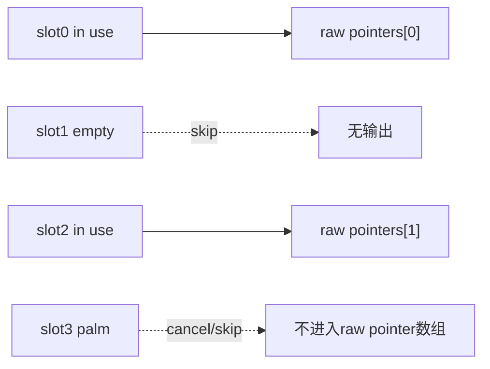
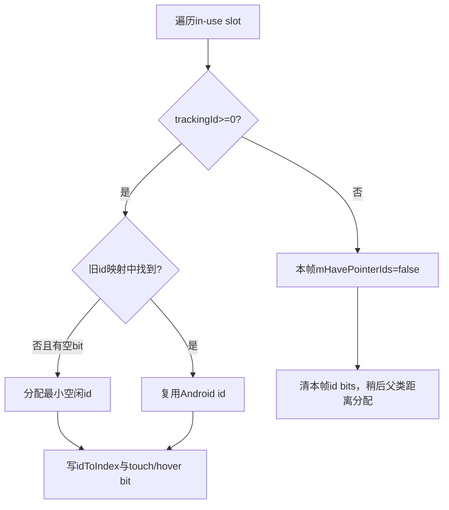
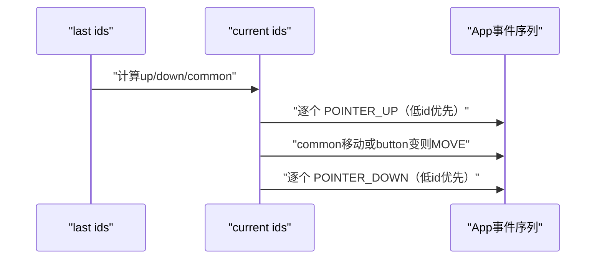

# 183 Android MultiTouch Protocol：Slot、TrackingId 与 PointerId

> 源码版本：Android 11 / API 30 / `android-11.0.0_r48`  
> 学习方式：macOS只读源码，不要求编译或连接设备  
> 前置章节：第20、179、182章

---

## 1. 本章目标：把四种“编号”彻底分开

多指日志里最容易混淆的是：

```text
slot index      驱动把哪一格contact state选为当前格
trackingId      驱动给一次物理接触分配的生命周期代号
Android pointerId  Framework为当前手势维护的0..31稳定小整数
action index    本笔MotionEvent数组中发生变化的pointer下标
```

它们可能偶尔数值相同，但没有等值契约。本章从Linux Protocol A/B追到Android id bitset、数组打包和ACTION_POINTER_INDEX。

---

## 2. 先记住十四条结论

1. Protocol B由有效ABS_MT_TRACKING_ID、ABS_MT_SLOT且slot范围从0开始、max>0共同识别；否则走Protocol A兼容路径。
2. r48最多保存32个Protocol B slot，超过部分在配置时截断。
3. Protocol B slot跨SYN_REPORT持久保存，trackingId=-1才释放；Protocol A每包结束清空临时slots。
4. Protocol A以SYN_MT_REPORT结束一个contact并把临时slot递增，SYN_REPORT结束整帧。
5. slot位置不是pointer顺序；空slot会被跳过，输出RawPointerData按slot扫描压紧。
6. 有合法trackingId时，Android用trackingId保持pointerId；新trackingId占用最小空闲pointerId。
7. pointerId不会直接等于trackingId，也不保证一次手势中单调增加。
8. 任一活动slot无法取得合法id时，本帧整体放弃tracking映射，由父类按tool type与坐标距离重新匹配。
9. 距离回退是逐条取全局最短边的贪心匹配，不是全局最优指派算法。
10. action index来自最终按pointerId升序打包的数组位置，不是slot、trackingId或pointerId本身。
11. 同帧有up和down时先逐个up，再必要move，再逐个down。
12. Palm slot会取消当前touch/pointer usage并被排除；direct流可一直抑制到所有有效pointer清空。
13. Protocol B reset无法读回所有slot，仅查询当前ABS_MT_SLOT并把全部slot内容清0，短暂错位可能造成跳点但避免stuck touch。
14. r48不验证duplicate trackingId；异常驱动可让两个slot竞争同一个Android pointerId。

---

## 3. 本章要回答的二十五个问题

1. Protocol A/B的线格式差异是什么？
2. Android怎样判定使用slot协议？
3. 为什么slot max=0反而不走B路径？
4. slot为什么要跨帧保存？
5. trackingId=-1做什么？
6. Protocol A如何表示一帧多个contact？
7. reset为何不能恢复所有B slot？
8. invalid slot后面的axis怎样处理？
9. raw output顺序与slot顺序有什么关系？
10.最多支持多少slot与pointer？
11. trackingId如何映射成pointerId？
12. pointerId什么时候可以复用？
13. trackingId缺失为何整帧回退？
14. 距离匹配为何要求toolType相同？
15. 一指场景为何直接沿用旧id？
16. 贪心匹配可能在哪种交叉运动中换id？
17. pointerId与array index如何连接？
18. action index怎样编码进action？
19. 首DOWN/末UP为何由POINTER action改写？
20. 同帧up/down为什么按这个顺序？
21. palm检测在哪里取消流？
22. hover与touch变化能否保持同id？
23. duplicate trackingId会怎样？
24. SYN_DROPPED后为什么不能无缝续接？
25. 如何只读手算三指序列？

---

## 4. 源码地图

```text
frameworks/native/services/inputflinger/reader/mapper/
├── MultiTouchInputMapper.cpp/.h
└── TouchInputMapper.cpp/.h

关键对象：
MultiTouchMotionAccumulator
├── mCurrentSlot
├── Slot[mSlotCount]
├── mUsingSlotsProtocol
└── mHaveStylus

MultiTouchInputMapper
├── mPointerIdBits
└── mPointerTrackingIdMap[32]
```

---

## 5. Protocol A 与 B 的直观差别

Protocol A每一帧重复描述所有contact：

```text
contact0 axes → SYN_MT_REPORT
contact1 axes → SYN_MT_REPORT
SYN_REPORT
```

Protocol B先选slot，只报告变化：

```text
ABS_MT_SLOT 0
ABS_MT_TRACKING_ID 41
POSITION...
ABS_MT_SLOT 1
ABS_MT_TRACKING_ID 57
POSITION...
SYN_REPORT
```

B更像持久状态表的增量更新；A更像每帧重新列清单。

---

## 6. B协议识别条件

```cpp
trackingId.valid && slot.valid &&
slot.minValue == 0 && slot.maxValue > 0
```

满足才设置`usingSlotsProtocol=true`。`maxValue+1`是slotCount，超过32截断。

注意max=0表示只有slot0，源码条件却要求`>0`，因此会落入A兼容路径。这是r48精确实现，不应改写成“只要有ABS_MT_SLOT就是B”。

---

## 7. Protocol A 的临时slot

A模式起始`mCurrentSlot=-1`。第一笔EV_ABS先令其为0；每个`SYN_MT_REPORT`令slot+1。

整帧`SYN_REPORT`时先由父类调用`syncTouch()`读取所有in-use slot；之后`finishSync()`执行`clearSlots(-1)`。下一帧重新从0描述。

若一段contact没有任何被识别axis，对应slot不会`mInUse=true`，输出时被跳过。

---

## 8. Protocol B 的持久slot

B模式的`ABS_MT_SLOT=n`只改变当前写入格；随后POSITION/PRESSURE等覆盖该格字段。没有更新的格保留上一帧内容。

```text
trackingId >= 0 → slot in use，并保存trackingId
trackingId < 0  → slot不再in use，但旧axis内容保留供未来覆盖
```

释放不是清除整格。新接触复用slot时驱动必须按协议提供新trackingId和必要axis。

---

## 9. invalid slot如何处理

若当前slot<0或>=slotCount，后续EV_ABS axis被忽略。只有DEBUG_POINTERS开启且刚收到非法ABS_MT_SLOT时才打warning。

因此生产日志未出现warning不代表驱动没有非法slot；默认调试宏可能关闭。后续合法ABS_MT_SLOT会恢复正常写入。

---

## 10. axis写入也会标记in-use

POSITION、TOUCH_MAJOR、PRESSURE等分支都设置`mInUse=true`，不只TRACKING_ID如此。

这对A协议必要；对B协议则有一个很隐蔽的边界：驱动若先用`trackingId=-1`释放slot，随后又错误地报告该slot的POSITION、PRESSURE等axis，axis分支会再次把`mInUse`设为true。更关键的是，`trackingId=-1`分支只把`mInUse`清零，并没有把`mAbsMTTrackingId`写成-1，所以这个被错误“复活”的slot保留的是释放前的旧trackingId。结果可能是一个已经结束的contact被当成原手指继续存在，并沿用旧pointerId。Mapper没有强制校验这类协议时序。

---

## 11. reset为何无法恢复B的完整状态

Linux接口在这里仅查询当前`ABS_MT_SLOT`值，无法一次读回r48 accumulator需要的全部slot内容。因此reset：

1. 清空每格；
2. ioctl读取当前slot index；
3. 读取失败则设-1。

源码承认evdev缓冲里早先事件可能基于另一个current slot，短期会把两个slot资料混合直至下一ABS_MT_SLOT，表现为跳点；但清空能避免永久stuck touch。

---

## 12. slot到RawPointerData的压紧



`outCount`只在有效非palm slot后递增，所以array index既不等于slot，也可能随空slot变化。

---

## 13. toolType的解析与fallback

ABS_MT_TOOL_TYPE支持：

```text
MT_TOOL_FINGER → FINGER
MT_TOOL_PEN    → STYLUS
MT_TOOL_PALM   → PALM
其他/未提供   → UNKNOWN
```

UNKNOWN时再查TouchButtonAccumulator的tool type；仍unknown则默认FINGER。`mHaveStylus`只表示设备具有ABS_MT_TOOL_TYPE axis，实际当前slot仍需逐值判断。

---

## 14. hovering的判断

非mouse tool满足任一条件会标hover：

- TouchButtonAccumulator说正在hover；
- pressure axis有效且当前pressure<=0。

hovering/touching分别进入bitset。trackingId匹配允许同tool从hover转touch或反向仍保持同Android pointerId。

---

## 15. trackingId不是Android pointerId

driver trackingId可能是41、57或更大。Android需要0..31的小整数以便BitSet32与MotionEvent API使用。

映射表：

```text
mPointerIdBits：上一帧占用的Android id
mPointerTrackingIdMap[id]：该id对应driver trackingId
```

每帧扫描活动slot，以trackingId在旧映射中寻找id；找不到则`markFirstUnmarkedBit()`分配最小空闲id。

---

## 16. pointerId何时复用

本帧结束后：

```cpp
mPointerIdBits = newPointerIdBits;
```

已消失trackingId对应bit不再占用。下一笔新contact可以立即拿到该最小空闲id。

因此pointerId只需在一次contact生命周期内稳定，不保证跨抬起、下一次触摸仍代表同一手指。

---

## 17. 有trackingId时的完整流程



只要一枚活动pointer失败，就放弃整帧直接id映射，避免一半tracking、一半推测的混合体系。

---

## 18. duplicate trackingId的边界

r48扫描旧映射时不在找到后break，也不检查同帧两个slot是否使用同一trackingId。

异常情况下两个slot可取得同一Android id，后写的`idToIndex[id]`覆盖前写，bitset只保留一bit，而`pointerCount`仍包含两项。后续状态不一致。

这是驱动必须遵守trackingId唯一契约的原因；Framework此处不是强校验器。

---

## 19. tracking失败后的距离分配入口

`syncTouch()`置`mHavePointerIds=false`并清当前id集合，父类`sync()`随后调用：

```cpp
assignPointerIds(last, next);
```

这个回退也服务Protocol A或无trackingId设备。它使用上一份“已排队基线状态”与当前raw坐标，而不是slot号猜身份。

---

## 20. 0指和1指的快速路径

- 当前0指：无需分配；
- 上一帧0指：按当前array index依次给id 0,1...；
- 前后都恰好1指且toolType相同：无条件沿用旧id。

单指快速路径不计算移动距离，即使坐标跳很远也视为同一个contact；这是没有tracking信息时维持连续性的选择。

---

## 21. 一般距离匹配如何构造候选

对每个current pointer与last pointer配对，只有toolType相同才入候选heap，距离为：

```text
(current.x-last.x)^2 + (current.y-last.y)^2
```

使用raw整数坐标、平方距离，不需要sqrt，也不经过affine或显示rotation。这样显示配置改变不直接影响硬件接触身份估计。

---

## 22. 它是贪心，不是全局最优

算法建最小heap，反复取当前最短且两端都未匹配的边。每个current/last最多匹配一次。

这不等于Hungarian等全局最小总成本算法。两指交叉、距离相近或采样稀疏时，局部最短选择可能造成id交换。没有trackingId的设备无法从纯坐标彻底解决物理身份歧义。

---

## 23. toolType为何必须相同

finger不能因坐标接近就继承stylus id。toolType门保证身份连续至少保持工具类别。

但hover→touch允许匹配，因为代码刻意不比较hovering状态；触笔悬停后落笔应保持同一pointer id。

---

## 24. 未匹配pointer怎样拿新id

匹配后收集`usedIdBits`，每个未匹配current pointer拿`markFirstUnmarkedBit()`。

这里选择的是未被“当前仍匹配的旧pointer”占用的最小id。已经up的旧id可在同一新frame被新down复用；action生成仍会先发旧UP再发新DOWN，保持时序可解释。

---

## 25. pointer id、index与idToIndex

Raw/Cooked数组为紧凑存储；pointerId用于跨事件身份；`idToIndex[id]`做反查。

最终`dispatchMotion()`并非原样复制数组，而是遍历目标`idBits`从低id到高id，重新打包properties/coords。因此App看到的pointer array通常按id升序，原slot扫描index还会再次变化。

---

## 26. action index怎样编码

若`changedId>=0`，打包时发现该id便执行：

```cpp
action |= pointerCount << ACTION_POINTER_INDEX_SHIFT;
```

这里pointerCount是“已打包到输出数组的当前位置”。所以：

```text
action index = event中getPointerId(index)==changedId的那个index
```

它不等于changedId。应用必须用`getActionIndex()`再`getPointerId()`。

---

## 27. 首DOWN与末UP的改写

内部统一调用POINTER_DOWN/POINTER_UP。`dispatchMotion()`若打包后pointerCount==1：

```text
POINTER_DOWN → DOWN
POINTER_UP   → UP
```

此时index必为0。首DOWN还设置整段touch gesture的`mDownTime=when`，后续多指变化沿用。

---

## 28. id集合不变就是MOVE

`currentIdBits==lastIdBits`且非空时，无论坐标是否真的变化，源码都会dispatch ACTION_MOVE。

InputListener/Dispatcher可进一步batch move，但Mapper没有在这一简单分支比较coords后跳过“零移动”。因此每个有效SYN_REPORT可能产生MOVE。

---

## 29. 同帧集合变化的固定顺序



up事件使用被更新过的last坐标数组：共同pointer的新位置会一同出现。随后补MOVE，确保App明确处理共同pointer移动。

---

## 30. 同一frame旧id可否复用

距离fallback可把一个消失旧id留出，又让未匹配新pointer取得这个空闲id。但current/last集合从bit角度可能看起来id仍存在，导致被解释为MOVE而非UP+DOWN。

trackingId正常的Protocol B也会给新tracking分配当前旧bit集中未占用id；由于旧`mPointerIdBits`在扫描新frame前仍含刚消失id，新contact不会在同一frame抢到它，通常能保留UP/DOWN区别。两条路径的复用细节不同。

---

## 31. Protocol B为何更可靠

trackingId明确告诉Frameworkcontact生命周期，即使两指交叉也不必猜距离。slot可复用，但新trackingId让新contact与旧contact区分。

可靠的前提是驱动遵守：活动contact trackingId唯一、接触期间稳定、结束发-1、新接触给新id。Android不能补救任意错误协议。

---

## 32. Palm怎样触发取消

扫描slot发现toolType=PALM：

```cpp
if (!mCurrentMotionAborted) cancelTouch(when);
continue;
```

`cancelTouch()`同时abort pointer usage与direct touches；palm本身不加入RawPointerData。

对direct流，`abortTouches()`若已有touch会发ACTION_CANCEL并置`mCurrentMotionAborted=true`。

---

## 33. Palm后何时恢复

非POINTER direct路径在`mCurrentMotionAborted`为true时跳过正常button/hover/touch dispatch。只有当前cooked pointerCount==0才清abort flag。

因此palm出现时即使其他手指仍在，后续事件也可能持续抑制，直到所有非palm有效pointer离开，再从下一条新流恢复。这避免掌压期间部分手指流意外复活。

---

## 34. 多个palm为何只取消一次

同一帧或后续帧继续看到palm时，`!mCurrentMotionAborted`门阻止重复CANCEL。

POINTER mode的abort语义还依赖pointer usage实现；`mCurrentMotionAborted`主要由direct `abortTouches()`在确有current touching id时设置。分析触控板palm时不能完全套用direct恢复描述。

---

## 35. pointer上限与slot上限不同

- Protocol B slot上限：`MAX_SLOTS=32`；
- Android输出pointer上限：`MAX_POINTERS`（r48 input常量上限）；
- pointerId空间：BitSet32，0..31。

扫描活动slot时若`outCount>=MAX_POINTERS`就忽略其余。能缓存32 slot不等于一笔MotionEvent会输出32指。

---

## 36. slot截断后的后果

设备声明超过32 slot时只分配前32格。驱动选择slot>=32时视为invalid，该格的axis被忽略。

日志只在DEBUG_POINTERS下可能出现，且配置时会有“framework only supports maximum 32 slots”警告。排查少指时要同时看capability与运行raw slot值。

---

## 37. Protocol A的trackingId负值边界

代码仅在`mUsingSlotsProtocol && value<0`时把slot释放。A模式收到负trackingId仍走else：slot in-use、trackingId保存为负。

随后直接id映射失败，父类距离分配接管；包末所有slot清空。不能把B协议的“-1结束slot”语义机械套到A accumulator实现。

---

## 38. reset与SYN_DROPPED

SYN_DROPPED时InputDevice reset，Multi accumulator清slot/id bit，Dispatcher收到device reset取消旧connection状态；InputDevice再丢raw到下个SYN_REPORT。

恢复后Framework无法知道丢失区间每个contact的精确生灭，只能从清空后的新报告建立新状态。因此应用应看到旧流CANCEL，而不是期望pointerId无缝延续。

---

## 39. process调用顺序为何不丢SYN_REPORT

`MultiTouchInputMapper::process()`先调用父类，父类在SYN_REPORT立即`sync()`；再把同一rawEvent交给Multi accumulator。

这看似倒序，但Multi accumulator对SYN_REPORT本身没有处理，所需ABS与SYN_MT_REPORT早已在之前raw event中写入。父类sync后，子类最后看到SYN_REPORT是no-op，不会漏数据。

---

## 40. 多指action的低id顺序

upIdBits/downIdBits用`clearFirstMarkedBit()`，因此同帧多个up/down按低pointerId先发。

这不是slot顺序或物理落下的亚帧时间顺序；一个SYN frame只给出同一提交时刻，Framework选择确定性id顺序展开为多笔MotionEvent。

---

## 41. 手算Protocol B两指序列

```text
Frame1: slot0 tracking41 down → Android id0 → ACTION_DOWN(id0)
Frame2: slot1 tracking57 down → Android id1 → POINTER_DOWN(index1,id1)
Frame3: slot0 moves           → ids{0,1} → MOVE
Frame4: slot0 tracking=-1     → POINTER_UP(index0,id0)，事件仍含id0/id1
Frame5: slot1 tracking=-1     → ACTION_UP(id1)
```

Frame4之后current仅id1，但POINTER_UP必须携带up前完整集合，才能标明哪个index离开。

---

## 42. 手算slot与action index不相等

假设slot2→tracking100→Android id0，slot0→tracking200→Android id1。

最终dispatch按id升序打包：

```text
index0: pointerId0（来自slot2）
index1: pointerId1（来自slot0）
```

若id1变化，action index=1；slot=0、trackingId=200、pointerId=1、actionIndex=1只是其中两个碰巧相同。

---

## 43. 手算同frame一升一降

last={id0,id1}，current={id1,id2}：

```text
1. POINTER_UP changed=id0，打包{id0,id1}
2. id1坐标变了则MOVE，打包{id1}
3. POINTER_DOWN changed=id2，打包{id1,id2}
```

三笔eventTime相同、downTime沿用最初id0开始整段gesture的时间；id0离开不重置downTime，因为还有id1。

---

## 44. 距离贪心的交叉风险

两根同tool手指在两帧之间交叉：

```text
last A左 B右
current A右 B左
```

纯坐标最短会把“当前左”匹配旧左，而不知物理上它其实是B。Android pointerId因此交换物理手指身份，但坐标轨迹看起来平滑。

这正是trackingId存在的价值：身份由驱动接触生命周期而非运动猜测决定。

---

## 45. hover转touch为何保持id

距离候选只要求toolType相同，不要求isHovering相同。有trackingId时更直接沿用映射。

所以stylus hover id5落笔后仍可为id5，事件层先HOVER_EXIT，再ACTION_DOWN；“流类型改变”不必“pointer身份改变”。

---

## 46. App正确读取多指事件

```java
int actionIndex = event.getActionIndex();
int pointerId = event.getPointerId(actionIndex);
float x = event.getX(actionIndex);
```

后续要找同一pointer：

```java
int index = event.findPointerIndex(pointerId);
```

不能长期保存index。pointer up后数组压紧、按id重新打包，某id的index可能变化。

---

## 47. macOS只读练习

```bash
# A/B协议与slot生命周期
sed -n '20,205p' frameworks/native/services/inputflinger/reader/mapper/MultiTouchInputMapper.cpp

# trackingId到pointerId
sed -n '205,350p' frameworks/native/services/inputflinger/reader/mapper/MultiTouchInputMapper.cpp

# 距离回退
sed -n '3660,3865p' frameworks/native/services/inputflinger/reader/mapper/TouchInputMapper.cpp

# action index打包
sed -n '3515,3595p' frameworks/native/services/inputflinger/reader/mapper/TouchInputMapper.cpp
```

分别写出slot、tracking、pointer id、index的创建与失效点。

---

## 48. 调试清单

出现跳点、错指或stuck touch时依次检查：

1. 设备是否真满足B协议识别条件；
2. slot范围是否超过32或发非法值；
3. trackingId是否接触期稳定且不同contact唯一；
4. 结束是否发trackingId=-1；
5. 是否发生SYN_DROPPED/reset；
6. toolType是否在帧间异常变化；
7. 是否缺tracking导致距离贪心；
8. App是否错误缓存pointer index而非id。

---

## 49. 复读审计：十二个易错边界

1. 有ABS_MT_SLOT不等于r48一定选Protocol B，条件还含tracking axis、min0、max>0。
2. B slot保存旧axis，释放只改in-use。
3. 其他axis可把刚释放slot重新标in-use，依赖驱动顺序正确。
4. reset只读current slot，读不回所有slot。
5. raw array index是压紧后的slot扫描结果。
6. trackingId不等于pointerId。
7. action index不等于pointerId。
8. 一枚无效tracking会让整帧回退，不是只为该pointer猜id。
9. 距离算法是同tool贪心，不是全局最优。
10. duplicate trackingId未被验证。
11. palm direct流可能抑制到所有pointer清空；pointer mode边界不同。
12. id集合不变即发MOVE，不要求坐标真的变化。

---

## 50. 最终模型、检查题与下一章

### 一句话模型

```text
Protocol A每帧以SYN_MT_REPORT列出临时contact，Protocol B以ABS_MT_SLOT维护持久格并用trackingId=-1释放；
MultiTouchInputMapper把in-use非palm slot压紧成RawPointerData，优先用trackingId映射到0..31的Android pointerId，失败则整帧按同tool raw距离贪心匹配；
TouchInputMapper再比较last/current id集合，按低id顺序展开UP→必要MOVE→DOWN，并按最终id升序打包数组，由changedId所在数组位置编码action index。
```

### 检查题

1. slot、trackingId、pointerId、action index分别由谁定义？
2. r48识别B协议的四个条件是什么？
3. B释放slot为何不清旧axis？
4. trackingId=57为何可能映射pointerId=0？
5. 一枚trackingId无效为何整帧回退？
6. 距离匹配为何会在交叉手势换身份？
7. 同frame{id0,id1}→{id1,id2}输出什么顺序？
8. 为什么App不能保存pointer index？
9. palm后direct流何时恢复？
10. SYN_DROPPED后为何应CANCEL旧流而非续接id？

### 下一章

第184章深入触控板Pointer Gesture状态机：HOVER、TAP、TAP_DRAG、PRESS、SWIPE、FREEFORM、QUIET及PointerController协作。
