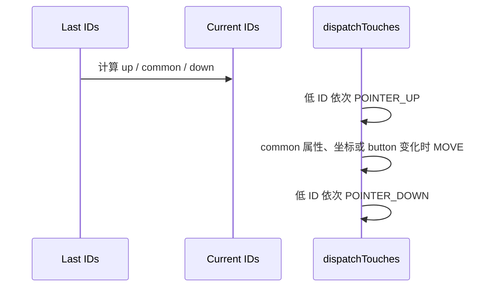

# 183 Android MultiTouch Protocol：Slot、TrackingId 与 PointerId

> 源码基线：Android 11 / API 30 / `android-11.0.0_r48`，`frameworks/base` 提交 `1d9b9ab57d`  
> 学习方式：macOS 静态只读，不要求编译、不要求连接设备  
> 前置章节：第 20、173、179、182 章

---

## 1. 先抓住故障现场：四种编号相等，只能算巧合

一份多指日志可能同时出现四种“编号”：

| 名称 | 谁定义 | 生命周期 | 用途 |
|---|---|---|---|
| slot | Linux MT Protocol B 驱动 | 一张设备状态表中的格子，可反复复用 | 指定后续 ABS_MT_* 写哪格 |
| trackingId | 驱动 | 一次物理 contact 从出现到消失 | 告诉 Framework 哪些样本属于同一接触 |
| pointerId | Android Reader | 一段被 Framework 认为连续的 pointer 生命周期 | 跨 MotionEvent 追踪同一 pointer |
| pointer index | 每一笔 MotionEvent | 只对当前数组有效 | 访问本笔 properties/coords；变化项又成为 action index |

它们有时恰好都是 0，却没有等值契约。典型误判包括：

- 把 `ABS_MT_SLOT=2` 当成 App 的 `pointerId=2`；
- 长期保存 `getActionIndex()`，下一笔仍拿它找同一根手指；
- 看到 trackingId 从 57 变 58，就断言 Android 一定先发 UP 再发 DOWN；
- 认为没有 slot 的 Protocol A 一定只能靠坐标猜身份；
- 认为同一个 pointerId 的 toolType 必然不变。

r48 的真实链路是：

```text
EV_ABS / EV_SYN
  → MultiTouchMotionAccumulator 的临时或持久 slot
  → syncTouch() 按 slot 扫描并压紧 RawPointerData
  → trackingId 直映射；失败才由父类按 raw 距离回退
  → touching/hovering id bitset 比较
  → DIRECT 等非 POINTER 路径展开 UP → 可选 MOVE → DOWN
  → dispatchMotion() 按 pointerId 重新打包并编码 action index
```

本章既讲正常驱动的稳定路径，也解释几条会破坏身份语义的 r48 边界：负 trackingId、重复 trackingId、同帧 ID 复用、Palm 门、reset 后的增量 B 状态，以及 Pointer mode 中不会清掉的 abort 标志。

---

## 2. 源码地图与三个提交边界

核心文件：

```text
frameworks/native/services/inputflinger/reader/
├── InputDevice.cpp
└── mapper/
    ├── MultiTouchInputMapper.cpp/.h
    └── TouchInputMapper.cpp/.h

frameworks/native/services/inputflinger/dispatcher/InputDispatcher.cpp
frameworks/native/services/inputflinger/tests/InputReader_test.cpp
frameworks/native/include/input/Input.h
system/core/libutils/include/utils/BitSet.h
```

先分清三个提交边界：

1. `SYN_MT_REPORT`：Protocol A 中结束一个 contact 描述，accumulator 换到下一临时格；
2. `SYN_REPORT`：父类立即调用 `sync()`，形成一份 `RawState`；
3. `notifyMotion()`：cook 与 action 展开完成后，才把一笔或多笔 Motion 通知交给下游。

`MultiTouchInputMapper::process()` 的调用顺序乍看反常：先 `TouchInputMapper::process(rawEvent)`，再执行 `mMultiTouchMotionAccumulator.process(rawEvent)`。

对普通 ABS 事件，父类先更新 button/scroll 等公共 accumulator，子类随后写 MT slot。对 `SYN_REPORT`，父类会先 `syncTouch()` 读取已经积累好的 slot；子 accumulator 对 `SYN_REPORT` 本身没有分支，所以随后看到它只是 no-op，不会少读一帧。

`sync()` 生成 `next` 后选择 ID 回退基线：pending 只有 `next` 时，`last` 是已提交的 `mCurrentRawState`；已有更早 pending 时，`last` 是 `next` 前一份 pending RawState。

因此外接笔融合令 RawState 排队时，距离匹配针对的是相邻 raw packet，不一定是 App 已经收到的最后一笔事件；这是第 182 章 pending/current/last 账本在本章的直接用途。

---

## 3. Protocol A 与 B：一个是逐帧清单，一个是增量状态表

Protocol A 每帧重新列出当前 contact：

```text
ABS_MT_POSITION_X/Y ... contact A
SYN_MT_REPORT
ABS_MT_POSITION_X/Y ... contact B
SYN_REPORT
```

设备还用 `BTN_TOUCH` 或 `ABS_PRESSURE` 标出接触时，最后一个 contact 后的 `SYN_MT_REPORT` 可以省略；`SYN_REPORT` 自己提交整帧。下一帧仍须再次描述存在的 contact。

Protocol B 用 slot 保存跨帧状态，只上报变化：

```text
ABS_MT_SLOT 0
ABS_MT_TRACKING_ID 41
ABS_MT_POSITION_X 100
ABS_MT_POSITION_Y 200

ABS_MT_SLOT 1
ABS_MT_TRACKING_ID 57
ABS_MT_POSITION_X 500
ABS_MT_POSITION_Y 600
SYN_REPORT
```

下一帧若只有 slot 1 移动，可以只发 slot 1 的新坐标。结束 contact 时，Linux 规范通常先选 slot，再报告 `ABS_MT_TRACKING_ID -1`。

但 r48 实现判断的是 `value < 0`，不是只认 `-1`。任何负值在 B 路径都会令该 slot `mInUse=false`。

两个协议的核心差异不是“有没有 trackingId”。Protocol A 也可以携带非负 trackingId，并因此走 Android 的直接 ID 映射；A/B 选择与 trackingId 能否用于身份映射是两次独立判断。

---

## 4. Android 怎样选择协议：识别条件、16/32/32 三个上限

`configureRawPointerAxes()` 只有在四个条件同时成立时才启用 slot 协议：

```cpp
trackingId.valid && slot.valid &&
slot.minValue == 0 && slot.maxValue > 0
```

这带来三个容易漏掉的边界：

- 仅出现 `ABS_MT_SLOT` 不足以判为 B；
- slot 最小值不是 0 会落入 A 兼容路径；
- `slot.maxValue == 0` 代表只声明 slot 0，但 r48 仍把它当 A。

容量要分三种：

| 容量 | r48 值 | 含义 |
|---|---:|---|
| A 临时 slot 数 | `MAX_POINTERS = 16` | 一帧最多收集 16 个 A contact |
| B 持久 slot cache | `MAX_SLOTS = 32` | capability 声明更多时配置阶段截成 32 |
| pointerId 数字空间 | BitSet32，即 0..31 | 身份号空间，不等于单笔输出容量 |

B 即使缓存 32 格，`syncTouch()` 最多也只输出 16 个非 Palm pointer。达到 16 后，遇到下一枚 in-use、非 Palm slot 就 `break`，所以单笔 MotionEvent 不会因为有 32 个 slot 而携带 32 指。

设备声明超过 32 格时会打印配置警告。运行时选中被截掉的 slot，axis 会按 invalid slot 处理；相关 warning 又受 `DEBUG_POINTERS` 宏控制。

---

## 5. Accumulator 生命周期：A 每帧清空，B 跨帧保留

### Protocol A

A 模式初始 `mCurrentSlot=-1`。第一笔 `EV_ABS` 先把它设为 0，随后识别到的 MT axis 写入该临时格；每个 `SYN_MT_REPORT` 都执行 `mCurrentSlot += 1`。

`SYN_REPORT` 时，父类先从所有 in-use 格构造 `RawState`。`syncTouch()` 末尾再调用 `finishSync()`；A 路径执行 `clearSlots(-1)`，所以下一帧从零重新列清单。B 的 `finishSync()` 完全不动作，连 `mCurrentSlot` 也跨包保留。

若某段 contact 没有任何被 switch 识别的 axis，它不会令 `mInUse=true`，扫描时自然被跳过。若 contact 多于 16，递增后的 slot 越界，后续 axis 被忽略。

### Protocol B

B 模式中，`ABS_MT_SLOT=n` 只选择当前格，POSITION/PRESSURE 等字段按需覆盖。未在本帧更新的格继续保留上一帧值。

非负 trackingId 会置 `mInUse=true` 并保存该值；负 trackingId 会置 `mInUse=false`，但不清旧 axis，也不改保存的 trackingId。

保留字段是增量协议正常工作的基础：同一 contact 移动时不必重报 tool、size 等不变属性。它也意味着 slot 复用由驱动负责按协议提供新的 trackingId 与必要字段，Framework 不替驱动补齐生命周期。

还有一处纯实现边界：处理 `SYN_MT_REPORT` 的分支没有检查 `mUsingSlotsProtocol`。规范 B 流本不该用它分隔 contact；若异常 B 驱动混入该事件，r48 仍会把 `mCurrentSlot` 加一，后续 axis 可能写错格或越界。

---

## 6. Slot 的异常边界：invalid、轴复活与 reset 零状态

当前 slot 小于 0 或不小于 `mSlotCount` 时，后续 MT axis 被忽略。只有 `DEBUG_POINTERS` 已开启、且本笔正是新的非法 `ABS_MT_SLOT`，才可能打 warning。

所以“日志没有 warning”不能证明 slot 合法；下一笔合法 `ABS_MT_SLOT` 会重新恢复写入。

除了 tracking 分支，POSITION、TOUCH_MAJOR、PRESSURE、DISTANCE、TOOL_TYPE 等被识别 axis 都会把 `mInUse` 设为 true。这对 A 是必需的，对错误的 B 时序却很危险：

```text
slot N：trackingId = -1       → inUse=false，旧 trackingId 仍留在字段中
slot N：POSITION_X/Y 又到达  → inUse=true
```

若该 slot 曾承载 contact 41，它会带着旧 41 被“复活”；若它从未承载 contact，保存值仍是初始化的 -1，下一步会触发整帧 ID 回退。r48 没有验证“release 后是否先给新 trackingId 才写其他轴”。

B reset 也不是驱动状态的完整快照恢复。该实现会：

1. 用 `getAbsoluteAxisValue(ABS_MT_SLOT)` 查询当下 current slot，失败改为 -1；
2. 调用 `clearSlots(initialSlot)`：各格的 flags/in-use 清 false、trackingId 置 -1、其余轴置 0；
3. 最后把查询结果保存为 `mCurrentSlot`。

Linux UAPI 另有 `EVIOCGMTSLOTS`，所以更准确的说法不是“Linux 完全无法读取所有 MT slot”，而是 r48 这条 EventHub/Mapper reset 路径只用 `EVIOCGABS(ABS_MT_SLOT)` 查询当前值，没有重建每格内容。查询失败或得到被截断范围外的 index 后，后续轴都会忽略，直到合法 `ABS_MT_SLOT` 到来。若 evdev 缓冲里较早事件基于另一个 current slot，短期还可能混合两格数据；源码接受跳点风险，以清空状态避免本地 stuck touch。

---

## 7. syncTouch：按 slot 压紧，再解析 tool、hover 与 Palm

`syncTouch()` 从 slot 0 向上扫描：

```text
not in use → skip
PALM       → 尝试 cancel，随后 skip
已有16个   → break
其他       → 拷到 pointers[outCount]，outCount++
```

于是下面这份 B 状态：

```text
slot0 in use finger
slot1 empty
slot2 in use stylus
slot3 palm
```

先压成：

```text
pointers[0] ← slot0
pointers[1] ← slot2
slot3 不进入数组
```

这个 raw array index 只是当前 `RawPointerData` 的紧凑存储位置，既不是 slot，也不是最终 App index；`dispatchMotion()` 之后还会按 ID 再打包一次。

slot 的 `ABS_MT_TOOL_TYPE` 只直接识别 FINGER、PEN、PALM。非 Palm 的 UNKNOWN 在写输出时先取 TouchButtonAccumulator tool type，仍 unknown 才默认 FINGER。

`mHaveStylus` 只表示设备具有 `ABS_MT_TOOL_TYPE` axis，不表示本帧某格一定是 stylus。

hover 判定则是：

```cpp
TouchButtonAccumulator 的 tool 不是 MOUSE &&
(button accumulator 正在 hover ||
 (pressure axis 有效 && slot pressure <= 0))
```

touching 与 hovering 会进入两份不同 bitset。tracking 直映射不比较 hover 状态，因此同一支笔可保持 ID 从 hover 进入 touch；非 POINTER 分发随后按 `HOVER_EXIT → DOWN` 等流语义处理。

---

## 8. trackingId 直映射：入场旧集合会在扫描中被扩张

直接映射使用两份持久成员：

```text
mPointerIdBits             当前已占用或本轮已预留的 Android ID
mPointerTrackingIdMap[id]  该 Android ID 对应的 driver trackingId
```

每次 `syncTouch()` 开始时，`mPointerIdBits` 是上一份成功 tracking 映射留下的集合；扫描却会就地修改它。对每个活动、非 Palm slot：

1. trackingId 必须非负；
2. 遍历 `mPointerIdBits`，寻找 map 值相等的 ID；
3. 找到就沿用；
4. 找不到且集合未满，就在 `mPointerIdBits` 上 `markFirstUnmarkedBit()`，保存映射；
5. 将结果同时写入 `idToIndex`、touch/hover bit 与 `newPointerIdBits`。

所以扫描中的 `mPointerIdBits` 不是纯粹“旧集合”，而是“上一轮占用 ID + 本轮前面 slot 已为新 trackingId 预留的 ID”。

`BitSet32::markFirstUnmarkedBit()` 返回概念上的最小空闲 bit index，因此正常新 contact 优先拿 0、1、2……。内部 bit 0 实际映射到整数最高位，`firstMarkedBit()` 用 `clz` 仍返回概念 ID 0；不要把第 181 章“按数值 mask 位处理按钮”的直觉搬到这里。

正常 B 同帧若旧 contact 消失、新 contact 使用不同 trackingId，旧 ID 在扫描期间仍留在 `mPointerIdBits`，新 contact 不会立即抢它。函数末尾才执行 `mPointerIdBits = newPointerIdBits`。

下一帧该旧 ID 才成为可分配空位。pointerId 因而只承诺 contact 活跃期间稳定，不承诺跨两次接触代表同一根手指，也从不要求等于 trackingId。

---

## 9. 直映射失败不是局部补丁：整帧回退，下一帧还会重建

若任一实际扫描到、尚未因 16 指上限截断的非 Palm slot 最终拿不到 ID，代码会：

```cpp
mHavePointerIds = false;
outState->rawPointerData.clearIdBits();
newPointerIdBits.clear();
```

后续 slot 仍会被压入 raw array，但不再做直接 ID 赋值。回到父类 `TouchInputMapper::sync()` 后，整个 `next` 统一调用 `assignPointerIds(last, next)`；不会保留“一部分 tracking、一部分猜测”的混合结果。

常见触发是活动 slot 的 trackingId 为负：

- A 路径收到负值时不会释放临时格，因为释放条件额外要求 B；该格仍 in-use，直映射失败；
- B 中被其他 axis 错误复活、却只保存初始化负值的 slot，也会失败。

源码还防守 `mPointerIdBits.isFull()`，不过正常上限下上一帧至多 16 个 ID、本帧也至多输出 16 个 pointer，32 位空间足以容纳一轮完整替换；常规未损坏状态里，负/缺失 trackingId 才是更现实原因。

更隐蔽的后效应发生在下一帧。失败时 `newPointerIdBits` 已清空，函数末仍把它赋给持久 `mPointerIdBits`；父类距离回退得到的 IDs 不会写回 tracking map。于是失败帧由父类按距离分配，下一合法帧的 tracking 直映射却从空集合重新分配。

下一帧通常按 slot 扫描顺序重新得到 0、1……，不保证与失败帧的距离结果一致，可能再产生一次 ID 重排或 action 变化。“只影响坏的这一帧”并不准确。

Protocol A 也不等于必然回退：只要每个临时 contact 提供非负 trackingId，它同样可以走本节之前的直映射；只有无/负 tracking 的 A 才需要坐标推测。

---

## 10. assignPointerIds：同 tool 的 raw 距离贪心，不是物理身份识别

回退函数先清当前 ID bit，再处理三个快速路径：

```text
currentCount == 0
  → 无事可分

lastCount == 0
  → 按当前 raw array index 分配 id 0,1,...

lastCount == 1 && currentCount == 1 && toolType 相同
  → 无条件沿用旧 id，不检查距离
```

因此无 tracking 的单指即使一帧从左上跳到右下，只要 toolType 相同，也会继续同一 ID。它维持的是输入流连续性猜测，不是物理证明。

一般路径对每个 current/last 组合构造候选；只有两者 `toolType` 相同才入堆，代价是 raw 整数坐标的平方距离 `dx² + dy²`。

坐标尚未经过 affine、显示缩放或旋转，所以显示配置变化不会直接改写此处的匹配距离。算法反复弹出当前最短且两端都未匹配的边，直至无法继续；它是贪心，不是 Hungarian 一类全局最小总成本指派。等距离边也没有额外的物理或时间 tie-break 契约。

两指交叉时，距离路径偏好轨迹连续：

```text
last：物理 A 在左，B 在右
current：A 已到右，B 已到左
```

它会把“当前左”接到“上一帧左”，使坐标看起来平滑，却交换 pointerId 对物理手指的归属。它也确实不保证总成本最小：last 在 x=0/10、current 在 x=6/100 时，代价矩阵为 `[[36,16],[10000,8100]]`；贪心先取 16 后总成本 10016，全局最优配对却是 8136。没有 trackingId 时，纯坐标不能消除身份歧义。

hover/touch 状态不参与候选门，所以同 tool 的 hover→touch 可保留 ID。`toolType` 门也只存在于距离匹配；trackingId 直映射完全不检查 toolType。

---

## 11. 同帧 ID 复用与 duplicate tracking：两种会折叠生命周期的边界

### 距离回退可立即复用消失 ID

贪心匹配只把成功匹配的旧 ID 放进 `usedIdBits`。未匹配 current pointer 随后按当前 array index，从 `usedIdBits` 中取最小空闲 ID；未匹配的 last pointer 不占位。

所以一个刚消失的旧 ID 可以在同一 `next` 中立刻交给全新 pointer。若 last/current 的 bitset 因此相同，`dispatchTouches()` 看不出生命周期切换，只会发 `MOVE`。

最小反例：

```text
last：一枚 FINGER，id0
current：一枚 STYLUS，无 tracking

不同 tool → 没有距离候选
fresh allocator → 新 STYLUS 又取 id0
last bits == current bits == {0}
→ 非 POINTER touch 分发为 MOVE，不是 UP + DOWN
```

因此“toolType 门保证同一个数字 ID 保持工具类别”是错的；它只禁止这两点成为距离候选。新分配器仍可复用旧数字，甚至让 `MOVE` 携带变化后的 toolType。正常 tracking 路径因旧 bit 在同帧仍占位，使用不同 trackingId 的新 contact 通常不会触发这种立即复用。

### duplicate trackingId 会让两个数组项共用一个 ID

r48 不校验活动 contact 的 trackingId 唯一性，而且查到匹配后没有 `break`。同帧第二个 slot 若与第一个使用同一 trackingId，会看到本轮已加入 `mPointerIdBits` 的映射并复用同一 pointerId：

```text
raw pointerCount        仍增加为 2
idToIndex[id]           被后写 slot 覆盖
newPointerIdBits        折叠为一个 bit
touch/hover bitset      同类会折叠；一触一悬还可两套都含该 id
```

后续按某一 bitset 打包时只沿 `idToIndex` 取后写项；两个同为 touch 的重复项最终可能只向 App 发出一指，而不是一笔非法的二指 MotionEvent。若已有活动映射中异常存在多个 ID 对应同一 trackingId，因为扫描不 break，最终命中取决于遍历到的最后一个匹配 ID。

驱动必须保证：活动 contact 的 trackingId 唯一、接触期稳定、结束报告负值、新 contact 使用可区分的新生命周期值。Framework 这段代码不是协议强校验器；若驱动在同一提交中结束 contact 后又复用相同 trackingId，直接映射同样可能把两段生命周期折叠。

---

## 12. pointerId、array index 与 action index：两次压紧后才见 App

`RawPointerData` 同时保存：

```text
pointers[]             当前紧凑数组
pointerCount           数组有效长度
touchingIdBits         正在 touch 的 ID 集
hoveringIdBits         正在 hover 的 ID 集
idToIndex[id]          ID 到当前数组位置的反查
```

`cookPointerData()` 保持同一轮 raw 的 ID 与 index 对齐，只转换坐标和轴值。真正发通知时，`dispatchMotion()` 不原样复制当前数组，而是遍历目标 `idBits`：

```cpp
id = idBits.clearFirstMarkedBit();
index = idToIndex[id];
output[pointerCount] = input[index];
```

在这个 r48 Mapper 中，`clearFirstMarkedBit()` 依概念 bit index 从小到大返回，所以输出数组按 pointerId 升序重打包。不过这只是该实现路径，App API 不承诺所有来源的 pointer 数组永远按 ID 排序；应用仍应只依赖 `getPointerId()` 与 `findPointerIndex()`。

当 `changedId >= 0`，打包走到它时执行 `action |= pointerCount << AMOTION_EVENT_ACTION_POINTER_INDEX_SHIFT`。

此刻 `pointerCount` 正是 changed pointer 将写入的输出数组位置；action index 就是本笔 event 中满足 `getPointerId(index) == changedId` 的 index。

它既不是 slot，也不必等于 trackingId 或 pointerId。App 正确读取变化项：

```java
int actionIndex = event.getActionIndex();
int pointerId = event.getPointerId(actionIndex);
float x = event.getX(actionIndex);

// 下一笔重新反查；不能长期保存 actionIndex / pointer index。
int nextIndex = nextEvent.findPointerIndex(pointerId);
```

---

## 13. 非 POINTER 的 touch action 状态机：UP、MOVE、DOWN 与 downTime

以下规律来自 `dispatchTouches()`，适用于 DIRECT 等走普通 touch 分发的模式；触控板 `DEVICE_MODE_POINTER` 会进入第 184 章的 pointer usage/gesture 状态机，不能机械套用。

若 current/last 的 touching ID 集完全相同，集合非空就无条件发 `ACTION_MOVE`，集合为空则不发 touch Motion。

这里不先比较坐标，所以一包有效 `SYN_REPORT` 即使位置没变，也可能产生 MOVE。下游可以 batch，但 Mapper 本层没有跳过零变化。

若 ID 集不同，顺序固定为：



`updateMovedPointers()` 会在发 UP 之前，把 common pointer 的新 properties/coords 写进 last 数组。因此 UP 事件携带离开前完整 ID 集，且仍存活 pointer 已可显示本帧新坐标；随后若确有变化再补一笔 MOVE，让 App 明确处理它们。

UP 和 DOWN 都用 `clearFirstMarkedBit()`，所以同一 SYN 展开的多个变化按低 pointerId 先处理，不代表驱动的亚帧物理先后。

内部统一请求 POINTER_DOWN/POINTER_UP；`dispatchMotion()` 若最终只打包一个 pointer，会把它改写为 DOWN/UP。

加入某个 DOWN 后，若已分发集合计数变成 1，就把 `mDownTime=when`。只要还有 common touch，后续 pointer 增减沿用原 downTime；若旧集合全部离开后同帧再加入新集合，第一枚新 DOWN 会建立新的 downTime。

例：`last={id0,id1}`、`current={id1,id2}`，且 id1 移动：

```text
1. POINTER_UP(id0)，数组 {id0,id1}
2. MOVE，数组 {id1}
3. POINTER_DOWN(id2)，数组 {id1,id2}
```

三笔共享本次 SYN 的 eventTime。若回退路径把新 contact 复用成 id0，使集合仍是 `{id0,id1}`，第一条“集合相同”分支会直接 MOVE，前述三段展开不会发生。

---

## 14. Palm：DIRECT 有抑制门，POINTER 在 r48 有不同且危险的边界

Palm 判断发生在 UNKNOWN tool fallback 之前，只认 slot 自身解出的 `MT_TOOL_PALM`。扫描到 Palm 时：

```cpp
if (!mCurrentMotionAborted) {
    cancelTouch(when);
}
continue; // Palm 本身不进 RawPointerData
```

`cancelTouch()` 同时调用 `abortPointerUsage()` 与 `abortTouches()`。后者只在“调用前的 `mCurrentCookedState` 确有 touching ID”时才发 `ACTION_CANCEL`，并把 `mCurrentMotionAborted=true`。所以：

- 首帧只有 Palm、之前没有活动 touch：不会凭空产生 CANCEL，也不会置 abort 标志；
- Palm 与首枚 finger 同帧出现、上一份 cooked 仍为空：也未必抑制这枚 finger 的 DOWN；
- 已有 DIRECT touch 后识别 Palm：旧流收到 CANCEL；
- 同帧其他非 Palm slot 仍会进入 raw/cooked，但 DIRECT 分支在 abort 为 true 时跳过 button/hover/touch 分发；
- 正常非 POINTER 帧只有在当前 cooked `pointerCount==0` 时才清 abort；hovering 非 Palm pointer 也会延迟清除，Palm 自己已被跳过、不计入该 count；Mapper reset 则会直接清标志。

这解释了测试中的恢复条件：Palm 触发取消后，所有非 Palm pointer 先消失；清标志后，后来的 finger 才能作为新 DOWN。所谓“多个 Palm 只取消一次”必须限定 abort 标志确实已由旧活动 touch 置起；当只有 Palm、标志为 false 时，每个 SYN 都可能再次调用 `cancelTouch()`，只是没有旧 touch 就不会下发 CANCEL。

持久 Palm 还有一个时间边界：清标志后的同一/下一帧若新增 finger，Palm 扫描时看到的仍是上一份 cooked 空状态，`abortTouches()` 不会置标志，finger 可能先发一笔 DOWN；下一帧 Palm 再扫描时看到已有 finger，才 CANCEL 它。不能把 Palm 过滤理解成一个独立、即时且始终闭合的硬件门。

`DEVICE_MODE_POINTER` 更不能套用 DIRECT 的抑制叙述：

- `cookAndDispatch()` 的 POINTER 分支不检查 `mCurrentMotionAborted`，Palm 取消旧 pointer usage 后，同帧剩余非 Palm 数据仍可重新进入 gesture/stylus/mouse usage；
- 清 `mCurrentMotionAborted` 的代码只在非 POINTER 分支；
- 如果 `abortTouches()` 因旧 cooked touch 将该标志设为 true，POINTER 模式不会在全空时清它；后续 Palm 因 `!mCurrentMotionAborted` 门而不再调用 `cancelTouch()`，但普通 pointer usage 仍继续。

这是 r48 实现的模式不对称，而不是一套可推广到触控板的“掌触后一直静默到全抬起”保证。诊断 touchpad Palm 必须同时看 `mPointerUsage`、gesture state 与这个可能长期为 true 的标志。

---

## 15. reset、SYN_DROPPED 与三组手算：身份链怎样断开

### SYN_DROPPED 的精确恢复边界

`InputDevice` 收到 `SYN_DROPPED` 时不会把它交给 mapper，而是立即：

```text
设置 mDropUntilNextSync
→ reset 全部 mapper
→ NotifyDeviceReset
```

之后原始事件一直丢到下一枚 `SYN_REPORT`；这枚恢复用 `SYN_REPORT` 自己也被吞掉，只负责清门，不会调用 mapper `sync()`。只有它后面的新 raw packet 才重新进入 accumulator。

Multi reset 会清 tracking bitset、pending/current/last、Palm abort 与本地 slot，但不清 `mPointerTrackingIdMap` 数组；陈旧 map 因 bitset 为空而暂时失效。B 只保留 ioctl 查到的 current slot index，不恢复各格。B 驱动后续若只发增量变化，未变化但仍物理按下的 contact 不会凭空回到 Framework，可能要等该格下一次更新。

`NotifyDeviceReset` 在 Dispatcher 按 deviceId 对 connection 状态合成终止事件；已有触摸流会得到 `ACTION_CANCEL`，key/hover 等按各自状态收尾。它取消的是下游已知旧流，不会让 Reader 恢复丢失区间的 tracking 生命周期。

还要继承第 179 章的复合设备边界：`mDropUntilNextSync` 属于整个逻辑 `InputDevice`，另一个 subdevice 的 `SYN_REPORT` 也可能清门；因此“必由发生 overrun 的同一个 evdev fd 恢复”不是实现保证。

### 手算一：正常 Protocol B

```text
Frame1  slot0 tracking41 down
        → Android id0
        → DOWN，array [id0]

Frame2  slot1 tracking57 down
        → Android id1
        → POINTER_DOWN，actionIndex=1，array [id0,id1]

Frame3  slot0 move
        → IDs 不变
        → MOVE，array [id0,id1]

Frame4  slot0 tracking=-1
        → POINTER_UP(id0)，事件仍带 [id0,id1]

Frame5  slot1 tracking=-1
        → UP(id1)，单元素 array 的 index 为0
```

Frame4 后 id0 才从持久集合释放。若 Frame4 同时在另一个 slot 新增不同 trackingId，旧 id0 仍占位，新 contact 会拿其他空 ID；下一帧才可再次分配 id0。

### 手算二：slot、ID 与 action index 全部错位

假设既有映射是：

```text
slot2 / tracking100 → pointerId0
slot0 / tracking200 → pointerId1
```

slot 扫描先得到 slot0 再得到 slot2，但 `dispatchMotion()` 按 ID 重打包：

```text
output index0：pointerId0，来自 slot2 / tracking100
output index1：pointerId1，来自 slot0 / tracking200
```

若变化的是 pointerId1，action index 是 1。此例中 trackingId、slot、pointerId、index 四者没有一般相等关系。

### 手算三：A/无 tracking 的交叉与替换

同 tool 两指跨帧交叉时，贪心可能交换物理身份而保持平滑轨迹。不同 tool 的单指替换则没有候选，新 pointer 又可拿刚消失的 id0：

```text
FINGER(id0) → 同一 raw frame 边界后只剩 STYLUS(fresh id0)
touching bits：{0} → {0}
结果：MOVE，toolType FINGER → STYLUS
```

这两种现象分别说明：距离连续不等于物理连续，数字 ID 连续也不等于 contact 生命周期连续。

---

## 16. App 规则、只读练习、结论清单与下一章

### App 侧只依赖这些契约

处理 `ACTION_POINTER_DOWN/UP` 时，用本笔 action index 读取 changed pointer；跨事件只保存 pointerId，每笔重新查 index：

```java
int changedIndex = event.getActionIndex();
int changedId = event.getPointerId(changedIndex);

int indexNow = next.findPointerIndex(changedId);
if (indexNow >= 0) {
    float x = next.getX(indexNow);
    float y = next.getY(indexNow);
}
```

不要依赖 slot、trackingId 或“数组总按 ID 排序”；前两者本来就不进入 App API，最后一条只是本章 r48 Mapper 的内部打包结果，不是通用 API 契约。

### 故障定位清单

1. capability 是否真的满足 B 的 tracking/slot/min/max 四条件？
2. A 是每帧完整列 contact，还是错误地只报变化？
3. B 是否先选合法 slot，再按接触期稳定且活动唯一的 trackingId 报轴？
4. release 后是否又先报坐标、把旧 slot 复活？
5. slot 是否超过 31，输出 contact 是否超过 16？
6. 是否有负/缺 tracking 令整帧回退，并在下一帧从空 tracking 集重建？
7. 是否因无 tracking 的贪心交叉、fresh ID 复用而换指或折叠 UP/DOWN？
8. 同一个 trackingId 是否在活动 slot 间重复，或跨生命周期过早复用？
9. Palm 故障发生在 DIRECT 还是 POINTER，abort 标志有没有真正置起/清掉？
10. 是否发生 `SYN_DROPPED`，且恢复 SYN_REPORT 已被吞、B slot 又只剩增量状态？
11. App 是否缓存了 pointer index，而不是每笔用 pointerId 反查？

### 九个 macOS 只读练习

#### 练习一：确认协议选择与三个上限

```bash
sed -n '330,370p' \
  frameworks/native/services/inputflinger/reader/mapper/MultiTouchInputMapper.cpp
sed -n '140,155p' frameworks/native/include/input/Input.h
```

写出为什么 slot max=0 走 A，以及 16、32、0..31 分别限制什么。

#### 练习二：逐分支标注 slot 生命周期

```bash
sed -n '20,185p' \
  frameworks/native/services/inputflinger/reader/mapper/MultiTouchInputMapper.cpp
```

圈出 A 首轴置 slot0、无条件递增的 SYN_MT_REPORT、B 负值 release 与 A 包末清空。

#### 练习三：证明轴可以复活已释放 slot

```bash
sed -n '95,165p' \
  frameworks/native/services/inputflinger/reader/mapper/MultiTouchInputMapper.cpp
```

比较 TRACKING_ID 负值与 POSITION/PRESSURE 分支对 `mInUse`、旧 tracking 字段的不同修改。

#### 练习四：追 slot 压紧与 tracking 映射

```bash
sed -n '230,335p' \
  frameworks/native/services/inputflinger/reader/mapper/MultiTouchInputMapper.cpp
```

手算空 slot、Palm 与 duplicate trackingId 如何影响 pointerCount、bitset 和 idToIndex。

#### 练习五：确认 pending 基线与整帧 fallback

```bash
sed -n '1405,1465p' \
  frameworks/native/services/inputflinger/reader/mapper/TouchInputMapper.cpp
```

解释 pending 大于一份时，为什么 `last` 不是简单等同于最后已派发状态。

#### 练习六：手推距离 heap 与 fresh ID

```bash
sed -n '3680,3865p' \
  frameworks/native/services/inputflinger/reader/mapper/TouchInputMapper.cpp
```

分别构造同 tool 交叉和不同 tool 替换，验证贪心与同帧 id0 复用。

#### 练习七：证明 action 顺序与 index 编码

```bash
sed -n '1835,1940p' \
  frameworks/native/services/inputflinger/reader/mapper/TouchInputMapper.cpp
sed -n '3530,3585p' \
  frameworks/native/services/inputflinger/reader/mapper/TouchInputMapper.cpp
```

用 `{0,1} → {1,2}` 手算三笔 action 的数组与 action index。

#### 练习八：核对 Palm 测试与 mode 分叉

```bash
sed -n '1525,1620p' \
  frameworks/native/services/inputflinger/reader/mapper/TouchInputMapper.cpp
sed -n '7060,7178p' \
  frameworks/native/services/inputflinger/tests/InputReader_test.cpp
```

找出 `mCurrentMotionAborted` 只在哪条 mode 分支被检查、又只在哪条分支被清除。

#### 练习九：确认 overrun 丢到“包括”恢复 SYN

```bash
sed -n '327,370p' \
  frameworks/native/services/inputflinger/reader/InputDevice.cpp
sed -n '1060,1080p' \
  frameworks/native/services/inputflinger/dispatcher/InputDispatcher.cpp
```

解释为什么 DeviceReset 能终止旧 App 流，却不能恢复 B 的完整 slot 表。

### 十六条结论清单

1. slot 是 B 状态格，trackingId 是驱动 contact 生命周期，pointerId 是 Framework 身份，index 只属于一笔数组。
2. r48 只有 tracking/slot 都有效、slot min=0 且 max>0 才选 B。
3. A 可带 trackingId；“A 就等于距离回退”不成立。
4. A 用 16 个临时格并在包末清空；B 最多缓存 32 格并跨包保留。
5. B 对任意负 trackingId release，不只字面 -1；release 不清旧字段。
6. 普通轴会置 in-use，错误 B 时序可复活旧 tracking；B 中异常 SYN_MT_REPORT 也会递增 slot。
7. slot 扫描先压紧 raw array，dispatch 又按 ID 二次打包；两种 index 都不是 slot。
8. B cache 32、单笔 pointer 16、pointerId 空间 32 是三件事。
9. tracking 直映射不校验 toolType，扫描中的旧 bitset 还会纳入本轮新预留 ID。
10. 任一 ID 失败令整帧距离回退，并把持久 tracking bitset 清空；下一合法帧重新建图。
11. 距离回退只为同 tool 建边，但 fresh ID 可立即给不同 tool 复用。
12. 同帧 fresh ID 复用可令 bitset 不变，生命周期被折叠成 MOVE，而非 UP/DOWN。
13. duplicate trackingId 可令 pointerCount、idToIndex 与 bitset 互相不一致。
14. 非 POINTER touch 才按低 ID 展开 UP→可选 MOVE→DOWN；action index 是最终打包位置。
15. DIRECT Palm 抑制依赖旧 active touch 置 abort；POINTER 不检查且不清该标志。
16. SYN_DROPPED 吞到且包括恢复 SYN_REPORT，reset 只保留 B 的 current slot index，下游 cancel 不等于上游状态复原。

### 一句话模型

```text
Protocol A 用每帧临时格列出 contact，Protocol B 用持久 slot 保存增量状态；MultiTouchInputMapper 先按 slot 扫描压紧非 Palm 项，再优先把 trackingId 映射到 0..31 的 pointerId，任一失败便让整帧按同 tool raw 距离贪心重分；DIRECT 等普通 touch 路径比较 touching bitset，按低 ID 展开 UP→可选 MOVE→DOWN，最后按 ID 重打包并以 changedId 的数组位置编码 action index，而 malformed tracking、fresh ID 同帧复用、Palm mode 不对称与 SYN_DROPPED 后缺失的 B 状态都会打断这条理想身份链。
```

### 检查题

1. 为什么 Protocol A 也可能稳定沿用 trackingId 映射？
2. r48 对 B release 判断的是 `== -1` 还是 `< 0`？
3. 为什么 release 后一笔 POSITION 可能复活旧 contact？
4. 一枚无效 tracking 为何会影响下一合法帧，而不止当前帧？
5. toolType 相同门为什么不能保证同一数字 ID 永不换工具？
6. fallback 同帧复用旧 ID 时，为什么可能只见 MOVE？
7. `{id0,id1} → {id1,id2}` 在 DIRECT 路径怎样展开？
8. 为什么 App 必须用 pointerId 跨事件、每笔重新查询 index？
9. Palm 首次出现为什么未必有 CANCEL，POINTER 模式又为何可能留下 abort 标志？
10. `SYN_DROPPED` 后那枚恢复 `SYN_REPORT` 为什么不能建立新触摸帧？

### 下一章

第 184 章深入触控板 Pointer Gesture 状态机：HOVER、TAP、TAP_DRAG、PRESS、SWIPE、FREEFORM、QUIET，以及 PointerController 协作。
