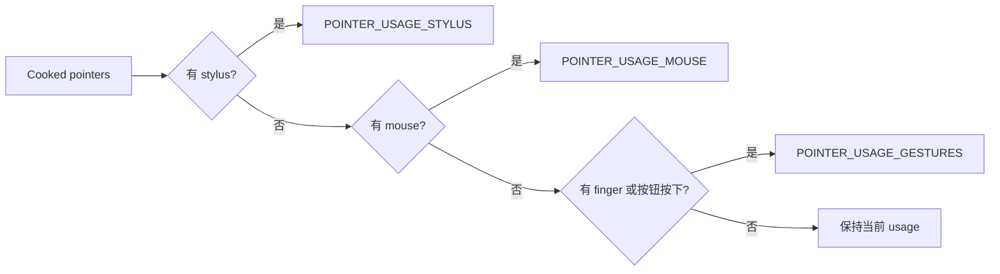
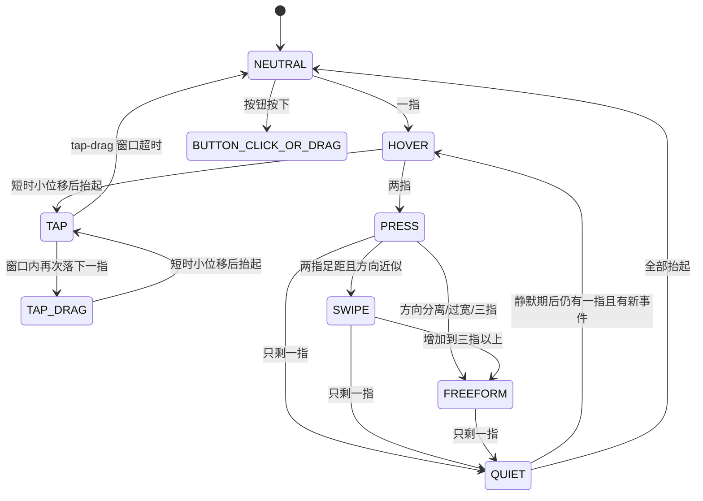
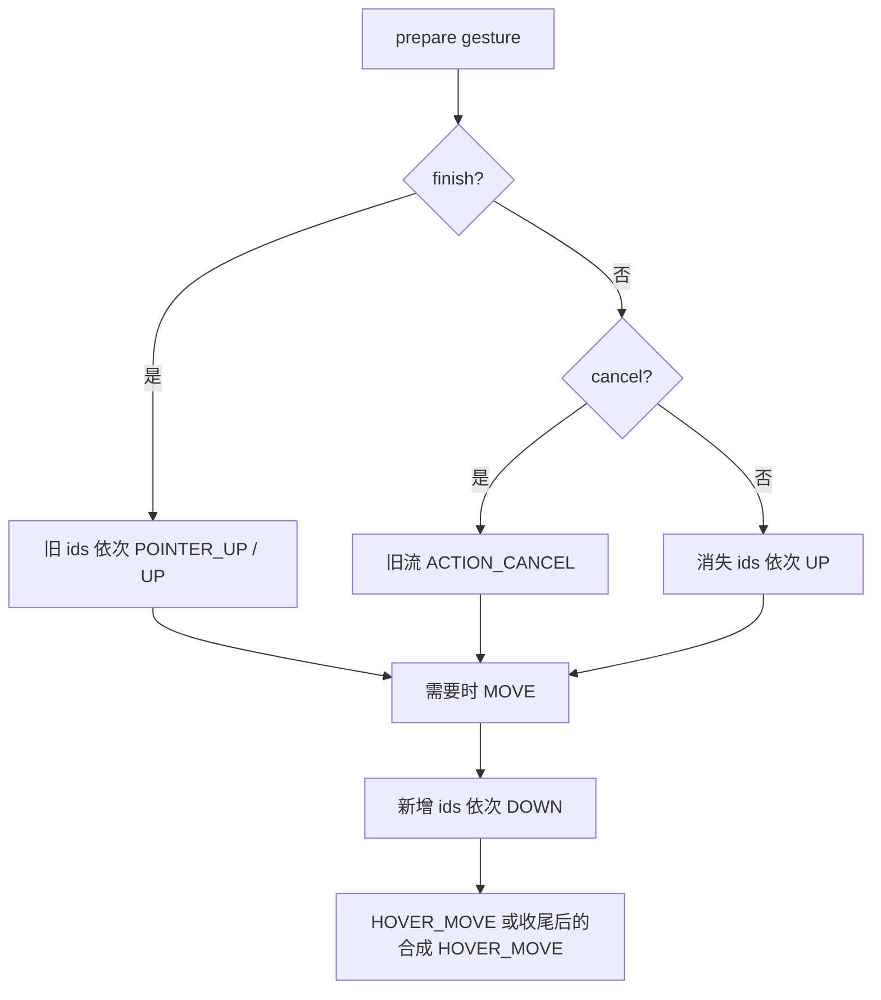

# 184 Android 触控板 Pointer Gesture 状态机

> 源码版本：Android 11 / `android-11.0.0_r48`  
> 阅读方式：macOS 只读，不要求编译。  
> 核心源码：`TouchInputMapper.cpp/.h`、`InputReaderBase.h`。  
> 前置章节：182 理解 Raw/Cooked State，183 理解物理 touch id 和 Android pointerId。

---

## 1. 本章目标：从触点轨迹到鼠标语义

触控板上报的是一组手指触点，但桌面式交互需要光标悬停、点击、拖动、两指同向手势和自由多指事件。`TouchInputMapper` 里的 Pointer Gesture 状态机负责完成这次“语义翻译”。

读完应能回答：为什么一根手指通常只产生 `HOVER_MOVE`；为什么 tap 抬手后 DOWN 不会立刻 UP；为什么两指先进入 PRESS；什么条件区分 SWIPE 与 FREEFORM；为什么模式切换有时发 UP、有时发 CANCEL。

## 2. 先记住十二条结论

1. 本章只讨论 `DEVICE_MODE_POINTER` 下的 finger gesture，不是直接触屏分发。
2. 物理 touch id 和对 App 输出的 gesture id 是两套编号。
3. 一指无按钮默认是 HOVER，不是触屏式 DOWN。
4. 短按抬起才确认 TAP，随后把 UP 延迟到 tap-drag 窗口结束。
5. 第二次落指可把尚未结束的 TAP 无缝变成 TAP_DRAG。
6. 物理按钮优先于手指数，进入 BUTTON_CLICK_OR_DRAG。
7. 两指先进入 PRESS，积累足够运动后才分 SWIPE/FREEFORM。
8. PRESS 和 SWIPE 都只向 App 输出一个合成指针。
9. FREEFORM 才为每根手指建立 gesture id 并输出真正的多指事件。
10. 进入 FREEFORM 通常要 CANCEL 旧 PRESS，而不是把旧流硬改成多指流。
11. 退出多指后保留一指会进入 QUIET，避免光标突然飞走。
12. `finish` 表示正常收尾，`cancel` 表示旧语义作废；同时为 true 时 finish 优先。

## 3. 五组容易混淆的对象

| 对象 | 含义 | 是否直接来自驱动 |
|---|---|---|
| raw touch | 原始 slot/contact 坐标 | 是 |
| cooked finger | 校准、旋转、分类后的手指集合 | 间接 |
| activeTouchId | 当前用于跟随的物理手指 id | 是物理 id |
| gesture id | 状态机交给 App 的 pointer id | 否 |
| pointer controller | 屏幕光标及多指 spot 的可视控制器 | 否 |

尤其不要把 `activeGestureId=0` 理解成“驱动 slot 0”。它只是当前合成事件流使用的逻辑 id。

## 4. 源码地图

- `TouchInputMapper::sync()`：从 Cooked State 选择 pointer usage。
- `dispatchPointerUsage()`：usage 改变时先 abort 旧 usage。
- `dispatchPointerGestures()`：准备状态、更新视觉、展开 MotionEvent。
- `preparePointerGestures()`：本章核心状态机。
- `abortPointerGestures()`：CANCEL、清状态、清 spot。
- `TouchInputMapper::PointerGesture`：状态与参考坐标。
- `InputReaderConfiguration`：时间、距离、角度、速度默认阈值。

## 5. 进入手势路径的前提

设备需被识别成 `DEVICE_TYPE_POINTER` 且全局 `pointerGesturesEnabled=true`，`configureSurface()` 才设置：

```cpp
mSource = AINPUT_SOURCE_MOUSE;
mDeviceMode = DEVICE_MODE_POINTER;
```

若关闭 gesture，同一硬件不会继续走本文状态机。它的 source 主要表现为 mouse，即使内部 tool type 常写作 FINGER。

## 6. usage 优先级：手写笔、鼠标、手指

pointer 模式每帧先分类：stylus 优先，其次 mouse，最后 finger 或物理按钮。切换 usage 会调用 `abortPointerUsage()`，旧 gesture 若仍有 down id 就先发 CANCEL。



因此手指拖动途中突然出现手写笔，不是两类事件并行，而是旧手势取消后切换解释器。还要注意：局部变量最初取旧的 `mPointerUsage`，本帧没有 finger/button 时不会自动改成 NONE；gesture usage 会继续收到 0 指帧，状态机才能确认 TAP 或正常结束旧流。

## 7. 九个状态逐个认识

`PointerGesture::Mode` 有：

- `NEUTRAL`：无手指、无按钮；
- `TAP`：已识别轻点，暂时维持按下；
- `TAP_DRAG`：第二次落指后的按住拖动；
- `BUTTON_CLICK_OR_DRAG`：物理按钮点击或拖动；
- `HOVER`：一指移动光标；
- `PRESS`：两指意图尚未判明；
- `SWIPE`：两指大致同向；
- `FREEFORM`：两指分离/旋转或三指以上；
- `QUIET`：多指结束后的防抖静默。

## 8. 状态机总图



图只画主干。按钮判断优先于 0/1/多指分支，因而很多状态可直接切进 BUTTON 模式。

## 9. 状态选择的优先顺序

`preparePointerGestures()` 按固定优先级判断：timeout 特殊处理 → active touch 与 quiet → QUIET → 物理按钮 → 0 指 → 1 指 → 至少 2 指。

所以“按着物理按钮且两根手指”仍由 BUTTON 模式处理，而不是 PRESS/FREEFORM。

## 10. activeTouchId 如何选择

没有 active id 且当前有手指时，取 `fingerIdBits.firstMarkedBit()` 并记录 `firstTouchTime`。active 手指消失后，仍有手指就再取最低 marked id；全消失则设 -1。

它的策略是“尽可能保持原手指，否则选剩余集合中的低 id”，并不依据手指面积、压力或中心位置。

## 11. firstTouchTime 的真实含义

`firstTouchTime` 只在从无 active touch 选出第一根时赋值。第二根稍后落下不会重置它。因此 multitouch settle 窗口从本轮第一根手指落下算起，而不是从第二根落下算起。

这解释了为什么两指若落下间隔过大，第二根加入时留给“稳定中心点”的时间可能已经很少甚至没有。

## 12. 默认阈值表

Android 11 r48 构造默认值如下：

| 参数 | 默认值 | 用途 |
|---|---:|---|
| quiet interval | 100ms | 多指结束防飞指针 |
| drag switch speed | 50px/s | BUTTON 模式切换跟随手指 |
| tap interval | 150ms | down 到 up 最长时间 |
| tap-drag interval | 150ms | tap 后等待第二次 down |
| tap slop | 10px | X、Y 各自允许位移 |
| multitouch settle | 100ms | 初始多指中心稳定期 |
| multitouch min distance | 15px | 至少两指需超过的运动阈值 |
| swipe angle cosine | 0.2588 | 约等于 cos 75° |
| swipe max width ratio | 0.25 | 两指最大间距/触控板对角线 |
| movement speed ratio | 0.8 | 群组平移尺度 |
| zoom speed ratio | 0.3 | 手指相对位移尺度 |

这些是构造默认值，设备/资源配置可改变，分析具体机器应看 `dumpsys input`。

## 13. 为什么有两套移动缩放

movement scale 按“触控板完整滑过覆盖显示对角线的 0.8 倍”换算，服务于光标和群组平移；zoom scale 默认 0.3，服务于 FREEFORM 中手指相对中心的展开。

同一段 raw 位移因语义不同可能映射成不同屏幕距离。这不是丢精度，而是区分“移动工作区”和“在局部区域做缩放/旋转”。

## 14. 一指为什么叫 HOVER

一指且无按钮时，手指增量经 surface 方向旋转和 `mPointerVelocityControl` 后，调用 `mPointerController->move()` 移动光标；输出坐标取光标当前位置，pressure 为 0，事件为 `HOVER_MOVE`。

这模拟鼠标悬停。触控板手指接触并不等同于鼠标左键按下。

## 15. 一指移动使用相对量

状态机取同一个 activeTouchId 在 current raw 和 last raw 中的差：

```cpp
deltaX = (currentPointer.x - lastPointer.x) * mPointerXMovementScale;
deltaY = (currentPointer.y - lastPointer.y) * mPointerYMovementScale;
rotateDelta(mSurfaceOrientation, &deltaX, &deltaY);
mPointerVelocityControl.move(when, &deltaX, &deltaY);
mPointerController->move(deltaX, deltaY);
```

最终事件坐标不是触控板绝对坐标，而是累计、加速且受显示边界约束的屏幕光标坐标。

## 16. TAP 何时才被确认

手指落下时只记录 `tapDownTime/tapX/tapY`，仍输出 HOVER。到 0 指分支，只有上一状态为 HOVER 或 TAP_DRAG、上一帧恰有一指、耗时不超过 tap interval、X/Y 光标偏移都不超过 slop，才识别 TAP。

所以 tap 是“抬手确认”，不是落指立即确认。

## 17. tap slop 不是原始欧氏距离

源码分别检查：

```cpp
fabs(x - tapX) <= tapSlop && fabs(y - tapY) <= tapSlop
```

`x/y` 来自 PointerController，已受移动比例、速度控制、旋转和屏幕边界影响。判定区域是轴对齐方框，不是半径 10px 的圆，也不是触控板 raw 距离。

## 18. TAP 为何会暂存 DOWN

确认 tap 的抬手帧把 current mode 设为 TAP、pressure=1 并请求 `tapUpTime + tapDragInterval` 的 timeout。`dispatchPointerGestures()` 把 TAP 视为 down，于是此刻对 App 发送 DOWN，却暂不发 UP。

这段短暂保留让下一次落指能继续同一按下流，实现双击拖动。代价是普通 tap 的 UP 天然延后。

## 19. timeout 边界是严格超时

timeout 回调中若：

```cpp
when <= tapUpTime + tapDragInterval
```

会再次请求截止时间；只有 `when` 严格大于边界才 finish TAP、清 current ids 并发 UP。精确等于截止点时还不结束，这是读源码时常漏掉的 `<=` 边界。

## 20. TAP_DRAG 怎样无缝续上

TAP 尚未 finish 时，一指再次落下；若仍在 tap-drag 窗口且光标与 tap 位置 X/Y 均在 slop 内，当前模式变为 TAP_DRAG。旧 TAP 的 gesture id 继续存在，因此不是新 DOWN，而是后续 MOVE。

持续 TAP_DRAG 时无需每帧重新判窗口，状态直接保持。

## 21. double-tap 为何从 TAP_DRAG 识别

第二次落指进入 TAP_DRAG，若很快抬起且位移仍小，0 指分支允许从 TAP_DRAG 再次识别 TAP。于是形成第二个 tap 确认过程。注释明确说这是检测 double-tap 的方式。

若第二次手指移动较远，则抬起不会再判 tap，而是正常结束拖动流。

## 22. 物理按钮模式的语义

只要 `isPointerDown(buttonState)` 为真，就进入 BUTTON_CLICK_OR_DRAG。状态机输出单一 pressure=1 的 gesture pointer，坐标跟随 PointerController，其他手指不直接交给 App。

设计目标是兼容触控板底部一体式按键：第二根手指可能只是为了施力，不应自动变成多指手势。

## 23. BUTTON 模式会选择最快手指

多指按键拖动时，对每根手指从 VelocityTracker 取速度，只有速度严格大于默认 50px/s 且超过当前 bestSpeed 才成为 best id。选中后更新 `activeTouchId`。

这允许一根手指负责按压，另一根快速移动负责拖动。相等速度不会替换，静止噪声也不易抢走控制权。

## 24. VelocityTracker 跟踪什么坐标

每帧把所有 finger 的 raw x/y 乘 movement scale 后加入 VelocityTracker，不先做 surface orientation 旋转。速度大小用 `hypot(vx, vy)`，旋转不会改变模长，因此选择最快手指不受方向旋转影响。

它服务于 BUTTON active 手指切换，不直接决定 SWIPE/FREEFORM 的角度。

## 25. 两指为何先进入 PRESS

两指刚落下时意图不明确：可能要同向滚动、张合缩放，也可能只想长按。框架不能等到意图明确再给 UI 反馈，所以先以光标当前位置输出一个 pressure=1 的单指 DOWN，即 PRESS。

PRESS 期间合成指针不随手指移动，运动只积累在 `referenceDeltas` 里供分类。

## 26. settle 窗口解决什么问题

两根手指往往不是同一微秒落下。首次进入多指时保存当前触点 centroid 和光标位置为两套 reference。settle 窗口内若又增加手指，会 CANCEL 当前手势并以新集合重建 PRESS 参考中心。

注意它会取消已经交给 App 的旧 PRESS，而不是简单添加 pointer。

## 27. reference 的两套坐标

- `referenceTouchX/Y`：surface 单位下的物理触点质心；
- `referenceGestureX/Y`：显示像素中的合成手势锚点。

FREEFORM 输出约为：`gestureAnchor + (touch - touchCentroid) * zoomScale`。SWIPE 则把共同运动经 movement scale 加入 gestureAnchor。

## 28. 每指 delta 为什么累计

`referenceDeltas[id]` 累计当前帧相对上一帧的 raw 增量。PRESS 时不消费这些 delta，以便运动超过阈值后一次判断方向；进入 SWIPE/FREEFORM 后，只要存在共同位移，源码就用它移动 touch/gesture reference，并把各指累计 delta 清零，开始下一轮相对参考点的积累。

这避免仅凭某一帧很小的抖动仓促分类。

## 29. common vector 不是简单平均

代码逐指用 `calculateCommonVector()` 合成 X、Y 共同分量。它寻找各手指在同一轴上共同具有的运动，而非直接对所有位移取算术平均。

阅读时应把它理解为“可归因于整体平移的部分”；每根手指相对共同平移剩余的变化用于自由手势形状。

## 30. PRESS 转出的第一个门槛

对每根参考手指计算：

```text
dist = hypot(delta.x * zoomScaleX, delta.y * zoomScaleY)
```

至少两根手指的 dist 严格大于 min distance，才尝试从 PRESS 转换。单根手指移动很远、另一根不动，仍保持 PRESS。

## 31. 三指为何直接 FREEFORM

运动门槛满足后，只要 `currentFingerCount > 2` 就转换 FREEFORM 并设置 cancelPreviousGesture。三指不会进入 SWIPE，即使三根手指完全同向。

Android 11 这段原生状态机不是现代桌面系统完整的三指快捷手势识别器；它把三指当自由多指事件交给后续消费者。

## 32. 两指间距先于角度判断

恰好两指时先计算触控板 raw 空间的相互距离。若大于 `0.25 * rawDiagonal`，直接 FREEFORM。只有距离足够近才继续判断两个位移向量夹角。

这里的宽度门槛用 raw 触控板单位，运动门槛则使用 zoom scale 后的像素语义，不能混成同一坐标系。

## 33. cosine 怎样区分 SWIPE

两指各自达到门槛后计算：

```text
cosine = dot(v1, v2) / (|v1| * |v2|)
```

`cosine >= 0.2588` 进入 SWIPE，相当于夹角不超过约 75°；否则 FREEFORM。阈值相当宽松，不要求两指严格平行。

## 34. 为什么 FREEFORM 要 CANCEL PRESS

PRESS 已经向 App 承诺“这是一个单指按下流”。FREEFORM 却要输出与每根物理手指对应的多指拓扑。继续复用旧流可能让 App 误以为单指突然裂变，且坐标语义也改变。

因此 PRESS→FREEFORM 设置 cancel，先发 ACTION_CANCEL 清理旧手势，再创建 FREEFORM 的新 DOWN/POINTER_DOWN 序列。

## 35. PRESS 到 SWIPE 为什么不 CANCEL

二者都只输出同一个 gesture id、pressure=1 的合成指针。PRESS 的锚点静止，SWIPE 让锚点跟随共同位移，拓扑与坐标语义仍可连续，所以直接进入 SWIPE 即可。

之后若加入第三指，SWIPE→FREEFORM 才 CANCEL。

## 36. SWIPE 输出不是两个 pointer

PRESS 和 SWIPE 都将 `currentGestureIdBits` 设为仅含 `activeGestureId`，App 看到单指 DOWN/MOVE/UP。两根物理手指的共同位移控制该合成指针。

所以仅从 App 的 pointerCount 无法判断用户在触控板上究竟按了一根还是两根手指。

## 37. FREEFORM 如何分配 gesture id

状态机维护 `freeformTouchToGestureIdMap`。继续存在的 touch 复用旧 gesture id；新 touch 取第一个未使用 gesture id；active gesture 消失后，从当前 gesture id 集合取最低 id 接任。

这是第二层 id 映射：183 章的物理 pointer id 已经稳定一次，FREEFORM 又为 App 手势流建立自己的 id 生命周期。

## 38. FREEFORM 坐标不是屏幕绝对投影

每个输出坐标以 referenceGesture 锚点为中心，加上该手指相对 referenceTouch 质心的偏移乘 zoom scale，再旋转方向。它在光标附近创建一个局部多指工作区，而不是把触控板四角线性映射到显示四角。

这也是 FREEFORM 时原生多指 spot 围绕光标附近展开的原因。

## 39. single-touch 与 multi-touch gestureMode

带 `INPUT_PROP_SEMI_MT` 的设备默认 `GESTURE_MODE_SINGLE_TOUCH`，配置也可覆盖。r48 中这个参数主要影响 PointerController 的 spot 展示和 FREEFORM 时是否淡出主光标；核心 `preparePointerGestures()` 并未据此改用另一套分类状态机。

因此不要仅凭枚举名断言“single-touch 模式绝不会产生多 pointer 事件”；需要看设备实际触点能力和 dispatch 代码。

## 40. QUIET 为什么存在

PRESS/SWIPE/FREEFORM 结束后若还剩一指，立即回 HOVER 会把那根尚未抬干净的手指位移变成光标飞动。状态机记录 quietTime 并进入 QUIET，正常 finish 旧多指流，清 gesture ids 并重置速度控制。

按钮释放时若仍有至少两指，也会进入 QUIET，避免施力手指被误识别成新多指手势。

## 41. QUIET 没有自己的 timeout

代码没有为 `quietTime + quietInterval` 调用 `requestTimeoutAtTime()`。它只在下一个输入帧到达时重新比较当前时间。

所以“100ms 后自动切 HOVER”并不精确：若手指完全静止且设备不发新 packet，状态会停在 QUIET；下一次运动/状态事件到来且已过窗口，才进入相应状态。全抬起则直接清 quiet 并走 NEUTRAL。

## 42. finish 与 cancel 的区别

`preparePointerGestures()` 输出两个标志：

- finish：旧流有效，按正常 POINTER_UP/UP 结束；
- cancel：旧流的解释失效，发 ACTION_CANCEL；
- 若二者同时为 true，dispatch 先强制 `cancel=false`，finish 优先。

这条优先规则应从调用者读，不能只看状态机某一分支赋值。

## 43. MotionEvent 展开顺序



id 集合变化仍按低 id 顺序展开，底层 `dispatchMotion()` 会把单指 POINTER_DOWN/UP 改写为 DOWN/UP。

## 44. MOVE 不是每帧必发

gesture dispatch 调用 `updateMovedPointers()` 比较共同存在 id 的属性和坐标，只有确有变化才设 `moveNeeded`；不过 buttonState 变化会强制需要 MOVE。

这与 183 章直接触屏“相同 id 集合通常就发 MOVE”的路径不同，不能套用同一结论。

## 45. 手势结束后为何补 HOVER_MOVE

当 down 流全部结束且 last gesture 原来非空，框架以当前 PointerController 位置合成一个单指 `HOVER_MOVE`。注释说明这是为了让 View 在 tap 之后重新得到新的 hover enter 机会。

它不是物理手指仍在触控板上的证据，而是鼠标式悬停协议的状态修复事件。

## 46. PointerController 视觉策略

HOVER、TAP、PRESS、SWIPE 等立即显示主光标。multi-touch 模式的 FREEFORM 会逐渐淡出主光标并显示各 gesture spot；结束 FREEFORM 后清 spot 并逐渐重新显示主光标。

视觉 spot 和发给 App 的 MotionEvent 共用 gesture 坐标，但 spot 不是输入分发的必要条件。

## 47. abort 和普通 finish 不同

usage 切换、重新配置或显式中止时，`abortPointerGestures()` 若旧 ids 非空就发 ACTION_CANCEL，然后 reset 整个 PointerGesture、重置速度控制、渐隐光标并清 spot。

它不会尝试保留 tap 等待窗口、activeTouchId 或 FREEFORM 映射。接下来的输入是新语义流。

## 48. 三个手工推演

场景 A：一指落下→小移→100ms 抬起。输出若干 HOVER_MOVE；抬起确认 TAP 并发 DOWN；约 150ms 窗口严格过去后发 UP，再补 HOVER_MOVE。

场景 B：两指落下→两指同向且各超过 15px、间距合格。先 PRESS 发单指 DOWN；随后 SWIPE 发同一个 id 的 MOVE；只剩一指时 UP 并进入 QUIET，不立刻飞光标。

场景 C：两指反向张开。先 PRESS DOWN；达到阈值后 CANCEL 旧单指流；FREEFORM 重新发 DOWN、POINTER_DOWN，之后各指坐标围绕初始锚点变化。

## 49. macOS 只读练习与调试清单

建议依次执行：

```bash
rg -n "enum Mode|preparePointerGestures" \
  frameworks/native/services/inputflinger/reader/mapper/TouchInputMapper.*
sed -n '2546,3298p' \
  frameworks/native/services/inputflinger/reader/mapper/TouchInputMapper.cpp
sed -n '175,275p' \
  frameworks/native/services/inputflinger/include/InputReaderBase.h
```

排查真机时记录：设备 properties、gestureMode、finger id 集合、buttonState、last/current mode、finish/cancel、active touch/gesture id、阈值配置、MotionEvent action 与 pointerCount。只看 App 层 action 很难反推是哪条物理轨迹。

## 50. 复读审计、检查题与下一章

复读后特别修正或限定了这些表述：0 指帧会保持 gesture usage 以完成 TAP；TAP 不是立即 click 而是延迟 UP；tap slop 不是 raw 圆形距离；settle 从第一指计时；SWIPE 只输出一个 pointer；single-touch gestureMode 主要影响视觉展示；QUIET 没有独立 timeout；finish 与 cancel 同时出现时 finish 优先；gesture MOVE 不是无条件发送；共同位移被消费后是移动 reference 并清零累计 delta。

检查题：

1. 为什么两指同向移动时 App 可能只看到 pointerCount=1？
2. TAP 抬指后为什么仍要短暂保持 down 流？
3. PRESS→FREEFORM 为什么必须 CANCEL，而 PRESS→SWIPE 不必？
4. 为什么多指结束后剩下一指不立即回 HOVER？
5. touch id、activeTouchId、gesture id 三者分别服务谁？

下一章继续读 `TouchInputMapper` 的触摸校准与虚拟按键：从尺寸、压力、方向、距离校准，追到屏幕外 virtual key 命中、quiet time 与按键合成。
