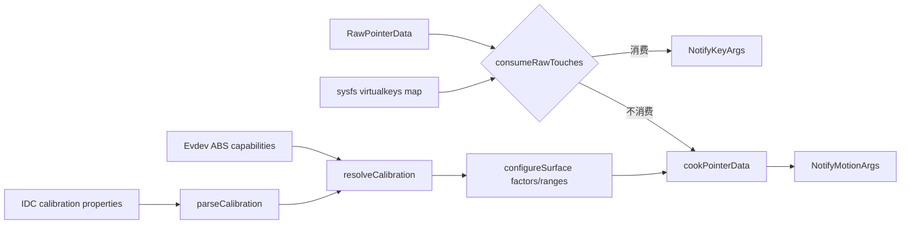
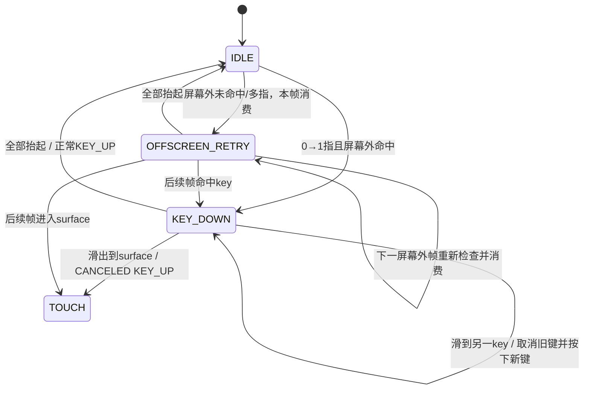

# 185 Android 触摸校准与 Virtual Key 虚拟按键

> 源码版本：Android 11 / `android-11.0.0_r48`  
> 阅读方式：macOS 只读，不要求编译。  
> 核心源码：`TouchInputMapper.cpp/.h`、`InputReader.cpp`、`EventHub.cpp`、`VirtualKeyMap.cpp`。  
> 本章重点：size/pressure/orientation/distance/coverage 校准，以及屏幕外触摸如何变成 KeyEvent。

---

## 1. 本章目标：数值解释和事件改道

触摸驱动给出的 major、pressure、orientation 等整数没有统一物理含义；同一触控面板还可能在显示区域外印有 HOME/BACK 等电容按键。本章研究两个问题：raw axis 怎样变成 MotionEvent axis，以及一段 raw touch 何时不再成为 MotionEvent、而被改造成 KeyEvent。

## 2. 先记住十四条结论

1. IDC 先 parse 校准声明，再按硬件 axis 能力 resolve 最终模式。
2. 声明某种校准不等于硬件缺 axis 时仍能输出它。
3. size 的 `SIZE` 与 `TOUCH_MAJOR/TOOL_MAJOR` 使用不同缩放链。
4. `size.isSummed` 只在 touchingCount>1 时除以触摸数。
5. 无可用 pressure 校准时，touch 合成 1、hover 合成 0。
6. 有 tiltX/tiltY 时，tilt 路径优先，独立 orientation axis 不参与。
7. vector orientation 把一个字节拆成两个有符号四位分量。
8. coverage box 借用 toolMajor/toolMinor 打包四条边，输出到 GENERIC_1..4。
9. virtual key 定义来自 sysfs board property 文件，不是 `.kl` 本身。
10. scanCode 仍需经 key map 映射成 Android keyCode。
11. 只有从屏幕外开始且恰好一指，才尝试命中 virtual key。
12. 键按住后离开区域或变多指会发带 CANCELED 的 KEY_UP。
13. 被 quiet time 抑制的按键仍消费整段触摸，只是不发 KeyEvent。
14. virtual key 抑制截止时间保存在 InputReader，全设备共享。

## 3. 全链路总图



virtual key 检查发生在 cooking 之前，因为命中后要让后续代码完全看不到这段 pointer data。

## 4. 校准配置从哪里来

`parseCalibration()` 从设备 IDC `PropertyMap` 读取：

- `touch.size.calibration/scale/bias/isSummed`
- `touch.pressure.calibration/scale`
- `touch.orientation.calibration`
- `touch.distance.calibration/scale`
- `touch.coverage.calibration`

非法字符串只打 warning，保留 DEFAULT；并不会让设备配置整体失败。

## 5. parse 和 resolve 必须分开理解

parse 只表达厂商意图；`resolveCalibration()` 再用实际 raw axis 校验能力。比如没有 pressure axis 时，无论配置写 DEFAULT、physical 还是 amplitude，最终都会强制为 NONE。

这是一条重要阅读原则：最终行为看 `mCalibration` resolve 后的值，不只看 IDC 文本。

## 6. DEFAULT 的能力推导

| 能力存在 | DEFAULT 最终模式 |
|---|---|
| touchMajor 或 toolMajor | size=GEOMETRIC |
| pressure | pressure=PHYSICAL |
| orientation | orientation=INTERPOLATED |
| distance | distance=SCALED |
| coverage | DEFAULT 总是 NONE |

coverage 不会依据 tool axis 自动猜 box，因为同一 axis 正常情况下表示接触椭圆尺寸，不能安全猜成打包边界。

## 7. surface 配置何时计算因子

viewport 或 device mode 改变时，`configureSurface()` 计算 X/Y/geometric scale、各 axis range、pressure/orientation/distance factor，并重建 virtual key hit box。

`mGeometricScale = avg(mXScale, mYScale)`：当像素非正方形时用平均值近似无方向的长度量。

## 8. size 的五种模式

- NONE：所有 size/major/minor 输出 0；
- GEOMETRIC：raw 长度乘 geometric scale；
- DIAMETER：minor 直接等于 major；
- BOX：保留上报 major/minor 数值，再应用 scale/bias；
- AREA：对正值 major 开平方，把它解释成面积再转近似边长。

BOX 在这段 size 分支与普通维度类似；不要和 coverage BOX 混淆。

## 9. touch axis 与 tool axis 如何补齐

若 touchMajor 和 toolMajor 都有，各用自己的值；缺 minor 时用对应 major。只有 touch 组时，把它同时作为 tool 组；只有 tool 组时反向复制为 touch 组。

这保证 App 的 touch/tool major/minor 字段结构完整，但复制值不等于硬件真的分别测量了手指接触面和工具外形。

## 10. SIZE 归一化和 major 不是一回事

`AMOTION_EVENT_AXIS_SIZE` 先取 major 或 major/minor 平均，再乘 `mSizeScale`；mSizeScale 默认取 `1 / touchMajor.max`，缺 touchMajor 才用 toolMajor.max。

而 TOUCH_MAJOR/TOOL_MAJOR 走 geometric 或自定义 scale/bias，range 最大值设为 surface 对角线。故 `SIZE` 是归一化量，major/minor 是像素语义长度，两者不能互换。

## 11. size scale、bias 与下限

对四个 major/minor 依次执行：可选乘 `touch.size.scale`，再可选加 `touch.size.bias`，最后小于 0 就截到 0。没有上限 clamp。

自定义参数过大可以让输出超过声明的对角线 range；源码没有替厂商兜住这个配置错误。

## 12. size.isSummed 的含义

部分控制器给每个 contact 重复上报“所有触点总面积”。若 `touch.size.isSummed=true` 且 touchingCount>1，框架在模式变换前，把 touch/tool major/minor 和 size 都除以触摸数。

hovering pointer 不计入 touchingCount。只有一根 touching 时不除。

## 13. AREA 模式的细节

AREA 对 touchMajor 开平方并让 touchMinor=处理后的 touchMajor；tool 也同样处理。原始 minor 即使存在也不参与最终 AREA 椭圆。

`size` 自身仍来自前面算出的 raw major/minor 平均并乘 mSizeScale，并不会跟着开平方。这是最容易把两种输出混写的一点。

## 14. pressure 的两种显式模式

PHYSICAL 与 AMPLITUDE 在 r48 的 cooking 公式完全相同：

```cpp
pressure = in.pressure * mPressureScale;
```

它们在这段实现中没有行为分叉。若未配置 scale 且 raw max 非零，默认 `1/rawMax`；配置显式 scale 后，声明 range.max 也变成 `scale * rawMax`。

## 15. 无 pressure 时的合成值

pressure 模式为 NONE 时并非总输出 0，而是：

```cpp
pressure = in.isHovering ? 0 : 1;
```

因此 pressure=1 不一定表示传感器量到“最大压力”，可能只表示当前正在接触。

## 16. pressure 不做 clamp

自定义 `touch.pressure.scale` 的结果没有限制到 [0,1]。range.max 会随 scale 计算，所以 Android axis pressure 在具体设备上不保证最大值就是 1。

应用若假定所有硬件 pressure 都归一化到 1，可能在定制设备上出错。

## 17. tilt 路径优先级

只有 tiltX 与 tiltY 两条 raw axis 同时有效，`mHaveTilt=true`。此时中心取各 axis min/max 平均，raw 值按“度→弧度”转换；框架直接由 tilt 向量推导 tilt 和 orientation。

一旦走这条路径，orientation calibration 枚举不会再参与本 pointer 的计算。

## 18. tilt 和 orientation 公式

```text
tiltXAngle = (rawTiltX - centerX) * π/180
tiltYAngle = (rawTiltY - centerY) * π/180
orientation = atan2(-sin(tiltXAngle), sin(tiltYAngle))
tilt = acos(cos(tiltXAngle) * cos(tiltYAngle))
```

有 tilt 时 orientation range 为 `[-π, π]`，tilt range 为 `[0, π/2]`。

## 19. INTERPOLATED orientation

没有 tilt 时，INTERPOLATED 把 raw orientation 线性映射到约 `[-π/2, π/2]`。raw max>0 时 scale=`π/2/max`；否则 raw min<0 时 scale=`-π/2/min`；两边都无法提供尺度则 scale=0。

它假设 raw orientation 本身已是一维角度编码。

## 20. VECTOR orientation 的位编码

VECTOR 把 raw orientation 的高、低 nybble 分别做 4 位符号扩展得到 c1/c2：

```text
orientation = atan2(c1, c2) / 2
confidence = hypot(c1, c2)
scale = 1 + confidence / 16
```

随后 major 乘 scale、minor 除 scale。向量既提供方向，也用模长表达椭圆可信度/扁长程度。

## 21. surface 旋转还会修正 orientation

cooking 先算工具自身 orientation，再按 display orientation 减/加 90°或180°，越出声明周期时绕回。

所以 App 看到的是面向当前显示方向的角度，不是传感器固定坐标系中的原角度。

## 22. distance 校准

SCALED 模式下输出 `rawDistance * mDistanceScale`；显式 scale 缺失时默认 1。range 的 min/max/fuzz 同样乘 scale，resolution 置 0。

NONE 输出 0。distance 常用于 hover 高度，但字段语义仍依赖具体硬件。

## 23. coverage BOX 怎样打包

coverage BOX 把两个 32 位 raw 字段拆成四个 16 位边界：toolMinor 高/低16位是 left/right，toolMajor 高/低16位是 top/bottom。

这时输出使用 `GENERIC_1..4` 表示 left/top/right/bottom，而不再输出正常的 TOOL_MAJOR/TOOL_MINOR。

## 24. coverage 的已知边界

中心 x/y 会先做 affine calibration，coverage 四边不会，源码留有 `TODO: Adjust coverage coords?`。四边之后仅按 surface orientation/scale 转换。

此外拆位没有做 16 位符号扩展，按非负坐标解释。厂商协议必须与这个打包假设一致。

## 25. cooking 的输出不变量

每个 raw pointer 生成同索引的 `PointerProperties` 和 `PointerCoords`，id 保持不变，并写 `idToIndex[id]=i`。校准改变的是坐标和 axis 值，不重新分配 pointer id。

这让183章的id生命周期与本章数值解释相互独立。

## 26. Virtual Key 是什么

旧式设备可能让触控传感器覆盖屏幕之外的固定按键区。用户触摸该区域时，InputReader 把它转换成 `AINPUT_SOURCE_KEYBOARD` 的 KeyEvent，而不是把负坐标或越界 MotionEvent 发给 App。

它是“触摸硬件产生按键语义”，不是屏幕上的普通 View 按钮。

## 27. 定义文件位置和命名

EventHub 尝试加载：

```text
/sys/board_properties/virtualkeys.<device canonical name>
```

注释称它是 kernel 提供的 system board property file。文件不存在就没有 virtual key map，不影响普通触摸设备打开。

## 28. 文件格式

解析器要求每项以 `0x01` 开头，随后五个冒号分隔整数：

```text
0x01:scanCode:centerX:centerY:width:height
```

一行可以有多个定义，也可分行；`#` 开头是注释。类型不是0x01、字段缺失或含非法整数会使整个 map 加载失败。

## 29. scanCode 还要经过 key map

`configureVirtualKeys()` 对每个 scanCode 调 `mapKey(scan, usage=0, meta=0)` 得到 Android keyCode 和 flags。映射失败就忽略该 virtual key。

因此 sysfs map 负责几何区域，`.kl` 等 key map 负责 scanCode→keyCode 语义，两者缺一不可。

## 30. hit box 的坐标换算

定义中的 center/width/height 是 display/surface 布局坐标，框架按 raw touch 总宽高与 `mRawSurfaceWidth/Height` 比例，换回 raw touch 坐标并加 raw axis min。

整数运算会截断小数；奇数 width/height 的 `/2` 也向零截断。最终 hit test 四条边都包含等号。

## 31. virtual key 必须位于 surface 外

只在上一份已保留的raw state为空、当前非空时检查 `!isPointInsideSurface(x,y)`；若点在显示surface内，即便其坐标也落在某个错误配置的key hit box里，也不会触发virtual key。

这防止虚拟键区域覆盖正常屏幕内容。

## 32. 初始命中要求恰好一指

从上一份已保留的raw state为0触点变为当前非0触点时，若点在surface外：只有 touching count==1 才查virtual key；多指不会查key。无论外部点有没有命中任何key，该帧都会被consume。

这里不能简单说成“只有物理落指第一帧检查”：consume后调用者会清空current raw pointer，帧末复制给last raw的也是空集合。后续屏幕外帧会再次满足0→非0并重新检查；一旦后来滑进surface，就可从那一帧进入正常touch。

## 33. virtual key 状态机



`OFFSCREEN_RETRY`不是显式枚举，而是“每次consume后先清current raw，再复制给last raw”形成的效果。

## 34. 为什么按住期间整段触摸被吞掉

`mCurrentVirtualKey.down=true` 时，只要当前仍恰好一指且命中相同 keyCode，`consumeRawTouches()` 返回true。调用者随即清空当前 raw pointer data，cooking 和 MotionEvent 分发看不到它。

按住同一几何区域不会生成重复KEY_DOWN，也不会产生触摸MOVE。

## 35. 正常抬起

virtual key down期间若 touchingIdBits 变空，清down；未ignored时发普通KEY_UP，flags包含 `FROM_SYSTEM | VIRTUAL_HARD_KEY`。函数返回true消费抬起帧。

KeyEvent的downTime沿用首次命中的when，eventTime用当前帧when。

## 36. 滑出区域为何是取消

若仍有触点但不再满足“恰一指且仍在同keyCode区域”，清down并发KEY_UP，额外带 `AKEY_EVENT_FLAG_CANCELED`。此处没有立即return，当前raw touch继续往下处理并可能进入正常cooking。

这告诉按键消费者：此前的DOWN不应被当作成功点击完成。

## 37. 滑到另一个虚拟键可以同帧切键

保持期间只接受 `hit keyCode == current keyCode`。移到不同keyCode会先取消旧key；但前一虚拟键帧已经被consume并清空，所以last raw是空集合，本帧随后又满足0→非0，可立即命中新key并发新KEY_DOWN。

于是同一event time可能看到“旧键CANCELED KEY_UP → 新键KEY_DOWN”。若两个几何区域映射到相同keyCode，即使scanCode不同，保持检查仍视为同一个键，因为它只比较keyCode。

## 38. 滑入屏幕怎样接成触摸

从virtual key区域滑入屏幕时，旧key发CANCELED UP；随后函数不消费该帧，cooking将当前pointer视为触摸。由于此前被消费帧在 cooked state 中是空集合，这一帧会形成新的MotionEvent DOWN。

也就是说，它不是从key流无缝变MOVE，而是“取消key → 新touch流”。

## 39. 从屏幕内不能滑进virtual key

virtual key命中只在last raw为空而current raw非空时检查。若手势从屏幕内开始，普通raw state会保留下来；随后滑到屏幕外key区域不满足该条件，不会转换为key，仍按普通touch流继续。

这种单向锁定避免拖动过程中误触导航键。

## 40. quiet time 解决什么误触

屏幕内触摸存在时，如果 `virtualKeyQuietTime>0`，每帧调用：

```cpp
disableVirtualKeysUntil(when + virtualKeyQuietTime);
```

它防止滚动/下拉时擦到独立按键面板，以及软键盘边缘点击稍偏后误触下方虚拟键。

## 41. quiet time 是滑动窗口

只要屏幕触摸持续上报，截止时间就不断推进为“当前when + quietTime”。因此它不是从ACTION_DOWN固定计时，而是在最近一次有效屏幕触摸之后再等待完整quiet interval。

默认framework资源值是0，设备overlay可设置非零毫秒值。

## 42. 抑制时间是 InputReader 全局状态

`mDisableVirtualKeysTimeout` 位于 InputReader，不在某个 TouchInputMapper 实例。任一正常屏幕触摸都能延长它，其他设备随后询问 `shouldDropVirtualKey()` 也会看到同一截止时间。

这是跨设备误触保护，不应描述为“每块触摸屏各自计时”。

## 43. 被抑制后仍走virtual key状态机

命中key时即使 `shouldDropVirtualKey()` 返回true，状态仍设 `mCurrentVirtualKey.down=true`，只是`ignored=true`，不发KEY_DOWN。只要留在同key，保持和抬起仍由virtual key路径消费，最终也不发KEY_UP。

因此ignored不是“立即退回普通触摸”。但若手指随后滑进surface，状态仍会结束并让当前帧进入正常touch；只是因为ignored，结束时也不会发送CANCELED KEY_UP。

## 44. 抑制边界是 now < deadline

`shouldDropVirtualKeyLocked()` 使用严格小于：`now < mDisableVirtualKeysTimeout` 才drop。事件时间恰好等于截止点时允许按键。

这和184章tap timeout的`<=`边界不同，排查临界测试时不要凭习惯统一理解。

## 45. dispatchVirtualKey 生成什么

它把source固定为 `AINPUT_SOURCE_KEYBOARD`，displayId取关联viewport，加入`POLICY_FLAG_VIRTUAL`，metaState取全局键盘meta状态，并通过listener发送`NotifyKeyArgs`。

virtual key虽然物理来源是触摸面板，进入后续Dispatcher后已经是一条键盘事件流。

## 46. map 中 flags 没有随事件发出

`configureVirtualKeys()` 保存了`virtualKey.flags`，但`dispatchVirtualKey()`实际使用的是调用者传入的FROM_SYSTEM/VIRTUAL_HARD_KEY/CANCELED flags，没有读取保存的map flags。

这是r48实现边界；不要从`virtualKey.flags`字段存在就推断KeyLayout的所有flags都会传到KeyEvent。

## 47. reset 的边界

`TouchInputMapper::reset()` 直接把 `mCurrentVirtualKey.down=false`，没有在此处补发KEY_UP或CANCELED。设备reset另有`NotifyDeviceReset`用于下游清理，但不能把它描述成普通按键抬起。

同样，ignored/downTime/keyCode旧字段可能仍留值，但down=false后不再表示活动按键。

## 48. 两个手工推演

场景A：屏幕外单指落在BACK区域→KEY_DOWN；仍在区域移动被吞；抬起→KEY_UP，全程无MotionEvent。

场景B：BACK区域DOWN→手指滑入屏幕→CANCELED KEY_UP；同一帧当前touch开始新的ACTION_DOWN；之后按普通触屏流分发。

场景C：刚在屏幕内打字，quiet窗口内落到HOME区域→不发任何KeyEvent；若留在HOME直到抬起，这段全部被吞。若中途滑进surface，进入surface的那一帧仍可新建Motion DOWN。

## 49. macOS只读练习与排查清单

```bash
sed -n '1110,1245p' frameworks/native/services/inputflinger/reader/mapper/TouchInputMapper.cpp
sed -n '2010,2205p' frameworks/native/services/inputflinger/reader/mapper/TouchInputMapper.cpp
sed -n '1725,1845p' frameworks/native/services/inputflinger/reader/mapper/TouchInputMapper.cpp
sed -n '1630,1645p' frameworks/native/services/inputflinger/reader/EventHub.cpp
```

排查时同时记录IDC、evdev axis min/max、`dumpsys input` calibration/ranges、sysfs virtualkeys文件、`.kl`映射、raw落点、insideSurface结果、ignored/down状态和最终NotifyKey/NotifyMotion。只看App日志无法区分“没命中”和“命中但被quiet抑制”。

## 50. 复读审计、检查题与下一章

复读后重点限定：AREA不改变归一化SIZE的公式；pressure显式scale不clamp；tilt优先于orientation axis；coverage不做affine；屏幕外未命中只消费当前帧并在后续屏幕外帧重试；滑出发CANCELED UP后当前帧可新建touch；滑到另一key可同帧取消旧键并按下新键；quiet是InputReader全局滑动窗口；ignored仍走同一状态机而非立即回流；保存的virtualKey.flags在该分发函数未使用；reset不补普通UP。

检查题：

1. 为什么`SIZE=0.5`不能推出`TOUCH_MAJOR`是屏幕对角线一半？
2. 为什么配置pressure=physical但硬件没pressure axis仍会回NONE？
3. virtual key几何定义和keyCode语义分别来自哪里？
4. 为什么从virtual key滑进屏幕会出现CANCELED KEY_UP加新的Motion DOWN？
5. 被quiet time抑制的key为什么不会变成普通触摸？

下一章转向InputDispatcher的窗口命中与触摸目标维护：从display窗口栈、touchable region、split touch和wallpaper复制，追到一条MotionEntry怎样建立与更新TouchState。
