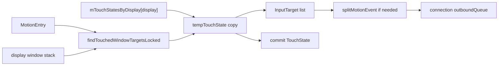
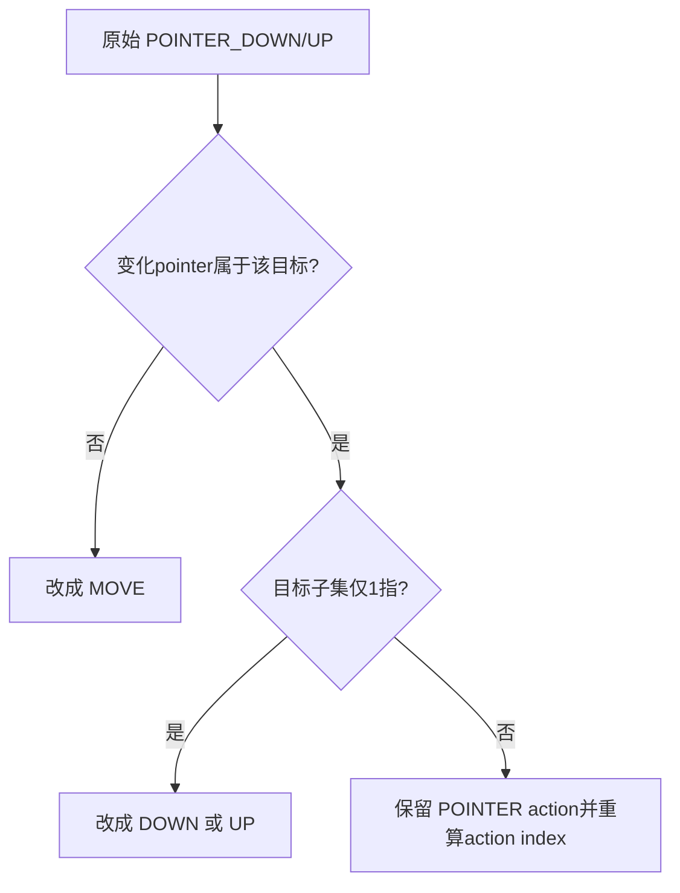

# 186 Android InputDispatcher 窗口命中与 TouchState

> 源码版本：Android 11 / `android-11.0.0_r48`  
> 阅读方式：macOS 只读，不要求编译。  
> 核心源码：`InputDispatcher.cpp/.h`、`TouchState.cpp/.h`、`InputTarget.h`、`InputWindow.cpp/.h`。

---

## 1. 本章目标：命中一次，维护整条流

InputReader交出MotionEntry后，Dispatcher不仅要找“坐标下方的窗口”，还要记住整条gesture属于哪些窗口、各窗口负责哪些pointerId、事件需要原样还是改成OUTSIDE/CANCEL/DOWN。核心入口是`findTouchedWindowTargetsLocked()`，核心记忆是每display一份`TouchState`。

## 2. 先记住十四条结论

1. 窗口按前到后遍历，首个满足条件的窗口成为命中目标。
2. touch-modal可在touchableRegion之外拦住触摸。
3. DOWN才收集WATCH_OUTSIDE_TOUCH窗口。
4. OUTSIDE只给命中目标上方遍历过的监听窗。
5. 不同UID的OUTSIDE坐标会被清零。
6. TouchState按display保存，不是按pointer保存一份状态机。
7. 同一display正在down时，另一个device/source的MOVE会被拒绝。
8. split由首个目标窗口是否支持决定，鼠标永不split。
9. split手势的后续POINTER_DOWN才会重新命中窗口。
10. 非split第二指仍归原窗口，不重新hit-test。
11. slippery只处理单pointer MOVE，旧窗收CANCEL、新窗收DOWN。
12. wallpaper只在首个DOWN锁入，不为hover/scroll收集。
13. outside/hover/slippery临时模式发完后会从持久状态过滤。
14. 注入权限拒绝时不提交TouchState；普通无目标失败可能仍提交空down状态。

## 3. 数据结构总图



临时副本让Dispatcher在权限未确认前不污染正式状态。

## 4. TouchState保存什么

```text
down, split, deviceId, source, displayId
windows: TouchedWindow[]
portalWindows
gestureMonitors
```

`TouchedWindow`又包含windowHandle、targetFlags和pointerIds。pointerIds只有`FLAG_SPLIT`时有意义；非split为0表示该目标使用整条原事件。

## 5. 为什么按display存状态

`mTouchStatesByDisplay`以displayId为键，使不同显示可各自维护一条触摸路由。但单个display的一份TouchState只记录一个deviceId/source组合，因此r48不能在同一display上同时维护两个独立touch device流。

代码中的TODO也承认需要测试多个同时输入流。

## 6. tempTouchState的事务思想

函数先复制旧state到temp，所有命中、split、outside、wallpaper变化都先写temp。成功并通过注入权限检查后，才在尾部更新map。

这类似小型事务，但不是“只有injectionResult成功才提交”；真正提交门槛主要是注入权限与wrongDevice，后文会解释失败边界。

## 7. 哪些action算newGesture

DOWN、SCROLL以及HOVER_MOVE/HOVER_ENTER/HOVER_EXIT都视为newGesture。它们会reset临时TouchState并重新选目标；其中只有DOWN把`down=true`。

SCROLL的临时state只用于当前action，尾部明确不保存。

## 8. 普通MOVE为何不重新找窗口

触摸目标在DOWN时锁定。后续MOVE/UP/CANCEL使用已有TouchState，避免手指跨过窗口边界时把同一gesture随意交给另一个App。

例外是目标声明`FLAG_SLIPPERY`且只有一根pointer的MOVE。

## 9. findTouchedWindowAtLocked遍历方向

它取得display窗口列表，从front到back遍历。只处理info.displayId匹配且visible的窗口。不可触摸窗口不会成为命中目标，但若带WATCH_OUTSIDE_TOUCH，仍可能在继续向下寻找时被收集为outside目标。

最终返回第一个可接收该点的窗口。

## 10. touchableRegion与frame不同

命中使用`touchableRegionContainsPoint()`，不是简单frame。Region可由多个矩形构成，也可裁剪窗口可触摸部分；frame主要用于局部坐标offset。

Region的contains边界由Region实现，不能直接套用frame右/下开区间的公式。

## 11. touch-modal的判断公式

```cpp
isTouchModal = (flags & (FLAG_NOT_FOCUSABLE |
                         FLAG_NOT_TOUCH_MODAL)) == 0;
```

窗口可触摸且touch-modal时，无论点是否在touchableRegion内都会成为目标。只有非touch-modal窗口才要求region包含点。

## 12. 为什么NOT_FOCUSABLE也影响modal

公式把NOT_FOCUSABLE或NOT_TOUCH_MODAL任一存在都视为非modal。这是窗口策略组合的既定语义，不能只从flag英文名推断NOT_FOCUSABLE“仅影响按键焦点”。

对触摸命中而言，它也让窗口外区域可继续向下穿透。

## 13. WATCH_OUTSIDE_TOUCH收集时机

`findTouchedWindowAtLocked()`只有`addOutsideTargets=true`才收集outside；调用者仅在maskedAction==DOWN时传true。

因此OUTSIDE是DOWN旁路通知，不是整条手势每帧都复制给监听窗。

## 14. 哪些窗口会收到OUTSIDE

遍历在找到真正目标时立即return，所以只有目标上方、已遍历到且visible、带WATCH_OUTSIDE_TOUCH的窗口被加入。目标下方窗口不会继续扫描，也收不到OUTSIDE。

若上层窗口自己因modal先成为目标，它不会同时作为“outside观察者”。

## 15. OUTSIDE为何可能ZERO_COORDS

首个DOWN确定foreground window后，Dispatcher比较outside窗口ownerUid。UID不同就给outside目标增加`FLAG_ZERO_COORDS`，防止别的App利用OUTSIDE观察全局触摸位置。

同UID窗口可保留坐标，跨UID只得到事件发生的信号。

## 16. portal窗口递归命中

若命中窗口的`portalToDisplayId`指向另一个display，函数记录portal window后，用同一x/y递归到目标display继续找窗口。portal路径还用于收集经过显示的gesture monitor。

这是嵌入显示路由，不是把portal本身当最终foreground target。

## 17. 新DOWN的坐标取哪一指

非鼠标从action pointer index取对应pointer坐标；DOWN通常是index 0，split POINTER_DOWN则是新加入那一指。鼠标无论数组坐标如何，都使用`xCursorPosition/yCursorPosition`命中。

因此鼠标命中以系统光标位置为准。

## 18. 目标窗口还要过三关

命中后继续检查：window是否paused、是否有对应connection、connection是否responsive。任一失败都把newTouchedWindow置空。

新的gesture不会发给不响应窗口；旧gesture的ANR等待链是176章讨论的另一条路径。

## 19. 没命中时为何回退旧foreground

split POINTER_DOWN若新坐标没有窗口，代码尝试`tempTouchState.getFirstForegroundWindowHandle()`，让新pointer回到手势已有的第一个foreground窗口。

如果之前已split且命中的新窗不支持split，也先忽略新窗，再走同样回退。

## 20. split从哪里开启

命中新窗`supportsSplitTouch()`且事件不是mouse，就令isSplit=true。窗口能力实际来自`FLAG_SPLIT_TOUCH`。

首个DOWN的目标决定手势是否开始split；一旦TouchState有任意`FLAG_SPLIT`目标，`split=true`持久保存。

## 21. 鼠标为何永不split

源码明确`isSplit = !isFromMouse`。即使鼠标MotionEntry理论上含多个pointer或目标支持split，也不采用多窗口分指模型。

鼠标语义围绕单一光标目标，不能照搬触摸屏多指路由。

## 22. split手势新pointer重新命中

条件是：`isSplit && action==POINTER_DOWN`。Dispatcher用action index对应的新pointer坐标重新遍历窗口栈，并仅把该pointerId加入命中窗口的bitset。

已有pointer与窗口映射保持不变。

## 23. 非split第二指归谁

非split的POINTER_DOWN走“move/up/cancel or non-splittable pointer down”分支，不hit-test。由于目标pointerIds为空，后续完整MotionEntry继续给原foreground窗口。

即使第二指落在另一个App上，也不会改变目标。

## 24. addOrUpdateWindow如何合并

已有同一windowHandle时，targetFlags按位OR，pointerIds取并集。若加入SLIPPERY_EXIT，会额外清掉DISPATCH_AS_IS，避免同一窗既原样收MOVE又收转换后的CANCEL。

首次加入则按遍历/发现顺序append到windows。

## 25. first foreground是什么意思

`getFirstForegroundWindowHandle()`顺序扫描TouchState.windows，返回第一个带FOREGROUND的窗口。它依赖加入顺序，不重新比较Z-order。

通常首个DOWN命中的目标先加入；outside窗口虽可能更早加入，但没有FOREGROUND标志，会被跳过。

## 26. pointerIds为空不等于没pointer

`TouchedWindow.pointerIds`注释明确：除非FLAG_SPLIT，否则为0。InputTarget看到空bitset时使用default pointer info，代表“接收原事件全部pointer”。

所以空集合在这里是通配语义，不是目标没有触点。

## 27. split目标如何生成局部坐标

`addWindowTargetLocked()`把pointerIds和每指offset/scale写入InputTarget。offset为`-frameLeft/-frameTop`，另带windowX/YScale与globalScaleFactor。

同一原始MotionEntry可针对不同窗口形成不同pointer子集和局部坐标。

## 28. splitMotionEvent的action改写



这保证每个窗口看到的都是自洽的局部pointer生命周期。

## 29. pointerId缺失为何丢事件

split时逐一从原MotionEntry找目标bitset中的id。实际找到数量若不等于期望bit数，说明设备给出的id序列破坏了此前路由假设，函数记录warning并返回null，该目标的这次split事件被丢弃。

它不会猜测哪个新pointer对应旧id。

## 30. POINTER_UP后何时移除窗口

事件先按旧TouchState输出target，让窗口有机会收到该pointer的UP。尾部提交状态时，才从每个split窗口清掉变化pointerId；bitset变空就移除该TouchedWindow。

这是“先分发结束事件，再更新下一帧状态”的典型顺序。

## 31. 整体UP/CANCEL怎样清理

maskedAction为UP或CANCEL时，尾部`tempTouchState.reset()`，随后displayId变为NONE，正式map中对应display条目被erase。

窗口target已经在reset之前生成，因此仍能收到最终UP/CANCEL。

## 32. slippery成立的严格条件

TouchState必须恰好有一个foreground窗口，而且该窗口带`FLAG_SLIPPERY`。只要有第二个foreground，或唯一foreground不slippery，就返回false。

此外调用处只处理pointerCount==1的MOVE，多指不会滑移目标。

## 33. slippery如何转移

单指MOVE重新hit-test，若新旧foreground均非空且不同：旧窗加入SLIPPERY_EXIT，新窗加入SLIPPERY_ENTER。下游把同一原始MOVE分别转换为旧窗CANCEL和新窗DOWN。

这不是旧窗UP加新窗DOWN；旧gesture在旧窗看来是被取消。

## 34. slippery进入新窗时的split

新窗支持split就把isSplit设true，并为当前pointerId建立bitset；否则仍可非split进入。新目标也会计算obscured-at-point标志。

旧窗exit发完后会在filter阶段移除，新窗enter转成持久AS_IS。

## 35. filterNonAsIsTouchWindows做什么

本帧targets生成后：带AS_IS或SLIPPERY_ENTER的窗口保留，并把dispatch mode统一重写为AS_IS；纯OUTSIDE、HOVER_EXIT、SLIPPERY_EXIT窗口删除。

所以临时通知不会污染下一帧持久路由。

## 36. hover如何维护窗口切换

hover被当newGesture每帧重新命中。若newHover与`mLastHoverWindowHandle`不同，旧窗加入HOVER_EXIT，新窗加入HOVER_ENTER。hover尾部reset TouchState，不保存down窗口集合，但单独更新last hover handle。

SCROLL则把newHover保持为旧hover窗口，不改变hover归属。还要注意r48的`mLastHoverWindowHandle`是Dispatcher单一成员，不是按display建立map；多显示多光标并发不能从TouchState按display隔离能力类推出来。

## 37. InputTarget注释中的一个错误

r48 `FLAG_DISPATCH_AS_HOVER_EXIT`注释最后写“transmuted into ACTION_HOVER_ENTER”，与flag名和实际用途矛盾，显然是注释笔误。阅读实现时应以dispatch mode转换逻辑为准。

源码注释也可能错，不能只抄说明不核调用链。

## 38. wallpaper何时加入

只在首个ACTION_DOWN，且首个foreground窗口`hasWallpaper=true`时，遍历同display所有TYPE_WALLPAPER窗口加入TouchState。

它们收到AS_IS，同时标记WINDOW_IS_OBSCURED与PARTIALLY_OBSCURED，并锁定到整条gesture结束。

## 39. wallpaper为何不收hover和scroll

源码注释说明Wallpaper engine只支持touch事件，没有类似`View.onGenericMotionEvent`的机制。因此HOVER_MOVE和SCROLL不收集wallpaper。

这不是命中失败，而是明确的能力策略。

## 40. obscured与partially obscured

命中点被非可信上层窗覆盖时设置WINDOW_IS_OBSCURED；窗口其他部分被覆盖但当前点未覆盖时设置PARTIALLY_OBSCURED。二者影响MotionEvent安全标志。

slippery新目标这里只设置point obscured，代码没有对应的else-if partial检查，是r48路径差异。

## 41. gesture monitor的角色

DOWN时按display和portal路径收集gesture monitors，并过滤不responsive monitor。即便没有普通window，只要存在responsive gesture monitor，事件仍可成功找到接收者。

monitor不是foreground window，因此注入“至少一个接收者”的检查单独允许它存在。

## 42. 注入权限逐foreground检查

对tempTouchState中每个FOREGROUND窗口调用`checkInjectionPermission()`。任一拒绝，结果为PERMISSION_DENIED并跳到Failed。

outside、wallpaper、monitor不作为这里逐窗foreground权限判断的替代品。

## 43. 权限拒绝为何不提交状态

Failed处若permission不是GRANTED立即return。因此恶意或无权注入的DOWN不能把正式TouchState置为down，也不能影响后续真实触摸路由。

这就是函数开头“出于安全，延迟更新touch state”的具体落点。

## 44. 普通失败为何可能提交空down

真实硬件事件通常没有injectionState，`checkInjectionPermission(nullptr)`可视为允许。若DOWN没找到窗口/monitor，injectionResult虽FAILED，但permission可能在Failed段变GRANTED；随后`wrongDevice=false`，temp state仍可能以down=true、windows空提交。

后续MOVE会因没有foreground/monitor继续失败，直到UP/CANCEL reset。这保留了物理序列一致性，不能笼统说“失败绝不改状态”。

## 45. wrongDevice失败为何不提交

同display已有另一device/source处于down时，新MOVE被标wrongDevice；尾部整个状态更新块被跳过，旧设备TouchState保持不变。

新SCROLL等newGesture遇到正在down的另一设备也有专门冲突判断，避免覆盖活动流。

## 46. conflictingPointerActions是什么

device切换、down上又来down、down期间收到hover等矛盾序列会设置`outConflictingPointerActions=true`。调用者可据此合成取消事件，清理旧目标状态。

它与本函数的injectionResult是两条信息：一个描述序列冲突，一个描述本事件目标查找/注入结果。

## 47. 三个手工推演

场景A：A窗支持split，id0在A落下；id1在B落下且B支持split。A收到原DOWN，随后对id1的POINTER_DOWN被改成MOVE；B收到仅id1的DOWN。后续MOVE各收自己的pointer子集。

场景B：上层浮窗WATCH_OUTSIDE且非modal，点穿到下层App。浮窗收到一次OUTSIDE；若UID不同坐标清零；下层App正常收到DOWN并锁定后续流。

场景C：唯一slippery A窗内DOWN，单指MOVE到B。A收到CANCEL，B收到DOWN；同一物理手指没有抬起，但App级gesture完成了所有权切换。

## 48. 常见错误定位

- “点空白却被窗口吃掉”：检查是否touch-modal，而非只看region。
- “第二指没进另一个窗口”：检查首窗FLAG_SPLIT_TOUCH和source是否mouse。
- “OUTSIDE没有坐标”：检查foreground与观察窗ownerUid。
- “滑过边界不换目标”：检查唯一foreground、FLAG_SLIPPERY和pointerCount==1。
- “split流偶发丢帧”：检查pointerId集合是否违反DOWN/UP序列。

## 49. macOS只读练习

```bash
sed -n '802,850p' frameworks/native/services/inputflinger/dispatcher/InputDispatcher.cpp
sed -n '1562,1995p' frameworks/native/services/inputflinger/dispatcher/InputDispatcher.cpp
sed -n '1,180p' frameworks/native/services/inputflinger/dispatcher/TouchState.cpp
sed -n '2915,2990p' frameworks/native/services/inputflinger/dispatcher/InputDispatcher.cpp
```

画一个两窗两指例子，逐帧记录temp.windows中每窗flags/pointerIds，再写出split后每个App看到的action与pointerCount。这样比单独背FLAG_SPLIT更有效。

## 50. 复读审计、检查题与下一章

复读重点限定：modal可忽略region；outside只在DOWN且只收集目标上方窗口；空pointerIds在非split是通配；mouse不split；非split第二指不hit-test；slippery要求单指与唯一foreground；wallpaper只在首DOWN锁入；hover last handle并非按display保存；临时dispatch mode会过滤；权限拒绝不提交，但无injectionState的普通无目标失败可能提交空down state；split action会依目标子集重写。

检查题：

1. touchableRegion不含坐标时，什么窗口仍能命中？
2. 为什么A窗看不到落在B窗的第二指POINTER_DOWN，而只看到MOVE？
3. OUTSIDE窗口为何可能拿到(0,0)？
4. slippery转移为何对旧窗是CANCEL而非UP？
5. 为什么injectionResult=FAILED不能直接推出TouchState没有变化？

下一章继续读InputDispatcher的事件节流与批处理：从MOVE合并、streaming dispatch、motion sample、队列唤醒与延迟策略，理解高频触摸怎样避免压垮应用通道。
