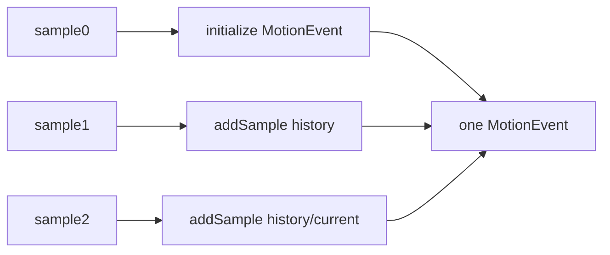

# 187 Android 输入事件批处理与触摸重采样

> 源码版本：Android 11 / `android-11.0.0_r48`  
> 阅读方式：macOS 只读，不要求编译。  
> 核心源码：`InputDispatcher.cpp`、`InputTransport.cpp/.h`、`android_view_InputEventReceiver.cpp`、`BatchedInputEventReceiver.java`、`ViewRootImpl.java`。

---

## 1. 本章目标：高频采样怎样到达一帧

触摸硬件可在一帧内上报多次MOVE。Android 11并不是简单丢掉中间点：Dispatcher仍逐条路由并通过InputChannel发送，客户端InputConsumer才把兼容MOVE组合成带history的MotionEvent，并在Choreographer输入阶段按frameTime消费、可选重采样。

## 2. 先纠正“Dispatcher合并MOVE”

r48的`MotionEntry`只保存一个eventTime和一组当前pointerCoords，没有历史sample数组；`InputPublisher::publishMotionEvent()`也为每个DispatchEntry发送一条独立InputMessage。

真正调用`MotionEvent::addSample()`的是客户端`InputConsumer`。因此应称“客户端批处理”，不能把history归因于Dispatcher发送侧。

## 3. 全链路图

```mermaid
flowchart LR
  R["InputReader samples"] --> IQ["Dispatcher inboundQueue"]
  IQ --> P["pendingEvent / target routing"]
  P --> OQ["per-connection outboundQueue"]
  OQ --> PUB["InputPublisher: one message/sample"]
  PUB --> CH["InputChannel socket"]
  CH --> CON["InputConsumer batches"]
  CON --> VS["Choreographer frameTime"]
  VS --> ME["MotionEvent current + history + optional resample"]
  ME --> VR["ViewRootImpl input stages"]
```



## 4. Dispatcher inboundQueue是FIFO

`enqueueInboundEventLocked()`把EventEntry放到队尾；dispatcher线程没有pending时从队首取一个到`mPendingEvent`。一个pending事件若等待焦点/ANR策略可暂留，后续事件继续在inboundQueue排队。

队列空转非空时需要唤醒poll；已非空通常不必为每个新事件重复唤醒。

## 5. 每次dispatch只推进一个pending事件

`dispatchOnceInnerLocked()`选出pending，检查policy/disabled/app switch/stale/blocked，再调用对应dispatch函数。done后释放pending并把nextWakeup设为立即，下一轮再取下一个。

它不是一次锁内把整个inboundQueue批量扫完。

## 6. 10秒stale不是MOVE专属节流

Key和Motion从eventTime到当前时间达到10秒会按STALE丢弃。它是避免极旧输入继续生效的安全阀，不是为高频MOVE设计的正常降采样算法。

Configuration、DeviceReset、Focus有不同的不可丢策略。

## 7. app switch的500ms抢占

HOME/ENDCALL等app-switch key完成后设置约500ms due time。到期时，其他pending事件可按APP_SWITCH原因丢弃，让切应用按键尽快通过。

这是交互优先级优化，也不等于“合并移动点”。

## 8. 新DOWN触发的inbound pruning

若Dispatcher正在等待无响应的focused application，新pointer DOWN命中了另一个App，或存在可响应gesture monitor，`shouldPruneInboundQueueLocked()`标记该DOWN为`mNextUnblockedEvent`。

前面的阻塞事件随后按BLOCKED丢弃，让用户触碰另一个目标有机会解除卡住体验。

## 9. pruning不会当场erase整个deque

函数名容易误导：enqueue时主要设置“下一个解除阻塞事件”指针；dispatcher逐个处理前序事件时看到`mNextUnblockedEvent`便按BLOCKED丢弃，直到轮到该DOWN。

这是逻辑剪枝，不是立即对deque做一次粗暴clear。

## 10. RecentQueue只用于诊断

released inbound event会额外保留引用到`mRecentQueue`，最多10条，超出释放最旧项。它供dumpsys查看近期事件，不参与重放和批处理。

不要把RecentQueue误认为待派发队列。

## 11. outboundQueue和waitQueue的分工

每个connection的outboundQueue保存尚未publish的DispatchEntry；publish成功后条目转入waitQueue等待客户端FINISHED。ANR超时主要盯waitQueue头部。

客户端batch不会让Dispatcher忘记每条底层seq，后文的seq chain会把完成信号逐条补回。

## 12. Publisher每次发送什么

`publishMotionEvent()`构造一个`InputMessage::MOTION`，写seq、eventId、device/source/display、action、flags、eventTime、pointerCount以及每指properties/coords，然后通过InputChannel发送。

消息自身没有MotionEvent history列表。

## 13. socket为什么设32KB

InputTransport把channel socket buffer设为32KB，注释说足以在App落后时容纳几十条大型多指Motion事件，同时避免系统默认约128KB造成不必要缓冲。

buffer有限意味着App长期不消费最终会形成背压，而不是无限堆积。

## 14. InputConsumer运行在哪端

应用进程的NativeInputEventReceiver持有InputConsumer，在绑定的Looper线程读取InputChannel；对普通窗口通常就是UI线程链路。它把native InputEvent复制成Java对象后调用`dispatchInputEvent()`。

所以batch/history形成已经跨过system_server→App进程边界。

## 15. 哪些action会启动batch

只有action精确为`ACTION_MOVE`或`ACTION_HOVER_MOVE`时新建Batch。DOWN、UP、POINTER_DOWN/UP、SCROLL、CANCEL等不会作为batch头。

结构变化事件必须及时交付，不能藏进纯移动history。

## 16. batch按什么键查找

`findBatch()`只比较deviceId和source。同一个InputConsumer可同时维护多组batch；displayId没有参与查找键。

正常窗口channel的事件路由约束使跨display混入很少见，但这是r48函数的实际比较边界。

## 17. canAddSample的兼容条件

新消息与batch头必须满足：pointerCount相同、完整action相同、每个index的PointerProperties相同。properties包含id/toolType等，顺序或工具改变都会中断batch。

函数不比较坐标——坐标本来就应随sample变化。

## 18. 哪些字段没有参与兼容判断

canAddSample不比较displayId、flags、buttonState、classification、precision、offset/scale等。组合后的MotionEvent总体字段主要来自第一条，后续`addSample()`只追加时间/坐标，并把metaState按位OR。

框架依赖同一MOVE流这些非坐标属性通常稳定；属性变化若未改变action/properties，可能不会单独体现在每个history sample。

## 19. batch遇到不兼容事件

若已有同device/source batch但新消息不能追加，一般先立即把旧batch消费成MotionEvent，并把当前新消息标记`mMsgDeferred`留到下一次consume。

这样保证旧MOVE在UP等边界事件之前交付。

## 20. deferred为什么需要额外唤醒意识

deferred消息已从socket读出，fd可能不再可读；若事件循环只等fd就会漏处理。调用者需继续consume到WOULD_BLOCK，或检查`hasDeferredEvent()`确保再唤醒一次。

这是“用户态已缓存消息”和“内核channel可读性”不同步的典型边界。

## 21. CANCEL如何丢弃待处理MOVE

pointer source的ACTION_CANCEL到来且不能追加时，InputConsumer无需先把即将取消的MOVE batch交给App：它逐条对batch seq发送`handled=false`的finished，清batch，再处理CANCEL。

这是真正主动舍弃中间移动采样的特殊路径。Dispatcher仍会按每个seq找到并移除waitQueue条目、减少foreground pending计数；r48的`afterMotionEventLockedInterruptible()`直接返回false，Motion的handled=false不会像Key那样触发fallback。

## 22. consumeBatches=false意味着什么

fd可读回调通常先以`consumeBatches=false, frameTime=-1`读取。遇到MOVE会把它留在mBatches继续积累；channel读空后返回WOULD_BLOCK，并通过`onBatchedInputEventPending(source)`通知Java稍后消费。

非batch事件仍可立即返回给Java。

## 23. 默认InputEventReceiver为何可立即消费

基类`InputEventReceiver.onBatchedInputEventPending()`默认调用`consumeBatchedInputEvents(-1)`，即不等VSync、把全部batch立即取出。

需要逐帧对齐的接收器会覆写这套调度行为。

## 24. BatchedInputEventReceiver怎样等VSync

它在Choreographer的`CALLBACK_INPUT`阶段安排Runnable，运行时传入`getFrameTimeNanos()`调用consume。若消费了一批且frameTime有效，会继续预约下一帧，避免剩余batch因没有新fd事件而饥饿。

ViewRootImpl有相同思想的batched input调度。

JNI判断是否消费到batch时使用`motionEvent->getAction() & ACTION_MOVE`，不是maskedAction相等比较；数值上HOVER_MOVE也会使该条件为真。这与MOVE、HOVER_MOVE都可形成batch相吻合，但属于依赖action位模式的实现细节。

## 25. frameTime=-1的语义

`consumeBatch()`看到frameTime<0就消费该batch全部samples并移除，不做按时间切分。适用于立即flush、无已知帧时间或基类默认行为。

它仍返回一个含history的MotionEvent，不是逐条Java回调。

## 26. 有frameTime时选哪些sample

若重采样开启，目标sampleTime=`frameTime - 5ms`；否则就是frameTime。`findSampleNoLaterThan()`选择eventTime小于等于目标时间的最后一项，并消费从batch头到该项。

目标时间前没有sample就暂不消费该batch。

## 27. 为什么故意落后VSync 5ms

5ms latency给硬件采样和调度留余量，减少不得不向未来预测的距离。文档注释认为几毫秒延迟对体验影响小，却能减少错误预测造成的位置跳动。

这是平滑度与即时性的权衡。

## 28. 一个batch怎样变MotionEvent history



第一条初始化事件；后续每条调用addSample。Java层可用historySize/getHistoricalX等读取较早点，最新sample作为当前坐标。

## 29. 输出seq为何取最后一条

`consumeSamples()`令chain依次走过每个消息seq，最终outSeq是最后sample的seq。Java只finish这个合成MotionEvent一次。

但前面所有seq仍需向Dispatcher确认，因此保存mSeqChains。

## 30. SeqChain怎样一次完成多条

每追加一条sample，记录“当前seq → 前一个chain seq”。finish最后seq时逆向追链，先向publisher发送所有前序FINISHED，再发送最后seq，handled值相同。

Dispatcher的waitQueue因此仍能逐项出队，批处理不会破坏每条消息的可靠完成协议。

## 31. handled粒度被合并

一个batched MotionEvent只有一次Java handled结果，该结果会用于batch里所有底层sample。App不能对history中某一个MOVE单独标handled、另一个不handled。

这通常符合连续MOVE属于同一gesture处理结果的假设。

## 32. 重采样与batch不是一回事

batch是把多个真实采样装进一个MotionEvent；resample是在此基础上，为目标frame时间额外估计一组X/Y并`addSample(sampleTime, ...)`。

关闭resampling仍可batch；开启resampling也必须满足历史与工具条件才真正改变坐标。

## 33. 重采样开关何时读取

InputConsumer构造时读取只读属性`ro.input.resampling`，默认true并保存到`mResampleTouch`。运行过程中改属性不会让已存在consumer自动重读。

硬件本身已由VSync触发采样时，源码注释建议关闭它。

## 34. 哪些事件可重采样

要求source属于pointer class，最终event action精确为MOVE，且有对应deviceId/source TouchState与至少一条history。HOVER_MOVE虽然能batch，但`resampleTouchState()`不对它重采样。

DOWN/UP/CANCEL也只用于维护/清理历史状态。

## 35. 哪些tool会改X/Y

`shouldResampleTool()`仅允许FINGER或UNKNOWN。STYLUS、ERASER、MOUSE等即使同处MOVE事件，也保留current坐标，不用预测值替换。

一个多pointer事件中可按pointer tool分别决定。

## 36. 重采样只改两个axis

估计结果先复制current全部PointerCoords，再只替换X和Y。pressure、size、orientation、tilt等保持最近真实sample值。

因此“重采样整条触摸数据”不准确，它主要对齐位置。

## 37. 有future sample时做插值

batch切分后若还剩下一条未来message，且时间差至少2ms，就以current和future做线性插值：`alpha=(sampleTime-currentTime)/delta`。

因为切分选的是不晚于sampleTime的最后项，next通常位于其后，目标处于两者之间。

## 38. 没future时做受限外推

至少有current和past两份history时可外推。两次真实采样间隔必须在2ms到20ms之间；预测上限是`current + min(delta/2, 8ms)`，目标更远会被截短。

这防止低频、停顿或异常间隔导致长距离猜测。

## 39. 外推alpha为何看似为负

代码设`alpha=(currentTime-sampleTime)/delta`，当sampleTime在未来时alpha为负，再调用`lerp(current, past, alpha)`；负alpha沿“past→current”的速度方向继续向前。

数学上等价于从current按最近速度外推，不是写反了参数。

## 40. pointerId集合必须完整

current history必须含最终MotionEvent的每个pointerId，否则整次resample返回。other若缺某个id，只让该pointer保持current坐标，不影响其他可重采样pointer。

POINTER_DOWN会清新指的lastResample bit，POINTER_UP也清离开指，避免跨生命周期复用预测位置。

## 41. 静止点怎样避免人工抖动

若近期两个真实坐标相同且旧lastResample已有该id，框架复用旧重采样坐标。否则重复以微小时间差计算可能让静止手指在预测点与真实点之间来回抖。

这是“保持先前估计直到真实位置发生变化”的稳定策略。

## 42. rewriteMessage为何必要

重采样可能生成晚于最近真实sample的坐标。后续消息若eventTime早于lastResample，或真实坐标仍与前两点相同，`rewriteMessage()`用lastResample X/Y覆盖它，避免时间/位置向后跳。

真实坐标出现新变化后会清该id的lastResample有效位。

## 43. TouchState history按什么索引

InputConsumer的resample TouchState同样按deviceId+source查找，不含displayId。DOWN初始化，MOVE追加history，UP/CANCEL rewrite后移除。

它与186章Dispatcher的窗口TouchState完全不是同一类型，名字相同但职责不同。

## 44. 批次顺序与多设备

`mBatches`可有多个device/source组；consumeBatch从vector尾向前找第一个可消费batch，而`getPendingBatchSource()`报告第0个batch来源。不能假定跨设备batch严格以全局eventTime合并成一个事件。

每个返回的MotionEvent仍只属于一个device/source。

## 45. 非兼容边界保证action顺序

UP、POINTER变化或属性变化到来时，旧MOVE batch先消费、当前消息defer；下一轮才交付边界action。于是App不会先看到UP再看到此前积累的MOVE。

CANCEL是特例：旧MOVE直接finished(false)丢掉，随后优先清流。

## 46. ViewRootImpl消费后还做什么

`doConsumeBatchedInput(frameTime)`调用native消费，然后立刻`doProcessInputEvents()`让新产生的Java MotionEvent进入InputStage链。它位于Choreographer INPUT阶段，早于animation/traversal。

因此对齐frame的目标是让本帧布局绘制使用尽可能新且平滑的触摸位置。

## 47. 三个手工推演

场景A：同一指MOVE@1/4/7ms，随后UP。InputConsumer先把三个MOVE合成一个history MotionEvent交付，再defer并交付UP。

场景B：frameTime=16ms、resample开启，目标11ms；batch含8ms和14ms，消费到8ms并用14ms作future插值到11ms，14ms留待后续batch。

场景C：MOVE batch尚未消费就来CANCEL，所有MOVE seq以handled=false完成，App直接收到CANCEL，不再收到那些历史移动。

## 48. 排查卡顿要分三段

- Dispatcher inbound/pending长：焦点、策略、stale、blocked或目标等待；
- connection outbound/wait长：channel背压、App未finish、ANR；
- App pending batch长：Choreographer没及时运行、UI线程繁忙或一直未flush。

只看“MotionEvent数量变少”不能判断是正常batch还是上游丢事件。

## 49. macOS只读练习

```bash
sed -n '520,790p' frameworks/native/services/inputflinger/dispatcher/InputDispatcher.cpp
sed -n '611,815p' frameworks/native/libs/input/InputTransport.cpp
sed -n '925,1065p' frameworks/native/libs/input/InputTransport.cpp
sed -n '223,285p' frameworks/base/core/jni/android_view_InputEventReceiver.cpp
```

自己列5条MOVE的eventTime，分别用frameTime=-1、frameTime固定且resample开/关推导history、剩余batch、插值点和最终finish seq链。

## 50. 复读审计、检查题与下一章

复读后明确：r48 Dispatcher不生成MotionEvent history；stale/pruning/app-switch是队列取舍而非MOVE合并；batch位于App InputConsumer；JNI的batch-consumed位判断也覆盖HOVER_MOVE；兼容条件不比较许多非坐标字段；CANCEL以handled=false完成并丢待处理MOVE但仍逐seq清waitQueue；frameTime=-1全量flush；5ms latency、2/20ms间隔、8ms预测是重采样边界；只改FINGER/UNKNOWN的X/Y；一个Java finish通过seq chain确认全部底层消息。

检查题：

1. App看到historySize>0时，history是谁组装的？
2. 为什么batch后Dispatcher仍能逐条清waitQueue？
3. HOVER_MOVE可batch，为什么不一定resample？
4. future插值与无future外推各有哪些时间限制？
5. CANCEL到来时为什么可以不交付积累的MOVE？

下一章继续读InputConsumer、NativeInputEventReceiver与ViewRootImpl的完成确认：追Java sequence映射、finishInputEvent、handled传播、InputPublisher FINISHED和Dispatcher waitQueue出队。
