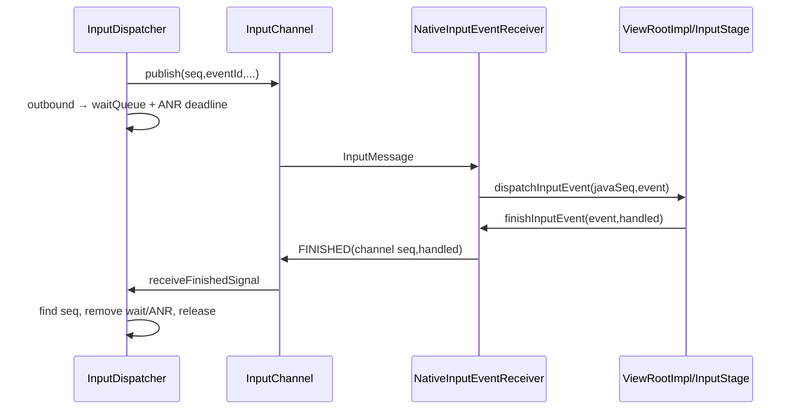

# 188 Android 输入完成确认与 WaitQueue 出队

> 源码版本：Android 11 / `android-11.0.0_r48`  
> 阅读方式：macOS 只读，不要求编译。  
> 核心源码：`InputDispatcher.cpp`、`Connection.cpp/.h`、`InputTransport.cpp`、`android_view_InputEventReceiver.cpp`、`InputEventReceiver.java`、`ViewRootImpl.java`。

---

## 1. 本章目标：输入为何必须“还回去”

Dispatcher把事件写进App的InputChannel后不能立刻释放：它需要知道App是否处理完、是否handled、是否超时，以及同步注入调用是否可返回。完成闭环由channel seq与FINISHED消息连接，核心状态是每connection的waitQueue。

## 2. 先记住十四条结论

1. publish成功后DispatchEntry才从outbound进入waitQueue。
2. waitQueue表示已发送、尚未收到FINISHED，不等于Java待处理队列。
3. 每个DispatchEntry有独立且非0的channel seq。
4. eventId与channel seq职责不同。
5. Java InputEvent还有自己的对象sequence number。
6. mSeqMap把Java对象sequence映射回channel seq。
7. ViewRootImpl InputStage最终必须finish每个有receiver的事件。
8. handled对Motion主要是统计/回传，对Key还可能触发fallback。
9. FINISHED写不进去时在App native端排队，等fd可写重试。
10. Dispatcher按seq查waitQueue，不要求只完成队首。
11. finish后移除对应ANRTracker deadline并释放DispatchEntry。
12. 释放foreground DispatchEntry会减少同步注入pending计数。
13. batched MotionEvent一次finish会通过seq chain补齐全部采样。
14. 忘记finish会让waitQueue老化并最终触发ANR。

## 3. 完成闭环总图



## 4. EventEntry与DispatchEntry的关系

一个EventEntry表示Dispatcher内部的一次原始/合成事件，可发给多个目标。每个目标都会创建自己的DispatchEntry，含独立seq、target flags、坐标变换、delivery/timeout和resolved action/id/flags。

因此同一MotionEntry复制给foreground、wallpaper、monitor时，会有多个完成确认。

## 5. 三种编号必须分开

| 编号 | 生成位置 | 作用 |
|---|---|---|
| eventId | InputReader或Dispatcher IdGenerator | 事件身份、验证/trace |
| DispatchEntry seq | Dispatcher原子计数 | channel传输与FINISHED匹配 |
| Java InputEvent mSeq | Java AtomicInteger | 当前Java对象生命周期映射 |

三者数值无须相同，也不能相互替代。

## 6. channel seq为何不能为0

`DispatchEntry::nextSeq()`用原子自增生成uint32，若结果为0就继续取下一个。InputConsumer也拒绝发送seq=0的FINISHED。

0被保留作失败/无有效序号的哨兵。

## 7. resolvedEventId何时不同

AS_IS通常沿用MotionEntry.id；OUTSIDE、HOVER_ENTER/EXIT、SLIPPERY ENTER/EXIT等action转义会用IdGenerator生成新resolvedEventId。

channel seq始终属于这次DispatchEntry传输，不因eventId沿用或重生成而改变职责。

## 8. outboundQueue保存什么

目标确定并通过InputState一致性检查后，DispatchEntry先进入connection.outboundQueue。此时尚未成功写channel，deliveryTime/timeoutTime也未形成有效在途等待语义。

队列从空变非空会启动dispatch cycle。

## 9. publish前设置超时

取outbound头时设`deliveryTime=currentTime`，timeoutTime=delivery+窗口dispatching timeout，然后尝试publish Key/Motion/Focus。

真正publish失败时该entry仍留在outbound；只有成功才转waitQueue并进入ANR跟踪。

## 10. publish成功后的原子状态变化

成功后从outbound删除该指针，push到waitQueue；connection仍responsive时，把`timeoutTime + token`插入mAnrTracker。

随后while可继续publish后续outbound，因此一个connection允许多个已发送事件同时待确认。

## 11. pipe满时怎样处理

publish返回WOULD_BLOCK：若waitQueue非空，说明App尚未消费前面事件，Dispatcher暂停当前cycle，entry继续留在outbound；收到FINISHED后再重启。

若waitQueue为空却pipe满，源码认为异常，直接abort broken dispatch cycle，因为按预期空wait意味着pipe也应有空间。

## 12. waitQueue不只是“一个事件”

InputEventReceiver注释写“finish前不会收到新事件”，但native Dispatcher与receiver实现允许多个消息在途，NativeInputEventReceiver也会循环consume并回调Java。ViewRootImpl用QueuedInputEvent队列管理它们。

可靠约束是每个交付事件最终都要finish，而非窗口严格只有一个未完成事件。

## 13. Java对象sequence从哪里来

`InputEvent`构造或recycle重用时，从Java静态AtomicInteger获取mSeq。它识别对象的这一次使用，App可通过`getSequenceNumber()`读取。

它不是native InputMessage里的seq字段。

## 14. mSeqMap怎样桥接两种seq

JNI把native event复制成Java对象，并调用私有`dispatchInputEvent(int seq, InputEvent event)`。Java先执行：

```java
mSeqMap.put(event.getSequenceNumber(), seq);
onInputEvent(event);
```

finish时用Java对象sequence查回native channel seq，移除映射后调用nativeFinish。

## 15. 为什么不能finish复制出来的任意事件

只有dispatchInputEvent登记过的Java sequence存在mSeqMap。传入另一个copy、已recycle后又复用的对象或错误receiver的事件，查不到映射，只打印“not in progress”，不会发FINISHED。

必须finish原接收链认可的对象；兼容处理替换对象有专门配对逻辑。

## 16. 重复finish会怎样

第一次finish先从mSeqMap删除。第二次再用同一事件调用时找不到index，只打warning并recycle处理，不会重复发同一个channel seq。

这避免同一DispatchEntry被重复完成。

## 17. ViewRootImpl何时finish

QueuedInputEvent经过pre-IME、IME、post-IME、View和synthetic等InputStage。某阶段标记FINISHED或链尾结束，最终调用`ViewRootImpl.finishInputEvent(q)`。

handled来自`FLAG_FINISHED_HANDLED`，receiver非空时回到InputEventReceiver；无receiver的本地事件只recycle。

## 18. DEFER意味着还不能finish

InputStage可返回DEFER，让QueuedInputEvent暂留等待异步结果，例如IME相关阶段。此时不应提前finish，否则Dispatcher会认为App已处理完，而Java链还在使用该事件。

ANR计时不会因Java“正在异步等待”自动暂停。

## 19. 兼容转换后finish哪个对象

若入站事件被InputCompatProcessor修改，finish前调用`processInputEventBeforeFinish(original)`取得适合回执的processedEvent，再用receiver.finishInputEvent(processedEvent, handled)。

处理器必须维护可追溯sequence，否则mSeqMap无法找到channel seq。这是为何不能随便new一个替代事件。

## 20. 默认onInputEvent也会finish

InputEventReceiver基类默认`onInputEvent()`立即`finishInputEvent(event,false)`。子类覆写后承担最终finish责任。

如果自定义接收器只处理事件却忘记finish，waitQueue会持续增长。

## 21. nativeFinish的正向路径

Java nativeFinishInputEvent拿receiverPtr、seq、handled，调用NativeInputEventReceiver.finishInputEvent，再调用InputConsumer.sendFinishedSignal。

后者构造`InputMessage::FINISHED`，只含seq和handled，沿同一双向socket发回publisher端。

## 22. FINISHED写端也可能背压

App向system_server写FINISHED也可能WOULD_BLOCK。NativeInputEventReceiver把`{seq,handled}`追加mFinishQueue，并把Looper监听从INPUT扩展为INPUT|OUTPUT。

这时Java调用成功返回，不代表FINISHED已经到Dispatcher，只代表已被native可靠排队。

## 23. finishQueue怎样重试

fd可写回调按队列顺序重发；中途再次WOULD_BLOCK就移除已成功前缀、保留剩余并继续监听OUTPUT。全部发送完后clear队列，恢复只监听INPUT。

非WOULD_BLOCK错误可能抛Java RuntimeException；DEAD_OBJECT则通道对端已消失。

## 24. batched事件finish怎样展开

187章的InputConsumer把多个sample合成一个MotionEvent，Java mSeqMap只映射到最后channel seq。sendFinishedSignal先沿mSeqChains找到所有前序seq并逐一发送，再发送最后seq。

一个Java finish因此关闭多个waitQueue DispatchEntry。

## 25. batch的handled如何传播

同一次finish传入的handled应用于seq chain的每个底层sample。若发送中途失败，代码重建未完成chain，等待下次重试。

它不会把前几个sample标true、最后一个标false。

## 26. Dispatcher如何收到反向消息

publisher端fd出现ALOOPER_EVENT_INPUT，`handleReceiveCallback()`循环`receiveFinishedSignal()`，直到WOULD_BLOCK。每读到一条就调用`finishDispatchCycleLocked(currentTime, connection, seq, handled)`。

一轮回调可处理多条FINISHED，batch完成常会产生这种情况。

## 27. 为什么finish先post command

finishDispatchCycle不直接做全部清理，而是`onDispatchCycleFinishedLocked()`创建CommandEntry。随后runCommandsLockedInterruptible执行`doDispatchCycleFinishedLockedInterruptible()`。

Command模型允许后续policy回调在需要时安全释放Dispatcher锁，避免锁内跨组件调用。

## 28. 按seq查找而非只看队头

`Connection::findWaitQueueEntry(seq)`线性扫描整个deque。找不到就直接return；找到哪一项就处理哪一项。

所以协议能容忍FINISHED不严格按waitQueue顺序到达，尽管普通同Looper处理通常接近顺序。

## 29. 找不到seq会发生什么

可能是连接队列已因断开/取消被drain，或收到迟到/重复回执。函数不崩溃、不删除其他entry，只忽略该FINISHED。

它也不会凭handled去猜对应的waitQueue头。

## 30. eventDuration怎样计算

找到entry后以`finishTime - deliveryTime`得到处理时长。超过2秒打slow processing日志，即使尚未达到窗口ANR timeout。

这包含channel传输、App排队、batch等待、Java处理以及FINISHED回传时间。

## 31. handled对Motion的边界

r48 `afterMotionEventLockedInterruptible()`直接返回false，因此Motion handled值不会触发重派或fallback。它仍传入dispatch statistics接口，但该函数当时留有TODO。

handled=false不表示Motion会再次送给另一个窗口。

## 32. handled对Key为何更重要

Key完成后`afterKeyEventLockedInterruptible()`可能询问policy生成fallback key、维持original→fallback对应，或报告unhandled。180章讲的fallback就在这条完成回调后半段发生。

因此Key的handled不是纯统计字段。

## 33. waitQueue真正删除时机

policy后处理可能暂时释放锁，回来后再次按seq查waitQueue，防止期间队列已被drain。若仍存在，erase该entry，并从mAnrTracker删除其timeout+token。

双重查找是并发/可重入安全边界。

## 34. responsive怎样恢复

entry移除后，如果connection此前不responsive，就调用`isConnectionResponsive()`检查剩余waitQueue是否还有超时项。满足条件可把responsive恢复true。

恢复并不要求waitQueue完全为空，只要求没有超过当前时间的旧entry。

## 35. restartEvent是什么

Key policy fallback流程可能要求重启当前DispatchEntry；若restartEvent且connection正常，就把同一entrypush_front回outbound，否则release。

Motion路径始终返回false，不会因handled=false重启。

## 36. release为何影响同步注入

DispatchEntry若是foreground target，创建入队时对其EventEntry的InjectionState执行pendingForegroundDispatches++；最终release时--，归零通知`mInjectionSyncFinished`。

WAIT_FOR_FINISHED注入等待的正是这个计数，而不是某个App的handled=true。

## 37. 多目标注入怎样等待

同一EventEntry派给多个foreground目标会产生多个DispatchEntry，pending计数逐个增加。每个目标各自FINISHED/被drain释放后才归零。

wallpaper或outside若不带FOREGROUND，不计入WAIT_FOR_FINISHED门槛。

## 38. 同步注入超时不撤回事件

注入线程等待pending归零有自己的endTime；超时只让调用者得到TIMED_OUT，并不自动从outbound/waitQueue撤销已发事件。177章的注入超时边界在完成闭环中再次体现。

事件稍后仍可能到App并finish。

## 39. ANRTracker记录什么

每个成功publish且connection responsive的entry插入`timeoutTime, token`。最早deadline驱动Dispatcher检测ANR；FINISHED正常清除对应记录。

它跟eventTime的10秒stale不是同一计时：ANR从deliveryTime+dispatchTimeout看App处理，stale从eventTime看事件排队年龄。

## 40. 为什么忘记finish会ANR

事件留在waitQueue，deadline不被erase；即使View业务逻辑已经做完，只要没有FINISHED，system_server没有证据认为它结束。到期后进入ANR策略链。

“收到事件”等于“处理完成”是错误模型。

## 41. pipe满与waitQueue的反馈环

App不finish→waitQueue增长/pipe可能写满→Dispatcher暂停outbound→更多目标事件积累→最旧wait超时。任意FINISHED到来会清entry并调用`startDispatchCycleLocked(now, connection)`尝试继续publish。

完成确认同时承担流量控制信号。

## 42. channel broken时怎样清队列

不可恢复错误会drain outbound与waitQueue，release每个DispatchEntry，从而减少注入pending计数，并把connection标BROKEN/通知策略。迟到FINISHED再来会因连接或seq不存在被忽略。

清队列不是把事件标handled，而是终止这条传输关系。

## 43. FocusEvent的特殊处理

native receiver把FocusEvent回调Java `onFocusEvent()`后，立即在native侧`finishInputEvent(seq,true)`并continue；它不进入Java mSeqMap/InputEvent普通finish路径。

因此本章的Java对象映射主要针对Key/Motion。

## 44. Java回调异常怎么办

JNI调用dispatchInputEvent若抛异常，会设置skipCallbacks；之后已consume的事件由native用handled=false发送FINISHED，避免因为Java异常永久卡住waitQueue。

异常仍由MessageQueue raise/clear机制报告，但输入通道尽量保持可恢复。

## 45. dispose不是finish所有Java事件

receiver dispose主要停止监听fd并释放channel引用；它不会遍历Java mSeqMap逐个正常finish。窗口移除后publisher关闭或Dispatcher清connection队列负责系统端回收。

业务代码仍不应依赖dispose代替正常finish。

## 46. 三个手工推演

场景A：一个MOVE消息seq=10→Java对象mSeq=42→mSeqMap[42]=10→View处理handled=true→FINISHED(10,true)→waitQueue seq10删除。

场景B：三条MOVE seq20/21/22组成一个history事件，Java仅映射到22；finish后InputConsumer依次回20、21、22，Dispatcher分别清三项。

场景C：App UI线程卡住，seq30已在waitQueue、后续publish使pipe满；无FINISHED则ANR；线程恢复发30后，Dispatcher清deadline并重启outbound发送。

## 47. 常见错误诊断

- waitQueue持续增：App未finish、Looper阻塞、finish写端堵塞或channel异常。
- outbound增但wait不增：publish背压/connection状态问题。
- “finish not in progress”：事件对象/receiver不匹配、重复finish或兼容处理破坏sequence。
- Key莫名fallback：检查handled=false后的policy链。
- 同步注入超时：检查所有foreground目标，不只主窗口。

## 48. dumpsys和trace看什么

`dumpsys input`的connection OutboundQueue/WaitQueue分别看待发与待确认；entry的deliveryTime/timeoutTime帮助判断是否接近ANR。结合App主线程trace、Choreographer input callback、ViewRoot InputStage异步点定位延迟在哪一段。

不要只看inboundQueue长度判断App是否完成。

## 49. macOS只读练习

```bash
sed -n '2460,2620p' frameworks/native/services/inputflinger/dispatcher/InputDispatcher.cpp
sed -n '1068,1125p' frameworks/native/libs/input/InputTransport.cpp
sed -n '155,225p' frameworks/base/core/java/android/view/InputEventReceiver.java
sed -n '4748,4808p' frameworks/native/services/inputflinger/dispatcher/InputDispatcher.cpp
```

画出一个事件发给主窗+wallpaper的两个DispatchEntry，标记各自seq、foreground计数、wait deadline和finish先后，验证何时同步注入可返回。

## 50. 复读审计、检查题与下一章

复读重点限定：eventId/channel seq/Java mSeq三套编号；publish成功才进wait/ANR；允许多个在途事件；mSeqMap只认登记对象且重复finish被忽略；FINISHED写阻塞有App端queue；按seq可乱序完成；Motion handled=false不fallback，Key可能fallback；release而非仅erase负责注入pending递减；批处理一次Java finish展开多seq；注入等待超时不撤销事件。

检查题：

1. Java `getSequenceNumber()`为什么不能直接发给Dispatcher？
2. publish WOULD_BLOCK时entry位于outbound还是wait？
3. 一个batched MotionEvent如何清理多个waitQueue entry？
4. handled=false对Key和Motion有何不同？
5. WAIT_FOR_FINISHED注入到底等待什么计数？

下一章继续读InputDispatcher的InputState与取消事件合成：追每connection的key/motion memento、序列一致性检查、设备reset/焦点/窗口移除时怎样合成CANCEL和UP。
