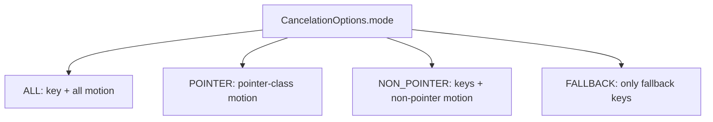
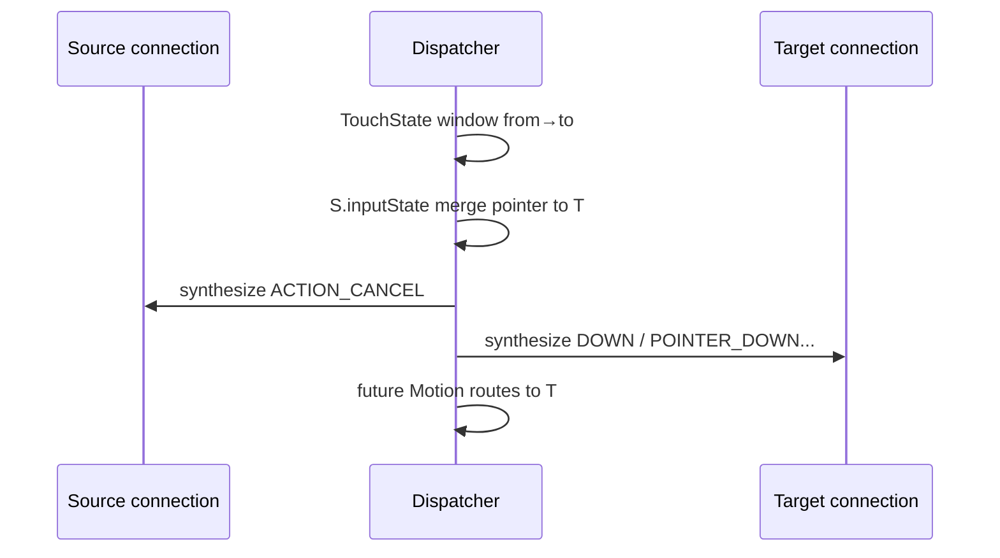

# 189 Android InputState 与取消事件合成

> 源码版本：Android 11 / `android-11.0.0_r48`  
> 阅读方式：macOS只读，不要求编译。  
> 核心源码：`InputState.cpp/.h`、`CancelationOptions.h`、`InputDispatcher.cpp`。

---

## 1. 本章目标：让每个通道的事件流自洽

Dispatcher的全局TouchState决定事件应该送给谁；每个Connection内部的InputState则记录“这个接收者已经知道哪些键或触点处于活动状态”。窗口移除、设备reset、焦点转移或gesture monitor抢流时，Dispatcher依据这份接收者视角合成UP、CANCEL、HOVER_EXIT或补DOWN。

## 2. 两种Touch状态不要混淆

| 状态 | 范围 | 作用 |
|---|---|---|
| `mTouchStatesByDisplay` | Dispatcher每display | 决定目标窗口和split pointer归属 |
| `Connection::inputState` | 每个InputChannel | 记录该接收者实际已收到的key/motion流 |

前者回答“下一条送谁”，后者回答“给这个谁发送什么才不破坏序列”。

## 3. InputState保存三类记忆

- `mKeyMementos`：仍按下的键；
- `mMotionMementos`：仍down或hovering的运动流；
- `mFallbackKeys`：原keyCode到fallback keyCode的对应。

`isNeutral()`只检查key和motion memento为空，不检查fallback map。

## 4. Memento不是完整历史

它保存取消或重建所需的最后状态：device/source/display、按键码、flags、downTime，或最新pointer properties/coords与precision。它不保存所有MOVE history。

因此合成CANCEL使用最新已知坐标，而不是回放整条轨迹。

## 5. track发生在何时

DispatchEntry确定resolved action/flags后、真正放入outboundQueue前调用`trackKey()`或`trackMotion()`。不一致返回false时，该dispatch entry直接跳过，不会publish。

InputState描述的是“Dispatcher已承诺准备交付给这个connection的序列”，可能略早于App实际读到消息。

## 6. KeyMemento的唯一键

查找同时比较deviceId、source、displayId、keyCode和scanCode。同keyCode但不同scanCode或设备可各有一条memento。

DOWN若已存在同键，先删除旧memento再添加新状态，相当于刷新downTime/flags等字段。

## 7. 不一致KEY_UP为何仍允许

KEY_UP找不到memento时，源码有一大段FIXME，最终仍返回true允许分发。原因是按住键时弹出的新窗口可能没收到原DOWN，却需要UP来关闭弹窗。

因此Key序列一致性是宽松策略，不像Motion UP/CANCEL那样严格拒绝。

## 8. fallback UP额外清什么

若原entry带`AKEY_EVENT_FLAG_FALLBACK`且action为UP，会遍历mFallbackKeys，删除value等于该fallback keyCode的所有映射。

它按value清理，允许多个original映射到同一个fallback时一起结束。

## 9. MotionMemento的唯一键

比较deviceId、source、displayId以及hovering布尔值，不把pointerId集合当查找键。同一设备/source/display最多各有一个down流memento和一个hover流memento。

pointer数组本身随MOVE/POINTER变化整体更新。

## 10. DOWN怎样建立motion状态

已有同键的非hover memento先删除，再把当前pointer数组、flags、precision、cursor position、downTime、policyFlags存入新memento。

重复DOWN不会被拒绝，而是重置接收者视角的活动流。

## 11. UP与CANCEL为何严格

UP/CANCEL必须找到非hover memento；找到就删除并允许分发，找不到返回false跳过。给App发送没有对应DOWN的Motion UP/CANCEL通常没有意义，还可能破坏View手势状态。

这与KEY_UP的兼容例外不同。

## 12. MOVE与POINTER action如何更新

普通pointer source的MOVE、POINTER_DOWN/UP必须已有memento，且`firstNewPointerIdx<0`，才用当前entry覆盖pointer状态并返回true。

若目标还有尚未补发DOWN的新pointer，后续MOVE会暂时视为不一致，直到重建完成。

## 13. Navigation source为何不追踪

trackball等navigation source可没有配套DOWN/UP就发相对MOVE，且无需为相对位移合成取消，所以该分支直接return true，不建立memento。

不要把所有Motion MOVE都套入触屏生命周期。

## 14. Joystick MOVE为何特殊

joystick可无DOWN/UP连续发归一化axis。coords为空代表回中，删除memento；非空则建立/更新memento。保留状态用于取消可能由摇杆运动产生的fallback事件。

它仍始终允许MOVE分发。

## 15. hover状态怎样追踪

HOVER_ENTER/HOVER_MOVE删除旧hover memento并保存最新状态；HOVER_EXIT必须找到hover memento，找到后删除，否则拒绝。

Dispatcher还能用`isHovering(device,source,display)`把缺失的首个HOVER_MOVE转成HOVER_ENTER。

## 16. Cancellation拼写为何是Cancelation

r48类型名为`CancelationOptions`、函数名`synthesizeCancelationEvents`，只写一个l。这是源码API的既有拼写，文档引用函数时应保持原名。

业务含义仍是取消事件。

## 17. 四种取消模式



还可用keyCode、deviceId、displayId进一步过滤。

## 18. keyCode过滤只作用于Key

`shouldCancelKey()`检查keyCode/device/display；`shouldCancelMotion()`只检查device/display，没有keyCode概念。

CANCEL_FALLBACK_EVENTS也只会命中flags带FALLBACK的KeyMemento。

## 19. POINTER与NON_POINTER按source class分

POINTER模式只取消`source & AINPUT_SOURCE_CLASS_POINTER`的Motion；NON_POINTER取消所有Key以及非pointer Motion。它不是按event type名字或toolType判断。

Mouse/touch/stylus的source class会影响归类。

## 20. 合成Key取消长什么样

对命中KeyMemento生成新KeyEntry：eventTime=currentTime、action=UP、flags=原flags|CANCELED、repeatCount=0，保留device/source/display、key/scan/meta、policyFlags和原downTime。

App可从CANCELED识别这不是正常物理抬键。

## 21. 合成Motion取消长什么样

非hover memento生成ACTION_CANCEL；hover memento生成ACTION_HOVER_EXIT。保留最后pointer数组、precision、cursor、downTime和原flags，meta/button/classification/edge重置为中性值。

Hover没有ACTION_CANCEL语义，所以用EXIT收尾。

## 22. 为什么每个memento只生成一条Motion CANCEL

多指down流保存在一个MotionMemento中，合成时以完整pointerCount生成一条ACTION_CANCEL。无需逐pointer发送POINTER_UP。

CANCEL表示整条gesture立即失效。

## 23. synthesize函数为何不直接erase

它遍历memento生成EventEntry，却不在函数里删除。Dispatcher随后把合成事件送回同一connection，`enqueueDispatchEntryLocked()`再次调用track：Key UP或Motion CANCEL才清对应memento。

这样状态变化与实际可入队的事件保持同一路径。

## 24. connection broken为何不合成

`synthesizeCancelationEventsForConnectionLocked()`若status==BROKEN直接返回。通道已经无法可靠publish，生成CANCEL没有接收者；broken清队列/状态由连接销毁流程处理。

不能把“系统想取消”理解成一定能让App收到CANCEL。

## 25. 合成事件如何选坐标变换

仍能找到window handle时，InputTarget用窗口frame负offset、window scale和global scale；找不到窗口时使用默认零offset/1 scale。target只指向该connection且AS_IS。

合成事件不是重新走窗口hit-test。

## 26. 合成事件也进入outbound/wait闭环

每条cancel EventEntry经enqueue生成DispatchEntry、进入outbound、publish后进wait并等FINISHED。它不是绕过InputChannel的控制消息。

最后调用startDispatchCycle立即尝试发送。

## 27. device reset怎样使用取消

收到DeviceResetEntry时构造CANCEL_ALL_EVENTS，并设置options.deviceId为重置设备，面向所有connections合成取消。

只清该设备已被各通道看到的活动流，其他设备状态保持。

## 28. dispatch失败怎样取消monitor

Motion目标查找/注入失败时，按pointer或non-pointer模式给monitor合成取消，避免monitor已看到DOWN却再也收不到结尾。

普通窗口是否取消取决于具体失败路径，不能笼统说所有失败都全局CANCEL。

## 29. conflicting pointer actions怎样处理

同display出现矛盾device/down/hover序列时，Dispatcher在分发当前事件前为所有connections合成pointer CANCEL，先把旧接收者状态拉回中性。

然后当前事件按新目标继续分发。

## 30. 焦点变化主要取消什么

键焦点窗口失去/改变时，常对旧focused input channel合成NON_POINTER取消，清仍按下的Key和非pointer运动；普通touch目标不因键焦点变化自动切换。

触摸归属由TouchState独立维护。

## 31. 窗口移除时触摸如何收尾

更新窗口列表发现TouchedWindow消失，会对其channel合成POINTER取消，并从当前display的TouchState移除窗口。这里的`CancelationOptions`**没有设置displayId过滤**，因此如果同一个InputChannel异常地还保存着其他display的pointer memento，它们也会一起结束；不能把“从哪个display的TouchState发现窗口消失”误解成InputState取消时自动按display筛选。

这样旧App不会永远认为手指仍按下。

## 32. gesture monitor pilfer是什么

gesture monitor调用pilferPointers后，Dispatcher确认该monitor参与当前down流；随后对所有普通touched windows按device/display合成pointer CANCEL，并`filterNonMonitors()`清窗口目标，仅保留monitor。

这是系统手势从App“抢走”pointer stream的正式机制。

## 33. pilfer不会给monitor重发DOWN

monitor从手势开始就作为gesture monitor收到流，因此抢占时它已经知道DOWN；只需取消其他窗口并改变未来路由，不必为monitor补DOWN。

若monitor没有ongoing stream，pilfer返回BAD_VALUE。

## 34. touch focus transfer为何更复杂

`transferTouchFocus(from,to)`要让旧窗结束、目标窗从当前中途状态继续。只发旧窗CANCEL不够：目标窗此前可能完全不知道已有手指，必须先补齐DOWN序列。

这就是`mergePointerStateTo()`与`synthesizePointerDownEvents()`的用途。

## 35. merge只合并pointer-class motion

源InputState遍历MotionMemento，只处理source含POINTER class的项；Key、hover以外非pointer运动和fallback map不转移。

匹配目标memento仍按device/source/display。

## 36. firstNewPointerIdx表示什么

合并到已有目标memento时，首次追加前把`firstNewPointerIdx`设为目标原pointerCount；源pointer追加其后。若目标没有对应memento，复制源memento并设为0。

索引之前是目标已知pointer，之后是必须补DOWN的新pointer。

## 37. 合并没有pointerId去重

`mergePointerStateTo()`按数组直接追加，没有检查源与目标pointer id是否重复，也没有MAX_POINTERS边界保护。正确调用依赖split归属互斥和系统不超过上限。

这是内部不变量，不是健壮的通用集合合并API。

## 38. 目标为何暂时拒绝MOVE

合并后`firstNewPointerIdx>=0`。trackMotion对MOVE/POINTER action看到这个标志会返回false，直到synthesizePointerDownEvents把缺失DOWN补完并重置为-1。

防止目标先看到一根陌生pointer的MOVE，再看到补DOWN。

## 39. 补DOWN的顺序

先复制目标已知pointer到临时数组；随后按追加顺序逐个加入未知pointer。若加入后总数为1，action=DOWN；否则为POINTER_DOWN并将当前数组索引写入action index。

每次生成事件的pointerCount逐渐增长。

## 40. action index使用i是否正确

源码用原memento索引i设置POINTER_INDEX；由于临时数组按相同索引复制且每轮pointerCount增长到i+1，i就是新pointer在事件数组中的index。

这里不是pointerId。

## 41. 转移完整顺序



旧窗被取消，目标窗获得一条从当前坐标开始的自洽新gesture。

## 42. transfer要求同display

from/to window必须都存在且displayId相同，TouchState中也必须找到from窗口。否则返回false，不修改connection InputState。

它不是跨显示拖拽传输API。

## 43. Fallback map为何也在InputState

fallback处理是按connection进行的：某窗口没处理原key，policy可能让同一connection接收fallback key。映射记录original→fallback，确保后续UP及取消能对应同一选择。

窗口切换不能共享这张map。

## 44. CANCEL_FALLBACK_EVENTS何时用

原key最终被处理、policy改变或fallback链需撤销时，Dispatcher可只合成带FALLBACK flags的key UP，不影响普通按键和motion状态。

options还可指定`keyCode`过滤具体活动项。r48的两个实际调用点传入的是此前真正派发出去的`fallbackKeyCode`，因为`shouldCancelKey()`比较的是`KeyMemento.keyCode`；它不是拿original keyCode去间接查映射。

## 45. InputState clear做什么

`clear()`直接清key、motion mementos和fallback map，不生成事件。用于连接销毁等无法/无需通知接收者的场景。

正常可通信状态下更倾向先合成取消，让App收尾。

## 46. 三个手工推演

场景A：App已收两指DOWN+MOVE，设备reset。该connection生成一条含两pointer最新坐标的ACTION_CANCEL；trackMotion清memento，App收到后结束gesture。

场景B：App A持有id0，App B持有id1，transfer A→B。B原memento后一位追加id0，A收CANCEL，B收包含id1+id0的POINTER_DOWN，之后B接收两指MOVE。

场景C：hover窗口被移除。InputState按hover memento生成HOVER_EXIT而非CANCEL，使用最后坐标结束hover状态。

## 47. 常见错误诊断

- App收到MOVE却没DOWN：检查目标转移补DOWN是否被不一致track跳过。
- 窗口移除后仍像按住：检查channel是否broken，CANCEL能否publish。
- trackMotion丢UP/CANCEL：检查device/source/display与hovering是否匹配。
- fallback键卡住：检查mFallbackKeys和FALLBACK UP取消路径。
- pilfer无效：monitor必须已属于当前gestureMonitors且TouchState.down=true。

## 48. InputState不是硬件真相

它只记录该connection被Dispatcher跟踪到的已交付语义。硬件可能仍按下，而窗口因CANCEL已回到中性；另一个窗口可能通过补DOWN从中途接管。

所以memento描述“接收者认知”，不是EventHub当前物理状态。

## 49. macOS只读练习

```bash
sed -n '1,470p' frameworks/native/services/inputflinger/dispatcher/InputState.cpp
sed -n '2750,2915p' frameworks/native/services/inputflinger/dispatcher/InputDispatcher.cpp
sed -n '3960,4025p' frameworks/native/services/inputflinger/dispatcher/InputDispatcher.cpp
sed -n '4440,4480p' frameworks/native/services/inputflinger/dispatcher/InputDispatcher.cpp
```

画两connection split touch的memento数组，手算transfer后firstNewPointerIdx、补DOWN事件pointerCount/action index及源CANCEL。

## 50. 复读审计、检查题与下一章

复读重点限定：Key UP找不到DOWN仍允许而Motion UP/CANCEL拒绝；navigation不追踪、joystick以空coords回中；取消生成本身不erase，合成事件再次track才清状态；hover取消是EXIT；memento按接收者而非硬件；pilfer不补monitor DOWN；transfer先merge、源CANCEL、目标补DOWN；firstNewPointerIdx阻止陌生MOVE；merge依赖pointer id互斥且不自行去重。

检查题：

1. 为什么全局TouchState和Connection InputState缺一不可？
2. 为什么不一致KEY_UP允许而Motion UP通常拒绝？
3. synthesizeCancelationEvents为何不直接删除memento？
4. pilfer与transfer在目标是否需要补DOWN上有何不同？
5. firstNewPointerIdx怎样保证目标先看到DOWN再看到MOVE？

下一章继续读InputDispatcher的窗口/通道生命周期：从register/unregister、InputChannel broken、窗口列表刷新到TouchState清理，理解token、window handle与connection为何不能简单一一等同。
