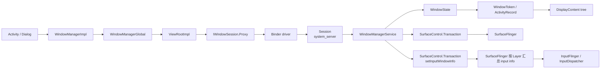
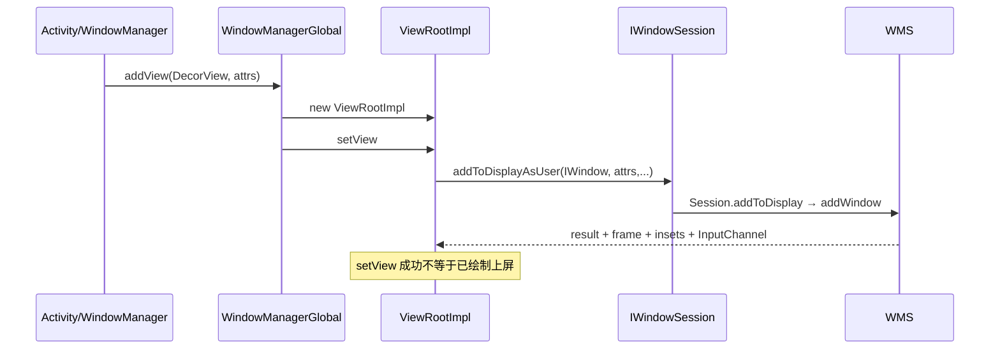
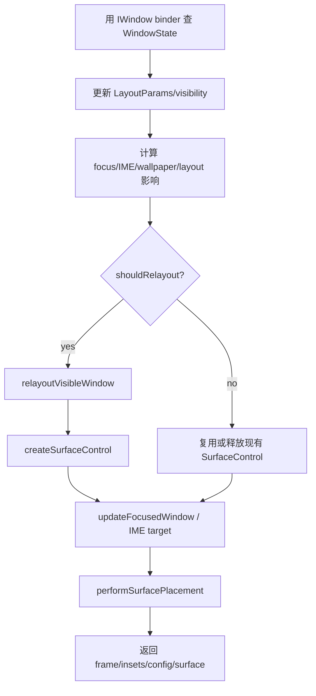
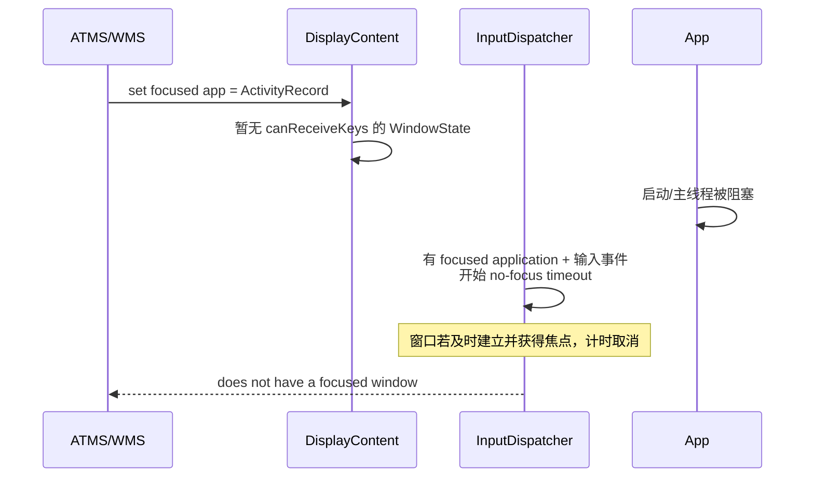
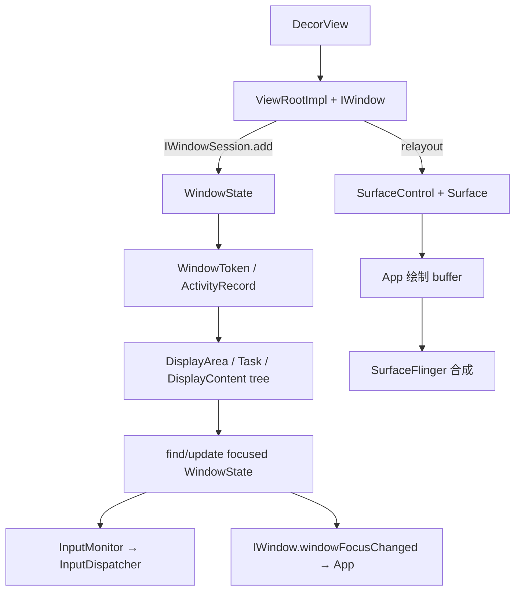

# 19 WMS 窗口管理与焦点切换

> 源码版本：Android 11 / API 30 / `android-11.0.0_r48`  
> 学习方式：macOS 只读源码，不执行 AOSP 编译。  
> 前置章节：[09-Activity启动流程之ATMS系统端调度](./09-Activity启动流程之ATMS系统端调度.md)、[11-View到Window与ViewRootImpl](./11-View到Window与ViewRootImpl.md)、[12-Surface到SurfaceFlinger显示链路](./12-Surface到SurfaceFlinger显示链路.md)、[18-ANR原理与系统诊断](./18-ANR原理与系统诊断.md)

---

## 1. 本章要解决什么问题

前面已经知道：

```text
Activity.setContentView
 → PhoneWindow / DecorView
 → WindowManagerGlobal
 → ViewRootImpl
 → WMS
 → Surface
```

但这条链仍留下很多问题：

- `Window`、`ViewRootImpl`、`WindowState` 是不是同一个东西？
- `WindowToken` 到底是 Binder token，还是窗口容器？
- Activity 已 resumed，为什么还可能没有焦点窗口？
- 屏幕最上面的窗口为什么不一定得到按键焦点？
- `addWindow()` 已成功，为什么窗口仍未显示？
- `relayout()` 为什么既返回 frame，又可能创建 Surface？
- WMS 的 Z-order、SurfaceFlinger 的 layer、InputDispatcher 的 input window 是什么关系？
- Dialog、PopupWindow、Toast、IME 和 Activity 窗口如何挂到不同 token？

本章完成后，应能：

1. 区分 App 进程对象与 system_server 对象。
2. 解释 `IWindowSession`、`IWindow` 两个 Binder 接口的方向。
3. 画出 Android 11 的 WindowContainer 层级。
4. 区分 Binder token、WindowToken、ActivityRecord、WindowState。
5. 从 `addView()` 追到 `WMS.addWindow()`。
6. 从首次 traversal 追到 `relayoutWindow()` 和 Surface 创建。
7. 解释窗口 frame、insets、可见性和绘制状态。
8. 区分 focused app、focused window、input focus、View focus、touch focus。
9. 解释焦点怎样同步给 InputDispatcher 和 App。
10. 用 dumpsys 定位 BadToken、无焦点窗口、层级和 relayout 问题。

---

## 2. 先建立四个世界

“窗口”在不同层含义不同：

| 世界 | 关键对象 | 主要职责 |
|---|---|---|
| App UI | `Window`、`PhoneWindow`、`DecorView` | 窗口样式与 View 根布局 |
| App 接入层 | `WindowManagerGlobal`、`ViewRootImpl`、`IWindow.Stub` | 管理 root、请求布局、Binder 通信、输入接收 |
| system_server | `WindowManagerService`、`WindowState`、`WindowToken`、`DisplayContent` | 权限、层级、布局、焦点、Surface 元数据 |
| 合成/输入 native | `SurfaceFlinger`、`InputDispatcher` | 合成 layer；根据 input window 信息投递事件 |

最重要的对应关系：

```text
一个顶层 View 树
 ↔ 一个 ViewRootImpl（App）
 ↔ 一个 IWindow Binder client
 ↔ 一个 WindowState（system_server）
 ↔ 通常有一组 SurfaceControl/Surface 资源
```

`PhoneWindow` 不是 WMS 中的窗口记录，`WindowState` 也不包含 App 的完整 View 树。

---

## 3. 总体调用图



两条 Binder 方向：

```text
App → WMS：IWindowSession.addToDisplay / relayout / remove
WMS → App：IWindow.resized / windowFocusChanged / dispatchAppVisibility 等
```

---

## 4. WindowManagerGlobal 与 ViewRootImpl

`WindowManagerImpl.addView()` 最终委托给进程级 `WindowManagerGlobal`：

```text
WindowManagerImpl.addView
 → WindowManagerGlobal.addView
 → new ViewRootImpl(context, display)
 → ViewRootImpl.setView(view, LayoutParams, panelParentView, userId)
```

WindowManagerGlobal 保存并行数组：

```text
mViews  ：顶层 View/DecorView
mRoots  ：ViewRootImpl
mParams ：WindowManager.LayoutParams
```

它是“本进程有哪些顶层 View root”的账本，不是全系统窗口管理器。

ViewRootImpl 负责：

- 把 View 树接入窗口系统。
- 运行 traversal：measure/layout/draw。
- 保存 `IWindowSession`。
- 暴露 `W extends IWindow.Stub` 给 WMS 回调。
- 建立输入接收端。
- 处理 relayout 返回的 frame、Insets、SurfaceControl。

---

## 5. IWindowSession 与 Session

App 首次需要窗口服务时，通过 WMS 打开 session。客户端持有：

```text
IWindowSession.Proxy
```

system_server 对应：

```text
Session extends IWindowSession.Stub
```

`Session` 记录调用进程相关信息，例如 PID、UID、是否具备添加内部系统窗口等能力，并把 Binder 方法转给 WMS：

```text
Session.addToDisplay
 → WMS.addWindow(this, ...)

Session.relayout
 → WMS.relayoutWindow(this, ...)

Session.remove
 → WMS.removeWindow(...)
```

通常一个 App 进程复用同一个 WindowSession；一个 Session 可拥有多个 WindowState。

---

## 6. IWindow 是谁

ViewRootImpl 内部的 `W` 继承 `IWindow.Stub`：

```text
ViewRootImpl.W
 → IWindow.Stub
 → Binder token
```

App 调 `addToDisplay()` 时把它传给 WMS。WMS 用 `client.asBinder()` 作为窗口的唯一客户端标识，并创建：

```text
WindowState.mClient = IWindow
```

WMS 以后可反向调用：

- `resized()`：frame/config/insets 改变。
- `windowFocusChanged()`：窗口焦点变化。
- `dispatchAppVisibility()`：应用窗口可见性变化。
- `dispatchGetNewSurface()`：需要客户端重新获取 Surface。

因此：

```text
IWindowSession：App 请求 WMS
IWindow：WMS 回调某个 App 窗口
```

两者方向相反，不能混用。

---

## 7. 三种经常被叫作 token 的东西

### 7.1 `client.asBinder()`：窗口客户端 Binder

来自 ViewRootImpl.W，用于 `mWindowMap` 查找具体 WindowState：

```text
mWindowMap<IWindow binder, WindowState>
```

### 7.2 `LayoutParams.token`：窗口归属 token

告诉 WMS 这个窗口应归到哪个 WindowToken/ActivityRecord，子窗口时还可能用于查父 WindowState。

### 7.3 `WindowToken`：system_server Java 容器

它不是一个裸 IBinder，而是 WMS 对一组相关窗口的服务端管理对象：

```java
class WindowToken extends WindowContainer<WindowState>
```

内部字段 `token` 才是作为 key 的 IBinder。

记忆：

```text
IBinder token = 身份钥匙
WindowToken = WMS 用钥匙找到的容器档案
WindowState = 容器中的一个具体窗口记录
```

---

## 8. Android 11 中 ActivityRecord 就是一种 WindowToken

旧版资料经常写：

```text
AppWindowToken 管理 Activity 窗口
```

但在本工程 Android 11 中，应以实际源码为准：

```text
ActivityRecord extends WindowToken
```

所以应用主窗口的 token 查出来后，可通过：

```java
token.asActivityRecord()
```

判断它是不是 Activity 容器。

这也解释了 ActivityRecord 为什么同时拥有两类职责：

- ATMS 侧：生命周期、Task、启动模式、可见性。
- WMS 侧：承载 starting/main/child 等窗口及 Surface 层级。

ATMS 与 WMS 在 Android 10+ 代码组织上紧密结合，但概念职责仍应分开。

---

## 9. WindowContainer 层级

所有对象都不应硬塞进一棵过度简化的固定树。Android 11 引入/使用 DisplayArea 后，应用窗口与非应用窗口会走不同分支。

便于理解的常见应用分支：

```text
RootWindowContainer
 └─ DisplayContent
     └─ TaskDisplayArea
         └─ Task
             └─ ActivityRecord extends WindowToken
                 ├─ starting WindowState
                 ├─ main WindowState
                 └─ child WindowState
```

非应用窗口概念分支：

```text
DisplayContent
 └─ DisplayArea / 非应用 token 容器
     └─ WindowToken
         └─ WindowState（状态栏、导航栏、IME、壁纸等）
```

实际父节点由 `DisplayAreaPolicy`、窗口类型、Task 组织和设备配置决定。阅读 dumpsys 时应看对象真实 parent，而不是要求所有 WindowToken 都直接挂在 DisplayContent 下。

---

## 10. WindowState 保存什么

源码：

```java
class WindowState extends WindowContainer<WindowState>
```

主要信息：

| 字段/关联 | 含义 |
|---|---|
| `mSession` | 所属客户端 Session |
| `mClient` | IWindow 回调接口 |
| `mToken` | 所属 WindowToken |
| `mActivityRecord` | 若为 Activity 窗口，对应 ActivityRecord |
| `mAttrs` | WindowManager.LayoutParams |
| `mOwnerUid` | 所属 UID |
| `mParentWindow` | 子窗口的父 WindowState |
| `mWinAnimator` | WindowStateAnimator，管理绘制/Surface 状态 |
| frames/insets | 服务端计算的几何和系统区域 |
| input channel/info | 输入分发所需信息 |

WindowState 不保存按钮、TextView 等 View 节点；它只管理顶层窗口边界以上的系统状态。

---

## 11. 窗口类型决定第一层规则

`WindowManager.LayoutParams.type` 大致分：

```text
应用窗口：FIRST_APPLICATION_WINDOW ... LAST_APPLICATION_WINDOW
子窗口：FIRST_SUB_WINDOW ... LAST_SUB_WINDOW
系统窗口：IME、wallpaper、status bar、overlay、toast 等
```

类型影响：

- 是否需要 Activity token。
- 是否允许普通 App 添加。
- 父子关系。
- policy layer/Z-order。
- 是否可聚焦、可触摸。
- Insets、IME、壁纸关系。
- 是否需要额外权限或 AppOps。

`type` 不是一个只为排序服务的数字。WMS 会先验证 token 和权限，再谈层级。

---

## 12. LayoutParams.token 从哪里来

Activity 的 WindowManagerImpl 带有默认 token；添加 DecorView 时，WindowManagerGlobal/实现层会保证 LayoutParams 使用 Activity 对应的 app token。

Dialog：

- 使用 Activity context 创建，通常可继承有效 Activity token。
- 使用 Application context 创建，缺少应用窗口 token，普通 Dialog 常触发 `BadTokenException`。

PopupWindow/Panel 子窗口：

- token 通常来自 anchor/parent View 的 window token。
- WMS 用 token 找到父 WindowState。

Toast/overlay/system window：

- 有各自 token、权限、targetSdk 和策略规则。
- 不能用“传个任意 Binder 就行”理解。

---

## 13. addWindow 客户端链路



客户端 `ViewRootImpl.setView()` 在 Binder 调用前后还会：

- 保存 View 和 LayoutParams。
- 请求首次 layout/traversal。
- 创建/接收 InputChannel。
- 根据 add result 抛出 BadToken、InvalidDisplay 等异常。
- 把 View 的 parent 设置为 ViewRootImpl。

---

## 14. WMS.addWindow 第一阶段：权限和显示检查

入口：

```java
WindowManagerService.addWindow(Session session, IWindow client, ...)
```

锁外先做 policy permission：

```text
mPolicy.checkAddPermission(type, ...)
```

进入 `mGlobalLock` 后检查：

1. Display 是否 ready。
2. displayId 是否存在。
3. 调用 UID 是否能访问该 Display。
4. `client.asBinder()` 是否重复添加。
5. requestUserId 是否合法。
6. presentation/private display 是否匹配。

因此 addWindow 是安全边界，不是简单 new WindowState。

---

## 15. WMS.addWindow 第二阶段：token 与父窗口校验

子窗口：

```text
type 属于 SUB_WINDOW
 → 用 attrs.token 在 mWindowMap 查父 WindowState
 → 父不存在：ADD_BAD_SUBWINDOW_TOKEN
 → 父本身不能再是 sub-window
```

普通应用窗口：

```text
DisplayContent.getWindowToken(attrs.token)
 → 必须能 asActivityRecord
 → ActivityRecord 仍在容器树中
 → starting window 不能重复
```

系统特殊类型还会验证 token.windowType 是否匹配，例如 IME、wallpaper、voice interaction、accessibility overlay。

WMS 返回错误码，客户端 ViewRootImpl 把部分错误翻译成 `WindowManager.BadTokenException`。异常发生在 App，但拒绝原因来自 system_server 的 token/权限规则。

---

## 16. WMS.addWindow 第三阶段：创建 WindowState

校验通过：

```text
new WindowState(WMS, Session, IWindow, token, parentWindow, ...)
 → linkToDeath 监听客户端 Binder
 → DisplayPolicy.adjustWindowParamsLw
 → validateAddingWindowLw
 → openInputChannel（若窗口接收输入）
```

若 IWindow Binder 已死亡，`mDeathRecipient` 无法建立，add 会中止。

InputChannel 是 App 窗口与 InputDispatcher 之间的事件通道。WMS 负责建立/登记窗口侧信息，但真正事件投递在 native 输入系统中完成。

---

## 17. WMS.addWindow 第四阶段：挂入系统账本

从源码注释“From now on, no exceptions or errors allowed”之后，进入正式提交：

```text
win.attach()
mWindowMap.put(client.asBinder(), win)
win.mToken.addWindow(win)
DisplayPolicy.addWindowLw
更新 IME/wallpaper/input 信息
尝试更新焦点
assignChildLayers
updateInputWindowsLw
```

关键索引：

```text
mWindowMap：IWindow binder → WindowState
DisplayContent.mTokenMap：token binder → WindowToken
WindowToken children：相关 WindowState
```

三者解决不同查找问题。

---

## 18. addWindow 成功为什么还看不到窗口

WMS 源码明确说明：

```text
Don't do layout here, the window must call relayout to be displayed
```

`addWindow()` 主要完成身份、结构、输入通道和初始信息登记。窗口真正获得用于绘制的 Surface，需要随后 traversal 中的 relayout。

所以应区分：

```text
added：WMS 已有 WindowState
relayouted：几何/可见性已协商，可能创建 Surface
drawn：App 已向 buffer 绘制并提交
shown：WMS/SF 允许并实际合成显示
focused：满足焦点选择并同步输入系统
```

这五种状态不是同义词。

---

## 19. 首次 traversal 如何触发 relayout

ViewRootImpl.setView 后安排 traversal：

```text
requestLayout
 → scheduleTraversals
 → Choreographer CALLBACK_TRAVERSAL
 → doTraversal
 → performTraversals
```

`performTraversals()` 综合判断：

- 窗口尺寸是否变化。
- LayoutParams 是否变化。
- 可见性是否变化。
- Insets/configuration 是否变化。
- 是否首次布局或需要新 Surface。

需要与 WMS 协商时调用：

```text
ViewRootImpl.relayoutWindow
 → IWindowSession.relayout
 → Session.relayout
 → WMS.relayoutWindow
```

---

## 20. relayout 的输入和输出

输入主要包括：

```text
IWindow client
LayoutParams
requestedWidth / requestedHeight
viewVisibility
flags
frameNumber
```

输出对象很多：

```text
outFrame
outContentInsets / outVisibleInsets / outStableInsets
outBackdropFrame
DisplayCutout
MergedConfiguration
SurfaceControl
InsetsState / InsetsSourceControl
outSurfaceSize
BLAST SurfaceControl（启用时）
```

这说明 relayout 不是“重新 measure View”。它是 App 窗口与 WMS 对系统级几何、配置、Insets、可见性和 Surface 的一次事务式协商。

---

## 21. WMS.relayoutWindow 核心阶段

简化：



`shouldRelayout` 通常与请求可见、Activity/token 可见、窗口退出状态等共同相关，不是仅看 `viewVisibility == VISIBLE`。

---

## 22. frame 是谁算的

App 的 View measure/layout 决定内容树内部几何；WMS/DisplayPolicy 决定顶层窗口在 Display 中的 frame 和系统约束。

```text
WMS：窗口外框、父 frame、display frame、content/visible/stable insets、cutout
App：DecorView 内部 measure/layout、子 View 坐标
```

两边互相影响：

- App 报 requested size。
- WMS 返回窗口 frame 与 Insets。
- ViewRootImpl 根据新 frame/Insets 再 measure/layout。
- 若结果又变化，可能再发起 traversal/relayout。

这是协商循环，不是单向命令。

---

## 23. Insets 不等于简单减去状态栏高度

Android 11 已使用 `InsetsState`/`InsetsSourceControl` 表达状态栏、导航栏、IME、cutout 等来源。

需要区分：

- Insets source：哪个系统 UI 区域造成占用。
- Insets state：当前各来源几何与可见状态。
- Insets control：某客户端是否能控制来源动画/可见性。
- `fitsSystemWindows`/WindowInsets：App View 层消费方式。

WMS 返回 Insets，不代表 DecorView 一定以 padding 方式消费；edge-to-edge、flags 和 View 层策略会改变最终布局。

---

## 24. SurfaceControl、Surface 与 WindowState

再次分清三个概念：

```text
WindowState：system_server 窗口管理记录
SurfaceControl：控制合成 layer 的句柄
Surface：App 用于 dequeue/queue buffer 的生产端接口
```

relayout 中 WMS 创建/返回 SurfaceControl；ViewRootImpl 根据返回结果更新自己的 `Surface`，随后软件 Canvas 或硬件 RenderThread 向 buffer 绘制。

WMS 不绘制 App 的按钮和文字；它通过 SurfaceControl.Transaction 控制：

- position/crop/matrix。
- layer/relative layer。
- alpha/show/hide。
- reparent。
- input window info。

真正 buffer 合成由 SurfaceFlinger 完成。

---

## 25. 绘制完成怎样通知系统

首次 Surface 获得后：

```text
ViewRootImpl.performDraw
 → RenderThread/Canvas 提交 buffer
 → reportDrawFinished / finishDrawing
 → Session.finishDrawing
 → WMS.finishDrawingWindow
 → WindowStateAnimator.finishDrawingLocked
 → 后续 surface placement/show
```

Activity 转场、starting window 移除、屏幕解冻等可能等待目标窗口完成绘制。

“buffer 已 queue”与“这一帧已经显示到物理屏幕”仍有 SurfaceFlinger、fence、VSync 和 HWC 阶段，参见第 12 章。

---

## 26. Z-order 不是只比较 LayoutParams.type

窗口顺序来自多层规则：

```text
DisplayArea 层级
Task/Activity 层级
WindowToken 层级
policy base layer
父子窗口 sub-layer
IME/wallpaper 特殊重排
动画 leash/transition reparent
SurfaceControl relative layer
```

`type` 是重要输入，但不是最后的 Surface layer 数值。

`assignWindowLayers()` 会遍历容器树并设置 layer；动画期间窗口 Surface 可能被 reparent 到 leash，看到的 SurfaceFlinger 树会和静态 WMS 逻辑树不同。

因此：

```text
WMS WindowContainer tree = 管理/策略层级
SurfaceFlinger layer tree = 合成层级
```

两者相关但不保证节点一一同形。

---

## 27. 什么窗口有资格获得键盘焦点

`WindowState.canReceiveKeys()` 综合判断，概念上包括：

- `isVisibleOrAdding()` 为 true。
- `mViewVisibility == View.VISIBLE`。
- 不处于 `mRemoveOnExit`。
- 没有 `FLAG_NOT_FOCUSABLE`。
- Activity 的 `windowsAreFocusable()` 允许。
- 没有因嵌入式/触摸隔离规则进入 `cantReceiveTouchInput()`。
- 对非用户触摸触发的选焦点，Display 位于顶部或是 trusted display。

屏幕最上层窗口可能设置 `FLAG_NOT_FOCUSABLE`，于是视觉上覆盖在上面，但按键焦点仍在下面的应用窗口。

触摸还会结合 touchable region、`FLAG_NOT_TOUCHABLE`、遮挡与 InputDispatcher hit test，不能用键盘焦点直接推导触摸目标。

---

## 28. 四种“焦点”必须分开

| 名称 | 所在层 | 含义 |
|---|---|---|
| focused app | DisplayContent/ATMS-WMS | 当前应优先从哪个 ActivityRecord 范围选窗口 |
| current focused window | `DisplayContent.mCurrentFocus` | WMS 选出的可接收键的 WindowState |
| input focus | InputMonitor/InputDispatcher | native 输入系统当前键盘/非触摸定向事件目标 |
| View focus | App ViewRoot/View | 某 Window 内哪个 EditText/View 接收按键 |

另有 touch focus：一次触摸手势命中窗口后，后续 MOVE/UP 通常保持同一触摸目标，直到手势结束或取消。

所以：

```text
Activity resumed
 ≠ WindowState 已创建
 ≠ mCurrentFocus 已选中
 ≠ InputDispatcher 已同步
 ≠ 某 EditText 已获得 View focus
```

---

## 29. mFocusedApp 的作用

`DisplayContent.mFocusedApp` 通常是 ActivityRecord，由 ATMS/WMS 协作设置。它不是最终窗口。

为什么需要它？

当容器树中同时存在多个可见/过渡窗口时，WMS 不能只拿遍历遇到的第一个窗口；focused app 提供 Activity/Task 层的约束，阻止焦点错误落到 focused app 之下的应用。

但系统窗口或特殊场景仍可能获得焦点，且 focused app 的窗口若不可聚焦，算法可以选择其他合适窗口。

---

## 30. findFocusedWindow 怎样选择

Android 11 `DisplayContent.findFocusedWindow()`：

```text
mTmpWindow = null
 → forAllWindows(mFindFocusedWindow, topToBottom=true)
 → 找到第一个满足规则的 WindowState
```

回调核心判断：

1. `w.canReceiveKeys()` 必须为 true。
2. focusedApp 为空时，可使用当前合格窗口。
3. focusedApp 自己的 windows 不可 focus 时，可寻找其他窗口。
4. 遍历 Activity 窗口时，不允许落到 focusedApp 层级之下。
5. starting window 会有特殊排除/选择语义。

“从上到下找到第一个 focusable”是起点，但 focused app 和容器比较会进一步约束。

---

## 31. updateFocusedWindowLocked 做什么

总入口：

```text
WMS.updateFocusedWindowLocked
 → RootWindowContainer.updateFocusedWindowLocked
 → DisplayContent.updateFocusedWindowLocked
```

DisplayContent 中：

```text
findFocusedWindowIfNeeded
 → oldFocus 与 newFocus 比较
 → 必要时重算 IME target/layers
 → mCurrentFocus = newFocus
 → onWindowFocusChanged
 → DisplayPolicy.focusChangedLw
 → InputMonitor.setInputFocusLw
 → 安排 REPORT_FOCUS_CHANGE
 → 处理 toast timeout/布局变化
```

焦点改变会牵动输入、IME、系统栏策略、toast 和 layer，远不只是改一个字段。

---

## 32. UPDATE_FOCUS_* mode 为什么存在

焦点可能在不同阶段变化：

```text
UPDATE_FOCUS_NORMAL
UPDATE_FOCUS_WILL_ASSIGN_LAYERS
UPDATE_FOCUS_PLACING_SURFACES
UPDATE_FOCUS_WILL_PLACE_SURFACES
UPDATE_FOCUS_REMOVING_FOCUS
```

这些 mode 告诉焦点更新函数：调用者接下来是否会 assign layers、perform layout 或 place surfaces，避免重复工作或在不正确阶段递归布局。

初学时不用背每个整数，但要理解：焦点计算嵌在窗口事务/布局流水线中，不能每次都无条件立即做完整 surface placement。

---

## 33. 焦点怎样同步给 InputDispatcher

WMS 选出 `mCurrentFocus` 后：

```text
DisplayContent.updateFocusedWindowLocked
 → InputMonitor.setInputFocusLw(newFocus, updateInputWindows)
 → InputMonitor.mInputFocus = newFocus
 → 遍历窗口并令对应 InputWindowHandle.hasFocus = true
 → SurfaceControl.Transaction.setInputWindowInfo
 → SurfaceFlinger 按当前 Layer 反向 Z-order 汇总 InputWindowInfo
 → InputFlinger.setInputWindows
 → InputDispatcher 获得按 display 分组的窗口列表和窗口焦点
```

这个 SurfaceFlinger 中转不只是实现细节。input info 绑在 Surface/Layer 上，SurfaceFlinger 用实际合成层级汇总顺序，才能使 InputDispatcher 的触摸命中与屏幕上的 layer 变换、crop 和 Z-order 保持一致。`InputManagerService.registerInputChannel()` 负责注册通信通道，`setInputWindows()` 则负责“哪些窗口在哪里、谁有焦点”的快照，两者也不是同一步。

与此同时，focused application 走另一条通路：

```text
DisplayContent.setFocusedApp(ActivityRecord)
 → InputMonitor.setFocusedAppLw
 → InputManagerService.setFocusedApplication(displayId, InputApplicationHandle)
 → InputDispatcher.setFocusedApplication
```

这两条信息的路径和用途都不同：focused application 由 InputManagerService 直接传给 InputDispatcher，表达 Activity 级候选/等待上下文，也是“有 focused app 但没有 focused window”ANR 的基础；focused window 是 input-window metadata 的一部分，经 SurfaceFlinger/InputFlinger 到达 InputDispatcher，表达当前真正接收定向输入的窗口。不要把 `setFocusedApplication()` 误认为已经选中了某个 WindowState。

Android 11 的 InputMonitor 会遍历潜在输入窗口，把窗口的：

- token/InputChannel。
- frame/touchable region。
- visible/focusable flags。
- owner PID/UID。
- displayId、transform、layer 信息。

同步到输入系统。

WMS 的 `mCurrentFocus` 更新与 InputDispatcher 真正采用新 focus 之间存在一次同步过程；调试竞态时要看时间戳。

---

## 34. 焦点怎样通知 App

WMS Handler 处理 `REPORT_FOCUS_CHANGE`，最终通过 IWindow 回调目标 ViewRootImpl：

```text
IWindow.windowFocusChanged(...)
 → ViewRootImpl.W
 → Handler message
 → ViewRootImpl.handleWindowFocusChanged
 → DecorView/ViewTreeObserver/输入法等处理
```

App 常见回调：

```java
Activity.onWindowFocusChanged(boolean hasFocus)
View.onWindowFocusChanged(boolean hasWindowFocus)
```

这些发生在 App 主线程，不是 WMS 在 Binder 线程直接调用 Activity 方法。

窗口 focus 是 View focus 的前提环境之一；窗口重新获得 focus 后，内部之前选中的 EditText 可恢复输入关系，但两者仍是不同状态。

---

## 35. IME target 为什么会跟焦点一起变化

输入法窗口通常需要放在“正在输入的应用窗口”上方，但又受分屏、动画、DisplayArea 和窗口 flags 影响。

WMS 维护：

```text
mInputMethodWindow
mInputMethodTarget
```

焦点变化时 `computeImeTarget()` 可能改变目标；随后需要：

- 重新安排 IME layer。
- 调整窗口/DisplayArea for IME。
- 触发布局和 Insets 更新。
- 同步 InputMethodManager 的客户端关系。

因此焦点日志附近经常出现 IME target 和 layer 变化，这通常是同一事务的连锁反应。

---

## 36. 多显示屏焦点

每个 DisplayContent 有自己的：

```text
mCurrentFocus
mFocusedApp
InputMonitor
```

系统还需要决定 top focused display。Android 11 根据 `mPerDisplayFocusEnabled` 等配置决定：

- 是否允许每个 display 独立寻找 focused window。
- 哪个 display 接收全局按键等输入。

所以日志里只说“focused window”可能不够，必须带 `displayId`。Presentation、虚拟显示和车机多屏问题尤其如此。

---

## 37. 从焦点空窗到 Input ANR

上一章讲到：focused application 已存在，但 focused window 迟迟没有出现，InputDispatcher 可触发 no focused window ANR。

时间线：



分析时要追：

- ActivityRecord 是否 resumed/visible requested。
- ViewRootImpl 是否调用 addToDisplay。
- addWindow 是否 BadToken/被拒绝。
- relayout/首次绘制是否卡住。
- WindowState 为什么 `canReceiveKeys()` 为 false。

---

## 38. starting window、主窗口与焦点

冷启动时系统可能先添加 starting window，稍后 App 主窗口加入并完成首帧。

```text
ActivityRecord
 ├─ TYPE_APPLICATION_STARTING WindowState
 └─ TYPE_BASE_APPLICATION / application WindowState
```

starting window 用于减少白屏，并不代表 App UI 已绘制。焦点查找对 `TYPE_APPLICATION_STARTING` 有特殊处理，主窗口完成绘制后 starting window 才逐步移除。

调试启动“闪屏、焦点延迟、点按无响应”时，要标明日志中的 WindowState 究竟是 starting 还是 main window。

---

## 39. Dialog、PopupWindow 和子窗口

### Dialog

Dialog 通常有独立 DecorView 和 ViewRootImpl，因此对应独立 WindowState；但它借用 Activity token，仍属于同一 ActivityRecord/应用 token 管理范围。

### PopupWindow

PopupWindow 也可能形成单独顶层 ViewRoot/WindowState，使用 anchor View 的 token，并根据 LayoutParams type 作为 panel/sub-window 管理。

### 子窗口

子窗口的 `attrs.token` 指向父 IWindow binder，WMS 先查父 WindowState，再让它使用父窗口的 WindowToken，并记录 `mParentWindow`。

所以“同一个 Activity 只有一个 WindowState”是错误的。一个 ActivityRecord 下可有 starting、main、dialog/panel/attached 等多个窗口记录。

---

## 40. Overlay 与 BadToken/权限

应用外悬浮窗通常使用 `TYPE_APPLICATION_OVERLAY`，需要：

- manifest 权限 `SYSTEM_ALERT_WINDOW`。
- 用户设置授权/AppOps 允许。
- 合法窗口类型和包身份。

它不等于 Activity window，也不应伪造 Activity token。

常见 add result：

| 结果 | 常见原因 |
|---|---|
| `ADD_BAD_APP_TOKEN` | 应用窗口 token 不存在或类型不匹配 |
| `ADD_NOT_APP_TOKEN` | 应用窗口用了非 Activity token |
| `ADD_APP_EXITING` | Activity 已退出或 client 已死亡 |
| `ADD_PERMISSION_DENIED` | 窗口类型权限/AppOps 不允许 |
| `ADD_INVALID_DISPLAY` | Display 不存在或无访问权限 |
| `ADD_DUPLICATE_ADD` | 同一个 IWindow 重复添加 |

ViewRootImpl 会把不同错误转换为更易见的异常文本，排查时仍应回看 WMS 日志中的原始分支。

---

## 41. 窗口移除链路

客户端：

```text
WindowManagerGlobal.removeView
 → ViewRootImpl.die(immediate?)
 → doDie
 → IWindowSession.remove(IWindow)
```

服务端：

```text
Session.remove
 → WMS.removeWindow
 → WindowState.removeIfPossible
 → 视动画/transition 决定立即移除或 exiting
 → 关闭 InputChannel
 → 从 mWindowMap/WindowToken 移除
 → 更新焦点、IME、布局和 Surface
```

如果窗口正在做退出动画，Java 管理对象和 Surface 可能暂时保留；“调用 removeView”不等于同一微秒所有 layer 都消失。

IWindow Binder 死亡时 DeathRecipient 也会触发清理，避免进程崩溃后留下永久窗口。

---

## 42. 全局锁与线程模型

WMS 大量状态受：

```text
mGlobalLock
```

保护。IWindowSession Binder 请求先在 system_server Binder 线程进入 Session/WMS，再获取全局锁修改窗口树。

重要原则：

- Binder 线程不等于 WMS 只有一条线程。
- 全局锁让关键结构串行化，但长时间持锁会阻塞其他窗口操作。
- WMS 会用 Handler/animation thread 延迟完成焦点通知、动画和 input window 更新。
- 跨进程回调通常应避免在不合适的锁范围内执行重工作。

App 侧 ViewRootImpl 大多数 UI 操作要求创建它的线程，通常是主线程；错误线程调用 View 会触发线程检查。

---

## 43. configuration、rotation 与 relayout

旋转、Display 尺寸、窗口模式、分屏等改变时：

```text
DisplayContent/config 变化
 → WindowState/ActivityRecord 配置计算
 → IWindow.resized 返回 MergedConfiguration/frame/insets
 → ViewRootImpl 更新 Resources/config
 → 重新 measure/layout/draw
```

Android 11 还有 fixed rotation transform，用于启动期间让特定 WindowToken 暂时使用旋转后的显示信息/Surface transform，减少先旧方向后跳转。

配置、窗口 frame 和 Surface transform 是三层状态；旋转问题不能只看 Activity `onConfigurationChanged()`。

---

## 44. 可见性的多个层次

至少区分：

```text
ActivityRecord visibleRequested
ActivityRecord clientVisible
WindowState mViewVisibility
WindowState policy visibility
WindowStateAnimator draw state
SurfaceControl shown/hidden
SurfaceFlinger 当前合成结果
```

一个窗口 `View.VISIBLE` 仍可能因为：

- Activity/token 隐藏。
- keyguard/policy 隐藏。
- 尚未 relayout/无 Surface。
- 未完成首次绘制。
- 父容器不可见。
- transition leash 被隐藏。
- crop/alpha/其他 layer 完全遮挡。

而不可见。

所以 dumpsys 中一个 `mViewVisibility=0` 不能单独证明用户能看到它。

---

## 45. 可选 dumpsys 观察命令

不要求连接设备；以后有设备时可使用：

```bash
adb shell dumpsys window windows
adb shell dumpsys window displays
adb shell dumpsys window tokens
adb shell dumpsys window policy
adb shell dumpsys window visible-apps
adb shell dumpsys window lastanr
adb shell dumpsys activity activities
adb shell dumpsys input
adb shell dumpsys SurfaceFlinger --list
```

常用筛选：

```bash
adb shell dumpsys window windows | grep -E 'mCurrentFocus|mFocusedApp|Window #|mHasSurface|mViewVisibility'
```

macOS 自带 grep 足够；在源码目录搜索仍优先使用 `rg`。

不同 Android 版本的 dumpsys 子命令和字段会变化，以设备实际 `dumpsys window -h`/输出为准。

---

## 46. dumpsys window 怎么读

建议按这个顺序：

1. 找目标 package/process 的 WindowState。
2. 确认 displayId、type、token、ActivityRecord。
3. 看 `mCurrentFocus`、`mFocusedApp`。
4. 看 frame、Insets、requested size。
5. 看 `mHasSurface`、draw state、view/policy visibility。
6. 看 parent/children 和 layer。
7. 对照 Activity 状态与 InputDispatcher window 列表。

不要从几千行输出顶部一路顺读；先用身份定位，再展开依赖。

---

## 47. 三类典型故障

### 故障一：Dialog BadToken

证据：App 抛 BadTokenException；WMS 日志为 bad/not app token；Dialog 使用 Application context 或 Activity 已 finishing/destroyed。

分析：token 身份/生命周期不匹配，不是布局参数尺寸错误。

### 故障二：Activity resumed 但无焦点窗口

证据：focusedApp 已设置；mCurrentFocus 为空或仍是旧窗口；目标 WindowState 不存在/不可聚焦；可能出现 no focused window ANR。

分析：沿 ViewRootImpl.add、WMS token 校验、relayout、canReceiveKeys 逐段确认。

### 故障三：有 WindowState 但黑屏

证据：add 已成功；WindowState 存在；无 Surface、draw state 未完成或 Surface hidden。

分析：继续追 relayout、createSurfaceControl、performDraw、finishDrawing、surface placement，而不是重复查 addWindow。

---

## 48. 常见误区纠正

### 误区 1：Window 就是 DecorView

错误。Window 是策略抽象，DecorView 是 View 树根；system_server 还有独立 WindowState。

### 误区 2：一个 Activity 只有一个窗口

错误。starting、main、Dialog、panel/child 都可能形成多个 WindowState。

### 误区 3：WindowToken 就是 IBinder

错误。WindowToken 是容器对象，内部以 IBinder token 作为身份 key。

### 误区 4：Android 11 仍以 AppWindowToken 为核心

错误。本工程 ActivityRecord 已继承 WindowToken，应按当前源码阅读。

### 误区 5：addWindow 成功就已显示

错误。还需 relayout、Surface、draw、finishDrawing 和合成。

### 误区 6：type 越大就一定越在上面

错误。DisplayArea、Task、token、policy、子层、IME/壁纸、动画 leash 共同决定。

### 误区 7：屏幕最上面的窗口一定有焦点

错误。它可能 NOT_FOCUSABLE；视觉顺序与键盘焦点不是同一规则。

### 误区 8：resumed Activity 就等于 focused window

错误。Activity、WindowState、input focus 和 View focus 有独立同步阶段。

### 误区 9：WMS 负责绘制 View

错误。App 绘制 buffer，WMS 管窗口元数据/SurfaceControl，SF 合成。

### 误区 10：触摸目标永远等于 mCurrentFocus

错误。触摸按坐标和 touchable region 命中，并维持独立 touch focus。

---

## 49. 源码阅读路线一：客户端添加窗口

```text
frameworks/base/core/java/android/view/WindowManagerImpl.java
 → addView

frameworks/base/core/java/android/view/WindowManagerGlobal.java
 → addView

frameworks/base/core/java/android/view/ViewRootImpl.java
 → setView
 → requestLayout / scheduleTraversals
 → performTraversals
 → relayoutWindow
```

记录五个对象：

```text
View / DecorView
ViewRootImpl
ViewRootImpl.W (IWindow)
WindowManager.LayoutParams.token
IWindowSession
```

---

## 50. 源码阅读路线二：WMS add/relayout

```text
frameworks/base/services/core/java/com/android/server/wm/Session.java
 → addToDisplay / relayout

frameworks/base/services/core/java/com/android/server/wm/WindowManagerService.java
 → addWindow
 → relayoutWindow
 → createSurfaceControl

frameworks/base/services/core/java/com/android/server/wm/WindowState.java
 → constructor / attach / canReceiveKeys

frameworks/base/services/core/java/com/android/server/wm/WindowToken.java
 → addWindow / removeImmediately
```

阅读 addWindow 时分段标注：权限、display、parent/token、WindowState、InputChannel、挂树、焦点、输出。

---

## 51. 源码阅读路线三：焦点与输入

```text
frameworks/base/services/core/java/com/android/server/wm/WindowManagerService.java
 → updateFocusedWindowLocked

frameworks/base/services/core/java/com/android/server/wm/RootWindowContainer.java
 → updateFocusedWindowLocked

frameworks/base/services/core/java/com/android/server/wm/DisplayContent.java
 → mFindFocusedWindow
 → findFocusedWindow
 → updateFocusedWindowLocked

frameworks/base/services/core/java/com/android/server/wm/InputMonitor.java
 → setInputFocusLw
 → updateInputWindowsLw
```

追踪时同时记 `displayId`、focusedApp、oldFocus、newFocus、IME target 和 updateInputWindows 参数。

---

## 52. 八组只读练习

### 练习一：画跨进程对象对应图

把 DecorView、ViewRootImpl、IWindow、Session、WindowState、WindowToken 连起来，标注所属进程。

### 练习二：追 token

从 Activity 的 app token 到 LayoutParams.token，再到 DisplayContent.mTokenMap 和 ActivityRecord。

### 练习三：拆 addWindow

为每个 return error 写出触发条件，并找 ViewRootImpl 如何转换异常。

### 练习四：追首次 Surface

从 setView 到 performTraversals、relayout、createSurfaceControl、performDraw、finishDrawing。

### 练习五：画 Android 11 容器树

分别画应用窗口和 IME/壁纸等非应用窗口分支，注明简化图不代表固定 parent。

### 练习六：追焦点改变

从 Activity 切换开始，记录 focusedApp、mCurrentFocus、InputMonitor 和 IWindow 回调变化。

### 练习七：分析 no focused window

列出 WindowState 不存在、add 失败、未 relayout、不可聚焦四条分支及证据。

### 练习八：读一份 dumpsys

按“身份→层级→几何→可见→Surface→焦点→输入”模板写结论。

---

## 53. 自测题

1. PhoneWindow、DecorView、ViewRootImpl、WindowState 各自是什么？
2. IWindowSession 和 IWindow 的 Binder 调用方向是什么？
3. LayoutParams.token 与 client.asBinder 有何区别？
4. WindowToken 与 IBinder token 有何区别？
5. Android 11 中 ActivityRecord 和 WindowToken 什么关系？
6. 一个 Activity 为什么可以对应多个 WindowState？
7. addWindow 主要完成什么，为什么成功后仍不可见？
8. relayout 协商哪些内容？
9. App measure/layout 与 WMS frame 计算有什么区别？
10. WindowState、SurfaceControl、Surface 分别负责什么？
11. 为什么 WMS 树和 SurfaceFlinger layer 树不完全同形？
12. mFocusedApp 与 mCurrentFocus 有何区别？
13. focused window 与 View focus 有何区别？
14. 视觉最上层窗口为什么可能没有键盘焦点？
15. no focused window ANR 应从哪些阶段排查？

### 参考答案

1. Window 是策略抽象，DecorView 是顶层 View，ViewRootImpl 接入窗口/输入/绘制，WindowState 是 system_server 服务端记录。
2. IWindowSession 由 App 调 WMS；IWindow 由 WMS 回调具体 App 窗口。
3. 前者表达窗口归属/父关系，后者唯一标识具体 IWindow/WindowState。
4. IBinder 是身份 key；WindowToken 是 WMS 中管理相关窗口的容器对象。
5. ActivityRecord 继承 WindowToken，是应用 Activity 窗口容器。
6. starting、main、Dialog、panel/child 等可分别成为 WindowState。
7. 完成校验、建 WindowState、挂树和输入通道；显示还需要 relayout、Surface、绘制和合成。
8. 顶层 frame、Insets、配置、可见性、SurfaceControl 和相关控制信息。
9. App 算 View 树内部几何，WMS 算窗口在 Display/系统 UI 约束中的外部 frame。
10. WindowState 管系统窗口状态，SurfaceControl 控制 layer，Surface 生产 buffer。
11. 动画 leash、reparent、DisplayArea 和合成策略会改变实际 layer 组织。
12. focusedApp 是 Activity 范围约束，mCurrentFocus 是最终 WindowState。
13. 前者是哪个窗口收键，后者是该窗口内哪个 View 收键。
14. 它可能设置 NOT_FOCUSABLE 或不满足 canReceiveKeys 的其他条件。
15. Activity/focusedApp、ViewRoot add、token 校验、relayout/WindowState、canReceiveKeys 和输入同步。

---

## 54. 本章源码地图

```text
App：
frameworks/base/core/java/android/view/WindowManagerImpl.java
frameworks/base/core/java/android/view/WindowManagerGlobal.java
frameworks/base/core/java/android/view/ViewRootImpl.java
frameworks/base/core/java/android/view/IWindow.aidl
frameworks/base/core/java/android/view/IWindowSession.aidl

WMS：
frameworks/base/services/core/java/com/android/server/wm/WindowManagerService.java
frameworks/base/services/core/java/com/android/server/wm/Session.java
frameworks/base/services/core/java/com/android/server/wm/WindowState.java
frameworks/base/services/core/java/com/android/server/wm/WindowStateAnimator.java
frameworks/base/services/core/java/com/android/server/wm/WindowToken.java
frameworks/base/services/core/java/com/android/server/wm/ActivityRecord.java

容器与策略：
frameworks/base/services/core/java/com/android/server/wm/WindowContainer.java
frameworks/base/services/core/java/com/android/server/wm/RootWindowContainer.java
frameworks/base/services/core/java/com/android/server/wm/DisplayContent.java
frameworks/base/services/core/java/com/android/server/wm/DisplayArea.java
frameworks/base/services/core/java/com/android/server/wm/DisplayAreaPolicy.java
frameworks/base/services/core/java/com/android/server/wm/DisplayPolicy.java

输入/Surface：
frameworks/base/services/core/java/com/android/server/wm/InputMonitor.java
frameworks/native/services/inputflinger/dispatcher/InputDispatcher.cpp
frameworks/native/services/surfaceflinger/SurfaceFlinger.cpp
```

---

## 55. 最终记忆图



请记住：

1. App View 树、WMS WindowState、SF layer 是三个相连但不同的模型。
2. token 先解决身份和归属，WindowContainer tree 再解决层级与策略。
3. add、relayout、draw、show、focus 是不同阶段。
4. focused app、focused window、input focus、View focus 必须分开。
5. 排查窗口问题时，总是同时问：对象在哪个进程、挂在哪个 parent、有没有 Surface、是否可见、是否可聚焦。
