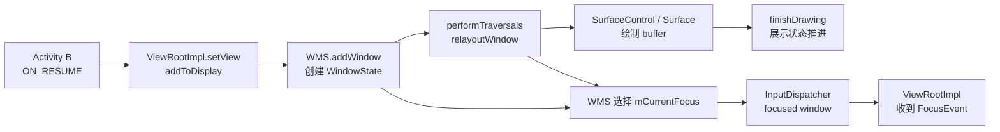
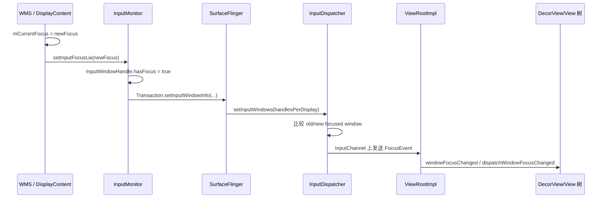

# 19 WMS：Activity 已经 `onResume()`，窗口为什么还可能没显示？

你在 Activity B 的 `onResume()` 里打了日志。日志已经出现，屏幕上却还是 Activity A，按键也没有交给 B。此时如果把“Activity 已恢复”“窗口已添加”“画面已显示”“输入已聚焦”当成同一件事，排查很容易从第一步就走错。

本章只解决这一个问题：

> **Activity 生命周期、WMS 窗口注册、Surface 绘制和输入焦点是四条会互相协调、但完成点不同的状态链。`onResume()` 只证明生命周期走到了 RESUMED，不证明新窗口已有可显示 buffer，也不证明 InputDispatcher 已把按键路由给它。**

读完后，你应该能：

1. 说清 `PhoneWindow`、`DecorView`、`ViewRootImpl`、`WindowState` 和 `SurfaceControl` 分别在哪一侧。
2. 从 `ActivityThread.handleResumeActivity()` 追到 `WMS.addWindow()`、`relayoutWindow()` 和 `finishDrawingWindow()`。
3. 区分 focused app、WMS focused window、InputDispatcher focused window 和 View 焦点。
4. 遇到“已 resumed 但黑屏/无窗口/按键不来”时，按完成点定位，而不是只看一条生命周期日志。

本文基于 Android 11 / `android-11.0.0_r48`，采用普通 Activity 主窗口作为唯一场景。Dialog、PopupWindow、IME、多显示屏和 overlay 只在澄清边界时出现。macOS 上只做静态源码阅读，不假装已经编译或跑机验证。

---

## 1. 先把四个完成点分开

可以把 Activity B 上屏想成一次舞台切换：

```text
Activity RESUMED   = 导演通知 B“轮到你上场”
WMS addWindow      = 舞台管理员登记了 B 的场位
Surface + draw     = B 把布景画好，并交出可展示画面
input focus        = 控制台把唯一的键盘麦克风接给 B
```

接到上场通知，不等于布景已经画完；布景画完，也不自动等于麦克风已经完成切换。

### 四个完成点分别证明什么

| 完成点 | 核心证据 | 能证明 | 不能证明 |
|---|---|---|---|
| 生命周期已恢复 | `performResumeActivity()` 完成，状态设为 `ON_RESUME` | `Activity.onResume()` 已返回 | 主窗口已经注册或显示 |
| 窗口已注册 | `WMS.addWindow()` 返回 `ADD_OKAY` | WMS 已创建并登记 `WindowState` | 已创建 Surface、已经有一帧 buffer |
| 窗口已绘制/可展示 | relayout 获得 Surface，客户端绘制并 `finishDrawing` | WMS 已收到该次绘制完成信号 | SurfaceFlinger 已让用户看到目标帧的每个像素 |
| 输入焦点已同步 | InputDispatcher 的 focused window 指向 B 的 InputChannel | 后续聚焦按键可路由到 B | B 内部某个 EditText 一定拥有 View 焦点 |

最后一列很重要。每个状态只能证明自己这一层，不要用上游日志替下游状态作证。

### 本章主线图



图中焦点支线可能在窗口添加、可见性变化、relayout、窗口移除等多个时机重算。它不是“等第一帧显示后才永远固定执行一次”的线性步骤。

---

## 2. 同一个“窗口”，其实是五种不同对象

日常说“这个窗口”，源码里可能指完全不同的对象。先按进程和职责分开：

| 对象 | 进程 | 它是什么 | 它不是什么 |
|---|---|---|---|
| `PhoneWindow` | App | Activity 使用的窗口策略对象，持有 DecorView、属性和回调 | WMS 的全局窗口记录 |
| `DecorView` | App | 这棵顶层 View 树的根 View | 独立进程间窗口对象 |
| `ViewRootImpl` | App | 把 View 树接到窗口、绘制和输入系统的桥；驱动 traversal | 一个 View，也不是 system_server 的 WindowState |
| `WindowState` | `system_server` | WMS 对一个客户端窗口的服务端记录 | App 的完整 View 树 |
| `SurfaceControl` / `Surface` | 跨 App、WMS、SurfaceFlinger 协作 | 前者控制 layer，后者给客户端提供 buffer 生产入口 | 生命周期状态 |

普通 Activity 主窗口大致存在这组对应关系：

```text
Activity
└─ PhoneWindow
   └─ DecorView
      └─ ViewRootImpl
         ├─ W extends IWindow.Stub
         ├─ IWindowSession.Proxy
         └─ Surface / InputChannel

system_server
└─ WindowState
   ├─ mClient = 上面的 IWindow
   ├─ mToken = ActivityRecord/WindowToken
   └─ WindowStateAnimator / SurfaceControl 相关状态
```

### 两个 Binder 接口方向相反

| 接口 | 调用方向 | 典型方法 |
|---|---|---|
| `IWindowSession` | App → WMS | `addToDisplay`、`relayout`、`remove`、`finishDrawing` |
| `IWindow` | system_server → App | `resized`、`dispatchAppVisibility` 等窗口回调 |

`Session extends IWindowSession.Stub` 位于 `system_server`，会把 App 的请求转给 WMS：

```java
public int addToDisplay(IWindow window, int seq, LayoutParams attrs,
        int viewVisibility, int displayId, ...) {
    return mService.addWindow(this, window, seq, attrs, viewVisibility,
            displayId, ..., UserHandle.getUserId(mUid));
}
```

一个 App 进程通常复用同一个 `IWindowSession`，但可以通过多个 `ViewRootImpl.W` 拥有多个窗口。不要把“一条 Session”理解成“只能有一个 WindowState”。

---

## 3. `onResume()` 为什么可能早于窗口添加？

### Why：生命周期回调和窗口接入由同一个主线程顺序推进，但不是一个原子动作

Android 11 客户端执行 resume 时，`ActivityThread.handleResumeActivity()` 先调用 `performResumeActivity()`。后者内部执行 `Activity.performResume()`，也就是应用的 `onResume()`，随后才回到 `handleResumeActivity()` 处理窗口。

精简后的源码顺序如下；`...` 表示省略了可见性判断、保留旧窗口和配置更新分支：

```java
final ActivityClientRecord r =
        performResumeActivity(token, finalStateRequest, reason);
...
if (!a.mWindowAdded) {
    a.mWindowAdded = true;
    wm.addView(decor, l);
}
...
r.activity.makeVisible();
```

这几行证明：

```text
onResume 返回
→ WindowManager.addView
→ DecorView 设为可见
```

至少在首次正常添加窗口的这条客户端路径中，顺序不是“窗口先完整显示，再调用 onResume”。

### 一个非常实用的故障推断

如果 Activity B 的 `onResume()` 打印了“进入”日志后主线程卡死，而回调始终没有返回，那么 `handleResumeActivity()` 还没有机会执行后面的 `wm.addView()`。

这时可能同时出现：

```text
ATMS/WMS 认为 B 是 focused app 候选
WMS 还没有 B 的可聚焦 WindowState
InputDispatcher 收到按键，却找不到 B 的 focused window
```

所以排查时不能只问“有没有进入 `onResume()`”，还要问：

1. `onResume()` 是否返回；
2. 主线程是否继续进入 `WindowManagerGlobal.addView()`；
3. `WMS.addWindow()` 是否创建了对应 `WindowState`。

这也是为什么把耗时初始化直接放进 `onResume()` 会放大“应用已经前台化但还没有窗口”的空档。

---

## 4. 从 `addView()` 到 `addWindow()`：系统只是先登记窗口

客户端调用链是：

```text
ActivityThread.handleResumeActivity
→ WindowManagerImpl.addView
→ WindowManagerGlobal.addView
→ new ViewRootImpl(...)
→ ViewRootImpl.setView
→ IWindowSession.addToDisplayAsUser
→ Session.addToDisplayAsUser
→ WindowManagerService.addWindow
```

`WindowManagerGlobal` 维护本进程的三组对应关系：顶层 View、`ViewRootImpl` 和 `LayoutParams`。它是“本进程窗口根”的账本，不是全系统 WMS。

`ViewRootImpl.setView()` 在发起 Binder 调用前先请求第一次 layout：

```java
// Schedule the first layout -before- adding to the window manager
requestLayout();
...
res = mWindowSession.addToDisplayAsUser(mWindow, mSeq,
        mWindowAttributes, getHostVisibility(), mDisplay.getDisplayId(),
        userId, ...);
```

`requestLayout()` 只是安排 traversal；它不表示 measure/layout/draw 已经同步做完。紧接着的 `addToDisplayAsUser()` 才把 `IWindow`、窗口属性、显示屏和 InputChannel 等信息交给 WMS。

### WMS 在 add 阶段解决什么问题？

`WMS.addWindow()` 主要做四类工作：

1. 检查窗口类型对应的权限与 AppOps。
2. 检查 display 是否存在、调用 UID 是否能访问。
3. 校验 token、子窗口父对象和窗口类型归属。
4. 创建 `WindowState`，登记 Binder death、InputChannel、层级和查询表。

进入“不可再返回普通错误”的位置后，核心登记动作是：

```java
final WindowState win = new WindowState(this, session, client, token,
        parentWindow, appOp[0], seq, attrs, viewVisibility, ...);
...
win.attach();
mWindowMap.put(client.asBinder(), win);
...
win.mToken.addWindow(win);
```

`client.asBinder()` 标识一个具体客户端窗口，WMS 用它从 `mWindowMap` 找回 `WindowState`。这和 `LayoutParams.token` 的作用不同。

### `ADD_OKAY` 的准确含义

`ADD_OKAY` 表示 WMS 接受并登记了窗口。源码随后直接提醒：

```java
// Don't do layout here, the window must call
// relayout to be displayed, so we'll do it there.
win.getParent().assignChildLayers();
```

这是本章最重要的源码证据之一：

> `addWindow()` 成功只完成“登记”，第一次真正可展示所需的 layout、Surface 创建和绘制还在后面。

如果 add 返回负值，`ViewRootImpl` 会把 `ADD_BAD_APP_TOKEN`、`ADD_NOT_APP_TOKEN`、`ADD_APP_EXITING` 等结果转成 `BadTokenException` 或其他异常。此时问题在登记前，不必先追 SurfaceFlinger。

---

## 5. token 到底证明了什么？为什么 Dialog 会报 BadToken？

源码里至少有三种常被简称为 token 的东西：

| 名称 | 来源 | 作用 |
|---|---|---|
| `client.asBinder()` | `ViewRootImpl.W` | 标识这一个具体窗口，作为 `mWindowMap` 的 key |
| `LayoutParams.token` | Activity/父窗口/特定系统窗口提供 | 告诉 WMS 该窗口应该归到谁下面 |
| `WindowToken` | `system_server` Java 对象 | WMS 管理一组相关 `WindowState` 的容器 |

Android 11 中：

```java
class WindowToken extends WindowContainer<WindowState> { ... }

final class ActivityRecord extends WindowToken
        implements WindowManagerService.AppFreezeListener { ... }
```

也就是说，Activity 的服务端记录本身就是一种窗口 token 容器。它既参与 ATMS 的 Activity/Task 管理，也承载 WMS 侧的应用窗口层级。

WMS 处理应用主窗口时，会用 `attrs.token` 查找已有 `WindowToken`，并要求它能转成 `ActivityRecord`。如果 token 不存在、不是应用 token，或 Activity 已退出，就会返回相应错误。

### 为什么用 Application Context 创建 Dialog 容易失败？

Dialog 的窗口需要一个能证明其 Activity 归属和生命周期的 token。Application Context 本身没有某个正在运行 Activity 的窗口 token。若没有显式满足其他窗口类型和权限规则，WMS 无法把这个应用窗口挂到合法 ActivityRecord，因而会得到 `BadTokenException`。

这不是“Context 类型有一个神秘限制”，而是窗口归属证据缺失。

### 子窗口又为什么不同？

对于 `FIRST_SUB_WINDOW ... LAST_SUB_WINDOW` 类型，WMS 会把 `attrs.token` 当作父窗口的客户端 Binder 去查 `WindowState`，再让子窗口使用父窗口所属的 token。PopupWindow 一类问题因此既要看窗口类型，也要看父窗口 token，不能照搬 Activity 主窗口的查法。

### 层级只记住一条主干

Android 11 的具体 DisplayArea 结构会随策略和窗口类型变化；阅读普通 Activity 时先记：

```text
RootWindowContainer
└─ DisplayContent
   └─ DisplayArea / Task
      └─ ActivityRecord（也是 WindowToken）
         └─ WindowState
```

系统窗口、IME、壁纸不会全部硬塞进 ActivityRecord，它们可由其他 WindowToken/DisplayArea 管理。上面的树是普通 Activity 主线，不是全系统唯一形状。

---

## 6. 为什么 relayout 后才可能拿到 Surface？

### Why：WMS 需要客户端尺寸、可见性和系统布局一起决策

add 阶段还不足以确定最终 frame。状态栏、导航栏、cutout、旋转、父容器边界、窗口属性和请求尺寸都可能参与布局。客户端也需要拿到 WMS 返回的 frame、Insets 和 Surface 句柄，才能按正确大小绘制。

第一次 traversal 中，`ViewRootImpl.performTraversals()` 在测量条件和可见性需要变化时调用：

```java
relayoutResult = relayoutWindow(params, viewVisibility, insetsPending);
...
surfaceCreated = !hadSurface && mSurface.isValid();
surfaceDestroyed = hadSurface && !mSurface.isValid();
```

客户端 Binder 链是：

```text
ViewRootImpl.relayoutWindow
→ IWindowSession.relayout
→ Session.relayout
→ WindowManagerService.relayoutWindow
```

WMS 会更新请求尺寸、属性和可见性，强制一次 surface placement，并在满足 `shouldRelayout` 时创建或返回 SurfaceControl：

```java
mWindowPlacerLocked.performSurfacePlacement(true /* force */);

if (shouldRelayout) {
    result = win.relayoutVisibleWindow(result, attrChanges);
    result = createSurfaceControl(outSurfaceControl,
            outBLASTSurfaceControl, result, win, winAnimator);
}
```

然后 `ViewRootImpl` 根据返回的 `SurfaceControl` 建立普通 Surface 或 BLAST Surface：

```java
if (mSurfaceControl.isValid()) {
    if (!useBLAST()) {
        mSurface.copyFrom(mSurfaceControl);
    } else {
        Surface blastSurface = getOrCreateBLASTSurface(...);
        if (blastSurface != null) {
            mSurface.transferFrom(blastSurface);
        }
    }
}
```

### `SurfaceControl` 和 `Surface` 不要互换

- `SurfaceControl` 是对合成 layer 的控制句柄，用来设置层级、位置、裁剪、可见性等。
- `Surface` 是 buffer 生产入口，App/RenderThread 通过它提交要显示的内容。

拥有 `SurfaceControl` 也不等于已经有一帧 App 内容；还要完成 draw 并提交 buffer。

### 绘制完成还要告诉 WMS

当 ViewRoot 需要报告本次绘制完成时：

```java
private void reportDrawFinished() {
    mDrawsNeededToReport = 0;
    mWindowSession.finishDrawing(mWindow, mSurfaceChangedTransaction);
}
```

服务端进入 `WMS.finishDrawingWindow()`，更新 `WindowState` 绘制状态并请求新的 traversal。之后 WMS/SurfaceFlinger 仍要应用 transaction、参与动画与合成。

因此三个概念仍不能压成一个：

```text
Surface 已创建
≠ App 已提交第一帧 buffer
≠ 该帧已经出现在物理屏幕上
```

如果严格关心“用户真的看到第几帧”，还要结合 SurfaceFlinger、frame timeline 或设备 trace，而不能把 `finishDrawing()` 当成光子已经到达屏幕的证明。

---

## 7. 可见、已绘制、在最上层和可聚焦不是同一条件

WMS 没有一个万能 `visible` 布尔值覆盖所有问题。以 `WindowState` 为例：

| 问题 | 常见判断/状态 | 关心点 |
|---|---|---|
| 客户端是否请求可见 | `mViewVisibility` | App 传来的 View 可见性 |
| Activity 是否请求展示 | `mVisibleRequested` / token 可见性 | Activity/transition 层的意图 |
| 策略是否允许显示 | `isVisibleByPolicy()` | keyguard、系统策略等 |
| 是否已有 Surface | `mHasSurface` | 资源存在，不等于已绘制 |
| 是否已绘制并可展示 | `isDrawnLw()`、`isDisplayedLw()` | draw state、父窗口和动画 |
| 是否能接收按键 | `canReceiveKeys()` | 可见性、flags、Activity 状态、display 信任等 |

`WindowState.canReceiveKeys()` 的核心约束是：

```java
final boolean canReceiveKeys = isVisibleOrAdding()
        && (mViewVisibility == View.VISIBLE) && !mRemoveOnExit
        && ((mAttrs.flags & FLAG_NOT_FOCUSABLE) == 0)
        && (mActivityRecord == null
                || mActivityRecord.windowsAreFocusable(fromUserTouch))
        && !cantReceiveTouchInput();
```

所以“屏幕最上面的 layer”不必然获得按键：overlay 可以可见却带 `FLAG_NOT_FOCUSABLE`；壁纸可以显示却不成为应用按键目标；退出动画中的旧窗口可能还在屏幕上，但焦点已经转移。

### starting window 为什么会制造错觉？

Activity B 启动时，系统可能先显示 starting window。它属于 B 的 ActivityRecord，但不是 B 应用主线程刚画出的主窗口内容。

于是可能出现：

```text
用户已经看到 B 的启动画面
但 B 的主 WindowState 仍未完成第一帧
```

反过来，B 已执行 `onResume()` 时，屏幕仍可能保留 A 的最后一帧或过渡动画。肉眼画面和生命周期状态之间有意存在解耦，以减少黑屏和闪烁。

---

## 8. “焦点”至少有四层，按键最终看 InputDispatcher

### 先分清四个名字

| 层 | 代表字段/对象 | 回答的问题 |
|---|---|---|
| focused app | `DisplayContent.mFocusedApp` / native focused application | 当前期望哪一个 Activity 应用提供焦点窗口；也用于等待和 ANR 归责 |
| WMS focused window | `DisplayContent.mCurrentFocus` | WMS 按层级与 `canReceiveKeys()` 选中的 `WindowState` |
| native input focused window | `InputDispatcher.mFocusedWindowHandlesByDisplay` | InputDispatcher 实际用来路由聚焦按键的 InputWindowHandle |
| View focus | App View 树内的 focused View | 进入窗口后，哪个 Button/EditText 处理导航或输入 |

Touch target 还可以是另一件事：触摸按坐标和 touchable region 命中，并维护一条手势流的目标；它不等于键盘 focused window。

### `mFocusedApp` 为什么可以有值，但 `mCurrentFocus` 仍为空？

ATMS/WMS 可以先确定 Activity B 是当前 focused app，InputMonitor 会把它同步为 native focused application。此时 B 可能还没添加窗口。

这个“只有 focused app、没有 focused window”的状态不是数据矛盾，而是在表达：

```text
系统正在等待 B 提供一个可接收按键的窗口
```

它也让 InputDispatcher 知道，如果窗口长期不出现，应该把问题归到哪个应用。

### WMS 怎样选窗口？

主链是：

```text
WindowManagerService.updateFocusedWindowLocked
→ RootWindowContainer.updateFocusedWindowLocked
→ DisplayContent.updateFocusedWindowLocked
→ findFocusedWindowIfNeeded
→ findFocusedWindow
→ 从高到低遍历 WindowState，检查 canReceiveKeys 和 focusedApp 边界
```

核心代码先找候选，再比较是否真的变化：

```java
WindowState newFocus = findFocusedWindowIfNeeded(topFocusedDisplayId);
if (mCurrentFocus == newFocus) {
    return false;
}
...
mCurrentFocus = newFocus;
```

选焦点时还会联动 IME target、层级、布局、toast 超时和输入窗口更新。因此 `UPDATE_FOCUS_NORMAL`、`UPDATE_FOCUS_WILL_ASSIGN_LAYERS` 等 mode 表示调用方接下来是否会统一做 layer/layout，避免重复工作；它们不是四种不同的焦点定义。

---

## 9. Android 11 中，窗口焦点怎样真正到达 App？

这一段很容易被旧资料或接口名字带偏。

在 Android 11 主路径中，WMS 先把当前焦点写入 input window 元数据；SurfaceFlinger 汇总 layer 的 `InputWindowInfo` 后交给 InputFlinger/InputDispatcher。InputDispatcher 比较新旧 focused handle，再沿目标 InputChannel 发送 `FocusEvent`。ViewRootImpl 的 `WindowInputEventReceiver` 最终接收它。



### WMS 侧只是先更新 input 元数据

`InputMonitor.setInputFocusLw()` 保存新焦点并安排更新输入窗口：

```java
if (newWindow != mInputFocus) {
    mInputFocus = newWindow;
    setUpdateInputWindowsNeededLw();
    if (updateInputWindows) {
        updateInputWindowsLw(false /* force */);
    }
}
```

构建 InputWindowHandle 时，WMS 写入可见性、是否能收键和是否有焦点：

```java
inputWindowHandle.visible = isVisible;
inputWindowHandle.canReceiveKeys = child.canReceiveKeys();
inputWindowHandle.hasFocus = hasFocus;
inputWindowHandle.ownerPid = child.mSession.mPid;
inputWindowHandle.ownerUid = child.mSession.mUid;
```

### InputDispatcher 才维护实际 native focused window

`InputDispatcher::setInputWindowsLocked()` 从可见且 `hasFocus` 的 handle 中选择新焦点。焦点变化时，它取消旧窗口的非 pointer 事件，并入队 loss/gain FocusEvent：

```cpp
if (!haveSameToken(oldFocusedWindowHandle, newFocusedWindowHandle)) {
    ...
    enqueueFocusEventLocked(*oldFocusedWindowHandle, false);
    ...
    enqueueFocusEventLocked(*newFocusedWindowHandle, true);
}
```

FocusEvent 通过该窗口已经注册的 InputChannel 发送。App 侧：

```java
public void onFocusEvent(boolean hasFocus, boolean inTouchMode) {
    windowFocusChanged(hasFocus, inTouchMode);
}
```

这个回调运行在创建 InputEventReceiver 所使用的 Looper 上；普通 ViewRootImpl 因而在 UI 线程更新窗口焦点并分发给 View 树。

### 为什么不能只沿 `IWindow.windowFocusChanged()` 找主线？

`IWindow` 接口和 `ViewRootImpl.W.windowFocusChanged()` 在本版本仍然存在，但在当前源码中，WMS 的常规 focused window 更新并不是简单执行 `mClient.windowFocusChanged(...)`。主输入焦点通知来自 InputDispatcher 的 FocusEvent。

同时，WMS Handler 的 `REPORT_FOCUS_CHANGE` 主要处理 WMS 的 focus observers、无障碍通知和延迟 loss 等工作，也不能直接当成 ViewRootImpl 获取输入焦点的唯一证据。

这是阅读窗口焦点时最值得核对版本的边界之一：只根据 AIDL 方法名画箭头，很容易画出一条本版本没有实际调用的链。

---

## 10. 三类故障怎样沿完成点定位？

### 故障一：有 `onResume` 日志，但 WMS 根本没有 B 的窗口

判断顺序：

```text
onResume 是否返回？
→ ActivityThread 是否走到 wm.addView？
→ ViewRootImpl.setView 是否抛异常？
→ Session.addToDisplay 是否进入 WMS？
→ mWindowMap 是否出现 B 的 client binder？
```

常见根因在 App 主线程、错误 token、无效 display 或窗口权限；此时不应先怀疑 SurfaceFlinger 丢帧。

### 故障二：`addWindow` 成功，但画面仍没出来

判断顺序：

```text
是否发生第一次 performTraversals？
→ relayoutWindow 是否返回有效 SurfaceControl/Surface？
→ App/RenderThread 是否提交第一帧？
→ finishDrawingWindow 是否推进 draw state？
→ token/父窗口/策略/transition 是否允许展示？
→ SurfaceFlinger transaction 与 layer 是否正常？
```

`ADD_OKAY` 只够你跳过登记阶段，不能直接跳到“合成器一定有问题”。

### 故障三：B 是 focused app，却没有按键

先同时看四个值：

```text
Activity/Task：谁是 resumed/top？
WMS：mFocusedApp 是谁？mCurrentFocus 是谁？
Input：focused application 和 focused window 分别是谁？
App：ViewRoot 是否收到 FocusEvent？窗口内部哪个 View 有焦点？
```

如果 InputDispatcher 发现“有 focused application，但没有 focused window”，它不会在设置 focused app 的瞬间立刻 ANR。只有出现需要投递的聚焦输入事件时，才启动 no-focused-window 等待计时：

```cpp
if (focusedWindowHandle == nullptr
        && focusedApplicationHandle != nullptr) {
    if (!mNoFocusedWindowTimeoutTime.has_value()) {
        const nsecs_t timeout = focusedApplicationHandle->getDispatchingTimeout(
                DEFAULT_INPUT_DISPATCHING_TIMEOUT.count());
        mNoFocusedWindowTimeoutTime = currentTime + timeout;
        mAwaitedFocusedApplication = focusedApplicationHandle;
    }
    return INPUT_EVENT_INJECTION_PENDING;
}
```

超时后，`processAnrsLocked()` 才会对 `mAwaitedFocusedApplication` 触发 ANR 处理。这个边界能避免两个误判：

- “B 刚成为 focused app，就一定已经开始 ANR 倒计时”；不对，通常要有待投递的聚焦事件。
- “没有 focused window 就只会丢键，不会 ANR”；也不对，有 focused app 时存在等待和归责路径。

### 将来在设备上的只读观察

```bash
adb shell dumpsys activity activities
adb shell dumpsys window displays
adb shell dumpsys window windows
adb shell dumpsys input
```

重点搜索：

```text
mResumedActivity / topResumedActivity
mFocusedApp
mCurrentFocus / mLastFocus
FocusedApplications
FocusedWindows
WindowState 的 hasSurface、draw state、view visibility
```

不同厂商版本的 dump 字段可能改名或裁剪。字段找不到时回到源码中的 `dump()`，不要把本文列出的字符串当稳定 API。

---

## 11. 在 Mac 上完成一次不编译的验证

### 验证一：证明 `onResume()` 在首次 addView 之前

```bash
rg -n 'handleResumeActivity|performResumeActivity|wm.addView|makeVisible' \
  frameworks/base/core/java/android/app/ActivityThread.java
```

打开 `handleResumeActivity()`，记录这三个位置：

```text
performResumeActivity 返回
wm.addView(decor, l)
activity.makeVisible()
```

预期结论：应用 `onResume()` 属于第一步内部，首次窗口添加在它返回之后。

### 验证二：证明 add 成功不等于已显示

```bash
rg -n "int addWindow|Don't do layout here|relayout to be displayed|relayoutWindow|createSurfaceControl" \
  frameworks/base/services/core/java/com/android/server/wm/WindowManagerService.java
```

在 `addWindow()` 末尾找到“must call relayout to be displayed”的注释；再找到 SurfaceControl 实际在 `relayoutWindow()` 中按条件创建。

### 验证三：证明焦点从 InputChannel 回到 ViewRoot

```bash
rg -n 'setInputFocusLw|hasFocus =|setInputWindowInfo' \
  frameworks/base/services/core/java/com/android/server/wm/InputMonitor.java

rg -n 'setInputWindowsLocked|enqueueFocusEventLocked|publishFocusEvent' \
  frameworks/native/services/inputflinger/dispatcher/InputDispatcher.cpp

rg -n 'onFocusEvent|windowFocusChanged' \
  frameworks/base/core/java/android/view/ViewRootImpl.java
```

预期调用方向：

```text
WMS mCurrentFocus
→ InputWindowInfo.hasFocus
→ InputDispatcher FocusEvent
→ ViewRootImpl.WindowInputEventReceiver
→ ViewRootImpl.windowFocusChanged
```

### 自检题与答案

**1. Activity B 已经 RESUMED，为什么还可能没有 `WindowState`？**

因为客户端 `handleResumeActivity()` 先执行并返回 `onResume()`，再走首次 `wm.addView()`。主线程卡在 `onResume()`，或者 add 因 token/display/权限失败，都可能让生命周期领先于窗口登记。

**2. `WMS.addWindow()` 返回成功，为什么还可能黑屏？**

add 只登记 `WindowState` 和相关层级/输入资源。客户端还要 traversal、relayout、取得 Surface、绘制 buffer、报告 draw finished，WMS/SurfaceFlinger 再应用显示事务。

**3. 为什么最上层窗口不一定拿到按键？**

焦点候选除了 Z-order，还必须满足 `canReceiveKeys()`：可见或正在添加、View 可见、没有 `FLAG_NOT_FOCUSABLE`、Activity 允许聚焦、display 合法等。

**4. `mFocusedApp` 和 `mCurrentFocus` 为什么要同时存在？**

前者表示当前期望哪个 Activity 应用提供焦点窗口并承担等待归责；后者是 WMS 当前实际选中的 WindowState。应用启动空档中可以有前者而暂时没有后者。

**5. Android 11 的窗口焦点最终怎样通知 ViewRoot？**

WMS 把 focus 写进 InputWindowInfo，SurfaceFlinger 将输入窗口信息交给 InputDispatcher；InputDispatcher 经 InputChannel 发送 FocusEvent，`WindowInputEventReceiver.onFocusEvent()` 再调用 `ViewRootImpl.windowFocusChanged()`。

**6. `finishDrawingWindow()` 是否证明像素已经出现在屏幕？**

不证明。它证明 WMS 收到客户端绘制完成报告并能推进窗口状态；transaction 应用、buffer latch、合成和物理显示仍是后续链路。

### 本章 takeaway

以后遇到“Activity 已启动但窗口不对”，先画四格：

```text
[RESUMED] → [WindowState 已登记] → [Surface 已绘制/可展示] → [Input focus 已同步]
```

对每一格只接受本层证据。只要找到最后一个成立的格子，下一格对应的源码边界就是排查起点。

---

## 源码定位表

| 目的 | 文件与符号 |
|---|---|
| resume 后添加 DecorView | `frameworks/base/core/java/android/app/ActivityThread.java`：`handleResumeActivity()` |
| App 进程窗口根管理 | `frameworks/base/core/java/android/view/WindowManagerGlobal.java`：`addView()` |
| add、relayout、draw、输入接收 | `frameworks/base/core/java/android/view/ViewRootImpl.java` |
| App → WMS Binder 转发 | `frameworks/base/services/core/java/com/android/server/wm/Session.java` |
| 窗口登记、relayout、绘制完成 | `frameworks/base/services/core/java/com/android/server/wm/WindowManagerService.java` |
| 单窗口服务端状态 | `frameworks/base/services/core/java/com/android/server/wm/WindowState.java` |
| 显示层焦点选择 | `frameworks/base/services/core/java/com/android/server/wm/DisplayContent.java` |
| 输入窗口元数据同步 | `frameworks/base/services/core/java/com/android/server/wm/InputMonitor.java` |
| native 焦点、按键目标与 no-focus ANR | `frameworks/native/services/inputflinger/dispatcher/InputDispatcher.cpp` |
| 输入窗口信息进入 InputFlinger | `frameworks/native/services/surfaceflinger/SurfaceFlinger.cpp` |

源码行号会随分支变化，应以类名和方法名定位。本文对运行时先后只陈述 r48 源码能确定的部分；厂商改动、具体设备 trace 和耗时数据需要将来在设备上另行验证。
