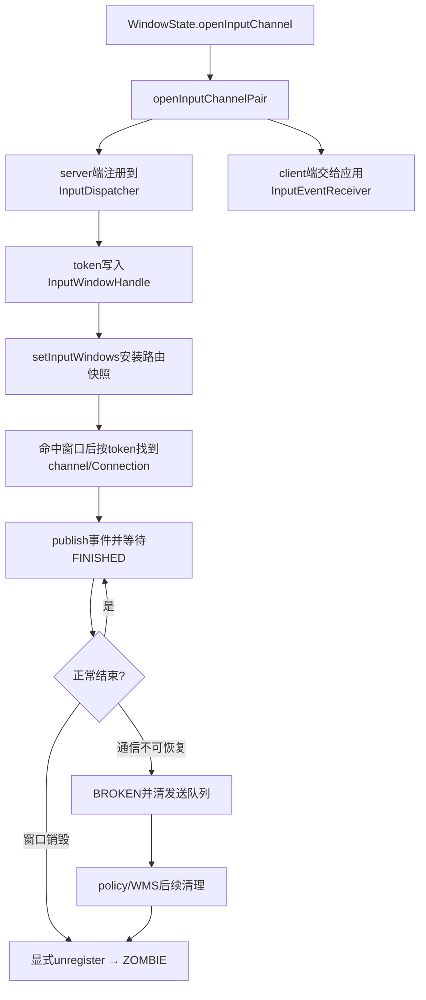
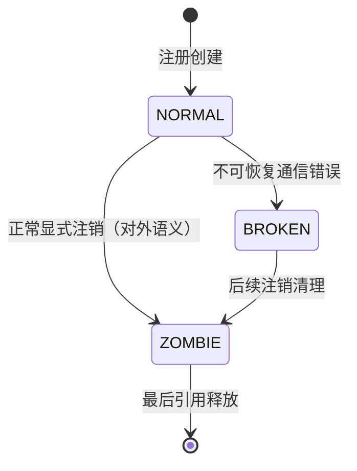
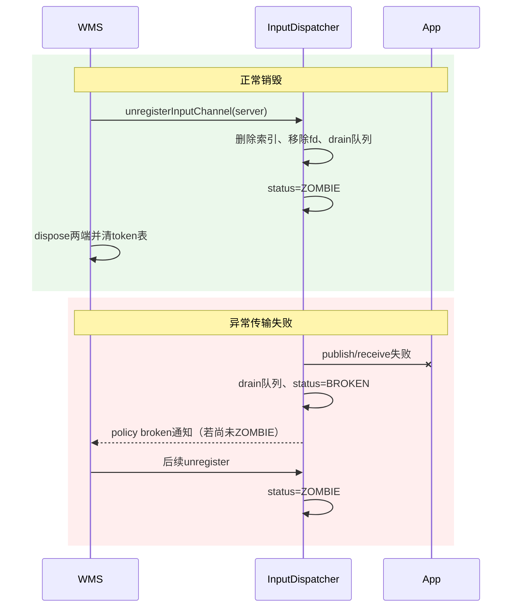

# 190 Android InputChannel 与窗口生命周期

> 源码版本：Android 11 / `android-11.0.0_r48`  
> 阅读方式：macOS 只读追踪，不要求编译。  
> 前置章节：第 173、174、186、188、189 章。

## 1. 本章要解决的问题

前几章已经知道事件会命中窗口，再通过InputChannel发给App。但“窗口从屏幕上消失”和“InputChannel被注销”并不是同一件事；“通道断了”和“对象已销毁”也不是同一状态。

本章沿生命周期回答：谁创建channel pair，谁保存server/client端，窗口如何用token关联通道，Dispatcher如何注册Connection，窗口列表刷新时怎样保留对象身份，断链后又怎样清队列、通知WMS并最终注销。

## 2. 先记住四种对象

| 对象 | 最容易理解成 | 真正职责 |
|---|---|---|
| `InputWindowHandle` | 窗口本体 | 某一时刻供输入路由使用的窗口信息载体 |
| `IBinder token` | 窗口编号 | 将WindowHandle、InputChannel和Connection关联起来的身份 |
| `InputChannel` | 事件队列 | 封装一端Unix seqpacket socket及共享connection token |
| `Connection` | socket | Dispatcher为已注册channel维护的发送状态、两条队列和InputState |

一句话：handle回答“能否成为目标”，channel回答“通过哪条管道发送”，Connection回答“这条管道目前发送到哪里、等到哪里”。

## 3. 全生命周期总图



## 4. 主要源码入口

- `frameworks/base/services/core/java/com/android/server/wm/WindowState.java`：窗口channel创建与销毁。
- `frameworks/base/services/core/java/com/android/server/input/InputManagerService.java`：Java注册接口。
- `frameworks/base/services/core/jni/com_android_server_input_InputManagerService.cpp`：Java/native桥。
- `frameworks/native/services/inputflinger/dispatcher/InputDispatcher.cpp`：注册、窗口刷新、发送、断链和注销。
- `frameworks/native/services/inputflinger/dispatcher/Connection.h`：每通道状态。
- `frameworks/native/libs/input/InputWindow.cpp`：WindowHandle更新和`releaseChannel()`。

## 5. WindowState怎样创建一对InputChannel

`WindowState.openInputChannel()`调用`InputChannel.openInputChannelPair(name)`得到两端：

```java
InputChannel[] inputChannels = InputChannel.openInputChannelPair(name);
mInputChannel = inputChannels[0];
mClientChannel = inputChannels[1];
mWmService.mInputManager.registerInputChannel(mInputChannel);
mInputWindowHandle.token = mInputChannel.getToken();
```

`mInputChannel`是system_server持有并注册给native Dispatcher的一端；`mClientChannel`最终交给窗口客户端。两端用socket通信，但共享用于识别这条连接的Binder token。

## 6. server端与client端不要按进程名死记

对普通应用窗口，通常是system_server创建pair、注册server端，把client端经Binder传给App。但输入consumer、拖拽、嵌入窗口、测试或monitor也能创建自己的channel。

因此读源码应看“哪一端交给InputPublisher、哪一端交给InputConsumer”，不能只凭变量名推测它必在哪个进程。

## 7. token何时进入窗口句柄

注册server channel之后，WMS把`mInputChannel.getToken()`写入`mInputWindowHandle.token`。稍后生成输入窗口快照时，这个token随`InputWindowInfo`进入native。

Dispatcher命中handle后不是从handle里取socket，而是拿token去`mInputChannelsByToken`查已注册InputChannel。这一步把路由平面和传输平面接起来。

## 8. WindowState还维护一张反向表

普通窗口创建channel后还执行：

```java
mWmService.mInputToWindowMap.put(mInputWindowHandle.token, this);
```

当native报告input channel broken时，WMS可以用token反查WindowState。这里再次说明token不是装饰字段，而是跨Java/native多个结构的连接身份。

## 9. Java注册只是薄入口

`InputManagerService.registerInputChannel()`检查参数非空后调用`nativeRegisterInputChannel(mPtr, inputChannel)`。JNI取得native `sp<InputChannel>`，再进入`NativeInputManager::registerInputChannel()`和`InputDispatcher::registerInputChannel()`。

这条链不负责把窗口放进Z序窗口列表；“注册通道”和“提交窗口快照”是两次独立操作。

## 10. 注册前先检查什么

普通`registerInputChannel()`按connection token调用`getConnectionLocked()`。若已存在Connection就返回`BAD_VALUE`，避免同一身份被普通路径重复注册。

注意它不是只按fd查重；身份检查依据token，而实际Connection主表使用fd作键。

## 11. Connection创建时已有的状态

构造函数初始化：

```cpp
status(STATUS_NORMAL),
inputChannel(inputChannel),
monitor(monitor),
inputPublisher(inputChannel),
inputState(idGenerator)
```

此时队列为空、`responsive=true`。InputPublisher负责正向publish，InputState记录这个接收者已看到的活动键和pointer流。

## 12. Dispatcher为什么保存两张通道表

注册后写入：

```cpp
mConnectionsByFd[fd] = connection;
mInputChannelsByToken[token] = inputChannel;
```

- `mConnectionsByFd`服务Looper回调：哪个fd可读或出错，就快速找到Connection。
- `mInputChannelsByToken`服务窗口路由：命中WindowHandle后按token找到发送通道。

两张表是不同索引，不是重复设计。

## 13. getConnectionLocked为何仍线性查token

`getConnectionLocked(token)`遍历`mConnectionsByFd`，比较每条channel的connection token。r48没有额外的token→Connection表。

因此“按token找到InputChannel”和“按token找到Connection”使用不同实现：前者哈希查表，后者遍历fd表。阅读时不要想当然地认为两者都是O(1)。

## 14. Looper监听的是反向回执方向

注册最后调用：

```cpp
mLooper->addFd(fd, 0, ALOOPER_EVENT_INPUT,
               handleReceiveCallback, this);
```

Dispatcher通过InputPublisher向socket发事件；同一个fd可读时，通常是客户端送回FINISHED。第188章讲的waitQueue出队，就是从这个receive callback开始。

## 15. register完成为什么还要wake

释放锁后调用`mLooper->wake()`，因为连接集合变化可能让当前pending事件重新具备目标或改变同步条件。

Wake只让Dispatcher线程尽快重新计算，不表示新窗口已能命中；能否命中还取决于后续窗口快照。

## 16. “通道已注册”不等于“窗口已可接收”

一个普通窗口成为事件目标至少需要：

1. InputChannel已注册；
2. WindowHandle快照含正确token和display；
3. 窗口可见、可触摸或可聚焦等属性满足目标选择；
4. 对焦点事件还要成为相应display的focused window。

只看到`registerInputChannel()`成功，不能推出按键或触摸已经能到App。

## 17. setInputWindows按display提交

`setInputWindows(handlesPerDisplay)`持锁遍历map，对每个条目调用`setInputWindowsLocked(list, displayId)`，之后wake Looper。

它只处理本次map里出现的display。若调用方要清空某display，应明确为它提交空列表；不能假设“map里没出现”自动等于删除。

## 18. 空列表怎样删除一个display

`updateWindowHandlesForDisplayLocked()`发现新列表为空时，直接从`mWindowHandlesByDisplay`移除该display。

随后`setInputWindowsLocked()`仍会用旧列表完成焦点离开、TouchState清理和旧handle释放，因而“先更新主列表，再对照旧引用收尾”是有意顺序。

## 19. 新handle为什么不能每次全换对象

源码注释明确说，Dispatcher会跨窗口更新比较handle指针，所以同一窗口必须尽量保留原对象。

算法先按旧handle的`id`建表；新handle同时满足“id相同、token相同”时，不把新对象塞入列表，而是调用旧对象`updateFrom(new)`更新内容，再继续保存旧对象。

## 20. id相同但token变化算同一窗口吗

不算。复用条件同时要求id和token相同。token变化通常意味着传输连接身份已变，即便表面窗口id没变，也要使用新handle对象。

这条双条件防止TouchState、hover或focus仍引用旧身份，却被悄悄解释成一条新连接。

## 21. updateInfo失败会怎样

每个候选handle先调用`updateInfo()`。返回false代表句柄已经无效，这一项会被跳过，不进入新窗口列表。

所以调用方提交了一个Java对象，并不保证Dispatcher最终接受它；dump时应看Dispatcher安装后的列表，而不是只看WMS准备的数据。

## 22. 没有已注册channel的窗口何时被过滤

若按token找不到InputChannel，且它又不是portal，Dispatcher会判断：

- 是否声明`INPUT_FEATURE_NO_INPUT_CHANNEL`；
- 是否仍可能接收touch或focus。

一个本来能接收输入、又未声明无channel的窗口会被记录日志并跳过。纯输入透明窗口或合法无channel用途则不一定被丢弃。

## 23. portal为何是例外

Portal窗口可用于把触摸目标选择转到另一个display，它本身不一定有本地InputChannel。因此`portalToDisplayId != NONE`时，不因本地channel缺失而直接过滤。

这说明WindowHandle列表不只包含最终应用接收端，也可能包含路由节点。

## 24. displayId不一致会怎样

如果handle内部`info->displayId`与本轮参数displayId不同，Dispatcher记录错误并跳过该handle。

窗口属于哪个display不是用“被放进哪个vector”强行覆盖，而是两处信息必须一致。

## 25. 窗口列表顺序代表什么

输入窗口列表按前到后，也就是通常意义的top-to-bottom排序。寻找focused window时选择第一个`hasFocus && visible`的handle。

若错误地把最后一个hasFocus窗口当目标，就会在过渡期多个标志短暂重叠时选到较底层对象；源码特意选择topmost。

## 26. 焦点判断为什么比较token

`haveSameToken(oldFocused, newFocused)`为真时，不走焦点切换。因为handle对象或其属性可在每帧刷新，但只要连接身份相同，App视角仍是同一个焦点接收者。

因此WindowHandle指针变化不必然等于输入焦点变化，名字变化更不等于。

## 27. 焦点离开时的真实顺序

旧焦点token变化时：

1. 找旧channel；
2. 合成`CANCEL_NON_POINTER_EVENTS`；
3. 入队`FocusEvent(hasFocus=false)`；
4. 从focused map移除旧handle；
5. 保存新handle并入队`FocusEvent(true)`；
6. 对当前focused display通知policy焦点token变化。

取消未结束按键可避免旧App永远保持“键仍按下”。

## 28. 为什么焦点变化不取消普通触摸

Touch归属由每display TouchState维护，正常手势从DOWN到UP具有粘性。键焦点在手势中途变化，不应擅自把正在进行的触摸切给新焦点窗口。

因此这里选择NON_POINTER取消，而不是ALL或POINTER。

## 29. hovered handle怎样失效

刷新后遍历新列表，若再也找不到与`mLastHoverWindowHandle`相同的对象，就把全局last hover handle清空。

前面保留同一handle对象身份正是这类指针比较能成立的基础。r48的last hover handle仍不是严格的每display结构，这是多显示阅读时要记住的版本边界。

## 30. 正在被触摸的窗口消失怎么办

刷新完主列表后，Dispatcher检查该display的TouchState。若某个TouchedWindow已无法由`hasWindowHandleLocked()`找到：

1. 用它原来的token查channel；
2. 若仍能找到，合成POINTER CANCEL；
3. 从TouchState删除这个窗口。

这一步先于旧handle清token，因此仍有机会通知接收者收尾。

## 31. hasWindowHandleLocked比较什么

它遍历所有display的当前窗口列表，同时比较handle id和token。匹配后还检查handle自报display与实际所在map键是否一致。

所以“同id新token”会被视为旧窗口已消失；仅有同名窗口也完全不够。

## 32. 窗口移除的CANCEL按display过滤吗

没有。这个调用只构造`CANCEL_POINTER_EVENTS`，未给options设置displayId。

发现窗口消失发生在某个display的TouchState中，但InputState取消会覆盖该Connection保存的所有pointer memento。不要把调用点所在display误当成隐式过滤条件。

## 33. releaseChannel到底做什么

完成焦点和TouchState清理后，Dispatcher遍历旧handles；不再存在的旧handle调用：

```cpp
void InputWindowHandle::releaseChannel() {
    mInfo.token.clear();
}
```

它只是清旧handle保存的token引用。它不关闭socket、不从`mConnectionsByFd`删除Connection，也不直接调用`unregisterInputChannel()`。

## 34. 为什么仍需要releaseChannel

旧native WindowHandle可能还因其他`sp<>`引用暂时存活。及时清token能缩短它对Binder身份及关联对象的保留时间，不必等待Java GC或handle最终析构。

这是引用生命周期清理，不是传输生命周期清理。两个阶段名称接近，却必须分开理解。

## 35. WindowState怎样做显式销毁

`disposeInputChannel()`的关键顺序是：

1. 先注销server channel；
2. 再dispose server对象；
3. dispose仍由WMS持有的client端；
4. 从token→WindowState等表中移除；
5. 最后把WindowHandle token设为null。

源码注释强调先unregister，否则直接关端点会被当作broken channel并产生告警。

## 36. Java对象忘记注销怎么办

JNI注册成功后给Java InputChannel安装dispose callback。如果对象被dispose却未先unregister，callback会记录警告，并补调native unregister。

正常`nativeUnregisterInputChannel()`会先移除这个callback，再注销，避免正常dispose再次触发补救路径。

## 37. 注销时先从哪些索引删除

`unregisterInputChannelLocked()`先按token找Connection，然后：

1. `removeConnectionLocked()`从ANR tracker和fd→Connection表删除；
2. 从token→InputChannel表删除；
3. 若是monitor，从monitor列表删除；
4. 从Looper移除fd回调。

从这一步起，新目标无法再通过表找到该Connection。

## 38. 注销为什么还要drain队列

注销调用`abortBrokenDispatchCycleLocked()`清空outboundQueue和waitQueue。释放每个DispatchEntry时，如它是foreground target，还会递减原EventEntry的pending foreground计数。

否则同步注入的`WAIT_FOR_FINISHED`可能永远认为还有前台接收者未完成。

## 39. 三种Connection状态



- NORMAL：可以继续publish和处理FINISHED。
- BROKEN：连接对象仍可能在表中，但通信已不可恢复。
- ZOMBIE：已经注销，不能再作为Dispatcher连接使用。

实现细节是：显式注销也复用`abortBrokenDispatchCycleLocked()`，所以NORMAL会在同一持锁调用中先被赋成BROKEN，紧接着再赋成ZOMBIE。上图画成NORMAL→ZOMBIE是对外生命周期语义；这次短暂赋值主要为复用drain逻辑，且`notify=false`，不能据此把正常注销诊断成一次真实断链。

## 40. BROKEN与ANR不是一回事

ANR表示窗口在时限内没有完成事件，socket不一定损坏。`cancelEventsForAnrLocked()`甚至明确说这里不会break connection；若policy决定关闭App，后续会通过窗口/channel移除走注销。

BROKEN则来自不可恢复的传输错误，例如publish失败。它首先是通信事实，不是“应用处理慢”的同义词。

## 41. abortBrokenDispatchCycle做了什么

它先drain outbound/wait；若当前仍是NORMAL，再设为BROKEN。`notify=true`时将“通知input channel broken”的命令放入command queue。

已有BROKEN或ZOMBIE不会重复改状态或重复安排通知。该函数名虽含Broken，也被注销路径复用来统一清队列。

## 42. 为什么policy回调要先解Dispatcher锁

`doNotifyInputChannelBrokenLockedInterruptible()`在调用policy前解`mLock`，回调完成再加锁。最终链路是native policy → JNI → IMS → WindowManagerCallbacks/WMS。

WMS可能再发起窗口和channel清理；若拿着Dispatcher锁跨组件同步调用，极易形成锁反转。

## 43. 异步broken通知还有状态门

命令真正执行时先检查`connection->status != ZOMBIE`。若在命令排队期间连接已被正式注销，就不再向WMS报告一次过时的broken。

所以日志中看见BROKEN并不保证Java层一定收到回调；状态可能在命令执行前已推进到ZOMBIE。

## 44. handleReceiveCallback处理哪些情况

Looper回调分两类：

- 普通`ALOOPER_EVENT_INPUT`：循环读取`receiveFinishedSignal(seq, handled)`并完成waitQueue出队；
- ERROR/HANGUP或读取失败：计算`notify`、记录必要日志，然后调用注销并移除fd callback。

返回0告诉Looper不要继续监听这个fd。

这里还要精确理解“通知”：`notify=true`会让abort阶段把broken policy command排入队列，但注销函数紧接着把Connection设为ZOMBIE；命令稍后执行时还有`status != ZOMBIE`门。因此receive callback这条立即注销路径通常不会再真正回调WMS。能稳定停留在BROKEN并完成policy回调的典型场景，是publish等路径先abort、尚未进入unregister。

## 45. monitor断开为何少告警

源码说明monitor channel不会总是显式注销，远端关闭后自动清理是预期路径。因此DEAD_OBJECT或HANGUP对monitor会抑制部分警告和policy通知。

普通窗口若仍有WindowHandle，却突然关consumer端，更像异常；此时日志价值更高。

## 46. broken判断为何查看WindowHandle是否仍在

HANGUP路径计算`stillHaveWindowHandle`。普通connection只有在窗口句柄仍存在时，才值得记录更强的异常日志并把`notify`置真：“路由上它还活着，但接收端已经断了”。

若窗口列表已先移除，端点关闭多半是正常销毁竞态，不应把它升级成窗口故障告警。又因为该分支随后立即unregister→ZOMBIE，不能把这里的`notify=true`直接等同于Java/WMS必然收到broken回调。

## 47. 两条典型时间线推演



## 48. 常见误解与诊断抓手

- 窗口已从屏幕消失但Connection还在：先区分窗口快照清理与显式注销是否发生。
- `releaseChannel()`后仍见fd：正常，它只清handle token。
- 有WindowHandle却收不到输入：检查token对应channel是否已注册、Connection是否NORMAL、handle是否被update阶段过滤。
- App ANR就认为socket坏了：错误，先看waitQueue、responsive和ANR tracker。
- BROKEN之后仍看到Connection对象：可能在等policy/WMS把它注销成ZOMBIE。
- 只看窗口名称关联连接：不可靠，应对照id、token、fd和display。

## 49. macOS只读练习

在源码根目录执行：

```bash
rg -n "registerInputChannel|unregisterInputChannel" \
  frameworks/base/services/core/java/com/android/server/wm/WindowState.java \
  frameworks/native/services/inputflinger/dispatcher/InputDispatcher.cpp

rg -n "updateWindowHandlesForDisplayLocked|releaseChannel|STATUS_ZOMBIE" \
  frameworks/native/services/inputflinger/dispatcher \
  frameworks/native/libs/input/InputWindow.cpp
```

手动画两条线：一条从WindowState.open到NORMAL；一条分别从正常dispose和异常publish失败走到ZOMBIE。能解释两条线在哪里分叉，就掌握了本章。

## 50. 复读审计、检查题与下一章

复读后特别修正了四个容易讲错的点：

1. WindowHandle移除不等于InputChannel立即注销；
2. `releaseChannel()`实际只清`mInfo.token`；
3. 窗口移除合成pointer CANCEL没有设置display过滤；
4. ANR、BROKEN、ZOMBIE分别表示超时、通信故障和已注销，不能互换。
5. 显式注销内部会为复用清队列代码短暂写BROKEN，而receive错误路径排队的broken通知又可能被随后的ZOMBIE门抑制；判断时要看完整时序，不能只盯一次赋值或一个`notify`局部变量。

检查题：

1. Dispatcher为什么同时需要fd表与token表？
2. 同一窗口刷新时为何要保留旧handle对象？
3. 为什么正常销毁必须先unregister再dispose？
4. BROKEN连接为什么可能暂时仍存在，而ZOMBIE不应再被路由？

下一章将继续精读**Input Monitor、Gesture Monitor 与 pilferPointers**：monitor如何按display注册、普通monitor与手势monitor如何选目标，以及系统手势“旁听”与“抢流”的边界。
