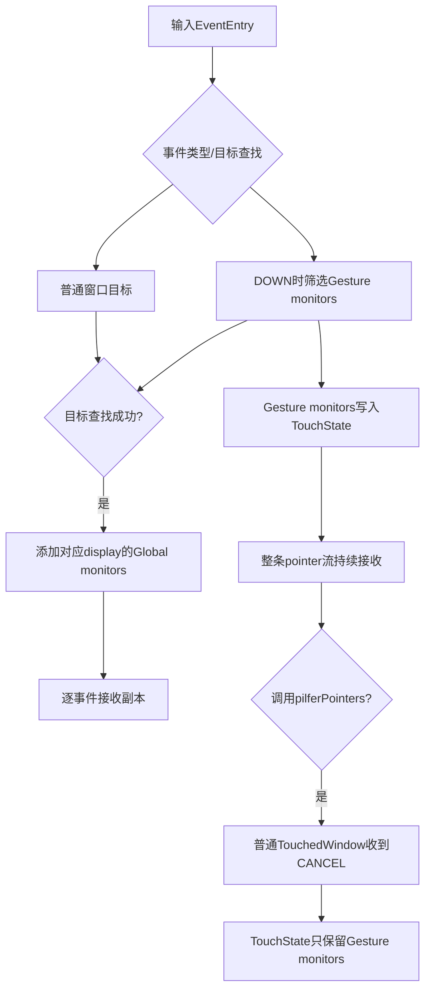
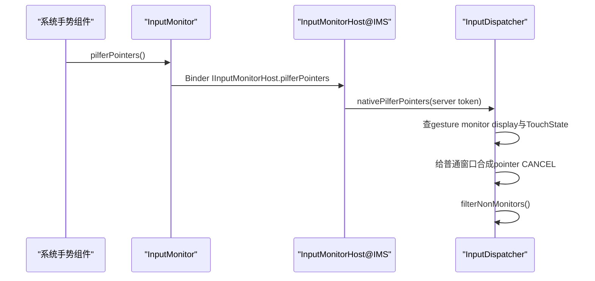

# 191 Android Input Monitor、Gesture Monitor 与 pilferPointers

> 源码版本：Android 11 / `android-11.0.0_r48`  
> 阅读方式：macOS 只读源码追踪，不要求编译。  
> 前置章节：第 174、176、186、189、190 章。

## 1. 本章目标：分清旁听与抢流

Android输入系统里有两类monitor：global monitor接收目标display上成功分发事件的副本；gesture monitor在pointer DOWN开始时加入手势，并可调用`pilferPointers()`让普通窗口收到CANCEL，之后由monitor继续观察整条流。

两者都通过InputChannel收事件，也都使用`Connection(monitor=true)`，但加入目标的时机、事件范围、TouchState持久化和控制能力不同。

## 2. 两类monitor快速对照

| 维度 | Global monitor | Gesture monitor |
|---|---|---|
| native容器 | `mGlobalMonitorsByDisplay` | `mGestureMonitorsByDisplay` |
| 加入时机 | 每个成功目标选择之后 | pointer DOWN开始时 |
| 事件范围 | key和motion等分发事件副本 | 以pointer手势为核心 |
| 写入TouchState | 否 | 是，保存为TouchedMonitor |
| 可让无窗口DOWN继续 | 否 | 是 |
| 可pilfer | 否 | 是 |

## 3. 总体数据流



## 4. 主要源码入口

- `InputManagerService.monitorInput()`：创建global monitor。
- `InputManagerService.monitorGestureInput()`：权限检查并创建gesture monitor。
- `InputMonitor`与`InputMonitorHost`：client channel、pilfer和dispose控制面。
- `InputDispatcher::registerInputMonitor()`：native注册与按display分类。
- `findTouchedGestureMonitorsLocked()`：DOWN时收集手势monitor。
- `addGlobalMonitoringTargetsLocked()`：逐事件添加global目标。
- `InputDispatcher::pilferPointers()`：抢流实现。
- `TouchState::filterNonMonitors()`：移除普通窗口目标。

## 5. monitorInput怎样创建global monitor

IMS创建InputChannel pair，将第0端以`isGestureMonitor=false`注册给native，随后dispose这端的Java包装，只返回第1端：

```java
InputChannel[] channels = InputChannel.openInputChannelPair(name);
nativeRegisterInputMonitor(mPtr, channels[0], displayId, false);
channels[0].dispose();
return channels[1];
```

Native Dispatcher持有第0端的`sp<InputChannel>`，因此dispose Java包装不等于关闭Dispatcher所需的native端点。

## 6. monitorGestureInput为何返回InputMonitor

Gesture接口不仅要给调用者client channel，还要暴露pilfer和显式dispose控制。因此IMS创建server端`InputMonitorHost`，native注册server channel，再把client channel与host一起封装成`InputMonitor`返回。

Client从channel读取事件；控制调用经`IInputMonitorHost` Binder回system_server。

## 7. 权限检查在哪里

`monitorGestureInput()`是Binder入口，要求调用者拥有`android.permission.MONITOR_INPUT`，否则抛`SecurityException`。检查后清Binder calling identity，再创建与注册资源。

`monitorInput()`在这段代码中没有同样的本地检查，它是system_server内部公开方法而非相同的外部Binder入口；不能因此推断任意App可直接调用。

## 8. displayId为何必填

Java要求`displayId >= DEFAULT_DISPLAY`，JNI也拒绝`ADISPLAY_ID_NONE`，native注册再次检查`displayId < 0`。

Monitor不是跨所有显示器的无界广播订阅；它挂在一张以displayId为键的表中。多显示问题必须先确认注册在哪个display。

## 9. 注册monitor与普通channel的共同点

两者都会：

- 创建Connection；
- 写入fd→Connection和token→InputChannel表；
- 把fd加入Dispatcher Looper；
- publish事件并等待FINISHED；
- 维护各自InputState、outboundQueue和waitQueue。

Monitor不是绕过InputTransport的一条调试旁路。

## 10. Connection的monitor标志有什么用

`registerInputMonitor()`构造`Connection(inputChannel, true, ...)`。该标志用于dump标识、断端告警策略和注销时从monitor容器移除。

它不代表Connection不需要回FINISHED，也不代表永远不会ANR。

## 11. 注册monitor缺少哪项普通检查

普通`registerInputChannel()`先按token检查是否已有Connection；r48的`registerInputMonitor()`没有同样的显式重复token检查，只验证display与token非空，随后直接写fd/token表。

正常API每次创建新pair和新token，依赖上层不重复注册。定制代码若绕过不变量，覆盖索引可能造成难诊断状态。

## 12. Monitor结构为何非常小

Native `Monitor`只有一个非空`sp<InputChannel>`。display身份由外层map的key保存，global/gesture类型由它处在哪张map决定。

`TouchedMonitor`在此基础上增加xOffset/yOffset，用于portal跨display路由后调整坐标。

## 13. Global monitor何时加入Key目标

Key先寻找focused window。只有目标查找成功后，Dispatcher才按`getTargetDisplayId(entry)`调用`addGlobalMonitoringTargetsLocked()`，最后统一dispatch。

若没有focused window而目标查找仍pending，global monitor不会提前收到这个key；若目标查找最终失败，也不会靠global monitor把分发改成成功。

## 14. Global monitor何时加入Motion目标

Pointer或non-pointer motion先完成窗口/gesture目标选择和注入权限判断。成功后添加事件目标display的global monitors。

目标失败时会给已有monitor InputState合成适当取消，但不会把失败的原始motion当普通副本继续送出。

## 15. Global monitor不是“原始EventHub监听”

它看到的是已经过InputReader映射、policy、Dispatcher目标判断和必要action变换前后传输链路中的事件副本，不是`/dev/input/event*`原始`input_event`。

若需要诊断硬件scan code或SYN_REPORT，应看EventHub/InputReader；monitor更接近应用可见输入层。

## 16. addMonitoringTarget设置哪些flags

Monitor目标只有`FLAG_DISPATCH_AS_IS`，默认pointer offset按参数设置，window scale均为1。

它没有`FLAG_FOREGROUND`、`FLAG_SPLIT`、窗口遮挡或OUTSIDE标志。monitor拿完整事件副本，而不是某个窗口的pointer子集。

## 17. 没有FOREGROUND意味着什么

DispatchEntry仍会进入monitor的outbound/wait队列，也需要FINISHED；但`hasForegroundTarget()`为false，不增加EventEntry的pending foreground计数。

因此同步注入`WAIT_FOR_FINISHED`主要等待foreground目标完成，不因monitor副本尚未finish而一直计入该计数。不能把“不计foreground”误写成“不跟踪回执”。

## 18. Portal怎样影响global monitor

Pointer路由若穿过portal，除了事件原始/目标display的global monitor，还会为TouchState记录的每个portal目标display添加global monitors，并使用`-frameLeft/-frameTop`作为offset。

所以一个事件可能被多个display的monitor观察；坐标会按portal位置平移，不保证与源display全局坐标相同。

## 19. Portal怎样影响gesture monitor

DOWN时`findTouchedGestureMonitorsLocked(displayId, portalWindows)`先收本display gesture monitors，再收每个portal所指display的monitors，并记录相同的负frame offset。

这些TouchedMonitor随后一起写进源TouchState，随该手势继续。

## 20. Gesture monitor只在DOWN加入吗

对新的普通touch流，是。代码仅在`isDown`时调用`findTouchedGestureMonitorsLocked()`；后续MOVE/UP使用TouchState中已有列表。

在split流的额外POINTER_DOWN分支中，不会把当时新注册的gesture monitor补进旧手势，因为`isDown`只匹配ACTION_DOWN。

## 21. 为什么要在DOWN时锁定列表

手势识别需要完整序列。如果每个MOVE都从全局注册表重算，手势中途注册的monitor会先看到MOVE而没有DOWN，中途注销又可能让序列突然消失。

TouchState把选中的monitor粘在流上，提供接收者视角的一致性；注销仍会使Connection不可用并从注册表清除。

## 22. Gesture monitor能让无窗口区域的DOWN继续

目标选择要求“至少一个可接收foreground window或一个responsive gesture monitor”。若坐标下没有窗口，但存在合格gesture monitor，DOWN仍可成功，TouchState仅保存monitor并继续整条手势。

这对屏幕边缘系统手势等场景很重要：手势可以从没有普通App目标的区域开始。

## 23. Global monitor为何做不到这一点

Global monitor是在目标查找已经成功后才追加，根本不参与“是否存在接收者”的判定。因此仅有global monitor而无窗口/gesture monitor时，pointer DOWN仍会失败。

“能看副本”与“能维持一条输入流”是两种能力。

## 24. 新手势怎样过滤不响应monitor

DOWN收集候选后调用`selectResponsiveMonitorsLocked()`：找不到Connection或`connection->responsive=false`的项被删除，并记录日志。

这只决定它能否加入新Gesture。它不会自动注销不响应monitor，也不会清其已有waitQueue。

## 25. 已加入手势后变得不响应会怎样

后续MOVE从TouchState直接构造monitor目标，不再调用responsive筛选；`prepareDispatchCycleLocked()`只拒绝非NORMAL状态，也不因`responsive=false`拒绝入队。

所以已锁定gesture monitor仍可能继续积压。新的published条目在Connection不响应时不再加入ANRTracker，避免反复为同一Connection唤醒ANR检查。

## 26. Global monitor不响应后还会被加目标吗

会。`addGlobalMonitoringTargetsLocked()`遍历注册表，没有responsive过滤；只要Connection仍NORMAL，prepare阶段仍会入队。

这与“新gesture monitor会被过滤”不同。诊断monitor队列增长时，必须先判断它是哪一类、是否已在旧TouchState中。

## 27. monitor也可能触发ANR吗

会。publish成功进入waitQueue时，若Connection仍responsive，就把timeout和token加入ANRTracker。超时后Connection被标为不响应，policy收到ANR回调。

只是monitor目标不参与foreground同步注入计数；这与Connection级超时检测是两个维度。

## 28. 不响应状态怎样恢复

收到迟到FINISHED时，Dispatcher从waitQueue删除条目并调用`isConnectionResponsive()`检查是否还有已过期条目；健康后可恢复`responsive=true`。

Policy也可返回正的timeout extension，重置responsive并重建各wait entry的deadline索引。

## 29. InputMonitor.pilferPointers调用链



调用者传不进任意窗口token；Host使用自己保存的server InputChannel token，缩小伪造身份的空间。

## 30. 第一道校验：必须是gesture monitor token

Dispatcher只遍历`mGestureMonitorsByDisplay`查token。Global monitor token、普通窗口token、空token或已注销token都返回`BAD_VALUE`。

找到token的同时得到注册display；pilfer不能由调用者另传display去抢别的屏幕。

## 31. 第二道校验：display必须有TouchState

若对应display在`mTouchStatesByDisplay`中没有状态，说明当前没有可抢的pointer流，返回`BAD_VALUE`。

注册了gesture monitor并不代表任何时刻都能pilfer。

## 32. 第三道校验：本monitor必须参与当前流

Dispatcher遍历`state.gestureMonitors`，只有当前TouchState确实包含这个token，才取出`state.deviceId`。随后还要求`state.down=true`。

因此手势中途新注册的monitor不能凭注册身份抢走一条它从未收到DOWN的流。

## 33. pilfer给谁发送CANCEL

它遍历`state.windows`的所有TouchedWindow，按token找channel，并合成`CANCEL_POINTER_EVENTS`。

Options同时设置当前TouchState的deviceId与displayId，只结束本次被抢设备/显示对应的pointer memento。普通window、wallpaper等只要在state.windows中，都可能被收尾。

## 34. CANCEL为何在清TouchState之前发送

合成取消需要先用TouchedWindow token找到通道，也需要Connection InputState仍保存其收到的pointer状态。先生成CANCEL，再清路由，能让App完整结束旧手势。

若反过来只清TouchState，App会停在“手指仍按下”的逻辑状态。

## 35. filterNonMonitors到底保留什么

实现只有：

```cpp
windows.clear();
portalWindows.clear();
```

它不清`gestureMonitors`，也不把`down`设false，不改device/source/display。这保证后续同一手势继续分发给已选gesture monitors。

## 36. pilfer后调用者会重收DOWN吗

不会。调用pilfer的monitor本来就从起点收到DOWN；pilfer只是结束普通窗口分支并修改未来目标集合。

如果组件直到识别出系统手势才pilfer，它应在自己已有的历史上继续处理，而不是等待一个新DOWN。

## 37. 其他gesture monitor会被赶走吗

不会。`filterNonMonitors()`保留整个`gestureMonitors` vector，并不只保留发起pilfer的token。

因此一个gesture monitor抢流的直接含义是“从普通窗口偷走”，不是独占其他系统gesture monitors。多个monitor仍可同时接收后续事件。

## 38. pilfer是否改变物理action

原始流仍按MOVE、POINTER_UP、UP等继续进入Dispatcher；对普通窗口额外合成CANCEL后不再作为目标，对monitor则继续收到原始后续action。

它不是向InputReader发命令，也不停止硬件上报。

## 39. pilfer与transferTouchFocus区别

- pilfer：窗口→gesture monitors，窗口收CANCEL，monitor早已拥有DOWN，不补DOWN。
- transferTouchFocus：窗口A→窗口B，A收CANCEL，B需根据合并InputState补DOWN/POINTER_DOWN。

前者保留monitor集合，后者重建目标窗口的接收者状态，不能共用同一种心智模型。

## 40. pilfer失败有副作用吗

前述token/display/current stream校验失败都会直接返回`BAD_VALUE`，尚未发CANCEL也未改TouchState。

Java/JNI调用链在这里没有把native status返回给`InputMonitor.pilferPointers()`；Java方法是void。因此失败主要体现为native日志，调用者不能从返回值直接区分。

## 41. Global monitor的坐标是什么

普通display路径使用offset 0、scale 1，基本保持Dispatcher事件坐标；portal追加路径会应用portal负frame偏移。

它不套用目标App窗口的`frameLeft/frameTop`或window scale，因此monitor坐标不应直接当作某个View的local坐标。

## 42. Gesture monitor的坐标为何要保存offset

TouchedMonitor把DOWN选择时的portal offset固化到TouchState，后续MOVE沿用同一变换。否则跨display手势的DOWN和MOVE可能落在不同坐标系。

它没有WindowHandle可实时读取frame，因此offset就是流开始时的路由上下文。

## 43. 注入权限与gesture monitor

Pointer目标判断仍检查所有foreground windows的注入权限；若没有foreground window但有gesture monitor，会在通用分支用`checkInjectionPermission(nullptr, injectionState)`决定注入者是否具备全局权限。

Gesture monitor的存在不能帮助无权限调用者绕过注入安全门。

## 44. 目标失败时为什么给monitors合成取消

某条流的前序事件可能已被monitor看到，但本次因注入/目标失败无法继续。Dispatcher按pointer或non-pointer模式给两类monitor的InputState合成结束事件，避免monitor永久等待结尾。

这也说明global monitor虽不进TouchState，仍有独立Connection InputState可用于一致性修复。

## 45. monitor如何注销

统一的`unregisterInputChannelLocked()`发现`connection->monitor=true`时，会同时从global和gesture两张按display表搜索并删除channel；空vector对应的display键也被删除。

随后移除fd、drain队列并置ZOMBIE。已经保存在TouchState里的TouchedMonitor可能暂时仍有channel引用，但目标准备时找不到Connection，不会真正发送。

## 46. InputMonitor.dispose的顺序

客户端`InputMonitor.dispose()`先dispose自己的client channel，再通过Host请求system_server注销并dispose server channel。Client先关闭可能让Dispatcher fd产生HANGUP，Host随后显式注销时允许遇到“已经注销”。

JNI unregister对`BAD_VALUE`特别忽略，能容忍这种自动清理与显式清理竞态。

## 47. monitor断链为何减少噪声

receive callback注释说明monitor不会总被显式注销，远端关闭后自动清理是合法路径。因此monitor DEAD_OBJECT/HANGUP通常不发普通窗口式告警，也不必通知WMS处理WindowState。

Monitor没有对应普通InputWindowHandle，这是它与窗口Connection清理链的根本差异。

## 48. 三个手工推演

场景A：有App窗口、有global、有gesture。三者都收DOWN；gesture识别成功后pilfer，App收CANCEL，两个monitor继续收MOVE/UP。

场景B：屏幕边缘没有可触摸窗口，只有responsive gesture。DOWN仍成功，global随后也因整体目标成功而收到副本；gesture可处理整条流。

场景C：gesture monitor在手势中途才注册。它不在TouchState，不收当前MOVE，也无法pilfer当前流；下一次DOWN才有资格加入。

## 49. macOS只读练习

```bash
rg -n "monitorGestureInput|InputMonitorHost|pilferPointers" \
  frameworks/base/services/core/java/com/android/server/input/InputManagerService.java \
  frameworks/base/core/java/android/view/InputMonitor.java

rg -n "findTouchedGestureMonitorsLocked|addGlobalMonitoringTargetsLocked|filterNonMonitors" \
  frameworks/native/services/inputflinger/dispatcher
```

建议为global和gesture分别画“什么时候进入InputTarget、是否写TouchState、失败时怎样结束”三列对照表。

## 50. 复读审计、检查题与下一章

本章复读后限定了五个高风险表述：global不是EventHub原始监听；两类monitor都需FINISHED且可能ANR；无FOREGROUND只是不计同步注入foreground完成；responsive仅在新gesture筛选而非所有发送点；pilfer保留全部gesture monitors且不补DOWN。

检查题：

1. 为什么global monitor不能让“无窗口DOWN”变成功？
2. gesture monitor中途注册为何不能pilfer当前流？
3. pilfer后为什么App收CANCEL，而monitor不重收DOWN？
4. monitor不带FOREGROUND为何仍必须finish事件？

下一章将精读**InputReaderPolicy、InputReaderConfiguration 与 DisplayViewport**，解释system_server配置怎样跨JNI进入Reader、配置generation怎样触发Mapper重建，以及输入设备坐标为何依赖viewport。
