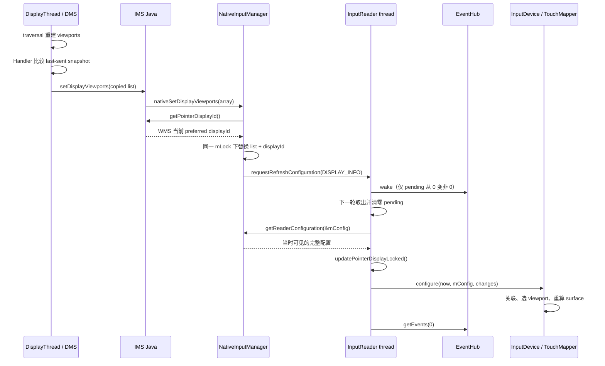

# 192 Android InputReaderPolicy、Configuration 与 DisplayViewport：一次旋转为何只投递 bit，却能重写触摸坐标

> 源码基线：Android 11 / API 30 / `android-11.0.0_r48`
> 核心问题：显示旋转、端口关联或 pointer 设置改变时，生产者为什么只向 InputReader 投递 change bit；Reader 又怎样拉取值、选择 viewport，并让后续输入按新配置解释？

---

## 1. 从“驱动没变，触摸坐标却跟着屏幕旋转”开始

### 一个真实的排查现场

同一块触摸屏、同一组 evdev 轴范围，屏幕从 0° 转到 90° 后，App 仍应在手指所在的位置收到事件。这个变化并不是驱动把 `ABS_X`、`ABS_Y` 换了含义，也不是 Dispatcher 临时猜出旋转角度。

r48 的主要链路是：

```text
DisplayManagerService 重建 DisplayViewport
  -> NativeInputManager 保存 viewport + preferred pointer display
  -> requestRefreshConfiguration(CHANGE_DISPLAY_INFO)
  -> InputReader 下一次观察到 dirty bit
  -> getReaderConfiguration() 拉取完整配置
  -> InputDevice 重算 port 关联
  -> TouchInputMapper 重新选择 viewport、比例、偏移和方向
  -> 后续 raw 坐标按新 surface contract cooking
```

这里最容易形成的误解是：“既然调用参数只有 `CHANGE_DISPLAY_INFO`，旋转后的 frame 和尺寸一定也装在这个 bit 里。”事实恰好相反：

- bit 只表达“哪一类消费者需要重新检查”；
- 真正的值在 Java 回调和 `NativeInputManager` 缓存里；
- Reader 被唤醒后，重新拉一份 `InputReaderConfiguration`；
- 每个 `InputDevice` / mapper 再按 bit 决定读取哪些字段、做哪些副作用。

### 一句话结论

> r48 把配置更新拆成“先提交值、再标脏类别、最后由 Reader 线程拉取并应用”：`changes` 是可合并的失效提示，不是值、事件队列或同步屏障；`DisplayViewport` 是坐标与显示身份契约，是否 reset、bump generation、禁用 fd，则由具体消费者自行决定。

### 读完应能回答什么

遇到旋转后触摸错位、外接屏触摸失效、鼠标仍留在旧 display、`dumpsys input` 中配置看似矛盾时，应能依次回答：

1. 新值写进了哪一个缓存？
2. 哪个 change bit 被请求，是否已经被 Reader 观察？
3. 本次 `mConfig` 拉到了什么，而不是调用者“想写什么”？
4. InputDevice 先做了什么，mapper 又做了什么？
5. 这次变化是否发了 `NotifyDeviceReset`、是否 bump generation？
6. 眼前事件可能仍按旧配置处理吗？

### 本章不解决什么

本章不重讲多点触控 slot、cooking 的所有 axis 公式、Dispatcher 窗口命中和 App 端事件消费。那些分别见第 182—188 章。这里专注五件事：值、dirty bit、Reader 消费、viewport 选择、可观察完成点。

源码主锚点：

- `frameworks/native/services/inputflinger/reader/InputReader.cpp:43-147,338-360,422-443,566-577`
- `frameworks/base/services/core/jni/com_android_server_input_InputManagerService.cpp:393-425,451-545`
- `frameworks/native/services/inputflinger/reader/InputDevice.cpp:51-85,213-325`
- `frameworks/native/services/inputflinger/reader/mapper/TouchInputMapper.cpp:340-392,551-610,612-1027`

## 2. 先拆开五个对象、三条通道和七个观察点

### 五个对象各回答一个问题

| 对象 | 所在层 | 回答的问题 |
|---|---|---|
| Java 配置生产者 | DMS、IMS、WMS、Settings 等 | 新值从哪里来 |
| `NativeInputManager::mLocked` 与 Java 回调 | policy bridge | Reader 下一次能拉到什么 |
| `mConfigurationChangesToRefresh` | InputReader | 哪些类别待重新检查 |
| `InputReaderConfiguration mConfig` | InputReader | Reader 当前保存的配置集合 |
| `DisplayViewport` / mapper 私有状态 | 具体消费者 | 一个设备最终怎样解释坐标与 display |

不要把 `InputReaderPolicyInterface` 想成主动推送完整对象的总线。它的核心方法是：

```cpp
virtual void getReaderConfiguration(
        InputReaderConfiguration* outConfig) = 0;
```

Reader 决定何时调用它；policy 把当时各来源的值写入 Reader 持有的对象。

### 三条通道不会原子推进

| 通道 | 内容 | 典型动作 |
|---|---|---|
| 值通道 | viewport、speed、capture、disabled set 等 | 写 Java/native 缓存 |
| 失效通道 | `CHANGE_DISPLAY_INFO` 等 bit | OR 进 Reader pending 并 wake |
| 观察通道 | reset、generation、Java listener、事件坐标 | 消费者按自己的规则产生 |

因此下列状态都可能短暂存在：

- 新值已经写入，bit 还没来得及入队；
- bit 已入队，Reader 仍在 `getEvents()`；
- Reader 已拉新 `mConfig`，某类 mapper 因当前 changes 不含对应 bit 而尚未应用；
- mapper 已更新行为，但没有 bump generation；
- generation 已增长，Java Handler 仍未把 listener 回调送出去。

### 七个候选观察点，不是每次都全部出现

把一次 viewport 更新拆成七个时间点更容易诊断：

| 点 | 含义 | 能证明什么 |
|---|---|---|
| T0 | DMS 得到新 viewport 列表 | 显示侧候选值已经形成 |
| T1 | NativeInputManager 缓存替换 | native policy 下次可读新值 |
| T2 | change bit 写入 Reader pending | 更新请求已排队 |
| T3 | Reader 清 pending 并拉取配置 | `mConfig` 已刷新 |
| T4 | 普通增量分支的 InputDevice / mapper `configure` 返回 | 本轮旧设备消费者已运行；reopen 分支改看 removed→scan→added |
| T5 | 消费者选择生成 reset / generation / queued event | 这次变化确实形成了相应 native 副作用 |
| T6 | generation 变化后，Java IMS Handler 合并并通知 listener | 上层设备观察者收到最新数组；无 generation 变化就没有这一点 |

生产者从 `requestRefreshConfiguration()` 返回，最多直接知道 T2 已发生。它不能据此宣称 T4、T5 或 T6 完成，更不能假设一次更新必然产生后三点。

### change bit 不是 version

同一个 `CHANGE_DISPLAY_INFO` 可以对应：

- orientation 改变；
- logical/physical frame 改变；
- viewport 列表增删；
- `isActive` 改变；
- preferred pointer display 改变；
- runtime port association 改变；
- 甚至重复提交同一值。

它没有序号，也不记录旧值/新值。若某类别在 Reader 消费前经历 A→B→A，pending 里仍只有一个 bit。

## 3. 一次旋转怎样跨线程抵达 TouchInputMapper

### 完整时序



箭头很多，但真正跨线程排队的核心只有两处：

- DMS 把 viewport 更新放到自己的 `DisplayManagerHandler`；
- NativeInputManager 调 `EventHub::wake()`，让 InputReader 从 poll 中返回。

IMS 的 Java→JNI setter 是同步函数调用；`InputDevice::configure()` 也在 Reader 线程内同步执行。异步的是“生产者提交后，Reader 何时进入下一轮”。

### 为什么不把 viewport 直接推给每个 mapper

若 DMS 直接跨线程修改 mapper：

- 要同时处理设备增删与复合设备重建；
- 会把 DMS、WMS、Reader、EventHub 的锁连接成环；
- 多个设置变化会反复遍历全部设备；
- mapper 可能在处理 raw frame 的中间被改写。

r48 的选择是让 Reader 自己串行化消费。代价是：

- 中间状态会被合并；
- setter 返回不是完成屏障；
- 不同配置来源不是一份全局事务快照；
- 每个 mapper 的副作用策略可能不一致。

### “先写值，再发 bit”保证的是最终可见

`NativeInputManager::setDisplayViewports()` 先替换缓存，退出 `mLock` 后才请求 Reader：

```cpp
{
    AutoMutex _l(mLock);
    mLocked.viewports = viewports;
    mLocked.pointerDisplayId = pointerDisplayId;
}
mInputManager->getReader()->requestRefreshConfiguration(
        InputReaderConfiguration::CHANGE_DISPLAY_INFO);
```

这个顺序避免 Reader 先看见本次 bit、却只能拉到旧值。它不保证写值与投递 bit 是一个跨锁原子事务：另一次配置刷新可以恰好落在 T1 与 T2 之间，并提前把新 viewport 拉进 `mConfig`。若介入批次不含 `DISPLAY_INFO`，display 消费者仍等本次 bit 才运行；若介入批次本身也含 `DISPLAY_INFO`，它甚至可以提前应用新 viewport，而本次随后投递的 bit 只形成冗余下一批。

### 一次刷新也不是所有来源的同一时刻

viewport 列表来自更早的 DMS snapshot；preferred pointer display 是 setter 中随后向 WMS 采样的；port association 又在 `getReaderConfiguration()` 中从 IMS Java map 获取。

所以“完整配置”应理解为“把所有字段填入同一个对象”，不是“DMS、WMS、Settings、IMS 在同一纳秒提交的一致性事务”。

## 4. Configuration 装值，changes 只选择消费者

### r48 的 change vocabulary

`InputReaderConfiguration` 定义十个增量类别，外加一个最高位 reopen 控制位：

| bit | 主要消费者或作用 |
|---|---|
| `CHANGE_POINTER_SPEED` | Cursor 与 pointer-mode Touch 的 velocity control |
| `CHANGE_POINTER_GESTURE_ENABLEMENT` | Touch 重新决定 pointer / unscaled mode |
| `CHANGE_DISPLAY_INFO` | PointerController、InputDevice 关联、Touch/Keyboard/Cursor/Rotary |
| `CHANGE_SHOW_TOUCHES` | Touch 创建或释放触点可视化所需 controller |
| `CHANGE_KEYBOARD_LAYOUTS` | InputDevice 重新取得 KCM overlay |
| `CHANGE_DEVICE_ALIAS` | InputDevice 重新取得 alias |
| `CHANGE_TOUCH_AFFINE_TRANSFORMATION` | Touch 重新取得 affine matrix |
| `CHANGE_EXTERNAL_STYLUS_PRESENCE` | Touch 重算外接笔 presence/source |
| `CHANGE_POINTER_CAPTURE` | Cursor 在 absolute pointer 与 relative mouse 间切换 |
| `CHANGE_ENABLED_STATE` | InputDevice 对照 disabled device set |
| `CHANGE_MUST_REOPEN` | 不增量 configure 旧设备，转而请求 EventHub 重开 |

最后一个占最高位 `1 << 31`，可与其他 bit 同批出现。它不是“所有 bit 的别名”。

### 配置对象远不只 viewport

`InputReaderConfiguration` 还保存：

- virtual-key quiet time；
- excluded device names；
- input port → display port map；
- default pointer display id；
- pointer/wheel velocity 参数；
- pointer gesture 时间、距离与比例阈值；
- show touches、capture；
- disabled device id 集合；
- viewport vector。

mapper 可复制整份配置，却只在相关 bit 出现时改自己的派生状态。比如 Touch 每次 `configure` 都先做 `mConfig = *config`，但只有 `POINTER_SPEED` 才重设 velocity control，只有一组 surface 相关 bit 才调用 `configureSurface()`。

### bit 是 dirty category，不是 payload

下面两个调用可以合并为同一批：

```text
requestRefreshConfiguration(DISPLAY_INFO)
requestRefreshConfiguration(POINTER_SPEED)

pending = DISPLAY_INFO | POINTER_SPEED
```

Reader 只拉一次完整 `mConfig`，然后一次遍历设备。反过来，同类别的三次变化：

```text
speed = 1; request(POINTER_SPEED)
speed = 5; request(POINTER_SPEED)
speed = 2; request(POINTER_SPEED)
```

若 Reader 尚未消费，通常只会应用最终拉到的 `speed = 2`；`1` 和 `5` 不是待回放事件。

### `changesToString()` 不能当 bit 真值表

r48 的字符串化函数列了多数 bit，却遗漏 `CHANGE_POINTER_CAPTURE`。因此：

- capture-only 刷新的日志可能显示 `changes=` 后为空；
- capture 与 display 同批时，日志只写出 `DISPLAY_INFO | `；
- 字符串末尾还保留 ` | `。

诊断不能因为日志没写 `POINTER_CAPTURE` 就断言该 bit 未出现。应回到 setter 和 `CursorInputMapper::configure()`。

### “定义了 bit”也不等于 stock 路径会生产它

在 r48 这棵树中：

- `CHANGE_POINTER_GESTURE_ENABLEMENT` 有 enum、日志和 Touch 消费者，但 `NativeInputManager::mLocked.pointerGesturesEnabled` 初始化为 true，找不到生产 setter；
- `CHANGE_MUST_REOPEN` 有消费状态机，但全树没有 AOSP production caller 把它交给 Reader。

这两个分支仍是有效实现契约，也可被测试或定制代码使用；只是不能把它们描述成 stock r48 已存在的动态设置链。

## 5. `changes == 0` 在三处 API 中不是同一句话

### 请求入口：0 是彻底 no-op

`InputReader::requestRefreshConfiguration(0)` 不 OR pending，也不 wake：

```cpp
if (changes) {
    bool needWake = !mConfigurationChangesToRefresh;
    mConfigurationChangesToRefresh |= changes;
    if (needWake) {
        mEventHub->wake();
    }
}
```

所以不能用 request(0) 表示“请求全量刷新”。

### Reader 刷新入口：0 仍拉 policy

构造 `InputReader` 时直接调用：

```cpp
refreshConfigurationLocked(0);
```

`refreshConfigurationLocked(0)` 仍会：

1. `getReaderConfiguration(&mConfig)`；
2. `setExcludedDevices(mConfig.excludedDeviceNames)`。

但它不会进入 `if (changes)`，因此不会：

- 更新已有 PointerController；
- 请求 reopen；
- 遍历已有 InputDevice。

构造时设备还没扫描，这正好先准备首份配置与 exclusion 名单。

### Device / mapper：0 是 full or rebuild sentinel

`InputDevice::configure(..., 0)` 中大量条件写成：

```cpp
if (!changes || (changes & SOME_BIT)) {
    // full setup or category-specific refresh
}
```

这里的 0 意味着执行完整配置路径。它常见于设备创建，但不应简单翻译为“对象一生只执行一次”：

- 新 EventHub device 创建时传 0；
- 同 descriptor 的子设备并入复合 `InputDevice` 后会再次传 0；
- 复合设备移除一个 subdevice、仍有其他 subdevice 时也会再次传 0。

源码注释中的 “first time only” 描述的是这条 full-config 模式，而不是一个由类型系统保证的单次调用不变量。

### 三层对照

| 调用 | 0 的效果 |
|---|---|
| `requestRefreshConfiguration(0)` | 什么都不做 |
| `refreshConfigurationLocked(0)` | 拉配置、写 exclusion；不增量 configure |
| `InputDevice/Mapper::configure(..., 0)` | 走 full/rebuild 分支 |

只记住“0 表示全量”会在第一层犯错；只记住“0 表示无变化”又会在第三层犯错。

## 6. DMS 怎样生产一份可交付的 DisplayViewport 列表

### traversal 先清空，再按 DisplayDevice 重建

`DisplayManagerService.performTraversalLocked()` 在 `mSyncRoot` 下：

1. 清空 `mViewports`；
2. 遍历所有 `DisplayDevice`；
3. 为每台设备配置 projection；
4. 依据设备类型决定是否建立 input viewport；
5. 给 Handler 投递 `MSG_UPDATE_VIEWPORT`。

viewport type 的主要判定是：

- 带 `DisplayDeviceInfo.FLAG_DEFAULT_DISPLAY` 的 DisplayDevice → INTERNAL；
- `TOUCH_EXTERNAL` → EXTERNAL；
- 带非空 uniqueId 的 `TOUCH_VIRTUAL` → VIRTUAL；
- 其他 display 不进入这份 input matching 列表。

这条生产链的直接所有者是 DMS。WMS参与 preferred pointer display 等协调，但不能据此写成“WMS 直接构造全部 viewport”。

### geometry 来自已应用的 display projection

`DisplayDevice.populateViewportLocked()` 写入：

- `orientation`；
- `logicalFrame`；
- `physicalFrame`；
- 已按 90°/270°调整过的 `deviceWidth/deviceHeight`；
- display device `uniqueId`；
- physical display address 的 port，或 null。

随后 DMS 填 `valid = true`、logical `displayId` 与 `isActive`。

因此 viewport 不是“显示宽高”两个数字。它同时描述：

- 哪个 logical display 的哪块内容被显示；
- 内容落在 physical device 哪个矩形；
- physical device 的完整尺寸；
- 坐标要旋转多少；
- 用 displayId、uniqueId、port、type 中哪些身份去匹配输入设备。

### Handler 做的是 last-sent snapshot 去重

`MSG_UPDATE_VIEWPORT` 在 `mSyncRoot` 下比较：

```java
changed = !mTempViewports.equals(mViewports);
if (changed) {
    mTempViewports.clear();
    for (DisplayViewport d : mViewports) {
        mTempViewports.add(d.makeCopy());
    }
}
```

只有 changed 才在锁外调用 `InputManagerInternal.setDisplayViewports()`。

`mTempViewports` 是 DMS 复用的“上次已发送副本”。`InputManagerInternal` 的注释明确要求 input system 若要保留数据必须复制。IMS 立即 `toArray` 并同步进入 JNI，native 又构建自己的 vector，因此不会长期借用 DMS 那个可变 List。

### 为什么必须在 DMS 锁外调用 IMS

Reader 刷新时持 Reader lock，policy 回调还可能进入 Java association lock 与 native policy lock。若生产者带着自己的服务锁进入 InputManager，而另一条路径反向等待它，就会增加形成锁环的风险。

r48 的顺序是：

```text
DMS viewport: lock mSyncRoot -> copy -> unlock -> call IMS -> native
另一条 port producer: lock associations -> mutate -> unlock -> notify Reader
native viewport cache: lock mLock -> replace -> unlock -> notify Reader
Reader consumer: lock Reader -> pull policy locks -> configure -> unlock
```

“先提交缓存、释放生产者锁、再标脏 Reader”既拆锁环，也保证最终更新方向是 mutation-before-notification。

### power state 变化也能触发 viewport 更新

DMS 在 display device 只有 state diff 时，会直接更新匹配 viewport 的 `isActive`，再投递 `MSG_UPDATE_VIEWPORT`。native 查询函数并不因 `isActive=false` 排除该 viewport；但这个字段参与 viewport equality，TouchMapper 会把它视作 viewport changed。

所以“显示熄灭”与“viewport 消失”不是同一件事：

- 熄灭的 viewport 仍可能被选中；
- 严格 port 关联不会仅因 inactive 自动禁用 fd；
- isActive 单独改变仍可能触发 Touch 的 reset/generation 路径。

## 7. Java→JNI 复制了什么，又丢掉了什么

### 数组转换依赖可信生产者

IMS 把 List 转成 `DisplayViewport[]`。native 遍历数组：

```cpp
for (jsize i = 0; i < length; i++) {
    jobject viewportObj = env->GetObjectArrayElement(array, i);
    if (!viewportObj) {
        break;
    }
    DisplayViewport viewport;
    android_hardware_display_DisplayViewport_toNative(
            env, viewportObj, &viewport);
    viewports.push_back(viewport);
}
```

边界很明确：

- null 数组会变成空 vector，并替换旧缓存；
- 中间 null 不是“跳过一个”，而是截断其后所有元素；
- uniqueId null 变成 native 空字符串；
- physicalPort null 变成 `nullopt`；
- type 只是 `static_cast<ViewportType>`；
- orientation、frame、size 没有在这里做范围校验。

正常 DMS 提供紧凑、已填充数组；JNI 安全依赖这个可信生产不变量。

### Java `valid` 没有跨过 JNI

Java `DisplayViewport` 有独立 `valid` 字段，DMS 会把它置 true。但 JNI converter 没有读取这个字段。native `DisplayViewport`：

- 没有同名 `valid` 成员；
- `isValid()` 只判断 `displayId >= 0`；
- r48 的这些 lookup 也没有先调用 `isValid()`。

因此不能说 native Reader 会按 Java `valid` 过滤。正常链路只交付 DMS 已标记 `valid=true` 的对象；这不是 frame、size 已通过几何校验的证明。定制 caller 若传 `valid=false` 但非负 displayId，JNI 也不会替它拒绝。

### port 的 byte 是无符号语义、有符号载体

Java `DisplayAddress.Physical.getPort()` 返回 `byte`，文档把范围写成 0—255、按 signed byte 承载。JNI 调 `Byte.byteValue()` 后放进 native `uint8_t`。

所以 dump 或 Java 调试器里看到负 Byte，不能直接说端口非法；要按无符号 8 bit 解释。真正的 association 字符串解析也最终收窄到 `uint8_t`。

### viewports 与 pointerDisplayId 只在 native 锁域内成对

setter 先在锁外：

1. 转换 viewport 数组；
2. 回调 IMS/WMS 得到 preferred pointer display id。

然后才在同一 `NativeInputManager::mLock` 下同时写两项。`getReaderConfiguration()` 也在这个锁下同时复制：

```cpp
outConfig->setDisplayViewports(mLocked.viewports);
outConfig->defaultPointerDisplayId = mLocked.pointerDisplayId;
outConfig->disabledDevices = mLocked.disabledInputDevices;
```

这能排除“同一次 native cache write 的新 list + 旧 pointer id”。它不能让更早的 DMS snapshot 与稍后 WMS 采样成为全局原子状态。

### Java callback 异常必须逐字段判断

`getReaderConfiguration()` 直接复用 Reader 的 `mConfig`，并不是先构造一个全零临时对象。异常后的结果取决于写法：

| 字段 | callback 前动作 | 异常/null 后结果 |
|---|---|---|
| `virtualKeyQuietTime` | 不清旧值 | callback 异常时保留旧值 |
| tap interval / drag interval | 三级 callback 全成功后才写 | 中途异常可保留旧值 |
| tap slop | 成功后才写 | 异常时保留旧值 |
| `excludedDeviceNames` | 先 `clear()` | 异常或 null 后为空 |
| `portAssociations` | 先 `clear()` | 异常或 null 后为空 |
| native locked fields | 锁内直接赋值 | 每轮覆盖 |
| pointer display setter callback | 异常设 default display | 缓存明确回退 0 |

原文若笼统写“异常会保留旧配置”，会把最危险的 association 场景说反：getter 异常可能暂时移除全部 native port mapping。

### “完整快照”不代表失败时全有或全无

policy 逐段填同一个对象；没有最终 commit/rollback。一次 Java callback 异常可以得到混合结果：

```text
旧 virtualKeyQuietTime
+ 空 excludedDeviceNames
+ 空 portAssociations
+ 新 native viewports
+ 新 pointerCapture
+ 新 disabledDevices
```

这仍会交给本批次消费者。诊断必须看具体字段的失败策略，而不能只看 `getReaderConfiguration()` 是否返回；这个接口本身返回 `void`。

## 8. pending mailbox 怎样合并请求，又在哪里留下旧配置窗口

### 同一把 Reader lock 保护 pending 与消费

请求侧：

```cpp
AutoMutex _l(mLock);
bool needWake = !mConfigurationChangesToRefresh;
mConfigurationChangesToRefresh |= changes;
if (needWake) {
    mEventHub->wake();
}
```

消费侧在 `loopOnce()` 开头、同一把 `mLock` 下：

```cpp
uint32_t changes = mConfigurationChangesToRefresh;
if (changes) {
    mConfigurationChangesToRefresh = 0;
    timeoutMillis = 0;
    refreshConfigurationLocked(changes);
}
```

没有原子变量与 Reader lock 并行修改的窗口；清零、拉取和 configure 都发生在 Reader 持锁阶段。

### 三种竞争窗口

| 请求到达时刻 | 结果 |
|---|---|
| pending 已非零，Reader 尚未取走 | OR 入同一批，不重复 wake |
| Reader 正持锁清零/refresh | 请求者阻塞；Reader 解锁后形成下一批并 wake |
| Reader 已在 `getEvents()` | 请求可立即入队并 wake，但当前轮不会重查 pending |

第二种场景很重要。不是“Reader 清零后，另一个线程能一边 refresh 一边写 pending”；同一把锁禁止这样做。新请求只能在 refresh 完成、Reader 释放锁后写入下一批。

### 为什么只在 0→非 0 时 wake

当 pending 已经非零时，最早那次请求已经写过 wake signal。Reader 在持锁取走 bit 之前，后续请求只能合并，不需要为同一批反复写 wake pipe。

当 Reader 已经清零并完成 refresh 后，新请求看到 pending 为 0，会再次 wake。由此既减少重复唤醒，也不会把下一批静默留在 mailbox。

### 但 request 不是输入顺序屏障

`loopOnce()` 只在本轮开头检查一次 pending，然后释放 Reader lock 调 `EventHub::getEvents()`。若配置请求此时到达：

1. 请求线程写 pending 并 wake EventHub；
2. `getEvents()` 可能同时拿到已就绪 raw events；
3. Reader 回来后直接按当前旧 `mConfig` 处理这批 raw events；
4. 直到下一次 `loopOnce()` 才消费新配置。

反方向也可能发生：若 pending 在本轮开头已经可见，Reader 先 refresh，再用 `timeoutMillis=0` 读取此前已在 kernel 等待的 raw event；那个物理事件会按新配置 cooking。

所以配置切换没有基于 event timestamp 的硬边界：

```text
物理发生时间 < 设置提交时间
不推出
该事件一定按旧配置解释
```

决定因素还包括它何时被 EventHub 读出，以及 Reader 本轮开头是否已经观察到 pending。

### 直达刷新是 mailbox 的例外

外接 stylus 设备增删由 Reader 自己在处理 device add/remove 时发现。`notifyExternalStylusPresenceChanged()` 直接调用：

```cpp
refreshConfigurationLocked(
        CHANGE_EXTERNAL_STYLUS_PRESENCE);
```

它已经处于 Reader 线程与合适锁域，不需要把 bit 再绕进 pending/wake。因而“所有配置都经 `requestRefreshConfiguration`”也不是绝对规则。

## 9. Reader 刷新时，顺序本身就是语义

把 pending bits 取出来，只代表 Reader 决定开始刷新。真正的刷新顺序固定在 `InputReader::refreshConfigurationLocked()`：

```cpp
mPolicy->getReaderConfiguration(&mConfig);
mEventHub->setExcludedDevices(mConfig.excludedDeviceNames);

if (changes) {
    if (changes & CHANGE_DISPLAY_INFO) {
        updatePointerDisplayLocked();
    }

    if (changes & CHANGE_MUST_REOPEN) {
        mEventHub->requestReopenDevices();
    } else {
        for (device : mDevices) {
            device->configure(now, &mConfig, changes);
        }
    }
}
```

这段代码至少有四个阅读重点。

第一，Reader 每次拿到的是一份完整 `mConfig`。bit 不决定哪些字段从 policy 复制，而决定复制之后执行哪些副作用。

第二，`excludedDeviceNames` 在 `if (changes)` 之前交给 EventHub。即使 `changes == 0`，Reader 也会装载排除名单。

第三，`CHANGE_DISPLAY_INFO` 会先更新全局 PointerController 的显示信息，然后才配置每台设备。

第四，`CHANGE_MUST_REOPEN` 与“原地 configure 所有旧设备”是二选一，不是先后都做。

### 排除名单不是对已打开 fd 的即时过滤器

`EventHub::setExcludedDevices()` 只是替换内存中的名字列表。真正比较设备名的地方在 `openDeviceLocked()`：

```text
读取 EVIOCGNAME
    ↓
与 mExcludedDevices 做精确字符串比较
    ↓
命中：关闭刚打开的 fd，并拒绝加入 EventHub
```

已经打开的设备不会因为名单刚变化就自动消失。因此必须区分：

- “EventHub 已看到新名单”；
- “现存设备已经按新名单重新筛选”。

只有设备以后因 scan、hotplug 或全量 reopen 重新进入 `openDeviceLocked()`，第二件事才会成立。普通 disabled device 重新 enable 只会直接打开原 path，并不会重走这份名字过滤。不能仅凭 `setExcludedDevices()` 返回，就宣称排除策略已经作用于全部在线设备。

### PointerController 的更新可在 Reader 或 controller 内短路

`updatePointerDisplayLocked()` 的选择过程是：

1. weak pointer 无法提升，说明还没有 PointerController，直接返回；
2. 按 `defaultPointerDisplayId` 查 viewport；
3. 找不到时回退 `ADISPLAY_ID_DEFAULT`；
4. 两者都找不到，记录错误并保留 controller 之前的显示状态；
5. 成功选中并调用 `setDisplayViewport()` 后，controller 还会做一次全字段 equality；新旧值相等就立即返回，不产生光标或 spots 副作用。

第 4 种情形没有“清空旧 viewport”的动作。排障时看到新列表缺少目标显示，不应推断鼠标光标控制器已经同步失去旧几何。

只有新旧 viewport 不相等时，`PointerController::setDisplayViewport()` 的副作用才不止保存结构体：

- displayId 或自然尺寸变化时，正常有效 viewport 会把光标移到新显示中央、重载资源并清理 spots；若 native `isValid()` 失败，则坐标置 0 且不重载资源，但仍会清理 spots；
- 只有 orientation 变化时，会旋转现有光标位置。

所以同一个 `CHANGE_DISPLAY_INFO`，可能同时改变触摸 mapper 的坐标参数和可见鼠标光标的位置。

## 10. `MUST_REOPEN` 是跨两轮 loop 的状态机

`CHANGE_MUST_REOPEN` 容易被误读成“给所有 InputDevice 再调用一次 configure”。它实际选择了另一条路径：

```text
Reader refresh
  │
  ├─ 先装入完整 Configuration
  ├─ 若还带 DISPLAY_INFO，先更新 PointerController
  └─ EventHub::requestReopenDevices()
             │
             ▼
同一轮 getEvents(0)
  ├─ closeAllDevicesLocked()
  ├─ mNeedToScanDevices = true
  └─ 立即返回给 Reader
             │
             ▼
后续 getEvents
  ├─ 依次报告 DEVICE_REMOVED
  ├─ scanDevicesLocked() 重新打开节点
  ├─ 依次报告 DEVICE_ADDED
  └─ 报告 FINISHED_DEVICE_SCAN
```

重新加入的设备会走 `InputDevice::configure(..., changes = 0)`，因此拿到的是完整首配路径，而不是旧 mapper 的增量刷新路径。

这解释了两个看似矛盾的现象：

- 触发 reopen 的那次 refresh 没有直接 configure 旧设备；
- 新设备仍会得到完整的新 Configuration。

### 合并 bit 时，reopen 具有分支支配性

假设 pending 同时包含：

```text
CHANGE_MUST_REOPEN
| CHANGE_POINTER_SPEED
| CHANGE_SHOW_TOUCHES
```

Reader 会先读取包含新 speed/show-touches 值的完整快照，但不会把这两个 bit 增量派发给旧设备，因为 `MUST_REOPEN` 进入的是 reopen 分支。pending 已经在本轮开头清零，也不会留一份 speed bit 给下一轮。

正确性依赖的是“重开后的 `changes == 0` 会完整配置新 InputDevice”，而不是“被遮住的 bit 稍后再投递”。

### r48 中不要虚构一个在线生产者

在 Android 11 r48 的这棵源码里，`CHANGE_MUST_REOPEN` 能看到定义、字符串化和消费分支，却找不到 stock framework 的运行时请求点。因此它能解释机制和 OEM 扩展，但不能反向证明：

- 修改排除设备 XML 后，系统一定在线发出 reopen；
- 某个设置页一定能即时踢掉已打开设备；
- 所有设备都会在普通 `DISPLAY_INFO` 变化时重开。

结论要分成两层：框架具备 reopen 通道；当前版本的 stock 调用图没有为它接上一条常规生产链。

## 11. viewport 查询返回值，重复项和 active 状态都要单独看

`InputReaderConfiguration` 提供多种查询 helper。它们不是同一个规则换了参数：

| 查询键 | 空键 | 重复项 | 返回哪个 | 是否记录重复错误 |
|---|---|---|---|---|
| `uniqueId` | 空字符串直接失败 | 继续扫描 | 最后一个 | 是 |
| `type` | 不适用 | 命中后继续检测 | 第一个 | 是 |
| `physicalPort` | 无 port 就无法查询 | 首个命中即返回 | 第一个 | 否 |
| `displayId` | 不适用 | 首个命中即返回 | 第一个 | 否 |

这张表很适合解释“同一份坏数据在不同设备上表现不同”：

- direct touch 按 `uniqueId` 查时，可能吃到最后一个重复项；
- 按 internal/external type 查时，可能吃到第一个，并留下重复日志；
- pointer preferred id 或 port 关联，通常静默吃到第一个。

Java DMS 正常生产路径应尽量避免重复，但 native helper 仍明确规定了异常输入到来后的行为。排障不能把所有查询都概括成“找到任意一个”。

### helper 返回的是值副本

这些函数返回 `std::optional<DisplayViewport>`，内容按值复制。`InputDevice` 又会把 port 对应的 viewport 缓存在 `mAssociatedViewport`，`TouchInputMapper` 也把选中的值复制到 `mViewport`。

因此没有一个长期存活、由 DMS 原地修改的共享 Java 对象引用。新列表要真正影响 mapper，必须依次完成：

```text
DMS 新快照
→ JNI 新 vector
→ Reader 新 Configuration
→ InputDevice / mapper 再选择并复制
```

这也是为什么“DMS 中对象已经变了”不能代替 Reader 完成点。

### 查询不把 `isActive` 当过滤条件

Java `valid` 没被 JNI 复制；native 的基本有效性以 `displayId >= 0` 为准。而上述查询 helper 既不检查 Java `valid`，也不因为 `isActive == false` 跳过 viewport。

所以一块 inactive 的显示仍然可能：

- 被 port 查询选中；
- 让 port-bound InputDevice 保持 enabled；
- 被 TouchInputMapper 用作坐标表面。

但 `DisplayViewport::operator==` 又把 `isActive` 纳入比较。于是仅 active 状态变化，也可能让 TouchInputMapper 得到 `viewportChanged == true`，继而重新计算、bump generation 并请求 device reset。

“显示不活跃”和“viewport 不存在”是两种完全不同的输入状态。

## 12. port 关联从字符串出发，最后成为设备级开关

一条 port 关联要穿过四种表示：

```text
EventHub identifier.location
        │  例如驱动 EVIOCGPHYS 暴露的输入端口字符串
        ▼
Java Map<inputPort, Integer displayPort>
        │  静态 XML + 运行时覆盖
        ▼
JNI 展平数组 [inputPort, port, inputPort, port, ...]
        │  ParseUint 到 uint8_t
        ▼
InputReaderConfiguration::portAssociations
        │
        ▼
InputDevice.mAssociatedDisplayPort / mAssociatedViewport
```

静态 XML 的 `display` 用 `Integer.parseUnsignedInt()` 解析，但 Java 侧没有把范围收紧到 0…255。JNI 再用 `ParseUint(..., uint8_t*)` 校验；超出 byte 范围的值会记录错误并跳过。

这会制造一个典型的跨层错觉：Java 的配置或 dump 里看得到映射，Reader 的 `portAssociations` 却没有它。

正常 Java Map 已把 inputPort 键去重；如果异常回调交给 JNI 奇数长度数组，最后一个孤立元素因 `length / 2` 被忽略；如果绕过 Map 产生重复键，native `unordered_map::insert` 保留第一次成功插入的值。

静态 XML 会拒绝空 inputPort，运行时 `addPortAssociation()` 却只拒绝 null、允许空字符串。但 InputDevice 对空 `identifier.location` 根本不查 association map，所以即使 Java Map 或 dump 出现 `"" → port`，也绑定不了没有 EVIOCGPHYS location 的设备。

### 静态项与运行时项不是同一个生命周期

InputManagerService 先读静态配置，再让运行时 association 覆盖同名 inputPort。运行时 add/remove 在 Java 锁内改 Map，释放锁后再通知 native 刷新 `CHANGE_DISPLAY_INFO`。

这里的“覆盖”只说明下一次 policy 快照的取值，不代表一场跨 DMS、WMS 和 Reader 的事务。刷新到达 Reader 前，旧映射仍可继续解释 raw event。

### port 缺失为何比 uniqueId 缺失更重

`InputDevice::configure()` 在 `DISPLAY_INFO` 路径里先重建：

```text
inputPort
→ associatedDisplayPort
→ getDisplayViewportByPort()
→ associatedViewport
```

若配置明确指定了 port，却找不到对应 viewport，增量配置会先把局部 `enabled` 算成 `false`，再调用 `setEnabled(false)`。此外，`setEnabled(true)` 自身还有一道 missing-port guard，会把任何越过前置计算的启用请求改成 `false`。结果是整个 `InputDevice` 的 EventHub 子设备 fd 被 disable，而不只是 TouchInputMapper 停止发触摸。

首次配置略有特殊顺序：

1. 先计算 port 和缺失的 viewport；
2. 为了让 mapper 还能从打开的 fd 读轴属性，暂不立即 disable；
3. mapper 完成首配；
4. 末尾再次调用 `setEnabled()`；
5. guard 仍把它变成 false，最终 reset mapper、关闭 fd、bump generation。

所以“首配延迟禁用”不是“首配保持启用”。

如果设备没有 port 关联，只是 `touch.displayId` 或 type 没找到 viewport，则 `InputDevice` 通常仍 enabled；只有 TouchInputMapper 在 `configureSurface()` 中进入 `DEVICE_MODE_DISABLED`，随后丢弃 raw touch。两种 disabled 层级不能混写：

| 条件 | InputDevice / fd | TouchInputMapper | 恢复代价 |
|---|---|---|---|
| 指定 port，但 port viewport 缺失 | disabled | 也无法工作 | 重新 enable 会 reset 与 bump |
| 无 port，uniqueId/type 查找失败 | 通常仍 enabled | `DEVICE_MODE_DISABLED` | 后续 surface 重配 |
| 用户显式 disable | disabled | mapper 被 reset | 用户重新 enable，且仍受 port guard 约束 |

显式 enable 不能越过 missing-port guard。

### 运行时改 port 还有一个首配锁存边界

TouchInputMapper 的 `configureParameters()` 只在 `changes == 0` 执行。`hasAssociatedDisplay` 也在这里计算，其中包括“首配当时是否已经存在 associated port”。

运行时 add/remove port association 只请求 `CHANGE_DISPLAY_INFO`：

- InputDevice 会重新计算自己的 `mAssociatedDisplayPort` 与 `mAssociatedViewport`；
- TouchInputMapper 不会重跑 `configureParameters()`；
- 原本按 non-display 分类的 touchNavigation/touchPad，不保证因此完整改成 display-associated 模式。

r48 测试注释所说的“不支持动态 device-to-display association”，应限定为这种 mapper 首配参数无法完整重分类的边界，并不否定运行时 add/remove port 通道或 InputDevice 的动态重算。若产品要求这类 mapper 完整重分类，静态关联、设备 reopen 或完整首配才是可信边界。

## 13. TouchInputMapper 的 viewport 选择是一棵有短路的决策树

`findViewport()` 不是“优先级建议”，而是带硬返回的控制流：

```text
mParameters.hasAssociatedDisplay ?
├─ 否 → 构造 non-display viewport，尺寸取 raw axis
└─ 是
   ├─ 有 associatedDisplayPort ?
   │  └─ 是 → 直接返回 InputDevice 缓存的 optional
   │           找不到就是失败，不继续回退
   ├─ 当前 mode == POINTER ?
   │  ├─ preferred displayId 命中 → 返回
   │  └─ 未命中 → 记录警告，继续
   ├─ uniqueDisplayId 非空 ?
   │  └─ 是 → 直接按 uniqueId 返回
   │           未命中就是失败，不继续按 type
   └─ 按 INTERNAL / EXTERNAL type
      ├─ 命中 → 返回
      ├─ EXTERNAL 未命中 → 回退 INTERNAL
      └─ INTERNAL 未命中 → 失败
```

最容易忽略的是两个硬短路：

- port 被显式指定后，缺 viewport 不会回退 pointer id、uniqueId 或 type；
- `touch.displayId` 非空后，查找失败也不会回退 type。

还要先限定适用范围：`uniqueDisplayId` 只在首配的 `DEVICE_TYPE_TOUCH_SCREEN` 分支读取。POINTER、touchPad 与 touchNavigation 即使在 IDC 中写了 `touch.displayId`，这里也不会把它装进该字段；pointer 优先消费 WMS 建议的 logical displayId。

### `touch.displayId` 实际不是 logical displayId

IDC 键名叫 `touch.displayId`，但读取类型是字符串，消费函数是：

```cpp
getDisplayViewportByUniqueId(mParameters.uniqueDisplayId)
```

它匹配的是 `DisplayViewport.uniqueId`，不是整数 `displayId`。

例如：

```text
IDC: touch.displayId = 2

viewport:
  displayId = 2
  uniqueId  = "local:2"
```

两者不会命中。与它相反，WMS 提供的 `defaultPointerDisplayId` 才是按整数 `displayId` 查询。调试时一定要把“IDC uniqueId 字符串”和“pointer logical id 整数”分开。

### pointer display 也不是单一生产者

同一次 `NativeInputManager::setDisplayViewports()` 会缓存：

- DMS 生产的 viewport geometry 列表；
- WMS 回调给出的 preferred pointer displayId。

两者在 native 的同一个锁区间里替换，因此对 Reader 的下一次快照是成对可见的。但 pointer displayId 没有独立 setter；只有 DMS 判断 viewport 列表发生变化、调用 IMS setter 时，JNI 才顺便重新向 WMS 采样。

所以这只是“一次 native 写入内的原子替换”，不是 DMS、WMS、port association 三方的全局事务快照。WMS 的偏好刚变化而 DMS 列表没有触发 setter 时，native 可能暂时保留旧 pointer id。

## 14. `configureSurface()` 先选模式，再建几何，最后才决定是否 reset

一轮 surface 配置可以拆成六步：

```text
1. 根据 deviceType、gesture 开关、stylus 状态选择 source 和 mode
2. 验证 raw X/Y 轴
3. findViewport()
4. 比较 viewport；只有值变化才保存它并重建 natural/raw geometry
5. 维护 PointerController；viewport 或 mode 变化时重算 scale / translate / oriented ranges
6. viewport 或 mode 变化时：标记 resetNeeded，bump generation
```

这六步不是不可分割的事务。第 2、3 步都有提前返回，很多边界正来自这个事实。还有一个更隐蔽的条件：natural/raw geometry 分支只受 `viewportChanged` 控制，而后面的范围重算受 `viewportChanged || deviceModeChanged` 控制。若 POINTER→UNSCALED 只改变 mode、仍选中值相同的 INTERNAL viewport，代码不会进入 UNSCALED 的 raw-size/orientation=0 几何分支，后续可能沿用旧 geometry。这是 r48 的实现边界，不能把流程图理解成每一步都必然执行。

### 旋转为何最终改写坐标

当 `viewportChanged` 且新模式为 DIRECT 或 POINTER 时，代码先把旋转后的 viewport 还原到 natural orientation，求出：

- natural logical width / height；
- natural physical frame；
- natural device width / height；
- `mRawSurfaceWidth`、`mRawSurfaceHeight`；
- `mSurfaceLeft`、`mSurfaceTop`。

之后 cooking 每个点时，先应用 calibration 的 affine transform，再进入 `rotateAndScale()`：

```text
raw x/y
→ affine calibration
→ 减 raw axis min
→ 按 mXScale / mYScale 缩放
→ 按 0/90/180/270 交换或反转轴
→ 加入 surface translate
→ logical display 坐标
```

因此驱动上报的 raw axis 完全可以不变；viewport diff 会触发重新计算。DIRECT 默认 orientation-aware 时，旋转会更新 `mSurfaceOrientation`；其他模式或显式关闭 orientation-aware 时，方向字段可保持 0，几何参数和失效代际仍可能变化。方形、满 frame 等输入还可能让某些 scale 数值在重算前后恰好相同。

这里还有三个限定：

- 进入 viewport 几何重建分支时，NAVIGATION 与 UNSCALED 不做上述 natural geometry，而采用 raw 轴尺寸并把 surface orientation 设为 0；仅 mode 改变、viewport 值相同的反例不进入该分支；
- `orientationAware` 只决定最终是否采用 viewport orientation，不决定前面的 natural geometry 是否计算；
- physical width 或 height 为 0 时，代码只把分母钳成 1 并记录错误，不会因此自动禁用设备；得到的比例可能非常异常。

### viewport equality 比肉眼看到的宽高更严格

`viewportChanged` 使用 native `DisplayViewport::operator==` 的反值。比较覆盖 active、displayId、orientation、logical/physical frame、device size、uniqueId、physicalPort、type 等字段。

所以即使最终触摸宽高看起来没变，下面任一变化仍可能重建范围并 bump：

- `isActive`；
- `uniqueId`；
- `physicalPort`；
- `type`；
- 裁剪 frame；
- displayId。

generation 表达的是消费者显式选择了失效，而不是“用户可见坐标一定变化”。

### missing viewport 的提前返回留下旧状态窗口

当 raw X/Y 无效或 `findViewport()` 失败时，代码执行：

```cpp
mDeviceMode = DEVICE_MODE_DISABLED;
return;
```

这个返回发生在以下动作之前：

- 比较并覆盖 `mViewport`；
- 清理或创建 PointerController；
- 计算 `deviceModeChanged`；
- 设置 `outResetNeeded`；
- bump generation。

对于“无 port、但 uniqueId/type 查找失败”这条路径，InputDevice fd 仍可读；`processRawTouches()` 看到 mapper disabled 后，只清 `mCurrentRawState` 和 `mRawStatesPending` 并返回。它不等价于 `TouchInputMapper::reset()`，后者还会清 last/cooked state、gesture、downTime、spots 等大量状态。

因此这条失败路径自身不保证：

- 对旧手势补一枚 CANCEL；
- 立即清完所有 mapper 状态；
- 通知 Java 设备代际发生变化。

恢复 viewport 后，mode 从 disabled 切回工作模式，才可能在正常末尾触发 reset 通知与 generation bump。

port-bound 失败则不同：InputDevice 的 disable 路径会先调用 mapper `reset()` 再关闭 fd。viewport 恢复时，InputDevice enable 会 reset+bump；随后 mapper 又可能因 mode/viewport 变化再发 reset 并 bump，因此一次配置里出现两次失效动作并不矛盾。

### `NotifyDeviceReset` 不等于调用 mapper 的 `reset()`

`configureSurface()` 在末尾只把 `resetNeeded` 交回 `configure()`，后者向下游 listener 投递 `NotifyDeviceResetArgs`。这里没有调用 `TouchInputMapper::reset()`。

对 POINTER mode，重算前还会 `abortPointerUsage()`；对 DIRECT rotation，则没有同样的 mapper 本地全面 reset。下游会按 device-reset 处理已发布状态，但不能把这条通知想象成“当前 raw/cooked 内存已经全部清零”的函数调用。

这也是旋转时应观察完整事件序列而不能只观察坐标值的原因。

## 15. 其余设置揭示了 generation 的真正含义

`InputDevice.generation` 最稳妥的定义是：

> 某段代码显式声明“这台设备的对外描述可能需要重新获取”时递增的失效代际。

它不是 Configuration 的版本号，也不是字段语义 diff。不同消费者采用不同策略：

| 变化 | 消费者与动作 | generation / reset |
|---|---|---|
| pointer speed | Cursor 与 Touch 重设 VelocityControl 参数 | 不 bump，不发 device reset |
| show touches | Touch 可能取得或释放共享 PointerController | viewport/mode 不变时通常不 bump |
| pointer capture | 只有 CursorInputMapper 消费 | 每次收到有效 bit 都 bump；增量配置发 reset |
| enabled state | InputDevice 尝试 setEnabled | 调用前 `isEnabled()` 与目标不同时进入 reset+bump 路径 |
| keyboard layout | EventHub 比较 KCM 的 `sp` 指针 | 新对象可使相同内容也 bump |
| device alias | InputDevice 比较字符串 | 字符串不同才 bump；stock r48 回调总为 null |
| display info | Cursor 与 Touch 等各自处理 | Cursor 可无条件 bump；Touch 依 viewport/mode |
| external stylus presence | Touch 重算 source 与 surface | 仅 source 变化未必触发 Touch 的 bump/reset |

Reader 在一轮结束时只比较全局 generation 前后是否不同，再决定是否通知 policy。Java 层还会对 native 送来的设备数组做一次合并。因此：

- 有 generation bump，不保证最终 Java 列表的可见字段一定不同；
- 行为变了，也不保证 generation 一定 bump；
- 多台设备、多次 bump，可能合成一次 devices-changed 通知。

`setEnabled()` 的门槛也不是“所有 fd 已成功切换”。进入 enable 分支后，各子设备 `enableDevice()` 的返回值被忽略；即使重新打开 path 失败，外层仍会继续 reset 与 bump。generation 因而不能充当 fd 已经可读的成功回执。

Reader 在锁内发现代际变化并复制 `InputDeviceInfo` 数组，随后释放 Reader lock，才调用 policy 的 `notifyInputDevicesChanged()`；queued listener 的 `flush()` 也在锁外。原因不是性能修饰，而是 policy 和 Dispatcher 都可能反向进入 Reader，带锁回调会形成真实的锁环。这里的“锁外通知”又引入了一个完成点：native 快照已经形成，不等于 Java listener 已经执行。

### pointer speed 改了行为，却不改设备代际

Java 把 speed 限制在 -7…7；native 对同值短路，并把它换算成：

```text
scale = 2^(speed / 4)
```

Cursor 与 Touch 随后调用 `VelocityControl::setParameters()`，这个调用也会清速度历史。Touch 还会重设 wheel 的 VelocityControl，因此即使 wheel 数值参数没有随 pointer speed 改变，历史也会被清空。

这一整组行为变化没有 generation bump，也没有 device reset。若测试只等设备变更回调，就会误判设置未生效。

### show touches 关闭不承诺同步擦掉旧圆点

开启时，DIRECT touch 会取得共享 PointerController；真正 `setSpots()` 发生在下一次 touch cooking。关闭时 `configureSurface()` 只是对本 mapper 执行 `mPointerController.clear()`。

如果 CursorInputMapper 等仍持有这个 singleton 的强引用，旧 spots 不保证在设置提交瞬间被 `clearSpots()`。明确清 spots 的路径包括 mapper reset、切到 `PRESENTATION_POINTER`，以及 displayId/自然尺寸变化；orientation-only 的显示更新只旋转光标位置，不清 spots。

所以正确观察点是“后续触摸是否继续绘制”，而不是把 setter 返回当成屏幕圆点已经同步消失。

### pointer capture 是焦点授权后的 Cursor 配置

WMS 只允许焦点窗口请求 pointer capture；失焦会强制释放。真正状态变化后，IMS 才写 native。Reader 端只有 CursorInputMapper 消费 capture bit，TouchInputMapper 的 pointer/trackpad 模式不消费它。

Cursor 对每个到达的 capture bit 都 bump generation，并在增量配置中投递 reset；即使 navigation cursor 无法切换、只记录错误，仍会走这组失效动作。

这再次说明 generation 记录的是实现选择，不是“切换必然成功”的证明。

### keyboard overlay 的“变化”是对象身份，不是内容 hash

非 virtual InputDevice 向每个 EventHub 子设备设置 keyboard overlay。EventHub 比较旧、新 `sp<KeyCharacterMap>` 指针；JNI 回调又会用 `KeyCharacterMap::loadContents()` 构造新对象。

因此两次加载文本内容相同的非空布局，仍可能因为对象身份不同而 bump。alias 才是字符串比较；而 stock r48 的 Java `getDeviceAlias()` 返回 null，不能把 OEM alias 通道当成 stock 在线能力。

### dump 只能拼出观测，不会给出事务快照

排障常用的 `dumpsys input` 会汇集 NativeInputManager、InputReader、EventHub 和设备 mapper 状态，但这些区块由不同锁、不同时间点读取。Reader dump 能看到当前 `mConfig`、viewports 和设备状态；r48 的 NativeInputManager dump 却不输出自己的 viewport/pointerDisplayId cache，Reader 也不输出尚未消费的 pending refresh bits。

因此下面是合法但在单份 dump 中大部分隐藏的中间态：

```text
NIM locked state 已是新 viewport
Reader mConfig 仍是旧 viewport
pending bit 正等待下一轮
```

不能声称这三行能从两个 dump 区块直接对读出来；通常要把 setter/JNI 日志与稍后 Reader dump 按时间组合。可靠诊断至少要同时记录：

1. DMS 是否重建并判定列表变化；
2. JNI 是否打印加入的新 viewport；
3. Reader 是否打印 `Reconfiguring input devices`；
4. 目标 InputDevice 是 fd disabled，还是仅 mapper disabled；
5. mapper 选中了哪个 viewport、mode 与 orientation；
6. 是否出现 device reset / devices-changed；
7. 事件是在刷新前还是刷新后被 EventHub 读出。

## 16. 用九个源码练习把链路变成可复现结论

下面命令都只读，路径基于 Android 11 r48 源码根目录。每个练习都要求先写“预测”，再对照代码；目标不是记行号，而是训练完成点和短路分支意识。

### 练习 1：证明 DMS 交付的是深拷贝快照

```bash
nl -ba frameworks/base/services/core/java/com/android/server/display/DisplayManagerService.java |
  sed -n '1253,1269p;1530,1627p;1846,1860p'
nl -ba frameworks/base/core/java/android/hardware/display/DisplayViewport.java |
  sed -n '49,128p'
```

回答三个问题：列表在哪里重建，在哪里比较，什么时候释放 `mSyncRoot` 后才调用 IMS？再指出接收方为何必须复制列表。

### 练习 2：列出 Java→JNI 的有损字段

```bash
nl -ba frameworks/base/core/jni/android_hardware_display_DisplayViewport.cpp |
  sed -n '57,97p'
nl -ba frameworks/native/include/input/DisplayViewport.h |
  sed -n '41,153p'
```

逐字段画勾，找出 Java `valid` 为何没有 native 对应赋值；再验证 null uniqueId 与 signed Byte port 到 native 后分别变成什么。

### 练习 3：重建 pending mailbox 的竞态窗口

```bash
nl -ba frameworks/native/services/inputflinger/reader/InputReader.cpp |
  sed -n '85,147p;338,360p;566,577p'
```

分别推演“request 发生在 loop 开头之前”和“request 发生在 `getEvents()` 阻塞期间”。说明为什么物理事件时间戳不能划定新旧 Configuration 的边界。

### 练习 4：跟踪一次全量 reopen

```bash
nl -ba frameworks/native/services/inputflinger/reader/EventHub.cpp |
  sed -n '847,918p;1218,1247p;1910,1915p'
nl -ba frameworks/native/services/inputflinger/reader/InputReader.cpp |
  sed -n '338,360p'
```

写出 close、removed、scan、added、finished 的先后，并解释为什么与 `MUST_REOPEN` 合并的其他 device bits 不会再对旧设备逐个 configure。

### 练习 5：验证四种 viewport 重复规则

```bash
nl -ba frameworks/native/services/inputflinger/InputReaderBase.cpp |
  sed -n '38,140p'
nl -ba frameworks/native/services/inputflinger/include/InputReaderBase.h |
  sed -n '220,288p'
```

构造两个同 uniqueId、两个同 type、两个同 port、两个同 displayId 的列表，分别预测返回第一个还是最后一个、是否记错。再确认 helper 返回值还是引用。

### 练习 6：区分设备级与 mapper 级 disabled

```bash
nl -ba frameworks/native/services/inputflinger/reader/InputDevice.cpp |
  sed -n '51,85p;213,325p'
nl -ba frameworks/native/services/inputflinger/reader/mapper/TouchInputMapper.cpp |
  sed -n '340,485p;551,660p;1455,1461p'
nl -ba frameworks/native/services/inputflinger/tests/InputReader_test.cpp |
  sed -n '1717,1720p;2198,2239p;6986,7014p'
```

各自推演 missing port viewport 与 missing uniqueId viewport。特别验证首次 port 缺失为什么只是延迟 disable，而不是绕过 guard；再找出测试对动态 device-to-display association 的版本限定。

### 练习 7：手算一枚 90° 触摸坐标

```bash
nl -ba frameworks/native/services/inputflinger/reader/mapper/TouchInputMapper.cpp |
  sed -n '663,783p;2189,2248p;3623,3654p'
```

任选一组 raw axis、logical frame、physical frame 和 device size，先算 natural geometry，再算 affine、scale、rotation。最后把 `orientationAware=false` 代入，观察哪一步消失、哪一步仍保留。

### 练习 8：比较四种 generation 策略

```bash
nl -ba frameworks/native/services/inputflinger/reader/InputDevice.cpp |
  sed -n '244,275p'
nl -ba frameworks/native/services/inputflinger/reader/EventHub.cpp |
  sed -n '675,685p'
nl -ba frameworks/base/services/core/jni/com_android_server_input_InputManagerService.cpp |
  sed -n '616,640p;817,830p;867,880p'
nl -ba frameworks/native/services/inputflinger/reader/mapper/CursorInputMapper.cpp |
  sed -n '112,194p'
nl -ba frameworks/native/services/inputflinger/reader/mapper/TouchInputMapper.cpp |
  sed -n '340,392p;667,772p;1015,1027p'
nl -ba frameworks/native/libs/input/VelocityControl.cpp |
  sed -n '34,55p'
```

比较 speed、capture、display、keyboard overlay：哪些按值短路，哪些无条件 bump，哪些改变行为却不 bump。

### 练习 9：完成一次旋转故障树

```bash
nl -ba frameworks/base/services/core/java/com/android/server/display/DisplayManagerService.java |
  sed -n '1846,1859p'
nl -ba frameworks/base/services/core/jni/com_android_server_input_InputManagerService.cpp |
  sed -n '393,424p'
nl -ba frameworks/native/services/inputflinger/reader/InputReader.cpp |
  sed -n '85,115p;338,360p;566,575p'
nl -ba frameworks/native/services/inputflinger/reader/mapper/TouchInputMapper.cpp |
  sed -n '551,660p;667,772p;1015,1027p'
```

这组定点展开用于回答下面七问；若要继续追调用者，再用 `rg -n` 搜函数名扩展调用图。只有入口索引、没有上下文条件，不能单独证明故障树的某一分支已经发生。

从“DMS 日志已有新 orientation，但触摸仍按旧方向”出发，依次排除：

1. DMS 是否因 equality 判断而真正调用 setter；
2. JNI 数组是否被 null 元素提前截断；
3. pending 是否已被 Reader 消费；
4. mapper 是否被 port 或 uniqueId 硬短路到另一个 viewport；
5. 是否在 missing viewport 提前返回；
6. viewport equality 是否真的变化；
7. raw event 究竟在 refresh 前后哪一侧被读取。

能把这七问和对应完成点串起来，就不再需要用一句“异步延迟”解释所有现象。

### 最后的心智模型

把全章压成一句话：

> policy 每次交付完整值，change bits 只选择副作用；viewport 经过多次按值复制与短路选择，最终由 TouchInputMapper 在自己的线程完成几何切换。

再压成一条排障顺序：

```text
先问值由谁生产
→ 再问 bit 是否投递
→ 再问 Reader 何时观察
→ 再问设备走了哪个选择分支
→ 最后问 reset、generation 与事件各自完成没有
```

第 193 章将把这些局部链路放回 InputManagerService、NativeInputManager、InputReader、InputDispatcher、EventHub 与应用线程的总装图。届时最重要的问题不再是“某个函数做了什么”，而是“这一步属于哪条线程、哪把锁和哪个完成点”。
