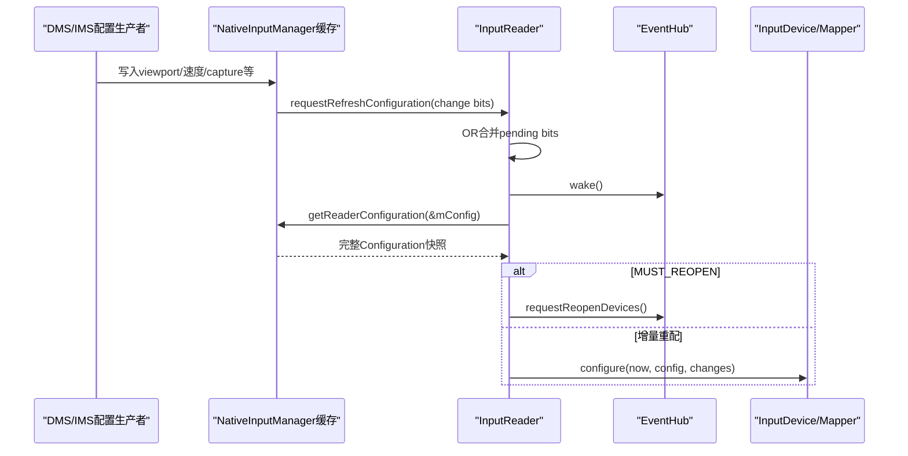
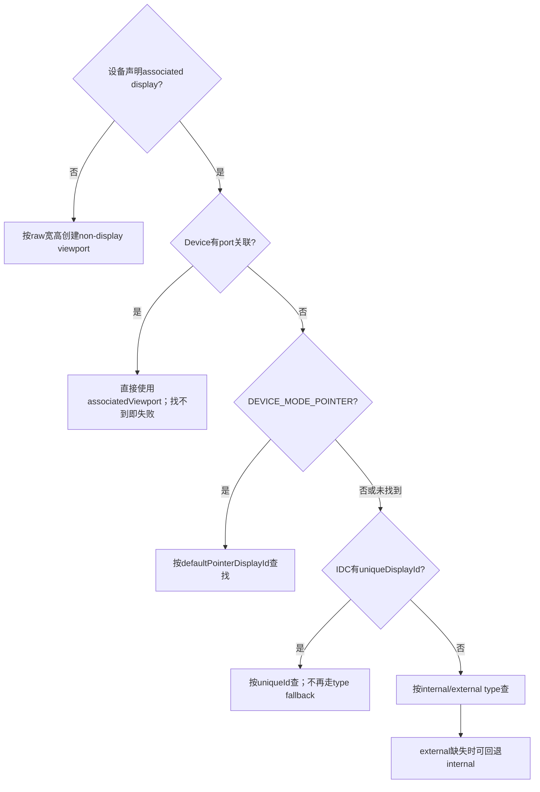

# 192 Android InputReaderPolicy、Configuration 与 DisplayViewport

> 源码版本：Android 11 / `android-11.0.0_r48`  
> 阅读方式：macOS 只读，不要求编译。  
> 前置章节：第 179、181、182、185 章。

## 1. 本章目标：配置怎样真的影响Mapper

输入设备行为不仅来自evdev能力和IDC文件，还依赖系统运行时配置：显示尺寸/方向、指针速度、show touches、pointer capture、设备启停、键盘布局、触摸仿射矩阵等。

本章追踪“配置生产者写缓存 → 请求刷新位 → InputReader线程合并处理 → InputDevice/Mapper选择性重配 → generation通知”的完整链路，并重点解释DisplayViewport如何把物理输入坐标和逻辑显示空间接起来。

## 2. 三层角色先分清

| 层 | 代表对象 | 职责 |
|---|---|---|
| 配置生产者 | DMS、IMS设置入口、Settings/Policy | 得到新显示或输入选项 |
| Policy桥 | `NativeInputManager::getReaderConfiguration` | 汇总Java回调与native锁内缓存，填充快照 |
| 消费者 | `InputReader`、`InputDevice`、各Mapper | 在Reader线程按changes位重配 |

`InputReaderPolicy`不是一个永远主动推送的配置总线；Reader被唤醒后会回调policy重新拉取完整快照。

## 3. 总体时序



## 4. InputReaderConfiguration包含什么

它既有标量，也有集合：virtual key quiet time、排除设备名、input port→display port关联、default pointer display、鼠标/滚轮速度参数、触控板手势阈值、show touches、pointer capture、disabled device集合、DisplayViewport列表等。

它是Reader当前配置快照，不等于Android Java `Configuration`，也不是某个单独设备的IDC内容。

## 5. changes位解决什么问题

`CHANGE_POINTER_SPEED`、`DISPLAY_INFO`、`SHOW_TOUCHES`等位告诉InputDevice/Mapper“本次哪些类别可能变化”，避免每次都重建所有状态。

但Reader仍调用policy取得完整快照；changes不是新值本身，而是选择性处理提示。

## 6. changes=0是什么意思

在Reader构造阶段，`refreshConfigurationLocked(0)`会拉取初始配置，但函数内`if (changes)`分支不遍历已有设备。此时本来也尚未扫描出设备。

设备首次创建后自己的`configure(..., changes=0)`通常把0理解为全量初始化。不要把Reader层“0不执行增量循环”和Mapper层“0表示初配所有项”混为一谈。

## 7. 请求刷新如何线程安全

`requestRefreshConfiguration(changes)`持Reader锁，把新bits OR进`mConfigurationChangesToRefresh`。

多个生产者短时间请求DISPLAY_INFO和POINTER_SPEED时，Reader下一轮会一次看到两个bit，不会因后一次赋值覆盖前一次。

## 8. 为什么只在首次pending时wake

代码先判断旧pending是否为0。只有从“无待处理变更”变为“有变更”时调用`mEventHub->wake()`；后续bit已经会被同一轮处理，无需重复写wake pipe。

这是合并通知，不是每个设置变化都保证一轮独立configure。

## 9. Reader线程何时消费changes

`loopOnce()`持锁读取pending bits并立刻清零，设置`timeoutMillis=0`，调用`refreshConfigurationLocked(changes)`；释放锁后以零超时进入EventHub getEvents。

若重配期间又有线程请求新变化，它会写入下一轮pending，不会丢失。

## 10. getReaderConfiguration是拉取完整快照

`refreshConfigurationLocked()`第一句就是：

```cpp
mPolicy->getReaderConfiguration(&mConfig);
```

NativeInputManager会调用若干Java方法取得quiet time、排除列表、端口关联等，再在自己的`mLock`下复制pointer speed、viewports、capture、disabled devices等缓存。

## 11. Java回调异常怎样处理

JNI每次CallMethod后用`checkAndClearExceptionFromCallback()`记录并清异常；只有调用成功才覆盖对应字段。

这意味着一次Java getter异常不会让整个Reader线程带着pending Java exception继续运行，但该字段可能保留`outConfig`原值。由于目标通常是长期复用的`mConfig`，不能武断说异常后字段一定归零。

## 12. excludedDeviceNames何时生效

每次拉取配置后，Reader无条件调用`mEventHub->setExcludedDevices(mConfig.excludedDeviceNames)`。

不过若需要让已打开设备按新的排除规则完整重新识别，调用者通常需要MUST_REOPEN语义；单纯更新列表不等于当前fd立即消失。

## 13. DisplayViewport的生产者是谁

r48中`DisplayManagerService`的Display线程处理`MSG_UPDATE_VIEWPORT`，比较新旧列表，发生变化时复制每个viewport，再调用`InputManagerInternal.setDisplayViewports()`。

所以viewport主要由DMS汇总显示拓扑后下发。WMS会参与显示/窗口协调，但不能把这条直接调用链写成“WMS构造viewport”。

## 14. Java到native怎样转换viewport

IMS LocalService把List转为数组，JNI遍历非null元素，使用`android_hardware_display_DisplayViewport_toNative()`复制为native结构。

遇到数组中的null元素会break，后面的元素不再处理；正常调用使用紧凑数组，不应夹null洞。

## 15. viewport写入后发生什么

NativeInputManager取得当前preferred pointer displayId，然后在自身锁内原子替换`mLocked.viewports`和`mLocked.pointerDisplayId`；释放锁后请求`CHANGE_DISPLAY_INFO`。

Reader下一轮通过getReaderConfiguration把这两项一起复制，避免看到新列表却仍配旧pointer display的中间组合。

## 16. DisplayViewport保存哪些空间信息

典型字段包括：displayId、uniqueId、physicalPort、type、orientation、logical frame、physical frame、deviceWidth/deviceHeight、isActive。

它不仅是一对宽高；它描述逻辑内容区域怎样落入物理显示设备，并提供输入设备与具体display匹配的身份信息。

## 17. 四种viewport查询键

Configuration提供：

- `get...ById(displayId)`；
- `get...ByPort(uint8_t)`；
- `get...ByUniqueId(string)`；
- `get...ByType(INTERNAL/EXTERNAL/VIRTUAL)`。

不同Mapper/设备关联方式选择不同查询键，不存在一个对所有设备统一的“默认屏幕搜索”。

## 18. byType遇到多个匹配怎样做

它保存第一个匹配结果，同时统计数量；多于一个时记录错误，但仍返回第一个。

这属于容错而非确定性的多屏选择策略。需要精确绑定时应使用port、uniqueId或displayId。

## 19. byUniqueId遇到重复有什么细节

循环中每次匹配都会覆盖result，所以重复时最终返回最后一个，并记录“预期最多一个”的错误。

它与byType“保留第一个”不同。定制代码若制造重复uniqueId，行为虽不崩溃却不值得依赖。

## 20. input port如何关联display port

Java getter把配置编码成`[inputPort1, "1", inputPort2, "2", ...]`；JNI每两个字符串解析一组，display port安全解析为uint8_t后写入`portAssociations`。

InputDevice用自己的`identifier.location`作为input port查这张表，再按physicalPort找到viewport。

## 21. 奇数长度port数组怎么办

循环条件使用`length / 2`，最后一个无配对字符串会被忽略。错误display port字符串也只记录错误并跳过该条。

因此配置文件错误可能表现为设备找不到关联viewport，而不是IMS启动直接失败。

## 22. InputDevice为什么先算associated viewport

收到DISPLAY_INFO时，InputDevice清旧关联，再按location→port association寻找display port和viewport。

这样所有Mapper可通过DeviceContext共享同一个明确的硬件端口关联，不必每个Mapper重复解析location。

## 23. 端口关联找不到viewport会怎样

如果设备明确绑定某display port，却找不到对应viewport，InputDevice记录警告，并把本轮局部`enabled`算成false。**在增量DISPLAY_INFO重配时**会据此调用`setEnabled(false)`。

首次`changes=0`则有下节所述例外；无论如何，严格port路径都不会悄悄回退默认屏，避免把触摸送到错误显示器。

## 24. 初次配置为何延迟disable

源码说明changes=0的首次配置要先让mappers读完已打开fd上的属性和axis range。首次末尾的`setEnabled()`只检查`disabledDevices`显式集合，**没有沿用上面因port viewport缺失算出的局部enabled=false**。

因此首次port viewport缺失时，InputDevice fd层未必被关闭；TouchInputMapper随后因`findViewport()`失败把自己的device mode置为DISABLED。增量DISPLAY_INFO则会直接按关联结果启停InputDevice。不要把两层“disabled”当成完全同一状态。

## 25. TouchInputMapper选择viewport的优先级



## 26. port优先为何如此高

物理连接口通常能最精确表达“这块触摸板属于哪块屏”。一旦配置了port却找不到viewport，函数直接返回关联结果（nullopt），不会再尝试default或internal。

这是严格绑定，不是弱提示。

## 27. pointer模式为何看defaultPointerDisplayId

触控板以鼠标方式工作时，产生的是系统pointer/cursor，应该跟随系统选择的指针显示，而非触摸硬件物理贴合的某块屏。

找不到指定display时，TouchInputMapper记录警告并继续尝试后续unique/type选择；Reader的PointerController更新则另有default display fallback。

## 28. uniqueDisplayId找不到会回退type吗

不会。只要IDC配置了非空uniqueDisplayId，函数直接返回byUniqueId结果；找不到就是nullopt，设备随后disabled。

显式身份配置错误不应被静默掩盖成“随便选一块同类型屏”。

## 29. external为何允许回退internal

没有port/unique精确约束、只声明associated display external时，找不到external viewport会警告并尝试internal。

这是较弱的类型提示，所以容错更宽。它不适用于已经指定port或uniqueId的路径。

## 30. non-display viewport用于什么

设备不声明关联显示时，Mapper用raw X/Y范围宽高构造non-display viewport。此时坐标空间属于设备自身，不被当作直接贴合某个物理屏幕。

例如某些navigation/unsclaed用途需要axis信息，但不应绑定显示displayId。

## 31. viewport变化后Mapper做什么

`configureSurface()`比较`mViewport != newViewport`。变化时缓存新viewport，并按orientation把logical/physical/device尺寸还原到natural orientation，再重算scale、offset和surface边界。

所以旋转不仅改一个orientation标签；坐标变换的宽高、left/top和缩放都会更新。

## 32. 找不到viewport时Touch会怎样

Mapper记录“associated display properties不可用”，把`mDeviceMode=DISABLED`并返回。后续DISPLAY_INFO到来可再次configure并恢复。

这通常是显示拓扑时序问题，不一定是触摸驱动坏了；诊断应同时看DMS viewport和port/unique配置。

## 33. updatePointerDisplayLocked做什么

DISPLAY_INFO刷新时，如果PointerController已存在，Reader按`defaultPointerDisplayId`查viewport并调用`controller->setDisplayViewport()`。

找不到指定display会回退`ADISPLAY_ID_DEFAULT`；仍找不到则记录错误并跳过更新，保留controller先前状态。

## 34. PointerController不存在会怎样

函数直接返回。Display信息仍保存于mConfig，各Mapper仍会configure；以后创建PointerController时，获取路径会使用当时配置。

因此“没有鼠标控制器”不会阻止触摸Mapper接收viewport更新。

## 35. POINTER_SPEED怎样传播

设置入口在NativeInputManager锁内更新`mLocked.pointerSpeed`，相同值直接返回；变化后请求POINTER_SPEED。

getReaderConfiguration用`exp2(pointerSpeed * exponent)`转成velocity scale，CursorInputMapper和pointer-mode TouchInputMapper在相关changes位下更新各自VelocityControl。

## 36. SHOW_TOUCHES怎样传播

设置变化写`mLocked.showTouches`并请求SHOW_TOUCHES。TouchInputMapper的configureSurface相关分支创建、更新或移除PointerController上的触点可视化。

它是Reader/PointerController层调试显示，不是App View自己绘制的触摸圆点。

## 37. POINTER_CAPTURE怎样传播

NativeInputManager写capture布尔并请求CHANGE_POINTER_CAPTURE。CursorInputMapper根据它在普通cursor与捕获相对mouse模式之间切换，必要时bump generation和reset状态。

焦点授权发生在Dispatcher/WMS链，Reader这里消费的是已经决定的全局capture配置。

## 38. ENABLED_STATE怎样传播

设置设备启停会修改`disabledInputDevices`集合并请求ENABLED_STATE。InputDevice configure判断自己的id是否在集合中并调用setEnabled。

设备id是本次打开生命周期中的Reader id；重开后id/代际可能变化，持久化策略不能简单把临时id永久写死。

## 39. KEYBOARD_LAYOUTS与DEVICE_ALIAS为何可能bump

InputDevice重新向policy取overlay或alias，只有值实际变化才bump generation。请求bit本身不保证generation增长。

这使上层设备列表通知表达“可观察的InputDeviceInfo变化”，而不是每次设置广播都制造假变化。

## 40. generation到底表示什么

Reader维护全局递增mGeneration；某设备调用`bumpGeneration()`会取得新的全局值并保存为设备generation。

它不是配置请求次数，也不是Linux event编号。上层可用id+generation判断同一设备描述是否已更新。

## 41. Reader何时通知设备列表变化

`loopOnce()`进入本轮前记录oldGeneration；处理配置和原始事件后，若全局generation变化，就在锁内生成InputDeviceInfo列表，锁外调用policy `notifyInputDevicesChanged()`。

某次configure若没有Mapper/Device实际bump，就不会仅因changes存在而通知列表变化。

## 42. 为什么通知在Reader锁外

Policy回调可能进入Java、查询Reader或阻塞。源码明确在释放Reader锁后通知，避免回调反向调用getScanCodeState等接口时死锁。

Queued input listener的flush也在锁外，遵循同一原则。

## 43. MUST_REOPEN与普通changes的分叉

普通changes遍历现有`mDevices`调用configure；MUST_REOPEN则调用EventHub `requestReopenDevices()`，不在这一分支继续configure旧对象。

后续EventHub以removed→重新scan/add的事件序列让Reader重建设备和Mapper，适合必须重读底层节点/配置的变化。

## 44. MUST_REOPEN会立刻同步完成吗

不会。它只是向EventHub请求重开；真正close、rescan、设备移除/新增在后续事件循环发生。

调用`requestRefreshConfiguration(MUST_REOPEN)`返回时，不能假设新设备id或新axis已经可查询。

## 45. changes位可以同时含MUST_REOPEN吗

可以，pending以bit OR合并。refresh会先拉完整配置，也会在DISPLAY_INFO bit存在时更新PointerController，然后看MUST_REOPEN决定不增量configure设备而请求重开。

所以MUST_REOPEN不是“完全跳过所有其他全局动作”，只是替代现有设备的configure分支。

## 46. 配置刷新是否丢输入事件

Reader先处理pending配置，再以0 timeout读取EventHub。普通增量配置无需关闭fd，但Mapper在需要reset时可能合成结束状态；MUST_REOPEN则会产生设备移除/新增和reset语义。

不能承诺配置切换与所有触摸手势无缝；具体要看对应Mapper configure是否设置resetNeeded。

## 47. 常见误解与诊断

- “旋转只改Dispatcher窗口坐标”：错误，Reader viewport会重算触摸cooking。
- “requestRefresh把新值直接传给Reader”：错误，它传bit，Reader再拉完整配置。
- “任何changes都会通知InputDevicesChanged”：错误，要实际bump generation。
- “找不到external一定禁用”：只有严格port/unique等路径如此，弱type路径可回退internal。
- “MUST_REOPEN已经重开完成”：错误，它是异步请求。
- “viewport都由WMS直接下发”：r48直接生产链应先看DMS。

## 48. 一次旋转的手工推演

1. Display拓扑/方向更新，DMS生成变化后的viewport列表；
2. Display线程去重并通过InputManagerInternal下发；
3. NativeInputManager替换viewports和pointer display缓存；
4. Reader pending OR入DISPLAY_INFO并被EventHub wake；
5. Reader拉取快照、更新PointerController；
6. InputDevice重算port关联，各Mapper configure；
7. TouchMapper以natural orientation重建scale/offset，必要时reset/bump；
8. generation变化才通知上层设备信息更新。

## 49. macOS只读练习

```bash
rg -n "MSG_UPDATE_VIEWPORT|setDisplayViewports" \
  frameworks/base/services/core/java/com/android/server/display/DisplayManagerService.java \
  frameworks/base/services/core/java/com/android/server/input/InputManagerService.java

rg -n "requestRefreshConfiguration|refreshConfigurationLocked|findViewport" \
  frameworks/native/services/inputflinger/reader
```

尝试分别推演POINTER_SPEED、DISPLAY_INFO、MUST_REOPEN：谁写值、哪个bit、是否configure旧设备、是否必然bump generation。

## 50. 复读审计、检查题与下一章

复读后特别限定：changes=0在Reader与Mapper层语义不同；viewport由DMS链下发；byType取首个而重复uniqueId最终取末个；严格port/unique失败不走弱fallback；generation只在实际状态变化时增长；MUST_REOPEN是请求而非同步完成。

另外，r48的`InputReaderConfiguration::changesToString()`遗漏了`CHANGE_POINTER_CAPTURE`分支。仅看“Reconfiguring input devices, changes=...”日志可能看不见capture bit，诊断时应对照调用点和Mapper行为。

检查题：

1. 为什么requestRefresh只传bit而Reader仍拉完整配置？
2. 指定uniqueDisplayId失败为何不回退internal？
3. changes发生后为什么上层可能收不到InputDevicesChanged？
4. MUST_REOPEN与增量configure的边界是什么？

下一章将从`InputManagerService`、JNI、NativeInputManager、InputManager、InputReader/InputDispatcher线程出发，建立**输入系统的进程与线程总装图**，把此前各章分散的执行上下文统一起来。
