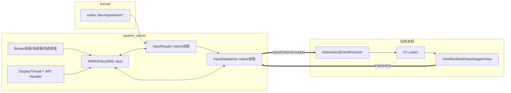
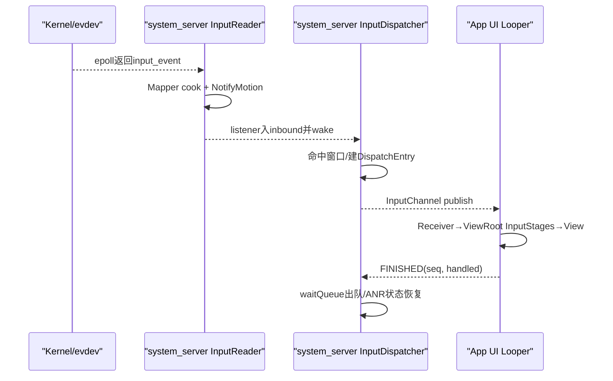

# 193 Android 输入系统进程与线程总装图

> 源码版本：Android 11 / `android-11.0.0_r48`  
> 阅读方式：macOS只读，不要求编译。  
> 目标：今后看到任一输入函数，都能先回答“在哪个进程、哪个线程、持什么锁、下一跳是否跨边界”。

## 1. 为什么需要总装图

输入链横跨kernel、system_server、App，还混有Java Handler、Binder线程、InputReader、InputDispatcher和App Looper。函数名都在“input”目录下，不代表它们同进程同线程。

本章不再深入单个算法，而是给前面几十章建立执行上下文索引。

## 2. r48最重要的进程结论

Android 11 r48的常规Framework路径中，`InputManagerService`在system_server构造`NativeInputManager`，后者直接`new InputManager`，其中包含真正工作的InputReader和InputDispatcher。

因此这套Reader/Dispatcher线程运行在**system_server进程**。源码树另有独立`/system/bin/inputflinger` host模块，不能仅凭文件存在就断言产品正在用它承载Framework输入管线。

## 3. 端到端进程图



## 4. SystemServer何时创建IMS

`SystemServer.startOtherServices()`先`new InputManagerService(context)`，随后把它传给`WindowManagerService.main(...)`，并将IMS注册为`Context.INPUT_SERVICE`。

WMS需要持有IMS接口来注册窗口channel、提交窗口快照和处理焦点/ANR回调。

## 5. 构造IMS时线程启动了吗

没有。IMS构造函数创建Handler、调用`nativeInit()`建立native对象，但真正的`nativeStart()`在稍后`inputManager.start()`执行。

“native对象已构造”和“Reader/Dispatcher线程已运行”是两个阶段。

## 6. start的顺序

`InputManager::start()`先启动Dispatcher，成功后再启动Reader；Reader启动失败会停止已启动的Dispatcher。

先准备接收队列的一端，再让Reader开始产出事件，避免开机第一批raw事件没有下游消费线程。

## 7. InputManager内部三段管线

构造顺序是：

```cpp
mDispatcher = createInputDispatcher(dispatcherPolicy);
mClassifier = new InputClassifier(mDispatcher);
mReader = createInputReader(readerPolicy, mClassifier);
```

Reader把Notify事件送给Classifier，Classifier再送Dispatcher。Reader不直接反向读取Dispatcher内部状态。

## 8. Reader与Dispatcher单向通信原则

`InputManager.h`注释强调两者不共享内部状态，通信方向从Reader到Dispatcher，不反向调用。

两者都可以通过policy与system_server Java交互，但不应拿对方内部锁互相穿越。

## 9. InputReader线程怎样创建

`InputReader::start()`创建：

```cpp
InputThread("InputReader", loopOnce, EventHub::wake)
```

InputThread内部用Android `Thread`运行，线程优先级为`ANDROID_PRIORITY_URGENT_DISPLAY`。析构会requestExit、调用wake打断阻塞，再等待线程退出。

## 10. InputDispatcher线程怎样创建

`InputDispatcher::start()`同样创建InputThread，名字为`InputDispatcher`，loop函数为`dispatchOnce()`，wake函数为`mLooper->wake()`。

两条线程优先级相同但阻塞对象不同：Reader主要阻塞EventHub，Dispatcher主要阻塞自己的Looper及deadline。

## 11. Reader一轮做什么

Reader线程先持锁处理pending configuration/timeout，释放锁后`EventHub.getEvents()`；获得raw events后再持锁处理设备变化和Mapper，锁外通知设备列表并flush QueuedInputListener。

读内核、改Reader状态、跨policy回调不是在一个大锁中一口气完成。

## 12. Dispatcher一轮做什么

Dispatcher线程在`dispatchOnce()`持`mLock`选择pending事件和目标、管理队列/ANR/command；需要调用policy时常把操作包装成command，执行时临时解锁。

完成本轮后按最近事件或ANR deadline进入Looper poll。

## 13. Reader→Dispatcher是否跨进程

在r48常规Framework路径里不跨进程，它们同在system_server，通过C++接口和QueuedInputListener传递对象。

但仍跨线程，所以NotifyEntry的所有权、队列和锁边界同样重要；“同进程”不等于可直接共享任意对象。

## 14. InputClassifier涉及哪些线程

Reader同步调用`InputClassifier::notifyMotion()`，所以入口和把事件继续交给Dispatcher listener仍发生在InputReader线程。但启用MotionClassifier HAL后，`classify()`只读取上一轮可用分类并把本次event压入BlockingQueue；真正可能阻塞的HAL `classify()`运行在名为`InputClassifier`的专用`std::thread`。

此外，创建HAL连接还有`Create MotionClassifier`初始化线程，HAL死亡回调可能来自HIDL Binder线程。分类结果允许晚1—2个事件并作用于后续event，不能把Classifier简单归为“无独立线程”，也不能认为Reader等待HAL同步返回本次分类。

## 15. NativeInputManager是什么

它同时实现InputReaderPolicyInterface与InputDispatcherPolicyInterface，是native核心与Java IMS/WMS policy之间的桥。

它保存IMS Java全局引用、若干锁内配置缓存、PointerController，以及创建的InputManager。

## 16. nativeInit在哪个线程执行

IMS由SystemServer启动流程构造，`nativeInit()`在该调用线程同步执行，通常是system_server主线程启动阶段。

它创建NativeInputManager并把Java MessageQueue对应Looper传进去，但没有因此把Reader/Dispatcher绑定到当前Looper。

## 17. IMS Handler属于哪个线程

构造函数使用：

```java
mHandler = new InputManagerHandler(DisplayThread.get().getLooper());
```

因此IMS Handler消息运行在system_server的DisplayThread，不是SystemServer主线程，也不是InputReader/Dispatcher线程。

## 18. 传入native的Looper做什么

`nativeInit`从IMS Handler的MessageQueue取native Looper，交给NativeInputManager。它用于PointerController/Sprite等需要Looper的组件和相关回调上下文。

Reader和Dispatcher各自另建线程；Dispatcher本身也有自己的Looper。不能把三个Looper/线程合并成“输入线程”。

## 19. Binder线程从哪里出现

App调用`IInputManager`、WMS/其他服务跨Binder进入IMS时，方法可能运行在system_server Binder线程池。Java入口若直接调用native注册/注入，请求会在该Binder线程同步进入native并获取对应锁。

所以`registerInputChannel()`并不必然由DisplayThread执行。

## 20. LocalService调用是否跨Binder

system_server内部通过`InputManagerInternal`和LocalServices调用时通常是同进程Java直接调用，不走Binder序列化。

但调用线程继承自生产者，例如DMS Display线程下发viewport；IMS native入口仍需自己同步。

## 21. WMS窗口快照在哪条上下文

WMS在自己的锁/事务流程准备InputWindowInfo，通过IMS/native接口设置Dispatcher窗口列表。最终`setInputWindows()`可由调用线程进入native，持Dispatcher锁更新状态，再wake Dispatcher线程。

更新函数执行者与之后事件分发者不是同一线程。

## 22. Policy回调为何常称interruptible

Dispatcher command函数名如`doNotifyAnrLockedInterruptible()`，会先解Dispatcher锁，调用NativeInputManager→JNI→Java WMS/IMS，再重新加锁。

“interruptible”重点不是Java异常，而是允许锁外跨组件执行，返回后必须重新验证Connection/窗口状态。

## 23. Reader policy回调在哪个线程

`getReaderConfiguration()`、keyboard overlay、device alias等通常由InputReader线程发起，经NativeInputManager调用Java getter。

JNI为当前native线程附着/取得JNIEnv，Java方法不是因此自动切换到IMS Handler；除非Java实现自己post消息。

## 24. Dispatcher policy回调在哪个线程

InputDispatcher线程执行command时解锁后调用NativeInputManager；例如ANR、焦点变化、channel broken、key intercept等会同步进Java policy。

这些回调如果耗时，会占用Dispatcher线程，即使没有持Dispatcher锁，也可能增加输入延迟。

## 25. 为什么记录slow interception

`interceptKeyBeforeDispatching`等policy调用会计时并在超过阈值时记录警告，因为Dispatcher线程正在等待policy结果，后续目标选择不能继续。

解锁解决死锁风险，不解决同步回调本身的延迟。

## 26. App InputChannel何时跨进程

WMS创建socket pair并把client端fd经Binder传给App；server端留给system_server Dispatcher。

事件传输之后主要走Unix `SOCK_SEQPACKET` InputChannel，而不是每个MotionEvent都走Binder。

## 27. App由哪条线程读InputChannel

ViewRootImpl收到窗口client channel后创建：

```java
new WindowInputEventReceiver(inputChannel, Looper.myLooper())
```

正常窗口添加发生在UI线程，因此Receiver绑定App主Looper。若特殊组件在其他Looper构造InputEventReceiver，事件就在那个Looper线程处理。

## 28. NativeInputEventReceiver怎样接入App Looper

JNI对象把channel fd通过`MessageQueue.getLooper().addFd()`注册为可读回调。fd触发时`handleEvent()`调用`consumeEvents()`，再回调Java `dispatchInputEvent/onInputEvent`。

从socket可读到ViewRoot enqueue，仍在同一个App Looper线程。

## 29. InputStage是否另开线程

ViewRootImpl大部分InputStage在UI线程同步推进；IME stage可能通过跨进程/异步callback defer，NativePreIme/PostIme等仍围绕ViewRoot队列恢复。

ThreadedRenderer的RenderThread不负责View事件分发，不能因为触摸会触发绘制就把输入处理放到RenderThread。

## 30. FINISHED从哪个线程发出

ViewRoot最终在其Receiver绑定的Looper调用`finishInputEvent()`；native InputConsumer立即写FINISHED，socket写阻塞则放入finish queue并监听ALOOPER_EVENT_OUTPUT。

所以App UI线程卡住既会延迟业务处理，也会延迟回执，最终体现在Dispatcher waitQueue/ANR。

## 31. Dispatcher在哪读FINISHED

server端fd注册在InputDispatcher自己的Looper。可读回调`handleReceiveCallback()`运行在InputDispatcher线程，循环receive finished signal，按seq完成waitQueue出队。

它不是Binder回调，也不是system_server主线程代收。

## 32. 一次触摸的线程切换



## 33. 一次Key policy调用的线程切换

Reader先在InputReader线程调用`interceptKeyBeforeQueueing` policy；事件到Dispatcher后，可能在InputDispatcher线程调用`interceptKeyBeforeDispatching`；App再在UI线程走ViewRoot/IME/View。

“一个按键只经过一次policy”是错误心智模型，两次拦截点目的和线程不同。

## 34. 输入注入从哪里进入

外部App/测试通过IInputManager Binder进入IMS Binder线程，保存caller pid/uid后同步JNI调用Dispatcher inject接口；Dispatcher创建EventEntry入队，真正目标选择在Dispatcher线程。

WAIT_FOR_RESULT/FINISHED会让Binder调用线程等待条件变量，不是让Dispatcher线程阻塞等待自己。

## 35. Accessibility InputFilter线程

Native early policy可把事件回调Java InputFilter；AccessibilityInputFilter内部通过Handler/变换链处理，再以FILTERED flag异步注回。

这条路径增加Java线程/消息切换，且重新注入回Dispatcher，不是直接从Filter调用目标View。

## 36. DisplayViewport更新线程

DMS的`MSG_UPDATE_VIEWPORT`在其Display线程Handler处理，经同进程InputManagerInternal进入IMS/native，写缓存后只请求Reader刷新。

真正重配Mapper在InputReader线程下一轮发生，DMS线程不直接操作Mapper。

## 37. pointer icon资源加载线程

PointerController需要图标资源时可经NativeInputManager进入Java资源加载。由于NativeInputManager持有DisplayThread Looper/SpriteController上下文，相关可视对象更新与Reader/Dispatcher算法线程应分开看。

诊断“光标能动但图标不更新”时，除Reader坐标还要看DisplayThread/PointerController资源链。

## 38. Watchdog监控什么

IMS.start把自己注册为Watchdog monitor；monitor调用native层检查Reader/Dispatcher锁能否获取等健康状态。

Watchdog线程不是输入事件工作线程，它只做系统服务卡死探测。

## 39. 独立inputflinger host是什么

源码有`frameworks/native/services/inputflinger/host`、main和rc，可启动独立Binder服务；它是模块化/演进路径的一部分。

但Framework NativeInputManager构造函数也把本地InputManager注册为`inputflinger`，Android.bp写着“TODO: move inputflinger to its own process”。研究具体设备必须结合build product、服务列表和进程现场，而非只看两个入口之一。

## 40. 名为inputflinger的Binder服务等于独立进程吗

不等于。Binder服务名只标识ServiceManager条目，发布它的对象可以驻留system_server。

判断进程应看对象在哪里构造/发布、实际PID或构建选择，不能从`dumpsys inputflinger`的名字推断。

## 41. 常见锁关系

- InputReader `mLock`：设备、配置、Mapper状态。
- InputDispatcher `mLock`：inbound/pending、窗口、TouchState、Connection队列。
- NativeInputManager `mLock`：viewports、pointer speed/controller等policy缓存。
- WMS global lock：窗口层级、焦点、InputWindowHandle生产。

跨层同步调用前释放本层锁，是避免Reader/Dispatcher与WMS锁反转的关键。

## 42. 为什么返回policy后必须重新查对象

解锁期间其他线程可能注销channel、替换窗口、完成事件或改变焦点。command返回后持有的旧`sp<>`可能仍存活，但已不在Dispatcher索引中。

因此源码经常按token重新`getConnectionLocked()`，而不是无条件继续使用回调前结论。

## 43. 时间戳跨线程仍用什么基准

InputReader/Dispatcher大量使用monotonic nanoseconds；EventEntry保留eventTime/downTime，队列另记录deliveryTime/timeoutTime。

跨线程不等于每一跳重写eventTime。分析延迟要区分硬件事件时间、Dispatcher排队/投递时间、App帧消费时间。

## 44. 优先级高是否保证不延迟

InputReader/Dispatcher使用URGENT_DISPLAY优先级只能提高调度倾向；持锁竞争、同步policy、socket背压、CPU饥饿和App UI卡顿仍能造成延迟。

实时问题应看线程调度和等待链，不能用线程优先级作为“不会卡”的证明。

## 45. dumpsys应怎样对应线程

`dumpsys input`可包含Reader/Dispatcher、设备、窗口、Connection队列等状态；trace中再找InputReader/InputDispatcher线程slice和App主线程。

静态dump告诉你“卡在哪里”，Perfetto/atrace告诉你“哪条线程何时卡、等了多久”。

## 46. 黑屏/无触摸如何按线程排查

1. EventHub/Reader是否有raw和Notify；
2. Dispatcher inbound/pending是否前进；
3. 目标窗口/channel是否存在；
4. App fd是否可读、UI Looper是否调度Receiver；
5. ViewRoot stage是否defer；
6. FINISHED是否返回、waitQueue是否出队。

逐线程查比从View点击回调直接倒猜驱动更高效。

## 47. 一个函数的固定定位法

看到函数先问：

1. 谁直接调用它？
2. 调用者来自Binder、Handler、InputThread还是Looper fd callback？
3. 函数是否持Reader/Dispatcher/WMS锁？
4. 内部JNI/Binder/socket是否跨边界？
5. 返回前状态是否已经提交，还是只排队/wake？

这五问能消除大多数“看懂代码却看错时序”的问题。

## 48. macOS只读练习

```bash
rg -n "new InputManagerService|inputManager.start" \
  frameworks/base/services/java/com/android/server/SystemServer.java

rg -n 'InputThread\("InputReader|InputThread\("InputDispatcher' \
  frameworks/native/services/inputflinger

rg -n "WindowInputEventReceiver|addFd" \
  frameworks/base/core/java/android/view/ViewRootImpl.java \
  frameworks/base/core/jni/android_view_InputEventReceiver.cpp
```

## 49. 复读审计

复读时确认了五个版本边界：Reader/Dispatcher在r48 Framework路径驻system_server；独立host存在但不是据此就启用；IMS Handler绑定DisplayThread但两条native线程独立；Reader policy JNI不会自动post到Handler；App窗口Receiver通常绑定构造时UI Looper但API也允许其他Looper。

还要记住：同进程直接调用仍可能跨线程；解锁policy回调仍会占用发起线程；Binder服务名不表达进程归属。

## 50. 检查题与下一章

1. NativeInputManager拿到DisplayThread Looper，为何不代表Reader跑在DisplayThread？
2. FINISHED为何从App UI Looper经socket回到InputDispatcher线程？
3. Dispatcher解锁后同步调用Java policy，还有什么性能风险？
4. 如何证明某产品使用system_server内的输入核心，而不是独立host？

下一章将学习**dumpsys input、日志、事件编号与现场诊断方法**，把Reader/Dispatcher/窗口/Connection状态组织成可重复执行的故障定位流程。
