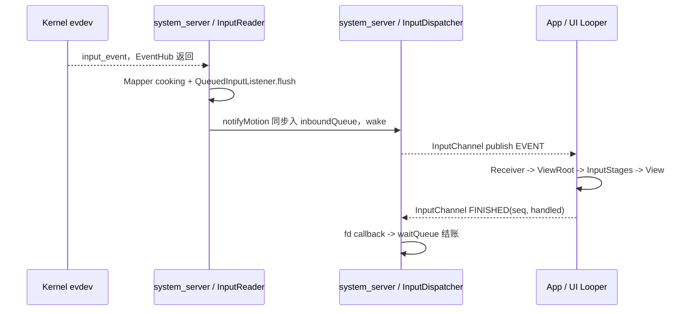
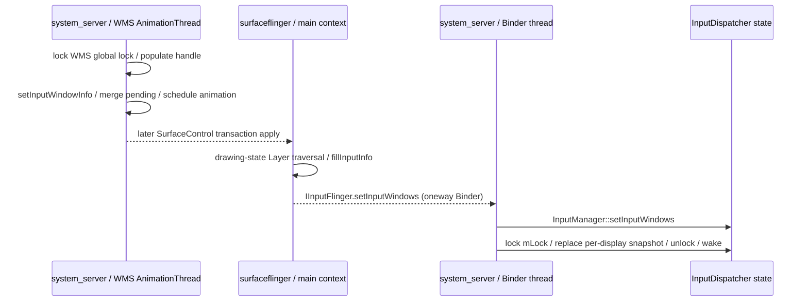
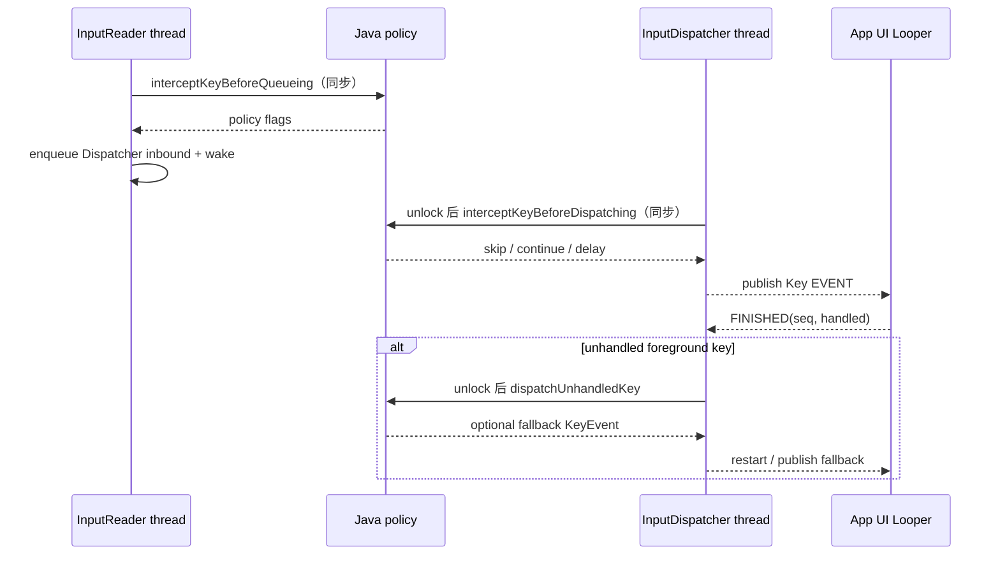

# 193 Android 输入系统进程与线程总装图：一笔触摸到底在哪些线程上前进

> 源码基线：Android 11 / API 30 / `android-11.0.0_r48`
> 核心问题：一笔物理输入从 evdev 到 View，再以 FINISHED 回到系统时，究竟在哪些进程和线程执行；同步调用、队列、Binder 与 socket 又分别把“完成”推进到哪里？

---

## 1. 从“窗口已经显示，点击却没有回调”开始

### 一个容易查错线程的现场

屏幕上的新窗口已经可见，手指也确实落在按钮上，但 `onTouchEvent()` 没有出现。几秒后，系统甚至报了 input ANR。

只看类名，很容易把问题压成一条模糊的链：

```text
InputReader -> InputDispatcher -> ViewRootImpl
```

这条链没有告诉我们：

- `InputReader` 和 `InputDispatcher` 虽同在 `system_server`，却是两条 native 工作线程；
- `InputDispatcher::notifyMotion()` 的名字里有 Dispatcher，但物理事件调用它时仍处在 Reader 线程；
- 窗口命中快照不是 WMS 直接 JNI 推入 Dispatcher，而是经过 SurfaceFlinger 和一次 oneway Binder；
- App 端通常由 UI Looper 读 socket，RenderThread 不负责把事件交给 View；
- `finishInputEvent()` 被 Java 调用、FINISHED 写入 socket、Dispatcher 清掉 `waitQueue`，是三个不同完成点；
- policy 回调即使先释放 Dispatcher 锁，也仍会同步占住发起它的线程。

因此，看到“点击没反应”，第一问不应只是“事件走到哪个类”，而应是：

> 当前证据证明了哪条线程走到哪个完成点，下一步是同步调用、排队、Binder，还是 fd 唤醒？

### 本章使用的四种箭头

后文统一用四种语义描述边界：

```text
A -> B       同一调用栈中的同步调用，B 返回前 A 不能继续
A ~> B       A 提交队列并 wake，B 在线程被调度后再处理
A => B       Binder 调用；是否等待 reply 要继续看接口是不是 oneway
A <=> B      InputChannel socket 双向协议，正向 EVENT、反向 FINISHED
```

箭头不是装饰。它决定上一步返回时，下一步究竟已经执行、只是可执行，还是连远端队列都未必接收成功。

### 读完应能回答什么

1. r48 的 Framework Reader / Dispatcher 为什么属于 `system_server`，而不是独立 `inputflinger` 进程？
2. `nativeInit()`、`nativeStart()` 与“初次设备扫描通知已经到达 WMS”为什么是三个不同完成点？
3. Reader 锁外 `flush()` 为什么没有创建 listener 线程？
4. 哪些 policy 回调运行在 Reader 线程，哪些运行在 Dispatcher 线程？
5. WMS 写入窗口输入信息后，哪条 Binder 线程真正获取 Dispatcher `mLock`？
6. App UI Looper、InputChannel 与 RenderThread 各自负责什么？
7. FINISHED 到底证明了什么，又没有证明什么？
8. 注入、Accessibility InputFilter、viewport 与鼠标光标各增加了哪些旁路线程？
9. `dumpsys input`、线程栈和 trace 应怎样组合，才不会把非原子状态拼成虚假的时序？

### 本章不重复什么

前文已经分别拆过窗口命中、InputTransport、ViewRoot InputStage、ANR、注入、InputFilter、channel 生命周期与 viewport。本章不再展开每个算法分支，而是给这些局部机制建立一张执行上下文索引。

这里的结论严格限定在 r48 源码。厂商若移动服务、增加线程或改写产品清单，必须重新用构造点、注册点和现场 PID 验证。

## 2. 先把进程、线程、Looper 与锁放进同一张图

### 标准物理触摸主链



图中 `R->>D` 很容易被误读成线程已经切换。更精确的说法是：

```text
InputReader thread
  -> QueuedInputListener::flush()
  -> InputClassifier::notifyMotion()
  -> InputDispatcher::notifyMotion()
  -> lock(mLock), enqueue inbound, unlock, wake

InputDispatcher thread
  <- Looper 被唤醒
  -> dispatchOnceInnerLocked()
  -> 找目标、建 DispatchEntry、publish
```

前半段调用的是 Dispatcher 对象，却仍在 Reader 线程；wake 之后的后半段才由 Dispatcher 工作线程执行。

### 执行上下文总表

| 进程 | 典型线程 / Looper | 主要职责 | 不能据此推出什么 |
|---|---|---|---|
| kernel | 设备 IRQ / evdev 内核路径 | 产生带时间戳的 `input_event` | 不负责 Android 窗口命中 |
| `system_server` | SystemServer 主线程 | 创建 IMS，发起 WMS 与输入启动阶段 | `nativeStart()` 返回不等于首个设备 ready |
| `system_server` | `android.display` / DisplayThread | DMS 与 IMS 的多个 Handler；pointer 动画与 sprite 消息所用 Looper | Reader / Dispatcher 不运行在此 Looper |
| `system_server` | InputReader | EventHub 读取、设备 / Mapper、配置刷新、listener flush | 调到 Dispatcher 方法不等于已切到 Dispatcher 线程 |
| `system_server` | InputDispatcher | 目标选择、connection 队列、publish、FINISHED fd callback、ANR | 调用 Dispatcher public 方法不自动等于已切到这条线程 |
| `system_server` | InputClassifier | 启用 HAL 后异步做 motion classification | 普通事件不会等本次 HAL 结果才下发 |
| `system_server` | Binder 线程池 | 接收 `IInputManager` 请求；接收 SF 的 `IInputFlinger` oneway | Binder 方法名不指定某一固定 Binder 线程 |
| `surfaceflinger` | SF 主执行上下文 | 从 drawing-state Layer 树汇总 `InputWindowInfo` | WMS transaction 已 apply 不等于 Dispatcher 已安装快照 |
| App | 窗口所属 Looper，通常主 / UI | 读 client channel、ViewRoot/InputStages/View、发 FINISHED | `InputEventReceiver` API 并不强制只能绑定主 Looper |
| App | RenderThread | 渲染命令与 GPU 相关工作 | 不负责 `onTouchEvent()` 分发，也不是 FINISHED 的必经线程 |

### 同进程、同对象与同线程是三件事

Reader、Classifier、Dispatcher、NativeInputManager 和 Java IMS 都驻留 `system_server`，这只说明：

- 它们可以使用进程内 C++ / JNI / Java 引用；
- 某些 LocalService 调用不需要 Binder 序列化；
- 它们共享进程崩溃命运。

这不说明它们共享线程，也不说明任意状态都可无锁访问。Dispatcher 的 `mLock` 会被 Reader 调用线程、Dispatcher 自己、承接 SF Binder 调用的线程、channel 注册调用者和注入调用者分别竞争。

### Reader 与 Dispatcher 的直接通信保持单向

`InputManager` 把 Dispatcher 作为 Classifier 的下游，再把 Classifier 作为 Reader 的 listener。逐笔数据沿 Reader→Classifier→Dispatcher 前进；Reader 不反向读取 Dispatcher 的内部队列，Dispatcher 也不直接持有 Reader 状态做目标选择。

两者都可以通过 NativeInputManager policy 进入 Java，再由 Java 服务间接查询或改变另一侧。这种控制面回环必须服从各自锁协议，不能被误写成 Reader 与 Dispatcher 可随意互调内部对象。

### 一张图里其实有控制面与数据面

数据面主要输送逐笔事件：

```text
evdev -> EventHub -> Reader -> Dispatcher -> InputChannel -> App
```

控制面则决定“投给谁、怎样解释”：

```text
WMS/SF 窗口快照 -> Dispatcher
DMS viewport -> NativeInputManager -> Reader
Policy 回调 <-> Reader / Dispatcher
App FINISHED -> Dispatcher completion state
```

无触摸既可能是数据面停住，也可能是控制面快照尚未抵达。把两者合成一条“input pipeline”，会错过最常见的代际窗口。

## 3. 启动链：对象已存在、服务可发现、线程已请求启动并非同一时刻

### SystemServer 先造 IMS，再同步造 WMS

`SystemServer.startOtherServices()` 的关键顺序是：

```text
system_server main
  -> new InputManagerService(context)
  -> WindowManagerService.main(context, inputManager, ...)
  -> publish "window"
  -> publish Java Binder service "input"
  -> wm.onInitReady()
  -> inputManager.setWindowManagerCallbacks(...)
  -> inputManager.start()
  -> DisplayManagerService.windowManagerAndInputReady()
```

WMS 的构造还有一个容易漏掉的线程切换：`WindowManagerService.main()` 使用 `runWithScissors()`，主线程同步等待 DisplayThread 完成 WMS 构造。于是“由 SystemServer 发起”不等于“构造函数体运行在 SystemServer 主线程”。

这个安排保证启动 Reader / Dispatcher 前，WMS 对象及其 policy callback 已建立并交给 IMS。

### NativeInputManager 是双向 policy 桥，不是第三条事件工作线程

`NativeInputManager` 同时实现 Reader policy、Dispatcher policy 与 pointer policy。它保存 Java IMS 全局引用、DisplayThread Looper、viewport / pointer 等受锁缓存，并持有真正的 native `InputManager`。

Reader 或 Dispatcher 同步进入它时，代码仍运行在原调用线程；它通过 JNI 调 Java 也不会自动切换 Looper。只有具体 Java 方法显式 post，或后续 Binder / queue / fd 边界，才会产生新的执行上下文。

### IMS 构造阶段已经建立 native 对象图

IMS 构造函数先创建绑定 `DisplayThread.get().getLooper()` 的 `InputManagerHandler`，随后同步调用：

```text
nativeInit(service, context, DisplayThread MessageQueue)
  -> new NativeInputManager(..., messageQueue->getLooper())
     -> new InputManager(readerPolicy, dispatcherPolicy)
        -> createInputDispatcher(dispatcherPolicy)
        -> new InputClassifier(dispatcher)
        -> createInputReader(readerPolicy, classifier)
```

此时完成的是对象图，而非工作循环：

- Dispatcher 已创建自己的 native `Looper(false)`；
- EventHub 已建立 epoll、inotify 与 wake pipe 等基础设施；
- InputReader 构造函数持 `mLock` 执行一次 `refreshConfigurationLocked(0)`；
- `NativeInputManager` 调用 `addService("inputflinger", ...)`，尝试把本地 `InputManager` 发布成 native Binder 服务；r48 没有检查该返回值；
- Reader / Dispatcher 尚未创建各自的 `InputThread`。

构造期有两个重要例外：Dispatcher 构造时的 `getDispatcherConfiguration()` 与 Reader 构造时的 `getReaderConfiguration()` 都同步运行在 `nativeInit()` 调用者线程，通常是 system_server 主线程；后者还发生在 Reader `mLock` 内。不能按类名把所有 policy getter 都标成对应工作线程。

### `input` 与 `inputflinger` 是两个服务入口

常规 r48 Framework 路径里：

| ServiceManager 名称 | 对象 | 发布位置 | 所在进程 |
|---|---|---|---|
| `input` | Java `InputManagerService` Binder | SystemServer 在 WMS 创建后发布 | `system_server` |
| `inputflinger` | native `InputManager` / `IInputFlinger` | `NativeInputManager` 构造时尝试发布 | `system_server` |

服务名是查找键，不是进程名。在该注册成功的标准 AOSP 路径中，SurfaceFlinger 通过 `inputflinger` 把窗口快照送回 `system_server`；App 或 shell 通过 `input` 调用 Java IMS。两条 Binder 入口最终落到同一进程中的同一套 native 核心。单凭 `nativeInit()` 正常返回则不能证明未检查的 `addService()` 一定成功。

### `start()` 顺序不是线程就绪屏障

`InputManager::start()` 写成：

```text
Dispatcher::start()
Reader::start()
若 Reader start 返回错误，则 stop Dispatcher
```

这个顺序只能证明两个 start 方法的调用顺序。两者各自只是构造 `InputThread`，而 `InputThread` 构造函数立即调用：

```cpp
mThread->run(mName.c_str(), ANDROID_PRIORITY_URGENT_DISPLAY);
```

它没有等待首次 `dispatchOnce()`、首次 `getEvents()` 或 idle，甚至没有把 `Thread::run()` 的返回码上传。因此不能把顺序解释为“Dispatcher 已经进入 poll，Reader 才能生产”。调度器完全可能先运行 Reader。

安全性来自更早已经构造好的 listener、inbound queue、Looper 与互斥锁，不是一个隐藏的 thread-ready handshake。

### stop 才包含明确的线程退出等待

`InputManager::stop()` 先停 Reader，再停 Dispatcher。每个 `InputThread` 析构都先 `requestExit()`，再 wake EventHub 或 Looper 打断阻塞，最后 `requestExitAndWait()`。

因此正常 stop 返回是工作线程已经退出的同步边界；start 返回却没有相反方向的“首次 loop 已进入”确认。启动和停止不能按对称 API 名称推断成对称完成语义。

### 六个启动完成点必须分账

| 完成点 | 已经保证 | 仍未保证 |
|---|---|---|
| `nativeInit()` 返回 | native 对象、EventHub 基础设施和 Dispatcher Looper 已建立；已取得既存 DisplayThread Looper；已尝试发布 `inputflinger` | `inputflinger` 注册实际成功；Reader / Dispatcher 工作线程存在 |
| `WindowManagerService.main()` 返回 | DisplayThread 上的 WMS 构造已完成 | 输入工作线程已启动 |
| 发布 Java `input` | Binder 客户端可发现 IMS | native 工作循环 ready |
| `nativeStart()` 返回 | 两个 `start()` 调用已返回 | 首次 loop、设备扫描、idle 或可派发窗口 |
| IMS `start()` 返回 | 还完成 Watchdog monitor 注册、observer 注册与初始 setting 下发 | 首枚事件已到 App |
| WMS `mInputDevicesReady=true` | 初次 `FINISHED_DEVICE_SCAN` 所产生的 configuration notification 已经由 Reader、Dispatcher 与 policy 到达 WMS | 一定存在设备；dispatch 已 enable；窗口已可派发 |

初次扫描还要经历 EventHub 的 `FINISHED_DEVICE_SCAN`、Reader 锁外 flush、Dispatcher 入队，以及 Dispatcher 线程的锁外 configuration policy 回调，WMS 才把 `mInputDevicesReady` 置为 true。零设备时这条通知也能到达，而且 Dispatcher 与 WMS 的 dispatch-enabled 初值都为 false；所以它不表示存在可派发设备、窗口已经就绪或首枚事件已到 App。

启动函数返回值不能代替这条异步证据链。

## 4. InputReader 一轮：两段 Reader 锁、一次 EventHub 等待、一次锁外 flush

### `loopOnce()` 的真实分段

Reader 工作线程每轮大致执行：

```text
lock InputReader::mLock
  读取并清 pending configuration bits
  必要时 refreshConfigurationLocked(changes)
  计算 EventHub timeout
unlock

EventHub::getEvents(timeout)

lock InputReader::mLock
  broadcast mReaderIsAliveCondition
  processEventsLocked(raw events)
  执行 mapper、timeout 与 generation 检查
  必要时复制 inputDevices 列表
unlock

必要时 policy->notifyInputDevicesChanged(...)
QueuedInputListener::flush()
```

`getEvents()` 不持 Reader `mLock`，但会使用 EventHub 自己的锁和 epoll 状态。说“Reader 没拿 Reader 锁”不等于“这一段完全无锁”。

### Mapper 的通知先进入 Reader 内部暂存

Mapper 在 `processEventsLocked()` 期间仍位于 Reader 锁域。它不会在这时直接跨进程写 App channel，而是把 `NotifyKeyArgs`、`NotifyMotionArgs` 等交给 `QueuedInputListener`。

Queued listener 为参数创建副本并放入 `mArgsQueue`。这一步的完成点只有：

> 本轮 cooking 结果已经脱离 Mapper 的临时参数生命周期，进入 Reader 侧待 flush 列表。

它尚未证明 Dispatcher inbound queue 已接收，更没有证明窗口已命中。

### 为什么必须锁外 flush

Reader 源码直接说明 listener 可能回调 Reader 查询，还可能进入 WindowManager 路径。若持 Reader `mLock` 调下游，另一线程可能先持 Dispatcher / WMS 锁再回查 Reader，形成锁反转。

所以 `flush()` 被放到 Reader 锁外。但这条经验不能扩大成“所有跨层调用前都释放本层锁”：

- Reader 构造和配置刷新会在 Reader `mLock` 下调用 `getReaderConfiguration()`；
- `InputDevice::configure()` 的若干 policy 查询也在 Reader 锁域中；
- Dispatcher 的 early interception 本来就在 Dispatcher `mLock` 外；
- Dispatcher command 则会显式解锁后回调 policy。

必须看具体调用点的锁注解和 acquire / release，不能靠组件层级猜。

### Reader 一轮的四个完成点

| 位置 | 可证明的事实 | 不能证明的事实 |
|---|---|---|
| EventHub 返回 raw | fd 上已有可读记录并被本轮取走 | Mapper 一定产出 Android event |
| Mapper 调用 queued listener | notification 副本已暂存 | Dispatcher 已接收 |
| Reader 锁释放 | 设备 / Mapper 的本轮状态修改结束 | listener 已执行 |
| `flush()` 返回 | 下游 listener 的同步调用均返回 | Dispatcher 工作线程已路由或 publish |

这个分账解释了一种常见 trace：InputReader slice 已结束，但 App 仍很久才收到事件。Reader 完成的只是生产与入 Dispatcher，不是端到端完成。

### Reader policy 回调继承当前调用线程

native 线程通过 `AndroidRuntime::getJNIEnv()` 取得当前线程的 JNI 环境，再同步调用 Java IMS。JNI 不会因为 IMS 有一个 DisplayThread Handler，就自动把方法切过去。

因此：

- 构造期初次配置通常在 system_server 主线程；
- 后续 Reader refresh、device change 和 mapper 相关 policy 通常在 InputReader 线程；
- Java 方法只有显式 `sendMessage()` / `post()` 时，后续工作才进入指定 Looper。

“调用 Java”描述语言边界；“post Handler”才描述线程边界。

## 5. Queued listener 与 InputClassifier：名字像队列，不等于另有消费线程

### `flush()` 是同步循环

`QueuedInputListener::flush()` 的核心语义是：

```text
for each NotifyArgs* in mArgsQueue:
    args->notify(mInnerListener)
delete args
clear queue
```

它没有 condition variable，没有 worker，也没有自己的 Looper。Reader 线程调用 `flush()` 后，就由 Reader 线程逐个进入 `InputClassifier`，再进入 Dispatcher 的 `notify*()`。

所以以下表述是错误的：

```text
Reader 把事件交给 QueuedInputListener 线程，后者再交 Dispatcher 线程
```

准确表述是：

```text
Reader 锁内暂存 notification
Reader 锁外仍由同一 Reader 线程同步 flush
Dispatcher::notify* 入 inbound queue 并 wake
Dispatcher 线程稍后消费
```

### Classifier 快路径仍在 Reader 线程

`InputClassifier::notifyMotion()` 获取 classifier `mLock`。未启用 HAL 或事件不是 touch 时，它直接调用下游 listener；启用 HAL 时则：

1. 复制当前 `NotifyMotionArgs`；
2. `MotionClassifier::classify()` 把当前事件放入有界队列；
3. 读取该设备最近已经得到的 classification；
4. 立刻把带该值的参数交给 Dispatcher listener。

这四步都由当前 Reader 线程执行。它不会同步等待 HAL 给本次事件分类。

### 真正的 `InputClassifier` 线程是异步 sidecar

启用分类时还会出现两个额外上下文：

- `Create MotionClassifier` 临时初始化线程：连接 classifier HAL，并安装 classifier；
- `InputClassifier` 常驻 `std::thread`：从 blocking queue 取事件，同步调用 HAL `classify()`，再更新最近结果。

HAL death recipient 还可能从 HIDL Binder 上下文进入，清掉当前 classifier。

源码允许 classification 晚 1—2 个事件。其设计目的正是让 HAL 卡顿不直接阻塞触摸主链；若队列满会 reset，HAL 通信失败会退出该 worker。这里的异步是“分类结果旁路异步”，不是“每笔事件经 classifier 线程再到 Dispatcher”。

这两个 `std::thread` 只显式设置了线程名，没有像 Reader / Dispatcher 一样请求 `ANDROID_PRIORITY_URGENT_DISPLAY`。关闭或替换 classifier 时还会析构并 `join()` HAL worker，因此“分类不阻塞每笔触摸”不等于 enable / disable 控制调用永远不会等待。

### 主分发路径的第一处数据线程切换在哪里

以 motion 为例，Reader 线程进入 `InputDispatcher::notifyMotion()` 后：

1. 校验参数；
2. 同步执行 before-queue policy；
3. 必要时同步调用 policy，把事件提交给 input filter；filter 的实际处理由其 Handler 异步执行；
4. 获取 Dispatcher `mLock`；
5. 创建 `MotionEntry` 并放入 `mInboundQueue`；
6. 释放锁；
7. 必要时 `mLooper->wake()`；
8. 返回 Reader 的 `flush()`。

对未被 InputFilter 接管的 key / motion 主分发路径，Reader 到 Dispatcher 的执行权切换发生在写入 `mInboundQueue` 并 wake 之后，由 Dispatcher Looper 稍后消费。若 filter 已安装，原事件会在该处被消费，其副本先进入 InputFilter 的 Handler Looper，之后可能重新注入；MotionClassifier worker 则只是异步分类旁路。

### switch notification 是一个直达例外

`InputDispatcher::notifySwitch()` 没有创建 inbound entry，而是在 Reader 的 flush 调用栈上直接同步调用 policy。耳机、盖板、tablet mode 等 switch 路径若慢，首先占住的仍是 Reader 线程。

所以“所有 Reader notification 都在 inbound queue 处切给 Dispatcher”也过宽；Key、Motion、DeviceReset 等要逐类查看实现。

### 对象边界也必须分开

```text
RawEvent
  -> mapper state
  -> NotifyMotionArgs copy in QueuedInputListener
  -> optional NotifyMotionArgs copy in InputClassifier
  -> MotionEntry in Dispatcher inbound queue
  -> DispatchEntry per target
  -> InputMessage on socket
  -> App MotionEvent
```

这些对象的生命周期不同。trace 中同一个 input event id 可以关联多个对象，但不能拿某一层对象地址当端到端身份。

## 6. InputDispatcher 一轮：自己的 Looper、共享的 mLock、四段队列

### Dispatcher Looper 不等于 IMS Handler Looper

Dispatcher 构造函数自己执行：

```cpp
mLooper = new Looper(false);
```

`start()` 再创建名为 `InputDispatcher` 的 `InputThread`。这与构造 IMS 时传给 NativeInputManager 的 DisplayThread Looper 是两套对象：

| Looper | 驻留线程 | 典型工作 |
|---|---|---|
| Dispatcher 自有 native Looper | InputDispatcher | wake / timeout、server fd FINISHED callback、分发循环 |
| IMS / NativeInputManager 保存的 Looper | `android.display` | IMS Handler、PointerController vsync / timeout、SpriteController 消息 |
| App MessageQueue native Looper | App 窗口 Looper | client fd 读 EVENT、client fd 可写时补发 FINISHED |

看到变量名都叫 `mLooper`，必须先确认它属于哪个对象。

### `dispatchOnce()` 的锁内外节拍

一轮 Dispatcher 大致是：

```text
lock mLock
  notify mDispatcherIsAlive
  若 command queue 为空：dispatchOnceInnerLocked()
  runCommandsLockedInterruptible()
  processAnrsLocked()
  计算最近 wakeup deadline
unlock

mLooper->pollOnce(timeoutMillis)
```

`pollOnce()` 在锁外等待，所以其他线程可以继续入 inbound、更新窗口、注册 channel 或注入，并用 wake 打断等待。

### 四段队列回答四个不同问题

```text
inboundQueue
  事件是否已经交给 Dispatcher 状态机？

pendingEvent
  当前哪一笔正在做 drop / policy / target selection？

connection.outboundQueue
  某目标有哪些 DispatchEntry 等待 publish？

connection.waitQueue
  哪些已成功 publish，正在等待 FINISHED？
```

从 inbound 出队不代表成功发送；从 outbound 移到 wait 才说明本次 publish 成功，并开始按 `deliveryTime + timeout` 追踪响应。

### `mLock` 不是 Dispatcher 线程私锁

以下调用者都可能获取同一把 Dispatcher `mLock`：

- Reader 线程：`notifyKey()` / `notifyMotion()` 入 inbound；
- Dispatcher 线程：目标选择、队列推进、ANR、FINISHED；
- system_server Binder 线程：接收 SF 窗口快照；
- WMS / 系统服务当前调用线程：注册或注销 channel、更新焦点等 direct/JNI 路径；
- `IInputManager` Binder 线程或 LocalService 调用者：注入事件；
- `android.fg` 上的 Watchdog HandlerChecker：执行 IMS 活性探针。

所以“这个字段只在 Dispatcher 线程使用”必须由线程约束或调用图证明，不能由类名推断。

### fd callback 确实运行在 Dispatcher 线程

注册 channel 时，调用者线程执行 `mLooper->addFd(serverFd, ..., handleReceiveCallback)`。注册动作本身没有切线程；但之后 `pollOnce()` 发现 server fd 可读时，callback 在拥有这个 Looper 的 InputDispatcher 线程执行。

同一个函数 `handleReceiveCallback()` 可处理：

- App 发回的 FINISHED；
- peer close、HUP 或 ERROR；
- connection 的完成、broken / unregister 状态推进。

这不是 Binder 回调，也不是 system_server 主线程代收。

### URGENT_DISPLAY 只是调度请求

Reader 与 Dispatcher 都以 `ANDROID_PRIORITY_URGENT_DISPLAY` 请求启动。它提高调度倾向，却不提供实时上限：

- policy 同步回调仍可耗时；
- `mLock`、Reader lock 与其他锁仍会竞争；
- Binder 或 HAL 调用仍可能等待；
- socket 仍可能背压；
- App UI Looper 仍可能长时间不调度。

优先级不能作为“这条线程不会卡”的证明。

## 7. Policy 回调：先分发起线程，再讨论是否解锁

### before-queue policy 不在 Dispatcher 工作线程

物理 key / motion 经 Reader 的 synchronous flush 进入 `InputDispatcher::notify*()`。此时：

```text
InputReader thread
  -> InputDispatcher::notifyKey / notifyMotion
  -> NativeInputManager policy
  -> 必要时 JNI -> Java IMS / WindowManagerCallbacks
```

`interceptKeyBeforeQueueing()` 与 `interceptMotionBeforeQueueing()` 都发生在获取 Dispatcher `mLock` 之前。trusted key 会同步进入 Java key policy；motion 在 interactive 状态通常只在 native 设置 flags，非交互的 trusted 物理 motion 才同步进入 Java 的 non-interactive callback。无论是否真正跨 JNI，这一段对物理输入都占用 Reader 线程；对未经 `FILTERED` 标记的注入输入则占用注入调用者线程。

因此日志出现 `Excessive delay in interceptKeyBeforeQueueing` 时，不应默认去找 Dispatcher thread slice。要先根据输入来源定位发起线程。

### command 工作在 Dispatcher 线程，但重锁协议并不统一

一部分需要在锁外同步调用 policy，或可能包含锁外 policy 的完成工作，会封成 `CommandEntry`。`runCommandsLockedInterruptible()` 在 Dispatcher 线程、名义上已持有 `mLock` 的上下文中调用 command；具体 command 各自保存所需参数，必要时释放 `mLock` 调外部 policy，再重新获取 `mLock`。

典型项包括：

- configuration changed；
- input channel broken；
- focus changed；
- ANR；
- `interceptKeyBeforeDispatching()`；
- pointer down outside focus；
- dispatch cycle finished 后的 unhandled-key fallback。

重锁后的动作没有统一模板：configuration、focus changed、outside-focus 回调后不查询状态；channel-broken 在回调前检查 retained connection；ANR 按 token 解析当前 connection；FINISHED 按 seq 重查 waitQueue；unhandled-key 检查 retained connection 状态；before-dispatch 保活 `KeyEntry` 并写回 interception 结果，最终目标选择发生在后续步骤。对会解锁的 command，解锁避免 Dispatcher 与 WMS 等组件形成长链锁反转，但 Java 返回前 Dispatcher 工作线程仍不能继续分发。

### 两个 key interception 不只是名字不同

| 拦截点 | 物理 key 的发起线程 | Dispatcher `mLock` | 主要问题 |
|---|---|---|---|
| `interceptKeyBeforeQueueing` | InputReader | 尚未获取 | 这笔 key 是否进入用户分发语义、交互状态怎样处理 |
| `interceptKeyBeforeDispatching` | InputDispatcher | callback 期间显式释放 | 采样当前 focus / token 后、最终目标选择前，继续、跳过还是延迟重试 |

第二个回调可返回：

```text
< 0   skip
= 0   continue
> 0   try again at now + delay
```

它不是 Handler 异步回调；返回正数会记录 `now + delay`。deadline 前的 loop 只更新 wakeup time，到期后才把状态恢复为 UNKNOWN 并重新 post interception command。

### 50 ms 是告警阈值，不是自动取消

r48 为 interception 设置 `SLOW_INTERCEPTION_THRESHOLD = 50ms`。计时超过阈值会写 warning，但不会因此杀掉 callback、自动丢事件或回滚已经发生的 policy 副作用。

所以要分别记录：

```text
callback 开始时间
callback 返回时间
Dispatcher lock 是否释放
发起线程是哪条
返回后事件走 continue / skip / delay 哪一支
```

### 哪些回调返回后要重查，重查什么

在 `mLock` 释放期间，别的线程可能：

- 注销 channel；
- 替换窗口快照或焦点；
- 收到 FINISHED 并清队列；
- 把 connection 标成 BROKEN / ZOMBIE；
- 触发另一条 ANR / cancel 路径。

例如 ANR command 由保存的 input channel 取得 token；policy 返回后再按 token 解析当前 connection，找不到就直接结束。这里不能把某个旧 Connection 强引用当作当前索引状态。

### 不要发明“跨层调用一律先解锁”规则

正确的审查单位是具体 call site：

| 调用 | 常见线程 | 调用时的关键锁 |
|---|---|---|
| Reader `getReaderConfiguration()` | 构造期 main；运行期 Reader | Reader `mLock` 仍持有 |
| queued listener `flush()` | Reader | Reader `mLock` 已释放 |
| Dispatcher early interception | Reader / injector | Dispatcher `mLock` 尚未获取 |
| Dispatcher command policy | Dispatcher | callback 前释放，返回后重取 |
| SF `setInputWindows()` 接收 | system_server Binder | 获取 Dispatcher `mLock` 更新 |

锁安全来自每个路径的明确协议，不来自一个覆盖全系统的口号。

## 8. 窗口快照：WMS 不直达 Dispatcher，中间还有 SF 与 oneway Binder

### 正确控制面链路

普通窗口输入信息更新的 r48 主链是：



定时主路径中，WMS `InputMonitor` 的 runnable 由 `mAnimationHandler` 放到 AnimationThread。它在 WMS global lock 下填充 `InputWindowHandle`，把信息写入自己的 `mInputTransaction`，再 merge 到 DisplayContent pending transaction 并 schedule animation。`updateInputWindowsImmediately()` 是另一条入口：它继承当前 caller，立即重建这份 input transaction，再 merge 到调用者传入、可稍后 apply 的 transaction。

后续 SurfaceControl transaction 跨到 SurfaceFlinger；SF 应用后从自己的 drawing-state Layer 树按 Z 序遍历，调用 `fillInputInfo()` 汇总实际输入窗口列表。

然后 SF 才通过 `IInputFlinger.setInputWindows()` 发送给 `system_server` 中的 native InputManager。Bp 端使用 `IBinder::FLAG_ONEWAY`，因此普通调用没有同步 reply 等待 Dispatcher 安装完成。

### 为什么一定要经过 SurfaceFlinger

Dispatcher 命中需要的不只是 WMS 某一刻的 Java 对象，还需要与 SF 当前 drawing tree 对齐的：

- Layer Z 序；
- 可见性与 surface 状态；
- transform / crop / touchable region；
- input token 与 displayId；
- overlay、trusted overlay 等输入属性。

WMS 是窗口语义生产者，SF 是已应用 Layer 状态的汇总者。绕过 SF 画成 WMS→IMS，会错误地把“WMS 已写入或合并待提交 transaction”当成“Dispatcher 已看到同一版窗口”。

### 真正写 Dispatcher 的是谁

`inputflinger` 对象驻 `system_server`，所以 SF 的跨进程 oneway 到达 system_server Binder 线程池。该 Binder 线程执行：

```text
InputManager::setInputWindows(infos, listener)
  -> 为每个 display 构造 BinderWindowHandle
  -> InputDispatcher::setInputWindows(handlesPerDisplay)
       lock mLock
       replace / reuse handles, update focus and routing state
       unlock
       wake Dispatcher Looper
  -> optional listener->onSetInputWindowsFinished()
```

更新函数执行者是 Binder 线程；被 wake 后基于新状态派发事件的才是 InputDispatcher 线程。

### `mLock` 更新完成不等于 Dispatcher 已跑一轮

窗口快照有至少四个完成点：

| 完成点 | 已保证 | 未保证 |
|---|---|---|
| WMS 填好并 merge input transaction | Java 侧输入信息已写入待提交 transaction | transaction 已送到或被 SF drawing state 采用 |
| SF 应用并遍历 drawing state | SF 已构造本次 `InputWindowInfo` 列表 | oneway 已由远端执行 |
| system_server Binder 线程完成 `setInputWindows` | Dispatcher 受锁保护的快照已替换并 wake | Dispatcher 已选择目标或 idle |
| Dispatcher 后续 loop | 后续目标选择可观察新快照 | 更早已选中的手势一定改投新窗口 |

普通 MOVE 还可能粘住 DOWN 时建立的 TouchState；即使新窗口快照已经安装，也不能倒推出当前手势会重新命中。

### 显式 sync 的回调也有边界

请求 `syncInputWindows` 时有两条分支：

- 本轮确有 visible-region 或 input-info 变化：SF 给 `IInputFlinger.setInputWindows()` 附带 listener；system_server 完成 Dispatcher 受锁更新并 wake 后，再以 oneway 回调 SF；
- 本轮没有需要下发的变化：SF 直接调用 `setInputWindowsFinished()`，不会再次执行 Dispatcher setter。

非 SF 主线程的同步 transaction caller 会等待该状态，但等待有 5 秒超时；超时会清 pending 标志后返回。因此，观察到真实 setter 之后的 listener callback，可以证明那次受锁窗口更新已经完成；只看到 `syncInputWindows().apply()` 返回，不能无条件证明 setter 被调用。

即使是前一分支的真实确认点，也仍不证明：

- Dispatcher 工作线程已经进入下一轮；
- 所有旧 pending / TouchState 已被重算；
- App 已收到任何事件；
- 屏幕帧已经 present。

这里同步的是一段有超时和无变化短路的控制面提交，不是端到端输入与渲染屏障。

### 少数 direct/JNI 路径不要混入主链

channel 注册 / 注销、focused application / display、display removal 等仍有 WMS / IMS direct 或 JNI 调用。这些路径可以由当前 WMS/Binder/Handler 调用线程直接获取 Dispatcher `mLock`。

“窗口列表主链经过 SF”与“Dispatcher 还有其他直接控制入口”可以同时成立。研究某个 setter 时，应按函数名追实际 caller，而不是把所有 WMS→input 控制都画成同一条边。

## 9. InputChannel 建立：创建和注册可在 Binder 线程，逐笔事件却不走 Binder

### WMS 创建 socket pair

普通 ViewRoot 路径通过 `IWindowSession.addToDisplayAsUser()` 请求添加窗口。WMS 处理到 `WindowState.openInputChannel()` 时调用：

```text
InputChannel.openInputChannelPair(windowName)
  -> server endpoint
  -> client endpoint
```

WMS 保存 server 端为 `mInputChannel`，并把它注册到 IMS / native Dispatcher；client 端通过 out `InputChannel` 交给 App，随后 WMS 释放自己对 client 端 Java 包装的所有权。

这个调用通常位于处理窗口添加的 system_server Binder / WMS 上下文。`registerInputChannel()` 没有因为进入 IMS 就自动切到 DisplayThread 或 Dispatcher thread。

### 注册是在当前调用线程完成

Java IMS 同步进入 JNI，NativeInputManager 再同步调用：

```text
InputDispatcher::registerInputChannel(serverChannel)
  lock mLock
  检查 token 是否已注册
  new Connection(serverChannel)
  mConnectionsByFd[fd] = connection
  mInputChannelsByToken[token] = channel
  mLooper->addFd(fd, ..., handleReceiveCallback)
  unlock
  mLooper->wake()
```

所以注册完成点是：connection、fd map 与 token map 已在 Dispatcher 锁内建立，server fd 已登记到 Dispatcher Looper。它不证明 Dispatcher 工作线程已经执行 callback，也不证明 SF 快照中已有引用该 token 的可命中窗口。

### channel ready 与 window routable 是两条链

一个窗口能收到输入，至少要同时满足：

```text
链 A：server InputChannel 已注册 -> Dispatcher 有 Connection
链 B：WMS transaction -> SF drawing state -> Dispatcher window snapshot 中出现 token
```

二者没有全局原子提交。合法中间态包括：

- channel 已注册，窗口快照尚未出现；
- SF 已带上窗口信息，但对应 channel 正在注销；
- 快照仍保留旧 handle，而 connection 已 BROKEN / ZOMBIE；
- 窗口可见，但没有焦点或 touch region 不命中。

这就是为什么“窗口已画出来”不能单独证明“输入 channel 已可派发”。

### Binder 只交付能力，EVENT 走 socket

client fd 通过窗口添加 Binder reply 所携带的 `InputChannel` 到达 App。之后逐笔输入不是每次调用某个 AIDL 方法，而是：

```text
system_server InputPublisher
  -> Unix SOCK_SEQPACKET server endpoint
  -> App InputConsumer client endpoint
```

反向 FINISHED 也走同一对 socket。Binder 继续负责窗口控制、服务调用和能力交付；InputChannel 负责高频事件与回执。

因此 perfetto 中找不到“每个 MotionEvent 的 Binder transaction”并不表示事件没跨进程。

### fd、token 与窗口对象不是同一个身份

| 身份 | 作用 | 生命周期风险 |
|---|---|---|
| fd | Looper 可读 / 可写与 socket endpoint | 关闭后整数可被系统复用 |
| channel connection token | Dispatcher 的 connection 查找键 | channel 重建会换 token |
| `InputWindowInfo` token / handle id | 窗口快照与 routing | handle 复用还要满足 id 与 token 条件 |
| App `InputEvent` seq | Java finish 映射 | 与 transport / dispatch seq 不是同一编号空间 |

只记录一个 fd 或一个 Java seq，无法跨完整生命周期唯一标识“那一笔窗口输入”。

## 10. App 接收：通常是 UI Looper，但 API 契约是构造时传入的 Looper

### ViewRoot 把 receiver 绑定到当前 Looper

窗口添加返回 client channel 后，`ViewRootImpl` 创建：

```java
mInputEventReceiver = new WindowInputEventReceiver(
        inputChannel, Looper.myLooper());
```

正常 ViewRoot 创建和窗口添加发生在 App UI 线程，所以这里通常是主 Looper。但 `InputEventReceiver` 的公共构造语义只是“绑定传入 Looper”，并没有强制它一定是 main。

分析自定义 receiver、系统窗口或测试代码时，必须回到构造点确认 Looper。

### native receiver 把 client fd 注册到该 MessageQueue

Java `InputEventReceiver` 把 `looper.getQueue()` 交给 `nativeInit()`。`NativeInputEventReceiver::initialize()` 调用：

```text
messageQueue->getLooper()->addFd(clientFd, ALOOPER_EVENT_INPUT, callback)
```

fd 可读时，同一 Looper 线程执行 `NativeInputEventReceiver::handleEvent()`：

```text
consumeEvents()
  -> InputConsumer.consume()
  -> 创建 Java KeyEvent / MotionEvent
  -> dispatchInputEvent(seq, event)
  -> Java onInputEvent()
```

从 fd callback 到 `ViewRootImpl.enqueueInputEvent()` 没有另起一条“input thread”。

### batching 仍由 UI Looper 与 Choreographer 推进

可 batch 的 pointer MOVE 到达时，receiver 可以只通知有 batch pending。ViewRoot 再把消费安排到 `Choreographer.CALLBACK_INPUT`，以 frame time 调用 `consumeBatchedInputEvents()`。

这仍运行在窗口 Looper，只是从“fd 一可读就消费”变成“对齐下一帧 input callback 消费”。若窗口 stopped、请求 unbuffered dispatch 等，源码可以改为立即消费。

所以看到事件晚一个 vsync，并不自动等于 InputDispatcher 没及时 publish；也可能是 App 端选择了 frame-aligned batch。

### InputStages 大多同线程同步推进

`deliverInputEvent()` 选择 pre-IME 或 post-IME 起点，随后通过 InputStage 链处理：

```text
NativePreIme
-> ViewPreIme
-> Ime
-> EarlyPostIme
-> NativePostIme
-> ViewPostIme
-> Synthetic
```

大部分 stage 在 ViewRoot Looper 同步调用。某些 stage 可返回 `DEFER`，把外层事件保留，等待异步结果后在该 Looper 恢复；IME 是典型边界。

“InputStage 是一条链”不等于“每个 stage 一条线程”。要看返回值是 `FORWARD`、`FINISH` 还是 `DEFER`，以及恢复 callback 怎样 post 回 root。

### RenderThread 不负责 View 输入分发

触摸可能令 View invalidate，随后触发 traversal 和渲染，但：

- `onTouchEvent()` / `dispatchKeyEvent()` 属于 ViewRoot Looper 的输入阶段；
- `finishInputEvent()` 也由 receiver / ViewRoot 的完成路径调用；
- RenderThread 处理渲染侧工作，不是 InputChannel consumer；
- FINISHED 不等待 GPU 绘制或 SurfaceFlinger present。

所以“RenderThread 忙”可通过帧生产间接影响 UI，但不能直接解释为“RenderThread 没读 input fd”。

### App 端也可能有多笔在途

Java 注释中常见“一笔完成后才接下一笔”的简化描述，不能代替 r48 transport 实现。Dispatcher 可把多笔成功 publish 后都放进 connection `waitQueue`，App 也可能消费 batch 或依次处理多个消息。

判断背压和 ANR 应看实际 outbound / wait queue、socket 状态与 seq 映射，不能假设严格的一发一回停等协议。

### App 接收的三个完成点

| 完成点 | 已保证 | 未保证 |
|---|---|---|
| client fd readiness callback | Looper 已报告某类 fd readiness | 必然是可消费的 INPUT；HANGUP / ERROR 会直接移除 callback，OUTPUT 也可能只是重试 FINISHED |
| `onInputEvent()` 进入 | Java Event 已构造并交给 receiver | View / IME 已完成 |
| ViewRoot stage 结束 | 外层输入处理准备结账 | FINISHED 已成功写入 socket |

App 卡顿定位时，这三个点应分别观察。

## 11. FINISHED 返回：Java 结束、socket 可写与 waitQueue 出队是三道门

### 正向 EVENT 与反向 FINISHED

成功 publish 后，Dispatcher 把 `DispatchEntry` 从 outbound 移到 wait：

```text
Dispatcher publish EVENT(seq, ...)
  -> App consume / ViewRoot process
  -> App finishInputEvent(javaEvent, handled)
  -> native sendFinishedSignal(transportSeq, handled)
  -> Dispatcher server fd readable
  -> receiveFinishedSignal(seq, handled)
  -> find and remove waitQueue entry
```

三个 seq 空间的映射已在前文章节展开。本章只保留线程结论：发送端通常是 App UI Looper，接收端是 InputDispatcher 线程。

### Java 调用 finish 时，写 socket 可能尚未成功

`NativeInputEventReceiver::finishInputEvent()` 先尝试直接发送 FINISHED：

- 成功：消息已进入 socket；
- `WOULD_BLOCK`：把 `{seq, handled}` 放入 `mFinishQueue`，给 client fd 增加 OUTPUT 监听；
- 其他错误：记录失败，不能声称系统侧一定收到。

当 fd 稍后可写，仍由同一个 App Looper 的 `handleEvent(OUTPUT)` 清 `mFinishQueue`。这里没有一条专门的 ack thread。

Java `finishInputEvent()` 返回本身不证明 native 已接纳：receiver 已 dispose 或 seq 不在 `mSeqMap` 时只记录 warning，根本不进 JNI；进入 native 后，成功发送或 `WOULD_BLOCK` 入 `mFinishQueue` 才算接纳，`DEAD_OBJECT` 可静默返回，其他错误会抛 `RuntimeException`。所以即使确已接纳，遇到背压时 FINISHED 仍可能只在 App 进程内排队。

### Dispatcher 在 `pollOnce()` callback 中收回执

server fd 可读时，Dispatcher Looper 调用 `handleReceiveCallback()`。它持 `mLock` 循环读 FINISHED，并为每个 seq 调用 `finishDispatchCycleLocked()`。

该方法先 post 一个 `doDispatchCycleFinishedLockedInterruptible` command。fd callback 随后直接调用 `runCommandsLockedInterruptible()`，所以 FINISHED command 可以在本次 `pollOnce()` callback 中完成，不必等正常 `dispatchOnceInnerLocked()` 再跑一轮。

普通 `dispatchOnce()` 的顺序则还有一个细节：若进入时 command queue 已非空，本轮会跳过 `dispatchOnceInnerLocked()`，先 drain 全部 command；ANR 检查在 command drain 后执行，若它新 post 了 ANR command，该 command 留给下一轮。

不能把 command queue 简化成“每轮末尾统一执行一次”。

### waitQueue 出队前还可能经过 fallback policy

`doDispatchCycleFinishedLockedInterruptible()`：

1. 先按 seq 在 connection `waitQueue` 查条目；
2. 计算 `finishTime - deliveryTime`，超过 2 秒可记录 slow processing；
3. key 事件可能进入 unhandled-key fallback，期间释放 `mLock` 调 policy；
4. 返回后再次按 seq 查 waitQueue；
5. 条目仍存在才 erase ANR tracker、更新 responsive、release 或重启 fallback dispatch；
6. 启动该 connection 的下一轮 dispatch cycle。

二次查找是必要的：policy 回调解锁期间，队列可能已经被 drain 或 connection 状态已改变。

### 六层“完成”对照

| 层级 | 完成条件 | 它没有证明 |
|---|---|---|
| View / InputStage 完成 | stage 决定 handled / unhandled 并回到 ViewRoot | FINISHED 已写 |
| App native 接受 finish | 直接发送成功，或已进入 `mFinishQueue` | system_server 已读 |
| FINISHED 进入 socket | server fd 将可读 | Dispatcher 已清账 |
| Dispatcher 收到 seq | `receiveFinishedSignal()` 成功 | fallback / policy 与 waitQueue erase 已完成 |
| waitQueue 条目释放 | 本目标 dispatch 账结束，foreground 计数可减 | App 的像素已经绘制或显示 |
| 注入 WAIT_FOR_FINISH 返回 | 相关 foreground dispatch 计数归零 | App 返回 handled=true，更不等于 frame present |

FINISHED 是输入协议回执，不是渲染 fence。

### ANR 从 publish 后的等待账看 App

Dispatcher 在尝试 publish 前记录 `deliveryTime` 与 `timeoutTime`；成功后总把条目放入 waitQueue，但只在 connection 仍 responsive 时加入 ANR tracker。App UI 线程若卡在业务、IME 恢复、消息队列或 finish 背压，回执不能及时关闭这本账。

但 teardown / broken channel / drain 也可能释放条目并减少注入 foreground 计数。所以“WAIT_FOR_FINISHED 成功”与“App 正常完成业务处理”仍是不同命题。

## 12. 用一枚物理 Key 串起两次 policy、一次 App Looper 与一次 fallback

### 主路径时序



### 第一次 policy 属于 Reader 主链

Reader flush 同步进入 Dispatcher `notifyKey()`。它先构造临时 `KeyEvent`、加入 trusted 等 flags，然后在 Dispatcher `mLock` 外调用 `interceptKeyBeforeQueueing()`。

这一步可决定是否 `PASS_TO_USER`，也可能处理交互 / wake 类 policy。耗时会延长 Reader 处理本轮后续 notification 的时间。

### 第二次 policy 属于 Dispatcher 目标前门

事件成为 pending 后，只要带 `PASS_TO_USER` 且 interception 状态为 UNKNOWN，Dispatcher 就 post `interceptKeyBeforeDispatching` command。它会采样当前 focused window：存在时保存其 input channel，不存在时 policy 收到 null token。callback 在 Dispatcher 线程上解锁调用 Java，返回后写入：

```text
INTERCEPT_KEY_RESULT_SKIP
INTERCEPT_KEY_RESULT_CONTINUE
INTERCEPT_KEY_RESULT_TRY_AGAIN_LATER
```

得到 CONTINUE 后，Dispatcher 才执行最终的 `findFocusedWindowTargetsLocked()`。若要求延迟，正数返回值记录 `now + delay`；deadline 前的 loop 只安排 wakeup，到期后状态重置为 UNKNOWN 并重新 post interception command。这期间窗口、焦点和 connection 都可能变化，所以回调前采样的 token 不能被当成最终目标承诺。

### unhandled fallback 在 FINISHED 之后

App 回 `handled=false` 后，Dispatcher 完成 command 还可能调用 `dispatchUnhandledKey()` 请求 policy 产生 fallback key。若有 fallback，原 DispatchEntry 的处理可能转成一次新分发，而不是立即彻底释放。

因此一笔 key 的正常路径可能包含：

```text
Reader policy
-> Dispatcher policy
-> App original key
-> FINISHED(false)
-> Dispatcher policy fallback
-> App fallback key
-> FINISHED
```

“收到一次 FINISHED”不总等于该逻辑 key 已无后续动作。

### motion 没有照抄这套两阶段 key policy

motion 也有 before-queue policy，尤其非交互状态处理；但它没有完全等价的 `interceptKeyBeforeDispatching` 与 key fallback 流程。总装图应用于具体 event type 时，仍要回到该分支的源码。

## 13. 注入与 InputFilter：两条旁路会改变发起线程和完成语义

### 外部注入先占住 Binder 调用者线程

App / shell / test 通过 `IInputManager.injectInputEvent()` 到达 IMS Binder 线程。IMS 保存原始 caller pid / uid，清 Binder identity 后同步 JNI 进入 Dispatcher：

```text
Binder caller thread
  -> nativeInjectInputEvent
  -> InputDispatcher::injectInputEvent
     validate / permission / before-queue policy
     lock mLock, enqueue inbound, unlock, wake
     optional wait on condition variable
```

system_server 内部还可以通过 `InputManagerInternal` 直接调用同一 internal 方法；此时发起线程继承 LocalService 调用者，而不是 Binder 池。

### 三种 mode 等待的是不同完成点

| mode | 调用者何时返回 | Dispatcher 工作线程是否被调用者等待卡住 |
|---|---|---|
| ASYNC | 入队后直接报告 success | 否 |
| WAIT_FOR_RESULT | 等 injection result 不再 pending；policy drop / failure 也可结束等待 | 否；等待的是调用者 condition |
| WAIT_FOR_FINISH | result success 后，再等 foreground dispatch 计数归零 | 否；Dispatcher 继续工作并发 condition |

等待发生在注入调用者线程，不能说 Dispatcher “同步等 App 回执”。

ASYNC 的 success 很早；WAIT_FOR_RESULT 也早于 App 处理；WAIT_FOR_FINISH 不要求 `handled=true`，且 teardown / drain 同样可能令 foreground 账归零。三者都不等于画面已更新。

### 注入的 early policy 也继承注入线程

若事件没有 `FILTERED` flag，`injectInputEvent()` 在获取 Dispatcher `mLock` 前同步调用 key / motion before-queue policy。于是同一个 policy 函数可能出现在：

- InputReader thread：物理输入；
- system_server Binder thread：外部同步注入；
- system_server main / 其他线程：LocalService 或 filter reinjection。

只按函数名给 trace 标线程，会把不同来源合并错。

### InputFilter 先吞掉原事件，再由 Handler 另行注回

启用 Accessibility InputFilter 后，物理事件的主线变成：

```text
InputReader thread
  -> Dispatcher notify* early path
  -> NativeInputManager::filterInputEvent
  -> Java IMS.filterInputEvent
  -> IInputFilter.filterInputEvent
  -> InputFilter Handler 入队
  -> native 返回 false，原事件不进入普通 inbound

system_server main Looper（AccessibilityInputFilter 的构造选择）
  -> InputFilter.onInputEvent / transformation chain
  -> InputFilterHost.sendInputEvent
  -> native inject ASYNC + FILTERED
  -> Dispatcher inbound
  ~> InputDispatcher thread
```

`InputFilter.filterInputEvent()` 本身只向其 Handler 发消息，所以 Reader 线程不等待完整 transformation。IMS native callback 返回 false 的含义是“原事件由 filter 接管 / 消费”，不是“filter 已处理完成”。

### `FILTERED` 跳过 early policy，但不是过滤器回环开关

重新注入时带 `FLAG_FILTERED`，native 转成相应 policy flag。r48 的 `injectInputEvent()` 路径本来就不调用 InputFilter，因此不会靠这个 flag 避免第二次 filter；它实际控制的是跳过 injected key / motion 的 before-queue interception，并抑制 filtered 异步注入的 outcome log。物理事件调用 filter 的位置只在 `notifyKey()` / `notifyMotion()` 路径。

这条旁路增加了一个 Java Looper 与一次重新注入，也把注入事件的 device / trust /完成语义带入后半程。不能把它画成“filter 直接把原 MotionEvent 交给 View”。

### RemoteException 的失败方向很反直觉

IMS 在持 `mInputFilterLock` 调 filter 时，即使捕获 `RemoteException`，只要 `mInputFilter` 非空仍返回 false。于是原始 native event 会被消费，却未必有 replacement 回来。

排查“开启无障碍后输入消失”时，应分别证明：

1. Reader 是否交接给 filter；
2. filter Handler 是否实际处理；
3. transformation 是否调用 host；
4. reinjection 是否入 Dispatcher；
5. filtered event 是否成功选中目标。

只看到原事件被 filter 接收，不足以证明后半链完成。

## 14. viewport、pointer 与 Watchdog：共享 DisplayThread Looper，不代表共用一条输入线程

### viewport 控制面先在 DisplayThread 提交值

DMS 的 `DisplayManagerHandler` 与 IMS 的 `InputManagerHandler` 都绑定 `DisplayThread.get().getLooper()`。当 DMS 处理 `MSG_UPDATE_VIEWPORT` 时：

```text
android.display
  -> 比较并复制 DisplayViewport 列表
  -> InputManagerInternal.setDisplayViewports（同进程 direct）
  -> JNI NativeInputManager::setDisplayViewports
     -> 同步 getPointerDisplayId()
        -> Java / WMS，获取并释放 WMS mGlobalLock
     lock NIM mLock
       替换 viewports / pointerDisplayId 缓存
     unlock NIM mLock
     -> Reader.requestRefreshConfiguration(CHANGE_DISPLAY_INFO)
        lock Reader mLock
        OR 到 pending bits
        若此前 pending bits 为 0，wake EventHub
        unlock Reader mLock

InputReader thread
  -> 下一轮观察 pending bit
  -> getReaderConfiguration
  -> InputDevice / mapper 重新配置
```

DisplayThread setter 返回只证明值已提交并请求 refresh；真正修改 Mapper 状态发生在 Reader 线程下一轮。第192章已经详细解释这组值、bit 与观察点。

### PointerController 是混合上下文对象

NativeInputManager 保存的 DisplayThread Looper 会传给 `PointerController` 与 `SpriteController`，但它们的方法不是因此全部自动切到 DisplayThread。

典型分工是：

| 动作 | 常见执行线程 | 说明 |
|---|---|---|
| 首次请求 controller，随后 obtain / cache / set viewport | InputReader | Cursor mapper 触发请求；InputReader 持弱缓存并在创建后更新 viewport |
| cursor configure / move / button / position read | InputReader | CursorInputMapper 在 Reader 调用栈中同步调用 controller |
| `loadResourcesLocked()` -> Java policy 加载 icon | 发起 controller 调用的当前线程，首建 / viewport 常为 Reader | 方法直接同步 JNI 回调，没有自动 post |
| setting / reload / custom icon 等入口 | DisplayThread、Binder 或其他实际 caller | 取决于入口调用图 |
| sprite invalidation | 当前调用线程写受锁状态，然后给 SpriteController Looper 发消息 | 提交请求与 surface 更新分开 |
| `MSG_UPDATE_SPRITES` / dispose surfaces | `android.display` | SpriteController Handler 使用传入 Looper |
| pointer inactivity timeout、DisplayEventReceiver vsync animation | `android.display` | fd 与 message 注册在该 Looper |

所以“光标坐标已经变化但图标 surface 晚更新”是可能的：Reader 已修改 controller / sprite desired state，DisplayThread 尚未处理 invalidation 或下一次 vsync。

反过来，“资源加载慢”也可能直接占住 Reader 调用链，而不是只拖慢 DisplayThread。必须从调用者判断。

### Watchdog 调度判断在 watchdog 线程，IMS monitor 实际跑在 `android.fg`

IMS 在 `start()` 后把自己注册为 Watchdog monitor。watchdog 线程负责 schedule checker、等待和判断 overdue；它把 monitor check post 到 `FgThread.getHandler()`。因此真正调用 `InputManagerService.monitor()` 的是 system_server 的 `android.fg`，不是 watchdog、Reader 或 Dispatcher 线程。

它串行执行：

```text
acquire/release mInputFilterLock
acquire/release mAssociationsLock
nativeMonitor
  -> InputReader::monitor()
  -> InputDispatcher::monitor()
```

前一个探针卡住时，后一个根本还没有开始。

### Reader monitor 不只是“试拿一下锁”

Reader monitor 的步骤是：

```text
lock Reader mLock
wake EventHub
wait mReaderIsAliveCondition
  （condition wait 临时释放 mLock）
Reader 下一次 getEvents 返回并重新取得 mLock 后、处理 raw events 前 broadcast
monitor 调用者恢复并 unlock
EventHub::monitor()
```

它既验证 Reader lock 可推进，也要求 Reader 工作线程醒来并经过 alive broadcast，随后再探 EventHub。若 Reader 卡在某段 policy 或内部锁链，monitor 可能不能完成。

### Dispatcher monitor 也等待真实 loop 心跳

Dispatcher monitor：

```text
lock Dispatcher mLock
wake Dispatcher Looper
wait mDispatcherIsAlive
  （wait 时释放锁）
Dispatcher 下一次 dispatchOnce 开头 notify_all
monitor 返回
```

它不是读取一个陈旧 boolean，而是要求工作线程走到下一轮入口。

但 Watchdog 只告诉你 monitor 在 deadline 内有没有完成。根因仍可能是 policy、Binder、锁竞争或调度饥饿，需用线程栈和 trace 继续定位。

## 15. 诊断总装图：先证明线程与完成点，再解释延迟

### 独立 host 不是同一管线的另一个默认宿主

源码树确实有：

```text
frameworks/native/services/inputflinger/host/main.cpp
frameworks/native/services/inputflinger/host/InputFlinger.cpp
frameworks/native/services/inputflinger/host/inputflinger.rc
```

但 r48 的这个 host：

- 只创建 `InputHost` 并注册旧 input HAL driver；
- 没有创建 Framework `InputReader` / `InputDispatcher`；
- `setInputWindows()`、`registerInputChannel()`、`unregisterInputChannel()` 是空实现；
- binary 定义没有在该 blueprint 绑定 init rc；
- 所查默认 base product 清单只包含 `libinputflinger`；
- 与 system_server 中 NativeInputManager 使用同一个 `inputflinger` 服务名；r48 servicemanager 对重复名称会覆盖当前映射，而不是并存两个可选择实例。

因此它应被视为未接通本章 Framework 核心的旧 HAL / 实验脚手架，而不是“同一 Reader / Dispatcher 可以任选驻 system_server 或独立进程”的证据。

若厂商产品真做了迁移，必须进一步证明：

```text
binary 被产品安装并由 init 启动
实际 ServiceManager 条目对应哪个 PID
该进程是否真的构造 Reader / Dispatcher
WMS/SF/channel/policy 接口是否完整接通
system_server 中无条件执行的同名 addService 是否已删除或受明确条件控制
```

SurfaceFlinger 还会缓存自己取得的 Binder；强行同时运行两个同名 publisher 可能令新查询与旧客户端指向不同对象，这不是受支持的“宿主选择机制”。文件存在与 rc 文本存在更不是运行时证明。

### `dumpsys input` 是顺序拼接，不是全局快照

Java IMS dump 在权限检查后调用 `nativeDump()`。NativeInputManager 依次输出：

```text
NativeInputManager 受锁缓存（NIM mLock；interactive 则是独立 atomic load）
InputReader / EventHub state（Reader 与 EventHub locks）
InputClassifier state（classifier lock）
InputDispatcher state（Dispatcher mLock）
```

各区块在不同时间分别取锁。dump 期间系统仍在运行，所以前面看到的 Reader 状态与后面看到的 Dispatcher 状态不一定属于同一逻辑瞬间。

静态 dump 能提供队列、设备、窗口、connection 和最近 ANR 线索，不能单独证明某条线程正在何处阻塞、已经等了多久，也不能把跨区块字段当事务性不变量。若某个被依次获取的锁本身卡死，dump 还可能停在中途而不能产出完整文本。

### 时间戳同基准，不同语义

EventHub 尝试用 `EVIOCSCLOCKID(CLOCK_MONOTONIC)` 让 kernel input event 使用 monotonic；Dispatcher 的 `now()` 也使用 `SYSTEM_TIME_MONOTONIC`。这让许多差值可比较，但字段仍各自回答不同问题：

| 时间 | 语义 |
|---|---|
| raw / `eventTime` | 物理记录或注入提供的事件时间；正常跨线程不逐跳重写 |
| `downTime` | 当前 gesture / key down 起点 |
| Dispatcher `deliveryTime` | 本次 `startDispatchCycleLocked()` 收到的 `currentTime`；在尝试 publish 前写入，成功后作为超时起点，同轮多笔可共享该值 |
| `timeoutTime` | `deliveryTime + dispatching timeout` |
| App frame time | batch / Choreographer 的帧消费参考 |
| finish time | Dispatcher 收到 FINISHED callback 时取的 current time |

同用 monotonic 不代表它们是同一个完成点。注入者还可提供 eventTime，App batching / resampling 也会改变样本组织；异常时间差要结合来源解释。

### 一次“无触摸”的分层故障树

```text
1. EventHub 是否读到 raw？
   否 -> 节点打开、epoll、设备/内核方向

2. Mapper 是否产出 Notify*Args？
   否 -> device disabled、mode、校准、状态机、policy refresh

3. Dispatcher inbound 是否收到？
   否 -> queued flush、classifier lock、early policy、InputFilter 交接

4. Dispatcher 是否选到目标并 publish？
   否 -> window snapshot、focus、TouchState、connection、dispatch frozen/disabled

5. App client fd 是否可读且 receiver 是否调度？
   否 -> channel、App Looper、进程状态、socket

6. ViewRoot 是否完成 stage？
   否 -> UI 卡顿、IME defer、View 处理

7. FINISHED 是否写回且 waitQueue 是否清账？
   否 -> App finish queue、server fd callback、fallback、teardown/ANR
```

每一问都对应一个可观察完成点。不要从第7层的 ANR 直接倒猜第1层驱动。

### 症状与优先检查线程

| 症状 | 第一批线程 / 状态证据 | 常见误判 |
|---|---|---|
| raw log 连续但 Dispatcher inbound 不增 | InputReader、classifier、before-queue policy、filter | 先怪 App UI |
| 新窗已显示但 DOWN 投给旧窗 / 无目标 | SF transaction、system_server Binder `setInputWindows`、Dispatcher TouchState | 认为 WMS apply 返回就是 routing ready |
| EVENT 已 publish，App 没 callback | App receiver Looper、client fd、UI message queue | 认为 RenderThread 负责读事件 |
| App callback 已结束，waitQueue 仍在 | App native finish / OUTPUT、Dispatcher fd callback | 认为 Java finish 等于系统结账 |
| Watchdog 报 input monitor 卡住 | FgThread checker、Reader / Dispatcher heartbeat、policy / lock stack | 只查某把 mutex 的 owner |
| mouse 能移动但 icon surface 滞后 | Reader controller state、DisplayThread sprite / vsync | 把全部 pointer 工作归 Reader |

### 对任意输入函数的六问定位法

看到一个函数，按固定顺序回答：

1. 谁直接调用它，调用点在哪个 loop / callback？
2. 当前线程来自 InputThread、Handler、Binder pool，还是 Looper fd callback？
3. 进入时持哪些锁，内部是否显式 unlock / relock？
4. 下一跳是同步函数、队列+wake、Binder，还是 socket？
5. 函数返回时，状态是已提交、已被远端执行，还是仅排队？
6. 回调或等待期间状态可变化时，返回后用什么 key 重新验证？

只要这六问答全，绝大多数“类读对了、时序读错了”的问题都会暴露。

### 一条可操作的证据组合

源码学习环境中先用 `rg` 和 `nl -ba | sed -n` 建静态调用图。未来真机排障再把它和以下证据对齐：

```text
dumpsys input              队列、窗口、设备与 connection 线索
system_server thread dump  Java / native 栈与锁等待
Perfetto / atrace          Reader、Dispatcher、Binder、App Looper 的时间线
process / thread inventory 实际 PID、TID、线程名与服务归属
targeted logs              event id、seq、token、fd 与时间戳
```

dump 回答“采样时各区块看起来是什么”，trace 回答“哪条线程何时做了什么”，线程栈回答“采样瞬间为何不能继续”。三者互补，任何一个都不应被写成万能证据。

## 16. 用九个源码练习把总装图变成可复现结论

下面命令都只读，路径基于 Android 11 r48 源码根目录。每个练习先画预测图，再运行命令；重点不是背行号，而是为每条边写出执行线程、锁和完成点。

### 练习 1：重建 IMS / WMS / 两条工作线程的启动顺序

```bash
nl -ba frameworks/base/services/java/com/android/server/SystemServer.java |
  sed -n '1155,1203p'
nl -ba frameworks/base/services/core/java/com/android/server/input/InputManagerService.java |
  sed -n '325,377p'
nl -ba frameworks/base/services/core/jni/com_android_server_input_InputManagerService.cpp |
  sed -n '327,348p;1261,1282p'
nl -ba frameworks/native/services/inputflinger/InputManager.cpp |
  sed -n '34,79p'
nl -ba frameworks/native/services/inputflinger/InputThread.cpp |
  sed -n '23,58p'
nl -ba frameworks/native/services/inputflinger/reader/InputReader.cpp |
  sed -n '67,73p'
nl -ba frameworks/native/services/inputflinger/dispatcher/InputDispatcher.cpp |
  sed -n '430,436p'
```

回答：native `inputflinger`、Java `input`、WMS callbacks 和两次 `InputThread::run()` 分别何时发生？再说明为什么 Dispatcher start 在前仍不是 ready barrier。

### 练习 2：证明 queued listener 没有自己的线程

```bash
nl -ba frameworks/native/services/inputflinger/reader/InputReader.cpp |
  sed -n '43,147p'
nl -ba frameworks/native/services/inputflinger/InputListener.cpp |
  sed -n '235,290p'
nl -ba frameworks/native/services/inputflinger/dispatcher/InputDispatcher.cpp |
  sed -n '430,481p;3080,3146p;3152,3236p'
```

标出 notification 复制、Reader 解锁、flush、early policy、inbound enqueue 与 wake。写出第一处真正由 InputDispatcher 工作线程执行的函数入口，而不是只写类名。

### 练习 3：画出 classifier 的四种线程上下文

```bash
nl -ba frameworks/native/services/inputflinger/InputClassifier.cpp |
  sed -n '122,223p;271,279p;335,430p'
nl -ba frameworks/native/services/inputflinger/InputClassifier.h |
  sed -n '129,141p'
```

分别标注 Reader fast path、`Create MotionClassifier` 初始化线程、`InputClassifier` HAL worker 和 death callback。解释为什么本次 touch 可携带上一笔 classification，而不是等待本次 HAL reply。

### 练习 4：列出 Dispatcher `mLock` 的多类写者

```bash
nl -ba frameworks/native/services/inputflinger/dispatcher/InputDispatcher.cpp |
  sed -n '391,481p;952,974p;2696,2763p;3075,3239p;3274,3475p;3672,3682p;4299,4324p;4622,4729p;5075,5080p'
```

至少找出 Reader caller、Dispatcher thread、Binder caller、channel registration caller、injector 与 Watchdog 六类上下文。再比较正常 dispatch loop 与 FINISHED fd callback 各在哪里 drain command。

### 练习 5：还原 WMS→SF→Dispatcher 的窗口快照链

```bash
nl -ba frameworks/base/services/core/java/com/android/server/wm/InputMonitor.java |
  sed -n '124,169p;443,469p;483,560p'
nl -ba frameworks/native/services/surfaceflinger/SurfaceFlinger.cpp |
  sed -n '2897,2929p'
nl -ba frameworks/native/libs/input/IInputFlinger.cpp |
  sed -n '28,46p'
nl -ba frameworks/native/services/inputflinger/InputManager.cpp |
  sed -n '94,119p'
nl -ba frameworks/native/services/inputflinger/dispatcher/InputDispatcher.cpp |
  sed -n '3672,3713p'
```

回答：谁生产 Java handle，谁按 drawing tree 汇总，谁发 oneway，谁在 system_server 获取 `mLock`？再说明 sync listener 到达时仍缺哪两个端到端完成点。

### 练习 6：把 channel 能力交付与逐笔事件传输拆开

```bash
nl -ba frameworks/base/services/core/java/com/android/server/wm/WindowState.java |
  sed -n '2467,2509p'
nl -ba frameworks/base/services/core/java/com/android/server/input/InputManagerService.java |
  sed -n '553,577p'
nl -ba frameworks/native/services/inputflinger/dispatcher/InputDispatcher.cpp |
  sed -n '4299,4355p'
nl -ba frameworks/native/libs/input/InputTransport.cpp |
  sed -n '251,303p;305,365p;400,424p;440,480p'
nl -ba frameworks/base/core/java/android/view/IWindowSession.aidl |
  sed -n '45,56p'
```

画 server/client fd 所有权；指出 Binder 在哪一步交付 client channel，Dispatcher 又在哪个 Looper 上监听 server fd。最后解释为何窗口快照和 connection 注册不是同一事务。

### 练习 7：追完 App Looper 与 FINISHED 的六层完成点

```bash
nl -ba frameworks/base/core/java/android/view/ViewRootImpl.java |
  sed -n '1120,1132p;8048,8122p;8137,8171p;8182,8229p'
nl -ba frameworks/base/core/java/android/view/InputEventReceiver.java |
  sed -n '57,94p;156,180p;215,221p'
nl -ba frameworks/base/core/jni/android_view_InputEventReceiver.cpp |
  sed -n '95,215p;223,353p;385,403p'
nl -ba frameworks/native/libs/input/InputTransport.cpp |
  sed -n '1068,1130p'
nl -ba frameworks/native/services/inputflinger/dispatcher/InputDispatcher.cpp |
  sed -n '2638,2653p;2696,2763p;4511,4521p;4751,4807p'
```

从 client fd 可读开始，分别给 Java callback、ViewRoot stage、native finish、socket write、server receive、waitQueue erase 标时间点。回答其中哪一步等待 RenderThread 或 frame present。

### 练习 8：比较物理、注入与 filter 三条入口

```bash
nl -ba frameworks/base/services/core/java/com/android/server/input/InputManagerService.java |
  sed -n '640,685p;1963,1977p;2311,2331p'
nl -ba frameworks/base/services/core/jni/com_android_server_input_InputManagerService.cpp |
  sed -n '954,984p'
nl -ba frameworks/base/core/java/android/view/InputFilter.java |
  sed -n '116,175p;191,257p'
nl -ba frameworks/base/services/accessibility/java/com/android/server/accessibility/AccessibilityInputFilter.java |
  sed -n '159,175p;207,254p;332,344p'
nl -ba frameworks/native/services/inputflinger/dispatcher/InputDispatcher.cpp |
  sed -n '3075,3239p;3274,3475p;3515,3540p'
```

为三条路径分别写 before-queue policy 的发起线程。再比较 ASYNC、WAIT_FOR_RESULT、WAIT_FOR_FINISH，并推演 filter `RemoteException` 后原事件为何仍可能消失。

### 练习 9：验证 DisplayThread、Watchdog 与独立 host 的边界

```bash
nl -ba frameworks/base/services/core/java/com/android/server/display/DisplayManagerService.java |
  sed -n '328,365p;1846,1859p'
nl -ba frameworks/base/services/core/jni/com_android_server_input_InputManagerService.cpp |
  sed -n '547,582p;1175,1245p;1676,1681p'
nl -ba frameworks/base/libs/input/PointerController.cpp |
  sed -n '69,103p;123,285p;336,490p;619,686p;765,781p'
nl -ba frameworks/base/libs/input/SpriteController.cpp |
  sed -n '35,138p;231,312p'
nl -ba frameworks/native/services/inputflinger/reader/InputReader.cpp |
  sed -n '412,442p;710,719p'
nl -ba frameworks/native/services/inputflinger/reader/mapper/CursorInputMapper.cpp |
  sed -n '112,165p;285,337p'
nl -ba frameworks/native/services/inputflinger/dispatcher/InputDispatcher.cpp |
  sed -n '5075,5080p'
nl -ba frameworks/base/services/core/java/com/android/server/Watchdog.java |
  sed -n '159,254p;313,347p;411,415p;553,629p'
nl -ba frameworks/native/services/inputflinger/host/InputFlinger.h |
  sed -n '34,54p'
```

回答三组问题：哪些 pointer 动作同步继承 caller，哪些明确在 DisplayThread；两个 monitor 分别等待什么心跳；独立 host 缺哪些接口实现，因而不能承载本章的 Framework 主链？

### 最后的心智模型

把全章压成一句话：

> r48 的物理输入核心驻 `system_server`：Reader 线程同步 cooking、flush 与入 Dispatcher，Dispatcher 线程异步选目标并经 socket 投给 App Looper；窗口快照从 WMS 经 SF 和 oneway Binder 由 system_server Binder 线程写入，而 FINISHED 再由 App Looper 经 socket 回到 Dispatcher 线程结账。

再压成一条排障顺序：

```text
先定进程与直接 caller
-> 再定当前线程与持锁
-> 再辨同步、queue、Binder、socket
-> 再问返回时完成到哪
-> 最后用 dump + stack + trace 对齐证据
```

第194章将学习 **dumpsys input 与输入故障现场诊断**：逐段追 native dump 的拼接来源，把 EventHub、Reader、Classifier、Dispatcher、窗口、Connection 与最近 ANR 状态变成可复用的现场取证流程。
